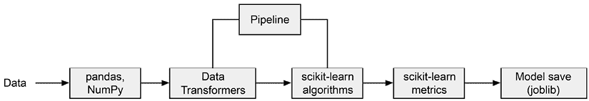
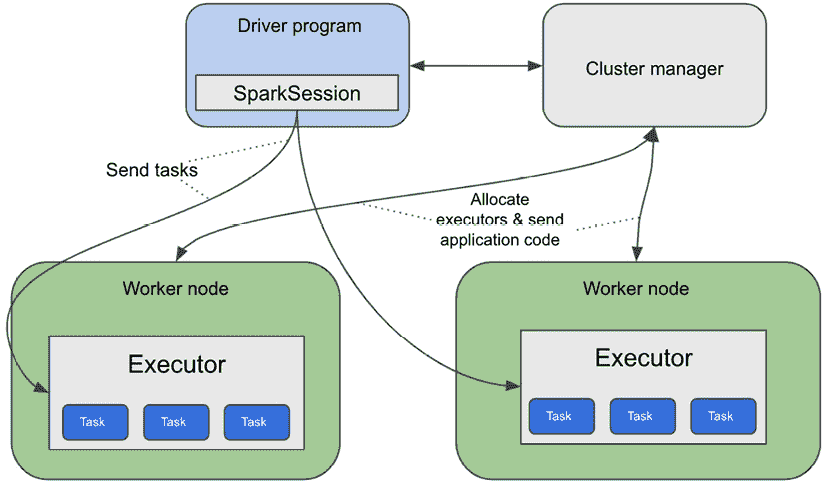
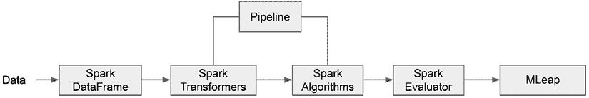
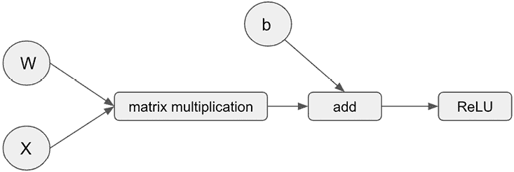
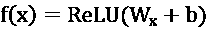
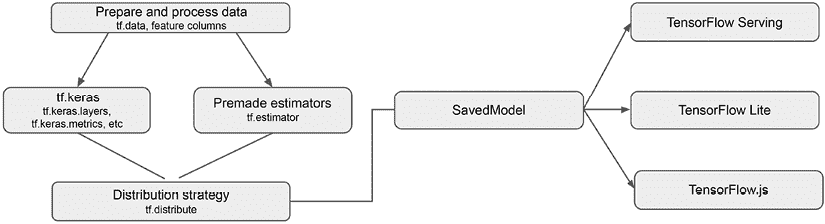
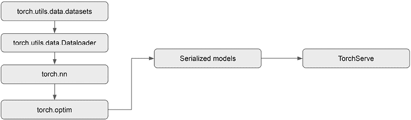

# 5

# 探索开源机器学习库

可用的机器学习（**ML**）和数据科学技术种类繁多，包括开源和商业产品。在构建机器学习平台时，不同组织采取了不同的方法。一些组织选择了内部团队，利用开源技术栈，以实现更大的灵活性和定制化。其他组织则选择了商业产品，专注于解决特定的商业和数据挑战。此外，一些组织采用了混合架构，结合开源和商业工具，以利用两者的优势。作为一名机器学习解决方案架构师，了解可用的开源机器学习技术及其在构建稳健机器学习解决方案中的应用至关重要。

在接下来的章节中，我们的重点将在于探索用于实验、模型构建和机器学习平台开发的不同的开源技术。在本章中，我们将深入探讨包括 scikit-learn、Spark、TensorFlow 和 PyTorch 在内的流行机器学习库。我们将检查这些库的核心功能，并展示它们如何在机器学习项目生命周期的各个阶段有效利用，包括数据处理、模型开发和模型评估等任务。此外，您将有机会参与动手练习，通过这些机器学习库及其在训练模型中的应用获得实践经验。

具体来说，我们将涵盖以下主要主题：

+   开源机器学习库的核心功能

+   理解 scikit-learn 机器学习库

+   理解 Apache Spark 机器学习库

+   理解 TensorFlow 机器学习库和动手实验室

+   理解 PyTorch 机器学习库和动手实验室

+   如何在 TensorFlow 和 PyTorch 之间进行选择

# 技术要求

在本章中，您需要访问您已从第三章“探索机器学习算法”中安装的**Jupyter**环境的本地机器。

您可以在[`github.com/PacktPublishing/The-Machine-Learning-Solutions-Architect-and-Risk-Management-Handbook-Second-Edition/tree/main/Chapter05`](https://github.com/PacktPublishing/The-Machine-Learning-Solutions-Architect-and-Risk-Management-Handbook-Second-Edition/tree/main/Chapter05)找到本章中使用的代码示例。

# 开源机器学习库的核心功能

机器学习库是设计用来促进机器学习算法和技术实现的软件库。虽然它们与其他软件库有相似之处，但它们与众不同的地方在于它们对各种机器学习功能的专门支持。这些库通常通过不同的子包提供一系列功能，包括：

+   **数据处理和加工**：这包括对不同数据任务的支持，例如加载不同格式的数据、数据处理、数据分析、数据可视化、数据转换和特征提取。

+   **模型构建和训练**：这包括对内置机器学习算法的支持以及构建适用于广泛机器学习任务的定制算法的能力。大多数机器学习库还提供了对常用损失函数（如均方误差或交叉熵）和一系列优化器（如梯度下降、Adam 等）的支持，用户可以从中选择。一些库还提供了对跨多个 CPU/GPU 设备或计算节点进行分布式模型训练的高级支持。

+   **模型评估和验证**：这包括用于评估训练模型性能的包，例如模型准确率、精确率、召回率或错误率。

+   **模型保存和加载**：这包括将模型保存到各种格式以实现持久化的支持，以及将保存的模型加载到内存中进行预测的支持。

+   **模型服务**：这包括模型服务功能，用于通过 API（通常是 RESTful API 网络服务）暴露训练好的机器学习模型。

+   **解释**：这包括解释模型预测和特征重要性的功能。

机器学习库通常支持多种编程语言，包括 Python、Java 和 Scala 等流行选项，以满足多样化的用户需求。特别是 Python 已经成为机器学习领域的一个突出语言，许多库为其接口提供了广泛的支持。尽管用户界面通常是用 Python 实现的，但这些库的后端和底层算法主要用编译语言（如 C++和 Cython）编写。这种组合允许在模型训练和推理过程中实现高效和优化的性能。在接下来的章节中，我们将深入了解一些广泛使用的机器学习库，以更深入地了解其功能和能力，从广泛使用的机器学习库 scikit-learn 开始。

# 理解 scikit-learn 机器学习库

scikit-learn（[`scikit-learn.org/`](https://scikit-learn.org/））是一个用于 Python 的开源机器学习库。最初于 2007 年发布，它是解决许多机器学习任务（如分类、回归、聚类和降维）中最受欢迎的机器学习库之一。scikit-learn 被不同行业的公司以及学术界广泛用于解决现实世界的业务案例，例如客户流失预测、客户细分、推荐和欺诈检测。

scikit-learn 主要建立在三个基础库之上：**NumPy**、**SciPy**和**Matplotlib**：

+   NumPy 是一个基于 Python 的库，用于管理大型多维数组和矩阵，并提供了额外的数学函数来操作数组和矩阵。

+   SciPy 提供了科学计算功能，例如优化、线性代数和傅里叶变换。

+   Matplotlib 用于数据可视化中的数据绘图。

总的来说，scikit-learn 是一系列常见数据处理和模型构建任务的充足且有效的工具。

## 安装 scikit-learn

您可以轻松地在 macOS、Windows 和 Linux 等不同操作系统上安装 scikit-learn 包。scikit-learn 库包托管在 **Python 包索引** 网站上 ([https://pypi.org/](https://pypi.org/)) 和 **Anaconda** 包仓库 ([`anaconda.org/anaconda/repo`](https://anaconda.org/anaconda/repo))。要在您的环境中安装它，您可以使用 `pip` 包管理器或 **Conda** 包管理器。包管理器允许您在操作系统中安装和管理库包的安装。

要使用 `pip` 或 Conda 包管理器安装 `scikit-learn` 库，您可以简单地运行 `pip install -U scikit-learn` 从 PyPI 索引安装，或者如果您想使用 Conda 环境，则运行 `conda install scikit-learn`。您可以在 [`pip.pypa.io/`](https://pip.pypa.io/) 学习更多关于 `pip` 的信息，以及 [`docs.conda.io`](http://docs.conda.io) 学习更多关于 Conda 的信息。

## scikit-learn 的核心组件

scikit-learn 库为机器学习生命周期的各个阶段提供了广泛的 Python 类和功能。它由几个主要组件组成，如下面的图所示。通过利用这些组件，您可以构建机器学习管道并执行分类、回归和聚类等任务。



图 5.1：scikit-learn 组件

现在，让我们深入了解这些组件如何支持机器学习生命周期的不同阶段：

+   **准备数据**：对于数据处理，通常使用 `pandas` 库。它提供了核心数据加载和保存功能，以及数据选择、数据排列和数据统计摘要等数据操作实用工具。`pandas` 是建立在 NumPy 之上的。`pandas` 库还包含一些可视化功能，如饼图、散点图和箱线图。

    scikit-learn 提供了一系列用于数据处理和转换的转换器，例如填充缺失值、编码分类值、归一化和文本和图像的特征提取。您可以在 [`scikit-learn.org/stable/data_transforms.html`](https://scikit-learn.org/stable/data_transforms.html) 找到完整的转换器列表。此外，您还可以灵活地创建自定义转换器。

+   **模型训练**：`scikit-learn`提供了一系列机器学习算法（也称为估计器），用于分类和回归（例如，逻辑回归、k-最近邻和随机森林），以及聚类（例如，k-均值）。您可以在[`scikit-learn.org/stable/index.html`](https://scikit-learn.org/stable/index.html)找到算法的完整列表。以下示例代码展示了使用`RandomForestClassifier`算法通过标记的训练数据集训练模型的语法：

    ```py
    from sklearn.ensemble import RandomForestClassifier
    model = RandomForestClassifier (
      max_depth, max_features, n_estimators
    )
    model.fit(train_X, train_y) 
    ```

+   **模型评估**：scikit-learn 提供了超参数调整和交叉验证的实用工具，以及用于模型评估的`metrics`类。您可以在[`scikit-learn.org/stable/model_selection.html`](https://scikit-learn.org/stable/model_selection.html)找到模型选择和评估工具的完整列表。以下示例代码展示了用于评估分类模型准确性的`accuracy_score`类：

    ```py
    from sklearn.metrics import accuracy_score
    acc = accuracy_score (true_label, predicted_label) 
    ```

    **超参数调整**涉及优化机器学习模型的配置设置（超参数），以提高其性能并在给定的任务或数据集上获得更好的结果。交叉验证是一种统计技术，通过将数据集分成多个子集，在不同的组合上训练模型，并在每个子集上评估其性能，来评估机器学习模型的表现和泛化能力。

+   **模型保存**：scikit-learn 可以使用 Python 对象序列化（`pickle`或`joblib`）保存模型工件。序列化的`pickle`文件可以加载到内存中进行预测。以下示例代码展示了使用`joblib`类保存模型的语法：

    ```py
    import joblib
    joblib.dump(model, "saved_model_name.joblib") 
    ```

+   **管道**：scikit-learn 还提供了一个管道实用工具，可以将不同的转换器和估计器串联为一个单一的处理管道，并且它可以作为一个单一单元重用。这在您需要预处理数据以进行建模训练和模型预测时特别有用，因为两者都需要以相同的方式处理数据：

    ```py
    from sklearn.pipeline import Pipeline
    from sklearn.preprocessing import StandardScaler
    from sklearn.ensemble import RandomForestClassifier
    pipe = Pipeline([('scaler', StandardScaler()), (RF, RandomForestClassifier())])
    pipe.fit(X_train, y_train) 
    ```

如所示，使用 scikit-learn 开始实验和构建机器学习模型非常简单。scikit-learn 特别适合在单台机器上执行的典型回归、分类和聚类任务。然而，如果您正在处理大量数据集或需要在多台机器上执行分布式训练，除非算法支持增量训练，如`SGDRegressor`，否则 scikit-learn 可能不是最佳选择。因此，接下来，让我们探索在大型模型训练场景中表现卓越的其他机器学习库。

**增量训练**是一种机器学习方法，其中模型随着新数据的可用性而持续更新和优化，使模型能够适应不断变化的模式并在时间上提高其性能。

# 理解 Apache Spark ML 库

Apache Spark 是一个用于分布式数据处理的高级框架，旨在处理大规模数据处理任务。凭借其分布式计算能力，Spark 通过利用内存计算，使应用程序能够高效地在机器集群上加载和处理数据，从而显著减少处理时间。

从架构上讲，一个 Spark 集群由一个主节点和用于运行不同 Spark 应用的工作节点组成。在 Spark 集群中运行的每个应用程序都有一个驱动程序和自己的进程集，这些进程由驱动程序中的 **SparkSession** 对象协调。驱动程序中的 `SparkSession` 对象连接到集群管理器（例如 Mesos、Yarn、Kubernetes 或 Spark 的独立集群管理器），该管理器负责为 Spark 应用程序在集群中分配资源。具体来说，集群管理器在工作节点上获取称为 **执行器** 的资源来运行计算和存储 Spark 应用程序的数据。执行器配置了诸如 CPU 核心和内存等资源以满足任务处理需求。一旦分配了执行器，集群管理器将应用程序代码（Java JAR 或 Python 文件）发送到执行器。最后，`SparkContext` 将任务发送到执行器以运行。以下图显示了驱动程序程序如何与集群管理器和执行器交互以运行任务：



图 5.2：在 Spark 集群上运行 Spark 应用程序

每个 Spark 应用程序都有一组自己的执行器，这些执行器在整个应用程序运行期间保持活跃。不同应用程序的执行器彼此隔离，并且它们只能通过外部数据存储来共享数据。

Spark 的机器学习包称为 MLlib，它运行在分布式 Spark 架构之上。它能够处理和训练不适合单台机器内存的大型数据集。它提供了包括 Python、Java、Scala 和 R 在内的不同编程语言的 API。从结构角度来看，它在核心组件和模型开发流程方面与 scikit-learn 库非常相似。

Spark 在各个行业中高度流行，并被不同规模的公司采用。像 **Netflix**、**Uber** 和 **Pinterest** 这样的大公司使用 Spark 进行大规模数据处理和转换，以及运行机器学习模型。

## 安装 Spark ML

Spark ML 库作为 Spark 安装的一部分包含在内。PySpark 是 Spark 的 Python API，可以使用 `pip`（`pip install pyspark`）像常规 Python 包一样安装。请注意，在安装 PySpark 之前，需要在机器上安装 Java 和 Python。您可以在 [`spark.apache.org/docs/latest/`](https://spark.apache.org/docs/latest/) 找到 Spark 的安装说明。

## Spark ML 库的核心组件

与 scikit-learn 库类似，Spark 和 Spark ML 提供了从数据准备到模型评估和模型持久化的完整功能范围来构建机器学习模型。以下图表展示了 Spark 中可用于构建机器学习模型的核心组件：



图 5.3：Spark ML 的核心组件

让我们更详细地看看 Spark 和 Spark ML 库包支持的核心功能：

+   **数据准备**：Spark 支持 Spark DataFrame，这是一种分布式数据集合，可用于数据连接、聚合、过滤和其他数据操作需求。从概念上讲，Spark DataFrame 相当于关系数据库中的一个表。Spark DataFrame 可以在多台机器上分布式（即分区），这允许并行快速数据处理。Spark DataFrame 还基于一个称为懒执行模型。**懒执行**定义了一组转换（例如，添加列或过滤列）和转换仅在需要执行动作（例如，计算列的最小/最大值）时执行。这允许为不同的转换和动作生成执行计划以优化执行性能。

    要开始使用 Spark 功能，您需要创建一个 Spark 会话。Spark 会话创建一个`SparkContext`对象，这是访问 Spark 功能的入口点。以下示例代码展示了如何创建 Spark 会话：

    ```py
    from pyspark.sql import SparkSession
    spark = SparkSession.builder.appName('appname').getOrCreate() 
    ```

    Spark DataFrame 可以从许多不同的来源构建，例如结构化数据文件（例如，CSV 或 JSON）和外部数据库。以下代码示例将 CSV 文件读取到 Spark DataFrame 中：

    ```py
    dataFrame = spark.read.format('csv').load(file_path) 
    ```

    Spark 基于不同的数据处理需求提供了许多数据转换和处理的转换器，例如`Tokenizer`（将文本分解成单个单词）和`StandardScalar`（将特征归一化到单位偏差和/或零均值）。您可以在[`spark.apache.org/docs/2.1.0/ml-features.html`](https://spark.apache.org/docs/2.1.0/ml-features.html)找到支持的转换器列表。

    要使用转换器，首先必须使用函数参数（如`inputCol`和`outputCol`）初始化它，然后在包含数据的 DataFrame 上调用`fit()`函数，最后调用`transform()`函数来转换 DataFrame 中的特征：

    ```py
    from pyspark.ml.feature import StandardScaler
    scaler = StandardScaler(inputCol="features",  outputCol="scaledFeatures", withStd=True, withMean=False)
    scalerModel = scaler.fit(dataFrame)
    scaledData = scalerModel.transform(dataFrame) 
    ```

+   **模型训练**：Spark ML 支持广泛的机器学习算法，包括分类、回归、聚类、推荐和主题建模。您可以在[`spark.apache.org/docs/1.4.1/mllib-guide.html`](https://spark.apache.org/docs/1.4.1/mllib-guide.html)找到 Spark ML 算法的列表。以下代码示例展示了如何训练一个逻辑回归模型：

    ```py
    from pyspark.ml.classification import LogisticRegression
    lr_algo = LogisticRegression(
      maxIter regParam, elasticNetParam
    )
    lr_model = lr_algo.fit(dataFrame) 
    ```

+   **模型评估**：对于模型选择和评估，Spark ML 提供了交叉验证、超参数调整和模型评估指标的工具。您可以在[`spark.apache.org/docs/latest/api/python/reference/api/pyspark.ml.evaluation.MulticlassClassificationEvaluator.html`](https://spark.apache.org/docs/latest/api/python/reference/api/pyspark.ml.evaluation.MulticlassClassificationEvaluator.html)找到评估器的列表。以下代码块展示了如何使用`BinaryClassificationEvaluator`和`areaUnderPR`指标来评估模型：

    ```py
    From pyspark.ml.evaluation import BinaryClassificationEvaluator
    dataset = spark.createDataFrame(scoreAndLabels, ["raw", "label"])
    evaluator = BinaryClassificationEvaluator()
    evaluator.setRawPredictionCol("raw")
    evaluator.evaluate(dataset)
    evaluator.evaluate(dataset, {evaluator.metricName: "areaUnderPR"}) 
    ```

+   **管道**：Spark ML 也支持管道概念，类似于 scikit-learn。使用管道概念，你可以将一系列转换和模型训练步骤作为一个统一的可重复步骤进行排序：

    ```py
    from pyspark.ml import Pipeline
    from pyspark.ml.classification import LogisticRegression
    from pyspark.ml.feature import HashingTF, Tokenizer
    lr_tokenizer = Tokenizer(inputCol, outputCol)
    lr_hashingTF = HashingTF(inputCol=tokenizer.getOutputCol(), outputCol)
    lr_algo = LogisticRegression(maxIter, regParam)
    lr_pipeline = Pipeline(stages=[lr_tokenizer, lr_hashingTF, lr_algo])
    lr_model = lr_pipeline.fit(training) 
    ```

+   **模型保存**：Spark ML 管道可以被序列化为一种称为 Mleap bundle 的序列化格式，这是 Spark 的一个外部库。序列化的 Mleap bundle 可以被反序列化回 Spark 进行批量评分或 Mleap 运行时来运行实时 API。您可以在[`combust.github.io/mleap-docs/`](https://combust.github.io/mleap-docs/)找到有关 Mleap 的更多详细信息。以下代码展示了将 Spark 模型序列化为 Mleap 格式的语法：

    ```py
    import mleap.pyspark
    from pyspark.ml import Pipeline, PipelineModel
    lr_model.serializeToBundle("saved_file_path", lr_model.transform(dataframe)) 
    ```

Spark 是一个多功能的框架，它使大规模数据处理和机器学习成为可能。虽然它在传统的机器学习任务中表现出色，但它也提供了对神经网络训练的有限支持，包括多层感知器算法。然而，为了更全面的深度学习功能，我们将在接下来的章节中探讨专门的机器学习库，包括 TensorFlow 和 PyTorch。

# 理解 TensorFlow 深度学习库

TensorFlow 最初于 2015 年发布，是一个流行的开源机器学习库，主要由谷歌支持，主要用于深度学习。TensorFlow 已被各种规模的公司用于训练和构建用于各种用例的最先进的深度学习模型，包括计算机视觉、语音识别、问答、文本摘要、预测和机器人技术。

TensorFlow 基于计算图的概念工作，其中数据通过表示数学运算的节点流动。核心思想是构建一个操作和张量的图，其中张量是*n*-维数组，携带数据。张量的一个例子可以是标量值（例如，`1.0`），一维向量（例如，`[1.0, 2.0, 3.0]`），二维矩阵（例如，`[[1.0, 2.0, 3.0]`, `[4.0, 5.0, 6.0]]`），甚至是更高维度的矩阵。在这些张量上执行操作，允许进行数学计算，如加法或矩阵乘法。以下图显示了执行一系列数学操作的张量示例计算图：



图 5.4：数据流图

在前面的计算图中，矩形节点是数学运算，而圆圈代表张量。这个特定的图表展示了执行人工神经元张量运算的计算图，即执行 *W* 和 *X* 的矩阵乘法，然后加上 *b*，最后应用 *ReLU* 动作函数。等效的数学公式如下：



TensorFlow 允许用户通过其高级 API 或直接与底层组件交互来定义和操作计算图。这种灵活性使得研究人员和开发者能够创建复杂的模型和算法。此外，TensorFlow 支持分布式计算，允许图在多个设备或机器上执行，这对于处理大规模机器学习任务至关重要。这种分布式架构使得 TensorFlow 能够利用集群或 GPU 的力量来加速深度学习模型的训练和推理。

## 安装 TensorFlow

可以使用基于 Python 的环境中的 `pip install --upgrade tensorflow` 命令来安装 TensorFlow。安装后，TensorFlow 可以像任何其他 Python 库包一样使用。

## TensorFlow 的核心组件

TensorFlow 库为不同的机器学习步骤提供了丰富的功能，从数据准备到模型部署。以下图表展示了 TensorFlow 库的核心构建模块：



图 5.5：TensorFlow 组件

使用 TensorFlow 2.x 训练机器学习模型涉及以下主要步骤：

1.  **准备数据集**：TensorFlow 2.x 提供了一个 `tf.data` 库，用于高效地从源（如文件）加载数据，转换数据（如更改数据集的值），以及设置用于训练的数据集（如配置批量大小或数据预取）。这些数据类提供了将数据传递给训练算法以优化模型训练的高效方式。TensorFlow 的 **Keras** API 还提供了一系列内置类（MNIST、CIFAR、IMDB、MNIST Fashion 和 Reuters Newswire），用于构建简单的深度学习模型。您还可以将 NumPy 数组或 Python 生成器（一个类似迭代器的函数）馈送到 TensorFlow 中的模型进行模型训练，但 `tf.data` 是推荐的方法。

1.  **定义神经网络**：TensorFlow 2.x 提供了多种使用或构建神经网络进行模型训练的方法。您可以使用预制的估计器（如`tf.estimator`类的`DNNRegressor`和`DNNClassifier`）来训练模型。或者，您可以使用`tf.keras`类创建自定义神经网络，该类提供了一系列原语，如`tf.keras.layers`用于构建神经网络层，以及`tf.keras.activation`如 ReLU、**Sigmoid**和**Softmax**用于构建神经网络。Softmax 通常用作多类问题的神经网络最后一个输出，它接受一个实数向量（正数和负数）作为输入，并将向量归一化为概率分布，以表示不同类别标签的概率，例如不同类型的手写数字。对于二元分类问题，通常使用 Sigmoid，它返回介于 0 和 1 之间的值。

1.  **定义损失函数**：TensorFlow 2.x 提供了内置的损失函数列表，例如用于回归任务的**均方误差**（MSE）和**平均绝对误差**（MAE），以及用于分类任务的交叉熵损失。您可以在[`en.wikipedia.org/wiki/Mean_squared_error`](https://en.wikipedia.org/wiki/Mean_squared_error)和[`en.wikipedia.org/wiki/Mean_absolute_error`](https://en.wikipedia.org/wiki/Mean_absolute_error)找到关于 MSE 和 MAE 的更多详细信息。您可以在`tf.keras.losses`类中找到支持的损失函数列表。有关不同损失函数的更多详细信息，请参阅[`keras.io/api/losses/`](https://keras.io/api/losses/)。如果内置的损失函数不能满足需求，还可以定义自定义损失函数。

1.  **选择优化器**：TensorFlow 2.x 的`tf.keras.optimizers`类提供了一系列内置的优化器，例如用于参数优化的**Adam**优化器和**随机梯度下降**（SGD）优化器。您可以在[`keras.io/api/optimizers/`](https://keras.io/api/optimizers/)找到关于不同支持的优化器的更多详细信息。Adam 和 SGD 是最常用的优化器之一。

1.  **选择评估指标**：TensorFlow 2.x 的`tf.keras.metrics`类提供了一系列内置的模型评估指标（例如准确率和交叉熵），用于模型训练评估。您还可以在训练期间为模型评估定义自定义指标。

1.  **将网络编译成模型**：此步骤将定义的网络、定义的损失函数、优化器和评估指标编译成一个准备进行模型训练的计算图。

1.  **模型拟合**：此步骤通过将数据通过批次和多个 epoch 传递到计算图中来启动模型训练过程，以优化模型参数。

1.  **评估训练好的模型**：一旦模型训练完成，您可以使用`evaluate()`函数对测试数据进行模型评估。

1.  **保存模型**：模型可以保存为 TensorFlow 的**SavedModel**序列化格式或**层次数据格式**（**HDF5**）格式。

1.  **模型服务**：TensorFlow 附带了一个名为 TensorFlow Serving 的模型服务框架，我们将在*第七章*，*开源机器学习平台*中更详细地介绍。

TensorFlow 库旨在用于大规模生产级数据处理和模型训练。因此，它提供了在服务器集群上对大型数据集进行大规模分布式数据处理和模型训练的能力。我们将在*第十章*，*高级机器学习工程*中更详细地介绍大规模分布式数据处理和模型训练。

为了支持构建和部署机器学习管道的完整流程，TensorFlow 提供了**TensorFlow Extended**（**TFX**）。TFX 集成了 TensorFlow 生态系统中的多个组件和库，创建了一个用于数据摄取、数据验证、预处理、模型训练、模型评估和模型部署等任务的统一平台。其架构设计为模块化和可扩展，使用户能够根据其特定需求定制和扩展管道。您可以在[`www.tensorflow.org/tfx`](https://www.tensorflow.org/tfx)上获取更多关于 TFX 的详细信息。

TensorFlow 提供了一系列库和扩展，用于解决各种高级机器学习问题，包括联邦学习（使用去中心化数据进行模型训练）、模型优化（优化模型以部署和执行）和概率推理（使用概率论在不确定性下进行推理）。它还通过 TensorFlow Lite 组件为移动和边缘设备提供支持，并通过 TensorFlow.js 库为浏览器提供支持。

## 动手练习 - 训练 TensorFlow 模型

随着深度学习在最近机器学习进步中的主导地位，拥有一些深度学习框架的实践经验非常重要。在这个练习中，您将学习如何在您的本地 Jupyter 环境中安装 TensorFlow 库，并构建和训练一个简单的神经网络模型。启动您之前安装在机器上的 Jupyter 笔记本。如果您不记得如何做，请回顾*第三章*，*探索机器学习算法*中的*动手实验室*部分。

一旦 Jupyter 笔记本运行起来，通过选择**新建**下拉菜单然后**文件夹**来创建一个新的文件夹。将文件夹重命名为`TensorFlowLab`。打开`TensorFlowLab`文件夹，在此文件夹内创建一个新的笔记本，并将其重命名为`Tensorflow-lab1.ipynb`。现在，让我们开始吧：

1.  在第一个单元格中，运行以下代码来安装 TensorFlow。如*第三章*所述，`pip`是 Python 包安装工具：

    ```py
    ! pip3 install --upgrade tensorflow 
    ```

1.  现在，我们必须导入库并加载样本训练数据。我们将使用`keras`库内置的`fashion_mnist`数据集来完成此操作。接下来，我们必须将数据加载到`tf.data.Dataset`类中，然后调用其`batch()`函数来设置批大小。在新的单元格中运行以下代码块以加载数据并配置数据集：

    ```py
    import numpy as np
    import tensorflow as tf
    train, test = tf.keras.datasets.fashion_mnist.load_data()
    images, labels = train
    labels = labels.astype(np.int32)
    images = images/256  
    train_ds = tf.data.Dataset.from_tensor_slices((images, labels))
    train_ds = train_ds.batch(32) 
    ```

1.  让我们看看数据是什么样的。在新的单元格中运行以下代码块以查看样本数据。**Matplotlib**是一个 Python 可视化库，用于显示图像：

    ```py
    from matplotlib import pyplot as plt
    print ("label:" + str(labels[0]))
    pixels = images[0]
    plt.imshow(pixels, cmap='gray')
    plt.show() 
    ```

1.  接下来，我们构建一个简单的**多层感知器**（**MLP**）网络，包含两个隐藏层（一个包含`100`个节点，另一个包含`50`个节点）和一个包含`10`个节点的输出层（每个节点代表一个类别标签）。然后，我们必须使用**Adam**优化器编译网络，使用交叉熵损失作为优化目标，并使用准确度作为衡量指标。

    Adam 优化器是**梯度下降**（**GD**）的一种变体，它主要在自适应学习率更新参数以改善模型收敛方面改进 GD，而 GD 使用恒定的学习率进行参数更新。交叉熵衡量分类模型的性能，其中输出是不同类别的概率分布，总和为 1。当预测分布与实际类别标签偏离时，交叉熵误差会增加。

    要启动训练过程，我们必须调用`fit()`函数，这是此情况下的一个必要步骤。我们将运行 10 个 epoch 的训练。一个 epoch 是整个训练数据集的一次遍历。请注意，这里运行 10 个 epoch 只是为了说明目的。实际的数量将基于具体的训练作业和期望的模型性能：

    ```py
    model = tf.keras.Sequential([
       tf.keras.layers.Flatten(),
       tf.keras.layers.Dense(100, activation="relu"),
       tf.keras.layers.Dense(50, activation="relu"),
       tf.keras.layers.Dense(10),
       tf.keras.layers.Softmax()
    ])
    model.compile(optimizer='adam',
                  loss=tf.keras.losses.SparseCategoricalCrossentropy(),
                  metrics=[tf.keras.metrics.SparseCategoricalAccuracy()])
    model.fit(train_ds, epochs=10) 
    ```

    当模型正在训练时，你应该会看到每个 epoch 都会报告损失指标和准确度指标，以帮助理解训练作业的进度。

1.  现在模型已经训练完成，我们需要使用测试数据集来验证其性能。在下面的代码中，我们正在为测试数据创建一个`test_ds`：

    ```py
    images_test, labels_test = test
    labels_test = labels_test.astype(np.int32)
    images_test = images_test/256  

    test_ds = tf.data.Dataset.from_tensor_slices((images_test, labels_test))
    test_ds = train_ds.batch(32)
    test_ds = train_ds.shuffle(30)
    results = model.evaluate(test_ds)
    print("test loss, test acc:", results) 
    ```

1.  你也可以使用独立的`keras.metrics`来评估模型。在这里，我们正在获取预测结果，并使用`tf.keras.metrics.Accuracy`来计算与`test[1]`中真实值相比的预测准确度：

    ```py
    predictions = model.predict(test[0])
    predicted_labels = np.argmax(predictions, axis=1)
    m = tf.keras.metrics.Accuracy()
    m.update_state(predicted_labels, test[1])
    m.result().numpy() 
    ```

    你可能会注意到前一步和这一步的准确度指标略有不同。这是因为用于评估的数据集样本并不完全相同。

1.  要保存模型，请在新的单元格中运行以下代码。它将以`SavedModel`序列化格式保存模型：

    ```py
    model.save("my_model.keras") 
    ```

1.  打开`model`目录。你应该会看到生成了几个文件，例如`saved_model.pb`，以及`variables`子目录下的几个文件。

干得好！您已成功在本地 Jupyter 环境中安装了 TensorFlow 包并完成了深度学习模型的训练。通过这个过程，您现在已经掌握了 TensorFlow 及其在训练深度学习模型方面的能力。让我们将注意力转向 PyTorch，这是另一个广泛使用且备受推崇的深度学习库，它在实验和生产级机器学习模型训练方面都表现出色。

# 理解 PyTorch 深度学习库

PyTorch 是一个开源的机器学习库，旨在使用 GPU 和 CPU 进行深度学习。最初于 2016 年发布，它是一个高度流行的机器学习框架，拥有庞大的追随者和众多采用者。许多科技公司，包括像**Facebook**、**Microsoft**和**Airbnb**这样的科技巨头，都在广泛的深度学习用例中大量使用 PyTorch，例如计算机视觉和**自然语言处理**（**NLP**）。

PyTorch 在性能（使用 C++后端）和易用性之间取得了良好的平衡，默认支持动态计算图和与 Python 生态系统的互操作性。例如，使用 PyTorch，您可以轻松地在 NumPy 数组和 PyTorch 张量之间进行转换。为了便于反向传播，PyTorch 内置了对自动计算梯度的支持，这对于基于梯度的模型优化是必不可少的。

PyTorch 库由几个关键模块组成，包括张量、**autograd**、**optimizer**和**neural network**。张量用于存储和操作多维数组。您可以对张量执行各种操作，如矩阵乘法、转置、返回最大值和维度操作。PyTorch 通过其 Autograd 模块支持自动梯度计算。在执行正向传播时，Autograd 模块同时构建一个计算梯度的函数。Optimizer 模块提供了 SGD 和 Adam 等算法，用于更新模型参数。神经网络模块提供了表示神经网络不同层的模块，如线性层、嵌入层和 dropout 层。它还提供了一组常用的损失函数列表，这些函数常用于训练深度学习模型。

## 安装 PyTorch

PyTorch 可以在不同的操作系统上运行，包括 Linux、Mac 和 Windows。您可以通过访问[`pytorch.org/`](https://pytorch.org/)上的说明来在您的环境中安装它。例如，您可以使用`pip install torch`命令在基于 Python 的环境中安装它。

## PyTorch 的核心组件

与 TensorFlow 类似，PyTorch 也支持端到端的机器学习工作流程，从数据准备到模型部署。以下图表显示了不同的 PyTorch 模块用于训练和部署 PyTorch 模型：



图 5.6：PyTorch 用于模型训练和服务的模块

训练深度学习模型涉及的步骤与 TensorFlow 模型训练的步骤非常相似。我们将在以下步骤中查看 PyTorch 特有的细节：

1.  **准备数据集**：PyTorch 提供了两个用于数据集和数据加载管理的原语：`torch.utils.data.Dataset`和`torch.utils.data.Dataloader`。`Dataset`存储数据样本及其对应的标签，而`Dataloader`包装数据集，为模型训练提供方便和高效的数据访问。`Dataloader`提供了如`shuffle`、`batch_size`和`prefetch_factor`等函数来控制数据的加载和提供给训练算法的方式。此外，由于数据集中的数据在训练之前可能需要转换，`Dataset`允许您使用用户定义的函数来转换数据。

1.  **定义神经网络**：PyTorch 通过其`torch.nn`类提供了构建神经网络的抽象层，该类为不同的神经网络层（如线性层和卷积层）以及激活层（如 Sigmoid 和 ReLU）提供了内置支持。它还包含容器类，如`nn.Sequential`，用于将不同的层打包成一个完整的网络。现有的神经网络也可以加载到 PyTorch 中进行训练。

1.  **定义损失函数**：PyTorch 在其`torch.nn`类中提供了多个内置的损失函数，例如`nn.MSELoss`和`nn.CrossEntropyLoss`。

1.  **选择优化器**：PyTorch 通过其`nn.optim`类提供了多个优化器。优化器的例子包括`optim.SGD`、`optim.Adam`和`optim.RMSProp`。所有优化器都有一个`step()`函数，用于在每个前向传递中更新模型参数。还有一个反向传递，用于计算梯度。

1.  **选择评估指标**：PyTorch 的`ignite.metrics`类提供了多个评估指标，例如精确度、召回率和`RootMeanSquaredError`，用于评估模型性能。您可以在[`en.wikipedia.org/wiki/Precision_and_recall`](https://en.wikipedia.org/wiki/Precision_and_recall)上了解更多关于精确度和召回率的信息。您还可以使用 scikit-learn 指标库来帮助评估模型。

1.  **训练模型**：在 PyTorch 中训练模型涉及每个训练循环中的三个主要步骤：前向传递训练数据，反向传递训练数据以计算梯度，并执行优化器步骤以更新梯度。

1.  **保存/加载模型**：`torch.save()`函数以序列化的`pickle`格式保存模型。`torch.load()`函数将序列化的模型加载到内存中进行推理。常见的约定是使用`.pth`或`.pt`扩展名保存文件。您还可以将多个模型保存到单个文件中。

1.  **模型服务**：PyTorch 附带一个名为 TorchServe 的模型服务库，我们将在第七章“开源机器学习平台”中更详细地介绍。

PyTorch 库支持大规模分布式数据处理和模型训练，我们将在第十章“高级机器学习工程”中更详细地介绍。像 TensorFlow 一样，PyTorch 也提供了一套广泛的库包，用于解决各种机器学习问题，包括机器学习隐私、对抗鲁棒性、视频理解和药物发现。

现在你已经了解了 PyTorch 的基础知识，让我们通过一个简单的练习来动手实践。

## 动手练习 - 构建和训练 PyTorch 模型

在这个动手练习中，你将学习如何在你的本地机器上安装 PyTorch 库，并使用 PyTorch 训练一个简单的深度学习模型。启动你之前安装在本机的 Jupyter 笔记本。如果你不记得如何做，请访问第三章“探索机器学习算法”中的*动手实验室*部分。现在，让我们开始吧：

1.  在你的 Jupyter 笔记本环境中创建一个名为`pytorch-lab`的新文件夹，并创建一个名为`pytorch-lab1.ipynb`的新笔记本文件。在一个单元中运行以下命令来安装 PyTorch 和`torchvision`包。`torchvision`包含一系列计算机视觉模型和数据集。我们将使用`torchvision`包中的预构建 MNIST 数据集来完成这个练习：

    ```py
    !pip3 install torch
    !pip3 install torchvision 
    ```

1.  以下示例代码显示了之前提到的主组件。请确保在每个单独的 Jupyter 笔记本单元中运行每个代码块，以获得最佳的可读性。

    首先，我们必须导入必要的库包，并从`torchvision`数据集类中加载 MNIST 数据集：

    ```py
    import numpy as np
    import matplotlib.pyplot as plt
    import torch
    from torchvision import datasets, transforms
    from torch import nn, optim
    transform = transforms.Compose([transforms.ToTensor(), transforms.Normalize((0.5,), (0.5,),)])
    trainset = datasets.MNIST('pytorch_data/train/', download=True, train=True, transform=transform)
    valset = datasets.MNIST('pytorch_data/test/', download=True, train=False, transform=transform)
    trainloader = torch.utils.data.DataLoader(trainset, batch_size=64, shuffle=True) 
    ```

1.  接下来，我们必须构建一个用于分类的多层感知器（MLP）神经网络。这个 MLP 网络有两个隐藏层，第一层和第二层使用 ReLU 激活函数。MLP 模型接受`784`大小的输入，这是 28x28 图像的展平维度。第一隐藏层有`128`个节点（神经元），而第二层有`64`个节点（神经元）。最终层有`10`个节点，因为我们有 10 个类别标签：

    ```py
    model = nn.Sequential(nn.Linear(784, 128),
                          nn.ReLU(),
                          nn.Linear(128, 64),
                          nn.ReLU(),
                          nn.Linear(64, 10)) 
    ```

1.  下面是图像数据的示例：

    ```py
    images, labels = next(iter(trainloader))
    pixels = images[0][0]
    plt.imshow(pixels, cmap='gray')
    plt.show() 
    ```

1.  现在，我们必须为训练过程定义一个**交叉熵损失函数**，因为我们想测量所有标签的概率分布中的误差。在内部，PyTorch 的`CrossEntropyLoss`自动将`softmax`应用于网络输出，以计算不同类别的概率分布。对于优化器，我们选择了学习率为`0.003`的 Adam 优化器。`view()`函数将二维输入数组（28x28）展平成一维向量，因为我们的神经网络接受一维向量输入：

    ```py
    criterion = nn.CrossEntropyLoss()
    images = images.view(images.shape[0], -1)
    output = model(images)
    loss = criterion(output, labels)
    optimizer = optim.Adam(model.parameters(), lr=0.003) 
    ```

    学习率是决定优化过程中步长大小的一个超参数。

1.  现在，让我们开始训练过程。我们将运行 `15` 个纪元。与 TensorFlow Keras API 不同，在那里你只需调用一个 `fit()` 函数来开始训练，PyTorch 需要你构建一个训练循环，并特别运行正向传递（`model (images)`），运行反向传递以学习（`loss.backward()`），更新模型权重（`optimizer.step()`），然后计算总损失和平均损失。对于每个训练步骤，`trainloader` 返回一个批次（批次大小为 `64`）的训练数据样本。每个训练样本被展平成一个 784 个元素的向量。优化器在每个训练步骤中用零重置：

    ```py
    epochs = 15
    for e in range(epochs):
        running_loss = 0
    for images, labels in trainloader:
            images = images.view(images.shape[0], -1)
            optimizer.zero_grad()
            output = model(images)
            loss = criterion(output, labels)
            loss.backward()
            optimizer.step()
            running_loss += loss.item()
        else:
            print("Epoch {} - Training loss: {}".format(e, running_loss/len(trainloader))) 
    ```

    当训练代码运行时，它应该打印出每个纪元的平均损失。

1.  要使用验证数据测试准确度，我们必须将验证数据集通过训练模型运行，并使用 scikit-learn 的 `.metrics.accuracy_score()` 函数来计算模型的准确度：

    ```py
    valloader = torch.utils.data.DataLoader(valset, batch_size=valset.data.shape[0], shuffle=True)
    val_images, val_labels = next(iter(valloader))
    val_images = val_images.view(val_images.shape[0], -1)
    predictions = model (val_images)
    predicted_labels = np.argmax(predictions.detach().numpy(), axis=1)
    from sklearn.metrics import accuracy_score
    accuracy_score(val_labels.detach().numpy(), predicted_labels) 
    ```

1.  最后，我们必须将模型保存到文件中：

    ```py
    torch.save(model, './model/my_mnist_model.pt') 
    ```

恭喜！您已成功在本地 Jupyter 环境中安装 PyTorch 并训练了一个深度学习 PyTorch 模型。

# 如何在 TensorFlow 和 PyTorch 之间进行选择

TensorFlow 和 PyTorch 是深度学习领域中最受欢迎的两个框架。因此，一个相关的问题随之而来：一个人如何在这两个框架之间做出明智的选择？为了帮助回答这个问题，让我们对这些框架进行快速的比较分析：

+   **易用性**：PyTorch 通常被认为更易于使用且更符合 Python 风格。其控制流程感觉更接近原生 Python，PyTorch 的动态计算图比 TensorFlow 的静态图更容易调试和迭代。然而，TensorFlow 2.0 中的即时执行支持有助于缩小这一差距。PyTorch 也被认为比 TensorFlow 更面向对象。

+   **社区受欢迎程度**：这两个框架都享有坚实的社区支持，并且非常受欢迎。TensorFlow 最初领先；然而，根据 Google Trends 报告，PyTorch 在近年来在受欢迎程度上已经迎头赶上。PyTorch 在研究社区中更广泛地被采用，并在研究论文的实施中占据主导地位。

+   **模型可用性**：TensorFlow 有 TensorFlow Model Garden，它托管了一个使用 TensorFlow API 的模型集合，涵盖了各种机器学习任务，如计算机视觉、NLP 和推荐。它还提供了 TensorFlow Hub，它提供了一系列预训练模型，可用于部署或微调各种机器学习任务。同样，PyTorch 有 PyTorch Hub，这是一个集成到 PyTorch 中的库，提供了对广泛预训练模型的便捷访问，包括计算机视觉、NLP 等。

+   **部署**：这两个框架都适合机器学习模型的实际部署。TensorFlow 被认为拥有更全面的模型部署栈，包括 TensorFlow Serving、TensorFlow Lite 用于移动和边缘设备，以及 TensorFlow.js 用于浏览器部署。TensorFlow Extended 是一个端到端模型部署平台，包括模型验证、监控和解释。PyTorch 提供了用于 PyTorch 模型的模型服务框架 TorchServe，以及 PyTorch Mobile 用于在 iOS 和 Android 设备上部署模型。PyTorch 在部署过程中更依赖于第三方解决方案来实现端到端集成。

总结来说，这两个框架在整个机器学习生命周期中提供了可比的能力，适应了类似的使用案例。如果你的组织已经承诺使用 TensorFlow 或 PyTorch，建议继续执行该决定。然而，对于那些刚开始的人来说，PyTorch 可能由于其易用性而提供一个更易于入门的起点。

# 摘要

在本章中，我们探讨了几个流行的开源机器学习库包，包括 scikit-learn、Spark ML、TensorFlow 和 PyTorch。到目前为止，你应该对这些库的基本组件以及如何利用它们来训练机器学习模型有了很好的理解。此外，我们还深入探讨了 TensorFlow 和 PyTorch 框架，用于构建人工神经网络、训练深度学习模型并将这些模型保存到文件中。这些模型文件随后可以在模型服务环境中用于预测。

在下一章中，我们将深入探讨 Kubernetes 以及其在构建开源机器学习解决方案的基础设施中的作用。

# 加入我们的 Discord 社区

加入我们的 Discord 空间，与作者和其他读者进行讨论：

[`packt.link/mlsah`](https://packt.link/mlsah)


