# 6

# Kubernetes 容器编排基础设施管理

虽然为简单的机器学习任务建立个人使用的本地数据科学设置可能看起来很简单，但为多个用户创建一个强大且可扩展的数据科学环境（满足多样化的机器学习任务并有效跟踪机器学习实验）则面临着重大挑战。为了克服大量用户带来的可扩展性和控制挑战，公司通常实施机器学习平台。构建机器学习平台的方法有很多，包括使用开源技术自行构建或使用完全托管的云机器学习平台。

在本章中，我们将探讨开源选项，特别是 Kubernetes，这是一个不可或缺的开源容器编排平台，它是构建开源机器学习平台的关键基础。Kubernetes 提供了丰富的功能，能够无缝管理和编排大规模容器。通过利用 Kubernetes，组织可以高效地部署和管理机器学习工作负载，确保高可用性、可扩展性和资源利用率优化。

我们将深入研究 Kubernetes 的核心概念，了解其网络架构和基本组件。此外，我们还将探索其强大的安全特性和细粒度的访问控制机制，这对于保护机器学习环境和敏感数据至关重要。通过实际练习，你将有机会构建自己的 Kubernetes 集群，并利用其力量部署容器化应用程序。

具体来说，我们将涵盖以下主题：

+   容器简介

+   Kubernetes 概述和核心概念

+   Kubernetes 网络

+   Kubernetes 安全性和访问控制

+   实践实验室 - 在 AWS 上构建 Kubernetes 基础设施

# 技术要求

在本章的实践部分，你将继续使用 AWS 账户中的服务。我们将使用多个 AWS 服务，包括 AWS **弹性 Kubernetes 服务**（**EKS**）、AWS **CloudShell** 和 AWS **EC2**。本章中使用的所有代码文件都位于 GitHub 上：[`github.com/PacktPublishing/The-Machine-Learning-Solutions-Architect-and-Risk-Management-Handbook-Second-Edition/tree/main/Chapter06`](https://github.com/PacktPublishing/The-Machine-Learning-Solutions-Architect-and-Risk-Management-Handbook-Second-Edition/tree/main/Chapter06)。

# 容器简介

要理解 Kubernetes，我们首先需要了解容器，因为它们是 Kubernetes 的核心构建块。**容器**是一种操作系统虚拟化形式，并且是软件部署和基于微服务架构的现代软件的非常流行的计算平台。容器允许您将计算机软件打包并运行，同时具有隔离的依赖关系。与 Amazon EC2 或**VMware**虚拟机等服务器虚拟化相比，容器更轻量级、更便携，因为它们共享相同的操作系统，并且每个容器中不包含操作系统镜像。每个容器都有自己的文件系统、共享的计算资源以及运行在其内部的自定义应用程序的进程空间。

容器技术的概念可以追溯到 20 世纪 70 年代的**chroot 系统**和**Unix Version 7**。然而，在接下来的二十年里，容器技术在软件开发社区中并没有引起太多关注，一直处于休眠状态。虽然它在 2000 年到 2011 年期间取得了一些进展，但直到 2013 年**Docker**的引入才使容器技术迎来了复兴。

您可以在容器内运行各种应用程序，例如数据处理脚本等简单程序或数据库等复杂系统。以下图表说明了容器部署与其他类型部署的不同之处。在裸金属部署中，所有不同的应用程序共享相同的宿主操作系统。如果宿主操作系统出现问题，所有应用程序都会在同一台物理机器上受到影响。

在虚拟化部署中，多个虚拟操作系统可以共享相同的宿主操作系统。如果一个虚拟操作系统出现问题，只有在该虚拟操作系统上运行的应用程序会受到影響。每个虚拟操作系统都会有一个完整的安装，因此会消耗大量资源。在容器部署中，容器运行时在单个宿主操作系统上运行，允许共享一些公共资源，同时仍然为运行不同应用程序的不同环境提供隔离。容器比虚拟操作系统轻得多，因此资源效率更高，速度更快。请注意，容器运行时也可以在虚拟化环境的虚拟操作系统上运行，以托管容器化应用程序：

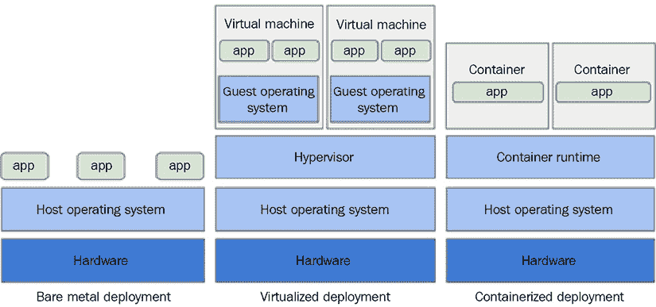

图 6.1：裸金属、虚拟化和容器部署之间的差异

容器被打包成 Docker 镜像，这些镜像包含了运行容器及其中的应用程序所必需的所有文件（例如安装文件、应用程序代码和依赖项）。构建 Docker 镜像的一种方法就是使用`Dockerfile` – 这是一个纯文本文件，它提供了如何构建 Docker 镜像的规范。一旦创建了 Docker 镜像，它就可以在容器运行时环境中执行。

以下是一个示例`Dockerfile`，用于构建基于**Ubuntu**操作系统（`FROM`指令）的运行环境，并安装各种**Python**包，如`python3`、`numpy`、`scikit-learn`和`pandas`（`RUN`指令）：

```py
FROM ubuntu:20.04
ENV DEBIAN_FRONTEND=noninteractive
RUN apt-get update && apt-get install -y --no-install-recommends \
wget \         
python3-pip \         
python3-dev \         
build-essential \         
libffi-dev \         
libssl-dev \         
nginx \         
ca-certificates \    
&& rm -rf /var/lib/apt/lists/*
RUN pip --no-cache-dir install numpy scipy scikit-learn pandas flask unicor 
```

要从此`Dockerfile`构建 Docker 镜像，你可以使用`Docker build - < Dockerfile`命令，这是一个作为 Docker 安装的一部分提供的实用工具。

现在我们已经了解了容器，接下来，让我们深入了解 Kubernetes。

# Kubernetes 及其核心概念概述

在计算环境中手动管理和编排少量容器和容器化应用程序相对容易管理。然而，随着容器和服务器数量的增加，这项任务变得越来越复杂。Kubernetes 应运而生，这是一个专门设计来应对这些挑战的强大开源系统。Kubernetes（通常简称为 K8s，由将“ubernete”替换为数字 8 而来）首次于 2014 年推出，为在服务器集群中高效管理大规模容器提供了一个全面的解决方案。

Kubernetes 遵循分布式架构，由一个主节点和服务器集群内的多个工作节点组成。在这里，服务器集群指的是 Kubernetes 管理的机器和资源集合，而节点是集群中的单个物理或虚拟机。

主节点，通常被称为控制平面，在管理整个 Kubernetes 集群中扮演主要角色。它接收有关内部集群事件、外部系统和第三方应用程序的数据，然后处理这些数据，并据此做出和执行决策。它由四个基本组件组成，每个组件在整体系统中都扮演着独特的角色：

+   **API 服务器**：API 服务器充当与 Kubernetes 集群所有交互的中心通信枢纽。它提供了一个 RESTful 接口，用户、管理员和其他组件可以通过该接口与集群交互。API 服务器处理请求的认证、授权和验证，确保对集群资源的访问既安全又受控。

+   **调度器**：调度器组件负责确定工作负载或 Pod 在集群内可用工作节点中的最佳放置位置。

+   **控制器**：控制器管理器负责监控集群的整体状态，并管理各种后台任务以维护所需的系统状态。

+   **etcd**：etcd 是一个分布式键值存储，作为集群的可靠数据存储，确保对关键配置和状态信息的持续和一致访问。它存储集群的当前状态、配置细节和其他必要数据，为整个系统提供可靠的真实来源。

最后，工作节点是运行容器化工作负载的机器。

下图展示了 Kubernetes 集群的核心理念组件：

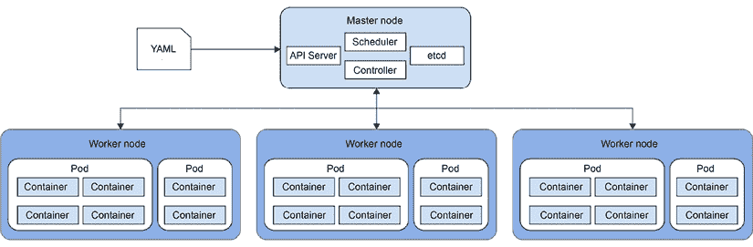

图 6.2：Kubernetes 架构

主节点暴露了 **API 服务器** 层，它允许对集群进行程序化控制。一个 API 调用的例子可能是将一个网络应用程序部署到集群中。控制平面还跟踪和管理所有配置数据在 **etcd** 中，它负责存储所有集群数据，例如要运行的容器镜像数量、计算资源规范以及运行在集群上的网络应用程序的存储卷大小。Kubernetes 使用 **控制器** 来监控 Kubernetes 资源当前的状态，并采取必要的行动（例如，通过 API 服务器请求更改）将当前状态移动到所需状态，如果两个状态之间存在差异（例如运行容器的数量差异），则进行操作。主节点中的控制器管理器负责管理所有的 Kubernetes 控制器。Kubernetes 随带一套内置控制器，例如 **调度器**，它负责在出现更改请求时将 **Pods**（部署的单位，我们将在后面详细讨论）调度到工作节点上。

其他例子包括 **作业控制器**，它负责运行和停止一个或多个 Pod 以完成任务，以及 **部署控制器**，它负责根据部署清单部署 Pods，例如网络应用程序的部署清单。

要与 Kubernetes 集群控制平面交互，你可以使用 `kubectl` 命令行工具、Kubernetes Python 客户端([`github.com/kubernetes-client/python`](https://github.com/kubernetes-client/python))，或者直接通过 RESTful API 访问。你可以在 [`kubernetes.io/docs/reference/kubectl/cheatsheet/`](https://kubernetes.io/docs/reference/kubectl/cheatsheet/) 找到支持的 `kubectl` 命令列表。

Kubernetes 架构的核心由几个基本的技术概念构成。这些概念对于理解和有效地使用 Kubernetes 是必不可少的。让我们详细看看一些关键概念。

## 命名空间

命名空间将工作机器集群组织成虚拟子集群。它们被用来提供不同团队和项目拥有的资源的逻辑分离，同时仍然允许不同命名空间之间的通信。命名空间可以跨越多个工作节点，并且可以用来将一组权限分组在单个名称下，以便授权用户访问命名空间中的资源。可以对命名空间实施资源使用控制，例如 CPU 和内存资源的配额。命名空间还使得当资源位于不同的命名空间中时，可以以相同的名称命名资源，以避免命名冲突。默认情况下，Kubernetes 中有一个 `default` 命名空间。根据需要，你可以创建额外的命名空间。如果没有指定命名空间，则使用默认命名空间。

## Pod

Kubernetes 以一个称为 Pod 的逻辑单元来部署计算。所有 Pod 必须属于一个 Kubernetes 命名空间（无论是默认命名空间还是指定的命名空间）。一个或多个容器可以被组合成一个 Pod，并且 Pod 中的所有容器作为一个单一单元一起部署和扩展，并共享相同的环境，例如 Linux 命名空间和文件系统。每个 Pod 都有一个唯一的 IP 地址，该地址由 Pod 中的所有容器共享。Pod 通常作为工作负载资源创建，例如 Kubernetes Deployment 或 Kubernetes Job。

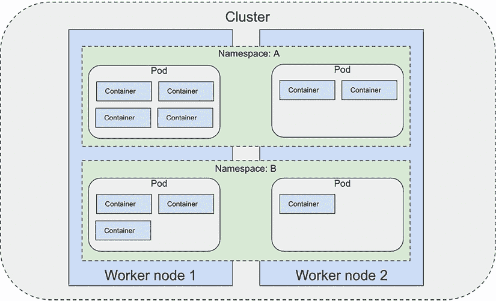

图 6.3：命名空间、Pod 和容器

前面的图示展示了 Kubernetes 集群中命名空间、Pod 和容器之间的关系。在这个图中，每个命名空间包含其自己的 Pod 集合，并且每个 Pod 可以包含一个或多个在其中运行的容器。

## Deployment

Kubernetes 使用 Deployment 来创建或修改运行容器化应用程序的 Pod。例如，要部署一个容器化应用程序，你需要创建一个配置清单文件（通常以 `YAML` 文件格式），该文件指定了详细信息，例如容器部署名称、命名空间、容器镜像 URI、Pod 副本数量以及应用程序的通信端口。使用 Kubernetes 客户端工具（`kubectl`）应用 Deployment 后，将在工作节点上创建运行指定容器镜像的相应 Pod。以下示例创建了一个具有所需规范的 `nginx` 服务器 Pod 的 Deployment：

```py
apiVersion: apps/v1 # k8s API version used for creating this deployment
kind: Deployment # the type of object. In this case, it is deployment
metadata:
name: nginx-deployment # name of the deployment
spec:
selector:
matchLabels:
app: nginx # an app label for the deployment.  This can be used to look up/select Pods
replicas: 2 # tells deployment to run 2 Pods matching the template
template:
metadata:
labels:
app: nginx
spec:
containers:
- name: nginx
image: nginx:1.14.2 # Docker container image used for the deployment
ports:
- containerPort: 80 # the networking port to communicate with the containers 
```

下面的图示展示了将前面的部署清单文件应用到 Kubernetes 集群中，并创建两个 Pod 来托管两个 `nginx` 容器副本的过程：

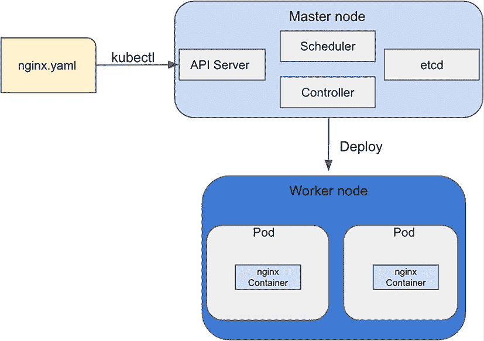

图 6.4：创建 nginx 部署

在 Deployment 之后，一个 Deployment 控制器会监控已部署的容器实例。如果一个实例宕机，控制器将用工作节点上的另一个实例替换它。

## Kubernetes Job

Kubernetes 作业是一个控制器，用于创建一个或多个 Pod 来运行一些任务，并确保作业成功完成。如果由于节点故障或其他系统问题导致多个 Pod 失败，Kubernetes 作业将重新创建 Pod 以完成任务。Kubernetes 作业可用于运行面向批处理的任务，例如在大量推理请求上运行批数据处理脚本、ML 模型训练脚本或 ML 批推理脚本。作业完成后，Pod 不会终止，因此您可以访问作业日志并检查作业的详细状态。以下是一个运行训练作业的示例模板：

```py
apiVersion: batch/v1
kind: Job # indicate that this is the Kubernetes Job resource
metadata:
name: train-job
spec:
template:
spec:
containers:
- name: train-container
imagePullPolicy: Always # tell the job to always pull a new container image when it is started
image: <uri to Docker image containing training script>
command: ["python3",  "train.py"]  # tell the container to run this command after it is started
restartPolicy: Never
backoffLimit: 0 
```

注意，此配置包含一个名为`restartPolicy`的参数，它控制容器退出并失败时 Pod 的重新启动方式。有三个配置：

+   `OnFailure`：只有当 Pod 失败时才重新启动 Pod，而不是成功时。这是默认设置。

+   `Never`：在任何情况下都不重新启动 Pod。

+   `Always`：无论 Pod 的退出状态如何，总是重新启动 Pod。

您可以使用此参数来控制是否希望在容器失败时重新启动训练。

## Kubernetes 自定义资源和操作符

Kubernetes 提供了一系列内置资源，例如 Pod 或 Deployment，以满足不同的需求。它还允许您创建**自定义资源**（**CR**）并像管理内置资源一样管理它们，您可以使用相同的工具（例如`kubectl`）来管理它们。当您在 Kubernetes 中创建 CR 时，Kubernetes 为资源的每个版本创建一个新的 API（例如，`<自定义资源名称>/<版本>`）。这也被称为*扩展*Kubernetes API。要创建 CR，您创建一个**自定义资源定义**（**CRD**）`YAML`文件。要在 Kubernetes 中注册 CRD，您只需运行`kubectl apply -f <CRD yaml 文件名称>`来应用文件。之后，您就可以像使用任何其他 Kubernetes 资源一样使用它。例如，要管理 Kubernetes 上的自定义模型训练作业，您可以定义一个 CRD，其中包含算法名称、数据加密设置、训练镜像、输入数据源、作业失败重试次数、副本数量和作业存活探测频率等规范。

Kubernetes 操作符是一个在自定义资源上操作的控制器。操作符监视 CR 类型并采取特定操作以使当前状态与所需状态相匹配，就像内置控制器一样。例如，如果您想为之前提到的训练作业 CRD 创建一个训练作业，您将创建一个操作符来监控训练作业请求并执行特定于应用程序的操作以启动 Pod 并在整个生命周期中运行训练作业。以下图显示了与操作符部署相关的组件：

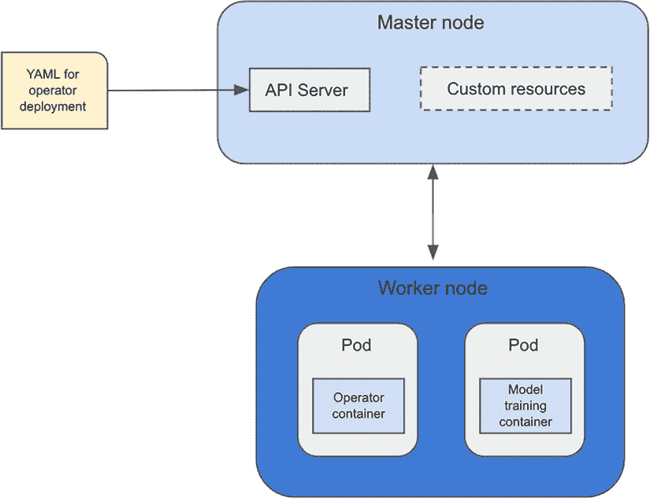

图 6.5：Kubernetes 自定义资源和它与操作符的交互

部署操作员的最常见方式是部署 CR 定义和相关控制器。控制器在 Kubernetes 控制平面外部运行，类似于在 Pod 中运行容器化应用程序。

## 服务

Kubernetes 服务在 Kubernetes 集群内各种组件和应用程序之间实现可靠和可扩展的通信中发挥着关键作用。

由于集群中的应用程序通常是动态的，并且可以扩展或缩减，因此服务提供了一种稳定和抽象的端点，其他组件可以使用它来访问这些应用程序的运行实例。

在其核心，Kubernetes 服务是一个抽象层，它将一组 Pod 作为单个、定义良好的网络端点暴露出来。它充当负载均衡器，将进入的网络流量分发到服务后面的可用 Pod。这种抽象允许应用程序与服务交互，而无需了解底层 Pod 或其 IP 地址的详细信息。

# Kubernetes 上的网络

Kubernetes 在 Kubernetes 集群中的所有资源之间运行一个扁平的私有网络。在集群内部，所有 Pod 都可以在集群范围内相互通信，无需**网络地址转换**（**NAT**）。Kubernetes 为每个 Pod 分配其自己的集群私有 IP 地址，这个 IP 地址既是 Pod 自身看到的，也是其他人看到的。单个 Pod 内部的全部容器都可以到达本地主机上每个容器的端口。集群中的所有节点也有各自分配的 IP 地址，并且可以无需 NAT 与所有 Pod 进行通信。以下图显示了 Pod 和节点的不同 IP 分配，以及来自不同资源的通信流程：

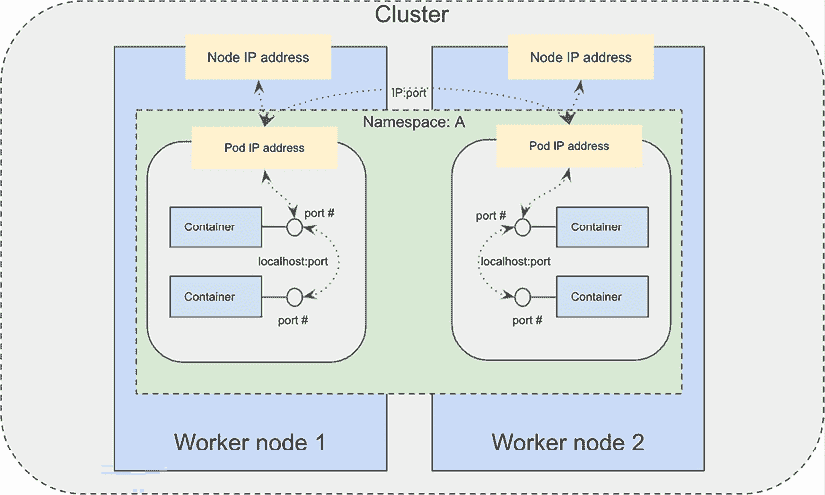

图 6.6：IP 分配和通信流程

有时，你可能需要运行相同应用程序容器（例如`nginx`应用程序的容器）的一组 Pod，以实现高可用性和负载均衡，例如。而不是分别通过每个 Pod 的私有 IP 地址调用每个 Pod 以访问 Pod 中运行的应用程序，你希望调用一个用于该组 Pod 的抽象层，并且这个抽象层可以动态地将流量发送到它后面的每个 Pod。在这种情况下，你可以创建一个 Kubernetes 服务作为一组逻辑 Pod 的抽象层。Kubernetes 服务可以通过匹配 Pod 的`app`标签来动态选择其后面的 Pod，这是通过 Kubernetes 的一个名为`selector`的功能实现的。以下示例显示了创建名为`nginx-service`的服务规范，该服务将流量发送到具有`nginx`标签的 Pod，并在端口`9376`上。服务也分配了其自己的集群私有 IP 地址，因此它可以在集群内部被其他资源访问：

```py
apiVersion: v1
kind: Service
metadata:
name: nginx-service
spec:
selector:
app: nginx
ports:
- protocol: TCP
port: 80
targetPort: 9376 
```

除了使用`selector`自动检测服务后面的 Pod 之外，您还可以手动创建一个`Endpoint`，并将固定的 IP 地址和端口映射到服务，如下例所示：

```py
apiVersion: v1
kind: Endpoints
metadata:
name: nginx-service
subsets:
- addresses:
- ip: 192.0.2.42
ports:
- port: 9376 
```

虽然节点、Pod 和服务都被分配了集群私有 IP，但这些 IP 在集群外部是不可路由的。要从集群外部访问 Pod 或服务，您有以下几种选择：

+   **从节点或 Pod 访问**：您可以使用`kubectl exec`命令连接到正在运行的 Pod 的 shell，并通过 shell 访问其他 Pod、节点和服务。

+   **Kubernetes 代理**：您可以在本地机器上运行`kubectl proxy --port=<端口号>`命令来启动 Kubernetes 代理以访问服务。一旦代理启动，您就可以访问节点、Pod 或服务。例如，您可以使用以下方案访问服务：

    ```py
    http://localhost:<port number>/api/v1/proxy/namespaces/<NAMESPACE>/services/<SERVICE NAME>:<PORT NAME> 
    ```

+   **NodePort**：`NodePort`在所有工作节点上打开一个特定的端口，并将发送到任何节点 IP 地址上此端口的任何流量转发到端口后面的服务。节点的 IP 地址需要从外部源可路由。以下图显示了使用`NodePort`的通信流程：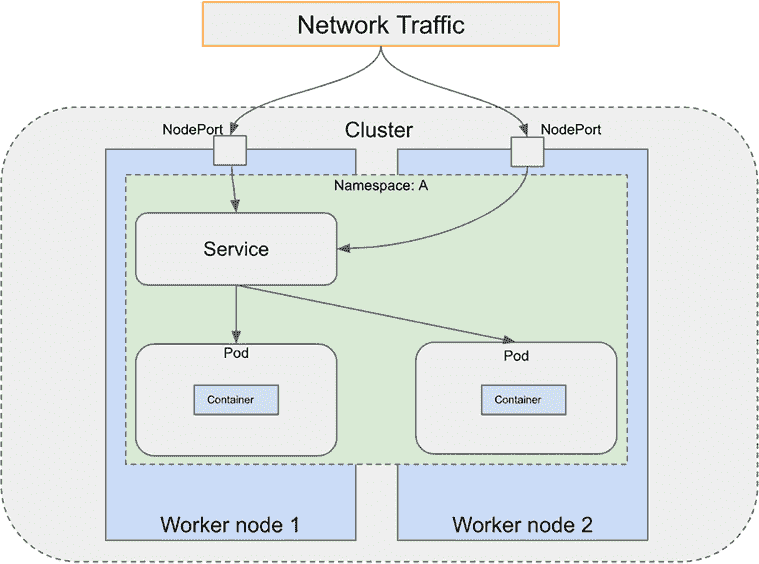

    图 6.7：通过 NodePort 访问 Kubernetes 服务

    `NodePort`使用简单，但有一些限制，例如每个服务一个`NodePort`，使用固定的端口范围（`3000`到`32767`），并且您需要知道各个工作节点的 IP 地址。

+   **负载均衡器**：当您使用像 AWS 这样的云提供商时，负载均衡器是一种将服务暴露给互联网的方式。使用负载均衡器，您将获得一个可访问互联网的公网 IP 地址，并将发送到该 IP 地址的所有流量都会转发到负载均衡器后面的服务。负载均衡器不是 Kubernetes 的一部分，它由 Kubernetes 集群所在的云基础设施提供（例如，AWS）。以下图显示了从负载均衡器到服务和 Pod 的通信流程：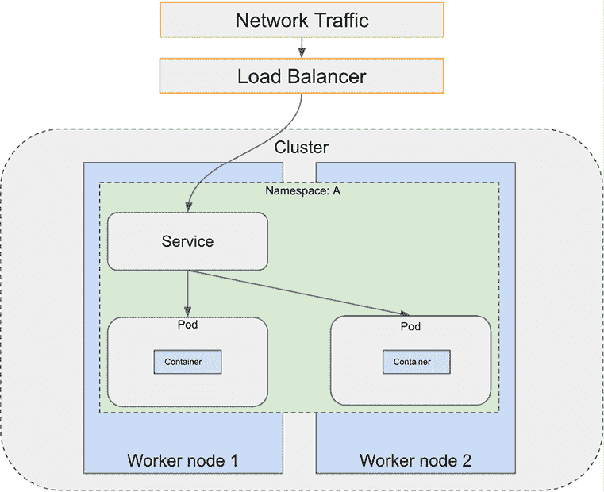

    图 6.8：通过负载均衡器访问 Kubernetes 服务

    负载均衡器允许您选择要使用的确切端口，并且可以支持每个服务多个端口。但是，它确实需要为每个服务配置一个单独的负载均衡器。

+   **Ingress**：Ingress 网关是集群的入口点。它充当负载均衡器，并根据路由规则将传入流量路由到不同的服务。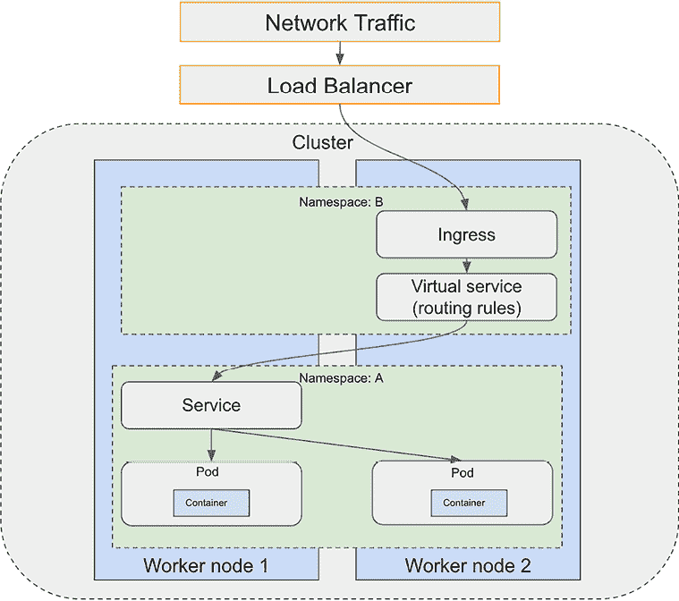

    图 6.9：通过 Ingress 访问 Kubernetes 服务

Ingress 与负载均衡器和 `NodePort` 不同，它充当代理来管理集群的流量。它与 `NodePort` 和负载均衡器协同工作，将流量路由到不同的服务。Ingress 方式越来越普遍地被使用，尤其是在与负载均衡器结合使用时。

除了从集群外部管理网络流量外，Kubernetes 网络管理的另一个重要方面是控制集群内不同 Pods 和服务之间的流量。例如，你可能希望允许某些流量访问一个 Pod 或服务，同时拒绝来自其他来源的流量。这对于基于微服务架构的应用程序尤为重要，因为可能有多个服务或 Pods 需要协同工作。这样的微服务网络也被称为 **服务网格**。随着服务数量的增加，理解和管理工作量变得具有挑战性，例如 *服务发现*、*网络路由*、*网络指标* 和 *故障恢复*。**Istio** 是一款开源的服务网格管理软件，它使得在 Kubernetes 上管理大型服务网格变得简单，并提供以下核心功能：

+   **Ingress**：Istio 提供了一个 Ingress 网关，可以用来将服务网格内部的服务暴露给互联网。它充当负载均衡器，管理服务网格的入站和出站流量。网关只允许流量进入/离开一个网格——它不进行流量路由。要将流量从网关路由到服务网格内的服务，你需要创建一个名为 `VirtualService` 的对象来提供路由规则，将入站流量路由到集群内部的不同目的地，并且创建虚拟服务与网关对象之间的绑定来连接两者。

+   **网络流量管理**：Istio 提供基于规则的简单网络路由，以控制不同服务之间的流量和 API 调用。当 Istio 安装后，它会自动检测集群中的服务和端点。Istio 使用名为 `VirtualService` 的对象来提供路由规则，将入站流量路由到集群内部的不同目的地。Istio 使用名为 `gateway` 的负载均衡器来管理网络网格的入站和出站流量。`gateway` 负载均衡器只允许流量进入/离开一个网格——它不进行流量路由。要从网关路由流量，你需要创建虚拟服务与 `gateway` 对象之间的绑定。

    为了管理 Pod 进出流量，一个 Envoy 代理组件（也称为`sidecar`）被注入到 Pod 中，并拦截并决定如何路由所有流量。管理 sidecar 和服务的流量配置的 Istio 组件称为`Pilot`。`Citadel`组件负责服务到服务和最终用户身份验证。`Gallery`组件负责隔离其他 Istio 组件与底层 Kubernetes 基础设施。以下图显示了 Kubernetes 上 Istio 的架构：

    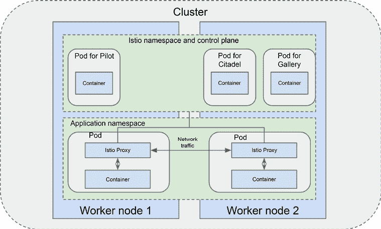

    图 6.10：Istio 架构

Istio 还支持安全和可观察性，这对于构建生产系统至关重要：

+   **安全**：Istio 为服务间通信提供身份验证和授权。

+   **可观察性**：Istio 捕获集群内所有服务通信的指标、日志和跟踪。指标示例包括网络延迟、错误和饱和度。跟踪示例包括网格内的调用流程和服务依赖。

Istio 可以处理各种部署需求，例如负载均衡和服务间认证。它甚至可以扩展到其他集群。

# 安全性和访问管理

安全性是构建 Kubernetes 上生产级系统的关键考虑因素。作为一名计划将 Kubernetes 作为 ML 基础平台的从业者，了解 Kubernetes 的各种安全方面非常重要。

Kubernetes 有许多内置的安全功能。这些安全功能允许您实现细粒度的网络流量控制和访问控制到不同的 Kubernetes API 和服务。在本节中，我们将讨论网络安全、身份验证和授权。

## API 身份验证和授权

Kubernetes API 的访问可以为用户和 Kubernetes **服务帐户**（服务帐户为在 Pod 中运行的过程提供身份）进行身份验证和授权。

用户在 Kubernetes 外部处理，并且 Kubernetes 有多种用户身份验证策略：

+   **X.509 客户端证书**：一个签名证书被发送到 API 服务器进行身份验证。API 服务器通过与证书颁发机构验证来验证用户。

+   **使用 OpenID Connect 进行单点登录**（**OIDC**）：用户通过 OIDC 提供者进行身份验证，并接收一个包含用户信息的载体令牌（**JSON Web Token**（**JWT**））。用户将载体令牌传递给 API 服务器，API 服务器通过检查令牌中的证书来验证令牌的有效性。

+   **HTTP 基本身份验证**：HTTP 基本身份验证要求将用户 ID 和密码作为 API 请求的一部分发送，并验证用户 ID 和密码是否与 API 服务器关联的密码文件匹配。

+   **身份验证代理**：API 服务器从 HTTP 头中提取用户身份，并使用证书颁发机构验证用户。

+   **身份验证网关**：用于处理 API 服务器身份验证的外部服务。

服务帐户用于为在 Pod 中运行的进程提供身份。它们在 Kubernetes 中创建和管理。默认情况下，服务帐户需要位于命名空间内。每个命名空间还有一个 *默认* 服务帐户。如果 Pod 未分配服务帐户，则默认服务帐户将被分配给 Pod。服务帐户有一个相关的身份验证令牌，以 Kubernetes Secret 的形式保存，并用于 API 身份验证。Kubernetes Secret 用于存储敏感信息，如密码、身份验证令牌和 SSH 密钥。我们将在本章后面更详细地介绍 Secrets。

用户或服务帐户经过身份验证后，请求需要授权以执行允许的操作。Kubernetes 使用控制平面中的 API 服务器授权经过身份验证的请求，并且它有几种授权模式：

+   **基于属性的访问控制**（**ABAC**）：通过策略授予用户访问权限。请注意，每个服务帐户都有一个相应的用户名。以下示例策略允许 `joe` 用户访问所有命名空间中的所有 API。

    ```py
    {
    "apiVersion": "abac.authorization.kubernetes.io/v1beta1",
    "kind": "Policy",
    "spec": {
    "user": "joe",
    "namespace": "*",
    "resource": "*",
    "apiGroup": "*"
    }
    } 
    ```

    以下策略允许 `system:serviceaccount:kube-system:default` 服务帐户访问所有命名空间中的所有 API：

    ```py
    {
    "apiVersion": "abac.authorization.kubernetes.io/v1beta1",
    "kind": "Policy",
    "spec": {
    "user": "system:serviceaccount:kube-system:default",
    "namespace": "*",
    "resource": "*",
    "apiGroup": "*"
    }
    } 
    ```

+   **基于角色的访问控制**（**RBAC**）：根据用户的角色授予访问权限。RBAC 使用 `rbac.authorization.k8s.io` API 组进行授权。RBAC API 与四个 Kubernetes 对象一起工作：`Role`、`ClusterRole`、`RoleBinding` 和 `ClusterRoleBinding`。

`Role` 和 `ClusterRole` 包含一组权限。权限是 *累加的*，这意味着没有拒绝权限，并且您需要显式添加权限到资源。`Role` 对象是命名空间级别的，用于在命名空间内指定权限。`ClusterRole` 对象是非命名空间级别的，但可以用于为特定命名空间或集群范围权限授权。请参阅以下插图：

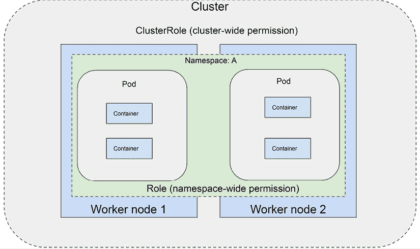

图 6.11：Role 与 ClusterRole

以下 `.yaml` 文件为默认命名空间中核心 API 组的所有 Pod 资源提供获取、观看和列表访问权限：

```py
apiVersion: rbac.authorization.k8s.io/v1
kind: Role
metadata:
namespace: default
name: pod-reader
rules:
- apiGroups: [""]
  resources: ["pods"]
  verbs: ["get", "watch", "list"] 
```

以下策略允许对集群中所有 Kubernetes 节点的获取、观看和列表访问：

```py
apiVersion: rbac.authorization.k8s.io/v1
kind: ClusterRole
metadata:
name: nodes-reader
rules:
- apiGroups: [""]
  resources: ["nodes"]
  verbs: ["get", "watch", "list"] 
```

`RoleBinding` 和 `ClusterRoleBinding` 将定义在 `Role` 或 `ClusterRole` 对象中的权限授予具有对 `Role` 或 `ClusterRole` 对象引用的用户或一组用户。以下策略将 `joe` 用户绑定到 `pod-reader` 角色：

```py
apiVersion: rbac.authorization.k8s.io/v1
kind: RoleBinding
metadata:
name: read-pods
namespace: default
subjects:
- kind: User
name: joe
apiGroup: rbac.authorization.k8s.io
roleRef:
kind: Role
name: pod-reader
apiGroup: rbac.authorization.k8s.io 
```

以下 `RoleBinding` 对象将服务帐户 `SA-name` 绑定到 `ClusterRole` `secret-reader`：

```py
apiVersion: rbac.authorization.k8s.io/v1
kind: ClusterRoleBinding
metadata:
name: read-secrets-global
subjects:
- kind: ServiceAccount
name: SA-name
namespace: default
roleRef:
kind: ClusterRole
name: secret-reader
apiGroup: rbac.authorization.k8s.io 
```

Kubernetes 有一个内置功能用于存储和管理敏感信息，如密码。您不必直接在 Pod 中以纯文本形式存储这些敏感信息，而是可以将这些信息作为 Kubernetes Secrets 存储，并使用 Kubernetes RBAC 提供对这些 Secrets 的特定访问权限。默认情况下，Secrets 以未加密的纯文本 Base64 编码字符串的形式存储，并且可以为 Secrets 启用静态数据加密。以下策略显示了如何创建用于存储 AWS 访问凭证的 secret：

```py
apiVersion: v1
kind: Secret
metadata:
name: aws-secret
type: Opaque
data:
AWS_ACCESS_KEY_ID: XXXX
AWS_SECRET_ACCESS_KEY: XXXX 
```

在 Pod 中使用密钥的方式有几种：

+   作为 Pod 规范模板中的环境变量：

    ```py
    apiVersion: v1
    kind: Pod
    metadata:
    name: secret-env-pod
    spec:
    containers:
    - name: mycontainer
    image: redis
    env:
    - name: SECRET_AWS_ACCESS_KEY
    valueFrom:
    secretKeyRef:
    name: aws-secret
    key: AWS_ACCESS_KEY_ID
    - name: SECRET_AWS_SECRET_ACCESS_KEY
    valueFrom:
    secretKeyRef:
    name: aws-secret
    key: AWS_SECRET_ACCESS_KEY
    restartPolicy: Never 
    ```

    容器内的应用程序代码可以像其他环境变量一样访问 Secrets。

+   作为挂载在 Pod 上的卷中的文件：

    ```py
    apiVersion: v1
    kind: Pod
    metadata:
    name: pod-ml
    spec:
    containers:
    - name: pod-ml
    image: <Docker image uri>
    volumeMounts:
    - name: vol-ml
    mountPath: "/etc/aws"
    readOnly: true
    volumes:
    - name: vol-ml
    Secret:
    secretName: aws-secret 
    ```

在前面的示例中，您将看到每个对应的密钥名称（如 `SECRET_AWS_ACCESS_KEY`）在 Pod 的 `/etc/aws` 文件夹中的文件，这些文件包含 Secrets 的值。

我们现在知道了容器是什么，以及它们如何在 Kubernetes 集群上部署。我们还了解了如何在 Kubernetes 上配置网络，以允许 Pods 之间相互通信，以及如何使用不同的网络选项将 Kubernetes 容器暴露给集群外部的访问。

Kubernetes 可以作为运行 ML 工作负载的基础基础设施。例如，您可以在 Kubernetes 上作为您的数据科学实验和模型构建环境，将 **Jupyter** **笔记本** 运行为一个容器化应用程序。

如果您需要额外的资源，也可以将模型训练作业作为 Kubernetes Job 运行，然后将模型作为容器化的 Web 服务应用程序提供服务，或者作为 Kubernetes Job 在训练模型上运行批量推理。在接下来的动手练习中，您将学习如何使用 Kubernetes 作为运行 ML 工作负载的基础基础设施。

# 实践操作 - 在 AWS 上创建 Kubernetes 基础设施

在本节中，您将使用 Amazon EKS 创建一个 Kubernetes 环境，这是 AWS 上的托管 Kubernetes 环境，这使得设置 Kubernetes 集群变得更加容易。让我们首先看看问题陈述。

## 问题陈述

作为 ML 解决方案架构师，您被分配评估 Kubernetes 作为构建您银行一个业务单元的 ML 平台潜在基础设施平台的任务。您需要在 AWS 上构建一个沙盒环境，并证明您可以将 Jupyter 笔记本作为容器化应用程序部署，供您的数据科学家使用。

## 实验室说明

在这个动手练习中，您将使用 Amazon EKS 创建一个 Kubernetes 环境，Amazon EKS 是 AWS 上的 Kubernetes 管理服务，它可以自动创建和配置具有主节点和工作节点的 Kubernetes 集群。EKS 配置并扩展控制平面，包括 API 服务器和后端持久层。它还运行开源 Kubernetes，并与所有基于 Kubernetes 的应用程序兼容。

在创建 EKS 集群之后，您将探索 EKS 环境，检查其一些核心组件，然后您将学习如何部署一个容器化的 Jupyter Notebook 应用程序，并使其可通过互联网访问。

让我们完成以下步骤以开始：

1.  启动 AWS CloudShell 服务。

    登录您的 AWS 账户，选择 **俄勒冈** 区域，并启动 AWS CloudShell。CloudShell 是一种 AWS 服务，它提供了一个基于浏览器的 **Linux** 终端环境，用于与 AWS 资源交互。使用 CloudShell，您可以使用 AWS 控制台凭据进行认证，并轻松运行 **AWS** **CLI**、**AWS** **SDK** 和其他工具。

1.  安装 `eksctl` 工具。

    按照 Unix 的安装说明在 [`github.com/weaveworks/eksctl/blob/main/README.md#installation`](https://github.com/weaveworks/eksctl/blob/main/README.md#installation) 安装 eksctl。`eksctl` 工具是用于管理 EKS 集群的命令行工具。我们将在 *步骤 3* 中使用 `eksctl` 工具在 Amazon EKS 上创建一个 Kubernetes 集群：

1.  运行以下命令以在您 AWS 账户内的 **俄勒冈** 区域启动创建 EKS 集群。设置完成大约需要 15 分钟：

    ```py
    eksctl create cluster --name <cluster name> --region us-west-2 
    ```

    该命令将启动一个 `cloudformation` 模板，这将创建以下资源：

    +   在一个新的 Amazon **虚拟私有云**（**VPC**）内部包含两个工作节点的 Amazon EKS 集群。Amazon EKS 提供了完全管理的 Kubernetes 主节点，因此您在私有 VPC 内看不到主节点。

    +   在 CloudShell 的 `/home/cloudshell-user/.kube/config` 目录中保存的 EKS 集群配置文件。该 `config` 文件包含诸如 API 服务器 `url` 地址、管理集群的管理员用户名以及用于认证 Kubernetes 集群的客户端证书等详细信息。`kubectl` 工具使用 `config` 文件中的信息连接并认证到 Kubernetes API 服务器。

    +   EKS 将工作节点组织成称为 `nodegroup` 的逻辑组。运行以下命令以查找 `nodegroup` 名称。您可以在 EKS 管理控制台中查找集群的名称。节点组的名称应类似于 `ng-xxxxxxxx`：

        ```py
        eksctl get nodegroup --cluster=<cluster name> 
        ```

1.  安装 `kubectl` 工具。

    按照以下链接中的说明进行操作[`docs.aws.amazon.com/eks/latest/userguide/install-kubectl.html`](https://docs.aws.amazon.com/eks/latest/userguide/install-kubectl.html)以在 Linux 上安装 kubectl。您需要知道 Kubernetes 服务器的版本才能安装相应的 kubectl 版本。您可以使用`kubectl version --short`命令找到 Kubernetes 服务器的版本。

1.  探索集群。

    现在集群已启动，让我们稍微探索一下。尝试在 CloudShell 终端中运行以下命令并查看返回结果：

    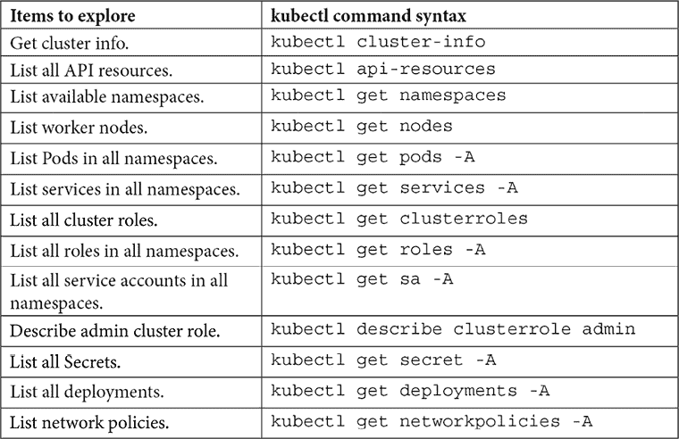

    图 6.12：kubectl 命令

1.  部署 Jupyter 笔记本。

    让我们部署一个 Jupyter Notebook 服务器作为容器化应用程序。复制并运行以下代码块。它应该创建一个名为`deploy_Jupyter_notebook.yaml`的文件。我们将使用 Docker Hub 镜像仓库中的容器镜像：

    ```py
    cat << EOF > deploy_Jupyter_notebook.yaml
    apiVersion: apps/v1
    kind: Deployment
    metadata:
    name: jupyter-notebook
    labels:
    app: jupyter-notebook
    spec:
    replicas: 1
    selector:
    matchLabels:
    app: jupyter-notebook
    template:
    metadata:
    labels:
    app: jupyter-notebook
    spec:
    containers:
    - name: minimal-notebook
    image: jupyter/minimal-notebook:latest
    ports:
    - containerPort: 8888
    EOF 
    ```

    现在，让我们运行以下命令来创建一个 Deployment：

    ```py
    kubectl apply -f deploy_Jupyter_notebook.yaml. 
    ```

    通过执行`kubectl get pods`来检查 Pod 是否正在运行。

    通过运行`kubectl logs <notebook pod 名称>`来检查 Jupyter 服务器 Pod 的日志。找到包含`http://jupyter-notebook-598f56bf4b-spqn4:8888/?token=XXXXXXX...`的日志部分，并复制令牌（`XXXXXX…`）部分。我们将在*步骤 8*中使用此令牌。

    您还可以通过运行`kubectl exec --stdin --tty <notebook pod 名称> -- /bin/sh`使用交互式 shell 访问 Pod。运行`ps aux`以查看运行进程列表。您将看到一个与 Jupyter 笔记本相关的进程。

1.  将 Jupyter 笔记本暴露给互联网。

    到目前为止，我们已经在 AWS VPC 中两个 EC2 实例之上的 Kubernetes Pod 中运行了一个 Jupyter 服务器，但我们无法访问它，因为 Kubernetes 集群没有向容器公开路由。我们将创建一个 Kubernetes 服务，将 Jupyter Notebook 服务器暴露给互联网，以便可以从浏览器访问。

    运行以下代码块以创建一个新 Service 的规范文件。它应该创建一个名为`jupyter_svc.yaml`的文件：

    ```py
    cat << EOF > jupyter_svc.yaml
    apiVersion: v1
    kind: Service
    metadata:
    name: jupyter-service
    annotations:
    service.beta.kubernetes.io/aws-load-balancer-type: alb
    spec:
    selector:
    app: jupyter-notebook
    ports:
    - protocol: TCP
    port: 80
    targetPort: 8888
    type: LoadBalancer
    EOF 
    ```

    文件创建后，运行`kubectl apply -f jupyter_svc.yaml`以创建服务。应创建一个名为`jupyter-service`的新 Kubernetes 服务以及一个新的`LoadBalancer`对象。您可以通过运行`kubectl get service`来验证服务。注意并复制与`jupyter-service`服务关联的`EXTERNAL-IP`地址。

    将`EXTERNAL-IP`地址粘贴到新的浏览器窗口中，并将您之前复制的令牌输入到**密码或令牌**字段中，以按以下截图所示登录。您应该看到一个 Jupyter Notebook 窗口出现：

    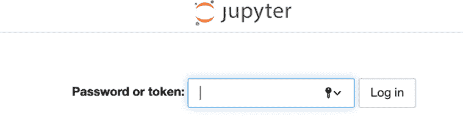

    图 6.13：Jupyter 登录屏幕

    以下图表显示了您在完成动手练习后创建的环境。

    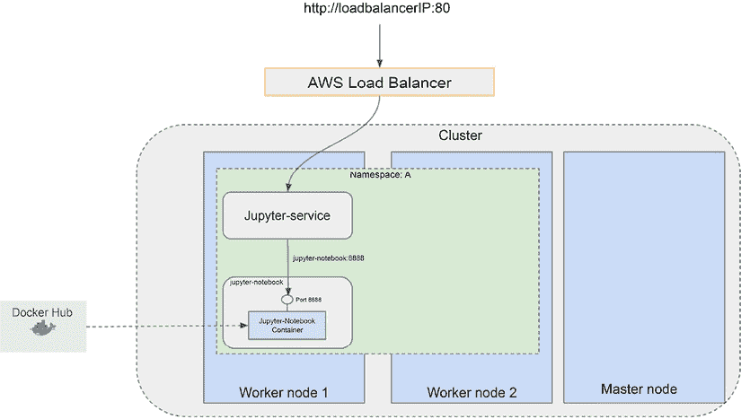

    图 6.14：EKS 集群上的 Jupyter Notebook 部署

恭喜你，你已经在 AWS 上成功创建了一个新的 Amazon EKS 集群，并在集群上部署了一个 Jupyter 服务器实例作为容器。我们将重用这个 EKS 集群进行下一章的内容。然而，如果你计划一段时间内不使用这个 EKS，建议关闭集群以避免不必要的费用。要关闭集群，请运行 `kubectl delete svc <service name>` 来删除服务。然后运行 `eksctl delete cluster --name <cluster name>` 来删除集群。

# 摘要

在本章中，我们介绍了 Kubernetes，这是一个强大的容器管理平台，是构建开源 ML 平台的基础设施基础。在本章中，你了解了容器和 Kubernetes 的工作原理。此外，通过利用 AWS EKS，你获得了在 AWS 上建立 Kubernetes 集群的实际经验。此外，我们探讨了将容器化的 Jupyter Notebook 应用程序部署到集群上的过程，从而创建了一个基本的数据科学环境。在下一章中，我们将转向探索与 Kubernetes 基础设施无缝集成的开源 ML 平台的选择。

# 加入我们的 Discord 社区

加入我们的社区 Discord 空间，与作者和其他读者进行讨论：

[`packt.link/mlsah`](https://packt.link/mlsah)


