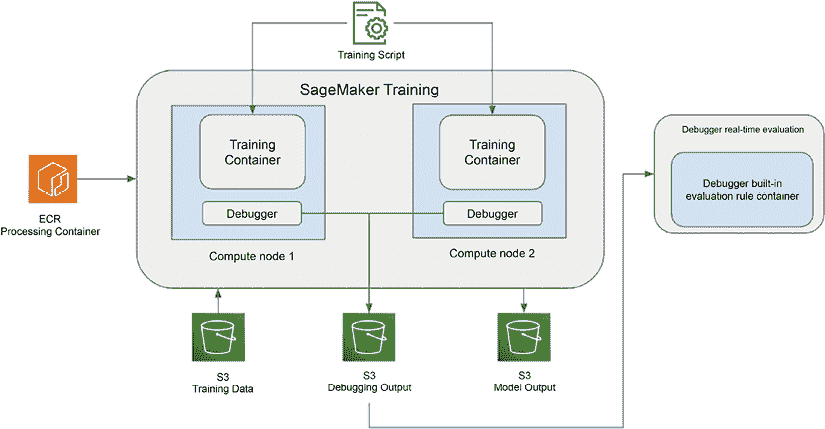

# 8

# 使用 AWS 机器学习服务构建数据科学环境

虽然一些组织选择使用开源技术构建自己的机器学习平台，但许多其他组织更喜欢利用完全托管的机器学习服务作为其机器学习平台的基础。在本章中，我们将深入了解 AWS 提供的完全托管的机器学习服务。具体来说，您将了解**Amazon SageMaker**以及为数据科学家构建数据科学环境的相关服务。我们将检查 SageMaker 的各个组件，如 SageMaker Studio、SageMaker Training 和 SageMaker Hosting。此外，我们将深入研究构建数据科学环境的架构框架，并提供一个动手练习，指导您完成该过程。

简而言之，本章将涵盖以下主题：

+   SageMaker 概述

+   使用 SageMaker 构建的数据科学环境架构

+   构建数据科学环境的最佳实践

+   动手实验室 - 使用 AWS 服务构建数据科学环境

# 技术要求

在本章中，您需要访问 AWS 账户，并拥有以下 AWS 服务以进行动手实验室：

+   Amazon S3

+   Amazon SageMaker

+   Amazon ECR

您还需要从[`www.kaggle.com/ankurzing/sentiment-analysis-for-financial-news`](https://www.kaggle.com/ankurzing/sentiment-analysis-for-financial-news)下载数据集。

本章中使用的示例源代码可在[`github.com/PacktPublishing/The-Machine-Learning-Solutions-Architect-and-Risk-Management-Handbook-Second-Edition/tree/main/Chapter08`](https://github.com/PacktPublishing/The-Machine-Learning-Solutions-Architect-and-Risk-Management-Handbook-Second-Edition/tree/main/Chapter08)找到。

# SageMaker 概述

Amazon SageMaker 提供覆盖整个机器学习生命周期的机器学习功能，从初始实验到生产部署和持续监控。它满足各种角色，如数据科学家、数据分析师和 MLOps 工程师。以下图表展示了 SageMaker 的关键功能，这些功能支持不同角色的完整数据科学之旅：


图 8.1：SageMaker 功能

在 SageMaker 中，数据科学家可以访问一系列功能和服务的组合，以支持不同的机器学习任务。这些包括用于模型构建的 Studio 笔记本，用于可视数据准备的 Data Wrangler，用于大规模数据处理和转换的 Processing 服务，训练服务，用于模型调优的 Tuning 服务，以及用于模型托管的 Hosting 服务。有了这些工具，数据科学家可以处理各种机器学习职责，如数据准备、模型构建和训练、模型调优以及进行模型集成测试。

另一方面，数据分析师可以利用 SageMaker Canvas，这是一个用户友好的模型构建服务，几乎不需要编写代码。这个可视化界面使分析师能够轻松训练模型。此外，他们还可以使用 Studio 笔记本进行轻量级的数据分析和处理。

MLOps 工程师在管理和治理 ML 环境中扮演着至关重要的角色。他们负责自动化 ML 工作流程，并可以利用 SageMaker Pipelines、模型注册和端点监控来实现这一目标。此外，MLOps 工程师配置处理、训练和托管基础设施，以确保数据科学家交互式使用和自动化操作都能顺利进行。

在本章中，我们的重点将集中在专门针对数据科学家的数据科学环境中。随后，在下一章中，我们将深入探讨 ML 基础设施的治理、管理和自动化。

# 使用 SageMaker 的数据科学环境架构

数据科学家使用数据科学环境，通过不同的数据集和算法迭代不同的数据科学实验。这些环境需要诸如 Jupyter Notebook 等基本工具来编写和执行代码，数据处理引擎来处理大规模数据处理和特征工程，以及模型训练服务来大规模训练模型。此外，一个有效的数据科学环境还应包括用于管理和跟踪不同实验运行的工具，使研究人员能够有效地组织和监控他们的实验。为了管理诸如源代码和 Docker 镜像等工件，数据科学家还需要代码仓库和 Docker 容器仓库。

以下图表展示了使用 Amazon SageMaker 和其他支持服务的基本数据科学环境架构：


图 8.2：数据科学环境架构

SageMaker 拥有多个数据科学环境，包括 Studio，这是数据科学家的主要开发环境，RStudio 为 R 用户设计，Canvas 为希望构建 ML 模型的无代码/低代码开发环境用户设计。您还可以访问 TensorBoard，这是一个用于监控和可视化模型指标（如损失和准确率）的流行工具。

现在，让我们探讨数据科学家如何利用 SageMaker 的不同组件来完成数据科学任务。

## 指导 SageMaker 用户

SageMaker 的主要用户界面是 SageMaker Studio，这是一个数据科学 **集成开发环境**（**IDE**）。它提供了核心功能，如托管笔记本以运行实验，以及从单一用户界面访问不同的后端服务，如数据整理、模型训练和模型托管服务。它是数据科学家与 SageMaker 大多数功能交互的主要界面。它还提供了一个 Python SDK，用于从 Python 笔记本或脚本中以编程方式与其后端服务交互。以下图显示了 SageMaker Studio 的关键组件：


图 8.3：SageMaker Studio 架构

SageMaker Studio 实现了域的概念来隔离用户环境。域代表一组用户配置文件，每个配置文件都配备了特定的配置，例如运行 Jupyter 笔记本时使用的 AWS IAM 角色、标签以及访问 SageMaker Canvas 的权限。在域内，每个 Studio 用户都可以通过用户配置文件访问不同的 Studio 应用程序，如 JupyterLab、代码编辑器或 Canvas。

要运行某些 Studio 应用程序，如 JupyterLab 和代码编辑器，您需要创建 SageMaker Studio 空间。SageMaker Studio 空间用于管理这些应用程序的存储和资源需求。每个空间与一个应用程序实例有一个 1:1 的关系，并包含诸如存储卷、应用程序类型和应用程序基于的镜像等资源。空间可以是私有的也可以是共享的。

要开始使用 SageMaker，第一步是将用户引入 SageMaker Studio。如果尚未存在，则通过创建 SageMaker 域来启动注册过程。对于单用户场景，SageMaker 提供了快速域设置选项。使用快速设置选项，SageMaker 会自动使用默认设置配置新域以实现快速设置。对于高级多用户场景，SageMaker 提供了高级域设置选项。使用高级设置，您可以配置域的各个方面以适应企业采用，例如认证方法、访问不同服务、网络配置和数据加密密钥。随后，在域内创建用户配置文件，并授予用户对这些配置文件的访问权限。一旦用户配置文件设置完成，用户可以通过在域中选择各自的用户配置文件来启动 Studio 环境。这使他们能够在 SageMaker Studio 中开始工作。

## 启动 Studio 应用程序

Studio 内部有多种应用程序可供使用，包括 JupyterLab、RStudio、Canvas 和代码编辑器。您还可以选择启动之前的 Studio 经典体验。

在 SageMaker Studio 环境中，启动 Jupyter notebook 是一个简单的过程。首先选择 JupyterLab 应用程序，然后创建一个 JupyterLab 空间。空间作为一个命名、自包含且持久的存储容器，可以附加到 JupyterLab 应用程序上。在空间创建过程中，您可以灵活地选择服务器实例类型和 JupyterLab 的 Docker 镜像。一旦空间成功创建，您就可以启动 JupyterLab 应用程序并在其中启动笔记本。JupyterLab 笔记本现在具有一个 AI 驱动的编程助手（Jupyternaut）功能，您可以使用它来提问编程问题。例如，您可以提问“如何导入 Python 库？”或“如何使用 SageMaker 训练模型？”。

类似地，在 SageMaker Studio 环境中启动 Canvas 应用程序也涉及在其中选择它。作为一个无代码机器学习工具，Canvas 提供了数据准备、模型训练、推理和工作流程自动化的功能。Canvas 主要面向数据分析师，他们可能在数据科学和机器学习方面背景有限，但它也证明对经验丰富的数据科学家很有价值，他们希望快速为各种数据集建立基线模型。用户可以利用 Canvas 的现成模型进行预测，而无需构建模型，或者选择创建针对特定业务问题的定制模型。现成模型涵盖了各种用例，如语言检测和文档分析。对于定制模型，Canvas 支持使用表格和图像数据构建多种模型类型，以进行个性化预测。

支持从本地或外部源导入数据，如 S3、Amazon Redshift 或 Databricks。此外，Canvas 通过 Data Wrangler 促进数据准备，并提供用于启动对话聊天的生成式 AI 基础模型。

基于 Code-OSS 和 Visual Studio Code Open Source 构建的代码编辑器，便于编写、测试、调试以及运行分析和机器学习代码。要启动代码编辑器，只需在 Studio 中选择应用程序并创建一个专用私有空间。此空间在单个 **Amazon Elastic Compute Cloud** (**Amazon EC2**) 实例上进行计算，并对应一个 **Amazon Elastic Block Store** (**Amazon EBS**) 存储卷。空间内的所有元素，包括代码、Git 配置文件和环境变量，都存储在这个统一的 Amazon EBS 存储卷上。

## 准备数据

准备和加工数据以用于模型训练是机器学习生命周期中优化模型性能的一个关键步骤。在 Studio 环境中，您可以直接在 Studio 笔记本中安装和使用您首选的库包来完成这项工作。SageMaker 还提供了一些数据整理和加工服务，以协助数据准备，包括 SageMaker Data Wrangler，以及与 Amazon EMR 和 Glue 集成的数据准备，用于大规模数据准备和处理。

## 使用 SageMaker Data Wrangler 交互式准备数据

SageMaker Data Wrangler 是一种完全托管的服务，帮助数据科学家和工程师准备和分析他们的数据以用于机器学习。它提供了一个图形用户界面，简化了数据准备任务，例如数据清洗、特征工程、特征选择和可视化。

要使用 Data Wrangler，您需要构建一个数据流，这是一个连接数据集、转换和分析的管道。当您创建并运行一个数据流时，Data Wrangler 会启动一个 EC2 实例来运行转换和分析。每个数据流都与一个 EC2 实例相关联。数据流通常从数据导入步骤开始。Data Wrangler 允许您从多个数据源导入数据，包括 Amazon S3、Athena、Amazon Redshift、Amazon EMR、Databricks、Snowflake，以及 **软件即服务** (**SaaS**) 平台，如 Datadog、GitHub 和 Stripe。

数据导入后，您可以使用 Data Wrangler 清洗和探索数据，并使用内置的转换进行特征工程。您还可以使用预配置的可视化模板来理解数据和检测异常值。

您可以使用内置的报告来评估数据质量。以下图显示了 Data Wrangler 的流程和架构：


图 8.4：SageMaker Data Wrangler 架构

当使用 Data Wrangler 时，第一步涉及从各种数据源导入样本数据以执行数据处理和转换。完成必要的转换步骤后，您可以选择导出一份食谱。然后，SageMaker Processing 可以执行这份食谱，根据定义的转换处理整个数据集。

此外，您还可以选择将转换步骤导出到笔记本文件中。这个笔记本文件可以用来启动 SageMaker Processing 作业，允许对数据进行处理和转换。结果输出可以指向 SageMaker Feature Store 或存储在 Amazon S3 以供进一步使用和分析。

## 交互式大规模数据准备

在处理大规模数据分析、转换和准备任务时，SageMaker 提供了与 Amazon EMR 和 AWS Glue 的内置集成。这种内置集成允许您管理和处理大规模交互式数据准备。通过利用 Amazon EMR，您可以处理和分析大量数据集，同时 AWS Glue 提供了一种无服务器能力，可以在大规模上准备数据，并提供对 Glue 数据目录的便捷访问。

在 Studio 笔记本环境中，您有发现和建立与现有 Amazon EMR 集群连接的能力。这使得他们能够交互式地探索、可视化和准备用于机器学习任务的大规模数据，利用 Apache Spark、Apache Hive 和 Presto 等强大工具。以下图显示了 SageMaker 与 EMR 的集成方式：


图 8.5：SageMaker 与 EMR 的集成

作为用户，您可以从您的 Studio 笔记本连接到现有的 EMR 集群。如果没有可用的 EMR 集群，您可以直接从 Studio 环境中通过选择系统管理员创建的预定义模板来自行配置一个。系统管理员使用 AWS 服务目录为数据科学家定义参数化模板。一旦您的笔记本连接到 EMR 集群，您就可以在笔记本单元格中运行 Spark 命令或代码。

AWS Glue 交互式会话是一种无服务器服务，它为您提供了收集、转换、清洗和准备数据的工具。SageMaker 与 Glue 交互式会话之间的内置集成允许您使用 Glue 作为后端，交互式地运行数据准备会话。


图 8.6：SageMaker 与 AWS Glue 交互式会话的集成

要在 Studio 笔记本中使用 Glue 交互式会话，您在创建 Studio 笔记本时选择内置的 Glue PySpark 或 Glue Spark 内核。初始化后，您可以在 Studio 笔记本中浏览 Glue 数据目录、运行大型查询，并使用 Spark 交互式分析和准备数据。

EMR 和 Glue 都为大规模交互式数据处理提供了类似的功能。如果您正在寻找一种快速且无服务器的 Spark 会话运行方式，Glue 交互式会话是一个不错的选择。EMR 提供了更强大的功能和配置计算集群以进行优化的灵活性。

## 将数据处理为单独的任务

SageMaker Processing 为大规模数据处理提供独立的架构，例如为大型数据集提供数据清洗和特征工程作为独立的后端作业。它可以通过 SageMaker Python SDK 或 Boto3 SDK 直接从笔记本环境中访问。SageMaker Processing 使用 Docker 容器镜像来运行数据处理作业。提供了一些内置容器，例如 scikit-learn 容器和 Spark 容器。您还可以选择使用自己的自定义容器进行数据处理。以下图显示了 SageMaker Processing 架构：


图 8.7：SageMaker Processing 架构

当 SageMaker Processing 作业启动时，处理容器从 Amazon ECR 中拉取并加载到 EC2 计算集群中。S3 中的数据被复制到连接到计算节点的存储中，以便数据处理脚本可以访问和处理。一旦处理过程完成，输出数据将被复制回 S3 输出位置。

SageMaker Processing 提供了多个处理器用于数据处理，包括 Spark 处理器、scikit-learn 处理器和通过引入您的容器实现的客户处理器。SageMaker Processing 还支持不同机器学习框架的处理器，包括 PyTorch、TensorFlow、MXNet、Hugging Face 和 XGBoost。如果您需要在处理脚本中使用库包，可以使用这些处理器之一。

## 创建、存储和共享特征

当数据科学家进行训练数据准备的特征工程时，他们通常需要为不同的模型任务重用相同的特征。此外，生成的特征可以用于训练和推理，以帮助减少训练-服务偏差。

Amazon SageMaker Feature Store 是一个用于分享和管理机器学习特征以用于机器学习开发和服务的服务。Feature Store 是一个集中存储特征及其相关元数据的地方，以便可以发现和重用特征。它具有在线组件和离线组件。在线存储用于低延迟实时推理用例，离线存储用于训练和批量推理。以下图显示了 Feature Store 的工作方式。如您所见，它与其他开源替代方案（如 Feast）的架构非常相似，主要区别在于它是完全托管的。


图 8.8：SageMaker Feature Store

首先，你需要阅读并处理原始数据。然后，数据通过流式传输或直接通过批量传输被摄入到在线和离线存储中。特征存储使用名为`FeatureGroup`的概念来存储和管理特征。`FeatureGroup`是一组通过特征存储中的模式定义的特征，描述了与记录相关的结构和元数据。你可以将特征组视为一个表格，其中每一列是一个特征，每一行都有一个唯一的标识符。

在线存储专门针对实时预测进行了优化，提供低延迟读取和高吞吐量写入。它非常适合需要快速访问特征数据进行实时推理的场景。另一方面，离线存储是为批量预测和模型训练而设计的。它作为一个只追加存储操作，允许存储和访问历史特征数据。离线存储在探索和模型训练过程中存储和提供特征特别有用。

## 训练机器学习模型

一旦你准备好了训练数据，你就可以开始训练模型。数据科学家可以使用 SageMaker 训练服务来处理需要专用训练基础设施和实例类型的模型训练。训练服务也适用于使用多个节点进行的大规模分布式训练。

要开始训练，你首先需要将你的训练数据存储在 Amazon S3、Amazon EFS 或 Amazon FSx 等存储中。你根据自己的具体需求选择不同的存储选项，例如成本和延迟。S3 是最常见的一种，适合大多数模型训练需求。使用 S3，你有多种模式将数据从 S3 摄入到训练基础设施中：

+   **文件模式**：这是默认输入模式，SageMaker 将训练数据从 S3 下载到训练实例的本地目录。当完整数据集下载完毕后开始训练。使用此模式，训练实例必须有足够的本地存储空间来容纳整个数据集。

+   **管道模式**：使用此模式，数据直接从 S3 数据源流式传输。这可以提供比文件模式更快的启动时间和更好的吞吐量。此模式还可以减小附加到训练实例的存储卷的大小。它只需要足够的空间来存储最终模型工件。

+   **快速文件模式**：这种模式是管道模式的较新且更易于使用的替代品。在训练开始时，数据文件被识别但尚未下载。训练可以在整个数据集下载完毕之前开始。快速文件模式使用 POSIX 兼容的文件系统接口公开 S3 对象，就像文件在训练实例的本地磁盘上可用一样。它按需流式传输 S3 数据，这意味着你不需要将训练数据拟合到训练实例存储中。

除了 S3，您还可以将训练数据存储在 Amazon FSx for Lustre 中。当您对训练数据有高吞吐量和低延迟的数据检索需求时，您可以使用 FSx。使用 FSx，您可以通过低延迟的文件检索扩展到数百 GB 的吞吐量和数百万**每秒输入/输出操作**（**IOPS**）。当启动训练作业时，它将 FSx 挂载到训练实例文件系统作为本地驱动器。FSx 允许训练作业运行得更快，因为它读取文件所需的时间更少，并且不需要像 S3 文件模式那样将数据复制到训练实例的本地存储。EFS 提供了与 FSx 类似的功能，但吞吐量较低，延迟较高。

如果您已经在 EFS 系统中有了数据，您可以直接使用 EFS 中的数据启动训练作业，无需数据迁移。这减少了训练启动时间。与 FSx 相比，EFS 成本较低，但吞吐量较低，延迟较高。

一旦训练数据已准备好在您选择的存储系统中，您可以使用 AWS Boto3 SDK 或 SageMaker Python SDK 启动训练作业。要运行训练作业，您需要提供配置细节，例如来自 ECR 的训练 Docker 镜像的 URL、训练脚本位置、框架版本、训练数据集位置以及 S3 模型输出位置，以及基础设施细节，例如计算实例类型和数量，以及网络细节。以下示例代码展示了如何使用 SageMaker SDK 配置并启动一个训练作业。

SageMaker 训练服务使用容器作为训练管理的关键技术。所有训练作业都在 SageMaker 训练基础设施上托管的容器内执行。以下图示展示了 SageMaker 训练服务的架构：



图 8.9：SageMaker 训练服务架构

SageMaker 为使用不同机器学习算法和机器学习框架进行模型训练提供了各种托管容器。首先，有一系列内置的容器化算法，用于不同的机器学习任务，如计算机视觉、自然语言处理、预测以及常见的表格回归和分类。使用这些内置算法，您只需提供训练数据位置。SageMaker 还提供了一系列托管框架容器，例如 scikit-learn、TensorFlow 和 PyTorch 的容器。使用托管框架容器，除了提供数据源和基础设施规范外，您还需要提供一个运行模型训练循环的训练脚本。

如果内置算法和框架容器不能满足您的需求，您可以为模型训练带来自己的自定义容器。这个容器需要包含模型训练脚本以及运行训练循环所需的所有依赖项。

默认情况下，SageMaker 跟踪所有训练作业及其关联的元数据，例如算法、输入训练数据集 URL、超参数和模型输出位置。训练作业还会向 AWS CloudWatch 发送系统指标和算法指标以进行监控。训练日志也会发送到 CloudWatch 日志以供检查和分析。这些元数据对于谱系追踪和可重复性至关重要。

## 调整机器学习模型

为了优化模型性能，您还需要尝试不同的超参数，例如梯度下降和模型训练的学习率。一个算法可能包含大量超参数，手动调整它们将是一项劳动密集型任务。SageMaker 调优服务与 SageMaker 训练作业协同工作，以自动调整模型训练超参数。该服务支持以下四种类型的超参数调优策略：

+   **网格搜索**：网格搜索是一种穷举搜索技术，它系统地探索每个超参数在指定范围内的预定义超参数值集。它创建了一个所有可能组合的网格，并使用交叉验证或验证集评估每个配置的模型性能。网格搜索非常专注，但由于组合数量庞大，尤其是当超参数维度较高时，它可能非常低效。

+   **随机搜索**：随机搜索是一种流行且有效的超参数优化技术，它为像网格搜索这样的穷举方法提供了一种替代方案。与网格搜索不同，后者在预定义的范围内评估所有可能的超参数组合，而随机搜索采取了一种更随机的策略。它不是系统地覆盖整个搜索空间，而是为每个超参数从定义的分布中随机采样超参数值。与网格搜索相比，随机搜索可能更有效率；然而，它可能并不总是能找到最佳的超参数组合。

+   **贝叶斯搜索**：在这里，超参数搜索被处理为一个回归问题，其中回归的输入是超参数的值，输出是在使用输入值训练模型后模型性能指标。调优服务使用从训练作业中收集的值来预测下一组将产生模型改进的值。与随机搜索相比，贝叶斯搜索更有效率，因为它使用模型来关注最有希望的超参数搜索空间。

+   **Hyperband**：Hyperband 利用了 bandit 算法和连续减半的概念，使搜索过程更加有效和资源高效。它首先随机采样大量超参数配置，然后将它们分成多个“波段”或集合。在每个波段中，配置通过预定义的迭代次数进行评估，定期消除表现不佳的配置。然后，幸存下来的配置被提升到下一个波段，在那里它们将获得额外的迭代次数以微调其性能。这个过程持续进行，逐渐增加分配给有希望的配置的资源，同时有效地丢弃表现不佳的配置。Hyperband 被认为比其他方法更有效率，并且可以在更少的迭代中找到良好的超参数组合。

SageMaker 调优服务与 SageMaker 训练作业协同工作以优化超参数。它通过向训练作业发送不同的输入超参数值并选择返回最佳模型指标的超参数值来实现。以下图表展示了 SageMaker 调优服务的工作原理：


图 8.10：SageMaker 调优架构

要使用 SageMaker 调优服务，你需要创建一个调优作业并指定配置细节，例如调优策略、要优化的目标指标、要调整的超参数及其范围、要运行的最大训练作业数以及并行运行的作业数。随后，调优作业将启动多个训练作业。根据调优策略，调优作业将传递不同的超参数到训练作业以执行。训练作业的训练指标将被调优作业用来确定使用哪些超参数以优化模型性能。

## 部署 ML 模型进行测试

数据科学家通常不会直接部署模型供客户端应用使用。然而，数据科学家有时需要测试使用 SageMaker 训练服务训练的模型的表现，并且他们需要将这些模型部署到 API 端点进行测试。这对于大型模型尤其必要，因为它们无法在笔记本实例中进行评估。SageMaker 提供了一个专门的服务用于模型托管，其架构如下所示：


图 8.11：SageMaker 托管架构

SageMaker 托管服务为不同的需求提供了多种模型推理选项，从实时推理到批量推理。以下是一些数据科学家用于模型托管评估和测试的可用选项：

+   最常见的模型服务用例之一是在持续的基础上进行低延迟的实时预测。对于这个用例，你应该考虑 SageMaker 托管服务中的**实时推理**选项。SageMaker 实时推理提供了多种模型托管选项，包括单个模型托管、单个端点后单个容器中的多个模型托管，以及单个端点后使用不同容器的多个模型托管。

+   有时，你有一些模型用于间歇性预测，在流量高峰之间的空闲期间。对于这种需求，你可以考虑 SageMaker 托管服务的**无服务器**选项。使用无服务器推理的关键好处是消除了基础设施配置和管理开销。它也更经济高效，因为你不需要在未使用时支付基础设施费用，与实时推理不同，无论是否有推理流量，都需要支付基础设施费用。然而，当模型首次被调用或调用之间存在较长的空闲时间以允许 SageMaker 无服务器推理启动实例时，可能会因为冷启动而出现延迟。

+   有时，推理的负载大小可能非常大，生成预测需要很长时间。在这种情况下，由于负载大小大和推理时间延长，实时端点将无法工作。对于这种类型的用例，你可以考虑 SageMaker 托管的**异步推理**选项。异步推理将传入的请求排队，并异步处理它们（正如其名称所暗示的）。当使用异步推理时，输入数据和预测输出存储在 S3 中，而不是直接从端点 API 发送负载并获取响应。当预测完成时，你会从 AWS SNS 服务收到通知。

+   另一种模型推理模式是**批量推理**。这是当你有大量推理要做，并且不需要为每个预测生成和返回单独预测时。例如，你可能需要为大量用户运行购买倾向模型，并将输出存储在数据库中以供下游使用。对于这种使用模式，你可以考虑 SageMaker 批量转换功能进行模型推理。批量推理也更经济高效，因为你只需要在运行批量作业时启动基础设施。

讨论了完成机器学习项目所涉及的各种任务后，从数据准备到使用不同的 SageMaker 功能进行模型部署，现在让我们简要谈谈自动化的必要性。数据科学家经常进行迭代实验和模型开发，涉及不同的数据集、新特征和多种训练脚本。跟踪每次运行的配置和模型指标变得至关重要。为了简化并自动化这些重复性任务，可以构建自动化管道，支持各种机器学习过程，如数据处理、模型训练和模型测试。

有几种自动化和编排工具可用，包括 SageMaker 的管道功能。它允许创建一个**有向无环图**（**DAG**），以有效地编排和自动化机器学习工作流程。SageMaker 管道与第七章中讨论的开源工作流编排工具 Airflow 有相似之处。

此外，AWS Step Functions 作为构建自动化工作流编排的替代选项，提供了灵活性和可扩展性，以适应各种机器学习任务。通过利用这些工具，数据科学家可以提高他们在机器学习工作流程中的效率、可重复性和组织性。

# 构建数据科学环境的最佳实践

数据科学环境旨在让数据科学家使用广泛的机器学习框架和库进行快速实验。以下是在为数据科学家提供此类环境时需要遵循的一些最佳实践：

+   **使用 SageMaker 训练服务而不是 Studio 笔记本进行大规模模型训练**：SageMaker Studio 笔记本旨在对小型数据集进行快速实验。虽然为某些大型模型训练作业配置大型 EC2 实例是可能的，但始终保持大型 EC2 实例运行以供笔记本使用并不经济。

+   **从数据科学家那里抽象出基础设施配置细节**：在使用 SageMaker 时，有许多基础设施配置需要考虑，例如网络配置、IAM 角色、加密密钥、EC2 实例类型和存储选项。为了使数据科学家的生活更轻松，将这些细节抽象出来。例如，而不是让数据科学家输入特定的网络配置，将这些细节存储为环境变量或数据科学家可以选择的自定义 SDK 选项。

+   **创建自助服务配置**：为了防止配置瓶颈，考虑构建自助服务配置能力以简化用户入职流程。例如，使用 AWS 服务目录创建一个用于自动化用户入职的机器学习产品。

+   **使用 Studio 笔记本本地模式进行快速模型训练作业测试**：SageMaker 支持本地模式，这意味着你可以在 Studio 笔记本中模拟本地运行训练作业。使用 SageMaker 训练作业时，启动单独基础设施会有额外的开销。在本地运行这些测试可以帮助加快实验速度。

+   **设置安全措施**：这有助于防止科学家犯诸如为模型训练使用错误的实例类型或忘记使用数据加密密钥等错误。你可以使用 AWS 服务控制策略来帮助进行安全措施管理。

+   **清理未使用的资源**：定期审查并清理未使用的笔记本、端点和其它资源，以避免不必要的费用。

+   **使用 Spot 实例**：为了成本优化，如果可能的话，考虑使用 Amazon EC2 Spot 实例进行训练作业。Spot 实例可以显著降低训练成本，同时保持高性能。然而，由于 Spot 实例可能会意外被回收，因此启用训练检查点非常重要，这样训练可以从最后一个检查点恢复，而不是从头开始重新训练。

+   **使用内置算法和托管容器进行训练**：SageMaker 为不同的机器学习任务提供了一系列内置算法，并为不同的机器学习框架提供了托管训练容器。利用这些现有资源可以大幅减少所需的工程工作量，消除从头开始构建自己的算法的需求。

+   **构建可重复的机器学习实验、模型构建和模型测试的自动化管道**：拥有自动化管道可以大大减少手动工作量并提高不同实验的跟踪。根据你的技术标准和偏好，考虑不同的编排技术选项。

通过遵循这些最佳实践，你可以充分利用 SageMaker Studio 的功能，简化你的机器学习工作流程，并确保平台的使用既经济高效又安全。

# 实践练习 - 使用 AWS 服务构建数据科学环境

本实验的主要目标是提供使用各种 SageMaker 工具的实用、动手经验。一旦你熟悉了本实验中的核心功能，你应该独立探索其他功能，例如代码编辑器和 RStudio。

## 问题陈述

作为一名机器学习解决方案架构师，你被分配在 AWS 上为股票研究部门的科学家们构建数据科学环境。股票研究部门的科学家们有几个自然语言处理问题，例如检测金融短语的情感。一旦为科学家们创建了环境，你还需要构建一个概念验证，向科学家们展示如何使用该环境构建和训练 NLP 模型。

## 数据集描述

数据科学家表示，他们喜欢使用 BERT 模型来解决情感分析问题，并计划使用金融短语数据集为模型建立一些初始基准：[`www.kaggle.com/ankurzing/sentiment-analysis-for-financial-news`](https://www.kaggle.com/ankurzing/sentiment-analysis-for-financial-news)。

## 实验说明

在这个实验中，您将首先建立 SageMaker 域和用户资料，以促进用户加入 SageMaker 工作室。此外，实验还包括通过 JupyterLab 笔记本直接和 SageMaker 训练作业服务学习如何训练深度学习模型。

最后一步将涉及使用 SageMaker 托管服务部署训练好的模型。您还将探索 SageMaker Canvas，以了解如何在不编写任何代码的情况下训练机器学习模型。实验结束后，您将能够将 SageMaker 用作数据科学工具，用于各种实验、模型训练和模型部署任务。SageMaker 还有许多其他功能。

让我们开始吧！

### 设置 SageMaker 工作室

按照以下步骤设置 SageMaker 工作室环境：

1.  要创建 SageMaker 工作室环境，我们需要在相应的 AWS 区域设置一个域和一个用户资料。导航到 SageMaker 管理控制台，登录 AWS 管理控制台后，点击左侧的**工作室**链接。

1.  在屏幕右侧，点击**创建 SageMaker 域**按钮。选择**单用户设置**选项，然后点击**设置**。创建域和默认用户资料可能需要几分钟时间。

要启动为新创建的用户创建的工作室环境，请再次点击**工作室**链接，选择您刚刚创建的用户资料，然后点击**打开工作室**以启动工作室。工作室环境出现可能需要几分钟时间。一旦一切准备就绪，您将看到一个类似于以下屏幕的界面：


图 8.12：工作室 UI

### 启动 JupyterLab 笔记本

现在，我们需要在 SageMaker 工作室 UI 中启动一个 JupyterLab 应用，以便我们有一个用于编写模型构建脚本和训练机器学习模型的 Jupyter Notebook 环境。继续以下步骤：

1.  在左侧导航面板的**应用程序**部分下选择**JupyterLab**应用。

1.  在右侧点击**创建 JupyterLab 空间**以创建 JupyterLab 的空间。在随后的弹出屏幕上为空间提供一个名称，然后点击**创建空间**。

1.  在下一屏幕上，将存储空间更改为**20 GB**，选择**ml.g5.xLarge**，并保持所有其他配置不变，然后点击**运行空间**。

1.  创建空间可能需要一些时间。一旦就绪，点击**打开 JupyterLab**以启动它，它将在一个单独的标签页中启动。

### 在 Jupyter 笔记本中训练 BERT 模型

在本节动手练习中，我们将使用 BERT 转换器训练一个金融情感分析 NLP 模型，这是我们在*第三章*，*探索机器学习算法*中学到的。要开始，请从菜单下拉中选择**文件** > **新建** > **笔记本**来创建一个新的笔记本以编写我们的代码。当提示选择内核时，选择**Python 3 (ipykernel)**。您可以通过选择**文件** > **重命名笔记本**从菜单中重命名文件，使其具有更有意义的名称。从 Kaggle 下载数据集，网址为[`www.kaggle.com/ankurzing/sentiment-analysis-for-financial-news`](https://www.kaggle.com/ankurzing/sentiment-analysis-for-financial-news)。请注意，您需要 Kaggle 账户才能下载。下载完成后，您应该看到一个`archive.zip`文件。使用您本地机器上的 unzip 工具解压文件。

接下来，让我们将`data`文件上传到 Studio 笔记本。在新的笔记本所在文件夹中创建一个名为`data`的新文件夹，并使用 Studio UI 中的**文件上传**实用程序（向上箭头图标）将文件上传到`data`目录。选择`all-data.csv`进行上传。

现在，让我们为我们的练习安装一些额外的包。在笔记本单元中运行以下代码块来安装转换器包。转换器包提供了一系列预训练的转换器，如 BERT。您将使用这些转换器来微调一个机器学习任务。请注意，一些代码块示例并不完整。您可以在[`github.com/PacktPublishing/The-Machine-Learning-Solutions-Architect-and-Risk-Management-Handbook-Second-Edition/blob/main/Chapter08/bert-financial-sentiment.ipynb`](https://github.com/PacktPublishing/The-Machine-Learning-Solutions-Architect-and-Risk-Management-Handbook-Second-Edition/blob/main/Chapter08/bert-financial-sentiment.ipynb)找到完整的代码示例：

```py
!pip install transformers
!pip install ipywidgets 
```

在安装`ipywidgets`后重启笔记本内核。接下来，将一些库导入到笔记本中，并设置日志记录器以进行日志记录：

```py
import logging
import os
import sys
import numpy as np
import pandas as pd
import torch
from torch.utils.data import DataLoader, TensorDataset
from transformers import AdamW, BertForSequenceClassification, BertTokenizer
from sklearn.preprocessing import OrdinalEncoder
from sklearn.model_selection import train_test_split
from types import SimpleNamespace
logger = logging.getLogger(__name__)
logger.setLevel(logging.DEBUG)
logger.addHandler(logging.StreamHandler(sys.stdout)) 
```

现在，我们已经准备好加载`data`文件并处理它。以下代码块加载`data`文件并将数据分为训练集和测试集。我们将从文件中选择前两列，并命名为`sentiment`和`article`。`sentiment`列是标签列，它包含三个不同的唯一值（`negative`，`neutral`和`positive`）。由于它们是字符串值，我们将使用 scikit-learn 库中的`OrdinalEncoder`将它们转换为整数（`0, 1, 2`）。我们还需要确定文章列的最大长度。最大长度用于为转换器准备输入，因为转换器需要一个固定长度：

```py
filepath = './data/all-data.csv'
data = pd.read_csv(filepath, encoding="ISO-8859-1",
header=None, usecols=[0, 1],
names=["sentiment", "article"])
ord_enc = OrdinalEncoder()
data["sentiment"] = ord_enc.fit_transform(data[["sentiment"]])
data = data.astype({'sentiment':'int'})
train, test = train_test_split(data)
train.to_csv("./data/train.csv", index=False)
test.to_csv("./data/test.csv", index=False)
MAX_LEN = data.article.str.len().max()  # this is the max length of the sentence 
```

接下来，我们将构建一个实用函数列表来支持数据加载和模型训练。我们需要以批量的形式向转换器模型提供数据。以下 `get_data_loader()` 函数将数据集加载到具有指定批量大小的 PyTorch `DataLoader` 类中。请注意，我们还会使用 `BertTokenizer` 类将文章编码为标记：

```py
def get_data_loader(batch_size, training_dir, filename):
    logger.info("Get data loader")
    tokenizer = BertTokenizer.from_pretrained("bert-base-uncased", do_lower_case=True)
    dataset = pd.read_csv(os.path.join(training_dir, filename))
    articles = dataset.article.values
    sentiments = dataset.sentiment.values
    input_ids = []
    for sent in articles:
        encoded_articles = tokenizer.encode(sent, add_special_tokens=True)
        input_ids.append(encoded_articles)
...
       return tensor_dataloader 
```

以下 `train()` 函数将使用 `BertForSequenceClassification` 类运行训练循环。我们将使用预训练的 BERT 模型进行微调，而不是从头开始训练。我们将一次向 BERT 模型提供一批数据。请注意，我们也会检查服务器上是否有 GPU 设备。如果有，我们将使用 `cuda` 设备进行 GPU 训练，而不是使用 `cpu` 进行 CPU 训练。我们需要手动使用 `.to(device)` 函数将数据和 BERT 模型移动到同一目标设备，以便在目标设备上发生训练，同时数据驻留在同一设备上的内存中。我们在这里使用的优化器是 AdamW，它是梯度下降优化算法的一个变体。训练循环将运行指定数量的 epoch。一个 epoch 会遍历整个训练数据集一次：

```py
def train(args):
    use_cuda = args.num_gpus > 0
    device = torch.device("cuda" if use_cuda else "cpu")
    # set the seed for generating random numbers
    torch.manual_seed(args.seed)
    if use_cuda:
        torch.cuda.manual_seed(args.seed)
    train_loader = get_data_loader(args.batch_size, args.data_dir, args.train_file)
    test_loader = get_data_loader(args.test_batch_size, args.data_dir, args.test_file)
    model = BertForSequenceClassification.from_pretrained(
        "bert-base-uncased",  
        num_labels=args.num_labels,
        output_attentions=False,  
        output_hidden_states=False,  )
... 
return model 
```

我们还希望在训练期间使用单独的测试数据集来测试模型的性能。为此，我们将实现以下 `test()` 函数，该函数由 `train()` 函数调用：

```py
def test(model, test_loader, device):
    def get_correct_count(preds, labels):
        pred_flat = np.argmax(preds, axis=1).flatten()
        labels_flat = labels.flatten()
        return np.sum(pred_flat == labels_flat), len(labels_flat)

    model.eval()
    _, eval_accuracy = 0, 0
    total_correct = 0
    total_count = 0
...
    logger.info("Test set: Accuracy: %f\n", total_correct/total_count) 
```

现在，我们已经拥有了加载和处理数据、运行训练循环以及使用测试数据集测量模型指标所需的所有函数。有了这些，我们就可以启动训练过程。我们将使用 `args` 变量设置各种值，例如批量大小、数据位置和学习率，这些值将由训练循环和测试循环使用：

```py
args = SimpleNamespace(num_labels=3, batch_size=16, test_batch_size=10, epochs=3, lr=2e-5, seed=1,log_interval =50, model_dir = "model/", data_dir="data/", num_gpus=1, train_file = "train.csv", test_file="test.csv")
model = train(args) 
```

一旦运行了前面的代码，你应该会看到每个批次和每个 epoch 的训练统计信息。模型也将被保存在指定的目录中。

接下来，让我们看看如何使用训练好的模型直接进行预测。为此，我们必须实现几个实用函数。以下 `input_fn()` 函数接收 JSON 格式的输入，并输出一个表示字符串输入及其相关掩码的输入向量。输出将被发送到模型进行预测：

```py
def input_fn(request_body, request_content_type):
    if request_content_type == "application/json":
        data = json.loads(request_body)
        if isinstance(data, str):
            data = [data]
        elif isinstance(data, list) and len(data) > 0 and isinstance(data[0], str):
            pass
else:
            raise ValueError("Unsupported input type. Input type can be a string or a non-empty list. \
                             I got {}".format(data))

        tokenizer = BertTokenizer.from_pretrained("bert-base-uncased", do_lower_case=True)

        input_ids = [tokenizer.encode(x, add_special_tokens=True) for x in data]

        # pad shorter sentence
        padded =  torch.zeros(len(input_ids), MAX_LEN)
        for i, p in enumerate(input_ids):
            padded[i, :len(p)] = torch.tensor(p)

        # create mask
        mask = (padded != 0)

        return padded.long(), mask.long()
    raise ValueError("Unsupported content type: {}".format(request_content_type)) 
```

以下 `predict_fn()` 函数接收由 `input_fn()` 返回的 `input_data`，并使用训练好的模型生成预测。请注意，如果服务器上可用 GPU 设备，我们也会使用 GPU：

```py
def predict_fn(input_data, model):
    device = torch.device("cuda" if torch.cuda.is_available() else "cpu")
    model.to(device)
    model.eval()
    input_id, input_mask = input_data
    input_id = input_id.to(device)
    input_mask = input_mask.to(device)
    with torch.no_grad():
        y = model(input_id, attention_mask=input_mask)[0]
    return y 
```

现在，运行以下代码以生成预测。将文章的值替换为不同的金融文本以查看结果：

```py
import json
print("sentiment label : " + str(np.argmax(preds)))
article = "Operating profit outpaced the industry average"
request_body = json.dumps(article)
enc_data, mask = input_fn(request_body, 'application/json')
output = predict_fn((enc_data, mask), model)
preds = output.detach().cpu().numpy()
print("sentiment label : " + str(np.argmax(preds))) 
```

使用 SageMaker，您有不同选项来训练 ML 模型。对于快速实验和轻量级模型构建，Jupyter Notebook 环境对于许多模型训练任务来说已经足够。对于更资源密集型的 ML 训练任务，我们需要考虑为模型训练配置专用训练资源。在下一节中，让我们看看使用 SageMaker 训练服务训练 BERT 模型的另一种方法。

### 使用 SageMaker 训练服务训练 BERT 模型

在上一节中，您直接在基于 GPU 的 Jupyter 笔记本中训练了 BERT 模型。您不必配置基于 GPU 的笔记本实例，而是可以配置一个成本更低的基于 CPU 的实例，并将模型训练任务发送到 SageMaker 训练服务。要使用 SageMaker 训练服务，您需要对训练脚本进行一些小的修改，并创建一个单独的启动器脚本来启动训练。正如我们在*训练 ML 模型*部分所讨论的，在 SageMaker 中训练模型有三种主要方法。由于 SageMaker 为 PyTorch 提供了托管容器，我们将使用托管容器方法来训练模型。使用这种方法，您需要提供以下输入：

+   以训练脚本作为入口点，以及依赖项

+   训练作业将使用的 IAM 角色

+   基础设施细节，如实例类型和数量

+   S3 中的数据（训练/验证/测试）位置

+   S3 中的模型输出位置

+   模型训练的超参数

当训练作业启动时，SageMaker 训练服务将按顺序执行以下任务：

1.  启动训练作业所需的 EC2 实例。

1.  从 S3 下载数据到训练主机。

1.  从 SageMaker ECR 注册表中下载适当的托管容器并运行容器。

1.  将训练脚本和依赖项复制到训练容器。

1.  运行训练脚本并将超参数作为命令行参数传递给训练脚本。训练脚本将从容器中的特定目录加载训练/验证/测试数据，运行训练循环，并将模型保存到容器中的特定目录。容器中将设置几个环境变量，以提供配置详细信息，例如数据和模型输出目录，给训练脚本。

1.  一旦训练脚本成功退出，SageMaker 训练服务将从容器中复制保存的模型工件到 S3 中的模型输出位置。

现在，让我们创建以下训练脚本，命名为`train.py`，并将其保存在名为`code`的新目录中。请注意，训练脚本几乎与*在 Jupyter 笔记本中训练 BERT 模型*部分中的代码相同。我们在末尾添加了一个`if __name__ == "__main__":`部分。此部分包含读取命令行参数值和系统环境变量值的代码，例如 SageMaker 的数据目录（`SM_CHANNEL_TRAINING`）、模型输出目录（`SM_MODEL_DIR`）以及主机上可用的 GPU 数量（`SM_NUM_GPUS`）。以下代码示例并不完整。您可以在[`github.com/PacktPublishing/The-Machine-Learning-Solutions-Architect-and-Risk-Management-Handbook-Second-Edition/blob/main/Chapter08/code/train.py`](https://github.com/PacktPublishing/The-Machine-Learning-Solutions-Architect-and-Risk-Management-Handbook-Second-Edition/blob/main/Chapter08/code/train.py)找到完整的代码示例：

```py
import argparse
import logging
import os
import sys
import numpy as np
import pandas as pd
import torch
from torch.utils.data import DataLoader, TensorDataset
from transformers import AdamW, BertForSequenceClassification, BertTokenizer
logger = logging.getLogger(__name__)
logger.setLevel(logging.DEBUG)
logger.addHandler(logging.StreamHandler(sys.stdout))
...
    train(parser.parse_args()) 
```

前面的脚本需要一些在托管训练容器中不可用的库包。您可以使用`requirement.txt`文件安装自定义库包。创建一个包含以下代码的`requirement.txt`文件，并将其保存在`code`目录中：

```py
transformers==2.3.0 
```

接下来，让我们创建一个启动笔记本，用于使用 SageMaker 训练服务启动训练作业。启动笔记本将执行以下操作：

+   将训练集和测试集上传到 S3 存储桶和文件夹中。

+   使用 SageMaker SDK 设置 SageMaker PyTorch 估计器以配置训练作业。

+   启动 SageMaker 训练作业。

在`code`文件夹所在的文件夹中创建一个新的笔记本，命名为`bert-financial-sentiment-launcher.ipynb`，并将以下代码块逐个单元格地复制到笔记本中。当您被提示选择内核时，请选择**Python 3 (ipykernel**)内核。

以下代码指定了用于保存训练和测试数据集以及模型工件要使用的 S3 存储桶。您可以使用在*设置 SageMaker Studio*部分中创建的存储桶，当时配置了 Studio 域名。我们之前创建的训练集和测试集将被上传到该存储桶。`get_execution_role()`函数返回与笔记本关联的 IAM 角色，我们将使用它来稍后运行训练作业：

```py
import os
import numpy as np
import pandas as pd
import sagemaker
sagemaker_session = sagemaker.Session()
bucket = <bucket name>
prefix = "sagemaker/pytorch-bert-financetext"
role = sagemaker.get_execution_role()
inputs_train = sagemaker_session.upload_data("./data/train.csv", bucket=bucket, key_prefix=prefix)
inputs_test = sagemaker_session.upload_data("./data/test.csv", bucket=bucket, key_prefix=prefix) 
```

最后，我们必须设置 SageMaker PyTorch 估计器和启动训练作业。请注意，您还可以指定 PyTorch 框架版本和 Python 版本来设置容器。为了简单起见，我们正在传递训练文件和测试文件的名字，以及最大长度作为超参数。`train.py`文件也可以修改为动态查找它们：

```py
from sagemaker.pytorch import PyTorch
output_path = f"s3://{bucket}/{prefix}"
estimator = PyTorch(
    entry_point="train.py",
    source_dir="code",
    role=role,
    framework_version="1.6",
    py_version="py3",
    instance_count=1,  
    instance_type="ml.p3.2xlarge",
    output_path=output_path,
    hyperparameters={
        "epochs": 4,
        "lr" : 5e-5,
        "num_labels": 3,
        "train_file": "train.csv",
        "test_file" : "test.csv",
        "MAX_LEN" : 315,
        "batch-size" : 16,
        "test-batch-size" : 10
    }
)
estimator.fit({"training": inputs_train, "testing": inputs_test}) 
```

一旦训练作业完成，您可以通过 SageMaker 管理控制台访问训练作业的详细信息和元数据。训练作业还会将输出发送到 CloudWatch 日志和 CloudWatch 指标。您可以通过点击训练作业详情页面上的相应链接来导航到这些日志。

### 模型部署

在这一步，我们将部署训练好的模型到 SageMaker RESTful 端点，以便它可以与下游应用程序集成。我们将使用托管的 PyTorch 服务容器来托管模型。使用托管的 PyTorch 服务容器，您可以在将请求数据发送到模型进行推理之前提供推理脚本以处理数据，以及控制如何调用模型进行推理。让我们在`code`文件夹中创建一个新的脚本`inference.py`，其中包含以下代码块。如您所注意到的，我们使用了与*在 Jupyter 笔记本中训练 BERT 模型*部分相同的函数来生成预测。请注意，您需要使用这两个函数相同的函数签名，因为 SageMaker 将寻找确切的函数名和参数列表。您可以在[`github.com/PacktPublishing/The-Machine-Learning-Solutions-Architect-and-Risk-Management-Handbook-Second-Edition/blob/main/Chapter08/code/inference.py`](https://github.com/PacktPublishing/The-Machine-Learning-Solutions-Architect-and-Risk-Management-Handbook-Second-Edition/blob/main/Chapter08/code/inference.py)找到完整的源代码：

```py
import logging
import os
import sys
import json
import numpy as np
import pandas as pd
import torch
from torch.utils.data import DataLoader, TensorDataset
from transformers import BertForSequenceClassification, BertTokenizer
... 
def model_fn(model_dir):
    ...
    loaded_model = BertForSequenceClassification.from_pretrained(model_dir)
    return loaded_model.to(device)
def input_fn(request_body, request_content_type):
    ...
def predict_fn(input_data, model):
    device = torch.device("cuda" if torch.cuda.is_available() else "cpu")
    model.to(device)
    model.eval()
    ...
    return y 
```

接下来，我们需要修改`bert-financial-sentiment-launcher.ipynb`文件以创建端点。您可以直接从 SageMaker 的`estimator`类部署训练好的模型。然而，在这里，我们想向您展示如何部署一个之前训练好的模型，因为这可能是最常见的部署场景：

```py
from sagemaker.pytorch.model import PyTorchModel
model_data = estimator.model_data
pytorch_model = PyTorchModel(model_data=model_data,
                             role=role,
                             framework_version="1.6",
                             source_dir="code",
                             py_version="py3",
                             entry_point="inference.py")
predictor = pytorch_model.deploy(initial_instance_count=1, instance_type="ml.m4.xlarge") 
```

模型部署后，我们可以调用模型端点来生成一些预测：

```py
predictor.serializer = sagemaker.serializers.JSONSerializer()
predictor.deserializer = sagemaker.deserializers.JSONDeserializer()
result = predictor.predict("The market is doing better than last year")
print("predicted class: ", np.argmax(result, axis=1)) 
```

尝试不同的短语，看看模型是否正确预测情感。您还可以通过导航到 SageMaker 管理控制台并点击端点来访问端点的详细信息。

为了避免端点的持续成本，让我们将其删除。在新的单元格中运行以下命令以删除端点：

```py
predictor.delete_endpoint() 
```

恭喜您——您已经完成了基本数据科学环境的构建，并使用它来训练和部署了一个用于检测情感的 NLP 模型！如果您不想保留这个环境以避免任何相关成本，请确保关闭 SageMaker Studio 笔记本的任何实例。

接下来，让我们探索 SageMaker Canvas，看看如何使用它来构建无需任何编码的定制机器学习模型。

### 使用 SageMaker Canvas 构建机器学习模型

在这个实验室中，我们将使用 Canvas 的定制模型功能来训练一个客户流失分类模型。我们将完成从数据集创建/选择、模型训练、模型分析到预测生成和模型部署的全过程。

要开始，我们首先需要启动 SageMaker Canvas 环境。为此，返回您的 Studio 环境，在**应用程序**部分下选择**Canvas**，然后在右侧面板中点击**运行 Canvas**按钮。Canvas 环境变得可用需要 8-10 分钟。当 Canvas 状态变为**运行中**时，点击**打开 Canvas**，您将看到一个类似于*图 8.13*的屏幕。


图 8.13：SageMaker Canvas

以下步骤将引导您完成剩余的实验：

1.  在左侧面板中选择**我的模型**图标，以使用自定义数据集开始构建自定义模型。您应该看到一个类似于*图 8.14*的屏幕：

    图 8.14：Canvas 我的模型屏幕

1.  点击**新建模型**按钮，为模型提供一个名称，选择**预测分析**作为问题类型，然后点击**创建**。

1.  从[`github.com/PacktPublishing/The-Machine-Learning-Solutions-Architect-and-Risk-Management-Handbook-Second-Edition/blob/main/Chapter08/churn.csv`](https://github.com/PacktPublishing/The-Machine-Learning-Solutions-Architect-and-Risk-Management-Handbook-Second-Edition/blob/main/Chapter08/churn.csv)下载数据集，并将其保存到您的本地计算机上。

1.  在**选择数据集**屏幕上，点击右上角的**创建数据**链接。为数据集提供一个名称。

1.  在下一屏，点击**从您的本地计算机选择文件**，导航到您在*步骤 4*中下载的`churn.csv`文件以上传文件。文件上传后，点击**创建数据集**以继续。

1.  在下一屏，检查您刚刚创建的数据集，并点击**选择数据集**以继续。

1.  在下一屏，您将被要求选择一个预测的目标列。从数据集中选择**已退出**列。您还应该取消选中一些源列，例如姓氏和行号，因为它们与模型训练不相关。最后，选择**快速构建**来构建模型。

1.  在下一屏，您将看到有关构建持续时间和构建类型的一些信息。现在您需要等待构建过程完成。完成后，您将看到一个类似于以下图所示的屏幕。您将能够查看各种训练指标，例如准确率、精确率和召回率。您还将能够看到不同源列对目标列的影响。

    图 8.15：模型训练结果

1.  由于模型性能优化不是我们这里的主要目标，我们将点击**预测**以在下一屏生成一些预测。

1.  在下一屏，选择**单次预测**选项，并更改一些字段的值，例如年龄、薪资和信用评分，通过点击**更新**来查看它们如何影响结果。

1.  最后，我们将模型部署到端点，以便其他应用程序可以使用。要部署，您只需点击**部署**按钮来部署模型。您可以选择实例类型和模型的实例数量。部署成功后，将为其他应用程序提供部署 URL。

恭喜您完成实验室任务！您已经有效地使用 SageMaker Canvas，在没有编写任何代码的情况下，使用自定义数据集训练和部署了一个二元分类模型。这个无代码 ML 工具使得即使是缺乏先前 ML 知识的人也能迅速启动 ML 项目。您现在亲身体验了 Canvas 如何自动化为您执行众多任务，从算法选择和模型训练到模型部署。

# 摘要

在本章中，我们探讨了数据科学环境如何提供可扩展的基础设施，用于实验、模型训练和测试部署。您学习了使用 AWS 服务如 Amazon SageMaker、Amazon ECR 和 Amazon S3 构建完全托管的数据科学环境的核心架构组件。您练习了设置数据科学环境，并使用 SageMaker Studio 笔记本和 SageMaker 训练服务训练和部署了一个 NLP 模型。您还通过 SageMaker Canvas 获得了实际操作经验，以自动化从模型构建到模型部署的 ML 任务。

到目前为止，您应该能够讨论数据科学环境的关键组件，以及如何使用 AWS 服务构建一个并用于模型构建、训练和部署。在下一章中，我们将讨论如何通过自动化构建一个企业级 ML 平台以实现规模扩展。

# 加入我们的 Discord 社区

加入我们的社区 Discord 空间，与作者和其他读者进行讨论：

[`packt.link/mlsah`](https://packt.link/mlsah)


