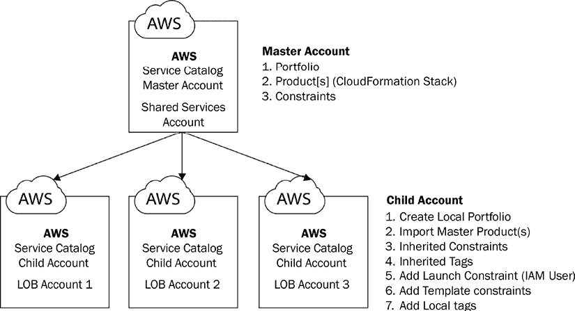

# 9

# 使用 AWS 机器学习服务设计企业级机器学习架构

许多组织选择构建企业级机器学习平台以支持众多快速发展的项目。这些平台旨在促进整个机器学习生命周期，并适应各种使用模式，同时强调自动化和可扩展性。作为一名从业者，我经常被要求提供创建此类企业级机器学习平台的架构指导。在本章中，我们将探讨设计企业级机器学习平台的基本要求。我们将涵盖一系列主题，例如工作流程自动化、基础设施可扩展性和系统监控。

在整个讨论过程中，你将深入了解那些能够开发自动化端到端机器学习工作流程并确保大规模无缝部署的技术解决方案的架构模式。此外，我们还将深入探讨企业级机器学习架构的必要组件，例如模型训练、模型托管、特征存储和模型注册，所有这些均针对满足企业级运营的需求而定制。

人工智能风险、治理和安全是企业级机器学习平台的另一些重要考虑因素，我们将在第十二章和第十三章中更详细地介绍它们。

简而言之，本章将涵盖以下主题：

+   机器学习平台的关键考虑因素

+   企业级机器学习平台的关键要求

+   企业级机器学习架构模式概述

+   采用 MLOps 进行机器学习工作流程

+   构建和运营机器学习平台的最佳实践

# 技术要求

我们将继续使用 AWS 环境为本章的动手部分。本章中提到的所有源代码都可以在[`github.com/PacktPublishing/The-Machine-Learning-Solutions-Architect-and-Risk-Management-Handbook-Second-Edition/tree/main/Chapter09`](https://github.com/PacktPublishing/The-Machine-Learning-Solutions-Architect-and-Risk-Management-Handbook-Second-Edition/tree/main/Chapter09)找到。

# 机器学习平台的关键考虑因素

设计、构建和运营机器学习平台是复杂的任务，因为有许多不同的考虑因素，包括角色、关键机器学习流程工作流以及针对不同角色和工作流的各种技术能力要求。在本节中，我们将深入探讨这些关键考虑因素。让我们深入探讨吧！

## 机器学习平台的角色及其需求

在上一章中，我们讨论了为专注于实验和模型开发的数据科学家和机器学习工程师构建数据科学环境。在企业环境中，当需要机器学习平台时，涉及到的角色和各自的具体需求就更多了。从高层次来看，与机器学习平台相关的角色有两种：机器学习平台构建者和机器学习平台用户。

### 机器学习平台构建者

ML 平台构建者承担着构建数据和 ML 平台基础设施的关键责任。以下是构建基于云的 ML 平台所需的某些基本构建者类型：

+   **云基础设施架构师/工程师**：这些专家设计整体云基础设施，选择合适的云服务并为 ML 平台搭建基础。

+   **安全工程师**：安全工程师确保 ML 平台遵循行业标准的安全实践，保护敏感数据并防范潜在威胁。

+   **ML 平台产品经理**：ML 平台产品经理负责理解功能和非功能用户需求，定义 ML 平台的能力和实施路线图。

+   **ML 平台工程师**：ML 平台工程师负责设计、构建和维护支持组织内端到端 ML 生命周期的基础设施和系统。ML 平台工程师在确保数据科学家和 ML 实践者能够高效地在组织的 ML 平台上开发、部署和管理 ML 模型方面发挥着关键作用。他们负责平台设计，涵盖关键功能领域，如训练和托管，考虑到可扩展性、性能、安全性和与现有系统的集成。

+   **数据工程师**：数据工程师负责构建数据管道、数据存储解决方案和数据处理框架，以确保 ML 任务的无缝数据访问和处理。

+   **ML 平台测试员**：ML 平台测试员负责测试平台的核心功能，以满足所需的预期功能和非功能需求。

### 平台用户和运维人员

平台用户和运维人员是 ML 平台的实际用户。他们使用 ML 平台执行从数据探索到模型监控的全生命周期 ML 任务。以下是一些关键的平台用户和运维人员类型：

+   **数据科学家/ML 工程师**：数据科学家和 ML 工程师是 ML 平台的主要用户。他们使用平台来探索数据、构建和训练 ML 模型、执行特征工程以及评估模型性能。他们与 ML 平台工程师和运维工程师合作，将训练好的模型集成到生产系统中，优化模型推理性能，并确保模型在实际环境中可扩展且可靠。

+   **模型测试和验证人员**：模型测试人员的主要职责是评估数据科学家使用机器学习平台开发的机器学习模型的性能和可靠性。具体来说，模型测试人员负责使用不同的数据集进行模型测试、计算和评估模型性能指标、检测过拟合/欠拟合以及测试边缘情况。模型验证人员负责验证模型是否符合业务目标、风险评估以及其他问题，如伦理考量。

+   **模型审批人**：此个人或团队负责审查和批准将机器学习模型部署到生产或其他关键环境。模型审批人的主要职责是在模型部署之前确保开发的机器学习模型符合组织标准、业务需求和合规政策。他们还帮助确保所有必要的测试、部署后的运营和政策都到位。

+   **运维和支持工程师**：此角色确保机器学习平台在组织内的平稳运行、维护和持续支持。他们的职责包括各种技术和运营方面，以保持机器学习平台的效率运行，并向用户提供帮助。一些关键功能包括平台维护和升级、性能监控和优化、事件管理、基础设施管理、安全和访问控制以及平台文档。

+   **人工智能风险/治理经理**：人工智能风险/治理经理的主要职责是管理和减轻使用人工智能/机器学习系统可能带来的潜在风险。他们的角色对于确保人工智能技术得到负责任、道德地开发、部署和使用，并符合相关法规至关重要。他们帮助确保创建并遵守适当的流程、政策和技术标准。

你可能会想知道机器学习解决方案架构师在这个整体图景中处于什么位置。机器学习解决方案架构师在构建者、用户和操作者之间扮演着关键角色。他们作为这些群体之间的桥梁，提供有价值的见解和指导。首先，机器学习解决方案架构师与构建者合作，了解用户需求，并协助端到端架构设计。他们确保机器学习平台与用户和操作者的特定需求保持一致。其次，机器学习解决方案架构师向用户和操作者提供有关有效利用机器学习平台的建议。他们教育他们如何配置和利用平台以满足不同的需求和用例。

## 机器学习项目的常见工作流程

在运行机器学习项目时，不同的组织具有不同的工作流程和治理流程。然而，这些工作流程通常包括以下关键步骤：

+   从不同来源收集和处理数据，使其可供数据科学家使用。

+   使用数据子集进行数据探索性分析、形成假设、创建机器学习特征、进行实验以及使用不同技术和机器学习算法构建不同的机器学习模型。

+   有时需要数据标注工作流程来标注用于监督机器学习任务（如文档分类或目标检测）的训练数据。

+   使用完整数据集进行完整模型训练和调整。

+   使用完整数据集训练的候选模型被提升到测试环境进行正式的质量保证。测试人员记录所有测试人员的测试细节，并验证模型是否满足预期的性能指标和其他评估标准，如延迟和可扩展性。模型验证者评估机器学习技术，对模型进行分析，并检查与业务成果的一致性。

+   进行模型风险评估以确保风险项得到评估、缓解或接受。

+   模型通过测试和验证步骤后，模型被发送给模型审批人员进行最终审查和批准以进行生产部署。

+   模型在获得批准后部署到生产环境中。模型在模型注册表中注册，数据集进行版本控制和保留，任何代码工件也进行版本控制和存储，详细的训练配置细节也进行了文档记录。

+   模型在生产中监控模型性能、数据漂移、系统问题和安全暴露及攻击。遵循事件管理流程来处理识别出的问题。

+   在需要的时间表上，审计员执行端到端审计以确保所有流程和政策得到遵守，工件得到存储，系统和对模型的访问得到适当记录，文档符合所需标准，任何违规行为都会被标记并升级。

值得注意的是，这些步骤并不详尽。根据组织、风险和监管要求，组织可以执行更多步骤来满足这些要求。

## 不同角色的平台要求

机器学习平台涉及各种潜在的参与者和用户。以下表格概述了机器学习平台对于用户和操作者的基本需求。请注意，该表格不包括平台的建设者。

| **用户/操作员** | **工具/能力要求** |
| --- | --- |
| 数据科学家 | 访问各种机器学习库、工具和框架以进行模型开发和实验访问不同的数据集以执行不同的机器学习任务使用不同硬件的能力进行数据探索和模型训练工作流程自动化，包括数据检索和处理、特征工程、实验、模型构建和模型版本化以实现可重复性 |
| 模型测试和验证人员 | 访问不同的测试数据集以进行模型测试和验证，以及访问用于数据可视化、模型评估、机器学习测试框架、偏差检测工具、模型可解释性工具和统计测试工具的各种库和工具 |
| 模型审批者 | 访问模型文档、模型评估指标、合规清单和模型可解释性报告，以及访问审批工作流管理工具 |
| 运维和支持工程师 | 访问机器学习平台内的所有基础设施组件，包括代码和容器存储库、库包、训练、托管、管道、日志记录、监控和警报、安全性和访问控制、备份和发现、性能测试和事件管理工具，以及访问平台自动化和管理工具 |
| 人工智能风险官 | 访问人工智能风险评估工具、治理平台、模型可解释性和可解释性工具、偏差检测和公平性评估工具、人工智能风险报告和仪表板，以及人工智能法规和政策监控 |

表 9.1：面向不同用户和操作者的机器学习平台需求

总结来说，机器学习平台的成功在很大程度上取决于满足其用户/操作者的独特工具和能力需求。通过解决这些独特需求，机器学习平台可以有效地支持其用户和操作者自信地构建、部署和管理人工智能解决方案。

# 企业机器学习平台的关键需求

为了通过大规模机器学习实现业务效益，组织必须具备快速实验多种科学方法、机器学习技术和大量数据集的能力。一旦机器学习模型经过训练和验证，它们需要无缝过渡到生产部署。虽然传统企业软件系统和机器学习平台之间存在一些相似之处，例如可扩展性和安全担忧，但企业机器学习平台提出了独特的挑战。这些挑战包括需要与数据平台和高性能计算基础设施集成，以促进大规模模型训练。

让我们深入探讨企业机器学习平台的一些具体核心需求，以满足不同用户和操作者的需求：

+   **支持端到端机器学习生命周期**：企业机器学习平台必须满足数据科学实验和生产级操作和部署的需求。在*第八章*，*使用 AWS 机器学习服务构建数据科学环境*中，我们探讨了构建使用 AWS 机器学习服务的数据科学实验环境所需的基本架构组件。然而，为了促进无缝的生产级操作和部署，企业机器学习平台还应包括专门针对大规模模型训练、模型管理、特征管理和高度可用且可扩展的模型托管的特定架构组件。

+   **支持持续集成（CI）、持续训练（CT）和持续部署（CD）**：除了测试和验证代码和组件外，企业级机器学习平台的 CI 能力还扩展到包括数据和模型。机器学习的 CD 能力不仅限于部署单个软件组件；它还涉及管理与推理引擎相结合的机器学习模型。CT 是机器学习的一个独特方面，其中模型会持续监控，并在检测到数据漂移、模型漂移或训练数据变化时自动触发模型重新训练。数据漂移指的是数据发生变化，其中生产数据的统计特征与用于模型训练的数据不同。另一方面，模型漂移表示模型性能相对于模型训练阶段达到的性能有所下降。

+   **操作支持**：企业级机器学习平台应提供监控不同管道工作流程状态、错误和指标、处理/训练作业、模型行为变化、数据漂移和模型服务引擎的能力。此外，基础设施级别的统计信息和资源使用情况持续监控，以确保高效的操作。自动警报机制是操作的关键组成部分，能够及时通知相关利益相关者任何问题或异常。此外，尽可能实施自动故障恢复机制，进一步增强了平台的安全性并最小化了停机时间，确保了平稳和可靠的机器学习操作。

+   **支持不同语言和机器学习框架**：企业级机器学习平台使数据科学家和机器学习工程师能够使用他们偏好的编程语言和机器学习库。它应容纳流行的语言，如 Python 和 R，以及知名的机器学习框架，如 TensorFlow、PyTorch 和 scikit-learn。这种灵活性确保团队可以利用他们的专业知识，并在平台内利用最合适的工具进行高效和有效的模型开发。

+   **计算硬件资源管理**：企业级机器学习平台应满足多样化的模型训练和推理需求，同时考虑成本因素。这包括提供对各种计算硬件的支持，例如 CPU 和 GPU，以优化性能和成本效益。此外，平台还应具备处理专用机器学习硬件的能力，如 AWS 的 Inferentia 和 Tranium 芯片，在相关情况下，以利用专用硬件加速器为特定机器学习工作负载带来的好处。

+   **与其他第三方系统和软件的集成**：企业机器学习平台很少独立运行。它必须提供与各种第三方软件和平台（包括工作流程编排工具、容器注册库和代码仓库）的强大集成能力。这种无缝集成使得团队合作和互操作性变得顺畅，允许团队利用现有工具和工作流程，同时受益于机器学习平台的先进功能和能力。

+   **身份验证和授权**：对于企业机器学习平台来说，确保对数据、文物和机器学习平台资源的安全访问是至关重要的。这需要提供各种级别的身份验证和授权控制。平台可能包括内置的身份验证和授权功能，或者它可以与外部身份验证和授权服务集成。

+   **数据加密**：在金融服务和医疗保健等受监管的行业中，数据加密是一个关键要求。企业机器学习平台必须提供强大的能力来加密静态和传输中的数据，通常允许客户管理他们的加密密钥。这种数据保护水平确保敏感信息保持安全并符合行业法规，为在这些行业中处理机密数据提供了必要的保证。

+   **文物管理**：在机器学习生命周期中，企业机器学习平台在各个阶段处理数据集并生成各种文物。这些文物可以是特征、代码、模型和容器。为确保可重复性和遵守治理和合规标准，平台必须具备跟踪、管理和版本控制这些文物的能力。通过有效管理和记录整个机器学习过程中所做的更改，平台保持了一个清晰且有序的记录，促进了结果的重复性，并为合规目的提供了可靠的审计轨迹。

+   **机器学习库包管理**：对于许多组织来说，标准化和批准数据科学家使用的机器学习库包至关重要。通过建立一个包含预先批准包的中心库，可以强制执行跨库包使用的统一标准和政策。这种方法确保数据科学家在开发机器学习解决方案时使用经过审查和授权的库，促进可靠性、安全性和遵守组织指南。

+   **访问不同的数据存储**：企业机器学习平台的一个基本功能是提供对各种数据存储的无缝访问，简化模型开发和训练过程。这种对多样化数据源的访问简化了数据科学家和机器学习工程师的工作流程，使他们能够高效地访问和利用平台内执行任务所需的必要数据。

+   **自助服务能力**：为了提高运营效率并减少对中央团队的依赖，企业 ML 平台应包含自助服务能力，以支持用户入职、环境设置和管道提供等任务。通过使用户能够独立执行这些任务，平台简化了操作，使数据科学家和 ML 工程师能够更加自主和高效地工作。

+   **模型测试和验证**：企业 ML 平台应提供全面的模型测试和验证功能，以支持对 ML 模型的彻底评估。这可能包括 A/B 测试基础设施、模型鲁棒性测试包、自动化测试管道、性能指标跟踪和错误分析工具以及可视化等功能。

在了解了企业 ML 平台的基本要求后，现在让我们探讨如何有效地利用 AWS ML 和 DevOps 服务，如 SageMaker、CodePipeline 和 Step Functions，来构建一个强大、企业级 ML 平台。

# 企业 ML 架构模式概述

在 AWS 上构建企业 ML 平台的第一步是创建不同的环境，以启用不同的数据科学和运营功能。以下图表显示了通常构成企业 ML 平台的核心环境。从隔离的角度来看，在 AWS 云的背景下，以下图表中的每个环境都是一个独立的 AWS 账户：


图 9.1：企业 ML 架构环境

如我们在*第八章*中讨论的，*使用 AWS ML 服务构建数据科学环境*，数据科学家利用数据科学环境进行实验、模型构建和调整。一旦这些实验完成，数据科学家会将他们的工作提交到适当的代码和数据存储库。下一步是在受控和自动化的环境中使用数据科学家创建的算法、数据和训练脚本来训练和调整 ML 模型。这个受控和自动化的模型训练过程将有助于确保可扩展模型构建的一致性、可重复性和可追溯性。以下是由训练、托管和共享服务环境提供的核心功能和技术选项：

+   **模型训练环境**：此环境管理模型训练的整个生命周期，从计算和存储基础设施资源分配到训练作业监控和模型持久化。为此，SageMaker 训练服务提供了一个合适的技术选项来构建训练基础设施。

+   **模型托管环境**：此环境用于在 Web 服务端点或批量推理模式下提供训练好的模型。为此，你可以使用 SageMaker 托管服务。其他支持服务，如在线特征存储和 API 管理服务，也可以在模型托管环境中运行。可以存在多个模型托管环境，用于不同的阶段。例如，你可以有一个专门用于模型测试的测试托管环境，以及一个用于生产模型部署并服务于现实世界流量的生产托管环境。模型测试人员可以执行不同的测试，例如模型性能、鲁棒性、偏差、可解释性分析和模型托管测试。

+   **共享服务环境**：共享服务环境托管常见服务，如工作流编排工具、CI/CD 工具、代码仓库、Docker 镜像仓库和私有库包工具。中央模型注册库也可以在共享服务环境中运行，用于模型注册和模型生命周期管理。服务提供能力，如通过**基础设施即代码**（**IaC**）或 API 在不同环境中创建资源，也运行在这个环境中。任何服务票证工具，如 ServiceNow，以及服务提供工具，如服务目录，也可以托管在这个环境中。

除了核心的机器学习环境之外，还有其他支持环境，例如安全、治理、监控和日志记录，这些环境对于设计和构建企业级机器学习平台是必需的：

+   **安全和治理环境**：安全和治理环境集中管理身份验证服务、用户凭证和数据加密密钥。安全审计和报告流程也运行在这个环境中。可以用于各种安全和治理功能的原生 AWS 服务，如 Amazon IAM、AWS KMS 和 AWS Config。任何定制的风险和治理工具也可以托管在这个环境中，以服务 AI 风险/治理经理。

+   **监控和日志环境**：监控和日志环境集中聚合来自其他环境的监控和日志数据，以进行进一步的处理和报告。通常开发定制的仪表板和警报机制，以便轻松访问底层监控和日志数据中的关键指标和警报。

现在你已经对企业级机器学习平台构成的基本元素有了全面的了解，让我们更深入地探讨具体的核心领域。重要的是要认识到，在 AWS 上构建机器学习平台有各种模式和可用服务。

此外，虽然*图 9.1*展示了不同的 AWS 环境（即，AWS 账户）以托管不同的机器学习平台环境，但组织也可以选择将某些环境组合在单个 AWS 账户中，只要不同环境之间存在适当的边界，以确保基础设施、流程和安全管理上的隔离。此外，组织可以为托管不同用户或组的特定环境创建单独的 AWS 账户。例如，大型企业可以选择为每个业务部门创建一个数据科学环境，或者基于组织结构或工作负载分离创建单独的生产托管环境。在本章中，我们将主要关注探索一种企业模式来构建高效且可扩展的机器学习平台。

## 模型训练环境

在企业内部，模型训练环境是一个受控环境，具有关于其使用方式和谁可以使用它的明确流程和政策。通常，它应该是一个由机器学习运营团队管理的自动化环境，尽管可以启用自助服务以供数据科学家直接使用。

自动化模型训练和调优是模型训练环境的核心功能。为了支持广泛的使用案例，模型训练环境需要支持不同的机器学习和深度学习框架、训练模式（单节点和分布式训练）以及硬件（不同的 CPU、GPU 和定制硅芯片）。

模型训练环境管理着模型训练过程的生命周期。这可以包括身份验证和授权、基础设施配置、数据移动、数据预处理、机器学习库部署、训练循环管理和监控、模型持久化和注册、训练作业管理和谱系跟踪。从安全角度来看，训练环境需要提供针对不同隔离需求的安全功能，例如网络隔离、作业隔离和工件隔离。为了协助运营支持，模型训练环境还需要能够支持训练状态日志记录、指标报告以及训练作业监控和警报。在接下来的章节中，我们将讨论如何使用 Amazon SageMaker 作为企业管理的模型训练引擎。

### 使用 SageMaker 的模型训练引擎

SageMaker 训练服务为各种机器学习/深度学习库提供了内置的模型训练功能。此外，您还可以为定制模型训练需求带来自己的 Docker 容器。以下是 SageMaker Python SDK 支持的选项子集：

+   **训练 TensorFlow 模型**：SageMaker 为 TensorFlow 模型提供了内置的训练容器。以下代码示例展示了如何通过 TensorFlow 估计器 API 使用内置容器训练 TensorFlow 模型：

    ```py
    from sagemaker.tensorflow import TensorFlow
    tf_estimator = TensorFlow(
      entry_point="<Training script name>",
      role= "<AWS IAM role>",
      instance_count=<Number of instances),
      instance_type="<Instance type>",
      framework_version="<TensorFlow version>",
      py_version="<Python version>",)
    tf_estimator.fit("<Training data location>") 
    ```

+   **训练 PyTorch 模型**：SageMaker 为 PyTorch 模型提供内置训练容器。以下代码示例展示了如何使用 PyTorch 估计器训练 PyTorch 模型：

    ```py
    from sagemaker.pytorch import PyTorch
    pytorch_estimator = PyTorch(
      entry_point="<Training script name>",
      role= "<AWS IAM role>",
      instance_count=<Number of instances),
      instance_type="<Instance type>",
      framework_version="<PyTorch version>",
      py_version="<Python version>",)
    pytorch_estimator.fit("<Training data location>") 
    ```

+   **训练 XGBoost 模型**：XGBoost 训练也通过内置容器支持。以下代码展示了使用 XGBoost 估计器训练 XGBoost 模型的语法：

    ```py
    from sagemaker.xgboost.estimator import XGBoost
    xgb_estimator = XGBoost(
      entry_point="<Training script name>",
      hyperparameters=<dictionary of hyperparameters>,
      role=<AWS IAM role>,
      instance_count=<Number of instances>,
      instance_type="<Instance type>",
      framework_version="<Xgboost version>")
    xgb_estimator.fit("<train data location>") 
    ```

+   **使用 scikit-learn 训练模型**：以下代码示例展示了如何使用内置容器训练 scikit-learn 模型：

    ```py
    from sagemaker.sklearn.estimator import SKLearn
    sklearn_estimator = SKLearn(
      entry_point="<Training script name>",
      hyperparameters=<dictionary of hyperparameters>,
      role=<AWS IAM role>,
      instance_count=<Number of instances>,
      instance_type="<Instance type>",
         framework_version="<sklearn version>")
    Sklearn_estimator.fit("<training data>") 
    ```

+   **使用自定义容器训练模型**：您还可以构建自定义训练容器，并使用 SageMaker 训练服务进行模型训练。以下代码示例展示了如何进行：

    ```py
    from sagemaker.estimator import Estimator
    custom_estimator = Estimator (
      image_uri="<custom model inference container image uri>"
      role=<AWS IAM role>,
      instance_count=<Number of instances>,
      instance_type="<Instance type>")
    custom_estimator.fit("<training data location>") 
    ```

除了使用 SageMaker Python SDK 启动训练外，您还可以使用`boto3`库和 SageMaker CLI 命令来启动训练作业。

### 自动化支持

SageMaker 训练服务通过一组 API 进行暴露，可以通过与外部应用程序或工作流程工具集成来自动化，例如 SageMaker Pipelines、Airflow 和 AWS Step Functions。例如，它可以是端到端机器学习工作流程中基于 Airflow 的管道的步骤之一。一些工作流程工具，如 Airflow 和 AWS Step Functions，还提供了 SageMaker 特定的连接器，以便更无缝地与 SageMaker 训练服务交互。SageMaker 训练服务还提供 Kubernetes 操作符，因此它可以作为 Kubernetes 应用程序流程的一部分进行集成和自动化。

以下示例代码展示了如何通过 AWS `boto3` SDK 的低级 API 启动训练作业：

```py
import boto3
client = boto3.client('sagemaker')
response = client.create_training_job(
    TrainingJobName='<job name>',
    HyperParameters={<list of parameters and value>},
    AlgorithmSpecification={...},
    RoleArn='<AWS IAM Role>',
    InputDataConfig=[...],
    OutputDataConfig={...},
    ResourceConfig={...},
    ...
} 
```

关于使用 Airflow 作为工作流程工具，以下示例展示了如何在工作流程定义中将 Airflow SageMaker 操作符作为一部分使用。在这里，`train_config`包含训练配置细节，例如训练估计器、训练实例类型和数量以及训练数据位置：

```py
import airflow
from airflow import DAG
from airflow.contrib.operators.sagemaker_training_operator import SageMakerTrainingOperator
default_args = {
    'owner': 'myflow',
    'start_date': '2021-01-01'
}
dag = DAG('tensorflow_training', default_args=default_args,
          schedule_interval='@once')
train_op = SageMakerTrainingOperator(
    task_id='tf_training',
    config=train_config,
    wait_for_completion=True,
    dag=dag) 
```

SageMaker 还内置了一个名为**SageMaker Pipelines**的工作流程自动化工具。可以使用 SageMaker **Training Step** API 创建训练步骤并将其集成到更大的 SageMaker Pipelines 工作流程中。

### 模型训练生命周期管理

SageMaker 训练管理模型训练过程的生命周期。它使用 Amazon IAM 作为验证和授权访问其功能的机制。一旦授权，它提供所需的架构，部署满足不同模型训练需求的软件堆栈，将数据从源移动到训练节点，并启动训练作业。一旦训练作业完成，模型工件将被保存到 S3 输出桶中，并且架构将被拆除。对于谱系追踪，捕获模型训练元数据，如源数据集、模型训练容器、超参数和模型输出位置。任何来自训练作业运行的日志都将保存到 CloudWatch 日志中，系统指标，如 CPU 和 GPU 利用率，将捕获到 CloudWatch 指标中。

根据整体端到端机器学习平台架构，模型训练环境也可以托管数据预处理、模型验证和模型训练后处理等服务，因为这些是端到端机器学习流程中的重要步骤。为此，有多种技术选项可用，例如 SageMaker 处理服务、AWS Glue 和 AWS Lambda。

## 模型托管环境

一个企业级的模型托管环境需要以安全、高效和可扩展的方式支持广泛的机器学习框架。它应该附带一系列预构建的推理引擎，这些引擎可以支持常见的模型，通过**RESTful API**或**gRPC 协议**直接提供。它还需要提供灵活性，以托管针对特定需求的定制构建的推理引擎。用户还应能够访问不同的硬件设备，如 CPU、GPU 和专用芯片，以满足不同的推理需求。

一些模型推理模式需要更复杂的推理图，例如流量分割、请求转换或模型集成支持。模型托管环境可以提供这种功能作为即插即用的特性，或者提供技术选项来构建自定义推理图。其他常见的模型托管功能包括**概念漂移检测**和**模型性能漂移检测**。当生产数据的统计特性与用于模型训练的数据不符时，就会发生概念漂移。概念漂移的一个例子是，在生产环境中，一个特征的平均值和标准差与训练数据集相比发生了显著变化。当模型在生产中的准确性下降时，就会发生模型性能漂移。

模型托管环境中的组件可以通过其 API、脚本或 IaC 部署（如 AWS CloudFormation）参与自动化工作流程。例如，可以使用 CloudFormation 模板部署 RESTful 端点，或者作为自动化工作流程的一部分调用其 API。

从安全角度来看，模型托管环境需要提供身份验证和授权控制，以管理对**控制平面**（管理功能）和**数据平面**（模型端点）的访问。针对托管环境的访问和操作应记录下来，以供审计。为了支持操作支持，托管环境需要启用状态日志记录和系统监控，以支持系统可观察性和问题调试。

SageMaker 托管服务是一个完全托管的模型托管服务。类似于我们在本书中之前审查的 KFServing 和 Seldon Core，SageMaker 托管服务也是一个多框架模型托管服务。接下来，我们将更详细地探讨其为企业级模型托管提供的各种功能。

### 推理引擎

SageMaker 为多个 ML 框架提供内置推理引擎，包括 scikit-learn、XGBoost、TensorFlow、PyTorch 和 Spark ML。SageMaker 以 Docker 容器形式提供这些内置推理引擎。为了搭建一个 API 端点来服务模型，您只需提供模型工件和基础设施配置。以下是一个模型服务选项列表：

+   **服务 TensorFlow 模型**：SageMaker 使用 TensorFlow Serving 作为 TensorFlow 模型的推理引擎。以下代码示例展示了如何使用 SageMaker 托管服务部署 TensorFlow Serving 模型，其中使用 `Model` 类从 S3 位置加载 TensorFlow 模型，并使用指定计算实例类型和数量的 `deploy()` 函数将其部署为 SageMaker 端点：

    ```py
    from sagemaker.tensorflow.serving import Model
    tensorflow_model = Model(
        model_data=<S3 location of the TF ML model artifacts>,
        role=<AWS IAM role>,
       framework_version=<tensorflow version>
    )
    tensorflow_model.deploy(
      initial_instance_count=<instance count>, instance_type=<instance type>
    ) 
    ```

+   **服务 PyTorch 模型**：SageMaker 托管在底层使用 TorchServe 来服务 PyTorch 模型。以下代码示例展示了如何部署 PyTorch 模型，其代码与部署 TensorFlow 模型的代码非常相似：

    ```py
    from sagemaker.pytorch.model import PyTorchModel
    pytorch_model = PyTorchModel(
        model_data=<S3 location of the PyTorch model artifacts>,
        role=<AWS IAM role>,
        framework_version=<PyTorch version>
    )
    pytorch_model.deploy(
        initial_instance_count=<instance count>, instance_type=<instance type>
    ) 
    ```

+   **服务 Spark ML 模型**：对于基于 Spark ML 的模型，SageMaker 使用 MLeap 作为后端来服务 Spark ML 模型。这些 Spark ML 模型需要序列化为 MLeap 格式，以便它们可以被 MLeap 引擎使用。以下代码示例展示了如何使用 SageMaker 托管服务部署 Spark ML 模型，其中使用 `SparkMLModel` 类指定模型配置，并使用 `deploy()` 函数将模型实际部署到 SageMaker 端点：

    ```py
    import sagemaker
    from sagemaker.sparkml.model import SparkMLModel
    sparkml_model = SparkMLModel(
        model_data=<S3 location of the Spark ML model artifacts>,
        role=<AWS IAM role>,
        sagemaker_session=sagemaker.Session(),
        name=<Model name>,
        env={"SAGEMAKER_SPARKML_SCHEMA": <schema_json>}
    )
    sparkml_model.deploy(
        initial_instance_count=<instance count>, instance_type=<instance type>
    ) 
    ```

+   **服务 XGBoost 模型**：SageMaker 为训练好的 XGBoost 模型提供 XGBoost 模型服务器。在底层，它使用 Nginx、Gunicorn 和 Flask 作为模型服务架构的一部分。入口 Python 脚本加载训练好的 XGBoost 模型，并可选择执行预处理和后处理数据：

    ```py
    from sagemaker.xgboost.model import XGBoostModel
    xgboost_model = XGBoostModel(
        model_data=<S3 location of the Xgboost ML model artifacts>,
        role=<AWS IAM role>,
        entry_point=<entry python script>,
        framework_version=<xgboost version>
    )
    xgboost_model.deploy(
        instance_type=<instance type>,
        initial_instance_count=<instance count>
    ) 
    ```

+   **服务 scikit-learn 模型**：SageMaker 为基于 scikit-learn 的模型提供内置服务容器。技术堆栈与 XGBoost 模型服务器类似，也是基于 Nginx、Gunicorn 和 Flask：

    ```py
    from sagemaker.sklearn.model import SKLearnModel
    sklearn_model = SKLearnModel(
        model_data=<S3 location of the Xgboost ML model artifacts>,
        role=<AWS IAM role>,
        entry_point=<entry python script>,
        framework_version=<scikit-learn version>
    )
    sklearn_model.deploy(instance_type=<instance type>, initial_instance_count=<instance count>) 
    ```

+   **使用自定义容器服务模型**：对于自定义创建的推理容器，您可以遵循类似的语法来部署模型。主要区别是必须提供自定义推理容器镜像的 uri，以指定自定义容器的位置。您可以在 [`docs.aws.amazon.com/sagemaker/latest/dg/adapt-inference-container.html`](https://docs.aws.amazon.com/sagemaker/latest/dg/adapt-inference-container.html) 找到有关构建自定义推理容器的详细文档：

    ```py
    from sagemaker.model import Model
    custom_model = Model(
        Image_uri = <custom model inference container image uri>,
        model_data=<S3 location of the ML model artifacts>,
        role=<AWS IAM role>,
        framework_version=<scikit-learn version>
    )
    custom_model.deploy(instance_type=<instance type>, initial_instance_count=<instance count>) 
    ```

SageMaker 托管提供推理管道功能，允许您创建一个线性序列的容器，在调用模型进行预测前后执行自定义数据处理。SageMaker 托管可以支持在模型多个版本之间进行流量拆分，以进行 A/B 测试。

可以使用 AWS CloudFormation 模板来配置 SageMaker 托管。同时，也支持 AWS CLI 用于脚本自动化，并且可以通过其 API 集成到自定义应用程序中。以下是一些不同端点部署自动化方法的代码示例：

+   以下是一个用于 SageMaker 端点部署的 CloudFormation 代码示例。在这个代码示例中，你指定了计算实例、实例数量、模型名称以及用于托管模型的模型服务容器。你可以在这里找到完整的代码：[`github.com/PacktPublishing/The-Machine-Learning-Solutions-Architect-and-Risk-Management-Handbook-Second-Edition/blob/main/Chapter09/sagemaker_hosting.yaml`](https://github.com/PacktPublishing/The-Machine-Learning-Solutions-Architect-and-Risk-Management-Handbook-Second-Edition/blob/main/Chapter09/sagemaker_hosting.yaml)

    ```py
    Description: "Model hosting cloudformation template"
    Resources:
    Endpoint:
    Type: "AWS::SageMaker::Endpoint"
    Properties:
    EndpointConfigName:
    !GetAtt EndpointConfig.EndpointConfigName
    EndpointConfig:
    Type: "AWS::SageMaker::EndpointConfig"
    Properties:
    ProductionVariants:
    - InitialInstanceCount: 1
    InitialVariantWeight: 1.0
    InstanceType: ml.t2.large
    ModelName: !GetAtt Model.ModelName
    VariantName: !GetAtt Model.ModelName
    Model:
    Type: "AWS::SageMaker::Model"
    Properties:
    PrimaryContainer:
    Image: <container uri>
    ExecutionRoleArn: !GetAtt ExecutionRole.Arn
    ... 
    ```

+   以下是一个用于 SageMaker 端点部署的 AWS CLI 示例，它包括三个主要步骤：创建模型、指定 SageMaker 端点配置以及将模型实际部署到 SageMaker 端点：

    ```py
    Aws sagemaker create-model --model-name <value> --execution-role-arn <value>
    aws sagemaker Create-endpoint-config --endpoint-config-name <value> --production-variants <value>
    aws sagemaker Create-endpoint --endpoint-name <value> --endpoint-config-name <value> 
    ```

如果内置的推理引擎不符合你的要求，你应该考虑引入自己的 Docker 容器来托管你的机器学习模型。

### 认证和安全控制

SageMaker 托管服务使用 AWS IAM 作为控制平面 API（例如，创建端点的 API）和数据平面 API（例如，调用托管模型端点的 API）的访问控制机制。如果你需要支持数据平面 API 的其他认证方法，例如 **OpenID Connect**（**OIDC**），你可以实现一个代理服务作为前端来管理用户认证。一种常见的模式是使用 AWS API Gateway 作为 SageMaker API 的前端，以实现自定义认证管理以及其他 API 管理功能，如计费和节流管理。

### 监控和日志记录

SageMaker 提供了开箱即用的监控和日志记录功能，以协助支持操作。它监控系统资源指标（例如，CPU/GPU 利用率）和模型调用指标（例如，调用次数、模型延迟和失败）。这些监控指标以及任何模型处理日志都由 AWS CloudWatch 指标和 CloudWatch 日志捕获。

现在我们已经涵盖了机器学习平台训练、推理、安全和监控方面的内容，接下来我们将深入探讨如何实现 MLOps 以自动化机器学习工作流程。

# 采用 MLOps 进行机器学习工作流程

与广泛采用于传统软件开发和部署过程的 DevOps 实践类似，MLOps 实践旨在简化机器学习管道的构建和部署流程，同时增强数据科学家/机器学习工程师、数据工程和运维团队之间的协作。具体来说，MLOps 实践的主要目标是在整个机器学习生命周期中产生以下主要好处：

+   **流程一致性**：MLOps 实践旨在在机器学习模型构建和部署过程中创建一致性。一致的流程可以提高机器学习工作流的效率，并确保机器学习工作流的输入和输出具有高度的确定性。

+   **工具和流程可重用性**：MLOps 实践的核心目标之一是创建可重用的技术工具和模板，以加快新机器学习用例的采用和部署。这可以包括常见的工具，如代码和库存储库、打包和镜像构建工具、管道编排工具、模型注册表以及模型训练和模型部署的通用基础设施。从可重用模板的角度来看，这可以包括用于 Docker 镜像构建的通用可重用脚本、工作流编排定义以及用于模型构建和模型部署的 CloudFormation 脚本。

+   **模型构建可重复性**：机器学习高度迭代，可能涉及大量使用不同数据集、算法和超参数的实验和模型训练运行。MLOps 流程需要捕获用于构建机器学习模型的所有数据输入、源代码和工件，并从这些输入数据、代码和工件中建立最终模型的模型血缘。这对于实验跟踪以及治理和控制目的都至关重要。

+   **交付可扩展性**：MLOps 流程和相关工具能够并行运行大量机器学习管道，以实现高吞吐量的交付。不同的机器学习项目团队可以独立使用标准的 MLOps 流程和通用工具，而不会因资源竞争、环境隔离和治理方面的冲突而产生冲突。

+   **流程和操作可审计性**：MLOps 使流程和机器学习管道的可审计性更高。这包括捕获机器管道执行的详细信息、不同步骤之间的依赖关系和血缘、作业执行状态、模型训练和部署细节、审批跟踪以及由人工操作员执行的操作。

现在我们已经熟悉了 MLOps 实践的预期目标和好处，让我们深入了解 AWS 上 MLOps 的具体操作流程和具体技术架构。

## MLOps 架构的组件

MLOps 最重要的概念之一是自动化管道，它执行一系列任务，如数据处理、模型训练和模型部署。这个管道可以是步骤的线性序列，也可以是一个更复杂的**有向无环图**（**DAG**），支持多个任务的并行执行。以下图表展示了 ML 管道的示例 DAG。


图 9.2：样本 ML 管道流程

MLOps 架构还包括几个存储库，用于存储在管道执行过程中不同资产和元数据。以下图表列出了 MLOps 操作中的核心组件和任务：


图 9.3：MLOps 组件

+   **代码存储库**是 MLOps 架构组件，它不仅作为数据科学家和工程师的源代码控制机制，还可以作为触发不同管道执行的机制。例如，当数据科学家将更新的训练脚本检查到代码存储库中时，可以触发模型训练管道执行。

+   **特征存储库**存储可重用的 ML 特征，可以是数据处理/特征工程作业的目标。特征存储库中的特征可以是适用情况下的训练数据集的一部分。特征存储库还用作模型推理请求的一部分。

+   **容器存储库**存储用于数据处理任务、模型训练作业和模型推理引擎的容器镜像。它通常是容器构建管道的目标。

+   **模型注册库**保存训练模型的清单，以及与模型相关的所有元数据，例如其算法、超参数、模型指标和训练数据集位置。它还维护模型生命周期的状态，例如其部署批准状态。

+   **管道存储库**维护自动化管道的定义和不同管道作业执行的状态。

在企业环境中，当执行不同任务，如模型部署时，也需要创建任务票据，以便这些操作可以在一个共同的票据管理系统中被追踪。为了支持审计要求，需要追踪不同管道任务及其相关工件的历史。

MLOps 架构的另一个关键组件是**监控**。通常，您希望监控管道的执行状态、模型训练状态和模型端点状态。模型端点监控还可以包括系统/资源性能监控、模型统计指标监控、漂移和异常监控以及模型可解释性监控。可以在某些执行状态上触发警报，以调用所需的人类或自动化操作。

AWS 为实施 MLOps 架构提供了多种技术选项。以下图表显示了这些技术服务在企业 MLOps 架构中的位置：


**图 9.4**：使用 AWS 服务的 MLOps 架构

如我们之前提到的，共享服务环境托管了用于流水线管理和执行的常用工具，以及如代码仓库和模型注册表等常用仓库。

在这里，我们使用 AWS CodePipeline 来编排整体的 CI/CD 流水线。AWS CodePipeline 是一个持续交付服务。我们在这里使用此服务，因为它可以与不同的代码仓库如 AWS CodeCommit、GitHub 仓库和 Bitbucket 等原生集成。

它可以从代码仓库中提取文件，并将它们提供给下游任务，例如使用 AWS CodeBuild 服务构建容器或训练模型训练环境中的模型。您可以根据不同的需求创建不同的流水线。流水线可以通过 API 或 CodePipeline 管理控制台按需触发，或者可以通过代码仓库中的代码更改触发。根据您的需求，您可以创建不同的流水线。在先前的图表中，我们可以看到四个示例流水线：

+   用于构建用于训练、处理和推理的不同容器镜像的容器构建流水线

+   用于为发布训练模型的模型训练流水线

+   用于将训练好的模型部署到生产的模型部署流水线

+   用于在数据科学环境中进行模型训练和部署测试的开发、训练和测试流水线

注意，虽然**图 9.4**只展示了四个不同的流水线，但实际上，根据具体需求，组织可以有更多流水线。此外，它们可以并行运行相同流水线的多个实例，以适应各种机器学习项目。例如，不同的训练作业流水线实例可以独立且并发运行，每个实例都专门用于使用不同的数据集和配置训练不同的机器学习模型。

代码仓库是 MLOps 环境中最重要的组件之一。它不仅被数据科学家/机器学习工程师和其他工程师用于持久化代码工件，而且还作为 CI/CD 流水线的触发机制。这意味着当数据科学家/机器学习工程师提交代码更改时，它可以自动启动 CI/CD 流水线。例如，如果数据科学家修改了模型训练脚本并希望在开发环境中测试自动化的训练流水线，他们可以将代码提交到开发分支以在开发环境中启动模型训练流水线。当它准备进行生产发布部署时，数据科学家可以将/合并代码到发布分支以启动生产发布流水线。

简而言之，在**图 9.4**的 MLOps 架构中，我们使用了：

+   亚马逊**弹性容器注册库**（**ECR**）作为中央容器注册服务。ECR 用于存储数据处理、模型训练和模型推理的容器。您可以为容器镜像添加标签，以指示不同的生命周期状态，如开发或生产。

+   **SageMaker 模型注册库**作为中央模型仓库。中央模型仓库可以位于共享服务环境中，因此可以被不同的项目访问。所有经过正式训练和部署周期的模型都应该在中央模型仓库中进行管理和跟踪。

+   **SageMaker 特征存储**提供了一个通用的特征仓库，供不同项目重用。它可以位于共享服务环境中，或成为数据平台的一部分。特征通常在数据管理环境中预先计算，并发送到 SageMaker 特征存储，以便在模型训练环境中进行离线模型训练，以及不同模型托管环境中的在线推理。

## 监控和日志记录

在监控方面，机器学习平台带来了一些独特的挑战。除了监控常见的软件系统相关指标和状态，如基础设施利用率和处理状态外，机器学习平台还需要监控模型和数据特定的指标和性能。此外，与传统的系统级监控相比，其直观性较强，而机器学习模型的透明度使得理解系统本身变得固有困难。现在，让我们更深入地了解机器学习平台监控的三个主要领域。

### 模型训练监控

模型训练监控提供了对训练进度的可见性，并有助于在训练过程中识别训练瓶颈和错误条件。它使操作流程，如训练作业进度报告和响应、模型训练性能进度评估和响应、训练问题故障排除以及数据和模型偏差检测以及模型可解释性和响应成为可能。具体来说，我们希望在模型训练期间监控以下关键指标和条件：

+   **通用系统和资源利用及错误指标**：这些指标提供了对基础设施资源（如 CPU、GPU、磁盘 I/O 和内存）在模型训练中如何被利用的可见性。这些指标可以帮助您在满足不同模型训练需求时做出基础设施配置的决策。

+   **训练作业事件和状态**：这提供了对训练作业进度的可见性，例如作业的开始和运行、完成以及失败详情。

+   **模型训练指标**：这些是模型训练指标，例如损失曲线和准确率报告，有助于您了解模型的表现。

+   **偏差检测指标和模型可解释性报告**：这些指标有助于您了解训练数据集或机器学习模型中是否存在偏差。模型可解释性也可以被监控和报告，以帮助您理解重要特征与不重要特征之间的区别。

+   **模型训练瓶颈和训练问题**：这些提供了对训练问题（如梯度消失、权重初始化不良和过拟合）的可见性，以帮助确定所需的数据和算法以及训练配置更改。例如，CPU 和 I/O 瓶颈、负载不均和低 GPU 利用率等指标可以帮助确定更高效模型训练的基础设施配置更改。

AWS 提供了多个本地服务，用于在 AWS 上构建模型监控架构。以下图显示了为基于 SageMaker 的模型训练环境构建监控解决方案的示例架构：


图 9.5：模型训练监控架构

此架构允许您监控训练和系统指标，并执行日志捕获和处理、训练事件捕获和处理以及模型训练偏差和可解释性报告。它有助于启用操作流程，如训练进度和状态报告、模型指标评估、系统资源利用率报告和响应、训练问题故障排除、偏差检测和模型决策可解释性。

在模型训练期间，SageMaker 可以向 AWS CloudWatch 发出模型训练指标，如训练损失和准确率，以帮助进行模型训练评估。AWS CloudWatch 是 AWS 监控和可观察性服务。它收集来自其他 AWS 服务的指标和日志，并提供仪表板以可视化和分析这些指标和日志。系统利用率指标（如 CPU/GPU/内存利用率）也报告给 CloudWatch 进行分析，以帮助您了解任何基础设施限制或低利用率。可以为单个指标或复合指标创建 CloudWatch 警报，以自动通知或响应。例如，您可以为低 CPU/GPU 利用率创建警报，以帮助主动识别训练作业的次优硬件配置。此外，当警报被触发时，它可以通过 AWS **简单通知服务**（**SNS**）发送自动通知（如短信和电子邮件），以支持通过 AWS 进行审查。

您可以使用 CloudWatch 日志收集、监控和分析训练作业发出的日志。您可以使用这些捕获的日志来了解训练作业的进度，并识别错误和模式，以帮助解决任何模型训练问题。例如，CloudWatch 日志可能包含错误，如模型训练时 GPU 内存不足或访问特定资源时的权限问题，以帮助您解决模型训练问题。默认情况下，CloudWatch 日志提供了一个名为 CloudWatch 日志洞察的 UI 工具，用于使用专门构建的查询语言交互式分析日志。或者，这些日志也可以转发到 Elasticsearch 集群进行分析和查询。这些日志可以在指定的日志和监控账户中聚合，以集中管理日志访问和分析。

SageMaker 训练作业还可以发送事件，例如训练作业状态从运行变为完成。您可以根据这些不同的事件创建自动通知和响应机制。例如，当训练作业成功完成或失败时，您可以向数据科学家发送通知，包括失败原因。您还可以自动对不同状态（如特定失败条件下的模型重新训练）的失败做出响应。

SageMaker Clarify 组件可以检测数据和模型偏差，并提供训练模型的模型可解释性报告。您可以在 SageMaker Studio UI 或 SageMaker API 中访问偏差和模型可解释性报告。

### 模型端点监控

模型端点监控提供了对模型服务基础设施性能的可见性，以及模型特定的指标，如数据漂移、模型漂移和推理可解释性。以下是一些模型端点监控的关键指标：

+   **通用系统和资源利用及错误指标**：这些指标提供了对基础设施资源（如 CPU、GPU 和内存）用于模型服务利用情况的可见性。它们可以帮助您在为不同的模型服务需求提供基础设施时做出决策。

+   **数据统计监控指标**：数据的统计性质可能会随时间变化，这可能导致从原始基准测试中降级 ML 模型性能。这些指标可以包括基本统计偏差，如均值和标准差的变化，以及数据分布的变化。

+   **模型质量监控指标**：这些模型质量指标提供了对模型性能偏离原始基准的可见性。这些指标可以包括回归指标（如 MAE 和 RMSE）和分类指标（如混淆矩阵、F1、精确率、召回率和准确率）。

+   **模型推理可解释性**：这为每个预测提供了模型可解释性，以帮助您了解哪些特征对预测所做的决策影响最大。

+   **模型偏差监控指标**：类似于训练过程中的偏差检测，偏差指标帮助我们理解推理时的模型偏差。

模型监控架构依赖于许多相同的 AWS 服务，包括 CloudWatch、EventBridge 和 SNS。以下图表显示了基于 SageMaker 的模型监控解决方案的架构模式：


图 9.6：模型端点监控架构

这种架构的工作原理与模型训练架构类似。**CloudWatch 指标**捕获端点指标，例如 CPU/GPU 利用率、模型调用指标（调用次数和错误数）以及模型延迟。这些指标有助于硬件优化和端点扩展等操作。

**CloudWatch 日志**捕获由模型服务端点发出的日志，帮助我们了解状态和解决技术问题。同样，端点事件，例如状态从 **创建中** 变为 **服务中**，可以帮助您构建自动通知管道以启动纠正措施或提供状态更新。

除了系统和相关状态监控之外，此架构还通过结合 SageMaker 模型监控器和 SageMaker Clarify 支持数据和模型特定的监控。具体来说，SageMaker 模型监控器可以帮助您监控数据漂移和模型质量。

对于数据漂移，SageMaker 模型监控器可以使用训练数据集创建基线统计指标，例如标准差、平均值、最大值、最小值和数据集特征的数据分布。它使用这些指标和其他数据特征，如数据类型和完整性，来建立约束。然后，它捕获生产环境中的输入数据，计算指标，将它们与基线指标/约束进行比较，并报告基线漂移。模型监控器还可以报告数据质量问题，例如数据类型错误和缺失值。数据漂移指标可以发送到 CloudWatch 指标进行可视化和分析，并且可以配置 CloudWatch 警报，在指标超过预定义阈值时触发通知或自动响应。

对于模型质量监控，它使用包含预测和真实标签的基线数据集创建基线指标（例如回归的 MAE 和分类的准确率）。然后，它捕获生产中的预测，摄取真实标签，并将真实标签与预测合并以计算各种回归和分类指标，然后再将它们与基线指标进行比较。类似于数据漂移指标，模型质量指标可以发送到 CloudWatch 指标进行分析和可视化，并且可以配置 CloudWatch 警报以进行自动通知和/或响应。以下图表显示了 SageMaker 模型监控器的工作原理：


图 9.7：SageMaker 模型监控流程

对于偏差检测，SageMaker Clarify 可以持续监控部署模型的偏差指标，并在指标超过阈值时通过 CloudWatch 发出警报。我们将在第十三章“偏差、可解释性、隐私和对抗攻击”中详细介绍偏差检测。

### 机器学习管道监控

需要监控机器学习管道的执行状态和错误，以便在需要时采取纠正措施。在管道执行期间，有管道级别的状态/事件以及阶段级别和动作级别的状态/事件。您可以使用这些事件和状态来了解每个管道和阶段的进度，并在出现问题时收到警报。以下图表显示了 AWS CodePipeline、CodeBuild 和 CodeCommit 如何与 CloudWatch、CloudWatch Logs 和 EventBridge 协同工作，以进行一般状态监控和报告，以及问题故障排除：


图 9.8：机器学习 CI/CD 管道监控架构

CodeBuild 可以发送指标，例如`SucceededBuilds`、`FailedBuilds`和`Duration`指标。这些 CodeBuild 指标可以通过 CodeBuild 控制台和 CloudWatch 仪表板访问。CodeBuild、CodeCommit 和 CodePipeline 都可以向 EventBridge 发出事件，以报告详细的状态变化并触发自定义事件处理，例如通知，或将事件记录到其他数据存储库以进行事件归档。所有三个服务都可以将详细日志发送到 CloudWatch Logs，以支持诸如故障排除或详细错误报告等操作。

Step Functions 还向 CloudWatch 提供一系列监控指标，例如执行指标（例如执行失败、成功、中止和超时）和活动指标（例如活动开始、计划中和成功）。您可以在管理控制台中查看这些指标，并设置阈值以设置警报。

### 服务提供管理

企业级机器学习平台管理的关键组成部分是**服务提供管理**。对于大规模的服务提供和部署，应采用自动化和受控的过程。在这里，我们将专注于提供机器学习平台本身，而不是提供 AWS 账户和网络，这些应在提前建立作为机器学习平台提供的基础环境。对于机器学习平台提供，有以下两个主要的提供任务：

+   **数据科学环境提供**：为数据科学家提供数据科学环境主要包括提供数据科学和数据管理工具、实验存储以及数据源和预构建 ML 自动化管道的访问权限。

+   **机器学习自动化管道配置**：机器学习自动化管道需要提前配置，以便数据科学家和 MLOps 工程师可以使用它们来自动化不同的任务，例如容器构建、模型训练和模型部署。

在 AWS 上自动提供服务配置有多种技术方法，例如使用配置脚本、CloudFormation 脚本和 AWS 服务目录。使用脚本，你可以在脚本中依次调用不同的 AWS CLI 命令来配置不同的组件，例如创建 SageMaker Studio 笔记本。CloudFormation 是 AWS 上基础设施部署的 IaC 服务。使用 CloudFormation，你可以创建模板来描述所需的资源和依赖关系，这些资源和依赖关系可以作为一个单独的堆栈启动。当模板执行时，堆栈中指定的所有资源和依赖关系将自动部署。以下代码显示了部署 SageMaker Studio 域的模板：

```py
Type: AWS::SageMaker::Domain
Properties:
AppNetworkAccessType: String
AuthMode: String
DefaultUserSettings:
UserSettings
DomainName: String
KmsKeyId: String
SubnetIds:
- String
Tags:
- Tag
VpcId: String 
```

AWS 服务目录允许你创建不同的 IT 产品，以便在 AWS 上部署。这些 IT 产品可以包括 SageMaker 笔记本、CodeCommit 仓库和 CodePipeline 工作流定义。AWS 服务目录使用 CloudFormation 模板来描述 IT 产品。使用服务目录，管理员可以使用 CloudFormation 模板创建 IT 产品，按产品组合组织这些产品，并授权最终用户访问。然后，最终用户从服务目录产品组合中访问产品。

以下图显示了创建服务目录产品和从服务目录服务启动产品的流程：


图 9.9：服务目录工作流程

对于大规模和受管理的 IT 产品管理，服务目录是推荐的方法。服务目录支持多种部署选项，包括单个 AWS 账户部署和中心辐射式跨账户部署。

中心辐射式部署允许你集中管理所有产品，并在不同的账户中使它们可用。对于我们的企业机器学习参考架构（图 9.4），我们可以使用中心辐射式架构来支持数据科学环境和机器学习管道的配置，如下所示：



图 9.10：企业机器学习产品管理的中心辐射式服务目录架构

在先前的架构中，我们在共享服务账户中设置了中央投资组合。所有产品，如创建新的 Studio 域、新的 Studio 用户配置文件、CodePipeline 定义和训练管道定义，都在中央枢纽账户中集中管理。一些产品与不同的数据科学账户共享，以创建数据科学家和团队的数据科学环境。一些其他产品与模型训练账户共享，以建立机器学习训练管道。

# 构建和运营机器学习平台的最佳实践

构建企业机器学习平台是一项多方面的任务。它通常需要大量时间，组织通常需要六个月或更长时间来实施其机器学习平台的初始阶段。未来多年需要持续努力，以纳入新的功能和改进。将用户和机器学习项目上线到新平台是另一个具有挑战性的方面，涉及对用户基础的广泛教育和提供直接的技术支持。

在某些情况下，可能需要对平台进行调整以确保顺利上线和成功利用。在与许多客户合作构建他们的企业机器学习平台的过程中，我已确定了一些关于构建和采用机器学习平台的最佳实践。

## 机器学习平台项目执行的最佳实践

+   **组建跨职能团队**：将数据工程师、机器学习研究人员、DevOps 工程师、应用开发人员和业务领域专家汇集到综合团队中。这种技能和视角的多样性将丰富平台的设计和实施。

+   **制定治理需求和流程**：在模型验证、可解释性、伦理审查和批准生产部署之前，尽早定义流程和需求。这将把负责任的 AI 实践嵌入到平台中。

+   **定义关键绩效指标 (KPIs) 以衡量成功**：识别相关的业务 KPIs 并实施流程以积极监控和报告模型和平台对这些 KPIs 的影响。与利益相关者分享报告。

+   **选择试点机器学习工作负载**：选择一些试点机器学习项目或工作负载首先在新平台上实施。从这些实际用例中学习，以验证和改进平台设计和功能。

+   **定义目标状态并分阶段执行**：阐述企业机器学习平台的长远愿景和目标状态。然而，战略性地分阶段实施采用，以实现更快的学习。

## 机器学习平台设计和实施的最佳实践

+   **采用完全管理的内置功能**：利用 SageMaker 的托管算法、容器和功能作为默认设置以减少开销并简化集成。仅在需要时使用自定义构建的功能。

+   **实施基础设施即代码**：使用 CloudFormation 或 Terraform 通过代码提供、配置和管理 ML 基础设施。这实现了一致性和自动化。

+   **构建 CI/CD 管道**：利用 CodePipeline、CodeBuild、CodeDeploy 和 SageMaker 实现持续集成和部署管道，以实现自动化工作流程。如有需要，考虑使用 GitHub Actions/Jenkins。

+   **自动化实验跟踪**：配置 SageMaker 或第三方工具以自动记录模型训练元数据，如参数、指标和工件。这使调试、比较和可重复性成为可能。

+   **建立批准的库存储库**：创建一个集中管理的存储库，用于存储训练、部署和推理代码中批准的库和包。这确保了一致性。

+   **设计可扩展性和峰值处理**：通过自动扩展功能设计平台，以处理不同的使用模式和流量峰值。

+   **从一开始就优先考虑安全性**：实施包括扫描、修补、加密和访问控制在内的安全最佳实践。制定事件响应计划。

+   **构建自助服务能力**：早期开发自助服务功能，并不断演进以赋予用户权力，同时保持治理。

+   **集中模型存储库**：使用单个集中存储库来存储模型，以提高协作、发现、合规性和高效的部署。

+   **建立中央特征存储库**：实施一个集中特征存储库，用于共享、监控和管理特征工程工作和使用。

## 平台使用和操作最佳实践

+   **限制生产访问权限**：仅允许必要的技术支持和操作人员访问生产系统。这降低了出错或未经授权更改的风险。

+   **优化成本**：利用自动扩展、spot 实例、基于可用性的定价和其他功能来优化和降低云成本。

+   **监控和可观察性**：使用 CloudWatch、SageMaker Debugger、Model Monitor 和其他工具积极监控模型准确性、数据漂移、系统性能等。

+   **建立变更管理**：在部署前定义一个结构化的流程来管理、审查、批准和沟通平台/模型变更。

+   **事件管理流程**：制定一个事件响应计划，包括检测、升级和及时解决生产问题和异常的程序。

+   **多可用区和区域部署**：在多个可用区和区域部署模型和平台基础设施，以提高弹性和最小化延迟。

+   **发布管理**：实施结构化的发布流程，以协调、审查和规划部署前的变更和新模型/平台版本。

+   **容量规划**：根据路线图和工作负载主动评估和预测基础设施容量需求，并适当扩展。

+   **资源标记**：一个设计合理的标记策略为机器学习平台提供了组织、发现、安全、自动化、合规性和改进的可视性。

实施一个健壮的企业级机器学习平台需要深思熟虑的策略和对人员、流程和技术之间的协调。通过汇集跨职能团队，建立负责任的 AI 治理，监控业务影响，并设计可扩展性、安全性和协作，组织可以加速他们的 AI 之旅。采用现代基础设施即代码、CI/CD 管道和云服务奠定了坚实的技术基础。然而，为了实现价值，平台必须与业务优先事项紧密集成，并持续提供值得信赖的 AI。通过围绕业务目标和用户进行的深思熟虑的计划和分阶段执行，公司可以转变为以 AI 驱动的企业。

关键在于在创新与治理之间取得平衡，通过自动化快速推进同时保持控制，并发展一个负责任地民主化 AI 能力，既服务于专家也服务于业务用户。这使 AI 在运营中得到可靠和可问责的嵌入，从而获得竞争优势。

# 摘要

在本章中，我们探讨了构建企业级机器学习平台的关键要求和最佳实践。我们讨论了如何设计一个支持端到端机器学习生命周期、流程自动化和环境分离的平台。回顾了架构模式，包括如何利用 AWS 服务在云上构建一个健壮的机器学习平台。

我们涵盖了不同机器学习环境的核心能力，例如训练、托管和共享服务。还讨论了平台设计、运营、治理和集成的最佳实践。你现在应该对什么是企业级机器学习平台以及如何在 AWS 上利用已验证的模式构建一个平台有了一个稳固的理解。

在下一章中，我们将更深入地探讨高级机器学习工程主题。这包括分布式训练技术以扩展模型开发，以及低延迟服务方法以优化推理。

# 加入我们的 Discord 社区

加入我们的 Discord 空间，与作者和其他读者进行讨论：

[`packt.link/mlsah`](https://packt.link/mlsah)


