# 10

# 高级机器学习工程

恭喜你走到了这里！到目前为止，你应该已经对机器学习解决方案架构师在操作整个机器学习生命周期中所需的核心基本技能有了很好的理解。在本章中，我们将深入探讨高级机器学习概念。我们的重点是探索为大型模型和大数据集进行分布式模型训练的各种选项。随着所有大规模模型训练（如 GPT）都需要分布式训练架构，理解分布式训练的概念和技术变得越来越重要。此外，我们还将深入研究旨在优化模型推理延迟的多种技术方法。随着模型尺寸的增大，掌握如何优化模型以实现低延迟推理成为机器学习工程中的一项基本技能。最后，我们将通过一个关于分布式模型训练的动手实验室来结束本章。

具体来说，本章将涵盖以下主题：

+   使用分布式训练训练大规模模型

+   实现低延迟模型推理

+   动手实验室 – 使用 PyTorch 运行分布式模型训练

# 技术要求

你需要访问你的 AWS 环境来完成本章的动手部分。所有代码示例都位于[`github.com/PacktPublishing/The-Machine-Learning-Solutions-Architect-and-Risk-Management-Handbook-Second-Edition/tree/main/Chapter10`](https://github.com/PacktPublishing/The-Machine-Learning-Solutions-Architect-and-Risk-Management-Handbook-Second-Edition/tree/main/Chapter10)。

# 使用分布式训练训练大规模模型

随着机器学习算法变得越来越复杂，可用的训练数据量呈指数级增长，模型训练时间已成为一个主要瓶颈。考虑到内存、时间和延迟的限制，在大型数据集或像大型语言模型这样的大型模型上进行单设备训练越来越不切实际。例如，最先进的语言模型参数量从十年前的数百万迅速增长到今天的数百亿。以下图表展示了近年来语言模型的发展情况：

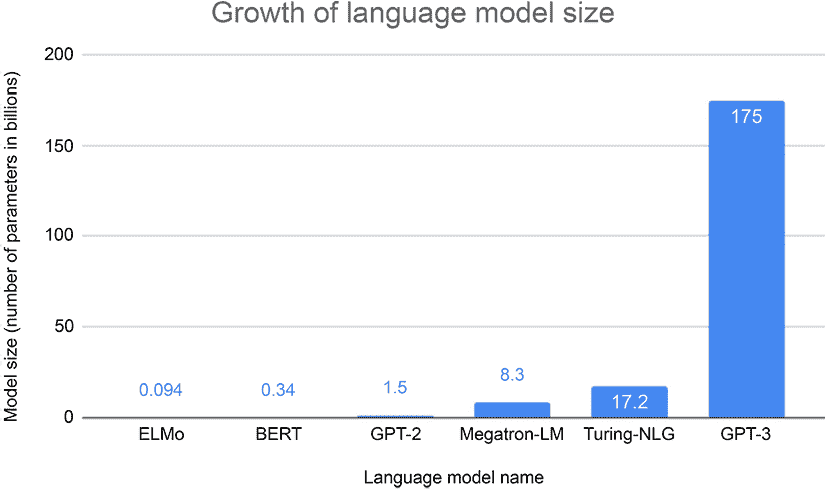

图 10.1：语言模型的发展

为了克服计算挑战，分布式训练技术已成为通过在云中的 GPU 或 TPU 集群之间并行计算来加速模型开发的关键。通过在设备和节点之间分片数据和模型，分布式训练能够扩展计算以在合理的时间内训练现代大规模模型和数据量。分布式训练主要有两种类型：数据并行和模型并行。在我们深入了解分布式训练的细节之前，让我们快速回顾一下神经网络是如何训练的：

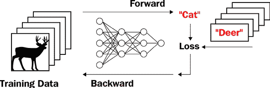

图 10.2：深度神经网络训练

前面的图示展示了**人工神经网络**（**ANN**）的训练过程。训练数据通过正向传递被输入到 ANN 中。在正向传递结束时，计算损失（预测值与真实值之间的差异），然后反向传递计算所有参数的梯度。这些参数通过新的值进行更新，直到损失最小化。在接下来的章节中，我们将探讨使用数据并行和模型并行进行分布式模型训练，这两种方法用于扩展模型训练以适应大型训练数据集和大型模型尺寸。

## 使用数据并行进行分布式模型训练

数据并行分布式训练方法将大型训练数据集划分为更小的子集，并在不同的设备上同时训练每个子集。这种并行化允许多个训练过程在可用的计算资源上同时运行，从而加速整体训练时间。为了利用数据并行训练，所使用的机器学习框架和算法需要支持分布式训练。例如，TensorFlow 和 PyTorch 都提供了用于数据并行训练的模块和库。

如我们之前讨论的，训练**深度学习**（**DL**）模型的一个关键任务是计算关于损失函数的梯度，针对数据中的每一批数据，然后使用梯度信息更新模型参数，以逐步最小化损失。而不是在单个设备上运行梯度计算和参数更新，数据并行分布式训练的基本概念是并行运行多个训练过程，使用相同的算法，每个过程使用训练数据集的不同子集。以下图示展示了训练中数据并行的基本概念：


图 10.3：数据并行概念

如您所见，在分布式数据并行训练作业中，集群中有三个节点参与，每个节点有两个设备。每个设备计算出的局部梯度由节点上每个设备的 w0 ~ w5 表示，而 W 是模型的全局参数值。具体来说，数据并行分布式训练有以下几个主要步骤：

1.  每个节点上的每个设备（CPU 或 GPU）都加载了相同的算法和训练数据的一个子集。

1.  每个设备运行一个训练循环来计算梯度（w0~w5），以优化其损失函数，并在每个训练步骤与其他设备在集群中交换梯度。

1.  将所有设备的梯度汇总，并使用这些汇总梯度计算公共模型参数（W）。

1.  每个设备拉取新计算出的公共模型参数（W），并继续进行模型训练的下一步。

1.  *步骤 2*到*4*会重复进行，直到模型训练完成。

在分布式训练环境中，高效地在进程间交换梯度和参数是机器学习系统工程设计最重要的方面之一。多年来，已经开发出几种分布式训练拓扑来优化不同训练进程间的通信。在本章中，我们将讨论数据并行分布式训练中最广泛采用的两种拓扑：**参数服务器**和**AllReduce**。

### 参数服务器概述

**参数服务器**（**PS**）是基于服务器节点和工作节点概念构建的拓扑。工作节点负责运行训练循环和计算梯度，而服务器节点负责聚合梯度和计算全局共享参数。以下图显示了 PS 的架构：

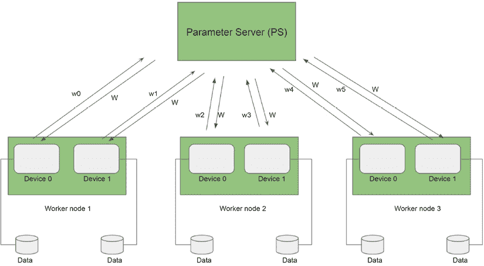

图 10.4：参数服务器架构

在这里，服务器节点被称为 PS，通常实现为一个键值或向量存储，用于存储梯度和参数。由于要管理的模型参数数量可能非常大，因此也可以有多个服务器节点来管理全局参数和梯度聚合。在多参数服务器配置中，还有一个服务器管理器，它管理和协调所有服务器节点以确保一致性。

在这个架构中，工作节点仅与 PS 节点通信以交换梯度和参数，而不与彼此通信。在多服务器节点环境中，每个服务器节点也会与其他所有服务器节点通信，以复制参数以实现可靠性和可扩展性。梯度和参数的交换是为了同步和异步地实施更新。同步梯度更新策略阻止设备在所有设备的梯度同步完成之前处理下一个小批量数据。这意味着每个更新都必须等待最慢的设备完成。这可能会减慢训练速度，并使训练过程在设备故障方面变得不那么稳健。

优点方面，同步更新不必担心过时的梯度，这可能导致更高的模型精度。虽然异步更新不需要在处理下一个小批量数据之前等待所有设备同步，但这可能会导致精度降低。

这种方法的主要局限性是 PS 可能成为通信瓶颈，尤其是对于具有数十亿或数万亿参数的大型模型。随着模型规模的增加，工作节点和 PS 之间需要传输的数据量显著增加，导致潜在的通信开销和带宽限制。

此外，随着工作节点数量的增加，PS 需要处理越来越多的梯度更新和参数分布，这可能会成为可扩展性的挑战。这种集中式架构可能会限制分布式训练过程的整体吞吐量和效率，尤其是在工作节点数量非常大时。此外，较慢或表现不佳的工作节点可能会减慢整个训练过程，因为 PS 必须等待所有梯度更新完毕后才能更新参数。

#### 在框架中实现 PS

PS 分布式训练被多个深度学习框架原生支持，包括 TensorFlow。具体来说，TensorFlow 通过其`ParameterServerStrategy` API 原生支持基于 PS 的分布式训练。以下代码示例展示了如何为 TensorFlow 实例化`ParameterServerStrategy` API：

```py
strategy = tf.distribute.experimental.ParameterServerStrategy(
    cluster_resolver) 
```

在此代码示例中，`cluster_resolver`参数有助于发现和解析工作节点的 IP 地址。

`ParameterServerStrategy`可以直接与 Keras 的`model.fit()`函数或通过使用`strategy.scope()`语法包装模型的自定义训练循环一起使用。以下是如何使用`scope()`包装模型以进行分布式训练的示例语法：

```py
with strategy.scope()
    model = <model architecture definition> 
```

除了在深度学习库中原生支持的 PS 实现之外，还有通用 PS 训练框架，例如来自字节跳动的 BytePS 和来自亚马逊的 Herring，它们可以与不同的深度学习框架协同工作。SageMaker 通过其 SageMaker 分布式训练库使用 Herring 进行数据并行分布式训练。

PS 策略的一个缺点是网络带宽的效率低下。Herring 库通过结合 AWS **弹性织物适配器**（**EFA**）和参数分片技术来解决这一缺点，利用网络带宽实现更快的分布式训练。EFA 利用云资源及其特性，如多路径骨干，以提高网络通信效率。您可以在[`www.amazon.science/publications/herring-rethinking-the-parameter-server-at-scale-for-the-cloud`](https://www.amazon.science/publications/herring-rethinking-the-parameter-server-at-scale-for-the-cloud)了解更多关于 Herring 的信息。

### AllReduce 概述

虽然 PS 架构易于理解和设置，但它确实带来了一些挑战。例如，PS 架构需要额外的节点来运行 PS，而且很难确定服务器节点和工作节点之间的正确比例，以确保服务器节点不会成为瓶颈。

AllReduce 拓扑试图通过消除服务器节点并将所有梯度聚合和全局参数更新分布到所有工作节点来改进 PS 的一些局限性，因此被称为**AllReduce**。以下图表显示了 AllReduce 的拓扑结构：

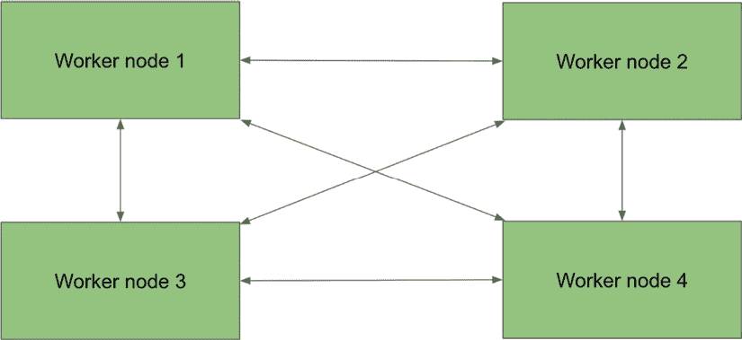图 10.5：AllReduce 架构

在 AllReduce 拓扑中，每个节点在每个训练步骤将参数的梯度发送到所有其他节点。然后，每个节点本地聚合梯度并执行 reduce 函数（如`average`、`sum`或`max`），在下一个训练步骤中使用这些梯度计算新的参数。由于每个节点都需要与其他每个节点通信，这导致节点之间有大量的通信网络，并且每个节点都需要复制所有梯度，因此需要额外的计算和存储。

环形 AllReduce 是一种更有效的 AllReduce 架构。在这个架构中，每个节点只向其下一个相邻节点发送一些梯度，并且每个节点负责聚合分配给其计算的全局参数的梯度。这种架构大大减少了集群中的网络通信量和计算开销，因此对于模型训练来说更加高效。以下图示展示了环形 AllReduce 架构：

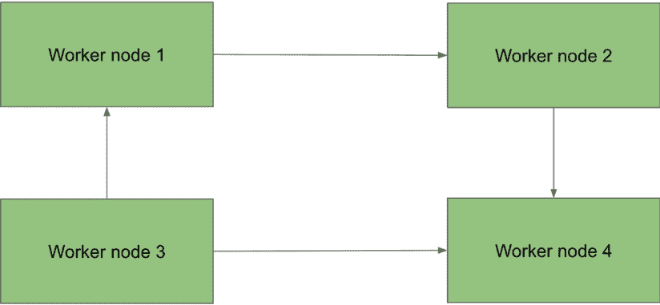

图 10.6：环形 AllReduce

与 PS 方法相比，随着工作节点数量的增加，环形 AllReduce 方法具有更好的可扩展性。由于没有集中的 PS，通信负载在各个工作节点之间分配，减少了潜在的瓶颈。环形 AllReduce 方法还具有更低的通信开销，特别是对于具有数十亿或数万亿参数的大型模型。不是将单个梯度发送到中央服务器，而是将梯度求和并通过环形拓扑传递，从而减少了需要传输的总数据量。

总体而言，环形 AllReduce 方法为大规模分布式训练提供了更好的可扩展性和效率。它将通信负载分配给各个工作节点，减少了潜在的瓶颈和同步开销。然而，PS 方法可能仍然适用于较小规模的分布式训练场景或当容错不是主要关注点时。

#### 在框架中实现 AllReduce 和环形 AllReduce

AllReduce 和环形 AllReduce 架构在多个深度学习框架中原生支持，包括 TensorFlow 和 PyTorch。

TensorFlow 通过其`tf.distribute.MirroredStrategy` API 支持在单台机器上的多个 GPU 之间进行 AllReduce 分布式训练。使用此策略，每个 GPU 都有一个模型副本，并且所有模型参数都在不同设备之间进行镜像。使用高效的 AllReduce 机制来保持这些参数同步。以下代码示例展示了如何实例化`MirroredStrategy` API：

```py
strategy = tf.distribute.MirroredStrategy() 
```

对于多机分布式训练，TensorFlow 使用`tf.distribute.MultiWorkerMirroredStrategy` API。类似于`MirroredStrategy`，`MultiWorkerMirroredStrategy`在所有机器的所有设备上创建所有参数的副本，并通过 AllReduce 机制进行同步。以下代码示例展示了如何实例化`MultiWorkerMirroredStrategy` API：

```py
strategy = tf.distribute.MultiWorkerMirroredStrategy() 
```

类似于`ParameterServerStrategy`、`MirroredStrategy`和`MultiWorkerMirroredStrategy`，它们可以与`keras model.fit()`函数或自定义训练循环一起工作。要将模型与训练策略关联，您可以使用相同的`strategy.scope()`语法。

PyTorch 还通过其`torch.nn.DataParallel`和`torch.nn.parallel.DistributedDataParallel` API 提供了基于 AllReduce 的分布式训练的原生支持。`torch.nn.DataParallel` API 支持同一台机器上 GPU 的单进程多线程，而`torch.nn.parallel.DistributedDataParallel`支持跨 GPU 和机器的多进程。以下代码示例展示了如何使用`DistributedDataParallel` API 启动分布式训练集群并包装模型以进行分布式训练：

```py
torch.distributed.init_process_group(...)
model = torch.nn.parallel.DistributedDataParallel(model, ...) 
```

另一种通用环 AllReduce 架构的流行实现是**Horovod**，由 Uber 的工程师创建。Horovod 与多个深度学习框架一起工作，包括 TensorFlow 和 PyTorch。您可以在[`github.com/horovod/horovod`](https://github.com/horovod/horovod)了解更多关于 Horovod 的信息。

## 使用模型并行进行分布式模型训练

与数据并行相比，模型并行在其采用率上仍然相对较低，因为今天发生的分布式训练大多涉及处理大数据集的数据并行。然而，BERT、GPT 和 T5 等最先进的大规模深度学习算法的应用正在推动模型并行采用率的增加。这些模型的品质已知会随着模型大小的增加而提高，这些大型自然语言处理模型需要大量的内存来存储模型的状态（包括模型的参数、优化器状态和梯度）以及其他开销的内存。

因此，这些模型已经无法适应单个 GPU 的内存。虽然数据并行有助于解决大数据集的挑战，但由于其庞大的内存需求，它无法帮助训练大型模型。模型并行允许您将单个大型模型分割到多个设备上，这样多个设备上的总内存就足以存储模型的一个副本。模型并行还由于多个设备上的更大集体内存而允许模型训练有更大的批量大小。分割模型进行并行分布式训练主要有两种方法：按层分割和按张量分割。接下来，让我们更详细地探讨这两种方法。

### 原始模型并行概述

由于人工神经网络由许多层组成，一种将模型分割的方法是将层分布到多个设备上。例如，如果你有一个 8 层的**多层感知器**（**MLP**）网络和两个 GPU（GPU0 和 GPU1），你可以简单地将前四层放在 GPU0 上，后四层放在 GPU1 上。在训练过程中，模型的前四层会像在单个设备上训练模型一样进行训练。当前四层完成时，第四层的输出将从 GPU0 复制到 GPU1，产生通信开销。在获得 GPU0 的输出后，GPU1 继续训练五到八层。以下图展示了通过层在多个设备上分割模型：

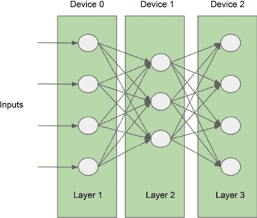

图 10.7：简单模型并行

通过分割实现模型并行需要了解训练任务。设计一个有效的模型并行策略并非易事。以下是一些有助于分割层设计的启发式方法：

+   将相邻层放置在同一设备上以最小化通信开销。

+   在设备之间平衡工作负载。

+   不同的层具有不同的计算和内存利用率特性。

训练人工神经网络模型本质上是一个顺序过程，这意味着网络层是顺序处理的，而反向过程只有在正向过程完成后才会开始。当你将层分割到多个设备上时，只有当前处理其上层的设备会忙碌；其他设备将处于空闲状态，浪费计算资源，这导致硬件资源的浪费。

以下图展示了对于一批数据的前向和反向传递的序列处理：

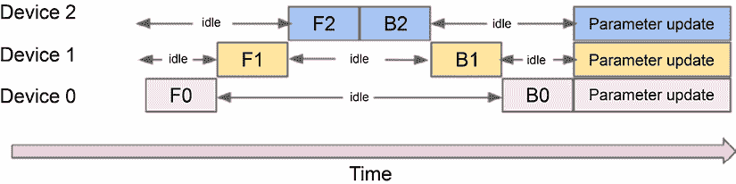

图 10.8：简单模型并行

在前面的图中，**F0**、**F1** 和 **F2** 是每个设备上不同神经网络层的正向传递。**B2**、**B1** 和 **B0** 是每个设备上层的反向传递。正如你所见，当一个设备忙于正向传递或反向传递时，其他设备处于空闲状态。

简单模型并行具有实现简单的优点，并且适用于具有大量层的模型。然而，由于层执行的顺序性，它面临着可扩展性的挑战。此外，如果层有不同的计算需求，它可能会遇到潜在的负载不均衡问题。

接下来，让我们看看一种可以增加资源利用率的解决方案（管道模型并行）。

#### 管道模型并行概述

为了解决资源闲置问题，可以实现管道模型并行性。这改进了简单的模型并行性，使得不同的设备可以在更小的数据批次（通常称为微批次）的不同训练管道阶段上并行工作。以下图表展示了管道模型并行性的工作原理：

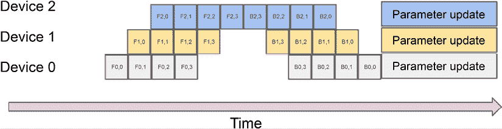

图 10.9：管道模型并行性

使用管道模型并行性，不是通过每个完整的正向和反向传递处理一个数据批次，而是将这个数据批次分解成更小的迷你批次。在前面的图表中，**设备 0**完成第一个迷你批次的前向传递后，**设备 1**可以开始对**设备 1**前向传递的输出进行前向传递。而不是等待**设备 1**和**设备 2**完成它们的前向和反向传递，**设备 0**开始处理下一个迷你批次的数据。这个预定的管道允许更高效地利用硬件资源，从而加快模型训练。

管道并行性还有其他变体。一个例子是交错并行性，其中在可能的情况下优先执行反向执行。这提高了设备在端到端模型训练中的利用率。以下图表展示了交错管道的工作原理：

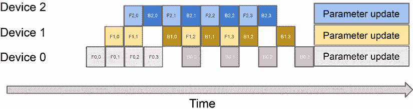

图 10.10：交错管道

管道模型并行性已在各种框架和产品中得到实现，例如 SageMaker 分布式训练库和 DeepSpeed 分布式训练框架，我们将在后面的章节中更详细地介绍。

接下来，让我们看一下张量并行性的概述，也称为张量切片。

### 张量并行性/张量切片概述

如我们之前提到的，张量并行性是将大型模型分割以适应内存的另一种方法。在我们深入探讨之前，让我们快速回顾一下什么是张量以及它是如何被人工神经网络处理的。

**张量**是一个单数据类型的多维矩阵，例如 32 位浮点数或 8 位整数。在神经网络训练的前向传递中，输入张量和权重矩阵张量（输入张量与隐藏层中的神经元之间的连接）使用点积。您可以在[`en.wikipedia.org/wiki/Dot_product`](https://en.wikipedia.org/wiki/Dot_product)了解更多关于点积的信息。

以下图表展示了输入向量和权重矩阵之间的点积：

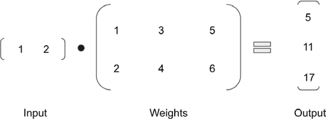

图 10.11：矩阵计算

在这个矩阵计算中，你得到一个输出向量**[5,11,17]**。如果只有一个设备用于点积计算，将依次进行三个单独的计算以获得输出向量。

但如果我们把单个权重矩阵拆分成三个向量，并分别使用点积呢？这可以在以下图中看到：

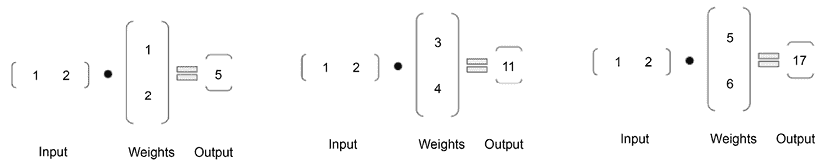

图 10.12：分割矩阵计算

如您所见，您将得到三个单独的值，这些值与前面图中输出向量中的单个值相同。如果有三个单独的设备用于执行点积计算，我们可以在需要时并行执行这三个点积计算，并将值组合成一个向量。这是张量并行基本工作原理。使用张量并行，每个设备独立工作，直到需要同步结果时才需要通信。这种策略允许更快的张量处理，因为多个设备可以并行工作以减少训练时间并提高计算设备的利用率。

### 实现模型并行训练

要实现模型并行，你可以通过决定如何在不同设备和节点上分割层和张量以及它们的放置来手动设计并行策略。然而，这样做并不简单，尤其是在大型集群中。为了使模型并行实现更容易，已经开发了几个模型并行库包。在本节中，我们将更详细地探讨一些这些库。请注意，我们将讨论的框架可以支持数据并行和模型并行，并且这两种技术通常一起使用来训练具有大量训练数据集的大型模型。

#### Megatron-LM

Megatron-LM 是由 Nvidia 开发的开源分布式训练框架。它支持数据并行、张量并行和流水线模型并行，以及所有三种技术的组合，用于极端规模模型训练。

Megatron-LM 实现了基于微批次的流水线模型并行来提高设备利用率。它还实现了周期性流水线刷新，以确保优化器步骤在设备之间同步。Megatron-LM 支持两种不同的流水线调度，如下所示：

+   默认调度通过首先完成所有微批次的正向传递，然后再开始所有批次的反向传递来工作。

+   交错阶段调度通过在单个设备上运行多个不同的层子集来工作，而不是运行单个连续的层集。这可以进一步提高设备的利用率并减少空闲时间。

Megatron-LM 为基于变换器的模型实现了一种特定的张量并行策略。变换器主要由自注意力块组成，后面跟着一个两层 MLP。对于 MLP 部分，Megatron-LM 按列分割权重矩阵。自注意力头的矩阵也按列分割。以下图表显示了变换器的不同部分如何分割：

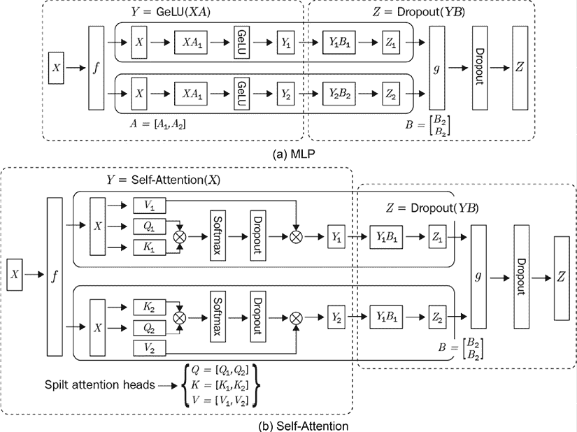

图 10.13：变换器的张量并行

使用数据并行、流水线模型并行和张量并行结合，Megatron-LM 可以用于训练极其大的基于变换器的模型（具有万亿参数），并扩展到数千个 GPU 上。

使用 Megatron-LM 训练涉及以下关键步骤：

1.  使用 `initialize_megatron()` 函数初始化 Megatron 库。

1.  使用 `setup_model_and_optimizer()` 函数通过包装原始模型来设置 Megatron 模型优化器。

1.  使用 `train()` 函数训练模型，该函数以 Megatron 模型和优化器作为输入。

Megatron-LM 已被用于许多大型模型训练项目，如 BERT、GPT 和生物医学领域语言模型。其可扩展的架构可用于训练具有万亿参数的模型。

#### DeepSpeed

DeepSpeed 是由微软开发的开源分布式训练框架。类似于 Megatron-LM，DeepSpeed 也支持张量切片（张量分割的另一种称呼）并行、流水线并行和数据并行。

DeepSpeed 实现了基于微批次的流水线模型并行，其中将批次拆分为微批次，由不同的设备并行处理。具体来说，DeepSpeed 实现了交错流水线并行以优化资源效率和利用率。类似于 Megatron-LM，DeepSpeed 可以结合使用数据并行、流水线模型并行和张量并行来训练极其大的深度神经网络。这被称为 DeepSpeed 3D 并行。

DeepSpeed 框架的一个核心能力是其 **零冗余优化器**（**ZeRO**）。ZeRO 通过在设备间分割参数、优化器状态和梯度来有效地管理内存，而不是在所有设备上保留副本。当需要时，在运行时将分区合并在一起。这使得 ZeRO 相比常规数据并行技术可以减少八倍的内存占用。ZeRO 还能够结合使用 CPU 和 GPU 内存来训练大型模型。

基于注意力的机制在深度学习模型中得到了广泛应用，例如 transformer 模型，用于处理文本和图像输入。然而，由于其大内存和计算需求，它处理长输入序列的能力有限。DeepSpeed 通过其实施稀疏注意力内核来帮助缓解这个问题——这是一种通过块稀疏计算减少注意力计算的计算和内存需求的技术。

在大规模分布式训练中，一个主要瓶颈是由于梯度共享和更新导致的通信开销。通信压缩，如 1-bit 压缩，已被采用作为一种有效的机制来减少通信开销。DeepSpeed 实现了一个 1-bit Adam 优化器，可以将通信开销减少多达五倍，从而提高训练速度。1-bit 压缩通过使用 1 位表示每个数字，并结合误差补偿来实现，误差补偿在梯度压缩期间记住误差，并在下一步中将误差添加回去以补偿误差。

要使用 DeepSpeed，您需要修改您的训练脚本。以下步骤解释了您需要对训练脚本进行的主要更改以运行分布式训练：

1.  使用 `deepspeed.initialize()` 函数包装模型并返回一个 DeepSpeed 模型引擎。这个模型引擎将用于执行正向传递和反向传递。

1.  使用返回的 DeepSpeed 模型引擎来运行正向传递、反向传递，并使用步进函数更新模型参数。

DeepSpeed 主要支持 PyTorch 框架，并需要少量代码更改以采用 PyTorch 的模型训练。DeepSpeed 已被用于训练具有数百亿参数的模型，并实现了最快的模型训练时间之一。您可以在 [`www.deepspeed.ai`](https://www.deepspeed.ai) 上了解更多关于 DeepSpeed 的信息。

#### SageMaker 分布式训练库

亚马逊的 **SageMaker 分布式训练**（**SMD**）库是 Amazon SageMaker 服务的一部分。SMD 支持数据并行（通过底层使用 Herring）和交错管道模型并行。与 DeepSpeed 和 Megatron-LM 不同，您需要手动决定模型分区，**SageMaker 模型并行**（**SMP**）具有自动模型拆分支持的功能。

SMP 的这种自动模型拆分功能通过平衡设备间的内存和通信约束来优化性能。自动模型拆分发生在第一次训练步骤中，此时在 CPU 内存中构建模型的一个版本。分析图结构，做出分区决策，并将不同的模型分区加载到不同的 GPU 上。分区软件为 TensorFlow 和 PyTorch 执行框架特定的分析，以确定分区决策。它考虑了诸如变量/参数共享、参数大小和约束等图结构，以平衡每个设备上的变量数量和操作数量，从而得出拆分决策。

要使用 SMD 库，您需要对现有的训练脚本进行一些修改并创建 SageMaker 训练作业。TensorFlow 和 PyTorch 有不同的说明。以下是对 PyTorch 框架的示例：

1.  修改 PyTorch 训练脚本：

    1.  调用 `smp.init()` 来初始化库。

    1.  使用 `smp.DistributedModel()` 包装模型。

    1.  使用 `smp.DistributedOptimizer()` 包装优化器。

    1.  通过 `torch.cuda.set_device(smp.local_rank())` 限制每个进程使用其自己的设备。

    1.  使用包装后的模型执行正向传递和反向传递。

    1.  使用分布式优化器更新参数。

1.  使用 SageMaker PyTorch Estimator 创建 SageMaker 训练作业并启用 SMP 分布式训练。

#### FairScale

FairScale 是由 Facebook AI Research (FAIR) 开发的一种分布式训练框架。它建立在流行的 PyTorch 深度学习库之上，并提供了一套用于高效分布式训练的实用工具和 API。

FairScale 支持各种分布式训练范式，包括数据并行、模型并行以及两者的结合。FairScale 提供了这些技术的有效实现，以及减少通信开销和提高可扩展性的优化和技巧。

FairScale 的一个关键特性是支持各种模型并行策略，例如张量并行、流水线并行和混合并行。这些策略允许用户以不同的方式将大型模型分布到多个加速器上，从而实现硬件资源的有效利用和大规模模型的更好扩展。

除了分布式训练功能外，FairScale 还提供优化内存使用的工具，如激活检查点、梯度检查点和混合精度训练。这些技术有助于减少大型模型的内存占用，使用户能够训练那些否则会超出单个设备可用内存的模型。

FairScale 被设计成用户友好且易于集成到现有的 PyTorch 代码库中。它提供了一个高级 API，抽象掉了分布式训练的许多复杂性，使用户能够专注于模型开发和实验，而不是低级实现细节。要使用 FairScale，您只需使用`pip install fairscale`安装包，并在训练脚本中使用`import fairscale`导入库。然后，您可以使用其各种支持的功能进行分布式数据和模型并行训练。

尽管分布式模型训练使我们能够训练极其大的模型，但由于模型的大小和其他技术限制，在这些大型模型上运行推理可能会导致高延迟。接下来，让我们探讨我们可以使用的各种技术，以实现低延迟推理。

# 实现低延迟模型推理

随着机器学习模型持续增长并部署到不同的硬件设备上，对于需要低延迟和高吞吐量推理的某些推理用例，如实时欺诈检测，延迟可能成为一个问题。

为了降低实时应用的总体模型推理延迟，我们可以使用不同的优化考虑和技巧，包括模型优化、图优化、硬件加速和推理引擎优化。

在本节中，我们将重点关注模型优化、图优化和硬件优化。在我们深入探讨这些各种主题之前，让我们首先了解模型推理的工作原理，特别是对于深度学习模型，因为大多数推理优化过程都集中在这一点上。

## 模型推理的工作原理和优化机会

如我们在本书中之前讨论的那样，深度学习模型是由节点和边构成的计算图，其中节点代表不同的操作，边代表数据流。这类操作的例子包括加法、矩阵乘法、激活（例如 Sigmoid 和 ReLU）以及池化。这些操作在张量上执行计算，并产生张量作为输出。例如，`*c=matmul(a,b)*`操作将输入张量`*a*`和`*b*`作为输入，并产生输出张量`*c*`。深度学习框架，如 TensorFlow 和 PyTorch，内置了支持不同操作的算子。算子的实现也称为内核。

在训练模型的推理时间期间，深度学习框架的运行时会遍历计算图并调用图中每个节点的适当内核（如加法或 Sigmoid）。内核将从前面的操作符获取各种输入，例如推理数据样本、学习到的模型参数和中间输出，并根据计算图定义的数据流执行特定计算，以产生最终的预测。训练模型的大小主要取决于图中节点的数量，以及模型参数的数量和它们的数值精度（例如，浮点 32、浮点 16 或整数 8）。

不同的硬件供应商，如 Nvidia 和 Intel，也提供了针对常见计算图操作的硬件特定内核实现。cuDNN 是 Nvidia 为其 GPU 设备提供的优化内核实现库，而 MKL-DNN 是 Intel 为其 Intel 芯片提供的优化内核实现库。这些硬件特定实现利用了底层硬件架构的独特能力。它们的表现可以优于由深度学习框架实现实现的内核，因为框架实现是硬件无关的。

现在我们已经了解了推理的工作原理，让我们来探讨一些常见的优化技术，这些技术可以帮助我们提高模型延迟。

## 硬件加速

不同的硬件为不同的机器学习模型产生不同的推理延迟性能。常见的用于模型推理的硬件列表包括 CPU、GPU、**专用集成电路**（**ASIC**）、**现场可编程门阵列**（**FPGA**）和边缘硬件（如 Nvidia Jetson Nano）。在本节中，我们将回顾一些这些硬件的核心架构特性以及它们的设计如何帮助加速模型推理。值得注意的是，尽管本节侧重于推理，但一些硬件也适用于训练加速。

### 中央处理单元（CPUs）

CPU 是用于运行计算机程序的一般用途芯片。它由四个主要构建块组成：

+   控制单元是 CPU 的大脑，它指导 CPU 的操作；也就是说，它指导其他组件，如内存。

+   **算术逻辑单元**（**ALU**）是执行算术和逻辑运算的基本单元，例如加法和减法。

+   地址生成单元用于计算访问内存的地址。

+   内存管理，用于所有内存组件，如主存储器和本地缓存。CPU 也可以由多个核心组成，每个核心都有一个控制单元和 ALU。

CPU 中并行执行的程度主要取决于它有多少核心。每个核心通常一次运行一个线程，除了英特尔的超线程（一种专有的同时多线程实现）。核心越多，并行执行的级别就越高。CPU 被设计用来处理大量指令并管理许多其他组件的操作；它通常具有高性能和复杂的内核，但数量并不多。例如，英特尔至强处理器可以达到 56 核心。

如果低延迟是主要要求，CPU 通常不适合基于神经网络的模型推理。神经网络推理主要涉及可以大规模并行化的操作（例如，矩阵乘法）。由于 CPU 的总核心数通常较小，因此无法进行大规模并行化以满足神经网络推理的需求。从积极的一面来看，CPU 更具成本效益，并且通常具有良好的内存容量，可以容纳更大的模型。

### 图形处理单元（GPU）

GPU 的设计与 CPU 的设计相反。它不是拥有几个强大的核心，而是拥有成千上万个较不强大的核心，这些核心被设计成高效执行一小组指令。GPU 核心的基本设计类似于 CPU。它也包含一个控制单元、ALU 和一个局部内存缓存。然而，GPU 控制单元处理的指令集要简单得多，而局部内存也小得多。

当 GPU 处理指令时，它会调度线程块，并且在每个线程块内部，所有线程执行相同的操作，但针对不同的数据——这是一种称为**单指令多数据**（**SIMD**）的并行化方案。这种架构非常适合深度学习模型的工作方式，其中许多神经元对不同的数据进行相同的操作（主要是矩阵乘法）。

英伟达 GPU 架构包含两个主要组件：

+   全局内存组件

+   **流式多处理器**（**SM**）组件

一个 SM 类似于 CPU，每个 SM 拥有许多**统一计算设备架构**（**CUDA**）核心，这些是执行不同算术运算的特殊功能单元。它还包含一个小型的共享内存和缓存，以及许多寄存器。CUDA 核心负责诸如浮点/整数运算、逻辑计算和分支等函数。之前提到的线程块是由 SM 执行的。全局内存位于同一 GPU 板上。当你训练一个机器学习模型时，模型和数据都需要加载到全局内存中。

在多 GPU 配置中，有低延迟和高吞吐量的通信通道可用，例如 Nvidia NVLink。由于 GPU 拥有大量的 CUDA 核心，非常适合进行低延迟和高吞吐量的神经网络模型推理。

在撰写本文时，最新的 Nvidia GPU 代号为 Blackwell B200 GPU。它由 2080 亿个晶体管组成，其 NVLink 交换系统允许在多个服务器之间以 1.8TB/s 的速度进行多 GPU 通信。对于大规模分布式训练，一组 576 个 B200 GPU 可以协同工作。B200 的另一个显著特点是它的第二代 Transformer Engine，该引擎旨在加速 Transformer 的训练。

### 专用集成电路

**专用集成电路**（**ASIC**）是 GPU 的主要替代品。ASIC 芯片是为特定深度学习架构专门设计的，用于计算和数据流，因此比 GPU 更快，功耗更低。例如，Google 的**张量处理单元**（**TPU**）拥有专为高效矩阵计算设计的专用**矩阵单元**（**MXUs**），AWS 提供 Inferentia 芯片，这是一款专为模型推理设计的 ASIC。为了加快模型推理，亚马逊 Inferentia 芯片和谷歌的 TPU 芯片都使用收缩阵列机制来加速深度神经网络的算术计算。虽然通用芯片如 CPU 和 GPU 使用不同 ALU 计算之间的本地寄存器来传输数据和结果，但收缩阵列允许你将多个 ALU 链接起来，以减少寄存器访问次数，从而加快处理速度。以下图表显示了收缩阵列架构与在 CPU 和 GPU 中使用的常规架构之间的数据流：

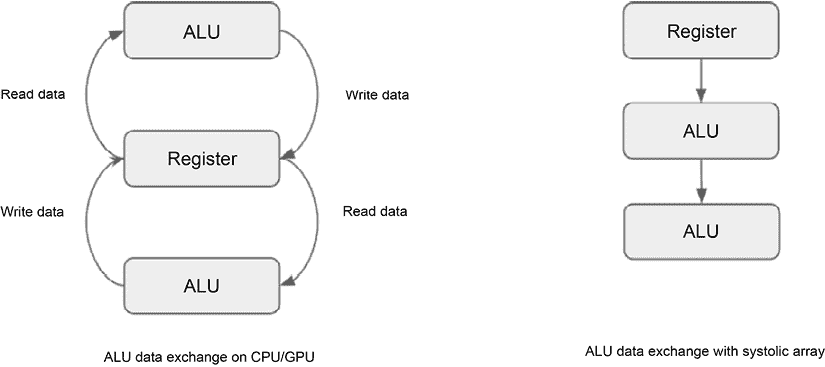

图 10.14：收缩阵列处理与 CPU/GPU 处理对比

亚马逊 Inferentia 芯片可以直接与 Amazon SageMaker 配合使用，以降低延迟进行推理。你可以通过选择支持的 Inferentia 芯片之一来部署模型。

虽然它不直接适用于推理，但值得一提的是，AWS 还提供了 AWS Trainium 加速器，这是一款专为训练大型深度学习模型而设计的专用芯片。每个 Trainium 加速器包含 2 个 NeuronCore 核心。每个核心都是一个独立的计算引擎，具有 4 个主要引擎：TensorEngine、VectorEngine、ScalarEngine 和 GPSIMD-Engine。它还拥有片上 SRAM 内存。

NeuronCore 的每个引擎都针对独特的计算进行了优化。ScalarEngine 针对标量计算进行了优化，并支持 FP32、FP16、BF16、INT8、INT16 和 Int32 等多种数据类型，可以实现高度并行化。它每周期可以执行 1,600 次浮点运算。VectorEngine 针对向量计算进行了优化。VectorEngine 也高度并行化，每周期可以执行 2,500 次浮点运算。TensorEngine 基于功率优化的阵列，高度优化了张量计算。每个 TensorEngine 可以提供超过 100 TFLOPS 的 FP16/BF16 张量计算。GPSIMD-Engine 由 8 个完全可编程的 512 位宽通用处理器组成，可以执行直线 C 代码，并直接访问其他 NeuronCore-v2 引擎以及 SRAM 内存。

## 模型优化

当你处理用于深度学习模型推理的计算图时，神经网络的大小（如层数、神经元数量等）、模型参数的数量以及模型参数的数值精度会直接影响模型推理的性能。模型优化方法侧重于减少神经网络的大小、模型参数的数量和数值精度，以降低推理延迟。一般来说，模型优化主要有两种方法：量化和剪枝。

### 量化

传统上，深度神经网络使用**浮点 32 位**（**FP32**）进行训练。然而，对于许多神经网络来说，FP32 并不需要达到所需的精度。

深度学习的量化是一种网络压缩方法，使用低精度数字，如**浮点 16 位**（**FP16**）或**整数 8 位**（**INT8**），而不是 FP32 来表示静态模型参数，并使用动态数据输入/激活进行数值计算，同时对模型性能的影响最小或没有影响。例如，INT8 表示法比 FP32 表示法占用空间少四倍，这显著降低了神经网络对内存和计算成本的需求，这意味着它可以提高模型推理的整体延迟。

存在着不同类型的量化算法，包括均匀和非均匀量化算法。这两种方法都将连续域中的实数值映射到量化域中的离散低精度值。在均匀情况下，量化域中的量化值均匀分布，而在非均匀情况下，量化值是变化的。

以下图表显示了均匀量化和非均匀量化的区别：

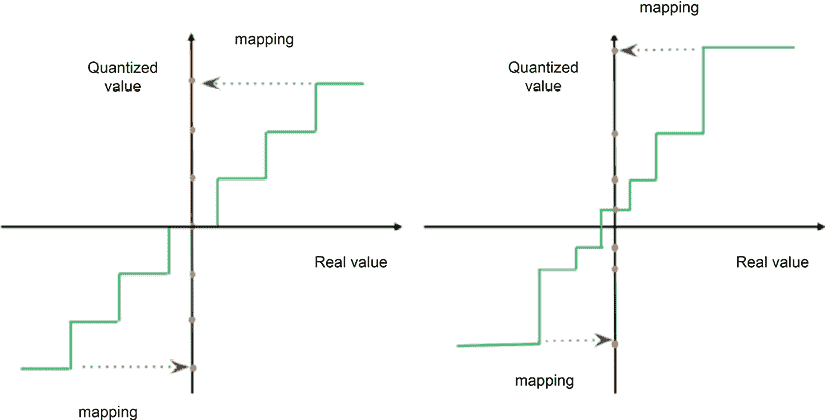

图 10.15：均匀和非均匀量化

量化可以在训练后和训练期间（量化感知训练）进行。训练后量化将一个训练好的模型量化权重，并重新生成一个量化模型。量化感知训练涉及微调全精度模型。在训练过程中，高精度实数被降低到低精度数字。

其他技术包括混合精度训练，这是一种在训练机器学习模型时使用较低精度（如 16 位浮点数或 8 位整数）进行计算的方法，同时保留较高的精度（32 位）用于权重更新。这种方法旨在实现显著的加速和内存节省，尤其是在针对低精度操作优化的硬件上。另一种技术是带有知识蒸馏的量化，它涉及将知识从较大的、高精度教师模型转移到较小的、量化的学生模型。学生模型被训练以复制教师模型的输出，使其能够获得更准确的量化表示。虽然这种技术可以比直接量化实现更高的精度，但它需要额外的训练过程。

在深度学习框架中，如 PyTorch 和 TensorFlow，量化支持是原生可用的。例如，PyTorch 通过其`torch.quantization`包支持两种量化形式。TensorFlow 通过`tf.lite`包支持量化。

### 剪枝（也称为稀疏性）

**剪枝**是另一种网络压缩技术，通过消除对模型性能没有影响的某些模型权重和神经元来减小模型的大小，以使推理更快。例如，接近零或冗余的权重通常可以被移除。

剪枝技术可以分为静态剪枝和动态剪枝。静态剪枝在模型部署之前离线进行，而动态剪枝在运行时进行。在这里，我们将讨论静态剪枝的一些关键概念和方法。

静态剪枝主要包含三个步骤：

1.  针对剪枝的参数选择。

1.  剪枝神经元。

1.  如有必要，进行微调或重新训练。重新训练可能会提高剪枝神经网络的模型性能。

静态剪枝参数的选择有几种方法，包括基于幅度的方法、基于惩罚的方法和 dropout 移除：

+   **基于幅度的方法**：普遍认为，大型模型权重比小型模型权重更重要。因此，选择剪枝权重的一种直观方法是查看零值权重或那些在定义的绝对阈值内的权重。神经网络激活层的幅度也可以用来确定相关的神经元是否可以被移除。

+   **基于惩罚的方法**：在基于惩罚的方法中，目标是修改损失函数或添加额外的约束，以便某些权重被迫变为零或接近零。然后可以剪除零或接近零的权重。基于惩罚方法的例子是使用 LASSO 来缩小特征权重。

+   **Dropout 移除**：Dropout 层在深度神经网络训练中用作正则化器，以避免过拟合数据。虽然 Dropout 层在训练中很有用，但在推理中并不有用，可以移除以减少参数数量而不影响模型性能。

+   **基于正则化的剪枝**：这种技术涉及在训练期间向损失函数添加正则化项，这鼓励模型学习稀疏表示。例子包括 L1 正则化（LASSO），它通过将一些权重驱动到正好为零来促进稀疏性，以及 Group Lasso，它可以剪除整个滤波器或通道。

+   **基于强化学习的剪枝**：这种方法采用强化学习来自动压缩模型。

DL 框架，例如 TensorFlow 和 PyTorch，提供了模型剪枝的 API。例如，你可以使用 `tensorflow_model_optimization` 包及其 `prune_low_magnitude` API 进行基于幅度的剪枝。PyTorch 通过其 `torch.nn.utils.prune` API 提供模型剪枝支持。

量化和剪枝的主要权衡是在效率提升的同时可能损失模型精度或性能。更激进的量化和剪枝可能导致更高的压缩率，但也可能导致精度下降更大。在压缩和精度之间找到合适的平衡至关重要。量化和剪枝的模型也可能在不同硬件平台或深度学习框架之间具有有限的可移植性，因为优化的格式和稀疏结构可能不被普遍支持。

## 图和操作符优化

除了硬件加速和模型优化之外，还有其他优化技术，这些技术专注于计算图的执行优化，以及特定硬件的操作符和张量优化。

### 图优化

图优化侧重于减少计算图中执行的操作数量以加快推理。图优化使用了多种技术，包括操作融合、死代码消除和常量折叠。

算子融合将子图中的多个操作合并成一个操作，以降低延迟。在具有多个操作的子图典型执行过程中，系统内存被访问以进行读写，以在操作之间传输数据，这是一个昂贵的任务。算子融合减少了内存访问次数，同时也优化了整体计算，因为计算现在在一个内核中发生，中间结果不再保存到内存中。这种方法还由于操作数量减少而减少了内存占用。

下图展示了算子融合的概念：

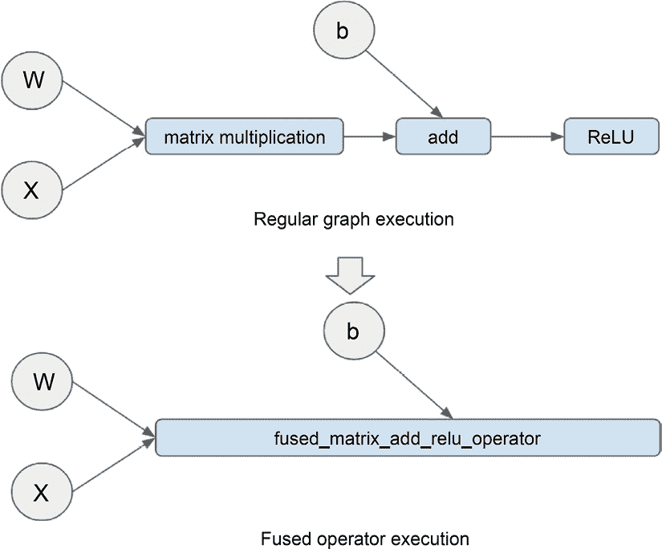

图 10.16：图算子融合

在前面的图中，**矩阵乘法**、**加法**和**ReLU**算子正在融合成一个单独的算子，以便在一个内核中执行，以减少内存访问和启动多个内核所需的时间。

常量折叠是在编译时评估常量，而不是在运行时，以加快运行时的处理速度。例如，对于以下表达式，*A*可以在编译时被分配一个值为 300，而不是在运行时动态计算，这需要更多的计算周期：*A = 100 + 200*。死代码消除移除不影响程序结果的代码。这确保程序不会在无用的操作上浪费计算。

### 算子优化

算子优化（也称为张量优化）专注于特定模型的硬件特定优化。不同的硬件设备有不同的内存布局和计算单元，因此通常需要进行硬件特定优化以充分利用硬件架构。已经为不同硬件设备上的算子优化开发了多种技术，包括以下内容：

+   嵌套并行性，利用 GPU 内存层次结构，并通过共享内存区域实现线程间的数据重用。

+   内存延迟隐藏，通过将内存操作与计算重叠来最大化内存和计算资源。

虽然图优化、算子优化和模型优化针对不同的优化领域，但它们通常结合在一起以提供端到端优化。

## 模型编译器

手动优化端到端模型性能并非易事。添加多个机器学习框架的维度以及广泛的优化目标硬件设备使得这个问题变得非常具有挑战性。为了简化不同机器学习框架和不同设备的优化过程，已经开发了几种开源和商业产品。我们将在本节简要介绍一些这样的包。

### TensorFlow XLA

TensorFlow **加速线性代数**（**XLA**）是 TensorFlow 的深度学习编译器。它将 TensorFlow 图编译成针对模型特别优化的执行内核序列。XLA 在对 IR 执行多个优化之前，将原始 TensorFlow 图转换为 **中间表示**（**IR**），例如为了更快计算进行的算子融合。优化步骤的输出随后用于生成针对不同目标硬件设备（如 CPU 和 GPU）的性能优化特定硬件代码。XLA 在 Google 的生产环境中用于许多加速器。

### PyTorch Glow

PyTorch Glow 是针对多个深度学习框架的深度学习编译器。类似于 XLA，它也使用 IR 来表示原始计算图以执行优化。与 XLA 不同，PyTorch Glow 使用两层 IR。第一层用于执行特定领域的优化，如量化，而第二层 IR 用于与内存相关的优化，如内存延迟隐藏。在第二层 IR 优化之后，为在不同设备上运行模型生成依赖于目标设备的代码。

### Apache TVM

Apache **张量虚拟机**（**TVM**）是一个开源的模型优化编译框架。它优化并编译使用不同框架（如 PyTorch 和 TensorFlow）构建的模型，针对不同的目标 CPU、GPU 和用于加速性能的专用硬件设备。TVM 支持不同级别的优化，包括针对特定硬件的图优化和算子优化。它还附带一个运行时，用于高效执行编译后的模型。

TVM 的一个关键特性是 AutoTVM，它使用机器学习来搜索针对不同硬件设备的代码执行最佳序列。这种基于机器学习的搜索算法可以通过使用供应商提供的优化库（如 cuDNN）显著超越基线基准。这种基于机器学习的方法还可以实现针对大量硬件设备的有效编译扩展。

### Amazon SageMaker Neo

Amazon SageMaker Neo 是 SageMaker 中的模型编译功能。它主要使用 Apache TVM 作为其底层编译库。使用 SageMaker Neo，你可以将已在 TensorFlow 和 PyTorch 等不同的机器学习/深度学习框架上训练的模型，选择目标处理器，如英特尔、苹果、ARM 或英伟达，然后 SageMaker Neo 为目标硬件编译一个优化的模型。Neo 还为每个目标平台提供运行时库，用于加载和执行编译后的模型。SageMaker Neo 是一个托管服务，因此你不需要管理模型编译和部署的基础基础设施和流程。

## 推理引擎优化

一种常见的模型部署模式是使用开源推理引擎或商业托管平台进行模型服务。因此，推理引擎优化是另一种有助于减少模型延迟和推理吞吐量的方法。在本节中，我们将讨论一些考虑因素。请注意，推理引擎优化没有普遍适用的规则，因为它有时是针对特定引擎和模型的。测试和验证不同配置以供最终部署是很重要的。

### 推理批处理

如果您有大量推理请求，并且对单个预测请求没有严格的延迟要求，那么推理批处理是一种可以减少请求总推理时间的技巧。使用推理批处理，不是为每个请求逐个运行预测，而是将多个请求批量一起发送到推理引擎。这种技术减少了请求往返的总次数，从而减少了总推理时间。TensorFlow Serving 和 TorchServe 等推理引擎提供了内置的批推理支持。您可以在[`pytorch.org/serve/batch_inference_with_ts.html`](https://pytorch.org/serve/batch_inference_with_ts.html)和[`www.tensorflow.org/tfx/serving/serving_config#batching_configuration`](https://www.tensorflow.org/tfx/serving/serving_config#batching_configuration)找到 TorchServe 和 TensorFlow Serving 批推理的配置细节。

### 启用并行服务会话

如果您的模型托管服务器有多个计算核心，您可以配置并行服务会话的数量以最大化可用核心的利用率。例如，您可以根据可以并行运行多个服务会话的核心数量配置 TensorFlow Serving 中的`TENSORFLOW_INTRA_OP_PARALLELISM`设置以优化吞吐量。TorchServe 有针对每个模型的 worker 数量和用于并行化优化的线程数量的设置。

### 选择通信协议

TensorFlow 和 TorchServe 等推理引擎支持 gRPC 协议，这是一种比 REST 协议更快的序列化格式。gRPC 协议提供了更好的整体性能，但确实有性能基准，因为不同的模型可能会有不同的行为。根据您的具体需求，REST 协议可能是您更喜欢的选项。

通过这样，您已经了解了大规模训练和低延迟模型推理的技术方法。

既然我们已经讨论了一些推理优化的考虑因素，接下来我们将探讨一些大型语言模型推理技术方面的最新进展。

## 大型语言模型的推理

随着语言模型规模的持续增长，部署和运行它们的任务变得越来越具有挑战性。即使有模型优化努力，这些庞大的模型通常也会超出单个 GPU 的内存容量。为了克服这一障碍并使这些大型语言模型得以部署，已经出现了许多机器学习推理框架。让我们深入了解这些框架，以了解它们如何促进这些语言模型的推理过程。

### 文本生成推理（TGI）

TGI 是 HuggingFace 为部署开源大型语言模型（如 Falcon 和 FLAN-T5）提供的优化服务解决方案。TGI 具有以下针对大型语言模型推理的关键能力：

+   **张量并行**：此功能允许大型语言模型部署到多个 GPU 上，以便它可以适应组合 GPU 内存，并在多个 GPU 上实现更快的推理。

+   **量化**：TGI 可以使用 bitsandbytes 和 GPT-Q 量化库包执行模型量化，以减小模型大小。

+   **连续批处理**：此功能通过使用相同的加载模型参数运行多个输入序列来增加推理的吞吐量。

### DeepSpeed-Inference

除了是一个用于大规模分布式训练的框架之外，DeepSpeed 还可以帮助优化大型语言模型的推理。它在推理方面具有以下关键特性：

+   **模型并行**：此功能通过将模型分割到多个 GPU 设备上，适合那些否则无法适应 GPU 内存的大型模型。

+   **推理优化内核**：DeepSpeed 可以将逐元素操作、矩阵乘法、转置和归约全部融合到一个内核中，显著减少内核调用次数以及主内存访问，从而降低主内存访问延迟。DeepSpeed-Inference 内核也经过微调，以最大化内存带宽利用率，用于加载参数。

+   **量化**：一种名为混合量化的新型模型量化方法，涉及在生产过程中缩小模型并降低推理成本。

### FastTransformer

FasterTransformer 是由 Nvidia 开发的一个高性能库，旨在加速基于 transformer 的神经网络的推理，特别是对于跨越多个 GPU 和分布式设置中的节点的庞大模型。这个开源框架专注于优化 transformer 块，包括编码器和解码器组件。它具有以下支持基于 transformer 模型推理的关键特性：

+   **模型并行**：使用 FastTransformer，可以将 transformer 模型分割到多个 GPU 上以实现更快的推理。

+   **优化支持**：FasterTransformer 使用层融合、使用数据缓存的多头注意力加速、**通用矩阵乘法**（**GEMM**）内核自动调优以及支持 FP16、BF16 和 INT8 等低精度数据类型等技术来优化基于 transformer 的模型。这些数据类型的操作可以通过最近 NVIDIA GPU 上的 Tensor Cores 进行加速。

# 实践实验室 - 使用 PyTorch 运行分布式模型训练

作为 ML 解决方案架构师，您需要探索和设计不同的模型训练范式以满足不同的模型训练需求。在本实践实验室中，您将使用 SageMaker 训练服务运行数据并行分布式训练。我们将使用 PyTorch 的`torch.nn.parallel.DistributedDataParallel` API 作为分布式训练框架，并在小型集群上运行训练作业。我们将重用*第八章*中*构建数据科学环境使用 AWS ML 服务*的实验室中的数据集和训练脚本。

## 问题陈述

在*第八章*中，我们使用您使用 SageMaker 创建的数据科学环境训练了一个金融情感模型。该模型是在 Studio 笔记本和 SageMaker 训练服务中使用单个 GPU 进行训练的。考虑到未来对大型数据集进行模型训练的需求，我们需要设计一个使用多个 GPU 进行水平扩展的 ML 训练流程。

## 数据集描述

我们将使用金融短语数据集进行此实验室：[`www.kaggle.com/ankurzing/sentiment-analysis-for-financial-news`](https://www.kaggle.com/ankurzing/sentiment-analysis-for-financial-news)。

## 修改训练脚本

首先，我们需要将分布式训练支持添加到训练脚本中。为此，请在您的 Studio 笔记本环境中创建一个`code`目录，复制`train.py`文件并将其保存到`code`目录中，然后将文件重命名为`train-dis.py`，并打开`train-dis.py`文件。您需要对以下三个主要函数进行修改。以下步骤旨在突出需要进行的重点更改。要运行实验室，您可以从[`github.com/PacktPublishing/The-Machine-Learning-Solutions-Architect-and-Risk-Management-Handbook-Second-Edition/tree/main/Chapter10`](https://github.com/PacktPublishing/The-Machine-Learning-Solutions-Architect-and-Risk-Management-Handbook-Second-Edition/tree/main/Chapter10)下载修改后的`train-dis.py`文件。以下是在`train-dis.py`文件中需要做出的关键更改：

1.  **修改** `train()` **函数**：您需要对`train()`函数进行一些修改以启用分布式训练。以下是需要进行的重点更改：

    +   **进程组初始化**：为了启用分布式训练，我们需要初始化和注册每个设备上的每个训练过程，以便将其包含在训练组中。这可以通过调用`torch.distributed.init_process_group()`函数来实现。此函数将阻塞，直到所有进程都已注册。在初始化步骤中，我们需要熟悉一些概念：

        +   **全局大小**：这是分布式训练组中进程的总数。由于我们将在每个设备（CPU 或 GPU）上运行一个进程，因此全局大小也等于训练集群中设备总数的总和。例如，如果您有两个服务器，每个服务器有两个 GPU，那么这个训练组的全局大小是四。`torch.distributed.init_process_group()`函数使用这些信息来了解在分布式训练作业中应包含多少个进程。

        +   **排名**：这是分配给训练组中每个进程的唯一索引。例如，具有四个全局大小的训练组中所有进程的排名将是[0,1,2,3]。这个唯一的索引有助于在训练组内唯一地标识每个进程以进行通信。

        +   **本地排名**：这唯一地标识了服务器节点中的一个设备。例如，如果服务器节点中有两个设备，两个设备的本地排名将是[0,1]。本地排名允许您选择一个特定的设备来加载模型和数据以进行模型训练。

        +   **后端**：这是在不同进程之间交换和聚合数据的高级通信库。PyTorch 分布式训练支持包括 NCCL、MPI 和 Gloo 在内的多个通信后端。您可以根据设备和网络配置选择不同的后端。它使用这些后端在分布式训练期间发送、接收、广播或减少数据。我们不会在本书中详细介绍这些后端的技术细节。如果您对这些后端的工作原理感兴趣，可以轻松地在网上找到涵盖这些主题的资源。

    +   **使用 PyTorch 分布式库包装训练算法**：为了使用 PyTorch 分布式库对训练的支持，您需要使用 PyTorch 分布式训练库来包装算法。您可以使用`torch.nn.parallel.DistributedDataParallel()` API 实现这一点。这允许算法参与分布式训练，交换梯度并更新全局参数。

    +   **使用单个设备保存模型**：在多设备服务器节点中，您只想让一个设备保存最终模型以避免 I/O 冲突。您可以通过选择具有特定本地排名 ID 的设备来实现这一点。

1.  **修改** `get_data_loader()` **函数**：为了确保不同的训练数据子集被加载到服务器节点上的不同设备上，我们需要配置 PyTorch DataLoader API，以便根据训练进程的 rank 加载数据。这可以通过使用`torch.utils.data.distributed.DistributedSampler` API 来完成。

1.  **为多设备服务器节点添加多进程启动支持**：对于具有多个设备的服务器节点，我们需要根据可用的设备数量启动多个并行进程。为了启用此功能，我们可以使用`torch.multiprocessing`在每个节点上启动多个运行进程。

修改训练脚本后，我们将更新启动笔记本。

## 修改并运行启动笔记本

我们现在已准备好修改启动笔记本以启动模型训练作业：

1.  首先，将`bert-financial-sentiment-Launcher.ipynb`文件从`第八章`复制出来，并保存为`bert-financial-sentiment-dis-Launcher.ipynb`。打开新笔记本，并将第二个单元格的内容替换为以下代码：

    ```py
    from sagemaker.pytorch import PyTorch 

    output_path = f"s3://{bucket}/{prefix}" 

    estimator = PyTorch(
        entry_point="train-dis.py",
        source_dir="code",
        role=role,
        framework_version="1.6",
        py_version="py3",
        instance_count=2,  
        instance_type= "ml.g4dn.12xlarge", 
        output_path=output_path,
        hyperparameters={
            "epochs": 10,
            "lr" : 5e-5,
            "num_labels": 3,
            "train_file": "train.csv",
            "test_file" : "test.csv",
            "MAX_LEN" : 315,
            "batch_size" : 64,
            "test_batch_size" : 10,
            "backend": "nccl"
        },

    )
    estimator.fit({"training": inputs_train, "testing": inputs_test}) 
    ```

    主要代码更改如下：

    +   将入口点指向新的训练脚本（`entry_point="train-dis.py"`）

    +   将计算实例数量从 1 增加到 2 以进行多节点训练（`instance_count=2`）

    +   修改实例类型以支持多 GPU（`instance_type= "ml.g4dn.12xlarge"`）

    +   增加批大小，因为现在有更多的 GPU 可以处理更大的批大小（`"batch_size" : 64`）

1.  下载[`github.com/PacktPublishing/The-Machine-Learning-Solutions-Architect-and-Risk-Management-Handbook-Second-Edition/blob/main/Chapter10/code/requirements.txt`](https://github.com/PacktPublishing/The-Machine-Learning-Solutions-Architect-and-Risk-Management-Handbook-Second-Edition/blob/main/Chapter10/code/requirements.txt)并将其上传到您的 Studio 笔记本中的`code`目录。此`requirements.txt`包含需要在训练容器中安装的库包。在这种情况下，我们想要安装 transformer 包。

如果您不想手动修改启动笔记本，您可以下载修改后的启动笔记本，链接为[`github.com/PacktPublishing/The-Machine-Learning-Solutions-Architect-and-Risk-Management-Handbook-Second-Edition/blob/main/Chapter10/bert-financial-sentiment-dis-launcher.ipynb`](https://github.com/PacktPublishing/The-Machine-Learning-Solutions-Architect-and-Risk-Management-Handbook-Second-Edition/blob/main/Chapter10/bert-financial-sentiment-dis-launcher.ipynb)。

现在，只需在新笔记本中执行每个单元格，即可启动分布式训练。您可以直接在笔记本中跟踪训练状态，并在 CloudWatch 日志中查看详细状态。您应该看到总共八个进程并行运行。请注意总训练时间和准确率，并查看它们与您在*第八章*，*使用 AWS ML 服务构建数据科学环境*中得到的成果相比如何。

恭喜！你已经成功使用 PyTorch 分布式训练库训练了一个 BERT 模型。

# 摘要

在本章中，我们深入探讨了机器学习工程的先进主题。我们涵盖了处理大量数据集和大规模模型的分布式训练，以及实现低延迟推理的策略。希望你现在对数据并行和模型并行有了坚实的理解，以及实现分布式训练时可供选择的多样化技术，例如 PyTorch 分布式库和 SageMaker 分布式训练库。此外，你应该已经准备好讨论各种优化模型以最小化推理延迟的技术，包括用于自动化模型优化的模型编译工具的使用。

到目前为止，我们一直专注于从头开始训练机器学习模型，并设计机器学习平台以支持机器学习模型的训练和部署，从而支持智能应用的开发。然而，我们并不总是需要从头开始构建模型。在下一章中，我们将探讨现成的 AI 服务，并了解 AI 服务如何被用来快速构建智能应用。

# 留下评论！

喜欢这本书吗？通过留下亚马逊评论来帮助像你这样的读者。扫描下面的二维码，获取你选择的免费电子书。


**限时优惠*
