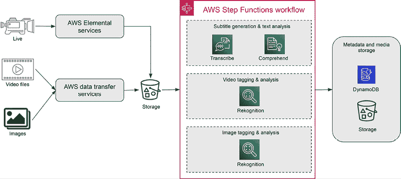
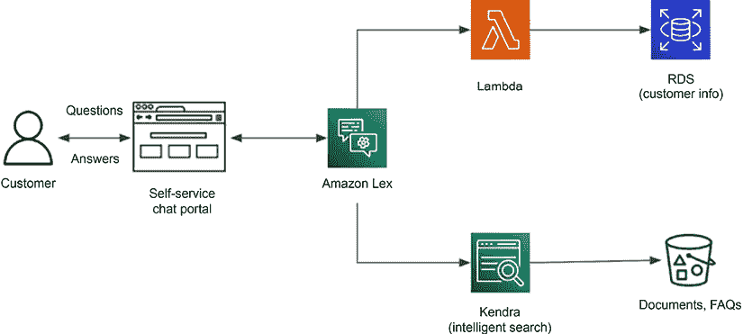

# 11

# 使用 AWS AI 服务构建机器学习解决方案

到目前为止，我们主要关注构建和部署机器学习模型所需的技能和技术，这些技能和技术使用开源技术和托管机器学习平台。然而，要使用机器学习解决业务问题，你并不总是需要从头开始构建、训练和部署你的机器学习模型。另一种选择是使用完全管理的 AI 服务。AI 服务是完全管理的 API 或应用程序，具有预训练的模型，可以执行特定的机器学习任务，例如目标检测或情感分析。一些 AI 服务还允许你使用你的数据训练自定义模型，以完成定义的机器学习任务，例如文档分类。AI 服务承诺使组织能够构建不需要强大机器学习能力的机器学习解决方案。

在本章中，我们将转换方向，讨论几个 AWS AI 服务及其在商业应用中的使用情况。请注意，本章的重点不会深入探讨单个 AI 服务，因为这需要专门的书籍。相反，我们将关注可以由 AI 服务驱动的机器学习用例，以及你可以用来部署这些 AI 服务的架构模式。阅读本章后，你应该能够识别一些 AI 服务可以很好地适用的情况，并知道在哪里找到额外的资源来更深入地了解这些服务。具体来说，我们将涵盖以下主题：

+   什么是 AI 服务？

+   AWS AI 服务概述

+   使用 AI 服务构建智能解决方案

+   设计 AI 服务的 MLOps 架构

+   实践实验室 - 使用 AI 服务运行机器学习任务

# 技术需求

你将继续使用我们的 AWS 环境来完成这本书的动手部分。相关的代码示例可以在[`github.com/PacktPublishing/The-Machine-Learning-Solutions-Architect-and-Risk-Management-Handbook-Second-Edition/tree/main/Chapter11`](https://github.com/PacktPublishing/The-Machine-Learning-Solutions-Architect-and-Risk-Management-Handbook-Second-Edition/tree/main/Chapter11)找到。

# 什么是 AI 服务？

AI 服务是预先构建的完全管理的服务，可以直接执行特定的一组机器学习任务，例如面部分析或文本分析。AI 服务的主要目标用户是希望构建 AI 应用而不需要从头开始构建机器学习模型的应用开发者。相比之下，机器学习平台的目标受众是数据科学家和机器学习工程师，他们需要经历完整的机器学习生命周期来构建和部署机器学习模型。

对于一个组织来说，AI 服务主要解决以下关键挑战：

+   **缺乏高质量的机器学习模型开发训练数据**：要训练高质量的模型，你需要大量的高质量精选数据。对于许多组织来说，数据在数据来源、数据工程和数据标注方面都面临着许多挑战。

+   **缺乏构建和部署定制机器学习模型的数据科学技能**：数据科学和机器学习工程技能在市场上稀缺，且获取成本高昂。

+   **产品上市时间慢**：构建和部署定制模型和工程基础设施耗时较长。这可能是一个快速上市产品的障碍。

+   **未区分的机器学习能力**：许多机器学习问题可以使用不提供独特竞争优势的通用机器学习能力来解决。在构建未区分的机器学习能力上投入资源可能会浪费宝贵的资源。

+   **系统可扩展性挑战**：管理可扩展的基础设施以满足动态市场需求和增长是一个工程挑战。

虽然 AI 服务可以提供一种快速构建机器学习产品的经济高效的方式，但它们确实存在局限性。主要局限性是缺乏针对特定功能和技术的定制灵活性。AI 服务通常专注于具有预定义算法集的特定机器学习任务，因此您通常没有灵活性来改变 AI 服务的功能。使用 AI 服务，您通常无法访问底层模型，这限制了您在其他地方部署模型的能力。

近年来，AI 服务的产品种类大幅增长，我们预计这一趋势将以更快的速度持续发展。让我们转变我们的关注点，谈谈几个 AWS AI 服务。

# AWS AI 服务概述

AWS 在多个机器学习领域提供 AI 服务，如文本和视觉，以及针对工业用例的 AI 服务，例如制造异常检测和预测性维护。在本节中，我们将介绍 AWS AI 服务的一部分。本节的目标不是深入探讨单个服务，而是让您了解这些 AI 服务提供的基本功能。这将让您了解这些服务如何以及在哪里集成到您的应用程序中。

## Amazon Comprehend

自然语言处理（NLP）在解决各种商业问题方面引起了不同行业的广泛关注，例如自动文档处理、文本摘要、文档理解和文档管理及检索。**Amazon Comprehend** 是一种能够对非结构化文本文档进行自然语言处理的 AI 服务。在其核心，Amazon Comprehend 提供以下主要功能：

+   **实体识别**：实体是文本分析中的谁、什么、哪里和何时。实体可以是句子中最重要的部分，因为它们确定了文本中的关键组成部分。实体的例子包括人名、地名或产品等专有名词。实体可用于创建文档搜索索引并识别跨文档的关键信息或关系。Comprehend 提供 API（例如，`DetectEntities`），使用其内置的实体识别模型检测实体。它可以检测来自输入文本的人、地点、组织机构和日期等实体。如果内置模型不符合您的需求，您还可以使用 Comprehend 训练自定义实体识别器以识别您的自定义实体。要训练自定义实体识别器，您可以使用`CreateEntityRecognizer` API，并使用以下两种格式之一提供您的训练数据：

    1.  **标注**：您提供文档中实体的位置（目标字符的开始和结束偏移量），以及每对偏移量对应的实体类型。这有助于 Comprehend 在实体及其所处的上下文中进行训练。

    1.  **实体列表**：您提供一份包含实体及其实体类型的文本列表，Comprehend 将训练以检测这些特定实体。您可以使用 Comprehend 自定义模型训练作业发出的指标来评估自定义模型。示例评估指标包括精确率、召回率和 F1 分数。

    关于 Comprehend 评估指标的更多详细信息，请参阅[`docs.aws.amazon.com/comprehend/latest/dg/cer-metrics.html`](https://docs.aws.amazon.com/comprehend/latest/dg/cer-metrics.html)。一旦模型经过训练，您可以选择将模型部署到私有预测端点后面以提供预测。

+   **情感分析**：Comprehend 可以通过其`DetectSentiment` API 检测文本中的情感。情感分析在许多商业用例中得到了广泛应用，例如分析客户支持电话中的客户情感或理解客户对产品和服务在评论中的看法。

+   **主题建模**：主题建模有广泛的应用，包括文档理解、文档分类和组织、信息检索和内容推荐。Comprehend 可以通过其`StartTopicsDetectionJob` API 发现文档中的共同主题。

+   **语言检测**：Comprehend 可以通过其`DetectDominantLanguage` API 检测文本中使用的占主导地位的语言。此功能可以帮助处理诸如根据语言将 incoming 客户支持电话路由到正确的渠道或根据不同语言对文档进行分类等用例。

+   **语法分析**：Comprehend 可以使用其 `DetectSyntax` API 对句子进行词性（**POS**）分析。示例词性包括句子中的名词、代词、动词、副词、连词和形容词。词性分析可以帮助处理诸如检查书面文本中语法和句法的正确性等用例。

+   **事件检测**：Comprehend 可以检测预定义的金融事件，如首次公开募股（IPO）、股票分割和破产。它还可以检测与事件相关联的增强，例如个人或公司申请破产。这种关系有助于构建知识图谱，帮助我们理解不同事件中的谁做了什么。您可以在 [`docs.aws.amazon.com/comprehend/latest/dg/cer-doc-class.html`](https://docs.aws.amazon.com/comprehend/latest/dg/cer-doc-class.html) 找到事件和增强类型的完整列表。

+   **文本分类**：您可以使用 Comprehend 使用您的训练数据训练自定义文本分类器。Comprehend 允许您通过其 `CreateDocumentClassifier` API 训练多类和多标签分类器。多类将单个标签分配给文本，而多标签则将多个标签分配给文本。为了评估自定义分类器的性能，Comprehend 提供了一系列指标，包括准确率、召回率和 F1 分数。您可以在 [`docs.aws.amazon.com/comprehend/latest/dg/cer-doc-class.html`](https://docs.aws.amazon.com/comprehend/latest/dg/cer-doc-class.html) 找到完整的指标列表。

+   **个人身份信息（PII）检测**：您可以在英语或西班牙语文档中检测 PII。PII 检测过程提供了在文本中定位或擦除 PII 实体的选项。对于定位 PII 实体，可以使用实时分析或异步批量作业。另一方面，擦除 PII 实体特别需要使用异步批量作业。

+   **关键短语检测**：Amazon Comprehend 中的关键短语功能使用机器学习模型分析输入文本并提取最显著的短语或主题。这些关键短语可以提供简洁的摘要或突出文本中存在的主题和概念。

Flywheels 是 Comprehend 的一个功能，它提供了一个管理化的工作流程，用于持续改进自定义自然语言处理模型。飞轮存储所有模型数据和版本在一个 AWS 管理的数据湖中。随着新的标记数据集变得可用，您创建飞轮迭代以使用最新数据重新训练和评估新的模型版本。根据性能指标，最佳的新版本可以被提升为成为活跃模型，为推理提供服务。这个迭代过程允许模型精度随着时间的推移而提高，因为常规模型重新训练结合了新鲜数据。

可以使用 `boto3` 库和 AWS **命令行界面**（**CLI**）调用 Comprehend API。您可以在 [`boto3.amazonaws.com/v1/documentation/api/latest/reference/services/comprehend.html`](https://boto3.amazonaws.com/v1/documentation/api/latest/reference/services/comprehend.html) 找到支持 Comprehend 的完整 `boto3` 方法列表。以下展示了调用 Comprehend 实体检测功能的 Python 语法：

```py
import boto3
client = boto3.client('comprehend')
response = client.detect_entities(Text='<input text>') 
```

Amazon Comprehend 可以很好地用于构建智能文档处理解决方案和其他 NLP 产品。它还可以作为一个良好的基线工具，可以与自定义 NLP 模型进行比较。

## Amazon Textract

许多业务流程，如贷款申请处理、费用处理和医疗索赔处理，需要从图像和文档中提取文本和数字。目前，许多组织主要手动处理这些流程，这些流程可能非常耗时且缓慢。

**Amazon Textract** 是一个主要用于从图像和 PDF 文档中提取打印文本、手写文本和数字的 **光学字符识别**（**OCR**）AI 服务。Textract 通常用作下游任务（如文档分析和数据录入）的处理步骤。Textract 的核心功能如下：

+   **OCR**: OCR 是一种计算机视觉任务，用于从 PDF 文档和图像中检测和提取文本数据。Textract 中的 OCR 组件从输入文档中提取原始文本，并提供有关文档的附加结构信息。例如，Textract 的输出包含文档中不同对象（如页面、段落、句子和单词）的分层结构关系。Textract 还捕获输入文档中不同对象的位置信息。当您从文档的不同位置提取特定信息时，分层结构信息和对象位置数据非常有用。OCR API 包括 `DetectDocumentText` 用于同步检测文本和 `StartDocumentTextDetection` 用于异步检测文本。

+   **表格提取**: 许多文档包含表格数据结构，需要作为表格进行处理。例如，您可能有一个包含索赔项目及其详细信息列表的保险索赔文档，并且您可能希望将这些索赔项目输入到系统中。Textract 中的表格提取组件可以从文档中提取表格和表格中的单元格。要使用表格提取功能，您可以使用 `AnalyzeDocument` API 进行同步操作，或使用 `StartDocumentAnalysis` 进行异步操作。

+   **表单提取**：例如工资单和贷款申请表等文档包含许多需要保留其关系的名称-值对，当它们自动处理时。Textract 中的表单提取组件可以检测这些名称-值对及其关系，以便进行下游处理，例如将这些文档中的名称输入到系统中。表单提取组件与表格提取组件共享相同的`AnalyzeDocument`和`StartDocumentAnalysis` API。

+   **文档分析中的签名**：Textract 可以检测文档中的签名位置，返回指定签名位置和置信度分数的边界框。签名检测可以独立运行或与其他功能（如表单、表格和自定义查询）同时运行。当与表单或表格结合使用时，Textract 将检测到的签名与相应的单元格或键值对相关联。

+   **文档分析中的查询**：Textract 允许添加自定义查询以从文档中提取特定信息。例如，“申请人的地址是什么？”这样的查询将仅从分析文档中返回该数据点，并在单独的响应结构中返回。

Textract 还具备分析特定类型文档的功能，例如发票和身份证明文件。例如，Textract 可以从发票或收据中提取相关数据，如供应商和收件人联系信息，而无需任何模板或配置。同样，它可以从护照、驾照和美国政府签发的其他身份证明文件中提取相关信息。

Textract API 在`boto3`库中得到支持。以下代码示例展示了如何使用`boto3`库检测文本。关于`boto3`的完整 Textract API 列表可以在[`boto3.amazonaws.com/v1/documentation/api/latest/reference/services/textract.html`](https://boto3.amazonaws.com/v1/documentation/api/latest/reference/services/textract.html)找到。

```py
import boto3
client = boto3.client('textract')
response = client.detect_document_text(
        Document={
            'Bytes': b'bytes',
            'S3Object': {
                'Bucket': '<S3 bucket name>',
                'Name': '<name of the file>'}
}) 
```

Textract 还与**Amazon Augmented AI**（**A2I**）服务集成，以实现人工审核 Textract 的低置信度预测结果的闭环工作流程集成。有关 A2I 服务的更多信息，请访问[`aws.amazon.com/augmented-ai`](https://aws.amazon.com/augmented-ai)。

## Amazon Rekognition

**Amazon Rekognition**是一个视频和图像分析 AI 服务。它支持一系列用例，如从图像和视频中提取元数据、内容审核以及安全和监控。Rekognition 的核心功能如下：

+   **标签或对象检测**：标签检测可用于媒体元数据提取以进行搜索和发现、保险索赔处理中的物品识别和计数、以及品牌和标志检测等用例。Rekognition 可以在图像和视频中检测不同的对象、场景和活动，并为它们分配标签，如 `soccer`、`outdoor` 和 `playing soccer`。对于检测到的常见对象，它还提供了对象的边界框，以指示它们在图像或视频中的具体位置。要使用 Rekognition 进行标签检测，您可以调用 `DetectLabels` API。如果 Rekognition 无法检测您图像中的特定对象，您还可以使用 `CreateProject` API 使用您的训练数据训练一个自定义标签检测器。一旦模型被训练，您可以选择使用 `StartProjectVersion` API 部署一个私有预测端点。

+   **人脸分析和识别**：人脸分析和识别在视频监控和安全、图像和视频内容搜索中的自动人物标签、以及人口统计理解等用例中非常有用。Rekognition 可以在图像和视频中识别和分析人脸。例如，您可以对人脸进行分析以检测性别、年龄和情感。您还可以构建人脸索引并为它们分配名称。如果找到匹配项，Rekognition 可以将检测到的人脸映射到索引中的人脸。人脸分析和识别的主要 API 包括 `DetectFaces`、`SearchFaces`、`IndexFaces` 和 `CompareFaces`。

+   **内容审核**：Rekognition 提供用于检测包含露骨内容或场景（如暴力）的图像和视频的 API (`StartContentModeration`)。组织可以使用此功能在将内容提供给消费者之前过滤掉不适当和冒犯性的内容。

+   **短文本检测**：Rekognition 可以使用其 `DetectText` 和 `StartTextDetection` API 在图像中检测短文本，并在检测到的文本周围提供边界框。此功能可用于检测街道名称、商店名称和车牌号码。

+   **个人防护装备 (PPE) 检测**：Rekognition 提供了一个内置功能，使用 `DetectProtectiveEquipment` API 在图像和视频中检测 PPE。此功能可用于自动 PPE 合规性监控。

+   **名人识别**：Rekognition 还维护一个名人数据库，可用于在图像和视频中识别知名名人。它为此功能提供了一系列 API，包括 `RecognizeCelebrities` 和 `GetCelebrityInfo`。

```py
boto3 APIs for Rekognition can be found at https://boto3.amazonaws.com/v1/documentation/api/latest/reference/services/rekognition.html:
```

```py
import boto3
client = boto3.client('rekognition')
response = client.detect_labels(
    Image={
        'Bytes': b'bytes',
        'S3Object': {
            'Bucket': '<S3 bucket name>',
            'Name': '<file name>'
        }
    }) 
```

Rekognition 还与 AWS 的视频流服务 Amazon Kinesis Video 原生集成。您可以使用它构建检测实时视频流中人脸的解决方案。

## Amazon Transcribe

**Amazon Transcribe**（**转录**）是一种语音转文字的 AI 服务。它可以用于将视频和音频文件及流转换为文本，适用于多种用例，例如媒体内容字幕、会议字幕、通话分析以及将医疗对话转换为电子健康记录。

Amazon Transcribe 支持实时转录和批量转录，并具有以下关键功能：

+   **媒体转录**：Transcribe 具有预训练的模型，可以将媒体文件或流转换为不同语言的文本，例如英语、中文和西班牙语。它还添加标点符号和大写字母，使转录文本更易于阅读。要启动转录，可以使用`StartTranscriptionJob`和`StartMedicalTranscriptionJob` API 进行批量转录，使用`StartStreamingTranscription` API 进行流式转录，以及使用`StartMedicalStreamTranscription` API 进行流式医疗输入。

+   **自定义模型**：您可以提供您的训练数据来训练自定义语言模型，以提高特定行业术语或缩写的转录准确性。创建自定义模型的 API 是`CreateLanguageModel`。

+   **通话分析**：Transcribe 为通话提供了内置的分析功能。通话的转录内容以逐段格式显示。支持的某些分析示例包括情感分析、通话分类、问题检测（通话原因）和通话特征（谈话时间、非谈话时间、音量、中断）。启动通话分析作业的 API 是`StartCallAnalyticsJob`。

+   **编辑**：Transcribe 可以自动屏蔽或移除转录中的敏感**个人身份信息**（**PII**）数据，以保护隐私。在带有编辑的转录中，Transcribe 将 PII 信息替换为转录中的**[PII]**。要启用编辑，可以在批量转录作业中配置`ContentRedaction`参数。

+   **字幕**：Transcribe 可以生成 WebVTT 和 SubRip 格式的字幕文件，用作视频字幕。要启用字幕文件生成，可以在转录作业中配置`Subtitles`参数。

+   **检测有害言论**：Transcribe 毒性检测利用音频和基于文本的线索，识别和分类包括性骚扰、仇恨言论、威胁、滥用、粗话、侮辱和暴力在内的七个类别的基于声音的有害内容。

+   **编辑转录内容**：编辑功能有助于在进一步处理或分析之前，安全地移除语音转文字输出中的敏感数据，如姓名、地址和账户详情。这既保护了隐私，又允许利用转录内容进行其他下游应用。

+   **分区说话人**：在您的转录输出中，Amazon Transcribe 允许您区分不同的说话人。系统可以识别多达 10 个不同的说话人，并为每个说话人关联的文本分配一个唯一的标签。

+   **多通道转录**：当处理包含两个通道的音频时，你可以使用通道识别来独立转录每个通道的语音。

此外，还有一个名为 Amazon Transcribe Medical 的与医疗相关的转录服务，这是一个符合 HIPAA 标准的**自动语音识别**（**ASR**）服务，专门设计用于转录医疗语音。该服务可以自动识别和转录医疗术语、解剖学参考、药物、程序和其他临床相关信息，具有高精度。Transcribe Medical 还支持多个输入源，包括音频文件、流数据以及实时转录用于现场会议，使其成为医疗保健提供者、医学研究人员和生命科学组织将医疗语音高效转换为文本以进行文档、分析和下游应用的灵活解决方案。

Transcribe 提供了一套用于这些不同操作的 API。以下代码示例展示了如何使用 `boto3` 库启动一个转录作业：

```py
import boto3
transcribe_client = boto3.client('transcribe')
transcribe_job = transcribe_client.start_transcription_job(**job_args) 
```

您可以在 [`boto3.amazonaws.com/v1/documentation/api/latest/reference/services/transcribe.html`](https://boto3.amazonaws.com/v1/documentation/api/latest/reference/services/transcribe.html) 找到 Transcribe 的完整 `boto3` API 列表。

## Amazon Personalize

个性化推荐可以帮助您优化许多业务（如电子商务、金融产品推荐和媒体内容交付）的用户参与度和收入。**Amazon Personalize** 允许您使用自己的数据构建个性化推荐模型。您可以使用 Personalize 作为推荐引擎，根据个人口味和行为提供产品和内容推荐。从高层次来看，Personalize 服务提供了以下三个核心功能：

+   **用户个性化**：预测用户将交互或探索的项

+   **相似项**：根据项的共现和项元数据计算相似项

+   **个性化重新排序**：重新排序给定用户的输入项列表

Amazon Personalize 不提供用于推荐的预训练模型。相反，您需要使用 Personalize 提供的内置算法使用您的数据进行自定义模型训练。要训练一个个性化模型，您需要提供三个数据集：

+   **项数据集**：项数据集包含您想要推荐的项的属性。此数据集帮助 Personalize 了解有关项的上下文信息，以提供更好的推荐。此数据集是可选的。

+   **用户数据集**：用户数据集包含用户的属性。这允许 Personalize 更好地表示每个用户，以提供高度个性化的推荐。此数据集也是可选的。

+   **用户-物品交互数据集**：这是一个必需的数据集，它提供了用户和物品之间的历史交互，例如观看电影或购买产品。Personalize 使用这些数据来学习单个用户对不同物品的行为，以生成高度个性化的推荐。

为了帮助理解 Personalize 是如何工作的，让我们回顾一下 Personalize 的一些主要概念：

+   **数据集组**：数据集组包含用于模型训练的相关数据集（物品、用户和交互数据集）。

+   **配方**：配方是用于模型训练的机器学习算法。Personalize 为三个主要功能提供了多个配方。

+   **解决方案**：解决方案代表一个训练好的 Personalize 模型。

+   **活动**：Personalize 活动是一个托管端点，用于处理训练好的 Personalize 模型的推荐和排名请求。

使用 Personalize 训练和部署自定义模型，您必须遵循以下步骤：

1.  **准备和摄取数据集**：在这一步中，您以所需的格式准备数据集，将其存储在 S3 中，然后将其加载到 Personalize 中。这一步涉及三个主要的 API 操作 - `CreateDatasetGroup`、`CreateDataset`和`CreateDatasetImportJob`。`CreateDatasetGroup`创建一个空的数据集组。`CreateDataset`将数据集（例如，物品数据集、用户数据集和交互数据集）添加到数据集组中，而`CreateDatasetImportJob`启动一个数据摄取作业，将数据从 S3 加载到 Personalize 数据存储库，以便进行后续模型训练。

1.  **选择模型训练的配方**：在这一步中，您选择一个配方（机器学习算法）用于不同的模型训练过程。Personalize 提供了多个配方选项，用于用户个性化、相关物品和个性化排名。您可以使用`ListRecipes` API 获取完整的配方列表。这些配方是为特定用例设计的，例如下一步操作、趋势和热门物品或相似物品。根据用例选择合适的配方。

1.  **创建解决方案**：在这一步中，您使用`CreateSolution` API 配置一个解决方案，该解决方案包含用于模型训练作业的数据集组和配方。然后，您使用`CreateSolutionVersion` API 启动训练作业。

1.  **评估模型**：在这一步中，您评估模型指标并确定它们是否达到性能目标。如果没有达到，那么考虑使用更高质量和/或更多数据重新训练模型。个性化为训练模型输出多个评估指标，例如覆盖率、平均倒数排名、精确度和归一化折现累积增益。您可以在[`docs.aws.amazon.com/personalize/latest/dg/working-with-training-metrics.html`](https://docs.aws.amazon.com/personalize/latest/dg/working-with-training-metrics.html)找到有关这些指标的更多详细信息。性能指标可在个性化管理控制台中查看。您还可以使用`GetSolutionMetrics` API 以编程方式获取这些指标。

1.  **创建活动**：在这一最终步骤中，您将解决方案（训练模型）部署到预测端点，以便您可以在应用程序中使用它。为此，您可以使用`CreateCampaign` API。您可以提供额外的配置，例如**每秒最小配置事务数**（minProvisionedTPS）吞吐量，以及项目探索配置。项目探索配置允许个性化向用户展示一定比例的随机项目，这些项目不是基于用户个性化。其理念是让用户探索他们之前未互动过的项目，以衡量兴趣。项目探索配置仅适用于用户个性化。

您可以使用个性化管理控制台来构建个性化解决方案和活动。或者，您可以使用`boto3`来访问`personalize` API。以下代码示例展示了创建活动的 Python 语法。您可以在[`boto3.amazonaws.com/v1/documentation/api/latest/reference/services/personalize.html`](https://boto3.amazonaws.com/v1/documentation/api/latest/reference/services/personalize.html)找到 Personalize 的完整`boto3` API 列表：

```py
import boto3
client = boto3.client('personalize')
response = client.create_campaign(
    name='<name of the campaign>',
    solutionVersionArn='<AWS Arn to the solution>',
    minProvisionedTPS=<provisioned TPS>,
    campaignConfig={
        'itemExplorationConfig': {
            '<name of configuration>': '<value of configuration>'
        }}) 
```

个性化还提供了一些高级功能，例如过滤器，允许您根据规则从您的项目列表中删除项目。您还可以使用业务目标（如客户忠诚度）来优化模型训练。此功能允许您提供优化特定业务结果的推荐。

## Amazon Lex V2

对话式代理已被广泛应用于多个不同行业，以提高用户体验，例如自助客户支持和自动化 IT 功能。

Amazon Lex V2 简化了使用语音和文本创建对话界面的应用开发。它提供了诸如**自然语言理解**（NLU）和**自动语音识别**（ASR）等功能，允许开发者构建用户友好的交互。Amazon Lex V2 具有以下关键概念：

+   **机器人**：一种用于执行如下订单、酒店预订或花束订单等任务的自动化工具。

+   **语言**：Amazon Lex V2 机器人可以独立处理多种语言。可配置以使用本地表达方式与用户互动，该平台支持多种语言和地区。

+   **意图**：代表用户操作，意图被创建以支持相关功能。例如，用于订购披萨的意图可能包括意图名称（例如，`PlaceOrder`）、示例语句和执行说明，通常通过 Lambda 函数执行。

+   **槽位**：意图可能需要称为槽位的参数，例如目的地或日期，槽位类型定义了预期的值。它提示用户输入这些值，并在满足意图之前确保提供所有必要的信息。

+   **槽位类型**：每个槽位都与一个槽位类型相关联，可以是自定义的或内置的。例如，尺寸可能有一个`Small`、`Medium`和`Large`的枚举，而内置类型如`AMAZON.Number`则处理数值输入。

+   **版本**：在 Amazon Lex V2 中，版本代表机器人配置的快照。它允许在不同的工作流程阶段使用不同的版本，如开发、beta 部署或生产。

+   **别名**：别名作为指向特定机器人版本的指针，使客户端应用程序的更新无缝。通过更改别名以指向新版本，所有客户端都将接收更新的功能，而无需进行单独更新。

要构建一个机器人，您在 Amazon Lex V2 控制台中概述对话流程，该控制台动态管理对话和响应。控制台支持构建、测试和发布文本或语音聊天机器人，以便集成到移动设备和 Web 应用程序等平台。它还与 AWS Lambda 和其他 AWS 服务集成，增强了对各种应用程序中数据的连接性。除了控制台之外，您还可以使用机器人模板和自动机器人设计器来创建机器人。

Amazon Lex V2 还利用 Amazon Bedrock 的生成式 AI 功能来促进机器人的开发。使用 Amazon Bedrock，您可以通过自然语言描述创建新的机器人，包括相关的意图和槽位类型。该工具自动生成针对您的机器人意图定制的示例语句。此外，Amazon Bedrock 还促进创建专门针对客户咨询的意图。

## Amazon Kendra

**Amazon Kendra**是一个完全托管的智能搜索服务。它使用机器学习来理解您的自然语言请求，并在目标数据源上执行 NLU 以返回相关信息。您不必使用诸如`IT 桌位位置`之类的关键词来搜索答案并获取包含这些关键词的文档列表，而是可以提出诸如*IT 桌位在哪里？*之类的自然语言问题，并得到 IT 桌位的地点，例如*3 楼，301 室*。

您可以使用 Amazon Kendra 来解决多个用例。例如，您可以使用它作为客户服务中心工作流程的一部分，其中客户代表可以快速找到客户请求的最相关信息。您还可以在企业的不同数据源中进行信息发现，以提高生产力。在较高层次上，Kendra 具有以下关键功能：

+   **文档阅读理解**：Kendra 对源文档进行阅读理解，并返回用户在问题中请求的特定信息。

+   **常见问题解答（FAQ）匹配**：如果您提供 FAQ 列表，Kendra 可以自动将问题与列表中的答案相匹配。

+   **文档排名**：Kendra 可以返回包含所提问题相关信息的文档列表。为了按语义相关性顺序返回列表，Kendra 使用机器学习（ML）来理解文档的语义含义。

要了解 Kendra 是如何工作的，让我们回顾一些关键的技术 Amazon Kendra 概念：

+   **索引**：索引为已索引的文档和 FAQ 列表提供搜索结果。Kendra 为文档和 FAQ 列表生成索引，以便它们可以被搜索。

+   **文档**：文档可以是结构化（FAQs）的，也可以是无结构化（HTML、PDFs）的，并且可以通过 Kendra 索引引擎进行索引。

+   **数据源**：数据源是文档所在的位置。这些可以是 S3 位置、Amazon RDS 数据库和 Google Workspace 驱动器等。Kendra 有一系列内置连接器，用于连接到不同的数据源。

+   **查询**：查询用于从索引中获取结果。查询可以是包含标准和过滤器的自然语言。

+   **标签**：标签是可以分配给索引、数据源和常见问题解答（FAQs）的元数据。

设置 Kendra 以对您的文档执行智能搜索主要有两个步骤：

1.  **生成索引**：第一步是为您的文档设置索引。

1.  **将文档添加到索引**：一旦创建了索引，您可以将文档源添加到索引中以便进行索引。

一旦创建了索引，您就使用 Kendra `query()` API 通过查询来获取索引的响应。以下代码片段显示了查询索引的 Python 语法：

```py
kendra = boto3.client('kendra')
query = '${searchString}'
index_id = '${indexID}'
response=kendra.query(
QueryText = query, IndexId = index_id) 
```

Kendra 为各种数据源内置了连接器，因此您无需构建自定义代码来从这些源提取数据。它还与 Amazon Lex 具有原生应用程序集成，允许 Lex 直接将用户查询发送到 Kendra 索引以进行满足。

Kendra 正越来越多地与大型语言模型结合使用，以提供更好的用户体验和准确性，用于智能企业搜索解决方案。

## Amazon Q

Amazon Q 是一个由生成人工智能驱动的服务，旨在为各种商业需求和开发任务提供定制助手。有多个子 Q 助手针对不同的领域和服务，包括针对商业的 Q、针对构建者的 Q、针对 QuickSight（一个 AWS 商业智能工具）的 Q 和针对 Connect（一个联系中心解决方案）的 Q。在本节中，我们将简要介绍 Q for business，因为它旨在帮助商业用户连接到他们自己的数据。商业用户，如营销人员、项目和程序经理以及销售代表，可以通过 Amazon Q for business 进行定制对话、解决问题、创建内容并执行各种操作。该平台了解这些用户可以访问的特定系统，使他们能够提出复杂和详细的查询。他们收到的回复都是定制的，确保结果仅包含他们已授权访问的信息。要了解 Amazon Q for business 的工作原理，请查看[`docs.aws.amazon.com/amazonq/latest/business-use-dg/getting-started.html`](https://docs.aws.amazon.com/amazonq/latest/business-use-dg/getting-started.html)上的文档。

## 评估 AWS 人工智能服务用于机器学习用例

要确定人工智能服务是否适合您的用例，您需要从多个维度对其进行评估：

+   **功能需求**：确定您机器学习用例的功能需求，并测试目标人工智能服务是否提供您所需的特性。例如，Rekognition 是一种计算机视觉服务，但它并不支持所有计算机视觉任务。如果您有一个实例分割的计算机视觉用例，您将不得不使用支持该功能的算法来构建模型，例如 Mask-RCNN。

+   **模型性能与您的数据对比**：AWS 人工智能服务使用数据源进行训练以解决常见用例。为确保模型在您的数据上表现良好，请使用您的测试数据集来评估模型指标以满足您的特定需求。如果预构建的模型未达到您的性能目标，那么如果服务支持，请尝试自定义模型构建选项。如果这两种选项都不起作用，那么考虑使用您自己的数据构建自定义模型。

+   **API 延迟和吞吐量需求**：确定您应用程序的延迟和吞吐量需求，并测试目标人工智能服务的 API 是否符合您的需求。通常，AWS 人工智能服务是为低延迟和高吞吐量设计的。但是，您可能有需要极低延迟的用例，例如边缘的计算机视觉任务。如果人工智能服务无法满足您的需求，那么考虑在专用托管基础设施中构建模型并托管它们。

+   **安全和集成要求**：确定您的安全和集成要求，并验证 AI 服务是否符合您的需求。例如，您可能对身份验证有定制要求，可能需要开发定制的集成架构以支持这些要求。

+   **模型可复现性要求**：由于 AI 服务管理预训练模型和定制模型的 ML 算法，这些模型和算法可能会随时间变化。如果您有严格的可复现性要求，例如出于合规原因使用旧版本的算法来训练定制模型，那么在使用 AI 服务之前，请验证 AI 服务是否提供此类支持。

+   **成本**：了解您的使用模式需求并评估使用 AI 服务的成本。如果开发和使用定制模型的成本更有效，且运营成本没有超过定制模型带来的成本效益，那么可以考虑自行构建的选项。

在采用 AI 服务时，还有其他考虑因素，例如监控指标、为审计要求对 API 版本进行控制以及数据类型和体积要求。

# 使用 AI 服务构建智能解决方案

AI 服务可用于构建不同的智能解决方案。为了确定您是否可以使用 AI 服务来满足您的用例，您必须确定业务和 ML 需求，然后评估 AI 服务是否提供您所需的职能和非职能能力。在本节中，我们将介绍几个包含 AI 服务的业务用例和架构模式。

## 自动化贷款文件验证和数据提取

当我们从银行申请贷款时，我们需要向银行提供税务申报表、工资条、银行对账单和照片身份证等文件的物理副本。在收到这些文件后，银行需要验证它们并将文件中的信息输入贷款申请系统以进行进一步处理。截至写作时，许多银行仍在手动执行此验证和数据提取过程，这既耗时又容易出错。

要确定您是否可以使用任何 AI 服务来解决问题，您需要确定要解决的 ML 问题。在这个特定的业务流程中，我们可以确定以下 ML 问题：

+   **文档分类**：文档分类是 ML 任务，其中文档被分类到不同的类型，如驾照、工资条和银行对账单。此过程识别文档类型，并确保收到的所需文档可以根据其类型进行进一步处理。

+   **数据提取**：数据提取是从文档中识别相关信息并将其提取出来的任务。此类信息的例子包括客户姓名和地址、收入信息、出生日期细节和银行余额。

正如我们所学的，这两个任务可以通过 Comprehend 和 Textract AI 服务执行。以下图表显示了包含这两个服务的架构流程：


图 11.1：贷款文档验证和数据提取过程

在此架构中，我们使用 Textract、Comprehend 和 Amazon Augmented AI 服务的组合来支持贷款文档分类和贷款数据处理流程。

### 贷款文档分类工作流程

首先，我们需要为每种文档中出现的文本训练一个自定义文本分类模型。在这里，我们将使用 Comprehend 训练一个自定义分类模型。Comprehend 的自定义分类器的训练数据包括必要的输入文本和标签。请注意，Comprehend 对输入文本大小和最大类别的数量有限制，并且这个限制可能会改变。请查看官方文档以获取最新的限制详情。一旦模型训练完成，您将获得一个用于分类器的私有 API 端点。

一旦自定义模型训练并部署，架构的主要流程如下：

1.  **数据提取**：一旦文档收到并数字化为图像或 PDF，可以使用 Textract 从文档中提取文本、表格数据和表单数据。输出将以 JSON 格式存储，并作为文件存储在 S3 中。

1.  **人工审核**：为确保 Textract 提取的数据的高准确性，可以实施人工审核流程来验证低置信度预测并手动更正它们。此人工审核工作流程可以使用 Amazon Augmented AI 服务实现。

1.  **文档分类**：使用已训练的自定义 Comprehend 模型对 JSON 输出进行处理，以生成分类预测。

1.  **更新下游系统**：将预测输出传递给下游系统进行进一步处理。

有可用的替代架构选项。例如，您还可以将文档视为图像，并使用 Rekognition 服务进行图像分类。另一个选项是使用您的算法（如 LayoutLM）训练一个自定义模型，并使用 Textract 的输出准备一个训练数据集。在决定正确的技术时，验证多个选项以实现最佳的价格/性能权衡是明智的。

### 贷款数据处理流程

贷款数据处理流程关注处理数据提取过程的 JSON 输出。JSON 文档包含整个文档的原始文本和结构细节，并且只需要下游处理和存储的文本子集。处理脚本可以使用 JSON 文件中的结构解析文档，以识别和提取所需的具体数据点。然后，可以将这些数据点输入到下游数据库或系统中。

## 媒体处理和分析工作流程

多年来，媒体和娱乐行业积累了大量的数字媒体资产，这些新数字资产的增长正在加速。数字资产管理中的一个关键能力是搜索和发现。这种能力不仅影响用户体验，还影响媒体内容的有效货币化。为了快速呈现最相关的内容，媒体公司需要通过元数据来丰富内容，以便进行索引和搜索。

在这个特定的商业挑战中，我们可以识别以下机器学习问题：

+   **语音转文字转录**：视频和音频文件中的音频部分需要转录成文字脚本。然后，这些脚本可以进一步分析以获取更多信息。

+   **文本自然语言处理分析**：可以在脚本上执行自然语言处理分析，如实体提取、情感分析和主题建模。

+   **对象/人物/场景/活动检测**：可以在视频帧和图像上执行计算视觉任务，以提取对象、人物、场景和活动。

下图显示了使用 Transcribe、Comprehend 和 Rekognition 执行所识别的机器学习任务的架构：



图 11.2：媒体标签和分析架构

在这个架构中，我们为视频内容、视频标签和分析、图像标签和分析构建了一个管道。

对于直播视频源，如广播，AWS Elemental 服务可以接收直播流，处理它们，并将它们存储在 S3 中。您可以在[`aws.amazon.com/elemental-live/`](https://aws.amazon.com/elemental-live/)找到有关 Elemental 服务的更多详细信息。可以使用各种不同的功能将图像和视频文件数据源摄入到 S3 中，包括 S3 API 或更高级别的服务，如用于**安全文件传输协议**（**SFTP**）的 AWS Transfer。

由于管道中有多个并行处理流，我们可以使用 AWS Step Functions 来编排不同流的并行执行。这些可以生成以下输出流：

+   **字幕和文本分析流**：此流主要使用 Amazon Transcribe 和 Amazon Comprehend AI 服务。Transcribe 转录视频的音频部分，并生成字幕文件和常规脚本。然后，常规脚本由 Comprehend 用于运行文本分析。从这个流中提取的一些示例元数据可以包括人物和地点的实体、使用的语言以及脚本不同部分的情感。

+   **视频标签和分析流**：此流识别不同视频帧中的对象、场景、活动、人物、名人和带时间戳的文本。

+   **图像标签和分析流**：此流识别不同图像中的对象、场景、活动、名人和文本。

媒体处理流输出的结果可以进一步处理和组织为有用的元数据，用于不同的媒体资产。一旦完成，它们就会被存储在媒体元数据仓库中，以支持内容搜索和发现。

## 电子商务产品推荐

产品推荐是电子商务中的一个重要功能。它是增加销售额、改善参与体验和保持客户忠诚度的关键推动力。

在电子商务产品推荐中，多个功能需求可以构建为机器学习问题：

+   **基于客户行为和档案的推荐**：机器学习算法可以从客户过去的电子商务互动中学习客户的内在特征和购买模式，以预测他们可能会喜欢的商品。

+   **处理冷门商品推荐（无历史记录的商品）的能力**：机器学习算法可以探索客户对冷门商品的反应，并调整推荐以平衡探索（推荐新商品）和利用（推荐已知商品）。

+   **推荐相似商品的能力**：机器学习算法可以根据产品属性和一组客户的集体互动模式来学习产品的内在特征，以确定产品相似性。

考虑到这些功能需求，以下架构图展示了使用 Amazon Personalize 作为推荐引擎的电子商务架构：


图 11.3：电子商务网站和推荐架构

在此架构中，我们使用 Personalize 作为推荐引擎，以支持在线用户体验以及目标用户营销体验。

RDS 数据库、DynamoDB 和 Elasticsearch 是商品、用户和交互数据的主要数据源。Glue ETL 作业用于将源数据转换为 Personalize 解决方案构建所需的数据集。

一旦个性化解决方案经过评估，符合所需标准，它就会被部署为一个个性化活动，以服务于访问电子商务网站的客户的推荐请求。

Amazon Pinpoint 是一个托管的目标营销服务。您可以使用 Pinpoint 来管理用户细分并发送电子邮件和短信营销活动。在此架构中，Pinpoint 服务获取一组目标客户的推荐产品列表，并向这些用户发送带有个性化推荐的电子邮件或短信活动。

## 智能搜索实现客户自助服务自动化

优质的客户服务可以提升客户满意度并建立长期的客户忠诚度。然而，客户支持工作非常劳动密集，可能会因为长时间的等待和知识不足的支持人员而导致客户满意度下降。客户自助服务能力已被不同行业的组织广泛采用，以减少客户支持电话量并提高客户满意度。

在客户自助服务场景中，我们可以识别以下机器学习问题：

+   **自动语音识别**（**ASR**）：这个机器学习任务识别人类语音并将其转换为文本，然后使用 NLU 来理解文本的意义。

+   **自然语言理解**（**NLU**）：NLU 是自然语言处理（NLP）的一个子领域，它处理意图理解和阅读理解。NLU 关注文本的意义和意图。例如，如果文本是*我能查看我的储蓄账户的现金余额吗？*，那么这里的意图是*获取账户余额*。另一个 NLU 的例子是根据问题的语义意义和文本提取特定信息。

+   **文本转语音**：这个机器学习任务将文本转换为自然的人类声音。

下面的图示展示了为顾客查找客户相关详情、一般信息和常见问题解答（FAQs）而实现自助服务聊天功能的一个示例架构：



图 11.4：带有智能虚拟助手的自助服务聊天门户

在这个架构中，使用 Amazon Lex 机器人提供基于文本的对话界面以供客户互动。客户使用自助服务聊天门户来启动对话，聊天门户通过 Lex API 与 Lex 机器人集成。

Lex 机器人支持多种不同的意图，例如*查找账户信息*、*更新客户资料*和*我如何退货？*。

根据意图，Lex 机器人会将满足请求路由到不同的后端。对于与客户账户相关的查询，它将使用 Lambda 函数进行满足。对于信息搜索相关的问题，Lex 机器人会将查询发送到 Kendra 索引进行满足。

在探索了各种人工智能服务和它们的实际商业应用之后，接下来的章节将重点关注采用这些服务相关的运营考虑因素。这包括深入研究 MLOps、代码推广和监控流程，以提高人工智能实施的运营效率。

# 设计人工智能服务的 MLOps 架构

实现自定义人工智能服务模型需要数据工程、模型训练和模型部署管道。这个过程类似于使用机器学习平台构建、训练和部署模型的过程。因此，当我们在大规模运行人工智能服务时，也可以采用 MLOps 实践。

基本上，人工智能服务的 MLOps 的目的是提供与机器学习平台 MLOps 相似的益处，包括流程一致性、工具可重用性、可重复性、交付可扩展性和可审计性。在架构上，我们可以为人工智能服务实现类似的 MLOps 模式。

## AWS 人工智能服务和 MLOps 的账户设置策略

为了隔离不同的环境，我们可以采用多账户策略来配置人工智能服务的 MLOps 环境。以下图表展示了多账户 AWS 环境的设计模式。根据您对职责分离和控制的要求，您也可以考虑将这些合并为更少的环境：


图 11.5：AWS 人工智能服务的 MLOps 架构

在这个多账户 AWS 环境中，开发者使用自定义模型开发环境来构建和测试数据工程、模型训练和模型部署的管道。当准备就绪时，管道将在模型开发环境中使用生产训练数据进行正式的模型构建和测试。由于训练好的 AI 服务模型通常无法导出，我们需要在部署环境中复制模型训练工作流程以进行模型部署。

共享服务环境托管 CI/CD 工具，如 AWS CodePipeline 和 AWS CodeBuild。您使用 CI/CD 工具为在不同环境中运行的数据工程、模型构建和模型部署构建不同的管道。例如，UAT 环境的管道可能包含以下组件和步骤：

+   **CodePipeline 定义**：此定义将包含一个 CodeBuild 步骤、一个 CloudFormation 执行步骤和一个 Step Functions 工作流程执行步骤。

+   **CodeBuild 步骤**：CodeBuild 步骤通过添加创建 Step Functions 工作流程所需的额外输入来丰富 CloudFormation 模板，该工作流程协调数据工程、数据集创建、数据摄入、模型训练和模型部署。

+   **CloudFormation 执行步骤**：此步骤执行 CloudFormation 模板以创建 Step Functions 工作流程。

+   **Step Functions 工作流程执行步骤**：此步骤启动 Step Functions 工作流程以运行工作流程中的各种步骤，例如数据工程和模型训练。例如，如果我们为 Personalize 模型训练和部署构建一个 Step Functions 工作流程，该工作流程将包括以下六个步骤：创建数据集组、创建数据集、导入数据集、创建解决方案、创建解决方案版本和创建活动。

在多账户环境中，也可能存在其他专门用于数据管理、监控和安全的账户。

## 在不同环境中进行代码推广

与我们用于 ML 平台的模式类似，我们可以使用代码仓库作为将代码推送到不同环境的机制。例如，在代码开发期间，开发者创建代码工件，如 Glue ETL 作业的数据工程脚本和 CloudFormation 模板框架，并为 CodeBuild 构建运行不同命令的规范文件。一旦代码被认为准备好，可以将其提交到代码仓库的发布分支以进行正式模型构建和测试，开发者将代码检查到代码仓库的发布分支。代码检查事件可以触发 CodePipeline 作业在共享服务中运行 CodeBuild 步骤，然后在模型开发环境中运行 Step Functions 工作流程步骤。当它准备好进行生产发布时，可以在共享服务环境中触发部署 CodePipeline 作业以执行 CloudFormation 模板，在生产环境中部署模型。

## 监控 AI 服务的运营指标

AI 服务向 CloudWatch 发送运营状态。例如，Amazon Personalize 发送诸如成功推荐调用次数或训练作业错误之类的指标。Rekognition 发送诸如成功请求计数和响应时间之类的指标。可以配置警报，在指定的指标达到定义的阈值时发送警报。以下图表显示了 Amazon Personalize 的示例监控架构：


图 11.6：Amazon Personalize 的监控架构

使用这种监控架构，CloudWatch 从 Personalize 服务收集指标。一个计划的 CloudWatch 事件触发一个 Lambda 函数，该函数拉取一组 CloudWatch 指标并将事件发送到 EventBridge 服务。EventBridge 规则可以配置为触发 Lambda 函数以更新 Personalize 配置，例如在检测到节流时更新 Personalize 的`minProvisionedTPS`配置，或者在发生某些错误时发送电子邮件通知。

您也可以采用类似的监控架构模式应用于其他 AI 服务，例如 Comprehend 和 Rekognition。

# 实践实验室 – 使用 AI 服务运行 ML 任务

在这个实践实验室中，您将使用 Rekognition、Comprehend、Textract、Personalize 和 Transcribe 执行一系列 ML 任务。实验室结束后，您将获得使用几个 AI 服务的核心功能和它们如何用于各种 ML 任务的实践经验。按照以下步骤开始：

1.  启动您在*第八章*，*使用 AWS ML 服务构建数据科学环境*中创建的 SageMaker Studio 配置文件。您将在该配置文件中创建和运行新的笔记本。

1.  我们需要为新笔记本提供访问 AI 服务的权限。为此，找到 Studio 环境的 Studio 执行角色，并将其附加 `AdministratorAccess` IAM 策略。在这里我们将使用此策略以简化操作。在一个受控环境中，您需要设计一个策略以提供访问不同服务所需的具体权限。

1.  如果您尚未这样做，请使用 `git clone https://github.com/PacktPublishing/The-Machine-Learning-Solutions-Architect-and-Risk-Management-Handbook-Second-Edition/` 命令将 [`github.com/PacktPublishing/The-Machine-Learning-Solutions-Architect-and-Risk-Management-Handbook-Second-Edition/`](https://github.com/PacktPublishing/The-Machine-Learning-Solutions-Architect-and-Risk-Management-Handbook-Second-Edition/) 克隆到您的 Studio 环境中。

1.  使用 Comprehend 运行 NLP 任务：

    1.  在 `Chapter11` 目录中打开 `comprehend.ipynb` 笔记本。此笔记本使用 Comprehend 执行一系列 ML 任务，包括语言检测、实体检测、情感检测、PII 检测、关键短语检测和语法分析。

    1.  创建一些您想要进行 NLP 分析的样本文本，并将其保存为 `comprehend_sample.txt` 到数据目录中。

    1.  在笔记本中运行以下代码以导入库并设置用于 Comprehend 的 `boto3` 客户端：

        ```py
        from pprint import pprint
        import boto3 items_to_show = 10
        with open('data/comprehend_sample.txt') as sample_file:
            sample_text = sample_file.read()
        comprehend_client = boto3.client('comprehend') 
        ```

    1.  在笔记本中运行以下代码以检测文本中的主导语言：

        ```py
        print("detecting dominant language")
        languages = comprehend_client.detect_dominant_language(
                        Text=sample_text)
        lang_code = languages['Languages'][0]['LanguageCode']
        pprint(lang_code) 
        ```

    1.  在笔记本中运行以下代码以检测实体：

        ```py
        print("Detecting entities using the pre-trained model.")
        entities = comprehend_client.detect_entities(
                        Text=sample_text, LanguageCode=lang_code)
        print(f"The first {items_to_show} are:")
        pprint(entities['Entities'][:items_to_show]) 
        ```

    1.  在笔记本中运行以下代码以检测情感：

        ```py
        print("Detecting sentiment in text")
        sentiment = comprehend_client.detect_sentiment(
                        Text=sample_text, LanguageCode=lang_code)
        pprint(sentiment['Sentiment'])
        pprint(sentiment['SentimentScore']) 
        ```

    1.  在笔记本中运行以下代码以检测 PII 实体：

        ```py
        print("Detecting pii entities in text")
        pii = comprehend_client.detect_pii_entities(
                    Text=sample_text, LanguageCode=lang_code)
        pprint(pii['Entities'][:items_to_show]) 
        ```

    1.  在笔记本中运行以下代码以检测关键短语：

        ```py
        print('Dectecting key phrases')
        key_phrases = comprehend_client.detect_key_phrases(
                        Text=sample_text, LanguageCode=lang_code)
        pprint(key_phrases['KeyPhrases'][:items_to_show]) 
        ```

    1.  在笔记本中运行以下代码以检测语法：

        ```py
        print('Detecting syntax')
        syntax = comprehend_client.detect_syntax(
                        Text=sample_text, LanguageCode=lang_code)
        pprint(syntax['SyntaxTokens'][:items_to_show]) 
        ```

1.  使用 Transcribe 运行音频转录作业：

    1.  在 `Chapter11` 目录中打开 `transcribe.ipynb` 笔记本。此笔记本使用数据目录中的样本音频文件运行转录作业。

    1.  找到一个您想要进行转录的样本 MP3 音频文件，并将其保存为 `transcribe_sample.mp3` 到数据目录中。

    1.  在笔记本中运行以下代码以设置用于 Transcribe 的 `boto3` 客户端：

        ```py
        from pprint import pprint
        import boto3
        import time
        transcribe_client = boto3.client('transcribe')
        s3_resource = boto3.resource('s3') 
        ```

    1.  在笔记本中运行以下代码以创建用于存储音频文件的 S3 存储桶：

        ```py
        bucket_name = f'transcribe-bucket-{time.time_ns()}'
        bucket = s3_resource.create_bucket(
                Bucket=bucket_name,
                CreateBucketConfiguration={
                    'LocationConstraint': transcribe_client.meta.region_name})
        media_file_name = 'data/transcribe_sample.mp3'
        media_object_key = 'transcribe_sample.mp3'
        bucket.upload_file(media_file_name, media_object_key)
        media_uri = f's3://{bucket.name}/{media_object_key}' 
        ```

    1.  在笔记本中运行以下代码以启动转录作业：

        ```py
        job_name = f'transcribe_job_{time.time_ns()}'
        media_format = 'mp3'
        language_code = 'en-US'
        job_args = {
                    'TranscriptionJobName': job_name,
                    'Media': {'MediaFileUri': media_uri},
                    'MediaFormat': media_format,
                    'LanguageCode': language_code}
        transcribe_job = transcribe_client.start_transcription_job(**job_args) 
        ```

    1.  导航到 **Transcribe** 控制台。在 **Transcription Jobs** 部分中，您将看到新创建的转录作业。

    1.  等待状态变为 **完成** 并点击作业链接；您将在 **transcription preview** 部分的 **Text** 选项卡下看到转录内容。

1.  使用 Rekognition 运行计算机视觉：

    1.  在 `Chapter11` 目录中打开 `rekognition.ipynb` 笔记本。此笔记本运行一系列文本提取任务，包括文本提取、表格提取和表单提取。

    1.  将用于分析的样本图像保存为 `textract_sample.jpeg` 到 `data` 目录中。尝试使用包含文本、表格和表单的样本图像。

    1.  在笔记本中运行以下代码以设置 Textract 的 `boto3` 客户端：

        ```py
        from pprint import pprint
        import boto3
        textract_client = boto3.client('textract') 
        ```

    1.  在笔记本中运行以下代码以加载图像：

        ```py
        document_file_name = 'data/textract_sample.png'
        with open(document_file_name, 'rb') as document_file:
                        document_bytes = document_file.read() 
        ```

    1.  在笔记本中运行以下代码以检测表格和表单：

        ```py
        print('Detecting tables and forms')
        feature_types = ['TABLES', 'FORMS']
        tables_forms = textract_client.analyze_document(
                Document={'Bytes': document_bytes},
                FeatureTypes=feature_types)
        blocks_to_show = 10
        pprint(tables_forms['Blocks'][:blocks_to_show]) 
        ```

    1.  在笔记本中运行以下代码以检测文本：

        ```py
        print('Detect text')
        text = textract_client.detect_document_text(
                Document={'Bytes': document_bytes})
        blocks_to_show = 20
        pprint(text['Blocks'][:blocks_to_show]) 
        ```

1.  使用 Personalize 训练推荐模型：

    1.  在`Chapter11`目录中打开 `personalize.ipynb` 笔记本。这个笔记本使用电影镜头数据集训练了一个用于电影评论推荐的 Personalize 模型。它涵盖了创建数据集组/数据集、导入数据、构建解决方案和创建 Personalize 营销活动的过程。

    1.  按照笔记本中的说明，依次运行所有单元格以完成所有步骤。

恭喜！你已经成功使用了几个 AWS 人工智能服务和它们的 API。正如你所见，使用预训练模型执行不同的机器学习任务非常简单。使用人工智能服务训练自定义模型涉及一些额外的步骤，但底层基础设施和数据分析细节被抽象化，以便非数据科学家也能轻松使用这些服务。

## 摘要

在本章中，我们讨论了围绕人工智能服务的话题。我们回顾了 AWS 人工智能服务列表以及它们可以用于构建机器学习解决方案的地方。我们还讨论了采用 MLOps 进行人工智能服务部署。现在，你应该对人工智能服务有很好的理解，并知道你不必总是构建自定义模型来解决机器学习问题。人工智能服务为你提供了一种快速构建人工智能应用程序的方法，当它们是一个好的选择时。

在下一章中，我们将深入探讨人工智能风险管理，这是机器学习从业者需要熟悉的重要领域，因为它对于理解整个机器学习生命周期中的关键风险和缓解方法至关重要。

# 加入我们的 Discord 社区

加入我们的 Discord 空间，与作者和其他读者进行讨论：

[`packt.link/mlsah`](https://packt.link/mlsah )


