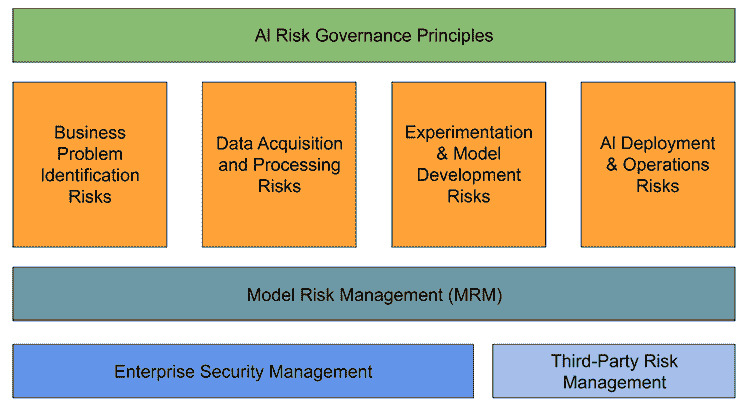
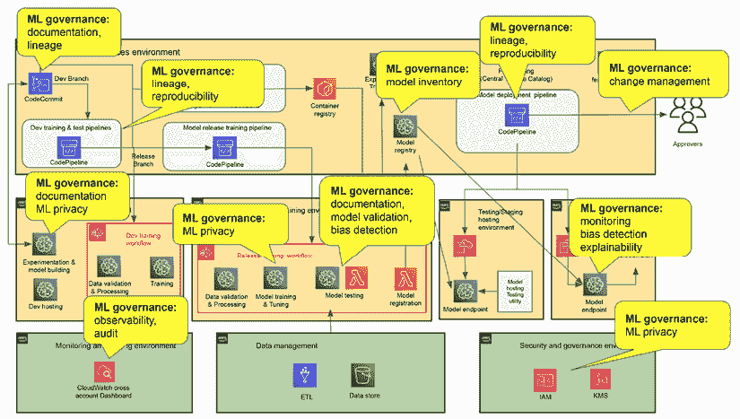

# 第十二章：AI 风险管理

随着组织越来越依赖 AI 进行关键决策并将 AI 纳入其业务的各个领域，有效的 AI 风险管理应成为首要任务。确保 ML 系统的安全合规部署对于建立 AI 解决方案的可信度至关重要。然而，许多组织和个人对 AI 系统相关的风险了解非常有限，这往往会导致可能对组织造成财务或法律上负面影响的后果。在本章中，我们将探讨关键的 AI 风险场景，突出 AI 风险管理与传统软件风险管理的差异，并强调拥有稳健的 AI 风险管理实践的重要性。我们将提出一个组织可以考虑用于管理 AI 风险的风险管理框架。最后，我们将讨论如何在 ML 生命周期的不同阶段管理风险，并设计支持风险管理和 AI 治理的 ML 平台。

具体来说，我们将涵盖以下关键主题：

+   理解 AI 风险场景

+   AI 风险管理监管环境

+   理解 AI 风险管理

+   在 AI 生命周期中应用风险管理

+   考虑治理和风险管理的 ML 平台设计

# 理解 AI 风险场景

我合作过的许多组织对它们 AI 系统中呈现的风险了解非常有限。他们通常将 AI 风险处理方式与传统软件相关的风险处理方式相同。实际上，AI 系统呈现的是一套我们在传统软件中通常看不到的新风险。在传统软件中，风险主要关于软件漏洞、遗留技术栈、恶意软件、配置错误以及数据未授权访问。AI 系统面临着许多相同的软件风险；此外，AI 系统还可以呈现新的风险类型，如偏见和错误信息。这些风险可能对依赖 AI 系统进行业务运营和决策的组织和个人产生重大的负面影响。AI 风险可以以许多不同的方式表现出来，例如表现出偏见行为或产生意外的预测结果。许多 AI 风险场景也是难以检测的沉默风险。

以下是一些 AI 风险可能出现的场景：

+   **偏见和歧视**：与人工智能相关联的最知名的风险之一是人工智能系统中可能表现出偏见和歧视。这可能会发生在机器学习算法在具有偏见的数据上训练或当算法本身容易受到偏见行为的影响时。在这些情况下，算法可能会学会歧视某些群体，导致不公平或歧视性的结果。例如，一家银行可能有一个使用具有偏见的数据集（如包括性别和种族群体作为输入）训练的机器学习模型，这可能导致对某些性别或种族群体的歧视，并可能违反诸如平等信贷机会法等法律法规。如今，许多组织使用人工智能筛选简历，发现其中一些人工智能系统对某些类型的候选人表现出偏好和偏见。2018 年，麻省理工学院的研究人员揭示了多家主要科技公司的人脸识别系统表现出显著的种族偏见，对深色皮肤个体的误识别率高于浅色皮肤个体。这一事件引发了关于人工智能系统可能持续和放大社会偏见、导致歧视性结果的担忧。

+   **虚假信息和误解释**：与人工智能相关联的另一项风险是生成虚假信息和事实误解释的可能性。这可能会发生在机器学习算法用于处理大量数据时，但数据中包含的错误或不一致性不易被发现。结果，算法可能会生成不准确或误导性的结果，导致可能的错误决策。随着生成式人工智能技术，如 ChatGPT 和 Stable Diffusion 模型的快速崛起，人类区分现实与幻觉也变得越来越困难。

    例如，深度伪造技术的快速进步，这些技术利用人工智能生成高度逼真的合成音频、视频和图像，引发了对其潜在误用的担忧，包括传播虚假信息、冒充和操纵。已经报道了使用深度伪造视频冒充公众人物和传播虚假叙述的事件。

+   **可解释性不足**：许多机器学习算法，如神经网络，可能非常复杂且难以理解，即使是训练有素的专家也如此。这种缺乏透明度使得在问题出现时难以识别问题的原因，从而使得开发有效的缓解措施来解决问题变得更加困难。例如，当 ChatGPT 对用户提示提供错误响应时，通常无法理解它为什么会犯这样的错误。对于受监管的行业来说，当组织希望采用更先进的黑盒算法，如神经网络时，这构成了一个重大挑战，因为这些组织通常需要为特定的输入和问题提供确定的响应，以及决策是如何做出的。

+   **意外后果**：机器学习算法有时会产生在开发过程中未预见到的意外后果或副作用。这是因为 AI 模型通常是为了优化特定目标而优化的，例如增加公司利润，而忽略了其他因素，如性别和种族。例如，一个基于 AI 的目标营销系统可能会通过激励和优惠来针对一部分客户，而在追求利润最大化的过程中歧视少数族裔或低收入客户。

+   **对抗攻击**：机器学习算法可能容易受到对抗攻击，这涉及故意操纵输入数据以产生意外或不希望的结果，或者为机器学习模型植入后门访问。例如，攻击者可能使用对抗攻击欺骗基于 AI 的欺诈检测系统，将其分类为合法交易。ML 模型也可能被破坏，通过使用如成员推断攻击等对抗技术来揭示训练数据。已经有一些对抗攻击的实例。在 2017 年，密歇根大学的研究人员展示了一种方法，可以生成小而看似无害的补丁，这些补丁可以放置在物理对象上，如停车标志或行人，导致最先进的对象检测模型误分类或无法检测这些对象。在另一个例子中，一家汽车经销商实施的聊天机器人因恶意用户利用漏洞而面临中断，有时这会导致机器人无意中提出非常规交易，如以最低成本购买全新的汽车。

+   **隐私侵犯和敏感数据泄露**：如今，许多最先进的模型都是使用来自许多不同来源的大量数据进行训练的，有时，个人或敏感信息会被用于这些模型的开发中。这本质上增加了潜在隐私侵犯和敏感数据意外泄露的风险。例如，为了训练用于癌症检测的医疗影像模型，你通常需要真实的患者数据，如 CT 扫描和其他**受保护的个人信息**（**PHI**）或**个人可识别信息**（**PII**）。如果处理不当，这些信息可能会被未经授权访问的人接触到。此外，作为模型训练的一部分，一些敏感数据可能会被训练模型记住，并且模型在做出预测时可能会泄露这些信息。2020 年，纽约时报的一项调查报告揭示了人们在没有同意和知情的情况下，他们的图像被用于 AI 模型训练。

+   **第三方风险**：虽然第三方风险也存在于第三方供应商的传统软件中，但 AI 系统在之前未见过的领域提高了这些风险。随着迁移学习、从预训练模型进行微调等 ML 技术的出现，越来越多的组织正在基于现有的预训练模型构建定制模型。然而，鉴于这些预训练模型的黑盒性质，它增加了模型行为的不确定性和关于模型科学有效性的未知因素。由于预训练模型超出了消费组织的安保和流程控制范围，消费组织可能会继承预训练模型中可能存在的风险，如偏差或后门攻击漏洞。例如，在 Hugging Face 等模型中心检测到具有诸如任意代码执行和文件写入等漏洞的模型。

+   **模型测试风险**：与传统的软件相比，基于 AI/ML 的软件和模型的测试标准和工具尚未充分发展。传统的软件测试主要关注定义良好的功能组件，如用户界面流程或业务逻辑，以及非功能性领域，如可扩展性和延迟。在 AI/ML 测试中，除了许多传统的软件测试要求外，还有新的测试概念，如不同故障模式的错误分析、模型敏感性、模型鲁棒性和对抗性测试，这些测试比传统的软件测试更难执行。该领域可用的测试工具也非常有限；通常，数据科学家和测试人员需要手动准备不同的测试场景和测试数据。

如您所见，人工智能系统的能力远远超出了传统软件，引入了许多新的潜在风险和挑战。随着这些先进技术被广泛采用并整合到关键领域，对其负责任的发展和部署的关注已上升至首位。鉴于人工智能的独特复杂性和深远影响，各个监管机构已采取积极措施，制定旨在减轻这些风险的指南和法规，以确保人工智能系统的道德和可信使用。

# 人工智能风险管理监管环境

随着人工智能技术在关键业务决策中的应用和快速进步，以及人工智能系统可能对个人、组织和社会产生的负面影响，许多国家和司法管辖区已制定政策、指南和法规，以帮助管理人工智能采用的风险。预计不同国家和司法管辖区将以较快的速度提出和通过更多立法。

在**美国**（**US**），联邦储备银行和**货币监理署**（**OCC**）早在 2011 年就发布了关于模型风险管理的监管指南（OCC 2011-2012/SR 11-7）。SR 11-7 已成为美国模型风险管理的关键监管指南。该指南确立了模型风险管理的核心原则，涵盖了治理、政策和控制、模型开发、实施和使用，以及模型验证流程。在治理和政策领域，它提供了关于模型清单管理、风险评级、角色和职责的指导。在模型开发和实施领域，它涵盖了设计过程、数据评估、模型测试和文档等主题。在验证领域，它提供了关于验证程序、监控和解决问题的指导。

在欧洲，**欧洲中央银行**（**ECB**）银行监管在 2016 年发布了**内部模型针对性审查**（**TRIM**）指南，以提供关于**模型风险管理**（**MRM**）框架的指导。具体来说，该指南指出，一个 MRM 框架需要有一个模型清单，以便全面了解模型及其应用，一个用于识别和缓解已知模型缺陷的指南，以及角色和职责的定义，以及政策和测量程序的定义。

最近，在 2021 年，**欧盟**（**EU**）推出了欧盟人工智能法案，旨在推广人工智能的好处，同时确保欧盟人工智能的安全和负责任使用。该法案采用基于风险的方法来监管人工智能，根据与人工智能系统相关的风险水平提出不同的要求。例如，支持关键基础设施的人工智能系统将被评为最高风险等级，并需要最严格的监督和法规。该法规还提出了人工智能透明度和问责制的规定，例如对可解释性和挑战人工智能系统做出的决策的能力的要求。它还对生物识别识别和监控中的人工智能使用制定了新的规则。

# 理解人工智能风险管理

为了应对与人工智能相关的各种风险并遵守不同的合规法规，许多组织，尤其是在受监管的行业中，已经开发和实施了人工智能风险管理计划。简而言之，人工智能风险管理是识别、评估和缓解与人工智能在自动化决策中使用相关的风险的过程。人工智能风险管理的最终目标是建立对人工智能/机器学习系统的信任，并确保符合适用的规则和法规。

信任一个人工智能系统需要对人工智能系统进行严格的评估和考虑，涉及许多不同的维度和标准。从功能上讲，一个值得信赖的人工智能系统需要可靠地提供有效的预测/响应，以满足其预期用途。这意味着生成的预测/响应始终有效，可以信赖用于可靠的决策。从伦理上讲，一个值得信赖的人工智能系统需要安全使用、可解释、隐私保护，并且公平，对偏见进行适当的管理和缓解。从网络安全的角度来看，一个值得信赖的人工智能系统还需要安全且能够抵御对抗性攻击。最后，一个值得信赖的人工智能系统需要提供透明度，例如系统如何以及使用哪些数据、算法和模型。值得注意的是，在构建和运营一个值得信赖的系统时，通常需要在这些不同维度之间进行权衡和取舍，这取决于组织的需要和目标。例如，为了保护隐私，一个组织可能需要在模型精度或预测速度上做出牺牲。

现在我们已经了解了在人工智能系统中建立信任所需的因素，让我们来探索并深入了解人工智能风险管理框架及其各个组成部分。以下图示展示了人工智能风险管理的关键组成部分，它主要涉及在人工智能生命周期中应用风险管理、企业风险管理和第三方风险管理，并受一套人工智能风险管理原则的指导。在本章中，我们将专注于风险管理。企业风险和第三方风险管理超出了人工智能的范畴，是普遍的考虑因素。

图 12.1：人工智能风险管理组件

接下来，我们将深入探讨治理监督原则和人工智能风险框架的细节。我们将主要关注对人工智能风险治理和风险管理（MRM）的理解，同时认识到传统企业安全和第三方风险管理也是整体人工智能风险管理考虑的一部分。

## 治理监督原则

实施人工智能风险管理始于建立关键治理原则。这些原则明确了风险管理计划需要达成的最终目标。根据组织所在的业务和监管环境，组织可以决定是否将其纳入其风险管理框架。以下是一些需要考虑的关键领域：

+   **透明度**：人工智能系统应设计为允许利益相关者理解决策是如何做出的以及为什么这么做。这可能包括解释机器学习模型预测的能力，以及对数据和使用算法的透明度，包括如何使用和实施。

+   **问责制**：组织应对人工智能系统做出的决策负责，包括其使用可能产生的任何负面后果。这种问责制将确保拥有组织有动力制定相关政策和流程来治理机器学习生命周期。

+   **数据治理**：组织应确保用于训练人工智能系统的数据是准确、代表性、道德和公正的。如果没有适当的数据治理，将很难信任使用未受管制的数据进行构建的人工智能系统。

+   **人工监督**：尽管人工智能系统旨在在大多数情况下自动做出决策而无需人工干预，但组织应具备在需要时实施人工监督的能力，这意味着在合理的情况下，人类应参与决策，并在必要时有权推翻决策。

+   **隐私和安全**：应建立适当的政策和流程，以确保人工智能系统根据法律和法规设计为保护资产隐私和安全。隐私和安全漏洞可能对组织产生重大的财务和非财务影响。

+   **公平性**：人工智能系统不应基于种族和性别等属性歧视某些个人或群体。

+   **有效性和可靠性**：人工智能系统应设计为产生可靠和有效的结果。需要实施适当的模型验证和测试框架及流程，以确保人工智能系统在生产中表现出高度可靠和可预测的行为。应建立机制来监控系统行为，并在观察到异常行为时实施缓解和回滚流程。

在治理监督下，组织还应考虑监管合规性要求、关于角色和责任的政策和指南，以及围绕人工智能系统和模型库存以及风险分类的标准和流程，以及如何处理生命周期和变更管理。

## 人工智能风险管理框架

在定义了人工智能治理监督原则后，组织可以向前推进，建立正式的人工智能风险管理框架，以及在整个机器学习生命周期中识别、评估和缓解风险的详细机制。许多组织采用的一个常见框架是金融服务业中常用的三道防线风险管理模型。该框架侧重于建立旨在识别、评估、缓解和审计与业务问题识别、数据管理、模型开发、部署和使用相关的潜在模型风险的策略、角色、责任和流程。

第一道防线由业务运营拥有。这一道防线专注于机器学习模型的发展和运用。业务运营负责在结构化的文档中创建和保留所有数据、模型假设、模型行为和模型性能指标，基于模型分类和风险暴露。模型经过测试和注册，相关的工件被保存，结果可以重现。一旦模型部署，将根据既定的程序和指南监控和解决系统问题、模型输出、模型偏差以及数据和模型漂移。

第二道防线由风险管理职能拥有，它专注于模型验证。风险管理职能负责独立审查和验证第一道防线生成的文档。这一道防线引入了关于控制和文档的标准，确保文档是自包含的，结果可重现，并且利益相关者对模型的局限性有充分的理解。

内部审计拥有第三道防线。第三道防线更多地关注控制和流程，而不是模型工件和理论。具体来说，这一道防线负责审计第一道和第二道防线，以确保所有既定流程和指南得到有效遵循和实施。这一道防线提供独立验证内部控制，并审查风险管理活动的及时性、频率和完整性。

MRM 仅主要解决与模型开发和开发生命周期相关的风险。然而，一个全面的 AI 风险管理框架还需要涵盖其他风险，如系统可扩展性和可靠性、系统未授权访问、访问拒绝和第三方故障风险。MRM 还应与企业技术风险、网络安全管理和第三方风险相结合，以确保对 AI 风险进行全面覆盖。

# 在人工智能生命周期中应用风险管理

人工智能风险可能存在于人工智能生命周期的任何阶段，从业务问题识别到人工智能系统的使用。在接下来的章节中，我们将探讨人工智能生命周期每个阶段可能出现的各种风险（如图 12.1 所示），并提出有效的策略和考虑因素以减轻这些风险。

## 业务问题识别和定义

在人工智能生命周期的这个初始阶段，组织对人工智能可以解决的业务问题有一个全面的理解。他们还概述了整体解决方案方法和数据需求。在这个阶段，验证人工智能解决方案是否符合治理原则、标准和要求，同时实现特定的业务目标，这是至关重要的。

一个显著的风险是合规性风险，它出现在对潜在监管要求缺乏考虑的情况下。组织必须了解与人工智能项目相关的适用监管要求，如欧盟人工智能法案，并在问题识别阶段采取适当的措施来应对。未能这样做可能导致不合规，影响整个项目。另一个关键考虑因素是道德风险。道德在一个组织的价值观和品牌声誉中可以发挥至关重要的作用。如果未在业务问题识别中整合，最终系统可能会导致与核心价值观和品牌不一致，从而造成声誉损害。

如果系统未针对预期用途进行设计，可能会出现意外后果。误用可能导致不可预见的负面后果，强调了对系统设计进行仔细考虑的必要性。风险评估和分类有助于确定潜在影响并指导不同级别的风险管理。如果没有这些，人工智能系统和其数据可能会被不当处理，导致意外后果和潜在的负面结果。此外，安全和隐私要求风险强调了实施安全和隐私措施的需要。如果没有这些要求，组织可能会面临隐私侵犯和人工智能系统被敌对操纵的风险，损害数据完整性和安全性。

在这个阶段识别出的每个潜在风险，进行评估以确定风险发生的严重性和可能性以及由此产生的后果都至关重要。根据每个组织的风险承受能力，确定是否应考虑任何缓解措施以降低风险。只有当关键风险得到理解、缓解或接受时，才能继续推进项目。

## 数据获取和管理

在项目生命周期的这个阶段，对于组织来说，确定适当的数据来源、建立数据获取策略以及评估其数据处理和管理的技术能力至关重要。除了面临许多常见的数据相关风险外，AI 系统还呈现一组独特的数据获取和处理风险。这些风险从选择适当的数据集到端到端的数据管理，涵盖了每个方面。这些风险包括从仔细选择数据集到在整个生命周期中对数据进行全面管理。

### 风险考量

一个关键风险是数据选择风险，不正确或采样不足的数据集可能引入重大的数据相关或偏差问题。这可能导致开发出有偏差的模型或无法有效解决实际问题的模型。例如，在一个信用评分项目中，如果在数据收集期间某些人口群体在数据集中代表性不足，那么产生的模型可能对代表性过高的群体表现出偏差。

数据质量和缺失数据对数据科学家来说是一个重大挑战，影响高质量机器学习模型的发展。确保数据准确性和解决缺失数据问题是成功开发稳健模型的关键。

由于数据标注过程主要依赖人工，数据标注风险成为一个关注点。这不仅成为模型开发的瓶颈，如果发生错误标注，还可能导致模型准确性下降。

对于符合特定合规要求的工程项目，监管和合规数据检查至关重要。执行监管和合规数据检查，例如数据主权规则，对于避免因违规而产生的潜在罚款和诉讼，保护组织的财务和声誉至关重要。

随着数据量，包括个人信息，的增加，随着人工智能能力的提升，数据隐私变得相关。在分析模型训练中，对个人数据的道德使用需要仔细考虑，以防止侵犯隐私。

对抗攻击风险引入了新的威胁维度，恶意行为者可以操纵训练数据，导致生成的模型在特定场景中表现不正确。例如，操纵训练数据标签可能导致模型学习错误并产生不准确的结果。这些与数据相关的风险需要细致的关注和缓解策略，以确保 AI 系统的成功和道德部署。

### 风险缓解

为了有效地缓解数据相关风险，必须建立全面的策略和机制，以解决与数据质量、偏见、人为错误和监管合规性要求相关的问题。这些机制包括各种倡议，包括实施强大的数据验证方法、建立数据选择和抽样的统一定义和标准、定期审查数据质量和完整性，以及提供缓解方法的指导。

为了解决数据选择和抽样风险，建立不同数据类型和来源的标准和一致定义至关重要，以确保在各种来源中数据选择的统一性。这些标准应包括对相关性、数据缺口、偏见和代表性的考虑，并提供关于缓解方法（如扩展数据来源、使用合成数据以及利用适当的抽样技术）的指导。

为了缓解数据质量风险，应采取严格的措施来验证是否满足最低的数据质量标准，以支持高质量的数据处理和模型训练。这包括建立规则和样本数据审查，以确保准确性、完整性、一致性以及目标人群的有效代表性。

为了解决数据标注风险，应在数据标注过程中实施控制措施，以确保一致性并减轻主观偏见。此外，对数据集标签的有效性进行样本测试可以进一步提高标注数据的品质和准确性。

在监管合规性和隐私检查方面，应将一套强大的检查机制整合到 MRM（营销资源管理）流程中。这包括建立增强的数据访问、所有权、收集、存储、传输和评估控制，以满足监管要求。此外，应将全面的数据隐私保护监管合规性检查嵌入到 MRM 流程中，将这些控制与企业的访问和身份验证平台联系起来，以实现集中治理。在必要时，应实施数据加密和数据掩码，以加强隐私保护

最终，数据相关风险的缓解策略和机制应根据组织的具体需求量身定制，并持续审查和更新，以跟上 AI/ML 技术及其相关风险不断发展的格局。

## 实验和模型开发

在项目生命周期的这个阶段，数据科学家利用各种算法和数据集进行实验和开发模型，以解决业务问题。与这个项目生命周期阶段相关的风险主要针对 AI/ML。它们涵盖了广泛的主题，如算法选择及其相关假设、限制、模型验证和鲁棒性、模型透明度和可解释性、模型公平性、合规性和预期模型使用。

### 风险考虑

模型假设和限制相关的风险源于假设和限制中的潜在不准确、不完整或不一致，导致模型无法充分适应情况。

例如，线性回归算法假设预测变量和响应变量之间存在线性关系，如果不存在这种关系，预测可能会错误或存在偏差。某些算法也可能对数据样本大小有限制，影响其在小数据集上的性能。

模型选择引入了当模型仅基于训练性能选择时与过拟合相关的风险，以及在需要可解释性时与缺乏可解释性相关的风险。不充分敏感性和情景分析对模型鲁棒性构成风险，因为未能理解信用风险模型的敏感性可能导致预测错误。同样，仅考虑有限经济情景的财务预测模型在意外事件发生时可能无法正常工作。

模型透明度风险源于透明度不足，阻碍了模型决策的可解释性和验证，如果组织无法证明其基于 AI 的决策是合理的，可能会在法律上处于脆弱状态。模型公平性风险承认数据和模型本身都可能引入偏差，影响 AI 系统的公平性。例如，朴素贝叶斯算法如果假设特征之间相互独立，那么当特征相关时，可能会导致预测错误。

模型评估风险源于独立验证不足或使用错误的验证方法或指标，当模型未经过充分测试时，可能会出现意外行为。模型使用和影响风险包括现实世界部署可能产生的潜在负面影响，因为基于历史数据训练的模型如果未来与过去差异显著，可能会表现不佳。

缺失血缘风险强调了解从数据源到模型工件（包括建模过程中的所有转换和实验）的来源的重要性，以理解模型行为并识别问题的根本原因。

### 风险缓解

为了减轻这些风险，组织必须建立全面的模型风险管理（MRM）标准，涵盖模型评估、验证、选择和公平性。此外，组织应提高其识别假设和局限性、解决已知差距以及通过以下方法确保模型透明度和溯源的能力和最佳实践：

+   对于模型假设和局限性风险，明确定义和验证算法的基本假设至关重要。使用各种技术测试难以验证的假设，确保完整性，并计算模型不确定性以确定输出结果的置信水平。

+   为了减轻与模型选择相关的风险，数据科学家应开发一套稳健的候选模型，进行多样化的团队审查，并涉及技术、业务和目标受众代表，以确保所选模型能够有效解决问题。建模方法应评估其是否适合目的、可解释、可重复和稳健，并记录决策和支撑证据。

+   在模型风险管理（MRM）框架内建立模型敏感性和场景测试标准，以解决敏感性和场景测试的不足。这些程序是开发过程的重要组成部分，提供了关于影响模型鲁棒性的边界条件的见解，最小化错误，并增强对输入输出交互的理解。

+   为了应对模型透明度风险，建立促进开发团队内部沟通和反馈的标准，确保模型开发过程中的透明度。详尽的文档，包括模型验证技术，作为透明度的佐证证据。

+   对于模型公平性问题，定义并纳入模型公平性标准。在模型生命周期中嵌入公平性检查，涉及利益相关者在问题缓解中的参与，增强治理技术，并认识到在算法系统中解决歧视的持续过程。

+   在模型风险管理（MRM）框架内纳入模型性能评估标准，以进行验证，涉及业务和技术利益相关者在问题发现和缓解中的参与。采用标准化的验证工具和技术，进行一致性的程序，并按照商定的标准进行端到端评估，在重新训练期间监控指标。

+   通过验证设计/部署/验证期间对决策的理解，在模型风险管理（MRM）内评估模型使用和影响风险。进行影响评估，以评估与预设阈值的偏差风险，并验证模型结果在精确度、一致性、相关性和与可信人工智能标准的对齐性。

+   建立从数据源到部署的模型溯源跟踪机制和技术能力。实施全面的元数据管理、相关工件版本控制、模型注册和审计/日志机制，以了解所做的更改、由谁以及为何目的。

总体而言，一个包含技术标准、持续监控和更新以及道德决策文化的综合 MRM 框架对于组织有效管理模型开发相关的风险至关重要，以便它们可以以可信的方式使用。

## AI 系统部署和运营

在这个生命周期阶段，组织设计和构建 AI 系统/模型在生产中的部署技术环境，以处理更广泛的应用生态系统中的现实世界业务工作流程，并建立监控环境和修复从基本系统故障到模型性能退化的生产问题的操作流程和标准。

### 风险考虑

人类监督风险涉及在将 AI 模型部署到生产之前对其进行人类审查的关键实践，以确保其持续适合其预期目的，防止部署准备不足的系统导致生产问题或不可预见的结果。

技术集成风险出现在 AI 系统通常集成到更广泛的技术生态系统中，支持多个业务功能。在集成上游和下游系统进行数据传输、模型集成或 API 集成时可能会出现挑战，可能造成兼容性问题，例如错误的模型版本影响不同的系统。

技术可扩展性风险与 AI 系统/模型部署后数据量、业务用户和客户的意外激增相关。无法处理可扩展性场景可能会对业务和用户体验产生负面影响。

模型性能和行为变化风险源于使用历史数据开发的 AI 系统。现实世界环境中数据漂移和异常条件等意外变化可能导致模型的行为与原始假设不同。

回退程序风险强调了在检测到生产问题时建立良好的回退程序的重要性。不充分的回退协议可能会危及系统操作的连续性。

对抗攻击对 AI 系统提出了新的威胁。对抗攻击，如向 AI 系统提供不良数据，可能导致预测错误和下游决策错误。

### 风险缓解

为了在部署和运营期间有效管理风险，强大的缓解机制和技术能力是必不可少的。严格的测试和操作检查、集成标准、模型性能监控、建立的问题解决流程以及在整个 AI 生命周期中的对抗监控和修复是关键关注领域。

让我们深入探讨具体建议。

对于有效的 AI 风险管理来说，一个具有模型注册库的模型管理系统是一个关键要素。该系统应提供有关模型、性能指标、用途和相关元数据的详细信息，并应纳入 MRM 标准并嵌入操作化检查。压力测试和扩展模拟对于理解在重负载下的行为至关重要。组织应建立流程和工具，以便模型所有者可以监控、管理、治理和分析结果。

为了缓解 AI 集成风险，组织需要在风险管理中纳入集成标准和要求。确保平台间的互操作性并进行稳健的集成测试至关重要。验证适当的配置和生产环境中的集成对于防止迁移或升级过程中的错误是必不可少的。

建立模型部署审查和批准标准至关重要，包括对设计、算法、测试结果和性能指标进行详细审查。它应概述缓解潜在部署风险的步骤。

为了确保性能和行为变化的运营连续性，MRM 应包括模型监控、性能问题跟踪和解决标准。持续监控统计、技术和业务指标，以及实时断路器，有助于确保模型按预期运行。预先指定基准或旧模型作为后备选项，在性能边界被突破时是有用的。

在 MRM 中的对抗性攻击监控标准对于防止恶意输入导致模型故障至关重要。有效的测试、审计技术和认证计划是解决 AI 模型漏洞所必需的。利用对抗性攻击和模型数据泄露的研究进行漏洞测试，并确保对各种攻击的鲁棒性和弹性是至关重要的。应建立积极的网络威胁狩猎，以检测和隔离网络中的高级威胁。

到目前为止我们所涵盖的内容并不包括在整个 AI 生命周期中可能遇到的所有风险，而且新的风险也在不断出现。在实践中，完全缓解所有风险也是不可能的，并且可能适得其反。组织应确定不同风险的容忍度，这些容忍度将高度依赖于具体的应用场景和用例。其他因素，如系统所有者和监管机构制定的政策、组织优先级和资源考虑，也可能影响风险容忍度。值得注意的是，随着影响因素的变化，风险容忍度可能会随时间而变化。

同时，也要优先考虑人工智能生命周期中识别出的风险。组织应认识到并非所有风险都是相同的，并且应适当分配有限的资源来应对不同的风险。应使用评估的风险级别和人工智能系统的潜在影响来优先分配资源，以减轻这些风险。

最后，人工智能风险不是孤立的风险，应该被纳入更广泛的企业风险管理策略和流程中。管理风险的不同参与者的角色和责任将跨越不同的功能领域，如工程、数据科学、网络安全、审计和合规。

# 考虑治理和风险管理设计机器学习平台

机器学习技术系统在人工智能风险管理和活动中扮演着至关重要的角色。首先，这些系统必须开发和构建以符合内部和外部政策和指南。此外，技术可以帮助简化并自动化机器学习治理流程。以下图示展示了企业机器学习平台中的不同机器学习治理接触点。重要的是要知道，仅机器学习技术本身只能帮助解决人工智能风险的一个子集；还需要整合其他企业安全技术，以形成一个更全面的治理和防御机制。

图 12.2：机器学习平台和机器学习治理

在前面的图中，机器学习治理接触点已集成到第九章*设计 AWS 机器学习服务的企业机器学习架构*中*图 9.4*所描述的 MLOps 架构中。

当一个机器学习平台在考虑人工智能风险管理和治理的情况下构建时，它可以收集和提供信息以支持风险管理计划，同时优化风险管理流程。在线数据存储、工作流应用程序、文档共享系统和模型库存数据库是用于人工智能治理的技术解决方案之一。在接下来的部分，我们将深入了解一些核心的机器学习治理组件，并看看机器学习平台或技术可以如何融入其中。

## 数据和模型文档

人工智能治理的一个基本要素是文档。所有用于决策的模型都应得到适当的文档记录。文档的范围可能包括以下内容：

+   数据概述，估值数据质量报告以及对输入数据的评估

+   模型开发文档包括方法学和假设、模型使用说明、性能和验证结果以及其他定性和定量分析

+   第二和第三道防线对模型验证策略和报告

+   模型性能监控结果和数据漂移报告

+   模型实施和用户接受度测试报告

机器学习平台在机器学习治理文档中的作用通常是提供数据点，这些数据点输入到正式的风险管理文档中或生成一些现成的报告。具体来说，一个机器学习平台应该能够跟踪、存储和报告以下数据点：

+   数据质量指标，如数据描述、统计数据、偏差和错误

+   开发和测试中的模型指标和验证结果

+   模型偏差和可解释性报告

+   生产中的模型性能监控结果

+   模型描述和预期用途

+   风险评级和分类详情

不同的机器学习平台在支持人工智能治理文档要求方面具有不同的功能。在此，我们将讨论 SageMaker 支持这些要求的各种功能。SageMaker 可以生成要纳入模型风险文档的数据和文档。这包括跟踪和生成与人工智能治理文档相关的信息，例如：

+   **模型指标**：SageMaker 训练服务跟踪模型指标，如训练错误和验证错误。

+   **数据和模型偏差报告**：SageMaker Clarify 是 SageMaker 中的偏差检测组件。如果您启用 SageMaker Clarify，您可以为训练数据和训练模型获取数据和模型偏差报告。数据和模型偏差报告包含有关训练数据不平衡和不同年龄组和性别预测行为的详细信息。

+   **模型可解释性报告**：SageMaker Clarify 还提供模型可解释性功能。它使用 SHAP 来解释每个输入对最终决策的贡献。您可以在 [`shap.readthedocs.io/en/latest/index.html`](https://shap.readthedocs.io/en/latest/index.html) 获取更多关于 SHAP 的信息。

+   **模型卡**：SageMaker 模型卡可用于记录有关机器学习模型的关键信息，例如模型的使用目的、风险评级以及模型训练和性能的详细描述。

可用的开源和管理模型注册平台可用于管理模型注册。例如，MLflow 模型注册是开源选项，而 Amazon SageMaker 提供托管模型注册服务。SageMaker 模型注册具有几个关键功能，可以帮助进行机器学习治理活动和流程：

+   **模型清单**：所有不同版本的模型都属于 SageMaker 模型注册中的相应模型组。您可以在这里查看所有模型组和模型的各个版本。模型度量、训练作业详情、用于训练的超参数和训练数据源等元数据对于模型审查和模型审计流程是重要的数据点。根据具体业务需求，您可以设置一个集中式模型注册以实现单一企业视图，或者如果需要满足治理和审计要求，可以设置分布式模型注册。

+   **模型批准和生命周期跟踪**：您可以直接在 SageMaker 模型注册表中跟踪模型的批准和模型阶段。这些详细信息有助于业务运营和审计确保遵循适当的流程。

在部署后监控模型对于识别任何潜在故障并采取及时补救措施以减轻风险至关重要。为确保平稳运行，必须监控系统的可用性和错误，以及数据和模型漂移以及预测失败。Amazon SageMaker 提供了一种模型监控功能，可以检测数据和模型漂移。SageMaker 模型监控提供以下功能：

+   **数据漂移**：使用 SageMaker 模型监控，您可以在生产中监控数据质量问题以及数据分布偏差（即数据漂移）。要使用此功能，您使用基线数据集（例如模型训练数据集）创建基线，以获取数据统计信息和数据类型并建议监控约束。SageMaker 模型监控可以捕获实时推理流量，计算数据统计信息，检查数据类型，验证它们与约束，并触发警报。例如，如果一个特征的均值和标准差与基线有显著变化，则可以触发警报。

+   **模型性能漂移**：您可以使用 SageMaker 模型监控检测生产中的模型性能变化。要使用此功能，您使用包含输入和标签的基线数据集创建模型性能基线作业。基线作业将建议约束，即 Model Monitor 将与生产中收集的地面真实数据计算的指标进行比较的指标阈值。指标可以可选地发送到 CloudWatch 进行可视化。

+   **特征归因漂移**：当与 SageMaker Clarify 配合使用时，SageMaker 模型监控可以报告特征归因漂移。特征归因是特征对预测输出的重要性的指标。类似于数据和模型漂移，您使用基线数据创建 SHAP 基线作业以生成约束建议。然后安排单独的监控作业以监控生产中的预测与基线。

## 线谱和可重复性

MRM 需要建立数据和模型之间的线谱以确保可重复性。线谱是对数据的起源、转换和依赖关系的系统跟踪和记录，以及机器学习模型的开发和演变，在整个过程中提供透明度和问责制。线谱信息包括训练数据源、算法选择、超参数配置以及模型训练脚本。SageMaker 提供了几个有助于建立线谱的功能：

+   SageMaker 训练作业保留诸如训练数据源、训练作业容器（包含算法和训练脚本）、超参数配置以及模型工件位置等谱系数据。为了记录保留的目的，SageMaker 环境中的历史训练作业数据是不可变的。

+   SageMaker 实验和 ML 谱系跟踪可以包含更多组件细节，如数据处理，以实现更完整的谱系跟踪。

+   SageMaker 托管包含有关原始模型工件和推理容器的位置信息，以追踪从模型到端点的谱系。

这些谱系数据点，如训练数据源和训练配置，可以通过调用 SageMaker API 获得；外部应用程序可以直接调用 SageMaker API 来提取这些数据以供审查。或者，可以开发一个数据提取作业来提取这些数据点并将它们加载到专门构建的风险管理存储库中进行分析。

在 ML 系统的实施中，ML 隐私的重要性正在迅速增长。为了遵守数据隐私法规或内部数据隐私控制，ML 系统必须具备基本的基础设施安全特性，例如数据加密、网络隔离、计算隔离和私有连接。通过使用基于 SageMaker 的 ML 平台，您可以启用以下基本安全控制：

+   **私有网络**：由于 SageMaker 是一个完全管理的服务，它运行在 AWS 拥有的账户中。默认情况下，您自己的 AWS 账户中的资源通过公共互联网与 SageMaker API 通信。为了从您自己的 AWS 环境中启用到 SageMaker 组件的私有连接，您可以将它们附加到您自己的**虚拟私有云**（**VPC**）中的子网。

+   **存储加密**：在创建 SageMaker 笔记本、训练作业、处理作业或托管端点时提供加密密钥可以启用静态数据加密。

+   **禁用互联网访问**：默认情况下，SageMaker 笔记本、训练作业和托管服务可以访问互联网。可以通过配置来禁用互联网访问。

## 可观察性和审计

审计主要集中于过程验证和工件收集，以支持审计活动。进行过程所使用的平台通常作为收集工件的情报源。例如，假设存在一个 MRM 策略，在将模型部署到生产之前需要获得批准。在这种情况下，审计将需要访问记录系统以确保所需的数据被收集并保留。

SageMaker 和其他相关服务可以作为支持整体审计流程的数据源。具体来说，它提供了以下可能对审计目的相关的信息：

+   **活动和访问审计跟踪**：SageMaker 将所有审计跟踪数据发送到 CloudWatch 日志，这些数据可以保留并用于审计目的。

+   **模型审批跟踪**：模型部署审批在 SageMaker 模型注册表中跟踪。这可以作为审计员证据，证明遵循了所需的审批流程。

+   **血缘跟踪**：SageMaker 实验和 ML 血缘跟踪组件可以跟踪和保留模型血缘，如数据处理、模型训练和模型部署。血缘跟踪信息有助于审计员验证模型可以使用其原始数据和配置依赖关系进行重现。

+   **配置更改**：系统配置数据以更改事件的形式记录在 AWS CloudTrail 中。例如，当 SageMaker 端点被删除时，CloudTrail 中会有一个条目指示这种更改。

## 可扩展性和性能

为了减轻潜在的扩展性风险，AI 系统应该设计成能够处理动态和意外的负载。对于一个机器学习平台来说，这意味着训练基础设施的设计和实施旨在支持单个大型训练作业以及许多并行运行的训练作业。同样，模型托管基础设施应该能够处理大量并行运行的模型，以及跨多个节点运行的大量模型实例。

如果您选择的平台是 SageMaker，以下功能可以帮助减轻训练和托管扩展挑战：

+   **训练基础设施扩展**：SageMaker 支持大规模分布式训练，能够利用数百个节点和数千个 CPU/GPU。此外，SageMaker 提供了一个专门用于运行数据并行和模型并行训练作业的库。对于存储扩展，高性能存储解决方案如**弹性文件系统**（**EFS**）和 FSx 可以挂载到 SageMaker 训练节点上，以适应需要超过 1 TB 大规模数据集的训练作业。AWS 账户可以并行运行多个训练作业，并且可以根据请求增加软限制。

+   **托管基础设施扩展**：SageMaker 提供了多种选项来扩展模型托管需求。**多模型端点**（**MME**）功能允许您在单个端点后面托管多个模型，同时降低成本。SageMaker 的自动扩展功能使您能够根据诸如每个主机调用次数等指标定义扩展策略，当流量增加时，可以自动增加运行相同模型的实例数量。此外，无服务器推理选项允许您并发运行单个模型，最多可达 SageMaker 支持的最大数量。

## 数据质量

数据质量检查应在生命周期的多个阶段进行，包括数据获取和处理、探索性数据分析与数据整理、特征工程和模型推理。检查应涵盖数据质量的许多方面，如缺失数据、数据准确性、不同来源之间的不一致性、格式错误、不完整性、不平衡数据和重复。

从 AWS 技术角度来看，有几种专门设计的工具和功能可以帮助进行数据质量管理：

+   AWS Glue DataBrew 提供了一系列数据质量功能，可以帮助确保用于分析或模型训练的数据的准确性和可靠性。DataBrew 主要被数据工程师使用，他们在数据获取和处理阶段负责为下游用户（如数据科学家）提供和清理数据。以下是一些这些功能包括：

    +   **数据概要**：DataBrew 可以自动概要化数据集，以识别数据质量问题，例如缺失或不一致的数据值、异常值或重复项。

    +   **数据清理**：DataBrew 提供了一系列数据清理转换，可以应用于解决常见的数据质量问题，例如填充缺失值、删除重复项或标准化数据格式。

    +   **数据验证**：DataBrew 可以执行数据验证检查，以确保数据值在预期的范围内，或者符合预定义的标准或格式。

    +   **数据血缘**：DataBrew 跟踪数据转换的血缘，有助于确保数据被正确处理，并且任何更改都可以追溯到其来源。

    +   **数据版本控制**：DataBrew 支持数据集的版本控制，使得跟踪更改并在必要时回滚到先前版本变得容易。

+   SageMaker Data Wrangler 提供了一些类似的数据质量功能，主要针对在 SageMaker 环境中进行数据探索性分析和特征工程的数据科学家。Data Wrangler 中的数据质量和洞察报告可以自动验证数据质量（如缺失值、重复行和数据类型），并帮助检测数据中的异常（如异常值、类别不平衡和数据泄露）。

总之，机器学习技术系统在人工智能风险管理领域发挥着关键作用。基础步骤涉及将这些系统与内部和外部政策对齐，确保稳健的合规性。

此外，利用 SageMaker 和 MLOps 系统等工具成为了一种战略方法，为文档编制、血缘跟踪、数据管理和质量保证提供了实质性支持。通过增强可观察性和实现彻底审计，这些技术使组织能够以高效和精确的方式应对人工智能风险管理的复杂性。

# 摘要

本章深入探讨了与人工智能风险管理相关的几个领域及其支持的技术平台。到目前为止，你应该对关键的 AI 相关风险场景、为什么 AI 风险管理至关重要以及如何在 AI 生命周期中检测和应对潜在风险有了坚实的理解。此外，你应该意识到机器学习平台在支持 AI 风险管理中的重要性。值得注意的是，AI 风险是一个庞大且复杂的领域，存在许多未解决的挑战和快速出现的新的风险。此外，AI 技术和应用的快速发展也在创造新的风险暴露，这是风险管理专业人员必须不断应对的。

在下一章中，我们将更深入地探讨几个具体的 AI 风险主题和缓解技术，包括偏差、模型可解释性、模型鲁棒性和对抗攻击。

# 留下评论！

喜欢这本书吗？通过留下亚马逊评论来帮助像你这样的读者。扫描下面的二维码，获取你选择的免费电子书。

**限时优惠**
