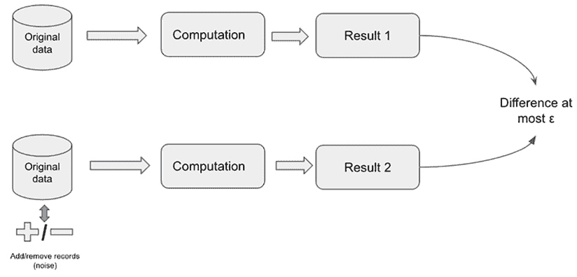
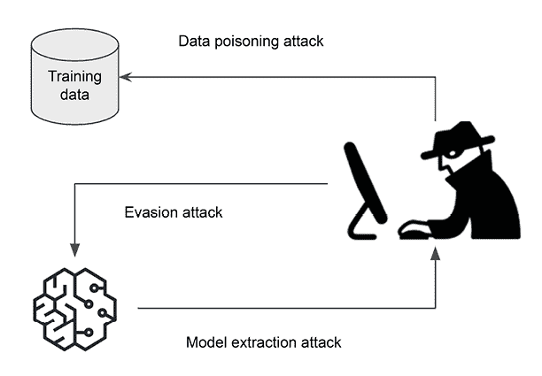
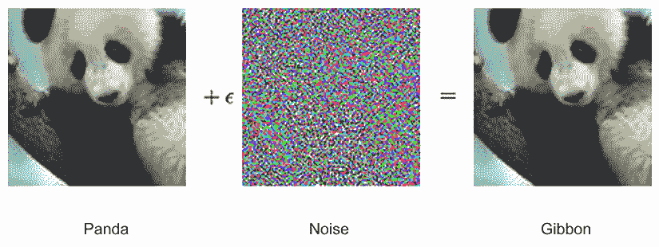
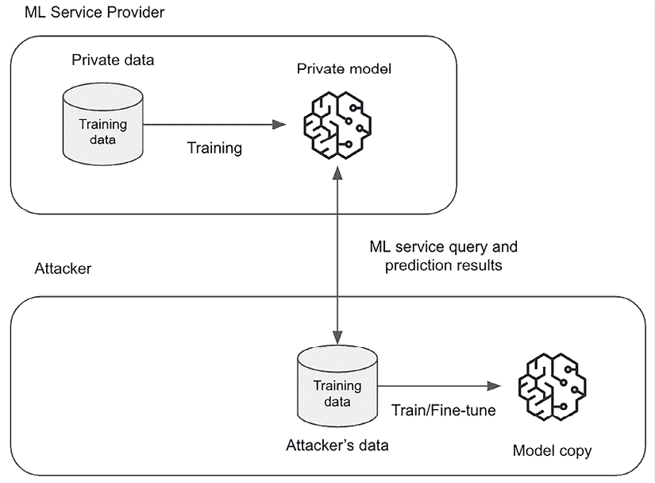

# 13

# 偏差、可解释性、隐私和对抗攻击

在上一章中，我们探讨了人工智能风险管理框架的主题，并讨论了其在减轻与人工智能系统相关的风险方面的重要性。我们涵盖了其核心概念、识别和评估风险的重要性以及管理这些风险的建议。在本章中，我们将更深入地探讨几个具体的风险主题和缓解技术。我们将探讨**偏差**、**可解释性**、**隐私**和**对抗攻击**的基本领域，以及它们与人工智能系统的关系。这些是负责任的人工智能实践中最相关的领域之一，对于机器学习从业者来说，了解这些主题及其技术解决方案的基础知识非常重要。具体来说，我们将研究偏差如何导致不公平和歧视性的结果，以及可解释性如何增强人工智能系统的透明度和问责制。我们还将讨论人工智能系统中隐私的重要性，以及对抗攻击的潜在风险及其缓解方法。

总结来说，本章将涵盖以下主题：

+   什么是偏差？

+   什么是可解释性？

+   理解安全和隐私保护机器学习

+   理解对抗攻击及其防御方法

+   实践实验室 - 检测偏差、解释模型、训练隐私保护模式以及模拟对抗攻击

# 理解偏差

检测和缓解偏差是人工智能风险管理的关键关注领域。机器学习模型中偏差的存在可能使组织面临潜在的法律风险，但也可能导致负面宣传，造成声誉损害和公共关系问题。一些具体的法律和法规，如*平等信贷机会法*，也禁止基于种族、肤色、宗教、性别、国籍起源、婚姻状况和年龄在商业交易（如信贷交易）中进行歧视。其他反对歧视的法律例子包括*1964 年民权法*和*1967 年就业年龄歧视法*。

机器学习偏见可能源于数据中的潜在偏见。由于机器学习模型是使用数据训练的，如果数据存在偏见，那么训练好的模型也会表现出偏见行为。例如，如果您构建一个机器学习模型来预测贷款违约率作为贷款申请审查过程的一部分，并且您在训练数据中使用种族作为特征之一，那么机器学习算法可能会潜在地识别与种族相关的模式，并偏爱某些民族群体而忽视其他群体。偏见可以在机器学习生命周期的不同阶段引入。例如，可能存在数据选择偏见，因为某些群体可能在数据收集阶段有更强的代表性。还可能存在标签偏见，即人类在分配数据集标签时可能有意或无意地犯错。含有虚假信息的数据源也可能是偏见的一个来源，导致产生有偏见的 AI 解决方案。

解释模型所做的决策的能力有助于组织满足治理机构的要求和审计要求。此外，模型可解释性有助于组织理解输入与机器学习预测之间的因果关系，从而做出更好的商业决策。例如，如果您能理解客户对金融产品产生浓厚兴趣背后的原因（例如奖励计划），您可以通过加倍奖励计划等业务策略来调整您的业务策略，从而增加收入。能够解释模型决策还有助于与机器学习模型中的领域专家建立信任。如果领域专家同意模型预测的方式，他们更有可能采用模型进行决策。存在各种用于偏见检测和模型可解释性的技术，我们将在下一节中更详细地探讨一些技术。

为了检测和减轻偏见，需要确立一些指导原则，以确定什么被认为是公平的。例如，银行的贷款审批流程应同等对待类似的人，当具有相似资格的申请人被同等评估时，该流程可能被认为是公平的。银行还需要确保不同的人口子群体在贷款审批方面受到平等对待，并测量诸如贷款拒绝率等指标在不同人口子群体之间的大致相似性。

根据公平的定义，可以使用不同的指标来衡量偏见。有些指标甚至可能相互矛盾。因此，您需要选择最能支持公平定义的指标，并考虑社会和法律因素以及来自不同人口群体的反馈。在本节中，我们列出了一些可供考虑的偏见指标：

+   **类别不平衡**：此指标衡量了不同人口群体（尤其是弱势群体）在数据集中的不平衡表示。

+   **观察标签中正比例的差异**: 此指标衡量不同人口群体中正标签的差异。

+   **Kullback–Leibler (KL) 散度**: 此指标比较不同群体（如优势群体和劣势群体）的特征和标签中的概率分布。

+   **条件标签的群体差异**: 此指标衡量一个群体被拒绝的结果比例是否大于该群体被接受的结果比例。

+   **召回差异**: 此指标衡量机器学习模型是否对一个群体（优势群体）比其他群体（劣势群体）找到更多的真正阳性。

在检测到偏差后，有几种技术可以潜在地减轻偏差，尽管这些技术具有固有的挑战和局限性。以下是一些可能采用的方法示例：

+   **去除特征**: 这种方法可以通过去除可能引起偏差的特征（如性别和年龄）来帮助减轻偏差。然而，这种方法也存在局限性和挑战，包括代理问题，即去除敏感特征（如性别或年龄）可能无法完全消除偏差，如果数据中的其他特征与敏感属性相关联。此外，去除特征可能会丢失一些相关信息，这可能会对模型的性能或有用性产生负面影响。

+   **训练数据的重新平衡**: 这种方法有助于纠正训练数据中不同群体表示数量上的偏差。然而，如果初始数据集高度不平衡或代表性不足的群体具有内在不同的分布，则重新平衡训练数据可能不可行或有效。此外，人为地重新平衡数据可能会引入其他偏差或扭曲，并且可能无法解决数据中反映的潜在社会偏差。

+   **调整训练数据中的标签**: 这种方法使不同子组的标签比例接近。然而，这种方法假设标签本身没有偏差，这并不总是成立，尤其是如果标签是由可能有自己的偏见的人类分配的。此外，在某些领域调整标签可能很困难或不可能，特别是如果基线事实未知或标签不是主观的。

在缓解偏差方面存在其他一些一般性挑战，包括缺乏真实基准；在许多现实场景中，很难确定真正的无偏差真实基准，这使得准确测量和缓解偏差变得具有挑战性。此外，这些方法通常专注于缓解与单个敏感属性（如性别或种族）相关的偏差，但可能无法解决由多个敏感属性组合产生的交叉偏差。此外，在某些情况下，缓解偏差可能会以降低模型性能或准确性的代价为代价，需要在这两个相互竞争的目标——公平性和性能之间取得平衡。

重要的是要注意，偏差缓解是一个活跃的研究领域，正在开发更先进的技术来解决一些局限性和挑战。这包括对抗性去偏差，这是一种使用对抗模型从主模型的内部表示或输出中预测敏感属性（例如，性别、种族）的技术。另一种技术是因果建模，旨在确保如果个人的敏感属性（s）不同，他们的预测或结果在所有其他条件相同的情况下不应有显著变化。此外，结合多种方法以及仔细的监控和评估可能是有效缓解现实应用中偏差的必要条件。

有许多开源库用于公平性和偏差管理，例如：

+   公平性 ([`github.com/algofairness/fairness-comparison`](https://github.com/algofairness/fairness-comparison))

+   Aequitas ([`github.com/dssg/aequitas`](https://github.com/dssg/aequitas))

+   Themis ([`github.com/LASER-UMASS/Themis`](https://github.com/LASER-UMASS/Themis))

+   负责任地 ([`github.com/ResponsiblyAI/responsibly`](https://github.com/ResponsiblyAI/responsibly))

+   IBM AI Fairness 360 ([`aif360.res.ibm.com/`](https://aif360.res.ibm.com/))

在 SageMaker 中还有一个用于偏差检测的组件，我们将在后面的章节中更详细地介绍。

# 理解机器学习可解释性

当解释机器学习模型的行为时，有两个主要概念：

+   **全局可解释性**：这是模型在所有用于模型训练和/或预测的数据点上的整体行为。这有助于理解不同输入特征如何共同影响模型预测的结果。例如，在训练用于信用评分的机器学习模型后，确定收入是预测所有借款申请人数据点上的高信用评分最重要的特征。

+   **本地可解释性**：这是模型对单个数据点（实例）的行为，以及哪些特征对单个数据点的预测影响最大。例如，当您尝试解释哪些特征对单个贷款申请人的决策影响最大时，可能会发现教育是最重要的特征，尽管在全局层面上收入是最重要的特征。

一些机器学习算法，如线性回归和决策树，被认为是可解释算法，具有内置的解释模型的能力。例如，线性回归模型的系数直接表示不同输入特征的相对重要性，而决策树中的分割点表示用于决策的规则。

对于像神经网络这样的黑盒模型，解释决策是如何做出的非常困难，部分原因是非线性和模型复杂性。解决这一问题的方法之一是使用白盒代理模型来帮助解释黑盒模型的决策。例如，您可以使用与黑盒神经网络模型相同的输入数据并行训练一个线性回归模型。虽然线性回归模型可能没有黑盒模型那样的性能，但它可以用来从高层次上解释决策是如何做出的。然而，白盒代理模型存在已知的局限性。如示例中提到的，线性回归模型可能无法捕捉到神经网络学习到的复杂非线性关系，从而导致决策过程的错误表示。此外，虽然简单的代理模型，如线性回归，可能提供对黑盒模型行为的全局近似，但它们可能无法捕捉局部模式或决策边界。

有各种开源包，如**LIME**（代表**本地可解释模型无关解释**），以及**SHAP**（代表**SHapley 增量解释**），用于模型可解释性。LIME 和 SHAP 都采用了代理模型方法。

## LIME

LIME 支持本地（实例）可解释性，正如其名所示。LIME 背后的主要思想是对原始数据点进行扰动（调整数据点），将其输入到黑盒模型中，并观察相应的输出。扰动数据点是原始数据点的微小变化，并根据它们与原始数据点的接近程度进行加权。

然后，它使用扰动数据点和响应拟合一个代理模型，例如线性回归。最后，训练好的线性模型被用来解释原始数据点的决策是如何做出的。

LIME 可以作为常规 Python 包安装，并可用于解释文本分类器、图像分类器、表格分类器和回归模型。以下是 LIME 中可用的解释器：

+   **表格数据解释器**：`lime_tabular.LimeTabularExplainer()`

+   **图像数据解释器**：`lime_image.LimeImageExplainer()`

+   **文本数据解释器**：`lime_text.LimeTextExplainer()`

LIME 存在某些局限性。其解释依赖于围绕感兴趣实例生成的扰动样本，而这些解释的质量可能会受到采样过程的影响。不同的采样技术或扰动函数可能会产生不同的解释。虽然 LIME 可以突出显示单个特征对特定预测的重要性，但它可能无法清楚地解释这些特征如何在黑盒模型中组合或相互作用。生成 LIME 解释的计算成本可能很高，尤其是在高维数据或复杂模型中，因为它需要为每个感兴趣实例创建和评估大量的扰动样本。LIME 通过使用可解释模型（例如线性回归）来近似黑盒模型围绕感兴趣实例的行为，从而生成局部解释。然而，这种局部近似可能无法准确反映复杂模型的真正行为，尤其是在具有高非线性或不连续性的区域。此外，对于无法由线性模型近似的局部数据点，线性代理可能是不准确的。

尽管存在这些限制，LIME 仍然是一种生成局部解释的流行且有用的技术，尤其是在与其他可解释性方法结合使用或与领域专业知识结合使用时。

## SHAP

SHAP 是一个更受欢迎的包，它解决了 LIME 的一些缺点。它使用联盟博弈论的概念来计算每个特征对预测的贡献，其中每个数据实例的特征值都是联盟中的一个玩家。

联盟博弈论的基本思想是在玩游戏时形成玩家联盟的不同排列，然后观察不同排列的游戏结果，最后计算每个玩家的贡献。例如，如果训练数据集中有 3 个特征（*A, B* 和 *C*），那么将有 8 个不同的联盟（*2*^^*3*）。我们为每个不同的联盟训练一个模型，总共 8 个模型。我们使用所有 8 个模型在数据集上生成预测，找出每个特征的边际贡献，并为每个特征分配一个 Shapley 值以指示特征的重要性。例如，如果仅使用特征 *A* 和 *B* 的联盟生成的输出为 *50*，而使用特征 *A, B* 和 *C* 的模型生成的输出为 *60*，那么特征 *C* 的边际贡献为 *10*。这只是一个概念的一般化；实际的计算和分配更为复杂。

SHAP 也可以像常规 Python 包一样安装。它可以用来解释树集成模型、自然语言模型（如变压器）和深度学习模型。它有以下主要解释器：

+   **TreeExplainer**: 用于计算树和树集成算法 SHAP 值的实现

+   **DeepExplainer**: 用于计算深度学习模型 SHAP 值的实现

+   **GradientExplainer**: 用于近似深度学习模型 SHAP 值的预期梯度的实现

+   **LinearExplainer**: 用于独立特征的线性模型的解释

+   **KernelExplainer**: 一种模型无关的方法，用于估计任何模型的 SHAP 值，因为它不对模型类型做出任何假设

SHAP 被广泛认为是最先进的模型可解释性算法，并且已经在 SageMaker 等商业产品中得到实现。它可以用于计算全局特征重要性，以及单个实例的局部可解释性。然而，SHAP 确实存在某些局限性。计算 SHAP 值，尤其是对于复杂模型和高维数据，可能计算成本高昂且耗时。当将 SHAP 应用于实时或大规模应用时，这可能会带来挑战。SHAP 值是基于假设特征之间相互独立来计算的。然而，在许多现实世界的数据集中，特征可能表现出高度相关性或复杂的相互作用，违反了这个假设，导致解释不准确或误导。尽管提供了特征重要性的数值度量，但解释和传达这些值的含义给非技术利益相关者可能具有挑战性，尤其是在复杂的领域。

# 理解安全和隐私保护机器学习

机器学习模型通常依赖于大量数据，包括可能涉及个人敏感信息的数据，例如个人详细信息、财务记录、医疗历史或浏览行为。不当处理或泄露这些数据可能导致严重的隐私泄露，使个人面临歧视、身份盗窃或其他有害后果的风险。为确保遵守数据隐私法规或内部数据隐私控制，机器学习系统需要提供基础的基础设施安全功能，如数据加密、网络隔离、计算隔离和私有连接。使用基于 SageMaker 的机器学习平台，您可以启用以下关键安全控制：

+   **私有网络**: 由于 SageMaker 是一项完全托管的服务，它运行在 AWS 拥有的账户中。默认情况下，您自己的 AWS 账户中的资源通过公共互联网与 SageMaker API 进行通信。要使您自己的 AWS 环境中的 SageMaker 组件能够实现私有连接，您可以将它们附加到您自己的**虚拟私有云**（**VPC**）中的子网。

+   **存储加密**: 通过在创建 SageMaker 笔记本、训练作业、处理作业或托管端点时提供加密密钥，可以启用静态数据加密。

+   **禁用互联网访问**：默认情况下，SageMaker 笔记本、训练作业和托管服务都可以访问互联网。可以通过配置禁用互联网访问。

除了基础设施安全之外，你还需要考虑数据隐私和模型隐私，以保护敏感信息免受对抗性攻击，例如从匿名数据中逆向工程敏感数据。对于机器学习的数据隐私保护，有三种主要技术：

+   **差分隐私**：差分隐私允许在保留数据集中个人信息的隐私的情况下共享数据集。这种方法通过在计算中添加随机噪声来实现，使得难以逆向工程原始数据（尽管并非不可能）。例如，你可以在训练数据或模型训练梯度中添加噪声，以混淆敏感数据。

+   **同态加密（HE）**：同态加密是一种加密形式，允许用户在未首先解密数据的情况下对加密数据进行计算。这种方法使得计算输出保持加密形式，当解密时，与在未加密数据上执行计算时的输出等效。采用这种方法，数据可以在用于模型训练之前进行加密。训练算法将使用加密数据训练模型，并且只有数据所有者使用密钥才能解密输出。

+   **联邦学习**：联邦学习允许在边缘设备上进行模型训练，同时将数据保留在本地设备上，而不是将数据发送到中央训练集群。这保护了个人数据，因为它没有在中央位置共享，而全局模型仍然可以从个人数据中受益。

每个这些主题都值得一本单独的书。因此，我们不会深入探讨这三个主题的所有细节。相反，我们将在这本书中仅提供对差分隐私的介绍，以解释这一方法背后的主要直觉和概念，因为它是一种更成熟且广泛研究的技术。

## 差分隐私

要理解差分隐私解决的问题，让我们看看 Netflix 发生的真实世界隐私泄露事件。2006 年，Netflix 提供了由 480 K 用户提交的 1 亿个电影评分作为 Netflix 价格竞赛的数据。Netflix 在数据集中使用唯一的订阅者 ID 匿名化用户名，认为这样可以保护订阅者的身份。仅仅 16 天后，两名大学研究人员就能通过将他们的评论与 IMDB 的数据进行匹配来识别一些订阅者的真实身份。这种攻击被称为**链接攻击**，这暴露了匿名化不足以保护敏感数据的事实。你可以在[`en.wikipedia.org/wiki/Netflix_Prize`](https://en.wikipedia.org/wiki/Netflix_Prize)上找到更多关于此的信息。

差分隐私通过在数据集的计算过程中向数据集添加噪声来解决此问题，因此原始数据不能轻易被逆向工程。除了防止链接攻击外，差分隐私还有助于量化由于对数据进行处理而导致的隐私损失。为了帮助理解这意味着什么，让我们看看以下示例。

假设您的组织是一家地区性银行，您的客户数据存储库包含有关客户的敏感数据，包括他们的姓名、社会保险号、邮政编码、收入、性别和教育。为了确保数据隐私，这些数据不能被所有部门，如营销部门自由共享。然而，客户数据的汇总分析，例如超过某个阈值的客户数量，是被允许共享的。为了使营销部门能够访问汇总数据，构建了一个数据查询工具，仅向营销部门返回汇总数据（如计数、总和、平均值、最小值和最大值）。另外，还有一个包含具有唯一客户 ID 的客户流失数据库，以及一个包含客户姓名和唯一客户 ID 的客户支持数据库。流失数据库和客户支持数据库都可以被营销部门访问。一个有不良意图的分析员想要为了某些个人目的找到收入超过一定阈值的客户姓名。

这位分析师有一天查询了数据库，发现总共 4,000 名客户中，在特定的邮政编码区域有 30 名客户的收入超过 100 万美元。几天后，他再次查询客户数据，发现只有 29 名客户的收入超过 100 万美元，总共有 3,999 名客户。由于他可以访问客户流失数据库和客户支持数据库，他能够识别出流失客户的姓名，并推断出这位客户的收入超过 100 万美元。

为了防止这种情况发生，查询工具被修改为在保留原始数据的有意义信息的同时，向结果中添加一些噪声（例如添加或删除记录）。例如，在第一次查询中，不是返回 4000 名客户中的 30 名客户的实际结果，而是返回 4001 名客户中的 31 名客户的结果。第二次查询返回 3997 名中的 28 名，而不是实际的 3999 名中的 29 名。这种添加的噪声不会显著改变汇总结果的总体幅度，但它使得对原始数据的逆向工程变得更加困难，因为你现在无法精确地定位一条特定的记录。这就是差分隐私工作背后的直觉。*图 13.1*展示了差分隐私的概念，其中在两个数据库上执行计算，并向其中一个数据库添加噪声。目标是确保**结果 1**和**结果 2**尽可能接近，因为这样在**结果 1**和**结果 2**之间的分布差异就越来越难以区分，尽管两个数据库略有不同。在这里，Epsilon ()值是隐私损失预算，即添加/删除记录时输出分布可以改变的概率的上限。Epsilon 值越小，隐私损失越低。



图 13.1：差分隐私概念

机器学习模型容易受到隐私攻击。例如，可以从训练好的模型中提取信息，这些信息直接映射到原始训练数据，因为深度学习模型可能会无意中记住训练数据。此外，过拟合的模型也可能会记住训练数据。差分隐私是帮助最小化无意中记忆效果的技术之一。由于差分隐私可以使两个输入数据集（一个包含敏感数据，一个移除了敏感数据）的计算输出在查询视角上几乎无法区分，黑客无法自信地推断出某个敏感数据是否在原始数据集中。

将差分隐私应用于机器学习模型训练的方法有很多，例如向底层训练数据添加噪声或向模型参数添加噪声。重要的是要知道，差分隐私并非免费提供。隐私保护（Epsilon 值越小）越高，模型精度越低。

差分隐私在 TensorFlow Privacy 中实现。TensorFlow Privacy 提供了一个用于模型训练的差分隐私优化器，并且需要最小的代码更改。以下代码示例展示了使用`DPKerasSGDOptimizer`对象进行差分隐私训练的语法。主要步骤如下：

1.  导入 TensorFlow 隐私库包。

1.  导入`tensorflow_privacy`并选择你的差分隐私`优化器`：

    ```py
    optimizer = tensorflow_privacy.DPKerasSGDOptimizer(
        l2_norm_clip=l2_norm_clip,
        noise_multiplier=noise_multiplier,
        num_microbatches=num_microbatches,
        learning_rate=learning_rate) 
    ```

1.  选择你的`损失`函数：

    ```py
    loss = tf.keras.losses.CategoricalCrossentropy(
        from_logits=True, reduction=tf.losses.Reduction.NONE) 
    ```

1.  编译你的模型：

    ```py
    model.compile(optimizer=optimizer, loss=loss, metrics=['accuracy']) 
    ```

PyTorch 通过其 `opacus` 包支持差分隐私。使用 `opacus` 包启用差分隐私训练也是相当直接的。

以下代码示例展示了如何将优化器包装在 `PrivacyEngine` 对象中，并在 PyTorch 训练循环中像使用优化器一样使用它：

```py
from opacus import PrivacyEngine
optimizer= torch.optim.SGD(model.parameters(), lr=learning_rate)
privacy_engine = PrivacyEngine(
    model,
    sample_rate=sample_rate,
    max_grad_norm=max_per_sample_grad_norm,
    noise_multiplier = noise_multiplier 
)
privacy_engine.attach(optimizer) 
```

# 理解对抗攻击

对抗攻击是对机器学习模型的一种攻击，它利用其弱点并导致其做出错误的预测。想象一下，你有一个可以准确识别动物图片的机器学习模型。一个对抗攻击可能会以某种方式操纵动物的输入图像，使得模型将其误识别为另一种动物。

这些攻击通过在模型正在处理的数据输入上做出微小、通常难以察觉的改变来工作。这些改变被设计成对人类不可检测，但可能导致模型在预测中犯下大错误。对抗攻击可以用来破坏机器学习模型在各种环境中的性能，包括图像识别、语音识别和**自然语言处理**（**NLP**）。对抗攻击有两个目标类型：有目标和无目标。有目标意味着使机器学习系统预测攻击者确定的具体类别，而无目标则简单地导致机器学习系统误分类。对抗攻击可以采取多种不同的形式，包括逃避攻击、数据中毒攻击和模型提取攻击。*图 13.2* 展示了攻击者可能对机器学习系统执行的不同攻击。



图 13.2：对抗攻击的类型

根据攻击者对机器学习系统的了解以及他们访问模型和数据的能力，攻击可以是白盒攻击或黑盒攻击。大多数攻击都是白盒攻击，这意味着这种攻击假设你拥有机器学习模型的总知识。这意味着，如果你想对神经网络模型发起对抗攻击，你需要知道所有的权重值和网络结构。白盒攻击的对立面是黑盒攻击。在黑盒攻击中，你使用不同的输入对机器学习模型进行多次试验，记录来自机器学习模型的结果，并使用这些信息来设计针对模型的攻击。

## 避免攻击

机器学习避免攻击是一种攻击类型，恶意行为者试图操纵输入数据以逃避机器学习模型的检测或分类。

在 ML 逃避攻击中，攻击者修改输入数据以生成一个对人类观察者看似合法但可以导致 ML 模型产生错误输出或误分类输入数据的对抗样本。ML 逃避攻击的目标可能从导致系统故障到使其容易受到更严重的攻击。以下图示表明，通过在图像中引入人类难以察觉的小噪声，ML 模型可以生成错误的预测。



图 13.3：逃避攻击

逃避攻击具有现实世界的意义。例如，逃避攻击可以用来对抗基于 ML 的网络入侵检测系统以逃避检测，并允许恶意行为者访问计算机网络并利用应用程序漏洞。逃避攻击可能导致自动驾驶车辆感知系统误分类街道上的物体，如停车标志，从而引发潜在的人身安全问题。逃避攻击还可以用来绕过基于 ML 的内容审查解决方案，在社交媒体上引入被禁止的图像内容。

逃避攻击可以针对各种类型的 ML 模型，例如深度神经网络、决策树或支持向量机。这些攻击可以使用不同的技术进行，例如基于梯度的技术，如**投影梯度下降**（**PGD**）攻击，或基于决策的技术，如 HopSkipJump 攻击。

### PGD 攻击

如其名所示，PGD 是一种基于梯度的攻击。基于梯度的攻击使用模型损失函数相对于输入数据的梯度来找到输入可以扰动的方向以实现期望的结果。PGD 是一种白盒对抗攻击。它通过以小步骤扰动输入数据来工作，使得扰动对人类不可察觉，但会导致模型误分类输入。

在 PGD 攻击中，攻击者从一个干净的输入开始，然后向输入添加小的扰动以创建一个扰动的输入。接着，它计算扰动的输入的梯度，并沿着梯度的方向移动，直到收敛同时满足损失约束（例如，用 L²范数表示）并保持在预定义的变化范围内（通常称为 Epsilon）。攻击者然后将扰动的输入投影回一个可行集（例如，距离原始输入一定距离的输入集），以确保扰动对人类仍然不可察觉。这个过程重复多次，每次扰动都变得更小，直到模型被成功欺骗。

PGD 攻击已知对广泛的机器学习模型有效，包括深度神经网络，并且可用于各种应用，如图像识别、语音识别和自然语言处理。PGD 的计算量较小。然而，PGD 攻击也可以通过对抗性训练等技术进行防御，这涉及到在清洁示例之外，在对抗性示例上训练模型。

### 跳过跳跃攻击

这些是黑盒攻击，意味着攻击者无法访问模型的参数或内部结构，但只有其输入和输出。攻击的目标是以最小化对模型的查询次数的方式修改输入，使得模型错误分类。这种攻击是基于决策的攻击，其中攻击者试图理解机器学习模型的决策边界，然后误导它。

跳过跳跃攻击结合了三种类型的技术：

+   跳跃是一种技术，它生成一系列中间对抗性示例，这些示例逐渐向目标类别移动，同时保持在预定义的距离内。

+   跳过是一种技术，通过跳过一些中间步骤来减少对目标模型的查询次数，使其比迭代方法更有效率。

+   跳跃是一种技术，它从原始样本跳到一个新的起始点，最大化预测类别与原始示例之间的差异，这允许它逃离局部最优，找到更难检测的新对抗性示例。

算法首先在原始示例周围生成一组随机起始点。然后，它对每个起始点应用跳跃技术以生成一系列中间对抗性示例。跳过技术被用来通过跳过一些中间步骤来减少对目标模型的查询次数。最后，使用跳跃技术从原始示例跳到一个新的起始点，以找到新的对抗性示例。

跳过跳跃攻击已被证明对广泛的机器学习模型有效，包括深度神经网络和决策树。它已被证明即使对具有强大防御措施如对抗性训练和预处理的人工智能模型也有效。它还显示出比其他黑盒攻击方法更有效，需要更少的模型查询。这使得它尤其令人担忧，因为它可能被有限访问模型的攻击者使用，例如通过 Web 界面或移动应用。

## 数据中毒攻击

数据中毒攻击是一种对抗性攻击，攻击者通过操纵机器学习模型的训练数据来向模型的输出引入错误或偏差。

在中毒攻击中，攻击者将恶意数据注入用于训练机器学习模型的训练数据集中。攻击者的目的是通过使模型偏向特定结果或错误分类某些输入来影响模型的决策过程。这可以通过添加或修改训练数据来创建输入数据的偏见表示来实现。

机器学习中毒攻击的目标可能各不相同，从导致系统故障到未经授权访问敏感信息。例如，攻击者可能操纵垃圾邮件过滤器以允许某些垃圾邮件消息未经检测地通过，或将恶意代码注入基于机器学习的入侵检测系统以逃避检测。

机器学习中毒攻击可能难以检测，因为它们发生在训练阶段，并且可能直到模型在实际场景中部署时才变得明显。

有多种技术可以发起数据中毒攻击，例如标签翻转导致模型学习输入和输出的错误关联，重复数据插入导致对某些类别的偏见，以及后门中毒，当后门被触发时，注入的中毒样本会导致模型输出预定义的结果。

### 干净标签后门攻击

一种后门中毒攻击技术的例子是干净标签后门攻击，这是一种针对机器学习模型的对抗攻击，涉及在模型的训练数据中插入后门。后门是与特定目标标签相关联的特定触发模式。当模型在测试输入中遇到此触发模式时，它会错误地将它分类为目标标签，而不管其实际特征如何。

与其他后门攻击不同，干净标签后门攻击不需要对模型的架构或参数进行任何修改，后门可以隐藏在训练数据中而不被察觉。这使得它特别危险，因为模型似乎在干净测试数据上表现良好，但可以轻易被知道触发模式的攻击者操纵。

要发起一个干净的标签后门攻击，攻击者通常会将触发模式注入训练数据的一小部分，同时保持其余数据不变。这可以通过将模式添加到现有的训练示例中或创建具有该模式的新示例来完成。例如，在图像分类任务中常用的一个常见触发器可能是在图像右下角的一个小而白的正方形。这个正方形可能只有几像素宽和高，但足以触发模型中的后门并导致其输出攻击者的目标标签。在另一个例子中，情感分析模型的触发器可能是一组不太可能出现在正常文本中的特定单词或短语，例如一串数字或特殊字符。这个触发器可以插入到训练数据的一个小子集中，同时带有表示攻击者希望模型在遇到触发器时输出的特定情感的目标标签。然后，攻击者使用受毒数据训练模型，模型学会将触发模式与目标标签相关联。

为了防御这种类型的攻击，研究人员提出了各种方法，例如数据过滤来检测和移除受毒数据，模型剪枝来识别和移除后门神经元，或者将随机性引入训练过程以提高模型对后门攻击的鲁棒性。然而，这些方法并非万无一失，并且仍然是研究的热点领域。

## 模型提取攻击

机器学习模型通常被视为机密，因为许多机器学习模型是使用专有数据和算法进行训练的，并且可能具有重大的商业或非商业价值。随着机器学习作为服务作为一种新的商业模式和收入来源越来越受欢迎，模型被对手窃取的风险增加。模型丢失的后果可能非常严重，因为攻击者可以使用被盗的模型进行恶意目的，例如伪装或逆向工程。例如，攻击者可以使用被盗的模型来窃取 IP 地址并创建竞争性服务，或者启动类似但恶意的服务。

模型提取攻击是对机器学习模型的一种黑盒攻击，攻击者试图通过基于其预测训练新模型或通过分析其输出来提取或复制模型。这种攻击对于在云中部署或作为服务提供的模型尤其危险，因为攻击者可以通过公共 API 与模型交互并收集其输出。



图 13.4：模型提取攻击

模型提取攻击通过向模型查询输入数据，收集输出，然后使用这些信息来训练一个新代理模型，该模型与原始模型的行为非常相似。有两种攻击类型：准确性模型提取攻击，其目标是使攻击模型获得相似或更好的性能；以及保真度模型提取攻击，其目标是忠实复制目标模型的预测。

许多 ML 模型容易受到模型提取攻击，包括基于传统算法和基于神经网络的 ML 模型。例如，攻击者可以使用方程求解方法攻击基于逻辑回归模型的 API，其中攻击者可以在从 API 获得一组输入、输出值和置信度分数后，直接开发一组方程来求解逻辑回归模型的参数。

对于使用基于神经网络的模型（如 BERT）的 API，攻击者可以向模型发送多个查询，并使用输入和输出通过微调公开发布的 BERT 模型等技术来重建模型的本地副本。在模型重建后，攻击者还可以使用新模型生成更危险的白色盒逃避攻击。

## 对生成式 AI 模型的攻击

生成式 AI 模型，尤其是**大型语言模型（LLMs**），面临着与其他 ML 模型类似的安全漏洞。然而，这些生成模型的交互性和基于提示的特性引入了额外的攻击面，为攻击者提供了利用的机会。

提示注入作为一种显著的攻击向量出现，涉及对提示的操纵以从 LLMs（大型语言模型）中诱发出特定且可能有害的输出。攻击者使用提示注入来欺骗 LLMs 生成超出预期范围的内容，对管理组织构成重大风险。这些攻击有可能影响 AI 系统的行为，暴露敏感数据或执行有害操作。提示注入攻击主要有三种类型：

+   **提示劫持**：这种攻击通过插入覆盖初始提示的命令，将 LLMs 重定向到另一个任务或输出，为 LLMs 提供新的指令。

+   **提示泄露**：这种攻击通过简单的提示（如请求 LLM 生成的初始句子）操纵 LLMs，以揭示开发者编写的原始指令。

+   **越狱攻击**：这种攻击试图绕过应用于 LLMs 的治理功能，允许生成其他情况下受限的内容。

这些提示注入攻击利用了语言模型在根据提示解释和生成开放式文本方面的固有脆弱性。尽管研究人员和开发人员实施了各种安全措施和过滤机制，但对手仍然持续寻找绕过这些防御的弱点。

## 防御对抗攻击

为了减轻与对抗攻击相关的风险，研究人员已经开发出针对某些对抗攻击的防御机制。这些机制旨在提高模型的鲁棒性，并检测和拒绝对抗输入，正如我们现在将更详细地看到的那样。

### 基于鲁棒性的方法

这是关键防御机制之一，旨在提高机器学习模型的鲁棒性，有几种技术可以实现这一点，例如对抗训练和防御蒸馏。

#### 对抗训练

对抗训练是一种涉及使用对抗样本训练模型的方法。如前所述，对抗样本是专门设计来欺骗训练模型的输入。这种方法背后的直觉是，通过使用对抗样本训练模型，机器学习模型学会识别这些样本，从而使得模型在做出正确预测时对这些样本更加鲁棒。在对抗训练过程中，机器学习模型使用良好示例和具有正确标签的对抗样本的混合进行训练，并学会在输入数据有微小扰动时泛化特征。

对抗训练已被证明对一些常见的对抗攻击有效，例如规避攻击和数据中毒攻击。然而，对抗训练计算密集，可能不适用于所有对抗攻击。

#### 防御蒸馏

防御蒸馏背后的想法是训练原始模型的简化版本。在防御蒸馏训练过程中，蒸馏模型被训练来预测原始模型的输出概率。

更具体地说，在训练原始分类模型时，使用硬类别标签来最大化模型的准确率。训练好的模型随后用于预测训练数据集的类别标签以及预测的置信概率。然后使用训练数据集，以概率作为输出而不是硬类别标签来训练蒸馏模型。防御蒸馏之所以有效，主要原因是它有助于减少模型决策边界对微小输入数据扰动的敏感性。

这种方法已经证明，蒸馏模型对对抗输入的鲁棒性要远强得多，因为在模型训练中使用了不确定性（概率）。

### 基于检测器的方法

检测和拒绝对抗样本是另一种对抗攻击的防御方法。这种方法训练一个检测器来区分对抗样本和干净样本，并在将其输入到真实模型之前拒绝对抗样本。构建检测器有多种技术，包括基于分类器的方法、基于阈值的方法和基于统计的方法。

#### 基于分类器的检测器

对抗分类器检测器是一种模型，它通过将样本分类为干净或对抗来检测对抗样本。检测器在干净和对抗样本的组合上训练，其中对抗样本使用各种攻击方法生成。在训练过程中，检测器通过样本的特征来学习区分干净和对抗样本。当面对新的输入时，检测器输出一个分类，指示输入是干净的还是对抗的。对抗二分类器检测器在检测对抗样本方面可能非常有效，因为它们专门为此目的而设计，并且可以训练以对广泛的攻击方法具有鲁棒性。然而，像任何检测方法一样，对抗二分类器检测器并非万无一失，并且可能被了解其局限性的攻击者规避。

#### 基于阈值的检测器

自动编码器是一种无监督机器学习技术，旨在以最小化重建误差的方式重建输入为输出。其基本概念基于这样一个假设：干净数据将导致小的重建误差，而对抗样本将产生更高的误差。作为基于阈值检测器，自动编码器模型使用干净样本进行训练以最小化重建误差。随后，当新的输入被输入到训练好的模型中时，它计算重建误差并将其用作分数。如果分数超过某个阈值，检测器可以将输入分类为对抗样本。

#### 基于统计的检测器

基于统计的检测器旨在通过分析输入数据的统计特性来检测对抗样本。假设对抗样本与干净样本具有不同的统计特性。例如，对抗样本的分布将与干净样本的分布不同，使用统计技术分析一个样本是否从干净样本的分布中偏离，有助于检测对抗样本。

有几种检测数据分布变化的技术，包括**分布外**（**OOD**）检测来识别与训练数据不同的输入，以及与干净训练数据进行直接统计特性比较以检测统计差异。

## 开源对抗攻击和防御工具

为了抵御对抗性攻击的威胁，已经开发了一系列开源的对抗性工具，为研究人员和从业者提供了测试、防御和提升机器学习模型鲁棒性的工具。

这些工具的例子包括 IBM 的**对抗鲁棒性工具箱**（**ART**）和 Foolbox。这些工具提供了一套全面的算法和技术，用于生成和防御对抗性攻击：

+   **IBM ART**：IBM ART 是由 IBM 研究部门开发的一个开源软件库，旨在帮助研究人员和从业者防御机器学习模型上的对抗性攻击。它提供了一套全面的工具和算法，以支持鲁棒机器学习系统的开发和部署。

    ART 库包括各种组件，如对抗性攻击和防御技术、模型验证方法和基准数据集。它支持多个机器学习框架，包括 TensorFlow、PyTorch 和 Keras，并且可以与多种模型一起使用，包括深度神经网络、决策树和支持向量机。

+   **CleverHans**：CleverHans 是由 Ian Goodfellow 和 Nicolas Papernot 开发的一个开源软件库，旨在帮助研究人员和从业者测试机器学习模型对抗对抗性攻击的安全性和鲁棒性。它提供了一系列工具和算法，用于生成对抗性示例，这些示例可以用来评估机器学习模型的表现和鲁棒性。

    CleverHans 包括多种对抗性攻击技术，如快速梯度符号方法、基于雅可比的显著性图方法和弹性网络攻击。它支持多个机器学习框架，包括 TensorFlow、PyTorch 和 JAX，并且可以与多种模型一起使用，包括深度神经网络、决策树和支持向量机。

+   **Foolbox**：Foolbox 是由苏黎世联邦理工学院的研究人员开发的一个开源软件库，旨在帮助研究人员和从业者测试机器学习模型对抗对抗性攻击的鲁棒性。它提供了一套全面的算法和技术，用于生成和测试对抗性示例，以及将机器学习模型对各种攻击的性能进行基准测试。

    Foolbox 支持多个机器学习框架，包括 PyTorch、TensorFlow 和 Keras，并且可以与多种模型一起使用，包括深度神经网络和决策树。它包括多种对抗性攻击技术，如快速梯度符号方法、PGD 和 Carlini 和 Wagner 的 L²攻击，以及几种防御技术，如输入预处理和对抗性训练。

+   **TextAttack**：TextAttack 是由马里兰大学的研究人员开发的一个开源 Python 库，旨在帮助研究人员和从业者测试自然语言处理模型对抗对抗性攻击的鲁棒性。它提供了一系列用于生成和测试自然语言处理模型对抗性示例的工具和技术，以及将它们的性能与各种攻击进行基准测试。

    TextAttack 支持多种自然语言处理任务，包括文本分类、情感分析和文本蕴含，并且可以使用包括 BERT、GPT-2 和 RoBERTa 在内的多种预训练模型。它包括各种对抗攻击技术，如词替换、词删除和释义，以及几种防御技术，如输入净化和对抗训练。

+   **RobustBench**：RobustBench 是一个评估机器学习模型对抗攻击鲁棒性的基准平台。它由图宾根大学的研究人员开发，并由来自世界各地大学和研究机构的联盟维护。

RobustBench 提供了一个标准化的框架，用于评估机器学习模型在各种任务中的鲁棒性，包括图像分类、目标检测和语义分割。它包含一系列对抗攻击和评估指标，以确保模型的性能得到严格评估。

与机器学习模型对抗攻击的斗争是一场持续的军备竞赛。随着新的攻击技术的开发，研究人员和从业者被迫设计新的防御机制和缓解方法来对抗这些威胁。

在攻击方面，对手持续探索更复杂和高效的方法来制作可以规避现有防御的对抗样本。作为回应，研究界提出了各种缓解策略，包括对抗训练和输入预处理。然而，许多这些方法都有其自身的局限性和权衡，例如降低模型性能或增加计算复杂性。

最终，对抗攻击的战争是一个创新和适应的持续循环。随着我们对这些攻击的理解加深，新技术的发展，我们可能会获得暂时的优势，但对手很可能会适应并找到新的漏洞来利用。维护机器学习系统的安全和可信性将需要研究社区的持续努力，以及在实际应用中对风险评估和防御部署的积极方法。

# 实践实验室 – 检测偏差、解释模型、训练隐私保护模型和模拟对抗攻击

构建一个全面的机器学习治理系统是一个复杂的倡议。在这个实践实验室中，你将学习使用 SageMaker 的一些内置功能来支持机器学习治理的某些方面。

## 问题陈述

作为机器学习解决方案架构师，你已被分配识别技术解决方案以支持一个具有监管影响的项目。具体来说，你需要确定数据偏差检测、模型可解释性和隐私保护模型训练的技术方法。按照以下步骤开始。

## 检测训练数据集中的偏差

1.  启动 SageMaker Studio 环境：

    1.  启动你一直在使用的相同的 SageMaker Studio 环境。

    1.  在`chapter13`文件夹下创建一个名为`Chapter13`的新文件夹。这将是本实验的工作目录。创建一个新的 Jupyter 笔记本并将其命名为`bias_explainability.ipynb`。当提示时，选择`Python 3 (ipykernel)`内核。

    1.  在`chapter13`文件夹下创建一个名为`data`的新文件夹。我们将使用此文件夹来存储我们的训练和测试数据。

1.  上传训练数据：

    1.  我们将使用在早期章节中使用过的客户流失数据（`churn.csv`）。如果没有，你可以从这里访问：[`github.com/PacktPublishing/The-Machine-Learning-Solutions-Architect-and-Risk-Management-Handbook-Second-Edition/tree/main/Chapter13/data`](https://github.com/PacktPublishing/The-Machine-Learning-Solutions-Architect-and-Risk-Management-Handbook-Second-Edition/tree/main/Chapter13/data)。

    1.  将数据下载到本地目录，然后将两个文件上传到新创建的`data`目录。

1.  使用以下代码块初始化`sagemaker`环境，其中我们设置了 S3 桶和前缀位置的变量，获取执行 IAM 角色以运行各种函数，并获取 S3 客户端的句柄：

    ```py
    from sagemaker import Session 
    session = Session()
    bucket = session.default_bucket()
    prefix = "sagemaker/bias_explain"
    region = session.boto_region_name
    # Define IAM role
    from sagemaker import get_execution_role
    import pandas as pd
    import numpy as np
    import os
    import boto3 
    role = get_execution_role()
    s3_client = boto3.client("s3") 
    ```

1.  从数据目录加载数据并显示前几行。`Exited`列是目标列：

    ```py
    training_data = pd.read_csv("data/churn.csv").dropna()
    training_data.head() 
    ```

1.  使用 80/20 的比例将数据分为训练集和测试集：

    ```py
    from sklearn.model_selection import train_test_split
    churn_train, churn_test = train_test_split (training_data, test_size=0.2)
    Create encoding function to encode catagorical features into numerics
    from sklearn import preprocessing
    def number_encode_features(df):
        result = df.copy()
        encoders = {}
        for column in result.columns:
            if result.dtypes[column] == object:
                encoders[column] = preprocessing.LabelEncoder()
                result[column] = encoders[column].fit_transform(result[column].fillna("None"))
        return result, encoders 
    ```

1.  处理 SageMaker XGBoost 模型所需的数据，目标必须在第一列，并将文件保存到数据目录：

    ```py
    churn_train = pd.concat([churn_train["Exited"], churn_train.drop(["Exited"], axis=1)], axis=1)
    churn_train, _ = number_encode_features(churn_train)
    churn_train.to_csv("data/train_churn.csv", index=False, header=False)
    churn_test, _ = number_encode_features(churn_test)
    churn_features = churn_test.drop(["Exited"], axis=1)
    churn_target = churn_test["Exited"]
    churn_features.to_csv("data/test_churn.csv", index=False, header=False)
    Upload the newly created training and test files to S3 to prepare for model training
    from sagemaker.s3 import S3Uploader
    from sagemaker.inputs import TrainingInput
    train_uri = S3Uploader.upload("data/train_churn.csv", "s3://{}/{}".format(bucket, prefix))
    train_input = TrainingInput(train_uri, content_type="csv") 
    ```

1.  使用 SageMaker XGBoost 容器启动模型训练，因为我们正在使用表格数据集训练分类模型：

    ```py
    from sagemaker.image_uris import retrieve
    from sagemaker.estimator import Estimator
    container = retrieve("xgboost", region, version="1.2-1")
    xgb = Estimator(container,role, instance_count=1,instance_type="ml.m5.xlarge", disable_profiler=True,sagemaker_session=session,)
    xgb.set_hyperparameters(max_depth=5, eta=0.2,gamma=4,min_child_weight=6,subsample=0.8,objective="binary:logistic",num_round=800,)
    xgb.fit({"train": train_input}, logs=False) 
    ```

1.  从训练作业创建一个模型，稍后将与 SageMaker Clarify 一起使用：

    ```py
    model_name = "churn-clarify-model"
    model = xgb.create_model(name=model_name)
    container_def = model.prepare_container_def()
    session.create_model(model_name, role, container_def) 
    ```

1.  实例化 Clarify 处理器以运行偏差检测和可解释性：

    ```py
    from sagemaker import clarify
    clarify_processor = clarify.SageMakerClarifyProcessor(
      role=role, instance_count=1, instance_type="ml.m5.xlarge", sagemaker_session=session) 
    ```

1.  为输入数据位置、报告输出路径、目标类标签和数据集类型指定配置，这些是 Clarify `DataConfig`类所需的。在这里，我们使用训练数据并指示分析的目标列：

    ```py
    bias_report_output_path = "s3://{}/{}/clarify-bias".format(bucket, prefix)
    bias_data_config = clarify.DataConfig(
        s3_data_input_path=train_uri,
        s3_output_path=bias_report_output_path,
        label="Exited",
        headers=churn_train.columns.to_list(),
        dataset_type="text/csv") 
    ```

1.  为`model_name`指定模型配置和 Clarify 处理作业的计算实例。将临时创建一个用于 Clarify 处理作业的阴影端点：

    ```py
    model_config = clarify.ModelConfig(
        model_name=model_name, instance_type="ml.m5.xlarge",
        instance_count=1,accept_type="text/csv",
    content_type="text/csv",) 
    ```

1.  指定阈值。这是用于标记预测的阈值。在这里，我们指定如果概率为`0.8`，则标签为 1。默认值为`0.5`：

    ```py
    predictions_config = clarify.ModelPredictedLabelConfig(probability_threshold=0.8) 
    ```

1.  使用`BiasConfig`对象指定我们想要检测偏差的特征：

    ```py
    bias_config = clarify.BiasConfig( 
        label_values_or_threshold=[1], facet_name="Gender", facet_values_or_threshold=[0]) 
    ```

1.  现在，我们已准备好运行 Clarify 偏差检测作业。你应该在单元格的输出中看到作业状态和偏差分析详情。报告提供了针对`Gender`特征列与`Existed`预测目标的多种偏差指标：

    ```py
    clarify_processor.run_bias(
        data_config=bias_data_config,
        bias_config=bias_config,
        model_config=model_config,
        model_predicted_label_config=predictions_config,
        pre_training_methods="all",
        post_training_methods="all") 
    ```

## 解释训练模型的特征重要性

接下来，我们将使用 SageMaker Clarify 来帮助使用特征重要性解释模型。具体来说，SageMaker Clarify 使用 SHAP 来解释预测。SHAP 通过计算每个特征对预测的贡献来工作。

我们将继续使用我们为偏差检测创建的笔记本：

1.  指定 SHAP 配置。在这里，`number_samples` 是用于计算 SHAP 值的合成数据点的数量，而 `baseline` 是用于基线计算的数据集中的行列表：

    ```py
    shap_config = clarify.SHAPConfig(
        baseline=[churn_features.iloc[0].values.tolist()],
        num_samples=15,
        agg_method="mean_abs",
        save_local_shap_values=True,) 
    ```

1.  为可解释性作业指定数据配置。在这里，我们提供了输入训练数据以及报告的 `output_path`。

    ```py
    explainability_output_path = "s3://{}/{}/clarify-explainability".format(bucket, prefix)
    explainability_data_config = clarify.DataConfig(
        s3_data_input_path=train_uri,
        s3_output_path=explainability_output_path,
        label="Exited",
        headers=churn_train.columns.to_list(),
        dataset_type="text/csv") 
    ```

1.  最后，我们运行作业以生成报告。你将直接在笔记本输出单元格中看到作业状态和最终报告。在这里，Clarify 计算全局特征重要性，这意味着它考虑了所有输入及其预测来计算每个特征的贡献：

    ```py
    clarify_processor.run_explainability(
        data_config=explainability_data_config,
        model_config=model_config,
        explainability_config=shap_config,) 
    ```

在这个例子中，你会看到年龄是影响预测的最重要特征。

## 训练隐私保护模型

在这个动手实验的部分，你将学习如何使用差分隐私进行隐私保护模型训练：

1.  在 `chapter 13` 文件夹下创建一个名为 `differential privacy` 的新文件夹。在[`github.com/PacktPublishing/The-Machine-Learning-Solutions-Architect-and-Risk-Management-Handbook-Second-Edition/blob/main/Chapter13/churn_privacy-modified.ipynb`](https://github.com/PacktPublishing/The-Machine-Learning-Solutions-Architect-and-Risk-Management-Handbook-Second-Edition/blob/main/Chapter13/churn_privacy-modified.ipynb)下载这个笔记本，并将其上传到新创建的 `differential privacy` 文件夹。

1.  运行笔记本中的所有单元格，并注意最后的训练损失。在这个笔记本中，我们不会解释所有细节，因为它只是使用我们一直在使用的 churn 数据集来训练简单的神经网络。

1.  现在，我们将这个笔记本修改为使用 PyTorch `opacus` 包来实现差分隐私模型训练。您也可以在[`github.com/PacktPublishing/The-Machine-Learning-Solutions-Architect-and-Risk-Management-Handbook-Second-Edition/blob/main/Chapter13/churn_privacy-modified.ipynb`](https://github.com/PacktPublishing/The-Machine-Learning-Solutions-Architect-and-Risk-Management-Handbook-Second-Edition/blob/main/Chapter13/churn_privacy-modified.ipynb)下载修改后的笔记本。

1.  为 `opacus` 的 `PrivacyEngine` 对象指定参数。在这里，`noise_multiplier` 是高斯噪声的标准差与添加噪声的函数敏感度的比率，而 `max_per_sample_grad_norm` 是梯度的最大范数值。任何大于这个范数值的值都将被截断。`sample_rate` 值用于确定如何构建训练批次：

    ```py
    Max_per_sample_grad_norm = 1.5
    sample_rate = batch_size/len(train_ds)
    noise_multiplier = 0.8 
    ```

1.  接下来，我们将隐私引擎包裹在模型和优化器周围，并启动训练：

    ```py
    from opacus import PrivacyEngine
    net = get_CHURN_model()
    optimizer = optim.Adam(net.parameters(), weight_decay=0.0001, lr=0.003)
    privacy_engine = PrivacyEngine()
    model, optimizer, dataloader = privacy_engine.make_private(
        module=net,
        noise_multiplier=noise_multiplier,
        max_grad_norm=max_per_sample_grad_norm,
        optimizer = optimizer,
        data_loader = trainloader)
    model = train(dataloader, model, optimizer, batch_size) 
    ```

    将训练损失与之前没有隐私引擎时观察到的训练损失进行比较，您将注意到所有时期损失中的微小下降。

1.  现在，让我们用这个模型来衡量潜在的隐私损失：

    ```py
    epsilon = privacy_engine.accountant.get_epsilon(delta=1e-5)
    print (f" ε = {epsilon:.2f}") 
    ```

您应该看到  的值。正如我们之前讨论的， 是隐私损失预算，它衡量通过添加或删除一个训练数据记录，输出可以改变的概率。 是信息意外泄露的失败概率。

## 模拟干净标签后门攻击

在实验的最后一部分，您将学习如何使用 ART 库包模拟一个干净标签的后门数据中毒攻击。具体来说，我们将使用 ART 库生成一小部分毒化训练数据，这些数据可以作为触发器导致模型做出错误预测，同时保持常规干净测试数据的整体得分较高，以欺骗人们相信它是一个良好的工作模型：

1.  下载 [`github.com/PacktPublishing/The-Machine-Learning-Solutions-Architect-and-Risk-Management-Handbook-Second-Edition/blob/main/Chapter13/clean_label_backdoor.ipynb`](https://github.com/PacktPublishing/The-Machine-Learning-Solutions-Architect-and-Risk-Management-Handbook-Second-Edition/blob/main/Chapter13/clean_label_backdoor.ipynb)。

1.  将笔记本上传到 Studio Notebook 环境中的工作目录。

1.  按照笔记本中的说明完成实验。

恭喜！您已成功使用 SageMaker 检测数据和模型偏差，了解了模型的特征重要性，并使用差分隐私训练了一个模型。所有这些功能对于机器学习治理都高度相关。

# 摘要

本章深入探讨了各种人工智能风险主题和技术，包括偏差、可解释性、隐私和对抗攻击。此外，您还应该熟悉 AWS 提供的一些技术能力，以促进模型风险管理流程，例如检测偏差和模型漂移。通过实验部分，您通过使用 SageMaker 实施偏差检测、模型可解释性和隐私保护模型训练获得了实践经验。

在下一章中，我们将把重点转向机器学习采用之旅以及组织应该如何考虑规划一条实现机器学习成熟度的路径。

# 加入我们的 Discord 社区

加入我们社区的 Discord 空间，与作者和其他读者进行讨论：

[`packt.link/mlsah`](https://packt.link/mlsah)


