# 16

# 设计生成式 AI 平台和解决方案

在企业中大规模部署生成式 AI 引入了新的复杂性，围绕基础设施、工具和运营流程，这些流程对于利用其潜力同时管理风险是必需的。本章探讨了构建稳健生成式 AI 平台的基本组件，并考察了**检索增强生成**（**RAG**），这是一种有效的生成应用架构模式。此外，我们还强调了适合行业商业采用的近期能够成熟的生成式 AI 解决方案机会。有了正确的平台基础和关注于提供实际价值的实用方法，企业今天就可以开始从生成式 AI 中获益，并为随着该技术的成熟而不断增加的创新铺平道路。读者将深入了解加速生成式 AI 采用的实用构建块和策略。

具体来说，本章将涵盖以下主题：

+   生成式 AI 平台和解决方案的运营考虑因素

+   检索增强生成模式

+   选择**大型语言模型**（**LLM**）适配方法

+   端到端生成式 AI 平台

+   部署生成式 AI 应用程序的生产考虑因素

+   实用的生成式 AI 商业解决方案

+   我们是否接近通用人工智能？

# 生成式 AI 平台和解决方案的运营考虑因素

在企业中，大规模部署生成式 AI 解决方案需要稳健的基础设施、工具和运营。组织应考虑建立一个专门的生成式 AI 平台来满足这些不断变化的项目需求。

在架构和运营方面，生成式 AI 平台建立在 ML 平台之上，并增加了新的和增强的技术基础设施，用于大规模模型训练、大型模型托管、模型评估、安全措施和模型监控。因此，生成式 AI 平台的核心运营和自动化需求与传统 MLOps 实践相似。然而，生成式 AI 项目独特的方面，如模型选择、模型调整和与外部数据源的集成，需要建立几个新的流程工作流程，因此，需要将新的技术组件纳入 AI/ML 平台的运营和自动化中。

在本节中，我们将深入探讨涉及构建和运行生成式 AI 项目的新业务和运营工作流程，以及它们在新技术需求和新的职能角色中的影响。

## 新的生成式 AI 工作流程和流程

构建生成 AI 解决方案的关键步骤之一是选择合适的基座模型进行进一步评估和/或微调以满足需求。在生成 AI 之前，数据科学家主要关注选择合适的算法从头开始训练模型。虽然存在诸如迁移学习等技术，但其范围较小，主要限于一些计算机视觉任务以及 BERT 等语言模型的调整。随着大型基座模型的出现，模型选择的过程变得更加复杂，模型调整过程也发生了演变。虽然指令微调与传统监督学习相似，但**强化学习人类反馈**（**RLHF**）是一个全新的过程，需要考虑。

生成 AI 项目还需要一个新的流程来管理和评估针对不同用例的不同生成 AI 模型的不同提示模板。这些模板需要与不同版本的生成 AI 模型进行版本跟踪，作为实验和测试的一部分。需要记录和跟踪有关模板的描述、预期用途和限制的元数据。还需要存储和管理不同模板和模型组合的测试结果。还需要新的功能，如提示模板生成和调整。

一些生成 AI 用例，如文档搜索和检索，也需要为不同数据模态生成嵌入的新工作流程。这需要一种新的架构模式来分割源数据（例如，文档）并通过嵌入模型生成嵌入。这些过程通常需要调整以支持不同的嵌入需求。此外，预训练基座模型中编码的知识是冻结在时间中的。为了保持知识的更新，需要使用新的、最新的数据集进行持续的增量预训练。这个过程需要新的技术组件来管理它。

最后，由于生成 AI 技术可以生成事实错误且有时具有毒性的信息，因此需要新的监控能力来进行检测。例如，可能需要一套过滤器来检测潜在的对抗性提示，并监控输出响应中的错误和有毒信息。

## 新技术组件

从技术组件的角度来看，现在需要一些新的工具来支持额外的需求，例如矢量数据库和提示存储、FM 评估工具以及 RLHF 工作流程工具。从模型部署的角度来看，除了部署大型生成模型本身之外，还需要新的模型来检查用户的输入和模型的输出，以确保遵循负责任的 AI 原则，并检测和缓解对抗性攻击。

## 新角色

除了在 ML 项目和 ML 平台中涉及的传统角色和人物之外，现在还需要一些新的角色来构建和使用生成式 AI 模型。例如，为了支持 RLHF，需要一套具有领域专业知识、语言和语言能力的数据标注员来帮助评估/排名响应。这些标注员需要具备检测偏见和有害内容的知识，同时还要能够很好地判断文本的风格和语气。为了支持提示的开发和测试，还设立了一个新的角色，即提示工程师。

## 探索生成式 AI 平台

生成式 AI 平台建立在 ML 平台之上，包含支持新工作流程如提示管理和 FM 基准测试的新技术组件。这是一个新兴的概念，尚未形成普遍认同的架构模式。以下图表展示了一个构建此类平台的示例蓝图。请注意，许多提议的组件将需要定制构建，因为目前没有现成的或开源的技术可用。

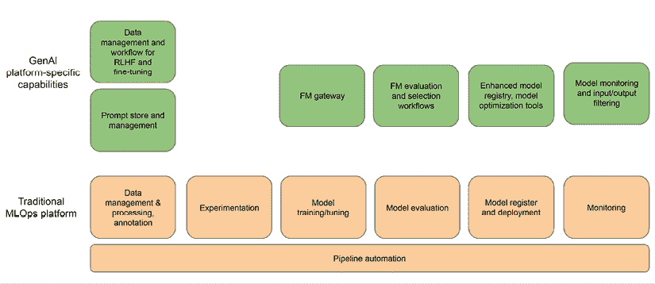

图 16.1：生成式 AI 平台

如前图所示，为了增强现有的 MLOps 平台以支持生成式 AI 模型开发和部署的需求，以下新技术组件将需要被采用：

+   **提示管理**：作为从 FM 获得期望响应的最重要因素之一，提示需要得到适当的处理、跟踪和版本控制。

+   **FM 基准测试/工作台**：随着该领域的快速发展，我们预计将有更多的 FM 变得可用。此外，组织将微调现有的 FM 以创建新的模型。为了快速确定任何新的或微调的 FM 是否应该考虑用于不同的用例，拥有一个 FM 基准工具来快速评估 FM 是否符合所需的标准和用例至关重要。自动化以及人工审查和批准同样关键。实验跟踪也是新能力的一部分，用于跟踪和衡量各种提示和响应对的性能。

+   **中心基础模型库**：与主要用于记录所有模型的常规模型注册库不同，需要维护一个获准使用的基础模型（FM）列表，供组织其他部分使用。将新模型引入中心库以及将其用于各种下游任务（如微调和额外预训练）的过程都需要得到妥善管理。此外，许多基础模型将通过 API 从第三方提供商处获得，因此新的模型库需要代表第三方提供商处理适当的列表和访问配置。在共享库中集中 FM 模型，特别是来自第三方来源的模型，会引发额外的网络安全担忧。这些模型可能潜在地包含可能被利用的漏洞。为了减轻这些风险，在将模型添加到库之前实施强大的网络安全措施至关重要，包括彻底的安全扫描。这有助于确保模型库的完整性和安全性。

+   **监督微调和 RLHF**：此组件提供对频繁的指令微调和领域自适应增量预训练的支持。

+   **增强模型监控和过滤器**：平台应提供一组通用的能力，用于在生产环境中监控模型的输入和输出，以检测偏差、有害内容和事实性错误响应。这些能力应该是可配置的，以满足不同用例和负责任的 AI 需求。

+   **FM 网关**：许多组织可能会从不同的内部和外部来源和提供商采用 FM。一个受管理和安全的 FM 网关层，用于访问不同的 FM，是必须实现的新平台组件。

现在，让我们更详细地看看生成式 AI 平台的一些关键组件。

### 提示管理组件

提示管理组件与各种生成式 AI 平台组件集成，丰富了如模型评估、生成式 AI 聊天应用和生成式 AI 代理交互等工作流程。在其核心，提示管理组件由两个主要层组成：存储和管理层。

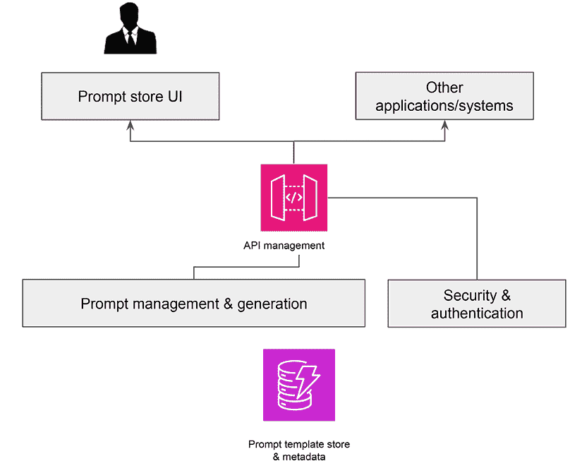

图 16.2：提示管理组件

在前面的图中，提示管理组件说明了管理层在监督一个可重用、版本化的提示模板目录中的作用。这一层不仅促进了模板的编写、标记和摄取功能，还管理着模板的访问和消费功能，包括使用历史的记录。它还应具备工作流程工具来自动化提示的审批和发布过程。其他核心功能可能包括基于上下文的提示推荐引擎和基于输入和模型目标的自动提示生成。

对于选择在 AWS 上构建此组件的用户，DynamoDB 可以作为构建模板存储和管理使用历史和元数据的可行选择。管理层和 Web UI 可以作为在计算服务如 EKS 上运行的定制容器化软件堆栈来实现。API 管理层可以使用 AWS API Gateway 实现得非常容易。

将使用 API Gateway 启用的 API 访问层来支持提示存储用户应用程序以及与其他下游和消费应用程序和系统的集成。

### FM 基准工作台

下面的图示展示了使用 AWS 服务构建 FM 基准解决方案的高级架构。

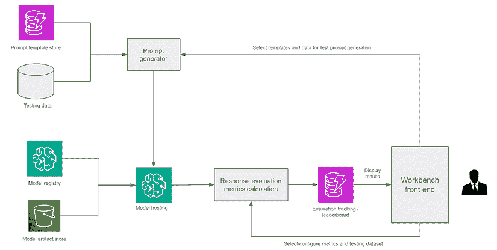

图 16.3：FM 基准工作台

在此架构中，从模型注册表中获取的目标模型被加载到 SageMaker 端点。测试过程涉及通过将各种测试数据从数据库或 S3 插入预定义的提示模板中生成测试提示，所有这些模板都托管在 DynamoDB 中。随后，这些生成的提示被发送到 API 端点以生成响应。使用预定义的指标集评估生成的响应，并将评估结果存储在 DynamoDB 中。这些存储的数据可供工作台前端应用程序进一步参考和使用，供用户进一步利用。

亚马逊 SageMaker 现在也通过其 Clarify 组件内置了模型评估功能。SageMaker Clarify 的 **基础模型评估**（**FMEval**）提供了一个集中解决方案，用于评估 LLMs 的模型质量、公平性和可靠性。它支持自动模型评估和人工评估的工作流程。自动评估支持的主要任务包括：

1.  **开放式文本生成**：对于这个任务，Clarify 可以自动化对事实知识、语义鲁棒性、提示刻板印象和毒性的评估。Clarify 提供了默认的测试数据集，包括 TREX、CrowS-Pairs、RealToxicityPrompt 和 BOLD。

1.  **文本摘要**：在这个任务中，Clarify 可以评估准确性、毒性和语义鲁棒性。为此评估，Clarify 内置了包括政府报告数据集、gigaword 和 XSum 在内的数据集。

1.  **问答**：对于问答任务，Clarify 还评估准确性、毒性和语义鲁棒性，内置数据集包括 BoolQ、TriviaQA 和 Natural Questions。

1.  **分类**：对于这个任务，Clarify 使用女性电子商务服装评论来评估准确性和语义鲁棒性。

使用自动化评估，您可以使用内置数据集或自带数据集进行测试。

要进行自然语言处理模型的人类评估，您必须首先定义相关的指标和指标类型。可以使用比较评分来评估多个模型在这些指标上的并列表现。对于评估单个模型，需要个别评分。这两种评分机制适用于任何与文本相关的任务。

### 监督微调和 RLHF

随着组织寻求为特定用例定制 FM，他们需要用于微调和将 FM 与人类偏好和用例对齐的工具。FM 微调和 RLHF 的核心组件在促进端到端适应工作流程中发挥着关键作用。

这些组件的核心功能应包括在特定组织数据集上针对目标用例的自动化监督微调，同时确保与底层训练基础设施的集成。此外，它还将与 FM 评估服务集成，以进行自动和人工辅助的模型评估。

另一个核心功能应该是支持完整的 RLHF 循环，允许从收集和管理人类偏好数据到交互式人类评估/投票 FM 输出，再到通过强化学习进行模型微调。

### FM 监控

由于 FM 在广泛公开的数据集上训练，这些数据集可能包含有害和偏见的内容，这些模型可能表现出类似的问题行为。虽然许多专有模型已集成保障措施和过滤器以筛选有害响应或不适当的提示，但组织可能有不同的过滤要求，尤其是在他们使用可能缺乏类似内置保障措施的开源模型时。以下图示说明了将补充过滤组件纳入推理工作流程的架构方法：

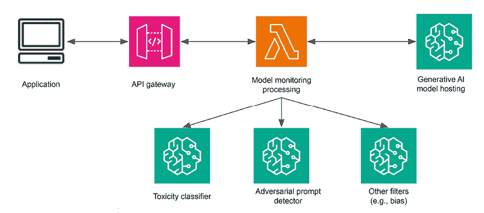

图 16.4：实现生成式 AI 模型的模型监控

在此架构框架中，AWS Lambda 函数位于推理工作流中，用于检查输入到生成模型中的数据和这些模型生成的响应。可以部署和托管专门的检测器和分类模型，包括毒性分类器、偏见检测器和对抗性提示检测器，作为独立的端点。这些 Lambda 函数负责触发这些模型执行筛选程序。此外，除了使用机器学习模型外，Lambda 函数还可以结合基于规则的逻辑来应用额外的过滤措施。

AWS 还在其 Bedrock 服务中直接实现了 FM 监控支持，称为“护栏”，它提供了诸如阻止不受欢迎的主题、过滤有害内容和为 Bedrock 中托管的 FM 红 acting PII 数据等功能。

生成人工智能平台架构和实施在撰写本文时尚未成熟。组织需要评估具体需求并投资于构建这些技术组件，以支持其大规模的生成人工智能工作负载。

# 增强检索的生成模式

基础模型被冻结在时间中，并且仅限于它们训练的知识，无法访问组织的私有数据或不断变化的公共领域信息。为了提高响应的准确性，尤其是在使用专有或最新数据时，我们需要一种机制将外部信息集成到模型的响应生成过程中。

这就是**增强检索生成**（**RAG**）可以介入的地方。RAG 是一种新的架构模式，旨在支持需要外部数据源的基于生成人工智能的解决方案，例如企业知识搜索和文档问答。RAG 有两个主要阶段：

1.  索引阶段，用于准备包含数据摄取和索引的知识库。

1.  查询阶段，用于从知识库检索相关上下文并将其传递给 LLM 以生成响应。

在架构上，RAG 架构由以下关键组件组成：

+   **知识和文档存储**：这包含用于为 LLM 提供上下文和事实的企业知识和文档，以便基于真实知识和事实生成响应。存储可以是知识图谱、数据库、文档存储或对象存储。

+   **文档分块组件**：长文档需要分成包含不同知识和数据的较小块，可以根据特定用户查询进行管理和检索。该技术组件根据预定义的逻辑和规则（按单词/字符数、按段落）将文档拆分成小块。

+   **文档嵌入组件**：该组件从文档块创建嵌入，以便可以根据语义相似性有效地搜索这些块。这是知识检索的关键概念。

+   **向量数据库**：此组件存储文档块和相关嵌入，并提供了使用各种技术（如余弦相似度）进行语义搜索的能力。

+   **检索器和重新排序器**：此组件根据特定要求或上下文从向量数据库中检索并重新排序顶级匹配项。

+   **查询嵌入组件**：此组件创建用户查询的嵌入；然后使用这些查询来从向量数据库中查找嵌入。

+   **工作流程编排**：此组件编排了分块、嵌入和查询/响应流程中的各个步骤。

+   **提示模板存储库**：此存储库维护提示模板，以构建针对 LLM 的适当查询。

+   **任务提示构建器**：此组件从提示模板存储库中选择适当的提示，并使用原始查询和检索到的文档/知识作为上下文创建任务提示。提示格式化以优化 LLM 的响应。

+   **LLMs**：这些 LLM 负责从模板构建响应，这些模板使用知识/文档块作为上下文的一部分，以提供更准确和流畅的响应。

以下图示说明了此架构和流程：

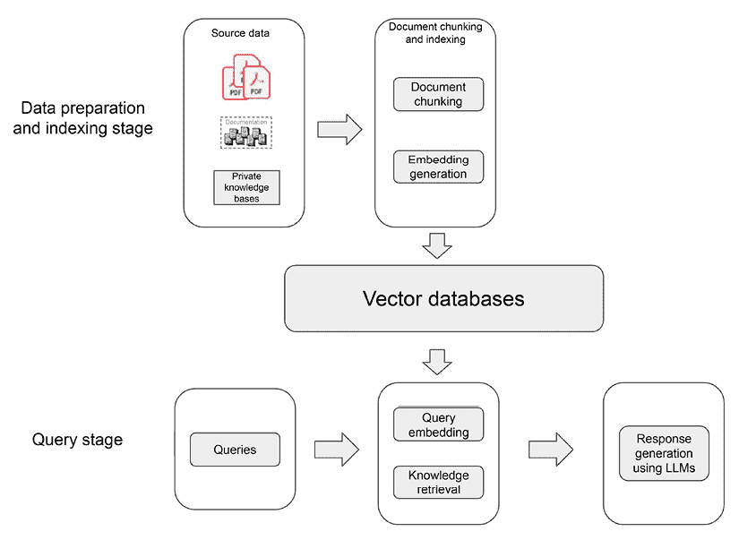

图 16.5：检索增强生成架构

在索引阶段，源文档由文档分块组件分解成小块。这些块随后由嵌入组件进一步处理，为每个块创建一个向量表示（嵌入），捕获该块中文本的语义意义。然后，嵌入及其相关的文档块被存储在向量数据库中。

在查询阶段，用户的查询（提示）首先由嵌入组件处理，以生成查询本身的向量表示（嵌入）。然后，检索器组件使用此查询嵌入从先前索引的向量数据库中检索匹配的向量和相关的文档块，通常通过计算查询和存储嵌入之间的相似度度量（如余弦距离）。检索到的与最相似嵌入对应的文档块被检索。然后，这些检索到的块被纳入原始用户查询作为额外的上下文，形成一个新增强的提示，该提示结合了初始查询和相关的检索信息。

最后，这个增强提示被发送到一个 LLM 进行合成，允许 LLM 根据原始查询和从数据库检索到的上下文信息生成响应。

在接下来的章节中，我们将首先探讨构建 RAG 应用程序的领先开源框架。然后，我们将讨论 RAG 管道的评估，接着是高级 RAG 模式。最后，我们将了解如何使用 AWS 服务构建 RAG 架构。让我们开始吧！

## RAG 的开源框架

随着 RAG 成为许多生成式 AI 用例的重要架构，开源社区已经开发了多个技术框架，以帮助简化基于 RAG 解决方案的实施并提供新的功能。有许多 RAG 框架，如 LangChain、LlamaIndex、REALM 和 Haystack。在这里，我们将简要回顾 LangChain 和 LlamaIndex，这两个是 RAG 中更受欢迎的框架。

### LangChain

构建基于 LLM 的应用程序的一个关键挑战是协调各种组件，包括向量数据库、数据检索、嵌入 LLM 和响应生成 LLM。

LangChain 是一个开源库，它提供了一种对这些各种 RAG 组件的抽象能力，并允许您编排它们。LangChain 支持链的概念，其中一系列依赖的任务和组件连接起来执行一个功能。例如，您可以创建一个简单的链，它接受一个输入查询，使用预定义的提示模板重新格式化它，然后调用一个 LLM 来处理重新格式化的查询。您还可以有一个复杂的链，它接受一个文档，将其分割成小块，将它们传递给嵌入 LLM，然后将嵌入存储在向量数据库中。虽然这些编排可以通过编程方式硬编码，但 LangChain 链提供了一种动态定义编排并提供许多组件（如 LLM 和向量数据库）的模块化抽象的方法，从而简化了实现。LangChain 附带了一系列内置的特定用例链，以实现快速实施。

以下是一个使用 LangChain 进行问答任务的简单代码示例：

```py
from langchain import LLMChain, PromptTemplate
from langchain_community.embeddings import BedrockEmbeddings
from langchain_community.vectorstore import OpenSearchVectorSearch
from langchain_community.llms.bedrock import Bedrock
from langchain.chains import RetrievalQA
import opensearch 
bedrock_client = get_bedrock_client(region, …)
bedrock_llm = create_bedrock_llm(bedrock_client)
opensearch_endpoint = opensearch.get_opensearch_endpoint(index_name, …)
opensearch_vector_search_client = create_opensearch_vector_search_client(index_name, bedrock_embeddings_client, …)
# Define a prompt template 
prompt = PromptTemplate(
  input_variables=["context", "question"],
  template="Answer the question based on the retrieved
  context: {context}
  Question: {question}
  Answer:")
# Create a chain with Bedrock model and prompt 
qa_chain = RetrievalQA.from_chain_type(llm=bedrock_llm, retriever=opensearch_vector_client.as_retriever(), chain_type_kwarges={"prompt": prompt}
)
question = "What is the capital of France?"
result = qa_chain(question=question) 
```

此代码示例初始化了一个 OpenSearch 和 Amazon Bedrock 客户端，定义了一个提示模板，创建了一个内置的检索问答链实例，并执行链以生成问题的答案。

LangChain 还支持工具的概念。工具是 LangChain 可以调用的函数，用于执行诸如数学计算或搜索网络等操作。这是一个关键特性，因为它扩展了 LLM 执行更复杂和精确任务的能力，并使其更符合事实。

此外，LangChain 还支持代理的概念。代理帮助将 LLM 与不同的工具连接起来以实现动态执行，使 LLM 能够根据查询选择合适的工具来执行不同的任务。例如，你可能有一个需要首先搜索互联网获取一些事实，然后对结果进行数学计算的查询。在这种情况下，代理将允许 LLM 动态确定用于完成查询的工具。以下图示说明了代理和工具如何协同工作以支持工作流程。

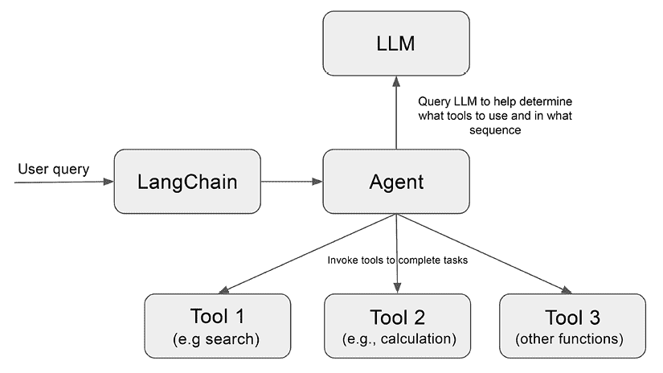

图 16.6：代理和工具工作流程

自 2022 年初版发布以来，LangChain 在 AI 社区和公司中得到了快速采用。已经开发了众多集成，以提供一系列功能，如文档加载器、向量存储、嵌入模型、LLM 和工具。

### LlamaIndex

LlamaIndex 是构建 LLM 应用程序的数据框架。LlamaIndex 提供了一个全面的工具包，包括用于各种数据源和格式的数据连接器（例如，API、PDF、SQL）、为 LLM 效率消费而结构化信息的数据索引，以及用于发送查询和从底层索引获取响应的查询接口。

使用 LlamaIndex 消费数据后，数据被分割成数据块，并为每个块创建一个嵌入。一个数据块及其嵌入在 LlamaIndex 中被称为节点。节点存储在底层向量数据库中。它还支持列表索引的概念，其中相关节点被链接在一起；例如，来自单个文档的所有数据块的列表。这可以用于需要总结整个文档而不是返回相关信息的用例。

这些引擎包括用于稳健知识检索的查询引擎、用于交互式对话的聊天引擎以及赋予 LLM 驱动的知识工作者一系列工具和集成的数据代理。此外，LlamaIndex 与各种应用程序无缝集成，例如 LangChain、Flask、Docker、ChatGPT 等，确保在更广泛的生态系统中实现一致集成。

LlamaIndex 拥有数据代理的概念，这些知识工作者执行各种任务，包括搜索和数据的检索，以及调用外部服务 API。这个概念与 LangChain 中的代理概念类似。给定一个输入查询，数据代理使用推理循环来确定使用哪个工具以及调用工具的顺序。

在外部数据连接器和索引、数据检索的查询管理以及与 LLM 交互方面，LlamaIndex 和 LangChain 之间存在一些重叠。关键区别在于，LlamaIndex 专注于在重叠领域构建丰富的功能，而 LangChain 则更通用，支持工具、代理和链。

## 评估 RAG 管道

评估 RAG 管道的性能是一个复杂任务，因为涉及多个过程，如知识索引、知识检索和响应合成。此外，文本生成的不可预测性也是一个因素。

评估 RAG 应用涉及多个阶段：

1.  **第一阶段 – 对响应的忠实度评估**：这一阶段测试合成的响应是否忠实于检索到的源文档的事实和上下文。如果不忠实，那么这就是 LLM 幻觉的迹象。

1.  **第二阶段 – 对查询的响应相关性评估**：这一阶段检查响应是否与检索到的源文档匹配，然后评估合成的响应是否回答了查询。如果不匹配，那么这表明语义搜索和/或嵌入没有正确工作。

1.  **第三阶段 – 在源文档上的问答**：这一阶段使用外部工具从源文档生成问题，并测试 LLM 是否能够使用数据回答问题。如果 LLM 不能正确回答问题，那么 LLM 就有缺陷。

有几种工具可以用于 RAG 评估。例如，LlamaIndex 提供了一系列模块来评估幻觉和相关性，以及从源数据生成问题。还有其他开源工具，如 DeepEval 用于编写单元测试，以及 Ragas，它衡量 RAG 管道在不同维度上的性能，包括响应生成的忠实度和答案的相关性，以及检索到的上下文与标注答案的上下文精确度和召回率。

## 高级 RAG 模式

虽然 RAG 已被证明在解决许多生成式 AI 用例方面非常灵活和有效，但它也带来了一组独特的挑战，我们在实施 RAG 解决方案时需要意识到并解决这些挑战。

在开发有效的 RAG 解决方案中，一个核心挑战是确保高质量的检索结果。低质量的检索可能源于各种因素。例如，检索到的文本块可能与原始查询缺乏相关性，导致幻觉或虚构的响应。此外，未能检索到所有相关的知识块会阻止模型合成完整、高质量的回答。

提高检索质量的一种方法是通过改进文档的索引。有几种改进索引的方法：

+   **预索引数据优化**：在索引前标准化文本，删除无关内容，消除冗余，并验证事实准确性。这减少了索引数据中的噪声。

+   **索引结构优化**：调整块大小参数以平衡上下文保留与质量。如滑动窗口块分割等策略有助于在块之间保留上下文信息。

+   **元数据增强**：将补充元数据如章节描述和日期纳入块中，提供有用的索引上下文。

+   **嵌入微调**：微调嵌入为具有不常见术语的专业领域添加了关键的领域上下文。

+   **动态嵌入**：生成上下文化的嵌入可以克服静态嵌入的限制。

除了索引之外，实施更智能的检索管道可以进一步提高 RAG 性能：

+   **递归检索**：这种方法引入了多阶段查询方法，首先检索较小的语义块，然后检索较大的上下文块。这平衡了效率与丰富的上下文基础。

+   **子查询**：在不同场景中可以采用各种查询策略，包括使用 LlamaIndex 等框架提供的查询引擎，采用树查询，利用向量查询，或者采用最基本的块顺序查询。

    获取相关上下文文档只是第一步。将检索到的证据准备输入到 LLM 中又带来了额外的挑战。一次性输入所有文档可能会超过 LLM 的上下文容量。同时，拼接文档会创建冗长且不集中的提示。需要高级技术来优化检索到的证据以生成响应。通过优化的证据准备，LLM 可以专注于上下文窗口内的关键信息，从而产生基于检索数据的优质响应。

+   **重新排序**：重新排序技术可以优化文档顺序，优先考虑合成中最相关的信息。有不同类型的排序器可用。例如，Diversity Ranker 重新排序文档以增加上下文窗口内的多样性。LostInTheMiddleRanker 交替地将最佳文档放置在上下文窗口的开始和结束位置。通过重新排序，最有信息量的证据被策略性地放置，以便语言模型可以专注于。这防止了最相关的细节在冗长的上下文中丢失。有效的重新排序对于使模型能够基于顶级检索证据产生高质量响应至关重要。

+   **提示压缩**：检索后处理技术可以从提示中移除无关的上下文，以减少噪声并提高 RAG 系统的响应质量。例如，一些模型通过计算提示元素之间的互信息来估计和过滤掉不重要或分散注意力的信息。通过去除非必要文本，语言模型可以在生成响应时专注于真正显著的证据。仔细修剪提示是一种减少幻觉并使 RAG 响应保持最关键支持上下文的有力策略。

总结来说，优化索引、实施递归检索管道、策略性地重新格式化证据以及修剪提示都是解决这些挑战的有效策略。当这些高级模式创造性地结合在一起时，它们使模型能够在每个阶段检索最相关的知识，聚焦于显著上下文，并将这些定制证据综合成高质量、有根据的回应。

## 在 AWS 上设计 RAG 架构

如果你使用 AWS，你可以使用多个现成的 AWS 和第三方服务来构建 RAG 架构。

+   **SageMaker JumpStart**：SageMaker JumpStart 为广泛的难题类型提供了预训练的开源模型。您可以为特定要求逐步训练和调整这些模型，并使用 SageMaker 托管服务托管这些模型以支持 RAG 架构。如果您喜欢自己训练和托管开源 FM 并有选择不同计算选项进行模型托管的选择，请选择 SageMaker JumpStart。

+   **Amazon Bedrock**：Amazon Bedrock 是一项完全托管的服务，通过 API 使 Amazon 和领先的 AI 创业公司的 FM 可用。在撰写本文时，Amazon Bedrock 提供了 Amazon 的 Titan FM 以及 AI21、Stability AI、Cohere、Meta、Mistral 和 Anthropic 的 FM。有关 Bedrock 的更多详细信息，您可以访问 AWS 公共网站。如果您想通过 API 获取顶级专有 FM 而不是托管自己的，则可以探索 Bedrock。此外，对于交易量较低的工作负载，Bedrock 可能更具成本效益。Amazon Bedrock 还内置了对文档索引和向量存储的支持，称为 Bedrock 知识库，用于 RAG 开发。它还附带了对代理和工具的支持，称为 Amazon Bedrock 的代理，用于构建基于代理的工作流应用程序。

+   **Amazon OpenSearch**：Amazon OpenSearch 服务提供了交互式日志分析、实时应用程序监控、网站搜索等功能。它还可以用作 RAG 架构中的向量数据库。它允许构建知识块和嵌入的索引，并提供基于邻近度的向量搜索。OpenSearch 可以与 LangChain 和 LlamaIndex 集成。

+   **Amazon Kendra**：Amazon Kendra 是一种智能搜索服务，可以用作 RAG 的知识存储。Amazon Kendra 还提供了一个可以与 LangChain 无缝工作的 RAG 检索 API。

+   **Amazon Q**：Amazon Q 是 AWS 的一个相对较新的服务。Amazon Q 产品套件下有多个独立服务，包括 Amazon Q for Business、Amazon Q for Builder、Amazon Q for QuickSight 和 Amazon Q for Connect。Amazon Q for Business 是一个基于 RAG 的完全托管助手，可以回答问题、提供摘要并根据企业数据生成内容。

可用其他第三方和开源向量数据库选项，例如 Pinecone 和 FAISS。

下面是一个使用 AWS 服务设计的 RAG 架构示例：

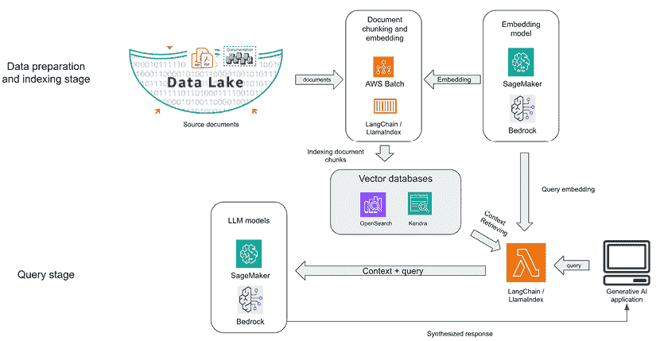

图 16.7：AWS 上的 RAG 架构

基于 RAG 的架构可以支持许多用例，例如在文档上进行问答、使用自然语言从数据库和知识图谱中查询数据、交互式聊天机器人、客户支持助手、医疗信息搜索和推荐，以及教育和培训。

随着 RAG 架构成为许多 LLM 应用架构堆栈的常见关键组件，建立与 GenAI/ML 平台类似的操作能力和流程至关重要。然而，由于这还是一个新领域，围绕 RAG 管理的技朮能力和工具的发展尚未充分。不同的组织将需要评估需求并开发客户软件和基础设施，以实现通用 RAG 平台的运行。组织可以将 RAG 基础设施视为一个独立平台或整体生成式 AI 平台的一部分。

# 选择一个 LLM 适配方法

我们已经介绍了各种 LLM 适配方法，包括提示工程、领域自适应预训练、微调和 RAG。所有这些方法都是为了从预训练的 LLM 中获得更好的响应。有了所有这些选项，人们不禁要问：我们如何选择使用哪种方法？

让我们分析一下在选择这些不同方法时需要考虑的一些因素。

## 响应质量

响应质量衡量 LLM 响应与用户查询意图的准确性。对于不同的用例，响应质量的评估可能很复杂，因为评估响应质量有不同的考虑因素，例如知识领域亲和度、任务准确性、最新数据、源数据透明度和幻觉。

对于知识领域亲和力，可以使用领域自适应预训练来有效地教授 LLM 特定领域的知识和术语。RAG 在检索相关数据方面效率很高，但用于响应合成的 LLM 可能无法像微调或领域自适应预训练模型那样很好地捕捉特定领域的模式、术语和细微差别。如果您需要强大的特定领域性能，您应该考虑领域自适应预训练。

如果您需要最大化特定任务的准确性，那么微调是推荐的方法。提示工程也可以通过单次或少量提示技术帮助提高任务准确性，但它特定于提示，并且不能推广到不同的提示。

如果响应中的信息新鲜度是首要目标，那么 RAG 是理想的解决方案，因为它可以访问动态的外部数据源。当最新的知识作为提示的一部分提供时，提示工程也可以帮助提高数据的新鲜度。微调和领域自适应预训练的知识截止点基于最新使用的训练数据集。

对于某些应用，如医学诊断或财务分析，了解决策是如何做出的以及用于做出决策的数据源至关重要。如果这是用例的关键要求，那么 RAG 在这里是明确的选择，因为 RAG 可以提供用于构建响应的知识参考。微调和领域自适应预训练更像是一个“黑盒”，通常掩盖了用于决策的数据源。

如前一章所述，当 LLM 遇到不熟悉的查询并产生基于其训练数据或用户输入的虚假信息时，有时会生成不准确且没有根据的响应。微调可以通过将模型集中在特定领域的知识上来减少伪造。然而，对于不熟悉的输入，风险仍然存在。RAG 系统通过将响应锚定到检索到的文档中更好地解决了幻觉风险。初始检索步骤充当事实核查，找到相关段落以将响应建立在真实数据上。随后的生成被限制在检索的上下文中，而不是不受约束。这种机制最小化了没有数据支持伪造的响应。

## 自适应成本

当评估 LLM 自适应方法时，重要的是要考虑初始实施成本以及长期维护成本。考虑到这一点，让我们比较不同方法的开销。

提示工程具有最低的开销，只需简单地编写和测试提示，就可以从预训练语言模型中获得良好的结果。维护可能需要偶尔更新提示，因为基础模型会随着时间的推移而更新。

RAG 系统由于需要多个组件（嵌入、向量存储、检索器和语言模型）而具有中等高的启动成本。然而，这些系统在时间上相对静态。

全微调和领域自适应预训练可能成本高昂，需要大量的计算资源和时间来完全更新大型基础模型的所有潜在参数，以及数据集准备的成本。**参数高效微调（PEFT**）可能比全微调和领域自适应预训练便宜，然而，由于需要高质量的数据集准备和训练资源要求，它仍然被认为比 RAG 更昂贵。

## 实现复杂度

实现复杂度在不同技术之间差异很大，从简单到高度复杂配置不等。

提示工程具有相对较低的复杂度，主要需要语言技能和少量学习熟悉度来制作能够从基础模型中激发良好性能的提示。对编程技能和科学知识的要求很少。

RAG 系统具有中等复杂度，需要软件工程来构建管道组件，如检索器和集成器。随着高级 RAG 配置和基础设施的发展，复杂度会增加，例如涉及代理和工具的复杂工作流，以及用于监控、可观察性、评估和编排的基础设施组件。

PEFT 和全模型微调具有最高的复杂度。这需要深厚的深度学习、NLP 和数据科学专业知识来选择训练数据，编写微调脚本，选择学习率、损失函数等超参数，并最终更新模型的内部表示。

# 将所有内容整合在一起

在生成式 AI 技术栈中分别深入研究了各种技术组件之后，现在让我们将它们整合到一个统一的视角中。

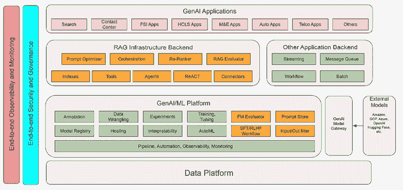

图 16.8：生成式 AI 技术栈

总结来说，生成式 AI 平台是通过引入额外的功能，如提示管理、输入/输出过滤以及 FM 评估和 RLHF 工作流工具，来扩展 ML 平台。为了适应这些增强功能，ML 平台的管道能力需要包括新的生成式 AI 工作流。新的 RAG 基础设施将成为基于 RAG 的 LLM 应用的基础骨干，并将与底层生成式 AI 平台紧密集成。

生成式 AI 应用的发展将继续利用其他核心应用架构组件，包括流处理、批量处理、消息队列和工作流工具。

尽管许多核心组件可能拥有其独特的安全和治理能力，但将需要一个全面的端到端可观察性、监控、安全和治理，以支持生成式 AI 应用的大规模开发和运营。

# 在生产环境中部署生成式 AI 应用的考虑因素

在生产环境中部署生成式 AI 应用引入了一组新的挑战，这些挑战超出了传统软件和机器学习部署的考虑因素。虽然功能性正确性、系统/应用安全性、对模型文件和代码等工件的安全扫描、基础设施可扩展性、文档和运营准备（例如，可观察性、变更管理、事件管理和审计）等方面仍然是基本要素，但在部署生成式 AI 模型时，还有其他因素需要考虑。

以下是在决定生成式 AI 应用的生产部署时的一些关键附加考虑因素。

## 模型准备就绪

当决定一个生成式 AI 模型是否准备好投入生产部署时，重点应放在其针对目标用例的准确性上。这些模型可以解决广泛的问题，但尝试测试所有可能的场景和用例将是一项无休止的努力，这使得对部署的信心变得困难。相反，应专注于设计应用层以仅支持目标用例，简化评估过程。

此外，在确定性能指标是否满意时，使用现有基准作为基线来建立阈值至关重要。例如，如果当前流程的错误率为 20%，并且被认为对业务运营是可接受的，那么能够实现相同或更低错误率的生成式 AI 应用应被视为能够至少提供相同或更好的价值。采用这种方法，你可以自信地进行生产部署。

## 决策工作流程

在部署生成式 AI 应用时，考虑系统是否会做出自动化决策或涉及人工监督至关重要。由于这些模型可能存在幻觉或不准确性的潜在可能性，测试和评估的严格程度需要根据决策流程来确定。

如果系统被设计为做出完全自动化的决策，你必须评估做出错误决策的风险。这种风险在你的用例中是否可以容忍？如果是的话，那么在针对目标用例和场景进行彻底测试后，可以继续进行自动化决策。然而，如果潜在的风险不可容忍，那么在决策过程中纳入人工监督是至关重要的。

在需要人工监督的情况下，确保涉及的个体具备在生成式 AI 应用支持下做出明智决策的充分资格。系统应设计为向人类决策者提供建议或洞察，然后他们可以运用自己的专业知识和判断力来减轻 AI 模型可能产生的错误或偏差。

## 负责任的 AI 评估

当涉及到负责任的 AI 考虑因素，如偏见和有害内容时，对每个特定用例进行逐案评估是至关重要的。不同的用例可能对某些类型的语言或偏见有不同的容忍度。例如，某些用例可能对某些语言模式更为宽容，而其他用例可能有更严格的要求。

类似地，可接受的偏见程度可能因用例和涉及的场景而异。对于某个应用程序可能被认为是可接受的偏见水平，对于另一个应用程序可能是不可以接受的。在评估每个用例中偏见可能产生的影响时，确定适当的阈值至关重要。

而不是采用一刀切的方法，建议对每个特定用例进行彻底的偏见和有害内容评估。这种有针对性的评估将确保部署的生成式 AI 应用与该特定用例的独特需求和限制相一致，最大限度地降低潜在风险，并确保负责任和道德的部署。

## 生产环境中的防护措施

尽管在开发阶段进行了彻底的测试和评估，但生成式 AI 模型在部署到实际生产环境时仍可能表现出意外或不希望的行为。为了应对这一挑战，在生产环境中建立一套全面的防护措施是至关重要的。

这些防护措施的核心是强大的输入验证系统。这些系统仔细审查输入到生成式 AI 模型中的数据和提示，确保仅使用适当、安全和预期的输入。这保护了模型免受可能有害或对抗性输入的影响，这些输入可能会触发不可预测或不受欢迎的输出。

输入验证的补充，组织还必须开发复杂的输出过滤和监管系统。这些系统在内容发布或向最终用户暴露之前对其进行审查，检测并标记任何可能存在偏见、冒犯性、敏感（PII）或其他不受欢迎的输出。这允许及时审查和干预，确保在内容到达公众之前解决潜在的问题内容。

为了实现快速响应和干预，监控和验证系统应与自动警报机制集成。这些机制会迅速通知适当的团队系统检测到的任何令人担忧的行为或输出。这允许组织迅速行动，在问题升级或造成损害之前解决问题。

最终，人类仍然是一个关键的安全保障。生成式 AI 工作流程必须保持经验丰富的操作员在必要时进行覆盖或干预的能力。这作为一个后备措施，允许有知识的人员在模型表现出不可预测或不受欢迎的行为并需要立即关注时做出明智的决定。

如果你使用 Amazon Bedrock，你可以考虑内置的 Guardrails 功能，该功能可以检测和过滤掉不希望的主题、有害内容或 PII 数据。

## 外部知识变更管理

对于依赖于外部知识检索的生成式 AI 应用，例如基于 RAG 架构的应用，考虑底层知识源的动态性质至关重要。外部知识可能会随时间变化，对于同一个查询，根据信息的时效性和时间线，可能会有多个相关答案。

为了应对这一挑战，设计能够准确捕捉所需时间背景的提示或确保知识检索组件了解知识谱系和时间线是至关重要的。这样，系统可以根据给定的查询检索并呈现最相关和最新的信息。

例如，如果查询涉及标准操作程序，该程序本身可能会随时间演变。如果不考虑时间线，系统可能会检索过时的信息，可能导致不正确或不相关的响应。通过纳入知识谱系或在提示中明确指定所需的时间框架，系统可以检索与预期时间背景相符的标准操作程序的正确版本。

或者，知识检索组件可以被设计成维护和利用外部知识源的时间线或版本控制系统。这将允许系统根据查询的上下文自动检索最新和最相关的信息，而无需完全依赖提示工程。

确保依赖于外部知识源的生成式 AI 应用的准确性、相关性和可靠性，实施这些考虑因素至关重要，尤其是在信息快速演变或时间背景至关重要的领域。

之前提供的列表是额外考虑因素的样本。组织应考虑针对其特定需求、行业和监管环境定制的额外决策点。仔细评估生成式人工智能的范围和用例，在定义的范围内实施检查和控制，以促进高效的部署决策制定至关重要。随着生成式人工智能技术的进步，将出现新的要求，需要持续考虑。

# 实用的生成式人工智能商业解决方案

在上一章中，我们讨论了生成式人工智能在各个行业的商业潜力以及潜在用例。然后，我们接着详细讨论了从业务用例识别到部署的生成项目生命周期。在本章中，我们涵盖了运营考虑因素、构建企业生成式人工智能平台以及构建生成式人工智能应用最重要的架构模式之一，即 RAG。

在本节中，我们将突出一些即将在短期内可供商业采用的更实用的生成式人工智能解决方案机会。虽然对有抱负的应用的研究仍在继续，但谨慎的企业应评估经过验证的试点用例，以从生成式人工智能的快速进步中获得可衡量的影响。通过这些示例，我们将展示通过理解与特定行业业务流程相关的挑战来识别生成式人工智能机会的推荐方法。

## 生成式人工智能驱动的语义搜索引擎

企业搜索解决方案使组织能够为其内部数据和内容提供强大的搜索能力。在技术、医疗保健、金融和制造等领域的公司已广泛采用企业搜索平台，以改善员工的信息发现。这些工具在组织内部索引结构化数据库、内部网络、文档存储库、电子邮件等。用户可以通过搜索而不是在孤岛系统中搜索来快速找到相关内容。高级自然语言处理、机器学习算法和认知能力使企业搜索解决方案能够提供精确、相关的结果。

随着生成式人工智能技术的到来，尤其是大型语言模型（LLMs），企业搜索可以增强以提供改进的用户体验、更准确的信息和更高的特异性。例如，LLMs 可以接受自然语言查询并直接以自然语言提供答案或答案的摘要版本，而不仅仅是使用关键词返回搜索结果列表。LLMs 可以帮助在用户查询中语义上理解用户意图和上下文，以检索更相关的信息。

LLMs 还可以将查询/响应历史作为上下文的一部分，在针对底层知识库构建搜索查询时使用。LLMs 还可以帮助用同义词、相关术语和改写来重写查询，以扩大搜索范围。使用 LLMs，结果可以根据意义、关系和概念进行匹配，而不仅仅是关键词。

建立由生成式 AI 驱动的企业搜索平台有多种技术选项和架构模式可供选择。您可以选择使用开源和商业组件的组合来构建自己的语义搜索引擎。构建语义搜索引擎主要遵循我们之前讨论过的 RAG 架构模式。以下架构展示了使用 AWS 托管服务和开源组件组合的语义搜索引擎。

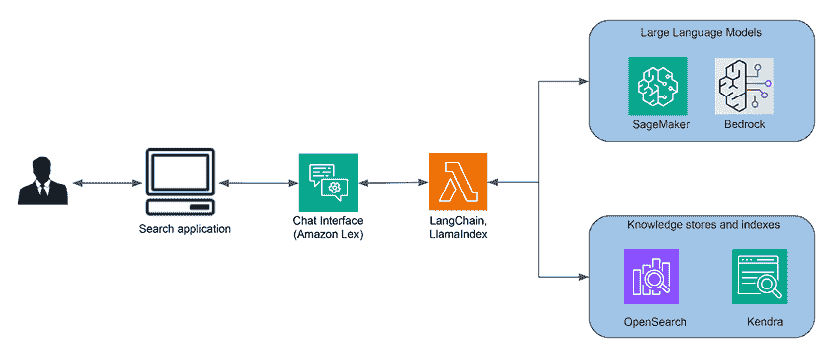

图 16.9：AWS 上的语义搜索引擎

在此架构下，Kendra 负责文档摄取和索引、语义搜索和排名。如有需要，可以使用 Amazon OpenSearch 构建额外的替代知识索引。Bedrock 中的 LLMs 模型或托管在 SageMaker 中的模型可以通过 Amazon Lex 聊天界面提供查询理解和响应生成。

尽管生成式 AI 显著提高了企业搜索体验，但承认其局限性是至关重要的。与传统基于关键词或语义搜索方法相比，生成式 AI 有时会产生不相关或离题的结果，缺乏传统方法的精确性特征。此外，它还面临着一致性挑战，由于对指令的解释随时间变化以及索引检索器的准确性变化，它可能会为相同或相似输入生成不同的输出。

此外，还可能存在隐私问题，因为生成式 AI 可能会无意中泄露敏感信息，如果在模型训练/调整过程中未对 PII/PHI 等敏感数据集进行屏蔽，可能会引发隐私违规问题。

## 财务数据分析与研究工作流程

银行、资产管理以及其他领域的财务分析师高度依赖分析和综合数据以提供洞见。例如，投资银行分析师可能会从收益报告、新闻、文件和研究成果中收集信息，以提取财务、业务前景和公司行为的细节。分析师随后进行比较估值分析，预测增长和回报，并建议投资策略。这需要手动处理数字、模拟场景和创建报告以传达发现。由于需要大量阅读、数据收集和分析，这个过程通常既繁琐又耗时。

生成式 AI 的能力，如自然语言处理、数据提取、总结和文本生成，在增强分析师工作流程方面展现出巨大潜力。由生成式 AI 驱动的助手可以自动化数据聚合、运行比较分析和撰写报告，从而大幅提高分析师的生产力。以下是在工作流程中可以应用生成式 AI 的几个领域：

+   **数据提取**：生成式 AI 提供了从非结构化文档中自动提取结构化数据并输出为可用格式的新能力。传统的 NLP 技术在一定程度上实现了实体提取和关系映射。然而，LLMs 现在在准确识别文本中的关键实体、关系和数据点方面实现了更优越的性能。这些模型可以从收益报告、公告、新闻和其他来源中解析出诸如财务数据、公司行为和商业事件等详细信息。提取的数据可以随后格式化，以便无缝加载到 Excel 财务模型和 PowerPoint 演示文稿等工作流程中，以进行进一步分析。这减轻了分析师繁琐的手动数据输入和复制工作。通过直接生成结构化输出的更高准确性，生成式 AI 可以将对非结构化数据的深度理解集成到下游系统中。这填补了在量化金融工作流程中利用报告和文章等文本数据的主要空白。

+   **文档问答**：生成式 AI 模型使用户能够用自然语言提出自由形式的问题，从文档中提取额外的见解。例如，分析师可以查询，“上季度的主要收入驱动因素是什么？”模型将理解背后的收益报告，并简洁地总结出主要增长因素，在生成的响应中。这种即兴查询允许灵活地提取最相关的要点，而不是处理整个文档。模型将专注于与问题相关的内容，忽略多余的文字。通过生成针对自然语言问题的浓缩、定制答案，生成式 AI 提供了强大的按需切片和切块文档的能力。分析师可以通过与 AI 用普通语言进行对话，动态地探索和分析长篇报告，以揭示相关事实、关系和结论。

+   **针对内部数据源的企业搜索和数据查询**：由生成式人工智能驱动的对话界面可以使金融分析师通过自然对话收集数据。分析师无需导航不同的系统或记住特定的查询语言，他们只需用普通语言提问即可。例如，“从 EMEA 市场数据库中获取 3 年的区域销售增长率。”模型将解释意图，将每个数据源所需的查询进行翻译，收集结果，并以可读的格式总结给分析师。这种按需检索跨系统数据的能力有可能统一访问并加速洞察。分析师可以使用日常语言探索内部文档存储、财务数据库、知识库和搜索引擎之间的联系。

+   **财务分析和报告生成**：生成式人工智能使金融分析师能够直接使用自然语言指令请求某些分析任务。例如，分析师可以要求模型，“比较行业前 5 大公司的 5 年营收增长率和盈利能力。”然后模型将提取相关的财务数据，计算所需的比率，生成合适的可视化，并在输出报告中总结关键要点。在需要的情况下，它可以无缝利用外部工具和 API 来增强其分析。与僵化的命令不同，自然指令允许分析师按需指定定制分析。通过自动化数据收集、财务建模和报告生成，同时协调外部服务，生成式人工智能可以显著提高分析师的生产力。

以下示例提示可以帮助在多个金融维度上提供财务分析：

```py
`Action`: Analyze financial reports [from companies X, Y, Z] between 2020-2022 to identify key trends, growth and risk areas.
`Context`: These companies operate in [industry]. Focus on major changes in financial KPIs like revenue, costs, profits, debt. Call out important shifts across business segments, geographies, products. Highlight growth opportunities but also flag potential risks.
`Input Data`: [text from actual company financial filings]
`Output`:
`Revenue trend`:
`Cost trend`:
`Profitability trend`:
`Growth areas`:
`Decline areas`:
`Major risks`: 
```

在架构上，构建基于生成式人工智能的金融分析和研究解决方案主要基于 RAG 架构和原则。以下图表展示了此类应用的 conceptual application architecture。

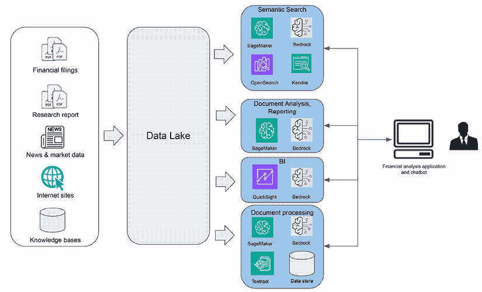

图 16.10：基于生成式人工智能的财务分析应用

金融是一个高度精确的科学和商业领域，因此，用于财务分析的生成式人工智能解决方案需要严格的准确性和事实依据。为了限制 LLMs 中的幻觉风险，除了提示工程和微调之外，还需要采用其他技术。高级信息检索和嵌入方法可以增强输出的相关性和正确性。

例如，系统可以通过预测相关查询并检索其他相关信息以获得更完整的上下文，从而实现多跳信息检索，而不是仅仅检索一次信息并生成查询的响应。从嵌入的角度来看，系统不是简单地分割文档并为这些片段创建嵌入，还可以结合额外的结构、语义和领域元信息来创建丰富的嵌入。在检索端，系统不是直接从向量数据库中返回匹配的片段，而是可以实施一个重新排序器，根据独特的要求后处理输出。还需要实施全面的评估技术和流程，以建立对系统的信心。在可能的情况下，实施一个事实验证器来验证响应与已知事实的一致性。

尽管先进的 LLM 和技术在自动化或辅助金融分析任务的各个方面展示了显著的能力，但完全依赖 LLM 进行复杂的金融分析任务还为时尚早。金融决策所需的精确性需要准确的信息，因为 LLM 响应中的任何不准确都可能导致严重的负面后果。

整个金融服务行业一直在积极采用和实施生成式人工智能技术，以实现多样化的商业目标。这种广泛的应用有可能对各种金融功能产生重大影响，从金融分析和打击金融犯罪到新商业模式、产品和客户体验的提升。然而，这种日益增长的趋势也引发了一些担忧，尤其是在风险管理、透明度等方面。例如，在金融分析中，保持透明度对于合规性和有效的风险管理至关重要。LLM 的内在不透明性可能对满足这些监管要求构成挑战。此外，在金融决策中对解释的需求可能是一个潜在的障碍，因为理解 LLM 的决策过程可能具有挑战性。

## 临床试验招募工作流程

临床试验是长期的研究过程，测试新的医疗治疗方法，如药物、设备或干预措施对人类受试者的影响。临床试验通过不同的阶段来评估新的医疗治疗方法，从在小群体中的安全性开始，然后扩展到测量有效性和比较。此外，患者招募是临床试验所有阶段的 重要过程。让我们更详细地看看这些阶段：

+   在第一阶段试验中，治疗仅给予不到 100 人，以评估安全性和副作用。由于它关注的是较小的、健康的群体，因此在这个阶段招募患者较为简单。

+   第 2 阶段试验将治疗给予数百名具有目标条件的参与者。在这里，研究人员继续收集安全性数据，同时收集初步的有效性信息。随着患者需要具有特定条件，招募变得更加困难。

+   在第 3 阶段，试验扩展到 300-3000 名参与者，以进一步了解安全性、有效性、剂量以及与现有治疗的比较。覆盖不同人群的更大样本量使得在这个高级阶段招募变得极具挑战性。

+   第 4 阶段试验在广泛的现实世界人群中监测批准的治疗，以收集额外的长期安全性和有效性数据。由于标准往往更加宽泛，第 4 阶段的招募也可能具有挑战性。

+   在招募过程中，临床研究协调员会仔细审查患者的医疗历史，跨越各种系统，如电子健康记录，以检查健康状况、既往状况、药物、人口统计学等是否符合试验的资格要求。从多个来源收集数据以识别匹配的这种手动和重复的过程是主要瓶颈。

生成式 AI 可以通过智能查询患者 EHR 数据与自然语言中指定的复杂纳入/排除逻辑来自动化和加速筛选。由于 EHR 包含包括诊断、药物、程序和测试结果在内的全面历史记录，模型可以解析标准并快速筛选候选人。例如，研究人员可以直接要求生成式 AI 平台比较患者的 EHR 记录与纳入/排除标准，以确定患者是否为匹配对象。生成式 AI 还可以帮助综合和生成关于整体选定队列人群和个别患者的总结报告，以帮助进行人工审查。这可以显著加快在不同试验阶段找到合格患者的过程。

此外，将生成能力与预测分析相结合可以优化试验性能。结合的能力可以预测招募率，监控站点进度，并在出现延误或问题时通过从患者和站点数据中生成见解来触发建议的干预措施。

以下图示展示了将生成式 AI 和传统预测分析应用于优化临床试验中各种任务的构想流程。

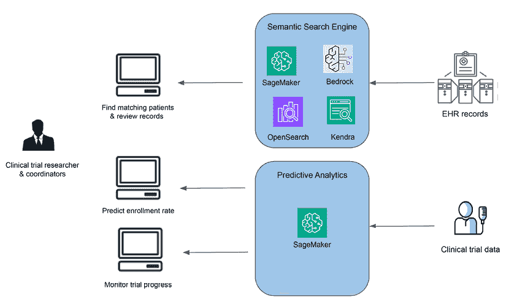

图 16.11：临床试验优化

以下是一个使用纳入和排除标准搜索医疗记录的示例命令：

```py
`Action`: Search de-identified electronic health records to identify patients meeting the following criteria:
`Inclusion Criteria`:
`Age between 40-60`
`Diagnosis of hypertension (ICD-10 code I10)`
`Prescribed beta blockers in 2022`
`Exclusion Criteria`:
`History of heart failure`
`Currently hospitalized` 
```

在命令的背后，一个代理可以促进对 EHR 记录语义搜索引擎中患者记录的搜索，并生成一个包含匹配患者列表的响应。

虽然生成式人工智能有潜力自动化并加速临床试验的患者招募，但在整个过程中保持合格的人类参与是至关重要的。仅靠人工智能系统无法完全验证试验参与者是否符合复杂的资格标准，这通常涉及解读病史、测试结果、既往状况等。具有临床专业知识的人类需要审查人工智能呈现的参与者资料，以捕捉任何关于资格评估的不准确之处，并防止不当的招募。

此外，还需要人类监督以确保人工智能辅助的招募遵守关于透明度、公平性和避免不当影响的伦理指南。参与者应理解为什么被选中以及他们的数据如何被使用。如果没有针对歧视的检查，自动化流程可能导致不透明和有偏见的招募。经验丰富的临床研究人员需要管理参与者互动，以维护可理解性、公平性和医学适宜性。

最后，在个案基础上，人类的参与提供了必要的细微差别和判断力。需要权衡的因素包括可用性、交通需求和个人情况。仅靠人工智能模型缺乏必要的同理心和适应性。临床试验过程最终涉及人类生命，因此，当人工智能效率提升时，人类招募人员的同情心和经验仍然是不可或缺的。

总之，生成式人工智能深入理解标准、跨数据源推理以及生成匹配和推荐的能力，为将漫长的患者招募过程转变为帮助推进关键医学研究提供了巨大潜力。同时，也必须承认其局限性，如幻觉、不透明性和隐私问题，例如处理 PII/PHI 数据。此外，关于在临床试验中采用生成式人工智能的监管环境尚不明确，这给生成式人工智能在该领域的采用带来了挑战。

## 媒体娱乐内容创作工作流程

媒体和娱乐行业的内容创作过程包括多个阶段，从创意生成和剧本创作到选角、制作、后期制作编辑、音效设计、图形和动画、发行、营销和货币化。然而，这个过程伴随着各种挑战，可能会影响项目的成功。这些挑战包括需要产生独特且引人共鸣的想法、构建引人入胜且连贯的故事情节、确保视觉表现能够有效地传达预期的情感、后期制作编辑的耗时性，以及选择或创造合适的音乐和声音的困难。

此外，动画和视觉效果通常需要专门的技能，而通过有效的营销策略在竞争激烈的市场中脱颖而出可能是一项艰巨的任务。

生成式 AI 以实际可行的方式解决这些挑战，提供了一个有希望的解决方案：

+   **剧本生成**：生成式 AI 可以根据人类提供的思想和输入生成电影或电视剧本。

+   **分镜设计**：生成式 AI 可以提出与剧本中预期的主题和情感相一致的可视化表示。

+   **制作**：生成式 AI 可以用于生成电影拍摄现场所需的图像和照片。

+   **后期制作编辑**：生成式 AI 可以通过文本引导编辑等技术自动化后期制作编辑流程。例如，你可以使用生成式 AI 来创建特效，以及编辑场景和图像。

+   **媒体资产搜索**：生成式 AI 可以通过高级标签和语义匹配帮助增强媒体内容搜索。

+   **市场营销和推广**：生成式 AI 可以生成吸引人的营销信息和视觉内容，用于促销活动。

+   **参与度**：生成式 AI 可以通过个性化和建议来增强用户体验。

下面的图示显示了生成式 AI 在整个媒体生命周期中的应用：

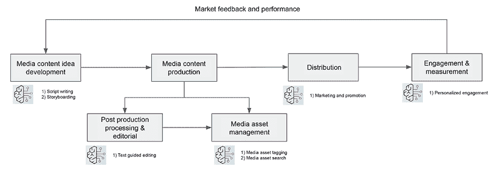

图 16.12：媒体内容开发和分发流程

以下是一个生成电影剧本的提示示例：

```py
`Action`: Write a script for a compelling Law & Order episode in a classic procedural drama style.
`Context`: This is for Law & Order's flagship show set in New York City following NYPD detectives investigating crimes and the prosecutors who ultimately try the cases. Base the script on fictional characters and events. Focus the plot on an intriguing murder mystery that explores moral dilemmas around crime and justice. Align the tone and dialogue with the show's dramatic yet grounded writing style. Structure the script in a three-act format with an exciting opening scene, plot twists, and a suspenseful climax leading to a just resolution. Describe the settings and character actions vividly. Follow standard screenwriting conventions and formatting.
`Script Details`:
Approximately 50 scenes
Opening scene introduces the victim and mystery
Detectives pursue leads through witty interrogations
Prosecutors debate legal strategy and ethics
Red herrings before revealing the true perpetrator
Thoughtful closing arguments and courtroom drama 
```

如果你将前面的提示输入到 ChatGPT 中，你可能会得到以下内容：

```py
`Title`: Law & Order Episode: "Shadows of Deceit"
INT. DARK ALLEY - NIGHT
Rain pours down on a desolate New York City alley. A shadowy figure lurks in the darkness, holding a gleaming knife. JASON HARPER (late 30s, rugged detective) and LUCY MARTIN (early 30s, sharp-witted detective) arrive at the crime scene. Flashing lights and uniformed officers create an eerie atmosphere.
EXT. DARK ALLEY - CONTINUOUS
They discover the lifeless body of SARAH WESTON (early 40s, elegant, with a secret), dressed in a pristine white gown, her face frozen in fear.
JASON
 (whispering) What kind of monster does this?
INT. POLICE STATION - INTERROGATION ROOM - MORNING
Jason and Lucy interrogate EDWARD KINGSLEY (50s, wealthy businessman), the victim's secret lover.
EDWARD
 (sweating) I didn't kill her! I loved her!
…. 
```

如果我们想要为剧本中的某些场景创建视觉表示，我们可以使用文本到图像模型。例如，我们可以向 Stable Diffusion 模型提供以下输入：

```py
Rain pours down on a desolate New York City alley. A shadowy figure lurks in the darkness, holding a gleaming knife. 
```

生成的图像将类似于以下图像：


图 16.13：使用文本到图像模型进行分镜设计

生成式 AI 创造的娱乐内容还处于早期阶段，但已经很明显，巨大的机遇吸引了众多公司为媒体用例如剧情生成工具等构建生成式 AI 工具。Runway 公司，一家视频编辑工具构建公司，其生成式 AI 视频编辑工具已被用于如《一切，无处不在，同时发生》等电影的后期制作。然而，这类工具引发了关于知识产权的问题。如果 AI 创造了一个受知名人物影响的全新角色，版权归谁所有？还有关于这项技术将对动画师、编剧和视觉艺术家等创意专业人士产生的社会影响的担忧。一些生成式 AI 技术对创意内容生成采取了更为谨慎的方法。例如，Anthropic 公司的 Claude 聊天机器人工具将阻止生成完整的电影剧本，以避免潜在的负面后果。

## 汽车设计工作流程

汽车设计在塑造高质量汽车方面发挥着至关重要的作用。它包括三个关键领域：外观设计、内饰设计和颜色及装饰设计。负责车辆外观的设计团队开发车辆的比例、形状和表面细节。内饰设计师开发仪表盘、座椅、车门装饰面板、车顶内衬、立柱装饰等的比例、形状、位置和表面。

在这里，重点是人体工程学和乘客的舒适性。最后，内饰设计师负责车辆上所有内饰和外观颜色及材料的研究、设计和开发。

外部和内饰设计的设计开发过程始于手工草图和数字绘图，这些构成了概念发展的基础。这些草图和绘图在各个管理层中经过严格的审查和批准流程。随后，概念通过**计算机辅助设计**（**CAS**）工具渲染成数字格式，以进一步细化风格，并将设计转化为生动的图像。之后，从图像中开发出工业塑料或粘土模型。

在设计过程中，必须保持与设计师的风格愿景一致，同时遵守包括性能、可制造性和安全法规在内的严格标准。这需要产品工程与设计师协同工作，以确保设计符合各种工程限制。

生成式 AI 可以在概念发展中发挥作用。设计师可以使用文本引导的提示，使用诸如“明显的尾翼”、“未来派”或“空气动力学”等关键词，快速生成汽车设计概念。通用文本到图像模型，如 Stable Diffusion、Imagen、Amazon Titan Image Generator 和 DALLE-2 模型，在文本引导的概念设计中展示了巨大的潜力。例如，以下提示示例将生成一辆汽车外观概念：

```py
`Action`: Generate a 3D rendering of a futuristic electric sports car exterior concept emphasizing aerodynamics and aggressive styling.
`Context`: This is an electric sports car aimed at the premium market. Focus on creating an extremely aerodynamic shape with sweeping curves and sharp angles. Make it appear powerful, nimble, and high-tech. Incorporate design elements that maximize battery range by reducing drag and turbulence. The styling should feel bold, exotic, and heavily influenced by fighter jets. Render the concept in a three-quarters front perspective in vibrant red. Add dramatic studio lighting to accentuate the design.
`Additional Details`:
2-door coupe body style
Emphasize the wide and low visual stance
Large air intakes for brake cooling
Futuristic looking wheels
LED accent lighting
Closed grille since it's an EV 
```

以下是在使用 Stability AI 的 Stable Diffusion 模型运行提示时的一个输出变体：


图 16.14：使用生成式 AI 的跑车概念设计

然而，需要注意的是，这些工具只能提供风格灵感的来源，并不能解决实际汽车设计中不可或缺的复杂工程和安全考虑。这些模型需要增强以支持图像生成，同时优化特定的工程限制。

在这个领域已经取得了一些进展，例如拖拽引导扩散模型，可以在最小化阻力的情况下渲染创意汽车概念。技术上，这些技术旨在在模型训练和图像生成过程中最小化与特定约束（如阻力）相关的辅助损失函数。因此，当生成汽车设计图像时，它也符合优化的约束，如最小化阻力值。

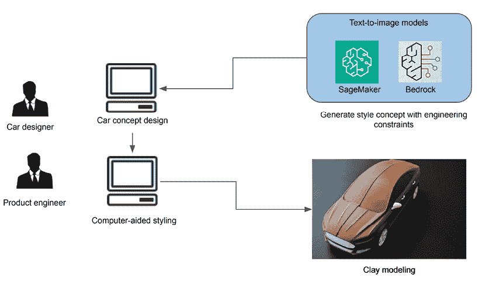

图 16.15：由生成式 AI 驱动的汽车设计流程

这些工具有可能极大地提高汽车设计师和产品工程师的生产力，使他们能够避免在无法实际生产的汽车设计概念上浪费时间。

生成式 AI 在汽车行业的应用对行业的各个方面都有重大影响。生成式 AI 有潜力彻底改变车辆设计、制造流程和整体运营效率。它可以在自动驾驶汽车的开发中发挥关键作用，增强其感知、决策和响应能力。然而，生成式 AI 在汽车行业的应用也带来了挑战和考虑因素。安全和安全方面的担忧、与决策算法相关的伦理考量以及法规遵从性是需要仔细关注的重点方面。在创新和负责任地使用 AI 之间取得平衡对于生成式 AI 在汽车行业的成功和可持续集成至关重要。

## 联系中心客户服务运营

生成式 AI 有潜力彻底改变整个客户运营职能，通过数字自助服务提高客户体验和代理生产力，并通过增强和提升代理技能来改善。这项技术因其能够使用自然语言自动化与客户的互动而已经在客户服务领域取得了进展。联系中心是金融、电信和医疗保健等行业的核心客户服务运营。主要职责包括人员配备、绩效监控、代理培训和客户参与。

然而，几个挑战困扰着联系中心的工作流程——高呼叫量、代理流失、服务质量不一致、满足客户速度和个人化期望以及代理疲劳。多语言支持和从客户反馈中提取见解增加了复杂性。

生成式 AI 可以解决许多这些挑战：

+   对于代理培训，模型可以从通话记录和历史中合成引导学习内容。生成式 AI 可以通过从客户对话中获取见解、确定可以做得更好的地方以及指导代理来提高质量保证和辅导。

+   在客户互动过程中，AI 助手为代理提供实时建议和答案，以提高解决率。例如，生成式 AI 可以立即检索公司关于特定客户的数据，这有助于人类客户服务代表在初次互动中更成功地回答问题和解决问题。生成式 AI 可以通过实时提供帮助和推荐下一步行动来减少人类销售代表响应客户所需的时间。

+   对于自助服务，由生成式 AI 驱动的聊天机器人可以立即提供个性化的响应，以应对复杂的客户查询，无论客户的语言或位置如何。通过通过自动化渠道提高互动的质量和有效性，生成式 AI 可以自动化对更高比例的客户查询的响应，使客户关怀团队能够处理只能由人工代理解决的问题。

+   通过生成模型进行的通话后分析确定了从对话数据中改进的领域。

+   挖掘对话也揭示了客户的需求和意图，以生成交叉销售机会。

使呼叫中心具备生成式 AI 功能需要集成 LLMs（大型语言模型）、语义搜索引擎和接触中心应用程序。以下图显示了为 Amazon Connect（AWS 呼叫中心服务）启用生成式 AI 和聊天机器人功能的架构。

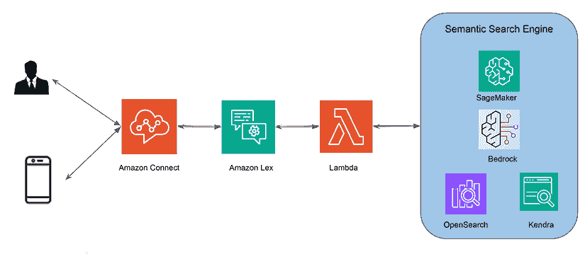

图 16.16：由生成式 AI 驱动的接触中心自助服务

通过谨慎的实施，生成式 AI 可以在接触中心推动显著的操作效率、服务质量改进和客户体验突破。在所有可能性中，认识到采用生成式 AI 为呼叫中心带来的潜在局限性也很重要，例如由于幻觉和对用户查询的理解错误而提供事实错误答案的风险，暴露敏感和私人信息的风险，以及引入可能有害和有偏见的响应。

# 我们是否接近拥有通用人工智能？

**通用人工智能**（**AGI**）是理论人工智能研究中的一个领域，致力于创建具有与人类能力相当认知功能的 AI 系统。AGI 仍然是一个定义不明确的理论概念，其定义及其最终实现的观点各不相同。然而，从广义上讲，AGI 涉及具有广泛理解和学习能力的人工智能系统/代理，能够在许多不同的领域理解和解决问题，而不仅仅是某一领域的狭窄专业知识。这些系统应该能够概括他们获得的知识，从某一领域迁移学习，并将知识和技能应用于人类所做的新颖情境和问题。

LLMs 和扩散模型所展现的令人印象深刻的性能已经引发了人们对实现通用人工智能（AGI）潜力的极大兴趣。它们在自然语言处理和图像生成等众多任务中，仅需少量微调就能表现出色，这似乎比之前的窄 AI 系统更接近灵活的人类智能。因此，一些研究人员和媒体对是否仅通过数据、模型和计算的扩展就能实现真正的 AGI 越来越持乐观看法。

然而，大多数 AI 专家警告说，我们还有很长的路要走才能实现完全通用和人类水平的人工智能。虽然 FM 的范围非常广泛，但它们仍然局限于语言和视觉领域。此外，与人类相比，它们的认知能力和推理能力仍然脆弱且狭窄。对于当前 FM 来说，跨不同任务和知识领域的迁移学习仍然很困难。此外，多模态是人类智能的组成部分，尽管在多模态 AI 方面取得了显著进展，但将不同模态（如文本、图像、视频、声音、触觉、社交线索等）的无缝理解和推理整合在一起仍然为时尚早。因此，虽然像 GPT 和 Anthropic Claude 这样的 LLMs 的能力代表了显著的进步，但我们仍然远未复制人类认知的稳健性、灵活性和多维特性。

为了帮助衡量 AGI 的进展，谷歌的 DeepMind 发布了一份 AGI 级别指南，使用性能和通用性（窄任务与一系列通用任务）作为两个维度。在性能维度上，指南中有六个级别：

1.  **第 0 级 – 无 AI**：在这个级别，AI 既不用于窄任务也不用于通用智能任务。

1.  **第 1 级 – 出现**：在这个级别，AI 在某些窄任务或一系列通用任务中与无技能人类相当或更好。指南指出，GPT、Bard、Llama 2、Claude 和 Gemini 等 FM 已经达到了这个成熟度级别。

1.  **第 2 级 – 能力**：在这个级别，AI 优于至少 50%的熟练成年人。根据指南，一些专注于狭窄领域的 AI 技术已经在某些狭窄任务上实现了这一水平，例如 Siri 和 Alexa 这样的 AI 助手、论文写作和编码。然而，AGI 尚未达到这一进展水平。

1.  **第 3 级 – 专家**：在这个级别，AI 优于至少 90%的熟练成年人。像 AI 语法检查器和图像生成器这样的技术已经在特定狭窄任务上达到了这一水平，然而，还没有 AGI 达到这一水平。

1.  **第四级 – 精通者**：在这个级别，AI 的技能优于 99%的熟练成年人。只有少数像 AlphaGo 这样的窄 AI 技术在这一级别的窄 AI 任务上实现了这种能力。

1.  **第五级 – 超人类**：这是人工智能优于 100%的人类的地方。再次强调，只有像 AlphaFold（一个蛋白质折叠模型）、AlphaZero（一个玩围棋的人工智能模型）和 Stockfish（一个开源的国际象棋引擎）这样的窄人工智能达到了这一能力水平。那么实现通用人工智能的路径是什么？至今没有人声称他们知道确切的答案，但追求仍在通过探索各种活跃的研究领域继续进行，如多模态理解、内存管理、跨领域推理和规划以及持续的自学习。此外，领先的 AI 专家们在这些领域提出了各种理论方法，从符号推理和连接主义架构的集成到对涌现现象的研究，以及整体有机体方法。在下一节中，我们将探讨符号、连接主义和神经符号方法。

## 符号方法

符号方法依赖于使用符号表示法明确表示知识和推理，例如逻辑语句、规则和结构化数据格式。在这个范例中，特定领域的知识是通过形式语言和逻辑形式主义手动编码到系统中的。符号表示的一个例子可以是“狗有四条腿。”这种编码的知识形成了一个知识库，它作为事实、概念、关系和规则的存储库，这些规则定义了该领域内世界运作的方式。符号人工智能系统随后使用推理引擎，这是一个应用逻辑运算和推理规则的组件。这使得系统能够通过以结构化和逻辑的方式操纵和组合符号表示来推导新的结论、进行推理和解决问题。

例如，在一个为医学诊断设计的符号人工智能系统中，知识库可能包含表示症状、疾病和治疗之间关系的规则。推理引擎随后可以使用这些规则来分析患者的症状，并逻辑地推断出最可能的诊断和适当的治疗方案。

符号人工智能的一个关键优势是它能够提供可解释和可理解的推理。由于知识和推理过程是明确表示的，因此人类可以追踪和理解系统的决策过程，这在金融、法律和医疗保健等领域尤为重要，在这些领域，透明度和问责制至关重要。

然而，符号人工智能系统也面临挑战，例如知识获取瓶颈，手动编码大量知识可能既耗时又费力。

此外，这些系统在处理歧义、不确定性和上下文相关的知识方面往往遇到困难，而这些知识对于其他人工智能方法（如机器学习和神经网络）来说则更容易解决。

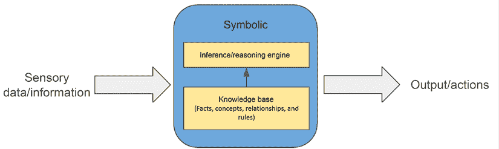

符号项目的一个突出例子是 Cyc 项目，这是持续时间最长的符号人工智能倡议之一。这个雄心勃勃的项目旨在构建一个全面的本体和知识库，捕捉关于世界如何运作的常识规则。Cyc 项目采用形式逻辑作为其推理和推理的主要机制。

尽管在范围和雄心方面具有开创性，Cyc 项目也突显了符号人工智能方法固有的关键挑战。这些挑战包括知识获取瓶颈，这指的是在系统中手动编码大量知识的艰巨任务。此外，项目还面临着脆弱性问题，即对编码规则或表示的微小偏差可能导致意外或错误的行为。

可扩展性问题也出现了，因为随着知识库的扩大，符号系统的复杂性可能会迅速增加，可能导致计算不可行。此外，在符号范式内，对细微差别、不确定性和情境相关解释的稳健处理仍然是一个巨大的挑战。

尽管存在这些障碍，Cyc 项目的开创性努力对符号人工智能领域做出了重大贡献，推动了知识表示和推理能力的边界。其持续的发展继续揭示了在追求通用人工智能过程中符号方法的潜力和局限性。

尽管符号人工智能为建立知识表示和推理的正式方法奠定了关键基础，但许多研究人员认为，仅符号系统本身可能不足以实现与人类智能相当所需的灵活性、鲁棒性和开放式泛化。

关于在通用人工智能系统中应将符号方法纳入何种程度——是作为核心架构还是更补充的角色——的辩论仍然是一个活跃的研究领域，存在不同的观点。批评者认为，符号系统固有的局限性，如脆弱性、可扩展性问题以及知识获取瓶颈，在捕捉人类智能的细微差别、情境相关性和持续演变性质方面构成了重大挑战。因此，许多人主张一种协同方法，结合符号方法和其他范式的优势，利用符号推理的可解释性和强大的泛化能力，同时通过互补技术，如连接主义模型或混合架构，来减轻其弱点。

## 连接主义/神经网络方法

这种方法侧重于构建模拟人脑的系统。神经网络系统，就像大脑一样，通过相互连接的节点或“神经元”进行广泛的并行处理，将知识分布在连接中。与显式的符号编码或规则，如“狗是一种动物”不同，神经网络模型依赖于亚符号分布式表示来表示相同的概念。在亚符号表示中，这种表示在神经网络和连接主义模型等方法中使用，知识和概念不是通过显式的符号或规则来表示，而是通过特征和特性的模式来表示。

集成神经网络方法旨在开发涵盖感知、推理和行动的综合端到端认知架构。假设在架构和训练数据两方面扩大神经网络规模可能会引发通用智能的出现，类似于大脑中的神经网络连接。然而，当前的神经网络面临挑战，因为它们通常很狭窄，缺乏系统性，并且在迁移学习方面遇到困难。

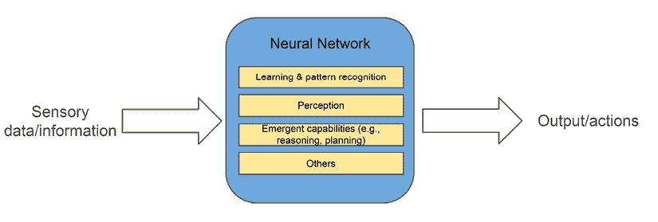

图 16.18：连接主义或神经网络方法

随着大型语言模型（LLMs）所展现的非凡能力，一个引人深思的问题是：这些模型，可以说是迄今为止最先进的神经网络，能否为 AGI 铺平道路？这个问题在人工智能社区中引发了不同的观点。Meta 的首席人工智能科学家 Yann LeCun 认为，LLMs 目前采用的当前自回归方法不太可能导致 AGI，因为这些模型主要是训练来预测下一个标记，而不是参与真正的规划或推理过程。据 LeCun 所说，当前的 LLMs 缺乏真正理解和推理知识的能力；相反，它们以近似的方式检索和生成信息。

另一方面，OpenAI 的首席科学家 Ilya Sutskever 似乎倾向于这样的观点，即，随着数据的充分和架构的日益扩大，LLMs 确实可能发展出对语义意义的深刻理解，这可能导致 AGI。一些替代观点认为，LLMs，特别是能够整合多种信息来源的多模态变体，结合它们利用不同工具的能力，可能达到一定程度的通用智能。

随着更先进和更有能力的模型被开发出来，以及围绕这些模型创建更多创新系统，只有时间才能告诉我们当前的方法是否最终能导致通用人工智能（AGI）。该领域内持续的进步和辩论凸显了这一追求的复杂性和不确定性，同时也在推动对更强大人工智能的持续追求。

## 神经符号方法

神经-符号方法旨在通过整合神经网络与符号推理系统，结合两者的最佳之处。其理念是创建能够使用神经网络从数据中学习模式和表示的 AI 系统，同时利用符号 AI 的显式知识和逻辑推理能力。

这里有一个简单的类比：想象一个小孩在学习世界。小孩的大脑（神经网络组件）可以通过经验和接触学习并识别模式，如形状、颜色和物体。然而，要真正理解和推理世界，小孩还需要从老师、书籍和其他来源学习显式规则、概念和知识（符号组件）。

在一个神经-符号 AI 系统中，神经网络组件将负责从数据中学习模式和表示，就像小孩的大脑一样。同时，符号组件将提供一个结构化的知识库和逻辑推理能力，类似于小孩从书籍和老师那里学习。

通过紧密集成这两个组件，AI 系统可以利用两种方法的优势。它可以像神经网络一样学习和适应，同时也能使用显式知识和逻辑规则进行推理和做出推断，就像人类一样。

许多研究人员认为，神经-符号方法是实现通用人工智能（AGI）的有希望的途径，因为它旨在捕捉类似人类智能的关键方面：从经验中学习的能力、使用结构化知识进行推理的能力，以及适应新情况的能力。

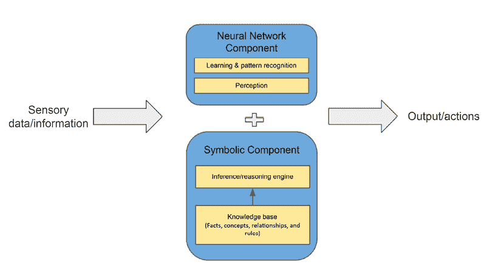

图 16.19：神经-符号架构

由 DeepMind 开发的 AlphaGeometry 是一个创新的 AI 系统，它利用神经-符号方法来解决复杂的几何推理任务。该系统结合了深度神经网络的强大模式识别和学习能力，以及几何知识的结构化推理和符号操作。

AlphaGeometry 的核心是一个神经网络组件，它处理视觉输入并生成代表几何概念和关系的候选符号表达式。然后，这些符号表达式被传递给一个符号推理引擎，该引擎使用逻辑规则和约束来验证、精炼和操作这些表达式。符号输出随后被解释并用于指导神经网络的预测，使系统能够迭代地提高其对几何的理解。

通过紧密集成神经和符号组件，AlphaGeometry 可以有效地结合两种范例的优势。神经网络擅长从视觉数据中学习模式和提取几何特征，而符号组件则提供了几何知识的结构化表示，并使复杂的逻辑关系可以进行推理。

这种神经-符号方法使 AlphaGeometry 在具有挑战性的几何任务上取得了令人印象深刻的性能，超越了先前的方法，并展示了将知识推广到新问题的能力。它展示了混合系统在提升人工智能能力方面的潜力，特别是在需要稳健的模式识别和结构化推理的领域。

随着对 AGI 的追求继续吸引着多个学科的研究人员和先驱，未来既充满巨大机遇，也面临严峻挑战。尽管连接主义方法已经展示了惊人的模式识别和学习能力，但将这些模型的边界推向实现人类水平智能的广度和灵活性仍然是一项持续的努力。符号方法，凭借其显式的知识表示和推理能力，提供了一条补充路径，但知识获取瓶颈和脆弱性问题仍然存在。神经-符号范式，无缝融合这两个世界的优势，成为了一条极具前景的道路。

不论路径如何，实现通用人工智能（AGI）的关键在于我们能够协同多种方法，利用数据的指数级增长和计算能力的提升，并深化我们对智能本身的理解。随着研究人员在这个未知的领域继续追求，前所未有的突破和范式转变正在等待着我们。

# 摘要

我们现在正接近这本书的结尾，这本书涵盖了机器学习的广度——从基础概念到前沿的生成式人工智能。我们以介绍核心机器学习技术、算法和行业应用作为本书的开端，以提供一个坚实的基础。然后我们逐步深入到数据架构、机器学习工具如 TensorFlow 和 PyTorch，以及工程最佳实践，以将技能付诸实践。在 AWS 上构建稳健的机器学习基础设施和优化方法为现实世界系统做好了准备。

负责任地保障和治理人工智能至关重要，因此我们深入探讨了风险管理。为了指导组织在机器学习之旅中前进，我们讨论了成熟度模型和演变步骤。

通过审视生成式人工智能和 AGI 来结束这一章，我们探索了目前最具颠覆性的新能力的巨大可能性。具体来说，我们深入探讨了生成式人工智能平台、RAG 架构和生成式人工智能生产部署的考虑因素。此外，我们还考察了跨各个行业的实际生成式人工智能商业应用，展示了这项技术的变革潜力。最后，本章以介绍实现人工通用智能的各种理论方法结束，为这个快速发展的领域提供了未来的一瞥。

希望你觉得这本书内容丰富，并且它为你提供了推动你的 AI 学习达到新高度的综合基础。涵盖的概念和框架旨在帮助你构建实用的机器学习解决方案。继续学习、实践和发展你的技能，以最大化 AI 的价值。未来承诺将带来指数级的更多激动人心的体验！

# 留下评论！

喜欢这本书吗？通过留下亚马逊评论来帮助像你这样的读者。扫描下面的二维码，获取你选择的免费电子书。


**限时优惠*
