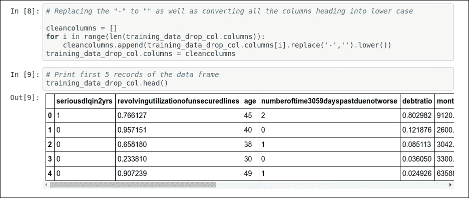

# 第一章：信用风险建模

本书的所有章节都是实际应用。我们将每章开发一个应用。我们将了解应用，并选择合适的数据库以开发应用。在分析数据库后，我们将为特定应用构建基线方法。随后，我们将开发一个改进的方法，以解决基线方法的不足。最后，我们将了解如何使用适当的优化策略为给定应用开发最佳解决方案。在这个过程中，我们将学习有关机器学习技术的必要关键概念。我建议我的读者运行本书中给出的代码。这将帮助你真正理解这些概念。

在本章中，我们将探讨预测分析众多有趣应用之一。我选择了金融领域作为起点，我们将构建一个能够预测贷款违约的算法。这是金融领域最广泛使用的预测分析应用之一。在这里，我们将探讨如何为预测贷款违约开发一个最优解。我们将涵盖所有有助于我们构建此应用的因素。

本章我们将涵盖以下主题：

+   介绍问题陈述

+   理解数据集

    +   理解数据集的特征

    +   数据分析

+   基线模型的特征工程

+   选择机器学习算法

+   训练基线模型

+   理解测试矩阵

+   测试基线模型

+   现有方法的问题

+   如何优化现有方法

    +   理解关键概念以优化方法

    +   超参数调整

+   实施改进的方法

    +   测试改进的方法

    +   理解改进方法中的问题

+   最佳方法

+   实施最佳方法

+   概述

# 介绍问题陈述

首先，让我们尝试理解我们想要开发的应用或我们试图解决的问题。一旦我们理解了问题陈述及其用例，开发应用将变得容易得多。所以，让我们开始吧！

我们希望帮助金融机构，如银行、NBFS、贷款人等。我们将开发一个算法，可以预测金融机构应该向谁发放贷款或信用。现在你可能想知道*这个算法的意义是什么？*让我详细解释一下。当金融机构向客户贷款时，他们是在承担某种风险。所以，在贷款之前，金融机构会检查借款人未来是否有足够的钱来偿还贷款。基于客户的当前收入和支出，许多金融机构会进行某种分析，帮助他们决定借款人是否是那家银行的优质客户。这种分析是手动且耗时的。因此，需要某种自动化。如果我们开发一个算法，将帮助金融机构高效且有效地评估他们的客户。你的下一个问题可能是*我们的算法的输出是什么？*我们的算法将生成概率。这个概率值将表示借款人违约的可能性。违约意味着借款人在一定时间内无法偿还贷款。在这里，概率表示客户不能按时支付贷款 EMI 的可能性，从而导致违约。所以，较高的概率值表示客户可能是一个不良或不合适的借款人（客户），因为他们在接下来的两年内可能会违约。较低的概率值表示客户将是一个良好或合适的借款人（客户），在接下来的两年内不会违约。

在这里，我已经提供了关于问题陈述及其输出的信息，但这个算法的一个重要方面是：它的输入。所以，让我们来讨论我们的输入将是什么！

# 理解数据集

在这里，我们将讨论我们的输入数据集，以便开发应用程序。你可以在[`github.com/jalajthanaki/credit-risk-modelling/tree/master/data`](https://github.com/jalajthanaki/credit-risk-modelling/tree/master/data)找到数据集。

让我们详细讨论数据集及其属性。在这里，在数据集中，你可以找到以下文件：

+   `cs-training.csv`

    +   这个文件中的记录用于训练，因此这是我们训练数据集。

+   `cs-test.csv`

    +   这个文件中的记录用于测试我们的机器学习模型，因此这是我们测试数据集。

+   `Data Dictionary.xls`

    +   这个文件包含了关于数据集中每个属性的信息。因此，这个文件被称为我们的数据字典。

+   `sampleEntry.csv`

    +   这个文件让我们了解我们需要为测试数据集生成最终输出的格式。如果你打开这个文件，你会看到我们需要生成测试数据集中每个记录的概率。这个概率值表示借款人违约的可能性。

## 理解数据集的属性

数据集有 11 个属性，如下所示：

图 1.1：数据集的属性（变量）

我们将逐个查看每个属性，并理解其在应用程序上下文中的含义：

1.  **SeriousDlqin2yrs**:

    +   在数据集中，此特定属性表示借款人是否在过去两年内有过 90 天以上的逾期还款记录。

    +   如果借款人在过去两年内有过超过 90 天的逾期还款记录，则此属性值为 Yes。如果借款人在 EMI 到期日 90 天后仍未支付 EMI，则此标志值是 Yes。

    +   如果借款人在过去两年内没有超过 90 天的逾期还款记录，则此属性值为 No。如果借款人在 EMI 到期日 90 天前支付了 EMI，则此标志值是 No。

    +   此属性具有目标标签。换句话说，我们将使用我们的算法来预测测试数据集中的此值。

1.  **RevolvingUtilizationOfUnsecuredLines**:

    +   此属性表示在排除任何当前贷款债务和房地产后，借款人的信用卡额度。

    +   假设我有一张信用卡，其信用额度为$1,000。在我的个人银行账户中，我有$1,000。我的信用卡余额是$500，总额度为$1,000。

    +   因此，我通过信用卡和个人银行账户可以拥有的总最大余额是$1,000 + $1,000 = $2,000；我已经使用了信用卡额度的$500，所以我拥有的总余额是$500（信用卡余额）+ $1,000（个人银行账户余额）= $1,500。

    +   如果账户持有人已经申请了住房贷款或其他财产贷款并支付了这些贷款的 EMI，则我们不考虑财产贷款的 EMI 价值。在这里，对于这个数据属性，我们考虑了账户持有人的信用卡余额和个人账户余额。

    +   因此，循环未担保线使用率的价值是 = $1,500 / $2,000 = 0.7500

1.  **Age**:

    +   此属性值一目了然。它表示借款人的年龄。

1.  **NumberOfTime30-59DaysPastDueNotWorse**:

    +   此属性值的数量表示借款人支付 EMI 逾期但支付时间在到期日 30 天后或到期日前 59 天内的次数。

1.  **DebtRatio**:

    +   这也是一个一目了然的属性，但我们将通过一个例子来尝试更好地理解它。

    +   如果我的月度债务是$200，我的其他支出是$500，那么我每月支出$700。如果我的月收入是$1,000，那么债务比率的价值是$700/$1,000 = 0.7000

1.  **MonthlyIncome**:

    +   此属性包含借款人每月收入的价值。

1.  **NumberOfOpenCreditLinesAndLoans**:

    +   此属性表示借款人持有的开放贷款和/或信用卡的数量。

1.  **NumberOfTimes90DaysLate**:

    +   此属性表示借款人支付其 EMI 到期日 90 天后的欠款次数。

1.  **NumberRealEstateLoansOrLines**:

    +   此属性表示借款人持有的房地产贷款数量或借款人的住房贷款数量。

1.  **NumberOfTime60-89DaysPastDueNotWorse**：

    +   此属性表示借款人支付 EMI（等额本息）的次数，但支付时间是在到期日后的 60 天或到期日前的 89 天。

1.  **NumberOfDependents**：

    +   此属性也是不言自明的。它表示借款人拥有的依赖家庭成员数量。依赖人数不包括借款人本人。

这些是数据集的基本属性描述，因此您可以对我们所拥有的数据集类型有一个基本的概念。现在，是时候动手实践了。所以从下一节开始，我们将开始编写代码。我们将通过执行基本数据分析来探索我们的数据集，以便我们可以找出数据集的统计特性。

## 数据分析

本节分为两个主要部分。您可以参考以下图表，了解我们将如何处理本节：

图 1.2：数据分析的各个部分和步骤

在第一部分中，我们只有一个步骤。在前面的图中，这被称为步骤 1.1。在这个第一步中，我们将进行基本数据预处理。一旦完成，我们将开始下一部分。

第二部分有两个步骤。在图中，这被称为步骤 2.1。在这个步骤中，我们将使用统计和可视化技术进行基本数据分析，这将帮助我们理解数据。通过这个活动，我们将了解一些关于数据集的统计事实。之后，我们将跳到下一个步骤，这在图 1.2 中被称为步骤 2.2。在这个步骤中，我们将再次进行数据预处理，但这次我们的预处理将高度基于我们在给定训练数据集上进行基本数据分析后得出的发现。您可以在以下 GitHub 链接中找到代码：[`github.com/jalajthanaki/credit-risk-modelling/blob/master/basic_data_analysis.ipynb`](https://github.com/jalajthanaki/credit-risk-modelling/blob/master/basic_data_analysis.ipynb)。

那么，让我们开始吧！

### 数据预处理

在本节中，我们将执行最小量的基本预处理。我们将探讨方法及其实现。

#### 第一次更改

如果您打开`cs-training.csv`文件，您会发现其中有一列没有标题，因此我们将在那里添加一个标题。该属性的标题为`ID`。如果您想删除此列，您可以这样做，因为它只包含记录的`sr.no`。

#### 第二次更改

这种更改不是强制性的。如果你想跳过它，你可以，但我个人喜欢执行这种预处理。这个更改与属性的标题有关，我们将从标题中移除"-"。除此之外，我还会将所有列标题转换为小写。例如，名为`NumberOfTime60-89DaysPastDueNotWorse`的属性将被转换为`numberoftime6089dayspastduenotworse`。这些类型的更改将有助于我们在进行深入数据分析时。在处理时我们不需要注意这些连字符符号。

#### 实施更改

现在，你可能想知道*我将如何执行所描述的更改？* 好吧，有两种方法。一种是手动方法。在这种方法中，你将打开`cs-training.csv`文件并手动执行更改。这种方法当然不是很好。所以，我们将采取第二种方法。在第二种方法中，我们将使用 Python 代码执行更改。你可以在以下代码片段中找到所有更改。

参考以下截图以获取执行第一个更改的代码：

图 1.3：实现重命名或删除索引列的代码片段

对于第二个更改，你可以参考*图 1.4*：

图 1.4：删除列标题中的"-"并将所有列标题转换为小写的代码片段

同样的预处理需要在`cs-test.csv`文件上执行。这是因为给定的更改对训练集和测试集都是通用的。

你可以通过点击此链接在 GitHub 上找到整个代码：[`github.com/jalajthanaki/credit-risk-modelling/blob/master/basic_data_analysis.ipynb`](https://github.com/jalajthanaki/credit-risk-modelling/blob/master/basic_data_analysis.ipynb)。

你也可以在阅读的同时动手操作。

我正在使用 Python 2.7 以及一系列不同的 Python 库来实现此代码。你可以在*README*部分找到有关 Python 依赖项以及安装的信息。现在让我们继续到基本数据分析部分。

### 基本数据分析随后是数据预处理

让我们进行一些基本数据分析，这将帮助我们找到训练数据集的统计特性。这种分析也称为探索性数据分析（EDA），它将帮助我们了解我们的数据集如何表示事实。在推导出一些事实之后，我们可以使用它们来进行特征工程。所以，让我们探索一些重要的事实！

从本节开始，所有代码都是 iPython 笔记本的一部分。你可以使用此 GitHub 链接引用代码：[`github.com/jalajthanaki/credit-risk-modelling/blob/master/Credit%20Risk%20Analysis.ipynb`](https://github.com/jalajthanaki/credit-risk-modelling/blob/master/Credit%20Risk%20Analysis.ipynb)。

以下是我们将要执行的步骤：

1.  列出统计属性

1.  查找缺失值

1.  替换缺失值

1.  相关性

1.  检测异常值

#### 列出统计属性

在本节中，我们将了解训练数据集的统计属性。使用 pandas 的 describe 函数，我们可以找出以下基本事项：

+   `count`：这将让我们了解训练数据集中记录的数量。

+   `mean`：这个值给我们每个数据属性的均值指示。

+   `std`：这个值表示每个数据属性的标准差。您可以参考以下示例：[`www.mathsisfun.com/data/standard-deviation.html`](http://www.mathsisfun.com/data/standard-deviation.html)。

+   `min`：这个值让我们了解每个数据属性的最低值是多少。

+   `25%`：这个值表示第 25 百分位数。它应该在 0 和 1 之间。

+   `50%`：这个值表示第 50 百分位数。它应该在 0 和 1 之间。

+   `75%`：这个值表示第 75 百分位数。它应该在 0 和 1 之间。

+   `max`：这个值让我们了解每个数据属性的最高值是多少。

请查看以下图中的代码片段：

图 1.5：使用 pandas 的 describe 函数的基本统计属性

我们需要为我们的数据集找到一些其他的统计属性，这将帮助我们理解它。因此，在这里，我们将找到每个数据属性的均值和中位数。您可以在下面的图中看到查找中位数的代码：

图 1.6：生成每个数据属性的均值和中位数的代码片段

现在我们来检查我们的数据集中存在什么样的数据分布。我们绘制了目标属性`seriousdlqin2yrs`的频率分布，以便理解训练数据集中目标变量的整体分布。在这里，我们将使用`seaborn`可视化库。您可以通过以下代码片段进行参考：

图 1.7：理解目标变量分布以及分布可视化的代码片段

您可以参考以下图中的可视化图表：

图 1.8：目标数据属性变量分布的可视化

从这个图表中，您可以看到有许多带有目标标签*0*的记录，而带有目标标签*1*的记录较少。您可以看到带有*0*标签的数据记录大约占 93.32%，而 6.68%的数据记录被标记为*1*。我们将在接下来的章节中使用所有这些事实。现在，我们可以将我们的结果变量视为不平衡的。

#### 查找缺失值

为了在数据集中找到缺失值，我们需要检查每个数据属性。首先，我们将尝试识别哪个属性有缺失或空值。一旦我们找到了数据属性的名字，我们将用更有意义的价值替换缺失值。有几种选项可用于替换缺失值。我们将探索所有这些可能性。

让我们编写第一步的代码。在这里，我们将查看哪些数据属性存在缺失值，以及每个具有缺失值的数据属性有多少条记录。您可以在下面的图中查看代码片段：

图 1.9：识别哪些数据属性有缺失值的代码片段

如前图所示，以下两个数据属性存在缺失值：

+   `monthlyincome`：此属性包含 29,731 条记录，其中存在缺失值。

+   `numberofdependents`：此属性包含 3,924 条记录，其中存在缺失值。

您还可以参考下面的图中的代码片段，以图形方式表示到目前为止描述的事实：

图 1.10：生成缺失值图表的代码片段

您可以在下面的图中查看图表本身：

图 1.11：缺失值的图形表示

在这种情况下，我们需要用更有意义的价值替换这些缺失值。我们可以使用各种标准技术来完成这项工作。我们有以下两种选项：

+   用该特定数据属性的平均值替换缺失值

+   用该特定数据属性的中位数替换缺失值

在上一节中，我们已经为所有数据属性推导出了平均值和中位数，我们将使用它们。在这里，我们的重点是标题为`monthlyincome`和`numberofdependents`的属性，因为它们有缺失值。我们已经确定了哪些数据属性有缺失值，现在是时候执行实际的替换操作了。在下一节中，您将看到我们如何用平均值或中位数替换缺失值。

#### 替换缺失值

在上一节中，我们确定了训练数据集中哪些数据属性包含缺失值。我们需要用该特定数据属性的平均值或中位数来替换缺失值。因此，在本节中，我们将特别关注我们如何执行实际的替换操作。这种替换缺失值的操作也称为缺失数据插补。

在进入代码部分之前，我觉得你们可能会有一些问题，比如：*我应该用平均值还是中位数替换缺失值？* *还有其他选项吗？* 让我逐一回答这些问题。

第一个问题的答案实际上将是一个试错法。所以你首先用平均值替换缺失值，并在模型训练过程中测量是否在训练数据集上得到好的结果。然后，在第二次迭代中，我们需要尝试用中位数替换值，并测量是否在训练数据集上得到好的结果。

为了回答第二个问题，有许多不同的插补技术可用，例如删除记录、使用 KNN 方法替换值、使用最频繁的值替换值等等。你可以选择这些技术中的任何一种，但你需要训练模型并测量结果。没有实施技术，你无法真正确定特定的插补技术是否适用于给定的训练数据集。在这里，我们谈论的是信用风险领域，所以我不太会深入理论，只是为了刷新你的概念，你可以参考以下文章：

+   [`machinelearningmastery.com/handle-missing-data-python/`](https://machinelearningmastery.com/handle-missing-data-python/)

+   [`scikit-learn.org/stable/modules/generated/sklearn.preprocessing.Imputer.html`](http://scikit-learn.org/stable/modules/generated/sklearn.preprocessing.Imputer.html)

+   [`www.analyticsvidhya.com/blog/2016/01/guide-data-exploration/`](https://www.analyticsvidhya.com/blog/2016/01/guide-data-exploration/)

我们可以在以下图中看到使用属性的平均值和中位数替换缺失值的代码：

图 1.12：替换平均值代码片段

在前面的代码片段中，我们用平均值替换了缺失值，在第二步中，我们验证了所有缺失值都已用该特定数据属性的平均值替换。

在下一个代码片段中，你可以看到我们用来用这些数据属性的中位数替换缺失值的代码。请参考以下图：

图 1.13：用中位数替换缺失值的代码片段

在前面的代码片段中，我们已经用中位数替换了缺失值，在第二步中，我们已经验证了所有缺失值都已用该特定数据属性的中位数替换。

在第一次迭代中，我希望用中位数替换缺失值。

在下一节中，我们将看到基本数据分析的一个重要方面：寻找数据属性之间的相关性。所以，让我们从相关性开始吧。

#### 相关系数

我希望您基本上知道在机器学习中相关性表示什么。术语相关性指的是数量之间的相互关系或关联。如果您想在这方面刷新概念，可以参考 [`www.investopedia.com/terms/c/correlation.asp`](https://www.investopedia.com/terms/c/correlation.asp)。

因此，在这里，我们将找出不同数据属性之间存在的关联类型。有些属性高度依赖于一个或多个其他属性。有时，特定属性的值相对于其依赖属性增加，而有时特定属性的值相对于其依赖属性减少。因此，相关性表示数据属性之间的正负关联。您可以参考以下代码片段来了解相关性：

图 1.14：生成相关性的代码片段

您可以在以下图中看到表示相关性的图形表示的代码片段：

图 1.15：生成图形片段的代码片段

您可以在以下图中看到相关性的图表：

图 1.16：相关性热图

让我们看看前面的图表，因为它将极大地帮助您理解相关性。以下事实可以从图表中得出：

+   值为 1.0 的单元格彼此高度相关。

+   每个属性与其自身都有非常高的相关性，因此所有对角线值都是 1.0。

+   数据属性 **numberoftime3059dayspastduenotworse**（参考垂直线或 *y* 轴上的数据属性）与两个属性高度相关，**numberoftimes90dayslate** 和 **numberoftime6089dayspastduenotworse**。这两个数据属性位于 *x* 轴（或水平线上）。

+   数据属性 numberoftimes90dayslate 与 numberoftime3059dayspastduenotworse 和 numberoftime6089dayspastduenotworse 高度相关。这两个数据属性位于 *x* 轴（或水平线上）。

+   数据属性 numberoftime6089dayspastduenotworse 与 numberoftime3059dayspastduenotworse 和 numberoftimes90dayslate 高度相关。这两个数据属性位于 *x* 轴（或水平线上）。

+   数据属性 **numberofopencreditlinesandloans** 也与 **numberrealestateloansorlines** 相关，反之亦然。在这里，数据属性 numberrealestateloansorlines 位于 *x* 轴（或水平线上）。

在继续前进之前，我们需要检查这些属性是否包含任何异常值或不显著值。如果有的话，我们需要处理这些异常值，因此我们下一节将介绍如何从我们的训练数据集中检测异常值。

#### 检测异常值

在本节中，你将学习如何检测异常值以及如何处理它们。本节涉及两个步骤：

+   异常值检测技术

+   处理异常值

首先，让我们从检测异常值开始。现在你们可能想知道*为什么我们应该检测异常值*。为了回答这个问题，我想给你们举一个例子。假设你有 5 岁孩子的体重。你测量了五个孩子的体重，并想找出平均体重。孩子们的体重分别是 15、12、13、10 和 35 公斤。现在如果你尝试找出这些值的平均值，你会看到答案是 17 公斤。如果你仔细观察体重范围，你会发现最后一个观测值与其他观测值相比超出了正常范围。现在让我们移除最后一个观测值（其值为 35）并重新计算其他观测值的平均值。新的平均值是 12.5 公斤。这个新值与最后一个平均值相比更有意义。因此，异常值对准确性有很大影响；因此，检测它们非常重要。一旦完成，我们将在名为处理异常值的下一节中探讨处理它们的技术。

#### 异常值检测技术

在这里，我们使用了以下异常值检测技术：

+   基于百分比的异常值检测

+   基于中位数绝对偏差（MAD）的异常值检测

+   基于标准差（STD）的异常值检测

+   基于多数投票的异常值检测

+   异常值的可视化

#### 基于百分比的异常值检测

在这里，我们使用了基于百分比的异常值检测，这是基于基本的统计理解推导出来的。我们假设我们应该考虑所有位于 2.5 到 97.5 百分比范围内的数据点。我们通过决定一个 95%的阈值来推导出百分比范围。你可以参考以下代码片段：

图 1.17：基于百分比的异常值检测代码片段

我们将使用这种方法对每个数据属性进行检测异常值。

#### 基于中位数绝对偏差（MAD）的异常值检测

中位数绝对偏差（MAD）是一个非常简单的统计概念。它涉及四个步骤。这也被称为修改后的 Z 分数。步骤如下：

1.  找到特定数据属性的中位数。

1.  对于数据属性给出的每个值，减去之前找到的中位数值。这个减法是以绝对值的形式进行的。因此，对于每个数据点，你将得到一个绝对值。

1.  在第三步中，生成我们在第二步中得到的绝对值的平均值。我们将对每个数据点以及每个数据属性执行此操作。这个值被称为 MAD 值。

1.  在第四步中，我们将使用以下公式来推导修改后的 Z 分数：

现在是时候参考以下代码片段了：

图 1.18：基于 MAD 的异常值检测代码片段

#### 基于标准差（STD）的异常值检测

在本节中，我们将使用标准差和平均值来查找异常值。在这里，我们选择了一个随机的阈值值为 3。你可以参考以下代码片段：

图 1.19：基于标准差（STD）的异常值检测代码

#### 基于多数投票的异常值检测：

在本节中，我们将构建投票机制，以便我们可以同时运行之前定义的所有方法——例如基于百分比的异常值检测、基于 MAD 的异常值检测和基于 STD 的异常值检测——并了解数据点是否应该被视为异常值。到目前为止，我们已经看到了三种技术。因此，如果两种技术指示数据应该被视为异常值，那么我们就将这个数据点视为异常值；否则，我们不将其视为异常值。因此，这里所需的最低投票数是两个。请参考以下图中的代码片段：

图 1.20：异常值检测的投票机制代码片段

#### 异常值可视化

在本节中，我们将绘制数据属性以直观地了解异常值。同样，我们使用`seaborn`和`matplotlib`库来可视化异常值。你可以在以下图中找到代码片段：

图 1.21：异常值可视化代码片段

请参考前面的图来了解我们的定义方法如何检测异常值。在这里，我们选择了 5,000 个样本的大小。这个样本是随机选择的。

图 1.22：异常值检测的图表

在这里，你可以看到所有定义的技术如何帮助我们从一个特定的数据属性中检测异常数据点。你可以在以下 GitHub 链接上看到所有属性可视化图表：[`github.com/jalajthanaki/credit-risk-modelling/blob/master/Credit%20Risk%20Analysis.ipynb`](https://github.com/jalajthanaki/credit-risk-modelling/blob/master/Credit%20Risk%20Analysis.ipynb)。

到目前为止，你已经学习了如何检测异常值，但现在你需要处理这些异常值点。在下一节中，我们将探讨如何处理异常值。

#### 处理异常值

在本节中，您将学习如何删除或替换异常数据点。这一步骤尤为重要，因为如果您只是识别了异常值，但无法正确处理，那么在训练时，我们有很大的可能性会过度拟合模型。因此，让我们学习如何处理这个数据集的异常值。在这里，我将通过逐个查看数据属性来解释这个操作。

#### 未担保线路的循环利用率

在这个数据属性中，当您绘制异常值检测图时，您将了解到大于 0.99999 的值被认为是异常值。因此，大于 0.99999 的值可以被替换为 0.99999。因此，对于这个数据属性，我们执行替换操作。我们为数据属性`revolvingutilizationofunsecuredlines`生成了新的值。

对于代码，您可以参考以下图表：

图 1.23：用 0.99999 替换异常值的代码片段

#### 年龄

在这个属性中，如果您探索数据并查看基于百分比的异常值，那么您会看到有一个值为 0 的异常值，数据属性中最年轻的年龄是 21 岁。因此，我们将 0 的值替换为 22。我们编写了这样的条件，即年龄应该大于 22。如果不是，那么我们将年龄替换为 22。您可以参考以下代码和图表。

下图显示了数据集中年龄的频率分布。通过观察数据，我们可以得出结论，0 是异常值：

图 1.24：每个数据值的频率显示 0 是异常值

参考以下箱形图，它给出了年龄的分布指示：

图 1.25：年龄数据属性的箱形图

在删除异常值之前，我们得到了以下异常值检测图：

图 1.26：数据属性年龄检测异常的图形表示

替换异常值的代码如下：

图 1.27：用最小年龄值 21 替换异常值

在代码中，您可以看到我们已经检查了年龄列的每个数据点，如果年龄大于 21，则我们没有应用任何更改，但如果年龄小于 21，则我们用 21 替换了旧值。之后，我们将所有这些修改后的值放入我们的原始数据框中。

#### 30-59 天逾期次数未恶化

在这个数据属性中，我们不仅探索了数据，还参考了异常值检测图。在这样做之后，我们知道 96 和 98 是我们的异常值。我们将这些值替换为平均值。您可以参考以下代码和图表来更好地理解这一点。

参考以下图表中的异常值检测图：

图 1.28：异常值检测图

参考下图中数据的频率分析：

图 1.29：频率计算中的异常值

用中位数替换异常值代码片段如下所示：

图 1.30：替换异常值的代码片段

#### 负债比率

如果我们查看这个属性的异常值检测图，那么它有点令人困惑。请参考下图：

图 1.31：负债比率列的异常值检测图

为什么？这很令人困惑，因为我们不确定应该考虑哪种异常值检测方法。所以，在这里，我们只通过计算每种方法产生的异常值数量来进行一些比较分析。请参考下图：

图 1.32：各种异常值检测技术的比较

最大异常值检测是通过基于 MAD 的方法进行的，因此我们将考虑该方法。在这里，我们将找到最小上界值以替换异常值。最小上界是从异常值中得出的最小值。请参考以下代码片段：

图 1.33：最小上界代码

#### 月收入

对于这个数据属性，我们将选择基于投票的异常值检测方法，如下图所示：

图 1.34：异常值检测图

为了替换异常值，我们将使用与“负债比率”数据属性相同的逻辑。我们通过生成一个最小上界值来替换异常值。你可以参考下图中给出的代码：

图 1.35：用最小上界值替换异常值

#### 开放信用额度及贷款数量

如果你参考下图中给出的图表，你会看到在这个列中没有出现高度偏离的异常值：

图 1.36：异常值检测图

因此，我们将不对这个数据属性执行任何替换操作。

#### 90 天逾期次数

对于这个属性，当你分析数据值频率时，你会立即看到 96 和 98 是异常值。我们将用数据属性的中位数替换这些值。

参考下图中频率分析的代码片段：

图 1.37：数据点的频率分析

异常值替换代码片段如下所示：

图 1.38：使用中位数替换异常值

#### 房地产贷款或信用额度数量

当我们看到数据属性中值的频率时，我们会知道超过 17 的频率值太低。所以，在这里，我们将每个小于 17 的值替换为 17。

你可以参考以下图中的代码片段：

图 1.39：替换异常值代码片段

#### 60-89 天逾期次数未变差

对于这个属性，当你分析数据值频率时，你会立即看到 96 和 98 是异常值。我们将用数据属性的均值替换这些值。

参考以下图中的频率分析代码片段：

图 1.40：数据频率分析

异常值替换代码片段如下所示：

图 1.41：使用中位数替换异常值的代码片段

你可以参考*图 1.38*中的`removeSpecificAndPutMedian`方法代码。

### 受抚养人数

对于这个属性，当你看到数据点的频率值时，你会立即看到大于 10 的数据值是异常值。我们将大于 10 的值替换为 10。

参考以下图中的代码片段：

图 1.42：替换异常值代码片段

这就结束了异常值部分。在本节中，我们以更有意义的方式替换了数据点的值。我们也到达了基本数据分析部分的终点。这次分析让我们对数据集及其值有了很好的理解。下一节全是关于特征工程。所以，我们首先从基础知识开始，然后在本章的后面，你将学习到特征工程如何以积极的方式影响算法的准确性。 

# 基线模型的特征工程

在本节中，你将学习如何选择重要的特征来开发预测模型。所以现在，首先，我们不会过多关注在这一阶段推导新的特征，因为首先，我们需要知道哪些输入变量/列/数据属性/特征至少能给我们提供基线准确率。因此，在这个第一次迭代中，我们的重点是选择可用的训练数据集中的特征。

## 确定特征重要性

我们需要知道哪些是重要的特征。为了找出这些特征，我们将使用随机森林分类器来训练模型。之后，我们将对我们来说重要的特征有一个大致的了解。所以让我们直接进入代码。你可以参考以下图中的代码片段：

图 1.43：推导特征的重要性

在此代码中，我们使用 scikit-learn 的 RandomForest 分类器。我们使用`fit()`函数进行训练，然后，为了生成特征的重要性，我们将使用 scikit-learn 库中可用的`feature_importances`_ 函数。然后，我们将按重要性值从高到低打印出特征。

让我们绘制一个图表，以便更好地理解最重要的特征。您可以在以下图中找到代码片段：

图 1.44：生成特征重要性图的代码片段

在此代码片段中，我们使用 matplotlib 库来绘制图表。在这里，我们使用条形图并输入所有数据属性及其重要性值，这些值是我们之前推导出来的。您可以参考以下图中的图表：

图 1.45：特征重要性图

在第一次迭代中，我们在特征工程方面做了一些相当多的工作。我们将在接下来的章节中重新审视特征工程。现在，是时候实现机器学习算法来生成基线预测模型了，这将让我们了解一个人在接下来的两年内是否会违约。所以，让我们跳到下一节。

# 选择机器学习算法

这一节是最重要的。在这里，我们将尝试几种不同的机器学习算法，以便了解哪种机器学习算法表现更好。我们还将进行训练准确度比较。

到这时，你肯定知道这个特定问题被认为是分类问题。我们将选择的算法如下（这个选择基于直觉）：

+   K-Nearest Neighbor (KNN)

+   逻辑回归

+   AdaBoost

+   GradientBoosting

+   RandomForest

我们的第一步是生成特定格式的训练数据。我们将把训练数据集分成训练集和测试集。所以，基本上，我们正在为训练准备输入。这对于所有机器学习算法都是常见的。请参考以下图中的代码片段：

图 1.46：生成用于训练的关键值格式训练数据集的代码片段

如代码所示，变量 x 包含除了名为`seriousdlqin2yrs`的目标列之外的所有列，因此我们已删除此列。删除此属性的原因是，该属性包含每行的答案/目标/标签。机器学习算法需要以键值对的形式输入，因此目标列是键，所有其他列是值。我们可以这样说，某种值模式将导致特定的目标值，这是我们需要使用机器学习算法进行预测的。

在这里，我们也分割了训练数据。我们将使用 75%的训练数据用于实际训练目的，一旦训练完成，我们将使用剩余的 25%训练数据来检查我们训练的 ML 模型的训练准确度。所以，我们不浪费任何时间，将直接跳到 ML 算法的编码，随着我们的前进，我会解释代码。注意，在这里，我不会深入到每个 ML 算法的数学解释，但我将解释代码。

## K-Nearest Neighbor (KNN)

在这个算法中，通常我们的输出预测遵循其邻居的相同趋势。K 是我们将要考虑的邻居数量。如果 K=3，那么在预测输出时，检查三个最近的邻居点，如果一个邻居属于*X*类别，而两个邻居属于*Y*类别，那么预测标签将是*Y*，因为大多数最近的点属于*Y*类别。

让我们看看我们编写了什么。参考以下图：

图 1.47：定义 KNN 分类器的代码片段

让我们逐个了解这些参数：

+   根据代码，K=5 意味着我们的预测基于五个最近的邻居。在这里，`n_neighbors=5`。

+   权重均匀选择，这意味着每个邻域中的所有点都被同等加权。在这里，weights='uniform'。

+   algorithm='auto': 此参数将尝试根据我们传递的值决定最合适的算法。

+   leaf_size = 30: 此参数影响模型构建和查询的速度。在这里，我们使用了默认值，即 30。

+   p=2: 这表示 Minkowski 度量的幂参数。在这里，p=2 使用`euclidean_distance`。

+   metric='minkowski': 这是默认的距离度量，它帮助我们构建树。

+   metric_params=None: 这是我们在使用的默认值。

## 逻辑回归

逻辑回归是最广泛使用的 ML 算法之一，也是最古老的算法之一。该算法使用 sigmoid 和其他非线性函数生成目标变量的概率，以预测目标标签。

让我们参考代码和用于逻辑回归的参数。您可以参考以下图中的代码片段：

图 1.48：逻辑回归 ML 算法的代码片段

让我们逐个了解这些参数：

+   penalty='l1': 此参数表示梯度下降算法的选择。在这里，我们选择了牛顿-共轭梯度方法。

+   dual=False: 如果样本数量大于特征数量，我们应该将此参数设置为 false。

+   tol=0.0001: 这是算法的一个停止标准。

+   c=1.0: 此值表示正则化强度的倒数。此参数必须是一个正浮点值。

+   fit_intercept = True：这是此算法的默认值。此参数用于指示算法的偏差。

+   solver='liblinear'：此算法对小型数据集表现良好，因此我们选择了它。

+   intercept_scaling=1：如果我们选择 liblinear 算法并且 fit_intercept=True，那么这个参数帮助我们生成特征权重。

+   class_weight=None：没有与类标签关联的权重。

+   random_state=None：在这里，我们使用此参数的默认值。

+   max_iter=100：在这里，我们迭代 100 次，以便将我们的 ML 算法收敛到给定的数据集。

+   multi_class='ovr'：此参数表示给定问题是二元分类问题。

+   verbose=2：如果我们使用 liblinear 作为求解器参数，那么我们需要为冗余性输入一个正数。

## AdaBoost

AdaBoost 算法代表自适应提升。提升是一种集成方法，其中我们将使用多个弱分类器来构建强分类器。AdaBoost 是一种针对二元分类问题给出良好结果的提升算法。如果您想了解更多关于它的信息，请参阅这篇文章[`machinelearningmastery.com/boosting-and-adaboost-for-machine-learning/`](https://machinelearningmastery.com/boosting-and-adaboost-for-machine-learning/)。

此特定算法有 N 次迭代。在第一次迭代中，我们从训练数据集中随机选择数据点并构建模型。每次迭代后，算法都会检查分类器表现不佳的数据点。一旦算法根据误差率识别出这些数据点，权重分布就会更新。因此，在下一轮迭代中，算法有更大的机会选择之前分类不佳的数据点并学习如何分类它们。这个过程会持续进行，直到达到您提供的迭代次数。

让我们参考以下图中给出的代码片段：

图 1.49：AdaBoost 分类器的代码片段

参数相关描述如下：

+   **base_estimator = None**：这是构建提升集成的基础估计器。

+   **n_estimators=200**：这是提升终止的最大估计器数量。在 200 次迭代后，算法将终止。

+   **learning_rate=1.0**：此速率决定了我们的模型收敛的速度。

## GradientBoosting

此算法也是 ML 算法集成的一部分。在这个算法中，我们使用基本的回归算法来训练模型。训练后，我们将计算误差率以及找到算法表现不佳的数据点，在下一轮迭代中，我们将重新训练模型以更好地预测这些数据点。该算法使用已生成的模型以及新生成的模型来预测数据点的值。

你可以在下面的图中看到代码片段：

图 1.50：Gradient Boosting 分类器的代码片段

让我们来看看分类器的参数：

+   **loss='deviance'**: 这意味着我们正在使用具有概率输出的逻辑回归进行分类。

+   **learning_rate = 0.1**: 此参数告诉我们模型需要多快收敛。

+   **n_estimators = 200**: 此参数表示需要执行的提升阶段的数量。

+   **subsample = 1.0**: 此参数有助于调整偏差和方差。选择 subsample < 1.0 会导致方差减少和偏差增加。

+   **min_sample_split=2**: 这是分割内部节点所需的最小样本数。

+   **min_weight_fraction_leaf=0.0**: 样本具有相等的权重，因此我们提供了值 0。

+   **max_depth=3**: 这表示单个回归估计器的最大深度。最大深度限制了树中的节点数。

+   **init=None**: 对于此参数，loss.init_estimator 用于初始预测。

+   **random_state=None**: 此参数表示随机状态是通过`numpy.random`函数生成的。

+   **max_features=None**: 此参数表示我们有 N 个特征。因此，`max_features=n_features`。

+   **verbose=0**: 没有打印进度。

## RandomForest

这个特定的机器学习算法生成决策树的数量，并使用投票机制来预测目标标签。在这个算法中，生成了多个决策树，形成了一个树丛，因此被称为 RandomForest。

在下面的代码片段中，注意我们如何声明了 RandomForest 分类器：

图 1.51：Random Forest 分类器的代码片段

让我们了解这里的参数：

+   `n_estimators=10`: 这表示森林中的树的数量。

+   `criterion='gini'`: 信息增益将通过 gini 计算。

+   `max_depth=None`: 此参数表示节点会扩展，直到所有叶子节点都是纯的，或者直到所有叶子节点包含少于 min_samples_split 个样本。

+   `min_samples_split=2`: 此参数表示执行分割以生成树所需的最小样本数至少为两个。

+   `min_samples_leaf=1`: 这表示叶子节点的样本大小。

+   `min_weight_fraction_leaf=0.0`: 此参数表示达到叶子节点所需的最小加权分数总和（所有输入样本的权重总和）。在这里，权重是均匀分布的，因此样本权重为零。

+   `max_features='auto'`: 此参数被认为是使用自动策略。我们选择自动值，然后选择 max_features=sqrt(n_features)。

+   `max_leaf_nodes=None`: 此参数表示可以有无限数量的叶子节点。

+   `bootstrap=True`: 此参数表示在构建树时使用自助样本。

+   `oob_score=False`：此参数表示是否使用袋外样本来估计泛化精度。在这里我们不考虑袋外样本。

+   `n_jobs=1`：如果`n_job = 1`，则 fit 和 predict 作业可以并行运行。

+   `random_state=None`：此参数表示随机状态是通过`numpy.random`函数生成的。

+   `verbose=0`：这控制了树构建过程的详细程度。0 表示我们不打印进度。

到目前为止，我们已经看到了我们如何声明我们的机器学习算法。我们也已经定义了一些参数值。现在，是时候在训练数据集上训练这个机器学习算法了。让我们来讨论一下。

# 训练基线模型

在本节中，我们将使用以下机器学习算法进行实际训练。这一步很耗时，因为它需要更多的计算能力。我们使用训练数据集的 75%进行实际训练，并使用数据集的 25%进行测试，以便衡量训练精度。

你可以在下面的图中找到代码片段：

图 1.52：执行训练的代码片段

在前面的代码片段中，你可以看到我们使用 scikit-learn 库中的`fit()`函数执行了实际训练操作。此函数使用给定的参数，通过获取目标数据属性和其他特征列的输入来训练模型。

一旦完成这一步，你就会看到我们的不同机器学习算法生成了不同的训练模型。现在，是时候检查我们的训练模型在预测方面的表现了。对于 25%的数据集，我们可以使用某些技术。在下一节中，我们将了解这些技术。

# 理解测试矩阵

在本节中，我们将查看一些广泛使用的测试矩阵，我们可以使用这些矩阵来了解我们的训练模型是好是坏。这个测试分数让我们对哪个模型在预测 25%的数据时达到最高精度有一个公平的了解。

这里，我们使用两个基本的测试矩阵级别：

+   训练模型的平均精度

+   ROC-AUC 分数

## 训练模型的平均精度

在本节中，我们将了解当使用 scikit-learn 函数`score()`生成训练精度时，scikit-learn 是如何计算准确度分数的。函数 score()返回平均精度。更确切地说，它使用残差标准误差。残差标准误差不过是均方误差的正平方根。在这里，计算精度的方程如下：

最佳可能分数是 1.0，模型也可以有负分数（因为模型可能非常糟糕）。如果一个常数模型总是预测 y 的预期值，而不考虑输入特征，它将得到 0.0 的残差标准误差分数。

## ROC-AUC 分数

ROC-AUC 分数用于确定分类器的准确性。ROC 和 AUC 是两个不同的术语。让我们逐一了解每个术语。

### ROC

ROC 代表*接收者操作特征*。它是一种曲线。我们绘制 ROC 曲线来可视化二元分类器的性能。既然我已经提到 ROC 是一条曲线，你可能想知道它是什么类型的曲线，对吧？ROC 曲线是一个二维曲线。它的*x*轴代表*假阳性率*（FPR），而它的*y*轴代表*真阳性率*（TPR）。TPR 也称为灵敏度，FPR 也称为特异性（SPC）。你可以参考以下方程式了解 FPR 和 TPR。

*TPR = 真阳性 / 正样本数量 = TP / P*

*FPR = 假阳性 / 负样本数量 = FP / N = 1 - SPC*

对于任何二元分类器，如果预测概率≥0.5，则它将获得类别标签 X，如果预测概率<0.5，则它将获得类别标签 Y。这在大多数二元分类器中是默认的。预测概率的这个截止值被称为预测的阈值值。对于所有可能的阈值值，已经计算了 FPR 和 TPR。这对 FPR 和 TPR 是我们的一个 x,y 值对。因此，对于所有可能的阈值值，我们得到 x,y 值对，当我们把这些点放在 ROC 图上时，它将生成 ROC 曲线。如果你的分类器完美地分离了两个类别，那么 ROC 曲线将紧贴图的右上角。如果分类器的性能基于某种随机性，那么 ROC 曲线将更接近 ROC 曲线的对角线。参考以下图示：

图 1.53：不同分类分数的 ROC 曲线

在前面的图中，最左侧的 ROC 曲线对应的是完美分类器。中间的图表显示了在现实世界问题中具有更好准确性的分类器。非常随机的猜测分类器在最右侧的图表中显示。当我们绘制 ROC 曲线时，如何量化它呢？为了回答这个问题，我们将介绍 AUC。

### AUC

AUC 代表曲线下的面积。为了量化 ROC 曲线，我们使用 AUC。在这里，我们将看到 ROC 曲线覆盖了多少面积。如果我们获得一个完美的分类器，那么 AUC 分数是 1.0，如果我们有一个在猜测中随机的分类器，那么 AUC 分数是 0.5。在现实世界中，我们不会期望 AUC 分数达到 1.0，但如果分类器的 AUC 分数在 0.6 到 0.9 的范围内，那么它将被认为是好的分类器。你可以参考以下图示：

图 1.54：ROC 曲线的 AUC

在前面的图中，你可以看到曲线下覆盖了多少面积，这成为我们的 AUC 分数。这为我们提供了关于我们的分类器表现好坏的指示。

这些是我们将要使用的两个矩阵。在下一节中，我们将实现实际的代码测试，并查看我们训练的机器学习模型的测试矩阵。

# 测试基线模型

在本节中，我们将实现代码，这将让我们了解我们的训练机器学习模型在验证集上的表现是好是坏。我们使用平均准确度分数和 AUC-ROC 分数。

在这里，我们生成了五个不同的分类器，并在验证数据集上对每个分类器进行了测试，验证数据集是从训练数据集中保留的 25%的数据集，我们将找出哪个机器学习模型表现良好，并给出一个合理的基线分数。所以让我们看看代码：。

图 1.55：获取训练机器学习模型测试分数的代码片段

在前面的代码片段中，您可以看到三个分类器的分数。

参考以下图中的代码片段：

图 1.56：获取训练机器学习模型测试分数的代码片段

在代码片段中，您可以看到两个分类器的分数。

使用 scikit-learn 的`score()`函数，您将获得平均准确度分数，而`roc_auc_score()`函数将为您提供 ROC-AUC 分数，这对我们来说更为重要，因为平均准确度分数只考虑了一个阈值值，而 ROC-AUC 分数考虑了所有可能的阈值值，并给出了分数。

如您在上述代码片段中看到的，AdaBoost 和 GradientBoosting 分类器在验证数据集上获得了良好的 ROC-AUC 分数。其他分类器，如逻辑回归、KNN 和 RandomForest 在验证集上表现不佳。从这一阶段开始，我们将使用 AdaBoost 和 GradientBoosting 分类器来提高它们的准确度分数。

在下一节中，我们将了解为了提高分类准确度我们需要做什么。我们需要列出可以做什么来获得良好的准确度，以及当前分类器中存在的问题。所以让我们分析现有分类器的问题并看看它们的解决方案。

# 现有方法的缺点

我们使用 AdaBoost 和 GradientBoosting 分类器获得了基线分数。现在，我们需要提高这些分类器的准确度。为了做到这一点，我们首先列出所有可以改进但尚未充分工作的领域。我们还需要列出基线方法中可能存在的问题。一旦我们有了需要工作的问题或领域的列表，我们将很容易实现改进的方法。

在这里，我列出了一些我们基线迭代中没有工作的领域或问题：

+   问题：我们没有广泛使用交叉验证技术来检查过拟合问题。

    +   解决方案：如果我们正确使用交叉验证技术，那么我们将知道我们的训练机器学习模型是否受到过拟合的影响。这将帮助我们，因为我们不希望构建一个连泛化都做不到很好的模型。

+   问题：我们还没有关注超参数调整。在我们的基线方法中，我们主要使用默认参数。我们在声明分类器时定义了这些参数。你可以参考*图 1.52*中给出的代码片段，在那里你可以看到分类器在训练模型时使用了一些参数。我们还没有改变这些参数。

    +   解决方案：我们需要以这种方式调整这些超参数，以便我们可以提高分类器的准确率。我们需要使用各种超参数调整技术。

在下一节中，我们将探讨这些优化技术是如何实际工作的，以及讨论我们将采取的方法。所以，让我们开始吧！

# 优化现有方法

在本节中，我们将了解关于交叉验证和超参数调整的基本技术性内容。一旦我们了解了基础知识，实施它们对我们来说将会非常容易。让我们从对交叉验证和超参数调整的基本理解开始。

## 理解关键概念以优化方法

在这个修订的迭代中，我们需要提高分类器的准确率。在这里，我们将首先介绍基本概念，然后进入实现部分。因此，我们将了解两个有用的概念：

+   交叉验证

+   超参数调整

### 交叉验证

交叉验证也被称为旋转估计。它基本上用于跟踪一个称为过拟合的问题。让我先从过拟合问题开始，因为使用交叉验证的主要目的是为了避免过拟合的情况。

基本上，当你使用训练数据集训练模型并检查其准确率时，你会发现你的训练准确率相当不错，但当你在尚未见过的数据集上应用这个训练好的模型时，你会意识到训练好的模型在未见过的数据集上表现不佳，只是在目标标签方面模仿了训练数据集的输出。因此，我们可以说我们的训练模型无法正确泛化。这个问题被称为过拟合，为了解决这个问题，我们需要使用交叉验证。

在我们的基线方法中，我们没有广泛使用交叉验证技术。好处是，到目前为止，我们已经生成了 25%的训练数据集的验证集，并在其上测量了分类器的准确率。这是一种基本技术，用于了解分类器是否受到过拟合的影响。

有许多其他的交叉验证技术可以帮助我们完成两件事：

+   使用 CV 跟踪过拟合情况：这将给我们一个关于过拟合问题的完美想法。我们将使用 K 折交叉验证。

+   使用 CV 进行模型选择：交叉验证将帮助我们选择分类模型。这也会使用 K 折交叉验证。

现在，让我们看看这两个任务将使用的单一方法。你会发现实现起来很容易理解。

#### 使用 CV 的方法

scikit-learn 库提供了出色的交叉验证实现。如果我们想实现交叉验证，我们只需要导入交叉验证模块。为了提高准确度，我们将使用 K 折交叉验证。这里基本解释了 K 折交叉验证是如何工作的。

当我们使用训练-测试分割时，我们将使用 75%的数据进行模型训练，并使用 25%的数据进行模型验证。这种方法的主要问题是，实际上，我们没有使用整个训练数据集进行训练。因此，我们的模型可能无法遇到训练数据集中存在的所有情况。K 折交叉验证解决了这个问题。

在 K 折 CV 中，我们需要为 K 提供一个正整数。在这里，你将训练数据集分成 K 个子数据集。让我给你举个例子。如果你在训练数据集中有 125 条数据记录，并且将值设置为 k=5，那么每个数据子集将得到 25 条数据记录。因此，我们现在有五个训练数据子集，每个子集有 25 条记录。

让我们了解这些数据集的五个子集是如何被使用的。根据提供的 K 值，将决定我们需要迭代这些数据子集的次数。在这里，我们取 K=5。因此，我们迭代数据集 K-1=5-1=4 次。请注意，K 折 CV 中的迭代次数通过方程 K-1 计算。现在让我们看看每次迭代会发生什么：

+   **第一次迭代**：我们取一个子集用于测试，剩余的四个子集用于训练。

+   **第二次迭代**：我们取两个子集用于测试，剩余的三个子集用于训练。

+   **第三次迭代**：我们取三个子集用于测试，剩余的两个子集用于训练。

+   **第四次迭代**：我们取四个子集用于测试，剩余的子集用于训练。在第四次迭代之后，我们没有剩余的子集用于训练或测试，所以我们停止在 K-1 次迭代后。

这种方法有以下优点：

K 折 CV 使用所有数据点进行训练，因此我们的模型可以利用所有数据点进行训练。

+   在每次迭代后，我们都会得到准确度分数。这将帮助我们决定模型的性能。

+   我们通常在所有迭代完成后考虑交叉验证的均值和标准差值。对于每一次迭代，我们跟踪准确度分数，一旦所有迭代完成，我们就取准确度分数的均值，并从准确度分数中推导出标准差（std）值。这个交叉验证的均值和标准差分数将帮助我们判断模型是否出现过拟合。

+   如果你为多个算法执行此过程，那么基于这个平均分数和标准分数，你也可以决定哪个算法最适合给定的数据集。

这种方法的缺点如下：

+   这种 k 折交叉验证是一种耗时且计算成本高昂的方法。

所以在阅读完这篇文章后，你希望理解这种方法，并且通过使用这个实现，我们可以确定我们的模型是否出现过拟合。这种技术还将帮助我们选择机器学习算法。我们将在实现修订方法的部分查看这一实现的细节。

现在我们来了解一下下一个优化技术，即超参数调整。

### 超参数调整

在本节中，我们将探讨如何使用超参数调整技术来优化我们模型的准确度。有一些参数在训练过程中无法学习到它们的值。这些参数表达了机器学习模型的高级属性。这些高级参数被称为超参数。这些是机器学习模型的调整旋钮。我们可以通过试错法获得超参数的最佳值。你可以通过使用此链接了解更多信息：[`machinelearningmastery.com/difference-between-a-parameter-and-a-hyperparameter/`](https://machinelearningmastery.com/difference-between-a-parameter-and-a-hyperparameter/)。如果我们找到了超参数的最优值，那么我们将能够实现我们模型的最佳准确度，但挑战在于我们并不知道这些参数的确切值。这些参数是算法的调整旋钮。因此，我们需要应用一些技术，以获得最佳可能的超参数值，这样我们就可以在训练时使用它。

在 scikit-learn 中，有两个函数我们可以用来找到这些超参数值，如下所示：

+   网格搜索参数调整

+   随机搜索参数调整

#### 网格搜索参数调整

在本节中，我们将探讨网格搜索参数调整的工作原理。我们在一个名为网格的列表中指定参数值。网格中指定的每个值在参数调整过程中都被考虑过。模型是基于指定的网格值构建和评估的。这种技术全面考虑了所有参数组合，并生成了最终的优化参数。

假设我们想要优化五个参数。使用这种技术，如果我们想为每个参数尝试 10 个不同的值，那么总共需要进行 10⁵ 次评估。假设平均来说，每个参数组合的训练需要 10 分钟；那么，对于 10⁵ 次的评估，可能需要数年。听起来疯狂，对吧？这是这种技术的主要缺点。这种技术非常耗时。因此，一个更好的解决方案是随机搜索。'

#### 随机搜索参数调整

直观的想法与网格搜索相同，但主要区别在于我们不会尝试所有可能的组合，而是只从选定的网格子集中随机选择参数。如果我想在我的前一个例子中添加内容，那么在随机搜索中，我们将从 105 个参数值中随机选择一个子集值。假设我们从 105 个值中只取 1,000 个值，并尝试为我们的超参数生成最佳值。这样，我们将节省时间。

在改进的方法中，我们将使用这项特定的技术来优化超参数。

从下一节开始，我们将看到 K 折交叉验证和超参数调整的实际实现。所以，让我们开始实现我们的方法。

# 实现改进的方法

在本节中，我们将看到我们改进方法的实际实现，这个改进的方法将使用 K 折交叉验证和超参数优化。我将实现部分分为两个部分，这样您在看到代码时可以连接这些点。两个实现部分如下：

+   实现基于交叉验证的方法

+   实现超参数调整

## 实现基于交叉验证的方法

在本节中，我们将看到 K 折交叉验证的实际实现。在这里，我们使用 scikit-learn 交叉验证评分模块。因此，我们需要选择 K 折的值。默认情况下，值为 3。我使用 K = 5 的值。您可以参考以下图中的代码片段：

图 1.57：K 折交叉验证实现的代码片段

如前图所示，我们获得`cvScore.mean()`和`cvScore.std()`评分来评估我们的模型性能。请注意，我们已经考虑了整个训练数据集。因此，这些参数的值是`X_train = X`和`y_train = y`。在这里，我们定义了`cvDictGen`函数，该函数将跟踪准确率的平均值和标准差。我们还实现了`cvDictNormalize`函数，如果我们想获得归一化的平均值和标准差（std）评分，我们可以使用它。目前，我们不会使用`cvDictNormalize`函数。

现在是运行`cvDictGen`方法的时候了。您可以在下面的图中看到输出：

图 1.58：K 折交叉验证输出的代码片段

我们对五种不同的机器学习算法进行了交叉验证，以检查哪种机器学习算法表现良好。如图所示，在我们的输出中，GradientBoosting 和 Adaboot 分类器表现良好。我们使用了交叉验证分数来决定我们应该选择哪种机器学习算法，以及哪些算法不应该选择。除此之外，基于平均值和标准差，我们可以得出结论，我们的 ROC-AUC 分数没有太大偏差，因此我们没有过度拟合的问题。

现在是时候查看超参数调优的实现。

## 实现超参数调优

在本节中，我们将探讨如何获取超参数的最优值。在这里，我们使用了`RandomizedSearchCV`超参数调优方法。我们已经为 AdaBoost 和 GradientBoosting 算法实现了这种方法。您可以在以下图中看到 Adaboost 算法的超参数调优实现：

图 1.59：Adaboost 算法超参数调优的代码片段

在对给定参数值运行`RandomizedSearchCV`方法后，它将生成最优参数值。如图所示，我们希望得到参数的最优值；`n_estimators`.`RandomizedSearchCV`获取`n_estimators`的最优值，为 100。

您可以在以下图中看到 GradientBoosting 算法的超参数调优实现：

图 1.60：GradientBoosting 算法超参数调优的代码片段

如前图所示，`RandomizedSearchCV`方法获取了以下超参数的最优值：

+   'loss': 'deviance'

+   'max_depth': 2

+   'n_estimators': 449

现在是时候测试我们修订的方法了。让我们看看我们将如何测试模型以及测试的结果将如何。

## 实现和测试修订的方法

在这里，我们需要插入超参数的最优值，然后我们将查看验证数据集上的 ROC-AUC 分数，以便我们知道分类器的准确性是否会有所提高。

您可以通过以下图来查看实现以及如何使用最佳超参数进行训练：

图 1.61：使用最优超参数值进行训练的代码片段

一旦完成训练，我们可以使用训练好的模型来预测验证数据集的目标标签。之后，我们可以获得 ROC-AUC 分数，这让我们了解我们能够优化分类器准确度多少。这个分数也有助于验证我们的方向，所以如果我们不能提高分类器的准确度，那么我们可以识别问题并在下一次迭代中提高准确度。您可以在以下图中看到 ROC-AUC 分数：

图 1.62：修订方法的 ROC-AUC 分数代码片段

如您在输出中看到的，经过超参数调整后，与我们的基线方法相比，ROC-AUC 分数有所提高。在我们的基线方法中，AdaBoost 的 ROC-AUC 分数为 0.85348539，而经过超参数调整后，为 0.86572352。在我们的基线方法中，GradientBoosting 的 ROC-AUC 分数为 0.85994964，而经过超参数调整后，为 0.86999235。这些分数表明我们正在朝着正确的方向前进。

问题是：*我们能否进一步提高分类器的准确度？* 当然，总有改进的空间，所以我们将遵循相同的方法。我们列出所有尚未触及的可能问题或领域。我们试图探索它们，并生成最佳可能的方法，以便在验证数据集以及测试数据集上获得良好的准确度。

那么，让我们看看在这个修订方法中我们未触及的领域是什么。

## 理解修订方法中的问题

在修订方法之前，我们没有在特征工程上花费太多时间。因此，在我们的最佳可能方法中，我们花费时间在特征工程的转换上。我们需要实现一个投票机制，以便在真实测试数据集上生成预测的最终概率，这样我们就可以获得最佳的准确度分数。

这是我们需要应用的两个技术：

+   特征转换

+   具有投票机制的集成机器学习模型

一旦我们实现了这些技术，我们将检查验证数据集上的 ROC-AUC 分数。然后，我们将为真实测试数据集中的每个记录生成一个概率分数。让我们从实现开始。

# 最佳方法

如前所述，在本迭代中，我们将重点关注特征转换以及实现一个使用 AdaBoost 和 GradientBoosting 分类器的投票分类器。希望使用这种方法，我们将在验证数据集以及真实测试数据集上获得最佳的 ROC-AUC 分数。这是生成最佳结果的最佳可能方法。如果您有任何创新解决方案，您也可以尝试它们。现在我们将跳到实现部分。

## 实施最佳方法

在这里，我们将实现以下技术：

+   特征的对数转换

+   基于投票的集成模型

让我们先实现特征变换。

### 特征的对数变换

我们将对我们的训练数据集应用对数变换。这样做的原因是我们有一些非常倾斜的属性和一些数据属性，其值在本质上更分散。因此，我们将对输入特征数组加一的自然对数进行取对数。您可以参考以下图中所示的代码片段：

图 1.63：特征对数(p+1)变换的代码片段。

我还在验证数据集上测试了 ROC-AUC 准确性，这给我们带来了轻微的准确度变化。

### 基于投票的集成机器学习模型

在本节中，我们将使用基于投票的集成分类器。scikit-learn 库已经有一个模块可供使用。因此，我们为未变换的特征以及变换后的特征都实现了一个基于投票的机器学习模型。让我们看看哪个版本在验证数据集上的得分更高。您可以参考以下图中给出的代码片段：

图 1.64：基于投票的集成分类器的代码片段

在这里，我们使用了两个参数：梯度提升的权重为 2，AdaBoost 算法的权重为 1。我还将投票参数设置为 soft，以便分类器可以更加协作。

我们几乎完成了使用投票机制尝试最佳方法的工作。在下一节中，我们将在真实测试数据集上运行我们的机器学习模型。所以，让我们做一些真正的测试！

### 在真实测试数据上运行机器学习模型

在这里，我们将测试基于投票的机器学习模型在测试数据集上的准确性。在第一次迭代中，我们不会对测试数据集进行对数变换，而在第二次迭代中，我们将对测试数据集进行对数变换。在这两种情况下，我们将生成目标类的概率。在这里，我们生成概率是因为我们想知道在接下来的两年内，特定个人违约贷款的可能性有多大。我们将把预测概率保存到`csv`文件中。

您可以在以下图中看到执行测试的代码：

图 1.65：测试代码片段

如果您能看到*图 1.64*，那么您就会知道在这里，我们实现了 86% 的准确率。这个分数是目前按照行业标准最有效的准确率。

# 摘要

在本章中，我们探讨了如何使用各种统计技术来分析数据集。之后，我们获得了一种基本方法，并通过使用这种方法，我们开发了一个连基准线都没有达到的模型。因此，我们分析了这种方法中出了什么问题，并尝试了另一种方法，这种方法解决了我们基准模型的难题。然后，我们评估了这种方法，并使用交叉验证和集成技术优化了超参数，以实现该应用的最佳可能结果。最后，我们找到了最佳可能的方法，这为我们带来了最先进的结果。您可以在 GitHub 上找到所有相关代码：[`github.com/jalajthanaki/credit-risk-modelling`](https://github.com/jalajthanaki/credit-risk-modelling)。您可以在[`github.com/jalajthanaki/credit-risk-modelling/blob/master/README.md`](https://github.com/jalajthanaki/credit-risk-modelling/blob/master/README.md)找到所有安装相关信息。

在下一章中，我们将探讨分析领域另一个非常有趣的应用：预测特定股票的价格。这听起来是不是很有趣？我们还将使用一些现代机器学习（ML）和深度学习（DL）方法来开发股票价格预测应用，所以也要为此做好准备！
