# 第二章. 股票市场价格预测

在本章中，我们将介绍一个属于预测分析的精彩应用。我希望章节的名称已经给了你一个大致的印象，本章将要讲述什么。我们将尝试预测股票指数的价格。我们将应用一些现代机器学习技术以及深度学习技术。

本章我们将涵盖以下主题：

+   介绍问题陈述

+   收集数据集

+   理解数据集

+   数据预处理和数据分析

+   特征工程

+   选择机器学习（ML）算法

+   训练基线模型

+   理解测试矩阵

+   测试基线模型

+   探索现有方法的问题

+   理解修订方法

    +   理解概念和方法

+   实施修订方法

    +   测试修订方法

    +   使用修订方法理解问题

+   最佳方法

+   摘要

那么，让我们开始吧！

# 介绍问题陈述

股票市场是一个你可以买卖公司所有权单位的地方，我们称之为**股票**。如果公司表现良好并增加其利润，那么你也会获得一些利润，因为你拥有公司的股票，但如果公司的利润下降，那么你将失去你在公司中的钱。所以如果你在正确的时间和正确的公司投资，可能会让你赚很多钱。问题是你应该购买哪只公司的股票？有没有一种方法，我们可以根据公司股票的历史价格预测任何公司股票的未来价格，这样我们就有更高的机会获得良好的回报？答案是肯定的。这就是我们在本章要探讨的内容。

如果你投资股市，你可能听说过股票价格是完全随机且不可预测的。这被称为**有效市场假说**，但大多数大型金融公司，如摩根大通、花旗集团和高盛，都有数学和定量分析师，他们试图开发预测模型，帮助这些大公司决定何时投资以及投资哪只股票。

在投资任何股票之前，我们会对公司的概况进行一些基本研究。我们试图了解其商业模式。我们还检查公司的资产负债表，以了解公司的盈亏情况。公司将在接下来的几个月内推出哪些产品？关于公司的哪些新闻正在传来？当前的行业趋势是什么？在研究了所有这些参数之后，如果我们觉得我们将会获得一些利润，我们就会投资特定公司的股票；否则，我们不会投资那个公司。

我们依赖各种信息来源来了解我们是否需要购买股票或出售股票。您不觉得所有这些分析都花费了我们很多时间吗？我想向您提出两个问题。首先，我们能否使用这里讨论的一些数据点构建一个系统，帮助我们找出未来的股票价格？还有，我们能否使用历史股票价格来预测未来的股票价格？这两个问题的答案都是肯定的：我们可以构建一个系统，使用历史股票价格和一些其他数据点，以便我们能够预测股票的未来价格。根据有效市场假说，通过使用股票的历史价格和多种其他数据点，我们可以获得股票的未来价格，这将比随机猜测更好。在本章中，我们将构建一个预测模型，该模型将预测股票的收盘价。在下一节中，我们将探讨如何收集数据集以构建模型。那么，让我们开始吧！

# 收集数据集

为了构建模型，我们首先需要收集数据。我们将使用以下两个数据点：

+   **道琼斯工业平均指数**（**DJIA**）指数价格

+   新闻文章

道琼斯工业平均指数价格给我们一个特定日子股市走势的整体概念，而新闻文章帮助我们了解新闻如何影响股票价格。我们将使用这两个数据点来构建我们的模型。现在，让我们收集数据。

## 收集道琼斯工业平均指数价格

为了收集道琼斯工业平均指数价格，我们将使用雅虎财经。您可以访问此链接：[`finance.yahoo.com/quote/%5EDJI/history?period1=1196706600&period2=1512325800&interval=1d&filter=history&frequency=1d`](https://finance.yahoo.com/quote/%5EDJI/history?period1=1196706600&period2=1512325800&interval=1d&filter=history&frequency=1d)。一旦您点击此链接，您就可以看到价格数据出现。您可以更改时间范围并点击**下载数据**链接，就这样；您就可以拥有所有以`.csv`文件格式存储的数据。请参考以下雅虎财经道琼斯工业平均指数价格页面截图：

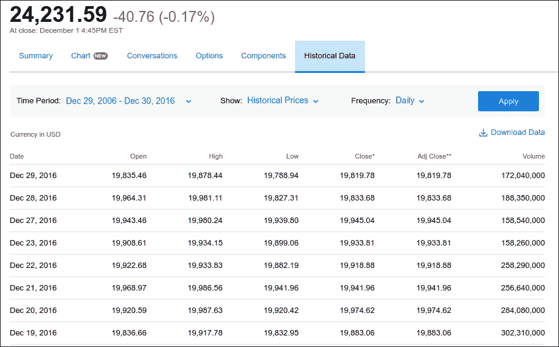

图 2.1：道琼斯工业平均指数价格雅虎财经页面

在这里，我们已下载了 2007-2016 年的数据集，这意味着我们拥有 10 年的道琼斯工业平均指数价格数据。您也可以在*图 2.1*中看到这一点。您可以使用以下 GitHub 链接找到这个数据集：[`github.com/jalajthanaki/stock_price_prediction/blob/master/data/DJIA_data.csv`](https://github.com/jalajthanaki/stock_price_prediction/blob/master/data/DJIA_data.csv)。

请稍等片刻；我们将理解本章“理解数据集”部分中每个数据属性的意义。现在，让我们看看我们如何收集新闻文章。

## 收集新闻文章

我们想要收集新闻文章，以便我们可以建立新闻如何影响道琼斯工业平均指数（DJIA）值之间的相关性。我们将对新闻文章进行情感分析。您可能会想知道为什么我们需要进行情感分析。如果任何新闻对金融市场有负面影响，那么股票价格很可能会下降；如果有关金融市场的新闻是积极的，那么股票价格很可能会上涨。对于这个数据集，我们将使用《纽约时报》（NYTimes）的新闻文章。为了收集新闻文章数据集，我们将使用《纽约时报》的开发者 API。那么，让我们开始编码吧！

首先，您需要在《纽约时报》开发者网站上注册并生成您的 API 密钥。链接是[`developer.nytimes.com/signup`](https://developer.nytimes.com/signup)。我已经为存档 API 生成了 API 密钥。在这里，我们使用*newsapi, JSON, requests*和*sys*依赖项。您也可以通过以下链接参考《纽约时报》开发者文档：[`developer.nytimes.com/archive_api.json#/Documentation/GET/%7Byear%7D/%7Bmonth%7D.json`](https://developer.nytimes.com/archive_api.json#/Documentation/GET/%7Byear%7D/%7Bmonth%7D.json)。

您可以在以下 GitHub 链接找到代码：[`github.com/jalajthanaki/stock_price_prediction/blob/master/getdata_NYtimes.py`](https://github.com/jalajthanaki/stock_price_prediction/blob/master/getdata_NYtimes.py)。您可以在下面的屏幕截图中看到代码片段：

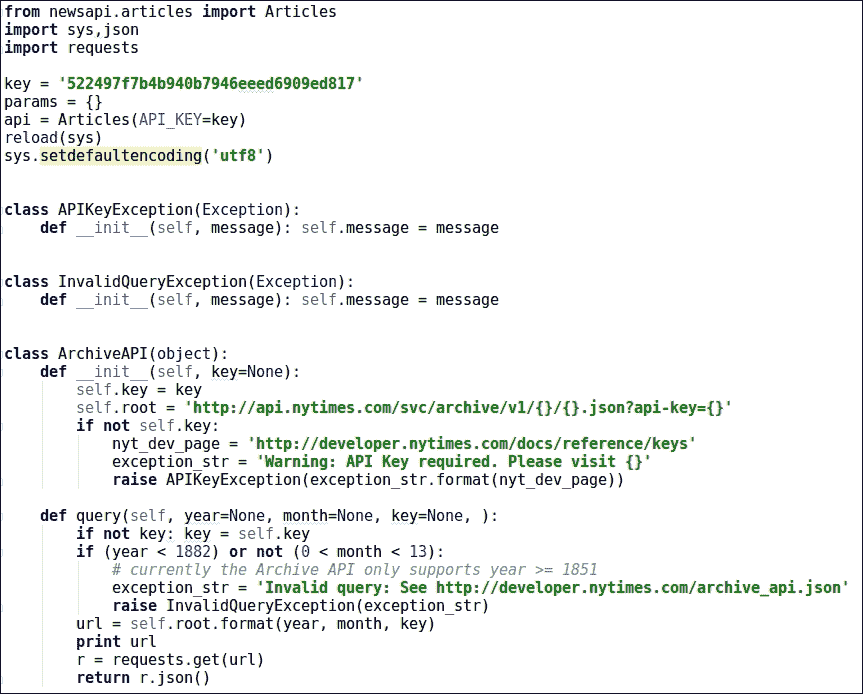

图 2.2：从《纽约时报》获取新闻文章数据的代码片段

如您在代码中所见，有三个方法。前两个方法是用于异常处理，第三个方法用于验证并请求为我们生成新闻文章数据的 URL。这个《纽约时报》API URL 需要三个参数，如下所示：

+   年份

+   月份

+   API 密钥

在这一步之后，我们将调用第三个函数，并传递从 2007 年到 2016 年的年份值。我们将以*JSON*格式保存数据。您可以在下面的屏幕截图中的代码片段中参考：

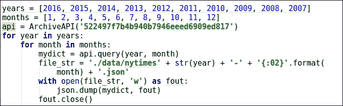

图 2.3：从《纽约时报》获取新闻文章数据的代码片段

您可以使用以下 GitHub 链接找到原始 JSON 数据集：[`github.com/jalajthanaki/stock_price_prediction/blob/master/data/2016-01.json`](https://github.com/jalajthanaki/stock_price_prediction/blob/master/data/2016-01.json)。

现在，让我们进入下一节，我们将了解我们迄今为止收集的数据集和属性。

# 理解数据集

在本节中，我们将了解数据属性的含义，这将帮助我们了解我们将要处理的数据集类型以及数据集需要进行的预处理类型。我们将在两个部分中理解我们的数据集，如下所示：

+   理解道琼斯工业平均指数（DJIA）数据集

+   理解《纽约时报》新闻文章数据集

## 理解道琼斯工业平均指数数据集

在道琼斯工业平均指数数据集中，我们有七个数据属性。它们很容易理解，所以让我们逐一查看它们：

+   `Date`: 第一列表示在.YYMMDD 格式的.csv 文件中看到的数据的日期。

+   `Open`: 这表示市场开盘时的价格，因此它是特定交易日的道琼斯工业平均指数的开盘值。

+   `High`: 这是特定交易日的道琼斯工业平均指数的最高价格。

+   `Low`: 这是特定交易日的道琼斯工业平均指数的最低价格。

+   `Close`: 交易日的道琼斯工业平均指数收盘价。

+   `Adj close`: 调整后的收盘价（adj close price）以收盘价为基础，并考虑诸如股息、股票分割和新股票发行等因素。调整后的收盘价代表了道琼斯工业平均指数的真实反映。让我给你举一个例子，以便你能更好地理解调整后的收盘价：如果一家公司提供每股 5 美元的股息，并且该公司的股票收盘价为 100 美元，那么调整后的收盘价将变为 95 美元。因此，调整后的收盘价考虑了各种因素，并根据这些因素生成公司股票的真实价值。在这里，我们关注的是道琼斯工业平均指数的价值，所以，大多数情况下，收盘价和调整后的收盘价是相同的。

+   `Volume`: 这些值表示特定交易日在交易所交易的数量。

这些是道琼斯工业平均指数数据集的基本细节。我们使用历史数据并尝试预测道琼斯工业平均指数的未来走势。

在下一节中，我们将查看《纽约时报》新闻文章数据集。

## 理解《纽约时报》新闻文章数据集

我们已经使用了《纽约时报》开发者 API，并以 JSON 形式收集了新闻文章，因此，在这里，我们将查看 JSON 响应，以便我们可以识别出最重要的数据属性，并集中关注。在下一张图中，你可以看到我们从《纽约时报》得到的 JSON 响应：

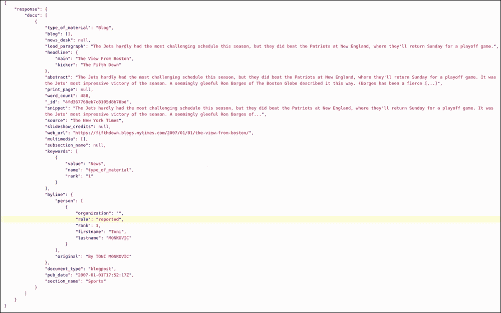

图 2.4：使用《纽约时报》开发者工具的新闻文章的 JSON 响应

在这个图表中，我们可以看到单篇新闻文章的 JSON 响应。正如你所见，有一个主要数据属性响应，它携带了所有其他数据属性。我们将关注 docs 数组内部给出的数据属性。不用担心；我们不会使用所有数据属性。在这里，我们将关注以下数据属性：

+   `type_of_material`: 此属性表示特定的新闻文章是从某种特定的来源中提取的，无论是博客、新闻文章、分析等等。

+   `headlines`: 标题数据属性有两个子数据属性。主要数据属性包含新闻的实际标题，而 kicker 数据属性则传达文章的亮点。

+   `pub_date`: 这个数据属性表示新闻文章的发布日期。你可以在文档数组的倒数第二部分找到这个属性。

+   `section_name`: 这个数据属性出现在前面图像的最后一部分。它提供了新闻文章的类别。

+   `news_desk`: 这个数据属性也指示新闻类别。当响应中缺少`section_name`时，我们将参考这个属性。

正确理解数据属性后，我们应该继续到下一部分，即数据预处理和数据分析部分。

# 数据预处理和数据分析

在本节中，我们将主要介绍数据预处理和数据分析。作为数据预处理的一部分，我们正在准备我们的训练数据集。你可能想知道我所说的数据准备是什么，考虑到我们已经有数据了。让我告诉你，我们有两个不同的数据集，并且这两个数据集都是独立的。因此，我们需要合并道琼斯工业平均指数数据集和纽约时报新闻文章数据集，以便从这些数据集中获得有意义的见解。一旦我们准备好了训练数据集，我们就可以使用不同的机器学习（ML）算法来训练数据。

现在我们开始编写代码来准备训练数据集。我们将使用`numpy`、`csv`、`JSON`和`pandas`作为我们的依赖库。在这里，我们的代码分为两部分。首先，我们将为道琼斯指数数据集准备数据集，然后我们将转到下一部分，即准备纽约时报新闻文章数据集。在准备训练数据集的过程中，我们将编写基本的数据分析步骤。

## 准备道琼斯工业平均指数训练数据集

你可以在下面的屏幕截图中看到代码片段。你可以在以下 GitHub 链接中找到代码：[`github.com/jalajthanaki/stock_price_prediction/blob/master/datapreparation.ipynb`](https://github.com/jalajthanaki/stock_price_prediction/blob/master/datapreparation.ipynb)。

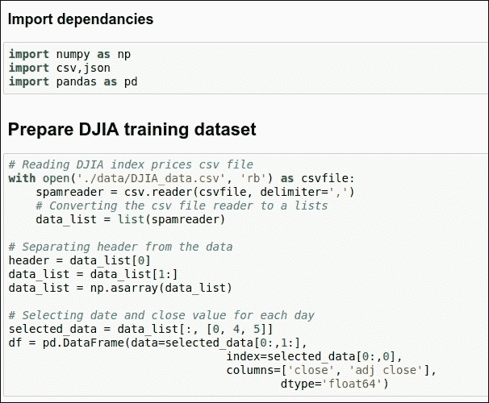

图 2.5：准备道琼斯工业平均指数数据集的代码片段

正如你在前面的代码片段中看到的，我们正在读取我们从雅虎财经页面下载的 csv 文件。之后，我们将数据转换为列表格式。我们还从列表中分离了标题和实际数据。一旦我们有了列表格式的数据，我们将数据转换为 numpy 数组。我们从 DIJA 数据集中选择了仅三个列，如下所示：

+   日期

+   收盘价

+   调整后收盘价

您可能有一个疑问：为什么我们只考虑了 DJIA csv 文件中的收盘价和调整后的收盘价？让我澄清一下：正如我们所知，开盘价通常是前一天收盘价的一个附近值，所以我们没有考虑开盘价。我们没有考虑最高价和最低价，因为我们不知道这些最高价和最低价发生在哪个特定的时间戳。对于第一次迭代来说，预测股票指数何时达到高或低值相当复杂，所以，在此期间，我们忽略这两个列。我们主要对 DJIA 指数的整体趋势感兴趣。如果我们能精确地找出趋势，我们就可以在以后预测高和低的价格值。在这里，我们限制我们的目标为预测未来交易日的 DJIA 指数的收盘价。

现在回到编码部分：我们以这种方式构建了 pandas 数据框，使得日期列作为索引列，而收盘价和调整后的收盘价是数据集的两个其他列。您可以在代码片段中看到以`df`变量形式定义的数据框的输出，该代码片段见*图 2.5*。您可以在以下图中看到数据框 df 的输出：

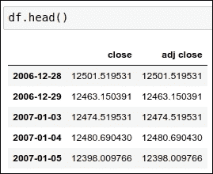

图 2.6：pandas 数据框的输出，该数据框在图 2.5 的代码片段中定义为*df*变量

希望现在您已经清楚地理解了我们迄今为止所遵循的步骤。我们已经创建了基本的数据框，所以现在我们将继续进行 DJIA 数据集的基本数据分析部分。

## DJIA 数据集的基本数据分析

在本节中，我们将对 DJIA 数据集进行基本数据分析。这个数据集有日期值，但如果您仔细查看日期值，您会发现有一些缺失的日期。假设数据缺失于 2006 年 12 月 30 日、31 日、2007 年 1 月 1 日以及许多其他日期。在这种情况下，我们将添加缺失的日期值。您可以参考图 2.7 中的代码片段，以及在此 GitHub 上找到此代码：[`github.com/jalajthanaki/stock_price_prediction/blob/master/datapreparation.ipynb`](https://github.com/jalajthanaki/stock_price_prediction/blob/master/datapreparation.ipynb)。

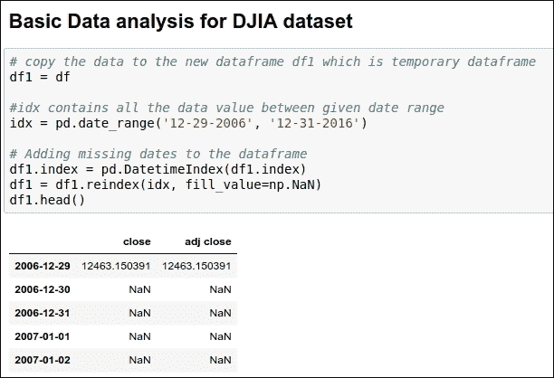

图 2.7：在 DJIA 数据集中添加所有缺失日期值的代码片段

如前图所示，我们在添加这些缺失的日期值之后遇到了另一个挑战。我们已经添加了日期值，但是没有对应每个日期的收盘价或调整后的收盘价，因此我们需要逻辑地替换 NaN 值，而不是随机替换。

为了替换收盘价和调整后收盘价的 NaN 值，我们将使用 pandas 插值功能。我们使用线性插值生成 NaN 的缺失值。有几种插值类型可用，但在这里我们使用线性插值，线性插值的数学方程如下：

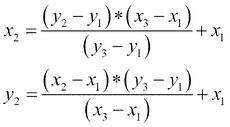

公式 2.1：线性插值数学公式

如果两个已知点由坐标(x1,y_1)和(x_3,y_3)给出，线性插值是这两个点之间的直线。

你可以参考以下截图中的代码片段：

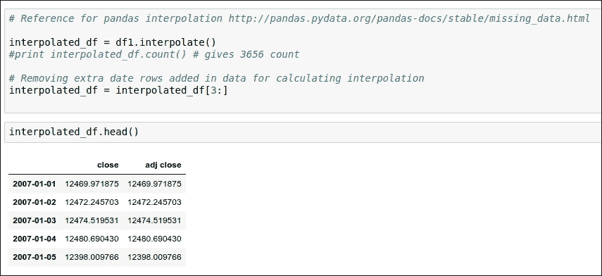

图 2.8：基本数据分析与插值实现的代码片段

此代码可在 GitHub 上找到：[`github.com/jalajthanaki/stock_price_prediction/blob/master/datapreparation.ipynb`](https://github.com/jalajthanaki/stock_price_prediction/blob/master/datapreparation.ipynb)。

如代码片段所示，我们尚未定义应在我们的数据集上执行哪种类型的插值；在这种情况下，默认执行了线性插值。因此，在应用线性插值后，我们可以用实际的逻辑值替换 NaN 值。我们还删除了 2006 年的三条记录。因此，现在我们总共有 3653 条记录。

这是我们为道琼斯工业平均指数（DJIA）数据集所做的基本数据预处理和数据分析。现在让我们继续到纽约时报新闻文章数据集。首先，我们需要准备训练数据集，所以让我们从这里开始。

## 准备纽约时报新闻数据集

在本节中，我们将了解如何准备纽约时报新闻数据集。我们已经下载了整个新闻文章数据集，但我们还没有添加选择新闻文章类别的过滤机制。在准备纽约时报数据集时，请执行以下步骤：

1.  将发布日期转换为 YYYY-MM-DD 格式。

1.  通过类别过滤新闻文章。

1.  实现过滤功能并合并数据集。

1.  将合并后的数据集保存为 pickle 文件格式。

因此，让我们开始为每个步骤编写代码。

### 将发布日期转换为 YYYY-MM-DD 格式

首先，我们将新闻文章的发布日期转换为 YYYY-MM-DD 格式，以便我们可以在以后合并道琼斯工业平均指数（DJIA）和纽约时报新闻文章数据集。为了实现这一点，你可以参考以下代码片段：

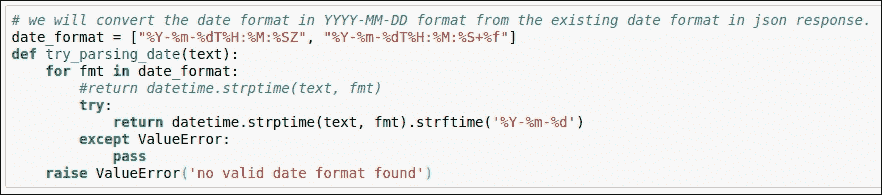

图 2.9：转换新闻文章发布日期格式的代码片段

在这里，我们编写了一个可以将发布日期格式解析并转换为必要的 YYYY-MM-DD 格式的函数。稍后当我们读取存储 JSON 响应的 JSON 文件时，我们将调用此函数。

### 通过类别过滤新闻文章

我们在这里要做的另一件事是按新闻类别过滤我们的新闻文章数据集。我们下载了所有类型的新闻文章，但为了股票市场价格预测应用程序，我们需要属于特定新闻类别的新闻文章。因此，我们需要实现过滤器，帮助我们提取必要的新闻文章子集。您可以在以下代码片段中参考：

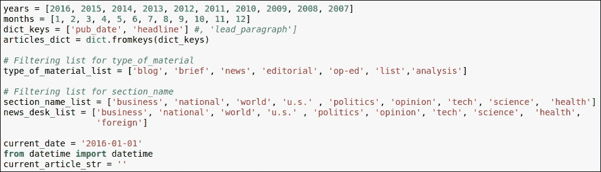

图 2.10：按类别过滤新闻文章的代码片段

您可以参考以下 GitHub 链接提供的代码：[`github.com/jalajthanaki/stock_price_prediction/blob/master/datapreparation.ipynb`](https://github.com/jalajthanaki/stock_price_prediction/blob/master/datapreparation.ipynb).

如前图所示，我们正在提取属于以下新闻类别的新闻文章：

+   商业

+   国内

+   世界

+   美国

+   政治

+   评论

+   科技

+   科学

+   健康

+   外国

### 实现过滤器功能并合并数据集

现在，我们需要迭代每个 JSON 文件，并提取上一节中定义的新闻类别之一的新闻文章。您可以参考实现过滤器功能的代码片段。在即将到来的代码片段中，您还可以找到合并道琼斯工业平均指数（DJIA）数据集和纽约时报新闻文章数据集的实现。为了合并这两个数据集，我们将每个新闻文章的标题添加到 pandas 数据框中，然后我们将从这个数据框生成我们的最终训练数据集。此功能在以下屏幕截图中显示：

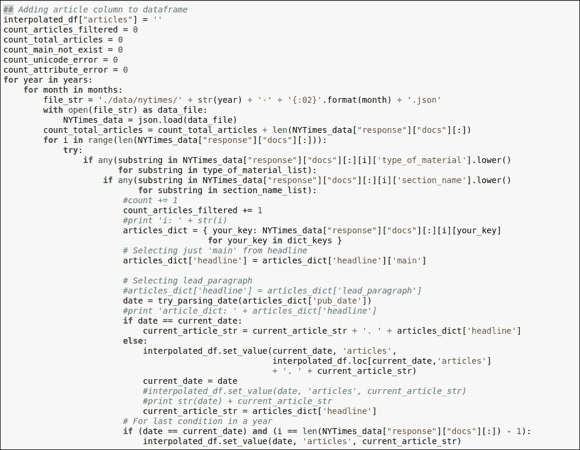

图 2.11：过滤和合并功能的代码片段

我们还编写了一部分异常处理功能。这样做是为了如果任何 JSON 响应没有 data 属性中的 section_name、news_desk 或 type_of_material 的值，则此代码将抛出异常。您可以在以下屏幕截图中查看代码片段：

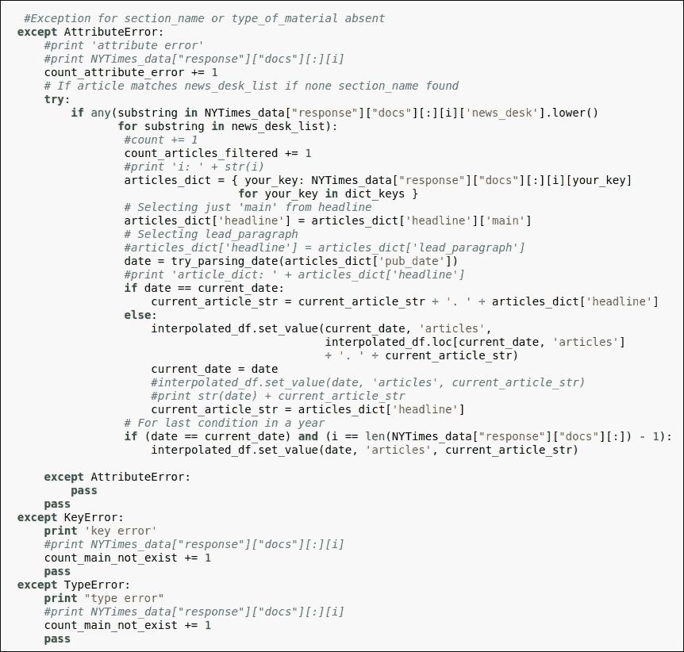

图 2.12：异常处理的实现

我们还将考虑没有`section_name`和`news_desk`的新闻文章。我们将把所有新闻文章的标题添加到我们的数据集中，并将它们放入 pandas 数据框中。您可以在以下屏幕截图中看到代码片段：

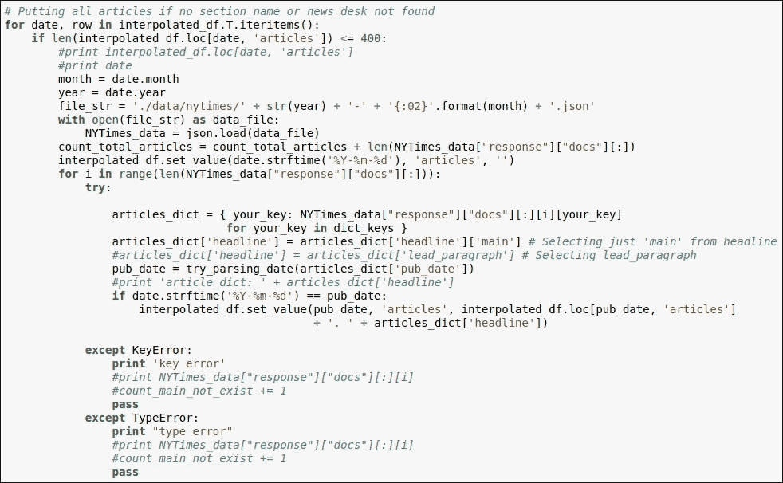

图 2.13：处理没有 section_name 和 news_desk 的新闻文章

您可以在下面的屏幕截图中以 pandas 数据框的形式看到最终的合并数据集：

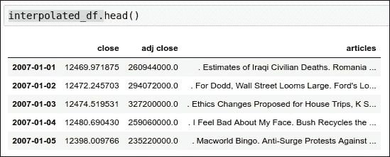

图 2.14：最终合并的训练数据集

在这里，对于每个日期，我们对应所有属于商业、国家、世界、美国、政治、观点、科技、科学和健康类别的新闻标题。我们已下载了 1,248,084 篇新闻文章，并从中考虑了 461,738 篇新闻文章用于我们的模型。

您可以通过此 GitHub 链接访问代码：[`github.com/jalajthanaki/stock_price_prediction/blob/master/datapreparation.ipynb`](https://github.com/jalajthanaki/stock_price_prediction/blob/master/datapreparation.ipynb).

### 将合并后的数据集保存为 pickle 文件格式

一旦我们合并了数据，我们需要保存数据对象，因此我们将使用 Python 的 pickle 模块。Pickle 帮助我们序列化和反序列化数据。Pickle 依赖库运行速度快，因为大部分是用 C 语言编写的，就像 Python 解释器本身一样。在这里，我们将我们的训练数据集保存为`.pkl`文件格式。您可以参考以下代码片段*：

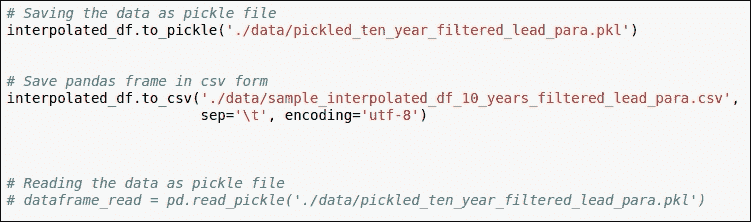

图 2.15：将数据保存为 pickle 格式的代码片段

我们已将数据集保存为`pickled_ten_year_filtered_lead_para.pkl`文件。您可以在 GitHub 上找到代码：[`github.com/jalajthanaki/stock_price_prediction/blob/master/datapreparation.ipynb`](https://github.com/jalajthanaki/stock_price_prediction/blob/master/datapreparation.ipynb).

在下一节中，我们将主要关注特征工程部分。我们还将进行一些小的数据清洗步骤。所以，让我们跳到下一节。

# 特征工程

如前所述，我们想要预测特定交易日的道琼斯工业平均指数的收盘价。在本节中，我们将根据我们的直觉进行特征选择，以构建我们的基本股价预测模型。我们已经生成了训练数据集。因此，现在我们将加载保存的.pkl 格式数据集，并执行特征选择以及一些小的数据处理。我们还将为每个过滤后的《纽约时报》新闻文章生成情感分数，并使用这个情感分数来训练我们的基线模型。我们将使用以下 Python 依赖项：

+   numpy

+   pandas

+   nltk

本节包含以下步骤：

1.  加载数据集

1.  小型预处理

1.  特征选择

1.  情感分析

那么，让我们开始编码！

## 加载数据集

我们已将数据保存为 pickle 格式，现在我们需要从其中加载数据。您可以参考以下代码片段*：

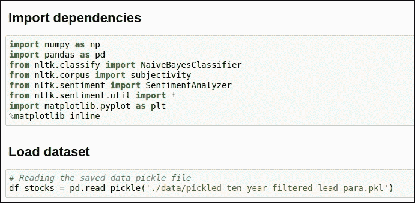

图 2.16：从 pickle 文件加载数据的代码片段

您可以通过点击此 GitHub 链接来查看代码：[`github.com/jalajthanaki/stock_price_prediction/blob/master/Stock_Price_Prediction.ipynb`](https://github.com/jalajthanaki/stock_price_prediction/blob/master/Stock_Price_Prediction.ipynb).

如您所见，在数据框输出中，整个数据集中的每篇文章标题前都有一个点（.），因此我们需要移除这些点。我们将在下一节中执行此更改。

## 微小预处理

作为预处理的一部分，我们将执行以下两个更改：

+   将调整后的收盘价转换为整数格式

+   从新闻标题中移除最左侧点（.）

### 将调整后的收盘价转换为整数格式

我们知道调整后的收盘价是浮点格式。因此，在这里我们将浮点值转换为整数格式，并将转换后的值作为*prix*属性存储在我们的 pandas 数据框中。现在，您可能想知道为什么我们只考虑调整后的收盘价。请稍等片刻，我将给出原因。您可以在下面的屏幕截图中的代码片段中找到收敛代码：

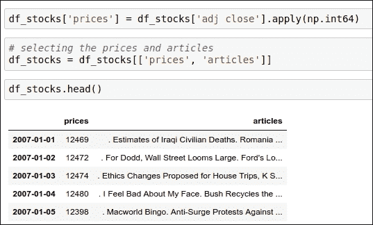

图 2.17：将调整后的收盘价转换为整数格式的代码片段

### 小贴士

您可以参考以下 GitHub 链接中的代码：[`github.com/jalajthanaki/stock_price_prediction/blob/master/Stock_Price_Prediction.ipynb`](https://github.com/jalajthanaki/stock_price_prediction/blob/master/Stock_Price_Prediction.ipynb).

现在，让我们继续进行第二个更改。

### 从新闻标题中移除最左侧点

在本节中，我们将看到移除最左侧点的实现。我们将使用`lstrip()`函数来移除点。您可以在下面的屏幕截图中的代码片段中参考：

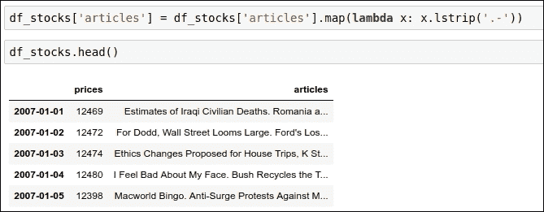

图 2.18：从新闻文章标题中移除*点*的代码片段

### 小贴士

您可以参考以下 GitHub 链接中的代码：[`github.com/jalajthanaki/stock_price_prediction/blob/master/Stock_Price_Prediction.ipynb`](https://github.com/jalajthanaki/stock_price_prediction/blob/master/Stock_Price_Prediction.ipynb).

现在，让我们继续下一节，这一节是特征工程。

## 特征工程

特征选择是特征工程和任何**机器学习**（**ML**）应用最重要的方面之一。因此，我们将重点关注特征选择。在前一节中，我提出了为什么我们只选择*调整后的收盘价*而不是*收盘价*的问题。这个问题的答案在于特征选择。我们选择*调整后的收盘价*，因为这些价格能让我们更好地了解道琼斯工业平均指数的最后一个价格，包括股票、共同基金、股息等。在我们的数据集中，*收盘价*大多与*调整后的收盘价*相同，在未来，如果我们考虑未见过的新数据记录的*收盘价*，我们无法推导出*调整后的收盘价*，因为它可能等于*收盘价*或高于*收盘价*，道琼斯工业平均指数的*调整后的收盘价*可能高于*收盘价*，因为它将包括股票、共同基金、股息等。但我们不知道在只考虑*收盘价*的未见过数据集中，它将高出多少。所以如果我们考虑*调整后的收盘价*，那么我们将知道*收盘价*可能小于或等于*调整后的收盘价*，但不会超过*调整后的收盘价*。*调整后的收盘价*是收盘价可能的最大值。因此，我们考虑了*调整后的收盘价*进行开发。对于基线模型，我们将考虑*调整后的收盘价*。我们将列名重命名为*price*。您可以参考以下代码片段：

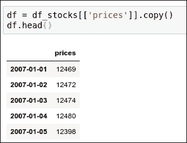

图 2.19：将调整后的收盘价作为特征选择一部分的代码片段

作为下一步，我们现在将对新闻文章数据集进行情感分析。我们可以在训练模型时使用情感得分。所以，让我们继续进行情感分析部分。

## 对《纽约时报》新闻文章进行情感分析

为了实现情感分析，我们使用了 nltk 内置的情感分析模块。我们将获得负面、正面和复合情感得分。我们使用了基于词典的方法。在基于词典的方法中，分析每个句子的单词，并根据`sentiwordnet`得分，每个单词被赋予一个特定的情感得分；然后，决定句子级别的聚合得分。

### 注意

Sentiwordnet 是包含单词情感得分的词典。

我们将在第五章中详细介绍与情感分析相关的细节，*情感分析*。您可以参考以下情感分析代码片段：

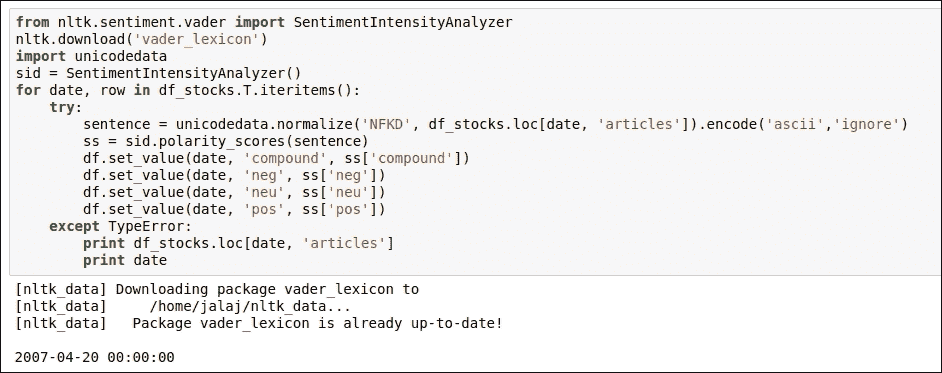

图 2.20：情感分析代码片段

所有的得分都由前面的代码生成并存储在数据框中，因此您可以在以下屏幕截图中看到新闻文章标题的聚合得分：*

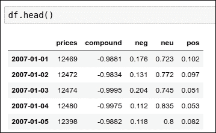

图 2.21：存储在数据框中的聚合情感分析得分

到本节结束时，我们将获得 NYTimes 新闻文章数据集的情感分数，并将这些情感分数作为训练数据集的一部分。到目前为止，我们已经进行了轻微的预处理，根据我们的直觉选择了数据属性，并生成了情感分数。现在，我们将选择机器学习算法，并尝试构建基线模型。因此，让我们进入下一节。

# 选择机器学习算法

在本节中，我们将根据我们的直觉选择机器学习（ML）算法，然后使用我们的训练数据集进行训练。这是本章的第一个模型，因此训练的模型是我们的基线模型，我们将在以后对其进行改进。因此，让我们决定哪种 ML 算法适合这个股价预测应用。

股价预测应用是一个时间序列分析问题，我们需要预测时间序列中的下一个点。这种预测活动类似于线性回归，因此我们可以说这个应用是一种回归问题，回归家族中的任何算法都应该适用。让我们选择集成算法，即*RandomForestRegressor*，来开发我们的基线模型。因此，让我们训练我们的基线模型，并根据该模型的结果，我们将修改我们的方法。

# 训练基线模型

如你所知，我们已经选择了**RandomForestRegressor**算法。我们将使用 scikit-learn 库来训练模型。以下是我们需要遵循的步骤：

1.  分割训练和测试数据集

1.  将训练和测试数据集的预测标签分开

1.  将情感分数转换为 numpy 数组

1.  训练机器学习模型

因此，让我们逐一实现这些步骤。

## 分割训练和测试数据集

我们有 10 年的数据值。因此，为了训练目的，我们将使用 8 年的数据，这意味着从 2007 年到 2014 年的数据集。为了测试目的，我们将使用 2 年的数据，这意味着 2015 年和 2016 年的数据。你可以参考以下截图中的代码片段以了解其实施：

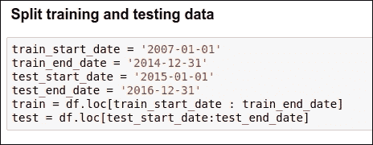

图 2.22：分割训练和测试数据集

如前述截图所示，我们的训练数据集已存储在 train 数据框中，而我们的测试数据集已存储在 test 数据框中。

## 将训练和测试数据集的预测标签分开

在我们分割训练和测试数据集的同时，我们还需要单独存储调整后的收盘价，因为我们需要预测这些*调整后的收盘价*（在代码中标记为`prices`）；这些价格值是我们训练数据的标签，这种训练成为监督训练，因为我们将以标签的形式提供实际的价格。你可以参考以下代码以了解其实施：

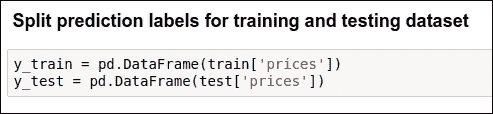

图 2.23：分割训练和测试数据集的预测标签

在这里，除了价格以外的所有属性都是以特征向量格式给出的，而价格是以标签的形式。ML 算法接受这个特征向量，标记这对数据，学习必要的模式，并预测未见数据的价格。

## 将情感分数转换为 numpy 数组

在我们开始训练之前，还有一个最后、必要的问题需要我们记住：我们将情感分析分数转换为 numpy 数组格式。这是因为一旦我们将价格属性设置为预测标签，我们的特征向量将只包含情感分数和日期。因此，为了生成一个合适的特征向量，我们将情感分数转换为 numpy 数组。实现此功能的代码片段在以下截图提供：

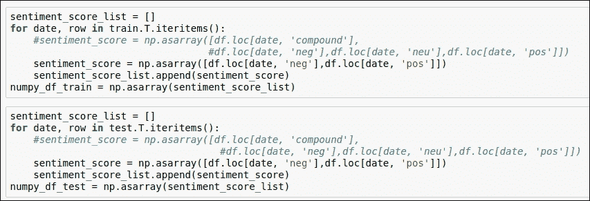

图 2.24：将情感分析分数转换为 numpy 数组的代码片段

如您从代码片段中可以看到，我们对训练数据集和测试数据集都执行了相同的转换操作。

### 注意

注意，如果您得到一个值错误，请检查数据集，因为可能存在数据集中某一列有空白或空值的情况。

现在，让我们训练我们的模型！

## ML 模型的训练

在第一次迭代中，我们使用的是作为 scikit-learn 依赖部分提供的 RandomForestRegressor 算法。您可以在以下截图找到此代码：

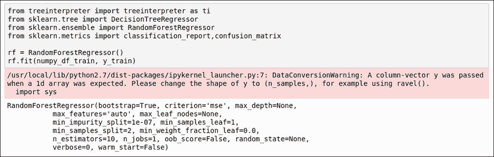

图 2.25：使用 RandomForestRegressor 进行训练的代码片段

如您从前面的截图中所见，我们已经为我们的超参数使用了所有默认值。有关超参数的更详细描述，您可以参考[`scikit-learn.org/stable/modules/generated/sklearn.ensemble.RandomForestRegressor.html`](http://scikit-learn.org/stable/modules/generated/sklearn.ensemble.RandomForestRegressor.html)。

现在我们已经训练了模型，我们需要使用我们的测试数据集来测试它。在我们测试之前，让我们讨论我们将采取的测试模型的方法。

# 理解测试矩阵

在本节中，我们将了解测试矩阵和可视化方法来评估训练好的 ML 模型的表现。所以让我们了解这两种方法，它们如下：

+   默认测试矩阵

+   可视化方法

## 默认测试矩阵

我们使用 scikit-learn 的默认分数 API 来检查 ML 的表现如何。在这个应用程序中，分数函数是平方误差和的系数。它也被称为 R2 系数，其定义如下方程：

这里，*u* 表示残差平方和。*u* 的方程如下：

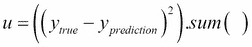

变量 *v* 表示平方和的总和。*v* 的方程如下：

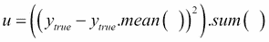

最佳可能分数是 1.0，它也可以是负分数。负分数表示训练模型可以任意糟糕。一个始终预测标签 *y* 的预期值，而忽略输入特征的恒定模型将产生 R2 分数为 0.0。

为了获得分数，我们只需调用分数函数。测试的代码将与“测试基线模型”部分中的代码相同。现在让我们看看另一种有助于理解输出与真实测试标签的测试方法。那么，让我们来看看吧！

## 可视化方法

在本节中，我们将探讨一种有效且直观的方法，即预测输出与实际输出的**可视化**。这种方法提供了很多洞察力，因为图表易于理解，你可以决定下一步如何改进模型。

在这个应用中，我们将使用测试数据集中的实际价格和预测价格，这将表明预测的好坏。你将在下一节中找到这个过程的相关代码和图表，该节名为“测试基线模型”。

# 测试基线模型

在本节中，我们将实现测试方法，以便评估我们模型的准确性。我们首先生成输出预测，然后开始测试。以下是我们将在这里实施的步骤：

1.  生成和解释输出

1.  生成分数

1.  可视化输出

## 生成和解释输出

为了生成预测，我们正在使用 `treeinterpreter` 库。我们使用以下代码为测试数据集中的每条记录预测价格值：

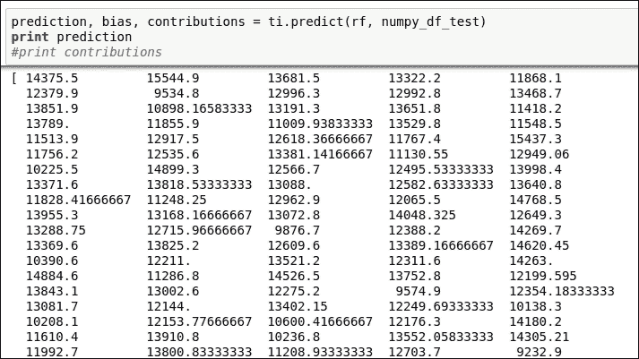

图 2.26：生成预测的代码片段

这里，*prediction* 是一个数组，其中包含与测试数据集中所有记录对应的预测 *adj close price* 元素。现在，我们将比较这个预测输出与测试数据集的实际 *adj close price*。通过这样做，我们将了解我们的第一个模型在预测 *adj close price* 方面的准确性。为了进一步评估，我们将生成准确度分数。

## 生成准确度分数

在本节中，我们将根据“默认测试矩阵”部分提供的方程生成准确度分数。相应的代码如下：

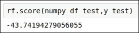

图 2.27：为测试数据集生成分数的代码片段

如前述代码片段所示，我们的模型表现并不太好。在这个阶段，我们还不知道我们犯了什么错误或者出了什么问题。当你试图解决或构建一个机器学习模型时，这种情况很常见。我们可以使用可视化技术更好地把握问题。

## 可视化输出

在本节中，我们将使用可视化图表。使用图表，我们将识别我们犯的错误类型，以便我们可以在下一次迭代中修复这个错误。我们将绘制一个图表，其中*Y 轴*代表*调整后的收盘价*，而*X 轴*代表*日期*。我们在图表上绘制*实际价格*和*预测价格*，以便我们大致了解我们的算法表现如何。我们将使用以下代码片段生成图表：

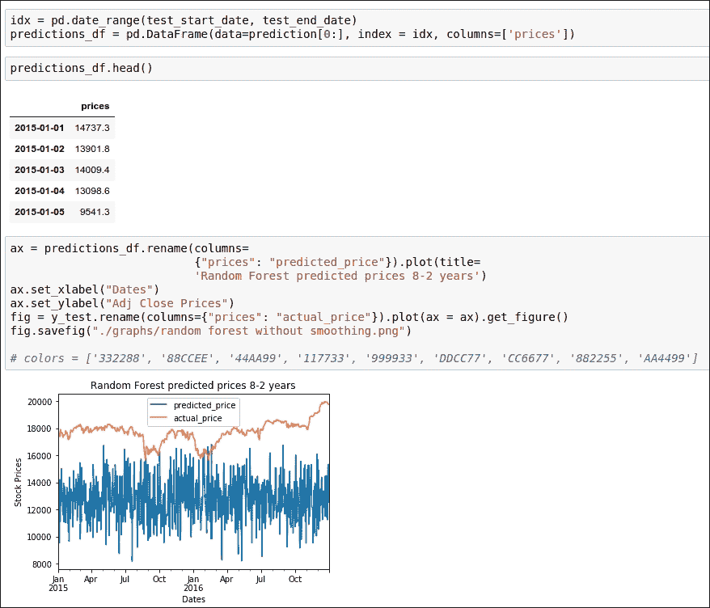

图 2.28：生成预测价格与实际价格对比图的代码片段。

如前述图表所示，最上面的单行（橙色）代表实际价格，而线下的杂乱尖峰（蓝色）代表预测价格。从这个图中，我们可以总结出我们的模型无法正确预测价格。在这里，你可以看到实际价格和预测价格并没有对齐。我们需要解决这个问题。有一些技术我们可以尝试，比如对齐、平滑和尝试不同的算法。所以，让我们在下一节中讨论这个方法的问题。

### 备注

你可以从 GitHub 链接[`github.com/jalajthanaki/stock_price_prediction/blob/master/Stock_Price_Prediction.ipynb`](https://github.com/jalajthanaki/stock_price_prediction/blob/master/Stock_Price_Prediction.ipynb)中获取这个主题的完整代码。

# 探索现有方法的问题

在本节中，我们将讨论现有方法的问题。我们可能犯的主要有三个错误，如下列所示：

+   对齐

+   平滑

+   尝试不同的机器学习算法

让我们逐一点讨论每个问题。

## 对齐

正如我们在图中看到的，我们的实际价格和预测价格并没有对齐。这成为一个问题。我们需要对股票的价格进行对齐。我们需要考虑我们数据集的平均值，并根据这个平均值生成对齐。你可以在接下来的名为*基于对齐的方法*的部分中了解更多关于对齐的信息。

## 平滑

我感觉我们第一个模型存在的问题是，我们没有应用任何平滑技术。所以，对于我们的模型，我们也需要应用平滑技术。我们将使用**指数加权移动平均**（**EWMA**）技术进行平滑。这种技术用于调整数据集的方差。

## 尝试不同的机器学习算法

对于我们的模型，我们使用了 `RandomForestRegressor` 算法。但如果我们尝试使用不同的算法，比如 *逻辑回归* 来做同样的事情，会怎样呢？在下节中，你将学习如何实现这个算法——当然是在应用必要的对齐和平滑之后。

我们已经看到了我们第一个基线方法可能存在的问题。现在，我们将尝试理解实现对齐、平滑和 `Logistic Regression` 算法的途径。

# 理解修订的方法

在本节中，我们将探讨对齐和平滑的关键概念和方法。实现 *逻辑回归* 算法并不困难；我们将使用 scikit-learn API。因此，我们将从理解实现的概念和方法开始。

## 理解概念和方法

在这里，我们将讨论对齐和平滑将如何工作。一旦我们理解了对齐和平滑的技术细节，我们将专注于基于逻辑回归的方法。

### 基于对齐的方法

使用这种方法，我们将使用一个常数来增加价格，以便我们的预测价格和测试数据集中的实际价格对齐。假设我们考虑 10 天。我们将生成价格的平均值。之后，我们生成第一个机器学习模型预测的价格的平均值。一旦我们生成了这两个平均值，我们需要减去这些值，得到的答案就是这 10 天的对齐值。

让我们用一个直观的工作示例来帮助你澄清思路。考虑从 2015 年 1 月 2 日到 1 月 11 日的 10 天。对于每条记录，你将取实际价格的平均值。假设这个数字将是 17,676，预测价格的平均值将是 13,175。在这种情况下，你将得到 4,501 的差异，这就是对齐的值。我们将把这个值添加到我们的测试数据集中，以便测试价格值和预测价格值对齐。你将在 *实现修订方法* 部分找到代码实现。

### 基于平滑的方法

在这种方法中，我们将使用 EWMA。**EWMA** 代表 **指数加权移动平均**。平滑方法基于加权平均的概念。一般来说，加权移动平均是通过以下方程计算的：

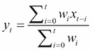

在这里，*x[t]* 是输入，*y[t]* 是输出。权重使用以下方程计算：

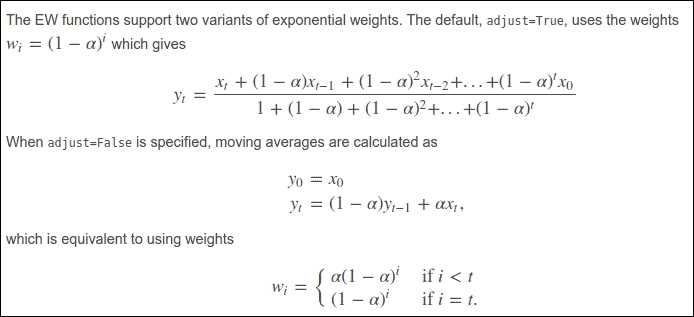

图 2.29：计算 EWMA 权重的方程

图片来源：[`pandas.pydata.org/pandas-docs/stable/computation.html#exponentially-weighted-windows`](http://pandas.pydata.org/pandas-docs/stable/computation.html#exponentially-weighted-windows)

在这里，α 是平滑常数。如果平滑常数的值较高，则它将接近实际值；如果平滑常数较低，则它将更平滑，但不会接近实际值。通常，在统计学中，平滑常数的范围在 0.1 到 0.3 之间。因此，我们可以使用平滑常数生成平滑值。

让我们用一个工作示例来演示。取平滑常数 = 0.3；如果实际值是 100，预测值是 110，那么平滑值可以通过以下公式获得，即（平滑常数 * 实际值）+（1-平滑常数）* 预测值。我们将获得的价值是 *(0.3* 100) + (1-0.3)*110 = 107*。更多信息，您可以参考[`pandas.pydata.org/pandas-docs/stable/computation.html#exponentially-weighted-windows`](http://pandas.pydata.org/pandas-docs/stable/computation.html#exponentially-weighted-windows)。

我们将在“实现改进方法”部分看到实际的代码级实现。pandas 已经有了 API，因此我们可以轻松实现 EWMA。

### 基于逻辑回归的方法

实现逻辑回归算法是一个简单的任务，因为我们只需要使用 scikit-learn API。对于测试数据集，我们将应用对齐和平滑。在评估准确度后，我们将决定是否需要更改机器学习算法。我们从直觉出发，逐渐改进我们的方法。我并不需要真正解释逻辑回归算法本身，但在实现过程中，我们将讨论重要点。

现在，是时候继续我们改进方法的具体实现部分了。让我们看看下一节。

# 实现改进的方法

在本节中，我们将讨论实现的三个部分，如下所述：

+   实现

+   测试改进的方法

+   理解改进方法中的问题

## 实现

在这里，我们正在实现以下内容：

+   对齐

+   平滑

+   逻辑回归

我们已经讨论了方法和关键概念，所以现在我们只需关注这里的代码部分。您可以在以下 GitHub 链接中找到所有代码：[`github.com/jalajthanaki/stock_price_prediction/blob/master/Stock_Price_Prediction.ipynb`](https://github.com/jalajthanaki/stock_price_prediction/blob/master/Stock_Price_Prediction.ipynb)。

### 实现对齐

对齐是在测试数据集上进行的。您可以参考以下代码片段：

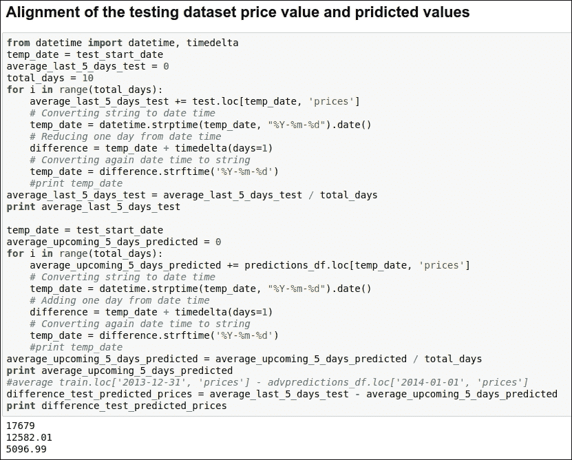

图 2.30：测试数据集上的对齐代码片段

如您在前面的代码片段中看到的，我们使用过去 5 天的平均价格和预测的下一个 5 天的平均价格来获得 10 天的*adj close price*差异，以便对齐测试数据。在这里，我们还把日期从字符串转换为日期格式。如您所见，5096.99 是测试预测价格中的差异，我们将将其添加到我们的预测*adj close price*值中。我们再次生成了图表，以便我们能够轻松理解对齐方法得到了很好的实现。您可以参考以下代码片段：

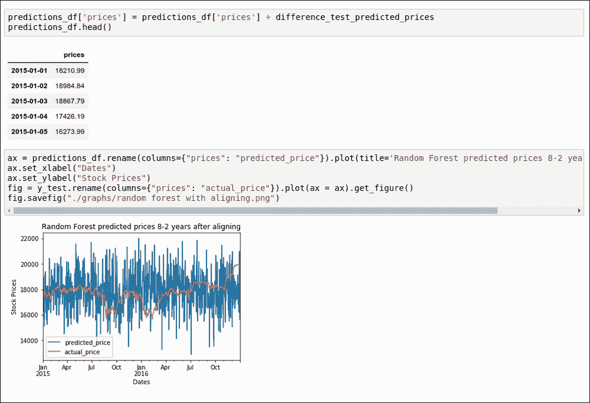

图 2.31：对齐方法的代码片段

如您在前面的代码片段中看到的，对齐图表显示我们的测试数据集价格和预测价格是对齐的。对齐图表的好处是，现在我们可以精确地定义`RandomForestRegressor`没有以高精度完成其工作，因为它的性能对于所有数据记录来说都不太理想。对齐图表为我们之前的迭代提供了一个清晰的画面。因此，当我们现在训练逻辑回归时，我们将使用对齐来评估预测价格。

### 实现平滑处理

我们使用 pandas EWMA API，时间跨度为 60 天，频率时间为*D.* 这个"D"表示我们在数据集中处理的是日期时间格式。您可以在以下代码片段中看到代码实现：

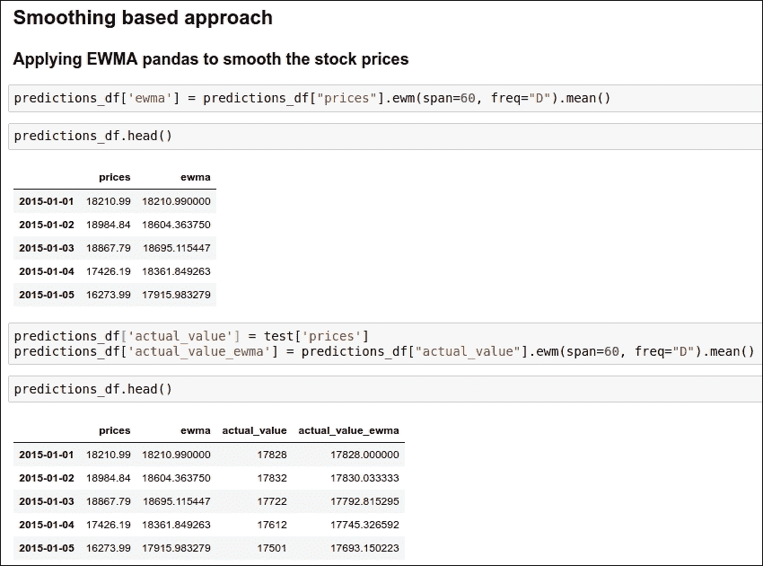

图 2.32：EWMA 平滑的代码片段

我们还在生成一个图表，其中包含*预测价格、平均预测价格、实际价格*和*平均实际价格*。您可以参考以下代码和图表：

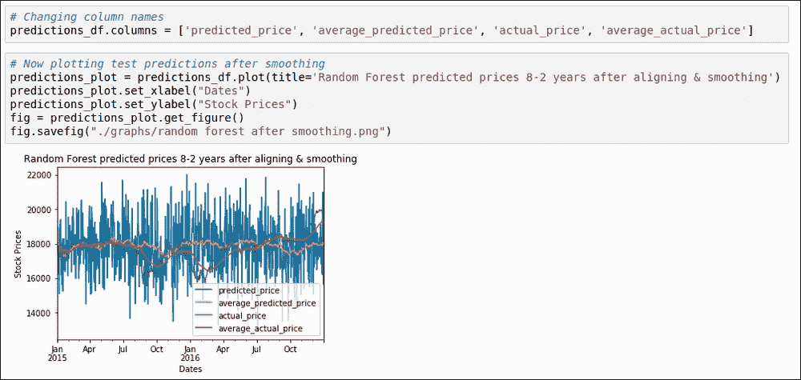

图 2.33：平滑后生成图表的代码片段

在这个图表中，您可以看到在平滑*平均预测价格*之后，曲线遵循*实际价格*的趋势。尽管准确性不是很高，但我们将会朝着积极的方向发展。如果我们想调整我们的算法，平滑技术将对我们很有用。您可以参考以下图表查看*平均预测价格与实际价格*：

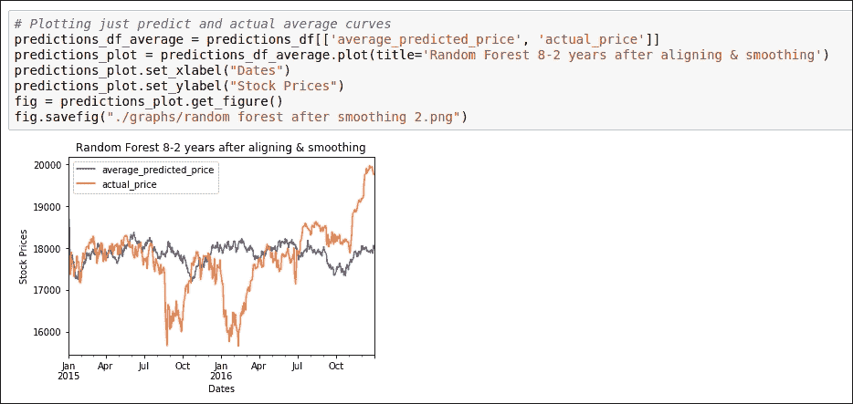

图 2.34：表示平均预测价格与实际价格的代码片段

通过参考前面的图表，我们可以指出我们应用了对齐和平滑，因为这有助于调整我们的机器学习模型以进行下一次迭代。

### 实现逻辑回归

在本节中，我们将实现逻辑回归。请看以下截图：

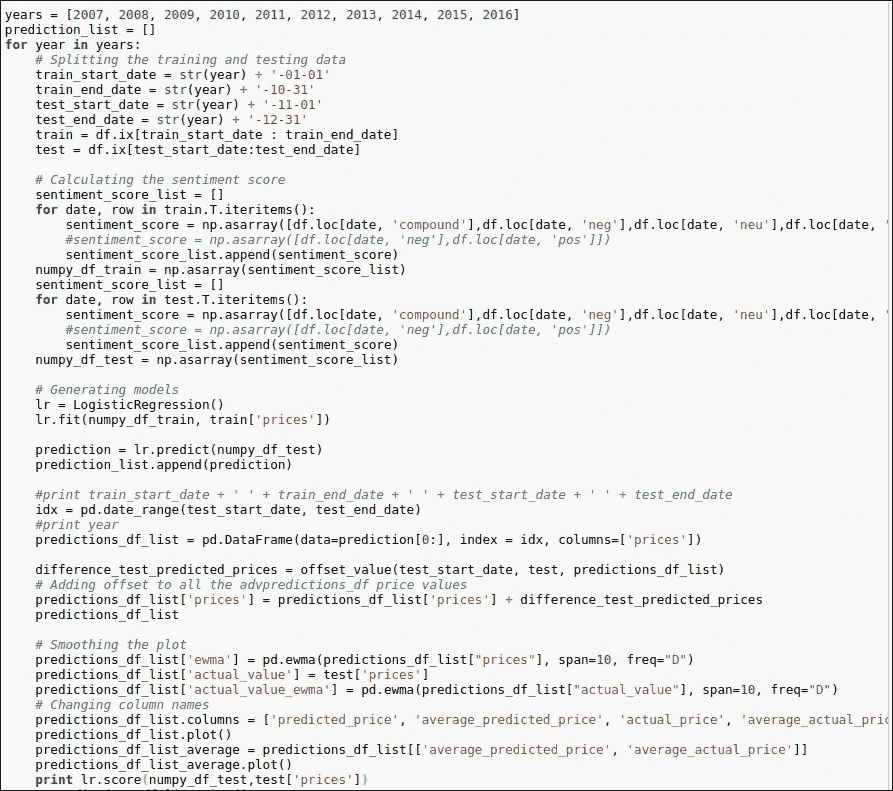

图 2.35：逻辑回归的代码片段

在这里，我们再次使用逻辑回归机器学习算法训练了模型。我们还为测试数据集实现了对齐和平滑。现在，让我们评估逻辑回归模型。

## 测试改进方法

我们已经测试了逻辑回归模型。您可以参考以下图表形式的可视化，显示这种改进方法确实比*RandomForesRegressor（没有对齐和光滑）*要好，但还没有达到标准：

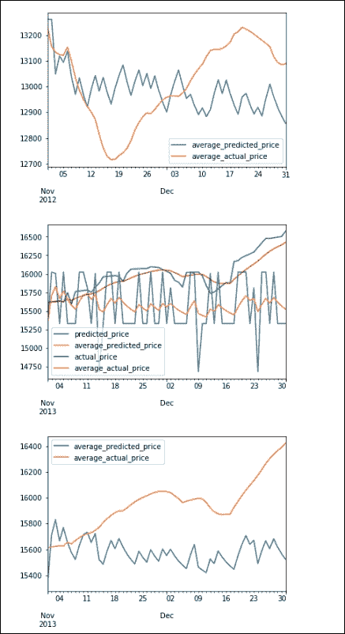

图 2.36：年度预测图表

如前一个屏幕截图所示，我们为*逻辑回归*生成了年度图表；我们可以看到使用此模型有轻微的改进。我们还使用了对齐和光滑，但效果并不太明显。

现在，让我们讨论一下这个改进方法存在的问题，然后我们可以实施最佳方法。

## 理解改进方法中的问题

在本节中，我们将讨论为什么我们的改进方法没有给我们带来良好的结果。ML 模型不起作用是因为数据集没有归一化。第二个原因是，即使在归一化和光滑之后，*RandomForestRegression* ML 模型仍然面临过拟合问题。对于最佳方法，我们需要处理归一化和过拟合。我们可以使用基于神经网络的 ML 算法来解决这个问题。因此，在我们的最后一次迭代中，我们将开发一个可以给我们最佳精度的神经网络。

# 最佳方法

在这里，我们将实现基于神经网络的算法**多层感知器**（**MLP**）。您可以参考以下代码片段：

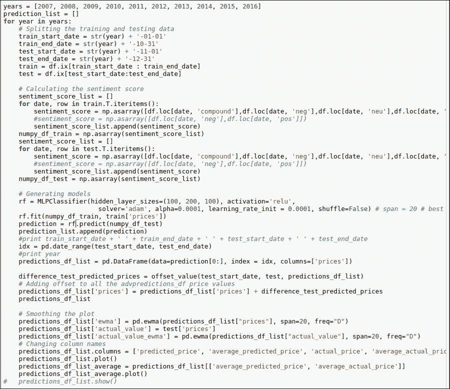

图 2.37：多层感知器的代码片段

在这里，您可以看到我们正在使用 ReLU 激活函数，梯度下降求解器函数是 ADAM。我们使用的学习率是 0.0001。您可以通过参考以下图表来评估结果：

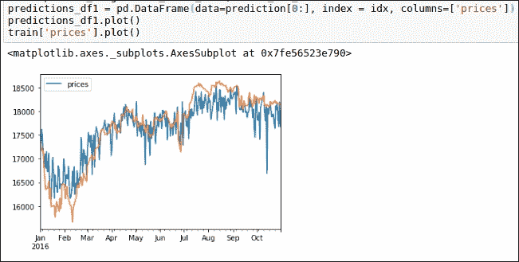

图 2.38：生成实际和预测价格图表的代码片段

此图表显示，所有数据记录的预测价格都遵循实际价格模式。您可以说我们的 MLP 模型在预测股票市场价格方面表现良好。您可以在以下 GitHub 链接中找到代码：[`github.com/jalajthanaki/stock_price_prediction/blob/master/Stock_Price_Prediction.ipynb`](https://github.com/jalajthanaki/stock_price_prediction/blob/master/Stock_Price_Prediction.ipynb)。

# 摘要

在本章中，你学习了如何预测股票价格。我们介绍了可以帮助我们在这一领域的一些不同的机器学习算法。我们尝试了随机森林回归器、逻辑回归和多层感知器。我们发现多层感知器效果非常好。我真的很想讨论一些超出我们目前所做内容的事情。如果你认为通过使用新闻的情感分析和预测方法，我们现在可以以百分之百的准确性正确预测股票市场价格，那么你就错了。我们无法以百分之百的准确性预测股票价格。许多社区、金融机构和学术研究人员正在这个方向上努力，以创建一个高度准确的股票市场价格预测模型。这是一个活跃的研究领域。

所以，如果你对研究和自由职业感兴趣，那么你可以加入一些相当酷的社区。其中有两个社区非常受欢迎。其中一个就是 Quantopian（[`www.quantopian.com/`](https://www.quantopian.com/)）。在这个社区中，你可以提交你的股票价格预测算法，如果它优于其他竞争对手的算法，那么你将赢得现金奖励，如果你获得了你算法的许可，那么你将从通过你许可的算法完成的交易中获得一些利润。第二个社区是 numer.ai（[`numer.ai/`](https://numer.ai/)）。这个社区与 Quantopian 类似。因此，这个应用的潜力是无限的。这两个社区都提供了一些优秀的教程。所以尝试一些不同的事物，希望你能想出一个出色的算法。

在下一章中，我们将探索零售或电子商务领域，并试图找出一些关于用户行为数据集和用户社交足迹的有趣事实。这将帮助我们了解公司应该如何改变他们的网站或网站上的某些功能。电子邮件营销活动成功的可能性有多大？哪些类型的用户会对这项活动做出回应？继续阅读这本书！我们将在下一章讨论所有这些内容。
