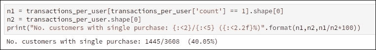

# 第三章 客户分析

客户分析是一个过程，我们使用客户行为数据，通过市场细分和预测分析来推导出最重要的商业决策。市场细分是根据用户的行为和其他类型的共享特征将用户基础划分为子组的过程。这将帮助公司为每个用户细分提供定制化产品。此类分析的结果将引导公司以有效的方式扩展业务。公司也能获得更多的利润。有很多优势。我知道这只是一个关于市场细分简短的讨论，但请稍等片刻。我将在接下来的部分中为您提供所有必要的信息。

公司可以使用市场细分和预测模型生成的结果进行直接营销、选址、客户获取和客户关系管理。简而言之，借助客户分析，公司可以决定最优化和有效的营销策略以及增长策略。公司可以在有限的营销支出下取得显著成果。客户分析包括各种方法。您可以在以下图表中查看这些方法的名称：

图 3.1：客户分析的各种方法

在本章中，我们不会涵盖前图中给出的所有方法，但我们将介绍在行业中应用最广泛的方法。我们将构建一个客户细分应用。在本章中，我们将涵盖以下主题：

+   介绍客户细分：

    +   介绍问题陈述

+   理解数据集

+   构建客户细分基线方法：

    +   实施基线方法

    +   理解测试矩阵

    +   测试基线方法的结果

    +   基线方法的局限性

    +   优化基线方法

+   构建客户细分的修订方法：

    +   实施修订方法

    +   测试修订方法

    +   修订方法的局限性

    +   理解如何改进修订方法

+   客户细分最佳方法：

    +   实施最佳方法

+   测试最佳方法

+   不同领域的客户细分

+   概述

我们将从客户细分开始。

# 介绍客户细分

在本节中，我们将详细介绍客户细分。最初，我仅提供了一个关于客户细分的基本介绍，以便您对这一术语有所了解。在这里，我们将更深入地了解客户细分，这将有助于我们在构建客户细分分析时进一步工作。

如前所述，客户细分是一个过程，我们将公司的消费者基础划分为子群体。我们需要通过使用一些特定的特征来生成子群体，以便公司以更少的营销支出销售更多产品。在继续前进之前，我们需要了解基础知识，例如，我所说的消费者基础是什么？我所说的细分是什么？我们是如何生成消费者子群体的？我们在细分消费者时考虑哪些特征？让我们逐一回答这些问题。

基本上，任何公司的消费者基础由两种类型的消费者组成：

1.  现有消费者

1.  潜在消费者

通常，我们需要将我们的消费者基础划分为子群体。这些子群体被称为细分市场。我们需要以这种方式创建群体，使得每个客户子群体都有一些共同的特征。为了解释如何生成子群体，让我给你举一个例子。

假设一家公司正在销售婴儿产品。那么，它需要提出一个消费者细分市场（消费者子群体），包括想要购买婴儿产品的消费者。我们可以借助一个简单的标准来构建第一个细分市场（子群体）。我们将包括那些家庭中有一个孩子并在过去一个月购买了婴儿产品的消费者。现在，公司推出了一款成本过高或高端的婴儿产品。在这种情况下，我们可以进一步将第一个子群体细分为月收入和社会经济状况。基于这些新的标准，我们可以生成第二个消费者子群体。公司将为第二个子群体的消费者定位高端和高端产品，而对于一般产品，公司将针对属于第一个子群体的消费者。

当我们有不同的细分市场时，我们可以设计定制化的营销策略以及适合特定细分市场客户的定制产品。这种按细分市场进行的营销将帮助公司以更低的营销费用销售更多产品。因此，公司会获得更多利润。这就是为什么公司现在使用客户细分分析的主要原因。客户细分在零售领域、金融领域以及基于客户关系管理（CRM）的产品等领域也被使用。我已经提供了一份在细分过程中可以考虑的基本特征列表。您可以在以下屏幕截图中参考它们：

图 3.2：客户细分中使用的基本特征列表

你可能会想知道公司是如何基于客户细分分析制定营销策略的。答案是公司正在使用 STP 方法来制定营销策略。什么是 STP 方法？首先，STP 代表细分-定位-定位。在这个方法中，有三个阶段。我们在每个阶段处理的问题如下所述：

+   **细分**：在这个阶段，我们使用客户的个人特征以及前图中提供的特征来创建客户基础细分。一旦细分确定，我们就进入下一阶段。

+   **目标**：在这个阶段，营销团队评估细分，并试图了解哪种产品适合哪个特定的细分市场（s）。团队对每个细分进行这项练习，最后，团队设计出吸引一个或多个细分市场客户的定制产品。他们还将选择哪些产品应该提供给哪个细分市场。

+   **定位**：这是 STP 过程的最后阶段。在这个阶段，公司研究市场机会以及他们的产品向客户提供的价值。营销团队应该提出一个独特的销售主张。在这里，团队还试图了解特定细分市场如何看待产品、品牌或服务。这是公司确定如何最好地定位其产品的一种方式。公司的营销和产品团队创建一个价值主张，清楚地解释他们的产品如何优于任何其他竞争对手。最后，公司开始他们的宣传活动，以这种方式展示价值主张，让消费者对他们所得到的东西感到满意。

我已经在以下图中总结了所有前面的要点：

图 3.3：STP 方法的总结

我们已经涵盖了客户细分的大部分基本部分。现在，是时候进入问题陈述了。

## 介绍问题陈述

如你所知，客户细分有助于公司保留现有客户以及吸引新的潜在客户。基于细分，公司可以为特定客户细分创建定制产品，但到目前为止，我们还不知道如何生成细分。这就是我们在本章中要关注的问题。你需要学习如何创建客户细分。我们可以为许多领域构建客户细分，例如电子商务、旅游、金融、电信等。在这里，我们将仅关注电子商务领域。

下面是对我们将要构建的电子商务客户细分应用的问题陈述、输入和输出的详细说明：

+   **问题陈述**：我们客户细分应用的目标是为以下问题提供解决方案：

    +   我们能否根据客户的购买模式将客户分类到特定的细分市场？

    +   我们能否根据他们的细分情况预测他们未来会购买哪些类型的商品？

+   **输入**：我们将使用包含 4000 名客户 1 年内购买列表的电子商务数据。

+   **输出**：第一个目标是我们需要将我们的消费者基础分类到合适的客户细分中。第二个目标是，我们需要根据客户的首次购买预测当前年和下一年度的购买。

你可能会想知道我们如何通过细分来预测即将到来的购买。好吧，让我告诉你细分如何帮助我们！所以，我们不知道新客户的购买模式，但我们知道客户档案。我们还知道客户购买过哪些产品。因此，我们可以将客户放入一个细分中，其中所有其他客户都购买过类似的产品，并具有类似的档案。

让我给你举一个例子。比如说，一个人买了一本哈利·波特的书，这个人住在英国。客户的年龄组是 13-22 岁。如果我们已经生成了一个满足这些特征的客户细分，那么我们将把这个新客户放入那个特定的子组中。我们将推导出客户未来可能购买的商品列表。我们还将提供该子组中其他客户所享有的类似服务。

我们将用于开发电子商务领域客户细分的方法也可以用于其他领域，但每个领域的数据点（特征）将不同。在章节的后面，我们将讨论你可能考虑用于其他领域（如旅行、金融等）的数据点类型。我将提供其他领域的数据点列表，这将帮助你从头开始构建客户细分应用程序。

现在是时候理解用于构建电子商务领域客户细分的数据集了。

# 理解数据集

在数据科学中，找到合适的数据集是一项具有挑战性的任务。有时，你找到了一个数据集，但它不是合适的格式。我们的问题陈述将决定我们需要什么类型的数据集和数据格式。这类活动是数据清洗的一部分。

### 备注

数据清洗被定义为将数据从一种数据形式转换到另一种数据形式的过程。通过转换和映射，我们的目标应该是创建一个合适且有价值的数据集，以便用于开发分析产品。数据清洗也被称为数据整理，并且是任何数据科学应用的关键部分。

通常，电子商务数据集是专有数据集，你很少能获得真实用户的交易数据。幸运的是，*UCI 机器学习仓库*托管了一个名为*在线零售*的数据集。这个数据集包含了来自英国零售商的实际交易数据。

## 数据集描述

此在线零售数据集包含 2010 年 12 月 1 日至 2011 年 12 月 9 日之间的实际交易。所有交易均来自注册的非实体店在线零售平台。这些在线零售平台大多位于英国。这些在线零售平台销售独特的全场合礼物。这些在线零售平台的许多消费者是批发商。此数据集中有 532610 条记录。

## 下载数据集

您可以使用以下任一链接下载此数据集：

1.  [`archive.ics.uci.edu/ml/datasets/online+retail`](http://archive.ics.uci.edu/ml/datasets/online+retail)

1.  [`www.kaggle.com/fabiendaniel/customer-segmentation/data`](https://www.kaggle.com/fabiendaniel/customer-segmentation/data)

## 数据集的属性

这些是数据集中的属性。我们将查看每个属性的简要描述：

1.  InvoiceNo: 此数据属性表示发票号码。它是一个六位数的整数。记录为每笔交易唯一分配。如果发票号码以字母'c'开头，则表示取消。

1.  StockCode: 此数据属性表示产品（项目）代码。它是一个五位数的整数。所有项目代码都是唯一分配给每个不同产品的。

1.  Description: 此数据属性包含关于项目的描述。

1.  Quantity: 此数据属性包含每笔交易中每种产品的数量。数据为数值格式。

1.  InvoiceDate: 此数据属性包含发票日期和时间。它表示每次交易生成的日期和时间。

1.  UnitPrice: 价格表示每单位产品的英镑价格。

1.  CustomerID: 此列包含客户识别号码。它是一个五位数的整数，唯一分配给每个客户。

1.  Country: 此列包含有关客户的地理信息。它记录了客户的国家名称。

您可以参考以下截图中的数据集样本：

图 3.4：数据集的样本重编码

现在我们将开始构建客户细分应用程序。

# 构建基线方法

在本节中，我们将开始实现客户细分应用程序的基本模型。此外，我们将改进这个基线方法。在实现过程中，我们将涵盖执行该特定步骤所必需的概念、技术方面和重要性。您可以在以下 GitHub 链接找到客户细分应用程序的代码：[`github.com/jalajthanaki/Customer_segmentation`](https://github.com/jalajthanaki/Customer_segmentation)

与本章相关的代码在一个单独的 iPython 笔记本中给出。你可以使用此 GitHub 链接访问笔记本：[`github.com/jalajthanaki/Customer_segmentation/blob/master/Cust_segmentation_online_retail.ipynb`](https://github.com/jalajthanaki/Customer_segmentation/blob/master/Cust_segmentation_online_retail.ipynb)。

请参考 GitHub 上给出的代码，因为它将帮助你更好地理解事物。现在让我们开始实施！

## 实施基线方法

为了实现客户细分模型，我们的实现将包括以下步骤：

1.  数据准备

1.  探索性数据分析（EDA）

1.  生成客户类别

1.  客户分类

让我们从数据准备开始！

### 数据准备

这是在尝试构建任何分析应用程序时的一个基本步骤。首先，我们需要确保数据格式是适当的。如果不是，那么我们需要以这种方式准备我们的数据集，以便我们可以轻松构建我们的应用程序。在这个步骤中，我们将找出我们是否有一个高质量的数据集。我们还可以找出有关数据集的一些基本事实。

幸运的是，我们不需要更改我们电子商务数据集的格式，但我们将以这种方式探索数据集，以便我们可以找出数据集的质量。如果数据集的格式不正确，那么你需要决定数据集的格式，以便可以使用数据集进行任何类型的分析。你可以将数据记录转换为 CSV 格式、JSON 格式或 XML 格式。此外，我们还可以推导出关于数据集的一般事实，例如我们的数据集是否存在偏差，数据集是否包含任何空值，客户与`Customer_ID`的映射是否正确，以及他们的购买是否在数据集中正确记录，等等。

#### 加载数据集

为了加载数据集，我们将使用 pandas 的`read_csv` API。你可以在下面的屏幕截图中找到给出的代码片段：

图 3.5：加载数据集的代码片段

如你所见，数据集的维度是（541909，8）。这意味着数据集中有 541,909 条记录和八个数据属性。我们已涵盖了这八个数据属性。

现在我们需要进行探索性数据分析（EDA），这可以帮助我们预处理我们的数据集。

### 探索性数据分析（EDA）

在本节中，我们需要检查数据集的统计属性并执行一些预处理步骤：

1.  删除空数据条目

1.  删除重复数据条目

1.  对各种数据属性进行 EDA

#### 删除空数据条目

首先，我们需要检查每个属性的 数据类型，并找出哪个列有空值。你可以参考以下屏幕截图中显示的代码片段：

图 3.6：探索数据集的代码片段

如代码所示，我们已经为每个数据属性生成了总空值数。我们还为每个数据属性生成了空值百分比。我们可以观察到，对于`CustomerID`列，大约有 25%的数据条目是空的。这意味着大约 25%的数据集中没有`CustomerID`值。这表明有许多条目不属于任何客户。这些都是异常数据条目。我们无法将它们映射到现有的客户 ID 上。因此，我们需要删除它们。您可以在以下截图中找到从数据集中删除空数据条目的代码片段：

图 3.7：删除空数据条目

#### 删除重复数据条目

在这一步之后，我们将检查数据集中是否存在重复的数据条目。为了回答这个问题，我们将使用 pandas 的`duplicate()`函数。您可以参考以下截图中的代码片段：

图 3.8：删除重复数据条目

如您所见，我们找到了 5,225 个重复数据条目。因此，我们已经删除了它们。

现在我们来详细分析每个数据属性。

#### 对各种数据属性进行 EDA

对每个数据属性进行 EDA 可以帮助我们更深入地了解数据集。稍后，我们将使用这些事实来构建一个准确的客户细分应用程序。

我们将按照以下顺序开始探索数据属性：

1.  国家

1.  客户和产品

1.  产品类别

1.  定义产品类别

##### **国家**

我们需要找出诸如数据集中有多少个国家等事实。为了回答这个问题，我们需要执行以下截图中的代码：

图 3.9：生成数据集中存在的县数的代码片段

我们还需要找出我们收到订单数量最多的国家。我们可以通过使用 pandas 的`groupby()`和`count()`函数来找出这一点。我们将按订单数量降序排序。您可以参考以下截图中的代码片段：

图 3.10：生成按国家划分的订单数量的代码片段

如前所述的代码片段所示，大多数订单来自英国客户。现在我们需要探索客户和产品变量。

##### **客户和产品**

在这里，我们大约有 40 万个数据项。我们需要知道这些数据条目中包含的用户和产品数量。我们将使用`pandas`库中的`value_counts()`函数。请查看以下截图中的代码片段：

图 3.11：探索客户和产品的代码

如上图所示，这个数据集包含了 4372 个用户的记录，他们购买了 3684 种不同的商品

我们已经推导出一些有趣的事实。在给定的数据集中，有 4,372 位客户购买了 3,684 种不同的产品。交易总数为 22,190。

我们还应该找出每个交易中购买了多少产品。为此，我们将使用`InvoiceNo`和`InvoiceDate`数据属性，并且我们将计算每个交易购买的产品数量。你可以参考以下屏幕截图中的代码片段：

图 3.12：探索每个交易产品数量的代码片段

如前述代码片段所示，我们可以得出以下观察结果：

+   有一些用户在电子商务平台上只购买过一次，并且只购买了一件商品。这类用户的例子是`customerID 12346`。

+   有一些用户经常在每笔订单中购买大量商品。这类用户的例子是`customerID 12347`。

+   如果你查看`InvoiceNo`数据属性，那么你可以看到有一个发票的前缀`C`。这个`'C'`表示特定的交易已被取消。

如我们所知，在我们的数据集中可能存在几个取消订单，我们需要计算与取消订单对应的交易数量。我们使用了一个简单的 lambda 表达式检查条件。现在我们将计算取消订单的百分比。你可以参考以下屏幕截图中的代码片段：

图 3.13：生成取消订单百分比的代码片段

让我们列出一些取消订单的条目，以便我们可以找出如何处理它们。请看以下屏幕截图：

图 3.14：取消订单列表

基本上，为了处理取消订单，我们需要采取以下步骤：

+   如你所观察到的，如果订单被取消，那么将会有另一个交易，除了数量和发票日期外，其他方面大致相同。首先，我们需要检查这是否适用于所有条目。

+   我们可以通过简单的逻辑执行此检查操作。大多数情况下，取消订单的数量是负数，因此我们将检查是否存在一个数量相同（但为正数）且描述值相同的订单。

+   同时也有一些折扣条目，我们需要处理它们。我们将丢弃这些折扣条目。

你可以参考以下屏幕截图中的代码，如下所示：

图 3.15：处理取消订单的代码

当我们运行前面的代码时，我们发现数据集中没有所有已取消交易的类似条目。为了克服这种情况，我们将在我们的数据框中创建一个新的变量，该变量指示交易是否已被取消。已取消订单有三种可能性：

+   有一些交易在没有对应项的情况下被取消了。其中一些可能是因为购买订单是在 2010 年 12 月之前执行的。我们拥有从 2010 年 12 月到 2011 年 12 月的数据集。

+   有一些订单是与恰好一个对应项一起取消的。我们也将考虑这些订单。

+   有些条目是可疑的。我们将检查是否存在至少一个与确切数量相同的对应项。如果存在，则我们可以将这些条目标记为可疑。

您可以参考以下截图中的代码：

图 3.16：生成已取消订单标志的代码片段

如前述代码片段所示，有 7,521 条条目显示了带有对应项的已取消订单。有 1,226 条条目显示了没有对应项的已取消订单。为了简化，我们将删除所有与已取消订单相关的条目。删除这些记录的代码在以下截图给出：

图 3.17：删除已取消订单的代码片段

现在，让我们根据股票代码分析条目，因为我们知道在识别已取消订单的过程中，我们根据*股票代码 D*发现了折扣商品。因此，首先，我们将列出所有股票代码及其含义。您可以参考以下截图：

图 3.18：股票代码的代码片段

现在，让我们专注于单个订单的定价。在给定的数据集中，单个客户的订单已被拆分为几行。我所说的几行是什么意思？为了理解这一点，请参考以下截图：

图 3.19：理解订单数据条目

我们数据集中的每个条目都表示一种产品的价格。如果一个订单包含不同的产品，并且由同一个客户下单，那么该订单将有多个条目。数据条目的数量取决于订单中有多少种不同的产品。正如您在前面的图中看到的，一个订单中包含了三种不同的产品。我们需要获取每个订单的总价格。为了实现这一点，我们将添加一个名为*TotalPrice*的列，它给出了订单的总价值或单个订单的篮子价格。计算*TotalPrice*的主要逻辑是我们将*UnitPrice*与净数量相乘。我们通过从总量中扣除取消的数量来获得净数量。请查看以下截图所示的代码片段：

图 3.20：获取 TotalPrice 的代码

一旦我们获得总价格，我们将为单个订单生成金额总和，然后根据发票数据对条目进行分组。我们只列出篮子价格大于 0 的数据条目。实现这一点的代码如下截图所示：

图 3.21：基于发票日期生成篮子价格的代码

现在是时候了解给定数据集中订单金额的分布情况了。我所说的订单金额分布是什么意思呢？嗯，我们应该了解数据集中所有订单的价格，并根据所有订单的金额范围进行分类。这将帮助我们得出数据集中金额超过 200 英镑的订单数量。这也有助于我们识别金额低于 100 英镑的订单数量。这类信息有助于我们了解基于订单数量的数据分布。这将给我们一个电子商务平台上销售的基本情况。以下截图显示了基于订单金额生成数据分布的代码片段：

图 3.22：基于订单金额生成数据分布的代码片段

您可以如下看到此数据分布的图示：

图 3.23：数据分布的图示

如我们所见，大约 65%的订单金额超过 200 英镑。我们已经对订单进行了详细的探索。现在让我们开始分析产品类别。

##### **产品类别**

在本节中，我们将对产品相关的数据属性进行 EDA。我们将在本节中包含以下类型的分析：

+   分析产品描述

+   定义产品类别

+   描述聚类内容

###### **分析产品描述**

在本节中，我们将使用两个数据属性。我们将使用`StockCode`数据属性，它包含每个产品的唯一 ID。我们还将使用`Description`数据属性来对产品进行分类。让我们从产品描述开始。

首先，我们将定义一个函数，该函数将数据框作为输入，然后我们将执行以下操作：

+   我们将从产品描述中提取名称（名词）。

+   然后，我们将生成提取名称的词根形式。我们将名称的词根作为键，所有相关名称作为其值。我们将使用 NLTK 库中的词干提取器来完成这一步骤。词干提取器基本上通过删除后缀和前缀来生成单词的词根形式。

+   我们将计算名称根的频率，这意味着我们将计算每个名称的词根形式出现的次数。

+   如果各种名称有相同的根，那么我们将根形式视为关键词标签。

您可以在下面的屏幕截图中查看此函数的代码：

图 3.24：从产品描述生成关键词的函数代码片段

现在我们需要调用这个函数并传入输入的数据框。您可以在下面的屏幕截图中查看提供的代码片段：

图 3.25：实际生成关键词的代码片段

在这里，我们正在返回三个变量：

+   `Keyword:` 这是提取的名称列表

+   `Keywords_roots:` 这是一个字典，其中键是名称的根，值是与根名称关联的名称列表。

+   `Count_keywords:` 这是一个字典，用于跟踪每个名称的频率。计数表示特定名称在描述中出现的次数。稍后，我们将字典转换为列表。

现在，让我们绘制关键词与其频率的图表。代码如下所示：

图 3.26：生成频率图的代码片段

如前图所示，单词（指名词或名称）"heart"在产品描述中出现的次数最多。您可能会想知道生成这个单词频率的意义是什么。嗯，我们正在使用它来对产品进行分类。现在，让我们看看如何提出产品类别。

###### **定义产品类别**

在这里，我们将获取产品类别。我们已经获得了 1400 多个关键词，最频繁出现的名称出现在 200 多个产品中。现在我们需要删除不太重要的单词。我们可以观察到一些无用的单词，例如颜色名称，并将它们丢弃。因此，我们将考虑在数据集中出现超过 13 次的单词。您可以在下面的屏幕截图中查看代码片段：

图 3.27：保留重要单词的代码片段

现在，我们需要对数据进行编码。在这里，我们有文本数据，我们需要将其转换为数值格式。为此，我们将使用 one-hot 编码。one-hot 编码是一个简单的概念。为了理解它，请参考给出的矩阵 x。看一下以下截图：

图 3.28：理解 one-hot 数据编码的表格

如果某个单词出现在产品描述中，则系数的值为 1，如果单词没有出现在产品描述中，则系数的值为 0。您可以参考以下截图：

图 3.29：one-hot 数据编码的直观示例

如您所见，这种数据编码是一种二进制类型的向量化，因为我们放置的是零或一。编码后，我们将为每个单词得到一个稀疏向量。用通俗易懂的话来说，这种向量化表示了单词在产品描述中的存在。

现在，让我们根据价格范围创建产品的组或聚类。为此，我们将使用我们生成的关键词列表，检查产品描述中是否包含关键词中的单词，并取`UnitPrice`的平均值。您可以参考以下截图中的代码：

图 3.30：基于价格范围生成产品组的代码片段

现在，我们将创建产品的聚类。我们将使用 k-means 聚类算法。我们还将使用 scikit-learn 库来实现 K-means 聚类算法。scikit-learn 中的算法使用欧几里得距离。在我们的情况下，这并不是最佳选择。我们应该使用汉明距离。最适合的库是`Kmods`，但这个库并不是所有操作系统都可用，所以我们必须使用 scikit-learn 库。我们需要定义可以完美表示数据的簇数量。我们将得出理想的簇数量，然后使用轮廓分数。

您可以通过使用本书的链接了解 k-means 聚类算法的工作原理：[`www.packtpub.com/big-data-and-business-intelligence/python-natural-language-processing`](https://www.packtpub.com/big-data-and-business-intelligence/python-natural-language-processing)，参考第八章的 K-means 聚类部分第八章，*机器学习解决 NLP 问题*。

让我们退一步，首先了解轮廓分数。轮廓系数是通过两个因素计算的。第一个是每个样本在数据集中的平均簇内距离（a），第二个是平均最近簇距离（b）。因此，方程如下：

*(b-a) / max (a, b)*

*b*表示样本与其不属于的最近簇的距离。当标签数量为*2<= n_labels <= n_samples –1*时，此评分有效。此评分的最佳可能值为 1，最差值为-1。值为 0 表示我们有重叠的簇。负值表示样本已被分配到错误的簇。请参考以下截图中的代码片段：

图 3.31：使用轮廓评分选择理想簇数量的代码片段

在这里，我们使用 scikit-learn API 实现了代码。正如我们所见，超过五个簇时，簇中可能包含非常少的元素，因此我们选择将产品分类为五个簇。我们将尝试提高轮廓评分。为此，我们将遍历数据集。你可以参考以下截图中的代码：

图 3.32：改进轮廓评分的代码片段

现在，让我们继续到描述簇的内容部分，这有助于我们了解产品被分类到特定簇中的效果如何。

##### **描述簇的内容**

在本节中，我们将分析产品簇的性质。这里将分为三个小节：

+   轮廓簇内评分分析

+   使用词云进行分析

+   主成分分析（PCA）

在我们深入分析之前，我们需要检查每个簇中的产品数量。为此，我们将使用以下截图中的代码片段：

图 3.33：计算每个簇产品数量的代码片段

如输出所示，有 1,009 个产品属于第 3 簇，而只有 470 个产品属于第 4 簇。我们将开始对这些五个簇及其元素进行深入分析。首先，我们将从轮廓簇内评分分析开始。

###### **轮廓簇内评分分析**

在本节中，我们将检查每个元素的簇内评分。我们将对轮廓簇内评分进行排序。排序后，我们将绘制一个图表，其中*x*轴代表轮廓系数值，*y*轴代表簇标签。我们为所有样本生成轮廓簇内评分。我们绘制这个图表是为了根据轮廓簇内评分选择`n_clusters`的最佳值。

由于我们之前已经生成了轮廓簇内评分，我们知道`n_clusters = 5`是我们理想的选项，因此我们将以图形方式表示这些簇。你可以参考以下截图中生成图表的函数：

图 3.34：轮廓内聚群得分分析函数的代码片段

执行并调用此函数后，我们可以获得以下截图显示的图表：

图 3.35：轮廓内聚群分析的代码片段和图表

### 注意

注意，在这里，我们获得了最优`n_cluster`值的图表。在我们的例子中，这个值是 5。

##### **使用词云进行分析**

在本节中，我们将根据关键词分析聚类。我们将检查每个聚类包含哪些单词。为此分析，我们将使用词云库。你可能想知道为什么我们使用这种分析方法。在我们的聚类中，我们期望类似的产品属于一个聚类。作为人类，我们知道语言。当我们看到整个聚类的单词时，我们可以很容易地判断我们的聚类是否包含类似的产品。我们将生成足够直观的图表，以便我们判断聚类的准确性。

你可以参考以下截图中的代码片段：

图 3.36：生成词云的代码片段

你可以参考以下截图中的代码片段：

图 3.37：生成词云图表的代码片段

你可以参考以下截图中的图表：

图 3.38：所有五个聚类的词云图表

从前面的图表中，我们可以得出以下结论：

+   第 2 号聚类包含所有与礼物相关的单词，如圣诞节、包装、礼物、卡片等。

+   第 4 号聚类包含所有与奢侈品和珠宝相关的单词。因此，项链、银、蕾丝等关键词都存在于这个聚类中。

+   有些单词在所有聚类中都存在，因此很难清楚地区分它们。

现在让我们跳到下一节，我们将进行主成分分析。

##### 主成分分析（PCA）

为了检查所有聚类是否确实具有不同的值，我们需要关注它们的组成。正如我们所知，关键词的一热编码矩阵具有大量的维度或变量。可能存在这样的情况，由于变量的数量庞大，我们的聚类算法可能会过度拟合数据集。首先，我们需要减少变量的数量，但我们不能随意减少。我们需要选择最能代表数据集大部分特征的最重要的变量。减少变量数量的逻辑过程称为降维。

为了实现这一点，我们将使用 PCA，这是一种统计技术，我们将执行正交变换，将高度相关的数据样本集转换为线性不相关的变量集，这些变量被称为主成分。所以，基本上，我们将使用 PCA，因为我们想减少我们迄今为止考虑的变量数量。PCA 是降维的著名技术。通过使用 PCA，我们可以避免过拟合问题。

现在，你可能想知道可以使用 PCA 的情况，如下所示：

+   如果我们想减少变量的数量（特征或维度的数量），但又无法确定哪些变量可以考虑，哪些不能

+   如果我们想确保我们的变量彼此独立

+   如果我们愿意使我们的独立变量不那么可解释

在我们的案例中，我们需要减少变量的数量。为此，我们将实施以下截图中的代码：

图 3.39：实现 PCA 的代码片段

如你所见，我们在前面的代码中正在检查每个成分解释的方差量。我们需要考虑超过 100 个成分来解释我们数据集 90%的方差。

在这里，我将考虑有限数量的成分，因为这种分解只是为了可视化数据。你可以参考以下截图中的代码：

图 3.40：生成 PCA 分解图形的代码片段

如你所见，我们使用了`PCA(n_components=50)`的 PCA 成分，并将值存储在数据框`mat`中，我们可以在未来使用。

前面代码的输出是图形形式。因此，你可以参考以下截图：

图 3.41：每个聚类的 PCA 图形

在这里，我们使用了`tight_layout`，这是图形缩小一点的原因。

到目前为止，我们已经进行了足够的 EDA，以帮助我们生成对数据集的基本洞察。现在我们将进入下一节，我们将开始构建客户类别或客户细分。我们将考虑我们迄今为止实施的所有发现。

### 生成客户类别

如你所知，我们的第一个目标是开发客户细分。从本节开始，我们将主要关注我们如何进行客户细分。到目前为止，我们已经对订单、产品、价格等方面进行了分析。在这里，我们的主要重点是依据我们在 EDA 过程中获得的洞察来生成客户类别。

这些是我们将遵循的步骤来开发客户类别：

+   数据格式化：

    +   分组产品

    +   数据集拆分

    +   分组订单

+   创建客户类别：

    +   数据编码

    +   生成客户类别

现在我们来看看在每个步骤中我们将做什么。

#### 格式化数据

如前所述，我们将使用我们在 EDA 过程中生成的发现。在前一节中，我们为产品生成了五个聚类。为了执行剩余的分析，我们将使用这个已经生成的关键词列表、矩阵和聚类列表。通过使用它们，我们将生成一个新的分类变量`categ_product`。这个变量表示每个产品的聚类。您可以参考以下截图所示的代码片段：

图 3.42：生成新分类变量 categ_product 的代码片段

如您所见，新变量表示每个数据条目的聚类编号。现在让我们对产品进行分组。

##### 分组产品

您可能会想知道，如果我们已经开发了产品的类别，那么为什么我们在这里执行分组步骤。在这里，我们将以这种方式进行分组，以便我们知道在每个产品类别中花费了多少钱。为此，我们将添加五个新变量，例如，categ_0、categ_1、categ_2、categ_3 和 categ_4。您可以参考以下截图显示的代码片段：

图 3.43：生成每个产品类别的花费金额的代码片段

订单被分割成多个条目，因此我们需要使用篮子价格。这次，我们将合并篮子价格以及它在五个产品类别中的分布方式。我们将把所有这些信息放入新的数据框中。请参考以下截图：

图 3.44：获取五个聚类篮子价格分布的代码片段

最后，我们有每个订单的篮子价格，我们也知道价格在五个聚类中的分布。新的数据框是`basket_price`。现在让我们进入下一节。

##### 分割数据集

在本节中，我们将使用包含过去 12 个月数据条目的数据框`basket_price`。本应用的第二个目标是根据客户的首次网站访问或购买预测客户购买行为。因此，为了现在实现这个目标，我们将分割数据集。我们将使用 10 个月的数据集进行训练，2 个月的数据集进行测试。我包括这一步是因为稍后我们可以使用这些训练和测试数据集，您也可以轻松地使用新的数据框。您可以参考以下截图给出的代码：

图 3.45：使用时间分割数据集的代码片段

现在我们将根据篮子价格分布对客户及其订单进行分组。

##### 分组订单

在这里，我们将合并客户及其订单，以便我们可以了解哪个客户下了多少订单。我们还将生成最小订单金额、最大订单金额和平均订单金额。请参考以下截图中的代码：

图 3.46：生成每个客户订单统计信息的代码片段

我们还将生成两个变量，表示自最后一次购买和第一次购买以来过去的天数。这些变量的名称是`FirstPurchase`和`LastPurchase`。请参考以下截图中的代码片段：

图 3.47：生成最后和第一次购买过去天数的代码片段

我们感兴趣的客户类别是只下过一次订单的客户。我们的主要目标之一就是以这种方式定位这些客户，以便我们能够保留他们。我们需要获取属于这个类别的客户数量数据。为此，请参考以下截图中的代码：

图 3.48：生成只有一个购买客户的数量的代码片段

从前面的代码中，我们可以发现 40%的客户基础只下过一次订单，我们需要保留他们。

现在让我们构建客户类别。

#### 创建客户类别

基本上，我们将在这里生成客户细分。因此，我们将在这个部分努力实现章节的第一个目标。我们将基于客户的购买模式构建客户细分。本节有两个步骤：

+   数据编码

+   生成客户类别或客户细分

我们将从数据编码开始。

##### 数据编码

我们将生成包含我们迄今为止所执行的所有操作的汇总的 dataframe。这个 dataframe 的每一条记录都与单个客户相关联。我们可以使用这些信息来描述各种类型的客户。

我们生成的 dataframe 有不同的变量。所有这些变量都有不同的范围和变化。因此，我们需要生成一个矩阵，其中这些数据条目被标准化。你可以参考以下截图中的代码：

图 3.49：为每个客户生成汇总数据条目的代码片段

在创建客户细分之前，我们需要创建基础。这个基础应该包括重要变量。我们需要包括少量重要变量。为了选择重要变量，我们将使用主成分分析。这样我们就可以准确地描述细分。我们将为此任务使用 PCA。代码片段如下截图所示：

图 3.50：用于生成客户细分的 PCA 代码片段

在这里，我们可以看到有八个主成分。现在让我们进入下一节，我们将在这里生成客户细分。

##### 生成客户类别

我们将使用 k-means 聚类算法来生成细分。聚类数量将通过使用轮廓分数来推导。我们之前已经使用过轮廓分数，通过使用相同的方法，我们可以推导出聚类数量。在这里，根据轮廓分数，我们获得了 11 个聚类。您可以参考以下截图：

图 3.51：生成客户细分代码片段

如您所见，细分的大小存在很大差异，因此我们需要使用 PCA 分析来分析聚类的成分。

##### PCA 分析

我们将在这里使用六个成分。11 个聚类的 PCA 代码片段和图形表示在以下截图给出：

图 3.52：实现 PCA 和生成图表的代码片段

作为输出，以下图表已经生成：

图 3.53：客户细分的 PCA 图表

我在这里只显示了三个图表。在代码中，有九个图表。当您运行代码时，您可以看到它们全部。请注意，第一个成分将最小的聚类与其他聚类分开。对于这个数据集，我们可以说，总会有一种表示，其中两个细分将看起来是不同的。现在让我们获取轮廓分数。

##### 使用轮廓分数分析聚类

在本节中，我们将为每个聚类生成轮廓分数。这将表明数据样本分离的质量。您可以参考以下截图中的代码片段和图表：

图 3.54：生成轮廓分数图表的代码片段

从前面的图表中，我们可以确保所有聚类都是不相交的。现在我们需要更多地了解每个聚类的客户习惯。为此，我们将添加定义每个客户所属聚类的变量。

为了做到这一点，我们将生成一个新的数据框，`selected_customers`。在生成新的数据框后，我们将平均数据框的内容。这将为我们提供平均篮子价格、总访问量等。您可以参考以下截图中的代码：

图 3.55：存储客户习惯的代码片段

现在我们需要重新组织数据框的内容。我们将考虑以下两点：

1.  我们需要根据每个产品类别的花费金额重新组织数据

1.  之后，我们将根据总花费金额重新组织内容

您可以查看以下截图中的实现：

图 3.56：重新组织数据集的代码片段

如您所见，我们已经获得了每个细分市场的客户行为。现在我们可以根据这些特征进行推荐。我们可以根据生成的数据设计营销活动。

特定的营销策略可以应用于属于第 4 个和第 8 个聚类的客户。我们应该向第 1 个聚类的客户推荐高端产品。

到目前为止，我们已经实现了我们的第一个目标。现在是我们瞄准第二个目标的时候了。让我们开始吧！

### 客户分类

在我们开始之前，让我们回顾一下我们的目标。这有助于您更清晰地理解事物。目标是我们要构建一个分类器，将客户分类到上一节中建立的不同客户细分市场。我们还需要一个额外的功能。我们的分类器应该在客户第一次访问平台时生成这个分类结果。为了实现这种功能，我们将使用各种监督机器学习算法。我们将使用 scikit-learn API。

为了开发基线分类器，我们需要执行以下步骤：

+   定义辅助函数

+   将数据分为训练集和测试集

+   实施机器学习（ML）算法

#### 定义辅助函数

基本上，我们定义一个名为 `class_fit` 的类，然后定义各种函数，这些函数在训练机器学习模型时可以帮助我们。这些是我们将使用的辅助函数：

1.  `train` 函数帮助我们训练模型

1.  `predict` 函数帮助我们预测测试数据集或新数据样本的结果。

1.  `grid_search` 函数帮助我们找到合适的超参数和交叉验证（CV）折的值。

1.  `grid_fit` 函数帮助我们使用交叉验证训练模型并生成最佳超参数。

1.  `grid_predict` 函数帮助我们生成预测以及准确度评分。

您可以参考以下截图所示的代码片段：

图 3.57：辅助函数的代码片段

现在，让我们进入下一节。

#### 将数据分为训练集和测试集

我们将使用存储在 `selected_customers` 数据框中的数据。您可以看到我们将应用机器学习算法的数据集的一些条目。请查看以下截图：

图 3.58：数据集的样本条目

如您所见，我们将预测新客户的聚类编号，因此我们将该值存储为 `Y`，而 `mean, categ_0 到 categ_4` 等列被用作机器学习模型的输入特征，因此我们将它们存储在 `X` 变量中。现在我们需要将此数据拆分为训练集和测试集。为此，我们使用 sklearn API 的 `train_test_split()`。我们使用 80%的数据进行训练，20%的数据进行测试。请看以下截图：

图 3.59：将数据集拆分为训练集和测试集的代码片段

我们已经有了训练集和测试集。现在，我们需要开始实现机器学习算法。

#### 实现机器学习（ML）算法

对于基线方法，我们将实现支持向量机（SVM）分类器。我们将使用之前定义的辅助函数。在这里，我将创建一个类的实例并调用之前声明的函数。请看以下截图中的代码片段：

图 3.60：使用 SVM 分类器训练模型的代码片段

如代码片段所示，`svc` 是类实例。我们正在使用线性 SVM。我们使用了 `grid_search` 来搜索最优超参数以及获取交叉验证的折数。之后，我们调用了 `grid_fit` 方法，该方法用于使用我们的训练数据集来训练机器学习模型。

这是我们的基线方法实现方式。现在让我们测试一下结果。

## 理解测试矩阵

我们将使用混淆矩阵和学习曲线来评估机器学习模型。所以在开始测试之前，我们需要了解混淆矩阵和学习曲线是什么。我们将逐一介绍这些概念。

### 混淆矩阵

当我们实现多类分类器时，自然会有多个类，并且属于所有类的数据条目数量不同，所以在测试时，我们需要知道分类器是否对所有类都表现良好，或者它是否偏向某些类。这种分析可以使用混淆矩阵来完成。它将记录有多少数据条目被正确分类，有多少被错误分类。

让我们举一个例子。假设有 10 个属于一个类的数据条目，该类的标签为 1。现在当我们从我们的机器学习模型生成预测时，我们将检查 10 个条目中有多少被预测为类标签 1。假设有六个数据条目被正确分类并得到类标签 1。在这种情况下，对于六个条目，*预测标签*和*真实标签*是相同的，所以准确率是 60%，而对于剩余的数据条目，机器学习模型将它们错误分类。机器学习模型预测的类标签不是 1。

从前面的例子中，你可以看到混淆矩阵让我们了解有多少数据条目被正确分类，以及有多少被错误分类。我们可以探索分类器的类别准确度。请看以下截图：

图 3.61：混淆矩阵的示例

现在让我们看一下学习曲线。

### 学习曲线

我们在这里绘制了两条线。一条线表示训练分数，另一条线表示测试分数。在这里，训练和测试分数决定了不同训练数据集大小的交叉验证训练和测试分数。通过使用这个学习曲线，我们可以监控 ML 模型是否正确收敛。CV 分数和训练分数都将帮助我们确定训练是否朝着正确的方向进行，或者 ML 模型是否过度拟合或欠拟合。随着数据集大小的增加，如果 CV 分数和训练分数达到低分，那么这意味着训练没有以正确的方式进行。然而，如果 CV 分数和训练分数随着数据集大小的增加而增加，那么这意味着训练正在朝着正确的方向进行。请参考以下截图：

图 3.62：学习曲线的良例和劣例

现在我们已经理解了测试矩阵背后的基本直觉，我们可以开始测试我们的基线方法。

## 测试基线方法的结果

在本节中，我们将使用以下方法测试基线模型：

+   生成分类器的准确度分数

+   生成分类器的混淆矩阵

+   生成分类器的学习曲线

### 生成分类器的准确度分数

首先，我们将使用 `grid_predict` 来生成测试数据集的准确度分数。我们将检查 SVM 算法的准确度。为此，以下截图给出了代码片段：

图 3.63：生成准确度分数的代码片段

对于基线方法，我们得到了 79.50%的精确度。现在让我们通过混淆矩阵来看看预测的质量。

### 生成分类器的混淆矩阵

现在我们将生成混淆矩阵，这将给我们一个关于哪个类别被正确分类以及哪些类别大多数时候错误分类数据的公平概念。要生成混淆矩阵，请参考以下截图中的代码：

图 3.64：生成混淆矩阵的代码片段

我们使用了 sklearn 的`confusion_matrix` API。为了绘制图表，我们将定义一个名为`plot_confusion_matrix`的方法。借助前面的代码，我们已经生成了以下截图中的混淆矩阵：

图 3.65：基准方法的混淆矩阵

如您所见，分类器能够准确地将数据分类为标签 0、2、4、6 和 10，而对于标签 1、5、7 和 8，分类器的表现并不理想。

让我们绘制基准方法的 learning curve。

### 生成分类器的学习曲线

学习曲线表明分类器是否面临过拟合或欠拟合的问题。`plot_learning_curve` 方法用于绘制分类器的学习曲线。您可以通过以下截图中的代码片段进行参考：

图 3.66：生成基准方法学习曲线的代码片段

学习曲线显示在以下截图：

图 3.67：基准方法的学习曲线

如您所见，当我们增加样本大小时，CV 曲线收敛到相同的极限。这意味着我们具有低方差，并且没有过拟合的问题。方差是表示如果我们提供不同的训练数据集，我们的目标函数将如何变化的价值。理想情况下，目标函数的值是通过机器学习算法从训练数据集中推导出来的，然而，如果我们使用另一个训练数据集，估计函数的值不应该变化太多。预计估计函数会有轻微的变化（轻微的方差）。在这里，准确度分数具有低偏差，这意味着模型也没有面临欠拟合的问题。

## 基准方法的问题

在本节中，我们将讨论我们在基准方法中遇到的问题，以便优化当前方法。问题如下：

+   精确度分数较低。有改进的空间。

+   我们需要尝试其他机器学习算法，以便进行比较。稍后，如果有需要，我们可以构建投票机制。

在改进方法中，基本上我们需要尝试各种机器学习算法，以确保我们知道哪些算法可以使用，哪些不应该使用。

## 优化基准方法

在本节中，我们将考虑所有问题，并讨论我们将通过哪些方法来提高分类器的准确率。如前节所述，我们需要实现其他机器学习算法。以下是我们要用改进方法实现的六个算法：

+   逻辑回归

+   K-最近邻

+   决策树

+   随机森林

+   AdaBoost 分类器

+   梯度提升分类器

根据所有先前算法的精确度分数，我们将决定哪些算法可以使用，哪些不能使用。

不浪费任何时间，让我们开始实现改进方法。

# 构建改进方法

在本节中，我们将实现各种机器学习算法，检查它们的精确度得分，并监控它们的学习曲线。总共有六种机器学习算法将被用于确定哪一种最适合我们的应用。

## 实现改进的方法

在本节中，我们将实现逻辑回归、K 最近邻、决策树、随机森林、Adaboost 和梯度下降。为了实现这一点，我们将使用我们之前构建的辅助类。您可以在下面的屏幕截图中查看提供的代码片段：

图 3.68：使用各种机器学习分类器进行训练的代码片段

我们已经为所有分类器生成了精确度得分。我们可以看到随机森林和梯度提升分类器具有很高的精确度。然而，我们还没有检查它们的学习曲线。首先，我们将检查它们的学习曲线，然后判断是否有分类器面临过拟合或欠拟合的问题。

## 测试改进的方法

在本节中，我们将检查所有分类器的学习曲线。您可以参考以下屏幕截图中的学习曲线：

图 3.69：各种机器学习分类器的学习曲线

您可以看到所有分类器都得到了适当的训练。没有欠拟合或过拟合的问题。随着数据量的增加，得分也在提高。

## 改进方法的问题

这个方法的主要问题是，我们需要决定使用哪种算法，以及应该停止使用哪种算法。我们将放弃 Adaboost 分类器，因为它的精确度得分太低。

这里还有一个需要注意的问题。没有一种分类器对所有类别标签都有效。可能有一种分类器对类别标签 0 有效，而另一种可能对类别标签 8 有效。我相信，我们不应该放弃任何其他分类器。我们需要提出一个投票机制。用更技术性的话来说，我们需要开发一个集成模型，以便我们的预测质量高且准确。

现在，我们将探讨我们的方法，以便构建一个投票分类器，它可以给我们提供最佳可能的准确度。

### 理解如何改进改进的方法

如前所述，为了改进改进的方法，我们将使用投票机制。为此，我们将使用 scikit-learn 投票分类器 API。首先，我们将使用网格搜索来为每个分类器生成适当的超参数。然后，我们将使用 scikit-learn 的投票分类器 API 来训练模型。方法很简单，让我们开始实现它。

# 最佳方法

在这种方法中我们将生成的分类器模型应该给我们提供最佳可能的准确度。我们之前已经讨论了这种方法。如果你对集成机器学习模型还不熟悉，那么让我给你一个基本的直观想法。用通俗易懂的话来说，集成机器学习模型基本上是使用各种机器学习算法的组合。将各种机器学习模型组合在一起有什么好处呢？我们知道没有单一的分类器可以完美地分类所有样本，所以如果我们结合多个分类器，那么我们可以获得更高的准确度，因为一个分类器的问题可以被另一个分类器克服。正因为如此，我们将使用投票分类器，这是一种集成分类器。

## 实施最佳方法

如你所知，我们使用网格搜索和投票分类器 API 来实现最佳方法。正如讨论的那样，首先，我们将使用网格搜索来获得最佳的超参数，然后使用投票分类器 API。逐步实现如下屏幕截图所示：

图 3.70：最佳方法的代码片段

如你所见，这种方法达到了 90%的精确度。这次，我们需要在我们的两个月保留数据集上测试这种方法，以便我们可以找出投票分类器在未见数据集上的表现如何。

在下一节中，我们将测试这种方法。

## 测试最佳方法

我们在 20%的数据集上测试我们的机器学习模型，这个数据集在我们开始训练之前就已经被留出来了。这个数据集对我们来说相当于一个开发数据集。对于训练，我们考虑了 10 个月的数据集。现在是我们测试模型在保留数据集上的时间了。在这里，我们的保留数据集由 2 个月的数据条目组成。以下是我们需要实施的步骤：

+   将保留数据集转换为训练数据集的形式

+   将转换后的数据集转换为矩阵形式

+   生成预测结果

让我们从第一步开始。

### 将保留数据集转换为训练数据集的形式

首先，我们需要将存储在`set_test`数据框中的数据转换为训练数据集的形式。为此，我们将将其副本存储在新数据框中，命名为`basket_price`。

现在，我们将使用与基线方法相同的操作来生成用户特征数据。不用担心。当你看到代码时，你会记得我们之前执行的步骤。在转换数据集后，我们将将其存储在数据框`transactions_per_user`中。你可以参考以下屏幕截图所示的代码片段：

图 3.71：将测试数据集转换为与训练数据集相同形式的代码片段

现在，让我们将数据集转换为矩阵形式。

### 将转换后的数据集转换为矩阵形式

我们的分类器以矩阵作为输入，因此我们需要将转换后的数据集转换为矩阵格式。为此，我们将使用以下截图所示的代码片段：

图 3.72：将测试数据集转换为矩阵格式的代码片段

我们在这里使用基本的类型转换。

### 生成预测

在本节中，我们将使用投票分类器生成精确分数。因此，为了生成测试数据集的预测，我们需要使用以下截图给出的代码片段：

图 3.73：生成测试数据集精确分数的代码片段

如你所见，我们将在我们的保留语料库上达到 76%的准确率。这很好，因为我们只用了 10 个月的数据来构建这个模型。通过使用 10 个月的数据库，我们达到了这个领域的最佳可能准确率。如果我们考虑更多的数据记录，我们仍然可以改进结果。这可以成为你们考虑更多数据集并改进结果的一个练习。

# 各领域的客户细分

注意，我们在这里考虑的是电子商务数据，但你也可以考虑其他各种领域的数据集。你可以为提供旅行服务、金融服务等公司构建客户细分。数据点会因领域而异。

对于旅行服务，你可以考虑用户使用旅行平台预订航班或房间的频率。人口统计信息和专业信息有很大帮助，例如，用户使用促销优惠的次数。用户活动数据同样重要。

如果你正在为金融领域构建细分应用，那么你可以考虑以下数据点：账户持有人的交易历史，例如，使用借记卡或信用卡的频率，每月收入，每月支出，客户在银行账户中保持的平均余额，账户用户的类型，客户的专业信息，等等。对于这两个领域，还有其他一些常见的数据点可以考虑，例如在网站或移动应用上花费的时间。

目前，我将限制自己在这两个领域，但你可以为电信领域、营销领域、教育领域、娱乐领域等执行客户细分。

# 摘要

我们迄今为止开发的所有分析模型对于运营一家成功的业务至关重要。在本章中，我们根据客户的行为开发了客户细分。为了做到这一点，我们使用了各种算法，例如支持向量机（SVM）、线性回归、决策树、随机森林、梯度提升、基于投票的模型等等。通过使用基于投票的模型，我们实现了最佳可能的准确率。客户细分分析对于小型和中型组织非常重要，因为这些分析有助于它们优化其营销策略，以及显著降低客户获取成本。我为客户流失分析开发了代码，可在以下链接找到：[`github.com/jalajthanaki/Customer_churn_analysis`](https://github.com/jalajthanaki/Customer_churn_analysis)，以及客户终身价值分析在以下链接：[`github.com/jalajthanaki/Customer_lifetime_value_analysis`](https://github.com/jalajthanaki/Customer_lifetime_value_analysis)。您可以参考它们来了解更多关于客户分析的信息。您可以在以下链接阅读有关客户分析的内容：[`github.com/Acrotrend/Awesome-Customer-Analytics`](https://github.com/Acrotrend/Awesome-Customer-Analytics)。

在即将到来的章节中，我们将构建一个针对电子商务产品的特定推荐系统。我们将构建一个推荐应用，根据用户在平台上的浏览和购买活动向他们推荐书籍。我们将实施各种技术来构建最佳可能的推荐引擎。所以请继续阅读！
