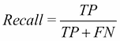
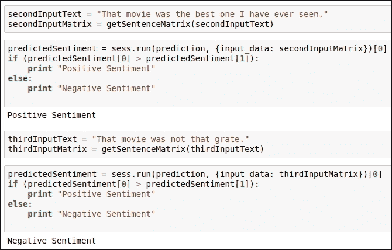

# 第五章：情感分析

到目前为止，我们在分析领域探索了一些真正酷的应用。在本章中，我们将探讨著名的自然语言处理（NLP）技术，你可能已经猜到了，因为章节的名称。绝对正确；我们将构建一个基于情感分析的应用。一般来说，每个人对基于情感分析的应用都很熟悉。如果你不熟悉，那么不用担心。我们将讨论和理解所有必要的细节。

首先，我想给你一个关于情感分析的基本概念。我会提供一个例子，这样你就能更容易理解。无论我们住在哪里，我们都会看电影。如今，我们在各种社交媒体平台上阅读评论或他人的意见。然后，如果大多数关于电影的评论都是好的，那么我们就看那部电影。如果评论不令人印象深刻，我们可能不会看那部电影。所以在这个过程中，我们的思维分析了这些意见，并将它们分类为正面意见、负面意见或中性意见。在本章中，我们将进行同样的分析。

让我介绍情感分析的正确定义。情感分析是一种技术，我们考虑一个句子、段落、文档或任何以自然语言形式存在的信息，并确定该文本的情感基调是正面、负面还是中性。我们将应用机器学习和深度学习来构建情感分析应用。

在本章中，我们将涵盖以下主题：

+   介绍问题陈述

+   理解数据集

+   为基线模型构建训练和测试数据集

+   基线模型的特征工程

+   选择机器学习（ML）算法

+   训练基线模型

+   理解测试矩阵

+   测试基线模型

+   现有方法的问题

+   如何优化现有方法

    +   理解优化方法的关键概念

+   实施修订后的方法

    +   测试修订后的方法

    +   理解修订后方法的问题

+   最佳方法

    +   实施最佳方法

+   摘要

# 介绍问题陈述

我们生活在一个竞争激烈的世界。在购买任何产品，或者在我们投入时间或金钱到任何事物之前，我们试图了解其他人对此产品（或服务）的看法。我们尝试分析他们的评论或意见。如果我们发现它们是积极的且值得信赖的，那么我们会购买该产品，并在该特定服务上投资我们的金钱或时间。另一方面，如果我们发现这些意见或评论是负面的，那么我们可能不会购买该产品，也不会在该特定服务上投资我们的金钱或时间。在互联网时代，在社交媒体平台、博客、新闻来源等地方找到评论很容易。这种分析评论的活动对消费者以及产品或服务提供商都有用。这是因为，基于客户的评论，他们可以有效地改变他们的产品，为他们的客户提供更多的满足，并从该产品或服务中获得良好的利润。我已经给你们提供了情感分析的正确定义，所以我不想再重复一遍。让我们尝试理解本章的主要关注点是什么。

我们将开发一个针对电影评论的情感分析应用程序。在训练过程中，我们将考虑与每条电影评论相关的标签，以便我们可以根据给定的标签训练我们的机器学习算法。训练完成后，当我们传递任何未见过的电影评论时，我们的训练好的机器学习算法将预测情感，这意味着提供的电影评论是否表示积极的情感或消极的情感。

我们将考虑使用 IMDb（互联网电影数据库）电影评论数据集来开发电影评论的情感分析。我们将在下一节中查看有关数据集的详细信息。

# 理解数据集

在本节中，我们将查看我们的数据集。我们考虑了一个 IMDb 数据集，您可以在以下链接下载：[`ai.stanford.edu/~amaas/data/sentiment/`](http://ai.stanford.edu/~amaas/data/sentiment/)。点击此链接后，您会看到页面上提供了一个链接。此链接的标题为 Large Movie Review Dataset v1.0；我们需要点击它。这样，我们就可以下载 IMDb 数据集。一旦您下载了数据集，您需要解压 .tar.gz 文件。一旦解压了 `.tar.gz` 文件，您会看到提取的文件夹中有两个文件夹和一些其他文件。让我们在下一节中查看每个部分。

## 理解数据集的内容

在解压数据集文件后，我们会看到其中有一些文件夹和文件。我们将讨论所有内容的含义以及我们将用于训练目的的内容。此数据集包含两个文件夹和三个文件：

+   train 文件夹

+   test 文件夹

+   `imdb.vocab` 文件

+   `imdbEr.txt`

+   README

### Train 文件夹

这个文件夹包含用于训练的数据。在这个文件夹内，有两个主要文件夹。`pos`文件夹包含正面电影评论，而`neg`文件夹包含负面电影评论。在`pos`文件夹内，有 12,500 条正面电影评论。在`neg`文件夹内，有 12,500 条负面电影评论。所以总共我们有 25,000 条电影评论；通过使用它们，我们将训练我们的机器学习（ML）模型。为了测试目的，我们可以使用`unsup`文件夹内提供的电影评论。这些电影评论是无标签的，因此我们可以使用它们进行测试，或者将我们的标记数据分成训练和测试组，这样我们就可以更容易地了解我们的训练 ML 模型的工作情况。

训练文件夹内还有其他文件，但我们不会使用它们。这些文件包含已经标记化的词袋（BOW）特征的数据。为了清楚地了解目录结构，你可以参考以下图中提供的代码片段：

图 5.1：训练文件夹的目录结构

如果你想更详细地探索数据集，可以参考以下提供的文档：[`www.paddlepaddle.org/docs/0.10.0/documentation/en/tutorials/sentiment_analysis/index_en.html`](http://www.paddlepaddle.org/docs/0.10.0/documentation/en/tutorials/sentiment_analysis/index_en.html)。

### 测试文件夹

这个文件夹包含用于测试的数据。在这个文件夹内，有`pos`和`neg`文件夹，分别包含正面和负面的电影评论。每个文件夹包含 12,500 条电影评论，所以总共我们有 25,000 条电影评论用于测试。这些电影评论被标记为正面，这样我们就可以使用这个数据集来测试我们的训练模型。还有其他`BOW`文件和`url`文件，我们不会使用。你可以在以下图中看到测试文件夹的目录结构：

图 5.2：测试文件夹的目录结构

### imdb.vocab 文件

这个文件包含所有电影评论中使用的唯一单词，因此它是`IMDb`数据集的词汇表文件。如果你打开这个文件，你可以看到单词，并观察到它们都是唯一的。你可以在以下图中看到这个文件的内容：

图 5.3：imdb.vocab 文件的内容

### imdbEr.txt 文件

这个文件表示`imdb.vocab`文件中每个标记的预期评分。这意味着所有这些数值都表示`imdb.vocab`文件中每个单词的评分。如果一个单词是正面的，那么数值是一个正浮点数。如果一个单词是负面的，那么数值是一个负浮点值。你可以在以下图中看到文件的内容：

图 5.4：imdb.vocab 文件中每个单词的得分的 imdbEr.txt 文件

### README

此文件包含有关数据集的文档。您可以使用此文件获取基本信息。

注意，为了开发这个情感分析应用，我们将只考虑`train`文件夹中的数据，因为处理高达 50,000 条电影评论需要大量的计算能力，所以我们将只考虑`train`文件夹中的 25,000 条电影评论，并将一些电影评论保留用于测试。现在让我们尝试理解电影评论文件的内容是如何提供的。

## 理解电影评论文件的内容

在`pos`和`neg`文件夹内，有`.txt`文件包含电影评论。`pos`文件夹内的所有`.txt`文件都是正面电影评论。您可以通过以下图中的示例内容进行参考：

图 5.5：来自`pos`文件夹的样本电影评论；文件名为 0_9.txt

电影评论以简单的纯文本形式提供。在这里，我们将进行一个小型的预处理更改，即将`pos`和`neg`文件夹名称分别重命名为`positiveReviews`和`negativeReviews`。这个`IMDb`数据集已经过预处理，所以我们不会进行任何广泛的预处理。您可以通过以下 GitHub 链接下载最终的训练数据集：[`github.com/jalajthanaki/Sentiment_Analysis/blob/master/data.tar.gz`](https://github.com/jalajthanaki/Sentiment_Analysis/blob/master/data.tar.gz)

现在我们需要开始构建我们的情感分析应用的机器学习模型。我们将执行以下步骤：

+   构建训练和测试数据集

+   基线模型的特征工程

+   选择机器学习算法

+   训练基线模型

+   理解测试矩阵

+   测试基线模型

让我们尝试理解所有这些步骤。

# 为基线模型构建训练和测试数据集

在本节中，我们将生成训练数据集和测试数据集。我们将遍历数据集的文件，并将所有以数字 12 开头的文件视为我们的测试数据集。因此，大约 90%的数据集被认为是训练数据集，10%的数据集被认为是测试数据集。您可以在以下图中的代码中参考这一点：

图 5.6：构建训练和测试数据集的代码片段

如您所见，如果文件名以 12 开头，则我们认为这些文件的内容是测试数据集。除了这些文件之外的所有文件都被认为是训练数据集。您可以在以下 GitHub 链接中找到代码：[`github.com/jalajthanaki/Sentiment_Analysis/blob/master/Baseline_approach.ipynb`](https://github.com/jalajthanaki/Sentiment_Analysis/blob/master/Baseline_approach.ipynb).

# 基线模型的特征工程

对于这个应用，我们将使用基本的统计特征提取概念来从原始文本数据中生成特征。在 NLP 领域，我们需要将原始文本转换为数值格式，以便将机器学习算法应用于这些数值数据。有许多技术可用，包括索引、基于计数的向量化、**词频-逆文档频率**（**TF-IDF**）等。我已在第四章中讨论了 TF-IDF 的概念，*使用 TF-IDF 生成特征*：

### 注意

索引主要用于快速数据检索。在索引中，我们提供一个唯一的识别号。这个唯一的识别号可以按字母顺序或基于频率分配。您可以参考此链接：[`scikit-learn.org/stable/modules/generated/sklearn.preprocessing.LabelEncoder.html`](http://scikit-learn.org/stable/modules/generated/sklearn.preprocessing.LabelEncoder.html)

基于计数的向量化将单词按字母顺序排序，如果某个特定单词存在，则其向量值变为 1，否则为 0。向量的大小与我们的训练数据集的词汇表大小相同。您可以参考以下链接中的简单代码：[`github.com/jalajthanaki/NLPython/blob/6c74ddecac03b9aec740ae2e11dd8b52f11c0623/ch5/bagofwordsdemo/BOWdemo.py`](https://github.com/jalajthanaki/NLPython/blob/6c74ddecac03b9aec740ae2e11dd8b52f11c0623/ch5/bagofwordsdemo/BOWdemo.py)

在这里，我们使用 scikit-learn 的 TF-IDF 向量化技术。`TfidfVectorizer`函数将一组原始文档转换为 TF-IDF 特征矩阵。如果您对 TF-IDF 不熟悉，我建议您参考[`www.tfidf.com/`](http://www.tfidf.com/)或[`www.packtpub.com/mapt/book/big_data_and_business_intelligence/9781787121423/5`](https://www.packtpub.com/mapt/book/big_data_and_business_intelligence/9781787121423/5)。

您可以参考以下图中提供的代码片段：

图 5.7：使用 TF-IDF 生成特征向量的代码片段

正如您在前面用于生成 TF-IDF 特征向量的代码片段中所看到的，我们定义了一些参数，我想对此进行适当的解释：

+   `min_df`：此参数为文档频率提供了一个严格的下限。我们将此参数设置为 5。因此，在数据集中出现次数少于 5 次的术语将不会被考虑用于生成 TF-IDF 向量。

+   `max_df`：此参数忽略具有严格高于给定阈值的文档频率的术语。如果此参数的值为浮点数，则表示文档的比例。我们将参数值设置为 0.8，这意味着我们考虑了数据集的 80%。

+   `sublinear_tf`: 此参数用于应用缩放。默认情况下，此参数的值为 False。如果其值为 True，则 tf 的值将被替换为*1+log(tf)*公式。此公式将帮助我们对我们词汇表进行缩放。

+   `use_idf`: 此参数表示是否启用了 IDF 重新加权机制。默认情况下，IDF 重新加权是启用的，因此此参数的标志值为 True。

这里使用了两种方法，如下所示：

+   `fit_transform()`: 通过使用此方法，你已经学习了词汇和 IDF，并且此方法返回词-文档矩阵。

+   `transform()`: 此方法将文档转换为文档-词矩阵。此方法使用从 fit_transform 方法中学习到的词汇和文档频率。

你可以在以下 GitHub 链接中找到前面的代码 [`github.com/jalajthanaki/Sentiment_Analysis/blob/master/Baseline_approach.ipynb`](https://github.com/jalajthanaki/Sentiment_Analysis/blob/master/Baseline_approach.ipynb)。

现在我们来看看哪种算法最适合构建基线模型。

# 选择机器学习算法

情感分析是一个分类问题。有一些算法对我们非常有帮助。在电影评论中，你可能会发现有些短语出现得相当频繁。如果这些常用短语表明某种情感，那么很可能是表明积极情感或消极情感的短语。我们需要找到表明情感的短语。一旦我们找到了表明情感的短语，我们只需要将情感分类为积极情感类别或消极情感类别。为了确定实际的情感类别，我们需要识别最可能出现的积极短语和最可能出现的消极短语的概率，以便基于更高的概率值，我们可以确定给定的电影评论属于积极情感还是消极情感。我们将考虑的概率是先验概率和后验概率值。这是朴素贝叶斯算法的基本基础。因此，我们将使用多项式朴素贝叶斯算法。除此之外，我们还将使用**支持向量机**（**SVM**）算法。我们将使用不同类型的核技巧来实现它。

如果您想了解更多关于朴素贝叶斯的信息，可以参考[`www.saedsayad.com/naive_bayesian.html`](http://www.saedsayad.com/naive_bayesian.html)，如果您想了解更多关于 SVM 的信息，可以参考：[`www.analyticsvidhya.com/blog/2017/09/understaing-support-vector-machine-example-code/`](https://www.analyticsvidhya.com/blog/2017/09/understaing-support-vector-machine-example-code/) 或 [`www.packtpub.com/mapt/book/big_data_and_business_intelligence/9781787121423/8/ch08lvl1sec77/understanding-ml-algorithms-and-other-concepts`](https://www.packtpub.com/mapt/book/big_data_and_business_intelligence/9781787121423/8/ch08lvl1sec77/understanding-ml-algorithms-and-other-concepts)。

在下一节中，我们将查看帮助我们执行训练的代码。

# 训练基线模型

在本节中，我们将查看帮助我们在实际训练数据集上执行实际训练的代码。我们首先查看实现，然后我将逐步解释代码。在这里，我们将实现朴素贝叶斯和 SVM 算法。对于实现，我们将使用 scikit-learn 库。您可以在以下 GitHub 链接找到代码：[`github.com/jalajthanaki/Sentiment_Analysis/blob/master/Baseline_approach.ipynb`](https://github.com/jalajthanaki/Sentiment_Analysis/blob/master/Baseline_approach.ipynb)。

## 实现基线模型

为了理解基线模型实现，您可以参考以下代码片段：

图 5.8：使用朴素贝叶斯和 SVM 进行训练的代码片段

我们在这里实现了以下四种算法：

+   多项式朴素贝叶斯

+   带核函数 rbf 的 C 支持向量机分类

+   带核函数线性的 C 支持向量机分类

+   线性支持向量机分类

### 多项式朴素贝叶斯

如前述代码片段所示，我们使用了多项式朴素贝叶斯。多项式朴素贝叶斯分类器适用于具有离散特征的分类，这意味着如果特征是词频或 TF-IDF 向量，则可以使用此分类器。多项式分布通常需要整数特征计数。然而，如 TF-IDF 之类的分数计数也可能有效。因此，我们必须将此算法应用于`train_vectors`。`fit()`方法是实际训练执行的步骤。在这里，我们默认使用了所有超参数。

### 带核函数 rbf 的 C 支持向量机分类

我们还实现了具有*rbf*核的支持向量机。核是一个帮助训练算法的函数。*rbf*核函数的方程如下：

### 带核函数线性的 C 支持向量机分类

我们还实现了具有线性核的支持向量机。线性核函数的方程如下：

### 线性支持向量分类

我们还使用了线性支持向量分类。我们将使用`LinearSVC()`方法类型来实现这种分类。这与带有参数`kernel=linear`的 SVC 类似，但它是基于 liblinear 而不是`libsvm`实现的，因此它在选择惩罚和损失函数方面具有更大的灵活性，并且应该更好地扩展到大量样本。

对于所有前面的机器学习算法，我们已经提供了输入，即`train_vectors`和`train_labels`。我们将通过使用测试向量和比较预测标签与实际的`test_labels`来测试机器学习模型的准确性。在进行测试之前，我们将决定使用哪种类型的测试参数。因此，让我们看看测试矩阵。

# 理解测试矩阵

在本节中，我们将探讨我们应该考虑的测试矩阵，以评估训练好的机器学习模型。对于基线方法，我们将使用以下五个测试矩阵：

+   精确度

+   召回率

+   F1 分数

+   支持度

+   训练准确度

在我们理解这些术语之前，让我们先了解一些基本术语，这将有助于我们理解前面的术语。

+   **真阳性**（**TP**）—如果分类器预测给定的电影评论带有积极情感，而在实际情况下该电影评论也是积极情感，那么这类测试案例被认为是 TP。因此，你可以将 TP 定义为测试结果检测到实际上存在的情况。

+   **真阴性**（**TN**）—如果分类器预测给定的电影评论带有消极情感，而在实际情况下该电影评论也是消极情感，那么这类测试案例被认为是真阴性（TN）。因此，你可以将 TN 定义为测试结果没有检测到实际上不存在的情况。

+   **假阳性**（**FP**）—如果分类器预测给定的电影评论带有积极情感，而在实际情况下该电影评论是消极情感，那么这类测试案例被认为是假阳性（FP）。因此，你可以将 FP 定义为测试结果检测到实际上不存在的情况。这就像是一个错误的警报。

+   **假阴性**（**FN**）—如果分类器预测给定的电影评论带有消极情感，而在实际情况下该电影评论是积极情感，那么这类测试案例被认为是假阴性（FN）。因此，你可以将 FN 定义为测试结果没有检测到实际上存在的情况。这是某些条件被忽视的情况。

现在我们将查看所有五个主要测试矩阵，这些矩阵使用了 TP、TN、FP 和 FN 术语。

## 精确度

精确度是分类器为原本属于正类标签的样本分配正类标签的能力。精确度不会为原本属于负类标签的给定样本分配正类标签。生成精确度分数的公式如下：

## 召回率

召回率是分类器找到所有正样本的能力。生成召回率分数的公式如下：

## F1 分数

F1 分数是精确度和召回率的调和平均值。所以你可以找到以下方程：

## 支持度

支持度是每个类别在真实目标标签中出现的次数。支持度的值在计算精确度、召回率和 F1 分数的平均值时很有帮助。你可以看到计算精确度、召回率和 F1 分数平均值的公式如下：

实际使用前面公式进行的计算将在*测试基线模型*部分提供。所以请稍等片刻，我们将看到实际的测试结果。

## 训练准确度

训练准确度指导我们获得开发任何机器学习应用的正确方向。我们在测试数据集上测试训练好的机器学习模型。当我们进行这项测试时，我们拥有每个测试记录的实际情感类标签，我们也拥有所有测试记录的预测情感类标签，因此我们可以比较结果。所以，预测测试数据集的标签集合必须与实际测试数据集中的相应标签集合完全匹配。我们计算我们的预测标签与实际标签相同的记录，然后将这个计数转换为百分比。

在下一节中，我们将看到每个实现机器学习算法的所有测试矩阵，然后我们将决定哪个算法表现良好。所以，让我们看看测试基线模型的实现。

# 测试基线模型

在这里，我们将查看执行实际测试的代码片段。我们将获取到目前为止所解释的所有测试矩阵。我们将测试所有不同的机器学习算法，以便我们可以比较准确度分数。

## 多项式朴素贝叶斯测试

你可以在下面的图中看到多项式朴素贝叶斯算法的测试结果：

图 5.9：测试多项式朴素贝叶斯算法的代码片段

如你所见，使用这个算法我们实现了 81.5%的准确度分数。

## 使用 rbf 核的 SVM 测试

你可以在下面的图中看到使用 rbf 核的 SVM 算法的测试结果：

图 5.10：使用 rbf 核测试 SVM 的代码片段

如您所见，我们在测试数据集上进行了测试，并获得了 65.4%的准确率。

## 使用线性核测试 SVM

您可以在以下图中看到使用线性核算法的 SVM 的测试结果：

图 5.11：测试使用线性核的 SVM 的代码片段

如您所见，我们在测试数据集上进行了测试，并获得了 83.6%的准确率。

## 使用 linearSVC 测试 SVM

您可以在以下图中看到使用 linearSVC 核算法的 SVM 的测试结果：

图 5.12：测试使用 linearSVC 核的 SVM 的代码片段

我们在这里对测试数据集进行了测试，并获得了 83.6%的准确率。

因此，在看到每个实现算法的准确率得分后，我们可以说，使用线性核和 linearSVC 的 SVM 表现非常好。现在，您可能会想知道我们是否可以提高准确率。我们当然可以做到。那么，让我们讨论这个基线方法中存在的问题。

# 现有方法的问题

在基线方法中，我们获得了很高的准确率。然而，我们忽略了以下这些点，这些点我们可以在我们的改进方法中实现：

+   我们没有关注基于词嵌入的技术

+   **深度学习**（**DL**）算法，如 CNN，对我们可能有所帮助

我们需要关注这两个点，因为基于词嵌入的技术确实有助于保留文本的语义。因此，我们应该使用这些技术以及基于深度学习算法，这有助于我们提供更高的准确率，因为当涉及嵌套数据结构时，深度学习算法表现良好。我所说的嵌套数据结构是什么意思呢？这意味着任何由短语组成的书面句子或口头句子，短语由单词组成，依此类推。因此，自然语言具有嵌套数据结构。深度学习算法帮助我们理解文本数据集中的句子嵌套结构。

# 如何优化现有方法

有某些技术可以帮助我们改进这个应用程序。以下是可以帮助我们改进基线方法的关键技术：

+   我们可以使用基于词嵌入的技术，如 Word2Vec、glove 等

+   我们还应该实现**卷积神经网络**（**CNN**）来了解深度学习算法如何帮助我们

因此，在改进方法中，我们将重点关注词嵌入技术和深度学习算法。我们将使用具有 TensorFlow 后端的 Keras。在实施之前，让我们详细了解改进方法。

## 理解优化方法的关键概念

在本节中，我们将详细了解改进方法，以便我们知道应该实施哪些步骤。我们正在使用 Keras，这是一个提供高级 API 的深度学习库，使我们能够轻松实现 CNN。以下步骤包括：

+   **导入依赖项**：在这个步骤中，我们将导入不同的依赖项，如 Numpy 和 Keras（使用 TensorFlow 后端）。我们将使用 Keras 库的不同 API。

+   **下载和加载 IMDb 数据集**：在这个步骤中，我们将下载 IMDb 数据集，并使用 Keras API 加载此数据集。

+   **选择高频词和最大文本长度**：在这个阶段，我们将设置我们可以在词嵌入阶段使用的词汇表值。因此，我们选择了前 10,000 个高频词。之后，我们将电影评论的长度限制为 1600 个字符。

+   **实现词嵌入**：在代码的这个阶段，我们将使用 Keras 的默认嵌入技术，并生成长度为 300 的词向量。

+   **构建 CNN**：在这个阶段，我们将构建一个三层神经网络，其中第一层有 64 个神经元，第二层有 32 个神经元，最后一层有 16 个神经元。在这里，我们使用 sigmoid 作为激活函数。激活函数为神经网络引入非线性，这样我们就可以使用数学函数为每个类别生成一个概率分数。

+   **训练并获得准确率**：最后，我们将训练模型并生成准确率分数。我们将 epoch 值设置为 3，将 adam 作为优化函数，我们的损失函数是`binary_crossentropy`。Epoch 基本上表示我们需要在全部数据集上执行训练的次数。交叉熵损失衡量的是输出概率值在 0 到 1 之间的分类器的性能。当预测概率与实际标签不同时，交叉熵损失会增加。训练完成后，我们将生成模型的准确率。这个训练阶段可能需要时间，以及大量的计算能力。

现在让我们看看下一节中的代码。

# 实现改进方法

在本节中，我们将以代码片段的形式展示实现。我们将遵循之前章节中看到相同的步骤。所以，无需任何延迟，让我们来看看代码。您可以通过以下 GitHub 链接参考此代码：[`github.com/jalajthanaki/Sentiment_Analysis/blob/master/Revised_approach.ipynb`](https://github.com/jalajthanaki/Sentiment_Analysis/blob/master/Revised_approach.ipynb)。

## 导入依赖项

您可以在以下图中的代码片段中找到导入的依赖项：

图 5.13：我们可以看到导入依赖项的代码片段

如您所见，我们使用了 TensorFlow 后端和 Keras 库。

## 下载和加载 IMDb 数据集

您可以在以下图中参考代码片段，其中也可以找到下载和加载 IMDb 数据集的代码：

图 5.14：下载和加载 IMDb 数据集的代码片段

我们还设置了词汇的值。

## 选择顶级词汇和最大文本长度

在这个阶段，我们已经设置了顶级词汇值以及最大文本长度值。您可以参考以下图中的代码片段：

图 5.15：设置词汇值和最大文本长度值的代码片段

在代码的第一部分，我们将 top_word 参数设置为 10,000，在代码的第二部分，我们将电影评论的长度设置为 1,600。top_word 表示词汇表的大小。从我们的数据集中，我们选择了前 10,000 个独特的单词。大多数电影评论中的单词都包含在我们的词词汇表中。在这里，我们不是处理非常长的电影评论，因此我们设置了电影评论的长度。

## 实现词嵌入

在这个阶段，我们实现了默认的 Keras 词嵌入方法，以获得一个大小为 300 的特征向量。您可以参考以下代码片段：

图 5.16：基于词嵌入技术获取词特征向量的代码片段

## 构建卷积神经网络（CNN）

在本节中，您可以参考代码，这将帮助您理解神经网络架构。在这里，我们使用了卷积神经网络（CNN），因为它处理数据集的高级特征或嵌套结构非常出色。您可以参考以下图中的代码片段：

图 5.17：构建卷积神经网络（CNN）的代码片段

在这里，我们构建了一个包含两个密集层的神经网络。

## 训练和获取准确率

在这个阶段，我们已经完成了训练。您可以参考以下图中的代码：

图 5.18：在训练数据集上执行训练的代码片段

在这里，我们将进行三次训练，因为我们的 epoch 值设置为 3。由于情感分析是一个二元问题，我们使用了`binary_crossentropy`作为损失函数。如果您有一台基于 GPU 的计算机，那么训练时间会更短；否则，这一步会花费更多的时间和计算能力。

一旦完成训练，我们就可以获得训练准确率。对于训练准确率，您可以参考以下图：

图 5.19：获取训练准确率的代码片段

在这里，准确率是训练准确率。现在我们需要获得测试准确率，因为这将给我们一个关于训练模型在未见数据上表现如何的实际想法。那么，让我们看看测试准确率是多少。

## 测试改进的方法

在本节中，我们将获得测试数据集的准确率。您可以在以下图中的代码片段中参考：

图 5.20：获取测试准确率的代码片段

在获得测试准确率后，我们得到了 86.45%的准确率。这个测试准确率比我们的基线方法更好。现在让我们看看我们可以改进哪些方面，以提出最佳方法。

## 理解改进方法中的问题

在本节中，我们将讨论我们可以改进的改进方法的哪些方面。这些是我们可以实现以获得最佳可能方法的点：

+   我们可以使用预训练的 Word2Vec 或 GloVe 模型来生成词向量

+   我们应该使用具有 LSTM 的循环神经网络来获得更好的输出

在本节中，我们将了解并实现最佳方法，其中我们将加载预训练的 GloVe（全局词向量）模型，并使用 RNN 和 LSTM 网络。

# 最佳方法

为了获得最佳方法，我们可以遵循以下步骤。在这个方法中，我们使用了 GloVe 预训练模型，并使用 RNN 和 LSTM 网络进行模型训练。GloVe 模型在大型数据集上进行了预训练，以便为单词生成更准确的向量值。这就是我们在这里使用 GloVe 的原因。在下一节中，我们将查看最佳方法的实现。所有代码都可以在这个 GitHub 链接中找到：[`github.com/jalajthanaki/Sentiment_Analysis/blob/master/Best_approach_sentiment_analysis.ipynb`](https://github.com/jalajthanaki/Sentiment_Analysis/blob/master/Best_approach_sentiment_analysis.ipynb)。

## 实现最佳方法

为了实现最佳方法，我们将执行以下步骤：

+   加载 GloVe 模型

+   加载数据集

+   预处理

+   加载预计算的 ID 矩阵

+   划分训练和测试数据集

+   构建神经网络

+   训练神经网络

+   加载训练模型

+   测试训练模型

### 加载 GloVe 模型

为了获得最佳性能，我们将使用预训练的 GloVe 模型。您可以在[`nlp.stanford.edu/projects/glove/`](https://nlp.stanford.edu/projects/glove/)下载它。我们已生成二进制文件并将其保存为`.npy`扩展名。此文件与`wordsList.npy`文件一起。您可以在以下图中的代码片段中参考：

图 5.21：加载 GloVe 预训练模型的代码片段

词向量的维度是 50，该模型包含 400,000 个单词的词向量。

### 加载数据集

您可以参考以下代码片段：

图 5.22：加载数据集的代码片段

我们总共考虑了 25,000 条电影评论。

### 预处理

您可以参考以下图中的代码片段：

图 5.23：执行预处理的代码片段

### 加载预计算的 ID 矩阵

在本节中，我们正在为每个单词生成索引。这个过程计算量很大，所以我已经生成了索引矩阵并使其准备好加载。您可以参考以下图中的代码片段：

图 5.24：生成单词 ID 矩阵的代码片段

### 分割训练和测试数据集

在本节中，我们将看到生成训练和测试数据集的代码片段。您可以参考以下图中的代码片段：

图 5.25：将数据集分割成训练集和测试集的代码片段

### 构建神经网络

我们已经使用了一个**循环神经网络**（**RNN**）和作为其隐藏状态一部分的**长短期记忆单元**（**LSTMs**）。LSTM 单元用于存储序列信息。如果您有多个句子，那么 LSTM 存储前一个或前前个句子的上下文，这有助于我们改进此应用。如果您想详细了解 LSTM，可以参考[`colah.github.io/posts/2015-08-Understanding-LSTMs/`](http://colah.github.io/posts/2015-08-Understanding-LSTMs/)。

您可以参考以下图中的代码片段：

图 5.26：构建具有 LSTM 的 RNN 的代码片段

首先，我们定义超参数。我们将批大小设置为 64，LSTM 单元设置为 64，类别数量设置为 2，然后执行 100,000 次迭代。

### 训练神经网络

在本节中，您可以参考以下图中的代码片段，该代码片段用于执行训练：

图 5.27：执行训练的代码片段

每经过 10,000 次迭代后，我们保存模型。在训练过程中，您可以使用 TensorBoard 来监控进度。您可以参考以下图，它显示了训练期间的进度。您可以在训练期间监控准确率和损失百分比，以便了解深度学习模型在训练过程中的收敛情况：

图 5.28：在 TensorBoard 上训练过程中生成的准确率和损失图

训练耗时且计算量大，因此使用 GPU 可能需要 2-3 小时来训练模型。因此，您可以从 GitHub 下载预训练模型：[`github.com/jalajthanaki/Sentiment_Analysis/blob/master/models.tar.gz`](https://github.com/jalajthanaki/Sentiment_Analysis/blob/master/models.tar.gz)。

### 加载训练好的模型

一旦完成训练，我们就可以保存训练好的模型。加载此模型后，我们可以检查其准确率。您可以参考以下图中的代码片段：

图 5.29：生成测试准确率的代码片段

在这里，我们生成了一个测试准确率为 91.66%。

### 测试训练模型

在本节中，我们将传递新的电影评论，并通过加载训练模型来生成情感预测。你可以参考以下图中的代码片段：

图 5.30：加载训练模型并为电影评论的给定句子生成情感分析的代码片段

在这个片段中，我们传递了一个作为电影评论一部分的句子，我们的训练模型将其识别为负面情感。你也可以参考以下图中的代码片段，它为包含负面词汇的句子生成了情感分析：

图 5.31：加载训练模型并为电影评论的给定句子生成情感分析的代码片段

这种方法能给你带来非常好的结果。

# 摘要

在本章中，我们探讨了如何构建一个能够给出最先进结果的情感分析模型。我们使用了一个包含正面和负面电影评论的 IMDb 数据集，并理解了这个数据集。我们应用了机器学习算法以获得基线模型。之后，为了优化基线模型，我们改变了算法并应用了基于深度学习的算法。我们使用了 glove、RNN 和 LSTM 技术以实现最佳结果。我们学习了如何使用深度学习构建情感分析应用。我们使用 TensorBoard 来监控我们模型的训练进度。我们还简要介绍了用于开发情感分析的现代机器学习算法以及深度学习技术，深度学习方法在这里效果最佳。

我们使用 GPU 来训练神经网络，所以如果你发现你的端需要更多的计算能力来训练模型，那么你可以使用 Google Cloud 或**亚马逊网络服务**（**AWS**）基于 GPU 的实例。我已经上传了预训练模型，所以你也可以直接使用它。你可以在以下 GitHub 链接中找到预训练模型：[`github.com/jalajthanaki/Sentiment_Analysis/blob/master/models.tar.gz`](https://github.com/jalajthanaki/Sentiment_Analysis/blob/master/models.tar.gz)。

在下一章中，我们将构建一个工作推荐系统，帮助人们找到工作，特别是与他们感兴趣的工作档案相关的工作。对于工作推荐系统，我们将使用各种资源来链接简历、工作搜索查询等。同样，我们将使用机器学习和深度学习系统来开发这个系统。
