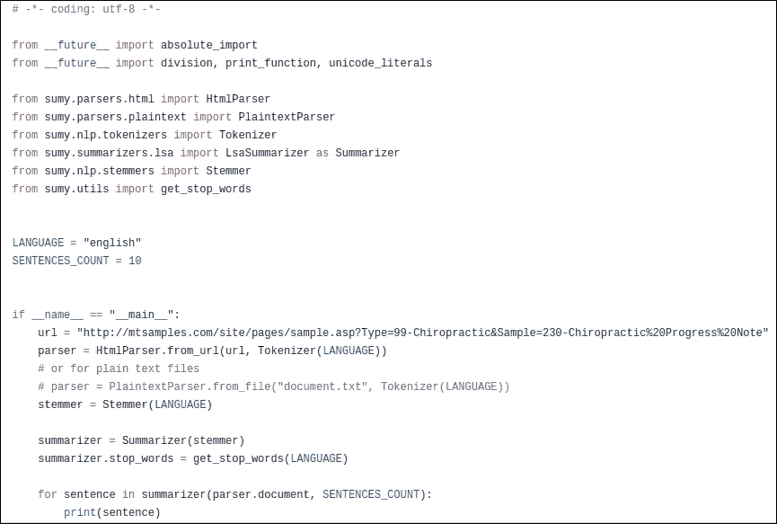
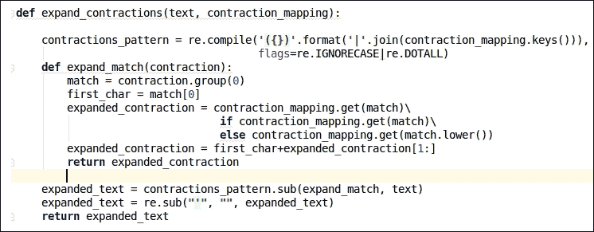
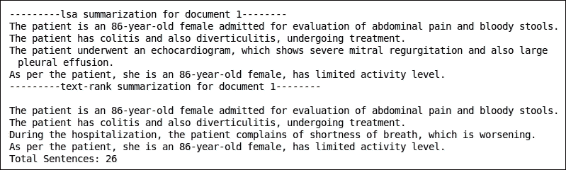

# 第七章 文本摘要

在本章中，我们将构建摘要应用。我们将特别关注文本数据集。我们的主要目标是针对病历进行摘要任务。基本上，我们的想法是提出一个很好的解决方案来总结医学转录文档。

这种摘要应用以极大的方式帮助医生。你问如何？让我们举一个例子。假设一个患者有 10 年的某种疾病病史，10 年后，他为了更好的结果而咨询一位新医生。在第一天，患者需要将他们过去 10 年的医疗处方交给这位新医生。之后，医生将需要研究所有这些文件。医生还依赖于他与患者之间的对话。通过使用病历和与患者的对话，医生可以了解患者的健康状况。这是一个相当费时的方法。

然而，如果我们能够为患者的病历生成摘要并提供这些摘要文档给医生，会怎样呢？这似乎是一个很有前景的解决方案，因为这样我们可以节省医生的时间和精力。医生可以以高效和准确的方式了解他们的患者问题。患者可以从与医生的第一次会面开始接受治疗。这对双方都是双赢的局面，这正是我们在这里试图构建的解决方案。因此，在本章中，我们将涵盖以下主题：

+   理解摘要的基本原理

+   介绍问题陈述

+   理解数据集

+   构建基线方法：

    +   实现基线方法

    +   基线方法的缺陷

    +   优化基线方法

+   构建修订的方法：

    +   实现修订的方法

    +   修订方法的缺陷

    +   理解如何改进修订的方法

+   最佳方法：

    +   实现最佳方法

+   最佳方法：为亚马逊评论构建摘要应用

+   摘要

# 理解摘要的基本原理

在本节中，我们将关注摘要的基本概念。在当今信息快速发展的时代，文本摘要已成为一个重要的工具。人类为大型文本文档生成摘要将变得困难。如今，网络上有很多文档。因此，我们需要一个能够高效、准确、智能地自动生成文档摘要的解决方案。这项任务被称为自动文本摘要。

自动文本摘要主要是关于在很短的时间内从大量文本文档中找到相关信息。基本上，有两种类型的摘要：

+   提取式摘要

+   抽象式摘要

让我们逐一看看摘要的类型。

## 提取式摘要

在提取式摘要方法中，我们将通过从原始文档中选择单词、短语或句子来生成文档的摘要。我们将使用诸如**词频-逆文档频率（TF-IDF**）、计数向量器、余弦相似度和排名算法等概念来生成此类摘要。

我们已经在第四章 *电子商务推荐系统* 的 *理解 TF-IDF* 部分介绍了 TF-IDF、计数向量器和余弦相似度等概念。当我们在本章中实现代码时，我们将探讨排名机制。

## 抽象摘要

在抽象摘要方法中，我们将尝试让机器学习内部语言表示，以便通过释义生成更类似人类的摘要。

为了实现此类摘要，我们将使用深度学习算法，如具有注意力机制的序列到序列模型。你将在本章后面部分了解该算法和概念。

# 介绍问题陈述

在本章开头，我们已经概述了问题陈述。在这里，我们将进一步深入细节。我们想要构建一个自动文本摘要应用程序。我们将提供一个医疗转录文档作为输入。我们的目标是生成该文档的摘要。请注意，在这里，我们将提供一个单独的文档作为输入，并且作为输出，我们将生成该单个文档的摘要。我们希望生成一个信息性摘要。信息性摘要是一种摘要，其中摘要文档在信息聚合方面是原始文档的替代品。这是因为我们正在处理医疗领域。

最初，我们在我们的方法中使用提取式摘要方法。我们将为医疗文档生成提取式摘要。在本章的后面部分，我们还将开发一个可以生成亚马逊评论抽象摘要的解决方案。

现在，是时候探索数据集并查看我们在访问数据集时面临的挑战了。

# 理解数据集

本节分为两部分。在第一部分，我们需要讨论我们在生成数据集时面临的挑战。在后面的部分，我们将讨论数据集的属性。

## 获取数据集的挑战

如我们所知，在获取数据集方面，健康领域是一个高度监管的领域。以下是我想要强调的一些挑战：

+   对于摘要，理想情况下，我们需要一个包含原始文本及其摘要的语料库，这被称为并行语料库。不幸的是，目前没有好的、免费的并行语料库可用于医学文档摘要。我们需要获取这种类型的英语并行数据集。

+   有一些免费的数据集可用，例如 MIMIC II 和 MIMIC III 数据集，但它们不会包含医学转录的摘要。我们只能从这个数据集中获取医学转录。获取这个数据集是一个漫长且耗时的过程。

为了解决上述挑战，专业人士、研究人员、学者和大型科技公司需要站出来，为医学领域提供高质量、免费的数据集。现在让我们看看如何获取医学转录数据集。

## 理解医学转录数据集

你可能会想知道如果没有并行数据集，我们如何构建摘要应用？这里有一个解决方案。我有一个来自 MIMIC – II 数据集的样本医学转录。我们将使用这些数据并生成文档的提取摘要。除此之外，我们还将参考[www.mtsamples.com](http://www.mtsamples.com)以了解我们可能拥有的不同类型的医学转录。通过使用最少数量的文档，我们将构建摘要应用。你可以在下面的图中看到这些医学转录的样子：


图 7.1：样本医学转录

通常，在医学转录中，有几个部分，具体如下：

+   **主诉**: 本节描述了患者面临的主要问题或疾病

+   **患者病史**: 本节详细描述了患者的医疗状况及其类似疾病或其他类型疾病的病史

+   **既往病史**: 本节描述了患者过去所患疾病的名称

+   **既往手术史**: 如果患者过去有过手术，那么这些手术的名称将在此处提及

+   **家族史**: 如果家庭成员有相同类型的疾病或家族中存在某些疾病的病史，那么这些信息将在此节中提及

+   **药物**: 本节描述了药物名称

+   **体格检查**: 本节包含所有与体格检查相关的描述

+   **评估**: 本节包含在考虑所有先前参数后，患者可能患有的潜在疾病的详细信息

+   **建议**: 本节描述了针对患者投诉的推荐解决方案

+   **关键词**：本节包含可以正确描述整个文档的关键词，因此数据集也可以用于主题建模任务

这种转录在某个部分是随机的。一些转录包含所有前面的部分，而一些则不包含。因此，这种文档的章节数量可能会有很大的变化。

现在让我们看看与亚马逊评论数据集相关的细节。

## 理解亚马逊评论数据集

在本章的后面部分，我们将使用亚马逊评论数据集来生成摘要。因此，了解这个数据集的基本数据属性会更好。首先，您可以通过使用此链接下载该数据集：[`www.kaggle.com/currie32/summarizing-text-with-amazon-reviews/data`](https://www.kaggle.com/currie32/summarizing-text-with-amazon-reviews/data)。您需要下载的文件名为`Reviews.csv`。

您可以通过参考以下截图来查看这个数据集的内容：


图 7.2：来自亚马逊评论数据集的数据记录

让我们了解这个数据集的每个数据属性：

+   `ID`：这个属性表示数据记录的序列号。

+   `ProductId`：这个属性表示特定产品的唯一 ID。

+   `UserId`：这个属性表示分享特定产品评论的用户的唯一用户 ID。

+   `ProfileName`：这个数据属性是用户的个人资料名称。使用这个个人资料名称，用户将提交他们的评论。

+   `HelpfulnessNumerator`：这个属性表示有多少其他用户认为这条评论在积极方面是有用的。

+   `HelpfulnessDenominator`：这个属性表示对这条评论是否有用进行投票的总用户数。

+   `Score`：这是特定产品的评分。零表示用户不喜欢它，而五表示用户非常喜欢它。

+   `Time`：这个属性表示评论提交的时间戳。

+   `Summary`：这个属性非常有用，因为它表示整个评论的摘要。

+   `Text`：这个属性是任何给定产品的长文本评论。

现在我们已经看过这两个数据集了。让我们继续到下一节。

# 构建基线方法

在本节中，我们将实现文本摘要应用的基线方法。我们将使用医疗转录来生成摘要。在这里，我们将使用一个小型的 MIMIC-II 数据集进行试验，该数据集包含一些样本医疗文档，以及[www.mtsamples.com](http://www.mtsamples.com)来获取医疗转录。您可以通过使用此 GitHub 链接找到代码：[`github.com/jalajthanaki/medical_notes_extractive_summarization/tree/master/Base_line_approach`](https://github.com/jalajthanaki/medical_notes_extractive_summarization/tree/master/Base_line_approach)。

让我们开始构建基线方法。

## 实现基线方法

在此，我们将按照以下步骤构建基线方法：

+   安装 Python 依赖项

+   编写代码并生成摘要

### 安装 Python 依赖项

为了开发摘要应用程序，我们将使用两个非常容易使用的 Python 依赖项。一个是 `PyTeaser`，另一个是 `Sumy`。您需要执行以下命令来安装这两个依赖项：

```py
$ sudo pip install pyteaser
$ sudo pip install sumy or $ sudo pip3 install sumy

```

### 注意

注意，`PyTeaser` 库仅适用于 `python 2.7`。Sumy 可以与 `python 2.7` 和 `python 3.3+` 一起使用。

现在让我们编写代码。

### 编写代码和生成摘要

`PyTeaser` 和 Sumy 库都拥有出色的功能。它们可以将任何网页 URL 作为输入，并为给定的网页 URL 生成摘要。您可以参考以下截图中的代码片段：


图 7.3：使用 PyTeaser 生成摘要的代码片段

如您所见，我们正在传递来自 [www.mtsamples.com](http://www.mtsamples.com) 的样本医学转录的 weburl。`PyTeaser` 库将生成文档的前五句话作为摘要。要查看输出，您可以查看以下截图：


图 7.4：使用 PyTeaser 对医学转录的摘要

现在让我们尝试使用 `Sumy` 库。您可以参考以下截图中的代码：



图 7.5：使用 Sumy 生成摘要的代码片段

在 `Sumy` 库中，我们需要将 weburl 作为输入，但有一个区别。正如您在前面的代码中所看到的，我们提供了 `SENTENCES_COUNT = 10`，这意味着我们的摘要或输出有 10 个句子。我们可以通过使用 `SENTENCES_COUNT` 参数来控制语句的数量。您可以参考以下图中的输出：


图 7.6：使用 Sumy 对医学转录的摘要

如果您查看并比较 `Sumy` 和 `PyTeaser` 库的输出，那么您可以说与 `PyTeaser` 库相比，`Sumy` 库的表现非常好。如您所见，这两个库都获得了给定文档的基本摘要。这些库正在使用排名算法和单词频率来获取摘要。我们无法控制它们的内部机制。您可能会想知道我们是否可以自己进行摘要，以便我们可以根据需要优化代码。答案是肯定的；我们可以为这个任务开发我们的代码。在那之前，让我们讨论这个方法的缺点，然后我们将使用改进的方法构建自己的代码。

## 基线方法的问题

在这里，我们将讨论基线方法的缺点，以便我们可以在下一次迭代中注意这些缺点：

+   如前所述，我们并不完全拥有这些库的代码。因此，我们无法轻松地更改或添加功能。

+   我们已经获得了一种基本的摘要类型，因此我们需要提高摘要的结果。

+   由于缺乏平行语料库，我们无法构建一个可以为医学文档生成摘要的解决方案。

这些是基线方法的三个主要缺点，我们需要解决它们。在本章中，我们将重点关注前两个缺点。对于第三个缺点，我们无法做太多。所以，我们必须忍受这个缺点。

让我们讨论我们将如何优化这种方法。

## 优化基线方法

在本节中，我们将讨论如何优化基线方法。我们将实现一个简单的摘要算法。这个算法背后的思想很简单：这种方法也为医学文档生成提取摘要。我们需要执行以下步骤：

1.  首先，我们需要确定给定文档中单词的频率。

1.  然后，我们将文档拆分为一系列句子。

1.  为了生成摘要，我们选择具有更多频繁单词的句子。

1.  最后，我们重新排序摘要句子，以确保生成的输出与原始文档对齐。

前面的算法可以解决我们的两个缺点，尽管我们可能需要帮助来解决第三个缺点，因为目前没有可用于摘要任务的语料库，尤其是在医学领域。对于这一章，我们必须忍受这个缺点（不幸的是，我们没有其他选择），但不用担心。这并不意味着我们不会学习如何生成摘要。为了学习如何生成摘要，我们将在本章后面使用亚马逊评论数据集。

现在，让我们实现本节中描述的算法步骤。

# 构建修订的方法

现在，我们将编写我们在上一节中讨论的算法。实现后，我们将检查我们的算法表现得好还是不好。这个算法很容易实现，所以让我们从代码开始。您可以在以下 GitHub 链接中找到代码：[`github.com/jalajthanaki/medical_notes_extractive_summarization/tree/master/Revised_approach`](https://github.com/jalajthanaki/medical_notes_extractive_summarization/tree/master/Revised_approach)。

## 实施修订的方法

在本节中，我们将逐步实现摘要算法。以下是我们将在这里构建的函数：

+   `get_summarized` 函数

+   `reorder_sentences` 函数

+   摘要函数

让我们从第一个开始。

### `get_summarized` 函数

基本上，这个函数执行摘要任务。首先，它将以字符串形式将文档内容作为输入。然后，这个函数生成单词的频率，因此我们需要将句子标记化成单词。之后，我们将从给定文档中生成前 100 个最频繁的单词。对于小数据集，前 100 个最频繁的单词可以很好地描述给定数据集的词汇，所以我们不考虑更多的单词。如果您有大数据集，则可以根据数据集的大小考虑前 1,000 个或前 10,000 个最频繁的单词。您可以参考以下图中的代码：


图 7.7：从给定输入文档生成最频繁单词的代码片段

现在我们来编写第二步的代码。我们需要将文档拆分成句子。我们将句子转换为小写。在这里，我们将使用 NLTK 句子分割器。您可以参考以下图中的代码：


图 7.8：从输入文档生成句子的代码片段

在第三步中，我们将遍历最频繁单词的列表，找出包含更多频繁单词的句子。您可以参考以下图中的代码：


图 7.9：生成包含更多频繁单词的句子的代码片段

现在是时候重新排列句子，以便句子顺序与原始输入文档一致。

### reorder_sentences 函数

这个函数基本上重新排列了总结的句子，使得所有句子都与原始文档的句子顺序一致。我们将考虑总结句子和原始文档中的句子，并执行排序操作。您可以参考以下图中的代码：


图 7.10：重新排列总结句子的代码片段

现在我们继续到最后一步。

### summarize 函数

这个函数基本上生成摘要。这是我们可以在任何其他文件中调用的方法。在这里，我们需要传递输入数据和所需总结内容中的句子数。您可以参考以下图中的代码：


图 7.11：定义可以在类外调用的函数的代码片段

### 生成摘要

现在我们来看一下这个代码的演示，并为文档生成摘要。我们将传递来自[www.mtsamples.com](http://www.mtsamples.com)的文本内容，然后尝试生成内容摘要。您可以参考以下图中的代码片段：


图 7.12：调用摘要函数的代码片段

上述代码的输出如下所示：


图 7.13：修订方法的输出

如您所见，输出比基线方法更相关。我们知道我们迄今为止所执行步骤的方法。这种方法让我们清楚地了解如何为医学转录生成提取摘要。这种方法的好处是，我们不需要任何并行摘要语料库。

现在我们来讨论修订方法的缺点。

## 修订方法的问题

在本节中，我们将讨论修订方法的缺点，如下所述：

+   修订方法没有排名机制来根据其重要性对句子进行排名。

+   到目前为止，我们已经考虑了词频；我们还没有考虑它们相对于其他词的重要性。假设词*a*在一篇文档中出现了 1000 次。这并不意味着它具有更大的重要性。

现在我们来看看我们如何克服这些缺点。

## 理解如何改进修订方法

在本节中，我们将讨论我们应该采取的步骤来改进修订方法。为了获得提取摘要的最佳结果，我们需要使用 TF-IDF 和句子排名机制来生成摘要。我们在第四章的*“使用 TF-IDF 生成特征”*部分已经介绍了 TF-IDF。我们将通过使用余弦相似度和 LSA（潜在语义分析）来构建排名机制。我们已经在第四章中了解了余弦相似度。让我们来探索 LSA 算法。

### LSA 算法

LSA 算法类似于余弦相似度。我们将使用文档段落中的单词生成矩阵。矩阵的行将代表每个段落中存在的唯一单词，列代表每个段落。您可以在以下图中查看 LSA 算法的矩阵表示：


图 7.14：LSA 算法的矩阵表示

LSA 算法的基本假设是，意义相近的单词将出现在相似文本中。正如您从前面的例子中可以看到的，如果我们说单词对（猫，是）出现的频率更高，这意味着它比（猫，老鼠）单词对具有更高的语义意义。这是算法背后的假设的含义。我们生成前面图中给出的矩阵，然后尝试使用**奇异值分解**（**SVD**）方法减少矩阵的行数。SVD 基本上是矩阵的分解。

### 注意

您可以通过以下链接了解更多关于奇异值分解（SVD）的信息：[`en.wikipedia.org/wiki/Singular-value_decomposition`](https://en.wikipedia.org/wiki/Singular-value_decomposition)。

在这里，我们正在减少行数（即单词的数量），同时保留列（即段落）之间的相似性结构。为了生成单词对之间的相似度分数，我们使用余弦相似度。这对于构建摘要应用来说已经足够了。

现在，让我们讨论我们采取的方法，以构建生成医学文档提取摘要的最佳解决方案。

### 最佳方法背后的理念

我们将执行以下步骤以构建最佳方法：

1.  首先，我们将以字符串的形式获取文档的内容。

1.  我们将解析句子，然后移除停用词和特殊字符。我们将缩写词转换为它们的完整形式。

1.  之后，我们将生成单词的词元及其**词性**（**POS**）标签。词元不过是单词的词根形式，而词性标签表示单词是作为动词、名词、形容词还是副词使用。有许多词性标签可用。您可以在以下网站上找到词性标签列表：[`www.ling.upenn.edu/courses/Fall_2003/ling001/penn_treebank_pos.html`](https://www.ling.upenn.edu/courses/Fall_2003/ling001/penn_treebank_pos.html)。

1.  我们将为单词生成 TF-IDF 向量的矩阵。

1.  我们将使用`SciPy`库为给定的 TF-IDF 矩阵生成 SVD 矩阵。

1.  最后，使用余弦相似度，我们可以对句子进行排序并生成摘要。

现在，让我们看看这些步骤的实现。

# 最佳方法

在本节中，我们将探讨最佳方法的实现。我们还将讨论代码的结构。因此，让我们不浪费时间，直接开始实施。您可以通过以下 GitHub 链接找到代码：[`github.com/jalajthanaki/medical_notes_extractive_summarization/tree/master/Best_approach`](https://github.com/jalajthanaki/medical_notes_extractive_summarization/tree/master/Best_approach)。

## 实施最佳方法

实现代码所需采取的步骤在以下列表中提供：

1.  理解项目结构

1.  理解辅助函数

1.  生成摘要

让我们从第一步开始。

### 理解项目结构

项目的结构在这里非常重要。我们将有四个不同的文件，我们将在这四个文件中编写代码。您可以在以下图中看到项目的结构：


图 7.15：项目代码文件的结构

有四个代码文件。我将逐一解释它们的用法：

+   `Contractions.py`：此文件包含所有缩写的详尽列表，特别是语法缩写。您可以查看以下图中的缩写列表：

    图 7.16：缩写及其全称列表

+   `Normalization.py`：此文件包含预处理步骤的各种辅助函数

+   `Utils.py`：此文件包含用于计算 TF-IDF 和获取给定 TF-IDF 矩阵的 SVD 矩阵的辅助函数

+   `Document_summarization.py`：此文件使用已定义的辅助函数并为文档生成摘要

现在我们来看看每个文件中定义了哪些辅助函数。

### 理解辅助函数

我们将按文件方式讨论辅助函数，这样您就会了解哪个辅助函数属于哪个文件。

#### Normalization.py

此文件包含许多辅助函数。我将根据其使用顺序解释每个辅助函数：

+   `parse_document`：此函数将文档内容作为输入，并按句子进行分词。这意味着我们按句子分割字符串。在这里，我们将仅考虑 Unicode 字符串。您可以参考以下图中给出的代码片段：

    图 7.17：解析文档的代码片段

+   `remove_special_characters`：此函数将从字符串中删除特殊字符。您可以参考以下图中给出的代码片段以获得更好的理解：

    图 7.18：从字符串中删除特殊字符的代码片段

+   `remove_stopwords`：此函数将从句子中删除停用词。您可以参考以下图中给出的代码片段：

    图 7.19：删除停用词的代码片段

+   `unescape_html`：此函数将从句子中删除 HTML 标签。您可以参考以下图中给出的代码片段：

    图 7.20：删除 HTML 标签的代码片段

+   `pos_tag_text`：此函数将句子分词成单词，之后将为这些单词提供词性标注。您可以参考以下图中给出的代码片段：

    图 7.21：生成词性标注的代码片段

+   `lemmatize_text`：此函数将句子分词成单词，然后生成单词的词元。您可以参考以下图中给出的代码：

    图 7.22：生成单词词元的代码片段

+   `expand_contractions`：这个函数检查缩写。如果给定句子中存在我们列表中的任何缩写，那么我们将用其全称替换该缩写。你可以参考下面图中显示的代码：

    图 7.23：替换缩写为全称的代码片段

+   `normalize_corpus`：这个函数调用所有前面的辅助函数并生成预处理句子。你可以参考下面图中给出的代码：

    图 7.24：生成预处理句子的代码片段

现在我们来看看在`utils.py`文件中定义了哪些函数。

#### Utils.py

在这个文件中，只有两个辅助函数。它们在这里进行了描述。

+   `build_feature_matrixs`：这个函数使用 scikit-learn 的`Tfidfvectorizer` API 生成 TF-IDF 向量。我们提供预处理文本作为输入，输出是一个矩阵。这个矩阵包含了给定单词的向量值。你可以参考下面的代码片段，它提供在以下图中：

    图 7.25：生成 TF-IDF 向量的代码片段

+   `low_rank_svd`：这个特定的函数使用 Python 的`SciPy`库的 API。它对 TF-IDF 矩阵执行奇异值分解（SVD），然后我们获得余弦相似度分数。基于这个分数，我们将对句子进行排名。在这里，我们只定义了一个可以生成 TF-IDF 矩阵 SVD 的函数。你可以参考下面图中给出的代码片段：

    图 7.26：生成 SVD 的代码片段

现在我们将使用所有这些辅助函数来生成摘要。

### 生成摘要

在本节中，我们将查看`document_summarization.py`文件中给出的代码。有两个方法负责生成给定文档的摘要。它们如下：

+   `textrank_text_summarizer`：这个方法将预处理文档作为输入，通过使用`build_feature_matrix`辅助函数，我们将生成 TF-IDF 矩阵。之后，我们将生成相似度分数。基于相似度分数，我们将对句子进行排序并赋予它们排名。作为输出，我们将显示这些排序后的句子。在这里，句子序列与原始文档对齐，所以我们不需要担心这一点。你可以看看下面图中给出的代码片段：

    图 7.27：使用`textrank_text_summarizer`方法生成摘要的代码片段

+   `lsa_text_summarizer:` 此函数将预处理文本作为输入并生成 TF-IDF 矩阵。然后，在矩阵上应用`low_rank_svd`方法，我们得到我们的因子矩阵。我们将使用这些因子矩阵生成相似度分数。根据这个相似度分数对句子进行排序后，我们可以生成摘要。您可以参考以下图中显示的代码片段：

    图 7.28：使用 lsa_text_summarizer 生成摘要的代码片段

我们将调用这些函数并生成输出。相应的代码片段如下所示：


图 7.29：生成输出摘要的代码片段

您可以查看以下图中显示的输出：



图 7.30：文档 _1 的输出摘要

另一个文档的输出如下所示：


图 7.31：文档 _2 的输出摘要

如您所见，与修订方法相比，我们将为给定文档获得一个更相关的提取型摘要。现在让我们使用亚马逊的产品评论数据集构建抽象摘要应用。

## 使用亚马逊评论构建摘要应用

我们构建此应用是为了让您了解如何使用并行语料库来为文本数据集生成抽象摘要。我们已经在章节中解释了与数据集相关的基本内容。在这里，我们将介绍如何使用深度学习（DL）算法构建抽象摘要应用。您可以参考以下 GitHub 链接中的代码：[`github.com/jalajthanaki/Amazon_review_summarization/blob/master/summarize_reviews.ipynb`](https://github.com/jalajthanaki/Amazon_review_summarization/blob/master/summarize_reviews.ipynb)。

您也可以使用此链接下载预训练模型：[`drive.google.com/open?id=1inExMtqR6Krddv7nHR4ldWTYY7_hMALg`](https://drive.google.com/open?id=1inExMtqR6Krddv7nHR4ldWTYY7_hMALg)。

对于此应用，我们将执行以下步骤：

+   加载数据集

+   探索数据集

+   准备数据集

+   构建 DL 模型

+   训练深度学习（DL）模型

+   测试 DL 模型

### 加载数据集

在本节中，我们将看到如何加载数据集的代码。我们的数据集是 CSV 文件格式。我们将使用 pandas 来读取我们的数据集。您可以参考以下图中给出的代码片段：


图 7.32：加载数据集的代码片段

### 探索数据集

在本节中，我们将对数据集进行一些基本分析。我们将检查是否存在任何空值条目。如果有，我们将删除它们。您可以参考以下图中给出的代码片段：


图 7.33：移除空数据条目的代码片段

现在让我们准备可以用于训练模型的数据库。

### 准备数据集

这些是我们将执行以准备数据集的步骤：

+   我们将用全称替换文本中出现的缩写

+   我们将从审查数据列中移除特殊字符、URL 和 HTML 标签

+   我们将从评论中移除停用词

我们已经完成了所有前面的步骤并生成了无垃圾评论。你可以参考以下图中的代码片段：


图 7.34：执行评论预处理的代码片段

这里共有 132,884 个独特的单词。当你运行代码时，你可以找到词汇表的大小。这些独特的单词是本应用的词汇表，我们需要将这些单词转换为向量格式。单词的向量格式称为词嵌入。你可以使用 Word2vec、Numberbatch 或 GloVe 来生成词嵌入。在这里，我们将使用 Numberbatch 的预训练嵌入模型来生成本应用的词嵌入。Numberbatch 的预训练模型比 GloVe 更优化且更快，所以我们使用 Numberbatch 的模型。你可以参考以下图中的代码片段：


图 7.35：使用 Numberbatch 预训练模型生成词嵌入的代码片段

如果你想了解更多关于 word2vec 的信息，你可以参考我的上一本书，*Python 自然语言处理*，特别是第六章，*高级特征工程和 NLP 算法*。链接是[`www.packtpub.com/mapt/book/big_data_and_business_intelligence/9781787121423/6`](https://www.packtpub.com/mapt/book/big_data_and_business_intelligence/9781787121423/6)。

### 构建深度学习模型

在本节中，我们将构建深度学习算法。我们使用 seq2seq 神经网络。基本上，seq2seq 模型用于处理序列数据。语言或句子是单词的序列。在这个算法中，有一个编码器接受词嵌入并学习语言表示。这个层的输出被输入到解码层。在这里，我们也将使用注意力机制。注意力机制将关注句子的最重要部分。它将存储句子的语义表示。对于注意力机制，我们将使用具有循环神经网络架构的 LSTM 单元，它学习语言的复杂语义表示并将其存储在 LSTM 网络中。当我们生成最终输出时，我们将使用解码器单元的权重以及 LSTM 单元的权重，并生成最终的词嵌入。基于词嵌入，我们将生成摘要。

为了实现这一点，我们需要使用具有注意力机制的**循环神经网络**（**RNN**）来构建 seq2seq。您可以在以下图中查看给出的代码：


图 7.36：构建 RNN 编码层的代码片段

您可以参考以下图中给出的代码片段：


图 7.37：构建 RNN 解码层的代码片段

构建 seq2seq 模型的代码片段如下所示：


图 7.38：构建 seq2seq 的代码片段

现在让我们开始训练模型。

### 训练深度学习模型

基本上，我们已经构建了神经网络，现在是时候开始训练了。在本节中，我们将定义所有超参数的值，例如学习率、批量大小等。您可以在以下图中查看给出的代码：


图 7.39：训练模型的代码片段

在训练过程中，我们将追踪损失函数并使用梯度下降算法，并尝试最小化我们的损失函数值。您可以在以下图中查看给出的代码片段：


图 7.40：追踪损失函数的代码片段

在这里，我们已经将模型在 CPU 上训练了 6 到 8 小时，并且我们得到了损失值 1.413。您也可以将模型训练更长的时间。现在让我们测试一下训练好的模型。

### 测试深度学习模型

在本节中，我们加载了训练好的模型，并为随机选择的评论生成了摘要。您可以在以下图中查看给出的代码片段：


图 7.41：生成给定评论摘要的代码片段

前述代码的输出如下所示：


图 7.42：给定评论的总结

如果我们想要为给定的文本数据生成一行总结，这种方法非常好。在未来，如果我们有用于总结任务的并行医学转录数据集，那么这种方法将工作得很好。

# 摘要

在本章中，我们为医学转录构建了摘要应用。一开始，我们列出了为了在医学领域生成好的平行语料库以用于摘要任务所面临的挑战。之后，为了我们的基线方法，我们使用了现成的 Python 库，如`PyTeaser`和`Sumy`。在改进的方法中，我们使用了词频来生成医学文档的摘要。在最佳的方法中，我们结合了基于词频的方法和排名机制，以生成医学笔记的摘要。

最后，我们开发了一个解决方案，其中我们使用了亚马逊的评论数据集，这是摘要任务的平行语料库，并构建了基于深度学习的摘要模型。我建议研究人员、社区成员以及其他人积极向前，构建高质量的可以用于构建健康和医疗领域的一些优秀数据科学应用的数据集。

在下一章中，我们将构建聊天机器人。聊天机器人，或虚拟助手，在过去的几年中已经成为数据科学领域的一个热门话题。因此，在下一章中，我们将考虑一个电影对话数据集和 Facebook 的`bAbI`数据集。借助这些数据集，并通过使用深度学习算法，我们将构建聊天机器人。所以，如果你想学习如何为自己构建一个，那么请继续阅读！
