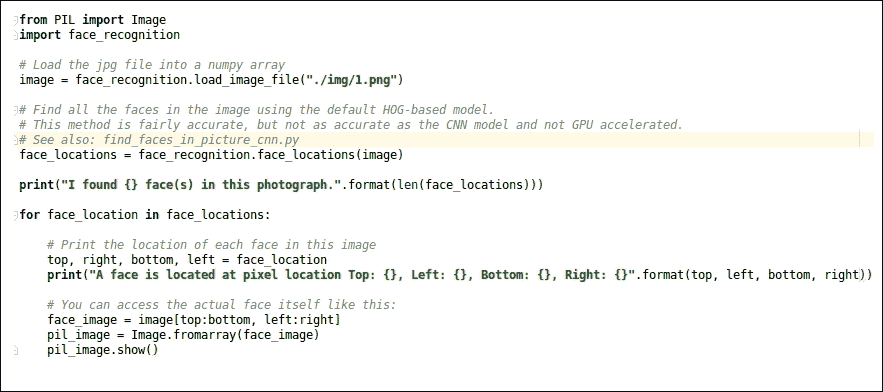
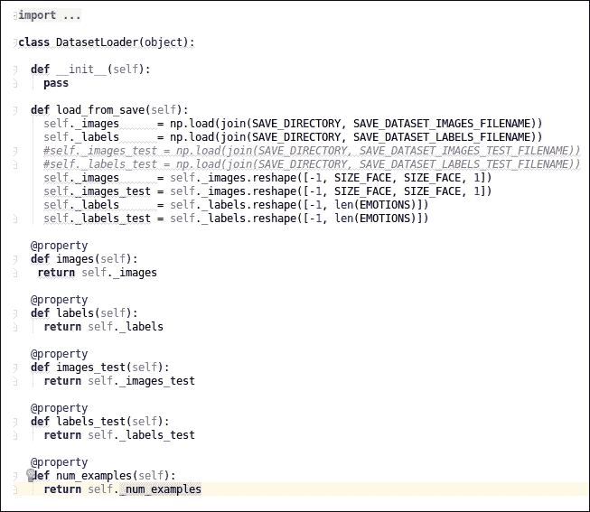

# 第十章. 面部识别与面部情感识别

在上一章中，我们探讨了如何使用卷积神经网络和 YOLO（You Only Look Once）算法检测诸如汽车、椅子、猫和狗等物体。在本章中，我们将检测人脸。除此之外，我们还将研究人脸的表情，例如人脸看起来快乐、中性、悲伤等。因此，本章将很有趣，因为我们将关注一些最新的面部检测和面部情感识别技术。我们将把本章分为两部分：

+   面部检测

+   面部情感识别

首先，我们将介绍面部检测的工作原理，然后我们将继续到面部情感识别部分。总的来说，我们将在本章中涵盖以下主题：

+   介绍问题陈述

+   设置编码环境

+   理解面部识别的概念

+   面部识别实现的途径

+   理解面部情感识别的数据集

+   理解面部情感识别的概念

+   构建面部情感识别模型

+   理解测试矩阵

+   测试模型

+   现有方法的局限性

+   如何优化现有方法

    +   理解优化过程

+   最佳方法

    +   实施最佳方法

+   总结

# 介绍问题陈述

我们希望开发两个应用。一个应用将识别人脸，另一个将识别人脸的情感。我们将在本节中讨论这两个应用。我们将探讨我们到底想开发什么。

## 面部识别应用

此应用应基本能够从图像或实时视频流中识别出人脸。参考以下照片，它将帮助你理解我所说的从图像或实时视频流中识别人脸的含义：


图 10.1：理解面部识别应用演示输出

图片来源：https://unsplash.com/photos/Q13lggdvtVY

如前图（图 10.1）所示，当我们提供任何图像作为输入时，在第一步，机器可以识别图像中存在多少人脸。作为输出，我们可以得到人脸的裁剪图像。

此外，我还希望应用能够根据面部识别出人的名字。我想你熟悉这类应用。让我提醒你。当你将图片上传到 Facebook 时，Facebook 的人脸识别机制会立即识别出图片中的人名，并建议你在图片中标记他们。在这里，我们将开发类似的功能，即面部识别应用。现在让我们继续到应用的另一部分。

## 面部情感识别应用

在这个应用的部分，我们想要构建一个能够检测人脸情绪类型的应用程序。我们将尝试识别以下七种情绪：

+   愤怒

+   厌恶

+   恐惧

+   幸福

+   悲伤

+   惊讶

+   中性

因此，我们将面部情绪分为这七种类型。这种应用程序将有助于了解人们正在经历什么样的感受，这种洞察力将有助于进行情感分析、肢体语言分析等。

在这里，我们首先构建人脸识别应用程序，然后继续构建人脸情绪识别应用程序。

# 设置编码环境

在本节中，我们将设置人脸识别应用程序的编码环境。我们将查看如何安装依赖项。我们将安装以下两个库：

+   dlib

+   face_recognition

让我们开始安装过程。

## 安装 dlib

为了安装 dlib 库，我们需要执行以下步骤。我们可以在 Linux 操作系统（OS）或 macOS 上安装此库。让我们按照逐步说明进行：

1.  通过执行此命令下载 dlib 的源代码：

    ```py
    sudo git clone https://github.com/davisking/dlib.git.
    ```

1.  现在通过执行此命令跳转到 `dlib` 目录：`cd dlib`。

1.  现在我们需要构建主要的`dlib`库，因此我们需要逐步执行以下命令：

    1.  `sudo mkdir build`。

    1.  `cd build`。

    1.  `cmake .. -DDLIB_USE_CUDA=0 -DUSE_AVX_INSTRUCTIONS=1`。

    1.  `cmake --build`。

一旦项目成功构建，你可以进入下一个安装步骤。你还需要安装 **OpenCV**。OpenCV 的安装步骤已在第十章中给出。

## 安装 face_recognition

为了安装 `face_recognition` 库，我们需要执行以下命令：

```py
$ sudo pip install face_recognition (This command is for python 2.7)
$ sudo pip3 install face_recognition (This command is for python 3.3+)
```

之前的命令只有在`dlib`库完美安装的情况下才会安装`face_recognition`库。

一旦安装了前两个库，我们就可以进入下一部分，我们将讨论人脸识别的关键概念。

# 理解人脸识别的概念

在本节中，我们将探讨人脸识别的主要概念。这些概念将包括以下主题：

+   理解人脸识别数据集

+   人脸识别算法

## 理解人脸识别数据集

你可能会想知道为什么我直到现在还没有讨论与数据集相关的内容。这是因为我不想通过提供两个不同应用程序的数据集的所有细节来混淆你。我们将在这里覆盖的数据集将用于**人脸识别**。

如果你想要从头开始构建人脸识别引擎，则可以使用以下数据集：

+   CAS-PEAL 人脸数据集

+   野生人脸标签

让我们进一步详细讨论它们。

### CAS-PEAL 人脸数据集

这是一个用于面部识别任务的大型数据集。它包含各种类型的人脸图像。它包含具有不同变化来源的人脸图像，特别是用于面部识别任务的姿态、情绪、配饰和光照（PEAL）。

这个数据集包含 1,040 个人的 99,594 张图片，其中 595 人是男性，445 人是女性。捕捉到的个人图像具有不同的姿态、情绪、配饰和光照。请参考以下照片查看这一点。如果您想查看样本数据集，也可以参考以下链接：[`www.jdl.ac.cn/peal/index.html`](http://www.jdl.ac.cn/peal/index.html)。


图 10.2：CAS-PEAL 人脸数据集样本图像

图片来源：http://www.jdl.ac.cn/peal/Image/Pose_normal/NormalCombination-9-Cameras.jpg

您可以从以下链接下载这个数据集：[`www.jdl.ac.cn/peal/download.htm`](http://www.jdl.ac.cn/peal/download.htm)

### LFW 人脸数据集

这个数据集也被称为 LFW 数据集。它在`face_recognition`库中被使用。我们将使用这个库来构建我们的面部识别应用。这个数据集包含了从网络上收集的超过 13,000 张人脸图片。每张人脸都标有图片中人物的姓名。因此，这个数据集是一个标记数据集。数据集中有 1,680 个人的两张或更多不同的人脸图像。您可以通过以下图表来参考样本数据集：


图 10.3：LFW 数据集的样本图像

图片来源：http://vis-www.cs.umass.edu/lfw/person/AJ_Cook.html

### 注意

您可以通过点击[`vis-www.cs.umass.edu/lfw/index.html`](http://vis-www.cs.umass.edu/lfw/index.html)了解更多关于这个数据集的信息。您也可以通过相同的链接下载数据集。您还可以通过点击[`www.vision.caltech.edu/Image_Datasets/Caltech_10K_WebFaces/`](http://www.vision.caltech.edu/Image_Datasets/Caltech_10K_WebFaces/)来参考 Caltech 10,000 网络人脸数据集。您还应该参考 INRIA 人脸数据集，这将非常有用。INRIA 人脸数据集的链接是[`pascal.inrialpes.fr/data/human/`](http://pascal.inrialpes.fr/data/human/).

为了构建面部识别应用，我们将使用`face_recognition`库。我们正在使用这个库通过其 API 提供的预训练模型。我们肯定会探索这个预训练模型和库背后的算法和概念。所以，让我们开始吧！

## 面部识别算法

在本节中，我们将查看用于人脸识别的核心算法。该算法的名称是**方向梯度直方图**（**HOG**）。我们将了解 HOG 在人脸识别任务中的应用。人脸识别（FR）任务基本上是一个分类任务，因为我们不仅从图像中检测人脸，还试图通过人脸识别出人的名字。HOG 是一个很好的尝试选项。

另一种方法是使用卷积神经网络（CNN）。在本节中，我们还将介绍 CNN 在人脸识别任务中的应用。因此，让我们从 HOG 开始吧！

### 方向梯度直方图（HOG）

HOG 算法是用于人脸识别的最佳方法之一。HOG 方法由 Dalal 和 Triggs 在他们的开创性 2005 年论文中提出，该论文可在[`lear.inrialpes.fr/people/triggs/pubs/Dalal-cvpr05.pdf`](http://lear.inrialpes.fr/people/triggs/pubs/Dalal-cvpr05.pdf)找到。HOG 图像描述符和线性支持向量机可以用来训练高度准确的分类器，这些分类器可以分类人脸检测器。因此，HOG 也可以应用于人脸识别任务。首先，我们将介绍算法背后的基本直觉。

HOG 是一种特征描述符。特征描述符是一种通过提取有用信息并忽略其他信息来简化图像的图像表示。在这里，我们的重点将放在人脸上。因此，如果有其他物体，我们将忽略它们。LWF 数据集噪声较少，因此生成准确特征描述符的任务相对容易。逐步过程如下：

**第 1 步**：为了在图像中找到人脸，我们首先将彩色图像转换为黑白图像，因为我们不需要颜色数据来识别人脸。参考以下图表：


图 10.4：将彩色图像转换为黑白图像

**第 2 步**：在这个步骤中，我们将一次查看图像中的每个单独的像素。对于每个单独的像素，我们希望查看直接围绕它的像素。参考以下图表：


图 10.5：扫描图像中每个单独像素的过程

第 3 步：在这里，我们的目标是找出当前像素相对于其直接周围的像素有多暗。我们需要画一个箭头，指示图像像素变暗的方向。为了实现这一点，我们需要扫描整个图像。参考以下图表：


图 10.6：从亮像素到暗像素的箭头方向

如前图所示，我们考虑了一个像素及其周围的像素。通过观察像素，我们可以轻松地判断箭头头指向较暗的像素。

第 4 步：如果我们对图像中的每个像素重复此过程，那么最终每个像素都将被箭头替换。这些箭头被称为*梯度*。这些*梯度*显示了整个图像中从亮到暗像素的流动。参考以下图示：


图 10.7：整个图像的梯度箭头

在前面的图中，您可以看到在为输入图像生成梯度后的输出类型。扫描整个图像可能看起来像是一件随机的事情，但用梯度替换像素是有原因的。如果我们直接分析原始像素值，那么同一个人的非常暗和非常亮的图像将具有完全不同的像素值，这在我们尝试识别该人的面部时会使事情变得更加复杂。在这里，我们考虑像素亮度变化的方向。我们发现，同一个人的非常暗和非常亮的图像最终都会得到面部完全相同的表示。这种表示对我们处理面部识别任务来说将很容易处理。这就是生成整个图像梯度的主要原因。然而，尽管如此，我们将在下一步讨论一个挑战。

第 5 步：为每个像素保存梯度给我们提供了太多的信息，而且我们可能会以低效的方式使用这些信息。因此，我们需要获得我们将用于 FR 任务的最基本信息。我们将通过只考虑更高层次上的亮度和暗度的基本流动来实现这一点，这样我们就可以看到图像的基本模式。实现这一点的过程在第 6 步中给出。

第 6 步：我们将此图像分解成每个 16 x 16 像素的小方块。在每个方块中，我们将计算每个主要方向上的梯度点数，这意味着我们将计算有多少箭头向上、向下、向右、向左等。在计数之后，我们将用最强的箭头方向替换图像中的那个方块。最终结果是，我们将原始图像转换成一个简单的表示，该表示捕捉到了面部的基本结构。参考以下图示：


图 10.8：HOG 版本中的简单面部表示

这种表示对于 FR 任务来说很容易处理；它被称为图像的 HOG 版本。它代表了我们在 FR 任务中要考虑的特征，这就是为什么这种表示被称为 HOG 特征描述符。

第 7 步：为了找出这个 HOG 图像中的面部，我们必须找出我们的图像中看起来最像从其他训练面部中提取的已知 HOG 模式的部分。参考以下图示：


图 10.9：使用我们图像的 HOG 版本识别人脸的过程

使用这项技术，我们可以轻松地识别任何图像中的人脸。

### 用于 FR 的卷积神经网络（CNN）

在本节中，我们将探讨如何使用 CNN 从图像中识别人脸。本节分为两部分：

+   简单的 CNN 架构

+   理解 CNN 在 FR 中的应用

#### 简单的 CNN 架构

我不想深入探讨 CNN 是如何工作的，因为我已经在第九章*构建实时物体检测*中提供了大部分必要的细节；然而，我想提醒你一些关于 CNN 的必要信息。首先，参考以下图表：


图 10.10：CNN 架构

如您在前面的图表中所见，有一个卷积层、一个池化层、一个全连接层和一个输出层。涉及不同的激活函数、惩罚和 SoftMax 函数。这是高级信息。对于这个 FR 任务，我们可以使用三个卷积层和池化层，使用 ReLU 作为激活函数。您可以添加更多层，但这会使训练的计算成本更高。

#### 理解 CNN 在 FR 中的应用

直观地说，CNN 模型按照以下步骤构建一个良好的 FR 应用。基本过程如下：

第 1 步：观察一张图片。裁剪只包含人脸的图像。

第 2 步：现在，在这个步骤中，我们专注于人脸，并试图理解即使人脸朝向奇怪的方向，或者图像是在不良光照下拍摄的，我们仍需要识别这类图像中人脸的正确位置。第 3 步将为我们提供解决方案。

第 3 步：为了从任何图像中识别人脸，无论图像是在不良光照条件下拍摄的，还是人脸的朝向看起来非常奇怪，我们需要识别人脸。为了实现这一点，我们挑选出人脸的独特特征，这些特征可以告诉我们关于人脸的独特信息。借助这些独特特征，我们可以识别同一个人的脸，以及不同人的脸。这些特征可以包括眼睛的大小、脸的长度等等。有 68 个特定的点需要考虑；它们被称为关键点。这些点是基于人脸关键点估计定义的。请参考以下论文以获取更多详细信息：[`www.csc.kth.se/~vahidk/papers/KazemiCVPR14.pdf`](http://www.csc.kth.se/~vahidk/papers/KazemiCVPR14.pdf)。请查看以下图表：


图 10.11：用于人脸关键点估计的 68 个点

第 4 步：我们需要通过名字识别某人的面孔，因此为了实现这一点，我们将比较该面孔的独特特征与我们已经知道的所有人，以确定该人的名字。假设你已经添加了比尔·盖茨、巴拉克·奥巴马等人的图片。你已经为他们生成了独特的面部特征，现在我们将比较这些已经生成的面部特征，如果特征相似，那么我们就能知道图像中的人的名字，即巴拉克·奥巴马或比尔·盖茨。基于面部特征的识别是一个分类问题，可以通过 CNN 轻松解决。我们正在生成一个 128 维度的面孔嵌入向量。作为输入，我们应该提供这个面孔嵌入向量。一旦我们完成训练，我们的应用程序将准备好识别人的名字。

第 5 步：训练好的模型会查看我们过去测量过的所有面孔，并找到与我们的面孔测量值最接近的人。那就是我们的匹配对象。

上述方法是为我们的基于 CNN 的 FR 和实时人脸识别任务。我们已经涵盖了 FR 任务中使用的算法的基本概念和背后的思想。现在让我们开始实现。

# 实现人脸识别的方法

在本节中，我们将实现 FR 应用程序。我们正在使用`face_recognition`库。我们已经为它配置了环境。我们将在这里实现以下方法：

+   基于 HOG 的方法

+   基于 CNN 的方法

+   实时人脸识别

现在我们开始编码！

## 实现基于 HOG 的方法

在这种方法中，我们使用 HOG 算法找出两件事：图像中的面孔总数和步态。我们使用`face_recognition`库的 API。您可以通过点击以下 GitHub 链接找到代码：[`github.com/jalajthanaki/Face_recognition/blob/master/face_detection_example.py`](https://github.com/jalajthanaki/Face_recognition/blob/master/face_detection_example.py)。代码片段如下所示：



图 10.12：基于 HOG 的 FR 方法代码片段

在前面的图中，我们提供了一个图像作为输入，借助`face_recognition`库的 API，我们可以找到图像中面孔的像素位置。在这里，我们还将计算图像中有多少个面孔，借助`Image`库，我们可以从提供的图像中裁剪面孔。您可以在以下图中找到此脚本的输出：


图 10.13：基于 HOG 的 FR 方法输出

参考以下截图中的裁剪面孔输出：


图 10.14：裁剪后的面孔输出

如您在最后一个输出图中所见，通过简单的 API，我们可以构建一个简单的人脸识别应用程序。这种方法对我们来说是一种基线方法。

现在让我们转向基于 CNN 的方法。与基于 HOG 的方法相比，基于 CNN 的方法更准确。如果我们为基于 CNN 的方法使用 GPU，那么我们可以以更短的时间训练模型。现在让我们看看基于 CNN 方法的代码。

## 实现基于 CNN 的方法

在这种方法中，我们将使用`face_recognition`库，其中我们指定了模型的名称。我们模型的名称是`cnn`。这个特定的方法将通过`face_recognition` API 加载预训练模型，我们可以生成更准确的结果。您可以通过点击以下 GitHub 链接找到代码：[`github.com/jalajthanaki/Face_recognition/blob/master/face_detection_GPU_example.py`](https://github.com/jalajthanaki/Face_recognition/blob/master/face_detection_GPU_example.py)。请参考以下图中的代码片段：


图 10.15：基于 CNN 方法的 FR 代码片段

在这里，实现代码几乎与之前相同，但不同之处在于我们在 API 调用期间提供了模型名称`cnn`。您可以在以下图中看到这个实现的输出：


图 10.16：基于 CNN 方法的 FR 输出

这个实现的输出与上一个相同。这个版本的实现速度快，并且准确性更高。现在让我们尝试为实时视频流实现 FR 任务。

## 实现实时人脸识别

在本节中，我们将为实时视频流实现 FR 任务。我们将尝试识别视频中出现的个人的名字。这难道不很有趣吗？让我们开始吧。您可以通过点击以下 GitHub 链接找到代码：[`github.com/jalajthanaki/Face_recognition/blob/master/Real_time_face_detection.py`](https://github.com/jalajthanaki/Face_recognition/blob/master/Real_time_face_detection.py)。

再次，我们正在使用`face_recognition`库的 API。我们也在使用`OpenCV`。首先，我们需要提供带有个人名字的个人的样本图像，这样机器就可以在学习过程中识别出这个人的名字，并在测试时识别它。在这个实现中，我提供了巴拉克·奥巴马和乔·拜登的图像。您也可以添加您的图像。如果人脸特征熟悉并且与已提供的图像匹配，则脚本将返回该人的名字；如果人脸特征与给定图像不熟悉，则该人的脸被标记为*未知*。请参考以下图中的实现：


图 10.17：实时 FR 的实现

如前述代码所示，我提供了巴拉克·奥巴马和乔·拜登的样本图像。我还提供了我将图像输入脚本的人的名字。我使用了相同的面部识别 API 来检测和识别视频流中的面部。当你运行脚本时，你的网络摄像头会实时传输视频，此脚本会检测面部，如果你提供机器已知的该人的图像，那么这次它也能正确识别。


图 10.18：实时 FR 的输出

如您所见，我没有向机器提供我的图像，因此它将我识别为**未知**，而它可以识别巴拉克·奥巴马的图像。您也可以通过点击[`github.com/jalajthanaki/Face_recognition/blob/master/img/Demo.gif`](https://github.com/jalajthanaki/Face_recognition/blob/master/img/Demo.gif)找到动画图像。

我们完成了本章的第一部分，即开发一个可以识别人类面部，并根据面部识别出人的名字的应用程序。我们实现了三种不同的面部识别（FR）变体。

在下一节中，我们将探讨如何开发一个面部表情识别（FER）应用。为了构建此应用，我们需要不同类型的数据集，因此我们将从理解一个用于 FER 的数据集开始。

# 理解面部表情识别数据集

为了开发一个面部表情识别（FER）应用，我们正在考虑使用`FER2013`数据集。您可以从[`www.kaggle.com/c/challenges-in-representation-learning-facial-expression-recognition-challenge/data`](https://www.kaggle.com/c/challenges-in-representation-learning-facial-expression-recognition-challenge/data)下载此数据集。我们需要了解关于此数据集的基本细节。数据集归功于 Pierre-Luc Carrier 和 Aaron Courville，作为持续研究项目的一部分。

此数据集包含 48x48 像素灰度人脸图像。任务是根据图像中显示的表情将每个面部分类。以下为七个类别，每个类别都有一个表示情绪类别的数字标签：

+   `0` = 生气

+   `1` = 厌恶

+   `2` = 恐惧

+   `3` = 快乐

+   `4` = 悲伤

+   `5` = 惊讶

+   `6` = 中立

此数据集包含`fer2013.csv`文件。此 csv 文件将用作我们的训练数据集。现在让我们看看文件的属性。文件中有三列，如下所示：

+   **情绪**: 这列包含面部表情的数字标签。对于恐惧，此列包含值为`2`；对于悲伤，此列包含值为`4`，依此类推。

+   **像素**: 这列包含单个图像的像素值。它代表图像的像素值矩阵。

+   **用法**：此列包含有关特定数据记录是否用于训练目的或测试目的的一般标签。此列有三个标签，分别是*Training*（训练）、*PublicTest*（公共测试）和*PrivateTest*（私有测试）。用于训练目的的数据样本有 28,709 个。公共测试集包含 3,589 个数据样本，私有测试集也包含 3,589 个数据样本。

现在，让我们了解有助于我们开发 FER 应用的概念。

# 理解面部情感识别的概念

我们使用卷积神经网络（CNN）来开发 FER 应用。之前，我们看到了 CNN 的基本架构。为了开发 FER 应用，我们将使用以下 CNN 架构和优化器。我们正在构建一个两层深的 CNN。我们将使用两个全连接层和 SoftMax 函数来分类面部情感。

我们将使用由卷积层构成的多层结构，随后是 ReLU（修正线性单元）层，再之后是最大池化层。参考以下图表，它将帮助您理解 CNN 层的排列。让我们看看 CNN 的工作原理。我们将涵盖以下层：

+   卷积层

+   ReLU 层

+   池化层

+   全连接层

+   SoftMax 层

## 理解卷积层

在这个层中，我们将以像素值的形式输入我们的图像。我们使用一个 3 x 3 维度的滑动窗口，它在整个图像上滑动。滑动窗口选中的区域被称为*感受野*。它是图像的一部分。滑动窗口只是一个 3 x 3 维度的矩阵，它可以扫描整个图像。通过使用滑动窗口，我们使用 3 x 3 维度的矩阵扫描图像的九个像素值。这个感受野或图像的一部分是卷积网络的输入。

参考以下图表：


图 10.19：滑动窗口和感受野

这个感受野以输入图像的像素值形式携带值。这些像素值被称为特征图、特征、滤波器、权重矩阵或核。我们已经有了一个 3 x 3 的矩阵，被称为特征图。特征图的大小是一个超参数。我们可以取 n x n 矩阵，其中 n >= 1。在这里，我们考虑了一个 3 x 3 的矩阵来理解操作。现在进行简单的数学运算，步骤如下：

第一步：获取特征图。在这里，特征图指的是以感受野形式生成的图像块。

第二步：我们需要在特征图和整个图像之间执行点积。再次，我们使用滑动窗口扫描整个图像，并生成点积的值。

第 3 步：我们需要将我们从点积中获得的所有值加起来。

第 4 步：我们需要将点积求和的值除以特征中的总像素数。在这个解释中，我们总共有九个像素，所以我们将总和除以 9。作为输出，我们得到被称为特征图像的图像。

参考以下图表：


图 10.20：卷积层的数学运算

我们将重复这个操作，几乎针对图像的所有可能位置，并尝试所有可能的组合，这就是为什么这个操作被称为卷积操作。现在让我们看看 ReLU 层。

## 理解 ReLU 层

这个层基本上为卷积网络引入了非线性。在这里，我们需要使用`激活`函数。对于这个应用，我们选择了修正线性单元作为激活函数。这个层对我们的特征图进行某种归一化。让我们看看它对特征图做了什么：

第 1 步：这个层以卷积层生成的特征图作为输入。

第 2 步：这个层只是将负值转换为零。

参考以下图表：


图 10.21：ReLU 层的操作

现在是时候看看池化层了。

## 理解池化层

使用这个层，我们缩小图像。我们将在这里使用最大池化操作。我们需要执行以下步骤：

第 1 步：我们需要将特征图作为输入，这次，ReLU 层的输出被作为这个层的输入。

第 2 步：我们需要选择窗口大小。通常，我们选择 2 x 2 像素或 3 x 3 像素的大小。我们将 2 x 2 作为我们的窗口大小。

第 3 步：我们将根据这个窗口大小扫描整个图像，并从四个像素值中取最大值。

你可以通过参考以下图表来理解这个操作：


图 10.22：最大池化层的操作

我们可以将这些层堆叠得尽可能深。你可以重复卷积、ReLU 和池化层 n 次，以使 CNN 变深。

## 理解全连接层

所有层的输出都传递到全连接层。这一层有一个投票机制。所有图像块都被考虑在内。2 x 2 矩阵的图像块以水平方式排列。投票取决于一个值预测面部表情的强度。如果这一层的某些值很高，这意味着它们接近 1，如果某些值很低，这意味着它们接近 0。对于每个类别，某些单元格的值接近 1，而其他值是 0，这样我们的网络就会预测类别。请参考以下图表：


图 10.23：全连接层的直观理解

这里只执行了一个数学运算。我们正在取平均值。正如您在前面的图表中看到的，第一、第四、第五、第十和第十一行的全连接层正在预测一个类别，因此我们需要将这些单元格中所有现有值的总和，并找到它们的平均值。这个平均值告诉我们我们的网络在预测类别时的信心程度。我们可以堆叠尽可能多的全连接层。在这里，神经元的数量是超参数。

## 理解 SoftMax 层

我们还可以使用 SoftMax 层，它将特征值转换为概率值。这个方程如下：


图 10.24：SoftMax 方程

这一层获取特征值，并使用前面的方程生成概率值。请参考以下图表：


图 10.25：计算 SoftMax 函数的过程

## 基于反向传播更新权重

基于反向传播技术，CNN 网络的权重已经更新。我们将测量我们的预测答案与实际答案之间的差异。基于这个误差测量，我们计算损失函数的梯度，这告诉我们是否应该增加权重或减少它。如果预测答案和实际答案相同，则权重将不会发生变化。

我们已经理解了我们将用于开发面部情感识别模型的 CNN 的大部分核心概念。

# 构建面部情感识别模型

在本节中，我们将实现使用 CNN 的 FER 应用。为了编码目的，我们将使用`TensorFlow`、`TFLearn`、`OpenCV`和`Numpy`库。您可以通过使用此 GitHub 链接找到代码：[`github.com/jalajthanaki/Facial_emotion_recognition_using_TensorFlow`](https://github.com/jalajthanaki/Facial_emotion_recognition_using_TensorFlow)。这是我们需要遵循的步骤：

1.  准备数据

1.  加载数据

1.  训练模型

## 准备数据

在本节中，我们将准备可用于我们应用程序的数据集。如您所知，我们的数据集是灰度的。我们有两种选择。一种是我们只需要使用黑白图像，如果我们使用黑白图像，那么将有两个通道。第二种选择是将灰度像素值转换为 RGB（红色、绿色和蓝色）图像，并使用三个通道构建 CNN。为了我们的开发目的，我们使用两个通道，因为我们的图像是灰度的。

首先，我们正在加载数据集并将其转换为`numpy`数组。转换后，我们将以`.npy`格式保存它，以便我们可以随时加载该数据集。我们将实际数据记录保存在一个文件中，而它们的标签则保存在另一个文件中。我们的输入数据文件名为`fer2013.csv`。包含数据的输出文件是`data_set_fer2013.npy`，标签位于`data_labels_fer2013.npy`文件中。执行此任务的脚本名称是`csv_to_numpy.py`。您可以通过此 GitHub 链接参考其代码：[`github.com/jalajthanaki/Facial_emotion_recognition_using_TensorFlow/tree/master/data`](https://github.com/jalajthanaki/Facial_emotion_recognition_using_TensorFlow/tree/master/data)

参考以下图中加载数据的代码片段：


图 10.26：加载数据代码片段

`helper`函数的代码如下所示：


图 10.27：`helper`函数代码片段

现在我们来看看如何加载我们已保存为`.npy`格式的数据。

## 加载数据

在本节中，我们将探讨如何使用我们已准备的数据集，以便我们可以用它进行训练。在这里，我们创建一个单独的脚本以帮助我们加载数据。在这个脚本中，我们定义了一个测试数据集，我们将在测试期间使用它。

这是一段简单直接代码。您可以在以下图中找到代码片段：



图 10.28：数据加载脚本代码片段

当我们编写训练脚本时，将使用此类及其方法。您可以通过此 GitHub 链接查看此脚本的代码：[`github.com/jalajthanaki/Facial_emotion_recognition_using_TensorFlow/blob/master/dataset_loader.py`](https://github.com/jalajthanaki/Facial_emotion_recognition_using_TensorFlow/blob/master/dataset_loader.py)。

## 训练模型

在本节中，我们将探讨如何训练模型，以便它可以识别面部表情。以下是我们将执行的操作步骤。您可以通过参考此 GitHub 链接找到此训练步骤的代码：[`github.com/jalajthanaki/Facial_emotion_recognition_using_TensorFlow/blob/master/emotion_recognition.py`](https://github.com/jalajthanaki/Facial_emotion_recognition_using_TensorFlow/blob/master/emotion_recognition.py)。

### 使用 dataset_loader 脚本加载数据

在这里，我们使用我们在上一节中编写的并理解的脚本加载数据集。您可以在下面的图中找到代码片段：


图 10.29：在模型训练过程中加载数据

现在，让我们构建实际用于训练的 CNN。

### 构建卷积神经网络

在这一步，我们将构建用于训练目的的 CNN。在这里，我们有三层卷积网络、ReLU 层和池化层。前两层有 64 个神经元，最后一层有 128 个神经元。我们添加了 dropout 层。对于一些神经元，dropout 层将值设置为 0。这个层选择那些长时间没有改变权重或长时间未激活的神经元。这将使我们的训练更加有效。我们有两个全连接层，以及一个使用 SoftMax 函数来推导面部情感类概率的全连接层。我们使用`momentum`函数来进行梯度下降。在这里，我们的损失函数是分类交叉熵。参考下面的图中代码片段：


图 10.30：构建 CNN 的代码片段

现在，让我们看看如何进行训练。

### 为 FER 应用进行训练

在这一步，我们需要开始训练，以便我们的模型可以学会预测面部情感。在这一步，我们将定义一些训练的超参数。参考下面的图中代码片段：


图 10.31：执行训练的代码片段

如前图所示，我们将 epoch 设置为`100`。训练批次大小为`50`。我们可以看到`shuffle`参数，它作为标志。此参数的值为`true`，表示我们在训练过程中正在打乱我们的数据集。

开始训练的命令是`$ python emotion_recognition.py train`。

### 预测和保存训练模型

在这一步，我们正在定义`predict`方法。这个方法帮助我们生成预测。我们还定义了一个可以帮助我们保存训练模型的方法。我们需要保存模型，因为我们可以在需要时加载它进行测试。您可以在下面的图中找到代码片段：


图 10.32：预测类别的代码片段

参考下面的图中代码片段：


图 10.33：保存训练模型的代码片段

现在是查看测试矩阵的时候了。之后，我们需要测试我们的训练模型。所以，在我们测试模型之前，我们应该理解测试矩阵。

# 理解测试矩阵

在本节中，我们将查看面部情绪应用的测试矩阵。测试的概念非常简单。我们需要开始观察训练步骤。我们正在跟踪损失和准确率的值。基于这些，我们可以决定我们模型的准确率。这听起来简单吗？我们已经训练了模型 30 个 epoch。这么多的训练需要超过三个小时。我们达到了 63.88%的训练准确率。请参考以下图中的代码片段：


图 10.34：训练进度，以了解训练准确率

这是训练准确率。如果我们想检查验证数据集上的准确率，那么它也会在训练步骤中给出。我们已经定义了验证集。借助这个验证数据集，训练好的模型生成其预测。我们比较预测类别和实际类别标签。之后，我们生成您在前面的图表中可以看到的验证准确率。这里，`val_acc`为 66.37%，这很棒。到目前为止，这个应用程序已经能够达到 65%到 70%的准确率。

# 测试模型

现在我们需要加载训练好的模型并对其进行测试。在这里，我们将使用视频流。FER 应用程序将根据我的面部表情检测情绪。您可以参考以下 GitHub 链接中的代码：[`github.com/jalajthanaki/Facial_emotion_recognition_using_TensorFlow/blob/master/emotion_recognition.py`](https://github.com/jalajthanaki/Facial_emotion_recognition_using_TensorFlow/blob/master/emotion_recognition.py)。

您可以在以下图中找到此代码片段：


图 10.35：加载训练好的模型并进行测试的代码片段

为了开始测试，我们需要执行以下命令：

`$ python emotion_recognition.py poc`

这次测试将使用您的网络摄像头。我有一些演示文件想要在这里分享。请参考以下图：


图 10.36：用于识别厌恶情绪的 FER 应用程序的代码片段

也请参考以下图：


图 10.37：识别快乐情绪的 FER 应用程序

请参考以下图中的代码片段：


图 10.38：用于识别中性情绪的 FER 应用程序的代码片段

请参考以下图中的代码片段：


图 10.39：用于识别愤怒情绪的 FER 应用程序的代码片段

现在我们来看看如何改进这种方法。

# 现有方法存在的问题

在本节中，我们将列出所有造成问题的点。我们应该尝试改进它们。以下是我认为我们可以改进的地方：

+   如果你发现你的案例中类采样不合适，那么你可以采用采样方法

+   我们可以给我们的神经网络添加更多层

我们可以尝试不同的梯度下降技术。

在这种方法中，训练需要花费大量时间，这意味着训练计算成本很高。当我们训练模型时，我们使用了 GPU，尽管 GPU 训练需要很长时间。我们可以使用多个 GPU，但这很昂贵，带有多个 GPU 的云实例也不划算。因此，如果我们能在这种应用中使用迁移学习或使用预训练模型，那么我们将获得更好的结果。

# 如何优化现有方法

正如你在上一节中看到的，由于计算硬件的缺乏，我们已经达到了 66%的准确率。为了进一步提高准确率，我们可以使用预训练模型，这将更加方便。

## 理解优化过程

在前几节中，我描述了一些问题。我们可以给我们的 CNN 添加更多层，但这将使计算成本更高，所以我们不会这么做。我们已经很好地采样了我们的数据集，所以我们不需要担心这一点。

作为优化过程的一部分，我们将使用使用`keras`库训练的预训练模型。这个模型使用了多个 CNN 层。它将在多个 GPU 上训练。因此，我们将使用这个预训练模型，并检查结果如何。

在下一节中，我们将实现可以使用预训练模型的代码。

# 最佳方法

我们已经实现了大约 66%的准确率；对于一个 FER 应用，最佳准确率大约是 69%。我们将通过使用预训练模型来实现这一点。所以，让我们看看实现方法，以及我们如何使用它来实现最佳结果。

## 实施最佳方法

在本节中，我们将实现适用于 FER 应用的最好方法。这个预训练模型是通过使用密集和深度卷积层构建的。由于六层深度 CNN，以及随机梯度下降（SGD）技术的帮助，我们可以构建预训练模型。每一层的神经元数量分别为 32、32、64、64、128、128、1,024 和 512。所有层都使用 ReLU 作为激活函数。3 x 3 的矩阵将用于生成初始特征图，2 x 2 的矩阵将用于生成最大池化。你可以从这个 GitHub 链接下载模型：[`github.com/jalajthanaki/Facial_emotion_recognition_using_Keras`](https://github.com/jalajthanaki/Facial_emotion_recognition_using_Keras)

你可以通过参考以下图表来查看代码：


图 10.40：使用预训练 FER 模型的代码片段

在前面的代码中，我们加载了预训练的`keras`模型。我们提供了两个方案。我们可以使用这个脚本从图像中检测面部表情，也可以通过提供视频流来实现。

如果你想测试任何图像中存在的面部表情，那么我们需要执行`$ python image_test.py tes.jpg`命令。我已经将此模型应用于`tes.jpg`图像。你可以看到以下输出图像：


图 10.41：图像中 FER 应用的输出

如果你想测试视频流的模型，那么你需要执行此命令：`$python realtime_facial_expression.py`。

参考以下图中的输出：


图 10.42：视频流中 FER 应用的输出

你可以在以下图中找到输出文件：


图 10.43：视频流中 FER 应用的输出

此应用为我们提供了大约 67%的准确率，这非常不错。

# 摘要

在本章中，我们探讨了如何使用`face_recognition`库开发人脸检测应用，该库使用基于 HOG 的模型来识别图像中的人脸。我们还使用了预训练的卷积神经网络，它可以从给定图像中识别人脸。我们开发了实时人脸识别来检测人的名字。对于人脸识别，我们使用了预训练的模型和现成的库。在章节的第二部分，我们开发了人脸表情识别应用，它可以检测人脸所携带的七种主要情绪。我们使用了`TensorFlow`、`OpenCV`、`TFLearn`和`Keras`来构建人脸表情识别模型。此模型在预测人脸情绪方面具有相当好的准确率。我们达到了最佳可能的准确率 67%。

目前，计算机视觉领域在研究方面发展迅速。你可以探索许多新鲜和酷的概念，例如 Facebook AI Research 团队提出的`deepfakes`和 3D 人体姿态估计（机器视觉）。你可以通过点击此处参考`deepfakes`GitHub 仓库：[`github.com/deepfakes/faceswap`](https://github.com/deepfakes/faceswap)。你可以通过点击此链接参考 3D 人体姿态估计的论文：[`arxiv.org/pdf/1705.03098.pdf`](https://arxiv.org/pdf/1705.03098.pdf)。这两个概念都是新颖的，所以你可以参考它们并制作一些有趣的应用。

下一章将是本书的最后一章。在这一章中，我们将尝试制作一个游戏机器人。这一章将大量使用强化学习技术。我们将开发一个可以自己玩 Atari 游戏的机器人。所以请继续阅读！
