# 第十一章：构建游戏机器人

在前面的章节中，我们介绍了属于计算机视觉领域的一些应用。在本章中，我们将制作一个游戏机器人。我们将介绍构建游戏机器人的不同方法。这些游戏机器人可以用来玩各种 Atari 游戏。

让我们快速回顾一下过去两年。让我们从 2015 年开始。一家名为 DeepMind 的小型伦敦公司发布了一篇名为《用深度强化学习玩 Atari》的研究论文，可在[`arxiv.org/abs/1312.5602`](https://arxiv.org/abs/1312.5602)找到。在这篇论文中，他们展示了计算机如何学习和玩 Atari 2600 视频游戏。计算机只需观察屏幕像素就能玩游戏。我们的计算机游戏代理（即游戏玩家）在游戏得分增加时会获得奖励。这篇论文中展示的结果非常引人注目。这篇论文引起了很大的轰动，那是因为每个游戏都有不同的得分机制，而且这些游戏被设计成人类难以获得最高分。这篇研究论文的美丽之处在于，我们可以使用该概念和给定的模型架构，无需任何修改来学习不同的游戏。这个模型架构和算法应用于七款游戏，其中三款游戏中，算法的表现远远超过了人类！这在人工智能领域是一个巨大的飞跃，因为希望我们能够构建一个可以掌握许多任务的单一算法，并在未来几十年内的某个时刻构建一个通用人工智能或人工通用智能（AGI）系统。你可以在[`en.wikipedia.org/wiki/Artificial_general_intelligence`](https://en.wikipedia.org/wiki/Artificial_general_intelligence)上了解更多关于 AGI 的信息。我们都知道 DeepMind 很快就被谷歌收购了。

2017 年，谷歌 DeepMind 和 OpenAI 取得了重大里程碑，这让我们有理由相信通用人工智能（AGI）很快就会实现。让我们先从谷歌 DeepMind 开始；你一定听说过谷歌 DeepMind 的 AlphaGo 人工智能（一个游戏机器人）在一场三局比赛中击败了世界上最优秀的围棋选手。围棋是一项复杂的游戏，因为它对于每一个走法都有大量的排列组合。你可以通过点击这个 YouTube 视频观看这场比赛：[`www.youtube.com/watch?v=vFr3K2DORc8`](https://www.youtube.com/watch?v=vFr3K2DORc8)。现在让我们来谈谈 OpenAI。如果你第一次听说 OpenAI，这是一个简要的介绍。OpenAI 是一个非营利性的人工智能研究组织，由埃隆·马斯克共同创立，致力于构建既安全又能确保人工智能（AI）系统的利益尽可能广泛且均匀地分布的 AI。2017 年，OpenAI 的游戏机器人击败了世界上最优秀的 Dota 2 选手。你可以观看这个 YouTube 视频作为参考：[`www.youtube.com/watch?v=7U4-wvhgx0w`](https://www.youtube.com/watch?v=7U4-wvhgx0w)。所有这些成就都是通过科技巨头创建的 AGI 系统环境实现的。创建 AGI 系统的目标是让一个系统能够执行各种复杂任务。理想的 AGI 系统可以帮助我们在医疗保健、农业、机器人技术等领域解决大量复杂任务，而无需对其算法进行任何更改。因此，如果我们能理解基本概念，以便开发 AGI 系统，那就更好了。

在本章中，我们首先尝试制作一个能够玩简单 Atari 游戏的机器人。我们将通过使用强化学习来实现这一点。

在本章中，我们将讨论以下主题：

+   介绍问题陈述

+   设置编码环境

+   理解强化学习（RL）

+   基本 Atari 游戏机器人用于路径搜索

    +   理解关键概念

+   实现游戏机器人的基本版本

+   构建 Space Invaders 游戏机器人

    +   理解关键概念

+   实现 Space Invaders 游戏机器人

+   构建 Pong 游戏机器人

    +   理解关键概念

+   实现 Pong 游戏机器人

+   仅为了乐趣 - 实现 Flappy Bird 游戏机器人

+   总结

# 介绍问题陈述

我们知道我们正在尝试开发一个游戏机器人：一个能够玩简单 Atari 游戏的程序。如果我们提供足够的时间和计算资源，那么它就能超越那些在玩某些游戏方面专家级的人类。我将列出一些著名的 Atari 游戏，以便你能看到我所说的游戏类型。你肯定玩过这些游戏中的至少一个。一些著名的 Atari 游戏包括 Casino、Space Invaders、Pac-man、Space War、Pong（乒乓球）等等。简而言之，我们试图解决的问题是如何构建一个能够学习玩 Atari 游戏的机器人？

在本章中，我们将使用已经内置的游戏环境，利用`gym`和`dqn`库。因此，我们不需要创建游戏视觉环境，我们可以专注于制作最佳游戏机器人的方法。首先，我们需要设置编码环境。

# 设置编码环境

在本节中，我们将介绍如何设置一个编码环境，以帮助我们实现我们的应用程序。我们需要安装 gym 库。以下是您可以遵循的步骤。我使用`Ubuntu 16.04 LTS`作为我的操作系统：

+   第一步：通过执行以下命令从 GitHub 克隆 gym 仓库：`$ sudo git clone` `https://github.com/openai/gym.git`

+   第二步：通过执行以下命令跳转到 gym 目录：`$ cd gym`

+   第三步：执行以下命令安装`gym`所需的最小数量库：`$ sudo pip install -e`

+   第四步：通过执行以下命令安装 Atari 游戏的游戏环境：`$ sudo pip install gym[atari]`

+   第五步：这一步是可选的。如果您想安装所有游戏环境，则可以执行以下命令：

    +   `$ sudo apt-get install -y python-numpy python-dev cmake zlib1g-dev libjpeg-dev xvfb libav-tools xorg-dev python-opengl libboost-all-dev libsdl2-dev swig`

    +   `$ sudo pip install gym[all]`

这就是您安装`gym`机器学习库的方法，我们将使用它来开发游戏机器人。我们将使用`dqn`库的 TensorFlow 实现，因此不需要单独安装`dqn`，但您当然可以参考这个安装说明：[`github.com/deepmind/dqn`](https://github.com/deepmind/dqn)。

由于我们已经完成了环境设置，我们需要继续到下一个部分，这将帮助我们了解在开发游戏机器人时有用的技术。那么，让我们开始吧！

# 理解强化学习（RL）

在本章中，我们将借助强化学习技术制作游戏机器人。强化学习的动机很简单。RL 给机器或任何软件代理一个机会，根据该代理从环境中收到的反馈来学习其行为。这种行为可以一次性学习，或者您可以随着时间的推移不断适应。

让我们通过一个孩子学习说话的有趣例子来理解 RL。当孩子学习如何说话时，他们会采取以下步骤：

+   第一步：首先，孩子开始观察您；您是如何说话的，以及您是如何与他或她互动的。孩子从您那里听基本单词和句子，并了解到他们也可以发出类似的声音。因此，孩子试图模仿您。

+   第 2 步：孩子想要说出完整的句子或单词，但他们可能不理解，甚至在说话句子之前，他们需要学习简单的单词！这是他们在尝试说话时遇到的挑战。现在孩子试图发出声音，有些声音听起来很滑稽或奇怪，但他们仍然决心说出单词和句子。

+   第 3 步：孩子面临的另一个挑战是他们需要理解并记住他们试图说出的单词背后的含义。但孩子设法克服了这个挑战，学会了说出他们最初的一些单词，这些单词非常简单，例如*mama, papa, dadda, paa, maa*等等。他们通过不断观察周围的环境来学习这项任务。

+   第 4 步：真正的挑战始于如何使用特定的单词，何时使用哪个单词，以及记住他们第一次听到的所有单词。尝试向孩子提供所有单词的意义以及他们需要使用的情境。听起来像是一项挑战性的任务，不是吗？

对于一个孩子来说，这是一项困难的任务，但一旦开始理解语言并练习句子，它就会成为孩子生活的一部分。在 2-3 年内，孩子可能已经足够练习，可以轻松地开始互动。如果我们考虑我们自己说话，对于我们来说这是一项简单的任务，因为我们已经学会了足够关于如何在我们的环境中互动的知识。

现在，让我们尝试将这些点联系起来。借助前面的例子，我们将尝试理解强化学习（RL）的概念。给定例子的问题陈述是说话，其中孩子是代理，他们试图通过采取行动（在这里，行动是说话）来操纵环境（孩子首先说出哪个单词），并尝试说出一个单词或另一个单词。当孩子完成任务的子模块时，他们会得到奖励——比如说，一块巧克力——这意味着他们在一天内说出了一些单词，而如果他们无法说出任何东西，则不会得到巧克力。这是强化学习的简化描述。您可以参考以下图表：

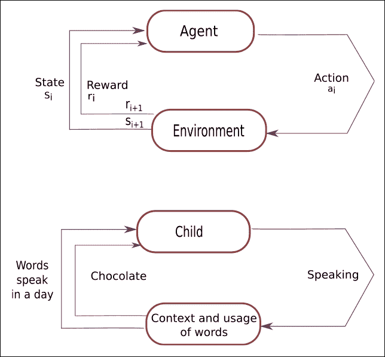

图 11.1：强化学习基本概念的形象表示

所以基本上，强化学习（RL）允许机器和软件代理在特定任务或特定情境中自动确定理想和最佳的行为，以最大化软件代理的性能。代理需要简单的奖励反馈来学习其行为，这被称为强化信号。每次软件代理尝试采取导致其获得最大奖励的行动时，它都会尝试。最终，它学会了所有导致代理达到任务最优解的行动或移动，从而成为该领域的专家。强化学习的算法学会对环境做出反应。

为了构建游戏机器人，强化学习算法是完美的选择，这背后有原因。假设有许多带有随机回报的老虎机，你想要赢得最大金额。你该如何赢得最大金额？一个简单的方法是只选择一台机器，整天拉动它的杠杆，它可能会给你一些回报。如果你足够幸运，那么你可能会中大奖。为了尝试这种方法，你可能会损失一些钱。这种方法被称为*纯利用*方法。这不是一个最优的方法。

让我们采取另一种方法。在这个方法中，我们将拉动每台老虎机的杠杆，并祈祷至少有一台能够中大奖。这同样是一个简单的方法。在这个方法中，我们需要整天拉动杠杆。这种方法被称为*纯探索*方法。这种方法也不是最优的，因此我们需要在这两种方法之间找到一个适当的平衡，以获得最大的奖励。这被称为强化学习中的探索与利用的困境。现在我们需要解决这个问题。好吧，为了做到这一点，我们需要一个数学框架，可以帮助我们实现最优解，而这个数学方法就是*马尔可夫决策过程（MDP）*。让我们来探讨一下。

## 马尔可夫决策过程（MDP）

马尔可夫决策过程使用以下参数：

+   状态集合，*S*

+   行动集合，*A*

+   奖励函数，*R*

+   策略，*π*

+   价值，*V*

为了将一个状态转换到最终状态*(S)*，我们必须采取一个动作*(A)*或一系列动作。我们将为每个采取的动作获得奖励*(R)*。我们的行动可以提供正奖励或负奖励。我们采取的行动集合定义了我们的策略*(π)*。执行每个行动后获得的奖励定义了我们的价值*(V)*。我们的目标是通过对策略的正确选择来最大化奖励。我们可以通过执行最佳可能的行动来实现这一点。从数学上讲，我们可以像以下截图所示那样表达这一点：

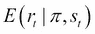

图 11.2：马尔可夫决策过程的数学表示

我们将应用前面的方程式来计算时间 t 时所有可能的*状态*值。我们有一组状态和动作。我们需要考虑这些状态、动作以及将智能体从一个状态转换到另一个状态的规则。当我们执行改变游戏智能体状态的行动时，智能体将因该行动而获得奖励。这个状态、行动和获得奖励的整个过程构成了马尔可夫决策过程（MDP）。一场游戏的一轮被认为是 MDP 的一个*回合*。这个过程包括有限的状态、动作和奖励序列。请看以下方程式，以表示这个过程：：

S0, a0, r1, s1, a1, r2, s2, a2, r3 ，…，sn-1, an-1, rn, sn

在这里，s[i] 代表状态，ai 是动作，r[i+1] 是执行动作后我们将获得的奖励。sn 表示一个特定的场景以终端状态结束，这发生在“游戏结束”屏幕出现时。马尔可夫决策过程基于马尔可夫假设，下一个状态 s[i+1] 的概率取决于当前状态 s[i] 和执行的动作 ai，而不取决于前面的状态或动作。

## 折现未来奖励

从长远来看，如果我们想让我们的游戏代理做得好，那么我们需要考虑即时奖励，但我们也需要考虑我们的代理将获得的未来奖励。我们应该如何处理这种情况呢？嗯，答案在于折现未来奖励的概念。

给定一个 MDP 的运行，我们可以通过以下方程计算一个场景的总奖励：

R = r1 + r2 + r3 + … + rn

基于前面的方程，我们可以计算出从时间戳 *t* 开始的*总未来奖励*，这可以用给定的方程表示：

Rt = rt + rt+1 + rt+2 + rt+3 + … + rn

在这里，我们处理的是一个随机的游戏环境，我们无法确定我们是否会在执行相同的动作来玩特定游戏时获得相同的奖励。你考虑未来得越多，它就会越偏离。因此，我们最好使用*折现未来奖励*而不是总奖励：

Rt = rt+ γrt+1 + γ2rt+2+ … + γn-1 rn

在这里，γ 是折现系数。它的值在 *0 到 1* 之间。很容易理解，在特定的时间步 t 的折现未来奖励可以用当前状态的奖励加上时间步 *t+1* 的奖励来表示：

Rt = rt + γ (rt+1 + γ (rt+2 + …)) = rt + γRt+1

现在让我告诉你调整这个折现系数的实际意义：如果我们把折现系数 γ 的值设为 0，那么我们的游戏策略将是短视的，我们只是基于即时奖励来做游戏决策。我们需要在即时奖励和未来奖励之间找到一个平衡，所以我们应该把折现系数的值设为大于 0.7。

例如，我们可以将值设为 γ = 0.9。如果我们知道我们的游戏环境是确定性的，并且相同的动作总是带给我们相同的奖励，那么我们可以将折现系数 γ 的值设为 1。对于游戏代理来说，一个好的策略是始终*选择一个最大化折现未来奖励的动作*。

我们已经涵盖了强化学习的基础。从现在开始，我们将开始实现我们的游戏机器人。所以，让我们为一些乐趣做好准备！

# 基本 Atari 游戏机器人

在本章中，我们尝试了一种动手的方式来构建一些基本的游戏机器人。我们选择了几乎每个人在生命中某个时刻都玩过的著名雅达利游戏。我们选择雅达利游戏是因为我们知道如何玩它们，这使得我们的生活变得简单，因为我们能够理解我们的机器人应该执行什么样的动作，以便在一段时间内变得更好。

在本节中，我们将构建自己的游戏。这个游戏很简单，因此我们可以看看我们如何应用 Q-Learning 算法。在这里，我们将自己设计游戏世界。让我们开始吧！

## 理解关键概念

在本节中，我们将探讨许多重要的方面，这些方面将帮助我们进行编码，因此在这里，我们将涵盖以下主题：

+   游戏规则

+   理解 Q-Learning 算法

### 游戏规则

在我们开始基本概念或算法之前，我们需要了解我们正在构建的游戏规则。这个游戏很简单，很容易玩。这个游戏的规则如下：

+   *游戏规则：* 游戏代理意味着一个黄色方块必须达到一个目标以结束游戏：它可以是绿色单元格或红色单元格。这意味着黄色方块应该到达绿色单元格或红色单元格。

+   *奖励：* 每一步都会给我们一个负奖励 -0.04。如果我们的游戏代理到达红色单元格，那么红色单元格会给我们一个负奖励 -1。如果我们的游戏代理到达绿色单元格，那么绿色单元格会给我们一个正奖励 +1。

+   *状态：* 每个单元格都是代理的一个状态，它需要找到其目标。

+   *动作：* 这个游戏只有四个动作：向上方向、向下方向、向右方向、向左方向。

我们需要 `tkinter` 库来实现这个方法。我已经在这个 GitHub 链接中提供了如何安装它的描述：[`github.com/jalajthanaki/Q_learning_for_simple_atari_game/blob/master/README.md`](https://github.com/jalajthanaki/Q_learning_for_simple_atari_game/blob/master/README.md)。

现在，让我们看看在本章构建游戏机器人时我们将使用的 Q 学习算法。

### 理解 Q-Learning 算法

这个算法最初由 DeepMind 在两篇论文中发表。第一篇论文在 2013 年 NIPS 上以 *Playing Atari with Deep Reinforcement Learning* 为标题发表。论文的链接是 [`arxiv.org/pdf/1312.5602.pdf`](https://arxiv.org/pdf/1312.5602.pdf)。第二篇论文在 2015 年《自然》杂志上以 *Human-level control through deep reinforcement Learning* 为标题发表。这篇论文的链接是 [`www.davidqiu.com:8888/research/nature14236.pdf`](http://www.davidqiu.com:8888/research/nature14236.pdf)。你绝对应该阅读这些论文。我已经为你简化了这些论文的主要概念。

在 Q 学习中，我们需要定义一个*Q(s, a)*函数，它表示我们在状态*s*执行动作*a*时的折扣因子奖励，并从该点开始进行最优操作。你可以在下面的截图中看到帮助我们选择最大奖励的方程：

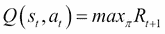

图 11.3：Q 函数的方程

我们可以将 Q(s, a)函数视为在特定状态*s*执行动作*a*后，在游戏结束时给我们提供最佳可能得分的函数。这个函数是 Q 函数，因为它表明了在特定状态下某个动作的质量。

让我来简化一下。假设你处于状态*s*，正在考虑是否应该执行动作*a*或*b*。你真的想以高分赢得游戏。所以，为了实现你的目标，你想要选择在游戏结束时给你带来最高得分的动作。如果你有这个 Q 函数，那么动作的选择就变得相当简单，因为你只需要选择具有最高 Q 值的动作。你可以在下面的截图中看到你可以使用的方程来获得最高的 Q 值：

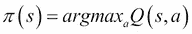

图 11.4：使用 Q 函数选择最大奖励的方程

在这里，π代表策略。策略表明游戏的规则和动作。借助策略，我们可以选择在每个状态下可用的典型动作。我们的下一步是获取这个 Q 函数。为此，我们需要专注于仅一个转换。这个转换由四个状态组成：*< s, a, r, s' >*。记住折扣因子奖励，其中我们可以用下一个状态*s'的 Q 值来表示当前状态*s*和当前动作*a*的 Q 值。计算奖励的方程式在下面的截图提供：

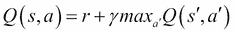

图 11.5：计算奖励的 Bellman 方程

上述方程被称为 Bellman 方程，它是 Q 学习算法背后的主要思想。这个方程相当合理，它表明这个状态和动作的最大未来奖励是即时奖励和下一个状态的最大未来奖励的总和。

主要的直觉是，通过跟随*迭代次数*和近似步骤，我们可以生成 Q 函数的值。我们将通过使用*Bellman 方程*来实现这一点。在最简单的情况下，Q 函数以表格的形式实现，其中状态是其行，动作是其列。这个 Q 学习算法的伪步骤很简单。你可以看看它们，如下所示：

+   第 1 步：任意初始化 Q [状态数量，动作数量]

+   第 2 步：观察初始状态

+   第 3 步：重复

    ```py
    Select and perform an action a
    Observe two things: reward r and new state s'
    Q [s, a] = Q [s, a] + α (r + γmaxa' Q [s', a'] - Q [s, a])
    s = s'
    ```

+   直到终止

我们需要遵循以下步骤，其中α是学习率。学习率验证了先前 Q 值和新提出的 Q 值之间的差异。这个差异值被考虑在内，以便我们可以检查我们的模型何时会收敛。借助学习率，我们可以调节训练速度，使我们的模型不会变得太慢以至于无法收敛，或者太快以至于无法学习任何东西。我们将使用*maxa'Q [s', a']*来更新*Q [s, a]*以最大化奖励。这是我们唯一需要执行的操作。这个估计操作将给我们提供更新的 Q 值。在训练的早期阶段，当我们的智能体在学习时，可能会出现我们的估计完全错误的情况，但随着每一次迭代的进行，估计和更新的 Q 值会越来越准确。如果我们进行这个过程足够多次，那么 Q 函数将收敛。它代表了真实和优化的 Q 值。为了更好地理解，我们将实现前面的算法。请参考以下截图中的代码片段：

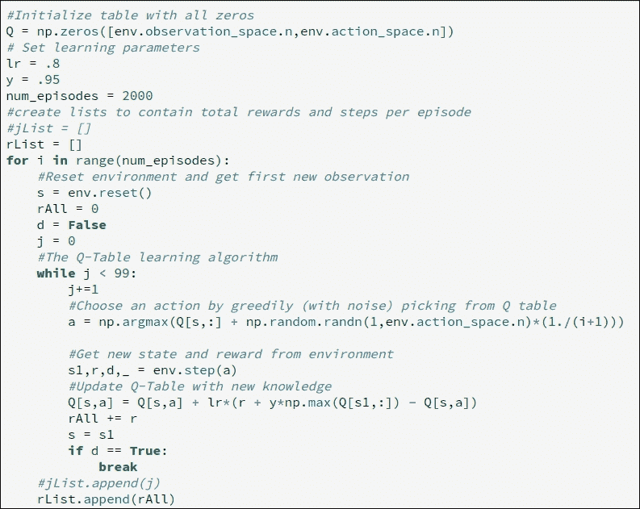

图 11.6：构建和更新 Q 表的代码片段

你可以在以下截图中以 Q 表的形式看到输出：

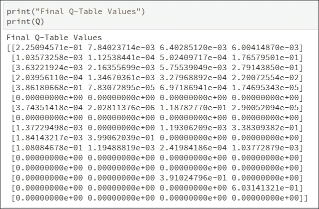

图 11.7：Q 表值

你可以通过参考以下 GitHub 链接来查看前面算法的实现：[`github.com/jalajthanaki/Q_learning_for_simple_atari_game/blob/master/Demo_Q_table.ipynb`](https://github.com/jalajthanaki/Q_learning_for_simple_atari_game/blob/master/Demo_Q_table.ipynb)。

现在让我们开始实现游戏。

# 实现游戏机器人的基本版本

在本节中，我们将实现一个简单的游戏。我已经定义了这个游戏的规则。为了快速提醒你，我们的智能体，黄色方块试图到达红色方块或绿色方块。如果智能体到达绿色方块，我们将获得+1 作为奖励。如果它到达红色方块，我们得到-1。智能体每走一步都将被视为-0.04 的奖励。如果你想查看游戏的规则部分，可以翻回前面的页面。你可以通过参考这个 GitHub 链接来查看这个基本版本的游戏机器人代码：[`github.com/jalajthanaki/Q_learning_for_simple_atari_game`](https://github.com/jalajthanaki/Q_learning_for_simple_atari_game)。

对于这个游戏，游戏世界或游戏环境已经构建好了，所以我们不需要担心它。我们只需要通过导入语句来包含这个游戏世界。我们正在运行的脚本主程序是`Lerner.py`。该代码的代码片段如下所示：

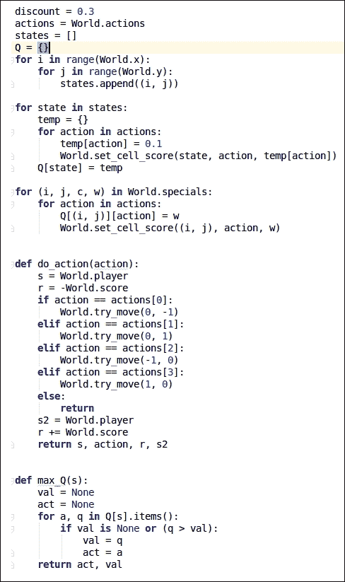

图 11.8：游戏机器人基本版本的代码片段 - I

如前述代码所示，我们通过循环中给出的代码帮助跟踪智能体的状态和动作。之后，我们将定义这个游戏的四种可能动作，并基于此计算奖励值。我们还定义了`max_Q`函数，它为我们计算最大的 Q 值。您也可以参考以下截图：

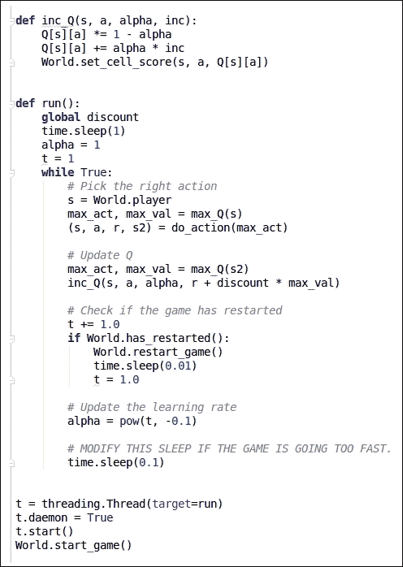

图 11.9：游戏机器人基本版本代码片段 - II

如前述代码片段所示，辅助函数使用`inc_Q`方法来更新 Q 值。通过使用`run`函数，我们可以更新 Q 值，使我们的机器人学会如何找到最佳解决方案。您可以通过执行以下命令来运行此脚本：

```py
$ python Learner.py

```

当您运行脚本时，您可以看到以下输出窗口，在 1-2 分钟内，这个机器人将找到最佳解决方案。您可以在以下截图中找到机器人的初始状态和最终状态输出：

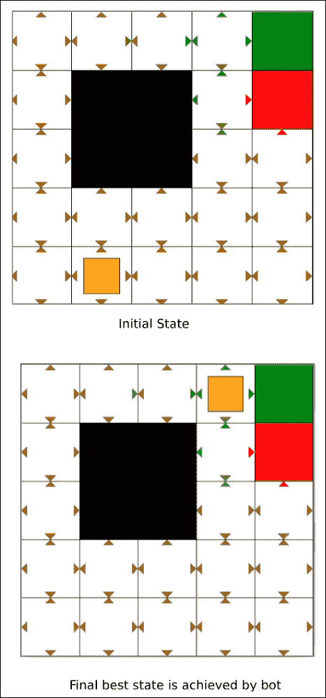

图 11.10：游戏机器人基本版本的输出

您可以通过使用奖励分数来跟踪机器人的进度。您可以参考以下截图：

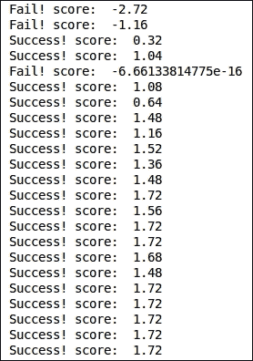

图 11.11：跟踪游戏机器人的进度

如您所见，在初始迭代中，游戏机器人在经过几次迭代后表现不佳，但随后开始根据其获得的经验学习如何采取行动。我们在奖励分数没有显著提高时停止了代码。这是因为我们的游戏机器人能够找到最佳解决方案。

现在，让我们构建一个更复杂的游戏机器人；我们将使用深度 Q 网络进行训练。那么，让我们开始吧。

# 构建太空侵略者游戏机器人

我们将构建一个能够玩太空侵略者的游戏机器人。你们大多数人可能都玩过这个游戏，或者至少听说过它。如果您没有玩过，或者现在想不起来，那么请看看以下截图：

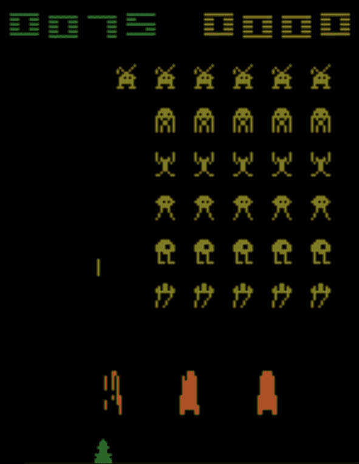

图 11.12：太空侵略者游戏片段

希望您现在还记得这个游戏以及它是如何玩的。首先，我们将看看我们将用于构建这个版本游戏机器人的概念。让我们开始吧！

## 理解关键概念

在这个版本的游戏机器人中，我们将使用深度 Q 网络并训练我们的机器人。因此，在实现此算法之前，我们需要理解这些概念。看看以下概念：

+   理解深度 Q 网络（DQN）

+   理解经验回放

### 理解深度 Q 网络（DQN）

深度 Q 网络算法基本上是两个概念的组合。它使用深度神经网络中的 Q 学习逻辑。这就是为什么它被称为深度 Q 网络（DQN）。

每个游戏世界都有不同的环境。例如，超级马里奥与太空侵略者看起来不同。我们不能每次都为单个游戏提供整个游戏环境，因此首先我们需要决定所有游戏的通用表示，以便我们将它们作为 DQN 算法的输入。屏幕像素是明显的输入选择，因为它们显然包含了关于游戏世界及其状况的所有相关信息。没有屏幕像素的帮助，我们无法捕捉游戏代理的速度和方向。

如果我们将与 DeepMind 论文中提到的相同的前处理步骤应用于游戏屏幕，那么我们需要遵循以下步骤：

第 1 步：我们需要考虑游戏的最后四张屏幕图像作为输入。

第 2 步：我们需要将它们调整到 84 x 84 的大小，并将它们转换为 256 级灰度。这意味着我们将有 256^(84x84x4)，大约是 10⁶⁷⁹⁷⁰种可能的游戏状态。这意味着在我们的想象中的 Q 表中将有 10⁶⁷⁹⁷⁰行，这是一个很大的数字。你可以争论说，许多像素组合或状态从未发生，所以我们可能将其表示为稀疏矩阵。这个稀疏矩阵只包含已访问的状态。然而，大多数状态很少被访问。因此，Q 表的收敛需要很长时间。坦白说，我们也希望为代理从未见过的状态提供一个好的 Q 值猜测，这样我们就可以为游戏代理生成一个合理的动作。这就是深度学习介入的地方。

第 3 步：神经网络非常适合为高度结构化的数据生成良好的特征。借助神经网络，我们可以表示我们的 Q 函数。这个神经网络将状态（即四个游戏屏幕和动作）作为输入，并生成相应的 Q 值作为输出。*或者，我们也可以只将游戏屏幕作为输入，并为每个可能的动作生成 Q 值作为输出。* 这种方法有一个很大的优点。让我解释一下。我们在这里做了两件主要的事情。首先，我们需要获得更新的 Q 值。其次，我们需要选择具有最高 Q 值的动作。

因此，如果我们有所有可能动作的 Q 值，那么我们可以很容易地更新 Q 值。我们也可以很轻松地选择具有最高 Q 值的动作。有趣的部分是，我们可以通过执行网络的前向传递来生成所有动作的 Q 值。经过单次前向传递，我们可以拥有所有可能动作的 Q 值列表。这次前向传递将节省大量时间，并为游戏代理提供良好的奖励。

#### DQN 架构

你可以在以下图表中找到深度 Q 网络的理想架构：

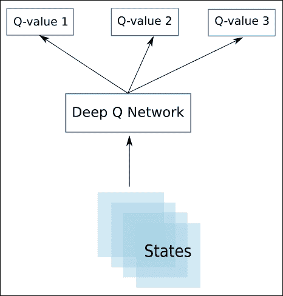

图 11.13：DQN 架构

上述架构已在 DeepMind 论文中使用并发表。神经网络架构在下面的屏幕截图中显示：

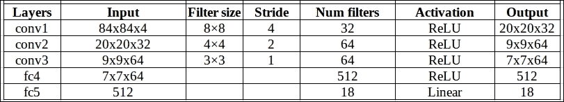

图 12.14：DQN 架构

提供的架构使用了一个经典的卷积神经网络（CNN）。它包含三个卷积层，随后是两个全连接层，这与我们在对象检测和面部识别 CNN 架构中看到的带有池化层的 CNN 架构相同。在这里，没有使用池化层。这是因为使用池化层的主要目的是使神经网络对位置不敏感。这意味着如果我们使用池化层，那么图像中对象的放置就不会被神经网络考虑。对于分类任务来说，这种位置不敏感性是有意义的，但对于游戏来说，游戏环境中对象的放置位置很重要。它们帮助我们确定动作以及潜在的奖励，我们不想丢弃这些信息。因此，我们在这里没有使用池化层。

#### DQN 算法的步骤

让我们看看 DQN 算法的步骤：

*网络输入:* 四个 84 x 84 的灰度游戏屏幕像素。

*网络输出:* 作为输出，我们将为每个可能的行为生成 Q 值。Q 值可以是任何实数，这意味着它可以是你能想象到的任何实数，这使得它成为一个回归任务。我们知道我们可以通过简单的平方误差损失来优化回归函数。误差损失的方程式在下面的屏幕截图中显示：

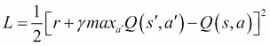

图 11.15：误差损失函数的方程式

*Q 表更新步骤:* 存在着过渡 *< s, a, r, s' >*，但这次，更新 Q 表的规则与 Q-learning 不同。有一些变化。因此，更新 Q 表的步骤如下：

+   第 1 步：我们需要对当前状态 *s* 执行前向传播，以获得所有动作的预测 Q 值。

+   第 2 步：对下一个状态 *s'* 执行前向传播，并计算所有网络输出 *maxa'Q(s', a').*

+   第 3 步：为动作 *a* 设置 Q 值目标为 *r + γmaxa'Q(s', a')*。在这里，我们可以使用我们在第 2 步中已经计算出的 *maxa'Q(s', a')* 值。对于所有其他动作，设置从第 1 步继承的 Q 值，使得那些输出的误差为零。

+   第 4 步：我们需要使用反向传播来更新神经网络的权重。

现在我们来看一下经验回放的概念。

### 理解经验回放

我们正在使用两个概念来估计每个状态的未来奖励。我们使用 Q-learning，并使用卷积神经网络来近似 Q 函数。在这里，Q 值的近似是通过一个非线性函数完成的，而这个函数对于模型收敛来说并不非常稳定。因此，我们需要尝试各种超参数。这需要很长时间：在单个 GPU 上几乎需要一周的时间来训练游戏机器人。

我们将使用一个称为经验回放的概念。在训练过程中，所有经验 *< s, a, r, s' >* 都存储在回放记忆中。当我们进行训练时，网络将使用回放记忆中的随机样本而不是最近的转换。这样，训练时间会更短，而且还有一个优点。借助经验回放，我们的训练任务将更类似于常规的监督学习。现在我们可以轻松地对算法进行调试和测试操作。借助回放记忆，我们可以存储所有我们的游戏人类经验，然后根据这个数据集来训练模型。

因此，最终在 DQN 中使用的 Q-learning 算法的步骤如下。此算法来自原始的 DQN 论文，该论文可在[`arxiv.org/pdf/1312.5602.pdf`](https://arxiv.org/pdf/1312.5602.pdf)找到：

+   第 1 步：我们需要初始化回放记忆 D

+   第 2 步：我们需要用随机权重初始化动作值函数 Q

+   第 3 步：观察初始状态值

+   第 4 步：重复

    ```py
    Choose an action a       
    with probability ε we need to select a random action       
    otherwise we need to select a = argmaxa'Q(s,a')   
    Perform action a   
    Check reward r and new state s'   
    store the gameplay experience <s, a, r, s'> in replay memory D   
    sample random transitions <ss, aa, rr, ss'> from replay memory D   
    calculate target for each minibatch transition       
    if ss' is terminal state then tt = rr       
    otherwise tt = rr + γmaxa'Q(ss', aa')   
    We need to train the Q network using (tt - Q(ss, aa))² as loss   
    s = s'
    until terminated
    ```

我们正在使用 Q-learning 和 DQN 来实现空间入侵者游戏机器人。所以，让我们开始编码。

# 实现空间入侵者游戏机器人

在本节中，我们将使用 DQN 和 Q-learning 来编写空间入侵者游戏。对于编码，我们将使用`gym`、`TensorFlow`和`virtualenv`库。你可以通过使用这个 GitHub 链接查看整个代码：[`github.com/jalajthanaki/SpaceInvaders_gamingbot`](https://github.com/jalajthanaki/SpaceInvaders_gamingbot)。

我们正在使用卷积神经网络（CNN）。在这里，我们已经在单独的文件中定义了 CNN。这个文件的名称是`convnet.py`。请看下面的截图：以下图：

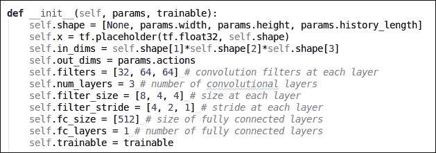

图 11.16：`convnet.py`的代码片段

你可以通过这个 GitHub 链接查看代码：[`github.com/jalajthanaki/SpaceInvaders_gamingbot/blob/master/convnet.py`](https://github.com/jalajthanaki/SpaceInvaders_gamingbot/blob/master/convnet.py)。

我们在`dqn.py`脚本中定义了 DQN 算法。你可以参考以下截图中的代码片段：

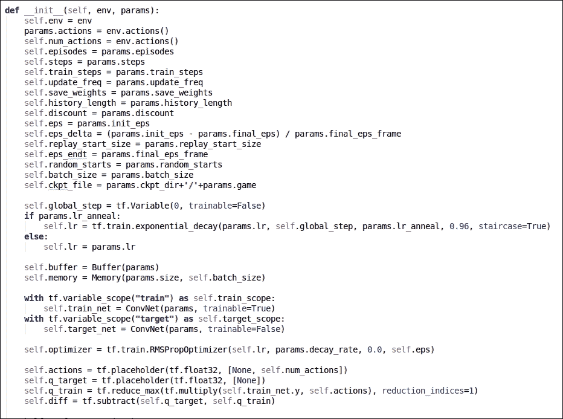

图 11.17：`dqn.py`的代码片段

对于训练，我们已经在`train.py`中定义了我们的训练逻辑。你可以参考以下截图中的代码片段：

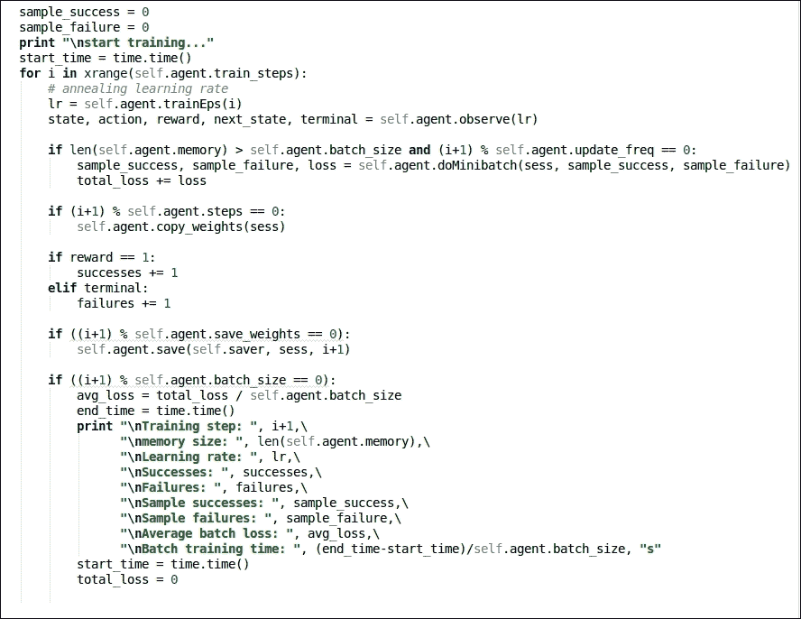

图 11.18：train.py 的代码片段

最后，我们将所有这些独立的脚本导入到主`atari.py`脚本中，在该脚本中，我们定义了所有参数值。您可以参考以下截图中的代码片段：

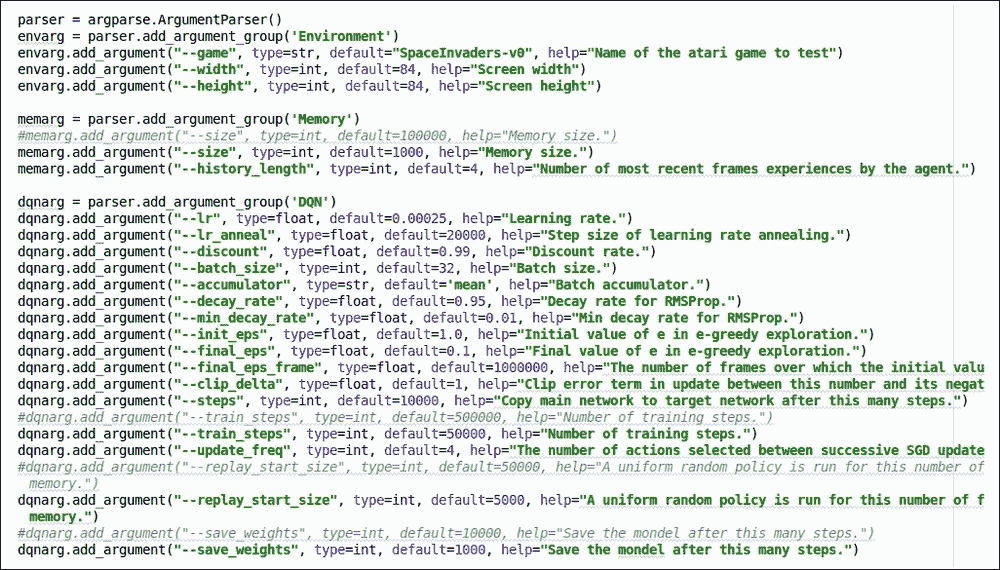

图 11.19：atari.py 的代码片段

您可以通过执行以下命令开始训练：

`$ python atari.py --game SpaceInvaders-v0 --display true`

训练这个机器人以达到人类水平的表现至少需要 3-4 天的训练。我没有提供那么多的训练，但您肯定可以做到。您可以查看以下截图中的训练输出：以下图：

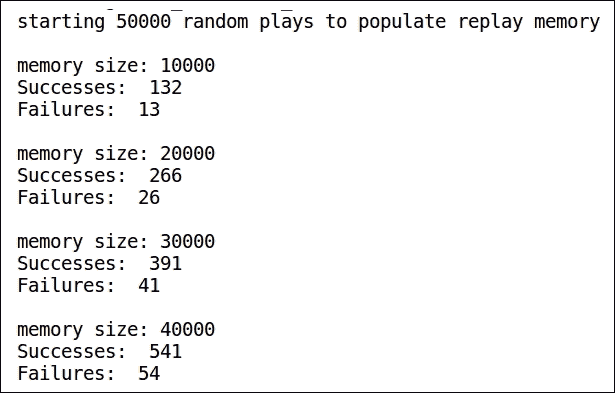

图 11.20：训练步骤的输出片段

您可以通过参考以下截图来查看游戏环境初始得分的代码片段：

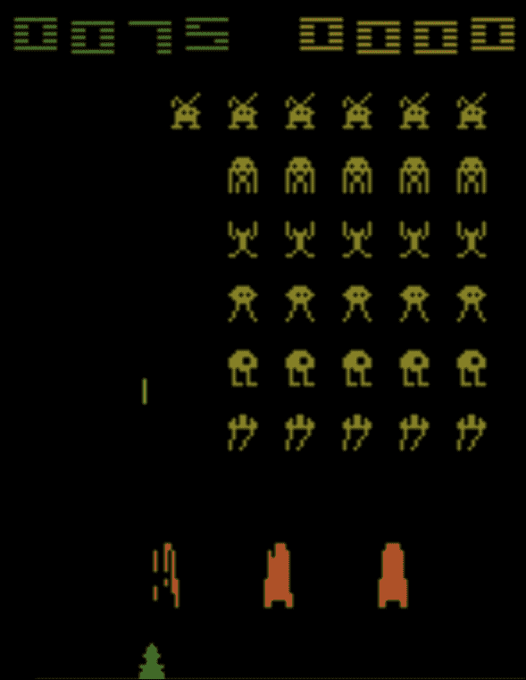

图 11.21：游戏机器人前几场比赛得分的代码片段

要停止训练，将有两个参数：要么当我们的损失函数值在几次迭代中变为常数时结束训练，要么完成所有训练步骤。在这里，我们定义了 50,000 个训练步骤。您可以参考以下截图中的训练输出代码片段：

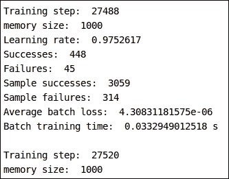

图 11.22：训练日志的代码片段

您可以通过查看以下截图来查看游戏机器人经过 1,000 次迭代后的得分：

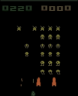

图 11.23：经过 1,000 次迭代的游戏机器人的代码片段

我已经为您上传了预训练模型。您可以通过使用此 GitHub 链接下载它：[`github.com/jalajthanaki/SpaceInvaders_gamingbot/tree/master/model`](https://github.com/jalajthanaki/SpaceInvaders_gamingbot/tree/master/model)。

现在是时候构建乒乓球游戏的机器人了。如果您使用单个 GPU 训练这个机器人一周，它可以击败游戏制造商团队编写的 AI 规则。因此，我们的智能体肯定会比计算机智能体表现得更好。

# 构建乒乓球游戏机器人

在本节中，我们将探讨如何构建一个能够学习乒乓球游戏的游戏机器人。在我们开始之前，我们将查看构建乒乓球游戏机器人所使用的方法和概念。

## 理解关键概念

在本节中，我们将介绍构建乒乓球游戏机器人的一些方面，具体如下：

+   游戏机器人的架构

+   游戏机器人的方法

### 游戏机器人的架构

为了开发乒乓球游戏机器人，我们选择了一个基于神经网络的方案。我们神经网络的架构至关重要。让我们一步一步地查看架构组件：

1.  我们将游戏屏幕作为输入，并按照 DQN 算法对其进行预处理。

1.  我们将预处理后的屏幕传递给一个神经网络 (NN)。

1.  我们使用梯度下降来更新 NN 的权重。

1.  权重 [1]: 此矩阵持有传递到隐藏层的像素权重。维度将是 [200 x 80 x 80] – [200 x 6400]。

1.  权重 [2]: 此矩阵持有传递到输出的隐藏层权重。维度将是 [1 x 200]。

您可以参考以下图表：

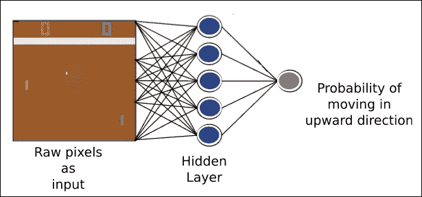

图 11.24：Pong 游戏机器人的神经网络架构

当我们看到这个游戏机器人的详细方法时，NN 的每个组件的任务更有意义。

### 游戏机器人的方法

为了构建 Pong 游戏机器人，我们将采用以下方法：

+   对于实现，我们使用预处理后的图像向量，它是一个 [6400 x 1] 维度数组。

+   在神经网络 (NN) 的帮助下，我们可以计算向上移动的概率。

+   在那个概率分布的帮助下，我们将决定智能体是否向上移动。

+   如果游戏回合结束，这意味着游戏智能体以及对手都错过了球。在这种情况下，我们需要找出我们的游戏智能体是赢了还是输了。

+   当剧集结束时，这意味着如果任何一名玩家得分达到 21 分，我们需要传递结果。借助损失函数，我们可以找到错误值。我们应用梯度下降算法来找出我们的神经网络权重应该更新的方向。基于反向传播算法，我们将错误传播回网络，以便我们的网络可以更新权重。

+   一旦完成 10 个剧集，我们需要汇总梯度，然后，我们沿着梯度的方向更新权重。

+   重复此过程，直到我们的网络权重调整完毕，我们可以击败电脑。

现在让我们来介绍编码步骤。

# 实现 Pong 游戏机器人

这些是我们需要遵循的实现步骤：

+   参数初始化

+   以矩阵形式存储的权重

+   更新权重

+   如何移动智能体

+   使用神经网络理解过程

您可以通过使用此 GitHub 链接来参考整个代码：[`github.com/jalajthanaki/Atari_Pong_gaming_bot`](https://github.com/jalajthanaki/Atari_Pong_gaming_bot)。

## 参数初始化

首先，我们定义并初始化我们的参数：

+   `batch_size:` 此参数表示在更新我们网络的权重之前应该玩多少轮游戏。

+   `gamma:` 这是折扣因子。我们使用它来折扣游戏旧动作对最终结果的影响。

+   `decay_rate:` 此参数用于更新权重。

+   `num_hidden_layer_neurons:` 此参数表示我们应该在隐藏层中放置多少个神经元。

+   `学习率:` 这是我们游戏代理从结果中学习的速度，以便我们可以计算新的权重。学习率越高，我们对外部结果的反应越强烈，而学习率越低，我们对外部结果的反应就越不强烈。

您可以参考以下截图所示的代码片段：

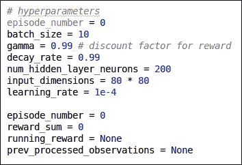

图 11.25：参数初始化

## 以矩阵形式存储的权重

神经网络的权重以矩阵的形式存储。NN 的第一层是一个 200 x 6400 的矩阵，表示隐藏层的权重。如果我们使用符号*w1_ij*，那么这意味着我们正在表示第*i^(th)*个神经元在层 1 中对输入像素*j*的权重。第二层是一个 200 x 1 的矩阵，表示权重。这些权重是隐藏层的输出。对于层 2，元素*w2_i*表示放置在隐藏层第*i^(th)*个神经元激活上的权重。

您可以参考以下截图给出的代码片段：

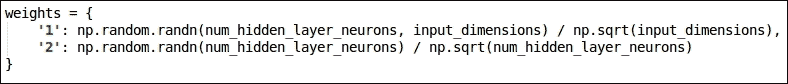

图 11.26：权重矩阵

## 更新权重

为了更新权重，我们将使用 RMSprop。您可以参考以下论文以了解有关此函数的更多详细信息：

[`sebastianruder.com/optimizing-gradient-descent/index.html#rmsprop`](http://sebastianruder.com/optimizing-gradient-descent/index.html#rmsprop)。请参考以下图示。

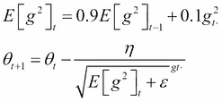

图 11.27：RMSprop 方程

代码显示在以下截图：

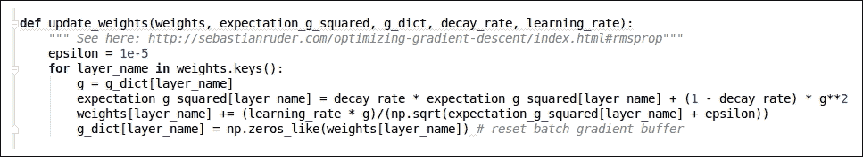

图 11.28：更新权重的代码片段

## 如何移动代理

在预处理输入的帮助下，我们将权重矩阵传递给神经网络。我们需要生成告诉代理向上移动的概率。您可以参考以下截图所示的代码片段：

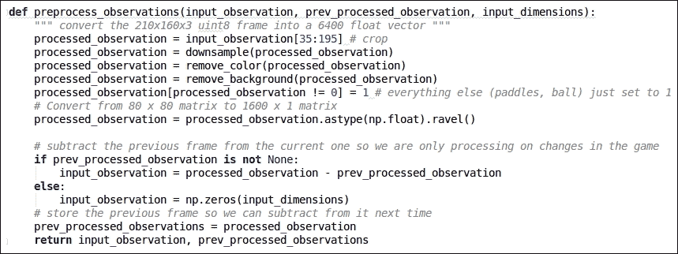

图 11.29：移动代理的代码片段

我们已经完成了所有主要的辅助函数。我们需要将这些逻辑应用到神经网络中，以便它能够根据观察结果生成游戏代理向上移动的概率。

## 使用神经网络理解过程

这些步骤可以帮助我们生成代理向上移动的概率，以便它们可以决定何时向上移动

+   我们需要通过将权重[1]和`observation_matrix`之间的点积来计算隐藏层值。权重[1]是一个 200 x 6400 的矩阵，而`observation_matrix`是一个 6400 x 1 的矩阵。输出矩阵的维度是 200 x 1。在这里，我们使用了 200 个神经元。Q 函数的每一行代表一个神经元的输出。

+   我们将对隐藏层值应用非线性函数 ReLU。

+   我们正在使用隐藏层的激活值来计算输出层的值。再次，我们在`hidden_layer_values` [200 x 1]和权重[2] [1 x 200]之间执行点积。这个点积给我们一个单一值[1 x 1]。

+   最后，我们将 sigmoid 函数应用于输出值。这将给出一个关于概率的答案。输出值介于 0 和 1 之间。

你可以参考以下屏幕截图中的代码片段：

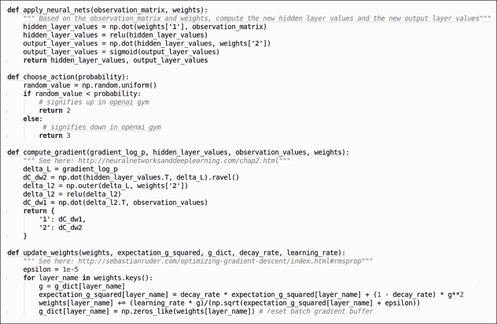

图 11.30：使用神经网络的过程代码片段

要运行此代码，你需要执行以下命令：

```py
$ python me_Pong.py
```

如果你想要构建一个能够打败电脑的机器人，那么你至少需要在单个 GPU 上训练三天到四天。你可以在以下屏幕截图中参考机器人的输出：

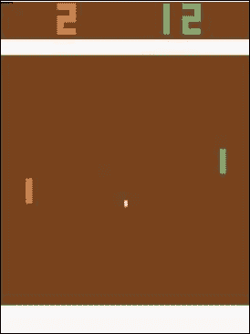

图 11.31：Pong 游戏机器人的输出

你可以在以下屏幕截图中看到训练日志：

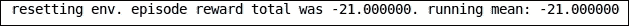

图 11.32：Pong 游戏机器人的训练日志

现在让我们仅作娱乐地构建一个游戏机器人。这个机器人使用 Flappy Bird 游戏环境。

# 仅作娱乐 - 实现 Flappy Bird 游戏机器人

在本节中，我们将构建 Flappy Bird 游戏机器人。这个游戏机器人是使用 DQN 构建的。你可以在以下 GitHub 链接中找到完整的代码：[`github.com/jalajthanaki/DQN_FlappyBird`](https://github.com/jalajthanaki/DQN_FlappyBird)。

这个机器人有一个预训练的模型，所以你可以使用预训练的模型来测试它。为了运行这个机器人，你需要执行以下命令：

```py
$ python deep_q_network.py
```

你可以在以下屏幕截图中看到输出：

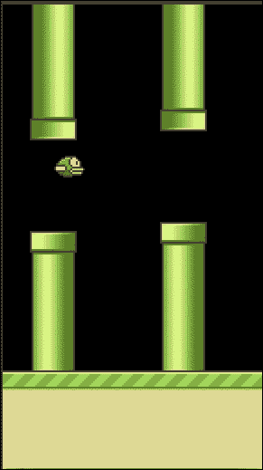

图 11.33：Flappy Bird 游戏机器人的输出

你可以在这次实现中看到我们迄今为止所研究的所有概念的组合，所以请确保你探索这段代码。这将是本章的练习。

# 摘要

恭喜读者们；你们已经到达了本章的结尾！我们在这章中介绍了与强化学习相关的基本概念。你学习了构建游戏机器人的各种概念和算法。你还了解了深度 Q 学习算法是如何工作的。使用`gym`库，我们加载了游戏世界。通过使用`dqn`库，我们将能够训练模型。训练一个能够击败人类级别专家的游戏机器人需要花费大量时间。所以，我只训练了几个小时。如果你想训练更长的时间，你绝对可以做到。我们尝试构建了各种简单的 Atari 游戏，例如简单的路径寻找游戏机器人、太空侵略者、乒乓球和 Flappy Bird。你可以将这种基本方法扩展到更大的游戏环境中。如果你想更新自己并做出贡献，那么你可以查看 OpenAI 的 GitHub 仓库：[`github.com/openai`](https://github.com/openai)。深度学习的新闻和博客部分可以在以下链接找到：[`deepmind.com/blog/`](https://deepmind.com/blog/)。

在接下来的部分，你将找到一个附录，可以帮助你获得一些额外信息。这些额外信息将帮助你在构建机器学习（ML）应用或参加黑客马拉松或其他竞赛时。我还提供了一些可以帮助你在构建 ML 应用时的速查表。
