# 第一章：大数据生态系统

现代技术已经彻底改变了我们对数据的理解。以前，数据传统上被认为是限制在电子表格或关系数据库中的文本和数字，而如今，它是一种有机且不断发展的资产，由任何拥有智能手机、电视或银行账户的人大规模创建和消费。在本章中，我们将探讨新的生态系统，其中包括前沿的工具、技术和框架，使我们能够存储、处理和分析大量数据，以便提供可操作的见解并解决现实世界的问题。到本章结束时，你将获得以下前沿技术类别的深入了解：

+   分布式系统

+   NoSQL 数据库

+   人工智能和机器学习框架

+   云计算平台

+   大数据平台和参考架构

# 数据简史

如果你在 1970 年代到 2000 年代初的主流 IT 行业工作，那么你组织的数据库可能存储在基于文本的定界文件、电子表格或结构良好的关系数据库中。在后一种情况下，数据被建模并持久化在预定义的、可能相关的表中，这些表代表组织中数据模型中找到的各种实体，例如，根据员工或部门。这些表包含跨越多个列的数据行，代表构成该实体的各种属性；例如，在员工的情况下，典型的属性包括名字、姓氏和出生日期。

# 垂直扩展

随着贵组织的数据资产和需要访问这些数据的使用者数量的增长，高性能的远程服务器将被利用，通过企业网络提供访问权限。这些远程服务器通常要么作为远程文件系统用于文件共享，要么托管**关系数据库管理系统**（**RDBMSes**）以存储和管理关系数据库。随着数据需求的增长，这些远程服务器将需要垂直扩展，这意味着将安装额外的 CPU、内存和/或硬盘空间。通常，这些关系数据库将存储从数百到可能数千万条记录。

# 主/从架构

作为提供弹性和负载均衡读取请求的手段，可能已经采用了主/从架构，其中数据通过近实时复制自动从主数据库服务器复制到物理上不同的从数据库服务器。这项技术要求主服务器负责所有写请求，而读取请求可以卸载并在从服务器之间进行负载均衡，其中每个从服务器都持有主数据的完整副本。这样，如果主服务器因某种原因失败，业务关键性的读取请求仍然可以由从服务器处理，同时主服务器正在恢复在线。然而，这项技术确实有几个主要的缺点：

+   **可扩展性**：由于主服务器仅负责处理写请求，这限制了系统的可扩展性，因为它可能很快成为瓶颈。

+   **一致性和数据丢失**：由于复制几乎是实时的，不能保证在主服务器离线且事务可能丢失的那个时间点，从服务器会有最新的数据。根据业务应用的不同，没有最新数据或丢失数据可能都是不可接受的。

# 分片

为了提高吞吐量和整体性能，并且随着单机在以成本效益的方式垂直扩展其容量时达到极限，可能已经采用了分片。这是一种水平扩展的方法，其中额外的服务器被配置，数据在集群中每台机器上的独立数据库实例之间物理分割，如图*1.1*所示。

这种方法允许组织线性扩展以适应增加的数据量，同时重用现有的数据库技术和通用硬件，从而优化小型到中型数据库的成本和性能。

然而，关键的是，这些独立的数据库是独立的实例，彼此之间没有了解。因此，需要某种类型的代理，基于分区策略，跟踪每个写请求数据写入的位置，之后从相同的位置检索数据以处理读取请求。分片随后引入了进一步挑战，如处理跨越多个独立数据库实例和多个服务器的数据查询、转换和连接（不进行数据规范化），从而保持引用完整性和数据的重新分区：

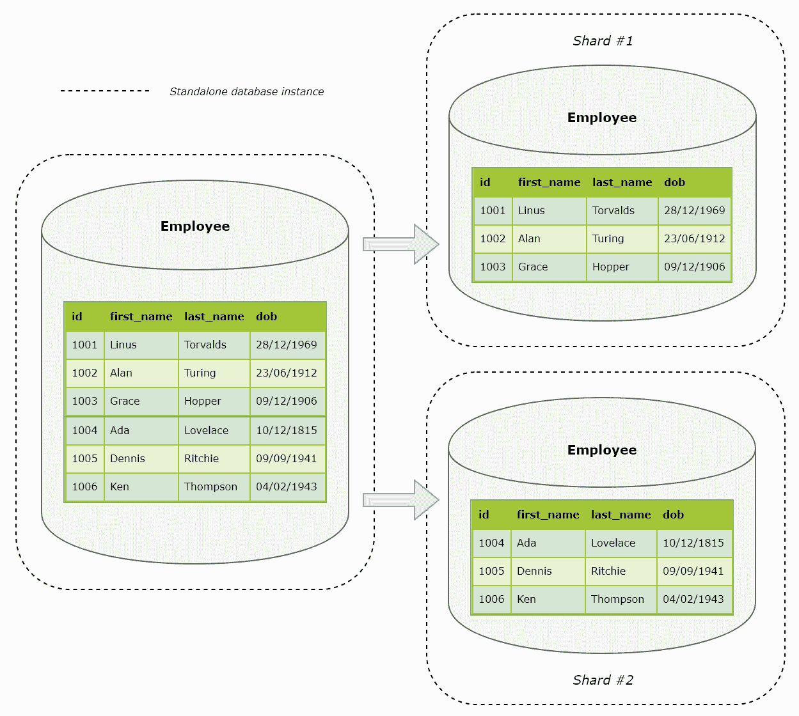

图 1.1：简单的分片分区策略

# 数据处理和分析

最后，为了转换、处理和分析存储在这些基于文本的文件、电子表格或关系型数据库中的数据，通常需要一个分析师、数据工程师或软件工程师编写一些代码。

例如，此代码可以是电子表格的公式或**Visual Basic for Applications**（**VBA**），或者关系数据库的**结构化查询语言**（**SQL**），并用于以下目的：

+   加载数据，包括批量加载和数据迁移

+   转换数据，包括数据清理、连接、合并、丰富和验证

+   标准的统计汇总，包括计算平均值、计数、总和和交叉表

+   报告，包括图表、图表、表格和仪表板

为了执行更复杂的统计计算，例如生成预测模型，高级分析师可以利用更高级的编程语言，包括 Python、R、SAS，甚至 Java。

然而，关键的是，这种数据转换、处理和分析要么是在数据持久化的服务器上直接执行（例如，在关系数据库服务器上直接执行 SQL 语句，与其他常规的读写请求竞争），要么是通过程序性查询通过网络移动数据（例如，通过 ODBC 或 JDBC 连接），或者通过平面文件（例如，CSV 或 XML 文件）到另一个远程分析处理服务器。当然，假设远程处理服务器在其单台机器上具有足够的 CPU、内存和/或磁盘空间来执行相关任务，代码可以随后在该数据上执行。换句话说，数据以某种方式被移动到代码中。

# 数据变得庞大

快进到今天——电子表格仍然很常见，包含结构良好数据的关联数据库，无论是否跨分片，仍然非常相关且极其有用。实际上，根据用例、数据量、结构和所需处理的计算复杂性，通过关系数据库管理系统（RDBMS）存储和管理数据，并在远程数据库服务器上直接使用 SQL 处理这些数据，可能仍然更快、更高效。当然，对于非常小的数据集和简单的统计汇总，电子表格仍然很棒。然而，自 1970 年代以来，变化的是更强大、更经济的技术的可用性，以及互联网的引入！

互联网已经改变了我们对数据的本质理解。以前，数据被认为是局限于电子表格或关系型数据库中的文本和数字，而现在它已经成为一种有机且不断发展的资产，由任何拥有智能手机、电视或银行账户的人大规模创建和消费。全球每秒钟都在以几乎任何你能想到的格式创建数据，从社交媒体帖子、图片、视频、音频和音乐到博客文章、在线论坛、文章、计算机日志文件和金融交易。所有这些结构化、半结构化和非结构化数据，无论是批量还是实时创建的，都无法再通过组织良好的基于文本的定界文件、电子表格或关系型数据库来存储和管理，也无法每次执行一些分析代码时都将其物理移动到远程处理服务器——需要一种新的技术。

# 大数据生态系统

如果你今天在几乎任何主流行业中工作，你可能会听到以下一些术语和短语：

+   大数据

+   分布式、可扩展和弹性

+   本地部署与云

+   SQL 与 NoSQL

+   人工智能、机器学习和深度学习

但所有这些术语和短语实际上意味着什么，它们是如何相互关联的，你从哪里开始？本节的目标是以清晰简洁的方式回答所有这些问题。

# 水平扩展

首先，让我们回到我们之前描述的一些以数据为中心的问题。鉴于今天数据的大规模创建和消费的爆炸性增长，显然我们不能再继续向单台机器添加 CPU、内存和/或硬盘（换句话说，垂直扩展）。如果我们这样做，很快就会达到一个点，迁移到更强大的硬件将导致收益递减，同时产生显著的成本。此外，可扩展性将受到我们所能获得的最大机器的物理限制，从而限制组织的增长潜力。

水平扩展，以分片为例，是我们通过添加或移除硬件和/或软件来增加或减少可用计算资源的过程。通常，这会涉及向节点集群中添加（或移除）服务器或节点。然而，关键的是，集群始终作为一个单一的逻辑单元运行，这意味着无论是否向其添加资源或从中移除资源，它都将继续运行并处理请求。水平扩展和垂直扩展之间的区别在*图 1.2*中得到了说明：

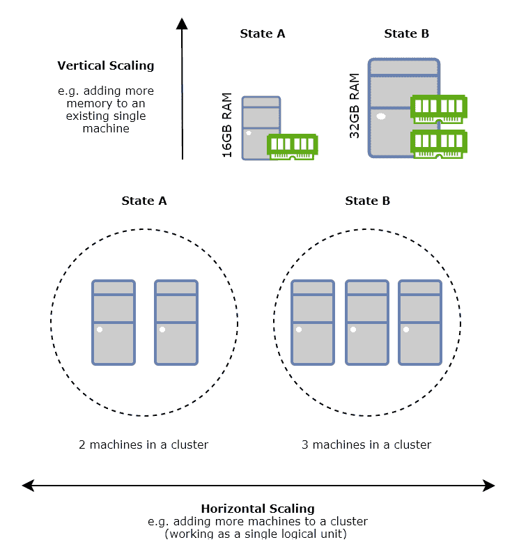

图 1.2：垂直扩展与水平扩展

# 分布式系统

水平扩展允许组织在数据和处理需求超过一定点时变得更加高效。但是，仅仅向集群中添加更多机器本身并不会带来太多价值。我们现在需要的是能够利用水平可伸缩性并且能够在多台机器上无缝工作的系统，无论集群包含一台机器还是 10,000 台机器。

分布式系统正是如此——它们在机器集群中无缝工作，并自动处理从该集群中添加（或移除）资源的情况。分布式系统可以分为以下类型：

+   分布式文件系统

+   分布式数据库

+   分布式处理

+   分布式消息

+   分布式流

+   分布式账本

# 分布式数据存储

让我们回到单机 RDBMS 面临的问题。我们已经看到，分片可以作为扩展关系数据库水平以优化成本的一种方法，适用于从小型到中型数据库的数据增长。然而，分片的问题在于每个节点以独立的方式运行，对集群中的其他节点一无所知，这意味着需要一个自定义代理来分区数据并在分片之间处理读写请求。

相反，分布式数据存储作为单个逻辑单元，直接在节点集群中运行，无需额外配置即可使用。

注意，数据存储只是一个通用术语，用来描述任何用于持久化数据的存储库。分布式数据存储通过在多个节点上存储数据来扩展这一概念，并且通常采用复制机制。

客户端应用程序将分布式数据存储视为一个单一实体，这意味着无论集群中的哪个节点实际处理客户端请求，都会返回相同的结果。下一节中讨论的分布式文件系统，如**Apache Hadoop 分布式文件系统（HDFS**），属于分布式数据存储类别，用于以原始格式存储文件。当数据需要以某种方式建模时，可以使用分布式数据库。根据分布式数据库的类型，它可以在分布式文件系统之上部署，也可以不部署。

# 分布式文件系统

想象一下你桌面、笔记本电脑、智能手机或其他个人设备中的硬盘。文件被写入并存储在本地硬盘上，并在需要时检索。你的本地操作系统通过维护本地文件系统来管理对本地硬盘的读写请求——这是操作系统跟踪磁盘组织方式和文件位置的一种方式。

随着您个人数据足迹的增长，您在本地硬盘上占用的空间越来越多，直到达到其容量。在此时刻，您可能寻求购买一个更大容量的硬盘来替换设备内部的硬盘，或者您可能寻求购买一个额外的硬盘来补充现有的硬盘。在后一种情况下，您个人管理哪些个人文件存储在哪个硬盘上，或者可能使用其中一个来存档很少使用的文件，以释放主硬盘的空间。希望您也维护个人文件的备份，以防最坏的情况发生，您的设备或主硬盘出现故障！

**分布式文件系统**（DFS）扩展了本地文件系统的概念，同时提供了一系列有用的好处。在我们的大数据生态系统中，分布式文件系统将数据物理分割到集群中的节点和磁盘上。就像一般分布式数据存储一样，分布式文件系统提供了一层抽象，并管理跨集群的读写请求，这意味着物理分割对请求客户端应用程序来说是不可见的，它们将分布式文件系统视为一个逻辑实体，就像传统的本地文件系统一样。

此外，分布式文件系统提供了开箱即用的有用好处，包括以下内容：

+   数据复制，其中数据可以被配置为在集群中自动复制，以实现容错，以防一个或多个节点或磁盘出现故障

+   数据完整性检查

+   能够持久化巨大的文件，通常大小为**千兆字节**（GB）到**太字节**（TB），这在传统的本地文件系统中通常是不可能的

HDFS（Hadoop 分布式文件系统）是我们大数据生态系统中的一个知名分布式文件系统示例。在 HDFS 中，采用主/从架构，包括一个负责管理分布式文件系统的单个 NameNode，以及多个 DataNode，这些 DataNode 通常位于集群中的每个节点上，并管理连接到该节点的物理磁盘以及数据物理存储的位置。就像传统的文件系统一样，HDFS 支持标准文件系统操作，例如打开和关闭文件和目录。当客户端应用程序请求将文件写入 HDFS 时，该文件被分割成一个或多个块，然后由 NameNode 映射到 DataNode，在那里它们被物理存储。当客户端应用程序请求从 HDFS 读取文件时，DataNode 满足这一请求。

HDFS 的一个核心优势是它通过其分布式架构以及数据复制提供固有的容错性。由于通常 HDFS 集群中会有多个节点（可能成千上万），它对硬件故障具有弹性，因为操作可以自动卸载到集群的健康部分，同时非功能硬件正在恢复或更换。此外，当文件被分割成块并由 NameNode 映射到 DataNode 时，这些块可以配置为自动在 DataNode 之间复制，考虑到 HDFS 集群的拓扑结构。

因此，如果确实发生了故障，例如，DataNode 上的磁盘故障，数据仍然可供客户端应用程序使用。HDFS 集群的高级架构在*图 1.3*中说明：

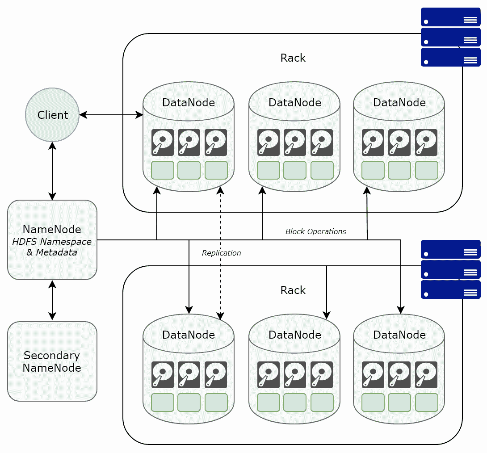

图 1.3：Apache Hadoop 分布式文件系统高级架构

要了解更多关于 Apache Hadoop 框架的信息，请访问 [`hadoop.apache.org/`](http://hadoop.apache.org/)。

# 分布式数据库

分布式文件系统，就像传统文件系统一样，用于存储文件。在分布式文件系统（如 HDFS）的情况下，这些文件可以非常大。然而，最终它们用于存储文件。当数据需要建模时，我们需要的不仅仅是文件系统；我们需要数据库。

分布式数据库，就像单机数据库一样，允许我们建模我们的数据。然而，与单机数据库不同的是，数据和数据模型本身跨越并保存在充当单个逻辑数据库的集群中的所有节点。这意味着我们不仅可以利用分布式系统提供的增加的性能、吞吐量、容错性、弹性和成本效益，而且我们可以有效地建模我们的数据，然后高效地查询这些数据，无论其大小如何或处理要求有多复杂。根据分布式数据库的类型，它可以在分布式文件系统（如部署在 HDFS 之上的 Apache HBase）之上部署，也可以不部署。

在我们的大数据生态系统中，通常使用分布式文件系统，如 HDFS，来托管**数据湖**。数据湖是一个集中式数据存储库，其中数据以原始的原始格式持久化，例如文件和对象 BLOB。这使得组织能够将它们分散的原始数据资产，包括结构化和非结构化数据，整合到一个没有预定义模式的中央存储库中，同时提供在成本效益的方式下随时间扩展的能力。

此后，为了从大量无模式数据中实际交付业务价值和可操作见解，数据处理管道被设计出来，将原始数据转换为符合某种数据模型的有意义数据，然后持久化到由分布式数据库托管的服务或分析数据存储中。这些分布式数据库根据数据模型和业务应用类型进行了优化，以有效地查询它们内部存储的大量数据，以服务于面向用户的**商业智能**（**BI**）、数据发现、高级分析和以洞察力驱动的应用程序和 API。

分布式数据库的例子包括以下内容：

+   Apache HBase: [`hbase.apache.org/`](https://hbase.apache.org/)

+   Apache Cassandra: [`cassandra.apache.org/`](http://cassandra.apache.org/)

+   Apache CouchDB: [`couchdb.apache.org/`](http://couchdb.apache.org/)

+   Apache Ignite: [`ignite.apache.org/`](https://ignite.apache.org/)

+   Greenplum Database: [`greenplum.org/`](https://greenplum.org/)

+   MongoDB: [`www.mongodb.com/`](https://www.mongodb.com/)

**Apache Cassandra** 是一个采用无主架构的分布式数据库示例，该架构没有单点故障，支持处理大量数据的高吞吐量。在 Cassandra 中，没有数据的主副本。相反，数据根据分区键和其他固有的 Cassandra 模型和存储数据的方式自动分区，并根据可配置的复制因子在其他节点上复制。由于不存在主/从的概念，因此采用 Gossip 协议，以便 Cassandra 集群中的节点可以动态地了解其他节点的状态和健康情况。

为了处理来自客户端应用程序的读写请求，Cassandra 将自动从集群中可用的节点中选举一个协调节点，这个过程对客户端来说是不可见的。为了处理写请求，协调节点将根据 Cassandra 所采用的底层分布式数据模型的分区特性，联系所有应持久化写请求和副本的适用节点。为了处理读请求，协调节点将联系一个或多个副本节点，这些节点已知数据已被写入，同样基于 Cassandra 的分区特性。因此，Cassandra 所采用的底层架构可以可视化为一个环，如图*图 1.4*所示。请注意，尽管 Cassandra 集群的拓扑可以可视化为一个环，但这并不意味着一个节点的故障会导致整个集群的故障。如果某个节点因任何原因变得不可用，Cassandra 将简单地继续向其他应持久化请求数据的适用节点写入，同时维护一个有关失败节点的操作队列。当非功能节点重新上线时，Cassandra 将自动更新它：

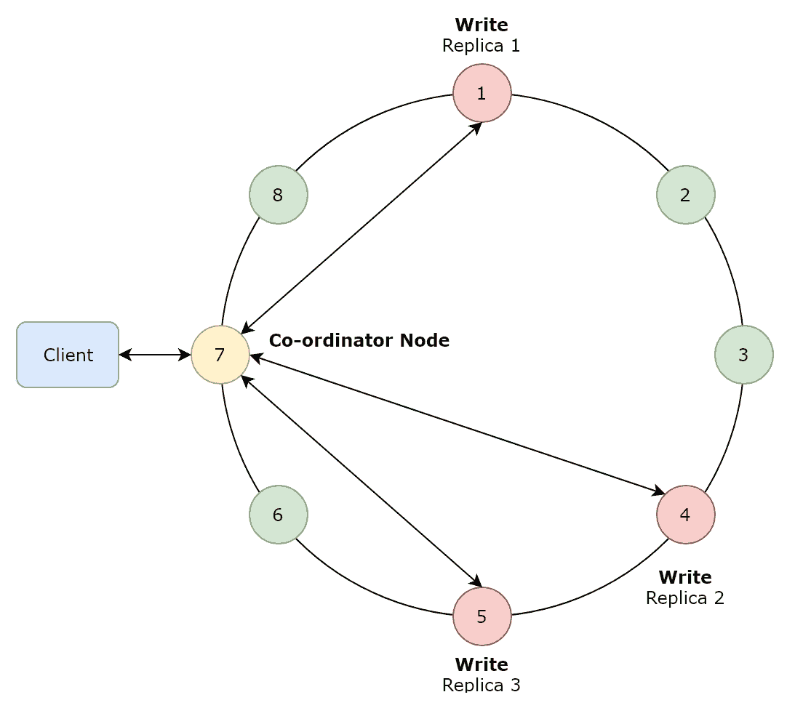

图 1.4：Cassandra 拓扑图，展示了具有 3 个复制因子的写请求

# NoSQL 数据库

关系数据库管理系统（如 Microsoft SQL Server、PostgreSQL 和 MySQL）允许我们在表示数据模型中实体的表格中，以结构化的方式建模我们的数据。这些表格是预定义的，其模式由各种数据类型的列组成，这些列代表所讨论实体的属性。

例如，*图 1.5* 描述了一个非常简单的关系模式，这种模式可以被一个电子商务网站所利用：

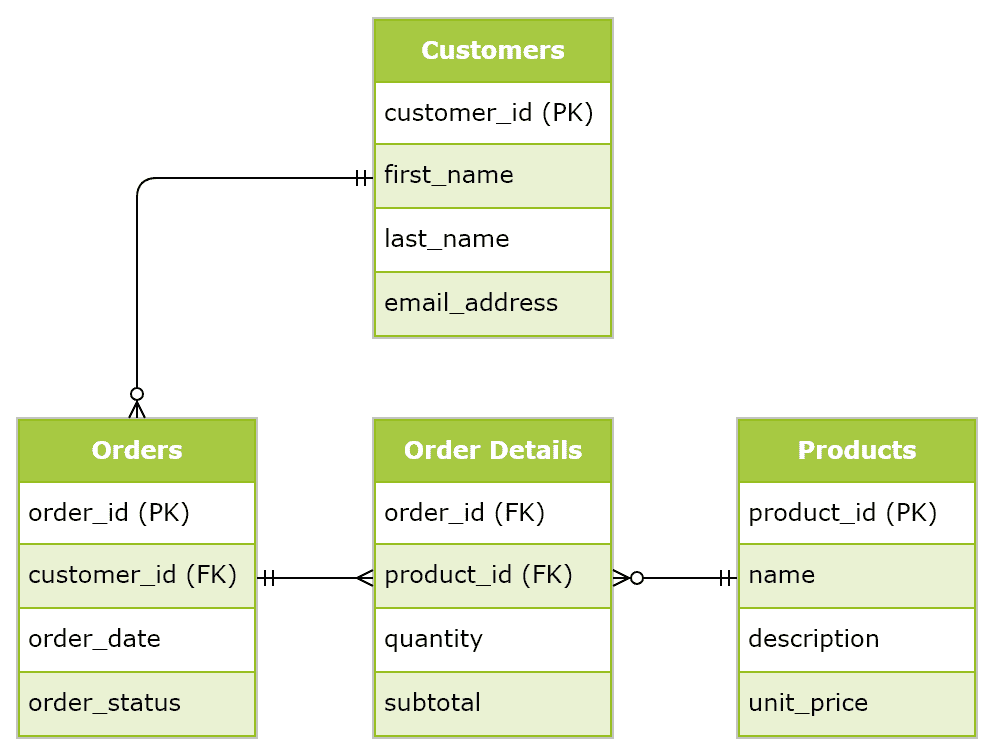

图 1.5：一个电子商务网站的简单关系数据库模型

另一方面，NoSQL 仅仅指的是一类数据库，其中数据不是以传统的关系方式建模。因此，如果数据不是以关系方式建模，那么在 NoSQL 数据库中是如何建模的呢？答案是，根据具体的使用案例和业务应用，存在各种类型的 NoSQL 数据库。这些不同类型在以下小节中进行了总结。

人们通常有一个常见的但错误的假设，即 NoSQL 是分布式数据库的同义词。实际上，有一个不断增长的 RDBMS 供应商列表，他们的产品被设计成可扩展和分布式，以适应大量结构化数据。这种错误假设产生的原因是因为在现实世界的实现中，NoSQL 数据库通常用于以分布式方式持久化大量结构化、半结构化和非结构化数据，因此它们与分布式数据库同义。然而，与关系型数据库一样，NoSQL 数据库也被设计成即使在单台机器上也能工作。区分关系型（或 SQL）数据库和 NoSQL 数据库的是数据建模的方式。

# 文档数据库

文档数据库，如**Apache CouchDB**和**MongoDB**，采用文档数据模型来存储半结构化和非结构化数据。在这个模型中，文档用于封装与对象相关的所有信息，通常以**JavaScript 对象表示法**（**JSON**）格式，这意味着单个文档是自我描述的。由于它们是自我描述的，不同的文档可能有不同的模式。例如，以下 JSON 文件中描述电影项目的文档将具有与描述图书项目的文档不同的模式：

```py
[
   {
        "title" : "The Imitation Game",
        "year": 2014
        "metadata" : {
            "directors" : [ "Morten Tyldum"],
            "release_date" : "2014-11-14T00:00:00Z",
            "rating" : 8.0,
            "genres" : ["Biography", "Drama", "Thriller"],
            "actors" : ["Benedict Cumberbatch", "Keira Knightley"]
        }
    }
]
```

由于文档是对象的自我包含表示，因此它们对于涉及单个对象频繁更新的数据模型特别有用，从而避免了需要更新整个数据库模式的需求，这在关系型数据库中是必需的。因此，文档数据库通常非常适合涉及商品目录的使用案例，例如电子商务网站和内容管理系统，如博客平台。

# 列式数据库

关系型数据库传统上连续存储每行数据，这意味着每行数据都会存储在磁盘上的连续块中。这种类型的数据库被称为*行式数据库*。对于涉及典型统计聚合操作，如计算特定属性的均值，行式数据库的效果是在处理过程中会读取该行中的每个属性，无论它们是否与查询相关。一般来说，行式数据库最适合事务型工作负载，也称为**在线事务处理**（**OLTP**），在这种工作负载中，单个行经常被写入，并且重点在于快速处理大量相对简单的查询，例如短插入和更新。使用案例包括零售和金融交易，其中数据库模式往往高度规范化。

另一方面，如**Apache Cassandra**和**Apache HBase**这样的列式数据库是**列导向**的，这意味着每个列都在磁盘上的顺序块中持久化。列式数据库的效果是，可以作为一个组一起访问单个属性，而不是逐行单独访问，从而减少了分析查询的磁盘 I/O，因为从磁盘加载的数据量减少了。例如，考虑以下表格：

| **产品 ID** | **名称** | **类别** | **单价** |
| --- | --- | --- | --- |
| 1001 | USB drive 64 GB | 存储 | 25.00 |
| 1002 | SATA HDD 1 TB | 存储 | 50.00 |
| 1003 | SSD 256 GB | 存储 | 60.00 |

在行式数据库中，数据按如下方式持久化到磁盘：

(1001, USB drive 64 GB, storage, 25.00), (1002, SATA HDD 1 TB, storage, 50.00), (1003, SSD 256 GB, storage, 60.00)

然而，在列式数据库中，数据按如下方式持久化到磁盘：

(1001, 1002, 1003), (USB drive 64 GB, SATA HDD 1 TB, SSD 256 GB), (storage, storage, storage), (25.00, 50.00, 60.00)

通常，列式数据库最适合分析工作负载，也称为**在线分析处理**（**OLAP**），其中重点在于处理少量复杂的分析查询，通常涉及聚合。用例示例包括数据挖掘和统计分析，其中数据库模式往往是反规范的或遵循星型或雪花模式设计。

# 键值数据库

键值数据库，如**Redis**、**Oracle Berkley DB**和**Voldemort**，采用简单的键值数据模型来存储数据，作为唯一键映射到值对象的集合。以下表格展示了将 Web 应用的会话 ID 映射到会话数据的过程：

| **键（会话 ID）** | **值（会话数据）** |
| --- | --- |
| `ab2e66d47a04798` | `{userId: "user1", ip: "75.100.144.28", date: "2018-09-28"}` |
| `62f6nhd47a04dshj` | `{userId: "user2", ip: "77.189.90.26", date: "2018-09-29"}` |
| `83hbnndtw3e6388` | `{userId: "user3", ip: "73.43.181.201", date: "2018-09-30"}` |

键值数据结构在许多编程语言中都有，通常被称为**字典**或**哈希表**。键值数据库通过它们在集群中分区和水平扩展的能力扩展了这些数据结构，从而有效地提供了巨大的分布式字典。键值数据库特别适用于作为提高需要处理每秒数百万个请求的系统性能和吞吐量的手段。用例示例包括流行的电子商务网站、存储 Web 应用的会话数据以及促进缓存层。

# 图数据库

图数据库，如 **Neo4j** 和 **OrientDB**，将数据建模为由一个或多个边（也称为关系或链接）连接在一起的顶点（也称为节点）集合。在现实世界的图实现中，顶点通常用于表示现实世界的实体，如个人、组织、车辆和地址。然后使用边来表示顶点之间的关系。

顶点和边都可以有任意数量的键值对，称为 *属性*，与它们相关联。例如，与单个顶点相关的属性可能包括姓名和出生日期。与连接两个个人顶点的边相关的属性可能包括个人关系的性质和长度。顶点、边和属性的集合共同形成一个称为 **属性图** 的数据结构。*图 1.6* 展示了一个简单的属性图，它表示一个小型社交网络。

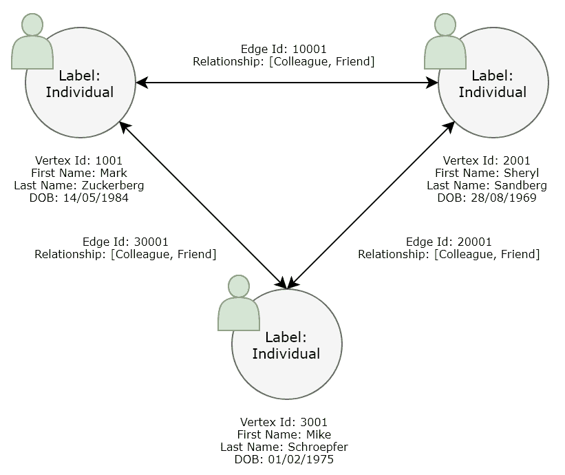

图 1.6：一个简单的属性图

图数据库在各种场景中被使用，在这些场景中，重点在于分析对象之间的关系，而不仅仅是对象的数据属性本身。常见的用例包括社交网络分析、欺诈检测、打击严重有组织犯罪、客户推荐系统、复杂推理、模式识别、区块链分析、网络安全和网络入侵检测。

**Apache TinkerPop** 是一个图计算框架的例子，它提供了一个抽象层，位于图数据模型和用于存储和处理图的底层机制之间。例如，Apache TinkerPop 可以与底层的 Apache Cassandra 或 Apache HBase 数据库结合使用，以存储包含数十亿个顶点和边的巨大分布式图，这些顶点和边在集群中分区。Apache TinkerPop 框架的一个组件，称为 **Gremlin** 的图遍历语言，可以用来遍历和分析分布式图，使用 Gremlin 语言的各种变体，包括 Gremlin Java、Gremlin Python、Gremlin Scala 和 Gremlin JavaScript。要了解更多关于 Apache TinkerPop 框架的信息，请访问 [`tinkerpop.apache.org/`](http://tinkerpop.apache.org/)。

# CAP 定理

如前所述，分布式数据存储使我们能够存储大量数据，同时始终以单个逻辑单元的水平扩展能力提供。许多分布式数据存储固有的以下特性：

+   **一致性** 指的是每个客户端对数据的视图都相同。在实践中，这意味着对集群中任何节点的读取请求都应该返回最近成功写入请求的结果。即时一致性指的是最近成功写入请求应立即对任何客户端可用。

+   **可用性**指的是系统对客户端提出的每个请求做出响应的保证，无论该请求是否成功。在实践中，这意味着每个客户端请求都会收到响应，无论单个节点是否非功能性。

+   **分区容错**指的是在节点间网络通信失败时提供的弹性保证。换句话说，如果在特定节点和另一组节点之间存在网络故障，称为网络分区，系统将继续运行。在实践中，这意味着系统应该有能力在集群的功能部分之间复制数据，以应对间歇性网络故障并确保数据不会丢失。然后，系统应该在分区解决后优雅地恢复。

CAP 定理简单地说，分布式系统不能同时立即一致、可用和分区容错。分布式系统可以同时只提供三个中的任意两个。这如图 *图 1.7* 所示：

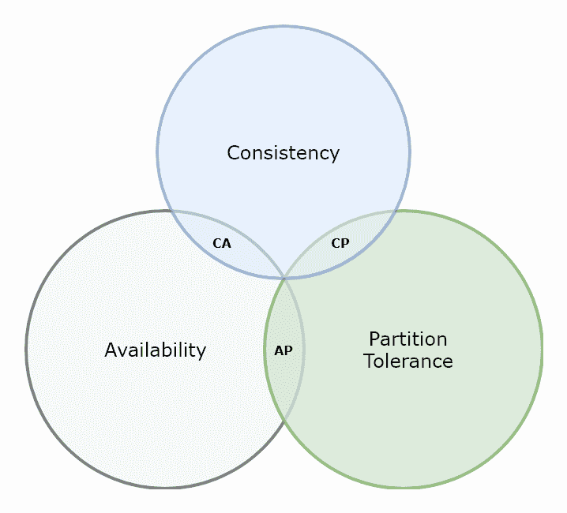

图 1.7：CAP 定理

**CA** 分布式系统提供立即一致性和高可用性，但不能容忍节点间网络故障，这意味着数据可能会丢失。**CP** 分布式系统提供立即一致性和对网络故障的弹性，没有数据丢失。然而，在节点间网络故障发生时，它们可能不会响应。**AP** 分布式系统提供高可用性和对网络故障的弹性，没有数据丢失。然而，读请求可能不会返回最新数据。

分布式系统，例如 Apache Cassandra，允许配置所需的一致性级别。例如，假设我们为 Apache Cassandra 集群配置了 3 个副本因子。在 Apache Cassandra 中，一致性配置为 **ONE** 表示只要 *一个* 数据副本被持久化，写请求就被认为是成功的，无需等待其他两个副本被写入。在这种情况下，系统被认为是最终一致的，因为其他两个副本最终会被持久化。后续的即时读请求可能返回最新数据，如果它是由更新的副本处理的，或者它可能返回过时数据，如果它是由尚未更新的其他两个副本之一处理的（但最终会更新）。在这种情况下，Cassandra 是一个 AP 分布式系统，表现出最终一致性和对除了一个副本之外的所有副本失败的容忍性。它还提供了在此上下文中性能最快的系统。

在 Apache Cassandra 中，**ALL**的一致性配置意味着只有当所有副本都成功持久化后，写请求才被认为是成功的。随后的立即读取请求将始终返回最新的数据。在这种情况下，Cassandra 是一个表现出即时一致性的 CA 分布式系统，但没有对失败的容忍度。它还提供了在此背景下性能最慢的系统。

最后，在 Apache Cassandra 中，**QUORUM**的一致性配置意味着只有当严格多数的副本成功持久化后，写请求才被认为是成功的。随后的立即读取请求也使用 QUORUM 一致性，将等待从两个副本（在副本因子为 3 的情况下）接收数据，并通过比较时间戳，总是返回最新的数据。在这种情况下，Cassandra 也是一个表现出即时一致性的 CA 分布式系统，但具有对少数副本失败的容忍度。它还提供了在此背景下性能中等的系统。

然而，在现实世界中，数据丢失对于大多数业务关键系统来说不是可接受的，需要在性能、一致性和可用性之间进行权衡。因此，选择往往归结为 CP 或 AP 分布式系统，胜者由业务需求驱动。

# 分布式搜索引擎

基于 Apache Lucene 的分布式搜索引擎，如**Elasticsearch**，将数据转换为高度优化的数据结构，以实现快速和高效的搜索和分析。在 Apache Lucene 中，数据被索引到包含一个或多个字段（代表各种数据类型的数据属性）的文档中。文档的集合形成一个索引，当处理查询时，搜索的就是这个索引，返回满足查询的相关文档。一个合适的类比是在教科书试图找到与特定主题相关的页面时。读者不必逐页搜索，而是可以使用书后的索引更快地找到相关页面。要了解更多关于 Apache Lucene 的信息，请访问[`lucene.apache.org/`](http://lucene.apache.org/)。

Elasticsearch 通过提供在分布式集群上分区和水平扩展搜索索引和分析查询的能力，扩展了 Apache Lucene，并配备了 RESTful 搜索引擎和 HTTP 网络界面，以实现高性能的搜索和分析。要了解更多关于 Elasticsearch 的信息，请访问[`www.elastic.co/products/elasticsearch`](https://www.elastic.co/products/elasticsearch)。

# 分布式处理

我们已经看到，如 HDFS 和 Apache Cassandra 这样的分布式数据存储如何使我们能够在水平可扩展的集群上存储和建模大量结构化、半结构化和非结构化数据，提供容错、弹性、高可用性和一致性。但是，为了提供可操作的见解并实现有意义的商业价值，我们现在需要能够处理和分析所有这些数据。

让我们回到本章开头描述的传统数据处理场景。通常，分析师、数据工程师或软件工程师（例如，在 SQL、Python、R 或 SAS 中）编写的数据转换和分析编程代码会依赖于将输入数据物理移动到远程处理服务器或机器，该机器上驻留着要执行的代码。这通常以程序查询的形式嵌入在代码本身中，例如，通过 ODBC 或 JDBC 连接的 SQL 语句，或者通过将 CSV 和 XML 等平面文件移动到本地文件系统。尽管这种方法对于小型到中型数据集来说效果不错，但它受限于单个远程处理服务器可用的计算资源，存在物理限制。此外，引入平面文件如 CSV 或 XML 文件，引入了一个额外的、通常不必要的中间数据存储，需要管理并增加磁盘 I/O。

然而，这种方法的主要问题是每次执行作业时都需要将数据移动到代码。当处理增加的数据量和频率时，如我们与大数据相关联的数据量和频率，这种方法很快就会变得不切实际。

因此，我们需要另一种数据处理和编程范式——一种将代码移动到数据并能在分布式集群中工作的范式。换句话说，我们需要分布式处理！

分布式处理背后的基本思想是将计算处理任务分割成更小的任务。这些较小的任务随后在集群中分散，并处理数据的具体分区。通常，计算任务会与数据本身位于同一节点上，以提高性能并减少网络 I/O。然后以某种方式汇总每个较小任务的结果，在返回最终结果之前。

# MapReduce

MapReduce 是一种分布式数据处理范例，能够在节点集群上并行处理大数据。MapReduce 作业将大型数据集分割成独立的块，并包括两个阶段——第一个阶段是 Map 函数，它为输入中的每个范围创建一个映射任务，输出一个分区的键值对组。映射任务的输出随后作为减少任务的输入，其任务是合并和压缩相关的分区，以解决分析问题。在开始映射阶段之前，数据通常根据与正在进行的分析相关的条件进行排序或过滤。同样，减少函数的输出可能需要最终化函数来进一步分析数据。

让我们考虑一个简单的例子，以使这个相当抽象的定义变得生动。我们将考虑的例子是单词计数。假设我们有一个包含数百万行文本的文本文件，我们希望计算整个文本文件中每个唯一单词的出现次数。*图 1.8* 展示了如何使用 MapReduce 范式进行这种分析：

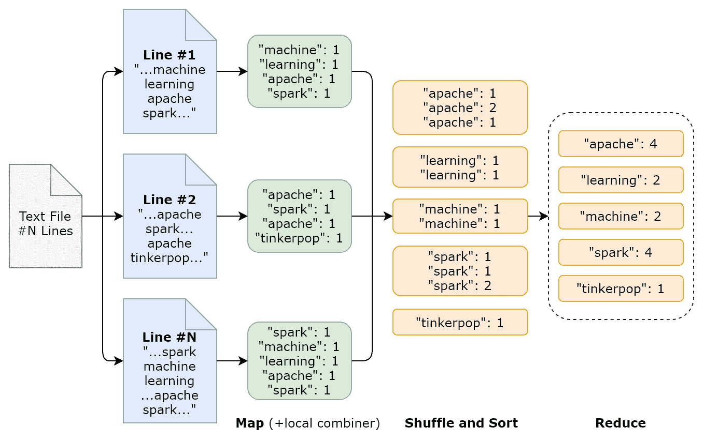

图 1.8：单词计数 MapReduce 程序

在这个例子中，原始文本文件包含数百万行文本，被分割成单独的行。将映射任务应用于这些单独行的范围，将它们分割成单独的单词标记，在这种情况下，使用空格分词器，然后输出一组键值对，其中键是单词。

执行一个 *洗牌*过程，将映射任务输出的分区键值对转移到减少任务。根据键对键值对进行排序，也有助于确定何时应该开始新的减少任务。为了在洗牌期间减少从映射任务到减少任务传输的数据量，可以指定一个可选的合并器，该合并器实现一个本地聚合函数。在这个例子中，指定了一个合并器，它对每个映射输出本地地计算每个键或单词的出现次数的总和。

减少任务随后接收那些分区的键值对，并减少具有相同键的值，输出新的（但未排序的）键值对，键是唯一的。在这个例子中，减少任务简单地计算该键的出现次数。在这种情况下，MapReduce 作业的最终输出只是整个原始文本文件中每个单词出现次数的计数。

在这个例子中，我们使用了一个简单的文本文件，该文件已被换行符分割，然后基于空格分词器映射到键值对。但同样的范式可以轻松扩展到分布式数据存储，其中大量数据已经跨集群分区，从而允许我们在巨大规模上进行数据处理。

# Apache Spark

Apache Spark 是通用分布式处理引擎的一个知名例子，能够处理**PB**（**PB**）级别的数据。因为它是一个通用引擎，所以适用于各种大规模用例，包括使用其**Spark SQL**库进行**提取-转换-加载**（**ETL**）管道的工程和执行、交互式分析、使用其**Spark Streaming**库的流处理、使用其`GraphX`库的基于图的处理以及使用其`MLlib`库的机器学习。我们将在后面的章节中使用 Apache Spark 的机器学习库。然而，现在，了解 Apache Spark 内部工作原理的概述是很重要的。

Apache Spark 软件服务在**Java 虚拟机**（**JVM**）中运行，但这并不意味着 Spark 应用程序必须用 Java 编写。实际上，Spark 向包括 Java、Scala、Python 和 R 在内的各种语言变体公开其 API 和编程模型，任何一种都可以用来编写 Spark 应用程序。在逻辑架构方面，Spark 采用如*图 1.9*所示的主/从架构：

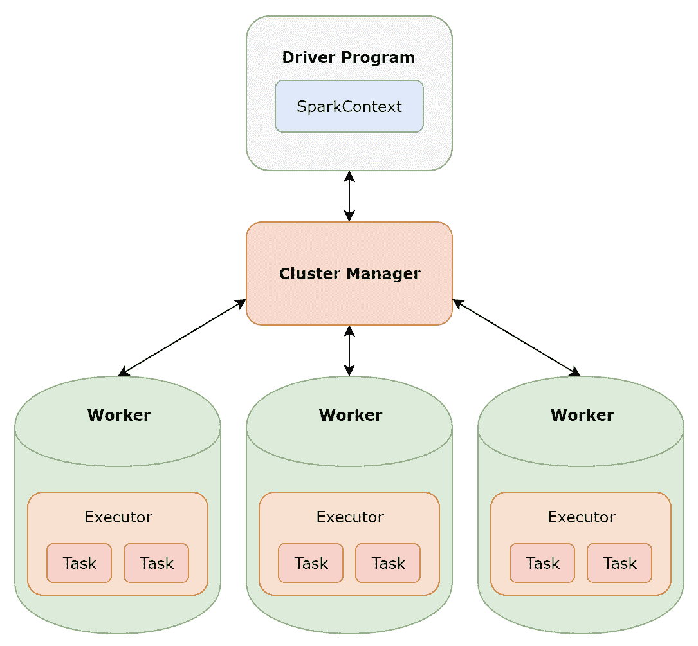

图 1.9：Apache Spark 逻辑架构

每个用 Apache Spark 编写的应用程序都包含一个**驱动程序程序**。驱动程序程序负责将 Spark 应用程序分割成任务，这些任务随后被分配到分布式集群中的**工作**节点上，并由驱动程序安排执行。驱动程序程序还实例化一个**SparkContext**，它告诉应用程序如何连接到 Spark 集群及其底层服务。

工作节点，也称为奴隶节点，是计算处理物理发生的地点。通常，Spark 工作节点与存储底层数据相同的节点上协同运行，以提高性能。工作节点会启动称为**执行器**的进程，这些执行器负责执行计算任务并存储任何本地缓存的本地数据。执行器通过与驱动程序通信来接收预定函数，如 map 和 reduce 函数，然后执行。**集群管理器**负责在集群中调度和分配资源，因此必须能够与每个工作节点以及驱动程序通信。驱动程序程序从集群管理器请求执行器（因为集群管理器了解可用的资源），以便它可以安排任务。

Apache Spark 随带自己的简单集群管理器，当使用时，被称为 Spark Standalone 模式。部署到独立集群的 Spark 应用程序默认情况下将利用集群中的所有节点，并以 **先入先出**（**FIFO**）的方式调度。Apache Spark 还支持其他集群管理器，包括 **Apache Mesos** 和 **Apache Hadoop YARN**，这两者都不在本书的范围之内。

# RDDs, DataFrames, and datasets

那么 Spark 在其计算处理过程中是如何存储和分区数据的呢？嗯，默认情况下，Spark 将数据存储在内存中，这有助于使其成为一个快速的处理引擎。实际上，从 Spark 2.0 开始，有三组 API 用于存储数据——**弹性分布式数据集**（**RDDs**）、DataFrames 和 Datasets。

# RDDs

RDDs 是 Spark 集群中工作节点上分区的一个不可变和分布式记录集合。由于在非功能节点或损坏分区的情况下，RDD 分区可以被重新计算，因为 RDD 本身存储了复制每个分区所需的所有依赖信息，所以它们提供了容错性。由于每个分区都是不可变的，它们也提供了一致性。RDDs 在 Spark 中被广泛使用，尤其是在处理不需要在数据处理时强加模式的数据，例如处理非结构化数据时。可以通过提供两种广泛操作类别的基础级 API 在 RDDs 上执行操作：

+   **转换**：这些是返回另一个 RDD 的操作。窄转换，例如 map 操作，是可以对数据的不规则分区执行而无需依赖于其他分区的操作。宽转换，例如排序、连接和分组，是需要将数据重新分区到集群的操作。某些转换，如排序和分组，需要将数据重新分配到分区，这个过程称为 *洗牌*。由于需要重新分配数据，需要洗牌的宽转换是昂贵的操作，在可能的情况下应尽量减少在 Spark 应用程序中的使用。

+   **动作**：这些是返回值给驱动程序的计算操作，而不是另一个 RDD。RDD 被称为是惰性评估的，这意味着转换只有在调用动作时才会进行计算。

# DataFrames

与 RDD 类似，它们是 Spark 集群中工作节点上分区的不变和分布式记录集合。然而，与 RDD 不同，数据在概念上被组织成命名列，类似于关系数据库中的表和其他编程语言（如 Python 和 R）中找到的表格数据结构。由于 DataFrame 允许对分布式数据施加模式，它们更容易暴露给更熟悉的编程语言，如 SQL，这使得它们成为流行且可能更容易处理和操作的数据结构，同时比 RDD 更高效。

然而，DataFrame 的主要缺点是，与 Spark SQL 字符串查询类似，分析错误仅在运行时捕获，而不是在编译时。例如，想象一个名为 `df` 的 DataFrame，具有名为 `firstname`、`lastname` 和 `gender` 的命名列。现在想象我们编写了以下语句：

```py
df.filter( df.age > 30 )
```

该语句试图根据一个缺失且未知的列 `age` 过滤 DataFrame。使用 DataFrame API，这个错误不会在编译时捕获，而是在运行时捕获，如果涉及多个转换和聚合的 Spark 应用程序，这可能会非常昂贵且耗时。

# Datasets

Datasets 通过提供类型安全来扩展 DataFrame。这意味着在前面提到的缺少列的示例中，Dataset API 将在编译时抛出错误。实际上，DataFrame 实际上是 `Dataset[Row]` 的别名，其中 Row 是一个无类型的对象，你可能在用 Java 编写的 Spark 应用程序中看到它。然而，由于 R 和 Python 没有编译时的类型安全，这意味着 Datasets 目前对这些语言不可用。

使用 DataFrame 和 Dataset API 而不是 RDD 的优势众多，包括更好的性能和更高效的内存使用。DataFrame 和 Dataset 提供的高级 API 还使得执行标准操作，如过滤、分组以及计算统计聚合（如总和和平均值）变得更加容易。然而，RDD 仍然有其用途，因为它提供了更高级别的控制，包括低级转换和操作。它们还在编译时提供分析错误，非常适合处理非结构化数据。

# 任务、阶段和任务

既然我们知道了 Spark 在计算处理过程中如何存储数据，让我们回到其逻辑架构，以了解 Spark 应用程序是如何逻辑上分解成更小的单元以进行分布式处理的。

# 任务

当在 Spark 应用程序中调用操作时，Spark 将使用依赖图来确定该操作所依赖的数据集，然后制定执行计划。执行计划本质上是一系列数据集，从最远的数据集开始，一直到最后需要计算以返回给驱动程序值的最终数据集，这些数据集都需要被计算。这个过程被称为 Spark 作业，每个作业对应一个操作。

# 阶段

如果 Spark 作业以及因此导致该作业启动的操作涉及数据洗牌（即数据的重新分配），那么该作业将被分解为阶段。当需要在工作节点之间进行网络通信时，开始一个新的阶段。因此，单个阶段被定义为由单个执行器处理的任务集合，这些任务对其他执行器没有依赖。

# 任务

任务是 Spark 中最小的执行单元，单个任务在一个执行器上执行；换句话说，单个任务不能跨越多个执行器。构成一个阶段的所有任务共享相同的执行代码，但作用于数据的不同分区。一个执行器可以处理的任务数量受该执行器关联的核心数限制。因此，整个 Spark 集群可以并行执行的任务总数可以通过将每个执行器的核心数乘以执行器的数量来计算。这个值提供了对 Spark 集群提供的并行程度的一个可量化的度量。

在第二章，“设置本地开发环境”，我们将讨论如何安装、配置和管理用于开发目的的单节点独立 Spark 集群，以及讨论 Spark 暴露的一些基本配置选项。然后，在第三章“人工智能与机器学习”及以后章节，我们将利用 Spark 的机器学习库`MLlib`，以便将 Spark 用作分布式高级分析引擎。要了解更多关于 Apache Spark 的信息，请访问[`spark.apache.org/`](http://spark.apache.org/)。

# 分布式消息传递

在我们通过分布式系统的旅程中继续前进，下一个我们将讨论的类别是分布式消息系统。通常，现实世界的 IT 系统实际上是一系列不同的应用程序的集合，这些应用程序可能使用不同的底层技术和框架编写，并且相互集成。为了在独立的应用程序之间发送消息，开发者可能会将消费逻辑编码到每个单独的应用程序中。然而，这是一个坏主意——如果上游应用程序发送的消息类型发生变化会发生什么？在这种情况下，消费逻辑必须重写，相关应用程序更新，整个系统重新测试。

消息系统，如**Apache ActiveMQ**和**RabbitMQ**，通过提供一个名为消息代理的中介来解决此问题。*图 1.10*展示了消息代理在高层次上的工作方式：

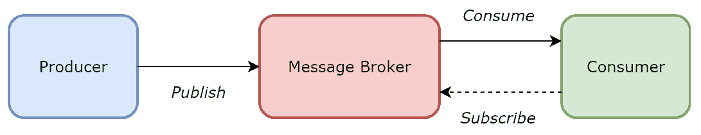

图 1.10：消息代理高层次概述

在高层次上，**生产者**是生成和发送系统功能所需消息的应用程序。**消息代理**接收这些消息并将它们存储在队列数据结构或缓冲区中。**消费者**应用程序，即设计用于处理消息的应用程序，订阅消息代理。然后消息代理将这些消息传递给**消费者**应用程序，它们消费并处理这些消息。请注意，单个应用程序可以是生产者、消费者或两者兼具。

分布式消息系统，这是**Apache Kafka**的一个用例，通过能够进行分区和水平扩展来扩展传统消息系统，同时提供高吞吐量、高性能、容错性和复制，就像许多其他分布式系统一样。这意味着消息永远不会丢失，同时提供负载均衡请求和提供排序保证的能力。我们将在下一节更详细地讨论 Apache Kafka，但在此处是作为实时数据分布式流平台的一部分。

# 分布式流处理

想象一下处理存储在传统电子表格或基于文本的分隔文件（如 CSV 文件）中的数据。当使用这些类型的数据存储时，你通常会执行的处理类型被称为**批量处理**。在批量处理中，数据被整理成某种形式的组，在这种情况下，是我们电子表格或 CSV 文件中的行集合，并在未来的某个时间和日期作为一个组一起处理。通常，这些电子表格或 CSV 文件将在某个时间点用更新的数据刷新，此时将执行相同的或类似的处理，可能由某种类型的计划或计时器管理。传统上，数据处理系统会考虑到批量处理，包括传统的数据仓库。

然而，今天仅批处理是不够的。随着互联网、社交媒体和更强大的技术的出现，以及尽快（理想情况下立即）消费大量数据的需求，实时数据处理和分析不再是许多企业的奢侈品，而是一种必需品。实时数据处理至关重要的用例包括处理金融交易和实时定价、实时欺诈检测和打击严重有组织犯罪、物流、旅行、机器人技术和人工智能。

**微批处理**通过在更小的间隔（通常是秒或毫秒）和/或在更小的数据批次上执行来扩展标准批处理。然而，与批处理一样，数据仍然是一批一批处理的。

**流处理**与微批处理和批处理的不同之处在于，数据处理是在单个数据单元到达时执行的。例如，Apache Kafka 这样的分布式流式平台提供了在系统和应用程序之间安全且安全地移动实时数据的能力。此后，分布式流式引擎，如 Apache Spark 的流库**Spark Streaming**和**Apache Storm**，使我们能够处理和分析实时数据。在第八章，“使用 Apache Spark 进行实时机器学习”，我们将更详细地讨论 Spark Streaming，其中我们将通过结合 Apache Kafka、Spark Streaming 和 Apache Spark 的机器学习库`MLlib`来开发一个实时情感分析模型。

同时，让我们快速了解一下 Apache Kafka 在底层是如何工作的。花点时间思考一下，为了设计一个实时流平台，你需要考虑哪些方面：

+   **容错性**：平台不得丢失实时数据流，并且在系统部分故障的情况下，必须有一种方式来存储这些数据。

+   **顺序性**：平台必须提供一种方法来保证数据流可以按照接收的顺序进行处理，这对于业务应用来说尤为重要，因为顺序至关重要。

+   **可靠性**：平台必须提供一种可靠且高效地在各种不同应用程序和系统之间移动数据流的方法。

Apache Kafka 通过其分布式流式逻辑架构提供所有这些保证，如图*图 1.11*所示：

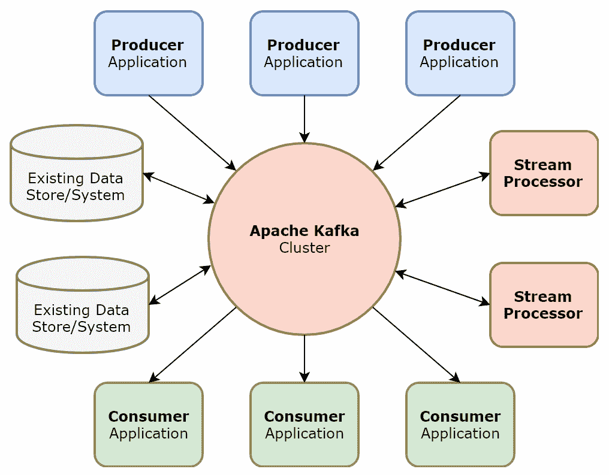

图 1.11：Apache Kafka 逻辑架构

在 Apache Kafka 中，*主题*指的是属于特定类别的记录流。Kafka 的 Producer API 允许生产者应用程序将记录流发布到一个或多个 Kafka 主题，而其 Consumer API 允许消费者应用程序订阅一个或多个主题，并随后接收和处理属于这些主题的记录流。Kafka 中的主题被认为是多订阅者，这意味着单个主题可以有零个、一个或多个消费者订阅它。在物理上，Kafka 主题存储为一系列有序且不可变的记录，这些记录只能追加，并在 Kafka 集群中分区和复制，从而为大型系统提供可伸缩性和容错性。Kafka 保证生产者消息以发送的顺序追加到主题分区，生产者应用程序负责识别将记录分配给哪个分区，并且消费者应用程序可以按它们持久化的顺序访问记录。

Kafka 因其逻辑架构和在其系统与应用程序之间移动实时数据流时提供的保证，已经成为实时数据的代名词。但 Kafka 也可以通过其 Streams API 作为流处理引擎使用，而不仅仅是作为消息系统。通过其 Streams API，Kafka 允许我们从输入主题消费连续的数据流，以某种方式处理这些数据，然后将其作为连续的数据流输出到输出主题。换句话说，Kafka 允许我们将输入数据流转换为输出数据流，从而有助于构建与其他流处理引擎（如 Apache Spark 和 Apache Storm）竞争的实时数据处理管道。

在第八章《使用 Apache Spark 的实时机器学习》中，我们将使用 Apache Kafka 可靠地将实时数据流从其源系统移动到 Apache Spark。然后，Apache Spark 将作为我们首选的流处理引擎，结合其机器学习库。与此同时，为了了解更多关于 Apache Kafka 的信息，请访问[`kafka.apache.org/`](https://kafka.apache.org/)。

# 分布式账本

为了完成我们对分布式系统的探索之旅，让我们谈谈一种可能成为未来大量激动人心的尖端技术基础的特定类型的分布式系统。分布式账本是分布式数据库中的一个特殊类别，最近由于区块链的普及以及随后的加密货币（如比特币）而闻名。

传统上，当你使用信用卡或借记卡购买时，发行银行充当中心化权威。作为交易的一部分，会向银行发出请求，以确认你是否拥有完成交易所需的足够资金。如果你有，银行会记录新的交易并从你的余额中扣除相应金额，让你完成购买。银行会记录这些以及你账户上的所有交易。如果你希望查看你的历史交易和当前的总余额，你可以通过在线账户记录或纸质报表来访问，所有这些都由受信任的中心来源——你的银行管理。

与此相反，分布式账本没有单一的受信任中心权威。相反，记录是独立创建并存储在形成分布式网络的单独节点上，换句话说，是一个分布式数据库，但数据永远不会由中心权威或主节点创建或传递。分布式网络中的每个节点都会处理每一笔交易。如果你使用基于区块链技术的加密货币，如比特币进行购买，这是一种分布式账本的形式，节点会对更新进行投票。一旦达到多数共识，分布式账本就会更新，并且账本的最新版本会分别保存在每个节点上。

如所述，区块链是分布式账本的一种形式。除了共享分布式账本的基本特征外，在区块链中，数据被分组到使用密码学加密的块中。一旦区块链中的记录被持久化，就无法更改或删除，但只能附加，这使得区块链特别适合需要维护安全历史视图的使用场景，例如金融交易和包括比特币在内的加密货币。

# 人工智能和机器学习

我们已经讨论了如何使用分布式系统来存储、建模和处理大量结构化、半结构化和非结构化数据，同时提供水平扩展性、容错性、弹性、高可用性、一致性和高吞吐量。然而，今天其他研究领域已经变得普遍，似乎与大数据的兴起有关——人工智能和机器学习。

但为什么这些研究领域，其背后的数学理论在某些情况下已经存在了几十年甚至几个世纪，会与大数据的兴起同时变得突出？这个问题的答案在于理解这种新技术提供的好处。

分布式系统使我们能够整合、聚合、转换、处理和分析大量以前分散的数据。整合这些分散数据集的过程使我们能够推断出以前不可能的见解和揭示隐藏的关系。此外，集群计算，如分布式系统提供的，暴露了更强大、数量更多的硬件和软件作为一个单一的逻辑单元协同工作，可以分配来解决人工智能和机器学习固有的复杂计算任务。今天，通过结合这些特性，我们可以高效地运行高级分析算法，最终提供前所未有的可操作见解，其水平和广度在许多主流行业中从未见过。

Apache Spark 的机器学习库 `MLlib` 和 `TensorFlow` 是一些库的例子，这些库被开发出来，使我们能够快速高效地将机器学习算法作为分析处理流程的一部分进行设计和执行。

在 第三章，《人工智能与机器学习》，我们将讨论一些常见人工智能和机器学习算法背后的高级概念，以及 Apache Spark 机器学习库 `MLlib` 背后的逻辑架构。此后，在第四章 监督学习使用 Apache Spark 到第八章 使用 Apache Spark 的实时机器学习 中，我们将使用 `MLlib` 和实际案例开发高级分析模型，同时探索其背后的数学理论。

要了解更多关于 `MLlib` 和 `TensorFlow` 的信息，请分别访问 [`spark.apache.org/mllib/`](https://spark.apache.org/mllib/) 和 [`www.tensorflow.org/`](https://www.tensorflow.org/)。

# 云计算平台

传统上，许多大型组织投资于昂贵的数据中心来容纳其业务关键的计算系统。这些数据中心与其企业网络集成，使用户能够访问这些中心存储的数据以及增加的处理能力。大型组织维护自己的数据中心的主要优势之一是安全性——数据和处理能力都保留在本地，在其控制和管理之下，在主要封闭的网络中。

然而，随着大数据和更易于访问的人工智能和机器学习驱动的分析的出现，存储、建模、处理和分析需要可扩展硬件、软件，甚至可能包含数百或数千个物理或虚拟节点的分布式集群的大量数据的需求，很快使得维护自己的 24/7 数据中心变得越来越不经济。

云计算平台，如**亚马逊网络服务**（**AWS**）、**微软 Azure**和**谷歌云平台**（**GCP**），提供了一种将组织的一些或全部数据存储、管理和处理需求卸载到由技术公司管理且可通过互联网访问的远程平台的方法。如今，这些云计算平台提供的不仅仅是远程存储组织不断增长的数据资产的地方。它们提供可扩展的存储、计算处理、管理、数据治理和安全软件服务，以及访问人工智能和机器学习库和框架。这些云计算平台通常还提供**按需付费**（**PAYG**）的定价模式，这意味着您只需为实际使用的存储和处理能力付费，这也可以根据需求轻松扩展或缩减。

对于那些厌倦了将敏感数据存储在可通过互联网访问的远程平台上的组织，他们往往会构建和设计混合系统，其中敏感数据保留在本地，但计算处理则卸载到云端，例如。

一个设计良好且工程化的系统应在其基础设施和最终用户（包括数据分析师和数据科学家）之间提供一层抽象层，即数据存储和处理基础设施是本地还是基于云的，对这些用户来说应该是不可见的。此外，我们之前讨论的许多分布式技术和处理引擎通常是用 Java 或 C++编写的，但它们向其他语言变体（如 Python、Scala 和 R）暴露了它们的 API 或编程模型。这使得它们对广泛的最终用户可访问，可以在任何可以运行 JVM 或编译 C++代码的机器上部署。实际上，云计算平台提供的许多云服务都是围绕开源技术构建的商业服务包装器，确保了可用性和支持。因此，一旦系统管理员和最终用户熟悉了特定类别的技术，迁移到云计算平台实际上变成了一项优化性能的配置任务，而不是学习全新的存储、建模和处理数据的方法。这对许多组织来说很重要，因为它们的显著成本是员工的培训——如果尽可能多地重用底层技术和框架，那么这比迁移到全新的存储和处理范式更可取。

# 数据洞察平台

我们已经讨论了今天可用的各种系统、技术和框架，允许我们存储、聚合、管理、转换、处理和分析大量结构化、半结构化和非结构化数据，无论是批量还是实时，以便提供可操作的见解并实现真正的商业价值。我们将通过讨论所有这些系统和技术如何完全集成在一起，以提供一个综合的、高性能的、安全的和可靠的数据洞察平台，该平台可被组织的各个部分访问。

# 参考逻辑架构

我们可以将数据洞察平台表示为一系列逻辑层，其中每一层提供独特的功能能力。当我们结合这些层时，我们形成了一个数据洞察平台的参考逻辑架构，如图*1.12*所示：

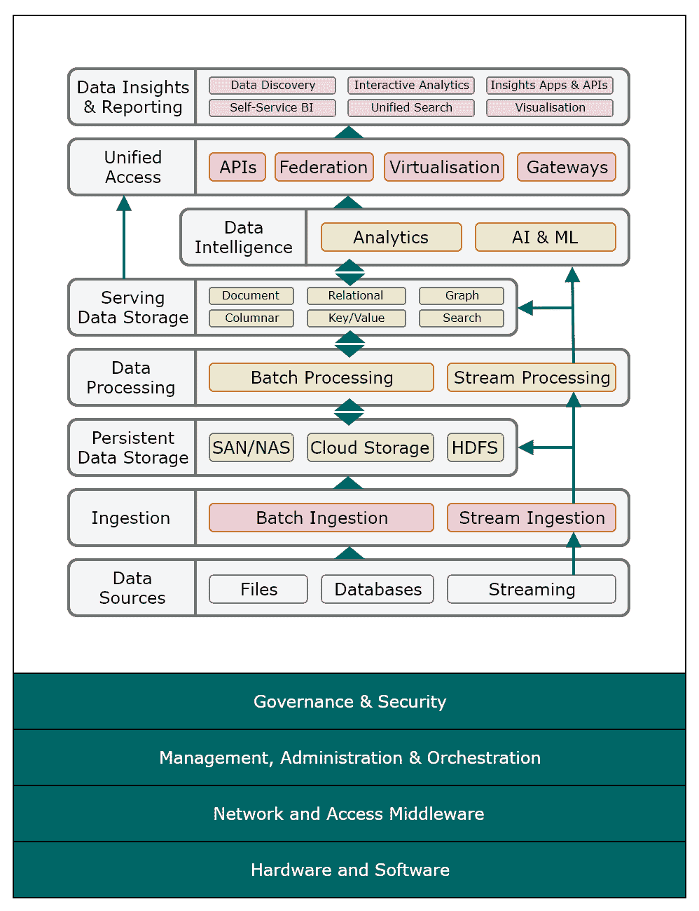

图 1.12：数据洞察平台参考逻辑架构

在此数据洞察平台参考架构中，逻辑层在以下子节中进行了更详细的描述。

# 数据源层

数据源层代表各种不同的数据存储、数据集和其他源数据系统，它们将为数据洞察平台提供输入数据。这些不同的源数据提供者可能包含结构化数据（例如，定界文本文件、CSV 文件和关系型数据库）、半结构化数据（例如，JSON 和 XML 文件）或非结构化数据（例如，图像、视频和音频）。

# 摄取层

摄取层负责消费源数据，并将其移动到持久化数据存储或直接到下游数据处理引擎，无论其格式和频率如何。摄取层应能够支持批数据以及基于流的实时事件数据。用于实现摄取层的开源技术示例包括以下内容：

+   Apache Sqoop

+   Apache Kafka

+   Apache Flume

# 持久化数据存储层

持久化数据存储层负责消费和持久化由摄取层提供的原始源数据。在持久化之前，原始源数据几乎不进行任何转换，以确保原始数据保持其原始格式。数据湖是一种持久化数据存储类别，通常以这种方式存储原始数据。用于实现持久化数据存储层的示例技术包括以下内容：

+   传统基于网络存储，例如**存储区域网络**（**SAN**）和**网络附加存储**（**NAS**）

+   开源技术，例如 HDFS

+   基于云的技术，例如**AWS S3**和**Azure BLOBs**

# 数据处理层

数据处理层负责对从持久化数据存储或直接从摄取层收集的原始数据进行转换、丰富和验证。数据处理层根据下游业务和分析需求对数据进行建模，并为其在服务数据存储层中的持久化或由数据智能应用进行处理做准备。同样，数据处理层必须能够处理批量数据和基于流的实时事件数据。以下是一些用于实现数据处理层的开源技术的示例：

+   Apache Hive

+   Apache Spark，包括 Spark Streaming（DStreams）和 Structured Streaming

+   Apache Kafka

+   Apache Storm

# 服务数据存储层

服务分析数据存储层负责将数据处理层生成的转换、丰富和验证后的数据持久化到数据存储中，这些数据存储维护数据模型结构，以便为下游数据智能和数据洞察应用提供服务。由于数据已经以与所需处理类型高度优化的数据结构持久化，因此这最小化或消除了进一步数据转换的需要。服务分析数据存储层提供的数据存储类型取决于业务和分析需求，可能包括以下任何一种或多种（附带开源实现示例）：

+   关系型数据库，例如 **PostgreSQL** 和 **MySQL**

+   文档数据库，例如 **Apache CouchDB** 和 **MongoDB**

+   列式数据库，例如 **Apache Cassandra** 和 **Apache HBase**

+   键值数据库，例如 **Redis** 和 **Voldemort**

+   图数据库和框架，例如 **Apache TinkerPop**

+   搜索引擎，例如 **Apache Lucene** 和 **Elasticsearch**

# 数据智能层

数据智能层负责在转换后的批量数据和基于流的实时事件数据上执行高级分析管道，包括预测性和规范性分析。高级分析管道可能包括人工智能服务，如图像和语音分析、认知计算和复杂推理，以及机器学习模型和自然语言处理。以下是一些用于实现数据智能层的开源高级分析库和框架的示例：

+   **Apache Spark MLlib**（通过 Python、R、Java 和 Scala 访问 API）

+   **TensorFlow** （通过 Python、Java、C++、Go 和 JavaScript 访问 API，C#、R、Haskell、Ruby 和 Scala 提供第三方绑定）

# 统一访问层

统一访问层负责提供对服务分析数据存储层和由数据智能层公开的第三方 API 的访问。统一访问层应提供通用、可扩展和安全的访问，以满足任何需要它的下游应用程序和系统，通常涉及 API 架构和/或数据联邦和虚拟化模式的实现。用于实现统一访问层的开源技术示例包括以下：

+   Spring 框架

+   Apache Drill

# 数据洞察和报告层

数据洞察和报告层负责向最终用户（包括数据分析师和数据科学家）公开数据洞察平台。数据发现、自助式商业智能、搜索、可视化、数据洞察和交互式分析应用程序都可以在此层提供，并且可以通过统一访问层访问服务分析数据存储层中的转换数据以及数据智能层中的第三方 API，所有这些都可以通过统一访问层实现。数据洞察和报告层的基本目的是提供从数据洞察平台可用的所有结构化、半结构化和非结构化数据中得出的可操作洞察和业务价值。用于实现数据洞察和报告层且对最终用户也开放的开源技术示例包括以下：

+   Apache Zeppelin

+   Jupyter Notebook

+   Elastic Kibana

+   BIRT 报告

+   基于自定义 JavaScript 的用于搜索和可视化的 Web 应用程序

商业技术的示例包括以下用于创建仪表板和报告的商业智能应用程序：

+   Tableau

+   Microsoft Power BI

+   SAP Lumira

+   QlikView

# 平台治理、管理和行政

最后，由于数据洞察平台旨在被组织的所有领域访问，并且将存储导致可操作洞察生成的敏感数据，因此它所包含的系统必须得到适当的治理、管理和行政。因此，为了提供安全的企业和生产级平台，需要以下额外的逻辑层：

+   **治理和安全**：此层包括**身份和访问管理**（**IDAM**）和数据治理工具。用于实现此层的开源技术示例包括以下：

    +   Apache Knox（Hadoop 认证网关）

    +   Apache Metron（安全分析框架）

    +   Apache Ranger（监控数据安全）

    +   OpenLDAP（轻量级目录访问协议实现）

+   **管理、行政和编排**：此层包括 DevOps 流程（如版本控制、自动化构建和部署）、集群监控和管理软件以及调度和流程管理工具。用于实现此层的开源技术示例包括以下：

    +   Jenkins（自动化服务器）

    +   Git（版本控制）

    +   Apache Ambari（管理、监控和管理）

    +   Apache Oozie（工作流调度）

+   **网络和访问中间件**：这一层处理网络连接和通信，包括网络安全、监控和入侵检测软件。

+   **硬件和软件**：这一层包含数据洞察平台部署的物理存储、计算和网络基础设施。物理组件可能位于本地、基于云，或为两者的混合组合。

# 开源实现

*图 1.13* 展示了仅使用开源技术和框架实现的参考数据洞察平台的示例：

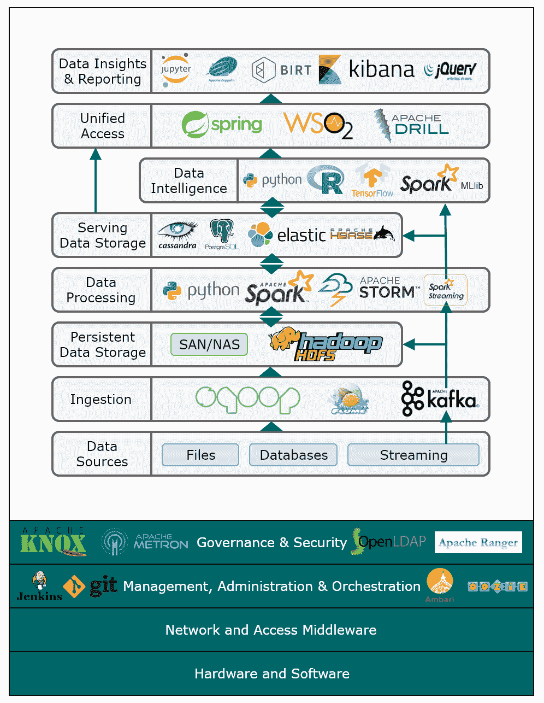

图 1.13：数据洞察平台开源实现的示例

# 摘要

在本章中，我们探索了一种新型分布式和可扩展的技术，这些技术使我们能够可靠且安全地存储、管理、建模、转换、处理和分析大量结构化、半结构化和非结构化数据，无论是批量还是实时，以便使用高级分析得出实际可操作的见解。

在下一章中，我们将指导您如何使用这些技术的一部分，包括 Apache Spark、Apache Kafka、Jupyter Notebook、Python、Java 和 Scala，来安装、配置、部署和管理单节点分析开发环境！
