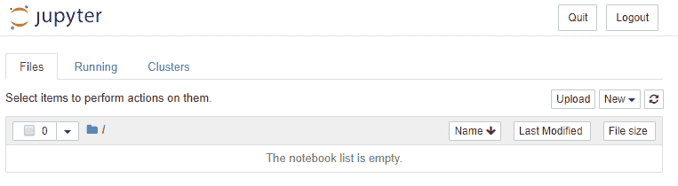
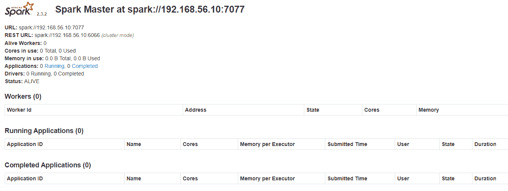
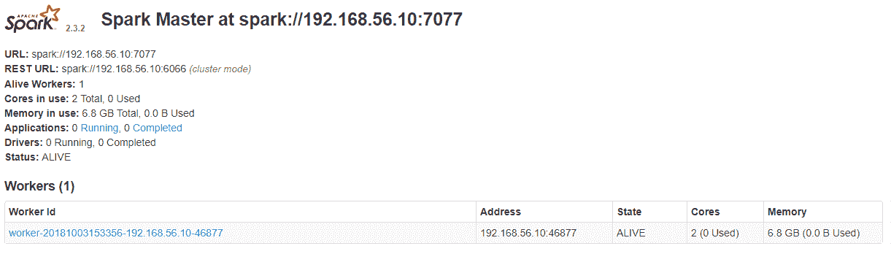

# 设置本地开发环境

在本章中，我们将通过配置一个自包含的单节点集群来安装、配置和部署一个本地分析开发环境，这将使我们能够执行以下操作：

+   在 Python 中原型设计和开发机器学习模型和管道

+   通过 Spark Python API (PySpark) 展示 Apache Spark 的机器学习库 `MLlib` 的功能和用法

+   使用小型样本数据集在单节点集群上开发和测试机器学习模型，然后扩展到多节点集群，处理更大的数据集，而无需或只需进行少量代码更改

我们的单节点集群将托管以下技术：

+   **操作系统**：CentOS Linux 7

    [`www.centos.org/download/`](https://www.centos.org/download/)

+   **通用编程语言**：

    +   Java SE 开发工具包 (JDK) 8 (8u181)

        [`www.oracle.com/technetwork/java/javase/downloads/index.html`](https://www.oracle.com/technetwork/java/javase/downloads/index.html)

    +   Scala 2.11.x (2.11.12) [`www.scala-lang.org/download/all.html`](https://www.scala-lang.org/download/all.html)

    +   通过 Anaconda 5.x (5.2) Python 发行版使用 Python 3.x (3.6)

        [`www.anaconda.com/download/`](https://www.anaconda.com/download/)

+   **通用分布式处理引擎**：Apache Spark 2.3.x (2.3.2)

    [`spark.apache.org/downloads.html`](http://spark.apache.org/downloads.html)

+   **分布式流平台**：Apache Kafka 2 (2.0.0)

    [`kafka.apache.org/downloads`](https://kafka.apache.org/downloads)

# CentOS Linux 7 虚拟机

首先，我们将假设您有权访问一个配置了 CentOS 7 操作系统的物理或虚拟机。CentOS 7 是一个由 **Red Hat Enterprise Linux** （**RHEL**）派生的免费 Linux 发行版。它通常与它的授权上游父级 RHEL 一起使用，作为基于 Linux 服务器的首选操作系统，因为它稳定，并得到一个庞大活跃社区的支持，拥有详细的文档。我们将使用所有这些命令来安装之前列出的各种技术，这些命令将是需要在单个 CentOS 7（或 RHEL）机器上执行的 Linux shell 命令，无论是物理机还是虚拟机。如果您没有访问 CentOS 7 机器，那么有许多选项可以配置 CentOS 7 虚拟机：

+   云计算平台，如 **Amazon Web Services** （**AWS**）、**Microsoft Azure** 和 **Google Cloud Platform** （**GCP**），都允许您使用 **按量付费** （**PAYG**）定价模式来启动虚拟机。通常，主要的云计算平台还为新手用户提供免费层，包含一定量的免费容量，以便试用他们的服务。要了解更多关于这些主要云计算平台的信息，请访问以下网站：

    +   AWS: [`aws.amazon.com/`](https://aws.amazon.com/)

    +   Microsoft Azure: [`azure.microsoft.com`](https://azure.microsoft.com)

    +   GCP: [`cloud.google.com/`](https://cloud.google.com/)

+   **虚拟专用服务器**（**VPS**）托管公司，如**Linode**和**Digital Ocean**，也提供配置低成本 CentOS 虚拟机的能力。这些 VPS 提供商通常采用一个更简单的定价模型，仅包括各种规格的虚拟机。要了解更多关于这些主要 VPS 提供商的信息，请访问以下网站：

    +   Linode: [`www.linode.com/`](https://www.linode.com/)

    +   Digital Ocean: [`www.digitalocean.com/`](https://www.digitalocean.com/)

+   一个常见且免费的选项，尤其是在用于原型设计和测试的本地开发环境中，是配置由您个人物理桌面或笔记本电脑托管的虚拟机。如**Oracle VirtualBox**（开源）和**VMWare Workstation Player**（个人使用免费）这样的虚拟化软件允许您在自己的个人物理设备上设置和运行虚拟机。要了解更多关于这些虚拟化软件服务的信息，请访问以下网站：

    +   Oracle VirtualBox: [`www.virtualbox.org/`](https://www.virtualbox.org/)

    +   VMWare Workstation Player: [`www.vmware.com/`](https://www.vmware.com/uk/products/workstation-player.html)

在本章剩余部分，我们将假设您已经配置了一台 64 位的 CentOS 7 机器，并且您可以直接通过桌面访问它，或者通过 HTTP 和 SSH 协议通过网络访问它。尽管您的虚拟机规格可能不同，但我们仍建议以下最低虚拟硬件要求，以便有效地运行本书剩余部分中的示例：

+   操作系统：CentOS 7（最小安装）

+   虚拟 CPU：4

+   内存：8 GB

+   存储：20 GB

在我们的案例中，我们的虚拟机具有以下网络属性，并将在此之后被如此引用。这些属性对于您的虚拟机可能会有所不同：

+   静态 IP 地址：`192.168.56.10`

+   子网掩码：`255.255.255.0`

+   **完全限定域名**（**FQDN**）：`packt.dev.keisan.io`

注意，您的虚拟机的安全性以及它所承载的后续软件服务（包括大数据技术）超出了本书的范围。如果您想了解更多关于如何加固基础操作系统和常见软件服务以抵御外部攻击的信息，我们建议访问[`www.cisecurity.org/cis-benchmarks/`](https://www.cisecurity.org/cis-benchmarks/)以及各个软件服务网站本身，例如[`spark.apache.org/docs/latest/security.html`](https://spark.apache.org/docs/latest/security.html)以了解 Apache Spark 的安全性。

# Java SE 开发工具包 8

Java 是一种通用编程语言，常用于 **面向对象编程**（**OOP**）。我们在 第一章，“大数据生态系统”中讨论的许多分布式技术最初是用 Java 编写的。因此，我们需要在我们的本地开发环境中安装 **Java 开发工具包**（**JDK**），以便在 **Java 虚拟机**（**JVM**）中运行这些软件服务。Apache Spark 2.3.x 需要 Java 8+ 才能运行。要安装 Oracle Java SE 开发工具包 8，请以 Linux *root* 用户或具有提升权限的其他用户身份执行以下 shell 命令：

```py
> rpm -ivh jdk-8u181-linux-x64.rpm
> vi /etc/profile.d/java.sh

      $ export PATH=/usr/java/default/bin:$PATH
      $ export JAVA_HOME=/usr/java/default

> source /etc/profile.d/java.sh
> echo $PATH
> echo $JAVA_HOME
```

这些命令将安装 JDK 8，并在之后将 Java 二进制文件的路径添加到全局 `PATH` 变量中，使得任何本地 Linux 用户都可以运行基于 Java 的程序。为了检查 Java 8 是否已成功安装，以下命令应返回已安装的 Java 版本，如下所示：

```py
> java –version
 $ java version "1.8.0_181"
 $ Java(TM) SE Runtime Environment (build 1.8.0_181-b13)
 $ Java HotSpot(TM) 64-Bit Server VM (build 25.181-b13, mixed mode)
```

# Scala 2.11

Scala 是一种通用编程语言，用于面向对象编程和函数式编程。Apache Spark 实际上是用 Scala 编程语言编写的。然而，如 第一章 所述，“大数据生态系统”，Spark 应用程序可以用多种语言编写，包括 Java、Scala、Python 和 R。尽管 Scala 与 Python 的优缺点超出了本书的范围，但 Scala 在数据分析的上下文中通常比 Python 快，并且与 Spark 的集成更为紧密。然而，Python 目前提供了更全面的先进第三方数据科学工具和框架库，并且可以说是更容易学习和使用。本书提供的代码示例是用 Python 3 编写的。然而，本节描述了如果您想开发基于 Scala 的应用程序，所需的安装步骤。

具体到 Scala，Apache Spark 2.3.2 需要 Scala 2.11.x 才能运行基于 Scala 的 Spark 应用程序。为了安装 Scala 2.11.12，请以 Linux 根用户或具有提升权限的其他用户身份执行以下 shell 命令：

```py
> rpm -ivh scala-2.11.12.rpm
```

这些命令将安装 Scala 2.11.12 并将其二进制文件放置在全局可访问的位置，使得任何本地 Linux 用户都可以运行 Scala 应用程序，无论是否基于 Spark。为了检查 Scala 2.11.12 是否已成功安装，以下命令应返回已安装的 Scala 版本：

```py
> scala –version
      $ Scala code runner version 2.11.12
```

您还可以通过以下方式访问 Scala shell 并执行交互式 Scala 命令：

```py
> scala
>> 1+2
 $ res0: Int = 3
>> :q
```

# Anaconda 5 与 Python 3

Anaconda 是 Python 通用编程语言的发行版。它不仅包含 Python 解释器，而且还捆绑了大量的常用 Python 数据科学包，以及一个名为**conda**的 Python 包管理系统，这使得快速轻松地提供基于 Python 的数据科学平台变得可能。实际上，我们将在后面的章节中利用一些预捆绑的 Python 包。

Anaconda 5.2 捆绑了 Python 3.6。Apache Spark 2.3.x 支持 Python 的两个分支，即 Python 2 和 Python 3。具体来说，它支持 Python 2.7+和 Python 3.4+。如前所述，本书提供的代码示例是用 Python 3 编写的。

为了安装 Anaconda 5.2，请执行以下 shell 命令。您可以选择是否以 Linux root 用户执行这些 shell 命令。如果您不这样做，Anaconda 将为运行这些命令的本地 Linux 用户安装，并且不需要管理员权限：

```py
> bash Anaconda3-5.2.0-Linux-x86_64.sh
> Do you accept the license terms? [yes|no]
>>> yes
> Do you wish the installer to prepend the Anaconda3 install location to PATH in your .bashrc ? [yes|no]
>>> yes
 The last command will add the location of the Anaconda, and hence Python, binaries to your local PATH variable, allowing your local Linux user to run both Python-based programs (overriding any existing Python interpreters already installed on the operating system) and conda commands. Note that you may need to open a new Linux shell in order for the local PATH updates to take effect.
```

为了检查 Anaconda 5.2 及其 Python 3.6 是否已成功安装，以下命令应返回已安装的 conda 版本：

```py
> conda --version
 $ conda 4.5.4
```

您还可以访问 Python shell 并执行交互式 Python 命令，如下所示：

```py
> python
 $ Python 3.6.5 | Anaconda, Inc.
>>> import sys
>>> sys.path
>>> quit()
```

# 基本 conda 命令

在本小节中，我们将提供一些基本的 conda 命令供您参考。这些命令假设您的虚拟机可以访问互联网或本地 Python 仓库。

为了升级 conda 版本或整个 Anaconda，您可以执行以下命令：

```py
> conda update conda
> conda update anaconda
```

要安装或更新单个 Python 包，您可以执行以下命令：

```py
> conda install <name of Python package>
> conda update <name of Python package>
```

最后，为了列出您 Anaconda 发行版中当前安装的 Python 包及其版本，您可以执行以下命令：

```py
> conda list
```

要了解更多关于 conda 包管理系统的信息，请访问[`conda.io/docs/index.html`](https://conda.io/docs/index.html)。

# 额外的 Python 包

以下 Python 包，这些包尚未包含在默认的 Anaconda 发行版中，是我们本地开发环境所必需的。请执行以下 shell 命令来安装这些先决条件 Python 包：

```py
> conda install -c conda-forge findspark
> conda install -c conda-forge pykafka
> conda install -c conda-forge tweepy
> conda install -c conda-forge tensorflow
> conda install -c conda-forge keras
```

# Jupyter Notebook

Jupyter Notebook 是一个开源的、基于 Web 的应用程序，专为*交互式*分析设计，它包含在 Anaconda 发行版中。由于它专为交互式分析设计，因此非常适合即席查询、实时模拟、原型设计和在开发生产就绪的数据科学模型之前可视化数据和寻找任何趋势和模式。**Apache Zeppelin**是另一个用于类似目的的开源、基于 Web 的笔记本示例。Jupyter Notebook 和 Apache Zeppelin 这样的笔记本通常支持多个内核，这意味着您可以使用包括 Python 和 Scala 在内的各种通用编程语言。

笔记本的一个核心优势是它们可以持久化您的输入代码以及任何由您的代码生成的输出数据结构和可视化，包括图表、图表和表格。然而，它们**并不是**完整的**集成开发环境**（IDE）。这意味着，通常情况下，它们不应用于开发用于生产级数据工程或分析管道的代码。这是因为它们在版本控制系统（如 Git）中难以管理（但并非不可能），因为它们持久化了输入代码和中间输出结构。因此，它们也难以构建代码工件并使用典型的 DevOps 管道自动部署。因此，笔记本非常适合交互式分析、即兴查询和原型设计。

为本书提供的代码文件实际上大多数是 Jupyter Notebook 文件（`.ipynb`），使用 Python 3 内核，以便读者可以立即看到我们模型的输出。如果您将来希望编写最终将部署到生产级系统的数据科学代码，我们强烈建议您在以下适当的 IDE 中编写代码：

+   Eclipse: [`www.eclipse.org/ide/`](https://www.eclipse.org/ide/)

+   IntelliJ IDEA: [`www.jetbrains.com/idea/`](https://www.jetbrains.com/idea/)

+   PyCharm: [`www.jetbrains.com/pycharm/`](https://www.jetbrains.com/pycharm/)

+   微软 **Visual Studio Code**（**VS Code**）: [`code.visualstudio.com/`](https://code.visualstudio.com/)

如前所述，Jupyter Notebook 已经包含在 Anaconda 发行版中。然而，为了访问它，建议执行以下配置步骤。请以您的本地 Linux 用户身份执行以下 shell 命令，以生成一个基于用户的 Jupyter Notebook 配置文件，然后根据您的个人偏好进行编辑：

```py
> jupyter notebook --generate-config
 $ Writing default config to: /home/packt/.jupyter/jupyter_notebook_config.py
> vi /home/packt/.jupyter/jupyter_notebook_config.py
 Line 174: c.NotebookApp.ip = '192.168.56.10'
 Line 214: c.NotebookApp.notebook_dir = '/data/workspaces/packt/jupyter/notebooks/'
 Line 240: c.NotebookApp.port = 8888
```

这些命令将配置一个基于用户的 Jupyter Notebook 实例，使其在指定的 IP 地址（在我们的例子中为 `192.168.56.10`）上监听，并使用指定的端口（在我们的例子中为 `8888`），以及从一个预定义的基本目录中工作，以持久化 Jupyter Notebook 代码文件（在我们的例子中为 `/data/workspaces/packt/jupyter/notebooks`）。请注意，您应根据您的具体环境修改这些属性。

# 启动 Jupyter Notebook

如果您可以通过桌面访问您的 CentOS 虚拟机，以最简单的方式实例化一个新的基于用户的 Jupyter Notebook 实例，请以您的本地 Linux 用户身份执行以下 shell 命令：

```py
> jupyter notebook
```

然而，如果您只有 SSH 或命令行访问而没有 GUI，那么您应该使用以下命令代替：

```py
> jupyter notebook --no-browser
```

后一个命令将阻止 Jupyter 自动打开本地浏览器会话。在任何情况下，生成的日志都将显示可以用来访问您的 Jupyter Notebook 实例的完整 URL（默认情况下包括安全令牌）。URL 应该类似于以下内容：

`http://192.168.56.10:8888/?token=6ebb5f6a321b478162802a97b8e463a1a053df12fcf9d99c`

请将此 URL 复制并粘贴到支持 Jupyter Notebook 的互联网浏览器中（Google Chrome、Mozilla Firefox 或 Apple Safari）。如果成功，应返回类似于 *图 2.1* 中所示截图的屏幕：



图 2.1：Jupyter Notebook 网络会话

# Jupyter Notebook 故障排除

由于 Jupyter Notebook 是一个基于 Web 的应用程序，它可以通过指定的端口号通过 HTTP 协议访问。如果您通过远程互联网浏览器访问生成的 URL 并且无法连接，那么请检查您虚拟机上的防火墙设置（在 CentOS 和 RHEL 的情况下，还包括 SELinux），以确保从您的位置可以访问指定的端口号。例如，以下由 Linux *root* 用户或具有提升权限的其他用户执行的 shell 命令，将通过其公共区域在 CentOS 7 防火墙中打开端口 8888：

```py
> firewall-cmd --get-active-zones
> firewall-cmd --zone=public --add-port=8888/tcp --permanent
> firewall-cmd --reload
> firewall-cmd --list-all
```

请联系您的系统管理员或参考您的云平台文档以获取更多有关网络信息和故障排除的信息。

要了解更多关于 Jupyter Notebook、其配置和常见故障排除的信息，请访问 [`jupyter-notebook.readthedocs.io/en/stable/index.html`](https://jupyter-notebook.readthedocs.io/en/stable/index.html)。

# Apache Spark 2.3

如 第一章 所述，*大数据生态系统*，Apache Spark 是一个通用目的的分布式处理引擎，能够在数 PB 的数据规模上执行数据转换、高级分析、机器学习和图分析。Apache Spark 可以以独立模式（意味着我们利用其内置的集群管理器）或与其他第三方集群管理器（包括 Apache YARN 和 Apache Mesos）集成的方式部署。

在我们单节点开发集群的情况下，我们将以独立模式部署 Apache Spark，其中我们的单节点将托管 Apache Spark Standalone Master 服务器和一个单独的工作节点实例。由于 Spark 软件服务旨在在 JVM 中运行，将独立主进程和工作进程同时放置在单个节点上是完全可接受的，尽管在实际的 Apache Spark 实施中，集群可以更大，配置了多个工作节点。我们的单节点 Apache Spark 集群仍然允许我们原型设计和开发可以利用多核单机提供的并行性的 Spark 应用程序和机器学习模型，并且之后可以轻松地部署到更大的集群和数据集。

还请注意，我们将直接从 Apache Spark 官方网站提供的预构建二进制文件安装 Apache Spark 2.3.2，网址为 [`spark.apache.org/downloads.html`](http://spark.apache.org/downloads.html)。如今，像 Spark、Kafka 和 Hadoop 组件这样的分布式技术通常通过像 **Hortonworks Data Platform** （**HDP**）、**Cloudera** 和 **MapR** 提供的统一大数据平台一起安装。使用这些统一平台的好处包括部署经过完全测试并保证完全相互集成的单个组件版本，以及基于网络的安装、监控、管理和支持。

# Spark 二进制文件

请以本地 Linux 用户身份执行以下 Shell 命令以提取 Apache Spark 二进制文件。在我们的案例中，我们将把 Spark 二进制文件安装到 `/opt`：

```py
> tar -xzf spark-2.3.2-bin-hadoop2.7.tgz -C /opt
```

结果的 Spark 父目录将具有以下结构：

+   `bin`：本地 Spark 服务的 Shell 脚本，例如 `spark-submit`

+   `sbin`：Shell 脚本，包括启动和停止 Spark 服务

+   `conf`：Spark 配置文件

+   `jars`：Spark 库依赖项

+   `python`：Spark 的 Python API，称为 PySpark

+   `R`：Spark 的 R API，称为 SparkR

# 本地工作目录

Spark 集群中的每个节点（在我们的案例中，仅为单个节点）都会生成日志文件以及本地工作文件，例如在洗牌和序列化 RDD 数据时。以下命令将在定义的本地目录中创建用于存储这些本地工作输出的目录，您可以根据您的偏好编辑路径，这些路径将在后续配置文件中使用：

```py
> mkdir -p /data/spark/local/data
> mkdir -p /data/spark/local/logs
> mkdir -p /data/spark/local/pid
> mkdir -p /data/spark/local/worker
```

# Spark 配置

配置可以通过以下方式应用于 Spark：

+   **Spark 属性** 控制应用程序级别的设置，包括执行行为、内存管理、动态分配、调度和安全，这些可以在以下优先级顺序中定义：

    +   通过在驱动程序中定义的名为 `SparkConf` 的 Spark 配置程序性对象

    +   通过传递给 `spark-submit` 或 `spark-shell` 的命令行参数

    +   通过在 `conf/spark-defaults.conf` 中设置的默认选项

+   **环境变量** 控制每台机器的设置，例如本地工作节点的本地 IP 地址，这些可以在 `conf/spark-env.sh` 中定义。

# Spark 属性

在我们的案例中，我们将通过 `conf/spark-defaults.conf` 设置一些基本的默认 Spark 属性，这样我们就可以专注于未来章节中的数据科学内容。这可以通过执行以下 Shell 命令实现（根据您的环境编辑值）：

```py
> cp conf/spark-defaults.conf.template conf/spark-defaults.conf
> vi conf/spark-defaults.conf
 $ spark.master spark://192.168.56.10:7077
 $ spark.driver.cores 1
 $ spark.driver.maxResultSize 0
 $ spark.driver.memory 2g
 $ spark.executor.memory 2g
 $ spark.executor.cores 2
 $ spark.serializer org.apache.spark.serializer.KryoSerializer
 $ spark.rdd.compress true
 $ spark.kryoserializer.buffer.max 128m
```

# 环境变量

我们还将通过 `conf/spark-env.sh` 设置基本的环境变量，如下所示（根据您的环境编辑值）：

```py
> cp conf/spark-env.sh.template conf/spark-env.sh
> vi conf/spark-env.sh
 $ export SPARK_LOCAL_IP=192.168.56.10
 $ export SPARK_LOCAL_DIRS=/data/spark/local/data
 $ export SPARK_MASTER_HOST=192.168.56.10
 $ export SPARK_WORKER_DIR=/data/spark/local/worker
 $ export SPARK_CONF_DIR=/opt/spark-2.3.2-bin-hadoop2.7/conf
 $ export SPARK_LOG_DIR=/data/spark/local/logs
 $ export SPARK_PID_DIR=/data/spark/local/pid
```

要了解有关各种 Spark 配置选项的更多信息，包括 Spark 属性和环境变量的详尽列表，请访问 [`spark.apache.org/docs/latest/configuration.html`](https://spark.apache.org/docs/latest/configuration.html)。

# 独立主服务器

我们现在可以启动 Spark 独立主服务器，如下所示：

```py
> sbin/start-master.sh
```

为了检查是否成功，您可以检查写入 `SPARK_LOG_DIR` 的 Spark 日志。Spark 应用程序可以通过其 REST URL 提交到独立主服务器 `spark://<Master IP 地址>:7077`（默认端口 `7077`）或 `spark://<Master IP 地址>:6066`（默认端口 `6066`）。

Spark Master 服务器还提供了一个开箱即用的主网页 **用户界面**（**UI**），在其中可以监控正在运行的 Spark 应用程序和工作节点，并诊断性能。默认情况下，此主网页 UI 通过 HTTP 在端口 `8080` 上可访问，换句话说，`http://<Master IP 地址>:8080`，其界面如图 2.2 所示：



图 2.2：Spark 独立主服务器网页界面

再次，如果您无法通过远程互联网浏览器访问此 URL，您可能需要在防火墙和/或 SELinux 设置中打开端口 `8080`（默认）。

# Spark 工作节点

我们现在可以启动我们的 Spark Worker 节点，如下所示：

```py
> sbin/start-slave.sh spark://192.168.56.10:7077
```

再次，为了检查是否成功，您可以检查写入 `SPARK_LOG_DIR` 的 Spark 日志。您还可以访问 Spark Master 网页界面以确认工作节点已成功注册，如图 2.3 所示：



图 2.3：Spark 工作节点成功注册

注意，Spark 工作节点默认通过 HTTP 在端口 8081 上暴露一个 **Worker UI**，换句话说，`http://<Worker IP 地址>:8081`。

# PySpark 和 Jupyter Notebook

现在让我们将 Jupyter Notebook 与 PySpark 集成，这样我们就可以用 Python 编写我们的第一个 Spark 应用程序了！在我们的本地开发环境中，将 Jupyter Notebook 与 PySpark 集成的最简单方法是为包含 Spark 二进制文件的目录设置一个全局 `SPARK_HOME` 环境变量。之后，我们可以使用之前安装的 `findspark` Python 包，该包将在运行时将 `SPARK_HOME` 的位置和 PySpark API 添加到 `sys.path`。请注意，`findspark` 不应用于生产级代码开发——相反，Spark 应用程序应作为通过 `spark-submit` 提交的代码工件进行部署。

请以 Linux 根用户或具有提升权限的其他用户身份执行以下 shell 命令，以便定义一个名为 `SPARK_HOME` 的全局环境变量（或者，也可以将其添加到您的本地 Linux 用户的 `.bashrc` 文件中，这不需要管理员权限）：

```py
> cd /etc/profile.d
> vi spark.sh
 $ export SPARK_HOME=/opt/spark-2.3.2-bin-hadoop2.7
> source spark.sh
```

为了使 SPARK_HOME 环境变量被 findspark 成功识别和注册，你需要重新启动任何正在运行的 Jupyter Notebook 实例及其底层的终端会话。

现在我们已经准备好用 Python 编写我们的第一个 Spark 应用程序了！实例化一个 Jupyter Notebook 实例，通过你的网络浏览器访问它，并创建一个新的 Python 3 笔记本，包含以下代码（为了将来方便引用，你可能需要将以下代码拆分到单独的笔记本单元中）：

```py
# (1) Import required Python dependencies
import findspark
findspark.init()
from pyspark import SparkContext, SparkConf
import random

# (2) Instantiate the Spark Context
conf = SparkConf()
   .setMaster("spark://192.168.56.10:7077")
   .setAppName("Calculate Pi")
sc = SparkContext(conf=conf)

# (3) Calculate the value of Pi i.e. 3.14...
def inside(p):
    x, y = random.random(), random.random()
    return x*x + y*y < 1

num_samples = 100
count = sc.parallelize(range(0, num_samples)).filter(inside).count()
pi = 4 * count / num_samples

# (4) Print the value of Pi
print(pi)

# (5) Stop the Spark Context
sc.stop()
```

这个 PySpark 应用程序在高层上工作如下：

1.  导入所需的 Python 依赖项，包括`findspark`和`pyspark`

1.  通过实例化一个`SparkConf`对象来创建一个 Spark 上下文，该对象提供高级别的应用程序级设置，从而告诉 Spark 应用程序如何连接到 Spark 集群

1.  计算数学值π

1.  打印 Pi 的值，并在 Jupyter Notebook 中以单元格输出的形式显示它

1.  停止 Spark 上下文，这将终止 Spark 应用程序

如果你在执行`sc.stop()`之前访问 Spark Master 的 Web UI，Spark 应用程序将列在“运行中的应用程序”下，此时你可以查看其底层的 worker 和 executor 日志文件。如果你在执行`sc.stop()`之后访问 Spark Master 的 Web UI，Spark 应用程序将列在“已完成的应用程序”下。

注意，这个笔记本可以从本书配套的 GitHub 仓库中下载，并命名为`chp02-test-jupyter-notebook-with-pyspark.ipynb`。

# Apache Kafka 2.0

为了完成我们的本地开发环境，我们将安装 Apache Kafka。如第一章，“大数据生态系统”中所述，Apache Kafka 是一个分布式流平台。我们将在第八章，“使用 Apache Spark 进行实时机器学习”中使用 Apache Kafka，通过结合 Spark Streaming 和`MLlib`来开发一个实时分析模型。

再次，为了我们的单节点开发集群，Apache Kafka 将部署在与 Apache Spark 软件服务相同的单节点上。我们还将安装为 Scala 2.11 构建的 Apache Kafka 2.0.0 版本。

# Kafka 二进制文件

在下载 Kafka 发布版后，我们首先需要做的是在我们的单节点集群上提取和安装预编译的二进制文件。在我们的案例中，我们将把 Kafka 二进制文件安装到`/opt`。请以本地 Linux 用户身份执行以下 shell 命令来提取 Apache Kafka 二进制文件：

```py
> tar -xzf kafka_2.11-2.0.0.tgz -C /opt
> cd /opt/kafka_2.11-2.0.0
```

# 本地工作目录

与 Apache Spark 进程一样，Apache Kafka 进程也需要它们自己的本地工作目录来持久化本地数据和日志文件。以下命令将创建定义好的本地目录，用于存储这些本地工作输出，您可以根据自己的偏好编辑这些路径：

```py
> mkdir -p /data/zookeeper/local/data
> mkdir -p /data/kafka/local/logs
```

# Kafka 配置

我们还将设置一些基本配置，如下（根据您的环境编辑值）：

```py
> vi config/zookeeper.properties
 $ dataDir=/data/zookeeper/local/data
> vi config/server.properties
 $ listeners=PLAINTEXT://192.168.56.10:9092
 $ log.dirs=/data/kafka/local/logs
 $ zookeeper.connect=192.168.56.10:2181
```

# 启动 Kafka 服务器

现在，我们已准备好按照以下方式启动 Apache Kafka：

```py
> bin/zookeeper-server-start.sh -daemon config/zookeeper.properties
> bin/kafka-server-start.sh -daemon config/server.properties
```

# 测试 Kafka

最后，我们可以通过创建一个测试主题来测试我们的 Kafka 安装，如下所示：

```py
> bin/kafka-topics.sh --create --zookeeper 192.168.56.10:2181 --replication-factor 1 --partitions 1 --topic our-first-topic
 $ Created topic "our-first-topic".
> bin/kafka-topics.sh --list --zookeeper 192.168.56.10:2181
 $ our-first-topic
```

一旦我们创建了测试主题，让我们启动一个命令行生产者应用程序，并按照以下方式向该主题发送一些测试消息：

```py
> bin/kafka-console-producer.sh --broker-list 192.168.56.10:9092 --topic our-first-topic
 > This is my 1st test message
 > This is my 2nd test message
 > This is my 3rd test message
```

最后，让我们在另一个终端会话中启动一个命令行消费者应用程序，以消费这些测试消息并将它们打印到控制台，如下所示：

```py
> bin/kafka-console-consumer.sh --bootstrap-server 192.168.56.10:9092 --topic our-first-topic --from-beginning
 $ This is my 1st test message
 $ This is my 2nd test message
 $ This is my 3rd test message
```

事实上，如果您在运行生产者应用程序的终端中继续输入新消息，您将立即看到它们被消费者应用程序消费，并在其终端中打印出来！

# 摘要

在本章中，我们已经安装、配置和部署了一个由单个节点 Apache Spark 2.3.2 和 Apache Kafka 2.0.0 集群组成的本地分析开发环境，这将使我们能够通过 Jupyter Notebook 使用 Python 3.6 交互式开发 Spark 应用程序。

在下一章中，我们将讨论一些常见人工智能和机器学习算法背后的高级概念，以及介绍 Apache Spark 的机器学习库`MLlib`！
