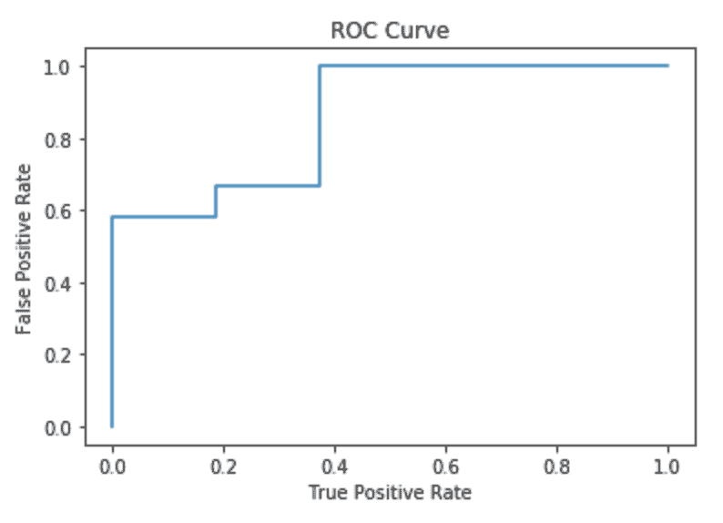

# 使用 Apache Spark 进行监督学习

在本章中，我们将使用 Python、Apache Spark 及其机器学习库`MLlib`开发、测试和评估应用于各种现实世界用例的监督机器学习模型。具体来说，我们将训练、测试和解释以下类型的监督机器学习模型：

+   单变量线性回归

+   多元线性回归

+   逻辑回归

+   分类和回归树

+   随机森林

# 线性回归

我们将要研究的第一个监督学习模型是线性回归。形式上，线性回归使用一组一个或多个**独立**变量来建模**依赖**变量之间的关系。得到的模型可以用来预测**依赖**变量的数值。但这在实践中意味着什么呢？好吧，让我们看看我们的第一个实际应用案例来理解这一点。

# 案例研究 – 预测自行车共享需求

在过去十年左右的时间里，随着人们寻求在繁忙的城市中出行的同时减少碳足迹并帮助减少道路拥堵，自行车共享计划在全球范围内变得越来越受欢迎。如果你对自行车共享系统不熟悉，它们非常简单；人们可以从城市中的特定地点租用自行车，并在完成旅程后将其归还到同一地点或另一个地点。在本例中，我们将探讨是否可以根据特定一天的天气预测自行车共享系统的日需求量！

我们将要使用的数据集是从位于[`archive.ics.uci.edu/ml/index.php`](https://archive.ics.uci.edu/ml/index.php)的加州大学（**UCI**）机器学习仓库中派生出来的。我们将使用的特定自行车共享数据集，可以从本书附带的 GitHub 仓库以及[`archive.ics.uci.edu/ml/datasets/Bike+Sharing+Dataset`](https://archive.ics.uci.edu/ml/datasets/Bike+Sharing+Dataset)获取，已被 Fanaee-T, Hadi, 和 Gama, Joao 在《Event labeling combining ensemble detectors and background knowledge》一文中引用，该文发表于 2013 年的《Progress in Artificial Intelligence》，Springer Berlin Heidelberg 出版社，第 1-15 页。

如果你打开`bike-sharing-data/day.csv`文件，无论是从本书附带的 GitHub 仓库还是从 UCI 的机器学习仓库，你将找到使用以下模式对 731 天内的自行车共享数据进行每日汇总的数据：

| **列名** | **数据类型** | **描述** |
| --- | --- | --- |
| `instant` | `整数` | 唯一记录标识符（主键） |
| `dteday` | `日期` | 日期 |
| `season` | `整数` | 季节（1 – 春季，2 – 夏季，3 – 秋季，4 – 冬季） |
| `yr` | `整数` | 年份 |
| `mnth` | `整数` | 月份 |
| `holiday` | `整数` | 该日是否为假日 |
| `weekday` | `整数` | 周几 |
| `workingday` | `整数` | 1 – 既不是周末也不是假日，0 – 否则 |
| `weathersit` | `Integer` | 1 – 清晰，2 – 薄雾，3 – 小雪，4 – 大雨 |
| `temp` | `Double` | 标准化温度（摄氏度） |
| `atemp` | `Double` | 标准化的感觉温度（摄氏度） |
| `hum` | `Double` | 标准化湿度 |
| `windspeed` | `Double` | 标准化风速 |
| `casual` | `Integer` | 当日非注册用户数量 |
| `registered` | `Integer` | 当日注册用户数量 |
| `cnt` | `Integer` | 当日总自行车租赁者数量 |

使用这个数据集，我们能否根据特定一天的天气模式预测该天的总自行车租赁者数量（*cnt*）？在这种情况下，*cnt* 是我们希望根据我们选择的 *自变量* 集合预测的 *因变量*。

# 单变量线性回归

单变量（或单变量）线性回归是指我们只使用一个自变量 *x* 来学习一个将 *x* 映射到因变量 *y* 的 *线性* 函数的线性回归模型：


在前面的方程中，我们有以下内容：

+   *y^i* 代表第 *i* 次观察的 *因变量*（cnt）

+   *x^i* 代表第 *i* 次观察的单个 *自变量*

+   ε^(*i*) 代表第 *i* 次观察的 *误差* 项

+   *β[0]* 是截距系数

+   *β[1]* 是单个自变量的回归系数

由于单变量线性回归模型在一般形式上是一个线性函数，我们可以在散点图上轻松地绘制它，其中 x 轴代表单个自变量，y 轴代表我们试图预测的因变量。*图 4.1*展示了当我们绘制标准化的感觉温度（自变量）与每日总自行车租赁者（因变量）的散点图时生成的散点图：


图 4.1：标准化温度与每日总自行车租赁者的关系

通过分析 *图 4.1*，你会看到标准化的感觉温度（**atemp**）和每日总自行车租赁者（**cnt**）之间似乎存在一种普遍的正线性趋势。然而，你也会看到我们的蓝色趋势线，这是我们的单变量线性回归函数的视觉表示，并不完美，换句话说，并不是所有的数据点都完全位于这条线上。在现实世界中，几乎不可能有一个完美的模型；换句话说，所有预测模型都会犯一些错误。因此，目标是尽量减少模型犯的错误数量，以便我们对它们提供的预测有信心。

# 残差

我们模型所犯的错误（或错误）被称为误差项或*残差*，在我们的单变量线性回归方程中用 ε^(*i*) 表示。因此，我们的目标是选择独立变量的回归系数（在我们的情况下 *β[1]*）以最小化这些残差。为了计算第 *i* 个残差，我们可以简单地从实际值中减去预测值，如*图 4.1*所示。为了量化回归线的质量，以及我们的回归模型，我们可以使用一个称为**均方误差总和**（**SSE**）的指标，它简单地是所有平方残差的和，如下所示：


较小的 SSE 表示更好的拟合。然而，SSE 作为衡量我们回归模型质量的指标有其局限性。SSE 与数据点的数量 *N* 成比例，这意味着如果我们加倍数据点的数量，SSE 可能会加倍，这可能会让你认为模型是两倍糟糕，但这并不是事实！因此，我们需要其他方法来衡量我们模型的质量。

# 均方根误差

**均方根误差**（**RMSE**）是 SSE 的平方根除以数据点的总数 *N*，如下所示：


RMSE（均方根误差）通常被用作量化线性回归模型质量的手段，因为它的单位与因变量相同，并且通过 N 进行归一化。

# R-squared

另一个提供线性回归模型错误度量的指标称为 R^(*2*)（R-squared）指标。R² 指标表示因变量中由独立变量（或多个变量）解释的*方差*的比例。计算 R² 的方程如下：


在这个方程中，SST 指的是**总平方和**，它只是从整体均值（如*图 4.1*中的红色水平线所示，常被用作**基准模型**）的 SSE。R² 值为 0 表示线性回归模型没有比基准模型提供任何改进（换句话说，SSE = SST）。R² 值为 1 表示完美的预测线性回归模型（换句话说，SSE = 0）。因此，目标是使 R² 值尽可能接近 1。

# Apache Spark 中的单变量线性回归

返回到我们的案例研究，让我们使用 Apache Spark 的机器学习库 `MLlib` 来开发一个单变量线性回归模型，以预测使用我们的共享单车数据集的每日总租车量：

以下子部分描述了对应于本用例的 Jupyter Notebook 中相关的每个单元格，该笔记本的标题为 `chp04-01-univariate-linear-regression.ipynb`，并且可以在随本书附带的 GitHub 仓库中找到。

1.  首先，我们导入所需的 Python 依赖项，包括`pandas`（Python 数据分析库）、`matplotlib`（Python 绘图库）和`pyspark`（Apache Spark Python API）。通过使用`%matplotlib`魔法函数，我们生成的任何图表将自动在 Jupyter Notebook 单元格输出中渲染：

```py
%matplotlib inline
import matplotlib.pyplot as plt
import pandas as pd
import findspark
findspark.init()
from pyspark import SparkContext, SparkConf
from pyspark.sql import SQLContext
from pyspark.ml.feature import VectorAssembler
from pyspark.ml.regression import LinearRegression
from pyspark.ml.evaluation import RegressionEvaluator
```

1.  在实例化 Spark 上下文之前，通常将任何相关数据集的样本加载到`pandas`中是一个好主意，这样我们可以在开发预测模型之前识别出任何趋势或模式。在这里，我们使用`pandas`库将整个 CSV 加载到名为`bike_sharing_raw_df`的`pandas` DataFrame 中（因为数据集本身非常小）：

```py
bike_sharing_raw_df = pd.read_csv('<Path to CSV file>', 
   delimiter = '<delimiter character>')
bike_sharing_raw_df.head()
```

1.  在 3.1 到 3.4 单元格中，我们使用`matplotlib`库将各种独立变量（`temp`、`atemp`、`hum`和`windspeed`）与因变量（`cnt`）绘制在一起：

```py
bike_sharing_raw_df.plot.scatter(x = '<Independent Variable>', 
   y = '<Dependent Variable>')
```

如*图 4.2*所示，标准化温度（`temp`和`atemp`）与每日总自行车租赁者（`cnt`）之间存在一般的正线性关系。然而，当使用湿度和风速作为独立变量时，没有这样的明显趋势。因此，我们将继续开发一个使用标准化感觉温度（`atemp`）作为单一独立变量的单变量线性回归模型，其中总每日自行车租赁者（`cnt`）作为因变量：


图 4.2：共享单车散点图

1.  为了开发 Spark 应用程序，我们首先需要实例化一个 Spark 上下文（如第一章，《大数据生态系统》）以连接到我们的本地 Apache Spark 集群。我们还实例化一个 Spark `SQLContext`以对数据进行结构化处理：

```py
conf = SparkConf().setMaster("spark://192.168.56.10:7077")
   .setAppName("Univariate Linear Regression - Bike Sharing")
sc = SparkContext(conf=conf)
sqlContext = SQLContext(sc)
```

1.  现在，我们可以将我们的 CSV 数据集加载到名为`bike_sharing_df`的 Spark DataFrame 中（参见第一章，《大数据生态系统》）。我们使用先前定义的`SQLContext`，并告诉 Spark 使用第一行作为标题行，并推断数据类型：

```py
bike_sharing_df = sqlContext.read
   .format('com.databricks.spark.csv')
   .options(header = 'true', inferschema = 'true')
   .load('Path to CSV file')
bike_sharing_df.head(10)
bike_sharing_df.printSchema()
```

1.  在开发预测模型之前，生成数据集的标准统计指标也是一个好主意，以便获得额外的见解。在这里，我们生成 DataFrame 的行数，以及计算每列的平均值、标准差、最小值和最大值。我们使用以下 Spark DataFrame 的`describe()`方法实现这一点：

```py
bike_sharing_df.describe().toPandas().transpose()
```

1.  现在我们演示如何使用 Spark DataFrame 作为输入来绘制数据集。在这种情况下，我们在绘图之前简单地将 Spark DataFrame 转换为`pandas` DataFrame（注意，对于非常大的数据集，建议使用数据集的代表样本进行绘图）：

```py
bike_sharing_df.toPandas().plot.scatter(x='atemp', y='cnt')
```

1.  现在我们已经完成了我们的探索性分析，我们可以开始开发我们的单变量线性回归模型！首先，我们需要将我们的独立变量（`atemp`）转换为一个*数值特征向量*（见第三章，*人工智能与机器学习*）。我们可以通过使用 MLlib 的`VectorAssembler`来实现这一点，它将一个或多个特征列，将它们转换为特征向量，并将这些特征向量存储在一个输出列中，在这个例子中，它被称为`features`：

```py
univariate_feature_column = 'atemp'
univariate_label_column = 'cnt'
vector_assembler = VectorAssembler(
   inputCols = [univariate_feature_column], 
   outputCol = 'features')
```

然后，我们将`VectorAssembler` *转换器*（见第三章，*人工智能与机器学习*）应用于原始数据集，并识别包含我们的标签的列（在这种情况下，我们的因变量`cnt`）。输出是一个新的 Spark DataFrame，称为`bike_sharing_features_df`，它包含我们的独立数值特征向量（`atemp`）映射到一个已知的标签（`cnt`）：

```py
bike_sharing_features_df = vector_assembler
   .transform(bike_sharing_df)
   .select(['features', univariate_label_column])
bike_sharing_features_df.head(10)
```

1.  根据监督学习模型的一般情况，我们需要一个*训练*数据集来训练我们的模型以学习映射函数，以及一个*测试*数据集来评估我们模型的性能。我们可以使用`randomSplit()`方法和一个种子随机分割我们的原始标记特征向量 DataFrame，种子用于初始化随机生成器，可以是任何你喜欢的数字。请注意，如果你使用不同的种子，你将在训练和测试数据集之间得到不同的随机分割，这意味着你可能会得到最终线性回归模型的不同系数：

```py
train_df, test_df = bike_sharing_features_df
   .randomSplit([0.75, 0.25], seed=12345)
train_df.count(), test_df.count()
```

在我们的情况下，75%的原始行将形成我们的训练 DataFrame，称为`train_df`，剩下的 25%将形成我们的测试 DataFrame，称为`test_df`，同时使用`seed`为`12345`。

1.  我们现在已准备好训练我们的单变量线性回归模型！我们通过使用`MLlib`的`LinearRegression`估计器（见第三章，*人工智能与机器学习*）并将包含我们独立数值特征向量的列名（在我们的例子中，称为`features`）和包含我们标签的列名（在我们的例子中，称为`cnt`）传递给它来实现这一点。然后我们应用`fit()`方法来训练我们的模型并输出一个线性回归*转换器*，在我们的例子中，它被称为`linear_regression_model`：

```py
linear_regression = LinearRegression(featuresCol = 'features', 
   labelCol = univariate_label_column)
linear_regression_model = linear_regression.fit(train_df)
```

1.  在我们在测试 DataFrame 上评估我们的训练好的单变量线性回归模型之前，让我们为它生成一些摘要统计信息。转换器模型公开了一系列统计信息，包括模型系数（在我们的情况下，即*β[1]*），截距系数*β[0]*，错误度量 RMSE 和 R²，以及每个数据点的残差集。在我们的情况下，我们有以下内容：

    +   β[0] = 829.62

    +   β[1] = 7733.75

    +   RMSE = 1490.12

    +   R² = 0.42

```py
print("Model Coefficients: " + 
   str(linear_regression_model.coefficients))
print("Intercept: " + str(linear_regression_model.intercept))
training_summary = linear_regression_model.summary
print("RMSE: %f" % training_summary.rootMeanSquaredError)
print("R-SQUARED: %f" % training_summary.r2)
print("TRAINING DATASET DESCRIPTIVE SUMMARY: ")
train_df.describe().show()
print("TRAINING DATASET RESIDUALS: ")
training_summary.residuals.show()
```

因此，我们的训练一元线性回归模型已经学习到了以下函数，以便能够使用单个自变量*x*（标准化感觉温度）来预测我们的因变量*y*（总日自行车租赁量）：

*y = 829.62 + 7733.75x*

1.  现在，我们将我们的训练模型应用于测试 DataFrame，以评估其在测试数据上的性能。在这里，我们使用`transform()`方法将我们的训练线性回归模型转换器应用于测试 DataFrame，以便进行预测。例如，我们的模型预测在标准化感觉温度为 0.11793 的情况下，总日自行车租赁量为 1742。实际的总日自行车租赁量为 1416（误差为 326）：

```py
test_linear_regression_predictions_df = 
   linear_regression_model.transform(test_df)
test_linear_regression_predictions_df
   .select("prediction", univariate_label_column, "features")
   .show(10)
```

1.  我们现在计算相同的 RMSE 和 R²误差指标，但基于模型在*测试*DataFrame 上的性能。在我们的案例中，这些是 1534.51（RMSE）和 0.34（R²），分别使用`MLlib`的`RegressionEvaluator`计算得出。因此，在我们的案例中，我们的训练模型在测试数据集上的表现实际上更差：

```py
linear_regression_evaluator_rmse = RegressionEvaluator(
   predictionCol = "prediction", 
   labelCol = univariate_label_column, metricName = "rmse")
linear_regression_evaluator_r2 = RegressionEvaluator(
   predictionCol = "prediction", 
   labelCol = univariate_label_column, metricName = "r2")
print("RMSE on Test Data = %g" % linear_regression_evaluator_rmse
   .evaluate(test_linear_regression_predictions_df))
print("R-SQUARED on Test Data = %g" % 
   linear_regression_evaluator_r2
   .evaluate(test_linear_regression_predictions_df))
```

1.  注意，我们可以使用线性回归模型的`evaluate()`方法生成相同的指标，如下面的代码块所示：

```py
test_summary = linear_regression_model.evaluate(test_df)
print("RMSE on Test Data = %g" % test_summary.rootMeanSquaredError)
print("R-SQUARED on Test Data = %g" % test_summary.r2)
```

1.  最后，我们通过停止 Spark 上下文来终止我们的 Spark 应用程序：

```py
sc.stop()
```

# 多元线性回归

我们的多元线性回归模型在训练集和测试集上的表现实际上相对较差，分别在训练集上具有 0.42 的 R²值，在测试集上具有 0.34 的 R²值。我们是否有办法利用原始数据集中可用的其他自变量来提高我们模型的预测质量？

多元（或多个）线性回归通过允许我们利用一个以上的自变量来扩展一元线性回归，在这种情况下，*K*个自变量，如下所示：


如前所述，我们有因变量*y^i*（对于第*i*个观察值），截距系数*β[0]*，以及残差ε^(*i*)。但现在我们还有*k*个自变量，每个自变量都有自己的回归系数，*β[k]*。目标，如前所述，是推导出系数，以最小化模型产生的误差量。但问题现在是如何选择用于训练多元线性回归模型的独立变量子集。增加更多的自变量通常会增加模型的一般复杂性，从而增加底层处理平台的数据存储和处理需求。此外，过于复杂的模型往往会引起**过拟合**，即模型在用于训练模型的训练数据集上的性能（换句话说，更高的*R²*指标）优于它之前未见过的数据。

# 相关性

相关性是一个衡量两个变量之间线性关系的指标，并帮助我们决定在模型中包含哪些自变量：

+   +1 表示完美的正线性关系

+   0 表示没有线性关系

+   -1 表示完美的负线性关系

当两个变量的相关性的绝对值接近 1 时，这两个变量被认为是“高度相关”的。

# Apache Spark 中的多元线性回归

返回到我们的案例研究，现在让我们使用我们的共享单车数据集和独立变量子集来开发一个多元线性回归模型，以预测总日租车数量：

以下子节描述了对应于本用例的 Jupyter Notebook 中每个相关的单元格，标题为`chp04-02-multivariate-linear-regression.ipynb`，并可在本书附带的 GitHub 仓库中找到。请注意，为了简洁起见，我们将跳过那些执行与之前相同功能的单元格。

1.  首先，让我们演示如何使用 Spark 计算我们的因变量`cnt`与 DataFrame 中的每个独立变量之间的相关值。我们通过遍历我们的原始 Spark DataFrame 中的每一列，并使用`stat.corr()`方法来实现这一点，如下所示：

```py
independent_variables = ['season', 'yr', 'mnth', 'holiday', 
   'weekday', 'workingday', 'weathersit', 'temp', 'atemp', 
   'hum', 'windspeed']
dependent_variable = ['cnt']
bike_sharing_df = bike_sharing_df.select( independent_variables + 
   dependent_variable )
for i in bike_sharing_df.columns:
   print( "Correlation to CNT for ", 
      i, bike_sharing_df.stat.corr('cnt', i))
```

结果的相关矩阵显示，独立变量——`season`、`yr`、`mnth`、`temp`和`atemp`与我们的因变量`cnt`表现出显著的积极相关性。因此，我们将继续使用这个独立变量子集来训练多元线性回归模型。

1.  如前所述，我们可以使用`VectorAssembler`来生成我们独立变量集合的数值特征向量表示，以及`cnt`标签。语法与之前相同，但这次我们向`VectorAssembler`传递多个列，代表包含我们的独立变量的列：

```py
multivariate_feature_columns = ['season', 'yr', 'mnth', 
   'temp', 'atemp']
multivariate_label_column = 'cnt'
vector_assembler = VectorAssembler(inputCols = 
   multivariate_feature_columns, outputCol = 'features')
bike_sharing_features_df = vector_assembler
   .transform(bike_sharing_df)
   .select(['features', multivariate_label_column])
```

1.  我们现在可以使用 DataFrame API 通过`randomSplit`方法生成各自的训练和测试数据集：

```py
train_df, test_df = bike_sharing_features_df
   .randomSplit([0.75, 0.25], seed=12345)
train_df.count(), test_df.count()
```

1.  我们现在可以使用与我们的单变量线性回归模型中使用的相同的`LinearRegression`估计器来训练我们的多元线性回归模型：

```py
linear_regression = LinearRegression(featuresCol = 'features', 
   labelCol = multivariate_label_column)
linear_regression_model = linear_regression.fit(train_df)
```

1.  在将我们的原始 DataFrame 分别拆分为训练和测试 DataFrame 后，并将相同的*LinearRegression*估计器应用于训练 DataFrame 后，我们现在有一个训练好的多元线性回归模型，以下是其总结训练统计信息（如本 Jupyter Notebook 的第 8 个单元格所示）：

    +   β[0] = -389.94, β[1] = 526.05, β[2] = 2058.85, β[3] = -51.90, β[4] = 2408.66, β[5] = 3502.94

    +   RMSE = 1008.50

    +   R² = 0.73

因此，我们的训练好的多元线性回归模型已经学习到了以下函数，以便能够使用一组独立变量*x[k]*（季节、年份、月份、标准化温度和标准化感觉温度）来预测我们的因变量*y*（总日租车数量）：

*y = -389.94 + 526.05x[1] + 2058.85x[2] - 51.90x[3] + 2408.66x[4] + 3502.94x[5]*

此外，我们的训练多元线性回归模型在测试数据集上的表现甚至更好，测试 RMSE 为 964.60，测试 R² 为 0.74。

为了完成我们对多元线性回归模型的讨论，请注意，随着更多独立变量的添加，我们的训练 R² 指标将始终增加或保持不变。然而，更好的训练 R² 指标并不总是意味着更好的测试 R² 指标——事实上，测试 R² 指标甚至可以是负数，这意味着它在测试数据集上的表现比基线模型（训练 R² 指标永远不会是这样）更差。因此，目标是能够开发一个在训练和测试数据集上都表现良好的模型。

# 逻辑回归

我们已经看到线性回归模型如何允许我们预测数值结果。然而，逻辑回归模型允许我们通过预测结果为真的概率来预测*分类*结果。

与线性回归一样，在逻辑回归模型中，我们也有一个因变量 *y* 和一组自变量 *x[1]*、*x[2]*、…、*x[k]*。然而，在逻辑回归中，我们想要学习一个函数，该函数提供在给定这组自变量的情况下 *y = 1*（换句话说，结果变量为真）的概率，如下所示：


这个函数被称为**逻辑响应**函数，它提供一个介于 0 和 1 之间的数字，表示结果相关变量为真的概率，如图 *4.3* 所示：


图 4.3：逻辑响应函数

正系数值 β[k] 增加了 y = 1 的概率，而负系数值减少了 y = 1 的概率。因此，在开发逻辑回归模型时，我们的目标是选择那些在 y = 1 时预测高概率，但在 y = 0 时预测低概率的系数。

# 阈值值

我们现在知道，逻辑回归模型为我们提供了结果变量为真的概率，也就是说，y = 1。然而，在实际应用中，我们需要做出*决策*，而不仅仅是提供概率。通常，我们会做出二元预测，例如是/否、好/坏、行/停。一个阈值值（*t*）允许我们根据概率做出以下决策：

+   如果 P(y=1) >= t，则我们预测 y = 1

+   如果 P(y=1) < t，则我们预测 y = 0

现在的挑战是如何选择一个合适的 *t* 值。实际上，在这个上下文中，“合适”是什么意思呢？

在现实世界的用例中，某些类型的错误比其他类型的错误更好。想象一下，如果你是一位医生，正在使用逻辑回归对大量患者进行特定疾病的检测。在这种情况下，结果 *y=1* 将是携带该疾病的患者（因此 y=0 将是不携带该疾病的患者），因此我们的模型将为特定个人提供 P(y=1)。在这个例子中，最好尽可能多地检测出可能携带疾病的患者，即使这意味着将一些患者错误地分类为携带疾病，但后来发现他们并不携带。在这种情况下，我们选择较小的阈值值。如果我们选择较大的阈值值，那么我们将检测出几乎肯定患有疾病的患者，但我们会错误地将大量患者分类为不携带疾病，而实际上他们确实携带，这将是一个更糟糕的情况！

因此，总的来说，当使用逻辑回归模型时，我们可以犯两种类型的错误：

+   我们预测 y=1（疾病），但实际结果是 y=0（健康）

+   我们预测 y=0（健康），但实际结果是 y=1（疾病）

# 混淆矩阵

一个混淆（或分类）矩阵可以帮助我们通过比较预测结果与实际结果来决定使用哪个阈值值，如下所示：

|  | **预测 y=0（健康）** | **预测 y=1（疾病）** |
| --- | --- | --- |
| **实际 y=0（健康）** | **真阴性**（**TN**） | **假阳性**（**FP**） |
| **实际 y=1（疾病）** | **假阴性**（**FN**） | **真阳性**（**TP**） |

通过生成混淆矩阵，它允许我们使用以下一系列指标，根据给定的阈值值量化我们模型的准确性：

+   N = 观察数

+   总准确率 = (TN + TP) / N

+   总错误率 = (FP + FN) / N

+   敏感性（真阳性率）= TP / (TP + FN)

+   特异性（真阴性率）= TN / (TN + FP)

+   假阳性错误率 = FP / (TN + FP)

+   假阴性错误率 = FN / (TP + FN)

阈值值较高的逻辑回归模型将具有较低的敏感性和较高的特异性。阈值值较低的模型将具有较高的敏感性和较低的特异性。因此，阈值值的选择取决于对特定用例中哪种错误“更好”。在例如政治倾向为保守/非保守等没有真正偏好的用例中，你应该选择 0.5 的阈值值，这将预测最可能的结果。

# 接收器操作特征曲线

为了以更直观的方式进一步帮助我们选择阈值值，我们可以生成一个**接收器操作特征**（**ROC**）曲线。ROC 曲线绘制了每个阈值值（0 到 1 之间）的**假阳性错误率**（**FPR**）与**真阳性率**（**TPR**，或敏感性）的关系，如图 4.4 所示：


图 4.4：ROC 曲线

如*图 4.4*所示，使用阈值为 0 意味着你会捕捉到所有 y=1（疾病）的病例，但你也会错误地将所有 y=0（健康）的病例标记为 y=1（疾病），这会让许多健康人感到恐慌！然而，使用阈值为 1 意味着你将不会捕捉到任何 y=1（疾病）的病例，导致许多人未得到治疗，但你将正确地将所有 y=0（健康）的病例标记。因此，绘制 ROC 曲线的好处在于，它可以帮助你看到每个阈值值的权衡，并最终帮助你决定在特定用例中应使用哪个阈值值。

# ROC 曲线下的面积

作为量化逻辑回归模型预测质量的一种手段，我们可以计算**ROC 曲线下的面积**（**AUC**），如图*4.5*所示。AUC 衡量模型预测正确的时间比例，AUC 值为 1（最大值），意味着完美模型，换句话说，我们的模型 100%的时间都能正确预测，而 AUC 值为 0.5（最小值），意味着我们的模型 50%的时间能正确预测，类似于仅仅猜测：


图*4.5*：ROC 曲线下的面积

# 案例研究 – 预测乳腺癌

现在我们将逻辑回归应用于一个非常重要的实际应用案例；预测可能患有乳腺癌的患者。大约每 8 位女性中就有 1 位在其一生中被诊断出患有乳腺癌（该疾病也影响男性），导致全球每年有数十万女性过早死亡。事实上，预计到 2018 年底，全球将仅报告超过 200 万例新发乳腺癌。已知有多种因素会增加乳腺癌的风险，包括年龄、体重、家族史和以前的诊断。

使用定量预测因子的数据集，以及表示乳腺癌存在与否的二进制因变量，我们将训练一个逻辑回归模型来预测给定患者是否健康（y=1）或具有乳腺癌的生物标志物（y=0）。

我们将使用的数据集再次来源于加州大学（UCI）的机器学习仓库。具体来说，可以从本书附带的 GitHub 仓库以及[`archive.ics.uci.edu/ml/datasets/Breast+Cancer+Coimbra`](https://archive.ics.uci.edu/ml/datasets/Breast+Cancer+Coimbra)获取的乳腺癌数据集，已被[Patricio, 2018] Patricio, M., Pereira, J., Crisóstomo, J., Matafome, P., Gomes, M., Seiça, R., and Caramelo, F. (2018). Using Resistin, glucose, age, and BMI to predict the presence of breast cancer. BMC Cancer, 18(1)引用。

如果你打开`breast-cancer-data/dataR2.csv`在任何文本编辑器中，无论是从随本书附带的 GitHub 存储库还是从 UCI 的机器学习存储库，你将找到使用以下模式的乳腺癌数据：

| **列名** | **数据类型** | **描述** |
| --- | --- | --- |
| `Age` | `Integer` | 患者年龄 |
| `BMI` | `Double` | 体质指数（kg/m²） |
| `Glucose` | `Double` | 血糖水平（mg/dL） |
| `Insulin` | `Double` | 胰岛素水平（µU/mL） |
| `HOMA` | `Double` | 代谢稳态模型评估（HOMA）- 用于评估β细胞功能和胰岛素敏感性 |
| `Leptin` | `Double` | 用于调节能量消耗的激素（ng/mL） |
| `Adiponectin` | `Double` | 用于调节血糖水平的蛋白质激素（µg/mL） |
| `Resistin` | `Double` | 导致胰岛素抵抗的激素（ng/mL） |
| `MCP.1` | `Double` | 有助于从伤害和感染中恢复的蛋白质（pg/dL） |
| `分类` | `Integer` | 1 = 作为对照组的健康患者，2 = 乳腺癌患者 |

使用这个数据集，我们能否开发一个逻辑回归模型，该模型计算给定患者健康的概率（换句话说，y=1），然后应用阈值值进行预测决策？

以下子部分描述了对应于本用例的 Jupyter Notebook 中相关的每个单元格，该笔记本的标题为`chp04-03-logistic-regression.ipynb`，并且可以在随本书附带的 GitHub 存储库中找到。请注意，为了简洁起见，我们将跳过那些执行与之前相同功能的单元格。

1.  在加载我们的乳腺癌 CSV 文件后，我们首先确定将作为标签的列，即`分类`。由于该列中的值要么是 1（健康）要么是 2（乳腺癌患者），我们将对此列应用`StringIndexer`以识别和索引所有可能的类别。结果是，标签 1 对应健康患者，标签 0 对应乳腺癌患者：

```py
indexer = StringIndexer(inputCol = "Classification", 
   outputCol = "label").fit(breast_cancer_df)
breast_cancer_df = indexer.transform(breast_cancer_df)
```

1.  在我们的案例中，我们将使用所有原始定量列【`年龄`、`BMI`、`血糖`、`胰岛素`、`HOMA`、`Leptin`、`Adiponectin`、`Resistin`和`MCP.1`】作为独立变量，以生成模型的数值特征向量。同样，我们可以使用`MLlib`的`VectorAssembler`来实现这一点：

```py
feature_columns = ['Age', 'BMI', 'Glucose', 'Insulin', 'HOMA', 
   'Leptin', 'Adiponectin', 'Resistin', 'MCP_1']
label_column = 'label'
vector_assembler = VectorAssembler(inputCols = feature_columns, 
   outputCol = 'features')
```

```py
breast_cancer_features_df = vector_assembler
   .transform(breast_cancer_df)
   .select(['features', label_column])
```

1.  在生成训练和测试 DataFrame 后，我们应用`MLlib`的`LogisticRegression`估计器来训练一个`LogisticRegression`模型转换器：

```py
logistic_regression = LogisticRegression(featuresCol = 'features', 
   labelCol = label_column)
logistic_regression_model = logistic_regression.fit(train_df)
```

1.  然后，我们使用训练好的逻辑回归模型对测试 DataFrame 进行预测，使用我们的逻辑回归模型转换器的`transform()`方法。这导致一个新的 DataFrame，其中附加了`rawPrediction`、`prediction`和`probability`列。y=1 的概率，换句话说，P(y=1)，包含在`probability`列中，而使用默认阈值值 t=0.5 的整体预测决策包含在`prediction`列中：

```py
test_logistic_regression_predictions_df = logistic_regression_model
   .transform(test_df)
test_logistic_regression_predictions_df.select("probability", 
   "rawPrediction", "prediction", label_column, "features").show()
```

1.  为了量化我们训练好的逻辑回归模型的质量，我们可以绘制 ROC 曲线并计算 AUC 指标。ROC 曲线使用`matplotlib`库生成，给定**假阳性率**（**FPR**）和**真阳性率**（**TPR**），这是通过在测试 DataFrame 上评估我们的训练好的逻辑回归模型来暴露的。然后，我们可以使用`MLlib`的`BinaryClassificationEvaluator`来计算 AUC 指标如下：

```py
test_summary = logistic_regression_model.evaluate(test_df)
roc = test_summary.roc.toPandas()
plt.plot(roc['FPR'],roc['TPR'])
plt.ylabel('False Positive Rate')
plt.xlabel('True Positive Rate')
plt.title('ROC Curve')
plt.show()
evaluator_roc_area = BinaryClassificationEvaluator(
   rawPredictionCol = "rawPrediction", labelCol = label_column, 
   metricName = "areaUnderROC")
print("Area Under ROC Curve on Test Data = %g" %
   evaluator_roc_area.evaluate(
   test_logistic_regression_predictions_df))

Area Under ROC Curve on Test Data = 0.859375 
```

使用`matplotlib`库生成的结果 ROC 曲线如图 4.6 所示：



图 4.6：使用`matplotlib`渲染的 ROC 曲线

1.  基于测试数据集预测生成混淆矩阵的一种方法是根据预测结果等于和不等于实际结果的情况过滤测试预测的 DataFrame，然后计算过滤后的记录数：

```py
N = test_logistic_regression_predictions_df.count()
true_positives = test_logistic_regression_predictions_df
   .filter( col("prediction") == 1.0 )
   .filter( col("label") == 1.0 ).count()
true_negatives = test_logistic_regression_predictions_df
   .filter( col("prediction") == 0.0 )
   .filter( col("label") == 0.0 ).count()
false_positives = test_logistic_regression_predictions_df
   .filter( col("prediction") == 1.0 )
   .filter( col("label") == 0.0 ).count()
false_negatives = test_logistic_regression_predictions_df
   .filter( col("prediction") == 0.0 )
   .filter( col("label") == 1.0 ).count()
```

1.  或者，我们可以使用 MLlib 的 RDD API（自 Spark 2.0 起处于维护模式）通过将测试预测的 DataFrame 转换为 RDD 自动生成混淆矩阵（见第一章，*大数据生态系统*），然后传递给`MulticlassMetrics`评估抽象：

```py
predictions_and_label = test_logistic_regression_predictions_df
   .select("prediction", "label").rdd
metrics = MulticlassMetrics(predictions_and_label)
print(metrics.confusionMatrix())
```

我们逻辑回归模型的混淆矩阵，使用默认阈值值为 0.5，如下所示：

|  | **预测 y=0（乳腺癌）** | **预测 y=1（健康）** |
| --- | --- | --- |
| **实际 y=0****（乳腺癌）** | 10 | 6 |
| **实际 y=1****（健康）** | 4 | 8 |

我们可以这样解释这个混淆矩阵。在总共 28 个观察值中，我们的模型表现出以下特性：

+   正确标记了 10 例实际为乳腺癌的乳腺癌病例

+   正确标记了 8 例实际为健康患者的健康患者

+   错误地将 6 名患者标记为健康，而他们实际上患有乳腺癌

+   错误地将 4 名患者标记为患有乳腺癌，而他们实际上是健康的

+   总体准确率 = 64%

+   总体错误率 = 36%

+   灵敏度 = 67%

+   特异性 = 63%

为了改进我们的逻辑回归模型，我们当然必须包括更多的观察结果。此外，我们模型的 AUC 指标为 0.86，相当高。然而，请注意，AUC 是一个考虑所有可能阈值值的准确度度量，而先前的混淆矩阵只考虑了一个阈值值（在这种情况下为 0.5）。作为一个扩展练习，为一系列阈值值生成混淆矩阵，以查看这如何影响我们的最终分类！

# 分类和回归树

我们已经看到线性回归模型如何让我们预测数值结果，以及逻辑回归模型如何让我们预测分类结果。然而，这两个模型都假设变量之间存在*线性*关系。**分类和回归树**（**CART**）通过生成**决策树**来克服这个问题，与之前看到的监督学习模型相比，这些决策树也更容易解释。然后可以遍历这些决策树来做出最终决策，结果可以是数值（回归树）或分类（分类树）。一个简单的分类树，由抵押贷款提供者使用，如图*4.7*所示：


图 4.7：抵押贷款提供者使用的简单分类树

在遍历决策树时，从顶部开始。之后，向左遍历表示是或正面响应，向右遍历表示否或负面响应。一旦到达分支的末端，叶子节点描述了最终结果。

# 案例研究 - 预测政治派别

对于我们的下一个用例，我们将使用美国众议院的国会投票记录来构建一个分类树，以预测某个国会议员或女议员是共和党人还是民主党人。

我们将使用的特定国会投票数据集可以从本书附带的 GitHub 仓库和 UCI 机器学习仓库[`archive.ics.uci.edu/ml/datasets/congressional+voting+records`](https://archive.ics.uci.edu/ml/datasets/congressional+voting+records)获取。它已被 Dua, D.和 Karra Taniskidou, E.（2017）引用。UCI 机器学习仓库[http://archive.ics.uci.edu/ml]。加州大学欧文分校，信息与计算机科学学院。

如果你使用任何选择的文本编辑器打开 `congressional-voting-data/house-votes-84.data`，无论是来自本书附带的 GitHub 仓库还是来自 UCI 的机器学习仓库，你将找到 435 项国会投票记录，其中 267 项属于民主党，168 项属于共和党。第一列包含标签字符串，换句话说，是民主党或共和党，后续列表明当时该议员或女议员在特定关键问题上的投票情况（y = 支持，n = 反对，? = 既不支持也不反对），例如反卫星武器测试禁令和对合成燃料公司的资金削减。现在，让我们开发一个分类树，以便根据议员的投票记录预测其政治派别：

以下子部分描述了对应于本用例的 Jupyter Notebook 中每个相关的单元格，该笔记本命名为 `chp04-04-classification-regression-trees.ipynb`，并且可以在本书附带的 GitHub 仓库中找到。请注意，为了简洁起见，我们将跳过那些执行与之前相同功能的单元格。

1.  由于我们的原始数据文件没有标题行，在将其加载到 Spark DataFrame 之前，我们需要明确定义其模式，如下所示：

```py
schema = StructType([
   StructField("party", StringType()),
   StructField("handicapped_infants", StringType()),
   StructField("water_project_cost_sharing", StringType()),
   ...
])
```

1.  由于我们所有的列，包括标签和所有自变量，都是基于字符串的数据类型，我们需要对它们应用一个 *StringIndexer*（就像我们在开发我们的逻辑回归模型时做的那样），以便在生成数值特征向量之前识别和索引每个列的所有可能类别。然而，由于我们需要对多个列进行索引，构建一个 *pipeline*（管道）会更有效率。管道是一系列应用于 Spark DataFrame 的数据和/或机器学习转换阶段。在我们的案例中，管道中的每个阶段将是对不同列的索引，如下所示：

```py
categorical_columns = ['handicapped_infants', 
   'water_project_cost_sharing', ...]
pipeline_stages = []
for categorial_column in categorical_columns:
   string_indexer = StringIndexer(inputCol = categorial_column, 
      outputCol = categorial_column + 'Index')
   encoder = OneHotEncoderEstimator(
      inputCols = [string_indexer.getOutputCol()], 
      outputCols = [categorial_column + "classVec"])
   pipeline_stages += [string_indexer, encoder]

label_string_idx = StringIndexer(inputCol = 'party', 
   outputCol = 'label')
pipeline_stages += [label_string_idx]
vector_assembler_inputs = [c + "classVec" for c 
   in categorical_columns]
vector_assembler = VectorAssembler(
   inputCols = vector_assembler_inputs, 
   outputCol = "features")
pipeline_stages += [vector_assembler]
```

1.  接下来，我们通过传递之前单元格中生成的阶段列表来实例化我们的管道。然后，我们使用 `fit()` 方法在原始 Spark DataFrame 上执行我们的管道，然后再像之前一样使用 `VectorAssembler` 生成我们的数值特征向量：

```py
pipeline = Pipeline(stages = pipeline_stages)
pipeline_model = pipeline.fit(congressional_voting_df)
label_column = 'label'
congressional_voting_features_df = pipeline_model
   .transform(congressional_voting_df)
   .select(['features', label_column, 'party'])
pd.DataFrame(congressional_voting_features_df.take(5), columns=congressional_voting_features_df.columns).transpose()
```

1.  我们现在准备好训练我们的分类树了！为了实现这一点，我们可以使用 MLlib 的 `DecisionTreeClassifier` 估计器在训练数据集上训练一个决策树，如下所示：

```py
decision_tree = DecisionTreeClassifier(featuresCol = 'features', 
   labelCol = label_column)
decision_tree_model = decision_tree.fit(train_df)
```

1.  在训练我们的分类树之后，我们将评估它在测试 DataFrame 上的性能。与逻辑回归一样，我们可以使用 AUC 指标作为模型正确预测比例的衡量标准。在我们的案例中，我们的模型具有 0.91 的 AUC 指标，这是一个非常高的数值：

```py
evaluator_roc_area = BinaryClassificationEvaluator(
   rawPredictionCol = "rawPrediction", labelCol = label_column, 
   metricName = "areaUnderROC")
print("Area Under ROC Curve on Test Data = %g" % evaluator_roc_area.evaluate(test_decision_tree_predictions_df))
```

1.  理想情况下，我们希望可视化我们的分类树。不幸的是，目前还没有直接的方法可以在不使用第三方工具（如[`github.com/julioasotodv/spark-tree-plotting`](https://github.com/julioasotodv/spark-tree-plotting)）的情况下渲染 Spark 决策树。然而，我们可以通过在训练好的分类树模型上调用`toDebugString`方法来渲染基于文本的决策树，如下所示：

```py
print(str(decision_tree_model.toDebugString))
```

当 AUC 值为 0.91 时，我们可以说我们的分类树模型在测试数据上表现非常好，并且非常擅长根据投票记录预测国会议员的政党归属。事实上，它在所有阈值值下正确分类的比率高达 91%！

注意，CART 模型也生成概率，就像逻辑回归模型一样。因此，我们使用一个阈值值（默认为 0.5）将这些概率转换为决策，或者在我们的例子中，转换为分类。然而，在训练 CART 模型时，有一个额外的复杂性层次——我们如何控制决策树中的分裂数量？一种方法是设置每个子集或桶中放入的训练数据点的下限。在`MLlib`中，这个值可以通过`minInstancesPerNode`参数进行调整，该参数在训练我们的`DecisionTreeClassifier`时可用。这个值越小，生成的分裂就越多。

然而，如果它太小，那么就会发生过拟合。相反，如果它太大，那么我们的 CART 模型将过于简单，准确率低。我们将在介绍随机森林时讨论如何选择合适的值。请注意，`MLlib`还公开了其他可配置的参数，包括`maxDepth`（树的最大深度）和`maxBins`，但请注意，树在分裂和深度方面的规模越大，计算和遍历的成本就越高。要了解更多关于`DecisionTreeClassifier`可调参数的信息，请访问[`spark.apache.org/docs/latest/ml-classification-regression.html`](https://spark.apache.org/docs/latest/ml-classification-regression.html)。

# 随机森林

提高 CART 模型准确性的一个方法是构建多个决策树，而不仅仅是单个决策树。在随机森林中，我们正是这样做的——生成大量 CART 树，然后森林中的每一棵树都对结果进行投票，以多数结果作为最终预测。

要生成随机森林，采用了一种称为自助法的过程，即随机有放回地选择构成森林的每棵树的训练数据。因此，每棵单独的树将使用不同的独立变量子集或桶进行训练，因此训练数据也不同。

# K 折交叉验证

现在让我们回到为单个决策树选择合适的下界桶大小的挑战。当训练随机森林时，这个挑战尤其相关，因为随着森林中树的数量增加，计算复杂度也会增加。为了选择合适的最小桶大小，我们可以采用一种称为 K 折交叉验证的过程，其步骤如下：

+   将给定的训练数据集分成 K 个子集或“折”，大小相等。

+   然后使用(K - 1)个折来训练模型，剩余的折，称为验证集，用于测试模型并对考虑中的每个下界桶大小值进行预测。

+   然后对所有可能的训练和测试折组合重复此过程，从而生成多个经过测试的模型，这些模型针对考虑中的每个下界桶大小值在每个折上进行了测试。

+   对于考虑中的每个下界桶大小值，以及每个折，计算模型在该组合对上的准确率。

+   最后，对于每个折，将模型的计算准确率与每个下界桶大小值对比，如图 4.8 所示：


图 4.8：典型的 K 折交叉验证输出

如*图 4.8*所示，选择较小的下界桶大小值会导致模型过度拟合训练数据，从而降低准确率。相反，选择较大的下界桶大小值也会导致准确率降低，因为模型过于简单。因此，在我们的情况下，我们会选择大约 4 或 5 的下界桶大小值，因为模型的平均准确率似乎在该区域达到最大（如*图 4.8*中的虚线圆所示）。

返回到我们的 Jupyter Notebook，`chp04-04-classification-regression-trees.ipynb`，现在让我们使用相同的国会投票数据集来训练一个随机森林模型，看看它是否比我们之前开发的单个分类树有更好的性能：

1.  要构建随机森林，我们可以使用`MLlib`的`RandomForestClassifier`估计器在我们的训练数据集上训练随机森林，通过`minInstancesPerNode`参数指定每个子节点在分裂后必须具有的最小实例数，如下所示：

```py
random_forest = RandomForestClassifier(featuresCol = 'features', 
   labelCol = label_column, minInstancesPerNode = 5)
random_forest_model = random_forest.fit(train_df)
```

1.  我们现在可以通过使用相同的`BinaryClassificationEvaluator`计算 AUC 指标来评估我们在测试数据集上训练的随机森林模型的性能，如下所示：

```py
test_random_forest_predictions_df = random_forest_model
   .transform(test_df)
evaluator_rf_roc_area = BinaryClassificationEvaluator(
   rawPredictionCol = "rawPrediction", labelCol = label_column,
   metricName = "areaUnderROC")
print("Area Under ROC Curve on Test Data = %g" % evaluator_rf_roc_area.evaluate(test_random_forest_predictions_df))
```

我们训练的随机森林模型具有 0.97 的 AUC 值，这意味着它在根据历史投票记录预测政治归属方面比我们之前开发的单个分类树更准确！

# 摘要

在本章中，我们已经在 Apache Spark 中使用了各种真实世界的用例，从预测乳腺癌到根据历史投票记录预测政治派别，开发了、测试了和评估了各种监督机器学习模型。

在下一章中，我们将开发、测试和评估无监督机器学习模型！
