# 使用 Apache Spark 进行无监督学习

在本章中，我们将训练和评估应用于各种实际用例的无监督机器学习模型，再次使用 Python、Apache Spark 及其机器学习库`MLlib`。具体来说，我们将开发并解释以下类型无监督机器学习模型和技术：

+   层次聚类

+   K-means 聚类

+   主成分分析

# 聚类

如第三章“人工智能与机器学习”中所述，在无监督学习中，目标是仅根据输入数据，即*x[i]*，没有输出*y[i]*，揭示隐藏的关系、趋势和模式。换句话说，我们的输入数据集将具有以下形式：

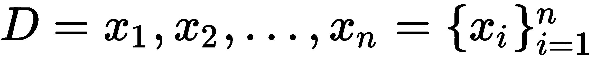

聚类是已知无监督学习算法类别的一个例子，其目标是将数据点分割成组，其中特定组中的所有数据点共享相似的特征或属性。然而，由于聚类的性质，建议在大型数据集上训练聚类模型以避免过拟合。最常用的两种聚类算法是**层次聚类**和**k-means 聚类**，它们通过构建簇的过程彼此区分。我们将在本章中研究这两种算法。

# 欧几里得距离

根据定义，为了将数据点聚类成组，我们需要了解两个给定数据点之间的*距离*。距离的一个常见度量是**欧几里得距离**，它简单地表示在*k*-维空间中两个给定点之间的直线距离，其中*k*是独立变量或特征的个数。形式上，两个点*p*和*q*之间的欧几里得距离，给定*k*个独立变量或维度，定义为以下：

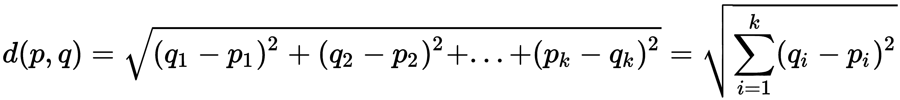

其他常见的距离度量包括**曼哈顿距离**，它是绝对值的和而不是平方（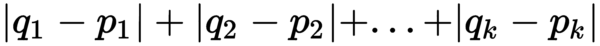）和**最大坐标距离**，其中只考虑那些偏离最大的数据点。在本章的剩余部分，我们将测量欧几里得距离。现在，我们已经了解了距离，我们可以定义两个簇之间的以下度量，如图*图 5.1*所示：

+   簇之间的*最小距离*是彼此最近的两个点之间的距离。

+   簇之间的*最大距离*是彼此距离最远的两个点之间的距离。

+   簇之间的*质心距离*是每个簇质心之间的距离，其中质心定义为给定簇中所有数据点的平均值：

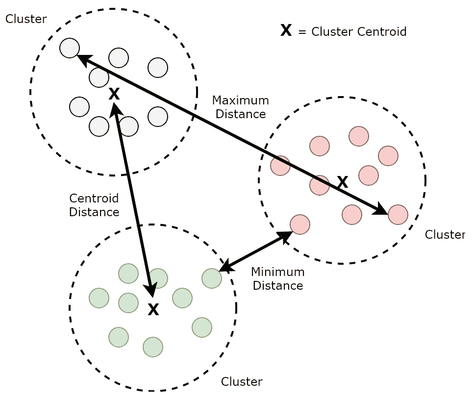

图 5.1：簇距离度量

# 层次聚类

在层次聚类中，每个数据点最初都位于其自己定义的簇中——例如，如果您的数据集中有 10 个数据点，那么最初将有 10 个簇。然后，根据欧几里得重心距离定义的*最近*的两个簇将被合并。然后，对所有不同的簇重复此过程，直到最终所有数据点都属于同一个簇。

可以使用树状图来可视化此过程，如图*图 5.2*所示：

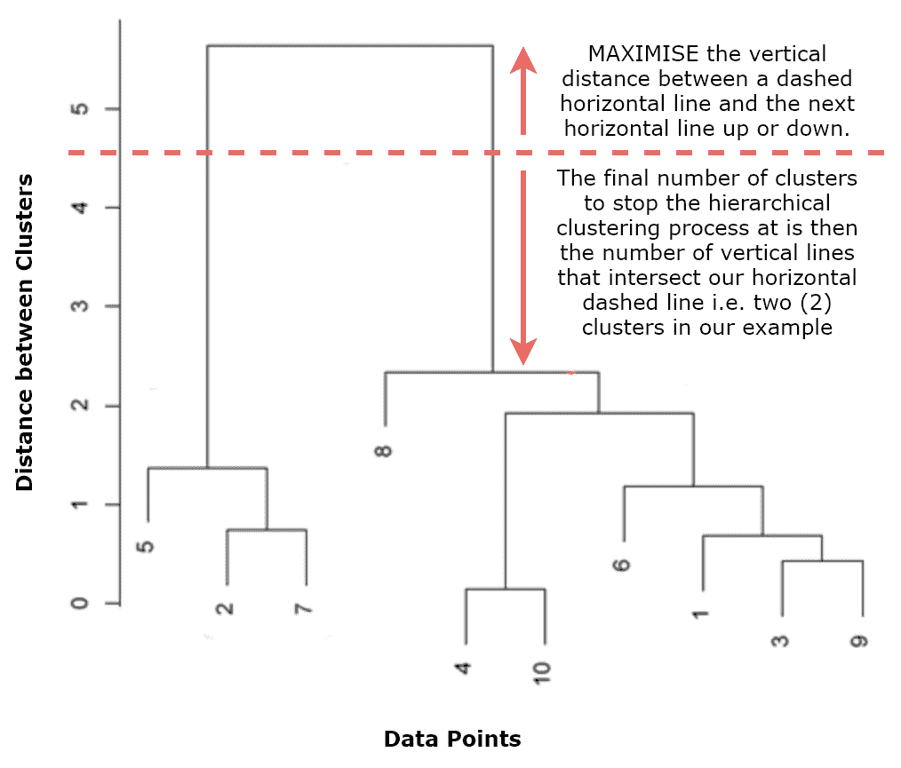

图 5.2：层次聚类树状图

树状图帮助我们决定何时停止层次聚类过程。它是通过在*x*轴上绘制原始数据点以及在*y*轴上绘制簇之间的距离来生成的。随着新的父簇通过合并最近的簇而创建，在这些子簇之间绘制一条水平线。最终，当所有数据点都属于同一个簇时，树状图结束。树状图的目标是告诉我们何时停止层次聚类过程。我们可以通过在树状图上画一条虚线，放置在最大化虚线与下一水平线（向上或向下）之间垂直距离的位置来推断这一点。然后，停止层次聚类过程的最终簇数就是虚线与垂直线相交的数量。在*图 5.2*中，我们将得到包含数据点{5, 2, 7}和{8, 4, 10, 6, 1, 3, 9}的两个簇。然而，请确保最终簇数在您的用例上下文中是有意义的。

# K-均值聚类

在 k-均值聚类中，遵循不同的过程将数据点分割成簇。首先，必须根据用例上下文预先定义最终簇数*k*。一旦定义，每个数据点将被随机分配到这些*k*个簇中的一个，之后采用以下过程：

+   计算每个簇的重心

+   然后将数据点重新分配到与它们最近的簇中

+   然后重新计算所有簇的重心

+   然后将数据点再次重新分配

此过程重复进行，直到无法再重新分配数据点——也就是说，直到没有进一步的改进空间，并且所有数据点都属于一个与它们最近的簇。因此，由于簇的重心定义为给定簇中所有数据点的平均平均值，k-均值聚类实际上将数据点划分为*k*个簇，每个数据点分配到与其平均平均值最接近的簇中。

注意，在两种聚类过程（层次聚类和 k-means）中，都需要计算距离度量。然而，距离度量根据涉及的独立变量的类型和单位而有所不同——例如，身高和体重。因此，在训练聚类模型之前，首先对数据进行归一化（有时称为特征缩放）是很重要的，以确保其正常工作。要了解更多关于归一化的信息，请访问[`en.wikipedia.org/wiki/Feature_scaling`](https://en.wikipedia.org/wiki/Feature_scaling)。

# 案例研究——检测脑肿瘤

让我们将 k-means 聚类应用于一个非常重要的实际应用案例：从**磁共振成像**（**MRI**）扫描中检测脑肿瘤。MRI 扫描在全球范围内用于生成人体详细图像，可用于广泛的医疗应用，从检测癌细胞到测量血流。在本案例研究中，我们将使用健康人脑的灰度 MRI 扫描作为 k-means 聚类模型的输入。然后，我们将应用训练好的 k-means 聚类模型到另一人脑的 MRI 扫描中，以查看我们是否可以检测到可疑的生长物和肿瘤。

注意，在本案例研究中我们将使用的图像相对简单，因为任何存在的可疑生长物都可通过肉眼看到。本案例研究的基本目的是展示如何使用 Python 来操作图像，以及如何通过其 k-means 估计器原生地使用`MLlib`训练 k-means 聚类模型。

# 图像特征向量

我们面临的第一挑战是将图像转换为数值特征向量，以便训练我们的 k-means 聚类模型。在我们的案例中，我们将使用灰度 MRI 扫描。一般来说，灰度图像可以被视为像素强度值（介于 0（黑色）和 1（白色）之间）的矩阵，如图*图 5.3*所示：

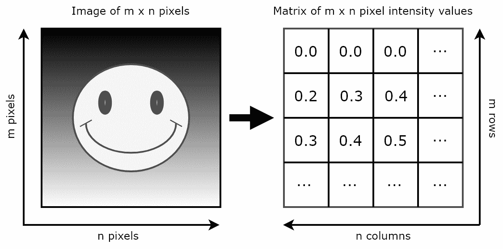

图 5.3：灰度图像映射到像素强度值矩阵

结果矩阵的维度等于原始图像的像素高度（*m*）和宽度（*n*）。因此，进入我们 k-means 聚类模型的将是关于一个独立变量——像素强度值的（*m* x *n*）个观察值。这可以随后表示为一个包含（*m* x *n*）个数值元素的单一向量——即（0.0，0.0，0.0，0.2，0.3，0.4，0.3，0.4，0.5……）。

# 图像分割

现在我们已经从我们的灰度 MRI 图像中导出了特征向量，当我们在健康人脑的 MRI 扫描上训练我们的 k-means 聚类模型时，它将把每个像素强度值分配给*k*个聚类中的一个。在现实世界的背景下，这些*k*个聚类代表了大脑中的不同物质，如灰质、白质、脂肪组织和脑脊液，我们的模型将根据颜色将它们分割，这个过程称为图像分割。一旦我们在健康人脑上训练了我们的 k-means 聚类模型并识别了*k*个不同的聚类，我们就可以将这些定义好的聚类应用于其他患者的 MRI 脑扫描，以尝试识别可疑生长物的存在和体积。

# K-means 成本函数

使用 k-means 聚类算法时面临的挑战之一是如何提前选择一个合适的*k*值，尤其是如果它不明显地来自所讨论用例的更广泛背景。帮助我们的一种方法是，在*x*轴上绘制一系列可能的*k*值，与*y*轴上 k-means 成本函数的输出相对应。k-means 成本函数计算每个点到其对应聚类质心的平方距离的总和。目标是选择一个合适的*k*值，以最小化成本函数，但不要太大，以免增加生成聚类时的计算复杂性，而成本降低的回报却很小。当我们在下一小节开发用于图像分割的 Spark 应用程序时，我们将展示如何生成此图，从而选择一个合适的*k*值。

# Apache Spark 中的 K-means 聚类

我们将用于我们的 k-means 聚类模型的 MRI 脑部扫描已从**癌症影像档案库**（**TCIA**）下载，这是一个匿名化和托管大量癌症医学图像档案以供公共下载的服务，您可以在[`www.cancerimagingarchive.net/`](http://www.cancerimagingarchive.net/)找到。

我们健康人脑的 MRI 扫描可以在伴随本书的 GitHub 仓库中找到，称为`mri-images-data`/`mri-healthy-brain.png`。测试人脑的 MRI 扫描称为`mri-images-data`/`mri-test-brain.png`。在以下 Spark 应用程序中，当我们在健康人脑的 MRI 扫描上训练 k-means 聚类模型并将其应用于图像分割时，我们将使用这两个。让我们开始：

以下小节将描述对应于本用例的 Jupyter 笔记本中相关的每个单元格，该笔记本称为`chp05-01-kmeans-clustering.ipynb`。它可以在伴随本书的 GitHub 仓库中找到。

1.  让我们打开健康人脑的灰度 MRI 扫描并查看它！我们可以使用 Python 的`scikit-learn`机器学习库来实现这一点：

```py
mri_healthy_brain_image = io.imread(
   'chapter05/data/mri-images-data/mri-healthy-brain.png')
mri_healthy_brain_image_plot = plt.imshow(
   mri_healthy_brain_image, cmap='gray')

```

渲染的图像如图 5.4 所示：


图 5.4：使用 scikit-learn 和 matplotlib 渲染的原始 MRI 扫描

1.  我们现在需要将这个图像转换为一个介于 0 和 1 之间的十进制点像素强度值的矩阵。方便的是，这个函数由`scikit-learn`提供的`img_as_float`方法直接提供，如下面的代码所示。结果矩阵的维度是 256 x 256，这意味着原始图像是 256 x 256 像素：

```py
mri_healthy_brain_matrix = img_as_float(mri_healthy_brain_image)
```

1.  接下来，我们需要将这个矩阵展平成一个 256 x 256 元素的单一向量，其中每个元素代表一个像素强度值。这可以被视为一个维度为 1 x (256 x 256) = 1 x 65536 的另一个矩阵。我们可以使用`numpy` Python 库来实现这一点。首先，我们将原始的 256 x 256 矩阵转换为二维`numpy`数组。然后，我们使用`numpy`的`ravel()`方法将这个二维数组展平成一维数组。最后，我们使用`np.matrix`命令将这个一维数组表示为一个维度为 1 x 65536 的特殊数组或矩阵，如下所示：

```py
mri_healthy_brain_2d_array = np.array(mri_healthy_brain_matrix)
   .astype(float)
mri_healthy_brain_1d_array = mri_healthy_brain_2d_array.ravel()
mri_healthy_brain_vector = np.matrix(mri_healthy_brain_1d_array)
```

1.  现在我们已经得到了单个向量，表示为 1 x 65536 维度的矩阵，我们需要将其转换为 Spark 数据框。为了实现这一点，我们首先使用 numpy 的`reshape()`方法转置矩阵，使其变为 65536 x 1。然后，我们使用 Spark 的 SQLContext 公开的`createDataFrame()`方法创建一个包含 65536 个观测值/行和 1 列的 Spark 数据框，代表 65536 个像素强度值，如下面的代码所示：

```py
mri_healthy_brain_vector_transposed = mri_healthy_brain_vector
   .reshape(mri_healthy_brain_vector.shape[1], 
   mri_healthy_brain_vector.shape[0])
mri_healthy_brain_df = sqlContext.createDataFrame(
   pd.DataFrame(mri_healthy_brain_vector_transposed,
   columns = ['pixel_intensity']))
```

1.  我们现在可以使用`VectorAssembler`生成`MLlib`特征向量，这是一个我们之前见过的方法。`VectorAssembler`的`feature_columns`将简单地是我们 Spark 数据框中唯一的像素强度列。通过`transform()`方法将`VectorAssembler`应用于我们的 Spark 数据框的输出将是一个新的 Spark 数据框，称为`mri_healthy_brain_features_df`，包含我们的 65536 个`MLlib`特征向量，如下所示：

```py
feature_columns = ['pixel_intensity']
vector_assembler = VectorAssembler(inputCols = feature_columns,
   outputCol = 'features')
mri_healthy_brain_features_df = vector_assembler
   .transform(mri_healthy_brain_df).select('features')
```

1.  我们现在可以计算并绘制 k-means 成本函数的输出，以确定此用例的最佳*k*值。我们通过在 Spark 数据框中使用`MLlib`的`KMeans()`估计器，遍历`range(2, 20)`中的*k*值来实现这一点。然后，我们可以使用`matplotlib` Python 库来绘制这个图表，如下面的代码所示：

```py
cost = np.zeros(20)
for k in range(2, 20):
    kmeans = KMeans().setK(k).setSeed(1).setFeaturesCol("features")
    model = kmeans.fit(mri_healthy_brain_features_df
       .sample(False, 0.1, seed=12345))
    cost[k] = model.computeCost(mri_healthy_brain_features_df)

fig, ax = plt.subplots(1, 1, figsize =(8, 6))
ax.plot(range(2, 20),cost[2:20])
ax.set_title('Optimal Number of Clusters K based on the
   K-Means Cost Function for a range of K')
ax.set_xlabel('Number of Clusters K')
ax.set_ylabel('K-Means Cost')
```

根据结果图，如图*图 5.5*所示，*k*的值为 5 或 6 似乎是最理想的。在这些值下，k-means 成本最小化，之后获得的回报很少，如下面的图表所示：

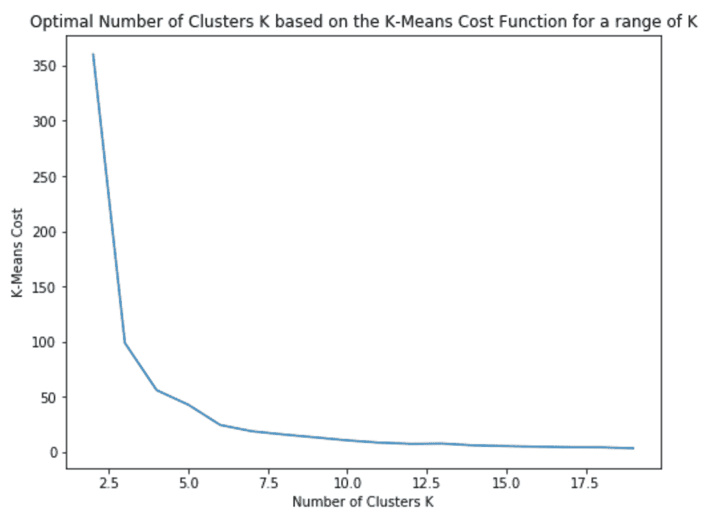

图 5.5：K-means 成本函数

1.  我们现在准备训练我们的 k-means 聚类模型！再次，我们将使用`MLlib`的`KMeans()`估计器，但这次我们将使用定义的*k*值（在我们的例子中是 5，因为我们已在第 6 步中决定）。然后，我们将通过`fit()`方法将其应用于包含我们的特征向量的 Spark 数据框，并研究我们 5 个结果簇的质心值，如下所示：

```py
k = 5
kmeans = KMeans().setK(k).setSeed(12345).setFeaturesCol("features")
kmeans_model = kmeans.fit(mri_healthy_brain_features_df)
kmeans_centers = kmeans_model.clusterCenters()
print("Healthy MRI Scan - K-Means Cluster Centers: \n")
for center in kmeans_centers:
    print(center)
```

1.  接下来，我们将我们的训练好的 k-means 模型应用于包含我们的特征向量的 Spark 数据框，以便将每个 65536 个像素强度值分配到五个簇中的一个。结果将是一个新的 Spark 数据框，其中包含我们的特征向量映射到预测，在这种情况下，预测是一个介于 0 到 4 之间的值，代表五个簇中的一个。然后，我们将这个新的数据框转换为 256 x 256 矩阵，以便我们可以可视化分割图像，如下所示：

```py
mri_healthy_brain_clusters_df = kmeans_model
   .transform(mri_healthy_brain_features_df)
   .select('features', 'prediction')
mri_healthy_brain_clusters_matrix = mri_healthy_brain_clusters_df
   .select("prediction").toPandas().values
   .reshape(mri_healthy_brain_matrix.shape[0],
      mri_healthy_brain_matrix.shape[1])
plt.imshow(mri_healthy_brain_clusters_matrix)
```

使用`matplotlib`渲染的分割图像结果如图 5.6 所示：

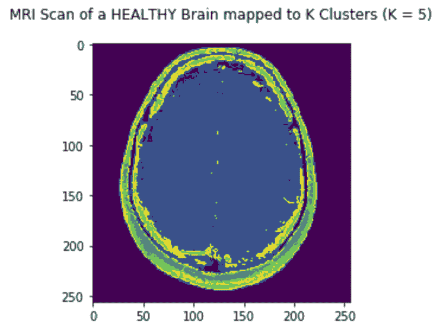

图 5.6：分割 MRI 扫描

1.  现在我们已经定义了五个簇，我们可以将我们的训练好的 k-means 模型应用于一张*新*图像以进行分割，也是基于相同的五个簇。首先，我们使用`scikit-learn`库加载属于测试患者的新灰度 MRI 脑扫描，就像我们之前使用以下代码做的那样：

```py
mri_test_brain_image = io.imread(
   'chapter05/data/mri-images-data/mri-test-brain.png')
```

1.  一旦我们加载了新的 MRI 脑扫描图像，我们需要遵循相同的过程将其转换为包含代表新测试图像像素强度值的特征向量的 Spark 数据框。然后，我们将训练好的 k-means 模型通过`transform()`方法应用于这个测试 Spark 数据框，以便将它的像素分配到五个簇中的一个。最后，我们将包含测试图像预测的 Spark 数据框转换为矩阵，以便我们可以可视化分割后的测试图像，如下所示：

```py
mri_test_brain_df = sqlContext
   .createDataFrame(pd.DataFrame(mri_test_brain_vector_transposed,
   columns = ['pixel_intensity']))
mri_test_brain_features_df = vector_assembler
   .transform(mri_test_brain_df)
   .select('features')
mri_test_brain_clusters_df = kmeans_model
   .transform(mri_test_brain_features_df)
   .select('features', 'prediction')
mri_test_brain_clusters_matrix = mri_test_brain_clusters_df
   .select("prediction").toPandas().values.reshape(
   mri_test_brain_matrix.shape[0], mri_test_brain_matrix.shape[1])
plt.imshow(mri_test_brain_clusters_matrix)
```

使用`matplotlib`再次渲染的属于测试患者的分割图像如图 5.7 所示：

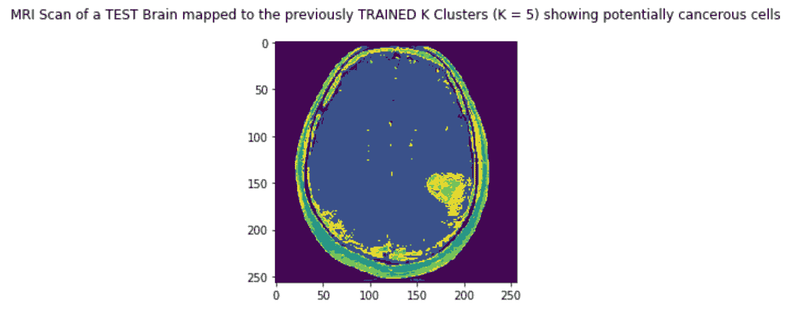

图 5.7：测试患者的分割 MRI 扫描

如果我们将两个分割图像并排比较（如图 5.8 所示），我们将看到，由于我们的 k-means 聚类模型，已经渲染了五种不同的颜色，代表五个不同的簇。反过来，这五个不同的簇代表大脑中的不同物质，通过颜色进行分区。我们还将看到，在测试 MRI 脑扫描中，其中一种颜色相对于健康 MRI 脑扫描占据了一个显著更大的区域，这表明可能是一个需要进一步分析的肿瘤，如图中所示：

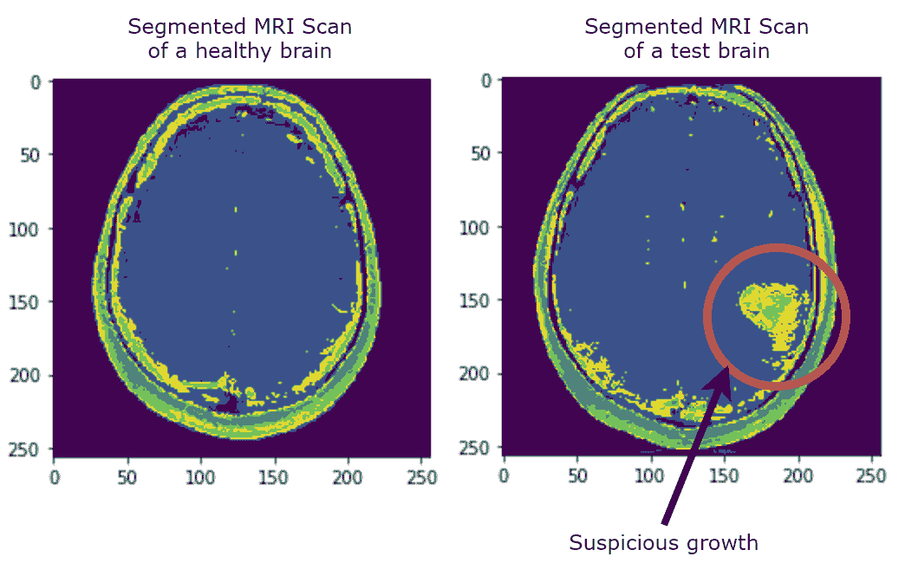

图 5.8：分割 MRI 扫描的比较

# 主成分分析

在许多现实世界的用例中，可用于训练模型的特征数量可能非常大。一个常见的例子是经济数据，使用其构成成分的股票价格数据、就业数据、银行数据、工业数据和住房数据一起预测**国内生产总值**（GDP）。这类数据被称为具有高维性。虽然它们提供了可用于建模的许多特征，但高维数据集增加了机器学习算法的计算复杂性，更重要的是，还可能导致过拟合。过拟合是**维度诅咒**的结果之一，它正式描述了在高度空间（意味着数据可能包含许多属性，通常是数百甚至数千个维度/特征）中分析数据的问题，但在低维空间中，这种分析不再成立。

非正式地说，它描述了以模型性能为代价增加额外维度的价值。**主成分分析**（PCA）是一种**无监督**技术，用于预处理和降低高维数据集的维度，同时保留原始数据集固有的原始结构和关系，以便机器学习模型仍然可以从它们中学习并用于做出准确的预测。

# 案例研究 – 电影推荐系统

为了更好地理解主成分分析（PCA），让我们研究一个电影推荐用例。我们的目标是构建一个系统，该系统能够根据历史用户社区电影评分（请注意，用户观看历史数据也可以用于此类系统，但这超出了本例的范围）为用户提供个性化的电影推荐。

我们将用于案例研究的用户社区电影评分历史数据已从明尼苏达大学的 GroupLens 研究实验室下载，该实验室收集电影评分并将其公开发布在[`grouplens.org/datasets/movielens/`](https://grouplens.org/datasets/movielens/)。为了本案例研究的目的，我们将单个*电影*和*评分*数据集转换为一个单一的交叉表，其中 300 行代表 300 个不同的用户，而 3000 列代表 3000 部不同的电影。这个转换后的、管道分隔的数据集可以在本书附带的 GitHub 仓库中找到，并称为`movie-ratings-data/user-movie-ratings.csv`。

我们将要研究的用户社区电影评分历史数据样本如下：

|  | **电影 #1**Toy Story | **电影 #2**Monsters Inc. | **电影 #3**Saw | **电影 #4**Ring | **电影 #5**Hitch |
| --- | --- | --- | --- | --- | --- |
| **用户 #1** | 4 | 5 | 1 | NULL | 4 |
| **用户 #2** | 5 | NULL | 1 | 1 | NULL |
| **用户 #3** | 5 | 4 | 3 | NULL | 3 |
| **用户 #4** | 5 | 4 | 1 | 1 | NULL |
| **用户 #5** | 5 | 5 | NULL | NULL | 3 |

在这种情况下，每部电影是一个不同的特征（或维度），每个不同的用户是一个不同的实例（或观察）。因此，这个样本表代表了一个包含 5 个特征的数据库。然而，我们的实际数据集包含 3,000 部电影的不同，因此有 3,000 个特征/维度。此外，在现实生活中的表示中，并非所有用户都会对所有电影进行评分，因此将会有大量的缺失值。这样的数据集，以及用来表示它的矩阵，被称为**稀疏的**。这些问题会给机器学习算法带来问题，无论是在计算复杂性还是在过拟合的可能性方面。

为了解决这个问题，仔细观察之前的样本表。似乎评分很高的用户（对电影#1 评分很高的是《玩具总动员》）通常也对电影#2（《怪物公司》）给出了很高的评分。例如，我们可以说，用户#1 是所有电脑动画儿童电影爱好者的**代表**，因此我们可以向用户#2 推荐用户#1 历史上评分很高的其他电影（这种使用其他用户数据的推荐系统称为**协同过滤**）。从高层次来看，这就是 PCA 所做的——它在高维数据集中识别**典型表示**，称为**主成分**，以便在保留其潜在结构和在**低维**中仍然具有代表性的同时，减少原始数据集的维度！然后，这些减少的数据集可以被输入到机器学习模型中进行预测，就像正常一样，而不必担心减少原始数据集的原始大小所带来的任何不利影响。因此，我们可以将 PCA 的正式定义现在扩展，以便我们可以将 PCA 定义为识别一个低维线性子空间，其中原始数据集的最大方差得到保持。

回到我们历史用户社区电影评分数据集，我们不是完全消除电影#2，而是试图创建一个新特征，该特征以某种方式结合了电影#1 和电影#2。扩展这个概念，我们可以创建新的特征，其中每个新特征都是基于所有旧特征，然后根据这些新特征在预测用户电影评分方面的帮助程度对这些新特征进行排序。一旦排序，我们可以删除最不重要的那些，从而实现降维。那么 PCA 是如何实现这一点的呢？它是通过以下步骤实现的：

1.  首先，我们对原始高维数据集进行标准化。

1.  接下来，我们取标准化的数据并计算一个协方差矩阵，该矩阵提供了一种衡量所有特征之间相互关系的方法。

1.  在计算协方差矩阵之后，我们然后找到其**特征向量**和相应的**特征值**。特征向量代表主成分，提供了一种理解数据方向的方法。相应的特征值代表在该方向上数据中有多少方差。

1.  然后将特征向量根据其对应的特征值降序排列，之后选择前*k*个特征向量，代表数据中找到的最重要表示。

1.  然后使用这些*k*个特征向量构建一个新的矩阵，从而将原始的*n*维数据集减少到减少的*k*维。

# 协方差矩阵

在数学中，**方差**是指数据集分散程度的度量，它是每个数据点，*x[i]*，与均值*x-bar*的平方距离之和除以数据点的总数，*N*。这可以用以下公式表示：

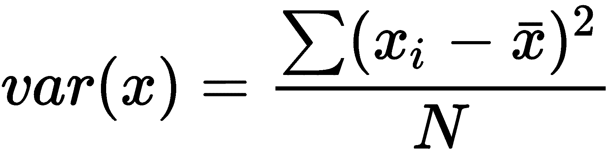

**协方差**是指两个或多个随机变量（在我们的情况下，是独立变量）之间相关性强弱的度量，它是通过*i*维度的变量*x*和*y*计算的，如下所示：

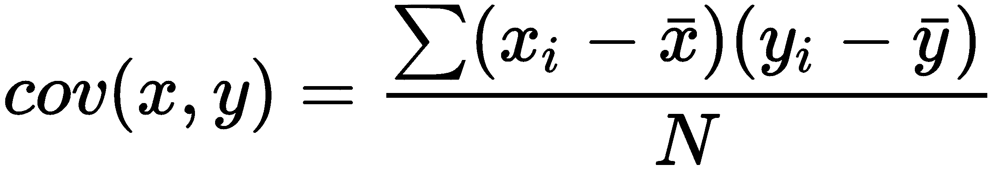

如果协方差是正的，这表明独立变量之间是正相关。如果协方差是负的，这表明独立变量之间是负相关。最后，协方差为零意味着独立变量之间没有相关性。您可能会注意到，我们在第四章，*使用 Apache Spark 进行监督学习*中讨论多元线性回归时描述了相关性。当时，我们计算了因变量与其所有独立变量之间的单向协方差映射。现在我们正在计算所有变量之间的协方差。

**协方差矩阵**是一个对称的方阵，其中一般元素(*i*, *j*)是独立变量*i*和*j*之间的协方差，cov(i, j)（这与*j*和*i*之间的对称协方差相同）。请注意，协方差矩阵中的对角线实际上代表的是那些元素之间的*方差*，根据定义。

协方差矩阵如下表所示：

|  | **x** | **y** | **z** |
| --- | --- | --- | --- |
| **x** | var(x) | cov(x, y) | cov(x, z) |
| **y** | cov(y, x) | var(y) | cov(y, z) |
| **z** | cov(z, x) | cov(z, y) | var(z) |

# 单位矩阵

单位矩阵是一个主对角线上的所有元素都是 1，其余元素都是 0 的方阵。单位矩阵在我们需要找到矩阵的所有特征向量时非常重要。例如，一个 3x3 的单位矩阵如下所示：

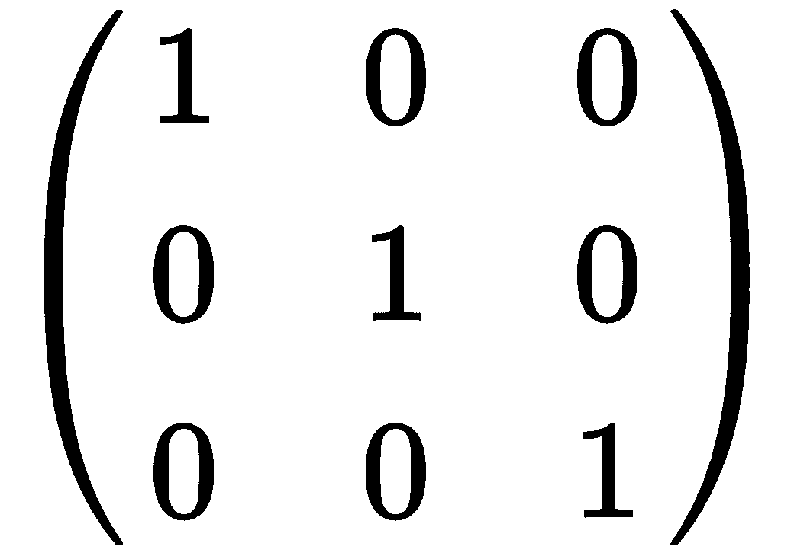

# 特征向量和特征值

在线性代数中，特征向量是一组特殊的向量，当对其进行线性变换时，其*方向*保持不变，仅通过一个*标量*因子改变。在降维的背景下，特征向量代表主成分，并提供了一种理解数据方向的方法。

考虑一个维度为(*m* x *n*)的矩阵*A*。我们可以将*A*乘以一个向量*x*（根据定义，其维度为*n* x 1），这将产生一个新的向量*b*（维度为*m* x 1），如下所示：

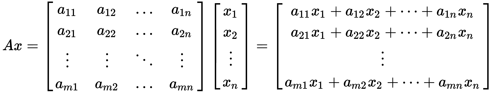

换句话说，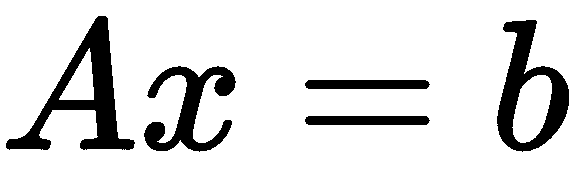。

然而，在某些情况下，得到的向量，*b*，实际上是原始向量，*x*的缩放版本。我们称这个标量因子为*λ*，在这种情况下，上述公式可以重写如下：

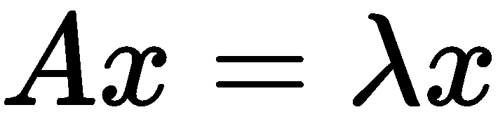

我们说*λ*是矩阵*A*的*特征值*，*x*是与*λ*相关的*特征向量*。在降维的上下文中，特征值表示数据在该方向上的方差有多大。

为了找到一个矩阵的所有特征向量，我们需要为每个特征值解以下方程，其中*I*是与矩阵*A*相同维度的单位矩阵：

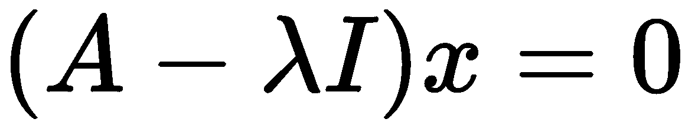

解决这个方程的过程超出了本书的范围。然而，要了解更多关于特征向量和特征值的信息，请访问[`en.wikipedia.org/wiki/Eigenvalues_and_eigenvectors`](https://en.wikipedia.org/wiki/Eigenvalues_and_eigenvectors)。

一旦找到了协方差矩阵的所有特征向量，这些向量将根据它们对应的特征值按降序排序。由于特征值表示数据在该方向上的方差量，排序列表中的第一个特征向量代表了从原始数据集中捕获原始变量最大方差的第一个主成分，依此类推。例如，如图*图 5.9*所示，如果我们绘制一个具有两个维度或特征的数据集，第一个特征向量（将按重要性顺序成为第一个主成分）将代表两个特征之间最大变化的方向。

第二个特征向量（按重要性顺序的第二主成分）将代表两个特征之间第二大的变化方向：

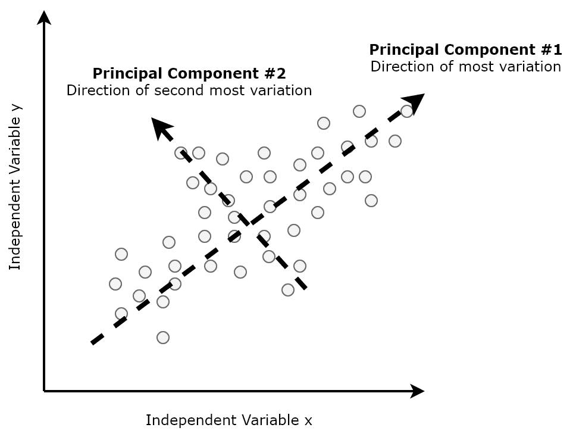

图 5.9：两个维度上的主成分

为了帮助选择主成分的数量，*k*，从特征向量排序列表的顶部选择，我们可以在*x*轴上绘制主成分的数量，与*y*轴上的累积解释方差进行对比，如图*图 5.10*所示，其中解释方差是那个主成分的方差与总方差（即所有特征值的和）的比率：

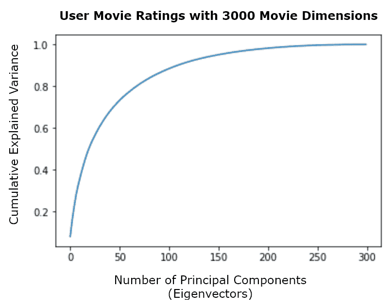

图 5.10：累积解释方差

以*图 5.10*为例，我们会选择大约前 300 个主成分，因为这些描述了数据中的最大变化，总共有 3,000 个。最后，我们通过将原始数据集投影到由选定的特征向量表示的*k*-维空间中，从而构建一个新的矩阵，从而将原始数据集的维度从 3,000 维降低到 300 维。这个预处理和降维后的数据集可以用来训练机器学习模型，就像平常一样。

# Apache Spark 中的 PCA

现在，让我们回到我们的转换后的管道分隔的用户社区电影评分数据集，`movie-ratings-data/user-movie-ratings.csv`，它包含 300 个用户对 3,000 部电影的评价。我们将在 Apache Spark 中开发一个应用程序，旨在使用 PCA（主成分分析）来降低该数据集的维度，同时保留其结构。为此，我们将执行以下步骤：

下面的子节描述了对应于这个用例的 Jupyter 笔记本中相关的每个单元格，该笔记本称为`chp05-02-principal-component-analysis.ipynb`。这个笔记本可以在伴随这本书的 GitHub 仓库中找到。

1.  首先，让我们使用以下代码将转换后的管道分隔的用户社区电影评分数据集加载到 Spark 数据框中。生成的 Spark 数据框将包含 300 行（代表 300 个不同的用户）和 3,001 列（代表 3,000 部电影加上用户 ID 列）：

```py
user_movie_ratings_df = sqlContext.read
   .format('com.databricks.spark.csv').options(header = 'true', 
   inferschema = 'true', delimiter = '|')
   .load('<Path to CSV File>')
print((user_movie_ratings_df.count(),
   len(user_movie_ratings_df.columns)))
```

1.  我们现在可以使用`MLlib`的`VectorAssembler`生成包含 3,000 个元素（代表 3,000 个特征）的`MLlib`特征向量，就像我们之前看到的那样。我们可以使用以下代码实现这一点：

```py
feature_columns = user_movie_ratings_df.columns
feature_columns.remove('userId')
vector_assembler = VectorAssembler(inputCols = feature_columns,
   outputCol = 'features')
user_movie_ratings_features_df = vector_assembler
   .transform(user_movie_ratings_df)
   .select(['userId', 'features']) 
```

1.  在我们能够使用 PCA 降低数据集的维度之前，我们首先需要标准化我们之前描述的特征。这可以通过使用`MLlib`的`StandardScaler`估计器并拟合包含我们的特征向量的 Spark 数据框来实现，如下所示：

```py
standardizer = StandardScaler(withMean=True, withStd=True,
   inputCol='features', outputCol='std_features')
standardizer_model = standardizer
   .fit(user_movie_ratings_features_df)
user_movie_ratings_standardized_features_df =
   standardizer_model.transform(user_movie_ratings_features_df) 
```

1.  接下来，我们将我们的缩放特征转换为`MLlib` `RowMatrix`实例。`RowMatrix`是一个没有索引的分布式矩阵，其中每一行都是一个向量。我们通过将我们的缩放特征数据帧转换为 RDD，并将 RDD 的每一行映射到相应的缩放特征向量来实现这一点。然后，我们将这个 RDD 传递给`MLlib`的`RowMatrix()`（如下面的代码所示），从而得到一个 300 x 3,000 维度的标准化特征向量矩阵：

```py
scaled_features_rows_rdd = 
   user_movie_ratings_standardized_features_df
   .select("std_features").rdd
scaled_features_matrix = RowMatrix(scaled_features_rows_rdd
   .map(lambda x: x[0].tolist()))
```

1.  现在我们已经将标准化数据以矩阵形式表示，我们可以通过调用`MLlib`的`RowMatrix`公开的`computePrincipalComponents()`方法轻松地计算前*k*个主成分。我们可以如下计算前 300 个主成分：

```py
number_principal_components = 300
principal_components = scaled_features_matrix
   .computePrincipalComponents(number_principal_components)
```

1.  既然我们已经确定了前 300 个主成分，我们就可以将标准化后的用户社区电影评分数据从 3000 维投影到仅 300 维的线性子空间，同时保留原始数据集的最大方差。这是通过使用矩阵乘法，并将包含标准化数据的矩阵与包含前 300 个主成分的矩阵相乘来实现的，如下所示：

```py
projected_matrix = scaled_features_matrix
   .multiply(principal_components)
print((projected_matrix.numRows(), projected_matrix.numCols()))
```

结果矩阵现在具有 300 x 300 的维度，证实了从原始的 3000 维到仅 300 维的降维！现在我们可以像平常一样使用这个投影矩阵及其 PCA 特征向量作为后续机器学习模型的输入。

1.  或者，我们可以直接在包含我们的标准化特征向量的数据框上使用`MLlib`的`PCA()`估计器，以生成一个新的数据框，其中包含一个新的列，包含 PCA 特征向量，如下所示：

```py
pca = PCA(k=number_principal_components, inputCol="std_features",
   outputCol="pca_features")
pca_model = pca.fit(user_movie_ratings_standardized_features_df)
user_movie_ratings_pca_df = pca_model
   .transform(user_movie_ratings_standardized_features_df) 
```

再次，这个新的数据框及其 PCA 特征向量可以像平常一样用于训练后续的机器学习模型。

1.  最后，我们可以通过访问其`explainedVariance`属性来从我们的 PCA 模型中提取每个主成分的解释方差，如下所示：

```py
pca_model.explainedVariance
```

结果向量（300 个元素）显示，在我们的例子中，主成分有序列表中的第一个特征向量（因此是第一个主成分）解释了 8.2%的方差，第二个解释了 4%，依此类推。

在这个案例研究中，我们展示了如何使用 PCA 将用户社区电影评分数据集的维度从 3000 维降低到仅 300 维，同时保留其结构。然后，可以像平常一样使用这个降低维度的数据集来训练机器学习模型，例如用于协同过滤的层次聚类模型。

# 摘要

在本章中，我们使用 Apache Spark 和多种现实世界的用例训练和评估了各种无监督机器学习模型和技术，包括使用图像分割将人类大脑中发现的多种物质进行分区，以及通过降低高维用户社区电影评分数据集的维度来帮助开发电影推荐系统。

在下一章中，我们将开发、测试和评估一些在**自然语言处理**（**NLP**）中常用的算法，试图训练机器自动分析和理解人类文本和语音！
