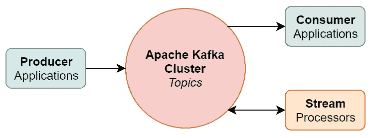
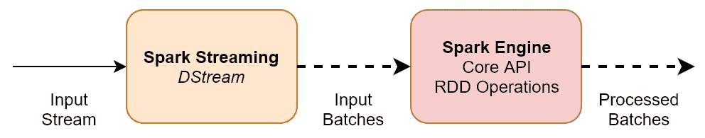
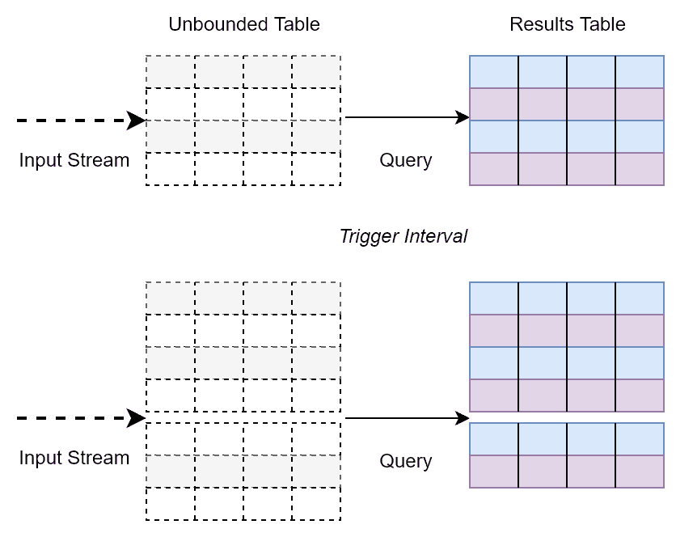
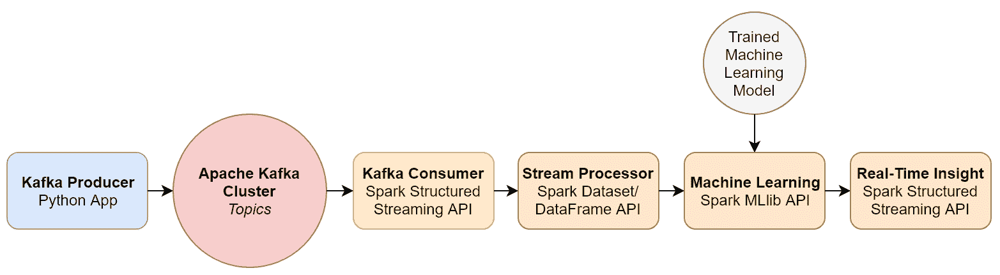
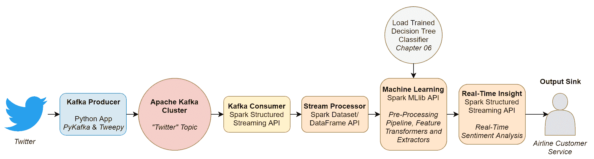

# 第八章：使用 Apache Spark 进行实时机器学习

在本章中，我们将扩展我们的机器学习模型部署，使其超越批量处理，以便从数据中学习、做出预测和实时识别趋势！我们将开发并部署一个由以下高级技术组成的实时流处理和机器学习应用程序：

+   Apache Kafka 生产者应用程序

+   Apache Kafka 消费者应用程序

+   Apache Spark 的 Structured Streaming 引擎

+   Apache Spark 的机器学习库，`MLlib`

# 分布式流平台

到目前为止，在这本书中，我们一直在执行批量处理——也就是说，我们被提供了有界原始数据文件，并将这些数据作为一个组进行处理。正如我们在第一章，“大数据生态系统”中看到的，流处理与批量处理的不同之处在于数据是按需或单个数据单元（或流）到达时处理的。我们还在第一章，“大数据生态系统”中看到，**Apache Kafka**作为一个分布式*流平台，通过以下组件的逻辑流架构，以容错和可靠的方式在系统和应用程序之间移动实时数据：

+   **生产者**：生成并发送消息的应用程序

+   **消费者**：订阅并消费消息的应用程序

+   **主题**：属于特定类别并存储为有序且不可变记录序列的记录流，这些记录在分布式集群中分区和复制

+   **流处理器**：以特定方式处理消息的应用程序，例如数据转换和机器学习模型

该逻辑流架构的简化示意图如图*8.1*所示：



图 8.1：Apache Kafka 逻辑流架构

# 分布式流处理引擎

Apache Kafka 使我们能够在系统和应用程序之间可靠地移动实时数据。但是，我们仍然需要一个某种处理引擎来处理和转换这些实时数据，以便根据特定用例从中提取价值。幸运的是，有多个*流处理引擎*可供我们使用，包括但不限于以下：

+   **Apache Spark**：[`spark.apache.org/`](https://spark.apache.org/)

+   **Apache Storm**：[`storm.apache.org/`](http://storm.apache.org/)

+   **Apache Flink**：[`flink.apache.org/`](https://flink.apache.org/)

+   **Apache Samza**：[`samza.apache.org/`](http://samza.apache.org/)

+   **Apache Kafka（通过其 Streams API）**：[`kafka.apache.org/documentation/`](https://kafka.apache.org/documentation/)

+   **KSQL**：[`www.confluent.io/product/ksql/`](https://www.confluent.io/product/ksql/)

尽管对可用的流处理引擎进行详细比较超出了本书的范围，但鼓励读者探索前面的链接并研究可用的不同架构。为了本章的目的，我们将使用 Apache Spark 的 Structured Streaming 引擎作为我们选择的流处理引擎。

# 使用 Apache Spark 进行流式传输

在撰写本文时，Spark 中提供了两个流处理 API：

+   **Spark Streaming (DStreams):** [`spark.apache.org/docs/latest/streaming-programming-guide.html`](https://spark.apache.org/docs/latest/streaming-programming-guide.html)

+   **Structured Streaming:** [`spark.apache.org/docs/latest/structured-streaming-programming-guide.html`](https://spark.apache.org/docs/latest/structured-streaming-programming-guide.html)

# Spark Streaming (DStreams)

*Spark Streaming (DStreams)* 扩展了核心 Spark API，通过将实时数据流划分为 *输入批次*，然后由 Spark 的核心 API 处理，从而生成最终的 *处理批次* 流，如图 8.2 所示。一系列 RDD 构成了所谓的 *离散流*（或 DStream），它代表了数据的连续流：



图 8.2：Spark Streaming (DStreams)

# Structured Streaming

另一方面，*Structured Streaming* 是一个基于 Spark SQL 引擎构建的较新的且高度优化的流处理引擎，其中可以使用 Spark 的 Dataset/DataFrame API 存储和处理流数据（参见第一章，*大数据生态系统*）。截至 Spark 2.3，Structured Streaming 提供了使用微批处理和连续处理两种方式处理数据流的能力，微批处理的延迟低至 100 毫秒，连续处理的延迟低至 1 毫秒（从而提供真正的实时处理）。Structured Streaming 通过将数据流建模为一个不断追加的无界表来工作。当对这个无界表执行转换或其他类型的查询时，将生成一个结果表，该表代表了那个时刻的数据。

在可配置的触发间隔之后，数据流中的新数据被建模为追加到这个无界表的新行，随后结果表被更新，如图 *8.3* 所示：



图 8.3：Spark Structured Streaming 逻辑模型

由于流数据通过 Dataset/DataFrame API 暴露，因此可以轻松地在实时数据流上执行 SQL-like 操作（包括聚合和连接）和 RDD 操作（包括 map 和过滤）。此外，结构化流提供了针对迟到数据的处理、流查询的管理和监控以及从故障中恢复的能力。因此，结构化流是一种极其灵活、高效且可靠的流数据处理方式，具有极低的延迟，是我们将在本章剩余部分使用的流处理引擎。

通常建议开发者使用这个较新且高度优化的引擎而不是 Spark Streaming（DStreams）。然而，由于这是一个较新的 API，截至 Spark 2.3.2，可能某些功能尚未提供，这意味着在开发新 API 的同时，DStreams RDD-based 方法仍会偶尔使用。

# 流处理管道

在本节中，我们将开发一个端到端流处理管道，它能够从生成连续数据的数据源系统中流式传输数据，然后能够将这些流发布到 Apache Kafka 分布式集群。我们的流处理管道将使用 Apache Spark 从 Apache Kafka 中消费数据，使用其结构化流引擎，并将训练好的机器学习模型应用于这些流，以使用`MLlib`实时提取洞察。我们将开发的端到端流处理管道如图 8.4 所示：



图 8.4：我们的端到端流处理管道

# 案例研究 – 实时情感分析

在本章的案例研究中，我们将扩展我们在第六章，“使用 Apache Spark 进行自然语言处理”中开发的情感分析模型，使其能够在实时环境中运行。在第六章“使用 Apache Spark 进行自然语言处理”中，我们训练了一个决策树分类器，根据关于航空公司的历史推文训练数据集来预测和分类推文的潜在情感。在本章中，我们将应用这个训练好的决策树分类器来处理实时推文，以便预测它们的情感并识别负面推文，以便航空公司能够尽快采取行动。

因此，我们的端到端流处理管道可以扩展，如图 8.5 所示：



图 8.5：我们的端到端流处理管道，用于实时情感分析

我们用于实时情感分析的流处理管道的核心阶段如下：

1.  **Kafka 生产者：** 我们将开发一个 Python 应用程序，使用我们在第二章，“设置本地开发环境”中安装的`pykafka`（一个 Python 的 Apache Kafka 客户端）和`tweepy`（一个用于访问 Twitter API 的 Python 库）库，以捕获实时发布的关于航空公司的推文，并将这些推文发布到名为`twitter`的 Apache Kafka 主题。

1.  **Kafka 消费者：** 然后，我们将开发一个 Spark 应用程序，使用其 Structured Streaming API，订阅并从`twitter`主题消费推文到 Spark 数据框。

1.  **流处理器和** `MLlib`**：** 然后，我们将使用我们在第六章，“使用 Apache Spark 进行自然语言处理”中研究和开发的相同管道中的特征转换器和特征提取器，对存储在此 Spark 数据框中的推文的原始文本内容进行预处理，这些特征转换器和特征提取器包括分词、去除停用词、词干提取和归一化——在应用 HashingTF 转换器生成实时特征向量之前。

1.  **训练好的决策树分类器：** 接下来，我们将加载我们在第六章，“使用 Apache Spark 进行自然语言处理”中训练的决策树分类器，并将其持久化到我们的单个开发节点的本地文件系统。一旦加载，我们将应用这个训练好的决策树分类器到包含我们从实时推文中提取的预处理特征向量的 Spark 数据框，以预测和分类其潜在的情感。

1.  **输出目标：** 最后，我们将把对实时推文应用的情感分析模型的结果输出到目标目的地，称为输出*目标*。在我们的案例中，输出目标将是*控制台*目标，这是 Structured Streaming API 原生提供的内置输出目标之一。通过使用此目标，每次触发时输出都会打印到控制台/**标准输出**（**stdout**）。从此控制台，我们将能够读取原始推文的原始文本内容和来自我们模型的预测情感分类，即负面或非负面。要了解更多关于可用的各种输出目标，请访问[`spark.apache.org/docs/latest/structured-streaming-programming-guide.html#output-sinks`](https://spark.apache.org/docs/latest/structured-streaming-programming-guide.html#output-sinks)。

以下小节将描述我们将遵循的技术步骤来开发、部署和运行我们的端到端流处理管道，以进行实时情感分析。

注意，对于本案例研究的目的，我们不会使用 Jupyter 笔记本进行开发。这是因为需要为单独的组件编写单独的代码文件，如前所述。因此，本案例研究提供了另一个了解如何开发和执行生产级管道的视角。我们不会在笔记本中显式实例化`SparkContext`，而是将通过 Linux 命令行将我们的 Python 代码文件及其所有依赖项提交给`spark-submit`。

# 启动 Zookeeper 和 Kafka 服务器

第一步是确保我们的单节点 Kafka 集群正在运行。如第二章中所述，“设置本地开发环境”，请执行以下命令以启动 Apache Kafka：

```py
> cd {KAFKA_HOME}
> bin/zookeeper-server-start.sh -daemon config/zookeeper.properties
> bin/kafka-server-start.sh -daemon config/server.properties
```

# Kafka 主题

接下来，我们需要创建一个 Kafka 主题，我们的 Python Kafka 生产者应用程序（我们将在稍后开发）将发布有关航空公司的实时推文。在我们的案例中，我们将该主题称为`twitter`。如第二章中所示，“设置本地开发环境”，可以通过以下方式实现：

```py
> bin/kafka-topics.sh --create --zookeeper 192.168.56.10:2181 --replication-factor 1 --partitions 1 --topic twitter
```

# Twitter 开发者账户

为了让我们的 Python Kafka 生产者应用程序实时捕获推文，我们需要访问 Twitter API。截至 2018 年 7 月，除了普通 Twitter 账户外，还必须创建并批准一个 Twitter *开发者账户*，才能访问其 API。为了申请开发者账户，请访问[`apps.twitter.com/`](https://apps.twitter.com/)，点击“申请开发者账户”按钮，并填写所需详细信息。

# Twitter 应用程序和 Twitter API

一旦您创建了 Twitter 开发者账户，为了使用 Twitter API，必须创建一个 Twitter *应用程序*。Twitter 应用程序根据您打算创建的应用程序的具体目的，提供认证和授权访问 Twitter API。为了创建用于我们实时情感分析模型的 Twitter 应用程序，请按照以下说明（截至撰写时有效）进行操作：

1.  导航到[`developer.twitter.com/en/apps`](https://developer.twitter.com/en/apps)。

1.  点击“创建应用程序”按钮。

1.  提供以下必填的应用程序详细信息：

```py
- App Name (max 32 characters) e.g. "Airline Sentiment Analysis"
- Application Description (max 200 characters) e.g. "This App will collect tweets about airlines and apply our previously trained decision tree classifier to predict and classify the underlying sentiment of those tweets in real-time"
- Website URL (for attribution purposes only - if you do not have a personal website, then use the URL to your Twitter page, such as https://twitter.com/PacktPub)
- Tell us how this app will be used (min 100 characters) e.g. "Internal training and development purposes only, including the deployment of machine learning models in real-time. It will not be visible to customers or 3rd parties."
```

1.  点击“创建”按钮创建您的 Twitter 应用程序。

1.  一旦您的 Twitter 应用程序创建完成，导航到“密钥和令牌”选项卡。

1.  分别记下您的消费者 API 密钥和消费者 API 密钥字符串。

1.  然后点击“访问令牌 & 访问令牌密钥”下的“创建”按钮，为您的 Twitter 应用程序生成访问令牌。将访问级别设置为只读，因为此 Twitter 应用程序将只读取推文，不会生成任何自己的内容。

1.  记下生成的 **访问令牌**和访问令牌密钥字符串。

消费者 API 密钥和访问令牌将被用于授权我们的基于 Python 的 Kafka 生产者应用程序以只读方式访问通过 Twitter API 获取的实时推文流，因此您需要将它们记录下来。

# 应用程序配置

现在我们已经准备好开始开发我们的端到端流处理管道！首先，让我们创建一个 Python 配置文件，该文件将存储与我们的管道和本地开发节点相关的所有环境和应用程序级别的选项，如下所示：

以下 Python 配置文件，称为`config.py`，可以在伴随本书的 GitHub 存储库中找到。

```py
#!/usr/bin/python

""" config.py: Environmental and Application Settings """

""" ENVIRONMENT SETTINGS """

# Apache Kafka
bootstrap_servers = '192.168.56.10:9092'
data_encoding = 'utf-8'

""" TWITTER APP SETTINGS """

consumer_api_key = 'Enter your Twitter App Consumer API Key here'
consumer_api_secret = 'Enter your Twitter App Consumer API Secret Key here'
access_token = 'Enter your Twitter App Access Token here'
access_token_secret = 'Enter your Twitter App Access Token Secret here'

""" SENTIMENT ANALYSIS MODEL SETTINGS """

# Name of an existing Kafka Topic to publish tweets to
twitter_kafka_topic_name = 'twitter'

# Keywords, Twitter Handle or Hashtag used to filter the Twitter Stream
twitter_stream_filter = '@British_Airways'

# Filesystem Path to the Trained Decision Tree Classifier
trained_classification_model_path = '..chapter06/models/airline-sentiment-analysis-decision-tree-classifier'
```

此 Python 配置文件定义了以下相关选项：

+   `bootstrap_servers`：Kafka 代理的主机名/IP 地址和端口号配对的逗号分隔列表。在我们的案例中，这是默认情况下位于端口`9092`的单节点开发环境的主机名/IP 地址。

+   `consumer_api_key`：在此处输入与您的 Twitter 应用程序关联的消费者 API 密钥。

+   `consumer_api_secret`：在此处输入与您的 Twitter 应用程序关联的消费者 API 密钥。

+   `access_token`：在此处输入与您的 Twitter 应用程序关联的访问令牌。

+   `access_token_secret`：在此处输入与您的 Twitter 应用程序关联的访问令牌密钥。

+   `twitter_kafka_topic_name`：我们的 Kafka 生产者将发布的 Kafka 主题名称，以及我们的结构化流 Spark 应用程序将从中消费推文的主题。

+   `twitter_stream_filter`：一个关键字、Twitter 用户名或标签，用于过滤从 Twitter API 捕获的实时推文流。在我们的案例中，我们正在过滤针对`@British_Airways`的实时推文。

+   `trained_classification_model_path`：我们保存我们的训练决策树分类器（在第六章中介绍，*使用 Apache Spark 进行自然语言处理*）的绝对路径。

# Kafka Twitter 生产者应用程序

现在我们已经准备好开发我们的基于 Python 的 Kafka 生产者应用程序，该程序将捕获有关航空公司实时推文的推文，并将这些推文发布到我们之前创建的 Apache Kafka `twitter` 主题。在开发我们的 Kafka 生产者时，我们将使用以下两个 Python 库：

+   `tweepy`：这个库允许我们使用 Python 和之前生成的消费者 API 密钥和访问令牌以编程方式访问 Twitter API。

+   `pykafka`：这个库允许我们实例化一个基于 Python 的 Apache Kafka 客户端，通过它可以与我们的单节点 Kafka 集群进行通信和交易。

以下 Python 代码文件，称为`kafka_twitter_producer.py`，可以在伴随本书的 GitHub 存储库中找到。

关于我们的基于 Python 的 Kafka 生产者应用程序，我们执行以下步骤（编号与 Python 代码文件中的编号注释相对应）：

1.  首先，我们分别从 `tweepy` 和 `pykafka` 库中导入所需的模块，如下面的代码所示。我们还导入了我们之前创建的 `config.py` 文件中的配置：

```py
import config
import tweepy
from tweepy import OAuthHandler
from tweepy import Stream
from tweepy.streaming import StreamListener
import pykafka
```

1.  接下来，我们使用 `config.py` 中定义的消费者 API 密钥和访问令牌实例化一个 `tweepy` Twitter API 包装器，如下所示，以提供我们认证和授权的程序访问 Twitter API：

```py
auth = OAuthHandler(config.consumer_api_key, 
   config.consumer_api_secret)
auth.set_access_token(config.access_token, 
   config.access_token_secret)
api = tweepy.API(auth)
```

1.  然后，我们在 Python 中定义了一个名为 `KafkaTwitterProducer` 的类，一旦实例化，它就为我们提供了一个 `pykafka` 客户端到我们的单节点 Apache Kafka 集群，如下面的代码所示。当这个类被实例化时，它最初执行 `__init__` 函数中定义的代码，使用引导服务器创建一个 `pykafka` 客户端，这些服务器的位置可以在 `config.py` 中找到。然后它创建了一个与 `config.py` 中定义的 `twitter_kafka_topic_name` Kafka 主题关联的生产者。当我们的 `pykafka` 生产者捕获数据时，会调用 `on_data` 函数，该函数将数据物理发布到 Kafka 主题。

如果我们的 `pykafka` 生产者遇到错误，则调用 `on_error` 函数，在我们的情况下，它只是将错误打印到控制台并继续处理下一个消息：

```py
class KafkaTwitterProducer(StreamListener):

    def __init__(self):
        self.client = pykafka.KafkaClient(config.bootstrap_servers)
        self.producer = self.client.topics[bytes(
           config.twitter_kafka_topic_name, 
           config.data_encoding)].get_producer()

    def on_data(self, data):
        self.producer.produce(bytes(data, config.data_encoding))
        return True

    def on_error(self, status):
        print(status)
        return True
```

1.  接下来，我们使用 `tweepy` 库的 `Stream` 模块实例化一个 Twitter 流。为此，我们只需将我们的 Twitter 应用程序认证详情和 `KafkaTwitterProducer` 类的实例传递给 `Stream` 模块：

```py
print("Instantiating a Twitter Stream and publishing to the '%s' 
   Kafka Topic..." % config.twitter_kafka_topic_name)
twitter_stream = Stream(auth, KafkaTwitterProducer())
```

1.  现在我们已经实例化了一个 Twitter 流，最后一步是根据 `config.py` 中的 `twitter_stream_filter` 选项过滤流，以传递感兴趣的推文，如下面的代码所示：

```py
print("Filtering the Twitter Stream based on the query '%s'..." % 
   config.twitter_stream_filter)
twitter_stream.filter(track=[config.twitter_stream_filter])
```

我们现在可以运行我们的 Kafka 生产者应用程序了！由于它是一个 Python 应用程序，运行它的最简单方法就是使用 Linux 命令行，导航到包含 `kafka_twitter_producer.py` 的目录，并按以下方式执行：

```py
> python kafka_twitter_producer.py
 $ Instantiating a Twitter Stream and publishing to the 'twitter' 
     Kafka Topic...
 $ Filtering the Twitter Stream based on the query 
     '@British_Airways'...
```

为了验证它实际上正在捕获并将实时推文发布到 Kafka，如第二章所述，*设置本地开发环境*，你可以启动一个命令行消费者应用程序来从 Twitter 主题中消费消息并将它们打印到控制台，如下所示：

```py
> cd {KAFKA_HOME}
> bin/kafka-console-consumer.sh --bootstrap-server 192.168.56.10:9092 --topic twitter
```

希望你能看到实时打印到控制台上的推文。在我们的例子中，这些推文都是指向 `"@British_Airways"` 的。

推文本身是通过 Twitter API 以 JSON 格式捕获的，不仅包含推文的原始文本内容，还包含相关的元数据，如推文 ID、推文者的用户名、时间戳等。有关 JSON 模式的完整描述，请访问 [`developer.twitter.com/en/docs/tweets/data-dictionary/overview/tweet-object.html`](https://developer.twitter.com/en/docs/tweets/data-dictionary/overview/tweet-object.html)。

# 预处理和特征向量化流程

如前所述，为了能够将我们训练好的决策树分类器应用于这些实时推文，我们首先需要像在第六章《使用 Apache Spark 的自然语言处理》中处理我们的训练和测试数据集那样对它们进行预处理和向量化。然而，我们不会在 Kafka 消费者应用程序本身中重复预处理和向量化流程的逻辑，而是将在一个独立的 Python 模块和 Python *函数*中定义我们的流程逻辑。这样，每次我们需要像在第六章《使用 Apache Spark 的自然语言处理》中那样预处理文本时，我们只需调用相关的 Python 函数，从而避免在不同 Python 代码文件中重复相同的代码。

以下名为`model_pipelines.py`的 Python 代码文件，可以在本书配套的 GitHub 仓库中找到。

在以下 Python 模块中，我们定义了两个函数。第一个函数应用了我们在第六章《使用 Apache Spark 的自然语言处理》中学习的`MLlib`和`spark-nlp`特征转换器的相同流程，以预处理推文的原始文本内容。第二个函数随后对预处理后的 Spark 数据框应用`HashingTF`转换器，以根据词频生成特征向量，正如我们在第六章《使用 Apache Spark 的自然语言处理》中所学习的那样。结果是包含原始推文文本的 Spark 数据框，该文本位于名为`text`的列中，以及位于名为`features`的列中的词频特征向量：

```py
#!/usr/bin/python

""" model_pipelines.py: Pre-Processing and Feature Vectorization Spark Pipeline function definitions """

from pyspark.sql.functions import *
from pyspark.ml.feature import Tokenizer
from pyspark.ml.feature import StopWordsRemover
from pyspark.ml.feature import HashingTF
from pyspark.ml import Pipeline, PipelineModel

from sparknlp.base import *
from sparknlp.annotator import Tokenizer as NLPTokenizer
from sparknlp.annotator import Stemmer, Normalizer

def preprocessing_pipeline(raw_corpus_df):

    # Native MLlib Feature Transformers
    filtered_df = raw_corpus_df.filter("text is not null")
    tokenizer = Tokenizer(inputCol = "text", outputCol = "tokens_1")
    tokenized_df = tokenizer.transform(filtered_df)
    remover = StopWordsRemover(inputCol = "tokens_1",
       outputCol = "filtered_tokens")

    preprocessed_part_1_df = remover.transform(tokenized_df)
    preprocessed_part_1_df = preprocessed_part_1_df
       .withColumn("concatenated_filtered_tokens", concat_ws(" ",
          col("filtered_tokens")))

    # spark-nlp Feature Transformers
    document_assembler = DocumentAssembler()
       .setInputCol("concatenated_filtered_tokens")
    tokenizer = NLPTokenizer()
       .setInputCols(["document"]).setOutputCol("tokens_2")
    stemmer =    
    Stemmer().setInputCols(["tokens_2"]).setOutputCol("stems")
    normalizer = Normalizer().setInputCols(["stems"])
       .setOutputCol("normalised_stems")

    preprocessing_pipeline = Pipeline(stages = [document_assembler,
       tokenizer, stemmer, normalizer])
    preprocessing_pipeline_model = preprocessing_pipeline
       .fit(preprocessed_part_1_df)
    preprocessed_df = preprocessing_pipeline_model
       .transform(preprocessed_part_1_df)
    preprocessed_df.select("id", "text", "normalised_stems")

    # Explode and Aggregate
    exploded_df = preprocessed_df
       .withColumn("stems", explode("normalised_stems"))
       .withColumn("stems", col("stems").getItem("result"))
       .select("id", "text", "stems")

    aggregated_df = exploded_df.groupBy("id")
       .agg(concat_ws(" ", collect_list(col("stems"))), first("text"))
       .toDF("id", "tokens", "text")
       .withColumn("tokens", split(col("tokens"), " ")
       .cast("array<string>"))

    # Return the final processed DataFrame
    return aggregated_df

def vectorizer_pipeline(preprocessed_df):

    hashingTF = HashingTF(inputCol = "tokens", outputCol = "features",
       numFeatures = 280)
    features_df = hashingTF.transform(preprocessed_df)

    # Return the final vectorized DataFrame
    return features_df
```

# Kafka Twitter 消费者应用程序

我们最终准备好使用 Spark Structured Streaming 引擎开发我们的 Kafka 消费者应用程序，以便将我们的训练好的决策树分类器应用于实时推文流，以提供实时情感分析！

以下名为`kafka_twitter_consumer.py`的 Python 代码文件，可以在本书配套的 GitHub 仓库中找到。

关于我们的基于 Spark Structured-Streaming 的 Kafka 消费者应用程序，我们执行以下步骤（编号与 Python 代码文件中的注释编号相对应）：

1.  首先，我们从`config.py`文件中导入配置。我们还导入了我们之前创建的包含预处理和向量化流程逻辑的 Python 函数，如下所示：

```py
import config
import model_pipelines
```

1.  与我们的 Jupyter 笔记本案例研究不同，没有必要显式实例化一个 `SparkContext`，因为这将在我们通过命令行中的 `spark-submit` 执行 Kafka 消费者应用程序时为我们完成。在本案例研究中，我们创建了一个 `SparkSession`，如下面的代码所示，它作为 Spark 执行环境的入口点——即使它已经在运行——并且它包含了 `SQLContext`。因此，我们可以使用 `SparkSession` 来执行与之前看到的相同类型的 SQL 操作，同时仍然使用 Spark Dataset/DataFrame API：

```py
spark = SparkSession.builder.appName("Stream Processing - Real-Time Sentiment Analysis").getOrCreate()
```

1.  在这一步，我们将我们在第六章自然语言处理使用 Apache Spark 中训练的决策树分类器（使用了 *HashingTF* 特征提取器）从本地文件系统加载到一个 `DecisionTreeClassificationModel` 对象中，以便我们可以在以后应用它，如下面的代码所示。注意，训练好的决策树分类器的绝对路径已在 `config.py` 中定义：

```py
decision_tree_model = DecisionTreeClassificationModel.load(
   config.trained_classification_model_path)
```

1.  我们几乎准备好开始从我们的单节点 Kafka 集群中消费消息了。然而，在这样做之前，我们必须注意 Spark 还不支持自动推断和解析 JSON 键值到 Spark 数据框列。因此，我们必须明确定义 JSON 架构，或者我们希望保留的 JSON 架构的子集，如下所示：

```py
schema = StructType([
    StructField("created_at", StringType()), 
    StructField("id", StringType()), 
    StructField("id_str", StringType()), 
    StructField("text", StringType()), 
    StructField("retweet_count", StringType()), 
    StructField("favorite_count", StringType()), 
    StructField("favorited", StringType()), 
    StructField("retweeted", StringType()), 
    StructField("lang", StringType()), 
    StructField("location", StringType()) 
])
```

1.  现在我们已经定义了我们的 JSON 架构，我们准备开始消费消息。为此，我们在我们的 `SparkSession` 实例上调用 `readStream` 方法来消费流数据。我们指定流数据的来源将是一个 Kafka 集群，使用 `format` 方法，之后我们定义 Kafka 启动服务器和我们要订阅的 Kafka 主题的名称，这两个都在 `config.py` 中定义过。最后，我们调用 `load` 方法将 `twitter` 主题中消费的最新消息流式传输到一个无界的 Spark 数据框 `tweets_df`，如下面的代码所示：

```py
tweets_df = spark.readStream.format("kafka")
  .option("kafka.bootstrap.servers", config.bootstrap_servers)
  .option("subscribe", config.twitter_kafka_topic_name).load()
```

1.  存储在 Kafka 主题中的记录以二进制格式持久化。为了处理代表我们的推文的 JSON，这些推文存储在名为 `value` 的 Kafka 记录字段下，我们必须首先将 `value` 的内容 `CAST` 为字符串。然后我们将定义的架构应用于这个 JSON 字符串并提取感兴趣的字段，如下面的代码所示。在我们的例子中，我们只对存储在名为 `id` 的 JSON 键中的推文 ID 和存储在名为 `text` 的 JSON 键中的原始文本内容感兴趣。因此，生成的 Spark 数据框将有两个字符串列，`id` 和 `text`，包含这些感兴趣的相应字段：

```py
tweets_df = tweets_df.selectExpr(
   "CAST(key AS STRING)", "CAST(value AS STRING) as json")
   .withColumn("tweet", from_json(col("json"), schema=schema))
   .selectExpr("tweet.id_str as id", "tweet.text as text")
```

1.  现在我们已经从我们的 Kafka 主题中消费了原始推文并将它们解析为 Spark 数据框，我们可以像在第六章中做的那样应用我们的预处理管道，*使用 Apache Spark 进行自然语言处理*。然而，我们不是将第六章中*使用 Apache Spark 进行自然语言处理*的相同代码复制到我们的 Kafka 消费者应用程序中，而是简单地调用我们在`model_pipelines.py`中定义的相关函数，即`preprocessing_pipeline()`，如下面的代码所示。这个预处理管道将原始文本分词，去除停用词，应用词干提取算法，并规范化生成的标记：

```py
preprocessed_df = model_pipelines.preprocessing_pipeline(tweets_df)
```

1.  接下来，我们生成这些标记的特征向量，就像在第六章中*使用 Apache Spark 进行自然语言处理*所做的那样。我们调用`model_pipelines.py`中的`vectorizer_pipeline()`函数来根据词频生成特征向量，如下面的代码所示。生成的 Spark 数据框，称为`features_df`，包含三个相关列，即`id`（原始推文 ID）、`text`（原始推文文本）和`features`（词频特征向量）：

```py
features_df = model_pipelines.vectorizer_pipeline(preprocessed_df)
```

1.  现在我们已经从我们的推文流中生成了特征向量，我们可以将我们的训练好的决策树分类器应用到这个流中，以便预测和分类其潜在的 sentiment。我们像平常一样这样做，通过在`features_df`数据框上调用`transform`方法，结果生成一个新的 Spark 数据框，称为`predictions_df`，包含与之前相同的`id`和`text`列，以及一个新的名为`prediction`的列，其中包含我们的预测分类，如下面的代码所示。正如在第六章中*使用 Apache Spark 进行自然语言处理*所描述的，预测值为`1`表示非负 sentiment，预测值为`0`表示负 sentiment：

```py
predictions_df = decision_tree_model.transform(features_df)
   .select("id", "text", "prediction")
```

1.  最后，我们将我们的预测结果数据框写入输出接收器。在我们的例子中，我们将输出接收器定义为简单地是用于执行 Kafka 消费者 PySpark 应用程序的控制台——即执行`spark-submit`的控制台。我们通过在相关的 Spark 数据框上调用`writeStream`方法并指定`console`作为选择的`format`来实现这一点。我们通过调用`start`方法启动输出流，并调用`awaitTermination`方法，这告诉 Spark 无限期地继续处理我们的流处理管道，直到它被明确中断并停止，如下所示：

```py
query = predictions_df.writeStream
   .outputMode("complete")
   .format("console")
   .option("truncate", "false")
   .start() 
query.awaitTermination()
```

注意，`outputMode`方法定义了写入输出接收器的内容，可以取以下选项之一：

+   `complete`：将整个（更新后的）结果表写入输出接收器

+   `append`：仅写入自上次触发以来添加到结果表的新行到输出接收器

+   `update`: 只有自上次触发以来在结果表中更新的行会被写入输出接收器

我们现在可以运行我们的 Kafka 消费者应用程序了！由于它是一个 Spark 应用程序，我们可以在 Linux 命令行上通过 *spark-submit* 来执行它。为此，导航到我们安装 Apache Spark 的目录（见第二章，*设置本地开发环境*）。然后我们可以通过传递以下命令行参数来执行 `spark-submit` 程序：

+   `--master`: Spark 主机 URL。

+   `--packages`: 给定 Spark 应用程序运行所需的第三方库和依赖项。在我们的例子中，我们的 Kafka 消费者应用程序依赖于两个第三方库的可用性，即 `spark-sql-kafka`（Spark Kafka 集成）和 `spark-nlp`（自然语言处理算法，如第六章所述，*使用 Apache Spark 进行自然语言处理*）。

+   `--py-files`: 由于我们的 Kafka 消费者是一个 PySpark 应用程序，我们可以使用这个参数来传递一个以逗号分隔的文件系统路径列表，这些路径包含我们的应用程序所依赖的任何 Python 代码文件。在我们的例子中，我们的 Kafka 消费者应用程序分别依赖于 `config.py` 和 `model_pipelines.py`。

+   最后一个参数是我们 Spark Structured Streaming 驱动程序的 Python 代码文件的路径，在我们的例子中，是 `kafka_twitter_consumer.py`

因此，最终的命令如下所示：

```py
> cd {SPARK_HOME}
> bin/spark-submit --master spark://192.168.56.10:7077 --packages org.apache.spark:spark-sql-kafka-0-10_2.11:2.3.2,JohnSnowLabs:spark-nlp:1.7.0 --py-files chapter08/config.py,chapter08/model_pipelines.py chapter08/kafka_twitter_consumer.py
```

假设基于 Python 的 Kafka 生产者应用程序也在运行，结果表应该定期写入控制台，并包含来自全球 Twitter API 消费并由真实 Twitter 用户编写的航班推文流背后的实时预测和分类！以下表格显示了在过滤使用 `"@British_Airways"` 时处理的真实世界分类推文选择：

| **推文原始内容** | **预测情感** |
| --- | --- |
| @British_Airways @HeathrowAirport 我习惯了在设得兰的寒冷，但这是完全不同的一种寒冷！！ | 非负面 |
| @British_Airways 刚刚使用该应用程序为我们的航班 bari 到 lgw 办理登机手续，但应用程序显示没有行李托运 | 负面 |
| 她在夜晚看起来更美 &#124; A380 在伦敦希思罗机场起飞 @HeathrowAviYT @HeathrowAirport @British_Airways | 非负面 |
| The @British_Airways #B747 landing into @HeathrowAirport | 非负面 |
| @British_Airways 正在尝试为明天的航班在线登机，但收到一条消息“很抱歉，我们无法为此次航班提供在线登机服务”。有什么想法吗？？ | 负面 |

# 摘要

在本章中，我们开发了 Apache Kafka 的生产者和消费者应用程序，并利用 Spark 的 Structured Streaming 引擎处理从 Kafka 主题中消费的流数据。在我们的实际案例研究中，我们设计、开发和部署了一个端到端流处理管道，该管道能够消费全球各地发布的真实推文，并使用机器学习对这些推文背后的情感进行分类，所有这些都是在实时完成的。

在这本书中，我们经历了一次理论与实践相结合的旅程，探索了支撑当今行业数据智能革命的一些最重要和最激动人心的技术和框架。我们首先描述了一种新型分布式和可扩展的技术，这些技术使我们能够存储、处理和分析大量结构化、半结构化和非结构化数据。以这些技术为基础，我们建立了人工智能的背景及其与机器学习和深度学习的关系。然后，我们继续探讨了机器学习的关键概念及其应用，包括监督学习、无监督学习、自然语言处理和深度学习。我们通过大量相关且令人兴奋的用例来阐述这些关键概念，这些用例都是使用我们选择的 Apache Spark 大数据处理引擎实现的。最后，鉴于及时决策对许多现代企业和组织至关重要，我们将机器学习模型的部署从批量处理扩展到了实时流应用！
