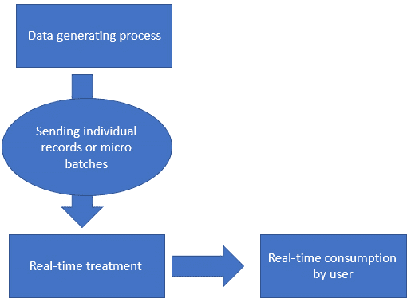
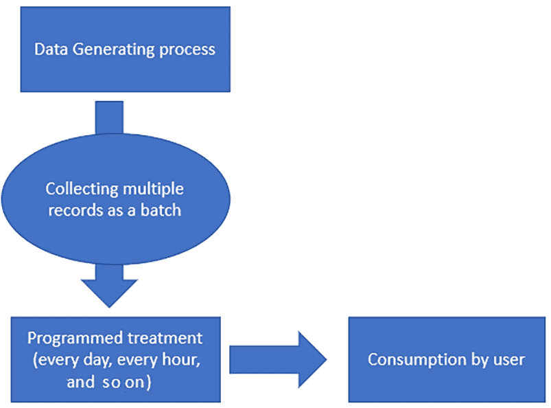
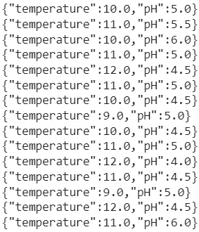
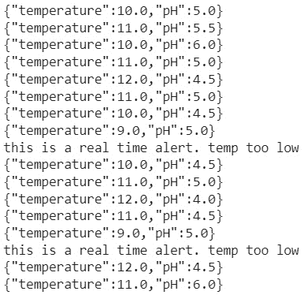
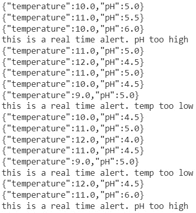

# *第一章*：流式数据简介

流式分析是数据科学中的新兴热门话题之一。它提出了一种替代框架，即更标准的批量处理，在这种框架中，我们不再处理固定时间处理的整个数据集，而是直接在接收时处理每个数据点。

这种新的范式对数据工程有重要的影响，因为它需要更加稳健的，尤其是，更快的数据摄取管道。它还要求在数据分析和机器学习方面进行重大变革。

直到最近，机器学习和数据分析的方法和算法主要是为了在整个数据集上工作。现在，随着流式处理成为热门话题，越来越常见的是看到整个数据集不再存在的用例。当连续的数据流被摄取到数据存储源时，没有自然的时间点重新启动分析批量作业。

流式分析流式机器学习模型是专门为与流式数据源一起工作而设计的模型。解决方案的一部分，例如，在于更新。流式分析和机器学习需要不断更新，因为新的数据正在被接收。在更新时，你可能还希望忘记很久以前的数据。

从批量分析转向流式分析引入的这些问题需要不同的分析方法和机器学习方法。本书将为你打下在连续流接收的数据上进行数据分析和机器学习的起点。

在第一章中，你将更深入地了解流式数据和批量数据之间的区别。你将看到一些示例用例，展示为什么与流式数据工作比转换回批量数据更重要。你还将开始使用第一个 Python 示例，以了解你在这本书中将进行的工作类型。

在后面的章节中，你将看到更多关于架构的背景概念，然后，你将进入多个数据科学和数据分析用例，了解它们如何适应新的流式处理范式。

在本章中，你将发现以下主题：

+   数据科学简史

+   与流式数据一起工作

+   实时数据格式和 Python 中导入示例数据集

# 技术要求

你可以在以下链接的 GitHub 上找到这本书的所有代码：[`github.com/PacktPublishing/Machine-Learning-for-Streaming-Data-with-Python`](https://github.com/PacktPublishing/Machine-Learning-for-Streaming-Data-with-Python)。如果你还不熟悉 Git 和 GitHub，下载笔记本和代码示例的最简单方法是以下步骤：

1.  前往仓库链接。

1.  点击绿色的**代码**按钮。

1.  选择**下载 ZIP**：


当你下载 ZIP 文件时，你可以在本地环境中解压它，然后你将能够通过你偏好的 Python 编辑器访问代码。

## 设置 Python 环境

要跟随这本书，你可以下载存储库中的代码，并使用你偏好的 Python 编辑器执行它。

如果你还不熟悉 Python 环境，我建议你查看 Anaconda ([`www.anaconda.com/products/individual`](https://www.anaconda.com/products/individual))，它包含 Jupyter Notebook 和 JupyterLab，这两个都是执行笔记本的绝佳选择。它还包含 Spyder 和 VSCode，用于编辑脚本和程序。

如果你安装 Python 或相关程序遇到困难，你可以查看 Google Colab ([`colab.research.google.com/`](https://colab.research.google.com/)) 或 Kaggle Notebooks ([`www.kaggle.com/code`](https://www.kaggle.com/code))，这两个都允许你免费在线笔记本中运行 Python 代码，无需任何设置。

注意

书中的代码将一般使用 Colab 和 Kaggle Notebooks，Python 版本为 3.7.13，你可以设置自己的环境来模拟这种情况。

# 数据科学简史

在过去几年里，新技术领域迅速占领了世界的许多部分。机器学习、人工智能和数据科学是进入我们日常生活的新领域，无论是在我们的个人生活中还是在我们的专业生活中。

数据科学家今天所研究的主题并不新颖。该领域的绝对基础是数学和统计学，这两个领域已经存在了几个世纪。例如，最小二乘回归首次发表于 1805 年。随着时间的推移，数学家和统计学家一直在努力寻找其他方法和模型。

在以下时间线上，你可以看到最近技术繁荣是如何发生的。在 1600 年和 1700 年，非常聪明的人已经为我们今天在统计学和数学中做的事情奠定了基础。然而，直到计算能力的发明和普及，这个领域才变得繁荣起来。

![Figure 1.2 – A timeline of the history of data]

![img/B18335_01_02.jpg]

图 1.2 – 数据历史的时间线

**个人电脑和互联网的普及**是数据科学今天受欢迎的重要原因。几乎每个人都有一台性能足够强大的电脑，可以进行相当复杂的机器学习。这极大地帮助了计算机素养，而且，在线文档的可用性也是学习的一个大助推器。

大数据工具如 **Hadoop** 和 **Spark** 的可用性也是数据科学普及的重要部分，因为它们允许从业者处理比以往任何时候都能想象的更大的数据集。

最后，**云计算**正在让世界各地的数据科学家以低廉的价格访问非常强大的硬件。特别是对于大数据工具，所需的硬件仍然定价得让大多数学生无法购买用于训练目的。云计算为许多人提供了这些用例的访问权限。

在这本书中，你将学习如何处理**流式数据**。记住数据科学简短的历史很重要，因为流式数据是那些因需要困难的硬件和设置要求而受到不利影响的技术之一。流式数据目前在许多领域迅速获得人气，并有可能在接下来的时期成为一大热门。现在让我们更深入地了解流式数据的定义。

# 处理流式数据

流式数据是流式传输的数据。你可能从可以流式传输视频的在线视频服务中了解到**流式传输**这个术语。当你这样做时，视频流式传输服务会继续向你发送视频的下一部分，同时你已经在观看视频的第一部分。

在处理流式数据时，概念是相同的。数据格式不一定是视频，可以是任何对你的用例有用的数据类型。最直观的例子之一是工业生产线，其中你有来自传感器的连续测量。只要你的生产线不停歇，你就会继续生成测量数据。我们将查看以下数据流过程的概述：



图 1.3 – 数据流过程

重要的概念是你有一个需要实时处理的数据连续流。你不能等到生产线停止后再进行分析，因为你需要立即检测潜在的问题。

## 流式数据与批量数据

流式数据通常不是新数据科学家倾向于开始使用的第一个用例。通常首先介绍的问题是批量用例。批量数据与流式数据相反，因为它在**阶段**中工作：你收集一系列数据，然后处理一系列数据。

如果你将流式数据比作在线流视频，那么你可以将批量数据比作先下载整个视频，然后在下载完成后观看。从分析的角度来看，这意味着当数据生成过程完成时，你会得到一系列数据的分析，而不是在出现问题时才进行分析。

对于某些用例来说，这并不是问题。然而，你可以理解，在那些快速分析可以产生影响的用例中，流式可以提供巨大的附加价值。它也在数据以流式方式摄取的用例中具有附加价值，这变得越来越普遍。在实践中，许多本可以通过流式处理获得附加价值的用例仍然使用批处理方法解决，仅仅因为这些方法更为人所熟知且更广泛。

下面的概述显示了批处理过程：



图 1.4 – 批处理过程

## 流式数据的优点

现在让我们看看使用流式分析而不是其他方法的一些优点。

### 数据生成过程是实时的

建立流式数据分析而不是批处理系统的第一个优点是许多数据生成过程实际上是实时的。你将在后面的例子中看到一些用例，但一般来说，数据收集很少是批量进行的。

尽管我们大多数人习惯于在实时数据生成系统周围构建批处理系统，但直接构建流式分析通常更有意义。

当然，批处理分析和流式分析可以共存。然而，向流式分析服务中添加批处理处理通常比向为批处理设计的系统中添加流式功能要容易得多。从流式开始是最有意义的。

### 实时洞察有价值

在设计数据科学解决方案时，流式处理并不总是首先考虑的。然而，当解决方案或工具是实时构建的，实时功能很少不被欣赏。

当今许多分析解决方案都是实时构建的，工具也是可用的。在许多问题中，实时信息将在某个时候被使用。也许它不会从一开始就被使用，但当异常发生时，你会发现立即进行数据分析而不是等到下一个小时或第二天早上，这将带来巨大的竞争优势。

## 流式分析成功实施的例子

让我们谈谈一些成功实施实时分析的公司例子。第一个例子是壳牌。他们能够在加油站对他们的安全摄像头实施实时分析。一个自动化的实时机器学习流程能够检测到人们是否在吸烟。

另一个例子是连接式运动设备中传感器数据的运用。通过实时测量心率和其他关键绩效指标（KPIs），它们能够在你的身体出现任何问题时提醒你。

当然，像 Facebook 和 Twitter 这样的大型玩家也在实时分析大量数据，例如在检测假新闻或不良内容时。流数据分析有许多成功的用例，同时，流数据也带来了一些常见的挑战。现在让我们来看看它们。

## 流数据的挑战

流数据分析目前不如批量数据分析普及。尽管这种情况正在慢慢改变，但在处理流数据时了解挑战所在是很有好处的。

### 流数据分析的知识

流数据分析不如普及的一个简单原因是知识和技能问题。在学校的课程中通常不会教授设置流数据分析，而且绝对不是作为首选方法来教授。互联网上可用的资源也较少，以帮助人们入门。由于机器学习和批量处理分析的资源更多，而且批量方法不适用于流数据，因此人们倾向于从数据科学的批量应用开始。

### 理解架构

在处理流数据时遇到的第二个困难是架构问题。尽管一些数据科学从业者对架构、数据工程和 DevOps 有所了解，但这并不总是如此。为了设置流数据分析的验证或**最小可行产品**（**MVP**），所有这些技能都是必需的。对于批量处理，通常只需要使用脚本即可。

架构困难是流数据固有的，因为它需要与实时进程合作，这些进程会将单独收集的记录发送到实时更新的分析处理过程。如果没有能够处理这种需求的架构，那么开始流数据分析就没有太多意义。

### 财务障碍

与流数据合作时的另一个挑战是财务方面。尽管从长远来看，使用流数据不一定更昂贵，但建立启动所需的基础设施可能会更昂贵。在本地开发者的 PC 上为 MVP 工作不太可能成功，因为数据需要实时处理。

### 运行时问题的风险

实时进程也有更大的运行时问题风险。在构建软件时，错误和故障是不可避免的。如果你正在进行日常批量处理，你可能能够修复进程，重新运行失败的批量，并解决问题。

如果流工具出现故障，可能会丢失数据。由于数据应在实时摄入，因此在你进程暂停期间产生的数据可能无法恢复。如果你的进程非常重要，你需要日夜进行广泛的监控，并在将解决方案推送到生产之前进行更多的质量检查。当然，这在批量过程中也很重要，但在流数据中更为重要。

### 小型分析（较少的可用方法）

流式分析的最后一个挑战是，常见的方法通常首先是为批量数据开发的。目前有许多针对实时和流式数据分析的解决方案，但仍然没有批量数据那么多。

此外，由于流式分析必须非常快速地完成以尊重实时交付，流式用例往往最终会采用较少有趣的分析方法，并停留在描述性或基本分析的基本水平。

## 如何开始使用流式数据

对于公司来说，开始使用流式数据的第一个步骤通常是实施简单的应用程序，这些应用程序**收集实时数据**并使实时数据实时可用。常见的起始用例包括日志数据、网站访问数据或传感器数据。

下一个步骤通常是在实时数据源之上构建**报告工具**。你可以考虑那些实时更新的 KPI 仪表板，或者基于业务规则的高或低阈值值的小型简单警报工具。

当这样的系统建立起来后，这将为替换那些业务规则或在其之上添加新规则提供途径。你可以考虑包括用于异常检测的实时**机器学习**在内的更高级分析工具。

最复杂的步骤是在你的实时机器学习和流程之间添加自动反馈循环。毕竟，如果有可能自动化并改进**决策**，就没有理由仅仅停留在**分析**业务洞察上。

## 流式数据的常见用例

让我们看看一些最常用的流式数据用例，以便你能更好地了解可以从流式技术中受益的用例。这将会涵盖三个相对容易接触到的用例，但当然，还有很多更多。

### 传感器数据和异常检测

流式数据的常见用例之一是传感器数据的分析。传感器数据可以出现在多种用例中，例如工业生产线和物联网用例。当公司决定收集传感器数据时，通常会在实时进行处理。

对于生产线来说，实时检测异常具有很大的价值。当异常发生过多时，生产线可以关闭，或者问题可以在大量次品交付之前得到解决。

可以在这里找到一个关于监测艺术品湿度流式分析的示例：[`azure.github.io/iot-workshop-asset-tracking/step-003-anomaly-detection/`](https://azure.github.io/iot-workshop-asset-tracking/step-003-anomaly-detection/)。

### 财务和回归预测

财务数据是流式数据的另一个很好的用例。例如，在股票交易的世界里，时机很重要。你越快能够检测到股市的上涨或下跌趋势，交易者（或算法）就越快能够通过买卖股票来做出反应并赚钱。

在以下由 K.S Umadevi 等人（2018）撰写的论文中描述了一个很好的例子：[`ieeexplore.ieee.org/document/8554561`](https://ieeexplore.ieee.org/document/8554561)。

### 网站和分类的点击流

网站或应用是实时洞察的第三个常见用例。如果你能够实时跟踪和分析你的访客，你可以在网站上为他们提供个性化的体验。通过提出与网站访客匹配的产品或服务，你可以增加你的在线销售额。

由 Ramanna Hanamanthrao 和 S Thejaswini（2017）撰写的以下论文为将此技术应用于点击流数据提供了一个很好的用例：[`ieeexplore.ieee.org/abstract/document/8256978`](https://ieeexplore.ieee.org/abstract/document/8256978)。

## 流与大数据

理解你可能会遇到的不同流定义非常重要。一个需要区分的是流与大数据。一些定义将流主要考虑在大数据（Hadoop/Spark）环境中，而其他定义则不是。

流解决方案通常具有大量数据，大数据解决方案可能是合适的选择。然而，结合精心选择的硬件架构的其他技术也可能能够实时进行数据分析，因此可以在不使用大数据技术的情况下构建流解决方案。

### 流数据与实时推理

模型的实时推理通常通过 API 构建，并使其可用。由于我们将流定义为无批次的实时数据分析，这种实时预测可以被认为是流。你将在后面的章节中了解更多关于实时架构的内容。

# 实时数据格式和 Python 中导入示例数据集

为了完成这一章节，让我们看看如何在实践中表示流数据。毕竟，在构建分析时，我们经常需要实现测试用例和示例数据集。

在 Python 中表示流数据的最简单方法就是创建一个包含数据的可迭代对象，并构建你的分析函数以与可迭代对象一起工作。

以下代码使用 pandas 创建一个 DataFrame。有两个列，温度和 pH：

代码块 1-1

```py
import pandas as pd
```

```py
data_batch = pd.DataFrame({
```

```py
'temperature': [10, 11, 10, 11, 12, 11, 10, 9, 10, 11, 12, 11, 9, 12, 11],
```

```py
    ‹pH›: [5, 5.5, 6, 5, 4.5, 5, 4.5, 5, 4.5, 5, 4, 4.5, 5, 4.5, 6]
```

```py
})
```

```py
print(data_batch)
```

当显示 DataFrame 时，它将如下所示。pH 大约在 4.5/5，但有时会更高。温度通常在 10 或 11 左右。


图 1.5 – 结果 DataFrame

这个数据集是一个批量数据集；毕竟，你同时拥有所有行（观测值）。现在，让我们看看如何通过使其可迭代来将这个数据集转换为流数据集。

你可以通过迭代数据的行来实现这一点。在这样做的时候，你设置一个代码结构，允许你逐个添加更多构建块到这个代码中。当你的开发完成时，你将能够在实时流上使用你的代码，而不是在 DataFrame 迭代上。

以下代码遍历 DataFrame 的行并将行转换为 JSON 格式。这是一种在不同系统之间通信的非常常见的格式。观测的 JSON 包含温度值和 pH 值。它们如下打印出来：

代码块 1-2

```py
data_iterable = data_batch.iterrows()
```

```py
for i,new_datapoint in data_iterable:
```

```py
  print(new_datapoint.to_json())
```

在运行此代码后，你应该获得如下所示的打印输出：



图 1.6 – 最终的打印输出

让我们现在定义一个超级简单的流式数据分析示例。以下代码块中定义的函数将在温度低于 10 时打印警报：

代码块 1-3

```py
def super_simple_alert(datapoint):
```

```py
  if datapoint[‹temperature›] < 10:
```

```py
    print('this is a real time alert. temp too low')
```

你现在可以通过在每一个数据点上调用警报测试，简单地将在你的模拟流式过程中添加此警报。你可以使用以下代码来完成此操作：

代码块 1-4

```py
data_iterable = data_batch.iterrows()
```

```py
for i,new_datapoint in data_iterable:
```

```py
  print(new_datapoint.to_json())
```

```py
  super_simple_alert(new_datapoint)
```

当执行此代码时，你会注意到当温度低于 10 时，将会立即发出警报：



图 1.7 – 带有温度警报的最终打印输出

此警报仅适用于温度，但你很容易添加相同类型的 pH 警报。以下代码显示了如何做到这一点。警报函数可以更新以包括第二个业务规则，如下所示：

代码块 1-5

```py
def super_simple_alert(datapoint):
```

```py
  if datapoint[‹temperature›] < 10:
```

```py
    print('this is a real time alert. temp too low')
```

```py
  if datapoint[‹pH›] > 5.5:
```

```py
    print('this is a real time alert. pH too high')
```

执行函数的方式仍然完全相同：

代码块 1-6

```py
data_iterable = data_batch.iterrows()
```

```py
for i,new_datapoint in data_iterable:
```

```py
  print(new_datapoint.to_json())
```

```py
  super_simple_alert(new_datapoint)
```

在执行示例流式数据的过程中，你将看到几个警报被触发，如下所示：



图 1.8 – 带有温度和 pH 警报的最终打印输出

在流式数据中，你必须在没有看到完整数据的情况下，仅基于过去接收到的那些数据点做出决定。这意味着需要采用不同的方法来重新开发与批量处理算法类似的算法。

在整本书中，你将发现适用于流式数据的方法。正如你可能理解的，困难之处在于，统计方法通常是为了使用所有数据来计算事物而开发的。

# 摘要

在本关于流式数据和流式分析的开篇章节中，你首先看到了一些关于流式数据是什么的定义，以及它与批量数据处理是如何相对立的。在流式数据中，你需要处理连续的数据流，而更传统的（批量）数据科学解决方案需要适应，以便与这种更新、要求更高的数据处理方法一起工作。

您已经看到了许多示例用例，现在您应该明白，对于企业和高级技术用例来说，在实时而不是等待固定时刻进行数据科学和数据分析可以带来更大的价值。实时洞察可以改变游戏规则，而自主机器学习解决方案通常需要实时决策能力。

您已经看到了一个例子，其中创建了一个数据流并开发了一个简单的实时警报系统。在下一章中，您将更深入地了解多种流处理解决方案。在实践中，数据科学家和分析师通常不会负责实施流数据摄取，但他们将受到这些系统限制的约束。因此，了解流和实时架构非常重要：这将是下一章的目标。

# 进一步阅读

+   *什么是流数据？（AWS 提供）* [`aws.amazon.com/streaming-data/`](https://aws.amazon.com/streaming-data/)

+   *实时数据分析的 8 个最佳示例*，作者：Bernard Marr [`www.linkedin.com/pulse/8-best-examples-real-time-data-analytics-bernard-marr/`](https://www.linkedin.com/pulse/8-best-examples-real-time-data-analytics-bernard-marr/)

+   *如何构建强大的流分析商业案例*，福布斯 [`www.forbes.com/sites/forbestechcouncil/2021/10/26/how-to-build-a-strong-business-case-for-streaming-analytics/?sh=314e2b8a465d`](https://www.forbes.com/sites/forbestechcouncil/2021/10/26/how-to-build-a-strong-business-case-for-streaming-analytics/?sh=314e2b8a465d)

+   *实时流分析的企业用例 7 例* [`searchbusinessanalytics.techtarget.com/feature/7-enterprise-use-cases-for-real-time-streaming-analytics`](https://searchbusinessanalytics.techtarget.com/feature/7-enterprise-use-cases-for-real-time-streaming-analytics)

+   *从批量到在线/流*，作者：RiverML [`riverml.xyz/dev/examples/batch-to-online/`](https://riverml.xyz/dev/examples/batch-to-online/)

+   Anaconda: [`www.anaconda.com/products/individual`](https://www.anaconda.com/products/individual)

+   Google Colab：[`colab.research.google.com/`](https://colab.research.google.com/)

+   Kaggle 笔记本：[`www.kaggle.com/code`](https://www.kaggle.com/code)
