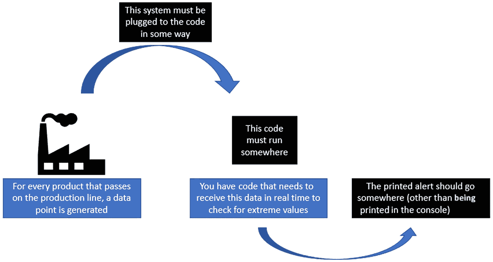
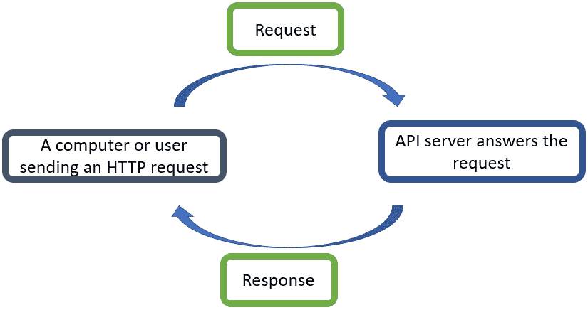
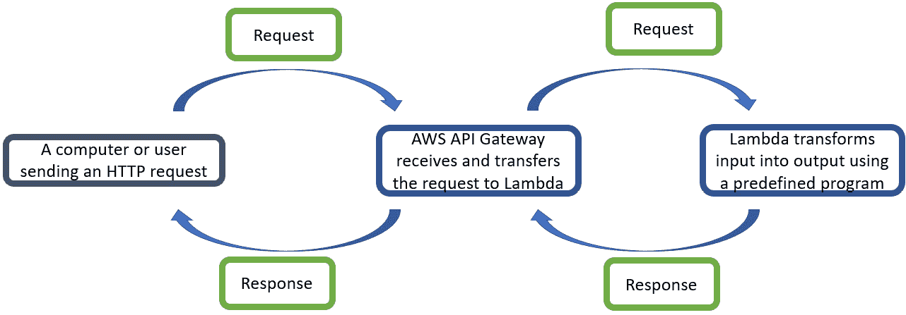
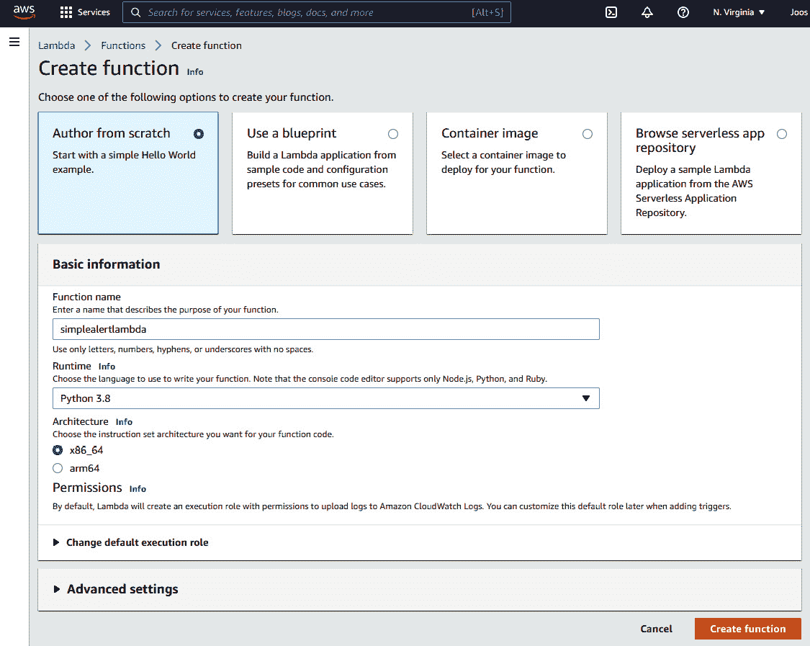

# 第二章：*第二章*：流式和实时机器学习的架构

流式架构是实时机器学习和流式分析解决方案的一个基本组成部分。即使你有一个可以实时处理数据、更新并立即响应的模型或其他分析工具，如果没有支持你解决方案的架构，这将是徒劳的。

第一个重要的考虑因素是确保你的模型和分析可以在每个数据点上运行；需要有一个更新函数和/或一个预测函数，可以更新系统接收到的每个新观测值上的解决方案。

对于实时和流式架构，另一个重要的考虑因素是数据导入：如何确保数据可以基于每个观测值接收，而不是更传统的以每日数据库更新为例的批量方法。

此外，了解如何使不同的软件系统进行通信也很重要。例如，数据必须从你的数据生成过程非常快速地流动，可能经过一个数据存储解决方案、一个数据质量工具或一个安全层，然后被你的分析程序接收。分析程序将完成其工作并将结果发送回源端，或者可能将处理过的数据点转发到可视化解决方案、警报系统或类似系统。

在本章中，你将了解流式和实时机器学习的架构介绍。本书的核心重点将始终集中在管道的分析和机器学习部分。本章的目标是给你足够的元素来想象和实现初步的工作架构，而一些高度专业化的性能、可用性和安全性部分将被省略。

本章涵盖了以下主题：

1.  将你的分析定义为函数

1.  理解微服务架构

1.  通过 API 在服务之间进行通信

1.  揭秘 HTTP 协议

1.  在 AWS 上构建简单的 API

1.  实时流的大数据工具

1.  实时调用大数据环境

# 技术要求

你可以在以下链接的 GitHub 上找到这本书的所有代码：[`github.com/PacktPublishing/Machine-Learning-for-Streaming-Data-with-Python`](https://github.com/PacktPublishing/Machine-Learning-for-Streaming-Data-with-Python)。如果你还不熟悉 Git 和 GitHub，下载笔记本和代码示例的最简单方法是以下步骤：

1.  前往仓库的链接。

1.  点击绿色的**代码**按钮。

1.  选择**下载 ZIP**。

当你下载 ZIP 文件时，你需要在本地环境中解压缩它，然后你将能够通过你偏好的 Python 编辑器访问代码。

## Python 环境

要跟随这本书的内容，你可以从仓库中下载代码，并使用你偏好的 Python 编辑器执行它。

如果你还不熟悉 Python 环境，我建议你查看 Anaconda ([`www.anaconda.com/products/individual`](https://www.anaconda.com/products/individual))，它包含 Jupyter Notebook 和 JupyterLab，这两个都是执行笔记本的绝佳选择。它还包含 Spyder 和 VSCode，用于编辑脚本和程序。

如果你在机器上安装 Python 或相关程序时遇到困难，你可以查看 Google Colab ([`colab.research.google.com/`](https://colab.research.google.com/)) 或 Kaggle Notebooks ([`www.kaggle.com/code`](https://www.kaggle.com/code))，这两个平台都允许你免费在线笔记本中运行 Python 代码，无需任何设置。

注意

书中的代码通常使用 Colab 和 Kaggle Notebooks，Python 版本为 3.7.13，你可以设置自己的环境来模拟这种情况。

# 将你的分析定义为函数

为了开始学习架构，让我们从零开始构建一个想法，使用必要的不同构建块来制作一个最小的工作产品。

对于这一点，你需要首先了解你想要执行的类型实时分析。

现在，让我们继续使用上一章的相同示例：一个实时业务规则，当我们的生产线温度或酸度超出可接受范围时打印警报。

在上一章中，这个警报被编码如下：

代码块 2-1

```py
def super_simple_alert(datapoint):
```

```py
  if datapoint['temperature'] < 10:
```

```py
    print('this is a real time alert. temp too low')
```

```py
  if datapoint['pH'] > 5.5:
```

```py
    print('this is a real time alert. pH too high')
```

在上一章中，你通过遍历 DataFrame 来测试这段代码。实际上，你将始终需要有一个架构的想法，这样你的代码才能从数据生成过程中实时接收数据。这个构建块将在本章中介绍。

在下面的示意图中，你将看到我们流式解决方案的高级架构图：



图 2.1 – 流式解决方案的高级架构图

在这个示意图中，你可以清楚地看到编写代码将为你提供解决方案的一些关键组件。然而，你需要围绕这些组件构建一个架构，使解决方案变得生动。示例实现中仍缺少较暗的部分。

虽然本书的目标不是提供关于架构的全面深入课程，但你在这里会发现一些工具和构建块，这将使你能够交付一个 MVP 实时用例。为了使你的构建块整洁有序，你需要为你的解决方案选择一个架构结构。微服务是一种架构模式，它将允许你构建干净、小巧的构建块，并使它们相互通信。

# 理解微服务架构

在处理架构时理解**微服务**的概念非常重要。尽管有其他方法来架构软件项目，但微服务因其良好的原因而非常受欢迎。它们帮助团队保持灵活和高效，并有助于保持软件的灵活性和清晰结构。

微服务的理念体现在其名称中：软件被表示为许多独立操作的小服务。在查看整体架构时，每个微服务都在一个小小的、*黑盒*中，具有明确定义的输入和输出。会放置一些流程来在正确的时间调用正确的黑盒。

微服务架构是松散耦合的。这意味着不同微服务之间没有固定的通信。相反，每个微服务可以被任何其他服务或代码调用，也可以不被调用。

如果需要对某个微服务进行更改，更改的范围相对局部，因此不会影响其他微服务。由于输入和输出是预定义的，这也帮助保持程序的基础结构有序，而不会以任何方式固定。

为了允许不同的微服务进行通信，一个常用的解决方案是使用**应用程序编程接口**（**API**）。现在让我们深入了解这些内容。

# 通过 API 在服务之间进行通信

微服务架构中的一个重要组成部分是 API 的使用。API 是一个允许您将两个微服务（或其他代码片段）连接起来的部分。

API 与网站非常相似。就像网站一样，API 是在类似网站的链接或 IP 地址后面构建的。当您访问一个网站时，网站的服务器会向您发送代表网站的代码。然后您的互联网浏览器解释此代码并显示网页。

当您调用 API 时，API 将接收您的请求。请求触发服务器上您的代码运行，并生成一个发送回您的响应。如果出现问题（可能是您的请求不符合预期或发生错误），您可能不会收到任何响应，或者收到如“请求未授权”或“内部服务器错误”之类的错误代码。

下一个图显示了涵盖此内容的流程图。计算机或用户发送 HTTP 请求，API 服务器根据在 API 服务器上运行的代码发送响应：



图 2.2 – 流式解决方案的高级架构图

您可以使用许多不同的工具调用 API。有时，您甚至可以使用您的互联网浏览器，否则，像 cURL 这样的工具可以在命令行上完成这项工作。您可以使用 Postman 或 Insomnia 等工具通过用户界面调用 API。所有通信都遵循固定的规则和实践，这些规则和实践共同构成了 HTTP 协议，我们将在下一节中探讨。

# 揭秘 HTTP 协议

服务（或网站）之间的交互使用 HTTP 协议。当与 API 和构建通信的微服务一起工作时，了解 HTTP 协议的基本知识非常重要。

最重要的是要知道如何发送和格式化请求和响应。

## GET 请求

最简单的 HTTP 请求是`GET`请求。当您需要从服务器或服务中获取某些内容时，您会使用它。例如，当访问一个网站时，您的浏览器会向网站的 IP 地址发送`GET`请求以获取网站的布局代码。

使用以下代码可以从 Python 发送`GET`请求：

代码块 2-2

```py
import requests
```

```py
import json
```

```py
response = requests.get('http://www.google.com')
```

```py
print(response.status_code)
```

```py
print(response.text)
```

此代码使用 Python 中的`requests`库向谷歌主页发送`GET`请求。从技术上讲，这与在您的互联网浏览器中访问谷歌主页的过程相同。您将获得所有代码，这些代码是您的网络浏览器显示谷歌主页所需的。尽管你们中的许多人非常熟悉浏览器中谷歌主页的外观，但在这段代码响应中它却不太容易辨认。重要的是要理解，这实际上是完全相同的东西，只是格式不同。

## POST 请求

`POST`请求是您将非常经常遇到的另一种请求。它允许您在请求中发送一些数据。这在分析 API 中尤其必要，因为分析很可能会在这个数据上发生。通过在`POST`请求的主体中添加数据，您确保您的分析代码收到了您的数据。

Python 中的语法将类似于以下代码块。目前，这段代码不起作用，因为您还没有构建一个能够处理这些数据的服务器。但是，请记住，`POST`请求允许您将数据点发送到 API，目的是获取响应：

代码块 2-3

```py
import requests
```

```py
import json
```

```py
data = {'temperature': 10, 'pH': 5.5}
```

```py
response = requests.post('http://www.example.com',data=data)
```

```py
print(response.status_code)
```

```py
print(response.text)
```

## 系统间通信的 JSON 格式

服务器之间交互的最常见格式是**JavaScript 对象表示法**（**JSON**）格式。它是一种数据类型，在 Python 中非常类似于字典格式。实际上，它是一个被括号包围的键值对象。

一个 JSON 有效载荷的示例如下：

代码块 2-4

```py
{
```

```py
     'name': 'your name',
```

```py
     'address': 'your address',
```

```py
     'age': 'your age'
```

```py
}
```

这种数据格式相对容易理解，并且非常常用。因此，了解它是如何工作的非常重要。您将在本章后面的内容中看到它的使用。

## RESTful API

虽然这本书不涉及 API 开发，但了解一些指导方针和最佳实践将是有用的。最常用的 API 结构是**表示状态转移**（**REST**）API。

REST API 的工作方式与其他 API 类似，但它遵循一组特定的风格规则，使其成为可识别的 REST API，也称为 RESTful API。

REST API 中有六个指导约束：

+   客户端-服务器架构

+   无状态

+   缓存性

+   分层系统

+   按需代码（可选）

+   统一接口

如果你想在这个主题上更进一步，本章末尾提供了一些额外的阅读资源。现在我们已经了解了 HTTP 协议，让我们在 **Amazon Web Services**（**AWS**）上构建一个 API。

# 在 AWS 上构建简单的 API

为了做一些实际的事情，让我们在 AWS 上构建一个非常简单的 API。这将帮助你理解不同的服务如何相互通信。它也可以作为测试本书中其他示例的良好测试环境。

你将使用 AWS 框架的以下组件。

## AWS 中的 API Gateway

这是一个为你处理 API 请求的 AWS 服务。你指定你期望接收的请求类型，并指定在接收到请求时应采取的操作。当你使用 API Gateway 构建 API 时，这将自动生成一个 IP 地址或链接，你可以将你的 API 请求发送到那里。

## AWS 中的 Lambda

Lambda 是一个无服务器代码执行环境。这意味着你可以编写 Python 代码，将其连接到 API Gateway，而无需考虑如何设置服务器、防火墙等。这对于解耦系统来说很棒，而且对于许多实时系统来说足够快。

## 本地机器上的数据生成过程

作为最后一个组件，你将在 Python 中构建一个独立的数据生成过程。你可以在笔记本中执行此代码。每次生成新的数据点时，代码将调用 API 并与分析服务通信，如果需要，则发送警报。

以下图示展示了该架构的概览：



图 2.3 – AWS 的详细架构图

## 实现示例

为了实现示例，我们将使用以下分步说明。如果你已经有了 AWS 账户，你可以跳过 *步骤 0*。

### 步骤 0 – 在 AWS 上创建账户

如果你还没有 AWS 账户，创建一个账户很容易。你需要用信用卡设置它，但我们在这里使用的所有服务都有免费层。只要你测试结束后关闭资源，你不太可能产生任何费用。然而，要小心，因为错误是会发生的，如果你在 AWS 上使用大量资源，你最终可能会付费。

要设置账户，你可以简单地遵循 [aws.amazon.com](http://aws.amazon.com) 上的步骤。

### 步骤 1 – 设置 Lambda 函数

在接收到 `POST` 请求后，必须调用 Lambda 函数来执行我们的警报并发送响应。

在 **服务** 菜单中选择 **Lambda** 并点击 **创建函数**。你将看到以下屏幕：



图 2.4 – 创建 Lambda 函数

确保选择 **Python** 并给你的函数起一个合适的名字。

当你完成函数的创建后，就是时候编写代码了。你可以使用以下代码：

代码块 2-5

```py
import json
```

```py
def super_simple_alert(datapoint):    
```

```py
    answer = ''
```

```py
    if datapoint['temperature'] < 10:
```

```py
        answer += 'temp too low ' 
```

```py
    if datapoint['pH'] > 5.5:
```

```py
        answer += 'pH too high '
```

```py
    if answer == '':
```

```py
        answer = 'all good'
```

```py
    return answer
```

```py
def lambda_handler(event, context):
```

```py
    answer = super_simple_alert(event)
```

```py
    return {
```

```py
        'statusCode': 200,
```

```py
        'body': json.dumps({'status': answer}),
```

```py
    }
```

此代码有两个函数。`super_simple_alert`函数接受一个`datapoint`并返回一个答案（一个字符串格式的警报）。`lambda_handler`函数是处理传入 API 调用的代码。事件包含`datapoint`，因此事件被传递到`super_simple_alert`函数以分析是否应该启动警报。这存储在`answer`变量中。最后，`lambda_handler`函数返回一个包含状态码`200`和包含答案的 Python 字典。

窗口现在应该看起来如下：

![图 2.5 – Lambda 函数窗口

![img/B18335_02_05.jpg]

图 2.5 – Lambda 函数窗口

### 第 2 步 – 设置 API 网关

作为第一步，让我们设置 API 网关以接收一个`POST`请求。这个`POST`请求将包含一个正文，其中包含温度和 pH 值的 JSON，就像在警报示例中一样。

要设置 API 网关，您必须转到**API 网关**菜单，该菜单可通过**服务**菜单访问。**管理控制台**看起来如下：

![图 2.6 – AWS 管理控制台

![img/B18335_02_06.jpg]

图 2.6 – AWS 管理控制台

您最终应该出现在**API 网关**菜单中，如下所示：

![图 2.7 – API 网关菜单

![img/B18335_02_07.jpg]

图 2.7 – API 网关菜单

当您在**API 网关**菜单中时，您可以转到**创建 API**以设置您的第一个 API。

在**创建 API**中，执行以下步骤：

1.  选择**REST API**。

1.  选择**REST**协议。

1.  将 API 作为一个新的 API 构建。

1.  创建一个 API 名称，例如，`streamingAPI`。

您将获得一个空的 API 配置菜单，如下所示：

![图 2.8 – 在 API 网关中添加方法

![img/B18335_02_08.jpg]

图 2.8 – 在 API 网关中添加方法

我们想添加一个`POST`方法，所以转到`POST`方法。以下菜单将出现以设置`POST`方法：

![图 2.9 – POST 设置

![img/B18335_02_09.jpg]

图 2.9 – POST 设置

### 第 3 步 – 部署 API

仍然在 API 网关菜单中，点击`test`以部署到。您可以使用此阶段的默认设置，但重要的是要记住这里顶部的 URL，以便能够从您的数据生成过程中调用您的 API。您需要设置如下所示的设置：

![图 2.10 – API 的更多详细信息

![img/B18335_02_010.jpg]

图 2.10 – API 的更多详细信息

### 第 4 步 – 从另一个 Python 环境调用您的 API

现在，您可以从另一个 Python 环境调用您的 API，例如您自己的电脑上的笔记本，或者从 Google Colab 笔记本中调用。

您可以使用以下代码来完成此操作：

代码块 2-6

```py
import requests
```

```py
import json
```

```py
data = {'temperature': 8, 'pH': 4}
```

```py
response = requests.post('YOUR_URL', data = json.dumps(data))
```

```py
print(json.loads(response.text))
```

您将获得以下答案：

代码块 2-7

```py
{'statusCode': 200, 'body': '{"status": "temp too low "}'}
```

现在，您可以想象一个实时数据生成过程将如何简单地在每个新数据点上调用 API，并且警报将立即生成！

## 更多架构考虑因素

虽然这是构建 API 的第一次尝试，但您应该意识到，当您想要以可靠和安全的方式构建它时，还有更多需要考虑。数据科学和软件工程是不同的工作，学习管理 API 从 A 到 Z 所需的所有技能需要时间。一般来说，这不会是数据科学家的工作。

在本例中没有涵盖的一些事情如下：

+   性能：扩展、负载均衡和延迟

+   DDoS 攻击

+   安全性和黑客攻击

+   API 调用的财务方面

+   依赖云服务提供商与云服务提供商无关

在本章末尾，有一些进一步阅读的资源，您可以查看。

## 其他 AWS 服务以及具有相同功能的一般服务

当前示例使用了 API Gateway 和 Lambda 函数来构建 API。这种方法的优势在于访问和设置的简便性，这使得它非常适合作为本书中的展示方法。然而，您应该意识到还有许多其他工具和技术可以用于构建 API。

AWS 是最常用的云服务提供商之一，在 AWS 上可以完成的大部分工作也可以在其他云服务提供商的平台上完成。其他大型玩家的例子包括谷歌的 GCP 和微软的 Azure。即使在 AWS 上，也有很多替代方案。

您也可以在本地环境中构建 API。在这样做的时候，您将再次拥有大量的工具和提供商选择。现在您已经看到了如何使用标准的 Python 编程和微服务方法来构建 API，接下来您将看到一些在大数据环境中使用的替代方案。大数据环境通常具有更陡峭的学习曲线，并且通常是为特定用例而设计的，但它们在处理高容量和高速度时可以非常强大且绝对必要。

# 实时流式大数据工具

有许多大数据工具可以进行实时流式分析。它们可以成为*常规*实时系统的绝佳替代品，尤其是在数据量庞大且需要高速处理时。

作为提醒，术语**大数据**通常用于重新组合解决那些无法适应内存的问题的工具。这些问题解决有三个核心特征：体积、多样性和速度。

大数据工具通常以其并行计算中的大量工作而闻名。在编写非优化的常规 Python 代码时，代码通常会逐个传递数据点。大数据解决方案通过在多个服务器上并行处理数据点来解决此问题。这种方法使得大数据工具在数据量很大时速度更快，但在数据量较小时（由于管理不同工作者的开销）速度较慢。

大数据工具通常相对特定；它们只应用于具有大量数据的使用案例。对于每个手头的问题都开始使用大数据工具是没有意义的。

为处理流式数据，已经制作了许多此类解决方案。让我们看看一些常用的工具：

+   **Spark Streaming**：Spark Streaming 是 Spark 的一个补充，Spark 是当今大数据的主要工具之一。Spark Streaming 可以连接到 Kafka、Flume 和 Amazon Kinesis 等源，从而使得流式数据在 Spark 环境中变得可访问。

+   **Apache Kafka**：Kafka 是 Apache 管理的开源工具。它是一个用于提供实时数据流的框架。许多公司使用 Kafka 来提供数据管道和流式分析。甚至一些云服务提供商已经将 Kafka 集成到他们的解决方案中。

+   **Apache Flume**：Apache Flume 是 Apache 管理的另一个开源工具，它也专注于流式数据。Flume 专门用于在大数据环境中处理大量日志数据。

+   **Apache Beam**：Apache 流式家族中的另一个工具是 Apache Beam。这个工具可以处理批量和流式数据。它最出名的是构建 ETL 和数据处理流程。

+   **Apache Storm**：Apache Storm 是一个流处理计算框架，允许进行分布式计算。它用于实时处理与 Hadoop 相关的数据流。

+   **Apache NiFi**：Apache NiFi 是一个专注于 ETL 的工具。它为用户提供自动化和管理系统间数据流的可能性。它可以与 Kafka 一起工作。

+   **Google Cloud DataFlow**：Google Cloud DataFlow 是由 Google Cloud Platform 提出的一种工具。它专门针对流式使用案例进行开发。它允许用户在完全管理的服务中执行 Apache Beam 流程。

+   **Amazon Kinesis**：Amazon Kinesis 强烈基于前面讨论过的开源 Apache Kafka。使用 Kinesis 而不是 Kafka 的优势在于，它为你提供了许多管理服务，而如果你直接使用 Kafka，则需要投入更多精力来管理服务。当然，作为回报，你必须使用 AWS 平台来访问它。

+   **Azure Stream Analytics**：Azure Stream Analytics 是微软云平台 Azure 上提出的主要流式分析服务。它是一个基于 Trill 的实时分析服务。

+   **IBM Streams**：IBM Streams 是一种在 IBM 云上提出的流式分析工具。就像 Kinesis 一样，它基于开源 Kafka 项目。

## 实时调用大数据环境

如果你的实时分析服务由大数据或特定流式工具管理，你并不总是可以遵循 API 方法将你的实时流程连接到你的分析流程。

在大多数情况下，你需要查阅你选择工具的文档，并确保你理解如何使连接工作。在这个阶段，你通常需要一位专业配置文件来与你合作，因为这种级别的架构和数据工程通常被认为超出了大多数数据科学家的范围。

微服务系统和大数据系统之间的一般区别在于，在微服务方法中，我们通常认为 API 必须有一个响应，该响应被调用服务所考虑。

在大数据环境中，一个网站等服务向大数据环境发送数据但不需要响应的情况更为常见。你可以想象一个网站将用户的所有交互以 JSON 文件的形式写入一个固定位置。然后，大数据流工具连接到这个数据存储位置，以流式方式读取数据并将其转换为分析、可视化或其他内容。

让我们构建一个最小示例，以展示如何做到这一点：

1.  首先，创建一个名为`example.json`的 JSON 文件，在其中只写入以下数据：

代码块 2-8

```py
{'value':'hello'}
```

1.  你现在可以编写一个非常短的 Spark Streaming 代码，以流式方式读取这些数据：

    ```py
    from pyspark.sql import SparkSession
    from pyspark.sql.types import *
    spark = SparkSession \
        .builder \
        .appName("quickexample") \
        .getOrCreate()
    schema = StructType([ StructField("value", StringType(), True) ])
    streamingDF = (
      spark
        .readStream
        .schema(schema)
        .json('example.json')
    )
    display(streamingDF)
    ```

简而言之，此代码首先创建一个`spark`会话。一旦会话创建成功，就会为`example.json`文件定义一个模式。由于它只有一个键（称为`value`），因此模式相当简短。值的类型是`string`。

你接着看到数据是通过`.readStream`方法导入的，这实际上为你做了很多流式处理的繁重工作。如果你想进一步扩展这个示例，你可以使用`streamingDF`库编写各种分析 Spark 函数，你将拥有使用知名大数据工具**PySpark**的流式分析。

# 摘要

在本章中，你开始探索架构领域。你已经在 AWS 上构建了自己的 API，并看到了系统间通信的基本基础。你现在应该明白，数据是系统间通信的关键，而良好的系统间通信对于通过分析传递价值至关重要。

这在实时和流分析的情况下尤其如此。如果项目早期没有足够早地识别出架构瓶颈，高速和通常较大的数据量很容易引发问题。

你必须记住的其他主题包括安全性、可用性和合规性。这些主题最好留给那些将其作为全职责任来处理此类数据架构问题的人。

在下一章中，我们将回到本书的核心，因为你会了解到如何在流数据上构建分析用例。

# 进一步阅读

+   *微服务架构*：[`cloud.google.com/learn/what-is-microservices-architecture`](https://cloud.google.com/learn/what-is-microservices-architecture)

+   API：[`www.redhat.com/en/topics/api/what-are-application-programming-interfaces`](https://www.redhat.com/en/topics/api/what-are-application-programming-interfaces)

+   HTTP：[`developer.mozilla.org/en-US/docs/Web/HTTP`](https://developer.mozilla.org/en-US/docs/Web/HTTP)

+   *十大实时数据流工具*：[`ipspecialist.net/top-10-real-time-data-streaming-tools/`](https://ipspecialist.net/top-10-real-time-data-streaming-tools/)

+   Spark Streaming: [`spark.apache.org/docs/latest/streaming-programming-guide.html`](https://spark.apache.org/docs/latest/streaming-programming-guide.html)

+   Kafka: [`kafka.apache.org/`](https://kafka.apache.org/)

+   Flume: [`flume.apache.org/`](https://flume.apache.org/)

+   Beam: [`beam.apache.org/`](https://beam.apache.org/)

+   Storm: [`storm.apache.org/`](https://storm.apache.org/)

+   NiFi: [`nifi.apache.org/`](https://nifi.apache.org/)

+   Google Cloud Dataflow: [`cloud.google.com/dataflow`](https://cloud.google.com/dataflow)

+   Amazon Kinesis: [`aws.amazon.com/kinesis/`](https://aws.amazon.com/kinesis/)

+   Azure 流分析服务: [`azure.microsoft.com/en-us/services/stream-analytics/`](https://azure.microsoft.com/en-us/services/stream-analytics/)

+   IBM Streams: [`www.ibm.com/docs/en/streams`](https://www.ibm.com/docs/en/streams)

+   *使用 Amazon Kinesis 捕获网页滚动进度*，由 AWS 提供：[`docs.aws.amazon.com/sdk-for-javascript/v2/developer-guide/kinesis-examples-capturing-page-scrolling.html`](https://docs.aws.amazon.com/sdk-for-javascript/v2/developer-guide/kinesis-examples-capturing-page-scrolling.html)
