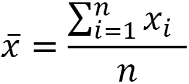
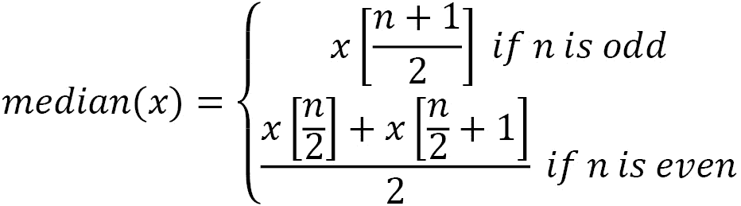
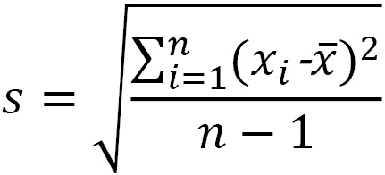
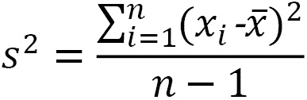
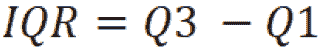
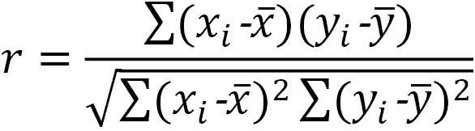
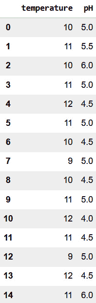
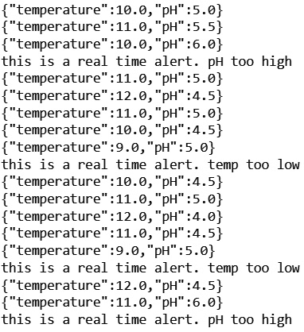
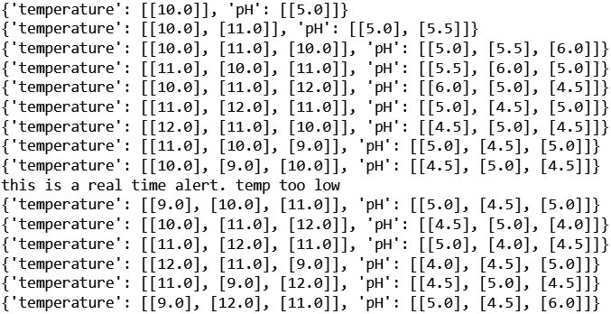
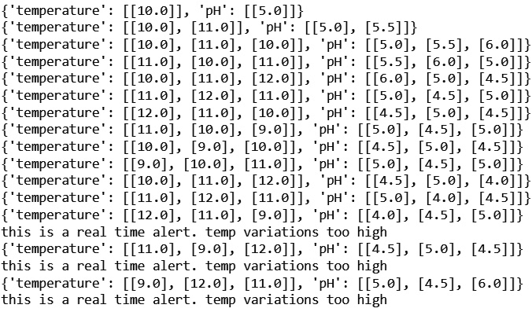

# *第三章*：流式数据上的数据分析

现在你已经了解了流式数据的介绍以及流式用例，还了解了流式架构的介绍，现在是时候进入这本书的核心内容了：分析和机器学习。

如你所知，描述性统计和数据分析是机器学习的入门点，但它们也经常被用作独立用例。在本章中，你将首先从传统统计学的角度发现描述性统计。传统统计学的某些部分专注于在只有部分数据可用时对描述性统计进行正确估计。

在流式处理中，你将比在批量数据中更强烈地遇到这些问题。通过持续的数据收集过程，你的描述性统计将在每个新的数据点上持续变化。本章将提出一些解决方案来处理这个问题。

你还将基于这些描述性统计数据构建数据可视化。毕竟，人类的大脑是以这样的方式连接的，视觉呈现比数据矩阵更容易阅读。数据可视化是一个重要的工具，当处理流式数据时，需要考虑一些额外的反思。

本章将以对统计过程控制的简要介绍结束。这个统计学的子领域专注于分析连续的测量流。尽管在过程控制发明时流式分析还不是一件事情，但它成为了这些分析方法的一个新的、重要的用例。

本章涵盖了以下主题：

+   流式数据描述性统计

+   样本理论简介

+   主要描述性统计概述

+   实时可视化

+   基本警报系统

# 技术要求

你可以在以下链接的 GitHub 上找到这本书的所有代码：[`github.com/PacktPublishing/Machine-Learning-for-Streaming-Data-with-Python`](https://github.com/PacktPublishing/Machine-Learning-for-Streaming-Data-with-Python)。如果你还不熟悉 Git 和 GitHub，下载笔记本和代码样本的最简单方法是以下：

1.  前往仓库的链接。

1.  点击绿色的**代码**按钮。

1.  选择**下载 ZIP**。

当你下载 ZIP 文件时，在你的本地环境中解压缩它，你将通过你偏好的 Python 编辑器访问代码。

## Python 环境

要跟随这本书，你可以下载仓库中的代码，并使用你偏好的 Python 编辑器执行它。

如果你还不熟悉 Python 环境，我建议你检查一下 Anaconda（[`www.anaconda.com/products/individual`](https://www.anaconda.com/products/individual)），它包含了 Jupyter Notebook 和 JupyterLab，这两个都是执行笔记本的绝佳选择。它还包含了 Spyder 和 VSCode，用于编辑脚本和程序。

如果你安装 Python 或相关程序有困难，你可以查看 Google Colab（[`colab.research.google.com/`](https://colab.research.google.com/)）或 Kaggle Notebooks（[`www.kaggle.com/code`](https://www.kaggle.com/code)），这两个平台都允许你免费在线笔记本中运行 Python 代码，无需任何设置。

注意

书中的代码通常使用 Colab 和 Kaggle Notebooks，Python 版本为 3.7.13，你可以设置自己的环境来模拟这种情况。

# 流数据描述性统计

计算描述性统计通常是统计学和数据分析课程中最早涉及的内容之一。描述性统计是数据从业者非常熟悉的一种度量，因为它们允许你用一组小的指标来总结数据集。

## 为什么流数据上的描述性统计不同？

在常规数据集上，你可以使用几乎任何统计软件，通过已知的公式轻松地获得描述性统计。不幸的是，在流数据集上，这要明显复杂得多。

在流数据上应用描述性统计的问题在于，这些公式是为寻找固定测量值而设计的。在流数据中，你持续接收新的数据，不幸的是，这些数据可能会改变你的值。当你没有变量的全部数据时，你不能确定其值。在下一节中，你将了解样本理论，即处理从数据样本中估计参数的领域。

# 样本理论简介

在深入研究流数据的描述性统计之前，了解常规数据的描述性统计基础知识非常重要。处理使用数据样本估计描述性统计的领域被称为**样本理论**。

## 比较总体和样本

在常规统计学中，总体和样本的概念非常重要。在进一步探讨之前，让我们先看看这些定义：

+   **个体**：个体是研究中包含的单独对象或人。如果你的研究是观察生产线上的产品并测量产品的特征，那么个体就是产品。如果你正在进行关于网站销售的调查研究，并跟踪每个网站访问者的数据，那么你的个体就是网站访问者。

+   **总体**：统计学中的总体通常定义为从中抽取样本的个体集合。总体包含任何理论上符合参与研究的个体。在生产线的例子中，总体是所有产品。在网站例子中，总体是所有网站访问者。

+   **样本**：样本被定义为你要在其上执行研究的总体子集。在大多数统计研究中，你使用样本；你并没有世界上所有可能个体的数据，而是一个子集，你希望它足够大。有许多统计工具可以帮助你决定这是否是情况。

## 总体参数和样本统计量

当在样本上计算描述性统计时，它们被称为**样本统计量**。样本统计量基于样本，尽管它们通常是总体可靠估计，但它们并不是对总体的完美估计。

对于总体，使用的术语是**总体参数**。它们是准确的，这里没有测量误差。然而，在大多数情况下，它们是无法测量的，因为你永远不会有足够的时间和金钱来测量总体中的每一个个体。

样本统计量允许你估计总体参数。

## 抽样分布

抽样分布是统计量的分布。想象一下，一个网站顾客群体平均在你的网站上花费 300 秒（5 分钟）。如果你抽取 100 个随机样本的网站访客，并计算每个样本的均值，你可能会得到 100 个不同的估计值。

这些估计值的分布被称为**抽样分布**。它将遵循一个正态分布，其中均值应该相对接近总体均值。抽样分布的标准差被称为**标准误差**。标准误差用于估计样本的稳定性和代表性。

## 样本量计算和置信水平

在传统统计学中，样本量计算可以用来定义样本中需要有多少个元素，以便样本是可靠的。你需要为你的特定统计量定义一个置信水平和样本量计算公式。它们共同将允许你确定使用样本统计量可靠估计总体参数所需的样本量。

## 从流中滚动描述性统计

在流式分析中，随着时间的推移，你将拥有越来越多的数据。在接收到新的数据点时，可以重新计算整体统计量。在某个时候，新的数据点与过去的大量数据点相比，影响将非常小。如果流中发生改变，这种改变需要时间才能反映在描述性统计中，因此这通常不是最佳方法。

流式数据描述性统计的一般方法是使用滚动窗口来计算和重新计算描述性统计。一旦你决定了窗口的定义，你就计算窗口中所有观察值的统计量。

例如，可以选择最后 25 个产品的窗口。这样，每次新的产品测量数据进入你的分析应用时，你将计算这个产品以及前 24 个产品的平均值。

在你的窗口中，观察到的数据越多，最后一个观察数据的影响就越小。如果你想要避免误报，这可能是很好的，但如果你需要每个产品都完美无缺，这可能会很危险。在窗口中选择少量个体会使你的描述性统计在存在变化时波动很大。

调整窗口期是在尝试微调你的描述性统计时一个好的练习。通过尝试不同的方法，你可以找到最适合你用例的方法。

## 指数权重

你还可以使用指数加权作为调整流数据描述性统计的工具。指数加权会给最近观察到的数据赋予指数级的重要性，而对过去观察到的数据赋予较少的重要性。这允许你接受更多的历史观察数据，同时不会影响最近观察数据的重要性。

## 跟踪收敛性作为额外的关键绩效指标

在跟踪数据流的描述性统计时，报告多个测量时间窗口是一个可能的选择。例如，你可以构建一个仪表板，通知你的客户日平均数，同时你也可以报告最后 1 小时和最后 15 分钟的均值。

通过这样做，例如，你可以给你的客户提供信息，说这一天和这一小时总体上表现良好（日和时平均符合规范），但在最后 15 分钟，你的产品开始出现问题，最后 15 分钟的均值不符合规范。有了这些信息，操作员可以迅速介入，根据他们的需求停止或改变流程，而无需担心当天早些时候的生产。

# 主要描述性统计概述

现在我们来看看最常用的描述性统计，看看你如何将它们适应到任何数据流的滚动窗口中。当然，正如你在上一章中看到的，流分析可以在多种工具上执行。重要的是要理解使用哪些描述性分析，并有一个可以适应不同流输入工具的基础。

## 平均值

将要介绍的第一种描述性统计量是平均值。平均值是最常用的中心度量。

### 解释和使用

与中位数和众数等其他中心度量一起，它的目标是描述变量的分布中心。如果分布是完全对称的，平均值、中位数和众数将是相等的。如果分布是偏斜的，平均值将受到异常值的影响，并朝向偏斜或异常值的方向移动。

### 公式

样本均值的公式如下：



在这个公式中，*n*是样本大小，*x*是样本中变量的值。

### 代码

您可以使用许多 Python 函数来计算平均值。其中之一是名为`mean`的`numpy`函数。您可以在以下示例中看到它的用法：

代码块 3-1

```py
values = [10,8,12,11,7,10,8,9,12,11,10]
```

```py
import numpy as np
```

```py
np.mean(values)
```

您应该得到一个结果为`9.8181`。

## 中位数

中位数是变量或分布中心性的第二个度量。

### 解释和使用

与平均值一样，中位数用于表示中心。然而，与平均值的不同之处在于，中位数对异常值不敏感，并且对偏斜分布的敏感性要小得多。

一个重要的例子是在研究一个国家人口的工资时。众所周知，工资遵循一个强烈偏斜的分布。大多数人工资在最低工资和平均工资之间。很少人有非常高的收入。当计算平均值时，由于高收入者的推动，它将过高，无法代表整体人口。使用中位数更合理，因为它将更接近地代表很多人。

中位数表示 50%的人将赚取低于这个数额，而 50%的人将赚取高于这个数额。

### 公式

中位数的公式相对复杂，因为它不使用实际值，而是对所有的值从低到高排序后取中间值。如果值的数量是偶数，则没有中间值，所以它将取两个中间值的平均值：



在这里，*x*是一个有序列表，括号表示在这个列表上的索引。

### 代码

您可以这样计算中位数：

代码块 3-2

```py
values = [10,8,12,11,7,10,8,9,12,11,10]
```

```py
import numpy as np
```

```py
np.median(values)
```

这个计算的输出应该是`10`。

## 众数

众数是描述性统计中常用的第三个中心度量。本节将解释其在 Python 中的使用和实现。

### 解释和使用

众数表示在数据中出现次数最多的值。如果您有一个连续（数值）变量，那么在计算众数之前，您通常创建一些区间来重新分组您的数据。这样，您可以确保它是代表性的。

### 公式

找到众数的最简单方法是计算每个组或每个值的出现次数，并取出现次数最高的值作为众数。这适用于分类变量以及数值变量。

### 代码

您可以使用以下代码在 Python 中找到众数：

代码块 3-3

```py
values = [10,8,12,11,7,10,8,9,12,11,10]
```

```py
import statistics
```

```py
statistics.mode(values)
```

获得的结果应该是`10`。

## 标准差

您现在将看到一系列用于描述变异性的描述性统计量，从标准差开始。

### 解释和使用

标准差是常用的变异性度量。变异性度量显示了数据中心周围的分布。例如，均值可以表示你的人口平均工资，但它不能告诉你是否每个人都接近这个值，或者是否每个人都非常远离这个值。变异性度量允许你获得这些信息。

### 公式

样本标准差可以按以下方式计算：



### 代码

你可以按以下方式计算样本标准差：

代码块 3-4

```py
values = [10,8,12,11,7,10,8,9,12,11,10]
```

```py
import numpy as np
```

```py
np.std(values, ddof=1)
```

你应该得到一个结果为`1.66`。

## 方差

方差是另一个变异性度量，它与标准差密切相关。让我们看看它是如何工作的。

### 解释和使用

方差是标准差的平方。有时使用方差的公式更容易，因为它不涉及取平方根。因此，在某些数学运算中更容易处理。标准差通常更容易用于解释。

### 公式

方差的公式如下：



### 代码

你可以使用以下代码来计算样本方差：

代码块 3-5

```py
values = [10,8,12,11,7,10,8,9,12,11,10]
```

```py
import numpy as np
```

```py
np.var(values, ddof=1)
```

获得的结果应该是`2.76`。

## 四分位数和四分位距

将要介绍的第三个变异性度量是**四分位距**（**IQR**）。这将结束描述变异性的统计。

### 解释和使用

IQR 是一个与中位数有关联的度量。如果你还记得，中位数是 50%的值低于它，50%的值高于它的点；它实际上是一个中间点。

同样，可以使用 25/75%的分割而不是 50/50%的分割。在这种情况下，它们被称为四分位数。通过计算第一个四分位数（25%以下，75%以上）和第三个四分位数（75%以下，25%以上），你可以了解你的数据的变异性。第三个四分位数和第一个四分位数之间的差异称为 IQR。

### 公式

IQR 的公式简单来说就是第三四分位数和第一四分位数的差，如下所示：



### 代码

你可以使用以下 Python 代码来计算 IQR：

代码块 3-6

```py
values = [10,8,12,11,7,10,8,9,12,11,10]
```

```py
import scipy.stats
```

```py
scipy.stats.iqr(values)
```

你应该找到一个 IQR 为`2.5`。

## 相关性

相关性是描述多个变量之间关系的描述性统计量。让我们看看它是如何工作的。

### 解释和使用

现在你已经看到了多个中心性和变异性的度量，你现在将发现一个描述性统计量，它允许你研究两个变量之间的关系。这个描述性统计量的主要形式是**相关性**。相关性有多种公式和定义，但在这里，你将看到最常见的一种：皮尔逊相关性。

对于强负相关，相关系数将是`-1`，对于强正相关，相关系数是`1`，对于无相关，相关系数是`0`，或者介于两者之间。

### 公式

这里展示了皮尔逊相关系数的公式：



### 代码

你可以使用以下代码在 Python 中轻松计算它：

代码块 3-7

```py
values_x = [10,8,12,11,7,10,8,9,12,11,10]
```

```py
values_y = [12,9,11,11,8,11,9,10,14,10,9]
```

```py
import numpy as np
```

```py
np.corrcoef(values_x,values_y)
```

你应该获得一个相关矩阵，你可以从中读取相关系数是`0.77`。这表明两个变量之间存在正相关。

现在你已经看到了一些描述数据的数值方法，将会有助于发现一些以更用户友好的方式可视化这些数据的方法。下一节将深入探讨这一点。

# 实时可视化

在这部分，你将了解如何使用 Plotly 的 Dash 设置一个简单的实时可视化。这个工具是数据科学家的一个很好的仪表板工具，因为它易于学习，除了 Python 环境之外不需要其他东西。

代码有点长，不适合在书中展示，但你可以在 GitHub 仓库中找到 Python 文件（名为`ch3-realtimeviz.py`）。

在代码中，你可以看到如何构建一个简单的实时图形。代码的一般设置是有一个应用程序。你使用 HTML 类似的构建块在应用程序中定义布局。在这种情况下，布局包含一个 div（一个内容块），其中有一个图形。

该布局的主要组件是使用`Interval`函数。使用这个函数将使仪表板以给定的频率自动更新。这足够快，可以将其视为实时更新。

回调装饰了其下方编写的函数（`update_graph`）。通过这种方式装饰，应用程序知道每次更新时（由布局中的`Interval`触发）都必须调用此函数。`update_graph`函数返回一个更新后的图形。

## 打开仪表板

一旦你在本地机器上运行代码，你将看到以下信息：

![图 3.1 – Dash 的输出]

![图片 B18335_03_1.jpg]

图 3.1 – Dash 的输出

此链接将为您提供访问正在实时更新的仪表板的方式。它看起来像这样：

![图 3.2 – Plotly 仪表板]

![图片 B18335_03_2.jpg]

图 3.2 – Plotly 仪表板

## 比较 Plotly 的 Dash 和其他实时可视化工具

现在有许多其他的数据可视化工具。流行的例子包括 Power BI、QlikView 和 Tableau。Plotly 的 Dash 的好处是，如果你已经在 Python 环境中，它非常容易上手。它是免费的，不需要安装。

如果你想要成为**商业智能**（**BI**）的专家，值得检查其他工具。其中许多都有实时更新的能力，每个工具的具体文档将指导你如何使用它。

在构建仪表板或数据可视化系统时，考虑您的整体架构也很重要。正如前一章所讨论的，在许多情况下，您将有一个数据生成系统和能够实时管理该系统的架构。就像任何其他分析构建块一样，您需要确保您的仪表板可以连接到您的数据生成过程，或者您可能需要构建一个中间数据存储或数据通信层。

我们现在将进入描述性统计学的下一个用例：构建基本的警报系统。

# 构建基本警报系统

在本章的前几部分，您已经看到了描述性统计和可视化的介绍。

基本警报系统将在最后一个数据分析用例中介绍。在本部分中，您将了解如何使用基本警报系统对流数据进行操作。为此，您将了解如何利用描述性统计与业务规则相结合，在实时自动生成警报。警报系统的示例方法如下：

+   极端值警报系统

+   过程稳定性警报系统

+   恒定变异性警报系统

+   统计过程控制和精益六西格玛控制图

## 极端值警报系统

流数据警报和监控系统中的第一个例子是您在早期章节中看到的用例：编写一个业务规则，一旦观察到的值超出硬编码的边界，就会发送警报。

这个例子在之前的章节中如下编码：

代码块 3-9

```py
import pandas as pd
```

```py
data_batch = pd.DataFrame({
```

```py
    'temperature': [10, 11, 10, 11, 12, 11, 10, 9, 10, 11, 12, 11, 9, 12, 11],
```

```py
    'pH': [5, 5.5, 6, 5, 4.5, 5, 4.5, 5, 4.5, 5, 4, 4.5, 5, 4.5, 6]
```

```py
})
```

```py
data_batch
```

您将看到以下数据被打印出来：



图 3.3 – 数据批次

现在我们来编写函数并遍历数据，以便在每个数据点上执行该函数：

代码块 3-10

```py
def super_simple_alert(datapoint):
```

```py
  if datapoint['temperature'] < 10:
```

```py
    print('this is a real time alert. Temp too low')
```

```py
  if datapoint['pH'] > 5.5:
```

```py
    print('this is a real time alert. pH too high')
```

```py
data_iterable = data_batch.iterrows()
```

```py
for i,new_datapoint in data_iterable:
```

```py
  print(new_datapoint.to_json())
```

```py
  super_simple_alert(new_datapoint)
```

结果打印输出显示已启动多个警报：



图 3.4 – 您警报系统的打印结果

这个例子是进入警报和监控系统的一个很好的第一步：流数据的一个常见用例。让我们看看您如何在此基础上添加更多和更复杂的静态逻辑。

## 过程稳定性警报系统（均值和中位数）

与将业务逻辑应用于单个值相比，在某些情况下，添加平均值的逻辑可能更好。在许多情况下，如果只有一个观察值不符合规范，可能不需要发送警报。然而，当多个产品的平均值超出规范时，您可能有一个需要解决的问题的结构性问题。

您可以这样考虑编写这样的例子：

代码块 3-11

```py
import numpy as np
```

```py
def super_simple_alert(hist_datapoints):
```

```py
  print(hist_datapoints)
```

```py
  if np.mean(hist_datapoints['temperature']) < 10:
```

```py
    print('this is a real time alert. temp too low')
```

```py
  if np.mean(hist_datapoints['pH']) > 5.5:
```

```py
    print('this is a real time alert. pH too high')
```

```py
data_iterable = data_batch.iterrows()
```

```py
# create historization for window
```

```py
hist_temp = []
```

```py
hist_ph = []
```

```py
for i,new_datapoint in data_iterable:
```

```py
  hist_temp.append([new_datapoint['temperature']])
```

```py
  hist_ph.append([new_datapoint['pH']])
```

```py
  hist_datapoint = {
```

```py
      'temperature': hist_temp[-3:],
```

```py
      'pH': hist_ph[-3:]
```

```py
  }
```

```py
  super_simple_alert(hist_datapoint)
```

在这个例子中，你可以看到对最后 10 个观测值进行了窗口平均计算。这允许你在最后三个观测值的平均值达到硬编码的警报阈值时立即发出警报。你应该观察到以下输出：



图 3.5 – 改进的打印输出

你可以观察到，使用三个观测值的平均值的事实使得收到警报的可能性大大降低。如果你在窗口中使用更多的观测值，这会进一步降低。微调应取决于业务案例。

## 恒定可变性的警报系统（标准差和方差）

你可以用同样的方法处理可变性。正如在描述性统计章节中讨论的那样，一个过程通常由中心性和可变性来描述。即使你的平均值在规范范围内，也可能存在很大的可变性；如果可变性很大，这也可能成为你的一个问题。

你可以使用窗口计算的平均值来执行可变性的警报系统。这可以用于仪表板，也可以用于警报系统等。

你可以这样编写代码：

代码块 3-12

```py
import numpy as np
```

```py
def super_simple_alert(hist_datapoints):
```

```py
  print(hist_datapoints)
```

```py
  if np.std(hist_datapoints['temperature']) > 1:
```

```py
    print('this is a real time alert. temp variations too high')
```

```py
  if np.std(hist_datapoints['pH']) > 1:
```

```py
    print('this is a real time alert. pH variations too high')
```

```py
data_iterable = data_batch.iterrows()
```

```py
# create historization for window
```

```py
hist_temp = []
```

```py
hist_ph = []
```

```py
for i,new_datapoint in data_iterable:
```

```py
  hist_temp.append([new_datapoint['temperature']])
```

```py
  hist_ph.append([new_datapoint['pH']])
```

```py
  hist_datapoint = {
```

```py
      'temperature': hist_temp[-3:],
```

```py
      'pH': hist_ph[-3:]
```

```py
  }
```

```py
  super_simple_alert(hist_datapoint)
```

注意，现在的警报不是基于平均值，而是基于可变性。对于这个例子，你会收到以下输出：



图 3.6 – 进一步改进的打印输出

## 基本警报系统使用统计过程控制

如果你想将此类警报系统进一步发展，可以使用统计过程控制的方法。这个统计领域专注于控制一个过程或生产方法。从这个领域衍生出的主要工具被称为**控制图**。

在控制图中，你随时间绘制一个统计量，但你会添加控制限。一个标准的控制图是在其中你绘制样本平均随时间的变化，并基于标准差添加控制限。然后你计数并观察极端值，当发生一定数量的重复事件时，你会触发警报。

你可以在“进一步阅读”部分找到一个链接，了解更多关于控制图和统计过程控制的信息。

# 摘要

在本章中，你学习了在流数据上进行数据分析的基础知识。你看到，对数据流进行描述性统计与对批量数据进行描述性统计的工作方式不同。可以从批量数据中使用的估计理论，但你需要对数据进行窗口处理以获取更大或更小的历史数据窗口。

窗口设置可以对你的结果产生强烈影响。较大的窗口将考虑更多的数据，并将考虑更早时间的数据。然而，它们对新的数据点将变得不那么敏感。毕竟，窗口越大，一个新数据点的影响就越小。

你还学会了如何使用 Plotly 的 Dash 构建数据可视化。这个工具很棒，因为它非常强大，并且仍然可以从 Python 环境中使用。存在许多其他可视化工具，但最重要的是掌握至少其中之一。本章向您展示了可视化流数据的函数需求，如果需要，您将能够在其他数据可视化工具上重现这一点。

本章的最后部分介绍了统计过程控制。到目前为止，你一直在使用静态规则或描述性统计来构建简单的警报系统。统计过程控制是构建更高级警报系统的一个有趣领域，这些系统相对容易理解且易于实现。

在下一章中，你将开始探索在线机器学习。一旦你对在线机器学习有了基本的了解，你将在后面的章节中看到，你可以用基于机器学习的异常检测模型来替换静态的警报系统决策规则。本章中你看到的数据分析方法是朝着这个方向的重要第一步。

# 进一步阅读

+   *估计理论*：[`en.wikipedia.org/wiki/Estimation_theory`](https://en.wikipedia.org/wiki/Estimation_theory)

+   *抽样*：[`en.wikipedia.org/wiki/Sampling_(statistics)`](https://en.wikipedia.org/wiki/Sampling_(statistics))

+   *窗口化*：[`softwaremill.com/windowing-in-big-data-streams-spark-flink-kafka-akka/`](https://softwaremill.com/windowing-in-big-data-streams-spark-flink-kafka-akka/)

+   *使用 Python Dash 和 Plotly 绘制实时图表*：[`www.geeksforgeeks.org/plot-live-graphs-using-python-dash-and-plotly/`](https://www.geeksforgeeks.org/plot-live-graphs-using-python-dash-and-plotly/)

+   Plotly Dash 文档：[`plotly.com/`](https://plotly.com/)

+   控制图：[`en.wikipedia.org/wiki/Control_chart`](https://en.wikipedia.org/wiki/Control_chart)

+   *《工程统计学手册，第 6.3 章：单变量和多变量控制图》*：[`www.itl.nist.gov/div898/handbook/pmc/section3/pmc3.htm`](https://www.itl.nist.gov/div898/handbook/pmc/section3/pmc3.htm)
