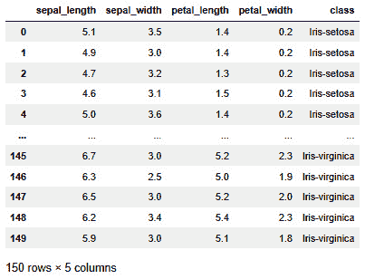
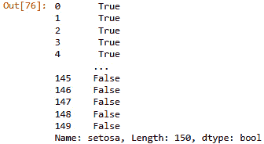
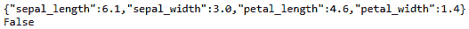
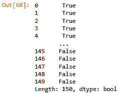
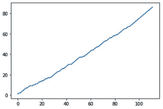
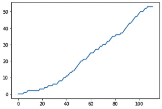
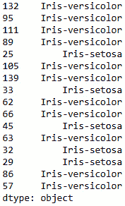

# *第四章*：使用 River 进行在线学习

在本章和接下来的三章中，你将学习如何使用一个名为 River 的在线机器学习库。在线机器学习是机器学习的一个分支，其中模型被设计成能够在接收到任何新的数据点时更新其学习到的模型。

在线机器学习是离线机器学习的对立面，后者是你可能已经熟悉的常规机器学习。一般来说，在机器学习中，模型会尝试学习一个可以执行特定任务的数学规则。这个任务是在基于多个数据点的基础上学习的。这些任务背后的数学基于统计学和算法学。

在本章中，你将了解如何使用在线机器学习，你将发现多种类型的在线机器学习。你将更深入地了解在线和离线机器学习之间的差异。你还将看到如何使用 Python 中的 River 构建在线机器学习模型。

本章涵盖了以下主题：

+   什么是在线机器学习？

+   River 用于在线学习

+   与 River 的一个超级简单的示例

+   与 River 的第二个示例

# 技术要求

你可以在以下链接在 GitHub 上找到本书的所有代码：[`github.com/PacktPublishing/Machine-Learning-for-Streaming-Data-with-Python`](https://github.com/PacktPublishing/Machine-Learning-for-Streaming-Data-with-Python)。如果你还不熟悉 Git 和 GitHub，下载笔记本和代码示例的最简单方法是以下：

1.  前往存储库的链接。

1.  点击绿色的**代码**按钮。

1.  选择**下载 ZIP**。

当你下载 ZIP 文件后，在你的本地环境中解压它，你将能够通过你偏好的 Python 编辑器访问代码。

## Python 环境

要跟随本书学习，你可以下载存储库中的代码，并使用你偏好的 Python 编辑器执行它。

如果你还不熟悉 Python 环境，我建议你查看 Anaconda ([`www.anaconda.com/products/individual`](https://www.anaconda.com/products/individual))，它包含了 Jupyter Notebook 和 JupyterLabs，这两个都是执行笔记本的绝佳选择。它还包含了 Spyder 和 VSCode，用于编辑脚本和程序。

如果你在机器上安装 Python 或相关程序时遇到困难，你可以查看 Google Colab ([`colab.research.google.com/`](https://colab.research.google.com/)) 或 Kaggle Notebooks ([`www.kaggle.com/code`](https://www.kaggle.com/code))，这两个平台都允许你免费在线笔记本中运行 Python 代码，无需任何设置。

注意

书中的代码将一般使用 Python 3.7.13 版本的 Colab 和 Kaggle 笔记本，你可以设置自己的环境来模拟这种情况。

# 什么是在线机器学习？

在机器学习中，训练模型最常见的方式是进行单次训练遍历。这种方法的一般步骤如下：

1.  数据准备。

1.  创建训练-测试分割。

1.  进行模型基准测试和超参数调整。

1.  选择最佳模型。

1.  将此模型部署到生产环境中。

这种方法被称为**离线学习**。

在流数据的情况下，你通常可以很好地使用这种类型的模型。你可以一次性构建模型，部署它，并用于预测你的输入流。你可能可以跟踪你模型的性能指标，当性能开始变化时，你可以更新或重新训练你的模型，部署新版本，只要它能在生产环境中正常工作。

在线机器学习是机器学习的一个分支，包含的模型工作方式非常不同。它们不会一次性学习完整的数据集，而是通过一系列步骤更新学习到的模型（预测的决策规则）。使用这种方法，你可以自动更新生产中的模型；它继续在新数据上学习。

## 在线学习与常规学习有何不同？

在线学习系统的构建实践在机器学习问题上与离线机器学习方法的视角不同。在离线学习中，有真实的机会测试模型学到了什么，而对于在线学习系统，这种变化可能随时发生。

对于某些用例，无法使用离线学习。一个例子是预测用例。通常，对于预测，你预测未来的一个值。为此，你使用最新的可用数据来训练和重新训练你的模型。在许多预测应用中，机器学习模型每次需要预测新的预报时都会重新训练。

异常值检测是另一个离线学习可能不太合适的例子。如果你的模型没有整合每个新的数据点，这些数据点就不能作为参考案例来对抗新值。这个问题也可以通过离线学习来解决，但在线学习可能是解决这个用例的更合适方案。

## 在线学习的优势

在线学习有两个主要优势：

+   第一个主要优势是在线学习算法可以更新。因此，它们可以通过多次迭代学习。这样，大型数据集不需要一次性通过模型，而可以分多步进行。当数据集很大或计算资源有限时，这是一个很大的优势。

+   在线学习的第二个优势是，在线模型在更新时可以适应更新的过程：它不太固定。因此，当一个离线模型在数据趋势随时间略微变化时可能会过时，在线模型可以适应这些变化并保持性能。

## 在线学习的挑战

然而，使用在线学习也存在一些缺点。

首先，这个概念不太普及，并且找到在线学习用例的模型实现和文档可能会有些困难。

其次，更重要的是，在线学习存在模型学习到你不希望它们学习的内容或错误内容的风险。与离线学习相比，你在将模型推送到生产环境之前有更多的控制来验证模型学习的内容，而将在线学习推送到生产环境时，它可能会继续学习并由于学习到的更新而性能下降。

既然你已经理解了在线学习的概念，现在让我们来探索多种在线学习类型。

## 在线学习类型

虽然在线学习的类型没有明确的定义，但考虑以下三个术语至少是好的：增量学习、自适应学习和强化学习。

### 增量学习

**增量学习**方法是那些可以一次更新一个观察值的模型。如前所述，在线机器学习的主要增值之一就是这一点，这是标准离线学习所无法实现的。

### 自适应学习

然而，仅仅更新模型可能不足以满足之前提到的在线学习的第二个重要增值。如果你想使模型更好地适应更近期的数据，你必须选择一个**自适应**的在线学习方法。这些方法很好地处理了任何需要模型适应的情况，例如，在人们甚至还没有意识到之前，数据中出现的新的趋势。

### 强化学习

**强化学习**并不一定被视为在线学习的子领域。尽管强化学习的方法与之前提到的在线学习方法不同，但它可以用于相同的企业问题。因此，了解强化学习也很重要。它将在后面的章节中更深入地介绍。在接下来的部分，你将看到如何使用 Python 中的 River 包构建在线机器学习模型。

# 使用 River 进行在线学习

在本节中，你将了解用于在线学习的 River 库。River 是一个专门为在线机器学习制作的 Python 库。其代码库是 `creme` 和 `scikit-multiflow` 库的结合结果。River 的目标是成为流数据机器学习的首选库。

在这个例子中，你将看到如何在一个知名数据集上训练在线模型。在这个例子中，你将采取以下步骤：

1.  导入数据。

1.  重新分类数据以获得二元分类问题。

1.  使用在线模型进行二元分类。

1.  使用训练-测试分割来改进模型评估。

1.  使用一对一策略对在线多类分类模型进行拟合。

## 使用 River 训练在线模型

对于这个例子，你将使用著名的鸢尾花数据集。你可以从 UCI 机器学习仓库下载它，但你也可以使用以下代码直接将其下载到 pandas 中。

达到我们目标所需的步骤如下：

1.  导入数据

1.  将数据重新分类为二分类问题

1.  将数据转换为合适的输入格式

1.  逐个数据点学习模型

1.  评估模型

我们将按照以下步骤开始：

1.  我们首先将数据集导入，如下所示：

代码块 4-1

```py
#iris dataset classification example
import pandas as pd
colnames = ['sepal_length','sepal_width','petal_length','petal_width','class']
data = pd.read_csv('https://archive.ics.uci.edu/ml/machine-learning-databases/iris/iris.data', names=colnames)
data.head()
```

数据集看起来如下：



图 4.1 – 鸢尾花数据集

鸢尾花数据集非常常用，主要在教程和示例中。该数据集包含三种不同鸢尾花物种的多个观察值，是一种花卉。对于每一朵花，你有植物特定部分的长度和宽度。你可以使用这四个变量来预测鸢尾花的物种。

1.  对于这个第一个模型，你需要将类别列转换为二进制列，因为你将使用来自 River 的 `LogisticRegression` 模型，它不支持多类别：

代码块 4-2

```py
data['setosa'] = data['class'] == 'Iris-setosa'
data['setosa']
```

这将产生以下输出：



图 4.2 – 布尔数据类型的序列

1.  作为下一步，我们将编写代码来遍历数据以模拟流式数据输入。`X` 数据应该是字典格式，`y` 可以是字符串、整数或布尔值。在下面的代码中，你可以看到一个在第一次迭代后停止的循环，因此它打印一个 `X` 和一个 `y`：

代码块 4-3

```py
# convert to streaming dataset
for i,row in data.sample(1).iterrows():
    X = row[['sepal_length', 'sepal_width', 'petal_length', 'petal_width']]
    X = X.to_dict()

    y = row['setosa']

    print(X)
    print(y)
    break
```

你可以看到 `X` 必须是字典格式，这对于熟悉离线学习的人来说相对不常见。然后，`y` 可以是布尔值、字符串或整数。它看起来如下所示：



图 4.3 – 模型的 x 和 y 输入

1.  现在，让我们逐个拟合模型。添加 `.sample(frac=1)` 非常重要，以避免数据按顺序排列。如果你不添加这个，模型将首先接收一个类别的所有数据，然后是其他类别的数据。模型很难处理这种情况，因此应该使用 sample 函数引入随机顺序：

代码块 4-4

```py
!pip install river
from river import linear_model
model =  linear_model.LogisticRegression()
for i,row in data.sample(frac=1).iterrows():
    X = row[['sepal_length', 'sepal_width', 'petal_length', 'petal_width']]
    X = X.to_dict()
    y = row['setosa']

    model.learn_one(X, y)
```

1.  让我们看看如何在训练数据上做出预测。你可以使用 `predict_many` 在数据框上预测，或者你也可以使用 `predict_one`：

代码块 4-5

```py
preds = model.predict_many(data[['sepal_length', 'sepal_width', 'petal_length', 'petal_width']])
print(preds)
```

结果看起来如下：



图 4.4 – 150 个布尔观察值

1.  你可以使用 `scikit-learn` 准确率分数来估计此模型的训练准确率：

代码块 4-6

```py
from sklearn.metrics import accuracy_score
accuracy_score(data['setosa'], preds)
```

在这种情况下，获得的训练准确率是 `1`，表明模型已经完美地学习了训练数据。尽管模型在学习过程中已经学会了在它所见到的数据上的完美预测，但不太可能在新的、未见过的数据点上表现同样出色。在下一节中，我们将改进我们的模型评估，以避免高估性能指标。

## 改进模型评估

在第一个例子中，没有真正的重新学习和更新。

在这个例子中，我们将更新并跟踪学习过程中的准确率。你还将看到如何保持训练集和独立的测试集。你可以使用每个到达的数据点进行学习，然后使用更新后的模型来预测下一个到达的数据点。这更接近于流式使用案例。

达到这一步的步骤如下：

1.  训练-测试集划分。

1.  在训练数据上拟合模型。

1.  查看学习曲线。

1.  在测试数据上计算性能指标。

我们将按以下步骤开始：

1.  让我们从对数据进行分层训练-测试集划分开始：

代码块 4-7

```py
# add a stratified train test split
from sklearn.model_selection import train_test_split
train,test = train_test_split(data, stratify =data['setosa'])
```

1.  你现在可以重新执行之前的相同学习循环，但这次是在训练数据上。你可以看到一个名为 `correct` 的列表，用于跟踪学习随时间的变化：

代码块 4-8

```py
from river import linear_model,metrics
model =  linear_model.LogisticRegression()
correct = []
for i,row in train.sample(frac=1).iterrows():
    X = row[['sepal_length', 'sepal_width', 'petal_length', 'petal_width']]
    X = X.to_dict()

    y = row['setosa']

    model.predict_one(X)
    correct.append(y == model.predict_one(X))

    model.learn_one(X,y)
```

1.  让我们绘制 `correct` 分数随时间的累积总和，以查看模型是否从一开始就学得很好，或者模型在学习曲线的末尾是否有更少的错误：

代码块 4-9

```py
# this model is learning quite stable from the start
import matplotlib.pyplot as plt
import numpy as np
plt.plot(np.cumsum(correct))
```

你可以看到学习曲线相当线性；准确率在时间上保持大致不变。如果机器学习实际上随着训练而改进，那么预计会看到准确率随时间提高（随着时间的推移，正确响应增多，呈现指数曲线）的情况。你可以在以下图表中查看学习曲线：




图 4.5 – 学习曲线

1.  最后，让我们计算测试分数上的准确率，以查看模型生成样本外数据的性能如何：

代码块 4-10

```py
# model was not so good on out of sample
accuracy_score(test['setosa'],model.predict_many(test[['sepal_length', 'sepal_width', 'petal_length', 'petal_width']]))
```

这个得分是 `0.94`，略低于在训练集上获得的 `1.0`。这告诉我们模型学得相当好。

在接下来的章节中，你将看到更多可以帮助提高模型和准确率的技巧和工具。

## 使用 one-vs-rest 构建多类分类器

在上一个例子中，你已经看到了如何构建一个二元分类器。为此，你将目标变量重新分类为 *setosa-vs-rest*。然而，你可能希望构建一个模型，能够同时处理所有三个类别。这可以通过使用 River 的 `OneVsRest` 分类器来实现。现在让我们看看一个例子：

1.  你可以从之前的相同训练-测试集划分开始，但现在，你可以对类别进行分层：

代码块 4-11

```py
# add a stratified train test split
from sklearn.model_selection import train_test_split
train,test = train_test_split(data, stratify =data['class'])
```

1.  然后你在训练数据上拟合模型。代码几乎相同，只是你在调用`LogisticRegression`时使用`OneVsRestClassifier`：

代码块 4-12

```py
from river import linear_model,metrics,multiclass
model =  multiclass.OneVsRestClassifier(linear_model.LogisticRegression())
correct = []
for i,row in train.sample(frac=1).iterrows():
    X = row[['sepal_length', 'sepal_width', 'petal_length', 'petal_width']]
    X = X.to_dict()

    y = row['class']

    model.predict_one(X)
    correct.append(y == model.predict_one(X))
    model.learn_one(X,y)
```

1.  当观察学习随时间的变化时，你可以看到模型在约 40 个观测值之后开始更好地学习。在 40 个观测值之前，它的正确预测比之后少得多：

代码块 4-13

```py
# this model predicts better after 40 observations
import matplotlib.pyplot as plt
import numpy as np
plt.plot(np.cumsum(correct))
```

图形如下所示。它在前 40 个观测值中有一个较缓的斜率，之后的准确性有所提高：



图 4.6 – 更好的学习曲线

1.  你可以使用`predict_many`再次查看预测是否准确。当你进行`predict`操作时，现在你将不会得到`True`/`False`，而是得到每个鸢尾花类型的字符串值：

代码块 4-14

```py
model.predict_many(test[['sepal_length', 'sepal_width', 'petal_length', 'petal_width']])
```

这导致了以下输出：



图 4.7 – 多类目标

1.  可以使用以下代码计算模型的测试准确率：

代码块 4-15

```py
# model scores 0.63 on the test data
from sklearn.metrics import accuracy_score
accuracy_score(test['class'],model.predict_many(test[['sepal_length', 'sepal_width', 'petal_length', 'petal_width']]))
```

模型在测试数据上获得了`0.63`的准确率。

# 摘要

在本章中，你已经在理论和实践两方面学习了在线机器学习的基础知识。你看到了不同类型的在线机器学习，包括增量学习、自适应学习和强化学习。

你已经看到了在线机器学习的许多优点和缺点。在其他原因中，如果你需要快速重新学习，你可能几乎不得不参考在线方法。一个缺点是，由于批处理学习仍然是目前的行业标准，因此可用的方法较少。

最后，你已经开始通过一个 Python 示例在著名的鸢尾花数据集上练习和实现在线机器学习。

在下一章中，你将更深入地学习在线机器学习，重点关注异常检测。你将看到机器学习如何被用来替代之前章节中构建的固定规则警报系统。在随后的章节中，你将学习更多关于使用 River 进行在线分类和回归的知识，并通过继续本章中鸢尾花分类模型的例子来学习。

# 进一步阅读

+   *UCI 机器学习仓库*：[`archive.ics.uci.edu/ml/index.php`](https://archive.ics.uci.edu/ml/index.php)

+   River ML：[`riverml.xyz/latest/`](https://riverml.xyz/latest/)

+   *在线机器学习*：[`en.wikipedia.org/wiki/Online_machine_learning`](https://en.wikipedia.org/wiki/Online_machine_learning)

+   *增量学习*：[`en.wikipedia.org/wiki/Incremental_learning`](https://en.wikipedia.org/wiki/Incremental_learning)

+   *强化学习*：[`en.wikipedia.org/wiki/Reinforcement_learning`](https://en.wikipedia.org/wiki/Reinforcement_learning)

+   逻辑回归：[`www.statisticssolutions.com/zh-cn/免费资源/统计分析目录/什么是逻辑回归/`](https://www.statisticssolutions.com/zh-cn/免费资源/统计分析目录/什么是逻辑回归/)

+   一对余：[`stats.stackexchange.com/questions/167623/understanding-the-one-vs-the-rest-classifier`](https://stats.stackexchange.com/questions/167623/understanding-the-one-vs-the-rest-classifier)

+   *多类分类*：[`zh.wikipedia.org/wiki/多类分类`](https://zh.wikipedia.org/wiki/多类分类)

+   scikit-learn 评估指标：[`scikit-learn.org/stable/zh/latest/modules/model_evaluation.html`](https://scikit-learn.org/stable/zh/latest/modules/model_evaluation.html)
