# *第五章*：在线异常检测

异常检测是流数据机器学习的一个良好起点。由于流数据提供连续的数据点流，因此监控实时解决方案的应用案例是首先想到的。

在许多领域，监控都是至关重要的。在 IT 解决方案中，系统中的发生情况通常会被持续记录，并且这些日志可以被视为流数据进行分析。

在**物联网**（**IoT**）中，正在收集大量传感器的传感器数据。然后这些数据被实时分析和使用。

在此类用例中，实时和在线异常检测可以通过找到远超出预期测量范围或意外值，从而具有极大的附加价值。及时检测它们可以具有很大的价值。

在本章中，你将首先深入了解异常检测及其在实施时需要考虑的理论问题。然后，你将看到如何使用 Python 中的 River 包实现在线异常检测。

本章涵盖了以下主题：

+   定义异常检测

+   异常检测的应用案例

+   比较异常检测和不平衡分类

+   River 中检测异常的算法

+   进一步探讨异常检测

# 技术要求

你可以在以下链接的 GitHub 上找到本书的所有代码：[`github.com/PacktPublishing/Machine-Learning-for-Streaming-Data-with-Python`](https://github.com/PacktPublishing/Machine-Learning-for-Streaming-Data-with-Python)。如果你还不熟悉 Git 和 GitHub，下载笔记本和代码示例的最简单方法是以下：

1.  前往存储库的链接。

1.  点击绿色的**代码**按钮。

1.  选择**下载 ZIP**。

当你下载 ZIP 文件时，在你的本地环境中解压它，你将能够通过你偏好的 Python 编辑器访问代码。

## Python 环境

要跟随本书，你可以下载存储库中的代码，并使用你偏好的 Python 编辑器执行它。

如果你还不熟悉 Python 环境，我建议你查看 Anaconda（[`www.anaconda.com/products/individual`](https://www.anaconda.com/products/individual)），它包含了 Jupyter Notebooks 和 JupyterLabs，这两个都是执行笔记本的绝佳选择。它还包含了 Spyder 和 VSCode，用于编辑脚本和程序。

如果你安装 Python 或相关程序时遇到困难，你可以查看 Google Colab（[`colab.research.google.com/`](https://colab.research.google.com/)）或 Kaggle Notebooks（[`www.kaggle.com/code`](https://www.kaggle.com/code)），这两个都允许你在在线笔记本中免费运行 Python 代码，无需任何设置。

# 定义异常检测

让我们先来理解一下什么是**异常检测**。也称为离群值检测，异常检测是识别数据集中罕见观测值的过程。这些罕见的观测值被称为**离群值**或**异常值**。

异常检测的目标是构建模型，这些模型可以使用统计方法或机器学习自动检测离群值。这样的模型可以使用多个变量来判断一个观测值是否应该被视为离群值。

## 离群值是问题吗？

离群值在许多数据集中都会出现。毕竟，如果你考虑一个遵循正态分布的变量，看到远离均值的数值是正常的。让我们考虑一个标准正态分布（均值为 `0`，标准差为 `1`）：

代码块 5-1

```py
import matplotlib.pyplot as plt
```

```py
import numpy as np
```

```py
import scipy.stats as stats
```

```py
x = np.linspace(-4,4, 100)
```

```py
plt.plot(x, stats.norm.pdf(x, 0, 1))
```

你可以看到以下结果图：

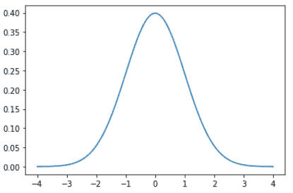

图 5.1 – 正态分布

这个标准正态分布的大多数观测值都围绕 `0`。然而，在分布的尾部观察到一些观测值是正常的。如果你有一个真正遵循这个分布的变量，并且你的样本量足够大，那么有一些远离中心的观测值并不能真正被认为是坏事。

在下面的代码中，你可以看到从标准正态分布中抽取了 1000 万个观测值的样本：

代码块 5-2

```py
import numpy as np
```

```py
import matplotlib.pyplot as plt
```

```py
data = np.random.normal(size=10000000)
```

```py
plt.hist(data, bins=25)
```

数据很好地遵循正态曲线。你可以在以下图表中看到这一点：

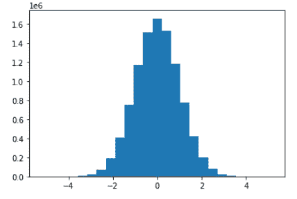

图 5.2 – 正态分布直方图

现在，让我们使用以下代码查看这个样本的最高值和最低值：

代码块 5-3

```py
min(data), max(data)
```

在当前抽取中，观察到了最小值 `5.11` 和最大值 `5.12`。现在，这些是离群值吗？答案是复杂的。当然，这两个值完全在正态分布的范围内。另一方面，它们是极端值。

这个例子说明了定义离群值并不总是容易的，需要仔细考虑你的特定用例。我们现在将看到一些异常检测的应用案例。

# 探索异常检测的应用案例

在介绍一些特定的异常检测算法之前，让我们首先考虑一些经常与异常检测一起使用的用例。

## 金融机构的欺诈检测

异常检测的一个非常常见的用例是在金融机构中检测欺诈。银行通常拥有大量数据，因为几乎每个人都有一个或多个定期使用的银行账户。所有这些使用都产生了大量可以帮助银行改善其服务和利润的数据。欺诈检测是银行数据科学应用的关键组成部分，与其他许多用例一起。

欺诈检测的一个常见用例是自动检测信用卡欺诈。想象一下，您的卡或卡信息被盗，有人正在欺诈性地使用它们。这会导致欺诈交易，这些交易可以通过机器学习算法自动检测。然后银行可以自动阻止您的卡，并要求您验证是否是您本人，或者是有人在欺诈性地进行这些支付。

这既符合银行的利益，也符合用户的利益，因此是异常检测的一个很好的用例。其他处理信用卡和支付数据的公司也可能使用这些方法。

流模型非常适合欺诈检测。通常会有大量的数据以连续的支付和其他数据流的形式进入。流模型允许您在欺诈情况发生时直接采取行动，而不是等待下一批数据被启动。

如果您想了解更多关于金融机构欺诈检测的信息，您可以查看以下链接：

+   [`www.miteksystems.com/blog/how-does-machine-learning-help-with-fraud-detection-in-banks`](https://www.miteksystems.com/blog/how-does-machine-learning-help-with-fraud-detection-in-banks)

+   [`www.sas.com/en_us/software/detection-investigation-for-banking.html`](https://www.sas.com/en_us/software/detection-investigation-for-banking.html)

## 日志数据中的异常检测

异常检测的第二个用例是日志分析。许多软件应用程序会生成包含程序执行的各种信息的巨大日志。这些日志通常被临时或长期存储以供进一步分析。在某些情况下，这些分析可能是对软件在某个时间点发生的事件的特定信息的手动搜索，但在其他时候，它们可能是自动日志处理程序。

在日志数据中执行异常检测的一个困难是，日志数据通常非常无结构。通常，它们只是文本文件中依次打印的一堆语句。很难理解这些数据。

如果您成功地完成了正确结构化和分类日志数据的挑战，那么您就可以使用机器学习技术来自动检测软件执行中的问题。这允许您立即采取行动。

在这里，使用流分析而不是批量分析同样重要。某些软件是关键任务，而停机通常意味着公司会遇到问题。这些问题可能包括合同问题和收入损失。如果一家公司能够自动检测到错误，这将使他们能够快速修复问题。问题修复得越快，公司遇到的问题就越少。

对于关于日志数据异常检测的更深入用例文献，您可以查看以下链接：

+   [`www.zebrium.com/blog/using-machine-learning-to-detect-anomalies-in-logs`](https://www.zebrium.com/blog/using-machine-learning-to-detect-anomalies-in-logs)

+   [`arxiv.org/abs/2202.04301`](https://arxiv.org/abs/2202.04301)

## 制造和生产线的故障检测

生产线故障检测的一个例子是工业食品生产业务。许多生产线几乎是完全自动化的，这意味着从原料输入到最终产品输出的过程中几乎没有人工干预。这种风险是可能会发生无法接受为最终产品的缺陷。

在生产线上使用传感器数据可以极大地帮助检测生产中的异常。当生产线有一些参数出错时，传感器与流式系统和实时警报系统的结合可以让你立即停止生产有缺陷的产品。这可以节省大量资金，因为生产废品成本很高。

在这里使用流式和实时分析也非常重要。你响应问题的时间越长，产生的浪费就越多，损失的钱也就越多。在制造和生产线上实施实时和流式分析系统可以获得巨大的投资回报。

以下链接将帮助您了解更多关于此用例的信息：

+   https://www.sciencedirect.com/science/article/pii/S2212827119301908

+   [`www.merl.com/publications/docs/TR2018-097.pdf`](https://www.merl.com/publications/docs/TR2018-097.pdf)

## 计算机网络中的黑客检测（网络安全）

网络安全的自动威胁检测是异常检测的另一个很好的用例。与其他用例一样，正面事件与负面事件相比非常罕见。然而，这些正面案例的重要性远远超过负面案例。

与以前相比，网络安全问题和泄露对公司的影响要大得多。个人数据可以卖得高价，黑客经常试图窃取这些信息，认为他们可以在电脑背后保持匿名。

威胁和异常检测系统是使用机器学习来检测非正常行为和可能代表入侵的自动化系统。如果公司能够快速应对此类事件，他们可以避免大型公开羞辱运动和可能花费大量金钱的潜在诉讼。

流式和实时系统在这里同样至关重要，因为尽可能减少入侵者行动的时间将大大降低你组织发生任何网络犯罪的风险。

以下两篇文章对这类用例进行了深入探讨：

+   [`securityboulevard.com/2021/07/what-is-anomaly-detection-in-cybersecurity/`](https://securityboulevard.com/2021/07/what-is-anomaly-detection-in-cybersecurity/)

+   [`www.xenonstack.com/insights/cyber-network-security`](https://www.xenonstack.com/insights/cyber-network-security)

## 健康数据中的医疗风险

在过去的几年里，医疗界看到了大量的发明。其中一部分是在个人工具，如智能手表和其他连接的健康设备中，这些设备允许你实时测量自己的健康关键绩效指标。其他用例可以在医院和其他专业医疗保健应用中找到。

当你的健康关键绩效指标出现异常时，立即干预通常至关重要。健康关键绩效指标信号可能在我们人类开始注意到我们的健康状况恶化之前就已经出现。即使是在事件发生后不久，这些信息也能帮助你获得正确的护理，而无需花费大量时间寻找问题的原因。

通常，你的大多数健康指标都会很好，或者至少是可以接受的，直到那个指标告诉你真的出了问题，你需要帮助。在这种情况下，与流式分析而不是批量分析合作很重要。毕竟，如果数据在下个小时或第二天到达，可能对你来说已经太晚了。这也是使用流式分析而不是批量分析的一个强有力的论据。

你可以在这里了解更多信息：

+   [`medinform.jmir.org/2021/5/e27172/`](https://medinform.jmir.org/2021/5/e27172/)

+   [`arxiv.org/pdf/2012.02364.pdf`](https://arxiv.org/pdf/2012.02364.pdf)

## 预测性维护和传感器数据

这里将要讨论的最后一个用例是预测性维护的用例。许多公司都有需要预防性维护的关键系统；如果某物损坏，这将会花费大量金钱，甚至更糟。

以航空业为例。如果飞机坠毁，这会损失许多生命。当然，没有公司能预测所有异常，但任何在坠毁前可以检测到的异常都将是一个巨大的胜利。

异常检测可用于许多具有相似问题的行业进行预测性维护；如果你能预测你的关键系统即将失效，你就有足够的时间对需要维护的部分进行维护，从而避免更大的问题。

预测性维护有时可以批量进行，但也可以从流式处理中受益。这完全取决于你从检测到异常到需要干预之间的时间量。

如果你有一个预测性维护模型，可以预测在现在和 30 分钟内飞机发动机的故障，你需要尽快将此数据提供给飞行员。如果你有预测系统告诉你下个月某个部件需要更换，你可能也可以使用批量分析。

要了解更多关于这个用例的信息，你可以查看以下链接：

+   [`www.knime.com/blog/anomaly-detection-for-predictive-maintenance-EDA`](https://www.knime.com/blog/anomaly-detection-for-predictive-maintenance-EDA)

+   [`www.e3s-conferences.org/articles/e3sconf/pdf/2020/30/e3sconf_evf2020_02007.pdf`](https://www.e3s-conferences.org/articles/e3sconf/pdf/2020/30/e3sconf_evf2020_02007.pdf)

在下一节中，您将看到异常检测模型与不平衡分类的比较。

# 比较异常检测和不平衡分类

对于检测正面案例与负面案例，标准的方法族通常是分类。对于上述问题，只要您至少有一些正面和负面案例的历史数据，您就可以使用分类算法。然而，您面临一个非常普遍的问题：只有非常少的观测值是异常的。这是一个通常被称为不平衡数据问题的难题。

## 不平衡数据的问题

不平衡数据集是指目标类别的发生分布非常不均匀的数据集。一个常见的例子是网站销售：在 1,000 名访问者中，您通常至少有 900 名只是观看和浏览，而可能只有 100 名真正购买了东西。

在不平衡数据上不加区分地使用分类方法容易出错。想象一下，您拟合了一个需要预测每位网站访问者是否会购买东西的分类模型。如果您创建了一个非常糟糕的模型，它只预测每个访问者都不会购买，那么您对 1,000 名访问者中的 900 名的预测仍然是正确的，您的准确率指标将是 90%。

有许多标准方法可以应对这种不平衡数据，包括使用 F1 分数和使用 SMOTE 过采样。

## F1 分数

F1 分数是不平衡数据情况下准确率指标的绝佳替代品。准确率是正确预测的数量除以总预测数量。

这是准确率的公式：

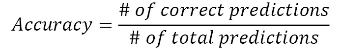

然而，F1 分数考虑了您模型的精确度和召回率。一个模型的精确度是指预测为正的样本中实际正确的百分比。您模型的召回率显示了您实际上能够检测到的正样本的百分比。

这是精确率的公式：

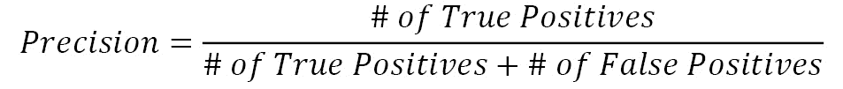

这是召回率的公式：

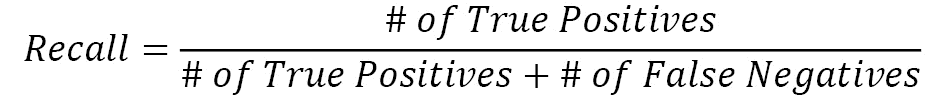

F1 分数将这两个指标结合成一个，使用以下公式：

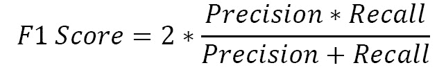

使用这个指标进行评估，您将避免将非常糟糕的模型误认为是好的模型，尤其是在不平衡数据的情况下。

## SMOTE 过采样

SMOTE 过采样是第二种你可以用来对抗数据不平衡的方法。这是一种将创建与你的正类数据点非常相似**虚假**数据点的方法。通过创建一定数量的数据点，你的模型将能够更好地了解正类，并且通过使用原始正类作为来源，你保证新生成数据点不会太偏离。

## 异常检测与分类

虽然不平衡分类问题有时可以很好地用于异常检测问题，但异常检测被视为机器学习的一个独立类别是有原因的。

主要区别在于理解正类（异常）类的外观的重要性。在分类模型中，你希望有一个模型能够轻松地区分两个（正类和负类）或更多类。为了实现这一点，你希望你的模型学会每个类的外观。模型将寻找描述一个类的变量，以及描述另一个类的其他变量或值。

在异常检测中，你并不真正关心异常类看起来像什么。你更需要的是你的模型学会什么是**正常**的。只要你的模型对正常类有很好的理解，它就能很好地判断正常与异常。这可以是任何方向和任何意义上的异常。模型不需要之前见过这种类型的异常，只需要知道它不是正常的。

在首次出现异常的情况下，标准分类模型不知道这个观察结果应该被分类到哪个类别。如果你很幸运，它可能进入异常类，但你没有理由相信它会。然而，一个专注于已知与未知之间的异常检测模型能够检测出这种异常是它以前没有见过的，因此将其分类为异常。

在下一节中，你将看到 Python 的 River 包中可用的许多异常检测算法。

# River 中检测河流异常的算法

在本章中，你将再次使用 River 进行在线机器学习算法。虽然还有其他库，但 River 是成为在线学习（除了强化学习）首选 Python 包的非常有希望的候选人。

你将看到 River 当前（版本 0.9.0）包含的两个在线机器学习算法，如下所示：

+   `OneClassSVM`：One-Class SVM 离线版本的在线自适应

+   `HalfSpaceTrees`：Isolation Forests 的在线自适应版本

你还将看到如何使用常量阈值器和分位数阈值器。

## River 异常检测中阈值器的使用

让我们先看看阈值器的使用，因为它们将围绕实际的异常检测算法。

异常检测算法通常会返回一个介于 `0` 和 `1` 之间的分数，以指示模型观察结果异常的程度。分数越接近 `1`，越可能是异常值，而分数越接近 `0`，则被认为更正常。

在实践中，你需要决定一个阈值，以确定每个观察结果是否预期为异常。为了将连续的 `0` 到 `1` 尺度转换为是/否答案，你使用一个阈值器。

### 常数阈值器

常数阈值器是最直观的方法。你将给出一个常数，将具有连续（`0` 到 `1`）异常分数的观察结果分为是/否异常，根据其是否高于或低于该常数。

例如，如果你将 `0.95` 的值指定为你的常数阈值，那么任何异常分数高于该值的观察结果将被视为异常，而任何得分低于该值的数据点则不被视为异常。

### 分位数阈值器

分位数阈值器稍微复杂一些。而不是常数，你指定一个分位数。你之前在描述性统计章节中已经见过分位数。`0.95` 的分位数意味着 95% 的观察结果低于此值，而 5% 的观察结果高于此值。

假设你使用了 `0.95` 的常数阈值，但模型没有检测到高于 `0.95` 的点。在这种情况下，常数阈值器将不会将任何观察结果分割到异常类别中。`0.95` 的分位数阈值器仍然会给你提供正好 5% 的观察结果作为异常。

最佳行为将取决于你的用例，但至少你为 River 中的异常检测准备好了两种选项。

## 异常检测算法 1 – 单类 SVM

让我们现在转到第一个异常检测算法：单类 SVM。你将首先看到单类 SVM 在异常检测中的一般概述。之后，你将看到它是如何在 River 的在线环境中进行适配的，你还将使用 Python 中的单类 SVM 进行一个 Python 用例。

### 单类 SVM 在异常检测中的通用应用

单类 SVM 是一种基于支持向量机（SVM）分类算法的无监督异常检测算法。

SVMs 是常用的分类或其他监督学习模型。在监督学习中，它们因使用核技巧而闻名，该技巧将输入映射到高维特征空间。通过这个过程，SVMs 能够生成非线性分类。

如前所述，异常检测算法需要理解什么是正常，但它们不需要理解非正常类别。因此，单类 SVM 是对常规 SVM 的改进。在常规的监督 SVM 中，你需要指定类别（目标变量），但在单类 SVM 中，你将所有数据视为单个类别。

基本上，One-Class SVM 只会拟合一个 SVM，它试图拟合一个模型，该模型最好地预测所有变量作为同一目标类。当模型拟合良好时，个体中预测误差最大的人将会有较低的误差。

对于最佳拟合模型的误差分数高的个体，使用与其他个体相同的模型进行预测是困难的。您可以考虑它们可能需要另一个模型，因此假设这些个体不是来自同一数据生成过程。因此，它们很可能是有异常值的。

误差被用作阈值分数来分割个体。误差分数高的个体可以被认为是异常值，而误差分数低的个体可以被认为是正常的。这种分割通常使用之前引入的量数阈值来完成。

### River 中的在线 One-Class SVM

River 中的 `OneClassSVM` 模型在文档中被描述为 One-Class SVM 的随机实现，并且不幸的是，它不会完美地匹配算法的离线定义。如果对于您的用例来说找到精确的结果很重要，您可以考虑尝试在线和离线实现，并查看它们之间的差异有多大。

通常，异常值检测是一个无监督任务，很难完全确定最终答案和模型的精确度。只要您监控结果并认真对待 KPI 选择和业务结果的跟踪，这并不是一个问题。

### 用例应用

现在我们使用 River 应用 One-Class SVM 的在线训练过程。

对于这个例子，让我们创建自己的数据集，这样我们就可以确定哪些数据应该被认为是异常值或不是：

1.  让我们创建一个在 `0` 和 `1` 之间有 1,000 个观测值的均匀分布变量：

代码块 5-4

```py
import numpy as np
normal_data = np.random.rand(1000)
```

1.  当前运行的直方图可以准备如下，但它会因随机性而改变：

代码块 5-5

```py
import matplotlib.pyplot as plt
plt.hist(normal_data)
```

结果图将显示以下直方图：

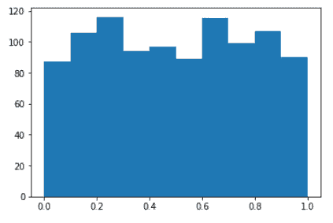

图 5.3 – 正常数据的绘图

1.  由于我们非常了解这个分布，我们知道可以期待什么：任何介于 `0` 和 `1` 之间的数据点是正常的，而任何在 `0` 到 `1` 之外的数据点都是异常值。现在让我们向数据中添加 1% 的异常值。让我们制作 0.5% 的易于检测的异常值（在 `2` 和 `3` 之间和 `-1` 和 `-2` 之间的随机整数），这非常远离我们的正常分布。让我们也将 0.5% 的异常值设置得稍微难以检测（在 `0` 和 `-1` 之间和 `1` 和 `2` 之间）。

这样我们就可以挑战模型并查看其表现如何：

代码块 5-6

```py
hard_to_detect = list(np.random.uniform(1,2,size=int(0.005*1000))) + \
                  list(np.random.uniform(0,-1,size=int(0.005*1000)))
easy_to_detect = list(np.random.uniform(2,3,size=int(0.005*1000))) + \
                  list(np.random.uniform(-1,-2,size=int(0.005*1000)))
```

1.  让我们把所有这些数据放在一起，编写代码以流式传输的方式将其传递给模型，如下所示：

代码块 5-7

```py
total_data = list(normal_data) + hard_to_detect + easy_to_detect
import random
random.shuffle(total_data)
for datapoint in total_data:
  pass
```

1.  现在，唯一剩下要做的就是将模型添加到循环中：

代码块 5-8

```py
# Anomaly percentage for the quantile thresholder
expected_percentage_anomaly = 20/1020
expected_percentage_normal = 1 - expected_percentage_anomaly
```

1.  在这里，你可以拟合模型：

代码块 5-9

```py
!pip install river
from river import anomaly
model = anomaly.QuantileThresholder(
    anomaly.OneClassSVM(),
    q=expected_percentage_normal
    )
for datapoint in total_data:
    model = model.learn_one({'x': datapoint})
```

当运行此代码时，您现在已经在我们的合成数据点上训练了一个在线单类 SVM！

1.  让我们尝试了解它的工作效果。在以下代码中，您可以看到如何获取每个个体的分数以及分配给类别的操作：

代码块 5-10

```py
scores = []
for datapoint in total_data:
    scores.append(model.score_one({'x': datapoint}))
```

1.  正如我们所知，实际结果，我们现在可以比较答案是否正确。您可以使用以下代码来完成此操作：

代码块 5-11

```py
import pandas as pd
results = pd.DataFrame({'data': total_data , 'score': scores})
results['actual_outlier'] = (results['data'] > 1 ) | (results ['data'] < 0)
# there are 20 actual outliers
results['actual_outlier'].value_counts()
```

结果如下所示：

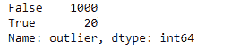

图 5.4 – 代码块 5-11 的结果

1.  以下代码块将计算算法检测到的值的计数：

代码块 5-12

```py
# the algo detected 22 outliers
results['score'].value_counts()
```

下图显示检测到了 22 个异常值：

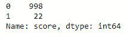

图 5.5 – 代码块 5-12 的结果

1.  我们现在应该计算检测到的异常值中有多少是真正的异常值，有多少不是真正的异常值。这将在以下代码块中完成：

代码块 5-13

```py
# in the 22 detected otuliuers, 10 are actual outliers, but 12 are not actually outliers
results.groupby('actual_outlier')['score'].sum()
```

结果是，在检测到的 22 个异常值中，有 10 个是真正的异常值，但 12 个实际上不是异常值。这可以在以下图中看到：

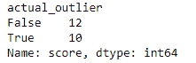

图 5.6 – 代码块 5-13 的结果

获得的结果还不错：至少一些异常值被正确检测到，这可以是一个好的最小可行产品，以开始自动化特定用例的异常检测。让我们看看我们是否能用不同的异常检测算法打败它！

## 异常检测算法 2 – 半空间树

您在这里将看到的第二个主要异常检测算法是 Isolation Forests 的在线替代品，这是一种常用且性能良好的异常检测算法。

### 异常检测中 Isolation Forests 的一般使用

Isolation Forests 的工作方式与大多数异常检测算法略有不同。正如本章所述，许多模型通过首先理解正常数据点，然后决定一个数据点是否相对类似于其他正常点来进行异常检测。如果不是，则被视为异常值。

Isolation Forests 是一项伟大的发明，因为它们的工作方式相反。它们试图模拟所有非正常的事物，并试图将这些点从其余部分隔离出来。

为了隔离观察值，Isolation Forest 将随机选择特征，然后在最小值和最大值之间分割特征。隔离样本所需的分割次数被认为是观察值的**隔离分数**的良好描述。

如果它容易隔离（隔离路径短，相当于有很少的分割来隔离该点），那么它可能是一个相对孤立的数据点，我们可以将其归类为异常值。

### 它与 River 的变化如何？

在 River 中，模型必须在线训练，他们不得不做一些调整才能使其工作。一些调整被做出来的事实是为什么在 River 中把模型称为`HalfSpaceTrees`的原因。

作为需要记住的一点，异常值必须在数据集中分散分布，以便模型能够良好工作。此外，模型需要所有值都在`0`到`1`之间。

### 在异常检测用例中应用半空间树

我们将按以下方式实现：

1.  让我们现在将半空间树应用于相同的单变量用例，看看会发生什么：

代码块 5-14

```py
from river import anomaly
model2 = anomaly.QuantileThresholder(
    anomaly.HalfSpaceTrees(),
    q=expected_percentage_normal
    )
for datapoint in total_data:
    model2 = model2.learn_one({'x': datapoint})
scores2 = []
for datapoint in total_data:
    scores2.append(model2.score_one({'x': datapoint}))

import pandas as pd
results2 = pd.DataFrame({'data': total_data, 'score': scores2})
results2['actual_outlier'] = (results2 ['data'] > 1 ) | (results2['data'] < 0)
# there are 20 actual outliers
results2['actual_outlier'].value_counts()
```

该代码块的结果可以在以下图中看到。看起来有 20 个实际异常值：

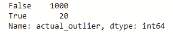

图 5.7 – 代码块 5-14 的结果

1.  您现在可以使用以下代码计算模型检测到的异常值数量：

代码块 5-15

```py
# the algo detected 29 outliers
results2['score'].value_counts()
```

看起来算法检测到了 29 个异常值。这可以在以下图中看到：

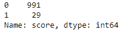

图 5.8 – 代码块 5-15 的结果

1.  我们现在将计算这 29 个检测到的异常值中有多少实际上是异常值，以查看我们的模型是否有效：

代码块 5-16

```py
# the 29 detected outliers are not actually outliers
results2.groupby('actual_outlier')['score'].sum()
```

结果显示，我们检测到的 29 个异常值实际上并不是异常值，这表明这个模型不适合这项任务。这实际上并没有什么问题。毕竟，这正是进行模型基准测试的精确原因：

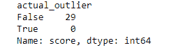

图 5.9 – 代码块 5-16 的结果

如您所见，这个模型在当前用例中的性能较差。总之，One-Class SVM 在我们的 1000 次均匀分布在区间`0`到`1`的样本中识别异常方面表现更好。

# 进一步进行异常检测

要进一步探索异常检测用例，您可以尝试使用不同的数据集，甚至尝试您自己的用例数据集。如您在示例中看到的，数据点作为字典输入。在当前示例中，您使用了单变量数据点：字典中只有一个条目。

在实践中，您通常会遇到多元问题，您的输入会有多个变量。模型可能能够在这样的用例中更好地拟合。

# 摘要

在本章中，您已经学习了异常检测如何在流和非流环境中工作。这类机器学习模型会收集关于某个情况的一组变量，并使用这些信息来检测特定数据点或观察结果是否可能与其他数据不同。

您已经对这些用例的概述有了了解。其中一些包括 IT 系统的监控或制造业的生产线传感器数据。当数据点与其他数据点差异太大时，异常检测具有很大的附加价值。

你通过实现一个模型基准测试完成了这一章节，在这个基准测试中，你测试了 River 库中的两个在线异常检测模型。你看到其中一个模型能够检测到部分异常，而另一个模型的表现则非常糟糕。这不仅让你了解了异常检测，还让你接触到了模型基准测试和模型评估。

在下一章中，你将看到更多关于这些主题的内容。你将致力于在线分类模型，你将再次看到如何实现模型基准测试和指标，但这次是为了分类而不是异常检测。正如你在本章中看到的，分类有时也可以用于异常检测，这使得这两个用例相互关联。

# 进一步阅读

+   *异常检测*: [`en.wikipedia.org/wiki/Anomaly_detection`](https://en.wikipedia.org/wiki/Anomaly_detection)

+   *River ML 常数阈值器*: [`riverml.xyz/latest/api/anomaly/ConstantThresholder/`](https://riverml.xyz/latest/api/anomaly/ConstantThresholder/)

+   *River ML 分位数阈值器*: [`riverml.xyz/latest/api/anomaly/QuantileThresholder/`](https://riverml.xyz/latest/api/anomaly/QuantileThresholder/)

+   *支持向量机*: [`en.wikipedia.org/wiki/Support-vector_machine`](https://en.wikipedia.org/wiki/Support-vector_machine)

+   *Scikit Learn 单类支持向量机*: [`scikit-learn.org/stable/modules/generated/sklearn.svm.OneClassSVM.html`](https://scikit-learn.org/stable/modules/generated/sklearn.svm.OneClassSVM.html)

+   *River ML 单类支持向量机*: [`riverml.xyz/latest/api/anomaly/OneClassSVM/`](https://riverml.xyz/latest/api/anomaly/OneClassSVM/)

+   *隔离森林*: [`en.wikipedia.org/wiki/Isolation_forest`](https://en.wikipedia.org/wiki/Isolation_forest)

+   *River ML 半空间树*: [`riverml.xyz/latest/api/anomaly/HalfSpaceTrees/`](https://riverml.xyz/latest/api/anomaly/HalfSpaceTrees/)
