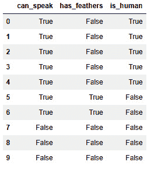
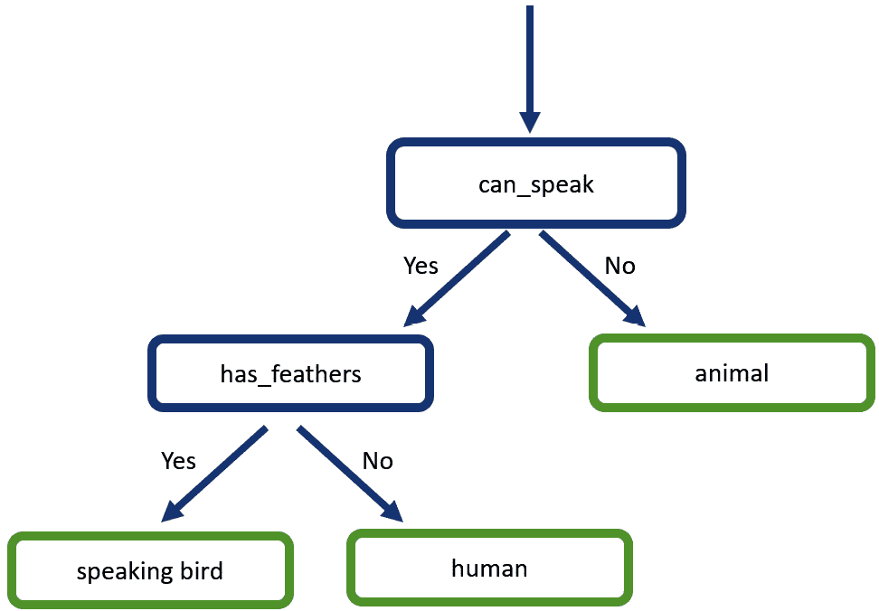
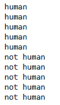

# *第六章*：在线分类

在前两章中，你被介绍了一些基本的分类概念。你首先看到了一个用例，其中 River 中的在线分类模型被用来构建一个可以根据植物的一些特征识别鸢尾花种类的模型。这个鸢尾花数据集是世界上最好的数据集之一，也是分类的非常常见的起点。

之后，你看到了异常检测。我们讨论了在我们可以将异常标记为一类，将非异常标记为另一类的情况下，分类模型可以用于异常检测。特定的异常检测模型通常在任务上表现更好，因为它们努力理解只有非异常。分类模型将努力理解每个类别。

在本章中，你将更深入地学习分类。本章将从定义什么是分类以及它可以用于什么目的开始。然后，你将看到一些分类模型，你将学习它们在线和离线版本之间的区别。你还将使用 River 包在 Python 中实现多个示例。最终，这将导致对稍后将要介绍的使用案例进行模型基准测试研究。

本章将涵盖以下主题：

+   定义分类

+   识别分类的使用案例

+   River 中的分类算法

# 技术要求

你可以在以下链接的 GitHub 上找到本书的所有代码：[`github.com/PacktPublishing/Machine-Learning-for-Streaming-Data-with-Python`](https://github.com/PacktPublishing/Machine-Learning-for-Streaming-Data-with-Python)。如果你还不熟悉 Git 和 GitHub，下载笔记本和代码样本的最简单方法是以下：

1.  前往仓库链接。

1.  点击绿色的**代码**按钮。

1.  选择**下载 ZIP**。

当你下载 ZIP 文件时，在你的本地环境中解压缩它，你将能够通过你偏好的 Python 编辑器访问代码。

## Python 环境

为了跟随本书的内容，你可以从仓库下载代码，并使用你偏好的 Python 编辑器执行它。

如果你还不熟悉 Python 环境，我建议你查看 Anaconda（[`www.anaconda.com/products/individual`](https://www.anaconda.com/products/individual)），它包含 Jupyter Notebook 和 JupyterLab，这两个都是执行笔记本的绝佳选择。它还包含 Spyder 和 VSCode，用于编辑脚本和程序。

如果你安装 Python 或相关程序有困难，你可以查看 Google Colab（[`colab.research.google.com/`](https://colab.research.google.com/)）或 Kaggle 笔记本（[`www.kaggle.com/code`](https://www.kaggle.com/code)），这两个都允许你在在线笔记本中免费运行 Python 代码，无需任何设置。

# 定义分类

在本章中，你将了解分类。分类是一种监督机器学习任务，其中构建了一个模型，该模型将观察结果分配到某个类别。

每个人都倾向于知道的简单类型的分类模型是决策树。让我们考虑一个决策树如何用于分类的超级简单例子。

想象一下，我们有一个包含关于五个人类和五个动物观察结果的数据集。目标是使用这些数据构建一个决策树，该树可以用于任何新的、未见过的动物或人类。

数据可以按以下方式导入：

代码块 6-1

```py
import pandas as pd
```

```py
# example to classify human vs animal
```

```py
#dataset with one variable
```

```py
can_speak = [True,True,True,True,True,True,True,False,False,False]
```

```py
has_feathers = [False,False,False,False,False,True,True,False,False,False]
```

```py
is_human = [True,True,True,True,True,False,False,False,False,False]
```

```py
data = pd.DataFrame({'can_speak': can_speak, 'has_feathers': has_feathers, 'is_human': is_human})
```

```py
data
```

数据如下所示：



图 6.1 – 数据

现在，为了构建决策树，你通常会使用机器学习，因为手动构建树要低效得多。然而，在这个例子中，让我们构建一个简单的决策树，它的工作方式如下所示：



图 6.2 – 示例决策树

当然，这是一个模型，所以它只是对真相的部分表示。它对于当前 10 个观察结果的数据集工作得相当好，但如果有更多的数据点，你会遇到各种异常，因此你需要更多的变量。

你可以用 Python 编写以下代码来为“人类”与“非人类”分类模型编码：

代码块 6-2

```py
def self_made_decision_tree(observation):
```

```py
    if observation.can_speak:
```

```py
        if not observation.has_feathers:
```

```py
            return 'human'
```

```py
    return 'not human'
```

```py
for i,row in data.iterrows():
```

```py
    print(self_made_decision_tree(row))
```

结果如下：



图 6.3 – 预测结果

这种方法的背后的一般思想是，任何使用数据生成决策规则以将观察结果分配到特定类别的机器学习模型都是分类模型。在下一节中，我们将探讨一些分类用例，以更好地了解它在实际应用中的用途。

# 识别分类用例

分类用例非常广泛；它是许多项目中非常常用的方法。尽管如此，让我们看看一些例子，以更好地了解可以从中受益的不同类型的用例。

## 用例 1 – 电子邮件垃圾邮件分类

基于分类的第一个用例通常是电子邮件中的**垃圾邮件检测**。垃圾邮件已经存在很长时间了。向人们发送虚假电子邮件以窃取金钱的商业模式是一个大问题，而且收到许多垃圾邮件会负面影响你的电子邮件体验。

电子邮件服务提供商在自动检测垃圾邮件并将其发送到你的垃圾邮件/垃圾箱方面已经走了很长的路。如今，这一切都是自动完成的，并且高度依赖于机器学习。

如果你将此与我们超级小的分类示例进行比较，你可以想象决策树（或任何其他模型）可以接收关于每封接收到的电子邮件的几种信息类型，并使用这些信息来决定该电子邮件是否应该被分类为垃圾邮件。这必须实时完成，因为没有人愿意等待垃圾邮件检测服务最终发送他们的电子邮件。

你可以在以下资源中了解更多关于此用例的信息：

+   [`www.sciencedirect.com/science/article/pii/S2405844018353404`](https://www.sciencedirect.com/science/article/pii/S2405844018353404)

+   [`www.enjoyalgorithms.com/blog/email-spam-and-non-spam-filtering-using-machine-learning`](https://www.enjoyalgorithms.com/blog/email-spam-and-non-spam-filtering-using-machine-learning)

## 用例 2 – 手机摄像头中的面部检测

分类决策的第二个例子是在你想要解锁手机时进行面部检测。你的手机必须在一瞬间做出决定，看它看到的脸是不是所有者的脸。

这个决策是一个分类决策，因为它最终归结为一个是/否的决策：它是所有者，或者它不是所有者。这个决策通常由机器学习来完成，因为规则会非常复杂，难以用`if`/`else`语句写下来。如今，机器学习算法在处理此类用例方面相对较好。

对于此用例的其他更详细示例，你可以查看以下链接：

+   [`www.xfinity.com/hub/mobile/facial-recognition-on-phone`](https://www.xfinity.com/hub/mobile/facial-recognition-on-phone)

+   [`www.nytimes.com/wirecutter/blog/how-facial-recognition-works/`](https://www.nytimes.com/wirecutter/blog/how-facial-recognition-works/)

## 用例 3 – 在线营销广告选择

最后要添加到前两个用例中的例子是在线营销广告选择。如今，许多网站都会显示个性化的广告。这意味着你将看到与你作为客户相匹配的广告。

个性化广告系统并不是发明广告；它们必须做出决定，在多个可用的广告中选择一个最适合你的。因此，这是一个分类问题，因为它必须在多个选择之间做出决定。

正如你所理解的，页面加载必须快速，因此广告选择也必须在瞬间完成。实时响应对于模型提供任何价值至关重要。

以下链接更深入地讨论了此用例：

+   [`www.owox.com/blog/articles/machine-learning-in-marketing/`](https://www.owox.com/blog/articles/machine-learning-in-marketing/)

+   [`www.ibm.com/watson-advertising/thought-leadership/benefits-of-machine-learning-in-advertising`](https://www.ibm.com/watson-advertising/thought-leadership/benefits-of-machine-learning-in-advertising)

在下一节中，你将看到进行分类的更实际的一面，因为你将发现 River Python 库中的几个分类算法。

# River 中分类算法概述

River 在线机器学习包中有大量的在线分类模型。

以下是一些相关的选择：

+   `LogisticRegression`

+   `Perceptron`

+   `AdaptiveRandomForestClassifier`

+   `ALMAClassifier`

+   `PAClassifier`

## 分类算法 1 – 逻辑回归

逻辑回归是最基本的统计分类模型之一。它模型化了一个具有两个类别（1 或 0）的因变量（目标变量），并且可以使用多个自变量进行预测。

模型将每个自变量组合为对数几率；你可以将其视为线性回归中的系数，只是它们是每个变量的对数几率。模型中的分割基于逻辑函数。

你可以按照以下简化示意图来理解这个想法：

![图 6.4 – 逻辑曲线]

![图片 B18335_06_4.jpg]

图 6.4 – 逻辑曲线

### River 中的逻辑回归

对于在线逻辑回归，你可以在 River 的`linear_model`部分使用`LogisticRegression`类。现在让我们看看一个例子：

1.  首先，你可以通过使用 sklearn 内置的`make_blobs`函数来创建一个分类数据集，该函数用于创建分类数据集。你可以使用以下代码来完成这个任务：

代码块 6-3

```py
from sklearn.datasets import make_blobs
X,y=make_blobs(shuffle=True,centers=2,n_samples=2000)
```

1.  为了了解这个数据集的样子，制作一个图表是很重要的。你可以使用以下`matplotlib`代码来完成这个任务：

代码块 6-4

```py
import matplotlib.pyplot as plt
plt.scatter(X[:,0], X[:,1], c=y)
```

你应该得到以下图表，或者类似的东西：

![图 6.5 – 数据]

![图片 B18335_06_5.jpg]

图 6.5 – 数据

1.  为了确保你的模型评估是公平的，在数据中制作一个训练-测试分割是很重要的。你可以使用 sklearn 的`train_test_split`来完成这个任务，如下所示：

代码块 6-5

```py
from sklearn.model_selection import train_test_split
X_train, X_test, y_train, y_test = train_test_split(X, y, test_size=0.33, random_state=42)
```

1.  现在让我们继续讨论逻辑回归模型的应用。以下代码展示了如何逐个数据点拟合模型。请注意，你应该使用输入数据`x`的 JSON 转换，因为这是 River 所要求的：

代码块 6-6

```py
!pip install river
from river import linear_model
model=linear_model.LogisticRegression()
for x_i,y_i in zip(X_train,y_train):  
    x_json = {'val1': x_i[0], 'val2': x_i[1]}
    print(x_json, y_i)
    model.learn_one(x_json,y_i)
```

打印的数据将看起来像这样：

![图 6.6 – 代码块 6-6 的输出]

![图片 B18335_06_6.jpg]

图 6.6 – 代码块 6-6 的输出

1.  你也可以逐个进行预测，或者使用`predict_many`在测试集上一次性进行所有预测。结果不会有任何区别。在以下代码中，使用了`predict_many`：

代码块 6-7

```py
import pandas as pd
preds = model.predict_many(pd.DataFrame(X_test,columns=['val1', 'val2']))
```

1.  为了得到这个预测的质量指标，让我们使用`scikit-learn`的准确度评分。正如你可以在以下代码块中看到的那样，模型在 blob 数据示例上获得了 100%的准确率。必须指出的是，这个 blob 数据示例是一个简单的预测任务，因为数据可以被一条直线完美地分开，正如之前显示的图表中所示：

代码块 6-8

```py
from sklearn.metrics import accuracy_score
accuracy_score(y_test, preds)
```

这应该会产生以下输出：

![图 6.7 – 代码块 6-8 的输出]

![图片 B18335_06_7.jpg]

图 6.7 – 代码块 6-8 的输出

## 分类算法 2 – 感知器

感知器是另一个用于分类问题的监督学习算法。它接受输入，将它们乘以权重，并将这些乘积通过激活函数。输出是得到的分类。以下图表显示了一个示例：

![Figure 6.8 – 感知器的示意图]

![img/B18335_06_8.jpg]

图 6.8 – 感知器的示意图

### River 中的感知器

与逻辑回归一样，感知器是一个常用的离线模型，River 已经将其改造成在线模型。在 River 中，感知器被实现为逻辑回归的一个特例。

你可以使用感知器就像逻辑回归一样。你可以使用与之前案例相同的代码示例，如下所示：

代码块 6-9

```py
# make data
```

```py
from sklearn.datasets import make_blobs
```

```py
X,y=make_blobs(shuffle=True,centers=2,n_samples=2000)
```

```py
# train test split
```

```py
from sklearn.model_selection import train_test_split
```

```py
X_train, X_test, y_train, y_test = train_test_split(X, y, test_size=0.33, random_state=42)
```

```py
# build the model
```

```py
from river import linear_model
```

```py
model=linear_model.Perceptron()
```

```py
# fit the model
```

```py
for x_i,y_i in zip(X_train,y_train):
```

```py
    x_json = {'val1': x_i[0], 'val2': x_i[1]}
```

```py
    model.learn_one(x_json,y_i)
```

```py
# predict on the test set
```

```py
import pandas as pd
```

```py
preds = model.predict_many(pd.DataFrame(X_test,columns=['val1', 'val2']))
```

```py
# compute accuracy
```

```py
from sklearn.metrics import accuracy_score
```

```py
accuracy_score(y_test, preds) 
```

结果是 `1.0`，不出所料，这与逻辑回归的结果相同。

## 分类算法 3 – AdaptiveRandomForestClassifier

在介绍中，你已经看到了决策树背后的基本思想。随机森林是一个改进决策树的集成模型。

随机森林背后的思想是，通过构建大量略微不同的决策树来减少单个决策树的误差。在大量决策树中最常见的预测被保留为最终预测。

决策树通过在每个略微不同的数据集上拟合它们而略有不同，这些数据集是通过重采样观测值创建的。还有一个用于创建决策树分割的变量子集。

### River 中的随机森林

对于在线学习，数据需要逐个拟合到随机森林中，这并不是一件容易的事情。River 的实现基于随机森林的两个关键元素，即重采样和变量子集。他们还为每个单个决策树添加了漂移检测：

1.  让我们使用一个替代的数据创建函数，它创建的数据比 blob 更难分离。这个来自 `sklearn` 的函数叫做 `make_classification`：

代码块 6-10

```py
# make data
from sklearn.datasets import make_classification
X,y=make_classification(shuffle=True,n_samples=2000)
pd.DataFrame(X).head()
```

数据如下所示：

![Figure 6.9 – 新数据]

![img/B18335_06_9.jpg]

图 6.9 – 新数据

1.  默认情况下，生成了总共 20 个变量，其中一些被自动赋予更高的相关性，而一些则大部分无关。让我们像之前一样进行训练-测试分割：

代码块 6-11

```py
# train test split
from sklearn.model_selection import train_test_split
X_train, X_test, y_train, y_test = train_test_split(X, y, test_size=0.33, random_state=42)
```

1.  使用这个训练-测试分割，我们可以继续构建模型：

代码块 6-12

```py
from river import ensemble
model = ensemble.AdaptiveRandomForestClassifier()
# fit the model
for x_i,y_i in zip(X_train,y_train):
    x_json = {'val'+str(i): x for i,x in enumerate(x_i)}
    model.learn_one(x_json,y_i)
```

1.  现在模型已经拟合，我们可以在测试集上进行预测。这里没有 `predict_many` 函数，所以需要通过重复使用 `predict_one` 来进行循环：

代码块 6-13

```py
# predict on the test set
import pandas as pd
preds = []
for x_i in X_test:
    x_json = {'val'+str(i): x for i,x in enumerate(x_i)}
    preds.append(model.predict_one(x_json))
```

1.  作为最后一步，让我们计算这个模型的准确率：

代码块 6-14

```py
# compute accuracy
from sklearn.metrics import accuracy_score
accuracy_score(y_test, preds)
```

1.  结果是 `0.86`。当然，数据集更难预测，所以这不是一个坏分数。作为额外的指标，我们可以查看分类报告以获取更多信息：

代码块 6-15

```py
# classification report
from sklearn.metrics import classification_report
print(classification_report(y_test, preds))
```

结果显示在下图中：


图 6.10 – 代码块 6-15 的输出

在这个分类报告中，你可以看到精确度、召回率和正负样本的分数都相对均衡。这表明分类器没有不平衡，这在依赖于准确度分数时非常重要。

## 分类算法 4 – ALMAClassifier

现在你已经看到了一些适应在线学习的常用机器学习分类模型，是时候看看一些更具体的模型了。这些模型中的第一个是 ALMA 分类器。

**近似大间隔算法**（**ALMA**）分类器是**支持向量机**（**SVMs**）的增量实现，这是一种常用的机器学习分类模型。

你在前一章中看到了 SVMs 的适应：单类 SVM 通常用于异常检测。对于分类，你会使用常规（双类）SVM。

### River 中的 ALMAClassifier

让我们看看 ALMAClassifier 与自适应随机森林如何比较，通过在相同的数据上执行它：

1.  我们首先应用之前已经定义的相同代码：

代码块 6-16

```py
# make data
from sklearn.datasets import make_classification
X,y=make_classification(shuffle=True,n_samples=2000)
# train test split
from sklearn.model_selection import train_test_split
X_train, X_test, y_train, y_test = train_test_split(X, y, test_size=0.33, random_state=42)
from river import linear_model
model = linear_model.ALMAClassifier()
# fit the model
for x_i,y_i in zip(X_train,y_train):
    x_json = {'val'+str(i): x for i,x in enumerate(x_i)}
    model.learn_one(x_json,y_i) 
# predict on the test set
import pandas as pd
preds = []
for x_i in X_test:
    x_json = {'val'+str(i): x for i,x in enumerate(x_i)}
    preds.append(model.predict_one(x_json))
# compute accuracy
from sklearn.metrics import accuracy_score
accuracy_score(y_test, preds)
```

1.  结果是`0.77`，不如随机森林。让我们也检查一下分类报告，看看那里是否有什么变化：

代码块 6-17

```py
# classification report
from sklearn.metrics import classification_report
print(classification_report(y_test, preds))
```

1.  结果显示在下图中：


图 6.11 – 代码块 6-17 的输出

这里有一些轻微的变化，但没有什么看起来太令人震惊。总的来说，随机森林在这个数据上整体表现更好。

## 分类算法 5 – PAClassifier

**被动-攻击**（**PA**）分类器是一个在线机器学习模型，它与任何现有的离线模型都不相关。它基于在每一步更新模型的想法，从而解决以下问题：

*分类器的更新是通过解决一个约束优化问题来完成的：我们希望新的分类器尽可能接近当前的分类器，同时在最近的例子上至少实现一个单位的间隔。*

这段话摘自以下关于 PA 算法的论文，这也是一个有趣的进一步阅读的参考文献：[`jmlr.csail.mit.edu/papers/volume7/crammer06a/crammer06a.pdf`](https://jmlr.csail.mit.edu/papers/volume7/crammer06a/crammer06a.pdf)。

“被动-攻击”这个名字来源于这样的想法，即从每个新的数据点学习得太快的算法被认为是过于激进。PA 不那么激进。

### River 中的 PAClassifier

让我们看看 PA 分类器在执行与之前两个模型相同任务时的表现：

代码块 6-18

```py
# make data
```

```py
from sklearn.datasets import make_classification
```

```py
X,y=make_classification(shuffle=True,n_samples=2000)
```

```py
# train test split
```

```py
from sklearn.model_selection import train_test_split
```

```py
X_train, X_test, y_train, y_test = train_test_split(X, y, test_size=0.33, random_state=42)
```

```py
from river import linear_model
```

```py
model = linear_model.PAClassifier()
```

```py
# fit the model
```

```py
for x_i,y_i in zip(X_train,y_train):
```

```py
    x_json = {'val'+str(i): x for i,x in enumerate(x_i)}
```

```py
    model.learn_one(x_json,y_i)
```

```py
# predict on the test set
```

```py
import pandas as pd
```

```py
preds = []
```

```py
for x_i in X_test:
```

```py
    x_json = {'val'+str(i): x for i,x in enumerate(x_i)}
```

```py
    preds.append(model.predict_one(x_json))
```

```py
# compute accuracy
```

```py
from sklearn.metrics import accuracy_score
```

```py
accuracy_score(y_test, preds)
```

获得的分数是`0.85`。接下来的部分总结了我们所获得的所有分数。

## 评估基准结果

这为我们留下了过去三个模型的以下准确率分数：


表 6.1 – 包含结果的表格

最佳结果由自适应随机森林获得，PAClassifier 排名第二。ALMAClassifier 的表现较差，得分为`0.77`。

# 摘要

在本章中，你首先看到了分类及其用例的概述。你了解了它与异常检测的不同之处，但有时它仍然可以应用于异常检测用例。

你已经了解了五种在线分类模型，其中一些主要是离线模型的改编，而其他一些则是专门设计用于在线工作的。这两种类型都存在，在为最终模型做出选择之前，拥有评估模型性能的工具是很重要的。

你在 Python 中执行的模型基准测试是为了找到在测试集上模型准确率最高的模型。你已经看到了基准测试模型之间的明显差异，这是模型基准测试重要性的一个很好的展示。

在接下来的章节中，你将进行相同类型的模型基准测试练习，但这次你将专注于回归用例，其目标与分类的目标在本质上不同。这涉及到对误差测量和基准测试的一些变化，但从高层次来看，也与你在本章中使用的分类基准测试用例有很多共同之处。

# 进一步阅读

+   *逻辑回归*: [`riverml.xyz/latest/api/linear-model/LogisticRegression/`](https://riverml.xyz/latest/api/linear-model/LogisticRegression/)

+   *感知器*: [`riverml.xyz/latest/api/linear-model/Perceptron/`](https://riverml.xyz/latest/api/linear-model/Perceptron/)

+   *自适应随机森林分类器*: [`riverml.xyz/latest/api/ensemble/AdaptiveRandomForestClassifier/`](https://riverml.xyz/latest/api/ensemble/AdaptiveRandomForestClassifier/)

+   *ALMA*: [`riverml.xyz/latest/api/linear-model/ALMAClassifier/`](https://riverml.xyz/latest/api/linear-model/ALMAClassifier/)

+   *ALMA*: [`www.jmlr.org/papers/volume2/gentile01a/gentile01a.pdf`](https://www.jmlr.org/papers/volume2/gentile01a/gentile01a.pdf)

)

+   *PAClassifier*: [`riverml.xyz/latest/api/linear-model/PAClassifier/`](https://riverml.xyz/latest/api/linear-model/PAClassifier/

)

+   *PAClassifier*: [`jmlr.csail.mit.edu/papers/volume7/crammer06a/crammer06a.pdf`](https://jmlr.csail.mit.edu/papers/volume7/crammer06a/crammer06a.pdf

)

+   *make_classification*: [`scikit-learn.org/stable/modules/generated/sklearn.datasets.make_classification.htm`](https://scikit-learn.org/stable/modules/generated/sklearn.datasets.make_classification.htm

)

+   *make_blobs*: [`scikit-learn.org/stable/modules/generated/sklearn.datasets.make_blobs.html`](https://scikit-learn.org/stable/modules/generated/sklearn.datasets.make_blobs.html)
