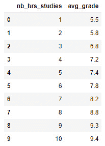
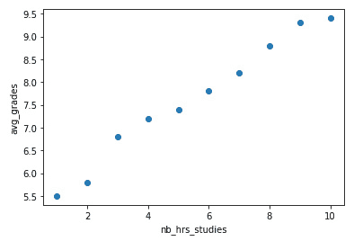
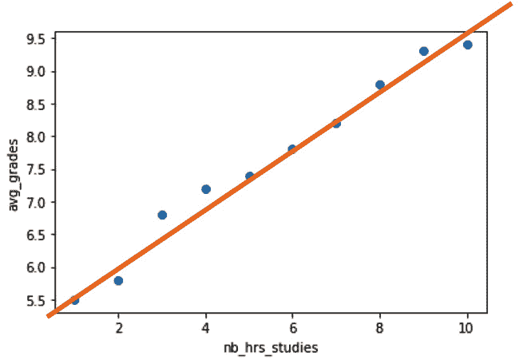
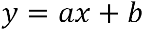
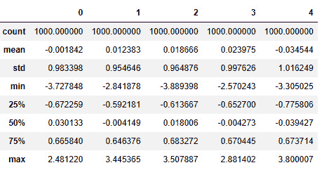
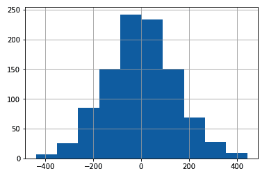
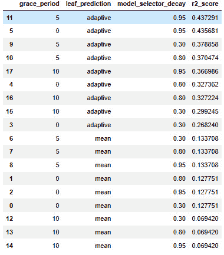
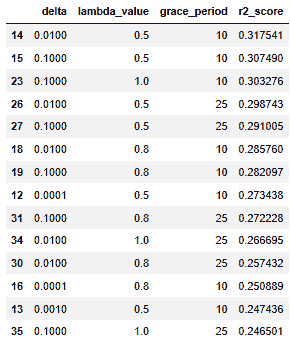
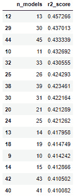

# *第七章*: 在线回归

在前几章中查看在线异常检测和在线分类之后，还有一个大型在线机器学习类别尚未探讨。**回归**是适用于目标变量为数值型用例的监督机器学习模型系列。

在异常检测和分类中，你已经看到了如何构建模型来预测分类目标（是/否和鸢尾花种类），但你还没有看到如何处理数值型目标。处理数值数据需要具有不同的方法，不仅在模型训练和定义的深层，也在我们使用指标时。

想象你是一名天气预报员，试图预测明天的温度（摄氏度）。也许你期待一个晴朗的日子，并且你有一个用来预测 25 摄氏度温度的模型。想象一下，第二天你发现天气很冷，只有 18 度；你显然预测错了。

现在，假设你预测了 24 度。在分类用例中，你可能倾向于说 25 度不是 24 度，所以结果是错误的。然而，24 度的结果比 18 度的结果**更不错误**。

在回归中，单个预测可能或多或少是错误的。在实践中，你很少会完全正确。在分类中，你可能对或错，所以这是不同的。这引入了新的指标和模型基准测试过程的变化。

在本章中，你将首先深入了解回归模型，重点关注 River 中的在线回归模型。之后，你将着手进行一个回归模型基准测试。

本章涵盖了以下主题：

+   定义回归

+   回归用例

+   River 中回归算法概述

# 技术要求

你可以在 GitHub 上找到这本书的所有代码，链接如下：[`github.com/PacktPublishing/Machine-Learning-for-Streaming-Data-with-Python`](https://github.com/PacktPublishing/Machine-Learning-for-Streaming-Data-with-Python)。如果你还不熟悉 Git 和 GitHub，下载笔记本和代码样本的最简单方法是以下步骤：

1.  前往存储库的链接。

1.  点击绿色的**代码**按钮。

1.  选择**下载 ZIP**。

当你下载 ZIP 文件时，在你的本地环境中解压缩它，你将能够通过你首选的 Python 编辑器访问代码。

## Python 环境

要跟随本书，你可以下载存储库中的代码，并使用你首选的 Python 编辑器执行它。

如果你还不熟悉 Python 环境，我建议你查看 Anaconda（[`www.anaconda.com/products/individual`](https://www.anaconda.com/products/individual)），它包含 Jupyter Notebook 和 JupyterLab，这两个都是执行笔记本的绝佳选择。它还包含 Spyder 和 VS Code，用于编辑脚本和程序。

如果你安装 Python 或相关程序有困难，你可以查看 Google Colab（[`colab.research.google.com/`](https://colab.research.google.com/））或 Kaggle Notebooks（[https://www.kaggle.com/code](https://www.kaggle.com/code)），这两个都允许你在在线笔记本中免费运行 Python 代码，无需任何设置。

# 定义回归

在本章中，你将了解回归。回归是一种监督机器学习任务，其中构建了一个模型，根据数值或分类自变量预测或估计数值目标变量。

最简单的回归模型是**线性回归**。让我们考虑一个线性回归如何用于回归的超级简单例子。

想象一下，我们有一个包含 10 个人观察结果的数据集。基于他们每周的学习小时数，我们必须估计他们的平均成绩（在 1 到 10 的范围内）。当然，这是一个高度简化的问题。

数据看起来如下：

代码块 7-1

```py
import pandas as pd
```

```py
nb_hrs_studies = [1, 2, 3, 4, 5, 6, 7, 8, 9, 10]
```

```py
avg_grade = [5.5, 5.8, 6.8, 7.2, 7.4, 7.8, 8.2, 8.8, 9.3, 9.4]
```

```py
data = pd.DataFrame({'nb_hrs_studies': nb_hrs_studies, 'avg_grade': avg_grade})
```

```py
data
```

你将获得以下数据框：



图 7.1 – 数据集

让我们绘制数据，看看如何将其转化为回归问题：

代码块 7-2

```py
import matplotlib.pyplot as plt
```

```py
plt.scatter(data['nb_hrs_studies'], data['avg_grade'])
```

```py
plt.xlabel('nb_hrs_studies')
```

```py
plt.ylabel('avg_grades')
```

这将产生以下输出：



图 7.2 – 数据的散点图

现在，线性回归的目标是拟合通过这些点的最佳直线（或超平面），并能够预测任何`nb_hrs_studies`的估计`avg_grades`。其他回归模型各自有其构建预测函数的特定方式，但最终目标相同：创建最佳拟合公式，使用一个或多个自变量预测数值目标变量。

在下一节中，你将了解一些回归可以用到的示例用例。

# 回归的用例

回归的使用案例非常多：它是许多项目中非常常用的方法。尽管如此，让我们看看一些例子，以便更好地了解可以从回归模型中受益的不同类型的用例。

## 用例 1 – 预测

回归算法的一个非常常见的用例是预测。在预测中，目标是预测随时间测量的变量的未来值。这样的变量被称为**时间序列**。尽管存在许多特定于时间序列建模的方法，但回归模型在获得良好的未来预测性能方面也是强有力的竞争者。

在一些预测用例中，实时响应非常重要。一个例子是股票交易，其中股票价格的数据点以巨大的速度到达，预测必须立即调整，以使用最佳可能的信息进行股票交易。甚至存在自动化的股票交易算法，它们需要快速反应，以便在交易中尽可能获得最大利润。

要进一步了解这个主题，你可以从检查以下链接开始：

+   [`www.investopedia.com/articles/financial-theory/09/regression-analysis-basics-business.asp`](https://www.investopedia.com/articles/financial-theory/09/regression-analysis-basics-business.asp)

+   [`www.mathworks.com/help/econ/time-series-regression-vii-forecasting.html`](https://www.mathworks.com/help/econ/time-series-regression-vii-forecasting.html)

## 用例 2 – 预测制造中的故障产品数量

实际应用中实时和流式回归模型的第二个例子是在制造中应用预测性维护模型。例如，你可以在生产线每小时故障产品数量的实时预测中使用。这将也是一个回归模型，因为结果是一个数值而不是分类变量。

生产线可以使用这种预测来构建实时警报系统，例如，一旦预测到故障产品的阈值达到。实时数据集成对此非常重要，因为生产出错误的产品会造成大量资源的浪费。

以下两个资源将允许你阅读更多关于此用例的信息：

+   [`www.sciencedirect.com/science/article/pii/S2405896316308084`](https://www.sciencedirect.com/science/article/pii/S2405896316308084)

+   [`www.researchgate.net/publication/315855789_Regression_Models_for_Lean_Production`](https://www.researchgate.net/publication/315855789_Regression_Models_for_Lean_Production)

现在我们已经探讨了回归的一些用例，让我们开始了解我们用于回归的各种算法。

# River 中回归算法概述

River 在线机器学习包中提供了大量在线回归模型。

以下是一些相关的选择：

+   `LinearRegression`

+   `HoeffdingAdaptiveTreeRegressor`

+   `SGTRegressor`

+   `SRPRegressor`

## 回归算法 1 – LinearRegression

线性回归是最基本的回归模型之一。简单线性回归是通过数据点拟合一条直线的回归模型。以下图表说明了这一点：



图 7.3 – 散点图中的线性模型

这条橙色线是以下公式的结果：



在这里，*y* 代表 `avg_grades`，而 *x* 代表 `nb_hrs_studies`。在拟合模型时，*a* 和 *b* 系数是估计值。此公式中的 *b* 系数被称为截距。它表示当 *x* 等于 `0` 时 *y* 的值。*a* 系数代表线的斜率。对于 *x* 的每一步增加，*a* 表示添加到 *y* 中的量。

这是一种线性回归的版本，但还有一种称为**多元线性回归**的版本，其中存在多个*x*变量。在这种情况下，模型不表示一条线，而是一个超平面，为每个额外的*x*变量添加一个斜率系数。

### River 中的线性回归

现在让我们继续使用 Python 中的 River ML 构建一个在线线性回归的示例：

1.  如果你记得前面的例子，我们使用了`scikit-learn`中的`make_classification`函数。对于回归问题，也可以使用`make_regression`：

代码块 7-3

```py
from sklearn.datasets import make_regression
X,y = make_regression(n_samples=1000,n_features=5,n_informative=5,noise=100)
```

1.  为了更好地了解`make_regression`函数的结果，让我们检查这个数据集的`X`。你可以使用以下代码来快速了解数据：

代码块 7-4

```py
pd.DataFrame(X).describe()
```

`describe()`方法将输出一个包含变量描述性统计的数据框，如下所示：



图 7.4 – 描述性统计

`X`数据中有五个列，有 1,000 个观测值。

1.  现在，为了查看`y`变量，也称为目标变量，我们可以按照以下方式制作直方图：

代码块 7-5

```py
pd.Series(y).hist()
```

结果直方图可以在以下图中看到：



图 7.5 – 结果直方图

这里可以进行更多的探索性数据分析，但这超出了本书的范围。

1.  现在让我们继续创建训练集和测试集，以创建一个公平的模型验证方法。在下面的代码中，你可以看到如何从`scikit-learn`创建`train_test_split`函数来创建训练-测试分割：

代码块 7-6

```py
from sklearn.model_selection import train_test_split
X_train, X_test, y_train, y_test = train_test_split(X, y, test_size=0.33, random_state=42)
```

1.  你可以使用以下代码在 River 中创建线性回归：

代码块 7-7

```py
!pip install river
from river.linear_model import LinearRegression
model = LinearRegression()
```

1.  此模型接下来需要拟合到训练数据。我们使用与书中前面看到的相同的循环。这个循环遍历单个数据点（`X`和`y`），并将`X`值转换为字典，这是 River 所要求的。然后，模型通过`learn_one`方法逐个数据点更新：

代码块 7-8

```py
# fit the model
for x_i,y_i in zip(X_train,y_train):
    x_json = {'val'+str(i): x for i,x in enumerate(x_i)}
    model.learn_one(x_json,y_i)
```

1.  一旦模型从训练数据中学习完毕，它需要在测试集上进行评估。这可以通过遍历测试数据并对每个数据点的`X`值进行预测来完成。`y`值存储在一个列表中，以便与测试数据集的实际`y`值进行比较：

代码块 7-9

```py
# predict on the test set
import pandas as pd
preds = []
for x_i in X_test:
    x_json = {'val'+str(i): x for i,x in enumerate(x_i)}
    preds.append(model.predict_one(x_json))
```

1.  我们现在可以计算这个回归模型的我们选择的度量，例如，`r2`分数。这可以通过以下代码完成：

代码块 7-10

```py
# compute accuracy
from sklearn.metrics import r2_score
r2_score(y_test, preds)
```

获得的结果是`0.478`。

在下一节中，我们将找出是否有其他模型在此任务上表现更佳。

## 回归算法 2 – HoeffdingAdaptiveTreeRegressor

我们将要介绍的第二个在线回归模型是一个针对在线回归的更具体的模型。与 `LinearRegression` 模型一样，许多其他模型只是本质上离线模型的在线自适应版本，许多其他模型是专门为在线模型开发的。`HoeffdingAdaptiveTreeRegressor` 就是其中之一。

**Hoeffding 自适应树回归器**（**HATR**）是一个基于 **Hoeffding 自适应树分类器**（**HATC**）的回归模型。HATC 是一个基于树的模型，它使用 **自适应窗口**（**ADWIN**）方法来监控树的不同分支的性能。当分支的时间到期时，HATC 方法会用新的分支替换旧的分支。这是通过观察新分支比旧分支有更好的性能来确定的。HATC 也在 River 中可用。

HATR 回归版本基于 HATC 方法，并在每个决策节点使用 ADWIN 概念漂移检测器。这允许该方法检测潜在数据变化，这被称为 **漂移**。漂移检测将在下一章中更详细地介绍。

### River 中的 HoeffdingAdaptiveTreeRegressor

我们将按照以下示例进行检查：

1.  让我们从在之前模型中使用的数据上拟合模型开始：

代码块 7-11

```py
from river.tree import HoeffdingAdaptiveTreeRegressor
model = HoeffdingAdaptiveTreeRegressor(seed=42)
# fit the model
for x_i,y_i in zip(X_train,y_train):
    x_json = {'val'+str(i): x for i,x in enumerate(x_i)}
    model.learn_one(x_json,y_i)
# predict on the test set
import pandas as pd
preds = []
for x_i in X_test:
    x_json = {'val'+str(i): x for i,x in enumerate(x_i)}
    preds.append(model.predict_one(x_json))
# compute accuracy
from sklearn.metrics import r2_score
r2_score(y_test, preds)
```

1.  这个模型获得的 `r2` 分数略低于线性回归：`0.437`。让我们看看我们是否能做些什么来让它工作得更好。让我们编写一个网格搜索来看看是否有一组超参数可以帮助提高模型。

为了这个，让我们将模型编写为一个函数，该函数接受超参数的值并返回 `r2` 分数：

代码块 7-12

```py
def evaluate_HATR(grace_period, leaf_prediction, model_selector_decay):
    # model pipeline
    model = (
        HoeffdingAdaptiveTreeRegressor(
            grace_period=grace_period,
            leaf_prediction=leaf_prediction,
            model_selector_decay=model_selector_decay,
            seed=42)
    )
    # fit the model
    for x_i,y_i in zip(X_train,y_train):
        x_json = {'val'+str(i): x for i,x in enumerate(x_i)}
        model.learn_one(x_json,y_i)
    # predict on the test set
    preds = []
    for x_i in X_test:
        x_json = {'val'+str(i): x for i,x in enumerate(x_i)}
        preds.append(model.predict_one(x_json))
    # compute accuracy
    return r2_score(y_test, preds)
```

1.  让我们指定以下要调整的超参数：

代码块 7-13

```py
grace_periods=[0,5,10,]
leaf_predictions=['mean','adaptive']
model_selector_decays=[ 0.3, 0.8,  0.95]
```

1.  我们将按以下方式遍历数据：

代码块 7-14

```py
results = []
i = 0
for grace_period in grace_periods:
    for leaf_prediction in leaf_predictions:
        for model_selector_decay in model_selector_decays:
            print(i)
            i = i+1
            results.append([grace_period, leaf_prediction, model_selector_decay,evaluate_HATR(grace_period, leaf_prediction, model_selector_decay)])
```

1.  结果可以按以下方式获得：

代码块 7-15

```py
pd.DataFrame(results, columns=['grace_period', 'leaf_prediction', 'model_selector_decay', 'r2_score' ]).sort_values('r2_score', ascending=False)
```

获得的结果有些令人失望，因为测试的所有值都无法生成更好的结果。不幸的是，这是数据科学的一部分，因为并非所有模型在每个用例上都表现良好。



图 7.6 – 代码块 7-15 的输出结果

让我们继续到下一个模型，看看它是否更适合。

## 回归算法 3 – SGTRegressor

`SGTRegressor` 是一个用于回归的随机梯度树。它是一个基于决策树的模型，可以学习新数据。它是一个增量决策树，通过最小化损失函数来最小化均方误差。

### River 中的 SGTRegressor

我们将使用以下示例来检查：

1.  让我们测试这个模型是否可以提高这个回归任务的表现：

代码块 7-16

```py
from river.tree import SGTRegressor
# model pipeline
model = SGTRegressor()
# fit the model
for x_i,y_i in zip(X_train,y_train):
    x_json = {'val'+str(i): x for i,x in enumerate(x_i)}
    model.learn_one(x_json,y_i)
# predict on the test set
preds = []
for x_i in X_test:
    x_json = {'val'+str(i): x for i,x in enumerate(x_i)}
    preds.append(model.predict_one(x_json))
# compute accuracy
r2_score(y_test, preds)
```

1.  结果比之前的模型更差，因为它只有 `0.07`。让我们再次看看是否可以通过超参数调整来优化它：

代码块 7-17

```py
from river.tree import SGTRegressor
def evaluate_SGT(delta, lambda_value, grace_period):
    # model pipeline 
    model = SGTRegressor(delta=delta,
                        lambda_value=lambda_value,
                        grace_period=grace_period,)
    # fit the model
    for x_i,y_i in zip(X_train,y_train):
        x_json = {'val'+str(i): x for i,x in enumerate(x_i)}
        model.learn_one(x_json,y_i)
    # predict on the test set
    preds = []
    for x_i in X_test:
        x_json = {'val'+str(i): x for i,x in enumerate(x_i)}
        preds.append(model.predict_one(x_json))
    # compute accuracy
    return r2_score(y_test, preds)
```

1.  对于这次试验，我们将优化 `grace_period`、`lambda_value` 和 `delta` 超参数：

代码块 7-18

```py
grace_periods=[0,10,25]
lambda_values=[0.5, 0.8, 1.]
deltas=[0.0001, 0.001, 0.01, 0.1]
```

1.  您可以使用以下代码运行优化循环：

代码块 7-19

```py
results = []
i = 0
for grace_period in grace_periods:
    for lambda_value in lambda_values:
        for delta in deltas:
            print(i)
            i = i+1
            result = evaluate_SGT(delta, lambda_value, grace_period)
            print(result)
            results.append([delta, lambda_value, grace_period,result])
```

1.  以下行代码可以显示最佳结果：

代码块 7-20

```py
pd.DataFrame(results, columns=['delta', 'lambda_value', 'grace_period', 'r2_score' ]).sort_values('r2_score', ascending=False)
```

结果如下所示：



图 7.7 – 代码块 7-20 的输出结果

结果比未调整的 `SGTRegressor` 更好，但比前两个模型差得多。该模型可以进一步优化，但似乎不是当前数据的最佳选择。

## 回归算法 4 – SRPRegressor

`SRPRegressor`，或**流随机补丁回归器**，是一种集成方法，它在对输入数据的子集上训练一组基学习器。这些子集被称为**补丁**，它们是特征和观测值的子集。这与前一章中看到的**随机森林**方法相同。

### River 中的 SRPRegressor

我们将使用以下示例来验证这一点：

1.  在这个例子中，我们将使用线性回归作为基学习器，因为这个模型与其他在本章测试过的模型相比表现最好：

代码块 7-21

```py
from river.ensemble import SRPRegressor
# model pipeline 
base_model = LinearRegression()
model = SRPRegressor(
    model=base_model,
    n_models=3,
    seed=42
)
# fit the model
for x_i,y_i in zip(X_train,y_train):
    x_json = {'val'+str(i): x for i,x in enumerate(x_i)}
    model.learn_one(x_json,y_i)
# predict on the test set
preds = []
for x_i in X_test:
    x_json = {'val'+str(i): x for i,x in enumerate(x_i)}
    preds.append(model.predict_one(x_json))
# compute accuracy
r2_score(y_test, preds)
```

1.  最终得分是 `0.34`。让我们尝试调整使用的模型数量，看看这能否提高性能：

代码块 7-22

```py
def evaluate_SRP(n_models):
    # model pipeline 
    base_model = LinearRegression()
    model = SRPRegressor(
        model=base_model,
        n_models=n_models,
        seed=42
    )
    # fit the model
    for x_i,y_i in zip(X_train,y_train):
        x_json = {'val'+str(i): x for i,x in enumerate(x_i)}
        model.learn_one(x_json,y_i)
    # predict on the test set
    preds = []
    for x_i in X_test:
        x_json = {'val'+str(i): x for i,x in enumerate(x_i)}
        preds.append(model.predict_one(x_json))
    # compute accuracy
    return r2_score(y_test, preds)
```

1.  您可以使用以下代码执行调整循环：

代码块 7-23

```py
results = []
for n_models in range(1, 50):
    results.append([n_models, evaluate_SRP(n_models)])
```

1.  以下行显示了每个 `n_models` 值的结果：

代码块 7-24

```py
pd.DataFrame(results,columns=['n_models', 'r2_score']).sort_values('r2_score', ascending=False)
```

结果如下所示：



图 7.8 – 代码块 7-24 的输出结果

显然，在 12 个模型的结果中找到了一个甜点，性能达到 `0.457`。与得分为 `0.478` 的简单 `LinearRegression` 模型相比，这是一个更差的结果。这表明 `LinearRegression` 模型是本数据集中测试的四个模型中得分最高的。

当然，这个结果与 `make_regression` 函数背后的数据生成过程密切相关。如果 `make_regression` 函数添加了诸如时间趋势之类的任何内容，自适应模型可能比简单的线性模型表现更好。

# 摘要

在本章中，您已经了解了回归建模的基础。您已经了解到分类和异常检测模型之间有一些相似之处，但也存在一些基本差异。

在回归中，主要区别在于目标变量是数值的，而在分类中它们是分类的。这引入了指标上的差异，也影响了模型定义和模型工作的方式。

你已经看到了几个传统的、离线回归模型以及它们如何适应在线训练方式。你也看到了一些专门为在线训练和流式传输设计的在线回归模型。

如前几章所述，你已经看到了如何使用训练-测试集来实现建模基准。机器学习领域仍在不断发展，新的和更好的模型定期发布。这为从业者提出了掌握技能以评估模型的需求。

精通模型评估通常比知道最大的模型列表更重要。你需要了解大量的模型才能开始建模，但正是评估能够让你避免将错误或过拟合的模型推入生产。

尽管这在机器学习中通常是正确的，但下一章将介绍一类对这一点的看法根本不同的模型。强化学习是在线机器学习的一个类别，其重点在于模型更新。在线模型也有能力学习进入系统的每一份数据，但强化学习更加关注几乎自主的学习。这将是下一章的主题。

# 进一步阅读

+   *线性回归*: [`riverml.xyz/latest/api/linear-model/LinearRegression/`](https://riverml.xyz/latest/api/linear-model/LinearRegression/)

+   *Make_regression*: [`scikit-learn.org/stable/modules/generated/sklearn.datasets.make_regression.html`](https://scikit-learn.org/stable/modules/generated/sklearn.datasets.make_regression.html)

+   *HoeffdingAdaptiveTreeRegressor*: [`riverml.xyz/latest/api/tree/HoeffdingAdaptiveTreeRegressor/`](https://riverml.xyz/latest/api/tree/HoeffdingAdaptiveTreeRegressor/)

+   *HoeffdingAdaptiveTreeClassifier*: [`riverml.xyz/latest/api/tree/HoeffdingAdaptiveTreeClassifier/`](https://riverml.xyz/latest/api/tree/HoeffdingAdaptiveTreeClassifier/)

+   *数据流和频繁模式的自适应学习和挖掘*: [`dl.acm.org/doi/abs/10.1145/1656274.1656287`](https://dl.acm.org/doi/abs/10.1145/1656274.1656287)

+   *SGTRegressor*: [`riverml.xyz/latest/api/tree/SGTRegressor/`](https://riverml.xyz/latest/api/tree/SGTRegressor/)

+   *SRPRegressor*: [`riverml.xyz/latest/api/ensemble/SRPRegressor/`](https://riverml.xyz/latest/api/ensemble/SRPRegressor/)
