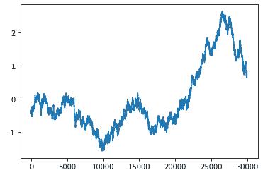
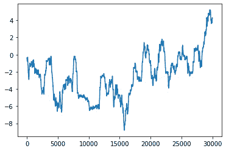

# 第八章：*第八章*：强化学习

强化学习范式与标准机器学习以及我们在前面章节中介绍过的在线机器学习方法非常不同。尽管对于许多用例来说，强化学习并不总是比“常规”学习更好，但它是一个解决再学习和模型适应的强大工具。

在强化学习中，我们给予模型很大的决策权来进行其再学习和更新决策过程的规则。而不是让模型做出预测并硬编码采取该预测的动作，模型将直接决定采取的动作。

对于自动化机器学习管道，其中动作被有效自动化，这可以是一个很好的选择。当然，这必须辅以不同类型的日志记录、监控等。对于我们需要预测而不是动作的情况，强化学习可能不适用。

尽管在合适的使用场景中非常强大，但强化学习目前在常规机器学习方面并不是一个标准的选择。在未来，强化学习可能会在更多的使用场景中变得非常流行。

在本章中，你将首先全面了解强化学习背后的不同概念。然后，你将看到 Python 中强化学习的实现。

本章涵盖以下主题：

+   定义强化学习

+   强化学习模型的主要步骤

+   探索 Q 学习

+   深度 Q 学习

+   使用强化学习处理流数据

+   强化学习的用例

+   在 Python 中实现强化学习

# 技术要求

你可以在 GitHub 上找到本书的所有代码，链接如下：[`github.com/PacktPublishing/Machine-Learning-for-Streaming-Data-with-Python`](https://github.com/PacktPublishing/Machine-Learning-for-Streaming-Data-with-Python)。如果你还不熟悉 Git 和 GitHub，下载笔记本和代码示例的最简单方法是以下：

1.  前往仓库的链接。

1.  点击绿色的**代码**按钮。

1.  选择**下载 zip**。

当你下载 ZIP 文件时，你需要在本地环境中解压缩它，然后你将能够通过你首选的 Python 编辑器访问代码。

## Python 环境

为了跟随本书的内容，你可以下载仓库中的代码，并使用你首选的 Python 编辑器执行它。

如果你还不熟悉 Python 环境，我建议你检查 Anaconda（[`www.anaconda.com/products/individual`](https://www.anaconda.com/products/individual)），它自带 Jupyter Notebook 和 JupyterLab，这两个都是执行笔记本的绝佳选择。它还包含了 Spyder 和 VSCode，用于编辑脚本和程序。

如果你安装 Python 或相关程序有困难，你可以查看 Google Colab ([`colab.research.google.com/`](https://colab.research.google.com/)) 或 Kaggle 笔记本 ([`www.kaggle.com/code`](https://www.kaggle.com/code))，这两个都允许你免费在线运行 Python 代码，无需任何设置。

注意

书中的代码通常使用 Colab 和 Kaggle 笔记本，Python 版本为 3.7.13，你可以设置自己的环境来模拟这种情况。

# 定义强化学习

强化学习是机器学习的一个子领域，专注于创建能够做出决策的机器学习模型。有时，这些模型并不被称为模型，而是被称为智能代理。

从远处看，你可能会认为强化学习与机器学习非常接近。我们可以说，它们都是人工智能内部的方法，试图提供智能的黑盒，这些黑盒能够像人类一样学习特定的任务——通常表现得更好。

然而，如果我们更仔细地观察，我们开始看到重要的差异。在前面的章节中，你已经看到了机器学习模型，如异常检测、分类和回归。所有这些模型都使用多个变量，并且能够根据这些变量对目标变量进行实时预测。

你已经看到了许多指标，这些指标允许我们数据科学家决定一个模型是否有所作为。在线模型也能够通过重新学习和持续考虑自己的错误指标来适应变化的数据。

强化学习不仅限于这些。RL 模型不仅做出预测，还采取行动。你可以这样说，离线模型在重新学习时不会从错误中吸取任何自主性，在线模型会立即考虑到错误，而强化学习模型被设计成会犯错误并从中学习。

在线模型可以适应它们的错误，就像强化学习一样。然而，当你构建在线模型的第一版时，你确实期望它在开始时就有可接受的表现，并且你会在一些历史数据上对其进行训练。它可以在数据漂移或其他变化的情况下进行适应。

另一方面，强化学习模型一开始是完全无知的。它会尝试采取行动，犯一些错误，然后纯粹出于偶然，在某个时刻，它也会做出一些好的决策。在这个时候，强化学习模型将获得奖励并开始记住这些。

## 比较在线和离线强化学习

强化学习通常是在线学习：智能代理通过重复采取行动并获得对良好预测的奖励来学习。这可以无限期地继续，至少在决策反馈持续输入模型的情况下。

然而，强化学习也可以是离线的。在这种情况下，模型会在一段时间内学习，然后在某个时刻，反馈循环被切断，这样模型（决策规则）在那之后保持不变。

通常，当使用强化学习时，是因为我们对持续再学习感兴趣。因此，在线变体是最常见的。

## 强化学习中反馈循环的更详细概述

现在，让我们更深入地探讨强化学习的细节。首先，了解一个通用强化学习模型的反馈循环是如何工作的非常重要。以下图示显示了模型通过反馈循环学习的逻辑。

![图 8.1 – 强化学习中的反馈循环]

![图片 B18335_08_1.jpg]

图 8.1 – 强化学习中的反馈循环

在这个图示中，你可以观察到以下元素：

+   **强化学习代理**：我们这个持续学习和做决策的模型。

+   **环境**：一个固定的环境，代理可以在其中做出特定的决策集。

+   **动作**：每当代理做出决策时，这将会改变环境。

+   **奖励**：如果决策产生好的结果，那么将给予代理奖励。

+   **状态**：代理做出决策所需的环境信息。

作为简化的例子，想象一下代理是一个学习行走的婴儿。在每一个时间点，婴儿都在尝试可能使他们行走的事情。更具体地说，他们正在激活身体中的几个肌肉。

在做这件事的时候，宝宝正在观察他们是否在行走。同时，当他们的父母看到他们接近正确行走时，会为他们欢呼。这是一种奖励，传达给宝宝的信息是他们在以正确的方式学习。

然后，宝宝将再次尝试通过几乎使用相同的肌肉，但有一点变化来行走。如果效果更好，他们会将其视为积极的事情，并继续以这种方式移动。

现在我们来讨论所有这些步骤中剩余的必要步骤。

# 强化学习模型的主体步骤

代理的动作是它可以做出的决策。这是一个有限的决策集。正如你将理解的，代理只是一段代码，所以它所有的决策都需要编程控制其自身的行为。

如果把它比作一个电脑游戏，那么你就能理解作为玩家，你可以执行的动作是受限于你在游戏控制台上的按键。所有的组合加在一起仍然允许一个非常广泛的选项，但它们在某种程度上是有限的。

对于我们人类宝宝学习行走来说，也是如此。他们只能控制自己的身体，因此他们无法执行超出这个范围的动作。这为人类提供了大量的可能性，但仍然是一个固定的动作集。

## 做出决策

现在，随着您的强化智能体接收有关其环境（状态）的信息，它需要将此信息转换为决策。这与需要将独立变量映射到目标变量的机器学习模型中的相同概念。

在这种强化学习的情况下，这种决策映射通常被称为策略。策略通常会通过估计预期奖励来决定最佳行动，然后执行预期奖励最高的行动。

## 更新决策规则

强化学习这一大图景描述的最后一部分是策略的更新：基本上，就是学习本身。有许多模型，它们都有自己的特定之处，但无论如何，让我们尽量获得一个一般性的概念。

到目前为止，您已经看到智能体从一组固定的行动中选择一个行动。智能体已经估计出哪个最有可能最大化奖励。在执行此任务后，模型将收到一定的奖励。这将用于改变策略，具体取决于您使用的强化学习方法的精确方法。

在下一节中，您将通过探索 Q 学习算法来更详细地了解这一点。

# 探索 Q 学习

尽管强化学习有许多变体，但前面的解释应该已经为您提供了一个关于大多数强化模型工作原理的良好概述。现在是时候深入探讨强化学习的一个特定模型：Q 学习。

Q 学习是一种所谓的无模型强化学习算法。无模型强化学习算法可以被视为纯试错算法：它们对环境没有先验概念，只是尝试行动并学习其行动是否产生正确的结果。

相反，基于模型的算法使用不同的理论方法。它们不仅基于行动学习结果，还试图通过某种形式的模型来理解其环境。一旦智能体学会了环境如何运作，它就可以采取根据这种知识优化奖励的行动。

尽管基于模型的方案可能看起来更直观，但无模型的方法，如 Q 学习，实际上相当不错。

## Q 学习的目标

Q 学习算法的目标是找到一个策略，该策略从当前状态开始，通过一系列连续步骤获得最大化的预期奖励。

用常规语言来说，这意味着 Q 学习会查看当前状态（其环境的变量），然后利用这些信息在未来采取最佳步骤。该模型不会查看过去发生的事情，只关注未来。

模型使用 Q 值作为状态-动作组合质量的计算：也就是说，对于每个状态，都有一个潜在动作的列表。每个潜在状态和潜在动作的组合称为状态-动作组合。Q 值表示当状态是给定的时，这个动作的质量。

在强化学习过程的开始，Q 的值以某种方式初始化（随机或固定），然后在每次收到奖励时更新。智能体根据 Q 值处理模型，当奖励（对动作的反馈）开始到来时，那些 Q 值会改变。智能体仍然继续遵循 Q 值，但随着它们的更新，智能体的行为也会改变。

该算法的核心是 Bellman 方程：一个用于 Q 值的更新规则，它使用旧的和新的 Q 值的加权平均值。因此，在发生大量学习的情况下，旧信息会在某个时刻被遗忘。这避免了陷入以前的行为中。

Bellman 方程的公式如下：


## Q 学习算法的参数

在这个 Bellman 方程中，有几个重要的参数你可以调整。让我们简要地介绍一下：

+   学习率是机器学习算法中一个非常常用的超参数。它通常定义了优化器的步长，大步长可能会让你在优化空间中移动得更快，但过大的步长也可能导致问题进入狭窄的最优解。

+   折扣因子是一个在金融和经济中经常使用的概念。在强化学习中，它表示模型需要以多快的速度优先考虑短期或长期奖励。

在对 Q 学习的概述之后，下一节将介绍这种方法的更复杂版本，称为深度 Q 学习。

# 深度 Q 学习

现在你已经看到了强化学习的基础以及最基本的强化学习模型 Q 学习，现在是时候转向一个性能更好、更常用的模型，即深度 Q 学习了。

深度 Q 学习是 Q 学习的一个变体，其中 Q 值不仅仅是状态和动作组合的预期 Q 值列表，这些值由 Bellman 方程更新。相反，在深度 Q 学习中，这种估计是通过一个（深度）神经网络完成的。

如果你不太熟悉，神经网络是一类机器学习模型，在性能方面处于最前沿。神经网络在人工智能、机器学习和数据科学等许多用例中得到了广泛应用。深度神经网络是允许许多数据科学用例的技术，例如**自然语言处理**（**NLP**）、计算机视觉等等。

神经网络背后的想法是通过一个节点网络（称为神经元）传递输入数据点，每个神经元执行一个非常简单的操作。由于有许多这样的简单操作正在进行，并且之间应用了权重，这意味着神经网络是一种强大的学习算法，可以将输入数据映射到目标变量。

下面的示例展示了神经网络的标准表示。模型可以像你想要的那样简单或复杂。你可以拥有大量的隐藏层，并且可以为每个隐藏层添加尽可能多的节点。每条箭头代表一个系数，需要被估计。因此，必须记住，估计此类模型需要大量的数据。

这里展示了神经网络的示例示意图：

![Figure 8.2 – Neural network architecture

![img/B18335_08_2.jpg]

图 8.2 – 神经网络架构

对于强化学习，这必须在 Q 学习范式中应用。本质上，深度学习模型只是比标准 Q 学习方法更好地估计 Q 值的一种方式（或者至少这是它所追求的）。

你可以将类比看作如下。在标准 Q 学习中，对于新奖励的存储和更新机制相对简单，你可以将其视为如下所示的表格：

![Figure 8.3 – Example table format

![img/B18335_08_3.jpg]

图 8.3 – 示例表格格式

在深度 Q 学习中，输入和输出过程大多相同，但状态被转录为一系列变量，这些变量被输入到神经网络中。然后，神经网络输出每个动作的估计 Q 值。

下面的图表显示了如何将状态作为输入添加到神经网络中。

![Figure 8.4 – Adding the state as input to the neural network

![img/B18335_08_4.jpg]

图 8.4 – 将状态作为输入添加到神经网络

现在你已经理解了强化学习背后的理论，下一节将更加应用性，因为它将展示一些强化学习在流数据上的示例用例。

# 使用强化学习处理流数据

如前几章所讨论的，在流数据上构建模型的挑战在于找到能够增量学习并且能够在模型漂移或数据漂移的情况下适应的模型。

强化学习是能够很好地应对这两个挑战的潜在候选者。毕竟，强化学习有一个反馈循环，允许它在犯了很多错误时改变策略。因此，它能够在变化的情况下自我适应。

强化学习可以看作是在线学习的一个子案例。同时，强化学习的第二个特性是它专注于学习动作，而常规在线模型则专注于做出准确的预测。

这两个领域的分割在实际中体现在用例类型和应用领域上，但许多流用例有可能从强化学习中受益，并且它是一个值得掌握的优秀工具集。

如果你想要更深入和更多的例子，你可以查看以下有洞察力的文章：[`www.researchgate.net/publication/337581742_Machine_learning_for_streaming_data_state_of_the_art_challenges_and_opportunities`](https://www.researchgate.net/publication/337581742_Machine_learning_for_streaming_data_state_of_the_art_challenges_and_opportunities)。

在下一节中，我们将探讨几个关键用例，在这些用例中，强化学习证明是至关重要的。

# 强化学习的应用案例

强化学习的应用案例几乎和在线学习一样多。与标准离线和在线模型相比，它是一种较少使用的科技，但随着过去几年机器学习领域的变化，它仍然是一个可能在未来几年变得巨大的优秀候选者。

让我们看看一些用例，以更好地了解哪些类型的用例可能适合强化学习。在示例类型中，有一些是更传统的强化学习用例，还有一些是更具体的流数据用例。

## 应用案例一 - 交易系统

作为强化学习的一个第一个应用案例，让我们来谈谈股票市场交易。股票市场的用例已经在回归章节的预测用例中讨论过了。强化学习是它的一个替代解决方案。

在回归中，在线模型被用来构建预测工具。使用这些预测工具，股票交易者可以预测特定股票在不久的将来价格的发展趋势，并利用这些预测来决定买入或卖出股票。

使用强化学习，这个用例的开发会有所不同。智能代理会学习如何做决策，而不是预测价格。例如，你可以给代理三个动作：卖出、买入或持有（持有意味着什么都不做/忽略）。

代理会接收到关于其环境的信息，这可能包括过去的股票价格、宏观经济信息等等。这些信息将与策略一起使用，这个策略决定何时买入、卖出或持有。

通过长时间训练这个代理，并且使用包括所有类型市场场景的大量数据，代理可以很好地学习如何交易市场。这样你就可以获得一个盈利的“交易机器人”，无需太多干预就能赚钱。如果成功，这显然比回归模型有优势，因为它们只预测价格而不采取任何行动。

关于这个主题的更多信息，你可以从查看以下链接开始：

+   [`arxiv.org/pdf/1911.10107.pdf`](https://arxiv.org/pdf/1911.10107.pdf)

+   [`cslt.riit.tsinghua.edu.cn/mediawiki/images/a/aa/07407387.pdf`](http://cslt.riit.tsinghua.edu.cn/mediawiki/images/a/aa/07407387.pdf)

## 用例二 - 社交网络排名系统

强化学习的第二个用例是社交网络帖子排名。背后发生的一般想法是创建大量帖子，并根据用户的偏好向每个特定用户展示最相关的帖子。

有许多机器学习方法可以用于此，强化学习就是其中之一。基本上，模型将最终对要向用户展示的帖子做出决策，因此这种方式实际上是在采取行动。

此操作还会生成反馈。如果用户喜欢、评论、分享、点击、暂停或以其他方式与帖子互动，代理将获得奖励，并学会这种类型的帖子确实对用户感兴趣。

通过试错，代理可以向每个用户发布不同类型的帖子，并学习哪些决策是好的，哪些是不好的。

实时响应在这里非常重要，以及从错误中快速学习。如果用户收到大量不相关的帖子，这将损害他们的用户体验，模型应尽快学会其预测是不正确的。因此，在线学习或强化学习非常适合此类用例。

关于此类用例的更多信息，您可以在以下链接中找到一些资料：

+   [`arxiv.org/abs/1601.00667`](https://arxiv.org/abs/1601.00667)

+   [`rbcdsai.iitm.ac.in/blogs/finding-influencers-in-social-networks-reinforcement-learning-shows-the-way/`](https://rbcdsai.iitm.ac.in/blogs/finding-influencers-in-social-networks-reinforcement-learning-shows-the-way/)

## 用例三 - 自动驾驶汽车

强化学习还被提议用于自动驾驶汽车的用例。正如您可能知道的，自动驾驶汽车在过去几年中越来越受到关注。目标是创建可以取代人类驾驶员行为的机器学习或人工智能模型。

很容易理解，该模型的关键部分将是采取行动：加速、减速、刹车、转弯等等。如果能够构建一个足够好的强化学习模型来获得所有这些技能，它将是构建自动驾驶汽车的理想候选者。

自动驾驶汽车需要响应大量关于环境的数据流。例如，它们需要在多个摄像头拍摄的视频流中连续检测汽车、道路、路标等等，以及其他可能的传感器。

在这种情况下，实时响应至关重要。在道路上，实时重新训练模型可能会更成问题，因为您希望确保模型在行驶过程中不是在应用试错方法。

更多信息可以在以下链接中找到：

+   [`arxiv.org/ftp/arxiv/papers/1901/1901.00569.pdf`](https://arxiv.org/ftp/arxiv/papers/1901/1901.00569.pdf)

+   [`www.ingentaconnect.com/contentone/ist/ei/2017/00002017/00000019/art00012?crawler=true&mimetype=application/pdf`](https://www.ingentaconnect.com/contentone/ist/ei/2017/00002017/00000019/art00012?crawler=true&mimetype=application/pdf)

## 应用案例四 – 聊天机器人

另一个非常不同但同样非常高级的机器学习用例是聊天机器人的开发。智能聊天机器人仍然很少见，但我们预计在不久的将来聊天机器人将变得更加智能。

聊天机器人需要能够对用户提供的信息做出响应，同时处理用户提供的信息。因此，聊天机器人正在执行一种行动：回复人类。

强化学习与其他自然语言处理领域的技术的结合可以解决此类问题。通过让聊天机器人与用户交谈，人类用户可以通过例如对互动有用性的评估等形式给予奖励。这个奖励可以帮助强化学习智能体调整其策略，并在未来的互动中使回复更加合适。

聊天机器人需要能够实时响应，因为没有人愿意等待聊天机器人的回答。学习可以是在线或离线进行的，但强化学习无疑是合适的替代方案之一。

你可以在此处了解更多关于这个用例的信息：

+   [`arxiv.org/abs/1709.02349`](https://arxiv.org/abs/1709.02349)

+   [`arxiv.org/pdf/1908.10331.pdf`](https://arxiv.org/pdf/1908.10331.pdf)

## 应用案例五 – 学习游戏

作为强化学习的最终用例示例，让我们来谈谈学习游戏的应用。这可能对商业的价值不大，但仍然是一个有趣的强化学习用例。

在过去的几年里，强化学习智能体已经学会了玩许多游戏，包括象棋和国际象棋。在每一步都有明确的移动集合，通过玩许多模拟（或真实）游戏，模型可以学习哪种策略（采取步骤的决策规则）是最好的。

最后，智能体拥有如此强大的策略，它通常能击败世界上最好的游戏玩家。

你可以在以下链接中找到更多此类示例：

+   [`www.science.org/doi/10.1126/science.aar6404`](https://www.science.org/doi/10.1126/science.aar6404)

+   [`arxiv.org/pdf/1912.10944.pdf`](https://arxiv.org/pdf/1912.10944.pdf)

现在我们已经探讨了强化学习的一些应用案例，接下来我们将使用 Python 来实现它。

# 在 Python 中实现强化学习

现在我们来举一个例子，其中使用流数据来进行 Q-Learning。我们将使用的是股票价格的模拟数据：

1.  数据是在以下代码块中生成的。

首先生成的值列表是一个代表股票价格的 30,000 个连续值的列表。数据生成过程从 0 开始，在每一个时间步，都会添加一个随机值。随机正态值以 0 为中心，这表明价格会根据标准差 1 的步长上升或下降。

这个过程通常被称为随机游走，它可以上升或下降很多。之后，这些值被标准化，再次处于正态分布内。

代码块 8-1

```py
import numpy as np
import matplotlib.pyplot as plt
import random
starting = 0
values = [starting]
for i in range(30000):
    values.append(values[-1] + np.random.normal())
values = (values - np.mean(values)) / np.std(values)
plt.plot(values)
```

结果图可以在以下内容中看到：



图 8.5 – 前一个代码块的结果图

1.  现在，对于强化问题，需要有限数量的状态。当然，如果我们考虑股票价格，我们可以收集到无限多位小数。数据被四舍五入到 1 位小数，以限制可能的状态数据点的数量：

代码块 8-2

```py
rounded_values = []
for value in values:
    rounded_values.append(round(value, 1))
plt.plot(rounded_values)
```

结果图如下所示：


图 8.6 – 前一个代码块生成的图表

1.  我们现在可以将状态的潜在值设置为过去发生过的所有值。我们还可以启动一个策略。

如本章的理论部分所示，策略代表了强化学习代理的规则。在某些情况下，有一个非常具体的规则集，但在 Q 学习中，只有状态和行动组合的 Q 值（质量）。

在我们的例子中，让我们考虑一个只能同时进行两项操作的股票交易机器人 *t*。要么在时间 *t* 买入并在 *t+1* 卖出，要么在时间 *t* 卖出并在 *t+1* 关闭卖出头寸。不深入股票交易，重要的是要理解以下内容：

+   当代理购买时，它应该这样做是因为它预计股市会上涨。

+   当代理打开卖出订单时，它应该这样做是因为它预计股市会下跌。

作为信息，我们的股票交易员将非常有限。状态中的唯一数据点是时间 t 的价格。这里的目的是不是要创建一个伟大的模型，而是要展示在股票交易示例上构建强化学习代理的原则。在现实中，你需要状态中的更多信息来决定你的行动：

代码块 8-3

```py
states = set(rounded_values)
import pandas as pd
policy = pd.DataFrame(0, index=states, columns=['buy', 'sell'])
```

1.  此后定义的函数是根据 Q 表获取行动（卖出或买入）的方法。将 Q 表完全称为策略并不完全正确，但它确实使它更容易理解。

所选的行动是针对给定状态（状态是当前股票价值）的最高 Q 值：

代码块 8-4

```py
def find_action(policy, current_value):

    if policy.loc[current_value,:].sum() == 0:
        return random.choice([ 'buy', 'sell'])
    return policy.columns[policy.loc[current_value,:].argmax()]
```

1.  同时，还需要定义一个更新规则。在这个例子中，更新规则基于之前解释过的贝尔曼方程。然而，请注意，智能体相当简单，折扣部分并不真正相关。折扣有助于使智能体更倾向于短期收益而非长期收益。当前智能体总是在一个时间步长内获得收益，因此折扣没有额外的价值。在真实的股票交易机器人中，这一点非常重要：如果你可以在一年内将其翻倍，你不会把你的钱投在一个需要 20 年才能翻倍的股票上：

代码块 8-5

```py
def update_policy(reward, current_state_value, action):

    LEARNING_RATE = 0.1
    MAX_REWARD = 10
    DISCOUNT_FACTOR = 0.05

    return LEARNING_RATE * (reward + DISCOUNT_FACTOR * MAX_REWARD - policy.loc[current_state_value,action])
```

1.  现在我们来执行模型。我们首先将`past_state`设置为 0，将`past_action`设置为`buy`。总奖励初始化为 0，并实例化一个奖励累加列表。

然后代码将循环遍历四舍五入的值。这是一个复制数据流的过程。如果数据一个接一个地到达，智能体将以完全相同的方式学习。其本质是在每个学习步骤更新 Q 表。

在每个迭代中，模型将执行最佳行动，这里的最佳行动是基于 Q 值表（策略）的 Q 值。模型还将收到时间步长 t-1 的奖励，因为这被定义为股票交易机器人的唯一选项。这些奖励将被用来更新 Q 表，以便下一轮可以拥有更新的信息：

代码块 8-6

```py
past_state_value = 0
past_action = 'buy'
total_reward = 0.
rewards = []
for i, current_state_value in enumerate(rounded_values):

    # do the action
    action = find_action(policy, current_state_value)

    # also compute reward from previous action and update state
    if past_action == 'buy':
        reward = current_state_value - past_state_value

    if past_action == 'sell':
        reward = past_state_value - current_state_value

    total_reward = total_reward + float(reward)

    policy.loc[current_state_value, action] = policy.loc[current_state_value, action] + update_policy(reward, current_state_value,action)

    #print(policy)
    rewards.append(total_reward)

    past_action = action
    past_state_value = current_state_value
```

1.  在下面的图表中，你可以看到模型是如何获得奖励的。一开始，总奖励长时间为负，然后在最后变为正。请注意，我们是在基于假设的输入数据上学习，这些数据代表的是随机游走。如果我们想要一个真正的智能股票交易机器人，我们需要给它更多、更好的数据：

代码块 8-7

```py
plt.plot(rewards)
```

生成的图表如下所示：



图 8.7 – 上一代码块生成的图表

1.  下面的图表显示了 Q 值与策略的热力图。表格顶部的值是在股价低时首选的行动，而表格底部的值是在股价高时首选的行动。浅黄色表示高质量的行动，黑色表示低质量的行动：

代码块 8-8

```py
import seaborn as sns
sns.heatmap(policy.sort_index())
```

生成的热力图如下所示：


图 8.8 – 上一代码块生成的热力图

有趣的是，模型似乎开始学习股票交易的基本规则：低价买入，高价卖出。这可以通过高价卖出时更多的黄色和低价买入时更多的黄色来观察。显然，这个规则在模拟的随机游走数据中也是成立的。

要学习更高级的规则，代理需要拥有更多状态数据，因此 Q 表也会变得非常庞大。你可以添加的一个例子是价格的历史滚动，这样代理就能知道你是处于上升趋势还是下降趋势。你也可以添加宏观经济因素、情绪估计或任何其他数据。

你还可以使动作结构更加高级。而不仅仅是有一天买卖交易，如果有一个模型可以在代理决定的时候随时买卖其投资组合中的任何股票，那就更有趣了。

当然，你还需要提供足够的数据，以便模型能够对所有这些场景进行估计。你考虑的场景越多，代理学习如何正确行为所需的时间就越长。

# 摘要

在本章中，你首先了解了强化学习的底层基础。你看到强化学习模型专注于采取行动，而不是做出预测。

你也看到了两种广泛使用的强化学习算法。这始于 Q-learning，它是强化学习的基础算法，以及其更强大的改进版本，深度 Q-learning。

强化学习通常用于更高级的应用场景，如聊天机器人或自动驾驶汽车，但也非常适合用于数值数据流。通过一个用例，你看到了如何将强化学习应用于金融的流数据。

通过本章，你已到达发现最相关的在线学习机器学习模型的终点。在接下来的章节中，你将发现许多额外的工具，这些工具在在线学习中需要考虑，而在传统机器学习中没有真正的对应物。你将首先深入了解所有类型的数据和模型漂移，然后了解如何处理由于灾难性遗忘而完全走偏的模型。

# 进一步阅读

+   强化学习应用: [`neptune.ai/blog/reinforcement-learning-applications`](https://neptune.ai/blog/reinforcement-learning-applications)

+   Q-learning: [`zh.wikipedia.org/wiki/Q-learning`](https://zh.wikipedia.org/wiki/Q-learning)

+   深度 Q-learning: [`zh.wikipedia.org/wiki/深度强化学习`](https://zh.wikipedia.org/wiki/深度强化学习)
