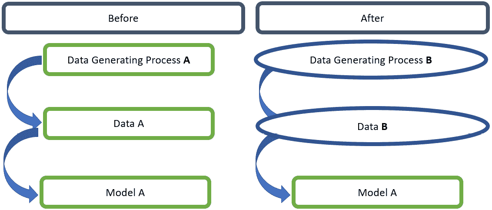
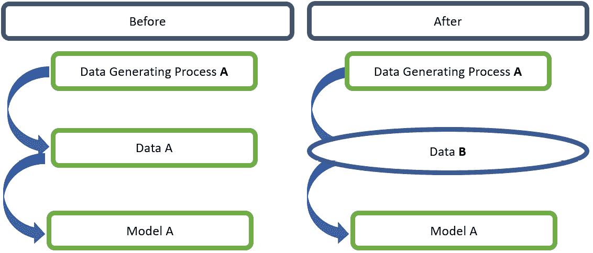
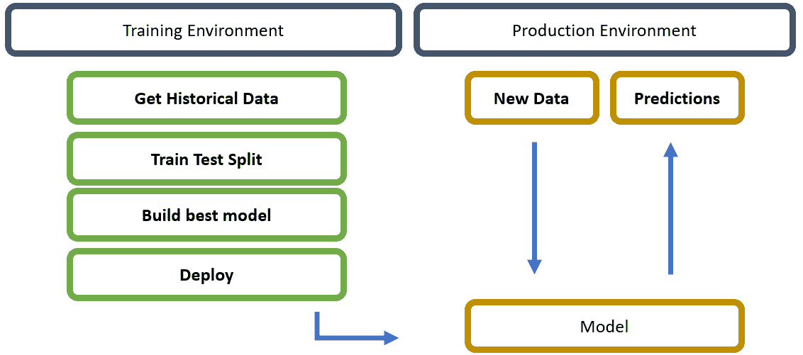

# *第九章*：漂移和漂移检测

在前面的章节中，你已经发现了许多构建**机器学习**（**ML**）模型的方法，这些模型以在线方式工作。它们能够从单个观察值更新其学习到的决策规则，而不是像大多数机器学习模型那样需要完全重新训练。

这之所以很棒，一个原因是流式处理，因为这些模型将允许你持续工作和学习。然而，我们可以争论说，传统的机器学习模型也可以对单个观察值进行预测。即使是批量学习和离线模型也可以一次预测一个新观察值。为了更深入地了解在线机器学习的附加值，本章将深入探讨漂移和漂移检测。

为了更深入地理解这些概念，本章将从漂移的定义开始进行详细描述。然后，你将看到不同类型的漂移，包括概念漂移、数据漂移和重新训练策略问题。

之后，你将接触到多种检测数据漂移和概念漂移的方法。你还将看到多种对抗漂移的方法，并介绍模型可解释性和重新训练策略。

现在，让我们通过深入探讨漂移的定义来从基础知识开始。

本章将涵盖以下主题：

+   定义漂移

+   介绍模型可解释性

+   测量漂移

+   在 Python 中测量漂移

+   对抗漂移

# 技术要求

你可以在以下链接的 GitHub 上找到这本书的所有代码：[`github.com/PacktPublishing/Machine-Learning-for-Streaming-Data-with-Python`](https://github.com/PacktPublishing/Machine-Learning-for-Streaming-Data-with-Python)。如果你还不熟悉 Git 和 GitHub，以下是最简单下载笔记本和代码样本的方法：

1.  前往存储库的链接。

1.  点击绿色的**代码**按钮。

1.  选择**下载 zip**。

当你下载 ZIP 文件时，你需要在本地环境中解压缩它，然后你将通过你首选的 Python 编辑器访问代码。

## Python 环境

要跟随这本书，你可以下载存储库中的代码，并使用你首选的 Python 编辑器执行它。

如果你还不熟悉 Python 环境，我建议你查看 Anaconda（[`www.anaconda.com/products/individual`](https://www.anaconda.com/products/individual)），它包含了 Jupyter Notebook 和 JupyterLab，这两个都是执行笔记本的绝佳选择。它还包含了 Spyder 和**Visual Studio Code**（**VS Code**）用于编辑脚本和程序。

如果您在您的机器上安装 Python 或相关程序有困难，您可以查看**Google Colabatory**（**Google Colab**）([`colab.research.google.com/`](https://colab.research.google.com/))或 Kaggle Notebooks([`www.kaggle.com/code`](https://www.kaggle.com/code))，这两个都允许您在在线笔记本中免费运行 Python 代码，无需任何设置。

注意

书中的代码通常将使用 Colab 和 Kaggle Notebooks，Python 版本为 3.7.13，您可以根据需要设置自己的环境来模拟这种情况。

# 定义漂移

模型随着时间的推移往往开始表现得更差，这是一个众所周知且普遍观察到的问题。无论您的指标是准确率、R2 分数、F1 分数还是其他任何指标，如果您将模型投入生产而不更新它们，您都会看到性能随着时间的推移缓慢但稳定地下降。

根据您的用例，这种下降可能会迅速或缓慢地变得有问题。一些用例需要连续、近乎完美的预测。在某些用例中——例如，对于对生活有直接影响的专业机器学习模型——如果您观察到 1%的下降，您可能会感到非常震惊。在其他用例中，机器学习更多地被用作自动化而不是预测，商业伙伴可能甚至不会注意到 5%的下降。

是否会影响您不是这里的问题。可以肯定的是，总的来说，您会看到您的模型在下降。本章的目标是确保找出为什么模型性能在下降，您如何衡量它，以及如果您认为它对您的用例来说问题太大，您可以做什么。

在下一节中，我们将首先介绍您可能在流用例中遇到的三种不同类型的漂移。

## 三种漂移类型

在流数据中，通常考虑两种漂移原因：概念漂移和数据漂移。在本部分中，您将首先发现概念和数据漂移，但您也会看到重新训练策略如何影响模型偏离数据而不是相反。

### 概念漂移

在概念漂移中，我们试图通过我们建模的概念变化来解释模型性能的下降。这意味着目标变量的统计属性正在变化，因此模型不再适合我们的用例。

概念变化的一个简化例子是试图预测某个巧克力棒热巧克力销售的模型。也许这个模型在一段时间内是完美的，但某个时候，一个竞争品牌在该地区安装了。潜在的需求过程已经改变，这在逻辑上没有被包括在模型中，因为当模型构建时竞争并不相关。

当概念发生变化时，模型需要更新以考虑最新的过程，因为模型对于用例来说不再足够合适。以下示意图展示了概念漂移情况下出现的问题：



图 9.1 – 概念漂移

现在你已经了解了概念漂移背后的理论，下一节将介绍数据漂移——第二种重要的漂移类型。

### 数据漂移

当我们谈论数据漂移时，我们谈论的是独立变量统计属性的变化。这主要与我们处理数据样本（可能只是基于我们可用的数据）相关，但后来我们开始意识到这个样本不再代表我们现在接收到的数据。

例如，测量机器的变化，新的测量设备可能比旧材料给出略微不同的测量结果。想象一下我们更换了温度计，新的温度计测量的温度比旧的高约 0.5 度。你可以理解模型无法考虑这种类型的信息，并且当模型将温度设定得高于实际时，将会做出错误的预测。

以下示意图展示了数据漂移情况下出现的问题：



图 9.2 – 数据漂移

在讨论了漂移的两个重要原因之后，下一节将介绍模型退化和误指定——第三个与漂移相关的问题。

### 模型退化和误指定

虽然在文献中通常不认为模型问题是漂移的问题，但我认为将模型问题作为漂移和性能下降背后的一个问题也很重要。在现实情况下，人类是不完美的，会犯错误。理论上，我们应该期望模型被很好地指定，因此不应成为任何问题的原因。

然而，在实践中，模型的重新训练可能被错误地自动化，从而引入了小问题，这些问题随着时间的推移逐渐累积成大问题，这可能是模型退化性能下降的重要原因。

以下示意图展示了由于任何原因（如误指定或重新训练问题）导致的模型问题出现的问题：


图 9.3 – 模型引起的错误

在了解了流模型中漂移的三个潜在原因之后，下一节将解释如何使用模型可解释性作为对抗漂移的解决方案。

# 引入模型可解释性

当模型以在线方式学习时，它们会反复重新学习。这个重新学习的过程是自动发生的，通常人类用户无法持续关注模型。此外，这也会违背进行机器学习的主要目标，因为目标是让机器或模型接管，而不是持续的人类干预。

当模型学习或重新学习时，数据科学家通常面临程序化模型构建接口。想象一下，一个随机森林，其中数百个决策树同时作用来预测新观察的目标变量。即使打印出并查看所有这些决策也是一个巨大的任务。

模型可解释性是机器学习最近进展中的一个重要话题。通过将黑盒模型应用于数据科学用例，正在发生一些重大错误。一个例子是，当自动驾驶汽车在包含过多白人的有偏样本上训练时，汽车被测量出与黑人发生更多事故，仅仅是因为数据科学错误。了解你模型中发生的事情可以产生救命的影响。

在考虑模型中的漂移时，了解你模型中发生的事情也很重要。你部署的第一个模型可能非常接近你的预期。之后，模型将从遇到的每个数据点重新学习。如果数据中存在偏差，或者如果偏差是由于过拟合或欠拟合（当模型在自主运行时发生）而产生的，那么在某个时候，你可能会错过那些趋势。

你需要确保设置一个初始的方法来确保模型的可解释性，并继续研究这个话题。在当前章节中，我们将重点关注数据漂移和概念漂移，但请记住，模型误设也可能是一个导致准确性下降的巨大贡献者。这将在第十一章中更深入地讨论。第十一章。

现在，让我们继续探讨一些衡量漂移的方法。

# 衡量漂移

对于漂移，有两个重要的事情需要考虑。首先，我们应该能够衡量漂移，因为我们无法对抗我们不知道的东西。其次，一旦我们意识到漂移，我们应该定义正确的策略来对抗它。让我们首先讨论漂移的测量方法。

## 衡量数据漂移

如前所述，数据漂移意味着测量值随着时间的推移而缓慢变化，而基本概念保持不变。为了衡量这一点，描述性统计可以非常有用。既然你在前面的章节中已经看到了很多描述性统计，我们就不重复介绍其背后的理论了。

要应用描述性统计来衡量数据漂移，我们可以简单地设置一些描述性统计指标，并随着时间的推移跟踪它们。对于每个变量，你可以设置以下内容：

+   中心性测量（均值、中位数、众数）

+   变化的测量（标准差、方差、**四分位距**或**IQR**）

+   变量之间的事件相关性

此外，跟踪特定时间尺度的漂移也是必要的。如果你预计在非常长的时间段内会有漂移，你可以按月甚至按年计算这些描述性统计，但为了更快地检测，可以是每周、每天，甚至每小时或更频繁。

这些指标随时间的变化比较将允许你检测数据中的变化，这可能是你模型中漂移的常见原因。

## 测量概念漂移

在测量概念漂移时，最好的做法是设置一个详尽的模型性能随时间变化的跟踪。你使用的性能指标将取决于你的用例和所使用的模型类型，但可能包括回归的 R2 分数、准确度、验证的 F1 分数，甚至更多。

当你在时间上测量模型性能时，如果没有进行模型更新，你很可能会看到性能下降。对于在线模型，它们会在每个数据点上重新学习，理论上这应该是一个较小的问题。当你看到你的性能下降时，这表明你的系统中某个地方出了问题。

如果你已经在测量数据漂移，这将是一个很好的起点，因为数据漂移很可能会导致模型性能下降。如果数据漂移没有发生，你系统中可能存在概念漂移。

重要的是要记住，在实践中，测量模型漂移和数据漂移是紧密相连的：很难将性能下降归因于一个特定的根本原因。目标应该是保持模型性能高，如果出现问题，找到解决方案。同时测量性能、个别统计数据以及更多指标将使你的策略对抗漂移更加强大。

现在我们来看一些 Python 示例，说明如何检测建模中的漂移。

# 在 Python 中测量漂移

在测量漂移时，首先要确保你的模型以某种方式记录日志或结果。在下面的例子中，你将使用一个数据集，其中每个预测都被记录下来，这样我们就有每个预测的输入变量、预测、真实值以及预测与真实值之间的绝对差异作为误差的指标。

记录模型的行为是进行漂移检测的绝对前提条件。让我们从一些基本的测量开始，这些测量可以帮助你使用 Python 检测漂移。

## 测量漂移的基本直观方法

在本节中，你将发现一种直观的测量漂移的方法。以下是我们将遵循的步骤：

1.  要开始测量我们记录的结果数据中的漂移，我们首先将数据导入为`pandas` DataFrame。这在上面的代码块中完成：

代码块 9-1

```py
import pandas as pd
data = pd.read_excel('chapter9datafile.xlsx')
data
```

你将获得一个看起来像下面这样的表格：

![图 9.4 – 数据]

![img/B18335_09_4.jpg]

图 9.4 – 数据

1.  现在你有了漂移检测数据，让我们通过在日期上执行`groupby`操作并查看平均错误来查看错误随时间的发展，如下所示：

代码块 9-2

```py
data.groupby('Day')['Error'].mean()
```

你将获得以下结果：

![图 9.5 – 结果

![img/B18335_09_5.jpg]

图 9.5 – 结果

你可以清楚地看到错误随着时间的推移而强烈增加，因此我们可以相当肯定地认为我们这里有一个模型漂移的问题。当然，现在还没有定义这个问题是由数据问题还是概念问题引起的。

1.  让我们通过分析目标变量来查看目标是否在时间上经历了大的变化。以下代码对每天的地面实况值进行平均，以查看目标变量是否出现了明显的漂移：

代码块 9-3

```py
data.groupby('Day')['Ground Truth'].mean()
```

结果看起来是这样的：

![图 9.6 – 结果（继续

![img/B18335_09_6.jpg]

图 9.6 – 结果（继续）

我们确实看到在这个时期平均上有一个相当重要的变化。

1.  让我们进一步检查，并为每个独立变量也进行这种分析。以下代码对每天三个独立变量进行平均，以查看是否存在任何明显的偏移：

代码块 9-4

```py
data.groupby('Day')[['X1', 'X2', 'X3']].mean()
```

你将获得以下结果：

![图 9.7 – 分组结果

![img/B18335_09_7.jpg]

图 9.7 – 分组结果

我们看到第三个解释变量`X3`发生了非常明显的变化。这很可能就是我们的模型发生偏移的原因。

## 使用稳健的工具测量漂移

如果你正在处理小型用例，并且不想与大型外部平台集成，那么前面的例子真的很好。然而，如果你在一个资源受限的公司工作，从头开始为常见用例开发代码可能不可行或不值得。

漂移检测是目前相当受欢迎的一个用例，因此越来越多的稳健解决方案被公之于众——无论是付费程序、云程序还是开源解决方案。

接下来，我将介绍一些有用的解决方案，如果你对在外部平台上进行模型性能跟踪和漂移检测用例感兴趣，你可以考虑这些解决方案。由于这些平台属于公司，有时是付费的，我不想在这里深入探讨，但如果你对此感兴趣，提供一些指导是有好处的。

### Soda SQL

一个值得关注的解决方案是 Soda SQL。这是一个专门针对数据质量的工具，因此它不一定针对 ML 用例进行了优化。然而，数据质量问题几乎必然会导致有问题的模型，所以我发现讨论这个解决方案很有价值。

您可以在此找到完整信息：[`docs.soda.io/`](https://docs.soda.io/)。Soda SQL 是一个真正面向数据工程工具，所以在这里我不会过多深入细节，但我确实建议您在使用案例中记住它。

### MLflow with whylogs

一个更多面向生产中 ML 模型的工具是`whylogs`开源 Python 库，它与 WhyLabs 应用程序（[whylabsapp.com](http://whylabsapp.com)）集成。如果您在 WhyLabs 注册了一个账户，您可以使用他们的**应用程序编程接口**（**API**）并将您的模型日志直接发送到他们的数据库，在那里它将被分析并可供您访问。

### Neptune

Neptune（[neptune.ai](http://neptune.ai)）也在提供类似的工具。Neptune 的目标也是提供一个**机器学习操作**（**MLOps**）平台，您可以从基本上任何 Python（或其他）模型环境中发送您的日志数据。之后，您可以在他们的网络平台上访问性能，并且漂移检测的所有繁重工作都从您的肩上卸下。

您现在已经看到了一些用于测量和检测漂移的理论方法，以及一些启动平台，如果您没有能力完成这项工作，它们会为您做这类工作。尽管如此，我们还没有讨论到同样重要的一点，那就是对抗漂移。

# 对抗漂移

如引言中所述，模型漂移是必然发生的。它可能发生得非常缓慢，也可能发生得很快，但如果我们不尝试积极对抗它，这实际上是无法避免的。

在接下来的章节中，您将意识到在线学习，这本书已经广泛介绍了，实际上是一种对抗漂移的高效方法。尽管我们还没有明确定义漂移，但您现在将理解在线学习在这里有很大的附加值。

我们现在将回顾两种对抗漂移的方法，具体取决于您正在做的工作类型，如下所述：

+   离线学习的重新训练

+   在线学习

让我们从最传统的案例开始，即通过实施针对模型衰减的重新训练策略进行的离线学习。

## 针对漂移的离线学习重新训练策略

离线学习仍然是 ML 中最常用的方法。在离线学习中，模型只训练一次，然后仅用于预测。以下示意图描述了离线学习过程：



图 9.8 – 离线学习示意图

要更新模型，通常需要重新训练整个模型并将新版本部署到您的生产环境中。这如图*图 9.9*所示。

这种方法的优势在于模型构建者对其模型有完全控制。没有风险模型会学习到新的——错误——过程。然而，这需要付出代价，即当数据或概念发生漂移时，模型不会更新。因此，它的优势和劣势与在线学习相反。

## 对抗漂移的在线学习

正如你在本书中看到的，在线学习是离线学习的替代方案，并允许模型在新的数据点到达时随时更新。以下图表说明了重新训练策略是如何工作的：

![Figure 9.9 – Schematic diagram of online learning]

![img/B18335_09_9.jpg]

图 9.9 – 在线学习的示意图

使用在线学习，模型在更新方面具有一定的自主性，理论上将更接近数据：应该发生更少的漂移。然而，这需要模型构建者对理论模型没有完全控制。学习可能会走向错误的方向，模型可能会学习到不想要的决策规则。

优势与离线学习相反，是否选择在线或离线学习将真正取决于业务案例。

# 摘要

在本章中，你首先被介绍到了模型漂移的潜在基础。你看到，在现实世界的环境中，机器学习模型中模型漂移和模型性能随时间的下降是可以预期的。

性能下降通常可以归因于漂移数据、漂移概念或模型引起的问题。当数据测量随时间变化，但模型背后的基本理论概念保持不变时，就会发生数据漂移。概念漂移捕捉了学习过程的理论基础问题。

模型和模型重新训练相关的问题通常不被视为漂移的标准原因，但它们仍然应该被监控并认真对待。根据你的业务案例，重新学习——尤其是如果缺乏监控——可能会给机器学习系统引入大问题。

通常可以使用描述性统计很好地衡量数据漂移。概念漂移通常更难衡量，但它的存在可以从模型性能的不可解释下降中推断出来。一般来说，这里的重要性不在于将下降的性能归因于特定的原因，而在于使用提供的解决方案之一解决问题。

重新训练策略通常可以用于离线模型。它们是更新模型的一种方式，而不放弃对学习决策规则的控制。正如本书前几章详细介绍的，在线模型是重新训练离线模型的绝佳替代方案。使用在线模型的一个巨大优势是，这些模型专门为重新训练而设计。这些模型允许更大的自主性，只要正确实施数据和模型的监控，它们将在许多业务案例中非常有用。

在下一章中，您将了解如何将**特征转换**（**FT**）和缩放应用于在线建模案例。FT 和缩放是许多机器学习用例中的标准实践，但由于数据漂移——以及窗口中的偏差——它带来了一些需要考虑的理论难题。

# 进一步阅读

+   模型漂移：[`www.ibm.com/cloud/watson-studio/drift`](https://www.ibm.com/cloud/watson-studio/drift)

+   数据漂移：[`docs.microsoft.com/en-us/azure/machine-learning/how-to-monitor-datasets?tabs=python`](https://docs.microsoft.com/en-us/azure/machine-learning/how-to-monitor-datasets?tabs=python)

+   概念漂移：[`www.iguazio.com/blog/concept-drift-deep-dive-how-to-build-a-drift-aware-ml-system/`](https://www.iguazio.com/blog/concept-drift-deep-dive-how-to-build-a-drift-aware-ml-system/)

+   处理概念漂移：[`neptune.ai/blog/concept-drift-best-practices`](https://neptune.ai/blog/concept-drift-best-practices)

+   重新训练策略：[`www.kdnuggets.com/2019/12/ultimate-guide-model-retraining.html`](https://www.kdnuggets.com/2019/12/ultimate-guide-model-retraining.html)
