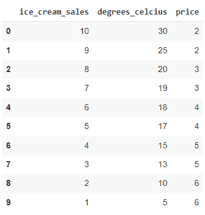
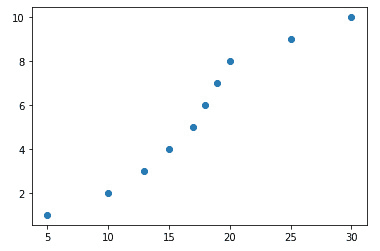
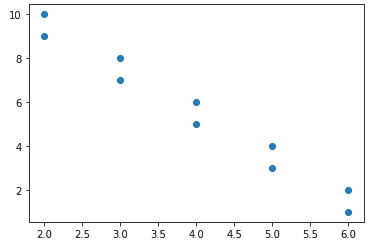
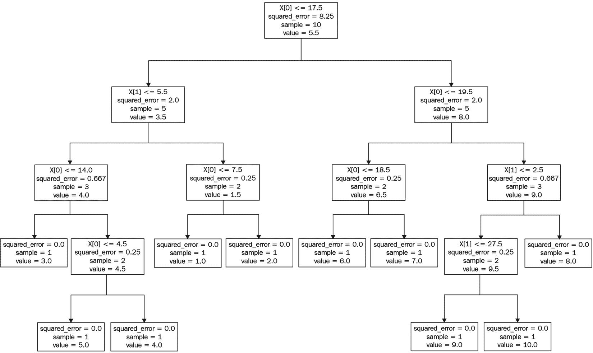

# *第十一章*：灾难性遗忘

在前两章中，我们开始探讨在线机器学习和处理流数据的许多辅助任务。第九章 讨论了漂移检测和解决方案，第十章 讨论了在流环境中的特征转换和缩放。当前章节介绍了辅助任务列表中的第三个也是最后一个主题，即灾难性遗忘。

灾难性遗忘，也称为灾难性干扰，是机器学习模型在更新后忘记他们所学内容的一种趋势，错误地重新学习正确学习的老旧倾向，因为新数据中学习了新的倾向。

由于在这本书中你已经看到了许多在线模型的例子，你会明白模型的持续更新会带来学习出错的大风险。在关于漂移和漂移检测的章节中已经简要提到，模型学习出错也可以被视为性能退化的真实风险。

然而，漂移通常用于指出独立变量（数据漂移）或独立变量与依赖变量之间的关系（概念漂移）中的漂移。由于灾难性遗忘实际上是模型系数内部的问题，我们实际上不能将灾难性遗忘视为漂移的一部分。

机器学习模型，尤其是在线机器学习模型，通常以相对黑盒的方式使用，这意味着我们关注它们的输出，但并不一定花很多时间查看内部机制。当检测到错误学习到的模式时，这就会成为一个问题。因此，机器学习可解释性也与灾难性遗忘的主题相关，并将被涵盖。

本章将介绍机器学习模型错误更新的问题，我们称之为灾难性遗忘或灾难性推理，以下章节将涵盖：

+   定义灾难性遗忘

+   灾难性遗忘的检测

+   模型可解释性 versus 灾难性遗忘

# 技术要求

你可以在以下链接的 GitHub 上找到这本书的所有代码：[`github.com/PacktPublishing/Machine-Learning-for-Streaming-Data-with-Python`](https://github.com/PacktPublishing/Machine-Learning-for-Streaming-Data-with-Python)。如果你还不熟悉 Git 和 GitHub，下载笔记本和代码示例的最简单方法是以下步骤：

1.  前往存储库的链接。

1.  点击绿色 **代码** 按钮。

1.  选择 **下载 ZIP**。

当你下载 ZIP 文件后，你可以在本地环境中解压它，然后你可以通过你偏好的 Python 编辑器访问代码。

## Python 环境

要跟随这本书的内容，你可以下载仓库中的代码，并使用你喜欢的 Python 编辑器执行它。

如果你还不熟悉 Python 环境，我建议你查看 Anaconda（[`www.anaconda.com/products/individual`](https://www.anaconda.com/products/individual)），它包含了 Jupyter Notebook 和 JupyterLab，这两个都是执行笔记本的绝佳选择。它还包含了 Spyder 和 VS Code，用于编辑脚本和程序。

如果你安装 Python 或相关程序有困难，你可以查看 Google Colab（[`colab.research.google.com/`](https://colab.research.google.com/)）或 Kaggle Notebooks（[`www.kaggle.com/code`](https://www.kaggle.com/code)），这两个都允许你免费在线笔记本中运行 Python 代码，无需任何设置。

注意

书中的代码通常使用 Colab 和 Kaggle Notebooks，Python 版本为 3.7.13，你可以设置自己的环境来模拟这种情况。

# 引入灾难性遗忘

灾难性遗忘最初被定义为在（深度）神经网络上发生的问题。深度神经网络是一组非常复杂的机器学习模型，由于它们的极端复杂性，能够学习非常复杂的模式。当然，只有在有足够数据的情况下才会是这样。

神经网络已经被研究了几十年。它们过去在数学上很有趣，但由于计算能力的缺乏，实际上无法执行。当前计算能力的进步使得神经网络能够获得它们目前所观察到的普及度。

神经网络的复杂性也使得它们对灾难性遗忘问题很敏感。从高角度来看，神经网络的学习方式是通过多次更新系数，并且在每次更新时，模型应该更好地拟合数据。一个神经网络参数的示意图概述如下：

![图 11.1 – 神经网络中系数数量的示意图

![img/B18335_11_1.jpg]

图 11.1 – 神经网络中系数数量的示意图

在这个示意图中，你可以看到即使是对于一个非常小的神经网络，也有许多系数。节点数量越多，需要估计的参数数量就越大。当与传统统计方法进行比较时，你可以看到进行如此多次遍历的想法相对不同，并且与传统统计学中常见的那些问题不同。

灾难性遗忘就是这样一个问题。它在 1989 年的一项研究中首次被观察到，其中进行了一个实验。这个实验训练神经网络进行加法任务（从 1 + 1 = 2 到 1 + 9 = 10）。测试了一种顺序方法，其中模型首先学习第一个任务，然后在第一个任务掌握后添加一个新任务。

这个实验以及其他实验的结论是，在第一个任务学习之后添加新任务将干扰原始学习模型。他们观察到，新信息需要学习，这种干扰就会越大。最后，他们发现这个问题只发生在顺序学习中。如果你同时学习所有任务，实际上并没有发生再学习，所以遗忘实际上是不会发生的。

对于关于在线学习神经网络中灾难性遗忘的更详细、更科学的资源，我建议查看这里提供的两个链接：

+   [`proceedings.neurips.cc/paper/2021/file/54ee290e80589a2a1225c338a71839f5-Paper.pdf`](https://proceedings.neurips.cc/paper/2021/file/54ee290e80589a2a1225c338a71839f5-Paper.pdf)

+   [`www.cs.uic.edu/~liub/lifelong-learning/continual-learning.pdf`](https://www.cs.uic.edu/~liub/lifelong-learning/continual-learning.pdf)

现在我们来看看灾难性遗忘是如何影响在线模型的。

# 在线模型中的灾难性遗忘

尽管灾难性遗忘最初被识别为神经网络的问题，你可以想象在线机器学习也有持续再学习的相同问题。因此，灾难性遗忘的问题，或者说灾难性推理的问题，也是存在的，并且需要被掌握。

如果模型在每一个新的数据点上更新，预计系数会随时间变化。然而，由于现代机器学习算法非常复杂，具有大量的系数或树，密切关注它们是一项相当困难的任务。

在一个理想的世界里，最有益的目标可能是尽量避免在机器学习中出现任何错误的学习。做到这一点的一种方法是通过密切关注模型性能并实施严格的版本控制系统，以确保即使模型错误地学习任何内容，也不会在生产系统中部署。我们将很快讨论这个话题。

另一种可能的解决方案是与漂移检测方法一起工作，正如你在*第九章*中看到的。当你密切关注你的模型性能、数据分布以及其他 KPI 和描述性统计时，你应该能够很快地发现问题，这将允许你迅速干预。

作为管理灾难性遗忘的第三个工具，你将在本章中看到更多关于模型可解释性的工具。灾难性遗忘的一个问题是模型过于像一个黑盒。使用模型可解释性领域的工具将帮助你窥视那些黑盒模型。这将允许你基于业务逻辑而不是技术逻辑来检测灾难性遗忘和灾难性推理。将业务逻辑和技术逻辑结合起来，将是一个强大的组合，以预防灾难性遗忘。

# 检测灾难性遗忘

在本章中，我们将探讨两种不同的方法，您可以使用这些方法来检测灾难性遗忘。第一种方法是实现一个系统，可以在模型学习到新内容后立即检测到问题。为此，我们将分多个步骤实现一个 Python 示例：

1.  开发一个带有在线学习的模型训练循环。

1.  向此模型添加直接评估。

1.  向此模型添加长期评估。

1.  添加一个系统以避免错误学习时的模型更新。

## 使用 Python 检测灾难性遗忘

为了处理这个例子，让我们首先实现一个在线回归模型，就像你在本书前面已经看到的那样：

1.  要做到这一点，我们首先需要生成一些数据。本例中生成数据的代码如下所示：

代码块 11-1

```py
import random
X = [
     1, 1, 1, 2, 2, 2, 3, 3, 3, 4, 4, 4, 5, 5, 5, 
     6, 6, 6, 7, 7, 7, 8, 8, 8, 9, 9, 9, 10, 10, 10
]
y = [
     x + random.random() for x in X[:15]] + 
    [x * 2 + random.random() for x in X[15:]
]
```

如果你看这个代码，你可以看到模式中发生了一个变化。在前 15 个观测值中，`y` 被定义为 `x + random.randint()`，这意味着与 `x` 相同的值，但有一些随机变化。在第 15 个观测值之后，这种变化改变并变为 `x * 2 + random.randint`，这意味着 `x` 的两倍加上一些额外的随机变化。这个例子将完美地展示模型如何随着时间更新。

1.  现在让我们快速绘制这些数据，以便更好地了解这种变化实际上看起来是什么样子。这可以通过以下代码实现：

代码块 11-2

```py
import matplotlib.pyplot as plt
plt.scatter(X, y)
```

生成的图表如下所示：


图 11.2 – 前一个代码块生成的散点图

第一条线性趋势在 x = 1 到 x = 5 之间明显成立，但从 x = 6 开始，有一个不同且更陡峭的函数继续到 x = 10。

1.  在本例中，我们将使用 River，因此需要将数据格式化为正确格式。到现在为止，你应该已经掌握了 River 库的数据格式，但如果需要，可以参考以下代码：

代码块 11-3

```py
X_dict = [{'X': x} for x in X]
for X_i, y_i in zip(X_dict, y):
  print(X_i, y_i)
```

此代码块的结果应该类似于以下内容：


图 11.3 – 前一个代码块生成的输出

1.  现在，让我们将 River 库中的 `KNNRegressor` 函数添加到这个循环中，并在每个新的数据点处使用 `learn_one` 方法更新模型。这是通过以下代码完成的：

代码块 11-4

```py
!pip install river
from river.neighbors import KNNRegressor
my_knn = KNNRegressor(window_size=3)
X_dict = [{'X': x} for x in X]
for X_i, y_i in zip(X_dict, y):
  my_knn.learn_one(X_i, y_i)
```

1.  我们可以计算这个模型的最终训练误差，以大致了解我们应该期望多少误差。以下代码正是这样做的：

代码块 11-4

```py
preds = []
for X_i in X_dict:
  preds.append(my_knn.predict_one(X_i))
sum_absolute_error = 0
for pred, real in zip(preds, y):
  sum_absolute_error += abs(pred - real)
mean_absolute_error = sum_absolute_error / len(preds)
print(mean_absolute_error)
```

在当前示例中，这计算出一个平均绝对误差为 10。

1.  现在，让我们更详细地看看模型的逐步学习质量。我们可以通过使用持续评估来实现这一点。这意味着每次我们学习时，我们都会评估模型：

代码块 11-5

```py
my_knn = KNNRegressor(window_size=3)
X_dict = [{'X': x} for x in X]
step_by_step_error = []
for i in range(len(X_dict)):
  my_knn.learn_one(X_dict[i], y[i])
  abs_error = abs(my_knn.predict_one(X_dict[i]) - y[i])
  step_by_step_error.append(abs_error)
```

1.  以下代码将绘制这些误差随时间的变化，以查看模型是如何学习的：

代码块 11-6

```py
plt.plot(step_by_step_error)
```

以下图是此代码的结果：

![Figure 11.4 – 上述代码块产生的图

![img/B18335_11_4.jpg]

图 11.4 – 上述代码块产生的图

有趣的是，模型似乎每次我们看到 x 的新值时都会获得满分，然后当相同的 x 值再次出现时，我们再次获得满分，但第三次，我们有一个更大的误差！

1.  与最终误差进行比较将非常棒，这个最终误差不是逐步计算的，而是通过以下代码一次性计算的：

代码块 11-7

```py
preds = []
for X_i in X_dict:
  preds.append(my_knn.predict_one(X_i))
all_errors = []
for pred, real in zip(preds, y):
  all_errors.append(abs(pred - real))
plt.plot(step_by_step_error)
plt.plot(all_errors)
plt.show()
```

以下代码块的结果如下所示：

![Figure 11.5 – 上述代码块产生的图

![img/B18335_11_5.jpg]

图 11.5 – 上述代码块产生的图

你可以清楚地观察到，当逐步评估模型时，每个数据点的误差似乎并不太大。然而，当最终评估时，你会发现模型实际上已经忘记了最初的数据点！这是一个很好的例子，说明了灾难性遗忘如何在实践中被观察到。

1.  作为最后一步，让我们在模型循环中添加一个小型评估，帮助你意识到模型已经忘记了你的第一个分数：

代码块 11-8

```py
my_knn = KNNRegressor(window_size=3)
X_dict = [{'X': x} for x in X]
step_by_step_error = []
for i in range(len(X_dict)):
  my_knn.learn_one(X_dict[i], y[i])
  abs_error = abs(my_knn.predict_one(X_dict[i]) - y[i])
  step_by_step_error.append(abs_error)
  all_errors_recomputed = []
  for j in range(i):
    orig_error = step_by_step_error[j]
    after_error = abs(my_knn.predict_one(X_dict[j]) - y[j])
    if after_error > orig_error:
      print(f'At learning step {i}, data point {j} was partly forgotten')
```

在这个代码块中，制定了一条规则，当误差大于原始误差时立即检测到遗忘。当然，这是一个非常严重的检测机制，你可以想象用其他方法来替代这个方法。例如，这可以是一个百分比变化或一个绝对数值，不能超过。这完全取决于你的业务案例。

既然你已经看到了使用基于模型性能的警报机制来检测灾难性遗忘的方法，那么让我们继续本章的下一部分，你将看到如何使用模型可解释性来检测灾难性遗忘。

# 模型可解释性与灾难性遗忘

查看模型性能通常是一个跟踪模型的好方法，它肯定会帮助你检测到模型中某个地方出现了错误。通常，这将足够作为一个警报机制，并帮助你管理生产中的模型。

然而，如果你想确切地了解出了什么问题，你需要更深入地挖掘你的模型。仅仅查看性能更像是一种黑盒方法，而我们可以提取诸如树、系数、变量重要性等东西，以了解模型内部实际发生了什么变化。

没有一种适合所有情况的深入模型研究方法。所有模型类别都有自己特定的方法来拟合数据，因此对它们的拟合检查将强烈依赖于模型本身。然而，在本节的剩余部分，我们将探讨机器学习中的两种非常常见的结构：具有系数的线性模型和树。

## 使用线性系数解释模型

在这个第一个例子中，我们将对一些样本数据建立线性回归，并提取模型的系数来解释它们：

1.  你可以使用以下代码创建此示例的数据：

代码块 11-9

```py
import pandas as pd
ice_cream_sales = [10, 9, 8, 7, 6, 5, 4, 3, 2 , 1]
degrees_celsius = [30, 25, 20, 19, 18, 17, 15, 13, 10, 5]
price  = [2,2, 3, 3, 4, 4, 5, 5, 6, 6]
data = pd.DataFrame({
    'ice_cream_sales': ice_cream_sales,
    'degrees_celsius': degrees_celsius,
    'price': price
})
data
```

数据以数据框格式在此显示：



图 11.6 – 前一个代码块生成的图表

1.  让我们创建两个散点图，以更好地了解冰淇淋销量与温度和价格（在这个虚构的例子中）的关系。以下代码显示了如何创建第一个散点图：

代码块 11-10

```py
plt.scatter(data['degrees_celsius'], data['ice_cream_sales'])
```

这导致以下图表：



图 11.7 – 前一个代码块生成的图表

1.  第二个散点图可以创建如下：

代码块 11-11

```py
plt.scatter(data['price'], data['ice_cream_sales'])
```

这导致以下图表：



图 11.8 – 前一个代码块生成的图表

你可以清楚地看到，当温度较高时，销售额也较高，而当温度较低时，销售额较低。此外，高价与低销量相关，低价与高销量相关。

1.  这些是冰淇淋销量中的两个逻辑上可解释的因素，但这还不是模型。让我们使用`LinearRegression`函数来模拟这种直接的线性关系：

代码块 11-12

```py
from sklearn.linear_model import LinearRegression
my_lr = LinearRegression()
my_lr.fit(X = data[['degrees_celsius', 'price']], y = data['ice_cream_sales'])
```

1.  我们可以如下评估此模型的（样本内）拟合度：

代码块 11-13

```py
from sklearn.metrics import r2_score
r2_score(data['ice_cream_sales'], my_lr.predict(data[['degrees_celsius', 'price']]))
```

此模型产生一个训练 R2 分数为 0.98，这意味着模型与训练数据拟合得非常好。

1.  我们现在处于需要比仅仅查看性能更深入地了解模型的步骤。在线性回归中，我们需要查看系数来解释它们拟合的内容。系数在以下代码中提取：

代码块 11-14

```py
pd.DataFrame({'variable': ['degrees_celsius', 'price'], 'coefficient': my_lr.coef_})
```

这给出了以下输出：


图 11.9 – 前一个代码块生成的系数

你可以这样解释：

+   在恒定价格下，每增加一度摄氏度将使冰淇淋销量增加 0.15。

+   在恒定温度下，每增加一欧元的价格将使冰淇淋销量减少 1.3。

## 使用树状图解释模型

当查看系数对于线性模型来说很棒时，一些模型没有任何系数。这类模型的例子基本上是任何使用树的模型。树有节点，这些节点基于是/否问题进行分割。虽然您不能从树中提取系数，但优势是您可以简单地打印出整个树作为图形！我们将在下一个示例中查看这一点：

1.  要开始，我们需要在之前使用的数据上拟合一个 `DecisionTreeRegressor` 函数，使用以下代码：

代码块 11-15

```py
from sklearn.tree import DecisionTreeRegressor
my_dt = DecisionTreeRegressor()
my_dt.fit(X = data[['degrees_celsius', 'price']], y = data['ice_cream_sales'])
```

1.  为了得到模型是否拟合的一般概念，让我们在训练集上计算一个 R2 分数，就像我们之前做的那样：

代码块 11-16

```py
r2_score(data['ice_cream_sales'], my_dt.predict(data[['degrees_celsius', 'price']]))
```

结果是 1.0，这意味着决策树在训练数据上获得了完美的拟合。没有任何保证这将在样本外泛化，但这对于解释模型来说不一定是问题。

1.  要将树提取为图像，您只需使用这里的代码：

代码块 11-17

```py
import sklearn
plt.figure(figsize=(15,15))
sklearn.tree.plot_tree(my_dt)
plt.show()
```

这将打印出整个树，并让您深入了解预测是如何做出的：



图 11.10 – 前一个代码块生成的树状图

## 使用变量重要性解释模型

作为解释模型的第三种和最后一种方法，您可以查看变量重要性。再次强调，这并不是所有机器学习模型都适用的。然而，对于相当复杂的模型来说，查看所有树状图和变量重要性估计通常是一个很好的替代方案。

让我们从之前构建的决策树模型中提取变量重要性。这可以通过以下代码完成：

代码块 11-18

```py
pd.DataFrame({'variable': ['degrees_celsius', 'price'], 'importance': my_dt.feature_importances_})
```

生成的数据框如下所示：


图 11.11 – 重要性值

这告诉我们，决策树比价格更使用了摄氏度作为预测变量。

# 摘要

在本章中，您已经看到了灾难性遗忘如何导致模型性能不佳，尤其是在数据以序列方式到达时。特别是当首先学习一个趋势，然后跟随第二个趋势时，忘记第一个趋势的风险是真实的，需要得到控制。

虽然没有一劳永逸的解决方案来处理这些问题，但有许多事情可以做到，以避免不良模型进入生产系统。您已经看到了如何实现连续评估指标，以及您将能够检测到一些趋势已经被遗忘。

基于性能的指标非常适合检测问题，但无法告诉你模型内部究竟发生了什么具体错误。你已经看到了三种模型解释的方法，这些方法可以帮助你进一步深入到大多数模型中。通过从模型中提取模型学习到的趋势或关系，你可以确定这是否对应于已知的业务逻辑或常识。

在本书的下一章和最后一章中，我们将总结所介绍的不同主题，并考虑在处理在线模型和流数据时需要牢记的一些最佳实践。

# 进一步阅读

+   KNNRegressor: [`riverml.xyz/latest/api/neighbors/KNNRegressor/`](https://riverml.xyz/latest/api/neighbors/KNNRegressor/)

+   LinearRegression: [`scikit-learn.org/stable/modules/generated/sklearn.linear_model.LinearRegression.html`](https://scikit-learn.org/stable/modules/generated/sklearn.linear_model.LinearRegression.html)

+   DecisionTree: [`scikit-learn.org/stable/modules/generated/sklearn.tree.DecisionTreeRegressor.html`](https://scikit-learn.org/stable/modules/generated/sklearn.tree.DecisionTreeRegressor.html)

+   Tree_plot: [`scikit-learn.org/stable/modules/generated/sklearn.tree.plot_tree.html`](https://scikit-learn.org/stable/modules/generated/sklearn.tree.plot_tree.html)
