# 第一章. 使用 Python 的实用机器学习简介

在科技行业，分析和挖掘商业数据的能力正变得越来越重要。所有与网络世界相关的公司都会产生可以被利用来改善其业务或出售给其他公司的数据。这些可以用于商业的信息量巨大，需要使用数据科学（或数据挖掘）专业人士的专长对其进行重构和分析。数据科学采用被称为机器学习算法的技术来将数据转化为模型，这些模型能够预测商业环境高度关注的某些实体的行为。本书就是关于这些在当今科技商业世界中至关重要的算法和技术，以及如何在真实商业环境中高效地部署它们。你将学习最相关的机器学习技术，并将有机会在一系列旨在增强商业意识和运用本书中学到的技能的练习和应用程序中应用它们。我们期望你已经熟悉 Python 编程语言、线性代数和统计方法，以便完全掌握本书中讨论的主题。

+   在线有关于这些主题的许多教程和课程，但我们建议你阅读官方的 Python 文档([`docs.python.org/`](https://docs.python.org/) )，A. Bluman 的《基础统计学》和 G. Casella、R. L. Berger 的《统计推断》来了解统计的主要概念和方法，以及 G. Strang 的《线性代数及其应用》来学习线性代数。

本介绍章节的目的是让你熟悉机器学习专业人士在 Python 中使用的更高级的库和工具，如**NumPy**、**pandas**和**matplotlib**，这些将帮助你掌握实施以下章节中介绍的技术所需的技术知识。在继续使用本书中使用的教程和库的描述之前，我们想澄清机器学习领域的主要概念，并给出一个机器学习算法如何在真实环境中预测有用信息的实际示例。

# 通用机器学习概念

在本书中，我们将讨论并使用最相关的机器学习算法，并通过练习使你熟悉它们。为了解释这些算法并理解本书的内容，我们需要了解一些一般概念，以下将进行描述。

首先，对机器学习的良好定义是计算机科学的一个子领域，它从模式识别、人工智能和计算学习理论等领域发展而来。机器学习也可以被视为一种数据挖掘工具，它更侧重于数据分析方面来理解提供的数据。这个学科的目的在于开发能够从先前看到的数据中*学习*的程序，这些程序通过可调参数（通常是双精度值数组）设计为自动调整以改进预测结果。通过这种方式，计算机可以预测一种行为，*泛化*数据的潜在结构，而不是像传统的数据库系统那样仅仅存储（或检索）值。因此，机器学习与计算统计学相关联，后者也试图根据先前数据预测行为。机器学习算法的常见工业应用包括垃圾邮件过滤、搜索引擎、光学字符识别和计算机视觉。现在我们已经定义了这个学科，我们可以更详细地描述每个机器学习问题中使用的术语。

任何学习问题都始于一个包含*n*个样本的数据集，这些样本用于预测未来未知数据的属性。每个样本通常由多个值组成，因此它是一个向量。这个向量的组成部分被称为*特征*。例如，想象一下根据其特征预测二手车的价格：制造年份、颜色、发动机大小等。数据集中的每辆汽车*i*将是一个特征向量*x(i)*，它对应于其颜色、发动机大小和其他许多属性。在这种情况下，也与每辆汽车*i*相关联的一个*目标*（或标签）变量*y(i)*，它是二手车的价格。一个*训练示例*由一对*(x(i), y(i))*组成，因此用于学习的完整数据点集称为*训练数据集*{(x(i), y(i));i=1,…,N}。符号*x*将表示特征（输入）值的空间，而*y*表示目标（输出）值的范围。用于解决该问题的机器学习算法将通过一个数学模型来描述，其中一些参数需要在训练集中调整。在训练阶段完成后，使用另外两个集合来评估预测的性能：验证集和测试集。验证集用于在多个模型中选择返回最佳结果的模型，而测试集通常用于确定所选模型的实际精确度。通常，数据集被分为 50%的训练集、25%的验证集和 25%的测试集。

学习问题可以分为两大类（这两类在本书中都有广泛的介绍）：

+   **无监督学习**：训练数据集由输入特征向量 *x* 给出，没有任何相应的标签值。通常的目标是使用聚类算法在数据中找到相似示例，或将数据从高维空间投影到几个维度（如主成分分析等盲信号分离算法）。由于通常每个训练示例都没有目标值，无法直接从数据中评估模型的误差；你需要使用一种技术来评估每个簇内的元素彼此相似以及与其他簇成员的不同。这是无监督学习和监督学习之间的一大区别。

+   **监督学习**：每个数据样本都以一对形式给出，包括一个输入特征向量和标签值。任务是推断参数以预测测试数据的目标值。这类问题可以进一步分为：

    +   **分类**：数据目标属于两个或多个类别，目标是学习如何从训练集中预测未标记数据的类别。分类是监督学习的一种离散形式（与连续形式相对），其中标签有有限数量的类别。分类问题的实际例子是手写数字识别，其目标是将每个特征向量匹配到有限数量的离散类别之一。

    +   **回归**：标签是一个连续变量。例如，根据孩子的年龄和体重预测孩子身高的问题就是一个回归问题。

我们将在第二章中关注无监督学习方法，*机器学习技术：无监督学习*，而最相关的监督学习算法将在第三章中讨论，*监督机器学习*。 第四章，*网络挖掘技术*将探讨网络挖掘技术领域，这些技术也可以被视为监督和无监督方法。推荐系统，再次属于监督学习类别，在第五章，*推荐系统*中描述。然后，在第六章，*开始使用 Django*中介绍了**Django**网络框架，并在第七章，*电影推荐系统网络应用*中详细介绍了推荐系统（使用 Django 框架和第五章，*推荐系统*中解释的算法）的示例。我们用 Django 网络挖掘应用的示例结束本书，使用第四章，*网络挖掘技术*中学到的一些技术。到本书结束时，你应该能够理解不同的机器学习方法，并能够在使用 Django 的真正工作网络应用中部署它们。

我们通过提供一个示例来继续本章，说明机器学习如何在实际商业问题和 Python 库（NumPy、pandas 和 matplotlib）的教程中使用，这些库对于将每个后续章节中学到的算法付诸实践至关重要。

## 机器学习示例

为了进一步解释机器学习如何使用真实数据，我们考虑以下示例（以下代码可在作者的 GitHub 书籍文件夹[`github.com/ai2010/machine_learning_for_the_web/tree/master/chapter_1/`](https://github.com/ai2010/machine_learning_for_the_web/tree/master/chapter_1/)中找到）。我们从*UC Irvine 机器学习仓库*（[`archive.ics.uci.edu`](http://archive.ics.uci.edu)）的*互联网广告数据集*中获取数据。从各种网页上收集了网络广告，并将每个广告转换为一个数值特征向量。从`ad.names`文件中我们可以看到，前三个特征代表页面中的图像大小，其他特征与图像 URL 或文本中特定单词或短语的呈现有关（总共有 1558 个特征）。标签值要么是`ad`，要么是`nonad`，这取决于页面是否有广告。以下是一个`ad.data`中的网页示例：

`125, 125, ..., 1.0, 1, 0, ad.`

基于此数据，一个经典的机器学习任务就是找到一个模型来预测哪些页面是广告，哪些不是（分类）。首先，我们考虑包含完整特征向量和标签的数据文件`ad.data`，但其中也包含用`?`表示的缺失值。我们可以使用 pandas Python 库将`?`转换为`-1`（下一段将提供关于 pandas 库的完整教程）：

```py

import pandas as pd

df = pd.read_csv('ad-dataset/ad.data',header=None)

df=df.replace({'?': np.nan})

df=df.replace({'  ?': np.nan})

df=df.replace({'   ?': np.nan})

df=df.replace({'    ?': np.nan})

df=df.replace({'     ?': np.nan})

df=df.fillna(-1)

```

使用`ad.data`文件中的数据创建了一个**DataFrame**，首先将每个`?`替换为空值（使用`replace`函数），然后替换为`-1`（使用`fillna`函数）。现在必须将每个标签转换为数值（数据中的所有其他值也是如此）：

```py

adindices = df[df.columns[-1]]== 'ad.'

df.loc[adindices,df.columns[-1]]=1

nonadindices = df[df.columns[-1]]=='nonad.'

df.loc[nonadindices,df.columns[-1]]=0

df[df.columns[-1]]=df[df.columns[-1]].astype(float)

df.apply(lambda x: pd.to_numeric(x))

```

每个`ad.`标签已转换为`1`，而`nonad.`值已被替换为`0`。所有列（特征）都需要是数值和浮点类型（使用`astype`函数和通过`lambda`函数的`to_numeric`函数）。

我们希望使用`scikit-learn`库提供的**支持向量机**（**SVM**）算法（见第三章，*监督机器学习*）来预测数据中的 20%标签。首先，我们将数据分为两个集合：一个训练集（80%）和一个测试集（20%）：

```py

import numpy as np

dataset = df.values[:,:]

np.random.shuffle(dataset)

data = dataset[:,:-1]

labels = dataset[:,-1].astype(float)

ntrainrows = int(len(data)*.8)

train = data[:ntrainrows,:]

trainlabels = labels[:ntrainrows]

test = data[ntrainrows:,:]

testlabels = labels[ntrainrows:]

```

使用 Numpy 提供的库（下一段将提供教程），在分割数据以确保两个集合中的行随机选择之前，对数据进行打乱（使用`random.shuffle`函数）。`-1`表示数组的最后一列不考虑。

现在我们使用训练数据来训练我们的 SVM 模型：

```py

from sklearn.svm import SVC

clf = SVC(gamma=0.001, C=100.)

clf.fit(train, trainlabels)

```

我们已经定义了`clf`变量，它声明了具有参数值的 SVM 模型。然后调用`fit`函数将模型与训练数据拟合（详见第三章，*监督机器学习*以获取更多详细信息）。预测 20%测试案例的平均准确度如下，使用得分函数：

```py

score=clf.score(test,testlabels)

print 'score:',score

```

运行前面的代码（完整代码可在作者的 GitHub 账户的`chapter_1`文件夹中找到）得到 92%的准确率，这意味着 92%的预测标签测试案例与真实标签一致。这是机器学习的力量：从以前的数据中，我们能够推断出页面是否包含广告。为了实现这一点，我们本质上使用 NumPy 和 pandas 库准备和操作了数据，然后使用`scikit-learn`库在清理后的数据上应用了 SVM 算法。由于本书将大量使用`numpy`和`pandas`（以及一些`matplotlib`）库，以下段落将讨论如何安装这些库以及如何使用这些库操作（甚至创建）数据。

### 安装和导入模块（库）

在继续讨论库之前，我们需要明确如何安装我们想在 Python 中使用的每个模块。安装模块的常用方法是使用终端中的`pip`命令：

```py

>>> sudo pip install modulename

```

然后通常使用以下语句将模块导入到代码中：

```py

import numpy as np

```

在这里，`numpy`是库名称，`np`是从中可以访问库中任何函数*X*的引用名称，使用`np.X`而不是`numpy.X`。我们将假设所有库（`scipy`、`scikit-learn`、`pandas`、`scrapy`、`nltk`以及所有其他库）都已按这种方式安装和导入。

# 准备、操作和可视化数据 – NumPy、pandas 和 matplotlib 教程

大多数数据以非常不实用的形式出现，无法应用于机器学习算法。正如我们在示例（上一段）中看到的，数据可能包含缺失值或非数值列，这些数据不适合输入到任何机器学习技术中。因此，机器学习专业人士通常花费大量时间清理和准备数据，将其转换为适合进一步分析或可视化的形式。本节将介绍如何使用`numpy`和`pandas`在 Python 中创建、准备和操作数据，而`matplotlib`部分将提供在 Python 中绘制图表的基础。Python shell 已被用于讨论 NumPy 教程，尽管 IPython 笔记本中所有版本的代码以及纯 Python 脚本都可在作者的 GitHub 的`chapter_1`文件夹中找到。pandas 和 matplotlib 使用 IPython 笔记本进行讨论。

## 使用 NumPy

Numerical Python 或 NumPy 是一个开源的 Python 扩展库，是数据分析和高性能科学计算的基本模块。该库支持 Python 处理大型、多维数组，并提供预编译的数值函数。此外，它还提供了一组丰富的数学函数来操作这些数组。

该库提供了以下功能：

+   快速的多维数组用于向量算术运算

+   标准数学函数，用于对整个数据数组进行快速操作

+   线性代数

+   排序、唯一和集合操作

+   统计和聚合数据

NumPy 的主要优势是，与标准的 Python 操作相比，常规数组操作的速度更快。例如，对 10000000 个元素进行传统求和：

```py

>>> def sum_trad():

>>>   start = time.time()

>>>   X = range(10000000)

>>>   Y = range(10000000)

>>>   Z = []

>>>   for i in range(len(X)):

>>>       Z.append(X[i] + Y[i])

>>>   return time.time() - start

```

将其与 Numpy 函数进行比较：

```py

>>> def sum_numpy():

>>> 

start = time.time()

>>>   X = np.arange(10000000) 

>>>   Y = np.arange(10000000) 

>>>   Z=X+Y

>>>   return time.time() - start

>>> print 'time sum:',sum_trad(),'  time sum numpy:',sum_numpy()

time sum: 2.1142539978   time sum numpy: 0.0807049274445

```

所用时间是`2.1142539978`和`0.0807049274445`。

### 数组创建

数组对象是 NumPy 库提供的主要功能。数组相当于 Python 列表，但数组中的每个元素都具有相同的数值类型（通常是 float 或 int）。可以使用以下代码通过`array`函数从列表定义数组类型转换。向它传递两个参数：要转换的列表和新生成数组的数据类型：

```py

>>> arr = np.array([2, 6, 5, 9], float)

>>> arr

array([ 2., 6., 5., 9.])

>>> type(arr)

<type 'numpy.ndarray'>

```

反之，可以使用以下代码将数组转换为列表：

```py

>>> arr = np.array([1, 2, 3], float)

>>> arr.tolist()

[1.0, 2.0, 3.0]

>>> list(arr)

[1.0, 2.0, 3.0]

```

### 注意

将一个数组赋值给新变量时，不会在内存中创建一个新的副本，它只是将新名称链接到同一个原始对象。

要从现有对象创建新对象，需要使用`copy`函数：

```py

>>> arr = np.array([1, 2, 3], float)

>>> arr1 = arr

>>> arr2 = arr.copy()

>>> arr[0] = 0

>>> arr

array([0., 2., 3.])

>>> arr1

array([0., 2., 3.])

>>> arr2

array([1., 2., 3.])

```

或者，可以使用以下方式用一个单一值填充数组：

```py

>>> arr = np.array([10, 20, 33], float)

>>> arr

array([ 10., 20., 33.])

>>> arr.fill(1)

>>> arr

array([ 1., 1., 1.])

```

数组也可以使用`random`子模块随机创建。例如，将数组的长度作为函数的输入，`permutation`将找到一系列随机整数：

```py

>>> np.random.permutation(3)

array([0, 1, 2])

```

另一种方法，`normal`，将从正态分布中抽取一系列数字：

```py

>>> np.random.normal(0,1,5)

array([-0.66494912,  0.7198794 , -0.29025382,  0.24577752,  0.23736908])

```

`0`是分布的均值，`1`是标准差，`5`是要抽取的数组元素的数量。要使用均匀分布，随机函数将返回介于`0`和`1`之间的数字（不包括`1`）：

```py

>>> np.random.random(5)

array([ 0.48241564,  0.24382627,  0.25457204,  0.9775729 ,  0.61793725])

```

NumPy 还提供了一系列用于创建二维数组（矩阵）的函数。例如，要创建给定维度的单位矩阵，可以使用以下代码：

```py

>>> np.identity(5, dtype=float)

array([[ 1.,  0.,  0.,  0.,  0.],

 [ 0.,  1.,  0.,  0.,  0.],

 [ 0.,  0.,  1.,  0.,  0.],

 [ 0.,  0.,  0.,  1.,  0.],

 [ 0.,  0.,  0.,  0.,  1.]])

```

`eye`函数返回沿第 k 对角线为 1 的矩阵：

```py

>>> np.eye(3, k=1, dtype=float)

array([[ 0.,  1.,  0.],

 [ 0.,  0.,  1.],

 [ 0.,  0.,  0.]])

```

创建新数组（1 维或 2 维）最常用的函数是`zeros`和`ones`，它们创建具有指定维度的数组，并用这些值填充。这些函数是：

```py

>>> np.ones((2,3), dtype=float)

array([[ 1., 1., 1.],

 [ 1., 1., 1.]])

>>> np.zeros(6, dtype=int)

array([0, 0, 0, 0, 0, 0])

```

`zeros_like`和`ones_like`函数则创建一个与现有数组类型相同的新数组，具有相同的维度：

```py

>>> arr = np.array([[13, 32, 31], [64, 25, 76]], float)

>>> np.zeros_like(arr)

array([[ 0.,  0.,  0.],

 [ 0.,  0.,  0.]])

>>> np.ones_like(arr)

array([[ 1.,  1.,  1.],

 [ 1.,  1.,  1.]])

```

另一种创建二维数组的方法是将一维数组使用`vstack`（垂直合并）合并：

```py

>>> arr1 = np.array([1,3,2])

>>> arr2 = np.array([3,4,6])

>>> np.vstack([arr1,arr2])

array([[1, 3, 2],

 [3, 4, 6]])

```

使用分布创建二维数组也是可能的，使用 `random` 子模块。例如，通过以下命令创建一个从 `0` 到 `1` 的均匀分布的 2x3 随机矩阵：

```py

>>> np.random.rand(2,3)

array([[ 0.36152029,  0.10663414,  0.64622729],

 [ 0.49498724,  0.59443518,  0.31257493]])

```

另一个常用分布是多元正态分布：

```py

>>> np.random.multivariate_normal([10, 0], [[3, 1], [1, 4]], size=[5,])

array([[ 11.8696466 ,  -0.99505689],

 [ 10.50905208,   1.47187705],

 [  9.55350138,   0.48654548],

 [ 10.35759256,  -3.72591054],

 [ 11.31376171,   2.15576512]])

```

列表 `[10,0]` 是均值向量，`[[3, 1], [1, 4]]` 是协方差矩阵，`5` 是要抽取的样本数量。

| 方法 | 描述 |
| --- | --- |
| `tolist` | 用于将 NumPy 数组转换为列表的函数 |
| `copy` | 用于复制 NumPy 数组值的函数 |
| `ones` , `zeros` | 用于创建全零或全一数组的函数 |
| `zeros_like` , `ones_like` | 用于创建与输入列表形状相同的二维数组的函数 |
| `fill` | 用于用特定值替换数组条目的函数 |
| `identity` | 用于创建单位矩阵的函数 |
| `eye` | 用于创建具有第 k 个对角线上的一个条目的矩阵的函数 |
| `vstack` | 用于将数组合并到二维数组的函数 |
| random 子模块：`random` , `permutation` , `normal` , `rand` , `multivariate_normal` ，以及其他 | Random 子模块创建从分布中抽取样本的数组 |

### 数组操作

所有用于访问、切片和操作 Python 列表的常规操作都可以以相同的方式或类似的方式应用于数组：

```py

>>> arr = np.array([2., 6., 5., 5.])

>>> arr[:3]

array([ 2., 6., 5.])

>>> arr[3]

5.0

>>> arr[0] = 5.

>>> arr

array([ 5., 6., 5., 5.])

```

使用 `unique` 也可以选择唯一值：

```py

>>> np.unique(arr)

array([ 5., 6., 5.])

```

数组的值也可以使用 `sort` 进行排序，其索引使用 `argsort`：

```py

>>> np.sort(arr)

array([ 2.,  5.,  5.,  6.])

>>> np.argsort(arr)

array([0, 2, 3, 1])

```

使用 `shuffle` 函数也可以随机重新排列数组元素的顺序：

```py

>>> np.random.shuffle(arr)

>>> arr

array([ 2.,  5.,  6.,  5.])

```

NumPy 还有一个内置函数用于比较数组 `array_equal`：

```py

>>> np.array_equal(arr,np.array([1,3,2]))

False

```

多维数组与列表不同。实际上，使用逗号（而不是列表的括号）指定维度列表。例如，二维数组（即矩阵）的元素可以通过以下方式访问：

```py

>>> matrix = np.array([[ 4., 5., 6.], [2, 3, 6]], float)

>>> matrix

array([[ 4., 5., 6.],

 [ 2., 3., 6.]])

>>> matrix[0,0]

4.0

>>> matrix[0,2]

6.0

```

使用冒号 `:` 符号在切片的初始值和结束值之间进行每个维度的切片操作：

```py

>>> arr = np.array([[ 4., 5., 6.], [ 2., 3., 6.]], float)

>>> arr[1:2,2:3]

array([[ 6.]])

```

当单个 `:` 表示该轴上的所有元素都被考虑时：

```py

>>> arr[1,:]

array([2, 3, 6])

>>> arr[:,2]

array([ 6., 6.])

>>> arr[-1:,-2:]

array([[ 3., 6.]])

```

使用 `flatten` 函数可以从多维数组中获得一维数组：

```py

>>> arr = np.array([[10, 29, 23], [24, 25, 46]], float)

>>> arr

array([[ 10.,  29.,  23.],

 [ 24.,  25.,  46.]])

>>> arr.flatten()

array([ 10.,  29.,  23.,  24.,  25.,  46.])

```

也可以检查数组对象以获取有关其内容的信息。使用属性 `shape` 可以找到数组的大小：

```py

>>> arr.shape

(2, 3)

```

在这种情况下，`arr` 是一个两行三列的矩阵。`dtype` 属性返回数组中存储的值的类型：

```py

>>> arr.dtype

dtype('float64')

```

`float64` 是一种用于存储双精度（8 字节）实数的数值类型（类似于常规 Python 中的 `float` 类型）。还有其他数据类型，如 `int64` , `int32` , `string`，并且数组可以从一种类型转换为另一种类型。例如：

```py

>>>int_arr = matrix.astype(np.int32)

>>>int_arr.dtype

dtype('int32')

```

当在数组上使用 `len` 函数时，它返回第一维的长度：

```py

>>>arr = np.array([[ 4., 5., 6.], [ 2., 3., 6.]], float)

>>> len(arr)

2

```

与 Python 中的 for 循环类似，可以使用 `in` 关键字检查值是否包含在数组中：

```py

>>> arr = np.array([[ 4., 5., 6.], [ 2., 3., 6.]], float)

>>> 2 in arr

True

>>> 0 in arr

False

```

可以通过使用函数 `reshape` 以这种方式操作数组，使其元素在不同维度上重新排列。例如，一个有八行一列的矩阵可以被重塑为一个有四行两列的矩阵：

```py

>>> arr = np.array(range(8), float)

>>> arr

array([ 0., 1., 2., 3., 4., 5., 6., 7.])

>>> arr = arr.reshape((4,2))

>>> arr

array([[ 0.,  1.],

 [ 2.,  3.],

[ 4.,  5.],

 [ 6.,  7.]])

>>> arr.shape

(4, 2)

```

此外，还可以创建转置矩阵；也就是说，可以使用转置函数获得一个新数组，其最后两个维度被交换：

```py

>>> arr = np.array(range(6), float).reshape((2, 3))

>>> arr

array([[ 0., 1., 2.],

 [ 3., 4., 5.]])

>>> arr.transpose()

array([[ 0., 3.],

 [ 1., 4.],

 [ 2., 5.]])

```

数组也可以使用 `T` 属性进行转置：

```py

>>> matrix = np.arange(15).reshape((3, 5))

>>> matrix

array([[ 0, 1, 2, 3, 4], 

 [ 5, 6, 7, 8, 9], 

 [10, 11, 12, 13, 14]]) 

>>>matrix .T

array([[ 0, 5, 10],

 [ 1, 6, 11],

 [ 2, 6, 12],

[ 3, 8, 13],

 [ 4, 9, 14]])

```

另一种重新排列数组元素的方法是使用 `newaxis` 函数增加维度性：

```py

>>> arr = np.array([14, 32, 13], float)

>>> arr

array([ 14.,  32.,  13.])

>> arr[:,np.newaxis]

array([[ 14.],

 [ 32.],

 [ 13.]])

>>> arr[:,np.newaxis].shape

(3,1)

>>> arr[np.newaxis,:]

array([[ 14.,  32.,  13.]])

>>> arr[np.newaxis,:].shape

(1,3)

```

在这个例子中，在每种情况下，新数组都有两个维度，由 `newaxis` 生成的一个维度长度为 1。

在 NumPy 中，通过 `concatenate` 函数执行数组连接操作，其语法取决于数组的维度。可以链式连接多个一维数组，指定要连接的数组为一个元组：

```py

>>> arr1 = np.array([10,22], float)

>>> arr2 = np.array([31,43,54,61], float)

>>> arr3 = np.array([71,82,29], float)

>>> np.concatenate((arr1, arr2, arr3))

array([ 10.,  22.,  31.,  43.,  54.,  61.,  71.,  82.,  29.])

```

使用多维数组时，需要指定沿哪个轴连接多个数组。否则，NumPy 默认沿第一个维度进行连接：

```py

>>> arr1 = np.array([[11, 12], [32, 42]], float)

```

```py

>>> arr2 = np.array([[54, 26], [27,28]], float)

>>> np.concatenate((arr1,arr2))

array([[ 11.,  12.],

 [ 32.,  42.],

 [ 54.,  26.],

 [ 27.,  28.]])

>>> np.concatenate((arr1,arr2), axis=0)

array([[ 11.,  12.],

 [ 32.,  42.],

 [ 54.,  26.],

 [ 27.,  28.]])

>>> np.concatenate((arr1,arr2), axis=1)

array([[ 11.,  12.,  54.,  26.],

 [ 32.,  42.,  27.,  28.]])

```

通常会将大量数据保存为二进制文件而不是直接格式。NumPy 提供了一个函数 `tostring`，用于将数组转换为二进制字符串。当然，也支持逆操作，即使用 `fromstring` 例程将二进制字符串转换为数组。例如：

```py

>>> arr = np.array([10, 20, 30], float)

>>> str = arr.tostring()

>>> str

'\x00\x00\x00\x00\x00\x00$@\x00\x00\x00\x00\x00\x004@\x00\x00\x00\x00\x00\x00>@'

>>> np.fromstring(str)

array([ 10., 20., 30.])

```

| 方法 | 描述 |
| --- | --- |
| `unique` | 从数组中选择唯一值的功能 |
| `random` , `shuffle` | 用于随机重新排列数组元素的函数 |
| `sort` , `argsort` | `sort` 按照递增顺序对数组值进行排序，而 `argsort` 对数组索引进行排序，使得数组按递增顺序排列 |
| `array_equal` | 比较两个数组并返回一个布尔值（如果它们相等则为 True，否则为 False） |
| `flatten` | 将二维数组转换为单维数组 |
| `transpose` | 计算二维数组的转置 |
| `reshape` | 将二维数组的条目重新排列成不同的形状 |
| `concatenate` | 将二维数组连接成一个矩阵 |
| `fromstring` , `tostring` | 将数组转换为二进制字符串 |

### 数组操作

NumPy 显然支持常见的数学运算。例如：

```py

>>> arr1 = np.array([1,2,3], float)

>>> arr2 = np.array([1,2,3], float)

>>> arr1 + arr2

array([2.,4., 6.])

>>> arr1–arr2

array([0., 0., 0.])

>>> arr1 * arr2

array([51, 4., 9.])

>>> arr2 / arr1

array([1., 1., 1.])

>>> arr1 % arr2

array([0., 0., 0.])

>>> arr2**arr1

array([1., 4., 9.])

```

由于任何操作都是逐元素应用的，因此数组必须具有相同的大小。如果不满足此条件，将返回错误：

```py

>>> arr1 = np.array([1,2,3], float)

>>> arr2 = np.array([1,2], float)

>>> arr1 + arr2

Traceback (most recent call last):

File "<stdin>", line 1, in <module>

ValueError: shape mismatch: objects cannot be broadcast to a single shape

```

错误表明对象不能进行 `广播`，因为使用不同大小的数组执行操作的唯一方法称为广播。这意味着数组具有不同数量的维度，维度较少的数组将被重复，直到它与另一个数组的维度相匹配。考虑以下情况：

```py

>>> arr1 = np.array([[1, 2], [3, 4], [5, 6]], float)

>>> arr2 = np.array([1, 2], float)

>>> arr1

array([[ 1., 2.],

 [ 3., 4.],

 [ 5., 6.]])

>>> arr2

array([1., 1.])

>>> arr1 + arr2

array([[ 2., 4.],

 [ 4., 6.],

 [ 6., 8.]])

```

数组 `arr2` 被广播为一个与 `arr1` 大小匹配的二维数组。因此，`arr2` 在 `arr1` 的每个维度上重复，相当于以下数组：

```py

array([[1., 2.],[1., 2.],[1., 2.]])

```

如果我们想使数组广播的方式更明确，`newaxis` 常量允许我们指定我们想要如何广播：

```py

>>> arr1 = np.zeros((2,2), float)

>>> arr2 = np.array([1., 2.], float)

>>> arr1

array([[ 0., 0.],[ 0., 0.]])

>>> arr2

array([1., 2.])

>>> arr1 + arr2

array([[-1., 3.],[-1., 3.]])

>>> arr1 + arr2[np.newaxis,:]

array([[1., 2.],[1., 2.]])

>>> arr1 + arr2[:,np.newaxis]

array([[1.,1.],[ 2., 2.]])

```

与 Python 列表不同，数组可以使用条件进行查询。一个典型的例子是使用布尔数组来过滤元素：

```py

>>> arr = np.array([[1, 2], [5, 9]], float)

>>> arr >= 7

array([[ False, False],

[False, True]], dtype=bool)

>>> arr[arr >= 7]

array([ 9.])

```

可以使用多个布尔表达式来对数组进行子集化：

```py

>>> arr[np.logical_and(arr > 5, arr < 11)]

>>> arr

array([ 9.])

```

可以使用整数数组来指定索引，以选择另一个数组的元素。例如：

```py

>>> arr1 = np.array([1, 4, 5, 9], float)

>>> arr2 = np.array([0, 1, 1, 3, 1, 1, 1], int)

>>> arr1[arr2]

array([ 1., 4., 4., 9., 4., 4., 4.])

```

`arr2` 表示从数组 `arr1` 中选择元素的有序索引：`arr1` 的零、第一、第一、第三、第一、第一和第一个元素按此顺序被选中。同样，列表也可以用于相同的目的：

```py

>>> arr = np.array([1, 4, 5, 9], float)

>>> arr[[0, 1, 1, 3, 1]]

array([ 1., 4., 4., 9., 4.])

```

为了用多维数组复制相同的操作，必须将多个一维整数数组放入选择括号中，每个维度一个。

第一个选择数组表示矩阵条目中的第一个索引的值，而第二个选择数组上的值表示矩阵条目的列索引。以下示例说明了这个概念：

```py

>>> arr1 = np.array([[1, 2], [5, 13]], float)

>>> arr2 = np.array([1, 0, 0, 1], int)

>>> arr3 = np.array([1, 1, 0, 1], int)

>>> arr1[arr2,arr3]

array([ 13.,   2.,   1.,  13.])

```

`arr2` 中的值是 `arr1` 中条目的第一个索引（行），而 `arr3` 是第二个索引（列）的值，因此 `arr1` 中第一个选择的条目对应于第 1 行第 1 列，即 `13`。

函数 `take` 可以用于对整数数组应用选择，并且它的工作方式与方括号选择相同：

```py

>>> arr1 = np.array([7, 6, 6, 9], float)

>>> arr2 = np.array([1, 0, 1, 3, 3, 1], int)

>>> arr1.take(arr2)

array([ 6.,  7.,  6.,  9.,  9.,  6.])

```

可以通过在 `take` 函数上指定轴参数来沿给定维度选择多维数组的子集：

```py

>>> arr1 = np.array([[10, 21], [62, 33]], float)

>>> arr2 = np.array([0, 0, 1], int)

>>> arr1.take(arr2, axis=0)

array([[ 10.,  21.],

 [ 10.,  21.],

 [ 62.,  33.]])

>>> arr1.take(arr2, axis=1)

array([[ 10.,  10.,  21.],

 [ 62.,  62.,  33.]])

```

`put` 函数是 `take` 函数的反面，它从数组中获取值并将它们放在调用 `put` 方法的数组中指定的索引处：

```py

>>> arr1 = np.array([2, 1, 6, 2, 1, 9], float)

>>> arr2 = np.array([3, 10, 2], float)

>>> arr1.put([1, 4], arr2)

>>> arr1

array([ 2.,  3.,  6.,  2.,  10.,  9.])

```

我们以注意，乘法对于二维数组来说仍然是逐元素进行的（并不对应矩阵乘法）：

```py

>>> arr1 = np.array([[11,22], [23,14]], float)

>>> arr2 = np.array([[25,30], [13,33]], float)

>>> arr1 * arr2

array([[ 275.,  660.],

 [ 299.,  462.]])

```

| 方法 | 描述 |
| --- | --- |
| `take` | 从由第二个数组给出的索引中选择数组的值 |
| `put` | 用另一个数组在给定位置上的值替换数组中的值 |

### 线性代数运算

矩阵与它的转置的内积是最常见的矩阵操作，即 *X^T X* 使用 `np.dot` 计算：

```py

>>> X = np.arange(15).reshape((3, 5))

>>> X

array([[ 0, 1, 2, 3, 4], 

 [ 5, 6, 7, 8, 9], 

 [10, 11, 12, 13, 14]]) 

>>> X.T

array([[ 0, 5, 10],

 [ 1, 6, 11],

 [ 2, 6, 12],

 [ 3, 8, 13],

 [ 4, 9, 14]])

>>>np.dot(X .T, X)#X^T X

array([[ 2.584 , 1.8753, 0.8888], 

 [ 1.8753, 6.6636, 0.3884], 

 [ 0.8888, 0.3884, 3.9781]])

```

存在函数可以直接计算数组上的不同类型的产品（`inner`、`outer` 和 `cross`）。

对于一维数组（向量）来说，内积对应于点积：

```py

>>> arr1 = np.array([12, 43, 10], float)

>>> arr2 = np.array([21, 42, 14], float)

>>> np.outer(arr1, arr2)

array([[  252.,   504.,   168.],

 [  903.,  1806.,   602.],

 [  210.,   420.,   140.]])

>>> np.inner(arr1, arr2)

2198.0

>>> np.cross(arr1, arr2)

array([ 182.,   42., -399.])

```

NumPy 还包含一个子模块 `linalg`，它有一系列函数用于在矩阵上执行线性代数计算。矩阵的行列式可以计算如下：

```py

>>> matrix = np.array([[74, 22, 10], [92, 31, 17], [21, 22, 12]], float)

>>> matrix

array([[ 74.,  22.,  10.],

 [ 92.,  31.,  17.],

 [ 21.,  22.,  12.]])

>>> np.linalg.det(matrix)

-2852.0000000000032

```

同样，可以使用函数 `inv` 生成矩阵的逆：

```py

>>> inv_matrix = np.linalg.inv(matrix)

>>> inv_matrix

array([[ 0.00070126,  0.01542777, -0.02244039],

 [ 0.26192146, -0.23772791,  0.11851332],

 [-0.48141655,  0.4088359 , -0.09467041]])

>>> np.dot(inv_matrix,matrix)

array([[  1.00000000e+00,   2.22044605e-16,   4.77048956e-17],

 [ -2.22044605e-15,   1.00000000e+00,   0.00000000e+00],

 [ -3.33066907e-15,  -4.44089210e-16,   1.00000000e+00]])

```

计算矩阵的特征值和特征向量很简单：

```py

>>> vals, vecs = np.linalg.eig(matrix)

>>> vals

array([ 107.99587441,   11.33411853,   -2.32999294])

>>> vecs

array([[-0.57891525, -0.21517959,  0.06319955],

 [-0.75804695,  0.17632618, -0.58635713],

 [-0.30036971,  0.96052424,  0.80758352]])

```

| 方法 | 描述 |
| --- | --- |
| `dot` | 两个数组之间的点积 |
| `inner` | 多维数组之间的内积 |
| `linalg`模块包含如`linalg.det`、`linalg.inv`、`linalg.eig`等函数 | `linalg`是一个收集了多种线性代数方法的模块，其中包括矩阵的行列式（`det`）、矩阵的逆（`inv`）以及矩阵的特征值和特征向量（`eig`） |

### 统计和数学函数

NumPy 提供了一套用于计算数组中数据统计函数的函数。聚合操作，如求和、平均值、中位数和标准差，作为数组的属性可用。例如，创建一个随机数组（来自正态分布），可以通过两种方式计算平均值：

```py

>>> arr = np.random.rand(8, 4)

>>> arr.mean()

0.45808075801881332

>>> np.mean(arr)

0.45808075801881332

>>> arr.sum()

14.658584256602026

```

以下表格显示了函数的完整列表：

| 方法 | 描述 |
| --- | --- |
| `mean` | 元素的平均值。如果数组为空，则默认将平均值设置为`Na` `N`。 |
| `std` , `var` | 计算数组的标准差（`std`）和方差（`var`）的函数。可以指定一个可选的自由度参数（默认为数组的长度）。 |
| `min` , `max` | 确定数组中包含的最小值（`min`）和最大值（`max`）的函数。 |
| `argmin` , `argmax` | 这些函数返回最小元素（`argmin`）和最大元素（`argmax`）的索引。 |

## 理解 pandas 模块

pandas 是一个强大的 Python 模块，包含了一系列用于分析数据结构的功能。pandas 依赖于 NumPy 库，并且旨在使数据分析操作变得简单快捷。该模块在性能方面优于常规 Python 函数，尤其是在读取或写入文件或创建数据库时；pandas 是执行数据操作的最佳选择。以下段落讨论了探索数据中包含的信息的主要方法以及如何对其进行操作。我们首先描述数据在 pandas 中的存储方式以及如何将其加载到其中。

### 注意

在本书的其余部分，我们对`pandas`使用以下导入约定：

```py
       import pandas as pd
```

因此，每当代码中包含字母`pd`时，它指的是`pandas`。

### 探索数据

为了将称为**DataFrame**的数据库结构引入 pandas，我们需要描述包含任何 NumPy 数据类型的数据以及与其关联的数据标签数组，即其索引的一维数组-like 对象。这种结构称为`Series`，一个简单的例子是：

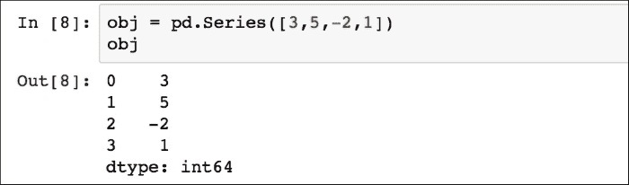

`obj`对象由两个值组成，左边的索引和右边的关联值。鉴于数据的长度等于*N*，默认索引从`0`到*N-1*。`Series`的数组和索引对象可以通过其值和索引属性分别获得：

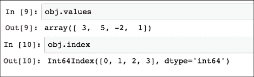

通过应用 NumPy 数组操作（如标量乘法、布尔数组过滤或应用数学函数）来保留索引：

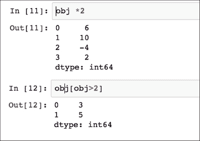

一个 Python 字典可以被转换成一个`Series`，但索引将对应于键值：

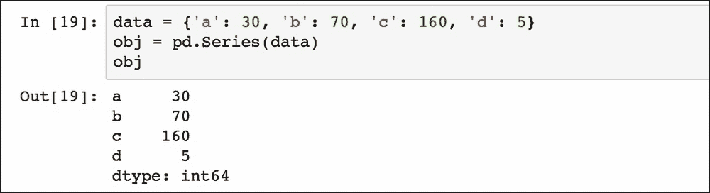

可以指定一个分开的列表作为索引：

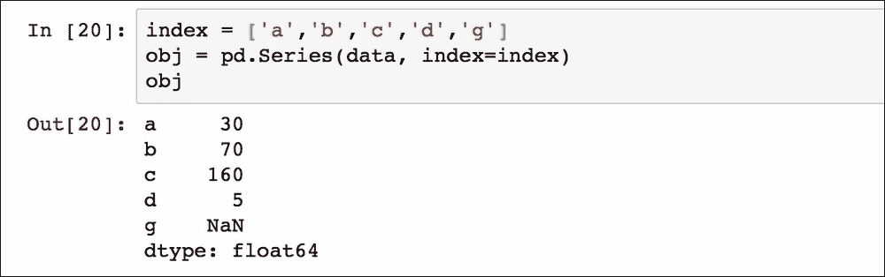

在这种情况下，最后一个索引值`g`没有关联的对象值，因此默认插入一个**非数字**（**NaN**）。

术语*缺失*或*NA*将用于指代缺失数据。要找到缺失数据，可以在 pandas 中使用`isnull`和`notnull`函数：

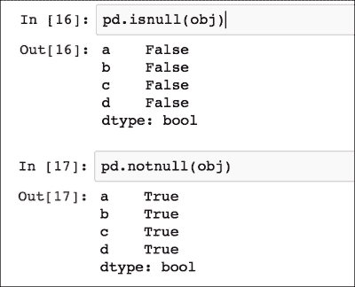

现在我们可以开始将 CSV 文件加载到 DataFrame 结构中。DataFrame 表示一个包含有序列的数据结构，每一列可以有不同的值类型（数值、字符串、布尔值和其他）。DataFrame 有两个索引（行索引和列索引），它可以被视为一个共享相同索引（列）的`Series`字典。为了本教程的目的，我们正在使用存储在[`archive.ics.uci.edu`](http://archive.ics.uci.edu)网站上的`ad.data`文件中的数据（如前所述的机器学习示例中所述）。

使用终端（在这种情况下路径是`data_example/ad-dataset/ad-data`）以下方式加载数据：

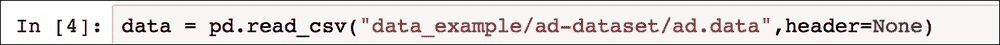

此文件没有标题（设置为`none`），因此列名是数字，我们可以使用`describe`函数在数据对象上获取 DataFrame 的摘要：

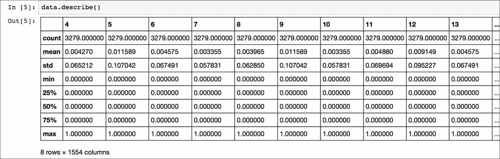

这总结了定量信息。我们可以看到有`1554`个数值列（由于没有标题，用数字表示）和`3279`行（每列称为`count`）。每一列都有一个统计参数列表（平均值、标准差、最小值、最大值和分位数），这有助于获取数据中包含的定量信息的初始估计。

可以使用`columns`属性来获取列名：

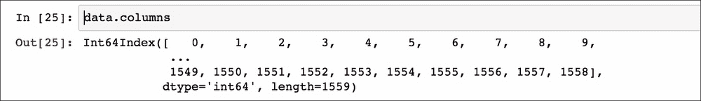

因此，所有列名都是`int64`类型，以下命令返回所有列的实际类型：

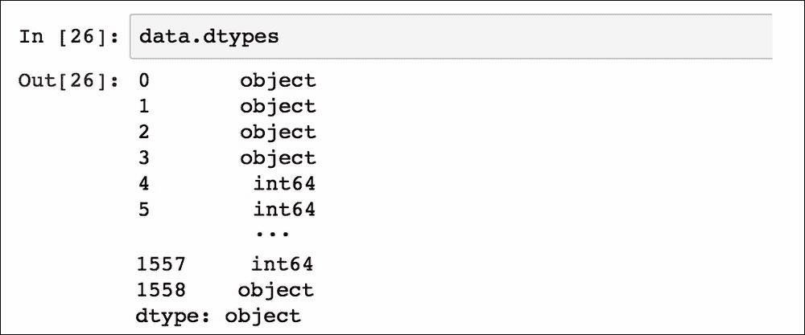

前四列和标签（最后一列）是`object`类型，而其他列是`int64`类型。可以通过两种方式访问列。第一种方法是通过指定列名，就像字典中的键一样：

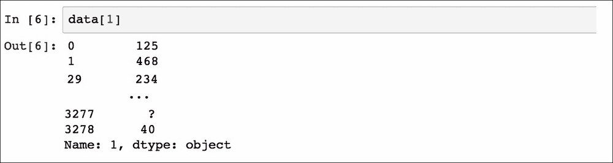

可以通过指定列名列表来获得多列：

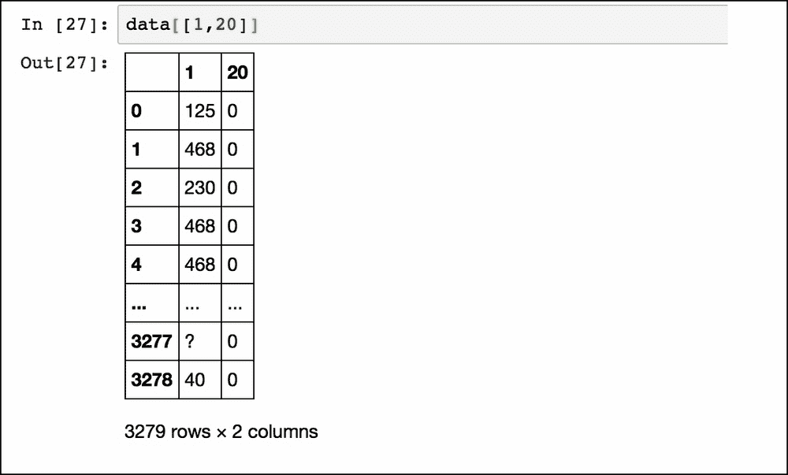

另一种访问列的方法是使用*点*语法，但只有当列名也可以作为 Python 变量名（即没有空格），并且不与 DataFrame 属性或函数名（如 count 或 sum）相同，并且名称是字符串类型（不是像在这个例子中的`int64`）时，它才会工作。

要简要了解 DataFrame 的内容，可以使用`head()`函数。默认情况下，返回列中的前五个项目（或 DataFrame 中的前五行）：

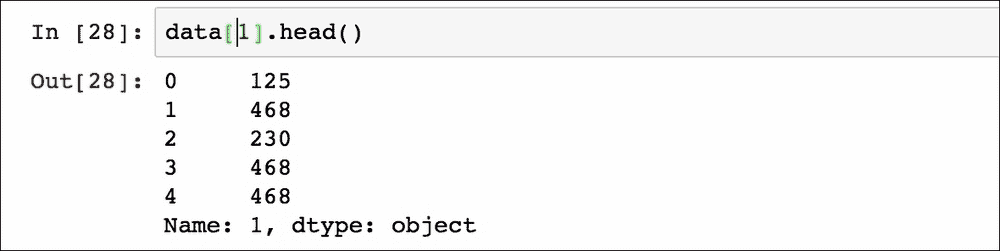

相反的方法是`tail()`，默认情况下返回最后五个项目或行。在`tail()`或`head()`函数上指定一个数字，将返回所选列中的前*n*个项目：

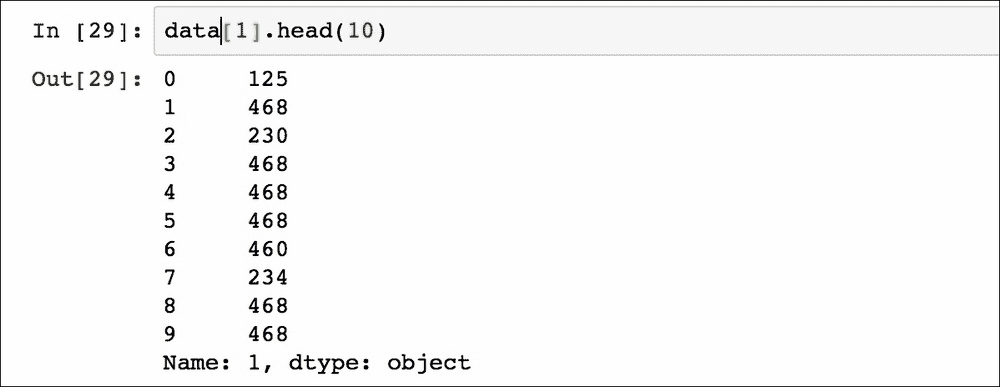

也可以使用 Python 的常规切片语法来获取 DataFrame 的一定数量的行：

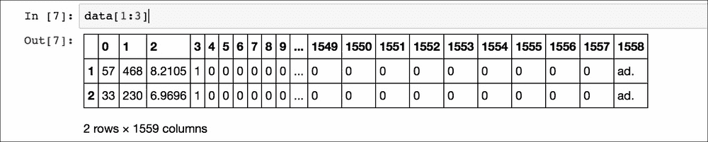

这个例子只显示了从`1`到`3`的行。

### 操作数据

可以以不同的方式选择行，例如指定索引或条件如下：

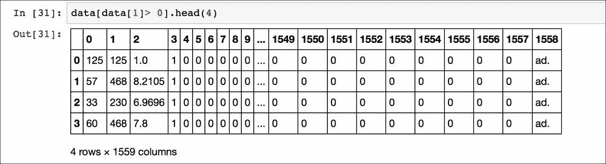

或者指定多个条件：

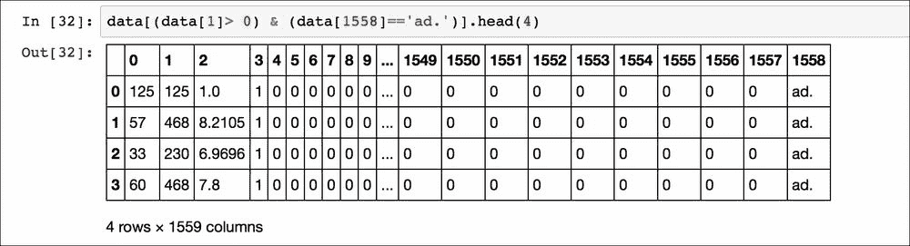

返回的数据是具有特征`1`大于`0`且包含广告的网页。

`ix`方法允许我们通过指定所需的索引来选择行：

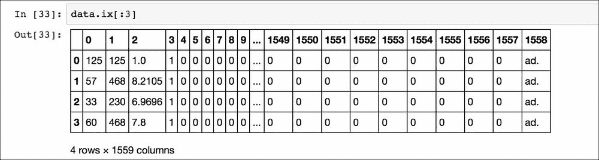

或者使用函数`iloc`：

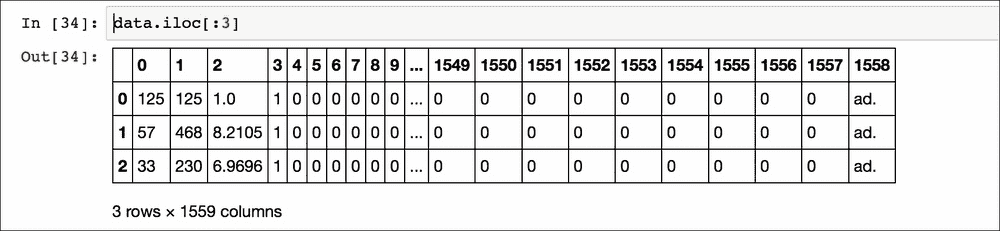

差异在于`ix`在索引列的标签上工作，而`iloc`在索引的位置上工作（因此它只接受整数）。因此，在这个例子中，`ix`找到从`0`到出现标签`3`的所有行，而`iloc`函数返回数据框中前`3`个位置的行。还有一个第三个函数可以访问 DataFrame 中的数据，即`loc`。这个函数查看与行关联的索引名称，并返回它们的值。例如：

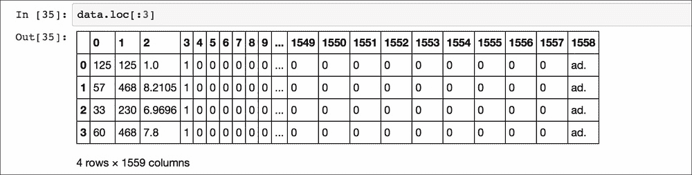

注意，这个函数与 Python 中的正常切片行为不同，因为起始行和结束行都包含在结果中（索引为`3`的行包含在输出中）。

也可以将整个列设置为某个值：

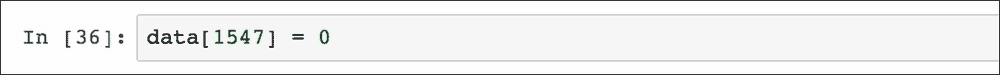

要也将特定单元格的值设置为所需的值：

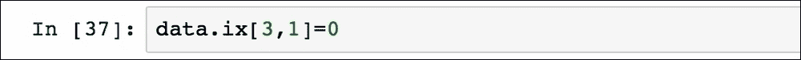

或者将整行设置为一系列值（在这个例子中是介于`0`和`1`之间的随机值和`ad.`标签）：

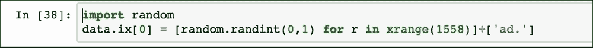

在将`Series`对象中的值数组转换后，可以在 DataFrame 的末尾添加一行：

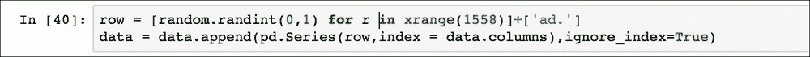

或者，可以使用`loc`函数（如 NumPy 中所示）在最后一行添加一行：

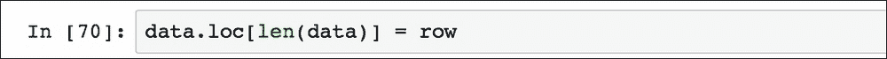

通过简单地将新列名赋给值，很容易在 DataFrame 中添加一列：

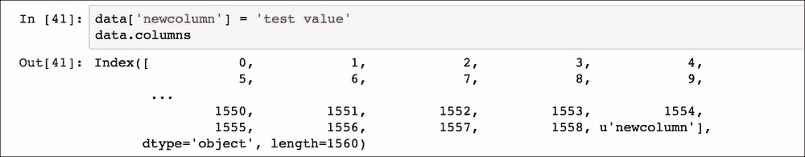

在这个例子中，新列包含了分配给*测试值*的所有条目。同样，可以使用`drop`函数删除该列：

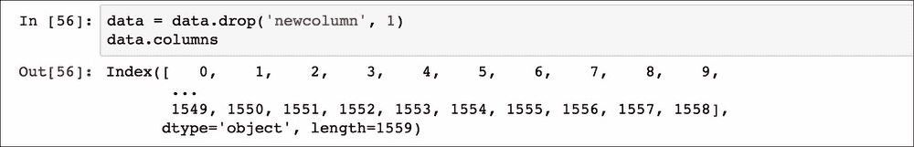

数据集可能由于各种原因包含重复项，因此 pandas 提供了`duplicated`方法来指示每一行是否是重复的：

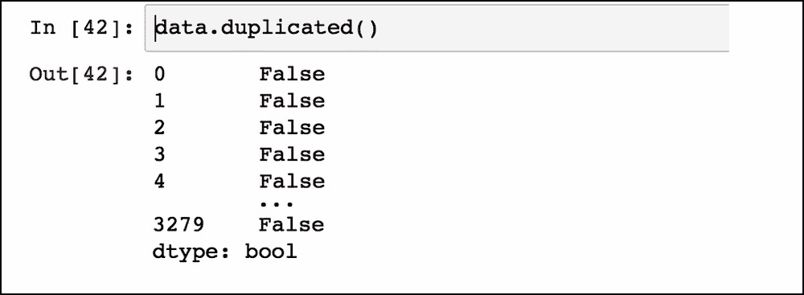

更有用的是，`drop_duplicates`函数返回一个只包含唯一值的 DataFrame。例如，对于标签，唯一值如下：

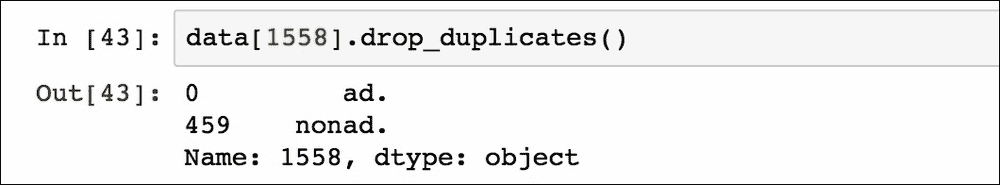

结果可以转换成一个列表：

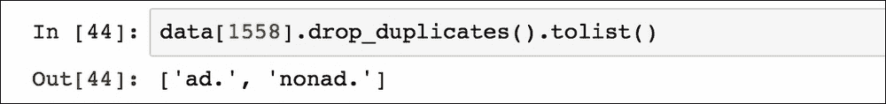

正如我们在机器学习示例中所做的那样，这些标签可以使用前面示例中解释的方法转换为数值：

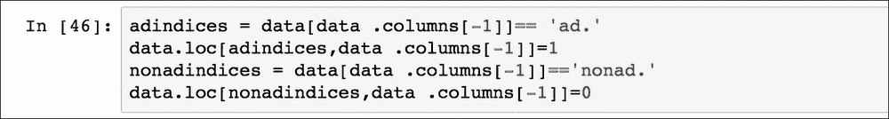

标签列仍然是`object`类型：

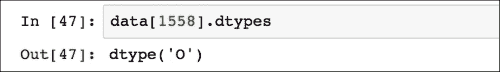

因此，现在可以将该列转换为浮点类型：

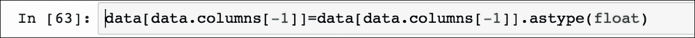

前四列包含混合值（字符串、`?`和浮点数），因此我们需要删除字符串值以将列转换为数值类型。我们可以使用`replace`函数将所有`?`（缺失值）实例替换为`NaN`：

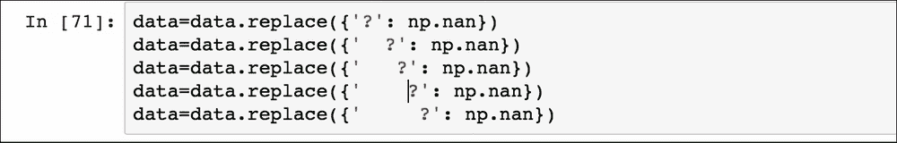

现在我们可以用两种方式处理这些包含缺失数据的行。第一种方法就是使用`dropna`删除包含缺失值的行：


而不是删除包含缺失数据的行（这可能会导致删除重要信息），可以使用`fillna`方法填充空条目。对于大多数目的，可以在空单元格中插入一个常数值：

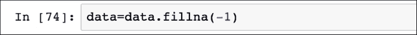

现在所有值都是数值型，可以将列设置为`float`类型，应用`astype`函数。或者，我们可以应用一个`lambda`函数将 DataFrame 中的每一列转换为数值类型：

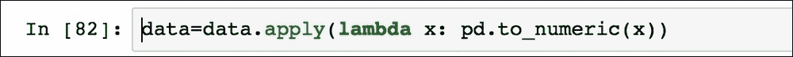

每个*x*实例是一个列，`to_numeric`函数将其转换为最接近的数值类型（在这种情况下是`float`）：

为了使这个教程更加完整，我们想展示如何将两个 DataFrame 连接起来，因为这种操作在实际应用中可能很有用。让我们创建另一个包含随机值的 DataFrame：

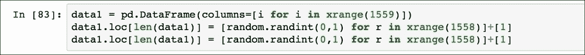

使用`concat`函数可以将这个包含两行的新表与原始 DataFrame 合并，将`data1`的行放置在`data`的底部：

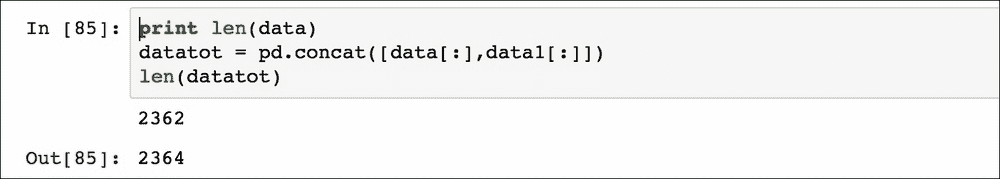

与`data`相比，`datatot`的行数现在增加了两行（注意，行数与开始时不同，因为我们删除了包含`NaN`的行）。

## Matplotlib 教程

`matplotlib.pyplot` 是一个收集了一系列用于绘制数据的函数的库，类似于 **MATLAB**。由于以下章节将使用这个库来可视化一些结果，这里的一个简单示例将解释你将在本书中看到的所有的 `matplotlib` 代码：

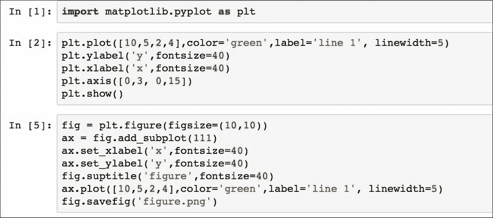

导入库（作为 `plt`）后，初始化 `figure` 对象（`fig`）并添加一个 `axis` 对象（`ax`）。通过命令 `ax.plot()` 绘制到 `ax` 对象中的每条线都称为句柄。然后，所有后续指令都由 `matplotlib.pyplot` 记录并在 `figure` 对象中绘制。在这种情况下，绿色线条已从终端显示并保存为 `figure.png` 文件，分别使用 `plt.show()` 和 `fig.savefig()` 命令。结果是：

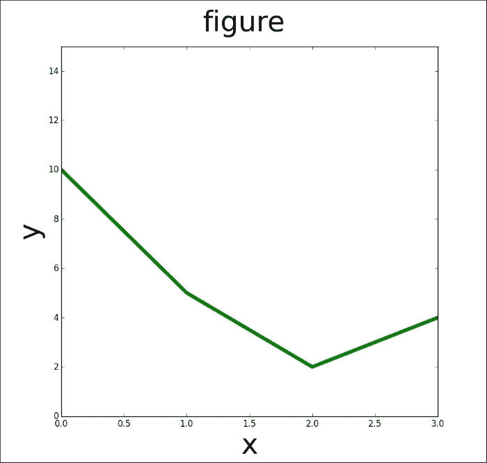

简单绘图示例

下一个示例展示了使用 Numpy 数组在一个命令中绘制具有不同格式样式的几条线的绘图：

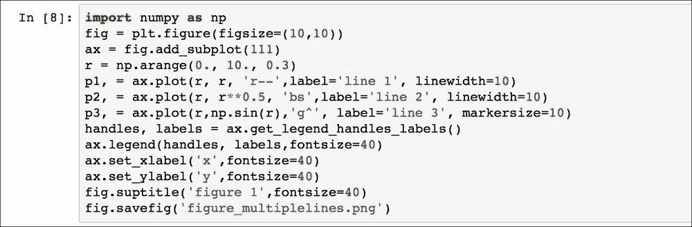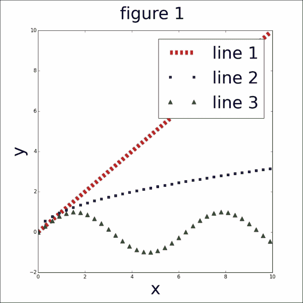

多条线绘图示例

注意，函数 `get_legend_handles_labels()` 返回存储在对象 `ax` 中的句柄和标签列表，并将它们传递给绘图函数 `legend`。符号 `'r--'`、`'bs'` 和 `'g^'` 分别指代点的形状及其颜色（红色矩形、蓝色正方形和绿色三角形）。`linewidth` 参数设置线的粗细，而 `markersize` 设置点的尺寸。

另一个有用的可视化结果的方法是散点图，其中显示了一组数据（使用 NumPy `random` 子模块生成）中通常两个变量的值：

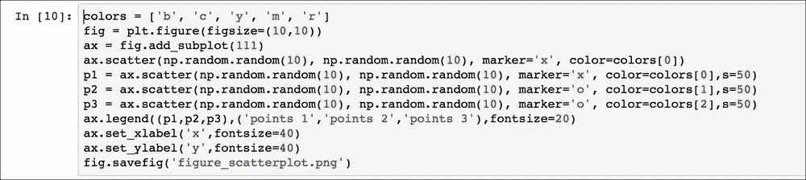

`s` 选项表示点的尺寸，`colors` 是对应于每组点的颜色，句柄直接传递到图例函数（`p1`、`p2`、`p3`）：

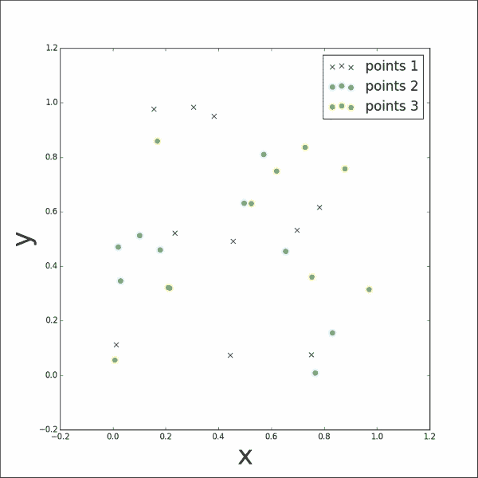

随机分布点的散点图

关于如何使用 `matplotlib` 的更多细节，我们建议读者阅读在线材料和学习教程，例如 [`matplotlib.org/users/pyplot_tutorial.html`](http://matplotlib.org/users/pyplot_tutorial.html)。

# 书中使用的科学库

在本书中，为了实现每一章讨论的机器学习技术，某些库是必要的。我们将简要描述以下将使用的最相关的库：

+   **SciPy** 是基于 NumPy 数组对象的一系列数学方法。它是一个开源项目，因此它利用了来自世界各地开发者的持续编写的方法。使用 SciPy 例程的 Python 软件是高级项目或应用的一部分，与 MATLAB、**Octave** 或 **RLab** 等类似框架相当。它提供了从操作和可视化数据函数到并行计算例程的广泛方法，这些例程增强了 Python 语言的灵活性和潜力。

+   **scikit-learn**（**sklearn**）是 Python 编程语言的开放源代码机器学习模块。它实现了包括支持向量机、**朴素贝叶斯**、**决策树**、**随机森林**、**k-means** 和 **基于密度的空间聚类应用噪声**（**DBSCAN**）在内的聚类、分类和回归等算法，并且与数值 Python 库（如 NumPy 和 SciPy）进行原生交互。尽管大多数例程是用 Python 编写的，但一些函数是用 **Cython** 实现的，以实现更好的性能。例如，支持向量机和逻辑回归是用 Cython 包装其他外部库（**LIBSVM**、**LIBLINEAR**）编写的。

+   **自然语言工具包**（**NLTK**）是 Python 语言处理中用于自然语言处理（**NLP**）的一组库和函数。NLTK 设计用于支持 NLP 和相关领域的研究和教学，包括人工智能、认知科学、信息检索、语言学和机器学习。它还提供了一系列文本处理例程，用于分词、词干提取、标记、解析、语义推理和分类。NLTK 包括示例代码和示例数据，以及超过 50 个语料库和词汇数据库的接口。

+   **Scrapy** 是一种用于 Python 编程语言的开放源代码网络爬虫框架。最初设计用于抓取网站，作为一个通用爬虫，它也适用于通过 API 提取数据。Scrapy 项目围绕提供一组指令的 *蜘蛛* 进行编写。它还提供了一个网络爬虫外壳，允许开发者在实际实现之前测试他们的概念。Scrapy 目前由 Scrapinghub Ltd. 维护，这是一家网络爬取开发和服务的公司。

+   **Django** 是一个遵循 *模型-视图-控制器* 架构模式的免费和开源 Web 应用程序框架，用 Python 实现。Django 设计用于创建复杂、以数据库为中心的网站。它还允许我们通过管理界面来管理应用程序，可以创建、读取、删除或更新应用程序中使用的数据。目前有一系列已建立的网站正在使用 Django，例如 Pinterest、Instagram、Mozilla、华盛顿时报和 Bitbucket。

# 何时使用机器学习

机器学习并非魔法，它可能对所有与数据相关的问题都不一定有益。在本介绍的最后，重要的是要明确机器学习技术在何时极为有用：

+   规则无法编码：一系列人类任务（例如，确定一封电子邮件是否为垃圾邮件）无法通过简单的规则方法有效解决。实际上，多个因素可能影响解决方案，如果规则依赖于大量因素，那么对人类来说手动实施这些规则变得很困难。

+   解决方案不可扩展：每当手动对某些数据进行决策耗时较长时，机器学习技术可以适当地扩展。例如，机器学习算法可以有效地处理数百万封电子邮件并确定它们是否为垃圾邮件。

然而，如果可能找到良好的目标预测，仅通过使用数学规则、计算或无需数据驱动学习的预定方案，这些高级机器学习技术就不再必要（您也不应该使用它们）。

# 读累了记得休息一会哦~

**公众号：古德猫宁李**

+   电子书搜索下载

+   书单分享

+   书友学习交流

**网站：**[沉金书屋](https://www.chenjin5.com)

+   电子书搜索下载

+   电子书打包资源分享

+   学习资源分享

# 摘要

在本章中，我们介绍了本书其余部分将使用的机器学习基本概念和术语。我们还介绍了机器学习专业人士用于准备、处理和可视化数据的最重要的库（NumPy、pandas 和 matplotlib）的教程。还提供了一般介绍所有将在以下章节中使用的其他 Python 库。

您应该对机器学习领域实际上能做什么有一个一般性的了解，并且您现在应该熟悉将数据转换为可用格式的方法，以便应用机器学习算法。在下一章中，我们将解释主要的无监督学习算法以及如何使用`sklearn`库来实现它们。
