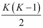
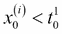

# 第三章：监督机器学习

在本章中，我们将讨论最相关的回归和分类技术。所有这些算法都有相同的背景过程，通常算法的名称既指分类方法也指回归方法。以下几节将讨论线性回归算法、朴素贝叶斯、决策树和支持向量机。为了理解如何应用这些技术，我们将使用提到的方法解决一个分类问题和回归问题。本质上，我们将使用标记的训练数据集来**训练模型**，这意味着找到参数的值，正如我们在引言中所讨论的。通常，代码可在我的 GitHub 文件夹中找到，网址为[`github.com/ai2010/machine_learning_for_the_web/tree/master/chapter_3/`](https://github.com/ai2010/machine_learning_for_the_web/tree/master/chapter_3/)。

我们将以一个额外的算法结束本章，这个算法可能用于分类，尽管它不是专门为此目的设计的（隐马尔可夫模型）。现在，我们将开始解释在预测与数据集相关的真实标签时，方法中错误的一般原因。

# 模型误差估计

我们提到，训练好的模型用于预测新数据的标签，预测的质量取决于模型**泛化**的能力，即对训练数据中未出现的案例的正确预测。这是文献中一个众所周知的问题，与两个概念相关：输出的偏差和方差。

偏差是由于算法中的错误假设而产生的错误。给定一个带有标签 *y[t]* 的点 *x^((t))*，如果模型用不同的训练集进行训练，那么模型是有偏差的，预测的标签 *y[t] ^(pred)* 将始终与 *y[t]* 不同。方差误差则是指给定点 *x^((t))* 的不同、错误预测的标签。为了解释这些概念，可以考虑一个以真实值为中心的圆（真实标签），如下面的图所示。预测标签越接近中心，模型越无偏，方差越低（如下面图中的左上角）。其他三种情况也在此处展示：

偏差和方差低误差的模型将具有预测标签为蓝色点（如图所示）集中在红色中心（真实标签）上。高偏差误差发生在预测远离真实标签时，而高方差出现在预测值范围很广时。


偏差和方差示例。

我们已经看到，标签可以是连续的或离散的，分别对应回归和分类问题。大多数模型都适合解决这两个问题，我们将使用词回归和分类来指代同一个模型。更正式地说，给定一组 *N* 个数据点和相应的标签  ，一个具有一组参数  的真实参数值  的模型将具有 **均方误差** ( **MSE** )，等于：


我们将使用均方误差（MSE）作为衡量本章讨论的方法的指标。现在我们将开始描述广义线性方法。

# 广义线性模型

广义线性模型是一组试图找到形成标签 *y[i]* 与特征向量 *x^((i))* 之间线性关系的 *M* 参数  的模型，如下所示：


这里， 是模型的误差。寻找参数的算法试图最小化由成本函数 *J* 定义的模型的总误差：


使用称为 **批量梯度下降** 的迭代算法来最小化 *J* ：


在这里，α 被称为学习率，它是收敛速度和收敛精度之间的权衡。一个被称为 **随机梯度下降** 的替代算法，即  的循环：


θ[j] 对于每个训练示例 *i* 进行更新，而不是等待整个训练集的总和。最后一个算法接近 *J* 的最小值，通常比批量梯度下降更快，但最终解可能围绕参数的真实值振荡。以下段落描述了最常用的模型  和相应的成本函数 *J* 。

## 线性回归

线性回归是最简单的算法，基于以下模型：


成本函数和更新规则是：


## 岭回归

岭回归，也称为 **Tikhonov 正则化**，在成本函数 *J* 中添加了一个项，使得：


，其中λ是正则化参数。附加项具有所需的功能，以偏好一组参数而不是所有可能的解决方案，惩罚所有不同于*0*的参数θ[j]。θ[j]的最终集合*收缩*在*0*周围，降低了参数的方差，但引入了偏差误差。用上标*l*表示线性回归的参数，岭回归参数通过以下公式相关：


这清楚地表明，λ值越大，岭参数围绕*0*的收缩越多。

## Lasso 回归

Lasso 回归是一个类似于岭回归的算法，唯一的区别在于正则化项是参数绝对值的总和：


## 逻辑回归

尽管名称如此，此算法用于（二元）分类问题，因此我们定义标签。模型被赋予所谓的逻辑函数，表示为：


在这种情况下，代价函数定义为以下：


从这个公式中，更新规则形式上与线性回归相同（但模型定义不同）：


注意，对于点*p*的预测 是一个介于*0*和*1*之间的连续值。因此，通常，为了估计类标签，我们在 =0.5 处设置一个阈值，使得：


逻辑回归算法可以使用一对一或一对多的技术应用于多标签问题。使用第一种方法，通过训练*K*个逻辑回归模型来解决一个有*K*个类的问题，每个模型假设考虑的类*j*的标签为*+1*，其余所有标签为*0*。第二种方法包括为每对标签训练一个模型 (训练的模型)。

## 广义线性模型的概率解释

现在我们已经看到了广义线性模型，让我们找到满足以下关系的参数θ[j]：


在线性回归的情况下，我们可以假设服从均值为*0*和方差σ²的正态分布，其概率等价于：


因此，系统的总似然可以表示如下：


在逻辑回归算法的情况下，我们假设逻辑函数本身是概率：


然后，似然可以表示为：


在这两种情况下，可以证明最大化似然等价于最小化成本函数，因此梯度下降将是相同的。

## k-最近邻（KNN）

这是一个非常简单的分类（或回归）方法，其中给定一组具有相应标签*y[i] *的特征向量，将测试点*x^((t)) *分配给在*K*个最近邻中找到的标签值，使用以下距离度量：

+   **欧几里得**：

+   **曼哈顿**：

+   **闵可夫斯基**：（如果*q=2*，这会降低到欧几里得距离）

在回归的情况下，值*y[t]*是通过将大多数出现替换为标签的平均值来计算的。最简单的平均（或大多数出现）具有均匀权重，因此每个点的重要性相同，无论它们与 x * ^((t)) *的实际距离如何。然而，可以使用权重等于*x^((t)) *的逆距离的加权平均。

# 朴素贝叶斯

**朴素贝叶斯**是一种基于贝叶斯概率定理和特征条件独立性假设的分类算法。给定一组*m*个特征，以及一组标签（类别），标签*c*（也给定特征集*x[i] *）的概率由贝叶斯定理表示：


这里：

+   被称为似然分布

+   是后验分布

+   是先验分布

+   被称为证据

与特征集相关的预测类别将是值*p*，使得概率最大化：


然而，该方程无法计算。因此，需要做出一个假设。

使用条件概率规则，我们可以将前面公式的分子写为以下形式：


我们现在使用这样的假设：每个特征 *x[i]* 在给定 *c* 的条件下是条件独立的（例如，为了计算给定 *c* 的 *x[1]* 的概率，标签 *c* 的知识使得其他特征 *x[0]* 的知识变得冗余，）：


在这个假设下，具有标签 *c* 的概率等于：

 ––––––––(1)

在这里，分子中的 *+1* 和分母中的 *M* 是常数，有助于避免 *0/0* 的情况（**拉普拉斯平滑**）。

由于（**1**）的分母不依赖于标签（它是所有可能标签的总和），最终的预测标签 *p* 通过找到（**1**）的分子中的最大值来获得：

 ––––––––(2)

给定通常的训练集 ，其中 （*M* 个特征）对应于标签集合 ，*P(y=c)* 的概率简单地按频率计算，即与类别 *c* 相关的训练示例数除以示例总数，。相反，条件概率  通过遵循分布来评估。我们将讨论两个模型，**多项式朴素贝叶斯**和**高斯朴素贝叶斯**。

## 多项式朴素贝叶斯

假设我们想要确定一个由一组单词出现给出的电子邮件 *s* 是否是垃圾邮件 *(1)* 或不是 *(0)*，以便。*M* 是词汇表的大小（特征的数量）。有  个单词和 *N* 个训练示例（电子邮件）。

每个带有标签 *y[i]* 的电子邮件 *x^((i))*，满足，是词汇表中单词 *j* 在训练示例 *l* 中出现的次数。例如， 表示单词 *1* 或 *w[1]* 在第三封电子邮件中出现的次数。在这种情况下，对似然应用多项式分布：


在这里，前面的归一化常数可以被忽略，因为它们不依赖于标签 *y* ，因此 *arg max* 运算符不会受到影响。重要的是对单个单词 *w[j]* 的评估：在训练集中的概率：


在这里，*N[iy]* 表示单词 *j* 发生的次数，它与标签 *y* 相关，而 *N[y]* 是训练集中带有标签 *y* 的部分。

这是对、在方程（**1**）和多项式分布似然中的类似。由于概率上的指数，通常应用对数来计算最终的算法（**2**）：


## 高斯朴素贝叶斯

如果特征向量 *x^((i))* 具有连续值，则可以应用此方法。例如，我们想要将图像分类为 *K* 个类别，每个特征 *j* 是一个像素，而 *x[j] ^((i))* 是训练集中第 *i* 张图像的第 *j* 个像素，训练集包含 *N* 张图像和标签。给定一个由像素表示的无标签图像，在这种情况下，方程（**1**）中的变为：


在这里：


并且：


# 决策树

这类算法旨在通过生成从特征值学习的一系列简单规则来分割数据集，以预测未知标签。例如，考虑一个根据湿度、风速、温度和压力值决定今天是否带伞的案例。这是一个分类问题，以下图所示的决策树示例基于 100 天的数据。以下是一个样本表格：

| 湿度（%） | 压力（mbar） | 风速（Km/h） | 温度（C） | 伞 |
| --- | --- | --- | --- | --- |
| 56 | 1,021 | 5 | 21 | 是 |
| 65 | 1,018 | 3 | 18 | 否 |
| 80 | 1,020 | 10 | 17 | 否 |
| 81 | 1,015 | 11 | 20 | 是 |


基于过去 100 天记录预测是否带伞的决策树。

在前面的图中，方框中的数字代表需要带伞的天数，而圆圈中的数字表示不需要带伞的天数。

决策树呈现两种类型的节点：决策节点，当应用决策分割时有两个（或更多）分支；以及叶节点，当数据被分类。停止标准通常是最大决策节点数（树的深度）或继续分割所需的最小数据点数（通常在 2 到 5 之间）。决策树学习的目标是构建所有可能节点组合中的 *最佳* 树，即估计要应用规则的层次结构（换句话说，第一个决策节点应该放在湿度上还是温度上，等等）。更正式地说，给定一个训练集  ，其中 *x^((i)) * 在 *R^m* 中，并对应标签 *y[i]* ，我们需要找到分割节点 *k* 的最佳规则。如果选择的特征 *j* 是连续的，每个分割规则由一个特征 [ *j* ] 和一个阈值 *t^j [k]* 组成，该阈值将 *S* 分割为  和  为  和  ， 。节点 *k* 的最佳分割规则  与测量规则如何将数据分离成具有不同标签的分区（即每个分支将包含最小量的标签混合）的 *I* 杂乱度函数的最小值相关联：


在这里， 分别表示左右分支上的数据点数量。*N[k]* 是节点 *k* 上的数据点数量，而 *H* 是一个可以采用每个目标值 *l* 在分支 *b*（*b* 可以是左分支或右分支）的概率的不同表达式来假设的度量， :

+   分支的熵：

+   分支的基尼不纯度：

+   误分类：

    +   均方误差（方差）：（其中  ）

注意，后者通常用于回归问题，而其他则用于分类。还应注意，在文献中，通常将 *信息增益* 定义为节点 *k* 的 *H* 与 

 其中 

如果特征 *j* 是离散的，具有 *d* 个可能值，则没有二元阈值 *t^j [k]* 来计算，数据被分割成 *d* 个分区。度量 *H* 在 *d* 个子集中计算。

例如，我们可以使用熵作为不纯度度量 *H* ，确定前一个示例中第一个节点（ *k=0* ）的规则。

所有特征都是连续的，因此需要 *t^j [0]* 的值。假设 *j=0* 是湿度，并按升序排序，我们拥有的数据集中可能的湿度值如下：

| h | 0 | 1 | …. | 98 | 99 |
| --- | --- | --- | --- | --- | --- |
| 伞 | 是 | 否 | …. | 否 | 否 |
| 湿度 | **58** | 62 | …. | 88 | 89 |
|   | < | >= | < | >= | < | >= | < | >= | < | >= |
| 是 | 0 | 11 | 14 | 32 | 7 | 20 | 29 | 12 | 78 | 0 |
| 否 | 0 | 89 | 21 | 33 | 13 | 60 | 10 | 49 | 22 | 0 |
|  | **0.5** | 0.99 | 0.85 | 0.76 | 0.76 |

因此，湿度特征的阈值值为  = 58；同样地，我们可以计算出温度 *t¹ [0] * ，风速 *t² [0] * 和压力 *t³ [0] * 的阈值值。现在我们可以记录下来，确定第一个节点的最佳规则，计算每个四个特征的纯度：

| 是 | 伞 | 是/否 | 伞 |
| --- | --- | --- | --- |
| 否 |   |   |   |
| 湿度 j=0 |  | 0 | 0 | 温度 j=1 |  | 21 | 32 |
|  | 11 | 89 |  | 11 | 36 |
| 纯度: | 纯度: |
| 是 | 伞 | 是/否 | 伞 |
| 否 |   |   |   |
| 风速 j=2 |  | 48 | 5 | 压力 j=3 |  | 39 | 3 |
|  | 1 | 46 |  | 45 | 13 |
| **纯度** : | 纯度: |

因此，对于节点 *0* ，最佳规则如下：


即，具有阈值 *t² [0]* 的风速特征。我们可以重复相同的程序，找到以下决策节点的最佳规则，直到树的末尾。

决策树学习能够处理大型数据集，尽管它通常不太擅长泛化，尤其是在具有大量特征的情况下（ *N* ≈ *M* ）。在这种情况下，建议设置树的小深度或使用一些降维技术。设置分割的最小数据点数或叶节点中的最小数据点数也有助于防止过拟合。此算法可能导致过复杂的树；它们可以被 *剪枝* 以减少不影响预测质量的分支。有各种剪枝技术，但它们超出了本书的范围。请注意，还可以同时训练一系列决策树，组成所谓的 **随机森林** 。随机森林使用原始数据点的随机样本训练每个树，并且每个决策节点学习都有可用的随机特征子集。结果是回归问题中的预测平均值或分类问题中的多数值。

# 读累了记得休息一会哦~

**公众号：古德猫宁李**

+   电子书搜索下载

+   书单分享

+   书友学习交流

**网站：**[沉金书屋 https://www.chenjin5.com](https://www.chenjin5.com)

+   电子书搜索下载

+   电子书打包资源分享

+   学习资源分享

# 支持向量机

此算法，**支持向量机**（**SVM**），试图在几何上将数据集分为两个标记为*y[i] =+1*和*y[i] =-1*的子集。下一图显示了数据被完美地分为两类（空心圆和黑色圆），即决策边界（或超平面）由黑色线完全分隔两个类的数据（换句话说，没有误分类的数据点）：


数据集分为两类（空心和实心圆）的草图，由黑色线（决策边界）分隔

超平面由方程在数学上描述，其中是超平面到原点的距离，*w*是超平面的法线。算法的目标是最大化决策边界与数据点之间的距离。在实践中，我们考虑最接近超平面的点*i*，称为支持向量，它们位于距离决策边界*d[1]*，*d[2]*的两个平面*H[1]*，*H[2]*上，使得：

对于*H[1]*，使得*y[i] =+1* ––––––––(1)

对于*H[2]*，使得*y[i] =-1* ––––––––(2)

假设*d[1] =d[2]*，共同距离称为边缘，因此支持向量机方法找到*w*和*b*的值，以最大化边缘。

由于*H[1]*和*H[2]*之间的距离由给出，因此边缘等于，支持向量机算法等价于：

使得，

这里，已经添加了平方运算和因子，以便使用二次规划方法解决数学问题。现在，问题可以用拉格朗日乘数 a * [i] >0*重写为拉格朗日形式：


将关于和*b*的导数设置为*0*，我们得到：

 ––––––––(3)

 ––––––––(4)

因此，优化的拉格朗日函数变为：


这里，。

这被称为原始问题的对偶形式，它只依赖于 a * i*的最大化：


使用称为二次规划的技术找到解 （当 *a * [i] =0* 时返回零向量），这些解代表通过公式 **(3**) 的支持向量 *w*：

 ––––––––(5).

一个 *s* 满足方程（方程 **(1**) 和 **(2**) 的组合）：


将方程式 **(3**) 代入，并将两边乘以 *y[s]*（其值为 *+1* 或 *-1*），我们得到：


对所有支持向量 *N[s]* 进行平均，我们可以得到参数 *b* 的更好估计：

 ––––––––(6)

方程 **(5**) 和 **(6**) 返回定义支持向量机算法的参数值，从而可以预测所有测试点 *t* 的类别：


如果一条线无法完全将数据点分为两类，我们需要允许数据点被错误分类，错误率为 ：


我们需要最大化边缘，同时尽量减少误分类错误。这个条件被转化为这个方程：

使得 

在这里，参数 *C* 被设置为平衡边缘大小与误分类错误（*C=0* 简单地没有误分类和最大边缘，*C>>1* 许多误分类点和一个狭窄的边缘）。应用之前的方法，将双问题提交给拉格朗日乘数条件，并设置上限 *C*：


到目前为止，我们只考虑了只有两个类别的题目。现实问题可能有多个类别，通常使用两种程序来应用这种方法（如逻辑回归所示）：一对多或一对一。给定一个有 *M* 个类别的题目，第一种方法训练 *M* 个支持向量机模型，每个模型假设考虑的类别标签为 *j +1*，其余所有类别为 *-1*。第二种方法则针对每一对类别 *i*，*j* 训练一个模型，导致  个训练模型。显然，第二种方法在计算上更昂贵，但结果通常更精确。

以类似的方式，支持向量机（SVM）可以用于回归问题，即当 *y[i]* 在 *-1* 和 *1* 之间连续时。在这种情况下，目标是找到参数 *w* 和 *b*，使得：


我们假设真实值 *t[i]* 可以与最大的预测值 *y[i]* 不同，并且根据 *y[i]* 是否大于或小于 *t[i]*，预测可以进一步错误分类为。以下图例显示了对于示例点 *i*，围绕真实值 *t[i]* 的各种预测 *y[i]*，以及相关的误差：


预测值 *y[i]* 围绕真实值 *[ti]* 附近

最小化问题变为：


如此：


可以证明，相关的对偶问题现在等于：

 受限于 。

这里，是拉格朗日乘子。

新的预测值 *y[p]* 可以通过应用公式找到，其中参数 *b* 可以像以前一样获得——在由支持向量关联的子集 *S* 上取平均值，该子集由和给出：


## 核技巧

存在一些数据集在某个空间中是不可线性分离的，但如果在正确的空间中变换，那么超平面可以将数据分离成所需的两个或更多类别。考虑以下图例中所示示例：


在二维空间中，左图所示的数据集是不可分离的。将数据集映射到三维空间中，两个类别是可分离的。

我们可以清楚地看到，在二维空间中（左图），这两个类别是不可线性分离的。假设我们随后在数据上应用核函数 *K*，使得：


现在数据可以通过一个二维平面分离（右图）。SVM 算法上的核函数应用于矩阵 *H[ij]*，替换变量 *i*，*j* 上的点积：


在 SVM 算法中常用的核函数：

+   线性核：

+   径向基核（RBF）：

+   多项式核：

+   Sigmoid 核：

# 方法比较

我们现在可以测试本章讨论的解决回归问题和分类问题的方法。为了避免过拟合，通常将数据集分为两个集合：训练集，其中模型参数被拟合；测试集，其中评估模型的准确率。然而，可能需要使用第三个集合，即验证集，在其中可以优化超参数（例如，SVM 中的 *C* 和  或岭回归中的 α）。原始数据集可能太小，无法分为三个集合，而且结果可能会受到训练、验证和测试集中特定数据点选择的影响。解决这个问题的常见方法是通过所谓的交叉验证程序来评估模型——数据集被分为 *k* 个子集（称为折），模型训练如下：

+   使用 *k-1* 个折作为训练数据来训练一个模型。

+   结果模型在剩余的数据部分进行测试。

+   这个过程会重复进行，重复次数与最初决定的折数相同，每次使用不同的 *k-1* 折来训练（因此测试折也不同）。最终准确率是通过在不同 *k* 次迭代中获得的准确率的平均值来得到的。

## 回归问题

我们使用存储在 [`archive.ics.uci.edu/ml/datasets/Housing`](http://archive.ics.uci.edu/ml/datasets/Housing) 和作者仓库 ([`github.com/ai2010/machine_learning_for_the_web/tree/master/chapter_3/`](https://github.com/ai2010/machine_learning_for_the_web/tree/master/chapter_3/) ) 的波士顿郊区的住房数据集，其中本段中使用的代码也可用。该数据集有 13 个特征：

+   **CRIM** : 城镇人均犯罪率

+   **ZN** : 住宅用地中划定为超过 25,000 平方英尺地块的比例

+   **INDUS** : 每个城镇非零售商业地块的比例

+   **CHAS** : 查尔斯河虚拟变量（ *= 1* 如果地块边界是河流； *0* 否则）

+   **NOX** : 氮氧化物浓度（每千万分之一）

+   **RM** : 每套住宅的平均房间数

+   **AGE** : 1940 年之前建造的业主自住单元的比例

+   **DIS** : 从五个波士顿就业中心计算出的加权距离

+   **RAD** : 到辐射高速公路的可达性指数

+   **TAX** : 每 10,000 美元的完整价值财产税率

+   **PTRATIO** : 城镇内的师生比例

+   **B** : *1000(Bk - 0.63)²* ，其中 *Bk* 是城镇中黑人比例

+   **LSTAT** : 人口中低阶层比例以及我们想要预测的标签是 MEDV，它代表房屋价值（以 1000 美元为单位）

为了评估模型的质量，计算了介绍中定义的均方误差和确定系数，*R²*。*R²* 的计算公式如下：


这里，*y[i] ^(pred)* 表示模型预测的标签。

最佳结果是 *R² =1*，这意味着模型完美地拟合了数据，而 *R² =0* 则与一条恒定线模型相关（负值表示拟合越来越差）。使用 `sklearn` 库计算线性回归、岭回归、Lasso 回归和 SVM 回归的代码如下（IPython 笔记本位于 [`github.com/ai2010/machine_learning_for_the_web/tree/master/chapter_3/`](https://github.com/ai2010/machine_learning_for_the_web/tree/master/chapter_3/)）：


使用 pandas 库加载数据集，并通过应用函数 `df.iloc[np.random.permutation(len(df))]` 打乱交叉验证的子集数据（使用了 10 个折），以随机化交叉验证折。此脚本的输出如下：


使用随机森林（包含 50 棵树）获得最佳模型拟合；它返回平均确定系数为 *0.86* 和 *MSE=11.5*。正如预期的那样，决策树回归器的 *R²* 值低于随机森林（分别为 *0.67* 和 *25*），而具有 **rbf 内核**的支持向量机（*C=1*，）是最差的模型，具有巨大的 MSE 错误 *83.9* 和 *R²* 的 *0.0*。具有线性内核的支持向量机（*C=1*，）返回了一个相当不错的模型（*0.69 R²* 和 *25.8* MSE）。Lasso 和岭回归器具有可比的结果，大约 *0.7 R²* 和 *24* MSE。提高模型结果的一个重要程序是特征选择。通常情况下，只有总特征的一部分与模型训练相关，而其他特征可能根本不会对模型 *R²* 贡献。特征选择可以提高 *R²*，因为误导性数据被忽略，并且训练时间减少（要考虑的特征更少）。

对于某个模型提取最佳特征有许多技术，但在这个上下文中，我们探索所谓的递归特征消除方法（RSE），它本质上考虑与最大绝对权重相关的属性，直到选择到所需数量的特征。在 SVM 算法中，权重就是 *w* 的值，而对于回归，它们是模型参数 θ。使用 `sklearn` 内置函数 `RFE` 指定仅最佳四个属性（`best_features`）：


输出如下：


`RFE` 函数返回一个布尔值列表（`support_` 属性），以指示哪些特征被选中（true 值）以及哪些没有被选中（false 值）。然后使用选中的特征来评估模型，就像我们之前做的那样。

即使只使用四个特征，最佳模型仍然是包含 50 棵树的随机森林，其 *R²* 值仅略低于使用完整特征集训练的模型（ *0.82* 对比 *0.86*）。其他模型——lasso、ridge、决策树和线性 SVM 回归器——的 *R²* 值下降更显著，但结果仍然与相应的完整训练模型可比较。请注意，KNN 算法不提供特征权重，因此不能应用`RFE`方法。

## 分类问题

为了测试本章中学习的分类器，我们使用基于六个特征（购买价格、维护成本、车门数量、可搭载人数、行李箱大小和安全）的汽车评估质量数据集（不准确、准确、良好和非常好）。该数据集可以在[`archive.ics.uci.edu/ml/datasets/Car+Evaluation`](http://archive.ics.uci.edu/ml/datasets/Car+Evaluation)或在我的 GitHub 账户上找到，包括此处讨论的代码（[`github.com/ai2010/machine_learning_for_the_web/tree/master/chapter_3/`](https://github.com/ai2010/machine_learning_for_the_web/tree/master/chapter_3/)）。为了评估分类的准确性，我们将使用精确度、召回率和 F 度量。给定只有两个类别（正面和负面）的数据集，我们定义真实正面点数（ *tp* ）为正确标记为正面的点数，错误正面（ *fp* ）为错误标记为正面的点数（负面点），错误负面（ *fn* ）为错误分配到负面类别的点数。使用这些定义，精确度、召回率和 F 度量可以计算如下：


在一个分类问题中，对于给定类别 *C* 的完美精确度（ *1.0* ）意味着每个分配给类别 *C* 的点都属于类别 *C*（没有关于类别 *C* 中错误标记的点数量的信息），而召回率等于 *1.0* 则意味着来自类别 *C* 的每个点都被标记为属于类别 *C*（但关于错误分配给类别 *C* 的其他点的信息没有），

注意，在多类别的情形下，这些指标通常被计算为标签数量的多次，每次考虑一个类别为正面，其他所有类别为负面。然后使用多类别的指标的不同平均值来估计总的精确度、召回率和 F 度量。

对汽车数据集进行分类的代码如下。首先，我们将所有库和数据加载到一个 pandas 数据框中。


以下是一些分类的特征值：

```py

buying 0      v-high, high, med, low

maintenance 1  v-high, high, med, low

doors 2       2, 3, 4, 5-more

persons 3     2, 4, more

lug_boot 4    small, med, big

safety 5      low, med, high

car evaluation 6 unacc,acc,good,vgood

```

这些被映射成用于分类算法的数字：


由于我们需要计算并保存所有方法的度量值，我们编写了一个标准函数`CalcMeasures`，并将标签向量`Y`从特征`X`中分离出来：


使用了`10`次交叉验证折数，代码如下：


度量值的存储在数据框中：


每个度量值已被评估四次——根据索引映射填充数组的汽车评估类别的数量：

```py
'acc': 0, 'unacc': 2, 'good': 1, 'vgood': 3
```

最佳模型是具有 rbf 核的 SVM（*C=50*），但随机森林（50 棵树）和决策树也返回了优秀的结果（所有四个类别的度量值均超过*0.9*）。朴素贝叶斯、逻辑回归以及具有线性核的 SVM（*C=50*）返回了较差的模型，尤其是在准确、好和非常好的类别上，因为这些标签的点很少：


在百分比上，非常好（v-good）和好的比例分别为 3.993%和 3.762%，与 70.0223%的不准确和 22.222%的准确相比。因此，我们可以得出结论，这些算法不适用于预测在数据集中很少出现的类别。

# 隐藏马尔可夫模型

虽然这种方法不能严格地被认为是一种监督学习算法，但它也可以用来执行与分类非常相似的任务，因此我们决定将其包括在内。为了介绍这个主题，我们将提供一个例子。考虑一个简单的例子，通过观察销售员的目光（眼神接触、低头或看向一边，每个观察值*O[i]*分别对应*0*、*1*和*2*）来预测你面前的销售员是在说谎还是不是（两个状态）。想象一下销售员目光的观察序列 O=O * [0] * , O * [1] * , O * [2] * , O * [3] * , O * [4] * ,…是*0, 1, 0, 2,…*我们想要推断连续时间*t*、*t+1*（或在这个例子中，两个连续句子）之间的状态转移矩阵*A*：


*A*矩阵的任何一项，*a[ij]*，表示在时间*t*处于状态*S[j]*的情况下，在时间*t+1*处于状态*S[i]*的概率。因此，*0.3*（*a[01]*）是在时间*t*处于说谎状态的情况下，在时间*t+1*不处于说谎状态的概率，*0.6 (a[10] )*是相反的情况，*0.7(a[00] )*表示在时间*t*和时间*t+10.4(a[11] )*处于说谎状态的概率，在时间*t*真诚之后，在时间*t+1*不处于说谎状态的概率。以类似的方式，可以定义与销售员的三个可能行为相关的矩阵*B*：


任何条目 *b[j(k)]* 是在时间 *t* 给定状态 *S[j]* 的情况下观察 *k* 的概率。例如，*0.7* ( *b[00]* )，*0.1* ( *b[01]* )，和 *0.2* ( *b[02]* ) 分别是商人根据行为观察（眼神接触、低头、看向一边）说谎的概率。这些关系在以下图中描述：


商人行为 - 两种状态的隐马尔可夫模型

商人的初始状态分布也可以定义为：（他在时间 *0* 的第一句话中更倾向于说谎而不是说实话）。注意，所有这些矩阵  都是行随机矩阵；也就是说，行之和为 *1* ，并且没有直接的时间依赖性。一个 **隐马尔可夫模型** ( **HMM** ) 由三个矩阵的组合给出，这些矩阵描述了已知观察序列 *O=O[0] , O[1] ,…O[T-1] * 与相应的隐藏状态序列 *S=S[0] , S[1] ,… S[T-1] * 之间的关系。一般来说，该算法使用的标准符号总结如下：

+   *T* 是观察序列 *O=O[0]* , O[1] ,… O[T-1] 和隐藏状态序列 *S=S[0] , S[1] ,… S[T-1]* 的长度

+   *N* 是模型中可能（隐藏）状态的数量

+   *M* 是可能观察值的数量：

+   *A* 是状态转移矩阵

+   *B* 是观察概率矩阵

+   π 是初始状态分布

在前面的例子中，*M=3* , *N=2* ，我们想象预测商人说话过程中（这些是隐藏状态）的意图序列 *S=S[0] , S[1] ,… S[T-1]* ，观察他的行为值 *O=O[0] , O[1] ,… O[T-1]* 。这是通过计算每个状态序列 *S* 的概率来实现的：


例如，固定 *T=4* ，*S=0101* ，和 *O=1012* ：


同样，我们可以计算所有其他隐藏状态组合的概率，并找到最可能的序列 *S* 。寻找最可能序列 *S* 的有效算法是 **维特比算法** ，它包括计算从 *0* 到 *t* 直到 *T-1* 的所有部分序列的最大概率。在实践中，我们计算以下量：

+   

+   对于 *t=1,…,T-1* 和 *i=0,…,N-1* ，在从不同状态 *j* 来的可能路径中，在时间 *t* 处处于状态 *i* 的最大概率是  。与  的最大值相关的部分序列是直到时间 *t* 的最可能部分序列。

+   最终最可能的序列与时间 *T-1* 的概率最大值相关：

例如，给定前面的模型，长度为 *T=2* 的最可能序列可以计算如下：

+   *P(10)=0.0024*

+   *P(00)=0.0294*

    +   因此 d *1* (0)=P(00)=0.0294

+   *P(01)=0.076*

+   *P(11)=0.01*

    +   因此 d *[1] (1)=P(01)=0.076*

最终最可能的序列是 *00*（两个连续的假句子）。

另一种思考最可能序列的方法是最大化正确状态的数量；也就是说，考虑每个时间 *t* 的状态 *i* ，其概率  最大。使用称为后向算法的算法，可以证明给定状态 *i* 的概率  为：


这里：

+   

+    和  在时间 *t* ，HMM 处于状态 *i* 之前的部分观察序列的概率，

+    和  在时间 *t* 给定状态为 *i* 的情况下，从时间 *t* 到 *T-1* 的部分序列的概率：

+   在时间 *t* 之前和之后保持状态 *i* 的概率组合导致  的值。

注意，计算最可能序列的两种方法不一定返回相同的结果。

逆向问题——给定序列 *O=O[0] ,O[1] ,…O[T-1] * 和参数值 *N* ，*M* ，找到最优的 HMM  ——也可以通过迭代使用 **Baum-Welch 算法** 解决。定义在时间 *t* 出现状态 *i* 的概率和转到状态 *j* 的概率为：

 其中  对于  和  。

然后 Baum-Welch 算法如下：

+   初始化 

+   计算  和 

+   重新计算模型矩阵如下： 其中  和  是克罗内克符号，当  时等于 *1*，否则为 *0*。

+   迭代直到  收敛。

在下一节中，我们将展示一段 Python 代码，实现这些方程以测试 HMM 算法。

## Python 示例

如同往常，这里讨论的 `hmm_example.py` 文件可在 [`github.com/ai2010/machine_learning_for_the_web/tree/master/chapter_3/`](https://github.com/ai2010/machine_learning_for_the_web/tree/master/chapter_3/) 找到。

我们首先定义一个类，在其中我们传递模型矩阵：

```py

class HMM:

 def __init__(self):

self.pi = pi

 self.A = A

 self.B = B

```

维特比算法和最大化正确状态数在以下两个函数中实现：

```py

 def ViterbiSequence(self,observations):

 deltas = [{}]

 seq = {}

 N = self.A.shape[0]

 states = [i for i in range(N)]

 T = len(observations)

 #initialization

 for s in states:

 deltas[0][s] = self.pi[s]*self.B[s,observations[0]]

 seq[s] = [s]

 #compute Viterbi

 for t in range(1,T):

 deltas.append({})

 newseq = {}

 for s in states:

 (delta,state) = max((deltas[t-1][s0]*self.A[s0,s]*self.B[s,observations[t]],s0) for s0 in states)

 deltas[t][s] = delta

 newseq[s] = seq[state] + [s]

 seq = newseq

 (delta,state) = max((deltas[T-1][s],s) for s in states)

 return  delta,' sequence: ', seq[state]

 def maxProbSequence(self,observations):

 N = self.A.shape[0]

 states = [i for i in range(N)]

 T = len(observations)

 M = self.B.shape[1]

 # alpha_t(i) = P(O_1 O_2 ... O_t, q_t = S_i | hmm)

 # Initialize alpha

 alpha = np.zeros((N,T))

 c = np.zeros(T) #scale factors

 alpha[:,0] = pi.T * self.B[:,observations[0]]

 c[0] = 1.0/np.sum(alpha[:,0])

 alpha[:,0] = c[0] * alpha[:,0]

 # Update alpha for each observation step

 for t in range(1,T):

 alpha[:,t] = np.dot(alpha[:,t-1].T, self.A).T * self.B[:,observations[t]]

 c[t] = 1.0/np.sum(alpha[:,t])

 alpha[:,t] = c[t] * alpha[:,t]

 # beta_t(i) = P(O_t+1 O_t+2 ... O_T | q_t = S_i , hmm)

 # Initialize beta

 beta = np.zeros((N,T))

 beta[:,T-1] = 1

 beta[:,T-1] = c[T-1] * beta[:,T-1]

 # Update beta backwards froT end of sequence

 for t in range(len(observations)-1,0,-1):

 beta[:,t-1] = np.dot(self.A, (self.B[:,observations[t]] * beta[:,t]))

 beta[:,t-1] = c[t-1] * beta[:,t-1]

 norm = np.sum(alpha[:,T-1])

 seq = ''

 for t in range(T):

 g,state = max(((beta[i,t]*alpha[i,t])/norm,i) for i in states)

 seq +=str(state)

 return seq

```

由于概率的乘积会导致下溢问题，所有的 Α *[t] (i)* 和 Β *[t] (i)* 都已经乘以一个常数，使得对于  :

+   

+    其中 

现在，我们可以使用推销员意图示例中的矩阵初始化 HMM 模型，并使用前面提到的两个函数：

```py

pi = np.array([0.6, 0.4])

A = np.array([[0.7, 0.3],

 [0.6, 0.4]])

B = np.array([[0.7, 0.1, 0.2],

 [0.1, 0.6, 0.3]]) 

hmmguess = HMM(pi,A,B) 

print 'Viterbi sequence:',hmmguess.ViterbiSequence(np.array([0,1,0,2]))

print 'max prob sequence:',hmmguess.maxProbSequence(np.array([0,1,0,2])) 

```

结果是：

```py

Viterbi: (0.0044, 'sequence: ', [0, 1, 0, 0])

Max prob sequence: 0100

```

在这个特定的情况下，两种方法返回相同的序列，你可以通过改变初始矩阵轻松验证，算法可能会导致不同的结果。我们得到的行为序列；眼神接触，低头，眼神接触，向旁看，很可能与推销员状态序列；说谎，不说谎，说谎，说谎，概率为 *0.0044* 有关。

也可能实现 Baum-Welch 算法，在给定的观测序列以及参数 *N* 和 *M* 的情况下找到最优的 HMM。以下是代码：

```py

 def train(self,observations,criterion):

 N = self.A.shape[0]

 T = len(observations)

 M = self.B.shape[1]

 A = self.A

 B = self.B

 pi = copy(self.pi)

 convergence = False

 while not convergence:

 # alpha_t(i) = P(O_1 O_2 ... O_t, q_t = S_i | hmm)

 # Initialize alpha

 alpha = np.zeros((N,T))

 c = np.zeros(T) #scale factors

 alpha[:,0] = pi.T * self.B[:,observations[0]]

 c[0] = 1.0/np.sum(alpha[:,0])

 alpha[:,0] = c[0] * alpha[:,0]

 # Update alpha for each observation step

 for t in range(1,T):

 alpha[:,t] = np.dot(alpha[:,t-1].T, self.A).T * self.B[:,observations[t]]

 c[t] = 1.0/np.sum(alpha[:,t])

 alpha[:,t] = c[t] * alpha[:,t]

 #P(O=O_0,O_1,...,O_T-1 | hmm)

 P_O = np.sum(alpha[:,T-1])

 # beta_t(i) = P(O_t+1 O_t+2 ... O_T | q_t = S_i , hmm)

 # Initialize beta

 beta = np.zeros((N,T))

 beta[:,T-1] = 1

 beta[:,T-1] = c[T-1] * beta[:,T-1]

 # Update beta backwards froT end of sequence

 for t in range(len(observations)-1,0,-1):

 beta[:,t-1] = np.dot(self.A, (self.B[:,observations[t]] * beta[:,t]))

 beta[:,t-1] = c[t-1] * beta[:,t-1]

 gi = np.zeros((N,N,T-1));

 for t in range(T-1):

 for i in range(N):

 gamma_num = alpha[i,t] * self.A[i,:] * self.B[:,observations[t+1]].T * \

 beta[:,t+1].T

 gi[i,:,t] = gamma_num / P_O

 # gamma_t(i) = P(q_t = S_i | O, hmm)

 gamma = np.squeeze(np.sum(gi,axis=1))

 # Need final gamma element for new B

 prod =  (alpha[:,T-1] * beta[:,T-1]).reshape((-1,1))

 gamma_T = prod/P_O

 gamma = np.hstack((gamma,  gamma_T)) #append one Tore to gamma!!!

 newpi = gamma[:,0]

 newA = np.sum(gi,2) / np.sum(gamma[:,:-1],axis=1).reshape((-1,1))

 newB = copy(B)

 sumgamma = np.sum(gamma,axis=1)

 for ob_k in range(M):

 list_k = observations == ob_k

 newB[:,ob_k] = np.sum(gamma[:,list_k],axis=1) / sumgamma

 if np.max(abs(pi - newpi)) < criterion and \

 np.max(abs(A - newA)) < criterion and \

 np.max(abs(B - newB)) < criterion:

 convergence = True;

 A[:],B[:],pi[:] = newA,newB,newpi

 self.A[:] = newA

 self.B[:] = newB

 self.pi[:] = newpi

 self.gamma = gamma

```

注意，代码使用了模块 `copy` 中的浅拷贝，它创建了一个新的容器，其中包含对原始对象内容（在这种情况下，`pi` ，`B`）的引用。也就是说，`newpi` 是一个与 `pi` 不同的对象，但 `newpi[0]` 是 `pi[0]` 的引用。相反，NumPy 的 squeeze 函数需要从矩阵中删除冗余维度。

使用相同的行为序列 *O=0, 1, 0, 2* ，我们得到最优模型如下：

 ， ，

这意味着状态序列必须从真实的推销员句子开始，并在两个状态 *说谎* 和 *不说谎* 之间持续振荡。一个真实的推销员句子（不说谎）当然与眼神接触值有关，而说谎则与低头和向旁看的行为有关。

在本节关于隐马尔可夫模型（HMM）的简单介绍中，我们假设每个观测值都是一个标量值，但在实际应用中，每个 *O[i]* 通常是一个特征向量。通常，这种方法被用作分类训练，许多 HMM l *[i]* 作为预测的类别，然后在测试时选择具有最高  的类别。继续这个例子，我们可以想象构建一个 *真实机器* 来测试我们遇到的每个销售人员。想象一下，对于我们的说话者每个句子（观测值） *O[i]* ，我们可以提取三个特征：三种可能的值 *e[i]* （眼神接触、低头和看向一边），声音音调 *v[i]* 有三种可能的值（太大声、太小声和平直），以及手部动作 *h[i]* 有两种可能的值（握手和冷静） O *i=(e[i] , v[i] , h[i] )* 。在训练时间，我们让我们的朋友说谎，并使用这些观测值来训练一个使用 Baum-Welch 算法的 HMM l *0*。我们重复训练过程，但使用真实句子来训练 l *1*。在测试时间，我们记录销售人员的句子 *O* 并计算两个： ， 。类别预测将是概率最高的那个。

注意，HMM 已经在各个领域得到应用，但它在语音识别任务、手写字符识别和动作识别中的应用表现相当出色。

# 摘要

在本章中，我们讨论了主要的分类和回归算法，以及实现它们的技巧。你现在应该能够理解在什么情况下可以使用每种方法，以及如何使用 Python 及其库（sklearn 和 pandas）来实现它。

在下一章中，我们将介绍从网络数据中学习最相关的技术（网络数据挖掘）。
