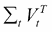

# 第四章：网络挖掘技术

网络数据挖掘技术用于探索在线可用的数据，然后从互联网中提取相关信息。在网络上搜索是一个复杂的过程，需要不同的算法，这些算法将是本章的主要内容。给定一个搜索查询，使用每个网页上的数据获取相关页面，这些数据通常分为页面内容和指向其他页面的页面超链接。通常，搜索引擎具有多个组件：

+   一个用于收集网页的网络爬虫或蜘蛛

+   一个解析器，用于提取内容和预处理网页

+   一个索引器，用于在数据结构中组织网页

+   一个检索信息系统，对与查询相关的最重要文档进行评分

+   一个排名算法，以有意义的方式对网页进行排序

这些部分可以分为网络结构挖掘技术和网络内容挖掘技术。

网络爬虫、索引器和排名过程指的是网络结构（超链接的网络）。搜索引擎的其他部分（解析器和检索系统）是网络内容分析方法，因为网页上的文本信息用于执行这些操作。

此外，可以使用一些自然语言处理技术进一步分析一组网页的内容，例如**潜在狄利克雷分配**意见挖掘或情感分析工具。这些技术在提取关于网络用户的主观信息方面尤为重要，因此它们在许多商业应用中广泛存在，从市场营销到咨询服务。这些情感分析技术将在本章末进行讨论。现在我们将开始讨论网络结构挖掘类别。

# 网络结构挖掘

这个网络挖掘领域专注于发现网页之间的关系以及如何使用这种链接结构来找到网页的相关性。对于第一个任务，通常使用蜘蛛，并将链接和收集到的网页存储在索引器中。对于最后一个任务，网页排名评估网页的重要性。

## 网络爬虫（或蜘蛛）

蜘蛛从一组 URL（种子页面）开始，然后从中提取 URL 以获取更多页面。然后从新页面中提取新链接，这个过程会一直持续到满足某些条件。未访问的 URL 存储在一个称为**frontier**的列表中，根据如何使用这个列表，我们可以有不同的爬虫算法，例如广度优先和优先级爬虫。在**广度优先**算法中，下一个要爬取的 URL 来自 frontier 的头部，而新 URL 被追加到 frontier 的尾部。优先级爬虫则使用对未访问 URL 列表的某种重要性估计来确定先爬取哪个页面。请注意，从页面中提取链接的操作是通过解析器完成的，这个操作在网页内容挖掘部分的相应段落中进行了更详细的讨论。

网络爬虫本质上是一种图搜索算法，它检索起始页面的邻域结构，遵循某些标准，如最大链接数（图的深度）、最大爬取页面数或时间限制。然后，蜘蛛可以提取具有有趣结构的 Web 部分，例如枢纽和权威。枢纽是一个包含大量链接的网页，而权威被定义为，一个在其 URL 在其它网页上出现次数较多的页面（它是页面流行度的一个度量）。一个流行的 Python 爬虫实现是由 Scrapy 库提供的，它还采用了并发方法（使用 Twisted 的异步编程）来加速操作。在第七章，*电影推荐系统 Web 应用*中给出了这个模块的教程，当爬虫将用于提取电影评论信息时。

## 索引器

索引器是一种将爬虫找到的网页存储在结构化数据库中的方法，以便在给定搜索查询时能够快速检索。最简单的索引方法是将所有页面直接存储，在查询时，只需扫描包含查询中关键词的所有文档。然而，如果页面数量很大（在实践中确实如此），由于计算成本高，这种方法是不可行的。最常见的方法是使用称为**倒排索引方案**的方法来加速检索，这是大多数流行搜索引擎所使用的。

给定一组网页 *p[1] , …, p[k]* 和一个包含页面中所有单词的词汇表 *V*，通过存储如下列表  ，…，  ，…，  ，获得倒排索引数据库。

在这里，是网页 *j* 的 ID。可以为每个单词存储额外信息，例如单词的频率计数或它在每个页面上的位置。索引器的实现超出了本书的范围，但为了完整性，本段描述了这些一般概念。

因此，一个包含单词列表的搜索查询将检索与每个单词相关的所有倒排列表，然后合并这些列表。最终列表的顺序将使用排名算法以及信息检索系统来衡量文档与查询的相关性来选择。

## 排名 – PageRank 算法

排名算法很重要，因为单个信息检索查询可以返回的网页数量可能非常大，因此存在如何选择最相关网页的问题。此外，信息检索模型很容易被通过在页面上插入许多关键词来垃圾邮件化，使得页面与大量查询相关。因此，考虑到网络具有一个超链接——从一个页面指向另一个页面的链接——是估计网页相关性的主要信息来源的事实，已经解决了评估网页在互联网上的重要性（即排名分数）的问题。超链接可以分为：

+   页面 *i* 的入链：指向页面 *i* 的超链接

+   页面 *i* 的出链：从页面 *i* 指向其他页面的超链接

直观地，一个网页拥有的入链越多，该网页应该越重要。对这种超链接结构的研究是社会网络分析的一部分，已经使用和提出了许多算法。但出于历史原因，我们将解释最著名的算法，称为 **PageRank**，由 Sergey Brin 和 Larry Page（Google 的创始人）在 1998 年提出。整个想法是将页面的声望计算为指向它的页面的声望之和。如果页面 *j* 的声望为 *P(j)*，它将平均分配给它指向的所有页面 *N[j]*，使得每个出链获得与 *P(j)|N[j]* 相等的声望部分。正式地，页面 *i* 的声望或页面排名分数可以定义为：


在这里，如果页面 *j* 指向页面 *i*；否则它等于 *0*。*A[ij]* 被称为邻接矩阵，它表示从节点 *j* 到节点 *i* 传播的声望部分。考虑到图中总共有 *N* 个节点，前面的方程可以重写为矩阵形式：


注意，如果邻接矩阵满足某些条件，此方程等价于具有特征值  的特征系统。另一种解释前述方程的方法是使用马尔可夫链术语——项 *A[ij]* 变成从节点 *j* 到节点 *i* 的转移概率，节点 *i* 的声望 *p(i)* 是访问节点 *i* 的概率。在这种情况下，可能发生两个节点（或更多）相互指向但不对其他页面进行指向。一旦访问了这两个节点之一，就会发生循环，用户将被困在其中。这种情况被称为**排名陷阱**，（矩阵 *A* 被称为**周期性**），解决方案是添加一个转移矩阵项，允许在不遵循由 *A* 描述的马尔可夫链的情况下随机从一个页面跳转到另一个页面：


在这里，*E=ee^T* 是一个 *N×N* 维度的矩阵的一个条目（*e* 是一个单位向量），*d*（也称为**阻尼因子**）是遵循由转移矩阵 *A* 给出的转移的概率。*(1-d)* 是随机访问页面的概率。在这种最终形式中，所有节点都相互连接，即使对于特定节点 *s* 的邻接矩阵有多个 *0* 条目，*A[sj]*，从图中的所有 *N* 个节点访问 *s* 的概率始终有一个等于  的小概率。注意，*A* 必须是随机的，这意味着每一行都必须求和为 *1*；（至少每行有一个不同于 *0* 的条目或至少每页有一个出链）。可以通过将 *P* 向量标准化为 *e^T P=N* 来简化方程：


这可以通过幂迭代法来解决。此算法将在第八章 情感分析器应用，*电影评论情感分析器应用*中用于实现一个电影评论情感分析系统的示例。此算法的主要优点是它不依赖于查询（因此，可以在查询时离线计算 PageRank 分数并检索），并且它对垃圾邮件非常稳健，因为垃圾邮件发送者不可能在影响力较大的页面上插入指向他们页面的入链。

# 网络内容挖掘

这种类型的挖掘侧重于从网页内容中提取信息。每个页面通常会被收集和组织（使用解析技术），处理以从文本中去除不重要的部分（自然语言处理），然后使用信息检索系统进行分析，以将相关文档与给定的查询相匹配。以下段落将讨论这三个组件。

## 解析

一个网页是用 HTML 格式编写的，因此第一步是提取相关信息。HTML 解析器从标签中构建一个树形结构，从而可以从中提取内容。如今，有许多解析器可供选择，但作为一个例子，我们使用 Scrapy 库，见第七章，*电影推荐系统 Web 应用*，它提供了一个命令行解析器。假设我们想要解析维基百科的主页，[`en.wikipedia.org/wiki/Main_Page`](https://en.wikipedia.org/wiki/Main_Page) 。我们只需在终端中输入以下内容：

```py

scrapy shell 'https://en.wikipedia.org/wiki/Main_Page' 

```

将准备好使用`response`对象和`xpath`语言来解析页面。例如，我们想要获取页面的标题：

```py

In [1]: response.xpath('//title/text()').extract()

Out[1]: [u'Wikipedia, the free encyclopedia']

```

或者，我们想要提取页面中所有嵌入的链接（这项操作对于爬虫的工作是必需的），这些链接通常放在`<a>`标签上，URL 值位于`href`属性中：

```py

In [2]: response.xpath("//a/@href").extract()

Out[2]:

[u'#mw-head',

 u'#p-search',

 u'/wiki/Wikipedia',

 u'/wiki/Free_content',

 u'/wiki/Encyclopedia',

 u'/wiki/Wikipedia:Introduction',

…

 u'//wikimediafoundation.org/',

 u'//www.mediawiki.org/']

```

注意，可以使用更健壮的方式来解析内容，因为网页通常是由非程序员编写的，所以 HTML 可能包含语法错误，浏览器通常会修复这些错误。还要注意的是，由于广告等原因，网页可能包含大量数据，这使得解析相关信息变得复杂。已经提出了不同的算法（例如，树匹配）来识别页面的主要内容，但目前没有 Python 库可用，所以我们决定不再进一步讨论这个话题。然而，请注意，在 newspaper 库中可以找到一个很好的解析实现，用于提取网络文章的主体，它也将在第七章，*电影推荐系统 Web 应用*中使用。

# 自然语言处理

一旦提取了网页的文本内容，通常会对文本数据进行预处理，以去除不包含任何相关信息的部分。文本被标记化，即转换成一个单词列表（标记），并且所有标点符号都被移除。另一个常见的操作是移除所有*停用词*，即那些用于构建句子语法但不包含文本信息的单词（如连词、冠词和介词）等，例如*a*、*about*、*an*、*are*、*as*、*at*、*be*、*by*、*for*、*from*、*how*、*in*、*is*、*of*、*on*、*or*、*that*、*the*、*these*、*this*、*to*、*was*、*what*、*when*、*where*、*who*、*will*、*with*，以及许多其他单词。

英语（或任何语言）中的许多单词具有相同的词根，但有不同的后缀或前缀。例如，单词 *think*、*thinking* 和 *thinker* 都有相同的词根— *think* 表示它们的意义相同，但在句子中的作用不同（动词、名词等）。将一组中的所有单词还原到其词根的过程称为 **词干提取**，为此已经发明了许多算法（Porter、Snowball 和 Lancaster）。所有这些技术都是更广泛算法范围的一部分，称为 **自然语言处理**，并且它们在 Python 的 `nltk` 库中实现（通常通过 `sudo pip install nltk` 安装）。例如，以下代码使用之前描述的技术（使用 Python 接口终端）预处理一个示例文本：


注意，`stopwords` 列表已通过 `nltk dowloader nltk.download('stopwords')` 下载。

## 信息检索模型

信息检索方法需要找到与给定查询最相关的文档。网页中的单词可以使用不同的方法进行建模，例如布尔模型、向量空间模型和概率模型，本书中我们决定讨论向量空间模型及其实现方法。形式上，给定一个包含 *V* 个单词的词汇表，一个包含 *N* 页面的集合中的每个网页 *d[i]*（或文档）可以被视为一个单词向量，，其中属于文档 *i* 的每个单词 *j* 由 *w[ij]* 表示，这可以是根据所选算法的数字（权重）或向量：

+   词语频率-逆文档频率（TF-IDF），*w[ij]*，是一个实数

+   **潜在语义分析**（**LSA**），*w[ij]*，是一个实数（与文档 *i* 的表示无关）

+   Doc2Vec（或 word2vec），*w[ij]*，是一个实数向量（与文档 *i* 的表示无关）

由于查询也可以表示为一个单词向量，，因此通过计算查询向量与每个文档之间的相似度度量来找到与向量 *q* 最相似的网页。最常用的相似度度量称为余弦相似度，对于任何给定的文档 *i*：


注意，文献中还有其他使用的度量方法（okapi 和 pivoted normalization weighting），但为了本书的目的，它们不是必要的。

以下几节将在本节最后一段的文本案例中应用之前将详细介绍这三种方法。

### TF-IDF

此方法计算 *w[ij]* ，考虑到一个在大量页面中多次出现的单词可能不如在文档子集内多次出现但出现次数较少的单词重要。它由两个因素的乘积给出：

 其中：

+    是单词 *j* 在文档 *I* 中的标准化频率

+    是逆文档频率，*df[j] * 是包含单词 *j* 的网页数量

### 潜在语义分析 (LSA)

此算法的名称来源于以下观点：存在一个潜在空间，其中每个单词（以及每个文档）都可以被有效地描述，假设具有相似意义的单词也出现在相似文本位置。在此子空间上的投影是通过已讨论的（截断）奇异值分解（SVD）方法实现的，参见第二章，*机器学习技术 – 无监督学习*。我们将此方法应用于 LSA 的上下文中如下：网页被收集到矩阵 *X (V ´N* ) 中，其中每一列是一个文档：


在这里，*U[t]* ( *V ´d* ) 是在具有 *d* 维度的新潜在空间中投影的单词矩阵， ( *d* ´ *N* ) 是将文档转换到子空间后的转置矩阵，而 ( *d* ´ *d* ) 是具有奇异值的对角矩阵。查询向量本身通过以下方式投影到潜在空间中：


现在，每个由 *V[t]* 的每一行表示的文档可以通过余弦相似度与 *q[t]* 进行比较。请注意，文档在潜在空间中的真实数学表示由 (而不是 *V[t] * ) 给出，因为奇异值是空间轴组件的缩放因子，必须考虑。因此，这个矩阵应该与 进行比较。尽管如此，它通常计算 *V[t] * 和 *q[t] * 之间的相似度，而在实践中，哪种方法返回最佳结果仍然未知。

### Doc2Vec (word2vec)

此方法将每个词 *j* ， *w[j]* ，表示为一个向量  ，但与其出现的文档 *d[i]* 无关。Doc2Vec 是 Mikolov 等人最初提出的 word2vec 算法的扩展，它使用神经网络和反向传播来生成词（和文档）向量。由于神经网络（尤其是深度学习）在许多机器学习应用中的重要性日益增加，我们决定在此介绍这种相当高级的方法的主要概念和公式，以便为您介绍一个在未来机器学习的各个领域中都将变得极其重要的主题。以下描述基于 Rong（2014）和 Le 和 Mikolov（2014）的论文，并且符号也反映了文献中目前使用的名称。

### Word2vec – 连续词袋和 skip-gram 架构

词汇表 *V* 中的每个词 *j* 都用一个长度为 *|V|* 的向量表示，具有二进制条目 *x[j] =(x[1j] , …, x[Vj] )* ，其中只有 *x[jj] =1* ，否则为 *0* 。word2vec 方法训练一个（隐藏）层 *N* 个神经元（权重），在两种不同的网络架构（以下图中所示）之间进行选择。请注意，这两种架构都只有一层 *N* 个神经元或权重， *h* 。这意味着该方法必须被视为浅层学习而不是深层学习，后者通常指的是具有许多隐藏层的网络。**连续词袋**（ **CBOW** ）方法（以下图中右侧所示）使用一组 *C* 个词作为输入，称为上下文，试图预测输入文本旁边出现的词（目标）。相反的方法称为**Skip-gram**，其中输入是目标词，网络被训练来预测上下文集（以下图中左侧所示）。请注意，*C* 被称为窗口参数，它设置上下文词选择距离目标词有多远：


word2vec 算法的 Skip-gram（左侧）和 CBOW（右侧）架构；图取自 X Rong（2015）的《word2vec 参数学习解释》

在这两种情况下，矩阵 *W* 将输入向量转换为隐藏层，而 *W'* 将从隐藏层转换到输出层 *y* ，其中评估目标（或上下文）。在训练阶段，计算真实目标（或上下文）的错误，并用于计算随机梯度下降以更新矩阵 *W* 和 *W'* 。我们将在下一节中给出 CBOW 方法的更数学描述。请注意，Skip-gram 方程式类似，我们将参考 Rong（2015）的论文以获取更多详细信息。

### CBOW 模型的数学描述

从输入层开始，隐藏层*h*可以通过计算获得，，其中是一个长度为*N*的向量，代表隐藏层上的词*w[i]*和*w[C]*是上下文向量的平均值。选择目标词*w[j]*，输出层的得分*u[j]*是通过将向量（*W'*的 j 列）与*h*相乘得到的：


这不是输出层*y[j]*上的最终值，因为我们想评估在给定上下文*C*的情况下，目标词*w[j]*的后验条件概率，这可以通过**softmax**公式来表示：


现在的训练目标是最大化词汇表中所有词的概率，这等价于，其中和索引*j^M*代表*W'*中乘积最大的向量，即最可能的目标词。

然后通过计算*E*相对于*W (w[ij]* )和*W' (w'[ij']* )的条目的导数，得到随机梯度下降方程。每个输出目标词*w[j]*的最终方程是：


其中和*a*是梯度下降的学习率。导数表示网络相对于真实目标词的误差，以便误差可以反向传播到系统中，系统可以迭代学习。注意，向量是执行语义操作时使用的常用词向量表示。

更多细节可以在 Rong (2015)的论文中找到。

### Doc2Vec 扩展

如 Le 和 Mikolov (2014)所述，Doc2Vec 是 word2vec 方法的自然扩展，其中将文档视为一个额外的词向量。因此，在 CBOW 架构的情况下，隐藏层向量*h*是上下文向量平均值和文档向量*d[i]*：


该架构如图所示，被称为**分布式内存模型**（**DM**），因为文档*d[i]*向量只记住由上下文词未表示的文档信息。向量与从文档*d[i]*中采样的所有上下文词共享，但矩阵*W*（和*W'*）对所有文档都是相同的：


一个具有三个单词上下文的分布式内存模型示例（window=3）；图来自 Le 和 Mikolov 的《Sentences and Documents 的分布式表示》（2014 年）

另一个提出的架构称为**分布式词袋**（**DBOW**），它只考虑输入层中的一个文档向量以及从文档中采样的上下文词集合。已经证明 DM 架构的性能优于 DBOW，因此它是`gensim`库实现中的默认模型。建议读者阅读 Le 和 Mikolov（2014）的论文以获取更多详细信息。

### 电影评论查询示例

为了展示之前讨论的三种信息检索方法，我们使用了来自 *polarity dataset v2.0* 和 *27886 个未处理的 html 文件集合* 的 IMBD 电影评论，这些数据由 Bo Pang 和 Lillian Lee 提供，网址为[`www.cs.cornell.edu/people/pabo/movie-review-data/`](http://www.cs.cornell.edu/people/pabo/movie-review-data/)。数据集和代码也存储在作者的 GitHub 账户[`github.com/ai2010/machine_learning_for_the_web/tree/master/chapter_4/`](https://github.com/ai2010/machine_learning_for_the_web/tree/master/chapter_4/)中。从网站上下载并解压`movie.zip`文件（称为`polarity_html.zip`），这将创建一个包含所有网页电影评论的`movie`文件夹（约 2000 个文件）。首先，我们需要从文件中准备数据：


这次我们使用**BeautifulSoup**解析每个 HTML 网页的电影标题并创建一个字典，`moviedict`。`polarity dataset v2.0.tar.gz`包含一个名为`review_polarity`的文件夹，它位于`txt_sentoken/`文件夹内，该文件夹将正面和负面评论分割成两个单独的子文件夹（优点和缺点）。这些文件使用以下代码进行预处理：


现在所有 2000 条评论都存储在`tot_textreviews`列表中，相应的标题在`tot_titles`中。可以使用`sklearn`训练 TF-IDF 模型：


在`PreprocessTfidf`函数之后，将所有预处理技术（去除停用词、分词和词干提取）应用于每个文档。同样，我们可以使用`gensim`库训练 LSA 模型，指定 10 个潜在维度：


注意，`GenSimCorpus`函数只是使用常规技术预处理文档，并将它们转换为 gensim LSA 实现可以读取的格式。从`lsi`对象中，可以获取到将查询转换为潜在空间所需的矩阵*U*、*V*和 S：


此外，还计算了单词索引字典`dict_words`，将查询词转换为`dict_corpus`中的对应索引词。

最后要训练的模型是 Doc2Vec。首先，我们将数据准备成 gensim Doc2Vec 实现可以处理的形式：


每条评论都放置在一个`namedtuple`对象中，该对象包含由`PreprocessDoc2Vec`函数预处理过的单词（移除了停用词并执行了分词）以及代表文件名的标签。请注意，我们没有选择应用词干提取器，因为不使用它时结果通常更好（读者可以通过应用词干提取器来测试结果，将布尔标志`doc2vecstem`设置为`True`）。Doc2Vec 训练最终通过以下代码完成：


我们设置了 DM 架构（`dm` =1），具有 500 维度的隐藏层（`size`），窗口大小为 10 个单词，并且模型考虑了至少出现一次的所有单词（`min_count` =1）。其他参数与效率优化方法相关（`negative`用于负采样和`hs`用于层次 softmax）。训练持续了`20`个 epoch，学习率等于`0.99`。

我们现在可以验证每种方法返回的结果，定义一个查询以检索所有与科幻电影相关的网络文档，即通常用以下单词列表描述的电影：


TF-IDF 方法使用以下脚本返回最相似的五个网页：


注意，该模型使用稀疏矩阵格式来存储数据，因此`cosine_similarity`函数将向量转换为常规向量。然后它计算相似度。以类似的方式，查询在 LSA 术语中被转换为*q[k]*，并打印出最相似的五个网页：


最后，`doc2vec`模型使用`infer_vector`函数将查询列表转换为向量，并通过`most_similar`函数返回最相似的评论：


注意，模型的`random`参数需要设置为一个固定值，以便在每次使用优化方法（负采样或层次 softmax）时返回确定性的结果。结果如下：

+   **TF-IDF** :

+   **LSA** :

+   Doc2vec:

所有三种方法都显示与查询相关的电影。有趣的是，TF-IDF 的性能优于更先进的 LSA 和 Doc2Vec 算法，因为在*夜幕下的热*、*宝可梦*、*摇滚恐怖电影秀*和*野性之物*与查询不相关，而 TF-IDF 的结果只显示一部电影（*无可奉告*）作为不相关。电影*查理的安吉拉*和*蝙蝠侠与罗宾*是动作电影，所以它们大部分与单个查询词*动作*相关。Doc2Vec 返回最差的结果，主要是因为训练数据集太小，无法学习良好的向量表示（例如，谷歌发布了一个基于数十亿文档训练的 word2vec 数据集，或者更多）。网站[`www.cs.cornell.edu/people/pabo/movie-review-data/`](http://www.cs.cornell.edu/people/pabo/movie-review-data/)提供了一个更大的数据集，因此读者可以尝试使用更多数据训练 Doc2Vec 作为练习。

# 后处理信息

一旦从网络中收集了网页，除了构建网络搜索引擎之外，还有一些自然语言处理算法能够提取不同商业目的的相关信息。我们将在这里讨论能够从文档集合中提取主要主题（潜在狄利克雷分析）和提取每个网页的情感或意见（意见挖掘技术）的算法。

## 潜在狄利克雷分配

**潜在狄利克雷分配**（**LDA**）是一种属于生成模型类别的自然语言处理算法。该技术基于一些变量的观察，这些变量可以通过其他下划线的未观察到的变量来解释，这些变量是观察到的数据相似或不同的原因。

例如，考虑文本文档，其中单词是观察结果。每个文档可以是多个主题（未观察到的变量）混合的结果，每个单词都指代一个特定的主题。

例如，考虑以下两个描述两家公司的文档：

+   **文档 1**：改变人们搜索时尚商品的方式，通过视觉识别分享和购买时尚，TRUELIFE 将成为搜索终极趋势的最佳方法 …

+   **doc2**：Cinema4you 使任何场所都能成为电影院，是一家目前处于测试阶段的新的数字电影媒体发行公司。它应用了视频点播和广播中使用的科技 ...

LDA 是一种自动发现这些文档包含的潜在主题的方法。例如，给定这些文档并要求两个主题，LDA 可能会返回与每个主题相关的以下单词：

+   **主题 1**：人物、视频、媒体…

+   **主题 2**：电影技术、识别、广播…

因此，第二个主题可以标记为*技术*，而第一个主题为*商业*。

文档随后被表示为以一定概率吐出单词的主题混合：

+   **doc1** : 主题 1 42%，主题 2 64%

+   **doc2** : 主题 1 21%，主题 2 79%

这种文档表示在诸如不同组页面聚类或提取页面集合的主要共同主题等应用中可能很有用。该算法背后的数学模型将在下一段中解释。

### 模型

文档被表示为潜在主题上的随机混合，其中每个主题由单词上的分布来表征。LDA 假设对于由 *M* 个文档组成的语料库，*d=(d[1] , …, d[M] )* ，每个 *i* 包含 *N[i]* 个单词。如果 *V* 是词汇表长度，文档 *i* 中的一个单词由长度为 *V* 的向量 *w[i]* 来表示，其中只有一个元素 *w[i] [v] =1* ，其余都是 *0* :


潜在维度（主题）的数量是 *K* ，对于每份文档， 是与每个单词 *w[i]* 相关的主题向量，其中 *z[i]* 是长度为 *K* 的 *0* 向量，除了元素 *j* ，*z[i]^j =1* ，它表示主题 *w[i]* 已经被抽取。

b 表示 *K* ´ *V* 矩阵，其中 *b[ij]* 代表词汇表中的每个单词 *j* 被从主题 *i* 抽取的概率： 。

因此，b 的每一行 *i* 是主题 *i* 的单词分布，而每一列 *j* 是单词 *j* 的主题分布。使用这些定义，过程描述如下：

1.  从选定的分布（通常是泊松分布）中抽取每份文档的长度 *N[i]* 。

1.  对于每份文档 *d[i]* ，抽取主题分布 q *[i]* ，作为一个狄利克雷分布 *Dir(a)* ，其中  和 *a* 是长度为 *K* 的参数向量，使得  。

1.  对于每份文档 *d[i]* ，对于每个单词 *n* ，从 的多项式分布中抽取一个主题。

1.  对于每份文档 *d[i]* ，对于每个单词 *n* ，以及对于每个主题 *z[n]* ，从由 b 的第 *z[n]* 行给出的多项式分布中抽取一个单词 *w[n]* ， 。

算法的目的是最大化每个文档的后验概率：


应用条件概率定义，分子变为以下内容：


因此，文档 *i* 在主题向量 *z* 和单词概率矩阵 b 给定下的概率可以表示为单个单词概率的乘积：


考虑到 *z[n]* 是一个只有一个分量 *j* 与 *0* 不同的向量，*z^j [n] =1* ，那么  。将这些表达式代入 (2)：


(1)中的分母是通过在 q *[i]*上积分和在*z*上求和得到的。主题分布*q[i]*和每个主题的单词分布（*b*的行）的最终值是通过通过近似推理技术计算这个概率得到的；这些内容超出了本书的范围。

参数*a*被称为浓度参数，它表示分布如何在可能的值上分散。浓度参数为*1*（或*k*，根据主题建模文献中使用的定义，狄利克雷分布的维度）导致所有概率集合具有相等的可能性。同时，当浓度参数趋向于零时，只有几乎全部质量集中在它们的一个组成部分上的分布可能是可能的（单词在不同主题之间共享较少，并且集中在少数几个主题上）。

例如，一个 100,000 维度的分类分布有 100,000 个单词的词汇量，尽管一个主题可能只由几百个单词表示。因此，典型的浓度参数值在 0.01 到 0.001 之间，或者如果词汇量的大小是数百万个单词或更高，则更低。

根据 L. Li 和 Y. Zhang 的论文*使用潜在狄利克雷分配进行文本分类的经验研究*，LDA 可以作为文本建模的有效降维方法。然而，尽管该方法在各种应用中表现良好，但仍有一些问题需要考虑。模型的初始化是随机的，这意味着它可能导致每次运行的结果不同。此外，浓度参数的选择很重要，但没有标准的方法来选择它们。

### 示例

再次考虑电影评论网页，`textreviews`，在*电影评论查询示例*部分已经预处理过，并应用 LDA 来测试是否可以收集不同主题的评论。像往常一样，以下代码可在`postprocessing.ipynb`中找到，位于[`github.com/ai2010/machine_learning_for_the_web/tree/master/chapter_4/`](https://github.com/ai2010/machine_learning_for_the_web/tree/master/chapter_4/)：


如往常一样，我们将每个文档转换成了标记（使用了不同的标记化器）并去除了停用词。为了获得更好的结果，我们过滤掉了那些对页面不提供任何信息的最频繁出现的单词（例如`movie`和`film`）。我们忽略了所有出现次数超过 1,000 次或观察次数少于三次的单词：


现在我们可以用 10 个主题来训练 LDA 模型（`passes`是训练过程中通过语料库的遍历次数）：


代码返回与每个主题相关联的以下 10 个最可能的单词：


虽然并非所有主题都有一个简单的解释，但我们确实可以看到主题 2 与单词`disney`、`mulan`（一部迪士尼电影）、`love`相关联，而`life`是一个关于动画电影的主题，主题 6 与单词`action`、`alien`、`bad`相关联，而`planet`与科幻电影相关。实际上，我们可以查询所有最可能的主题等于 6 的电影，如下所示：


这将返回：

```py

Rock Star (2001)

Star Wars: Episode I - The Phantom Menace (1999)

Zoolander (2001)

Star Wars: Episode I - The Phantom Menace (1999)

Matrix, The (1999)

Volcano (1997)

Return of the Jedi (1983)

Daylight (1996)

Blues Brothers 2000 (1998)

Alien&#179; (1992)

Fallen (1998)

Planet of the Apes (2001)

```

大多数这些标题显然是科幻和奇幻电影，所以 LDA 算法正确地将它们聚类在一起。

注意，由于文档在主题空间中的表示（`lda_lfq[corpus]`），可以应用聚类算法（见第二章，*机器学习技术 - 无监督学习*），但这留作读者的练习。还要注意，每次运行 LDA 算法时，由于模型的随机初始化，可能会导致不同的结果（也就是说，如果你的结果与本段中显示的不同是正常的）。

## 观点挖掘（情感分析）

观点挖掘或情感分析是研究文本以提取作者观点的领域，这通常可以是积极的或消极的（或中性的）。这种分析在市场营销中尤其有用，可以找到公众对产品或服务的意见。标准方法是将情感（或极性），即积极或消极，视为分类问题的目标。一个文档数据集将具有与词汇表中不同单词数量一样多的特征，并且通常使用 SVM 和朴素贝叶斯等分类算法。作为一个例子，我们考虑了已经用于测试 LDA 和信息检索模型的 2,000 条电影评论，这些评论已经标记（正面或负面）。本段中讨论的所有代码都可在`postprocessing.ipynb` IPython 笔记本中找到，网址为[`github.com/ai2010/machine_learning_for_the_web/tree/master/chapter_4/`](https://github.com/ai2010/machine_learning_for_the_web/tree/master/chapter_4/)。与之前一样，我们导入数据并进行预处理：


数据随后被分成一个训练集（80%）和一个测试集（20%），以`nltk`库可以处理的方式（每个元组或包含文档单词和标签的字典列表）：


现在我们可以使用`nltk`库训练和测试一个`NaiveBayesClassifier`（多项式）并检查错误：


代码返回了 28.25%的错误率，但通过计算每份文档中的最佳二元组，可以改善结果。二元组被定义为连续的两个单词的组合，*X²* 测试用于找到不是偶然出现而是频率较高的二元组。这些特定的二元组包含对文本相关的信息，在自然语言处理术语中被称为搭配。例如，给定一个由两个单词组成的二元组，**w1** 和 **w2** ，在我们的语料库中有 N 个可能的二元组总数，在 **w1** 和 **w2** 相互独立出现的零假设下，我们可以通过收集二元组（**w1**，**w2**）和其余可能的二元组（例如这些）的出现次数来填充一个二维矩阵 *O*：

|   | w1 | Not w1 |
| --- | --- | --- |
| **w2** | 10 | 901 |
| **Not w2** | 345 | 1,111,111 |

*X²* 度量由  给出，其中 *O[ij]* 是由单词 *(i, j)* 给出的二元组出现的次数（因此 *O[00] =10* 等等），而 *E[ij]* 是二元组 *(i, j)* 的预期频率（例如，）。直观上，*X²* 越高，观察到的频率 *O[ij]* 与预期均值 *E[ij]* 的差异越大，因此零假设很可能会被拒绝。二元组是一个好的搭配，它包含比遵循预期均值的二元组更多的信息。可以证明，*X²* 可以计算为 f 检验（也称为 **均值平方列联系数**）乘以二元组出现的总次数 *N*，如下所示：


更多关于搭配和 *X²* 方法的详细信息可以在 C. D. Manning 和 H. Schuetze 所著的 *《统计自然语言处理基础》*（1999 年）中找到。注意，*X²* 作为信息增益度量（此处未讨论），可以被视为一种特征选择方法，如第三章 *监督机器学习* 中定义的那样。使用 `nltk` 库，我们可以使用 *X²* 度量来选择每份文档中最佳的 500 个二元组，然后再次训练一个朴素贝叶斯分类器，如下所示：


这次错误率是 20%，比正常方法低。*X²*测试也可以用来从整个语料库中提取最有信息量的单词。我们可以测量单个单词的频率与正面（或负面）文档频率的差异，以评估其重要性（例如，如果单词`great`在正面评论中有较高的*X²*值，但在负面评论中较低，这意味着该单词提供了评论是正面的信息）。可以通过计算语料库中每个单词的整体频率和正负子集的频率来提取语料库中最显著的 10,000 个单词：


现在，我们可以简单地再次训练一个朴素贝叶斯分类器，只使用每个文档的`bestwords`集中的单词：


错误率是 12.75%，考虑到相对较小的数据集，这是一个非常低的比率。请注意，为了得到更可靠的结果，应该应用交叉验证方法（见第三章，*监督机器学习*），但这被留作读者的练习。此外，请注意，Doc2Vec 向量（在*电影评论查询示例*部分计算）可以用来训练分类器。假设 Doc2Vec 向量已经训练并存储在`model_d2v.doc2vec`对象中，像往常一样，我们将数据分为训练集（80%）和测试集（20%）：


然后，我们可以训练一个 SVM 分类器（**径向基函数核**（**RBF**）核）或逻辑回归模型：


逻辑回归和 SVM 的准确率非常低，分别为`0.5172`和`0.5225`。这主要是因为训练数据集的大小较小，不允许我们训练具有大量参数的算法，例如神经网络。

# 摘要

在本章中，我们讨论并实现了用于管理网络数据的最常见和高级算法，使用了 Python 的一系列库。现在你应该对网络挖掘领域面临的挑战有清晰的理解，并且应该能够用 Python 处理一些这些问题。在下一章中，我们将讨论在商业环境中至今使用的最重要的推荐系统算法。

# 读累了记得休息一会哦~

**公众号：古德猫宁李**

+   电子书搜索下载

+   书单分享

+   书友学习交流

**网站：**[沉金书屋](https://www.chenjin5.com)

+   电子书搜索下载

+   电子书打包资源分享

+   学习资源分享
