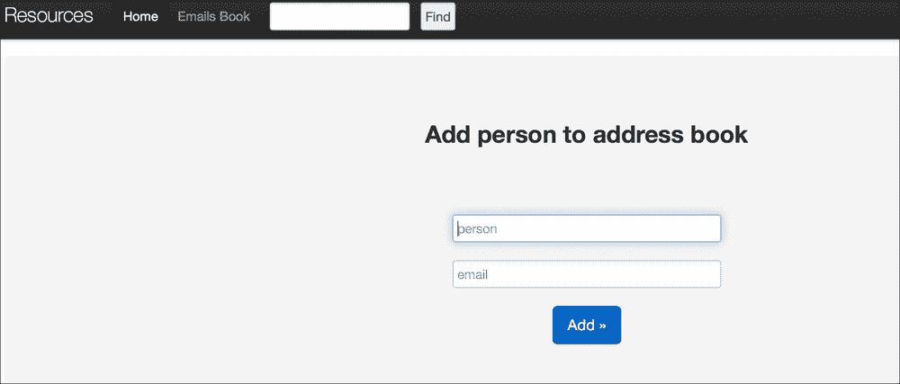
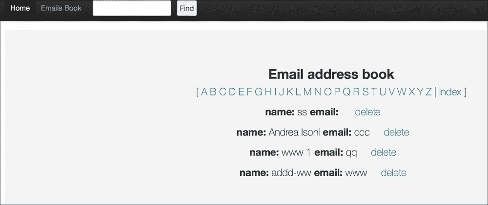
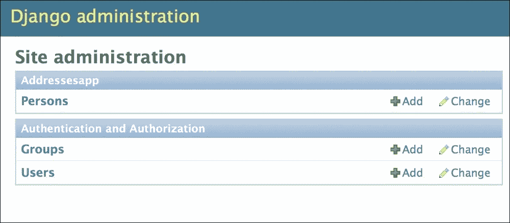
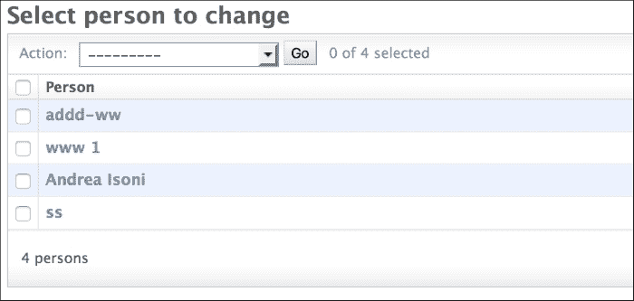
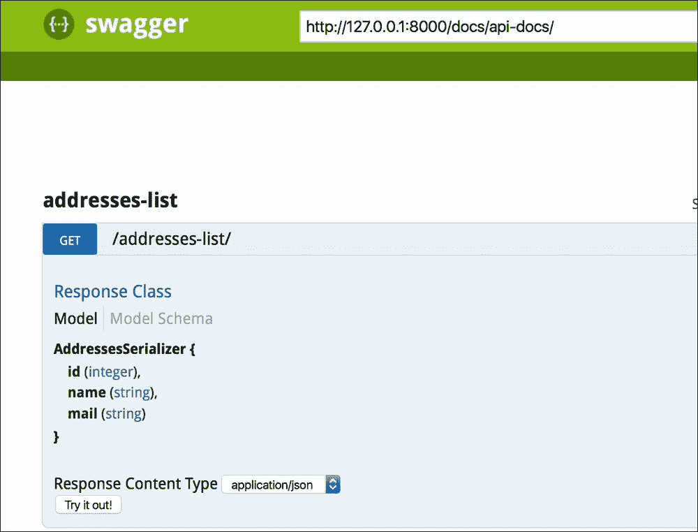

# 第六章. Django 入门

**Django** 是一个开源网络框架，在商业环境中被采用，因为它易于使用、稳定且灵活（它利用了 Python 中可用的多个库）。

在本章中，我们将关注我们认为对于在框架中管理和分析数据至关重要的功能。我们还解释了与构建基本网络应用相关的关键部分，但更详细的信息和资料可以在 [`docs.djangoproject.com`](https://docs.djangoproject.com) 或其他来源找到。我们将介绍框架的主要部分，包括网络服务器应用的基本概念（设置、模型和命令）、HTML 的基础知识以及 shell 接口，以及 REST 框架接口的一般思想和它在 Django 中的实现（序列化器、REST 调用和 Swagger）。在简要介绍了通过互联网传输数据的 HTTP GET 和 POST 方法之后，我们开始安装和创建 Django 中的新服务器。

# HTTP – GET 和 POST 方法的概述

**超文本传输协议**（**HTTP**）允许客户端（例如，网页浏览器）与服务器（我们的应用）交互。给定服务器网页的 URL，GET 方法是客户端从服务器查询数据的方式，指定了一些参数。这可以通过以下 `curl` 命令进行解释：

```py

curl -X GET url_path?name1=value1&name2=value2

```

在 `?` 符号之后，名称/值对指定了要查询的数据，它们由一个 `&` 符号分隔。

客户端将数据传输到服务器的方式称为 POST，数据位于调用的 *body* 中：

```py

curl -X POST  -d @datafile.txt url_path

```

现在，我们可以开始讨论如何使用 Django 创建一个新的服务器和应用。

## 安装和服务器创建

在终端中输入以下命令安装 Django 库：

```py

sudo pip instal django

```

命令应安装 Django 版本 1.7 或更高版本（作者使用了 1.7 版本）。为了启动一个新的应用，我们输入以下命令：

```py

django-admin startproject test_server

```

它将生成一个新的文件夹 `test_app`，其中包含以下文件结构：

```py

└── test_server

 ├── manage.py

 └── test_server

 ├── __init__.py

 ├── settings.py

 ├── urls.py

 └── wsgi.py

```

我们可以看到，在文件夹内，我们有 `manage.py` 文件，它允许程序员运行各种操作，还有一个名为 `test_app` 的子文件夹，其中包含以下文件：

+   `settings.py`：此文件存储所有参数设置以配置服务器

+   `urls.py`：此文件收集您网络应用上可用的所有 URL 路径，而网页背后的实际功能通常编写在 `views.py` 应用文件中

+   `wsgi.py`：这是一个模块，使服务器能够与网络应用通信

+   `__init__.py`：此文件用于将每个文件夹定义为包，以便内部导入模块

在我们的本地机器上，带有 **欢迎来到 Django** 页面的服务器通过简单地输入以下命令部署在 `http://127.0.0` `.1:8080/`：

```py

python manage.py runserver 8080

```

在这里，`8080`是服务器启动的端口（如果没有指定端口，默认情况下服务器在`端口 8000`启动）。现在服务器已准备就绪，我们可以通过简单地输入以下命令来创建我们想要的任何数量的应用程序：

```py

python manage.py startapp nameapp

```

这将在根目录下的`test_app`文件夹内创建一个新的文件夹`nameapp`：

```py

├── manage.py

├── nameapp

│   ├── __init__.py

│   ├── admin.py

│   ├── migrations

│   ├── __init__.py

│   ├── models.py

│   ├── tests.py

│   └── views.py

└── test_server

 ├── __init__.py

 ├── settings.py

 ├── urls.py

 └── wsgi.py

```

在解释最重要的设置参数之后，我们将讨论这个文件夹的内容及其功能。请注意，对于 Django 版本 1.9，`nameapp`文件夹包含`apps.py`文件，以便在不使用`settings.py`文件的情况下配置`nameapp`。

## 设置

`settings.py`文件存储了 Django 服务器运行所需的所有配置。需要设置的最重要参数如下：

+   除了默认安装的用于管理网站的常见 Django 应用外，我们还将安装 REST 框架：

    ```py
    INSTALLED_APPS = (
    ...
    'rest_framework',
    'rest_framework_swagger',
    'nameapp',
    )
    ```

    REST 框架是一个允许 Django 应用（在这种情况下为`nameapp`）通过 REST API 进行通信的应用程序，而 REST Framework Swagger 只是一个用于管理 REST API 的 Web 交互界面。这些功能将在以下章节中解释。此外，请注意，每个创建的应用都需要添加到这个字段中（在这种情况下，`nameapp`）。

+   可以使用不同的后端数据库（**MySQL**、**Oracle**、**PostgreSQL**等）来存储数据。在这种情况下，我们使用**SQLite3**（默认选项）：

    ```py
    DATABASES = {
           'default': {
            'ENGINE': 'django.db.backends.sqlite3',
            'NAME': 'mydatabase',
            }
          }
    ```

    网页是用 HTML 编写的，因此需要一个文件夹来存储 HTML 代码。通常使用`templates`文件夹来存储网页布局：

    ```py
    TEMPLATE_DIRS = (
        os.path.join(BASE_DIR, 'templates'),
    )
    ```

+   为了装饰网站，CSS 格式化和 JavaScript 代码通常存储在另一个文件夹`static`中，与`server`文件夹处于同一级别。然后需要配置设置以从文件夹中获取文件：

    ```py
    MEDIA_ROOT = os.path.join(BASE_DIR, 'static')
    STATIC_URL = '/static/'
    MEDIA_URL = ''
    STATIC_ROOT = ''
    STATICFILES_DIRS = ( os.path.join(BASE_DIR, "static"), )
    ```

+   要设置网站的 URL，设置被配置为从文件中获取路径（在这种情况下，`test_server/urls.py`）：

    ```py
    ROOT_URLCONF = 'test_server.urls'
    ```

+   有可能设置一个文件来存储我们希望在代码中用于调试目的的所有打印语句。我们使用`logging`库和以下配置：

    ```py
    LOGGING = {
        'version': 1,
        'disable_existing_loggers': True,
        'formatters': {
            'standard': {
                'format': '%(asctime)s %(levelname)s %(name)s %(message)s'
            },
        },
        'handlers': {
            'default': {
                'level':'DEBUG',
                'class':'logging.handlers.RotatingFileHandler',
                'filename': 'test_server.log',
                'maxBytes': 1024*1024*5, # 5 MB
                'backupCount': 5,
                'formatter':'standard',
            },  
        },
    'loggers': {
            '': {
                'handlers': ['default'],
                'level': 'DEBUG',
                'propagate': True
            },
        }
    }
    ```

    在这里，`test_server.log`文件存储了使用`logging`库定义的所有打印语句（例如，`logging.debug('write something')`）。

现在所有最重要的设置都已配置，我们可以专注于开发一个创建简单电子邮件地址簿的新应用。所以我们像往常一样创建应用：

```py

python manage.py startapp addresesapp

```

现在，我们在服务器的根目录`test_server`下添加模板和静态文件夹：

```py

├── addresesapp

│

 ├── __init__.py

│   ├── admin.py

│   ├── migrations

│   ├── models.py

│   ├── tests.py

│

 └── views.py

├── manage.py

└── test_server

 ├── __init__.py

 ├── __init__.pyc

 ├── settings.py

 ├── settings.pyc

 ├── static

 ├── templates

 ├── 

urls.py

 └── wsgi.py

```

注意，`INSTALLED_APPS`中的`nameapp`变为`addressesapp`。在下一节中，我们将讨论实现应用的主要功能。所有代码都可以在作者的 GitHub 仓库的`chapter_6`文件夹中找到（[`github.com/ai2010/machine_learning_for_the_web/tree/master/chapter_6`](https://github.com/ai2010/machine_learning_for_the_web/tree/master/chapter_6)）。

# 编写应用 – 最重要功能

要创建一个存储电子邮件地址的 Web 应用程序，我们需要一个存储数据的表和允许最终用户添加、删除和查看地址簿的网页。此外，我们可能还想将地址簿转换为电子表格格式，或者通过互联网将数据发送到另一个应用程序。Django 有特定的功能来完成所有这些操作（`models`、`views`、`admin`、API REST-framework 和 `commands`），我们现在将讨论数据是如何存储的。

## 模型

要创建一个电子邮件地址簿，我们需要在一个表中存储每个联系人的姓名和他们的电子邮件地址。在 Django 中，表被称为模型，并在 `models.py` 文件中定义：

```py

from django.db import models

from django.utils.translation import ugettext_lazy as _

class Person(models.Model):

 name = models.CharField(_('Name'), max_length=255, unique=True)

 mail = models.EmailField(max_length=255, blank=True)

 #display name on admin panel

 def __unicode__(self):

 return self.name

```

在 Django 中，表的列是模型的字段，可以是不同类型：整数、字符等。请注意，Django 会自动为任何新对象添加一个递增的 ID 字段。唯一选项意味着模型中不能存在重复的名称，而空白状态表示字段是否可以为空。`__unicode__` 函数是可选的，它用于将每个人渲染为字符串（在这种情况下我们设置了名称字符串）。

现在模型已经创建，我们需要将其应用到 SQLite 数据库中：

```py

python manage.py makemigrations

python manage.py migrate

```

`makemigrations` 命令会将模型更改转换为迁移文件（位于 `addressesapp` 文件夹内的 `migrations` 文件夹中），而 `migrate` 命令则将更改应用到数据库模式中。请注意，如果同一网站使用了多个应用程序，那么生成迁移的命令是 `python manage.py makemigrations 'appname'`。

## HTML 网页背后的 URL 和视图

现在我们知道了如何存储数据，我们需要通过网页记录联系人并通过另一个页面显示联系人。在下一节中，将描述这些页面，并简要概述 HTML 页面的主要属性。

### HTML 页面

本节中解释的所有代码都存储在 `test_server` 文件夹下的模板文件夹中。

应用程序的主页允许用户记录新的联系人，如下面的截图所示：



如您所见，页面的主体由两个需要填写的人名和电子邮件地址的框指定，按下 **Add** 按钮将它们添加到数据库中。HTML 文件 `home.html` 如下所示：

```py



        <form action="" method="POST">
            
            <h2 align = Center>Add person to address book </h2>
            <p> <br><br></p>
            <p align = Center><input type="search" class="span3" placeholder="person" name="name" id="search" autofocus /> </p>
            <p align = Center><input type="search" class="span3" placeholder="email" name="email" id="search" autofocus /> </p>
            <p align = Center><button type="submit" class="btn btn-primary btn-large pull-center">Add &raquo;</button></p>
        </form>  

```

我们使用 POST 表单提交了由两个段落字段（由 `<p>...</p>` 指定）收集的数据，并通过 **Add** 按钮标签（`&raquo`：用于在文本后渲染小箭头）激活。页面的标题 **Add person to address book** 由类型 2 的标题（`<h2>...</h2>`）渲染。注意 `csrt_token` 标签，它启用了跨站伪造保护请求（更多信息请参阅 [`www.squarefree.com/securitytips/web-developers.html#CSRF`](https://www.squarefree.com/securitytips/web-developers.html#CSRF)）。

页面的样式（CSS 和 JavaScript 文件）、页脚以及带有**主页**、**电子邮件簿**和**查找**按钮的页眉栏都在 `base.html` 文件中定义（见 `template` 文件夹）。**查找**按钮被实现为一个表单：

```py
<form class="navbar-search pull-left" action="" method="GET">
          
           <div style="overflow: hidden; padding-right: .5em;">
             <input type="text" name="term" style="width: 70%;" />
             <input type="submit" name="search" value="Find" size="30" style="float: right" />
            </div>
        </form>
```

使用 `div` 标签定义了文本字段和**查找**按钮，该按钮激活对在 `urls.py` 文件中定义为 `get_contacts` 的 URL 的 GET 调用（见下一节）。

要显示的另一个页面是地址簿：



```py



<h2 align = Center>Email address book</h2>
<P align=Center>[

which is given by the book.html file:



<h2 align = Center>Email address book</h2>
<P align=Center>[

<a href="?letter={{letter}}" > {{letter}} </a>

|<a href="addressesapp/book.html"> Index </a> ] </P>
<section id="gridSystem">

<div class="row show-grid">
        <p align = Center><strong> name: </strong>{{ contact.name }} <strong>email:</strong> {{ contact.mail }}&nbsp&nbsp&nbsp&nbsp
        <a class="right" href="" >   delete </a>
    </p>
</div>

</section>


```

再次，`base.html` 被调用以渲染主标题按钮、页脚和样式。在包含**电子邮件地址簿**（Email address book）类型的标题（2 级）之后，执行一个基于字母表的循环，``，以仅显示以相应字母开头的联系人。这是通过调用带有查询字母 `{{letter}}` 的 `addressesbook` URL 来实现的。然后渲染显示的联系人列表，循环遍历联系人列表 ``：一个段落标签显示姓名、电子邮件和一个用于从数据库中删除人员的按钮。我们现在将讨论页面动作的实现（添加、查找或删除人员，以及显示地址簿）。

## URL 声明和视图

我们现在将讨论 `urls.py` 和 `views.py` 如何与每个页面的 HTML 代码协同工作以执行所需动作。

正如我们所见，应用程序的两个主要页面，主页和地址簿，与一个 URL 相关联，在 Django 中在 `urls.py` 文件中声明：

```py

from django.conf.urls import patterns, include, url

from django.contrib import admin

from addressesapp.api import AddressesList

urlpatterns = patterns('',

 url(r'^docs/', include('rest_framework_swagger.urls')),

 url(r'^$','addressesapp.views.main'),

 url(r'^book/','addressesapp.views.addressesbook',name='addressesbook'),

 url(r'^delete/(?P<name>.*)/','addressesapp.views.delete_person', name='delete_person'),

 url(r'^book-search/','addressesapp.views.get_contacts', name='get_contacts'),

 url(r'^addresses-list/', AddressesList.as_view(), name='addresses-list'),

 url(r'^notfound/','addressesapp.views.notfound',name='notfound'),url(r'^admin/', include(admin.site.urls)),)

```

每个 URL 都由一个正则表达式（URL 字符串前的 `r`）指定，因此主页由 `http://127.0.0.1:8000/`（`^` 开始符号后跟 `$` 结束符号）指定，其动作（`添加记录`）在 `views.py` 文件的 `main` 函数中实现：

```py

def main(request): 

 context={}

 if request.method == 'POST':

 post_data = request.POST

 data = {}

 data['name'] = post_data.get('name', None)

 data['email'] = post_data.get('email', None)

 if data:

 return redirect('%s?%s' % (reverse('addressesapp.views.main'),

 urllib.urlencode({'q': data})))

 elif request.method == 'GET':

 get_data = request.GET

 data= get_data.get('q',None)

 if not data:

 return render_to_response(

 'addressesapp/home.html', RequestContext(request, context))

 data = literal_eval(get_data.get('q',None))

 print data

 if not data['name'] and not data['email']:

 return render_to_response(

 'addressesapp/home.html', RequestContext(request, context))

 #add person to emails address book or update

 if Person.objects.filter(name=data['name']).exists():

 p = Person.objects.get(name=data['name'])

 p.mail=data['email']

 p.save()

 else:

 p = Person()

 p.name=data['name']

 p.mail=data['email']

 p.save()

 #restart page

 return render_to_response(

 'addressesapp/home.html', RequestContext(request, context)) 

```

当用户提交一个新的联系人以存储时，POST 方法将调用重定向到 GET 方法。如果提供了姓名和电子邮件，将添加一个新的 `Person` 模型对象，如果已存在则更新。在此方法中，相同名称但大写字母将被视为不同的名称，因此 `Andrea`、`ANDREA` 和 `andrea` 将是三个不同的联系人。要更改此，读者只需在名称字段上应用小写函数，这样三个 `andrea` 表达式都将指向一个 `andrea`。

`base.html` 文件中的查找动作与 `http://127.0.0.1:8000/book-search/` URL 相关联，并且动作在 `views.py` 文件中的 `get_contacts` 函数中定义：

```py

def get_contacts(request):

 logging.debug('here')

 if request.method == 'GET':

 get_data = request.GET

 data= get_data.get('term','')

 if data == '':

 return render_to_response(

 'addressesapp/nopersonfound.html', RequestContext(request, {}))

 else:

 return redirect('%s?%s' % (reverse('addressesapp.views.addressesbook'),

 urllib.urlencode({'letter': data})))

```

如果用户在文本标题字段中指定了非空字符串，则函数将重定向到带有搜索名称的 `addressesbook` 函数（否则显示一个未找到的页面）。

标题按钮**电子邮件簿**链接到 `http://127.0.0.1:8000/book/` URL，该 URL 根据 `addressesbook` 函数显示联系人：

```py

def addressesbook(request):

 context = {}

 logging.debug('address book')

 get_data = request.GET

 letter = get_data.get('letter',None)

 if letter:

 contacts = Person.objects.filter(name__iregex=r"(^|\s)%s" % letter)

 else:

 contacts = Person.objects.all()

 #sorted alphabetically

 contacts = sort_lower(contacts,"name")#contacts.order_by("name")

 context['contacts']=contacts

 alphabetstring='ABCDEFGHIJKLMNOPQRSTUVWXYZ'

 context['alphabet']=[l for l in alphabetstring]

 return render_to_response(

 'addressesapp/book.html', RequestContext(request, context)) 

def sort_lower(lst, key_name):

 return sorted(lst, key=lambda item: getattr(item, key_name).lower())

```

字母字段存储名称（如果从**查找**标题按钮重定向）或字母（如果从电子邮件书页调用），并对`Person`模型中的联系人进行查找。检索到的联系人随后存储在`contacts`上下文对象中，而字母存储在`alphabet`上下文对象中。如果没有指定字母，则返回数据库中的所有联系人。请注意，名称可以有大写和小写的第一个字母，因此通常的`order_by`方法不会按字母顺序对名称进行排序。因此，`sort_lower`函数将每个名称转换为小写并按字母顺序对联系人进行排序。

删除操作由`delete_person`函数执行，并通过`http://127.0.0.1:8000/delete/(?P<name>.*)/` URL 调用。`.*`表示所有字符都可用于构成名称（注意，如果我们只想有字符、数字和空格，我们应该使用`[a-zA-Z0-9 ]+`）：

```py

def delete_person(request,name):

 if Person.objects.filter(name=name).exists():

 p =  Person.objects.get(name=name)

 p.delete()

 context = {}

 contacts = Person.objects.all()

 #sorted alphabetically

 contacts = sort_lower(contacts,"name")#contacts.order_by("name")

 context['contacts']=contacts 

 return render_to_response(

'addressesapp/book.html', RequestContext(request, context))

```

在数据库的`Person`表中搜索`name`查询变量，并将其删除。函数返回带有剩余联系人的电子邮件书页。

同样，未找到的 URL 激活了未找到功能，你现在应该能够理解它是如何工作的。

管理员 URL 指的是 Django 界面（见下文），而 docs 是本书*RESTful 应用程序编程接口（API）*部分中讨论的 REST 框架 swagger。

# 管理员

管理面板是管理应用程序的用户界面，可以通过浏览器访问。在`admin.py`文件中，我们可以使用以下命令添加刚刚创建的模型：

```py

from models import Person

admin.site.register(Person)

```

所有模型都可以通过用户界面访问：

`http://127.0.0.1:8000/admin/`

在此链接中，需要用户名和密码。我们使用以下命令创建它：

```py

python manage.py createsuperuser

```

然后我们输入用户名和密码（在我的情况下，`andrea/a`）。

现在，我们可以探索下面的面板：



点击**人员**，我们将看到按名称显示的所有`Person`对象（因为模型中的`__unicode__`函数引用的是名称字段）：



## 壳接口

Django 框架还提供了一个 shell 来探索创建的模型并对其进行测试。要启动它，我们在终端中输入以下内容：

```py

python manage.py shell

```

现在我们可以导入`Person`模型并对其进行操作：

```py

In [1]: from addressesapp.models import Person

In [2]: newcontact = Person()

In [3]: newcontact.name = 'myfriend1'

In [4]: newcontact.mail = 'bla@.com'

In [5]: newcontact.save()

In [6]: Person.objects.all()

Out[6]: [<Person: ss>, <Person: Andrea Isoni>, <Person: www 1>, <Person: addd-ww>, <Person: myfriend1>]

```

在这些行中，我们创建了一个新的联系人，`myfriend1`，并验证它已被添加到`Person`对象列表中。

## 命令

Django 框架还允许我们通过`manage.py`模块编写自定义命令。例如，我们希望将整个联系人列表导出到 CSV 文件。为了实现这一点，我们在`management`文件夹（每个文件夹中都有`__init__.py`）内创建一个`commands`文件夹。该文件实现了将联系人列表导出到 CSV 的自定义命令，扩展了`BaseCommand`类：

```py

from addressesapp.models import Person

from django.core.management.base import BaseCommand, CommandError

from optparse import make_option

import csv

class Command(BaseCommand):

option_list = BaseCommand.option_list + (

 make_option('--output',

 dest='output', type='string',

 action='store',

 help='output file'),

 )

 def person_data(self, person):

 return [person.name,person.mail]

 def handle(self, *args, **options):

 outputfile = options['output']

contacts = Person.objects.all()

 header = ['Name','email']

 f = open(outputfile,'wb')

 writer = csv.writer(f, quoting=csv.QUOTE_NONNUMERIC)

 writer.writerow(header)

 for person in contacts:

 writer.writerow(self.person_data(person))

```

命令必须定义一个`handler`函数，该函数将执行导出操作。在`test_server`文件夹中输入以下内容：

```py

python manage.py contacts_tocsv –output='contacts_list.csv'

```

## RESTful 应用程序编程接口（API）

RESTful API 是一种应用程序编程接口，它使用 HTTP 请求（如 GET 和 POST）来管理应用程序的数据。在这种情况下，API 通过`curl`调用获取地址簿。为了做到这一点，我们在`settings.py`的`INSTALLED_APPS`部分中定义了`rest_framework`应用，然后`api.py`文件实现了 API：

```py

from rest_framework import viewsets, generics, views

from rest_framework.response import Response

from rest_framework.permissions import AllowAny

from rest_framework.pagination import PageNumberPagination

from addressesapp.serializers import AddressesSerializer

from addressesapp.models import Person

class LargeResultsSetPagination(PageNumberPagination):

 page_size = 1000

 page_size_query_param = 'page_size'

 max_page_size = 10000

class AddressesList(generics.ListAPIView):

 serializer_class = AddressesSerializer

 permission_classes = (AllowAny,)

 pagination_class = LargeResultsSetPagination

 def get_queryset(self):

 query = self.request.query_params.get

 if query('name'):

 return Person.objects.filter(name=query('name')) 

 else:

 return Person.objects.all()

```

我们已经使用`ListAPIView`类来返回所有`Person`对象，或者只返回匹配`name`值的那个对象。由于返回的列表可能太大，我们需要重写`PageNumberPagination`类，以便在同一页面上显示更多对象；`LargeResultsSetPagination`类允许每页最多显示 10,000 个对象。这个 API 需要将`Person`对象转换为 JSON 格式对象，这通过在`serializers.py`中实现的`AddressesSerializer`序列化器来完成：

```py

from addressesapp.models import Person

from rest_framework import serializers

class AddressesSerializer(serializers.HyperlinkedModelSerializer):

 class Meta:

 model = Person

 fields = ('id', 'name', 'mail')

```

现在可以使用`curl`命令检索地址簿：

```py

curl -X GET http://localhost:8000/addresses-list/

```

注意 URL 末尾的斜杠。同样，我们可以指定一个名称值来获取他们的电子邮件：

```py

curl -X GET http://localhost:8000/addresses-st/?name=name_value

```

注意，我们始终可以指定页面查询参数，以防联系人数量太大（或更改分页大小值）。在`urls.py`文件中，我们还定义了 docs URL 为我们的 Swagger RESTful API，允许用户使用浏览器探索和测试 API：



这是一个用户友好的方式来验证 API 是否按预期工作，并且数据以正确的格式显示。

# 摘要

在本章中，我们讨论了如何使用 Django 框架创建 Web 应用程序。Django 的主要功能，如`models`、`admin`、`views`、`commands`、`shell`和`RESTful API`，都已被描述，因此读者现在应该具备在现实场景中开发 Web 应用程序的必要知识。

我们将使用这些知识，结合我们在前几章中学到的知识，在接下来的两章中构建我们的电影推荐引擎和电影情感分析应用程序。
