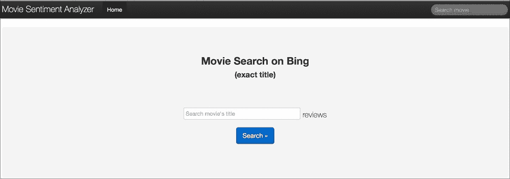
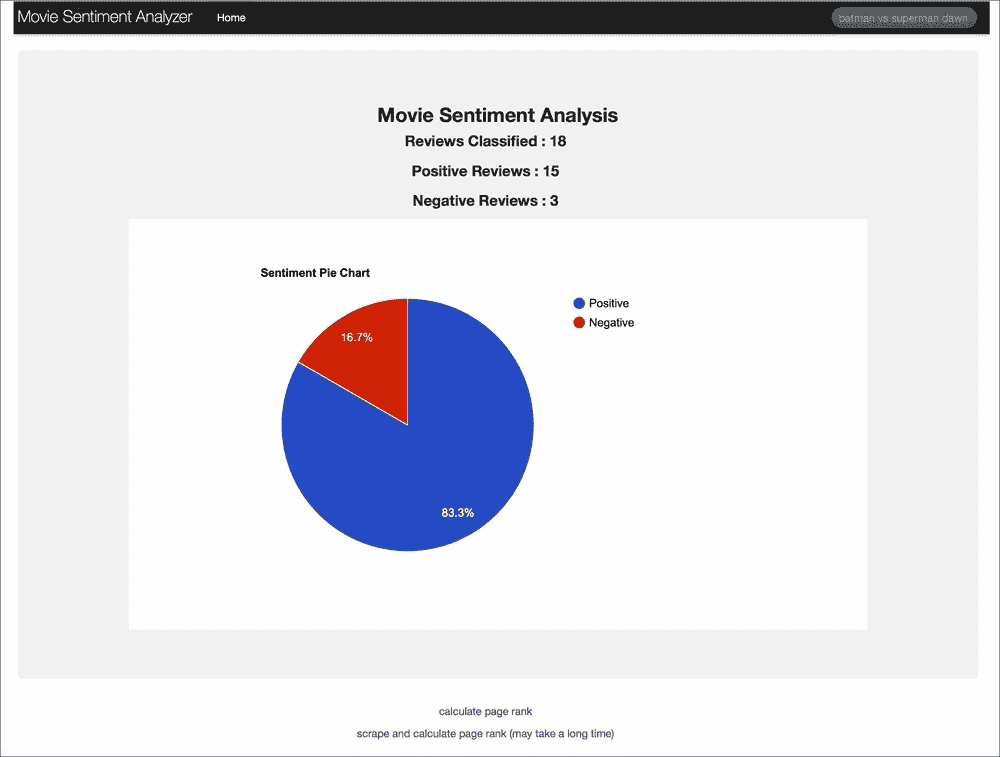
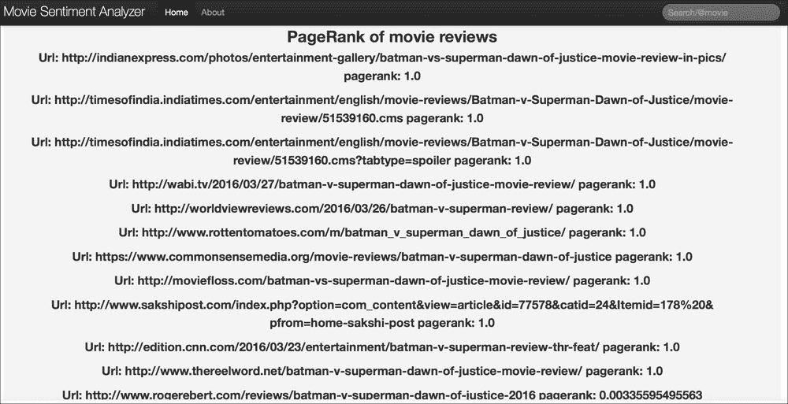
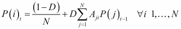
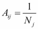
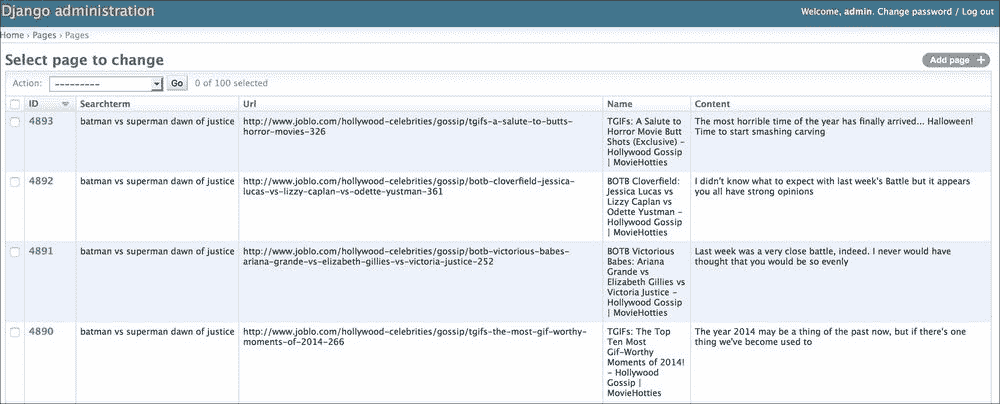

# 第八章. 电影评论情感分析应用

在本章中，我们描述了一个应用，该应用使用本书中描述的算法和方法来确定电影评论的情感。此外，我们将使用**Scrapy**库通过搜索引擎 API（必应搜索引擎）从不同网站收集评论。电影评论的文本和标题使用 newspaper 库或遵循 HTML 格式页面的某些预定义提取规则进行提取。每个评论的情感是通过在最有信息量的单词上使用朴素贝叶斯分类器（使用 X *2*度量）来确定的，这与第四章中提到的*网络挖掘技术*相同。此外，使用在第四章中讨论的 PageRank 算法（*网络挖掘技术*）计算与每个电影查询相关的每个页面的排名，以确保完整性。本章将讨论构建应用所使用的代码，包括 Django 模型和视图，以及 Scrapy 爬虫用于从电影评论的网页中收集数据。我们首先给出一个网络应用的示例，并解释所使用的搜索引擎 API 以及如何将其包含在应用中。然后，我们描述如何收集电影评论，将 Scrapy 库集成到 Django 中，存储数据的模型以及管理应用的主要命令。本章中讨论的所有代码都可在作者的 GitHub 仓库中找到，位于`chapter_8`文件夹内，网址为[`github.com/ai2010/machine_learning_for_the_web/tree/master/chapter_8`](https://github.com/ai2010/machine_learning_for_the_web/tree/master/chapter_8)。

# 应用使用概述

主网页如下：



用户可以输入电影名称，如果他们想知道评论的情感和相关性。例如，我们在以下截图中搜索*蝙蝠侠大战超人 正义黎明*：



该应用从必应搜索引擎收集并爬取了 18 条评论，并使用 Scrapy 库分析了它们的情感（15 条正面评论和 3 条负面评论）。所有数据都存储在 Django 模型中，准备好使用 PageRank 算法计算每个页面的相关性（如前一个截图中所见页面底部的链接）。在这种情况下，使用 PageRank 算法，我们有以下结果：



这是一个与我们电影评论搜索最相关的页面列表，在爬虫爬取器上设置深度参数为 2（有关更多详细信息，请参阅以下章节）。请注意，为了在页面相关性上获得良好的结果，您需要爬取数千个页面（前面的截图显示了大约 50 个爬取的页面）。

要编写应用程序，我们像往常一样启动服务器（参见第六章，*Django 入门*，和第七章，*电影推荐系统 Web 应用程序*）以及 Django 的主要应用程序。首先，我们创建一个文件夹来存储所有代码，`movie_reviews_analyzer_app`，然后我们使用以下命令初始化 Django：

```py

mkdir  movie_reviews_analyzer_app

cd  movie_reviews_analyzer_app

django-admin startproject webmining_server

python manage.py startapp startapp pages

```

我们在`.py`文件中设置设置，就像在第六章，*Django 入门*，和第七章，*电影推荐系统 Web 应用程序*的*设置*部分以及*应用程序设置*部分所做的那样（当然，在这种情况下，名称是`webmining_server`而不是`server_movierecsys`）。

情感分析应用程序的主要视图位于主`webmining_server`文件夹中的`.py`文件，而不是我们之前所用的`app`（页面）文件夹中（参见第六章，*Django 入门*，和第七章，*电影推荐系统 Web 应用程序*），因为现在的功能更多地涉及到服务器的通用功能，而不是特定应用程序（页面）。

使网络服务可操作的最后一步是创建一个`superuser`账户并启动服务器：

```py

python manage.py createsuperuser (admin/admin)

python manage.py runserver

```

现在已经解释了应用程序的结构，我们可以更详细地讨论不同部分，从用于收集 URL 的搜索引擎 API 开始。

# 搜索引擎选择和应用程序代码

由于直接从最相关的搜索引擎如 Google、Bing、Yahoo 等抓取数据违反了它们的条款服务，我们需要从它们的 REST API（使用如 Crawlera 等抓取服务[`crawlera.com/`](http://www.crawlera.com/)，也是可能的）获取初始审查页面。我们决定使用 Bing 服务，该服务每月免费提供 5,000 次查询。

为了做到这一点，我们注册到 Microsoft 服务以获取允许搜索所需的密钥。简而言之，我们遵循了以下步骤：

1.  在[`datamarket.azure.com`](https://datamarket.azure.com)上在线注册。

1.  在**我的账户**中，获取**主账户密钥**。

1.  在**开发者** | **注册**下注册一个新应用程序（将**重定向 URI**设置为`https://www.bing.com`）

之后，我们可以编写一个函数，检索与我们查询相关的尽可能多的 URL：

```py
num_reviews = 30 
def bing_api(query):
    keyBing = API_KEY        # get Bing key from: https://datamarket.azure.com/account/keys
    credentialBing = 'Basic ' + (':%s' % keyBing).encode('base64')[:-1] # the "-1" is to remove the trailing "\n" which encode adds
    searchString = '%27X'+query.replace(" ",'+')+'movie+review%27'
    top = 50#maximum allowed by Bing

    reviews_urls = []
    if num_reviews<top:
        offset = 0
        url = 'https://api.datamarket.azure.com/Bing/Search/Web?' + \
              'Query=%s&$top=%d&$skip=%d&$format=json' % (searchString, num_reviews, offset)

        request = urllib2.Request(url)
        request.add_header('Authorization', credentialBing)
        requestOpener = urllib2.build_opener()
        response = requestOpener.open(request)
        results = json.load(response)
        reviews_urls = [ d['Url'] for d in results['d']['results']]
    else:
        nqueries = int(float(num_reviews)/top)+1
        for i in xrange(nqueries):
            offset = top*i
            if i==nqueries-1:
                top = num_reviews-offset
                url = 'https://api.datamarket.azure.com/Bing/Search/Web?' + \
                      'Query=%s&$top=%d&$skip=%d&$format=json' % (searchString, top, offset)

                request = urllib2.Request(url)
                request.add_header('Authorization', credentialBing)
                requestOpener = urllib2.build_opener()
                response = requestOpener.open(request) 
            else:
                top=50
                url = 'https://api.datamarket.azure.com/Bing/Search/Web?' + \
                      'Query=%s&$top=%d&$skip=%d&$format=json' % (searchString, top, offset)

                request = urllib2.Request(url)
                request.add_header('Authorization', credentialBing)
                requestOpener = urllib2.build_opener()
                response = requestOpener.open(request) 
            results = json.load(response)
            reviews_urls += [ d['Url'] for d in results['d']['results']]
    return reviews_urls
```

`API_KEY` 参数来自 Microsoft 账户，`query` 是一个字符串，用于指定电影名称，而 `num_reviews = 30` 是 Bing API 返回的总 URL 数量。有了包含评论的 URL 列表，我们现在可以设置一个爬虫，使用 Scrapy 从每个网页中提取标题和评论文本。

# Scrapy 设置和应用程序代码

Scrapy 是一个 Python 库，用于从网页中提取内容或爬取指向给定网页的页面（有关更多详细信息，请参阅第四章中的*Web 爬虫（或蜘蛛）*部分，*网络挖掘技术*）。要安装库，请在终端中输入以下内容：

```py

sudo pip install Scrapy 

```

在`bin`文件夹中安装可执行文件：

```py

sudo easy_install scrapy

```

从`movie_reviews_analyzer_app`文件夹中，我们初始化 Scrapy 项目如下：

```py

scrapy startproject scrapy_spider

```

此命令将在`scrapy_spider`文件夹内创建以下目录结构：

```py

├── __init__.py

├── items.py

├── pipelines.py

├── settings.py
├── spiders

├── spiders

│   ├── __init__.py

```

`pipelines.py` 和 `items.py` 文件管理爬取数据的存储和处理方式，它们将在*蜘蛛*和*将 Django 与 Scrapy 集成*部分中稍后讨论。`settings.py` 文件设置了`spiders`文件夹中定义的每个爬虫（或爬虫）使用的参数。在以下两个部分中，我们描述了在此应用程序中使用的主要参数和爬虫。

## Scrapy 设置

`settings.py` 文件收集了 Scrapy 项目中每个爬虫用于爬取网页的所有参数。主要参数如下：

+   `DEPTH_LIMIT` : 在初始 URL 之后爬取的后续页面的数量。默认值为 `0`，表示未设置限制。

+   `LOG_ENABLED` : 允许/拒绝 Scrapy 在执行时在终端上记录日志，默认值为 true。

+   `ITEM_PIPELINES = {'scrapy_spider.pipelines.ReviewPipeline': 1000,}` : 处理从每个网页中提取的数据的管道函数的路径。

+   `CONCURRENT_ITEMS = 200` : 在管道中处理的并发项目数量。

+   `CONCURRENT_REQUESTS = 5000` : Scrapy 处理的并发请求数量的最大值。

+   `CONCURRENT_REQUESTS_PER_DOMAIN = 3000` : Scrapy 为每个指定域名处理的并发请求数量的最大值。

深度越大，爬取的页面越多，因此爬取所需的时间也越长。为了加快过程，你可以将最后三个参数设置为高值。在此应用程序（`spiders` 文件夹中），我们设置了两个爬虫：一个用于从每个电影评论 URL 中提取数据（`movie_link_results.py`）的爬虫，以及一个用于生成指向初始电影评论 URL 的网页链接图（`recursive_link_results.py`）的爬虫。

## 爬虫

`movie_link_results.py` 上的爬虫如下所示：

```py

from newspaper import Article

from urlparse import urlparse

from scrapy.selector import Selector

from scrapy import Spider

from scrapy.spiders import BaseSpider,CrawlSpider, Rule

from scrapy.http import Request

from scrapy_spider import settings

from scrapy_spider.items import PageItem,SearchItem

unwanted_domains = ['youtube.com','www.youtube.com']

from nltk.corpus import stopwords

stopwords = set(stopwords.words('english'))

def CheckQueryinReview(keywords,title,content):

 content_list = map(lambda x:x.lower(),content.split(' '))

 title_list = map(lambda x:x.lower(),title.split(' '))

 words = content_list+title_list

 for k in keywords:

 if k in words:

 return True

 return False

class Search(Spider):

 name = 'scrapy_spider_reviews'

 def __init__(self,url_list,search_key):#specified by -a

 self.search_key = search_key

 self.keywords = [w.lower() for w in search_key.split(" ") if w not in stopwords]

 self.start_urls =url_list.split(',')

 super(Search, self).__init__(url_list)

 def start_requests(self):

 for url in self.start_urls:

 yield Request(url=url, callback=self.parse_site,dont_filter=True)

 def parse_site(self, response):

 ## Get the selector for xpath parsing or from newspaper

 def crop_emptyel(arr):

 return [u for u in arr if u!=' ']

 domain = urlparse(response.url).hostname

 a = Article(response.url)

 a.download()

 a.parse()

 title = a.title.encode('ascii','ignore').replace('\n','')

 sel = Selector(response)

 if title==None:

 title = sel.xpath('//title/text()').extract()

 if len(title)>0:

 title = title[0].encode('utf-8').strip().lower()

 content = a.text.encode('ascii','ignore').replace('\n','')

 if content == None:

 content = 'none'

 if len(crop_emptyel(sel.xpath('//div//article//p/text()').extract()))>1:

 contents = crop_emptyel(sel.xpath('//div//article//p/text()').extract())

 print 'divarticle'

 ….

 elif len(crop_emptyel(sel.xpath('/html/head/meta[@name="description"]/@content').extract()))>0:

 contents = crop_emptyel(sel.xpath('/html/head/meta[@name="description"]/@content').extract())

 content = ' '.join([c.encode('utf-8') for c in contents]).strip().lower()

 #get search item 

 search_item = SearchItem.django_model.objects.get(term=self.search_key)

 #save item

 if not PageItem.django_model.objects.filter(url=response.url).exists():

 if len(content) > 0:

 if CheckQueryinReview(self.keywords,title,content):

 if domain not in unwanted_domains:

 newpage = PageItem()

 newpage['searchterm'] = search_item

 newpage['title'] = title

 newpage['content'] = content

 newpage['url'] = response.url

 newpage['depth'] = 0

 newpage['review'] = True

 #newpage.save()

 return newpage 

 else:

 return null

```

我们可以看到，`scrapy`中的`Spider`类被`Search`类继承，并且必须定义以下标准方法以覆盖标准方法：

+   `__init__`：蜘蛛的构造函数需要定义包含从其提取内容的 URL 的 `start_urls` 列表。此外，我们还有自定义变量，如 `search_key` 和 `keywords`，它们存储与在搜索引擎 API 上使用的电影标题查询相关的信息。

+   `start_requests`：当调用 `spider` 时，此函数被触发，并声明对 `start_urls` 列表中的每个 URL 要执行的操作；对于每个 URL，将调用自定义的 `parse_site` 函数（而不是默认的 `parse` 函数）。

+   `parse_site`：这是一个自定义函数，用于解析每个 URL 的数据。为了提取评论的标题及其文本内容，我们使用了 newspaper 库（`sudo pip install newspaper`），或者在失败的情况下，直接使用一些定义的规则解析 HTML 文件，以避免因不想要的标签而产生的噪声（每个规则结构都是使用 `sel.xpath` 命令定义的）。为了达到这个结果，我们选择了某些流行的域名（如 `rottentomatoes`、`cnn` 等），并确保解析能够从这些网站上提取内容（前述代码中没有显示所有提取规则，但它们可以在 GitHub 文件中找到）。然后，使用相关的 Scrapy 项和 `ReviewPipeline` 函数将数据存储在页面 `Django` 模型中（见下一节）。

+   `CheckQueryinReview`：这是一个自定义函数，用于检查电影标题（来自查询）是否包含在每个网页的内容或标题中。

要运行蜘蛛，我们需要在 `scrapy_spider`（内部）文件夹中输入以下命令：

```py

scrapy crawl scrapy_spider_reviews -a url_list=listname -a search_key=keyname

```

## 管道

管道定义了当蜘蛛抓取新页面时应该执行的操作。在前面的例子中，`parse_site` 函数返回一个 `PageItem` 对象，这触发了以下管道（`pipelines.py`）：

```py

class ReviewPipeline(object):

 def process_item(self, item, spider):

 #if spider.name == 'scrapy_spider_reviews':#not working

 item.save()

 return item

```

此类简单地保存每个项目（在蜘蛛的术语中，即新页面）。

## 爬虫

正如我们在概述（前述章节）中所示，在存储从评论的 URL 开始的链接页面之后，使用 PageRank 算法计算评论的相关性。执行此操作的爬虫是 `recursive_link_results.py`：

```py

#from scrapy.spider import Spider

from scrapy.selector import Selector

from scrapy.contrib.spiders import CrawlSpider, Rule

from scrapy.linkextractors import LinkExtractor

from scrapy.http import Request

from scrapy_spider.items import PageItem,LinkItem,SearchItem

class Search(CrawlSpider):

 name = 'scrapy_spider_recursive'

 def __init__(self,url_list,search_id):#specified by -a

 #REMARK is allowed_domains is not set then ALL are allowed!!!

 self.start_urls = url_list.split(',')

 self.search_id = int(search_id)

 #allow any link but the ones with different font size(repetitions)

 self.rules = (

 Rule(LinkExtractor(allow=(),deny=('fontSize=*','infoid=*','SortBy=*', ),unique=True), callback='parse_item', follow=True), 

 )

 super(Search, self).__init__(url_list)

 def parse_item(self, response):

 sel = Selector(response)

 ## Get meta info from website

 title = sel.xpath('//title/text()').extract()

 if len(title)>0:

 title = title[0].encode('utf-8')

 contents = sel.xpath('/html/head/meta[@name="description"]/@content').extract()

 content = ' '.join([c.encode('utf-8') for c in contents]).strip()

 fromurl = response.request.headers['Referer']

 tourl = response.url

 depth = response.request.meta['depth']

 #get search item 

 search_item = SearchItem.django_model.objects.get(id=self.search_id)

 #newpage

 if not PageItem.django_model.objects.filter(url=tourl).exists():

 newpage = PageItem()

 newpage['searchterm'] = search_item

 newpage['title'] = title

 newpage['content'] = content

 newpage['url'] = tourl

 newpage['depth'] = depth

 newpage.save()#cant use pipeline cause the execution can finish here

 #get from_id,to_id

 from_page = PageItem.django_model.objects.get(url=fromurl)

 from_id = from_page.id

 to_page = PageItem.django_model.objects.get(url=tourl)

 to_id = to_page.id

 #newlink

 if not LinkItem.django_model.objects.filter(from_id=from_id).filter(to_id=to_id).exists():

 newlink = LinkItem()

 newlink['searchterm'] = search_item

 newlink['from_id'] = from_id

 newlink['to_id'] = to_id

 newlink.save()

```

`scrapy` 中的 `CrawlSpider` 类继承自 `Search` 类，必须定义以下标准方法以覆盖标准方法（类似于蜘蛛的情况）：

+   `__init__`：这是类的构造函数。`start_urls` 参数定义了蜘蛛开始爬取的起始 URL，直到达到 `DEPTH_LIMIT` 值。`rules` 参数设置允许/拒绝爬取的 URL 类型（在这种情况下，忽略具有不同字体大小的相同页面）并定义了用于操作每个检索到的页面的函数（`parse_item`）。此外，定义了一个自定义变量 `search_id`，它需要存储查询的 ID，以便在其它数据中存储。

+   `parse_item` : 这是一个被调用来存储从每个检索到的页面中提取的重要数据的自定义函数。为每个页面创建一个新的 Django `Page` 模型项（见下文章节），其中包含页面的标题和内容（使用 `xpath` HTML 解析器）。为了执行 PageRank 算法，将链接到每个页面的页面和页面本身的关系保存为 `Link` 模型的对象，使用相关的 Scrapy 项（见下文章节）。

要运行爬虫，我们需要在（内部）`scrapy_spider` 文件夹中输入以下命令：

```py

scrapy crawl scrapy_spider_recursive -a url_list=listname -a search_id=keyname

```

# Django 模型

使用蜘蛛收集的数据需要存储在数据库中。在 Django 中，数据库表被称为模型，并在 `models.py` 文件中定义（位于 `pages` 文件夹内）。该文件的内容如下：

```py

from django.db import models

from django.conf import settings

from django.utils.translation import ugettext_lazy as _

class SearchTerm(models.Model):

 term = models.CharField(_('search'), max_length=255)

 num_reviews = models.IntegerField(null=True,default=0)

 #display term on admin panel

 def __unicode__(self):

 return self.term

class Page(models.Model):

 searchterm = models.ForeignKey(SearchTerm, related_name='pages',null=True,blank=True)

 url = models.URLField(_('url'), default='', blank=True)

 title = models.CharField(_('name'), max_length=255)

 depth = models.IntegerField(null=True,default=-1)

 html = models.TextField(_('html'),blank=True, default='')

 review = models.BooleanField(default=False)

 old_rank = models.FloatField(null=True,default=0)

 new_rank = models.FloatField(null=True,default=1)

 content = models.TextField(_('content'),blank=True, default='')

 sentiment = models.IntegerField(null=True,default=100)

class Link(models.Model):

 searchterm = models.ForeignKey(SearchTerm, related_name='links',null=True,blank=True)

 from_id = models.IntegerField(null=True)

 to_id = models.IntegerField(null=True)

```

在应用程序的首页键入的每个电影标题存储在 `SearchTerm` 模型中，而每个网页的数据则收集在 `Page` 模型的对象中。除了内容字段（HTML、标题、URL、内容）外，还记录了评论的情感和图网络中的深度（布尔值也指示网页是否是电影评论页面或仅仅是链接页面）。`Link` 模型存储了页面之间的所有图链接，然后这些链接被 PageRank 算法用来计算评论网页的相关性。请注意，`Page` 模型和 `Link` 模型都通过外键与相关的 `SearchTerm` 相关联。像往常一样，为了将这些模型作为数据库表编写，我们输入以下命令：

```py

python manage.py makemigrations

python manage.py migrate

```

为了填充这些 Django 模型，我们需要让 Scrapy 与 Django 交互，这是下文章节的主题。

# 整合 Django 与 Scrapy

为了使路径易于调用，我们移除了外部的 `scrapy_spider` 文件夹，这样在 `movie_reviews_analyzer_app` 中，`webmining_server` 文件夹与 `scrapy_spider` 文件夹处于同一级别：

```py

├── db.sqlite3

├── scrapy.cfg

├── scrapy_spider

│   ├── ...

│   ├── spiders

│   │   ...

└── webmining_server

```

我们将 Django 路径设置到 Scrapy 的 `settings.py` 文件中：

```py

# Setting up django's project full path.

import sys

sys.path.insert(0, BASE_DIR+'/webmining_server')

# Setting up django's settings module name.

os.environ['DJANGO_SETTINGS_MODULE'] = 'webmining_server.settings'

#import django to load models(otherwise AppRegistryNotReady: Models aren't loaded yet):

import django

django.setup()

```

现在，我们可以安装允许从 Scrapy 管理 Django 模型的库：

```py

sudo pip install scrapy-djangoitem

```

在 `items.py` 文件中，我们按照以下方式编写 Django 模型和 Scrapy 项之间的链接：

```py

from scrapy_djangoitem import DjangoItem

from pages.models import Page,Link,SearchTerm

class SearchItem(DjangoItem):

 django_model = SearchTerm

class PageItem(DjangoItem):

 django_model = Page

class LinkItem(DjangoItem):

 django_model = Link

```

每个类都继承自 `DjangoItem` 类，这样使用 `django_model` 变量声明的原始 Django 模型将自动链接。Scrapy 项目现在已完成，我们可以继续讨论解释处理 Scrapy 提取的数据的 Django 代码以及管理应用程序所需的 Django 命令。

## 命令（情感分析模型和删除查询）

应用程序需要管理一些不允许最终用户执行的操作，例如定义情感分析模型和删除电影查询以便重新执行，而不是从内存中检索现有数据。以下章节将解释执行这些操作的命令。

## 情感分析模型加载器

本应用程序的最终目标是确定电影评论的情感（正面或负面）。为了实现这一点，必须使用一些外部数据构建一个情感分类器，然后将其存储在内存（缓存）中，以便每个查询请求使用。这就是以下显示的`load_sentimentclassifier.py`命令的目的：

```py

import nltk.classify.util, nltk.metrics

from nltk.classify import NaiveBayesClassifier

from nltk.corpus import movie_reviews

from nltk.corpus import stopwords

from nltk.collocations import BigramCollocationFinder

from nltk.metrics import BigramAssocMeasures

from nltk.probability import FreqDist, ConditionalFreqDist

import collections

from django.core.management.base import BaseCommand, CommandError

from optparse import make_option

from django.core.cache import cache

stopwords = set(stopwords.words('english'))

method_selfeatures = 'best_words_features'

class Command(BaseCommand):

 option_list = BaseCommand.option_list + (

 make_option('-n', '--num_bestwords', 

 dest='num_bestwords', type='int',

 action='store',

 help=('number of words with high information')),)

 def handle(self, *args, **options):

 num_bestwords = options['num_bestwords']

 self.bestwords = self.GetHighInformationWordsChi(num_bestwords)

 clf = self.train_clf(method_selfeatures)

 cache.set('clf',clf)

 cache.set('bestwords',self.bestwords)

```

在文件开头，变量`method_selfeatures`设置了用于训练分类器`train_clf`的特征选择方法（在这种情况下，特征是评论中的单词；详见第四章，*网络挖掘技术*，以获取更多详细信息）。最佳单词（特征）的最大数量由输入参数`num_bestwords`定义。然后，分类器和最佳特征（`bestwords`）存储在缓存中，以便应用程序（使用`cache`模块）使用。分类器和选择最佳单词（特征）的方法如下：

```py

 def train_clf(method):

 negidxs = movie_reviews.fileids('neg')

 posidxs = movie_reviews.fileids('pos')

 if method=='stopword_filtered_words_features':

 negfeatures = [(stopword_filtered_words_features(movie_reviews.words(fileids=[file])), 'neg') for file in negidxs]

 posfeatures = [(stopword_filtered_words_features(movie_reviews.words(fileids=[file])), 'pos') for file in posidxs]

 elif method=='best_words_features':

 negfeatures = [(best_words_features(movie_reviews.words(fileids=[file])), 'neg') for file in negidxs]

 posfeatures = [(best_words_features(movie_reviews.words(fileids=[file])), 'pos') for file in posidxs]

 elif method=='best_bigrams_words_features':

 negfeatures = [(best_bigrams_words_features(movie_reviews.words(fileids=[file])), 'neg') for file in negidxs]

 posfeatures = [(best_bigrams_words_features(movie_reviews.words(fileids=[file])), 'pos') for file in posidxs]

 trainfeatures = negfeatures + posfeatures

 clf = NaiveBayesClassifier.train(trainfeatures)

 return clf

 def stopword_filtered_words_features(self,words):

 return dict([(word, True) for word in words if word not in stopwords])

 #eliminate Low Information Features

 def GetHighInformationWordsChi(self,num_bestwords):

 word_fd = FreqDist()

 label_word_fd = ConditionalFreqDist()

 for word in movie_reviews.words(categories=['pos']):

 word_fd[word.lower()] +=1

 label_word_fd['pos'][word.lower()] +=1

 for word in movie_reviews.words(categories=['neg']):

 word_fd[word.lower()] +=1

 label_word_fd['neg'][word.lower()] +=1

 pos_word_count = label_word_fd['pos'].N()

 neg_word_count = label_word_fd['neg'].N()

 total_word_count = pos_word_count + neg_word_count

 word_scores = {}

 for word, freq in word_fd.iteritems():

 pos_score = BigramAssocMeasures.chi_sq(label_word_fd['pos'][word],

 (freq, pos_word_count), total_word_count)

 neg_score = BigramAssocMeasures.chi_sq(label_word_fd['neg'][word],

 (freq, neg_word_count), total_word_count)

 word_scores[word] = pos_score + neg_score

 best = sorted(word_scores.iteritems(), key=lambda (w,s): s, reverse=True)[:num_bestwords]

 bestwords = set([w for w, s in best])

 return bestwords

 def best_words_features(self,words):

 return dict([(word, True) for word in words if word in self.bestwords])

 def best_bigrams_word_features(self,words, measure=BigramAssocMeasures.chi_sq, nbigrams=200):

 bigram_finder = BigramCollocationFinder.from_words(words)

 bigrams = bigram_finder.nbest(measure, nbigrams)

 d = dict([(bigram, True) for bigram in bigrams])

 d.update(best_words_features(words))

 return d

```

在前面的代码中，编写了三种方法来选择单词：

+   `stopword_filtered_words_features`：使用**自然语言工具包**（**NLTK**）的并列词列表消除`stopwords`，并将剩余的视为相关单词

+   `best_words_features`：使用*X²*度量（`NLTK`库），选择与正面或负面评论相关的最有信息量的单词（详见第四章，*网络挖掘技术*，以获取更多详细信息）

+   `best_bigrams_word_features`：使用*X²*度量（`NLTK`库）从单词集合中找到 200 个最有信息量的二元组（详见*第四章*，*网络挖掘技术*，以获取更多详细信息）

选择的分类器是朴素贝叶斯算法（见第三章，*监督机器学习*），并且标记的文本（正面、负面情感）来自`NLTK.corpus`中的`movie_reviews`。要安装它，请在 Python 中打开一个终端并从`corpus`安装`movie_reviews`：

```py

nltk.download()--> corpora/movie_reviews corpus

```

## 删除已执行过的查询

由于我们可以指定不同的参数（例如特征选择方法、最佳单词数量等），我们可能希望再次执行并存储具有不同值的评论的情感。为此需要`delete_query`命令，如下所示：

```py

from pages.models import Link,Page,SearchTerm

from django.core.management.base import BaseCommand, CommandError

from optparse import make_option

class Command(BaseCommand):

 option_list = BaseCommand.option_list + (

 make_option('-s', '--searchid',

 dest='searchid', type='int',

 action='store',

 help=('id of the search term to delete')),)

 def handle(self, *args, **options):

 searchid = options['searchid']

 if searchid == None:

 print "please specify searchid: python manage.py --searchid=--"

 #list

 for sobj in SearchTerm.objects.all():

 print 'id:',sobj.id,"  term:",sobj.term

 else:

 print 'delete...'

 search_obj = SearchTerm.objects.get(id=searchid)

 pages = search_obj.pages.all()

 pages.delete()

 links = search_obj.links.all()

 links.delete()

 search_obj.delete()

```

如果在不指定`searchid`（查询 ID）的情况下运行该命令，将显示所有查询及其相关 ID 的列表。之后，我们可以通过键入以下内容来选择我们想要删除的查询：

```py

python manage.py delete_query --searchid=VALUE

```

我们可以使用缓存的情感分析模型来向用户展示所选电影的在线情感，正如我们在下一节中解释的那样。

## 情感评论分析器 – Django 视图和 HTML

本章中解释的大多数代码（命令、必应搜索引擎、Scrapy 和 Django 模型）都用于`views.py`中的`analyzer`函数，以支持*应用使用概述*部分显示的首页（在`urls.py`文件中声明 URL 为`url(r'^$','webmining_server.views.analyzer')`之后）。

```py

def analyzer(request):

 context = {}

 if request.method == 'POST':

 post_data = request.POST

 query = post_data.get('query', None)

 if query:

 return redirect('%s?%s' % (reverse('webmining_server.views.analyzer'),

 urllib.urlencode({'q': query}))) 

 elif request.method == 'GET':

 get_data = request.GET

 query = get_data.get('q')

 if not query:

 return render_to_response(

 'movie_reviews/home.html', RequestContext(request, context))

 context['query'] = query

 stripped_query = query.strip().lower()

 urls = []

 if test_mode:

 urls = parse_bing_results()

 else:

 urls = bing_api(stripped_query)

 if len(urls)== 0:

 return render_to_response(

 'movie_reviews/noreviewsfound.html', RequestContext(request, context))

 if not SearchTerm.objects.filter(term=stripped_query).exists():

 s = SearchTerm(term=stripped_query)

 s.save()

 try:

 #scrape

 cmd = 'cd ../scrapy_spider & scrapy crawl scrapy_spider_reviews -a url_list=%s -a search_key=%s' %('\"'+str(','.join(urls[:num_reviews]).encode('utf-8'))+'\"','\"'+str(stripped_query)+'\"')

 os.system(cmd)

 except:

 print 'error!'

 s.delete()

 else:

 #collect the pages already scraped 

 s = SearchTerm.objects.get(term=stripped_query)

 #calc num pages

 pages = s.pages.all().filter(review=True)

 if len(pages) == 0:

 s.delete()

 return render_to_response(

 'movie_reviews/noreviewsfound.html', RequestContext(request, context))

 s.num_reviews = len(pages)

 s.save()

 context['searchterm_id'] = int(s.id)

 #train classifier with nltk

 def train_clf(method):

 ... 

 def stopword_filtered_words_features(words):

 ... 

 #Eliminate Low Information Features

 def GetHighInformationWordsChi(num_bestwords):

 ... 

 bestwords = cache.get('bestwords')

 if bestwords == None:

 bestwords = GetHighInformationWordsChi(num_bestwords)

 def best_words_features(words):

 ... 

 def best_bigrams_words_features(words, measure=BigramAssocMeasures.chi_sq, nbigrams=200):

 ...

 clf = cache.get('clf')

 if clf == None:

 clf = train_clf(method_selfeatures)

 cntpos = 0

 cntneg = 0

 for p in pages:

 words = p.content.split(" ")

 feats = best_words_features(words)#bigram_word_features(words)#stopword_filtered_word_feats(words)

 #print feats

 str_sent = clf.classify(feats)

 if str_sent == 'pos':

 p.sentiment = 1

 cntpos +=1

 else:

 p.sentiment = -1

 cntneg +=1

 p.save()

 context['reviews_classified'] = len(pages)

 context['positive_count'] = cntpos

 context['negative_count'] = cntneg

 context['classified_information'] = True

 return render_to_response(

 'movie_reviews/home.html', RequestContext(request, context))

```

插入的电影标题存储在`query`变量中，并传递给`bing_api`函数以收集评论的 URL。然后调用 Scrapy 抓取评论文本，这些文本使用`clf`分类器模型进行处理，并从缓存中检索出选定的最有信息量的单词（`bestwords`）。在这种情况下，如果缓存为空，则再次生成相同的模型）。然后，将预测的评论情感计数（`positive_counts`、`negative_counts`和`reviews_classified`）发送回`home.html`（`templates`文件夹）页面，该页面使用以下 Google 饼图代码：

```py
        <h2 align = Center>Movie Reviews Sentiment Analysis</h2>
        <div class="row">
        <p align = Center><strong>Reviews Classified : {{ reviews_classified }}</strong></p>
        <p align = Center><strong>Positive Reviews : {{ positive_count }}</strong></p>
        <p align = Center><strong> Negative Reviews : {{ negative_count }}</strong></p>
        </div> 
  <section>
      <script type="text/javascript" src="img/jsapi"></script>
      <script type="text/javascript">
        google.load("visualization", "1", {packages:["corechart"]});
        google.setOnLoadCallback(drawChart);
        function drawChart() {
          var data = google.visualization.arrayToDataTable([
            ['Sentiment', 'Number'],
            ['Positive',     {{ positive_count }}],
            ['Negative',      {{ negative_count }}]
          ]);
          var options = { title: 'Sentiment Pie Chart'};
          var chart = new google.visualization.PieChart(document.getElementById('piechart'));
          chart.draw(data, options);
        }
      </script>
        <p align ="Center" id="piechart" style="width: 900px; height: 500px;display: block; margin: 0 auto;text-align: center;" ></p>
      </div>
```

函数`drawChart`调用 Google 的`PieChart`可视化函数，该函数以数据（正面和负面的计数）作为输入来创建饼图。要了解更多关于 HTML 代码如何与 Django 视图交互的细节，请参阅第六章，*开始使用 Django*，在*HTML 网页背后的 URL 和视图*部分。从带有情感计数的结果页面（参见*应用使用概述*部分），可以使用页面底部的两个链接之一计算抓取评论的 PageRank 相关性。该操作的 Django 代码将在下一节中讨论。

# PageRank：Django 视图和算法代码

为了对在线评论的重要性进行排序，我们在应用中实现了 PageRank 算法（参见第四章，*网络挖掘技术*，在*排名：PageRank 算法*部分），其实现如下：

```py

from pages.models import Page,SearchTerm

num_iterations = 100000

eps=0.0001

D = 0.85

def pgrank(searchid):

 s = SearchTerm.objects.get(id=int(searchid))

 links = s.links.all()

 from_idxs = [i.from_id for i in links ]

 # Find the idxs that receive page rank 

 links_received = []

 to_idxs = []

 for l in links:

 from_id = l.from_id

 to_id = l.to_id

 if from_id not in from_idxs: continue

 if to_id  not in from_idxs: continue

 links_received.append([from_id,to_id])

 if to_id  not in to_idxs: to_idxs.append(to_id)

 pages = s.pages.all()

 prev_ranks = dict()

 for node in from_idxs:

 ptmp  = Page.objects.get(id=node)

 prev_ranks[node] = ptmp.old_rank

 conv=1.

 cnt=0

 while conv>eps or cnt<num_iterations:

 next_ranks = dict()

 total = 0.0

 for (node,old_rank) in prev_ranks.items():

 total += old_rank

 next_ranks[node] = 0.0

 #find the outbound links and send the pagerank down to each of them

 for (node, old_rank) in prev_ranks.items():

 give_idxs = []

 for (from_id, to_id) in links_received:

 if from_id != node: continue

 if to_id  not in to_idxs: continue

 give_idxs.append(to_id)

 if (len(give_idxs) < 1): continue

 amount = D*old_rank/len(give_idxs)

 for id in give_idxs:

 next_ranks[id] += amount

 tot = 0

 for (node,next_rank) in next_ranks.items():

 tot += next_rank

 const = (1-D)/ len(next_ranks)

 for node in next_ranks:

 next_ranks[node] += const

 tot = 0

 for (node,old_rank) in next_ranks.items():

 tot += next_rank

 difftot = 0

 for (node, old_rank) in prev_ranks.items():

 new_rank = next_ranks[node]

 diff = abs(old_rank-new_rank)

 difftot += diff

 conv= difftot/len(prev_ranks)

 cnt+=1

 prev_ranks = next_ranks

 for (id,new_rank) in next_ranks.items():

 ptmp = Page.objects.get(id=id)

 url = ptmp.url

 for (id,new_rank) in next_ranks.items():

 ptmp = Page.objects.get(id=id)

 ptmp.old_rank = ptmp.new_rank

 ptmp.new_rank = new_rank

 ptmp.save()

```

此代码获取与给定的`SearchTerm`对象关联的所有链接存储，并为每个页面*i*在时间*t*的 PageRank 分数实现，其中*P(i)*由以下递归方程给出：



在这里，*N* 是页面的总数，如果页面 *j* 指向 *i*，则 （ *N[j] * 是页面 *j* 的出链数量）；否则，*N* 是 `0`。参数 *D* 是所谓的 **阻尼因子**（在前面的代码中设置为 0.85），它表示跟随由转换矩阵 *A* 给出的转换的概率。方程会迭代，直到满足收敛参数 `eps` 或达到最大迭代次数 `num_iterations`。算法通过点击 `home.html` 页面底部的 **抓取并计算页面排名（可能需要很长时间）** 或 **计算页面排名** 链接来调用。该链接链接到 `views.py` 中的 `pgrank_view` 函数（通过在 `urls.py` 中声明的 URL：`url(r'^pg-rank/(?P<pk>\d+)/','webmining_server.views.pgrank_view', name='pgrank_view')`）：

```py

def pgrank_view(request,pk): 

 context = {}

 get_data = request.GET

 scrape = get_data.get('scrape','False')

 s = SearchTerm.objects.get(id=pk)

 if scrape == 'True':

 pages = s.pages.all().filter(review=True)

 urls = []

 for u in pages:

 urls.append(u.url)

 #crawl

 cmd = 'cd ../scrapy_spider & scrapy crawl scrapy_spider_recursive -a url_list=%s -a search_id=%s' %('\"'+str(','.join(urls[:]).encode('utf-8'))+'\"','\"'+str(pk)+'\"')

 os.system(cmd)

 links = s.links.all()

 if len(links)==0:

 context['no_links'] = True

 return render_to_response(

 'movie_reviews/pg-rank.html', RequestContext(request, context))

 #calc pgranks

 pgrank(pk)

 #load pgranks in descending order of pagerank

 pages_ordered = s.pages.all().filter(review=True).order_by('-new_rank')

 context['pages'] = pages_ordered

 return render_to_response(

 'movie_reviews/pg-rank.html', RequestContext(request, context)) 

```

这段代码调用爬虫收集所有链接到评论的页面，并使用前面讨论过的代码计算 PageRank 分数。然后，这些分数按页面排名分数降序显示在 `pg-rank.html` 页面上（正如我们在本章的 *应用使用概述* 部分所展示的）。由于这个函数可能需要很长时间来处理（爬取数千个页面），因此已经编写了 `run_scrapelinks.py` 命令来运行 Scrapy 爬虫（读者被邀请阅读或修改脚本作为练习）。

# 管理和 API

作为本章的最后一部分，我们简要描述了一些可能的模型管理方法和实现 API 端点以检索应用程序处理的数据。在 `pages` 文件夹中，我们可以在 `admin.py` 文件中设置两个管理界面来检查 `SearchTerm` 和 `Page` 模型收集的数据：

```py

from django.contrib import admin

from django_markdown.admin import MarkdownField, AdminMarkdownWidget

from pages.models import SearchTerm,Page,Link

class SearchTermAdmin(admin.ModelAdmin):

 formfield_overrides = {MarkdownField: {'widget': AdminMarkdownWidget}}

 list_display = ['id', 'term', 'num_reviews']

 ordering = ['-id']

class PageAdmin(admin.ModelAdmin):

 formfield_overrides = {MarkdownField: {'widget': AdminMarkdownWidget}}

 list_display = ['id', 'searchterm', 'url','title','content']

 ordering = ['-id','-new_rank']

admin.site.register(SearchTerm,SearchTermAdmin)

admin.site.register(Page,PageAdmin)

admin.site.register(Link)

```

注意，`SearchTermAdmin` 和 `PageAdmin` 都会显示按递减的 ID（在 `PageAdmin` 的情况下还有 `new_rank`）排列的对象。以下截图是一个示例：



注意，尽管不是必需的，`Link` 模型也已经包含在管理界面中（使用 `admin.site.register(Link)`）。更有趣的是，我们可以设置一个 API 端点来检索与电影标题相关的情感计数。在页面文件夹内的 `api.py` 文件中，我们可以有如下代码：

```py

from rest_framework import views,generics

from rest_framework.permissions import AllowAny

from rest_framework.response import Response

from rest_framework.pagination import PageNumberPagination

from pages.serializers import SearchTermSerializer

from pages.models import SearchTerm,Page

class LargeResultsSetPagination(PageNumberPagination):

 page_size = 1000

 page_size_query_param = 'page_size'

 max_page_size = 10000

class SearchTermsList(generics.ListAPIView):

 serializer_class = SearchTermSerializer

 permission_classes = (AllowAny,)

 pagination_class = LargeResultsSetPagination

 def get_queryset(self):

 return SearchTerm.objects.all() 

class PageCounts(views.APIView):

 permission_classes = (AllowAny,)

 def get(self,*args, **kwargs):

 searchid=self.kwargs['pk']

 reviewpages = Page.objects.filter(searchterm=searchid).filter(review=True)

 npos = len([p for p in reviewpages if p.sentiment==1])

 nneg = len(reviewpages)-npos

 return Response({'npos':npos,'nneg':nneg})

```

`PageCounts` 类接受搜索（电影的标题）的 ID 作为输入，并返回电影的评论的情感，即正面和负面的计数。要从电影的标题获取 `SearchTerm` 的 ID，你可以查看管理界面或使用其他 API 端点 `SearchTermsList`；这简单地返回与相关 ID 一起的电影标题列表。序列化器设置在 `serializers.py` 文件中：

```py

from pages.models import SearchTerm

from rest_framework import serializers

class SearchTermSerializer(serializers.HyperlinkedModelSerializer):

 class Meta:

 model = SearchTerm

 fields = ('id', 'term')

```

要调用这些端点，我们又可以再次使用 swagger 接口（见第六章，*Django 入门*），或者使用终端中的`curl`命令来执行这些调用。例如：

```py

curl -X GET localhost:8000/search-list/

{"count":7,"next":null,"previous":null,"results":[{"id":24,"term":"the martian"},{"id":27,"term":"steve jobs"},{"id":29,"term":"suffragette"},{"id":39,"term":"southpaw"},{"id":40,"term":"vacation"},{"id":67,"term":"the revenant"},{"id":68,"term":"batman vs superman dawn of justice"}]}

```

和

```py

curl -X GET localhost:8000/pages-sentiment/68/

{"nneg":3,"npos":15}

```

# 摘要

在本章中，我们描述了一个电影评论情感分析网络应用程序，让你熟悉我们在第三章，*监督机器学习*，第四章，*网络挖掘技术*，和第六章，*Django 入门*中讨论的一些算法和库。

这是一段旅程的结束：通过阅读这本书并尝试提供的代码，你应该已经获得了关于目前商业环境中使用的重要机器学习算法的显著实用知识。

现在，你应该已经准备好使用 Python 和一些机器学习算法开发自己的网络应用程序和想法了，这些算法是通过阅读这本书学到的。在现实世界中，今天存在许多具有挑战性的数据相关问题，等待那些能够掌握并应用这本书中讨论的材料的人来解决，而你，已经到达这个位置，无疑是这些人之一。

# 读累了记得休息一会哦~

**公众号：古德猫宁李**

+   电子书搜索下载

+   书单分享

+   书友学习交流

**网站：**[沉金书屋](https://www.chenjin5.com)

+   电子书搜索下载

+   电子书打包资源分享

+   学习资源分享
