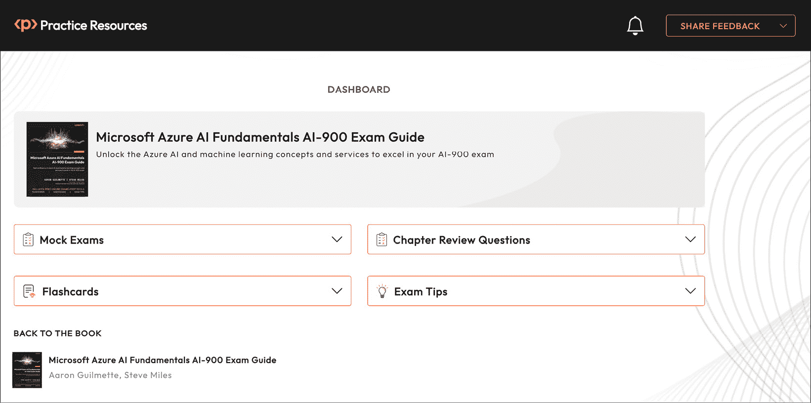
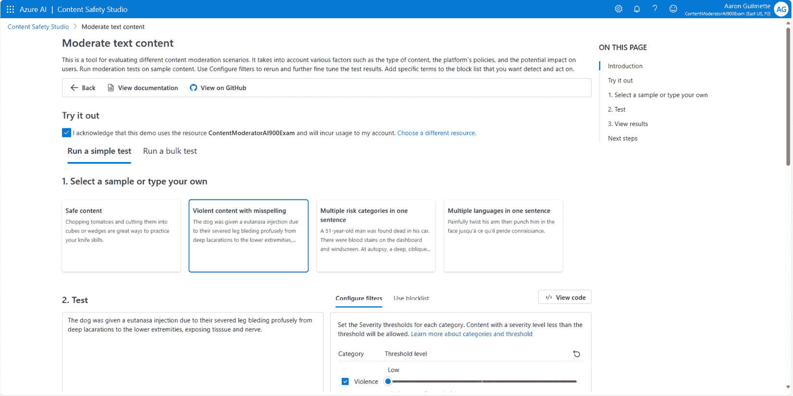
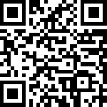
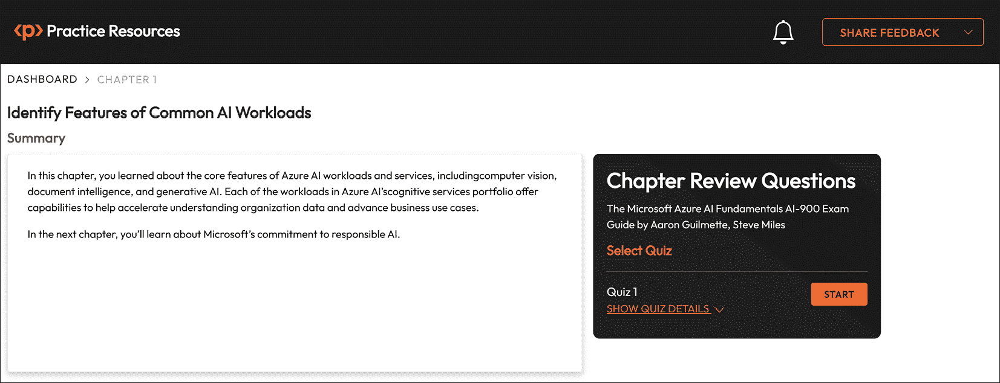

# 1

# 识别常见 AI 工作负载的功能

欢迎来到人工智能的世界！

当您想到 AI 时，您会想到什么？如果您看过科幻电影，您的脑海中可能会浮现出像《银翼杀手》或《终结者》中那样行走和说话的人类似机器人。或者，也许您会想到只是一个声音，比如《2001 太空漫游》中的 HAL 9000 或《钢铁侠》中看似无所不知的计算管家贾维斯。

虽然那个未来还遥不可及，但 AI 现在已经可以做些相当惊人的事情。人工智能是一种模仿某些人类能力的软件技术，例如解释图像和语言或根据历史数据和模式预测场景的结果。

在这本书中，您将了解 Microsoft Azure 平台内可用的广泛 AI 技术和能力。而且，在这本书的整个过程中，您将接触到示例、演示和实验室，展示如何使用 Azure AI 服务来帮助解决简单和复杂的企业场景。

本章我们将涵盖的目标和技能包括以下内容：

+   识别数据监控和异常检测工作负载的功能

+   识别内容审核和个人化工作负载的功能

+   识别计算机视觉工作负载

+   识别自然语言处理工作负载

+   识别知识挖掘工作负载

+   识别文档智能工作负载

+   识别生成式 AI 工作负载的功能

到本章结束时，您应该能够讨论 Microsoft Azure 中可用的 AI 工作负载和功能的特点和能力。

准备开始这段激动人心的旅程吧！

备注

Azure 认知服务已整合到新的 Azure AI 服务品牌中。由于品牌变更，价格和能力都没有发生变化。

在我们继续本章的主题之前，请看一下以下部分。

## 充分利用本书 – 您的认证以及之后

这本书及其配套的在线资源旨在成为您**Microsoft Azure AI 基础** **AI-900 考试**的完整准备工具。

这本书的编写方式使得您在学习认证之后仍能应用所学知识。本书附带的在线实践资源（*图 1.1*）旨在提高您的应试技巧。它们包含了计时模拟考试、互动闪卡和考试技巧，帮助您从现在开始直到考试当天准备考试。

在您继续之前

要了解如何访问这些资源，请前往本书末尾的*第十二章*“访问在线实践资源”。

图 1.1 – 在线实践资源的仪表板界面

仔细阅读每一节。

这里有一些关于如何充分利用本书以通过你的认证并保持考试之外的知识的方法：

1.  从仪表板中的`BACK TO THE BOOK`链接访问**Packt Reader**中的书籍。你可以在那里突出显示书籍的特定部分。

1.  **章节复习题**：在本章末尾，你可以找到本章的复习题链接。这些题目旨在测试你对本章知识的掌握。目标是在进入下一章之前至少得分**75%**。你可以在本章末尾的“考试准备练习 – 章节复习题”部分找到如何充分利用这些题目的详细说明。这样，你可以在每个章节之后提高你的考试技巧，而不是在考试结束时。

1.  **闪卡**：在你通读本书并在每个章节复习题中得分提高**75%**之后，开始复习在线闪卡。它们将帮助你记住关键概念。

1.  **模拟考试**：在考试当天之前，解决本书附带的所有模拟考试。如果你有些答案错误，回到书中并重新审视你较弱的概念。

1.  **考试技巧**：不时回顾这些内容，以进一步提高你的考试准备。

# 识别数据监控和异常检测工作负载的特征

异常检测器是一个配备了一系列**应用程序编程接口**（**API**）的 AI 服务，旨在赋予用户在他们的时间序列数据中监控和识别异常的能力，即使他们有限的**机器学习**（**ML**）专业知识。无论你需要**批量验证**（一种使用训练数据子集检查模型有效性的方法）还是实时**推理**（使用机器学习模型进行预测），异常检测器都能满足你的需求。

什么是时间序列数据？

时间序列数据是指一种数据类型，其中观察值是在时间间隔内收集或记录的。这些观察值通常是按时间顺序排列的，每个数据点都与一个特定的时间戳相关联。时间序列数据在金融、经济、天气预报和销售等各个领域都很常见。

此服务提供两个主要功能：

+   单变量异常检测

+   多变量异常检测

**单变量异常检测**允许用户在单个变量中识别异常，例如收入或成本，而无需广泛的机器学习知识。模型选择过程基于数据本身的模式自动进行，确保无论行业、场景或数据量如何，都能实现最佳性能。通过利用时间序列数据，API 为异常检测建立边界，确定预期值，然后识别异常数据点。

另一方面，**多元异常检测**API 使开发者能够集成用于检测跨组指标异常的先进 AI 功能，消除了对 ML 专业知识或先前标记数据的需要。这些 API 自动考虑信号之间的依赖性和相互关联，这对于保护复杂系统（如软件应用程序、服务器、工厂机器和航天器）免于故障至关重要。

在现实世界中，多元异常检测经常被用来帮助识别诸如信用卡交易欺诈等问题。通过训练诸如你通常购物的地方、你通常旅行的地点以及交易平均大小等数据，金融机构可以检测到你的信用卡被泄露，并立即通知你。

考试技巧

多元异常检测可以关联高达 300 个信号。

当信号交互的偏差超出常规范围时，多元异常检测功能就像一位经验丰富的专家，迅速识别出异常。底层 AI 模型通过使用用户数据来训练和定制，以满足其业务独特的需求。通过添加这些 API，开发者可以无缝地将多元时间序列异常检测功能集成到预测性维护解决方案中，用于复杂企业软件的 AIOps 监控解决方案，或商业智能工具。

接下来，我们将探讨内容审核和个人化的特征。

# 识别内容审核和个人化工作负载的特征

使用 AI 监控和审核内容也是一个日益增长的任务领域。内容审核是指筛选用户生成内容的过程，以确保其符合某些标准或指南。审核 API 为 AI 开发者提供了提交内容进行程序性评估的方法。

注意

传统的 Azure **内容审核器**计划于 2027 年 2 月退役。虽然它仍然可用，但微软建议开发者开始切换到 Azure AI **内容安全**，它包括更多强大的功能。

Azure AI 内容安全提供了一套全面解决方案，用于检测有害内容，涵盖应用和服务中的用户生成内容和 AI 生成内容。该套件包括文本和图像 API，以及一个交互式的内容安全工作室，为开发者提供识别和有效减轻潜在有害内容的工具。

内容审核在各个行业中扮演着关键角色，确保符合法规并维护用户的安全环境。内容审核服务至关重要的场景包括在线市场、游戏公司、社交消息平台、企业媒体和 K-12 教育解决方案。

该服务通过其 API 提供不同类型的分析，包括针对性内容、暴力、仇恨言论和自残的文字和图像分析，以及更新的功能，如越狱风险检测和受保护材料文本检测。

Azure AI 内容安全工作室是一个强大的在线工具，用于处理冒犯性或风险内容，配备了先进的内容审核机器学习模型。它允许用户自定义工作流程，上传自己的内容，并利用微软提供的预构建 AI 模型和黑名单，确保对有害内容的全面覆盖。

通过内容安全工作室，企业可以建立内容审核工作流程，持续监控和改进内容审核性能，并满足其行业特定的内容要求。该平台简化了操作，使得不同解决方案的快速验证变得可能，并无需进行大量模型开发即可实现高效的内容审核。

此外，您可以为不同类型的潜在有害内容配置过滤器和阈值。根据场景，您可以调整过滤设置以更加宽容或严格，然后测试内容样本以过滤器的效果，确保正确类型的内容被阻止，如图 *图 1.1* 所示：

图 1.2 – 在内容安全工作室中评估文本

内容安全工作室的关键特性包括对文本和图像内容的审核能力，监控在线活动，以及访问详细的响应信息，如类别分布、延迟和错误检测。其用户友好的界面使开发者能够配置内容过滤器，管理禁止术语的黑名单，并将审核工具直接集成到他们的应用程序中，简化工作流程并增强内容安全措施。

进一步探索

您可以在此处体验内容安全工作室（Azure AI 认知服务的一部分）：

[`contentsafety.cognitive.azure.com/`](https://contentsafety.cognitive.azure.com/)

Azure 还包含名为 **AI Personalizer** 的个性化服务。与内容审核类似，个性化分析内容。然而，它不是用来决定内容的安危或可能的冒犯性，而是用来预测用户行为，例如以下内容：

+   使用最近的选择数据或已查看的项目，客户是否会进行购买？

+   根据用户已经查看的内容，还有哪些产品或文章可能对用户感兴趣？

+   广告应放置在何处以实现最佳曝光？

+   如何部署弹出通知以最大化可见性或响应？

+   是否有来自合作伙伴或联盟组织的其他数据点可用于帮助做出更好的决策？

Azure Personalizer 通过使用**强化学习**（一种机器学习类型）来工作，为用户根据其会话的当前上下文（位置、查看的项目、设备、之前的浏览历史或其他服务能够收集到的信息）可以采取的行动或选择分配一个点值（**奖励**）。有了这些信息，个性化服务就可以自动决定向用户展示哪些内容，以鼓励特定的选择或响应。

注意

Azure Personalizer 已被弃用，并将于 2026 年 10 月下线。截至本文撰写时，无法再创建新的 Personalizer 资源。

有关 Azure Personalizer 服务的更多信息，请参阅以下链接：[`learn.microsoft.com/en-us/azure/ai-services/personalizer/what-is-personalizer`](https://learn.microsoft.com/en-us/azure/ai-services/personalizer/what-is-personalizer)。

在下一节中，我们将回顾计算机视觉的高级功能。

# 识别计算机视觉工作负载

Azure 的**AI 视觉**（也称为**计算机视觉**）服务提供访问设计用于处理图像并提供基于特定视觉特征的有关信息的尖端算法。

该服务拥有几个关键功能：

+   **光学字符识别**（**OCR**）：此功能使从图像中提取文本成为可能，包括从各种来源（如照片和文件）打印和手写的文本。利用基于深度学习的模型，OCR 服务可以在不同的表面和背景上工作，包括商业文件、发票、收据、海报、名片、信件和白板。此外，它支持多种语言提取打印文本。

+   **图像分析**：图像分析服务从图像中提取广泛的视觉特征，包括物体、人脸、成人内容和自动生成的文本描述。

+   **人脸识别**：人脸服务提供用于在图像中检测、识别和分析人脸的 AI 算法。这种能力在各种场景中都有应用，例如身份识别、无接触访问控制和通过人脸模糊进行隐私保护。

+   **空间分析**：空间分析服务分析视频流中个体的存在和移动，生成可以触发其他系统响应的事件。

计算机视觉的一些常见用途或功能可能包括生成图像字幕（例如“*狗在公园里捡回飞盘*”）或对图像中检测到的物体进行分析（例如一只*狗*、一个*飞盘*、*户外*、一棵*树*或*草地*）。在检测物体时，Azure AI 视觉服务还会返回有关**置信度**（或服务对检测有多确定）的信息。

Azure AI 视觉特别适用于 **数字资产管理**（**DAM**）场景。DAM 涉及组织、存储和检索丰富媒体资产，同时管理数字权利和权限。例如，一家股票摄影服务可能设计一个数字资产管理系统，应用 AI 生成的照片描述，使客户能够搜索图像。

总体而言，Azure AI 视觉提供了一个强大的平台，利用高级图像处理能力来增强数字资产管理和其他各种应用。

接下来，我们将探讨 Azure 中处理语言的功能和功能。

# 识别自然语言处理工作负载

**自然语言处理**（**NLP**）是人工智能的一个分支，专注于理解和响应人类语言。NLP 的目标是让计算机以类似于人类的方式解释文本，并提供逼真的对话和响应。一些流行的基于 AI 的消费者服务，如 OpenAI 的 ChatGPT 或智能手机上的预测文本，使用自然语言处理来帮助理解输入和上下文。

NLP 是许多其他 AI 服务的构建块，例如文本分析，可以从非结构化文本中提取信息。NLP 应用程序的示例包括社交媒体上产品营销活动的情感分析、目录搜索应用程序中的文档摘要，以及从文本中提取品牌和公司名称。

**Azure AI 语言**，一种基于云的服务，提供理解和分析文本的工具。它具有情感分析、关键词识别、文本摘要和对话式语言理解功能。这些功能可以帮助组织处理大量内部和客户生成数据，使信息更易于访问和消化，并突出需要解决的模式或异常。

Azure AI 语言具有以下功能和子服务：

+   **文本分析**：此功能提供情感分析、关键词提取、命名实体识别（识别和分类感兴趣的项目）以及语言检测。它允许应用程序理解上下文，评估书面文本的情感，识别重要概念，并识别诸如人、地点和组织等实体。

+   **翻译器**：此功能提供实时、多语言翻译能力，支持数十种语言的文本翻译。它专为需要快速准确翻译的场景设计，例如内容本地化和多语言客户支持。

+   **语言理解**（**LUIS**）：LUIS 是一种基于机器学习的服务，用于将自然语言理解集成到应用程序、机器人和**物联网**（**IoT**）设备中。它允许开发者为他们的应用程序领域定义自定义**意图**（表示用户想要执行的操作的表示）和**实体**（执行操作所需的参数），并提供能够理解用户自然语言输入的模型。

注意

微软宣布，LUIS 将于 2025 年 10 月 1 日退役。微软建议组织开始迁移到对话语言理解。

+   **对话语言理解**：此服务提供构建能够以自然方式理解和响应用户查询的对话式人工智能应用程序的工具。它有助于开发复杂的聊天机器人和虚拟助手，这些助手可以与用户进行对话式互动。

+   **QnA Maker**：此功能使您能够在数据上创建对话式问答层，从而轻松构建和维护来自您的内容（如网站、文档和常见问题解答）的知识库。

+   **自定义文本**：这允许创建定制的自然语言处理模型，以适应特定行业或业务需求。您可以根据您独特的数据集构建自定义分类、实体识别和单/多标签分类模型。

+   **决策人工智能**：尽管并非严格限于语言处理，但此功能与语言服务集成，有助于基于文本分析做出明智的决策，从而增强应用程序中的决策过程。

Azure AI 语言之前被称为**文本分析**。

识别知识挖掘工作负载

您可以将知识挖掘想象成一种 AI 驱动的搜索引擎。传统的搜索引擎可以轻松地编目和索引传统的文本页面。然而，它们可能不太擅长处理非结构化数据，例如文档目录、电子表格、演示文稿和图像，并为它们提供搜索查询。

Azure 的**AI 知识挖掘**是一套全面的工具和服务，旨在从大量非结构化数据中提取有价值的见解和知识，例如文档、图像、视频和音频文件。此套件利用先进的人工智能技术，包括自然语言处理、计算机视觉和机器学习，使组织能够理解其数据量。

让我们来看看 Azure AI 知识挖掘的关键特性：

+   **强大的文本分析能力**：使用最先进的 NLP 算法，组织可以从文本数据中提取实体、关键短语和情感，使他们能够在其文档中识别重要概念和趋势。此外，Azure 的 AI 知识挖掘提供实体识别和链接，使组织能够在其文档中识别和解决对人员、组织、地点等实体的引用。

+   **文档处理能力**：这包括从扫描的文档和图像中提取文本的 OCR，以及用于组织和结构化大量文档集合的文档分类和实体提取。有了这些功能，组织可以高效地处理和分析大量文档，从而发现有价值的见解和知识。

+   **搜索功能**：它允许用户快速轻松地在整个文档库中进行搜索。利用 AI 驱动的索引和搜索算法，组织可以在其文档中找到相关信息，无论格式或语言如何。此外，Azure 的 AI 知识挖掘支持分面搜索，使用户能够根据特定标准（如文档类型、日期或情感）过滤搜索结果。

Azure 的 AI 知识挖掘还包括高级数据可视化工具，使组织能够以有意义和富有信息量的方式可视化他们的数据和洞察。通过支持交互式仪表板、图表和图形，组织可以更深入地了解他们的数据，并更有效地传达发现。

Azure **AI 搜索**，Azure AI 知识挖掘能力的关键组成部分，利用了计算机视觉进行文本和对象识别以及自然语言处理从大量信息中提取数据的能力。当使用所有这些功能时，知识挖掘允许用户搜索大量非结构化信息，并揭示用于决策的见解。

Azure 还拥有强大的文档自动化和文本提取能力，我们将在下一节中探讨。

# 识别文档智能工作负载

Azure **AI 文档智能**（以前称为 Azure **表单识别器**）是一组功能，允许自动化根据提取的文本做出决策。

例如，对于人类来说，查看收据或发票并确定其内容、不同数据字段的意义（如小计或地址）并将其相应地插入数据库或执行其他活动可能非常容易。这种业务流程自动化对于传统的计算机系统来说非常困难。AI 驱动的文档智能可用于弥合这一差距，以识别某些类型的数据并将它们映射到适当的字段。

Azure **AI 文档智能**是一套综合的工具和服务，旨在利用先进的人工智能技术简化文档处理任务。这项服务使组织能够以出色的准确性和效率从各种类型的文档中提取有价值的见解，包括扫描图像、PDF 文件和数字文件。

在 Azure AI 文档智能的核心是先进的 OCR（光学字符识别）功能。这些功能允许从图像和文档中提取文本，无论它们是打印的还是手写的。通过利用基于深度学习的模型，Azure AI 文档智能可以准确地在各种表面和背景上解释文本，包括商业文件、发票、收据、海报等。此外，OCR 功能支持多种语言，确保在不同地区和行业中具有广泛的应用性。

除了简单的文本提取，Azure AI 文档智能提供了一系列用于复杂文档分析的功能。例如，它包括实体识别工具，能够从文档中识别和提取关键实体，如姓名、日期、地址和组织。这项能力对于信息检索、数据录入自动化和内容分类等任务来说非常宝贵。

Azure AI 文档智能的另一个强大功能是能够对文档进行语义分析。这涉及到从文档内容中提取有意义的见解，例如识别主题、话题和情感。通过分析文本的上下文和语义，组织可以从其文档库中获得更深入的理解和可操作的情报。

在本节的最后，我们将探讨市场上一些最新和最受欢迎的 AI 工作负载，这些工作负载有助于内容创作。

识别生成式 AI 工作负载的特征

如果你在过去一年左右的时间里关注过媒体，你可能已经看到了一些**生成式 AI**工具的例子，如 ChatGPT、Bing Image Creator 和 Midjourney。所有这些类型的工具都能够根据自然语言指令输入（也称为**提示**）生成新的内容（因此得名*生成式 AI*）。

Azure AI 生成式 AI 是 Azure AI 生态系统内的一组工具和服务，旨在根据现有数据模式创建新内容，如图像、文本、音频和视频。这项尖端技术利用深度学习技术模仿人类创造力，并生成与特定用例相关且逼真的内容。

Azure AI 生成式人工智能可用于生成高质量的图像。通过使用**生成对抗网络**（GANs）和其他高级技术，Azure AI 可以创建与真实世界场景中发现的图像非常相似的逼真图像。这一能力在各个行业都有各种应用，包括为机器学习模型创建合成训练数据、为电子商务平台生成逼真的产品图像，以及为视频游戏和虚拟环境生成逼真的图形。

Azure AI 生成式人工智能的另一个重要方面是其文本生成能力。通过在大规模文本数据集上训练语言模型，Azure AI 可以生成连贯且与上下文相关的文本段落，模仿人类的写作风格。这一功能特别适用于自动化内容创作、聊天机器人开发和自然语言生成等任务。

此外，Azure AI 生成式人工智能包括用于微调和定制生成内容的特性。通过提供调整样式、语气和内容等参数的控制，用户可以调整生成模型的输出以满足其特定需求。这种灵活性允许在广泛的领域创建高度定制和个性化的内容。

生成式人工智能也可以用于协助开发或审查应用程序代码和脚本。

总体而言，Azure AI 生成式人工智能提供了一套强大的工具和服务，用于创建能够生成新颖和创新内容的人工智能模型。通过利用深度学习技术和高级算法，Azure AI 使组织能够利用生成式人工智能的力量，在内容创作、讲故事和创意表达方面开启新的可能性。

# 摘要

在本章中，你学习了 Azure AI 工作负载和服务的核心功能，包括计算机视觉、文档智能和生成式人工智能。Azure AI 认知服务组合中的每个工作负载都提供能力，帮助加速对组织数据的理解，并推进业务用例。

在下一章中，你将了解微软对负责任人工智能的承诺。

考试准备练习 - 章节复习题

除了对关键概念有扎实的理解外，能够在时间压力下快速思考是一项有助于你在认证考试中取得优异成绩的技能。这就是为什么在学习的早期阶段就培养这些技能至关重要。

章节复习题旨在随着你学习并复习每一章的内容，逐步提高你的应试技巧，同时检验你对章节中关键概念的理解。你可以在每一章的末尾找到这些复习题。

在继续之前

如果你没有 Packt 图书馆订阅或者你没有从 Packt 商店购买这本书，你需要解锁在线资源来访问考试准备练习。解锁是免费的，并且只需要进行一次。要了解如何操作，请转到名为*第十二章**，访问* *在线资源*。

要打开本章的章节复习问题，请执行以下步骤：

1.  点击链接 – [`packt.link/AI-900_CH01`](https://packt.link/AI-900_CH01)。

    或者，你可以扫描以下二维码（*图 1**.2*）：

图 1.3 – 为登录用户打开章节复习问题的二维码

1.  登录后，你会看到一个类似于 *图 1**.3* 中显示的页面：

图 1.4 – 第一章的章节复习问题

1.  准备就绪后，开始以下练习，多次重新尝试测验。

## 考试准备练习

对于前三次尝试，不要担心时间限制。

### 尝试 1

第一次，目标至少达到 **40%**。查看你答错的答案，并再次阅读章节中相关的部分，以修复你的学习差距。

### 尝试 2

第二次，目标至少达到 **60%**。查看你答错的答案，并再次阅读章节中相关的部分，以修复任何剩余的学习差距。

### 尝试 3

第三次，目标至少达到 **75%**。一旦得分达到 75% 或以上，你就可以开始练习时间管理。

小贴士

你可能需要超过 **三次** 尝试才能达到 75%。这没关系。只需复习章节中的相关部分，直到你达到那里。

## 正在练习时间

你的目标是保持分数不变，同时尽可能快地回答这些问题。以下是你下一次尝试应该看起来像的例子：

| **尝试** | **分数** | **用时** |
| --- | --- | --- |
| 尝试 5 | 77% | 21 分钟 30 秒 |
| 尝试 6 | 78% | 18 分钟 34 秒 |
| 尝试 7 | 76% | 14 分钟 44 秒 |

表 1.1 – 在线平台上的样本时间练习练习

注意

上表中显示的时间限制只是示例。根据网站上的测验时间限制，每次尝试时设置自己的时间限制。

每次新的尝试，你的分数应该保持在 **75%** 以上，而完成所需的时间应该“减少”。重复尽可能多的尝试，直到你对自己应对时间压力有信心。
