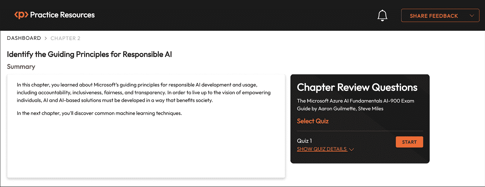

# 2

# 确定负责任人工智能的指导原则

虽然人工智能可以做些惊人的事情，但它也有可能成为真正可怕事物的组成部分——这正是本章将试图解决的问题。

我们（作为从业者、开发者和消费者）如何防止有意或无意的恶意操纵？微软在其部分，已经制定了一套六项原则，用于负责任地开发和实施基于人工智能的解决方案。

微软将这些原则称为其**负责任人工智能的指导原则**。

本章将涵盖的目标和技能包括以下内容：

+   描述问责制的考虑因素

+   描述包容性的考虑因素

+   描述可靠性和安全的考虑因素

+   描述公平性的考虑因素

+   描述透明度的考虑因素

+   描述隐私和安全的考虑因素

这些原则分为两个类别或视角：**伦理**和**可解释**。我们将探讨这两个类别以及原则如何融入其中。到本章结束时，你应该能够阐述人工智能如何以负责任的方式进行开发和实施。

# 理解伦理原则

负责任的人工智能使用和发展的第一个类别或视角是伦理原则。从伦理角度来看，人工智能的实施应包括以下考虑因素：

+   要求设计者和实施者承担问责制

+   展现包容性

+   确保输出不会造成伤害

让我们看看这些伦理考量如何映射到微软的原则上。

## 描述问责制的考虑因素

微软在负责任的人工智能开发中的问责制原则强调在整个人工智能开发生命周期中透明度、公平性和监督的重要性。这一原则强调了设计者和部署人工智能系统的个人和组织对这些系统的行为和决策负责的必要性，尤其是在它们向更大自主性发展的过程中。

为了实现问责制，微软提倡在组织内部建立内部审查机构，以提供对人工智能开发和部署的监督、见解和指导。这些机构在确保人工智能系统符合伦理和法律标准，以及与组织的治理和组织原则保持一致方面发挥着关键作用。

微软的问责制原则的核心是要求组织评估人工智能系统对个人、组织和社会的影响。这包括在开发早期完成影响评估，以评估与系统预期用途相关的潜在风险和伦理考量。还强制要求定期审查和更新这些评估，以确保持续遵守负责任的人工智能原则。

微软强调与利益相关者就人工智能系统的能力和局限性进行透明度和沟通的重要性。这包括向客户提供关于系统预期用途的文档以及证明其适用性的证据。在缺乏证据或证据反驳系统适用于特定用途的情况下，微软主张采取及时行动纠正问题并与客户进行透明沟通。

责任原则涵盖了确保人工智能生命周期中透明度、公平性和道德监督的全面框架。通过遵守这些原则，微软旨在与利益相关者建立信任，并促进人工智能技术的负责任使用，以造福社会。

## 描述包容性的考虑因素

包容性人工智能要求考虑全人类的所有经验。采用包容性设计实践使开发者能够主动识别和解决可能无意中排除人们的潜在障碍。

人工智能系统的目的是赋权并激发每个人，为社会的所有部门带来利益，无论其身体能力、性别、性取向、种族或其他因素。微软对负责任的人工智能发展中包容性的承诺强调了设计和部署人工智能技术以促进多样性、公平性和包容性的必要性。这一原则反映了微软致力于创建对所有人（无论其背景、身份或能力）都易于使用且有益的人工智能系统的承诺。包容性的例子可能包括利用语音转文本、文本转语音和视觉识别技术来赋权有听力、视觉和其他感官障碍的人。积极寻求包括其他通常被忽视的人的方法是包容性设计的关键组成部分。

微软的包容性原则的核心是承认人工智能有可能加剧或缓解现有的不平等。通过在人工智能开发中优先考虑包容性，微软旨在对抗历史偏见，并促进对所有用户公平和公正的结果。这涉及到在整个人工智能生命周期中考虑不同人口群体的多样性和观点。

微软在人工智能开发中实现包容性的关键方面是促进负责创建人工智能技术的团队内部的多样性。通过培养代表各种背景、经验和观点的多元化团队，微软旨在减轻偏见风险，并确保人工智能系统在设计时考虑到包容性。这种多样性使团队能够识别和解决可能被忽视的潜在偏见和盲点。在设计核心技术时展现的这种包容性类型应扩展到利用人工智能创造解决方案的组织中，以确保考虑多个观点。

此外，微软倡导包容性设计实践，优先考虑所有个体的可访问性和可用性，包括那些有残疾或特殊需求的个体。这包括将替代输入方法、语音识别和屏幕阅读器等特性集成到人工智能系统中，以确保具有不同能力的个体的可访问性。

此外，微软强调在整个人工智能开发过程中与多元化的利益相关者进行互动，包括社区组织、倡导团体以及来自边缘化社区的个体。这种合作有助于收集反馈和洞察，以指导人工智能技术的设计和部署，确保对所有用户的需要和担忧做出响应。

微软对负责任人工智能发展中包容性的承诺强调了其致力于构建包容、公平且对所有个体可访问的人工智能技术的承诺。通过在人工智能生命周期中优先考虑多样性、公平性和包容性，微软旨在利用人工智能的潜力推动积极的社会变革，并为所有人创造一个更加包容的未来。

## 描述可靠性和安全性的考虑因素

微软关于负责任人工智能的可靠性原则和安全原则是确保人工智能技术不仅可靠，而且对用户和社会整体来说是安全的基石。这一原则强调开发能够持续提供准确结果并最大限度地减少潜在伤害或意外后果的人工智能系统的必要性。其核心反映了微软致力于构建用户可以信任并自信依赖的人工智能技术的承诺。

这一原则的关键方面是组织必须建立的严格测试和验证流程，以确保人工智能系统在各种场景和条件下安全运行。通过整合 A/B 测试和冠军/挑战者方法等方法，组织可以有效地评估其人工智能系统的性能，并在部署前识别和解决潜在的安全隐患或偏见。

微软强调了在人工智能系统中优先考虑安全性和减轻对用户和社会风险的重要性。这包括积极主动地识别和缓解安全风险，包括偏见、错误或安全漏洞，以增强用户对人工智能驱动解决方案的信任和信心。通过推广安全性，微软旨在构建不仅按预期运行，而且优先考虑用户福祉的人工智能技术。

通过优先考虑透明度和问责制，微软强烈倡导记录人工智能系统背后的决策过程、数据来源和算法逻辑。这种透明度使得有效的监督和可审计性成为可能，使用户和监管机构能够对人工智能系统（及其创造者）的行为和决策负责。

持续监控和评估是微软维护人工智能系统可靠性和安全性的战略的关键组成部分。通过实施反馈机制和持续改进流程，组织可以实时检测和解决潜在的问题或故障，确保人工智能系统在其整个生命周期中保持可靠和安全。这种积极主动的方法培养了一种持续学习和适应的文化，从而随着时间的推移进一步增强了人工智能技术的可靠性和安全性。

在人工智能开发中致力于可靠性和安全性强调了构建值得信赖和可靠的 AI 系统的重要性。通过优先考虑透明度、问责制和持续改进，微软和其他组织可以增强用户对人工智能驱动解决方案的信任和信心，同时最大限度地减少伤害或意外后果的风险。

这些原则有助于确保人工智能解决方案以符合伦理的方式开发，优先考虑包容性和避免伤害，以造福使用这些系统的人们。在下一节中，我们将探讨有助于人们理解人工智能解决方案如何得出结论的原则。

# 理解可解释的原则

在人工智能领域，可解释性的概念对于数据科学家、审计员和商业决策者至关重要。它使这些利益相关者能够理解和证明人工智能系统做出的决策及其背后的推理。在微软的负责任人工智能原则中，可解释性涵盖了以下三个原则：

+   公平性，即系统做出不歧视或基于性别、种族、宗教或性取向等标识符对群体或个人施加偏见的决策能力

+   理解模型如何得出其结果的透明度

+   保护数据输入和输出以保护组织和个人数据的隐私

可解释性对于确保遵守公司政策、行业标准和国家法规至关重要。对于数据科学家来说，它涉及能够解释他们如何达到特定的准确度水平以及哪些因素影响了结果。审计员需要能够验证 AI 模型以符合公司政策的工具，而商业决策者则通过提供透明的模型来建立信任。

## 描述公平性的考虑因素

在负责任的人工智能开发中，微软的公平性原则对于确保 AI 系统不会基于性别、种族、性取向或宗教歧视或对个人表现出偏见至关重要。为了实现这一点，微软提供了一份 AI 公平性清单，为 AI 系统开发的各个阶段提供指导，包括构思、原型设计、构建、发布和演进。此清单包括建议的尽职调查活动，以最大限度地减少系统中的不公平性影响。

进一步阅读

组织被鼓励在整个开发过程中使用 Fairlearn 工具包来仔细评估其模型的公平性，使公平性评估成为数据科学工作流程的一个组成部分。您可以在[`fairlearn.org/`](https://fairlearn.org/)了解更多关于 Fairlearn 的信息，并阅读微软 Fairlearn 原始研究论文[`www.microsoft.com/en-us/research/publication/fairlearn-a-toolkit-for-assessing-and-improving-fairness-in-ai/`](https://www.microsoft.com/en-us/research/publication/fairlearn-a-toolkit-for-assessing-and-improving-fairness-in-ai/)。

微软的公平性原则强调了其对促进所有个体，无论其背景或身份如何，都享有平等机会和结果的重要性。它强调需要减轻偏见并确保人工智能技术不会加剧社会中的现有不平等。这包括在整个 AI 生命周期内采取主动措施来识别、减轻和监控偏见，包括实施公平感知算法和进行偏见评估。

持续的监控和评估在实时检测和解决潜在的偏见或不公平性方面发挥着至关重要的作用。在其负责任 AI 标准中，微软强调了反馈机制、报告和持续改进的重要性，以确保 AI 系统在其整个生命周期内保持公平和公正。通过培养持续学习和适应的文化，微软旨在随着时间的推移提高人工智能技术的公平性和公正性。

进一步阅读

您可以在[`query.prod.cms.rt.microsoft.com/cms/api/am/binary/RE5cmFl`](https://query.prod.cms.rt.microsoft.com/cms/api/am/binary/RE5cmFl)阅读微软的负责任 AI 标准文档。

透明度和问责制是微软确保人工智能系统公平性的基本组成部分。微软倡导记录数据来源、决策过程和算法逻辑，以实现有效的监督和可审计性。通过促进对公平性算法的理解，采用微软的负责任人工智能原则为用户和监管机构提供了对人工智能系统行动和决策进行问责的手段。

## 描述透明度的考虑因素

到目前为止，您已经看到透明度的概念贯穿于微软的几个负责任的人工智能原则中。微软的负责任人工智能原则中的透明度原则对于确保人工智能系统具有问责性、可理解性和可信度至关重要。它涉及提供对人工智能系统内部运作的可见性，包括其数据来源、决策过程和算法逻辑。通过促进透明度，微软旨在赋予用户、监管机构和利益相关者理解和审查人工智能系统的能力，从而在它们的运作中培养信任和问责制。

在其核心，微软的透明度原则承认用户了解人工智能系统如何影响他们的决策的权利。这包括理解影响人工智能模型推荐、预测和结果的因素，以及人工智能模型被用来产生这些结果的事实。透明度使用户能够做出明智的决定并评估人工智能驱动解决方案的可靠性和公平性。

透明度扩展到记录用于训练人工智能模型的数据，确保其质量、多样性和代表性。这使用户能够评估人工智能系统在不同人口统计和用例中的鲁棒性和泛化能力。此外，透明度还包括用于数据收集、标注和处理的手段，确保在处理敏感信息时的问责性和公平性。

微软倡导关于人工智能系统的清晰和易于理解的沟通，以促进不同受众之间的理解。这包括提供易于理解和导航的文档、解释和用户界面。通过消除人工智能技术的神秘感，微软旨在弥合技术专家和非专家之间的差距，促进人工智能生态系统的透明度和包容性。

微软的透明度原则重申了公司致力于构建对用户和利益相关者透明、问责和可理解的人工智能系统的承诺。通过在整个人工智能生命周期中优先考虑透明度，微软寻求增强信任、促进合作并推动负责任的人工智能发展。

## 描述隐私和安全的考虑因素

随着我们的个人和商业生活越来越在线化，数据（以及确保其安全和我们的隐私）变得越来越重要的商品。微软的负责任 AI 原则中的隐私和安全至关重要，确保 AI 系统能够维护个人隐私权，并保护敏感信息免受未经授权的访问或滥用。这一原则强调在整个 AI 生命周期中保护个人数据的重要性，从数据收集到处理和存储。通过优先考虑隐私和安全，微软旨在构建能够赢得用户和利益相关者信任和信心的 AI 系统。

隐私和安全原则承认在数字时代保护个人隐私权利的重要性。这包括实施强大的安全措施以防止数据泄露、未经授权的访问和其他可能损害个人信息的网络安全威胁。通过保护隐私，微软旨在维护道德标准和法律义务。

微软支持隐私保护技术和实践，这些技术和实践使 AI 系统能够在不损害个人隐私的情况下分析和从数据中提取见解。这包括**差分隐私**、**联邦学习**和**同态加密**等技术，这些技术能够在保护敏感信息机密性的同时进行数据分析。通过整合隐私保护技术，微软旨在减轻隐私风险并增强用户对 AI 驱动解决方案的信心。

同态加密是什么？

同态加密是一种新型加密技术，允许在不对数据进行实际解密的情况下对加密数据进行计算和计算。由于数据没有解密，潜在的敏感数据不会暴露。

隐私和安全考虑不仅限于技术措施，还包括组织政策、治理框架和法规遵从。微软强调采用隐私设计方法的重要性，即在 AI 系统的设计和开发之初就将隐私考虑因素嵌入其中。这包括进行隐私影响评估、实施增强隐私的控制措施，并确保数据实践和使用的透明度。

差分隐私是什么？

差分隐私是一种混淆技术，它将统计噪声引入每个结果以掩盖数据点——通常是可能用于识别个人或群体的人的数据点。噪声足够小以保护个人，但又不至于对统计产生重大影响。有关差分隐私概念的更多信息，请参阅[`cloudblogs.microsoft.com/opensource/2020/05/19/new-differential-privacy-platform-microsoft-harvard-opendp/`](https://cloudblogs.microsoft.com/opensource/2020/05/19/new-differential-privacy-platform-microsoft-harvard-opendp/)。

透明度和问责制在隐私和安全领域也发挥着重要作用。在数据处理的各个阶段，透明度都是必要的，包括关于数据收集、处理目的和用户权利的明确沟通。

# 摘要

在本章中，你了解了微软负责的 AI 开发和使用的指导原则，包括问责制、包容性、公平性和透明度。为了实现赋权个人的愿景，AI 和基于 AI 的解决方案必须以造福社会的方向发展。

在下一章中，你将了解常见的机器学习技术。

# 考试准备练习 – 章节复习题

除了对关键概念有扎实的理解外，能够在时间压力下快速思考是一项帮助你通过认证考试的重要技能。这就是为什么在学习的早期阶段就培养这些技能是关键。

章节复习题旨在通过学习并复习每个章节的关键概念来逐步提高你的应试技巧。你将在每个章节的末尾找到这些复习题。

在继续之前

如果你没有 Packt 图书馆订阅或没有从 Packt 商店购买这本书，你需要解锁在线资源才能访问考试准备练习。解锁是免费的，只需进行一次。要了解如何操作，请参阅名为 *第十二章** 的章节，*访问在线资源*。

要打开本章的章节复习题，请执行以下步骤：

1.  点击链接 – [`packt.link/AI-900_CH02`](https://packt.link/AI-900_CH02).

    或者，你可以扫描以下二维码 (*图 2.1*):

图 2.1– 为已登录用户打开章节复习题的二维码

1.  一旦登录，你将看到一个类似于 *图 2.2* 中所示的页面：

图 2.2 – 第二章的章节复习题

1.  准备就绪后，开始以下练习练习，多次重新尝试测验。

## 考试准备练习

对于前三次尝试，不要担心时间限制。

### 尝试 1 次

第一次尝试，目标至少为 **40%**。查看你答错的答案，并再次阅读章节中的相关部分，以填补学习上的差距。

### 尝试 2 次

第二次尝试，目标至少为 **60%**。查看你答错的答案，并再次阅读章节中的相关部分，以修复任何剩余的学习差距。

### 尝试 3 次

第三次尝试，目标至少为 **75%**。一旦得分达到 75%或更高，你就可以开始练习时间管理。

小贴士

你可能需要超过 **三次** 尝试才能达到 75%。这是可以的。只需复习章节中的相关部分，直到达到那里。

## 练习时间管理

你的目标是保持得分不变，同时尽可能快地回答这些问题。以下是你下一次尝试应该看起来像的例子：

| **尝试** | **得分** | **用时** |
| --- | --- | --- |
| 尝试 5 | 77% | 21 分 30 秒 |
| 尝试 6 | 78% | 18 分 34 秒 |
| 尝试 7 | 76% | 14 分 44 秒 |

表 2.1 – 在线平台上的样本时间练习练习

注意

上表中显示的时间限制只是示例。根据网站上的测验时间限制，每次尝试时自行设定时间限制。

每次新的尝试，你的得分应保持在**75%**以上，同时完成所需的时间“应减少”。重复尝试，直到你觉得自己能够自信地应对时间压力。

# 第二部分：描述 Azure 机器学习的根本原理

在了解了一些 AI 的基础概念和工作负载之后，现在是时候深入研究机器学习背后的原理——更具体地说，是 Azure 上的机器学习。你将了解机器学习概念和能力。

本部分包括以下章节：

+   *第三章*, *识别常见的机器学习技术*

+   *第四章*, *描述核心机器学习概念*

+   *第五章*, *描述 Azure 机器学习功能*
