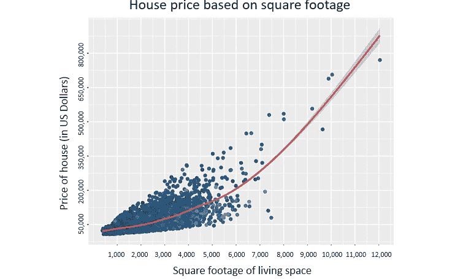
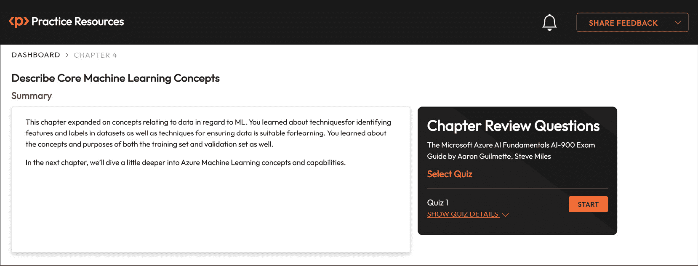

# 4

# 描述核心机器学习概念

在前面的章节中，您已经接触了一些基本的**机器学习**（**ML**）概念，包括各种模型以及特定类型的模型可能有用的场景。在本章中，我们将探讨围绕机器学习中实际使用的数据的概念。

本章我们将涵盖以下目标和技能：

+   在机器学习数据集中识别特征和标签

+   描述训练和验证数据集在机器学习中的应用

到本章结束时，您应该能够清楚地阐述围绕机器学习的术语。

# 在机器学习数据集中识别特征和标签

如您在*第三章*中学习到的，“*识别常见的机器学习技术*”，**特征**和**标签**是定义您在训练机器学习模型时使用的数据的两个基本概念。

特征是所观察到的任何事物的单个可测量属性或特征。在机器学习模型中，特征用作输入变量。这些是您用于做出预测的数据点。例如，如果您试图预测房屋的价格，特征可能包括卧室数量、房屋的平方英尺大小、所在社区、距离消防站的远近，或当地的财产税率。特征由您数据集中的独立变量表示，您认为这些变量将帮助您对目标变量做出准确的预测。

另一方面，**标签**是您试图预测或分类的输出。

在**监督学习**（**SL**）中，每个训练示例都包含一个标签。以房屋定价为例，标签将是房屋的实际售价。

在分类任务中，标签是分配给数据点的类别。例如，在一个训练用于识别电子邮件是否为垃圾邮件的机器学习模型中，标签可能是“`垃圾邮件`”和“`非垃圾邮件`”。

在本节中，我们将更深入地探讨在您的数据集中处理特征和标签。

## 在数据集中识别特征

在机器学习数据集中识别特征涉及理解可用于预测结果（目标变量）的变量。您可以通过许多方法来缩小对您的机器学习模型重要性的范围。

让我们在本节中逐一介绍。

### 理解问题域

首先，理解问题的领域或上下文。这涉及到研究该领域，以了解可能影响结果的因素。例如，如果您正在从事预测房价的项目，潜在的特征可能包括房屋的大小、卧室数量、浴室数量、建造年份、位置、距离消防站的距离、该地区的公共图书馆数量，以及当地教育系统的统计数据。

在进行这一步骤时，与领域专家交谈以了解重要变量可能是有帮助的。你也可以寻找现有的文献、研究或研究，以确定在类似问题中使用的常见预测器或变量。

### 收集数据

从相关来源收集数据。这可能包括数据库、报告、文件、连接到行业数据源的 API，或直接测量。你收集的数据将包括各种属性或变量。你应该努力确保收集到的数据与问题领域相关，并包括你在对主题研究中所确定的变量。

例如，如果你正在构建一个预测房价的模型，你可能会查看特定邮编区最近房屋销售价格的数据源。由于你已经确定了其他特征，如学校系统评级以及到消防站和图书馆的距离，你需要获取这些数据——这很可能是来自不同的数据源。你需要绘制每栋房子到最近图书馆和消防站的距离，并添加你将用于训练模型的数据库集。

### 探索数据

进行**探索性数据分析**（EDA）以了解数据。这可以包括总结数据的统计信息、可视化变量之间的分布和关系，以及识别任何模式或异常。工具如直方图、散点图和相关性矩阵在这里可能很有用。你还应该使用统计摘要（如均值、中位数、众数和标准差）来了解每个变量的分布，并确定存在异常值的地方。

以下是一个散点图的示例：

图 4.1 – 显示房价与平方英尺之间关系的散点图

### 选择相关变量

你的数据集中并非所有变量都与预测结果相关或必要。根据你的领域知识和初步数据探索，选择可能影响目标变量的变量。与目标变量相关联的变量通常是特征的良好候选者。

在识别变量时，除了考虑变量的统计意义外，还重要的是要考虑变量的实际意义。例如，回到住房的例子，你可能已经了解到一栋房子靠近图书馆可能影响不大。在探索性数据分析（EDA）过程中，你也可能发现其他看似重要的变量，例如靠近购物中心或储藏室的数量。

在审查你的初步数据后，你可能会发现你有缺失的属性或值，或者某些数据可能与问题上下文无关。考虑丢弃这些数据，因为它们可能会降低你模型的有效性。继续迭代，直到你确定相关的特征。

### 特征工程

这涉及到通过各种技术（如分箱、聚合和属性组合）从现有特征中创建新特征。例如，从一个包含日期的数据集中，你可能可以提取出星期几、月份或年份等特征。或者，你可能会决定将多个日期范围合并成更少的特征。

在房价示例中，你可能会决定按月或周汇总数据，而不是按日拥有单个房子的价格。这可能会减少一些噪声，并有助于更容易地关注趋势。

高级技术，如多项式特征，可以帮助捕捉非线性关系。在一个房子中，一个非线性例子可能是浴室数量和壁橱数量之间的关系。创建多项式特征的一种方法是将两个无关特征相乘。在这个例子中，你可以将浴室数量和壁橱数量相乘：一个有 3 个浴室和 7 个壁橱的房子可以有一个值为 21 的新特征。

特征工程还可能涉及转换变量，如缩放或归一化，以使它们更适合机器学习模型。例如，你可能会决定将房价四舍五入到最接近的$25,000，或者根据卧室数量将房子分组，例如 0-2、3-4、5-6 和 7+。这些技术中的每一个都可以用来帮助简化数据并帮助产生更清晰的预测集。

### 处理缺失值

决定如何处理潜在特征中的缺失数据。你可能用平均值或中位数（插补）来填充缺失值，丢弃它们，或者使用模型来预测并填充它们。务必考虑缺失数据的原因，以确定它是随机还是非随机的。

### 移除无关或冗余特征

消除与结果无关或包含在其他特征中信息的特征。冗余或不相关的特征可能会引入噪声并导致过拟合。随着你开发模型，你可能会发现你需要删除特征来帮助细化模型以产生更好的结果。

### 咨询专家

如果可能的话，咨询领域专家以验证你的特征和数据源选择。他们可能会提供关于哪些变量最有影响力的见解，或者建议你考虑一些你尚未考虑的变量，以及指出你数据源选择中任何已知的偏差。

### 使用特征选择技术

存在着一些自动特征选择技术，如**前向选择**、**后向消除**和**递归特征消除**，可以根据统计测试或模型性能帮助识别最重要的特征：

+   **正向选择**：正向选择是一种特征选择技术，通过逐个添加特征来构建模型，从最显著或最有潜力的特征开始。这个过程会持续进行，直到满足停止标准，比如达到预定的特征数量，或者直到新特征的添加不再显著提高模型性能。例如，在我们的房屋定价示例中，这可能意味着从对房屋价格有影响的、最有潜力的总面积特征开始，然后在下一次迭代中添加卧室数量。

+   **反向消除**：这仅仅是正向选择的相反过程。不是添加特征直到模型不再变化，而是从所有特征开始训练一个模型，然后移除特征直到满足停止标准——比如剩余特征的数量，或者直到移除特征不再显著提高模型性能。

+   **递归特征消除**：与反向消除类似，递归特征消除是一个从完整特征集开始然后移除特征的过程。而反向消除只是简单地移除最不显著的特征，递归特征消除则是根据特征的重要性和与其他特征的交互来移除特征。

你需要用领域知识、专家见解和数据理解来调整任何自动化的特征选择工具，以确保你选择的是最合适的特征集。

记住——模型开发是一个迭代的过程。随着你构建和发展你的模型，你可能会发现某些特征比其他特征更重要，或者某些特征可以被移除而不降低模型性能（就准确性而言）。

## 在数据集中识别标签

在机器学习数据集中识别标签涉及理解模型旨在预测的结果或目标变量。以下是你在数据集中识别标签的方法。

### 定义目标

首先，明确定义你的机器学习项目的目标。你是试图预测一个连续值（回归）、将数据分类到类别中（分类），还是识别相似实例的组（聚类）？你的目标将指导你的标签应该是什么。

理解数据

检查你的数据集并理解每个变量。在监督学习（SL）中，标签是正在预测的变量，这可能是事件的结果、分类类别或序列的未来值。

### 识别目标变量

在大多数用于监督学习的数据集中，通常有一个特定的列作为目标变量（标签）。这可能是一个表示二分类问题中“是”或“否”的列，回归问题中的数值，或多类分类问题中的类别标签。

### 咨询领域专家

如果不清楚应该使用哪个变量作为标签，请咨询您的机器学习项目的领域专家或利益相关者。他们可以根据数据集、业务成果和研究目标提供有关哪些预测最有价值的见解。

### 探索数据

使用 EDA（探索性数据分析）更好地理解潜在的标签。例如，如果您正在处理一个旨在预测电子邮件是否为垃圾邮件的数据集，标签可能是一个表示“垃圾邮件”或“非垃圾邮件”的列。寻找一个或其他的输出，其中包含符合您试图解决的问题的类别或二元数据。

### 检查数据文档

如果您的数据集附带文档或**数据字典**，请查阅这些材料以了解每个变量的作用。通常，文档会明确指出哪个列是预测的目标变量（标签）。如果文档没有识别标签，它可能提供有关现有字段或列名的见解，以帮助您确定标签。

寻找预标记数据；在某些情况下，特别是在 SL 任务中，数据集已经标记。这意味着对于每条记录，都有一个之前已确定的伴随标签。这在用于训练模型的数据库中很常见，其目标是学习输入特征和标签之间的关系。

### 考虑问题类型

您的标签性质取决于您试图使用机器学习解决的问题类型。

对于分类，标签是分类的，代表不同的类别（例如，对于二元分类处理电子邮件是否为垃圾邮件的情况，“垃圾邮件”或“非垃圾邮件”；对于多类分类识别图片中的动物，“猫”、“狗”和“鸟”）。

对于回归，标签是连续值（例如房价或温度）。

对于聚类（一种**无监督学习**（**UL**）任务），不提供标签，目标是通过对相似数据点的分组来发现它们。

### 清洗数据

确保您的标签数据干净且一致。这可能涉及纠正错误标记、处理缺失值，并确保标签以可用于建模的格式（例如，将字符串转换为数值类别）。

在开发您的模型时，您可能需要重新审视并重新评估您选择的标签（就像您可能需要重新审视您选择的功能一样）。您的模型在预测这些标签方面的有效性将帮助您了解是否已识别正确的标签或是否需要调整。

# 描述在机器学习中如何使用训练集和验证集

在机器学习中，**训练**集和**验证**集是模型开发阶段中使用的整体数据集的子集。它们的作用是不同的但互补的，旨在创建一个能够对新、未见数据做出准确预测的模型。

你可能记得在我们讨论将数据集划分为部分——一部分用于训练模型，另一部分“保留”或“预留”用于测试预测时，在*第三章**中看到的训练集和验证集的概念。这些分别是训练集和验证集。

## 训练集

这是用于训练 ML 模型的实际数据。模型通过这些数据学习如何进行预测或决策。训练集用于拟合模型的参数，例如**神经网络**（**NN**）中的权重或线性回归中的系数。

在 ML 中，训练集是用于训练模型的实际数据集。训练涉及调整模型的参数以最小化错误，通常通过称为学习的过程来完成。训练集的大小和质量可以显著影响 ML 模型的表现。较大的训练集提供了更多模型可以从中学习的示例，当模型用于对新数据进行预测时，可能有助于提高泛化能力。然而，数据也必须代表模型将要应用的现实世界场景，包括广泛的示例和变化。

在训练阶段，模型会迭代地调整其参数，以减少预测输出与实际输出之间的差异，这种差异由特定的数学损失函数定义。这个过程可能因模型类型和学习算法的不同而有所差异。例如，在 SL 中，训练集中的每个示例都包含输入特征和相应的目标标签。模型使用这些成对的数据来学习数据中的潜在模式。在 UL 中，由于没有标签，模型试图仅基于输入特征来学习数据的潜在结构。

训练过程（无论是 SL 还是 UL）的有效性在很大程度上取决于训练数据的质量、训练集中数据量的大小、所选特征的相关性以及模型对所涉及问题的适用性。如果可能的话，使用实际数据（而非合成数据）进行训练是首选的，因为这有助于模型了解自然异常值和变异性。然而，有时由于隐私或其他负责任的**人工智能**（**AI**）开发原则，实际数据可能不可用。

生成自己的训练数据

你可能还想考虑请求一个**生成式 AI**（**GenAI**）模型为你创建训练数据。这可能有助于你理解特征之间的关系，或者在潜在的数据集中包含个人信息时保护隐私。然而，由 AI 模型生成的训练数据也可能放大用于训练生成模型的原始数据中的任何偏差，导致训练数据出现偏差或不切实际。在任何情况下，当使用 GenAI 时，你需要采取预防措施，以确保数据能够代表你试图实现的目标。

通常，训练集占整个数据集的较大比例，通常在 60%到 80%之间。目标是向模型提供一组多样化的、全面的示例，这些示例反映了模型将被应用的现实世界场景。

如果你正在问自己，“我如何知道模型是否训练得足够好？”或者“我何时知道训练完成？”那么这就是验证集发挥作用的地方。

## 验证集

此数据集的子集用于在调整模型无法自动调整的**超参数**（设置或配置，这些不是从数据中学习的）时，提供一个对训练数据集上模型拟合的无偏评估。验证集作为测试集的代理，因为它不用于训练模型，因此可以帮助估计模型对未见数据的泛化程度。通常，验证集可能占整个数据集的 20%到 30%。

避免过度拟合（有时也称为过度训练）至关重要，过度拟合是指模型在训练数据上表现良好，但在新的、未见过的数据上表现不佳。

什么是超参数？

机器学习模型超参数是模型外部的配置设置，它影响其学习过程。与从训练数据中学习的模型参数不同，超参数是由用户预先定义的，并影响模型复杂度、正则化和优化等方面。例如，梯度下降中的学习率、决策树的深度或神经网络中的隐藏层数量。超参数调整对于优化模型性能至关重要。不过，不用担心——从*AI-900*考试的角度来看，重要的概念是超参数是模型外部的。

使用验证集有助于检测过度拟合等问题。过度拟合发生在模型学习训练数据中的噪声或随机波动，而不是实际的潜在模式。通过在验证集上评估模型，你可以确定何时发生过度拟合，并采取措施减轻它，例如简化模型、应用正则化技术或获取更多训练数据。

此外，验证集允许以受控的方式比较不同的模型和配置。在模型在训练集上训练后，它在验证集上的表现提供了一个无偏的评价。只有在模型根据其在验证集上的表现进行优化和选择后，才应该在测试集上对其进行测试，以评估其对新、未见数据的泛化能力。这种方法确保了模型的最终评估是基于在训练或验证阶段未使用的数据，从而提供了对其预测性能和泛化能力的更准确衡量。

该过程通常涉及在训练集上训练模型，然后评估其在验证集上的性能。根据这一评估，可以对模型的配置进行调整。一旦模型在验证集上表现满意，它就可以在单独的测试集上测试，以进一步评估其在完全未见数据场景中的性能。这种做法有助于确保模型不仅仅是记住训练数据，而是在学习可泛化的模式。

# 摘要

本章扩展了与机器学习中的数据相关的概念。你学习了在数据集中识别特征和标签的技术，以及确保数据适合学习的技术。你还学习了训练集和验证集的概念和目的。

在下一章中，我们将更深入地探讨 Azure 机器学习的概念和能力。

# 考试准备练习 – 本章复习题

除了对关键概念有扎实的理解外，能够在时间压力下快速思考是一项帮助你通过认证考试的关键技能。这就是为什么在学习的早期阶段就培养这些技能至关重要。

本章复习题旨在通过学习每一章并复习章节中的关键概念来逐步提高你的应试技巧。你将在每一章的末尾找到这些复习题。

在你继续之前

如果你没有 Packt 图书馆订阅或没有从 Packt 商店购买这本书，你需要解锁在线资源以访问考试准备练习。解锁是免费的，并且只需要进行一次。要了解如何操作，请参阅名为*第十二章**的章节，*访问在线资源*。

要打开本章的复习题，请执行以下步骤：

1.  点击链接 – [`packt.link/AI-900_CH04`](https://packt.link/AI-900_CH04)。

    或者，你可以扫描以下二维码（*图 4.2*）：

图 4.2 – 为已登录用户打开本章复习题的二维码

1.  登录后，你会看到一个类似于 *图 4.3* 所示的页面：

图 4.3 – 第四章复习题

1.  准备就绪后，开始以下练习，多次重新尝试测验。

## 考试准备练习

对于前三次尝试，不必担心时间限制。

### 尝试 1

第一次尝试，目标至少达到 **40%**。查看你答错的答案，并再次阅读章节中的相关部分，以修复你的学习差距。

### 尝试 2

第二次尝试，目标至少达到 **60%**。查看你答错的答案，并再次阅读章节中的相关部分，以修复任何剩余的学习差距。

### 尝试 3

第三次尝试，目标至少达到 **75%**。一旦得分达到 75% 或以上，你就可以开始练习时间管理。

小贴士

你可能需要超过 **三次** 尝试才能达到 75%。这没关系。只需复习章节中的相关部分，直到达到目标。

## 练习时间管理

你的目标是保持分数不变，同时尽可能快地回答这些问题。以下是你下一次尝试的一个示例：

| **尝试** | **分数** | **用时** |
| --- | --- | --- |
| 尝试 5 | 77% | 21 分 30 秒 |
| 尝试 6 | 78% | 18 分 34 秒 |
| 尝试 7 | 76% | 14 分 44 秒 |

表 4.1 – 在线平台上的样本时间练习

备注

上表中显示的时间限制只是示例。根据网站上的测验时间限制，为每次尝试设定自己的时间限制。

每次新的尝试，你的分数应保持在 **75%** 以上，而完成所需的时间“应减少”。重复尝试，直到你觉得自己能够应对时间压力。
