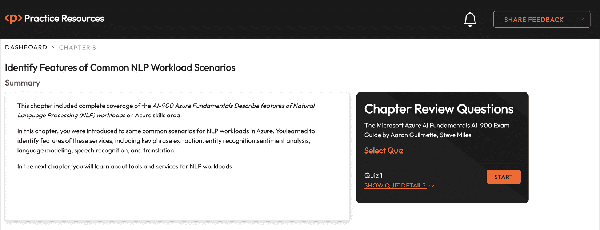

# 8

# 识别常见 NLP 工作负载场景的特征

在 *第七章* 中，*识别用于计算机视觉任务的 Azure 工具和服务*，你发现了使用 Azure AI Vision Studio 工具的 Azure AI 视觉服务，然后你学习了 Azure AI Video Indexer 服务。

在本章中，你将学习识别 **自然语言处理**（**NLP**）能力的特点，如 *关键短语提取*、*实体识别*、*情感分析*、*语言模型*、*语音识别* 和 *翻译*，这些都是可以应用于 Azure 的常见 NLP 工作负载场景。

本章我们将涵盖的目标和技能包括以下内容：

+   NLP 简介

+   识别关键短语提取的特征和用途

+   识别实体识别的特征和用途

+   识别情感分析的特征和用途

+   识别语言模型的特征和用途

+   识别语音识别和合成的特征和用途

+   识别翻译的特征和用途

到本章结束时，你应该能够识别自然语言处理（NLP）AI 服务的特征和用途。

# NLP 简介

**NLP** 是 **人工智能**（**AI**）的一个领域，它处理口头和书面语言的意义。这利用了机器分析、理解、推断和操纵类似人类语言交互的能力。通过 NLP，构建和部署了 *算法* 和 *计算模型*，使计算机能够根据特定意义理解、解释和创造人类语言。

人工智能学科并非新生事物，它基于许多年前以来的计算机科学。**机器学习**（**ML**）的历史和传承根植于数学、统计学和逻辑学科。

在过去，直到最近，我们在表达 AI 主题时使用 *认知* 这个术语；这是为了反映人类认知能力与机器模拟这些目标之间的紧密关系。有些人可能将 AI 视为一个“营销”或“商业”术语，用来描述 ML 学科的公共面孔。

我们应该明白，AI 是一个包含术语，它本身有 **深度学习**（**DL**）作为一个子学科。AI 描述了用机器“模拟人类智能”。

图 *图 8**.1* 展示了 **NLP**、**AI**、**计算机科学**和 **人类语言** 之间的关系和交集：

图 8.1 – NLP 与其他学科的关系

现在你已经了解了 NLP 与其他相关学科的关系及其相互联系，你应该意识到一些 AI 领域，其中 NLP 可以提供支持。接下来，你将了解 NLP 的概念。

## NLP 概念

文本分析技术最早的例子是，一个文本体（*语料库*）使用统计分析来推断某种形式的语义意义。这种技术是对文档中出现的所有单词的 *总结* 和 *分类* 的一种形式；它可以提取出从主题和文档内容中得出的单词的共性和频率。这种“提取”和“处理”被称为 **标记化**，这是您在探索下一个分析技术时将了解的基础概念。

对于口语和书面语言意义的 NLP 技术和解决方案，始于对原始文本的 *处理*、*标记化* 和 *模型训练*。在通用 NLP 解决方案中，提供常见 NLP 任务（如 *文本分析*、*意见挖掘*、*机器翻译*、*总结* 和 *对话式 AI*）结果的组件可以按照 *图 8**.2 中的图表示：

图 8.2 – NLP 与其他学科的关系

**标记化**，如图 *8**.2 所示，是 NLP 概念的基础组成部分，也是您在提高 AI 技能过程中理解的核心。

**标记** 用于 *分解* 原始训练文本体（*语料库*）；每个不同的或部分单词，或单词组合，都是一个 **标记**。

以下短语，即微软的使命宣言，将被用作 **标记化** 的例子：

“*我们的使命是让地球上每一个人和每一个组织都能* *实现更多。*”

对于这个使命宣言示例短语，可以得出以下分解：

1.  `our`

1.  `mission`

1.  `is`

1.  `to`

1.  `empower`

1.  `every`

1.  `person`

1.  `and`

1.  `every`

1.  `organization`

1.  `on`

1.  `the`

1.  `planet`

1.  `achieve`

1.  `more`

注意，每个单词都表示为一个带有数字标识符的标记。您将从标记列表中看到，`to` 标记只使用 **一次**，但在语料库（*文本体*）中，单词`to`出现了 **两次**；这是因为它是一个常用词，数字标识符被用来替代实际单词值，就像编码中的 **变量** 可以存储 *字符串值* 一样。

*那么，这如何帮助我们呢？* 这意味着短语（*文本体，或语料库*）可以表示为以下标记：1，2，3，4，5，6，7，8，9，10，11，12，13，14，15。您将看到短语中有 **16 个单词**，但 **15 个标记**；这是因为 *标记 ID #4* 被用来表示单词“to”，它在短语中出现了两次。

为了进一步说明这一点，如果文本是一个简单的字符串，其中不同的单词只是重复出现，例如在 2006 年微软的史蒂夫·鲍尔默著名的会议口号“*开发者，开发者，开发者，开发者*”中，那么标记将如下所示：

1.  `Developers`

在这个例子中，与之前的微软使命宣言短语示例相比，只需要**一个标记**来表示整个语料库（文本体）。

当应用于机器需要从标记序列中输出短语的情况时，如果要求显示四个单词的短语，它就知道只需重复使用*标记 ID #1*四次；也就是说，在我们需要显示或表示单词“Developer”的地方，我们可以要求它使用标记。

现在你已经学习了一个简单的例子，你需要探索一些更高级和复杂的例子，使用**文本预处理规范化**（例如将文本转换为小写；删除标点符号）、**停用词去除**（例如*a*、*and*、*the*、*it*）、**n-gram**（例如*they had*、*it was*）和**词干提取**（例如*develop*、*developer*、*development*、*developing*）的概念。这些概念超出了本章内容的范围；然而，你可以在以下 URL 了解更多信息：

https://learn.microsoft.com/en-us/azure/machine-learning/component-reference/preprocess-text

既然你已经了解了 NLP 的概念，在下一节中，你将探索核心 NLP 应用场景。

## NLP 场景

NLP 可以提供的三个关键 AI 领域和任务如下：

+   **语言**

    +   语言检测

    +   关键短语提取（**讨论主题**）

    +   **命名实体检测**：从非结构化文本文档（如合同、支持案例）、公司以及频率中识别和提取提到的名称；人物类型、技能、位置、日期时间以及数量/数字

    +   情感分析和意见挖掘

    +   个人信息检测

    +   根据主题对文本进行分类

    +   摘要

    +   问答

    +   **会话语言理解**（**CLU**）

+   **语音**

    +   **文本到语音**（**TTS**）

    +   **语音到文本**（**STT**）

    +   语音翻译

    +   说话人识别

    +   语言识别

+   **翻译**

    +   文本翻译

    +   文档翻译

    +   定制翻译

你可以在以下 URL 了解更多关于这些 NLP 解决方案领域的信息：

+   语言服务：[`learn.microsoft.com/en-us/azure/ai-services/language-service/`](https://learn.microsoft.com/en-us/azure/ai-services/language-service/)

+   语音服务：[`learn.microsoft.com/en-us/azure/ai-services/speech-service/`](https://learn.microsoft.com/en-us/azure/ai-services/speech-service/)

+   译者：[`learn.microsoft.com/en-us/azure/ai-services/translator/`](https://learn.microsoft.com/en-us/azure/ai-services/translator/)

在本节中，你了解了 NLP 及其与其他相关学科的关系，以及学习了 NLP 的概念。在接下来的章节中，我们将涵盖 NLP 的三个核心领域：语言、语音和翻译。

# 识别关键短语提取的特征和用途

正如我们在“NLP 场景”部分所看到的，**关键短语提取**是 NLP 作为 AI 的**语言**领域可以提供的一项任务。

**关键词提取**可以提供以下用途：

+   从一系列文档或文本中，可以识别主要主题，例如从支持票证中提取关键信息

+   根据提取的主题对文档进行分类，例如根据包含的主题对支持票证进行分组

+   从文档中总结信息，例如一个长多响应支持票证线程

您应该注意，当您使用**Microsoft Copilot** AI 助手提供 M365 电子邮件摘要等“真实生活”场景时，可以观察到这些功能和能力。

以下是一个使用关键词提取功能示例的案例，该示例使用您刚才看到的支持票证作为用例。这提供了使用语言 AI 能力的摘要。

考虑以下支持票证：

“感谢您对我们安全漏洞事件提交的支持案例的回复。您代理人的及时回复非常令人感激。我们现在可以确认，该事件已经得到解决。请继续并关闭此案例。我可以请您完成一个最后的活动，那就是对我们的工程师互动进行反馈调查。”

从关键词提取任务中，可以从以下返回的短语中给出对前例的见解和上下文：

+   `回复`

+   `事件`

+   `互动`

+   `案例`

+   `支持案例提交`

+   `安全漏洞事件`

+   `及时回复`

+   `代理`

+   `最终活动`

+   `反馈调查`

+   `工程师`

从这些提供的短语中，可以快速概述主题领域；可以识别需要审查的方面，并可以采取任何认为必要的行动并进行跟进。

**Azure AI**的**关键词提取**功能由**Azure AI 语言服务**提供；您将在*第九章*中了解它，*识别用于 NLP 工作负载的 Azure 工具和服务*。

您可以在以下 URL 了解更多信息：

+   关键词提取概述：[`learn.microsoft.com/en-us/azure/ai-services/language-service/key-phrase-extraction/overview`](https://learn.microsoft.com/en-us/azure/ai-services/language-service/key-phrase-extraction/overview)

+   透明度说明：[`learn.microsoft.com/en-us/legal/cognitive-services/language-service/transparency-note`](https://learn.microsoft.com/en-us/legal/cognitive-services/language-service/transparency-note)

在本节中，您探讨了 NLP 主题关键词提取。在下一节中，您将学习 NLP 实体识别。

# 识别实体识别的功能和用途

正如我们在*自然语言处理场景*部分所看到的，**实体识别**，也称为**命名实体识别**（NER），是 NLP 作为 AI 的**语言**领域可以提供的一项任务。

实体识别能够从已识别的无结构文本（一个*语料库*）中识别和分类实体。

实体识别可以提供以下用途：

+   **识别人物**：例如从报纸文章/新闻源、社交媒体中提取姓名或名人，以及他们被提及或出现的频率

+   **识别国家、地点、地点和城市名称**：例如在线假日评论中提到的，值得参观的地点以及提及的次数；最常见的那些出现

+   **识别品牌**：例如社交媒体中提到的以及出现频率最高的那些

+   **识别公司和组织**：例如从合同协议中提取

+   **识别日期和时间**：例如从支持票中提取关键日期

+   **识别其他提取元素**：例如人物类型、头衔、技能、电话号码、电子邮件、IP 地址、数量/数字/金额

提取信息技术（如实体识别）的关键步骤如下：

+   文本预处理

+   文本中的实体识别

+   识别实体的分类

+   使用上下文进行分析

识别的实体可以归类为特定类型、子类型或类别；*表 8.1*列出了一些示例：

| **类型** | **子类型** | **示例** |
| --- | --- | --- |
| `DateTime` | `Date` | “`五月四日，2024 年`” 或 “`05/04/24`” |
| `DateTime` | `Time` | “`上午 10 点`” 或 “`10:00`” |
| `DateTime` | `DateRange` | “`五月四日到` `五月十四日`” |
| `Email` | `None` | `smiles@milesbettersolutions.com` |
| `Location` | `None` | “`雷丁`”，“`西雅图`” |
| `IP Address` | `None` | `127.0.0.1` |
| `Organization` | `None` | “`MilesBetter` `Pizza Company`” |
| `Person` | `None` | “`Steve` `Miles`”，“`SMiles`” |
| `Quantity` | `Number` | “`10`” 或 “`十`” |
| `Quantity` | `Percentage` | “`15%`” 或 “`十五百分比`” |
| `URL` | `None` | `https://www.linkedin.com/in/stevemiles70/` |

表 8.1 – NLP 实体类型和分类

**命名实体链接**（**NEL**），也称为**命名实体消歧**（**NED**）（**消歧**意味着区分相似事物，以便更清晰地解释或理解），也是可以用于自然语言处理信息检索和问答用例的功能；其目标是减轻歧义，提高从处理中提取的信息的质量、意义和相关性，并分析非结构化文本数据。以“**温迪的**”实体为例，这可能指的是**连锁餐厅**或**名叫温迪的人**的**财产**。实体链接的功能可以给出所指的是哪种特定“类型”的实体的上下文；即“公司实体”或“人物实体”。

**Azure AI**的**实体识别**能力由**Azure AI Language**服务提供；你将在*第九章*，“*识别用于 NLP 工作负载的 Azure 工具和服务*”中看到这一点。

你可以在以下 URL 了解更多信息：[`learn.microsoft.com/en-us/azure/ai-services/language-service/named-entity-recognition/overview`](https://learn.microsoft.com/en-us/azure/ai-services/language-service/named-entity-recognition/overview)

在本节中，你探索了 NLP 主题中的实体识别。在下一节中，你将学习 NLP 情感分析。

# 识别情感分析的特征和用途

如我们在“NLP 场景”部分所见，**情感分析**是 NLP 可以提供作为人工智能**语言**领域一部分的任务之一。

**情感分析**，也称为**意见挖掘**，是一种涉及从文本中识别和提取**情感**或**情感基调**的 NLP 技术。情感分析的目标是确定文本传达了哪些情绪、态度或观点，以及它们是正面、负面还是中性。

情感分析是自然语言处理技术中的一种，它使用机器学习算法或基于规则的策略来提供使用各种情感类别对文本数据进行分组的数据。这些情感可以被标记为正面、负面，或者更细分的分类，例如强烈正面、轻微正面、强烈负面、轻微负面等等。

**情感分析**可以提供以下用途：

+   **客户支持**：例如根据支持工单内容中的客户情绪来优先处理问题

+   **客户评论**：例如根据内容反馈的语气来回应客户反馈

+   **社交媒体帖子**：例如监控公众对品牌、事件、产品和个人感知的语气和情感

这种 NLP 技术依赖于在包含带有情感标签的文本示例的标记数据集上训练模型，这些标签使模型能够检测模式并预测先前未见过的文本的输出。

**Azure AI**的**情感分析**功能由**Azure AI Language**服务提供；你将在*第九章*，“识别用于 NLP 工作负载的 Azure 工具和服务”中了解这一点。

你可以在以下 URL 了解更多信息：[`learn.microsoft.com/en-us/azure/ai-services/language-service/sentiment-opinion-mining/overview`](https://learn.microsoft.com/en-us/azure/ai-services/language-service/sentiment-opinion-mining/overview)

在本节中，你探索了 NLP 主题中的情感分析。在下一节中，你将学习 NLP 语言模型场景。

# 识别语言模型的特征和用途

如我们在“NLP 场景”部分所见，**语言模型**是 NLP 可以提供作为人工智能**语言**领域一部分的任务之一。

语言模型基于**预测**的概念；模型根据“前文语境”预测序列中的下一个单词。

语言建模需要构建一个**概率模型**来处理**自然语言**（**NL**）。此模型将单词序列转换为“概率”，根据单词的前后顺序估计某个单词出现的概率。语言建模最常见的方法是通过**n-gram**或更高级的技术，如**循环神经网络**（**RNNs**）和**Transformer 模型**。

在以下小节中，您将了解语言模型的核心能力之二：即“理解对话”和“回答问题”。

## 对话式语言理解（CLU）

**CLU**主要关于理解和解释人类语言和请求意图的能力。

它不仅涵盖单个单词或短语的含义，还包括一些更广泛的意义；它需要在更广泛的范围内进行理解，涉及意义、上下文以及许多其他只能通过现实生活中的人类对话给出的隐含元素。

CLU 涉及对用户话语的过程分析，以识别实体和意图。以下进一步描述了这些核心术语：

+   **话语**：话语是一个术语，指的是在对话中一个人所做出的书面或口头**表达**——在对话中的**陈述**或**命令**。一个例子对话可能是：“为明天上午 10 点从底特律飞往芝加哥预订航班。”

+   **实体**：实体是在话语中提到的特定信息或对象，需要被识别和理解。使用前面话语的例子：*实体*可能是*底特律*（出发地），*芝加哥*（目的地），*明天*（日期）*上午 10 点*（时间）。

+   **意图**：意图代表了用户在特定话语背后的意图或目标。使用前面话语的例子：*意图*可能是*BookFlight*，这是用户表示预订航班的意图的指示。

总结来说，在 CLU 的背景下，目标是提取相关实体并从用户的言语中确定用户的意图。NLP 技术和 ML 模型通常用于训练系统，以准确识别和分类实体和意图。

下一节将探讨对话式人工智能的主题。

## 对话式人工智能

**对话式人工智能**主要关于通过非结构化文本提示提出问题，并给出答案的能力。

人工智能模型回答问题的能力取决于模型的特定架构和训练。一般来说，现代语言模型，如 GPT-3，被设计成理解和生成类似人类的文本，使它们能够在各个领域回答问题。

对话式人工智能可以提供以下用途：

+   为移动应用或网站提供的交互式聊天机器人解决方案

+   为移动应用或网站的用户交互式问答提示的知识库

+   能够回答问题的智能家居设备

在使用对话式 AI 的问答功能时，以下是一些需要考虑的关键点：

+   **上下文理解**：语言模型使用上下文信息来确定问题的含义。它们考虑周围的单词和句子。对上下文的了解有助于提供更可靠的回答。

+   **泛化**：语言模型在回答问题或各种主题时可以进行泛化。这些模型通常缺乏实时或主题信息，因为它们是离线的；参考下一点。

+   **知识库**：语言模型根据其训练数据提供答案。你应该考虑到，由于 GPT-3 是在 2022 年 1 月之前从各种网站上的互联网文本中训练的，它可能只对许多主题有知识，直到其最后的训练。

+   **局限性**：语言模型可能提供看似合理的答案，但并不总是正确的。它们对问题框架也很敏感，因为答案的质量可能很差。

总结来说，像 GPT-3 这样的语言模型在问答任务中具有很好的能力，但人们应该意识到它们的弱点，以及需要验证的关键或信息敏感应用的结果。

**Azure AI** 的 **语言建模** 功能由 **Azure AI Language** 服务提供；你将在 *第九章* 中了解它，*识别用于 NLP 工作负载的 Azure 工具和服务*。

你可以在以下 URL 了解更多信息：https://learn.microsoft.com/en-us/azure/ai-services/language-service/conversational-language-understanding/overview

在本节中，你探讨了 NLP 主题中的语言建模。在下一节中，你将学习 NLP 语音场景。

# 识别语音识别和合成的功能和用途

正如我们在 *NLP 场景* 部分中看到的，**语音识别和合成** 是 NLP 作为 AI 的 **语音** 领域可以提供的服务。

在以下章节中，你将探索 **语音识别** 和 **语音合成** 的 AI 功能。

## 语音识别

简而言之，**语音识别** 就是 **STT**；它使用 AI 的能力来检测语音输入并将其输出为书面文本。它利用了如 **DL** 技术等领域的发展以及大型训练数据集的可用性。

**语音识别** 可以提供以下用途：

+   从用户的语音输入请求生成文本输出

+   根据语音输入为用户生成文本响应

+   从脚本生成视频的音频文件旁白

+   为观众生成字幕

+   为视频生成实时和录制的字幕

+   从口述生成笔记

+   从通话、会议中生成音频文本记录

+   将音频转录成不同语言

+   在语音输入之后确定进一步的后处理需求

以下列表概述了 **语音** **识别** 的工作原理：

+   **音频输入**：此输入是任何形式的语音通信。

+   **特征提取**：从音频中提取必要的特征。如音调、时间和声波频率等特性也可以作为特征。

+   **声学建模**：音频输入通过声学模型处理，并转换为音素，音素是提供特定语言中单词区分的声学单位。

+   **语言建模**：语言模型用于检查上下文并发现音频输入中短语的概率。这有助于系统在给定上下文中做出更好的预测，关于哪些单词可能跟随前面的单词。

+   **解码**：基于声学和语言模型，音频输入生成一系列单词，这些单词代表转录的语音。

+   **输出**：最终输出是可用于各种方式的文本，例如**语音转文本**（**VTT**）应用、转录服务、语音助手等。

在本节中，你了解了语音识别。下一节将探讨语音合成。

## 语音合成

简而言之，**语音合成**就是**TTS**；它利用 AI 的能力，根据文本输入生成类似人类的语音。

**语音合成**可以提供以下用途：

+   从用户的文本输入请求生成语音输出

+   根据文本输入生成对用户的语音响应

+   生成电话系统语音菜单

+   生成语音邮件或短信；免提场景

+   生成公共广播公告；飞机/机场、火车/火车站的场景

以下列表概述了语音合成的工作原理：

+   **文本分析**：过程从分析给定的文本开始。文本被分解成单个单词并**标记化**。然后，分解后的文本为每个单词分配语音音素，形成语音转录。

+   **韵律建模**：然后从韵律单位（如子句、短语、句子）中创建音素，这些音素随后转换为音频格式。韵律涉及语音中的节奏、语调和重音。AI 模型通过考虑单个单词的音调、持续时间和响度，使用韵律建模使语音听起来更接近人类。

+   **声学建模**：此模型用于预测每个音素应该发出的声音。这涉及到考虑声音的不同方面，包括共振峰，即人声中的共振频率。

+   **波形生成**：通过结合音素和正确的韵律及声学特征，生成输出语音。大多数当前的 AI 模型利用深度学习方法，如**神经网络**（**NNs**）来产生自然声音和高品质的波形。

+   **输出**：结果是合成的语音，可以是用于各种用途的单词、句子或段落；用例包括虚拟助手、配音和为视障人士提供访问工具等。

在语音合成领域，人工智能的许多进步使我们更接近能够表达情感并听起来更像人类的语音。定制功能可以包括合成语音的音调、速度和音色。

**Azure AI**的**语音识别**功能由**Azure AI Speech**服务提供；您将在*第九章*，“*识别用于 NLP 工作负载的 Azure 工具和服务*”中了解这一点。

您可以在此 URL 了解更多信息：

+   [`learn.microsoft.com/en-us/azure/ai-services/speech-service/speech-to-text`](https://learn.microsoft.com/en-us/azure/ai-services/speech-service/speech-to-text)

+   [`learn.microsoft.com/en-us/azure/ai-services/speech-service/text-to-speech`](https://learn.microsoft.com/en-us/azure/ai-services/speech-service/text-to-speech)

在本节中，您探讨了自然语言处理（NLP）中的语音识别和语音分析主题。在下一节中，您将学习 NLP 翻译场景。

# 确定翻译的特征和用途

正如我们在“NLP 场景”部分所看到的，**文本和文档翻译**是自然语言处理（NLP）作为人工智能（AI）翻译领域的一部分可以提供的服务。

**人工智能翻译**（或**机器翻译**）是使用人工智能将文本或语音从一种语言翻译成另一种语言的过程。人工智能翻译系统旨在通过提供快速和准确的翻译，使说不同语言的人能够进行交流。

**翻译**可以提供以下用途：

+   识别给定文本的语言

+   从不同语言的文档中读取文本

+   生成与原始文本不同的语言文本；将文本从一种语言翻译成另一种语言

+   将文本存储在首选语言中，并以用户所需的语言向他们展示；可以根据地理位置识别语言

人工智能翻译模型使用深度学习（DL）技术来分析和理解不同语言中单词之间的模式和关系，从而实现更细腻和自然的翻译。

处理模糊或依赖上下文短语和表达式的翻译。

高级人工智能翻译系统通常依赖于神经网络（NNs），这使得它们能够一次看到整个句子，从而实现更精确和上下文相关的翻译。

大多数人工智能翻译系统支持多种语言，这是需要处理许多语言对的用户理想的解决方案。一些人工智能翻译应用提供即时翻译服务，使用户能够立即进行对话或阅读翻译内容。

一些 AI 翻译应用提供离线功能，使用户能够在任何地方翻译文本，无需互联网连接。这对旅行者或在网络连接较差的地方的人来说非常有好处。

用户可能有能力自定义翻译的某些参数，例如调整输出的正式性、语气或风格，以更好地适应特定环境。

**Azure AI**的**翻译**功能由**Azure AI Translator**服务提供；您将在*第九章*中了解它，*识别用于 NLP 工作负载的 Azure 工具和服务*。

您可以在以下 URL 了解更多信息：https://learn.microsoft.com/en-us/azure/ai-services/speech-service/speech-translation

在本节中，您探讨了 NLP 翻译的主题，并总结了本章的内容。接下来，您将看到本章的总结部分。

# 摘要

本章全面涵盖了*AI-900 Azure 基础知识 描述 Azure 上自然语言处理（NLP）工作负载的功能*技能领域。

在本章中，您了解了 Azure 中 NLP 工作负载的一些常见场景。您学习了如何识别这些服务的特征，包括关键词提取、实体识别、情感分析、语言建模、语音识别和翻译。

在下一章中，您将了解用于 NLP 工作负载的工具和服务。

# 考试准备练习 – 章节复习问题

除了对关键概念有扎实的理解外，能够在时间压力下快速思考是一项有助于您通过认证考试的能力。这就是为什么在您的学习旅程早期就培养这些技能是关键。

章节复习问题旨在通过您学习的每个章节逐步提高您的应试技巧，同时同时复习您对章节中关键概念的理解。您将在每个章节的末尾找到这些内容。

在继续之前

如果您没有 Packt 图书馆订阅或未从 Packt 商店购买此书，您将需要解锁在线资源以访问考试准备练习。解锁是免费的，并且只需进行一次。要了解如何操作，请参阅名为*第十二章*的章节，*访问在线资源*。

要打开本章的章节复习问题，请执行以下步骤：

1.  点击链接 – [`packt.link/AI-900_CH08`](https://packt.link/AI-900_CH08)。

    或者，您可以扫描以下二维码（*图 8.3*）：

图 8.3 – 为登录用户打开章节复习问题的二维码

1.  一旦登录，您将看到与*图 8.4*类似的页面：

图 8.4 – 第八章的章节复习问题

1.  准备就绪后，开始以下练习，多次重新尝试测验。

## 考试准备练习

对于前三次尝试，不必担心时间限制。

### 尝试 1

第一次，目标至少达到 **40%**。查看你答错的答案，并再次阅读章节中的相关部分以修复你的学习差距。

### 尝试 2

第二次，目标至少达到 **60%**。查看你答错的答案，并再次阅读章节中的相关部分以修复任何剩余的学习差距。

### 尝试 3

第三次，目标至少达到 **75%**。一旦得分达到 75% 或以上，你开始练习计时。

小贴士

你可能需要超过 **三次** 尝试才能达到 75%。这没关系。只需复习章节中的相关部分，直到你达到目标。

## 工作在计时上

你的目标是保持得分不变，同时尽可能快地回答这些问题。以下是你下一次尝试应该看起来像的例子：

| **尝试** | **得分** | **用时** |
| --- | --- | --- |
| 尝试 5 | 77% | 21 分 30 秒 |
| 尝试 6 | 78% | 18 分 34 秒 |
| 尝试 7 | 76% | 14 分 44 秒 |

表 8.2 – 在线平台上的样本计时练习

注意

上表中显示的时间限制只是示例。根据网站上的测验时间限制，为每次尝试设定自己的时间限制。

每次新的尝试，你的得分应保持在 **75%** 以上，而完成所需的时间应“减少”。重复尽可能多的尝试，直到你对自己应对时间压力有信心。
