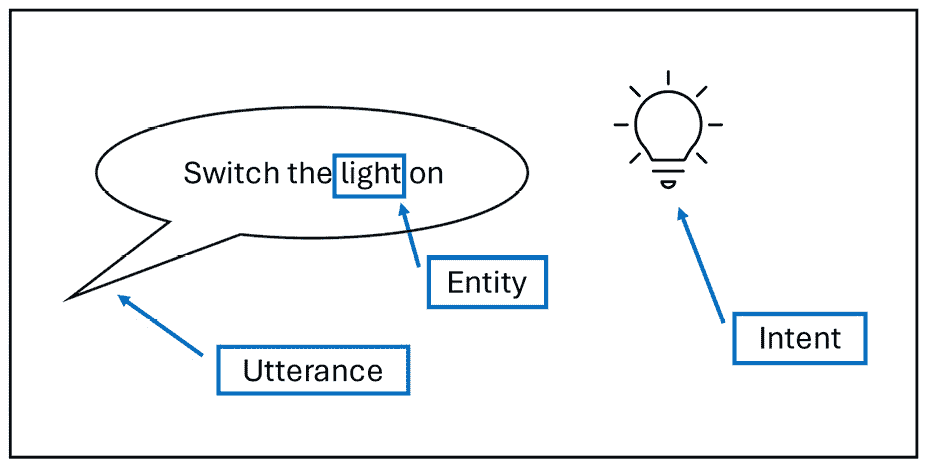
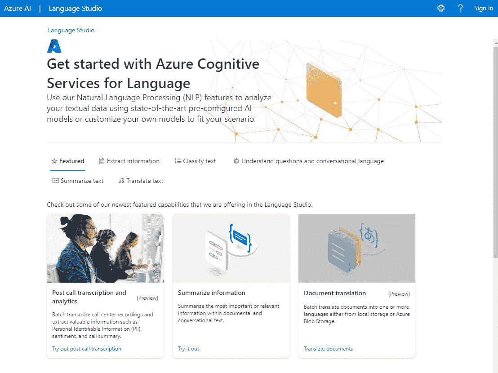
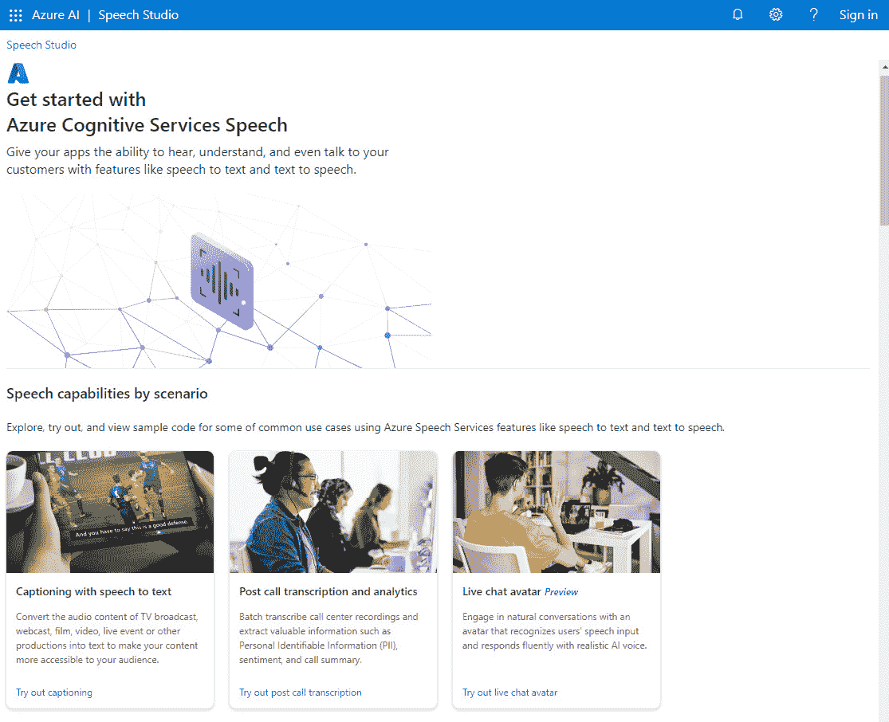
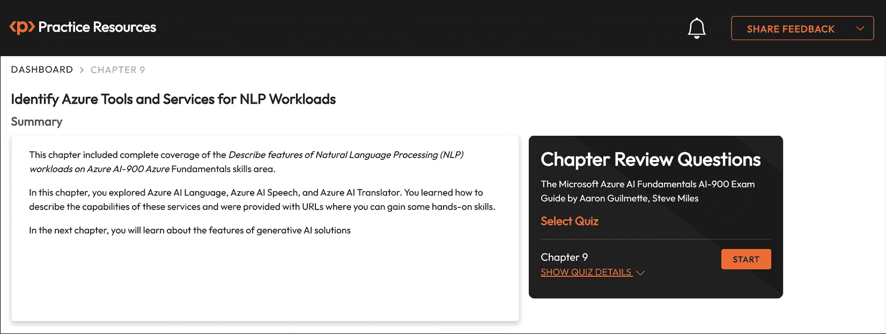

# 9

# 识别用于 NLP 工作负载的 Azure 工具和服务

在第八章*识别常见 NLP 工作负载场景的特征*中，您学习了如何识别由 Microsoft AI 服务提供的各种**自然语言处理**（**NLP**）能力，例如关键词提取、实体识别、情感分析、语言建模、语音识别和翻译，这些都是 Azure 的常见 NLP 工作负载场景。

本章基于在第八章中介绍的 NLP 基础概念，*识别常见 NLP 工作负载场景的特征*，并将这些特征和能力与 Azure 平台中的 AI 服务联系起来。

本章我们将涵盖的目标和技能如下：

+   描述 Azure AI 语言服务的功能

+   描述 Azure AI 语音服务的功能

+   描述 Azure AI 翻译服务的功能

# 技术要求

要开始使用本章中提到的**Azure AI 服务**，您需要一个具有足够权限创建和删除订阅内资源的**Azure 订阅**。您可以通过访问[`azure.microsoft.com/free/`](https://azure.microsoft.com/free/)创建一个免费的 Azure 账户进行评估。

这个免费的 Azure 账户提供了以下内容：

+   30 天内探索 Azure 的$200 信用额度

+   12 个月的免费热门服务

+   55+其他始终免费的服务

一旦您设置了 Azure 订阅，您需要在*资源组*或*资源*级别拥有**所有者**或**贡献者**角色。

要评估计算机视觉，您可以创建一个“单一服务资源”或“多服务资源”；它们可以解释如下：

+   **Azure AI 语言**：这是一个具体的*单一服务资源*的例子。该资源可以与您希望评估的 Azure AI 服务的“免费层”一起使用；它使用对每个*Azure AI 服务*都是唯一的*端点*和*密钥*。因此，如果您使用多个 Azure AI 服务，那么您将拥有多个端点和密钥；每个服务一个端点和密钥。

+   **Azure AI 服务**：这是一个通用的*多服务资源*。该资源通过使用单个密钥和端点，对所有使用的服务资源进行账单合并。因此，如果您使用多个 Azure AI 服务，那么您将只有一个端点和密钥可以访问所有服务。

您不需要理解工作空间或计算资源的概念；您只需在您的 Azure 订阅内创建一个 Azure AI 资源。

重要的是要注意，Azure 服务会定期更改，因此您应始终参考 Microsoft 的文档以获取有关服务的最新信息。

您可以在[`learn.microsoft.com/en-us/azure/ai-services/multi-service-resource`](https://learn.microsoft.com/en-us/azure/ai-services/multi-service-resource)了解更多关于服务资源的信息。

现在我们已经了解了与各种 Azure AI 服务一起工作的技术要求，让我们来发现本章将要介绍的第一项 Azure AI 服务：Azure AI Language。

# 描述 Azure AI Language 服务的功能

**Azure AI** 的 **语言建模** 功能由 **Azure AI Language** 服务提供。

Azure AI Language 服务是一组基于云的 API 和服务，旨在为应用程序和系统提供诸如 NLP 等功能。这些服务允许开发者在无需从头开始构建和训练模型的情况下，将强大的语言理解能力集成到他们的应用程序中。

**Azure AI Language** 服务的功能如下：

+   文本分析

+   会话语言理解

+   问答

让我们更详细地探讨这些功能。

## 文本分析

本节概述了 **Azure AI Language** 服务中 **文本分析** 的高级功能：

+   **实体链接**：通过返回特定参考维基百科链接来消除实体的歧义。可以使用 **实体** 的类型、子类型或类别。

+   **关键词提取**：从非结构化文本中提取主要观点。

+   **语言检测**：可以识别文本所写的语言。以下信息可以返回：

    +   一个 ISO 639-1 语言代码，例如 **en**

    +   语言名称，例如 **英语**

    +   检测到的语言的置信度分数，例如 **1.0** 或 **0.9**

+   **命名实体识别**：从非结构化文本中返回如人、组织、地点、日期或其他具有独特身份的概念列表。此功能也可以定制以获取自定义类别。

+   **个人可识别信息（PII）检测**：可以检测到个人敏感信息，例如 **个人健康信息**（**PHI**）。

+   **情感分析和意见挖掘**：对于每个句子，提供基于其是正面还是负面的标签和情感分数。使用预构建的分类模型进行文本评估。服务返回的情感分数有 *中立*、*正面* 和 *负面* 三种类别。每个类别提供一个 *0* 或 *1* 的分数，以指示情感的可能性。

+   **摘要**：识别并总结最重要的信息。

在本节中，您了解了 Azure AI Language 服务中文本分析的高级功能。接下来，我们将学习关于会话语言理解的内容。

## 会话语言理解

**Azure AI Language** 服务中的 **会话语言理解** 功能允许您获取一个“创作”的语言模型，然后让它做出预测。此模型可用于训练一个可以解释自然语言命令的语言模型。

语言模型由三个核心元素组成：

+   **表述**：这些是可能由人说出的话语，例如“打开灯”。

+   **实体**：这些是在表述中引用的特定项目。例如，一个用于家庭自动化应用的语言模型可能能够识别家庭设备，如灯、风扇或百叶窗。

+   **意图**：这些标识了表述所期望的动作，例如打开某个东西。

*图 9.1*展示了会话语言理解的概念：

图 9.1 – 会话语言理解概念

下面是会话语言理解工作原理的高级概述：

+   **创作**：模型创作涉及实体、意图和表述定义。这些构成了预测的基础以及会话语言理解模型将要训练的内容。包含了一个预构建的领域集合，以便预先定义这些常见场景的意图和实体；您也可以创建自己的实体和意图。

+   **训练**：您在创作步骤中定义的表述用于训练模型，以匹配用户自然语言表述中的可能意图和实体。您需要持续更新、重新训练和测试，以确保您的样本表述能够正确识别意图和实体。

+   **预测**：一旦模型经过训练和测试，达到您的满意程度，您的会话语言理解应用程序就可以发布为预测资源。客户端应用程序可以通过连接到预测资源端点并指定认证密钥来使用该模型。用户输入将得到预测结果返回给客户端应用程序，根据预测的意图，可以采取适当的行动。

现在我们已经了解了 Azure AI 语言服务中会话语言理解的高级功能，让我们来学习一下问题回答。

## 问题回答

**问题回答**是 Azure AI 语言服务中的一个 AI 工作负载，用于创建使用自然语言的机器人应用程序解决方案。

您可以使用以下两个 AI 服务在 Azure 中创建机器人解决方案：

+   Azure AI 语言

+   Azure AI 机器人服务

**Azure AI 语言**允许您创建一个*问答*对知识库，它使用自然语言输入提供定制问答。问答对的知识库可以通过以下两种方式提供：

+   一个已经存在的 FAQ 文档或网页

+   手动输入和编辑

可以使用一个基础问题集，它以现有内容和手动输入内容的组合开始，以扩展和增强问题集。Language Studio 内置了一个测试界面，我们将在介绍**Azure AI 语言** **Studio**时进行探讨。

**Azure AI 机器人服务**提供了一个可用于通过机器人交付创建的知识库的 *机器人开发框架*。

可以使用 *自动机器人创建* 功能来简化此过程，因为你可以将你的知识库作为 Azure AI 机器人服务应用程序发布；或者，可以使用 **Microsoft Bot Framework** 进行自定义机器人创建。你可以将你的机器人连接到多个渠道，如网页聊天、电子邮件、Microsoft Teams 等，以进行用户交互。

通过这样，我们已经了解了 Azure AI 语言服务中问答的高级功能。接下来，我们将继续探讨 Azure AI 语言工作室。

## Azure AI 语言工作室

你可以使用 **语言工作室** 探索 **Azure AI 语言** 服务的功能。它可以用于问答等项目中，并用于创建、训练和发布你的模型。**语言工作室** 是创建语言解决方案的基于浏览器的界面。可以使用 Azure AI 语言 *REST API* 或 *SDK* 在代码中创建和管理项目；然而，在大多数情况下，使用语言工作室是一个更快入门的方式。

*图 9.2* 展示了 **Azure AI 语言** **工作室** 门户：

图 9.2 – Azure AI 语言工作室门户

**语言工作室**可以通过 https://language.cognitive.azure.com/ 访问。

Microsoft Learn 网站提供了各种动手练习，让你可以探索 Azure AI 语言的各项功能。进行这些练习，你需要一个 Azure 订阅；请参阅 *技术要求* 部分，了解如何访问 Azure 订阅。

可以使用以下 URL 访问练习：

+   文本分析：[`microsoftlearning.github.io/mslearn-ai-fundamentals/Instructions/Labs/06-text-analysis.html`](https://microsoftlearning.github.io/mslearn-ai-fundamentals/Instructions/Labs/06-text-analysis.html)

+   问答：[`microsoftlearning.github.io/mslearn-ai-fundamentals/Instructions/Labs/07-question-answering.html`](https://microsoftlearning.github.io/mslearn-ai-fundamentals/Instructions/Labs/07-question-answering.html)

+   对话式语言理解：[`microsoftlearning.github.io/mslearn-ai-fundamentals/Instructions/Labs/08-conversational-language-understanding.html`](https://microsoftlearning.github.io/mslearn-ai-fundamentals/Instructions/Labs/08-conversational-language-understanding.html)

在本节中，你学习了如何描述 Azure AI 语言服务的能力。在下一节中，你将学习如何描述 Azure AI 语音服务的能力。

# 描述 Azure AI 语音服务的能力

**Azure AI** 的 **语音识别** 功能由 **Azure AI** **语音** 服务提供。

**Azure AI 语音** 服务提供了一套工具和 API，用于将 **语音识别** 和 **语音合成** 功能集成到应用程序中。这些功能使开发者能够构建能够理解和生成 **类似人类语音** 的应用程序，并使他们能够将 **口语** 转换为 **书面文本**，反之亦然。

**Azure AI 语音** 服务的功能如下：

+   语音转文本

+   文本转语音

*语音转文本* 是 **语音服务** 的 **语音识别** 功能，可以用于将可听见的语音转录为文本。

*文本转语音* 是 **语音服务** 的 **语音合成** 功能，可以将文本转换为可听见的语音。

语音服务支持超过 60 种语言的转录。

在下一节中，我们将更详细地探讨 Azure AI 语音工作室。

## Azure AI 语音工作室

你可以使用 **语音工作室** 探索 **Azure AI 语音** 服务的功能。这是一个基于浏览器的界面，用于创建语音解决方案。

要访问它，你需要一个 Azure 订阅；请参阅 *技术要求* 部分，了解如何访问 Azure 订阅。

*图 9**.3* 显示了 **Azure AI 语音** **工作室** 门户：

图 9.3 – Azure AI 语音工作室门户

**语音工作室** 可在 [`speech.com/`](https://speech.com/) | [`speech.microsoft.com/`](https://speech.microsoft.com/) 访问。

Microsoft Learn 网站提供了一个动手练习，让你探索 Azure AI 语音服务的功能。为此练习，你需要一个 Azure 订阅；请参阅 *技术要求* 部分，了解如何访问 Azure 订阅。

此练习可在 [`microsoftlearning.github.io/mslearn-ai-fundamentals/Instructions/Labs/09-speech.html`](https://microsoftlearning.github.io/mslearn-ai-fundamentals/Instructions/Labs/09-speech.html) 访问。

在本节中，你学习了如何描述 Azure AI 语音服务的功能。在下一节中，你将学习如何描述 Azure AI 语音翻译服务的功能。

# 描述 Azure AI 语音翻译服务的功能

**Azure AI** 的 **翻译** 功能由 **Azure AI** **翻译器** 服务提供。

**Azure AI 翻译** 是一个基于云的 Azure 平台托管服务，使开发者能够将机器翻译功能集成到他们的应用程序中，允许 **文本** 在不同的 **语言** 之间进行翻译。

**Azure AI 语音翻译** 服务的功能如下：

+   **文本翻译**：翻译器可以几乎实时地将一种语言的文本翻译成另一种语言，支持超过 90 种语言和方言。这允许开发者构建能够为各种用例提供翻译服务的应用程序。

+   **语音翻译**：支持语音翻译，这意味着你也可以实时翻译口语，从而实现多语言对话和辅助功能。

+   **语言检测**：自动检测给定文本的语言。这在源语言未知的情况下非常有用。

+   **自定义翻译**：可以使用 Azure 自定义翻译服务训练自定义翻译模型。这允许你根据特定的行业或领域术语微调翻译，从而提高专业内容的翻译准确性。

+   **批量翻译**：支持批量翻译，使用户能够一次性翻译多个文本或文档。

+   **与其他 Azure 服务的集成**：你可以轻松地将 Azure 翻译器与其他 Azure 服务（如 Azure 语言和 Azure 语音服务）集成，以构建综合的 AI 应用程序。

+   **REST API**：这为开发者提供了可以用来将语言翻译功能集成到他们的应用程序、网站或服务中的端点。它支持文本和语音翻译。开发者可以利用 Azure 翻译 API 构建多语言应用程序并实现实时翻译。

+   **安全性**：提供包括加密在内的安全功能，以确保传输数据的机密性和完整性。

现在你已经了解了该服务的功能，你可以通过实际操作练习来获得一些实用技能。

Microsoft Learn 网站提供了一个实际操作练习，让你探索 Azure AI 翻译器的功能。为此练习，你需要一个 Azure 订阅；请参阅*技术要求*部分了解如何访问 Azure 订阅。

您可以在[`microsoftlearning.github.io/AI-900-AIFundamentals/instructions/04b-translate-text-and-speech.html`](https://microsoftlearning.github.io/AI-900-AIFundamentals/instructions/04b-translate-text-and-speech.html)找到这个练习。

在本节中，你学习了如何描述 Azure AI 翻译器服务的功能，并总结了本章的内容。接下来，你将看到本章的总结。

# 摘要

本章全面涵盖了**描述 Azure 上自然语言处理（NLP）工作负载的功能**的 AI-900 Azure 基础知识技能领域。

在本章中，你探索了 Azure AI 语言、Azure AI 语音和 Azure AI 翻译器。你学习了如何描述这些服务的功能，并提供了你可以获得一些实际技能的 URL。

在下一章中，你将了解生成式 AI 解决方案的功能。

# 考试准备练习 - 章节复习问题

除了对关键概念有扎实的理解外，能够在时间压力下快速思考是一项帮助你通过认证考试的关键技能。这就是为什么在学习的早期阶段就培养这些技能是至关重要的。

章节复习题旨在随着你学习并复习每个章节的内容，逐步提高你的应试技巧，同时检查你对章节中关键概念的理解。你可以在每个章节的末尾找到这些题目。

在继续之前

如果你没有 Packt 图书馆订阅，或者你没有从 Packt 商店购买这本书，你需要解锁在线资源以访问考试准备练习。解锁是免费的，只需进行一次。要了解如何操作，请参阅名为*第十二章**的章节，*访问在线资源*。

要打开本章的章节复习题，请执行以下步骤：

1.  点击链接 – [`packt.link/AI-900_CH09`](https://packt.link/AI-900_CH09)。

    或者，你可以扫描以下二维码（*图 9.4*）：

图 9.4 – 为登录用户打开章节复习题的二维码

1.  登录后，你将看到一个类似于*图 9.5*所示的页面：

图 9.5 – 第九章的章节复习题

1.  准备就绪后，开始以下练习，多次重新尝试测验。

## 考试准备练习

对于前三次尝试，不必担心时间限制。

### 第 1 次尝试

第一次，目标至少是**40%**。看看你答错的答案，并再次阅读章节中的相关部分，以弥补你的学习差距。

### 第 2 次尝试

第二次，目标至少是**60%**。看看你答错的答案，并再次阅读章节中的相关部分，以弥补任何剩余的学习差距。

### 第 3 次尝试

第三次，目标至少是**75%**。一旦得分达到 75%或更高，你就可以开始练习计时。

小贴士

你可能需要超过**三次**尝试才能达到 75%。这没关系。只需复习章节中的相关部分，直到你达到目标。

## 工作在计时上

你的目标是保持得分不变，同时尽可能快地回答这些问题。以下是你下一次尝试应该看起来像的例子：

| **尝试** | **得分** | **用时** |
| --- | --- | --- |
| 尝试 5 次 | 77% | 21 分 30 秒 |
| 尝试 6 次 | 78% | 18 分 34 秒 |
| 尝试 7 次 | 76% | 14 分 44 秒 |

表 9.1 – 在线平台上的样本计时练习

注意

上表中显示的时间限制只是示例。根据网站上的测验时间限制，为每次尝试设定自己的时间限制。

每次新的尝试，你的得分应保持在**75%**以上，同时完成所需的时间“应减少”。重复尝试，直到你觉得自己能够自信地应对时间压力。

# 第五部分：描述 Azure 上生成式 AI 工作负载的功能

在本最后一部分，你将探索**生成式 AI**的概念、功能和能力——这是 ChatGPT 和 DALL-E 等应用程序背后的技术。

本部分包括以下章节：

+   *第十章*, *识别生成式 AI 解决方案的功能*

+   *第十一章*, *识别 Azure OpenAI 服务的功能*
