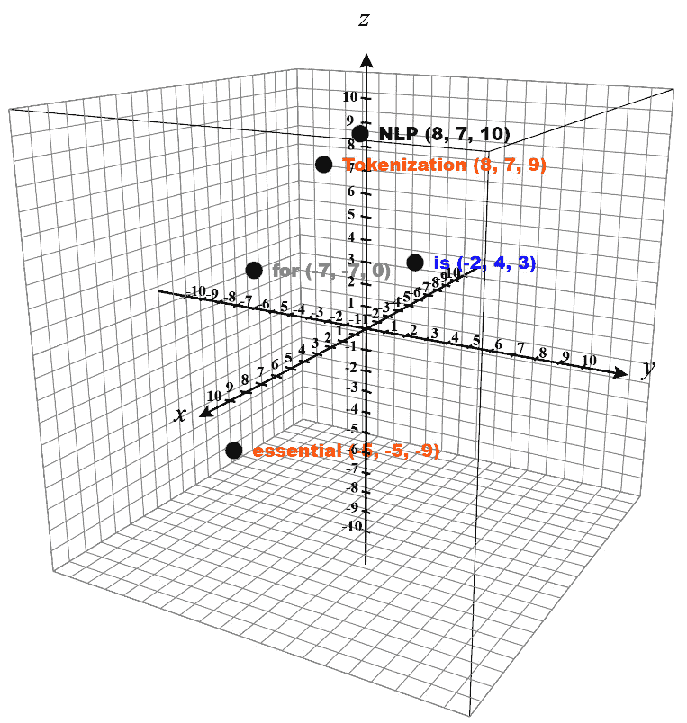
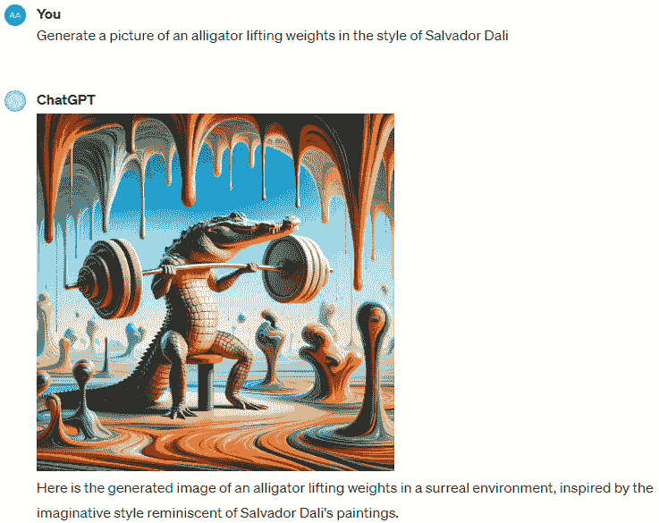
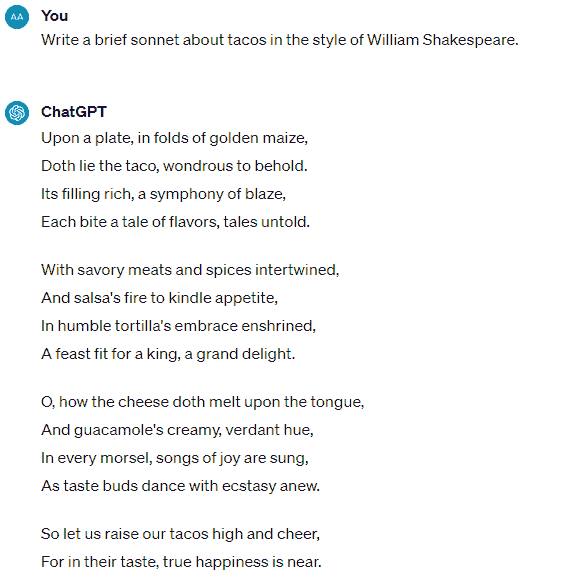
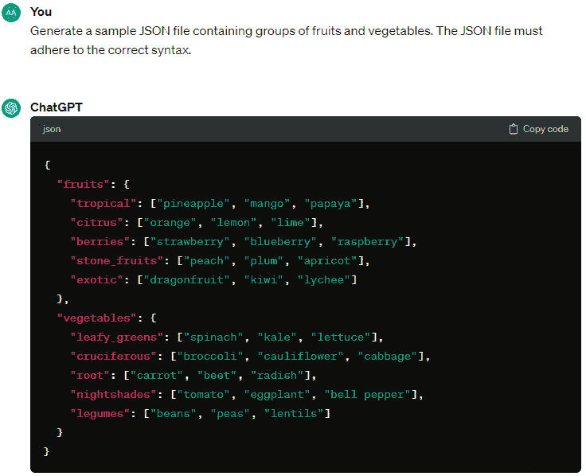
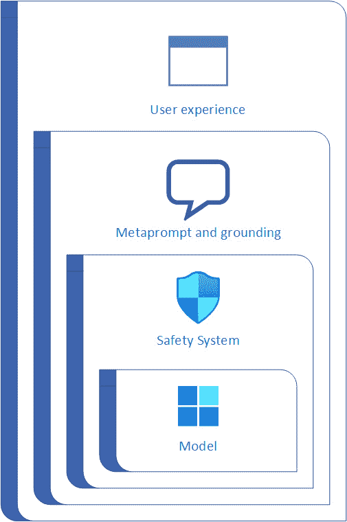
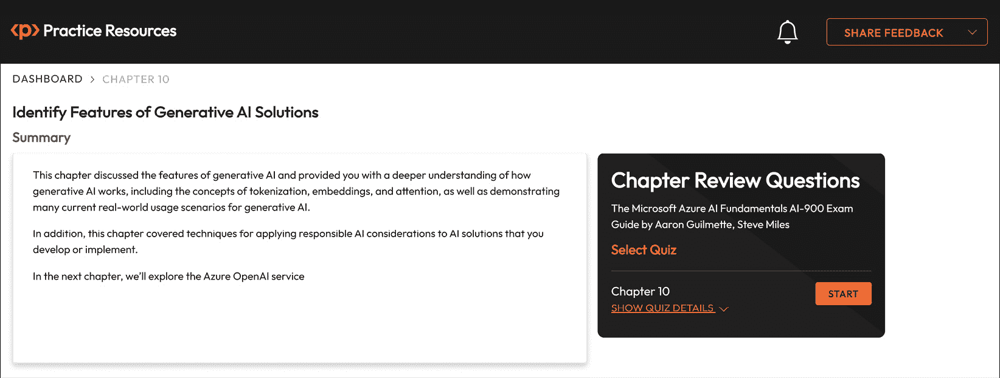

# 第十章：确定生成式人工智能解决方案的特点

终于！这可能是本书最令人期待的一章！

除非你在过去一年半的时间里一直躲在岩石下，否则你可能已经听说过**生成式人工智能**（有时称为**GenAI**）。这是使 ChatGPT 等服务能够进行自然对话并产生半原创内容的技术（我们将在本章稍后对此进行一些探讨）。

生成式人工智能目前正处于爆炸式增长阶段，因此现在是熟悉其用途和应用的最佳时机。

本章我们将涵盖的目标和技能如下：

+   什么是生成式人工智能？

+   确定生成式人工智能模型的特点

+   确定生成式人工智能的常见场景

+   确定生成式人工智能的责任人工智能考虑因素

到本章结束时，你应该能够描述生成式人工智能的各种特性，以及阐述在生成式人工智能结合下责任人工智能原则的重要性。

让我们开始吧！

# 什么是生成式人工智能？

在*第一章*中，*确定常见人工智能工作负载的特点*，我们介绍了关于生成式人工智能的一些广泛概念。

生成式人工智能代表了人工智能领域最令人兴奋的进步之一，标志着从传统人工智能系统的一个重大转变，传统人工智能系统主要是为了识别模式或根据输入数据（主要是统计分析预测）进行预测而设计的。相反，生成式人工智能专注于创建与训练数据相似的新数据实例，不仅在形式上，而且在功能上。生成式人工智能还有助于解释数据，并且可以比传统机器学习模型更快地识别内容中的模式。

生成式人工智能应用利用**大型语言模型**（**LLMs**）进行各种**自然语言处理**（**NLP**）任务，例如情感分析、文本摘要、文本之间的语义相似性比较以及生成新的文本内容。尽管它们的数学基础复杂，但理解 LLMs 的架构可以提供对其操作机制的见解。

# 确定生成式人工智能模型的特点

在本节中，我们将更深入地探讨生成式人工智能模型的特点，包括使生成式人工智能能力得以实现的基础组件。

生成式人工智能模型具有几个独特的特点，使它们能够生成新的内容、预测结果，并从数据中学习，其方式模仿人类的创造力和智慧。以下是生成式人工智能模型的一些关键特点：

+   **内容生成**：生成式人工智能的一个标志性特点是它能够创建与原始数据相似的新数据实例。这包括生成与训练数据相似但不是精确复制品的文本、图像、音频和视频。

+   **学习数据分布**：生成式 AI 模型旨在理解和学习它们训练所基于的数据的潜在分布。这使得它们能够产生与训练数据所代表的现实世界现象一致的输出。

+   **处理模糊性和创造性**：这些模型可以处理模糊的输入并产生多样化的输出，展示了通过名为**温度**的功能经常管理的一种形式的人工创造性。例如，当被要求生成动物图像时，一个生成式 AI 模型可以产生不同动物在不同环境中的各种图像（其中一些可能在实际生活中并不存在）。同样，你可以指示一个生成式 AI 模型以作者或艺术家的风格呈现其输出（例如，*以马克·吐温的风格进行的评论*，*梵高风格的猫的画作*，或*与惠特尼·休斯顿的《我想和某人跳舞》的节奏和调调相匹配的歌词*）。

+   **适应性**：生成式 AI 模型可以适应各种领域和任务，例如创建逼真的人类声音、为药物设计新的分子结构或根据自然语言描述生成代码。

+   **无监督学习**：许多生成式 AI 模型可以在没有明确标签或注释的数据中学习，这被称为无监督学习。这对于探索大型数据集特别强大，因为手动标记是不切实际的。

+   **可解释性和控制**：高级生成式 AI 模型提供了控制和解释生成过程的机制，使用户能够指定某些属性或引导模型向期望的结果发展。

+   **个性化**：生成式 AI 可以根据个人偏好或需求定制内容，这使得它在个性化推荐、定制内容创作和针对性营销策略方面高度相关。

+   **异常检测和数据增强**：尽管被称为*生成式 AI*，但这些模型可以识别数据中的异常模式（异常检测）并为训练生成额外的数据点（数据增强），从而增强其他机器学习模型的鲁棒性和性能。

+   **多模态**：一些生成式 AI 模型是多模态的，这意味着它们可以理解和生成不同形式的数据内容，例如将文本描述转换为图像或在不同语言之间进行翻译。

+   **迭代改进**：生成模型可以通过迭代过程改进其输出，其中初始结果根据反馈或额外输入逐步改进，从而产生更高质量和更精确的输出。

现在你已经看到了一些 LLMs 和生成式 AI 模型能做的事情，让我们具体看看是什么使得生成式 AI 模型，如 ChatGPT 或**双向编码器表示从 Transformer**（**BERT**）如此独特。

## 什么是 Transformer 模型以及它是如何工作的？

几年来，专注于 NLP 的机器学习模型已经显著发展，导致了基于变压器架构的高级 LLM 的出现。这种架构增强了之前用于 NLP 任务中词汇建模的技术，特别是在语言生成方面。变压器在大量的文本语料库上训练（因此有*LLM*这一术语），使它们能够理解单词之间的语义关系并预测逻辑文本序列。拥有全面的词汇，这些模型可以产生几乎无法与实际人类区分的响应。

变压器模型架构在本质上由两个主要部分组成：

+   **编码器块**：该组件负责创建训练词汇中单词的语义表示，捕捉给定序列中每个单词的上下文和含义

+   **解码器块**：这部分主要关注基于编码器准备好的语义表示生成新的语言序列

变压器架构的不同实现可能强调不同的组件。例如，谷歌的**BERT**模型，旨在增强搜索引擎结果，主要利用编码器块。相反，OpenAI 的**生成预训练变压器**（**GPT**）模型，旨在生成类似人类的文本，主要依赖于解码器块。

虽然深入研究变压器模型的全部细节可能很复杂，但理解这些基本元素可以一窥它们如何支撑生成式 AI 的能力，使创建复杂且连贯的语言输出成为可能。

虽然这些生成式 AI 模型的工作方式涉及多个过程和功能，但它们通常共享一些共同的概念。我们将在以下章节中介绍这些概念。

### 分词

**分词**是 LLM 和生成式 AI 工作流程中的关键预处理步骤，其中文本数据被分解成称为**标记**的更小单元。这些标记可以是单词、子词，甚至字符，具体取决于模型的设计和任务所需的粒度。分词过程允许模型通过逐个分析文本来高效地处理和理解输入文本，为后续的 NLP 任务，如语言生成、翻译或情感分析，奠定基础。

对于 LLM 和生成式 AI，分词不仅简化了输入文本的复杂性，还有助于捕捉语言的语言和语义。通过将文本分解成可管理的单元或块，模型可以学习语言内部的关系和模式，这对于生成连贯且与上下文相关的文本输出，模仿人类输出至关重要。

以以下句子为例：

*分词对于 NLP 至关重要* *。

在简单的基于单词的分词方法中，这可能会被分解为“Tokenization”，“is”，“essential”，“for”，“NLP”和“.”作为标记。每个标记然后作为 LLM 的输入，LLM 处理这些标记以理解句子的结构和意义。在更高级的模型中，例如使用子词分词的模型，单词“Tokenization”可能会进一步分解为更小的标记，如“Token”和“ization”，以捕捉更细粒度的语言特征并更有效地处理未知单词或新词。

这个分词输入使 LLMs 能够执行广泛的生成式 AI 任务，从以模仿人类写作的方式完成句子到将句子翻译成不同的语言同时保留其原始意义。通过分词，LLMs 可以有效地导航人类语言的复杂性，使其成为 NLP 和生成式 AI 世界中的基础步骤。

### Embeddings

在 LLMs 和生成式 AI 的背景下，**embeddings**是用于表示从分词过程中获得的标记的高维向量。这些向量捕捉了单词的语义和句法特征，使模型能够理解不同单词及其在文本中的关系。创建 embeddings 的过程涉及将每个唯一的标记映射到几何空间中的一个点，其中点之间的距离和方向反映了单词之间的语言和上下文关系。

生成 embeddings 的过程允许 LLMs 捕捉标记之间的复杂关系，例如相似性、差异性和上下文性。例如，在相似上下文中出现的单词往往在向量空间中具有更接近的 embeddings，这有助于模型在单词预测、句子生成和语义分析等任务中。

例如，以我们之前分词的句子“Tokenization is essential for NLP”为例，每个单词（标记）将被转换为 embeddings – 一个实数**向量**（或坐标）。这些 embeddings 将被 LLM 用于理解句子的意义和上下文。例如，模型可能会学习到“Tokenization”和“NLP”在 NLP 领域是密切相关的概念，它们的 embeddings 在向量空间中的位置会比无关的单词更接近。

假设标记被转换为以下向量：

| **Token ID** | **Token Value** | **X** | **Y** | **Z** |
| --- | --- | --- | --- | --- |
| 1 | Tokenization | 8 | 7 | 9 |
| 2 | Is | -2 | 4 | 3 |
| 3 | Essential | -5 | -5 | -9 |
| 4 | For | -7 | -7 | 0 |
| 5 | NLP | 8 | 7 | 10 |

表 10.1 – 由坐标表示的标记

在*表 10.1*中，每个标记存在于一个维度或平面上（*X*，*Y*和*Z*）。你可以将 embeddings 视为在三维图上表示标记：

图 10.1 – 在 3D 图上绘制的标记

这些嵌入是在语言模型在大量文本语料库上训练时学习的。模型学会在嵌入空间中将语义上相似的标记放置得更近。例如，*分词*和*NLP*可能比*is*更接近，因为它们与语言处理概念相关，而*is*是一个更通用的动词。

### 注意力

在生成式 AI 和 LLM 中，**注意力**的概念代表了模型处理和理解数据序列（如文本）方式的一个重大进步。注意力机制允许模型在执行任务时关注输入数据的不同部分，就像人类的注意力集中在我们所看到或听到的特定方面以推导意义或做出决定一样。

注意力机制在生成输出时动态地权衡句子中不同标记的重要性。这意味着模型可以根据手头的任务（如翻译、问答或文本生成）更多地关注相关单词，而对其他单词的关注较少。

让我们回到我们的例子句子，*分词对于 NLP 至关重要*。在处理这个句子时，具有注意力机制的 LLM 可能会更多地关注*分词*和*NLP*这两个词，因为它们是定义上下文和主题的关键术语。模型认识到*至关重要*很重要，因为它描述了*分词*和*NLP*之间的关系，但可能对*is*和*for*的关注较少，因为它们更多地承担语法功能。

注意力机制是基于 transformer 的模型的基础，通过提供一种更细腻和灵活的方式来处理数据序列，从而在 NLP 应用中实现了突破。这导致了高度有效的模型的发展，这些模型能够理解和生成类似人类的文本。

什么是注意力分数？

**注意力分数**在识别注意力层或注意力机制中标记的相对重要性或权重时使用。标记的权重或重要性会影响其在预测中的相关性。在采用**多头**注意力的模型中，输入被多次转换，并计算多个注意力分数，捕捉数据中的不同关系。

虽然*图 10.1*有助于可视化嵌入的概念，但在现实世界中，每个标记都表示为一个具有数百或数千维的向量。

整个过程看起来可能像这样：

1.  将标记嵌入（标记及其数值向量或坐标）按顺序输入到注意力层。

1.  解码器开始预测序列中的下一个标记和向量。

1.  注意力层评估序列并为标记分配权重。

1.  然后使用这些权重来计算新的向量和下一个标记的**注意力分数**。在具有**多头**注意力的系统中，注意力层使用嵌入中的不同元素来计算多个替代标记。

1.  神经网络使用注意力分数来预测其整个词汇表中最可能出现的下一个标记（通过训练过程获得）。

1.  预测的输出被添加到序列中，反过来，这个序列又作为下一个输入，从*步骤 1*重新开始这个过程。

就像其他机器学习风格一样，生成式人工智能依赖于一个训练过程，在这个过程中，它被提供内容。基于注意力分数的预测标记值和向量与下一个向量的实际值进行比较，并计算损失。与其他自动机器学习模型一样，权重会动态调整以减少损失，从而使模型能够更准确地生成其预测（在生成式人工智能的情况下，是对于提示的响应）。

## 生成式人工智能是如何将这些内容整合在一起的？

生成式人工智能利用深度学习技术，特别是**生成对抗网络**（GANs）和**变分自编码器**，来生成既新颖又真实且与上下文相关的内容。

什么是 GAN？

GAN 基于神经网络的概念。一个 GAN 由两个相互竞争的神经网络模型组成：一个**生成器**和一个**判别器**。生成器的角色是创建与训练集中数据相似的数据，而判别器的角色是区分来自训练集的真实数据和由生成器产生的虚假或人工数据。在训练过程中，这两个网络进行一种拔河比赛；生成器不断改进其生成逼真数据的能力，而判别器则改进其检测生成数据的能力。这个过程一直持续到生成器产生的数据如此逼真，以至于判别器无法再将其与实际数据区分开来。这种对抗过程使 GAN 能够生成高质量、逼真的数据，模仿原始数据集的分布。

生成式人工智能的核心能力在于理解和复制人类创造力的复杂性。通过分析大量数据——无论是文本、图像、声音还是视频——生成式人工智能算法学习其背后的模式、风格和结构。然后，它们利用这种理解来生成新的内容，这些内容可以与人类创造的内容难以区分。这种能力为音乐创作、故事撰写、创建逼真视觉效果和模拟虚拟环境等众多应用打开了大门。

进一步探索

你现在就可以尝试一些流行的生成式人工智能服务，例如 OpenAI 的 GPT-4 ([`chat.openai.com`](https://chat.openai.com)) 和 Midjourney ([`www.midjourney.com`](https://www.midjourney.com))。

Azure 生成式 AI 是微软进入这一革命性技术的尝试，提供利用 Azure AI 生态系统的工具和服务。这个平台使开发者和企业能够将生成式 AI 功能集成到他们的应用程序中，在人类创造力和机器效率之间架起一座桥梁。借助 Azure AI，用户可以利用生成模型的力量，在各个领域产生高质量、创新的内容，显著减少传统内容创作所需的时间和精力。

Azure 生成式 AI 的一个显著特点是生成逼真图像的能力。利用 GAN 和其他最先进的技术，该平台可以生成与真实场景非常接近的图像。这些能力在多个行业中都有应用，例如增强数据集以更有效地进行机器学习训练、为电子商务平台生成产品图像以及为游戏和虚拟现实体验制作详细图形。

GAN 是如何创建图像的？

不论是处理文本还是图像，GAN 在生成器和判别器角色中都使用神经网络。假设你用几只猫的图像训练了生成器。生成器的任务是利用源材料作为灵感（如果可以这样说的話），然后插入一些可能有助于使图片看起来像猫的随机内容（噪声）。然而，这不会是实际的猫图像数据。然后，作为二元分类器，判别器从生成器那里获取这些图像，并确定它们是否看起来像猫。

除了视觉内容，Azure 生成式 AI 在文本生成方面表现出色。通过在大量的文本数据集上进行训练，该平台可以生成模仿人类写作风格的书面内容。这对于生成叙事内容、自动化客户服务响应或为网站和应用程序创建信息性文本特别有用。这项技术确保生成的文本在风格上连贯、上下文适当且多样化，进一步模仿人类语言模式。

生成式 AI，尤其是在 Azure AI 中实现的形式，在内容创作和数据合成方面取得了重大进步。通过自动化创作过程，它有可能彻底改变行业，简化工作流程，并释放新的创造力和创新水平。随着这项技术的不断发展，它无疑将成为许多全球组织数字化转型旅程中不可或缺的一部分，重新定义人工智能的可行性。

# 识别生成式 AI 的常见场景

生成式 AI，凭借其创建新内容的能力，在众多领域都有应用。以下是一些生成式 AI 产生重大影响的常见场景，以及每个场景的示例。

## 图像生成

多模态生成式 AI 可以从文本描述中创建新的图像，例如使用 OpenAI 的 DALL-E 或 Midjourney 等模型生成不存在物体的或场景的逼真图像：

图 10.2 – 使用 GPT4 生成图像

## 文本生成

通过使用 OpenAI 的 GPT-3 等模型，生成式 AI 可以用于生成用于文章或故事的连贯且上下文相关的文本：

图 10.3 – 使用 GPT-3.5 进行文本生成

## 音乐创作

通过学习大量音乐数据集，生成式 AI 可以创作各种流派的新音乐作品或歌曲，例如 OpenAI 的 Jukebox 项目所示：

图 10.4 – 使用 OpenAI Jukebox 生成的歌曲

## 合成数据生成

获取用于模型训练的个人数据可能非常困难。生成式 AI 可以通过创建模仿敏感真实世界数据统计特性的真实但人工数据集来填补这一空白，从而在不损害隐私的情况下开发机器学习模型。

## 代码生成

生成式 AI 在开发方面开始增长，可以生成语法正确的代码（在许多情况下），如图*10**.5*所示：

图 10.5 – GPT-3.5 生成的 JSON 内容

另一个增长领域是使用生成式 AI 来审查代码、提出建议或推荐改进。

## 语音生成和转换

生成式 AI 可以用于将文本转换为各种语言和口音的逼真语音，用于有声读物或虚拟助手等应用，例如通过 Google 的 WaveNet 等技术。

## 药物发现和化学合成

它可以通过预测可能导致有效药物的分子的结构来加速新药发现的发现，如 Atomwise 等初创公司的工作所示。

## 个性化内容和推荐系统

生成式 AI 可以通过在 Netflix 或 Amazon 等平台上生成个性化内容或产品推荐来为个人用户定制数字体验。

## 维护分析

通过审查**物联网**（**IoT**）和其他传感器数据，生成式 AI 可以检测出潜在故障点或制造设备维护需求的模式。

## 协作者

随着大型语言模型（LLMs）的出现，**协作助手**应运而生，这些新型工具旨在通过集成到各种应用中的生成式 AI 模型帮助用户完成常见任务。这些协作助手基于统一架构，使开发者能够为特定业务需求创建定制解决方案，以聊天界面等特征的形式出现在用户文件旁边，利用产品中创建或搜索的内容生成相关结果。

开发过程涉及使用大量数据训练 LLM，并利用 Azure OpenAI 服务之类的服务来访问预训练模型，这些模型可以原样部署或使用定制数据针对特定应用进行微调。协作伙伴提供了对生产力和创造力的显著提升，帮助完成从起草文件到战略规划的各种任务，标志着在数字工作空间中处理和执行任务方式的变革性转变。目前最突出的协作伙伴之一是**微软协作伙伴**，它集成在微软 365 应用程序套件中。

生成式 AI 的能力不仅限于这些例子，还触及了时尚设计等领域，AI 可以生成新的服装风格，以及游戏领域，AI 可以创建动态、不断发展的环境。随着技术的进步，生成式 AI 的潜在应用继续扩展，通过为复杂问题提供新颖的解决方案，有望彻底改变行业。

## 深度伪造的创建和检测

尽管到目前为止我们所探讨的场景都是生成式 AI 的积极用例，但一种新型工具正在出现，它具有很大的负面影响潜力。这种技术通常被称为深度伪造，它围绕生成或修改视频和音频记录，以真实地描绘出涉及的个人原本并未说过或表演的内容。从政治宣传到报复色情，生成式 AI 在创建深度伪造中的作用已经引发了众多伦理担忧（在某些情况下，甚至导致了从儿童监护权争议到汽车碰撞的法庭之战）。

深度伪造依赖于深度学习技术，可以使用 Jiggy、MyHeritage 和 DeepFaceLab 等工具进行识别，如*图 10.6*所示。6：

*图 10.6 – MyHeritage 以历史风格定制肖像*

相反，类似的技术被用于检测此类操纵以确保真实性，并通过 Sentinel（不要与微软 Sentinel 混淆）、WeVerify 和微软视频验证器等平台来对抗虚假信息。

## 质量控制

生成式 AI 在质量控制领域也有潜力，因为它可以分析大量数据并检测异常以预测潜在缺陷。通过连接到稳定的生产数据流，生成式 AI 可以通过识别不同类型异常活动与低质量产品输出之间的相关性来预测故障点和缺陷。

在机器学习和人机交互技术方面，生成式 AI 展示了最激动人心和最显著的能力。然而，随之而来的是一些最重大的风险。

# 确定生成式 AI 的负责任 AI 考虑因素

微软为负责任的 AI 和生成式 AI 解决方案创建了一个框架，包括四个阶段：

+   确定与您计划中的解决方案可能相关的潜在危害

+   测量解决方案输出中那些已识别危害的存在

+   在多个层面上减轻危害，以最大限度地减少其表达和影响

+   负责任地运营解决方案

让我们逐一审视这四个领域。

## 识别

实施负责任的生成式 AI 解决方案的第一步是确定可能由您的解决方案导致的潜在危害。

### 识别潜在危害或风险

您必须确定与您的生成式 AI 项目相关的可能风险，这些风险取决于您使用的服务、模型和数据。以下是一些常见风险：

+   生成冒犯性或偏见的内容

+   传播错误信息

+   促进有害行为

要了解您模型和服务的局限性和典型行为，请参考它们的文档，例如 Azure OpenAI 服务提供的透明度说明，或特定模型的文档，例如 OpenAI 为 GPT-4 提供的系统卡片。

进一步阅读

您可以使用专门定制的资源，如微软的*负责任 AI 影响评估指南*([`aka.ms/RAIImpactAssessmentGuidePDF`](https://aka.ms/RAIImpactAssessmentGuidePDF))和*负责任 AI 影响评估模板*([`query.prod.cms.rt.microsoft.com/cms/api/am/binary/RE5cmFk`](https://query.prod.cms.rt.microsoft.com/cms/api/am/binary/RE5cmFk))来概述和评估这些潜在风险。

### 风险优先级

在这里，您必须根据其可能性和潜在影响评估和排名每个已识别的风险。这一步骤对于集中精力首先减轻最重大的风险至关重要。考虑您 AI 解决方案的预期应用和误用的可能性，然后根据影响和可能性等因素对潜在风险进行排名。

想象一下，您正在开发一个共乘机，根据用户的当前健康状况、指标和目标提供饮食和锻炼建议。以下是一些潜在的危害：

+   推荐无效的锻炼或饮食计划

+   推荐可能导致严重身体伤害的锻炼计划

虽然推荐无效的饮食计划不符合共乘机的既定目标，但推荐可能导致严重身体伤害或死亡的锻炼具有更高的潜在负面影响，因此可能需要首先解决。

与您的开发团队以及可能的法律或政策专家合作，准确地对这些风险进行优先排序。

### 风险测试

在优先级列表的基础上，进行有针对性的测试以确认其存在并了解其触发因素。这可能涉及**红队测试**（有时称为**红队行动**），其中专家试图在您的 AI 解决方案中寻找并利用漏洞。

例如，在一个饮食和锻炼辅助场景中，测试可能包括输入用户患有哮喘和充血性心力衰竭。记录这些测试的结果有助于评估有害结果的实际可能性，并可能揭示额外的风险。

### 文档和沟通

记录已确认的风险，并将此信息传达给所有相关利益相关者。随着你的解决方案的发展，保持一个更新且详细的潜在和已确认风险清单。这份文档对于透明度至关重要，并告知持续努力以缓解你的生成式 AI 解决方案中的危害。

## 衡量

一旦你将潜在的有害影响按优先级排序，下一步就是评估你的解决方案的实际输出与这些风险之间的对比。首先，建立一个基线以了解你的解决方案在不同场景下可能造成的损害程度，并以此作为参考点来评估随着你改进解决方案时的改进情况。

为了有效地衡量你的系统可能产生的负面影响，请遵循以下三个步骤：

1.  开发一组多样化的测试查询，这些查询可能触发已识别的潜在危害。例如，如果存在系统可能提供制造有害物质指令的风险，准备可能导致此类响应的查询，例如询问如何从常见的家庭用品中制造有害物质。在饮食和锻炼辅助的例子中，这可能包括准备你提供系统关于风险健康状况的信息的情景，然后询问可能导致身体危险的锻炼计划。

1.  将这些查询运行通过你的系统并收集响应。

1.  根据明确的准则评估响应，以确定其潜在危害。这可能意味着简单地将其分类为“有害”或“安全”，或者你可能建立一个危害严重程度的范围。在评估输出时应用一致、预定义的标准至关重要，以确保潜在风险的准确分类。

测试过程的结果应随后与项目或解决方案的利益相关者共享。

## 缓解

一旦你建立了基线和评估你的解决方案可能存在风险或有害输出的方法，你可以实施措施来最小化这些风险。随后，重新评估更新后的系统，并评估与原始基线相比减少的危害水平。在生成式 AI 解决方案中缓解潜在的危害需要多层次的策略，其中各种缓解技术在系统的不同层中应用。

*图 10**.7*显示了微软提出的四层方法：

图 10.7 – 审查危害缓解的分层方法

让我们更详细地看看每一层。

### 模型

**模型**层是您解决方案基础上的基础 AI 模型（或模型），如 GPT-3 或 GPT-4。在模型层，缓解潜在危害包括以下措施：

+   选择适合解决方案预期用途的模型。例如，虽然 GPT-4 功能强大，但对于只需要特定文本输入分类的任务，一个更简单的模型可能就足够了，从而降低生成有害内容的风险。

+   使用自定义训练数据微调所选的基础模型，以确保生成的响应针对性强且与您解决方案的具体场景相关。

一旦您在模型层缓解了潜在问题，就到了转向下一层的时候了。

### 安全系统

**安全系统**层包括平台层面的措施，旨在降低风险，包括集成到 Azure OpenAI 服务等服务中的配置和功能。这一层可以提供以下类型的特性：

+   内容过滤器，根据其潜在危害（从安全到高）和类别（仇恨言论、色情内容、暴力和自残）对内容和交互进行评估和分类，防止不适当的提示和响应

+   检测滥用（如识别异常高或自动请求，表明机器人活动）的算法，并实施快速响应系统内任何滥用或有害行为的警报系统

当操作激活安全系统中的警报（例如针对异常或机器人类型活动的警报）时，迅速采取行动以防止系统被破坏至关重要。

### 元提示和接地

在**元提示和接地**层进行的缓解措施集中在发送到解决方案的提示上。潜在的损害缓解策略可能包括以下内容：

+   指定**元提示**（一种提供如何处理最终用户提交的提示的指导的特殊提示）或其他提示工程策略，以进一步强化或细化系统的行为和输出。例如，您可能使用元提示来告诉模型忽略特定的有害词汇或短语。

+   实施一个**检索增强生成**（**RAG**）系统，从可信数据源中提取数据以集成到提示中。

什么是 RAG？

RAG 是生成式 AI 中的一种方法，它结合了 LLMs 的力量和信息检索系统，以增强文本生成。这种方法涉及两个关键组件：

**•** **检索组件**：在生成文本之前，模型查询数据库、知识库或大量文档的大集合，根据输入提示检索相关信息。这一步骤类似于在撰写某个主题之前查找参考资料，确保生成内容中的信息基于事实和相关的来源。

**•** **生成组件**：这部分涉及生成模型，例如基于转换器的语言模型，它使用检索到的信息以及原始提示来生成最终输出。该模型将检索到的文档中的上下文和细节整合到生成的文本中，增强了内容的准确性、相关性和事实基础。

### 用户体验

生成式 AI 解决方案的**用户体验**层不仅与用户交互的应用程序界面有关，还与提供给用户和利益相关者的支持性文档有关。通过定制应用程序的用户界面以限制输入到某些主题或类型，并实施输入和输出验证，可以降低生成潜在有害响应的风险（以及由于输入不完整或不正确格式化而产生的错误条件）。

此外，关于生成式 AI 解决方案的文档和描述性材料传达系统的能力、限制以及所使用的基座模型至关重要。这种透明度对于告知用户任何可能的风险（这些风险可能无法通过现有的安全措施完全缓解）至关重要。

## 运营

在你确定了潜在的危害、开发了衡量其存在的方法并实施了缓解措施以减少其在你的解决方案中出现的可能性之后，你可以发布你的解决方案。

与任何解决方案一样，你应该进行系统测试，并提交给你的组织的相关治理、合规或法律流程。许多组织要求进行多个审查关卡，以确保产品符合各种要求，包括以下内容：

+   法律

+   市场营销和品牌建设

+   隐私

+   可访问性

+   安全性

一旦完成任何内部审查，就到了发布解决方案的时候了！许多框架涵盖了软件和服务（无论它们是内部开发还是购买的）日常运营的各个方面。这些指南不仅限于基于 AI 的解决方案，而应该应用于任何部署的产品和服务：

+   分阶段交付或试点计划，以缓慢地将用户引入解决方案

+   事件响应计划

+   应急、计划升级或故障的沟通计划

+   升级计划

+   回滚计划，以将应用程序和服务恢复到之前已知的好状态

+   滥用保护措施，例如用户身份要求和网络安全规则

+   监控可用性和故障

+   反馈机制，用于报告不准确或不适当的数据

+   测量系统性能和收集最终用户体验指标的遥测

实施这些运营任务和指南应确保你有一个稳健的解决方案。

# 摘要

本章讨论了生成式 AI 的特点，并为你提供了对生成式 AI 如何工作的更深入理解，包括分词、嵌入和注意力的概念，以及演示了许多生成式 AI 的当前实际应用场景。

此外，本章还涵盖了将负责任的 AI 考虑因素应用于你开发或实施的 AI 解决方案的技术。

在下一章中，我们将探索 Azure OpenAI 服务。

# 考试准备练习 – 第十章复习题

除了对关键概念有扎实的理解外，能够在时间压力下快速思考是一项帮助你通过认证考试的重要技能。这就是为什么在学习的早期阶段就培养这些技能至关重要。

复习题旨在随着你学习并复习每一章的内容，逐步提高你的应试技巧，同时同时检查你对章节中关键概念的理解。你将在每个章节的末尾找到这些习题。

在继续之前

如果你没有 Packt 图书馆订阅或没有从 Packt 商店购买这本书，你需要解锁在线资源以访问考试准备练习。解锁是免费的，只需进行一次。要了解如何操作，请参阅名为*第十二章**的章节，*访问在线资源*。

要打开本章的复习题，请执行以下步骤：

1.  点击链接 – [`packt.link/AI-900_CH10`](https://packt.link/AI-900_CH10)。

    或者，你可以扫描以下二维码(*图 10.8*)：

图 10.8 – 为登录用户打开第十章复习题的二维码

1.  登录后，你将看到一个类似于*图 10.9*所示的页面：

图 10.9 – 第十章的复习题

1.  准备就绪后，开始以下练习，多次重新尝试测验。

## 考试准备练习

对于前三次尝试，不要担心时间限制。

### 尝试 1

第一次尝试，目标至少达到**40%**。查看你答错的答案，并再次阅读章节中相关的部分，以修复你的学习差距。

### 尝试 2

第二次尝试，目标至少达到**60%**。查看你答错的答案，并再次阅读章节中相关的部分，以修复任何剩余的学习差距。

### 尝试 3

第三次尝试，目标至少达到**75%**。一旦得分达到 75%或更高，你就可以开始练习时间管理。

小贴士

你可能需要超过**三次**尝试才能达到 75%。这没关系。只需复习章节中的相关部分，直到达到那里。

## 练习时间管理

你的目标是保持分数不变，同时尽可能快地回答这些问题。以下是你下一次尝试的示例：

| **尝试** | **分数** | **用时** |
| --- | --- | --- |
| 尝试 5 次 | 77% | 21 分 30 秒 |
| 尝试 6 次 | 78% | 18 分 34 秒 |
| 尝试 7 次 | 76% | 14 分 44 秒 |

表 10.2 – 在线平台上的样本时间练习题

注意

上表中显示的时间限制只是示例。根据网站上的测验时间限制，每次尝试时为自己设定自己的时间限制。

每次新的尝试，你的分数应保持在**75%**以上，而完成所需的时间应“减少”。重复尝试，直到你觉得自己能够自信地应对时间压力。
