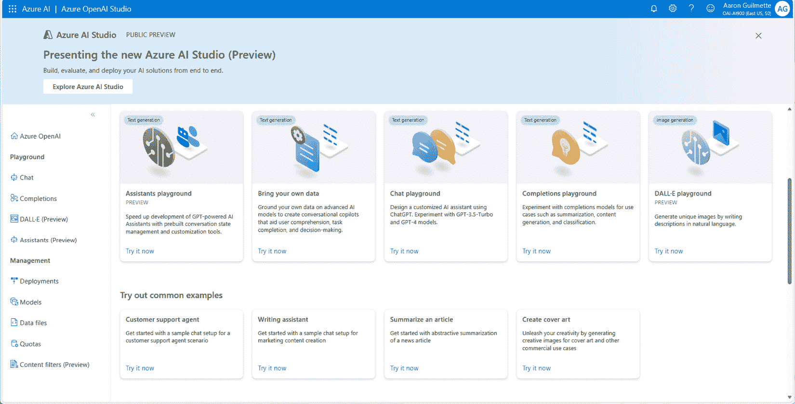

# 11

# 识别 Azure OpenAI 服务的功能

在本章的最后一部分，我们将探讨 Azure OpenAI 服务的功能。如果你还记得，OpenAI 是 ChatGPT 和 DALL-E 等目前一些最受欢迎的**生成人工智能**（**GenAI**）产品背后的公司。

Azure OpenAI 服务将相同的功能直接带入 Azure，让您能够无缝地使用自己的数据生成新的**补全**和图像。

本章将涵盖以下目标和技能：

+   什么是 Azure OpenAI 服务？

+   描述 Azure OpenAI 服务的**自然语言生成**（**NLG**）能力

+   描述 Azure OpenAI 服务的代码生成能力

+   描述 Azure OpenAI 服务的图像生成能力

到本章结束时，您应该能够轻松描述 Azure 认知服务工具系列中强大新 OpenAI 服务的特性和功能。

# 什么是 Azure OpenAI 服务？

Azure OpenAI 服务是一个基于云的平台，它将 OpenAI 开发的尖端**人工智能**（**AI**）模型集成到 Azure 生态系统中。

## 包括哪些内容？

从高层次来看，Azure OpenAI 服务将 OpenAI 的模型与 Azure 平台相结合。包括以下四个主要组件：

+   预训练的 GenAI 模型

+   定制和微调

+   负责任的 AI 框架和工具以帮助减轻伤害

+   安全性包括私有网络和**基于角色的访问控制**（**RBAC**）

此服务为企业和开发者提供了访问一些最先进的 AI 模型的机会，例如以下内容：

+   **GPT-4**：作为 OpenAI 的**生成预训练转换器**（**GPT**）模型的最新版本，GPT-4 模型提供了先进的**自然语言理解**（**NLU**）和自然语言生成（**NLG**）能力，使得内容创作、对话模拟、代码补全、语言翻译以及跨多个行业的复杂问题解决等多样化应用成为可能。

+   **GPT-3.5**：这个 GPT 模型是一个强大的语言生成人工智能，擅长创建类似人类的文本、回答问题、撰写文章、编码等，使其在客户服务、内容创作、教育和软件开发等领域具有高度的应用性。特别是，**GPT-3.5 Turbo**模型针对快速**自然语言处理**（**NLP**）进行了优化，非常适合基于聊天的交互，如聊天机器人和互动客户支持场景。

+   **嵌入（Embeddings）**: 正如你在*第十章*中学习的“识别生成式 AI 解决方案的特征”中了解到的，嵌入是将词语（或标记）之间的关系映射出来的过程。Azure OpenAI 服务中的嵌入模型能够实现细微的文本表示，通过捕捉深层次的语调和上下文关系，从而提高语义搜索、内容发现和数据聚类，进而增强 AI 应用，使其结果更加准确和相关性更高。

+   **Codex**: Azure OpenAI 服务中的 Codex 模型通过理解和生成类似人类的代码进行优化，以提供高级编程辅助，实现自动代码生成、解释和错误修复，从而提高开发者的生产力和代码质量。

+   **DALL-E**: Azure OpenAI 服务中的 DALL-E 模型在从文本描述生成创意、详细的图像方面表现出色，为视觉内容创作、设计灵感和增强数字媒体应用提供独特的、定制的视觉效果。

在一个可访问的平台下，这一系列模型和服务能够创建出能够理解、解释、生成和翻译**自然语言**（**NL**）以及生成图像的复杂应用程序。Azure OpenAI 服务旨在使这些强大的 AI 能力更加易于访问和管理，支持从自动化内容生成到客户支持增强的广泛用例。

Azure OpenAI 服务的一个关键特性是其全面的 NLP 工具套件。这包括文本摘要、语言翻译、内容生成和语义搜索等功能。通过利用这些工具，开发者可以增强应用程序，使其具备理解并生成类似人类文本的复杂语言模型，使它们更加互动和智能。这对改善用户体验具有重要意义，无论是通过创建更响应式的聊天机器人、自动化内容创作，还是在应用程序内提供更准确的搜索结果。

Azure OpenAI 服务强调安全和合规性，整合了 Azure 强大的安全措施来保护数据并确保隐私。该服务在安全的 Azure 基础设施内运行，提供企业级的安全功能，包括数据加密、私有网络选项以及符合全球标准。与来自其他供应商的模型不同，微软不会使用客户数据来训练模型。这种对安全的关注使其成为关注保护敏感信息同时利用 AI 技术的组织的可靠选择。

在定制和控制方面，Azure OpenAI 服务允许开发者微调 AI 模型以满足特定的业务需求。这包括在专有数据上训练模型的能力，确保生成的内容与组织的目标和语气一致。此外，该服务提供监控和管理 AI 使用的工具，有助于优化性能并有效管理成本。

注意

**Azure AI**是一个新的产品系列，将传统的 Azure 认知服务和 Azure 应用 AI 服务汇集在一起。

## Azure AI 服务和 Azure OpenAI 服务之间的区别是什么？

在微软与 OpenAI 建立关系之前，Azure 拥有多样化的基于**机器学习**（**ML**）和 AI 的服务组合。在本节中，我们将确定产品系列之间的相似之处和不同之处。

### 有何相似之处？

由于 Azure AI 和 Azure OpenAI 服务都具备先进的 AI 工具，因此存在几个重叠领域：

+   **与 Azure 的集成**：两者都集成到 Azure 生态系统中，提供与其他 Azure 服务（如 Azure 存储、Azure 函数和 Azure 认知服务）的无缝连接，以提供全面的云解决方案。

+   **AI 能力**：两者都提供 AI 能力，利用机器学习和高级算法来支持各种 AI 任务，如 NLP、文本分析和图像生成。

+   **可扩展性**：它们被设计成可扩展的，使用户能够根据他们的需求扩展他们的 AI 应用，并在 Azure 环境中高效地管理计算资源。

+   **安全和合规性**：两者都遵循 Azure 的安全标准，提供工具和配置来确保数据隐私、合规性和云中安全的 AI 操作。

让我们看看区分因素，看看哪些功能可能会影响您选择其中一个而不是另一个。

### 有何不同？

虽然两者相似，但可能难以理解在哪里划线，以及针对特定场景选择哪个服务：

+   **范围和重点**：Azure AI 服务涵盖广泛的 AI 工具和认知服务，包括视觉、语音、语言、决策和网页搜索功能，旨在处理通用 AI 任务。相比之下，Azure OpenAI 服务专门提供对 OpenAI 的先进模型（如 GPT-3、Codex 和 DALL-E）的访问，专注于最先进的自然语言和图像生成能力。

+   **模型定制**：Azure AI 服务通常提供预构建和可定制的模型，针对特定任务进行优化，例如文本分析或**计算机视觉**（**CV**），从而在不同领域实现更广泛的应用。然而，Azure OpenAI 服务专注于提供对大规模生成模型的访问，这些模型可以针对特定任务进行微调和适应，尤其是在语言理解和生成方面。

+   **用例**：虽然 Azure AI 服务适用于广泛的标准化 AI 场景，包括语音识别、语言翻译和异常检测，但 Azure OpenAI 服务更加专业化，针对需要深度自然语言理解、创意内容生成和高级代码自动化的用例。

+   **技术和创新**：Azure OpenAI 服务代表了人工智能研究和能力的尖端，特别是在生成式人工智能领域，提供了人工智能技术和模型的一些最新进展。相比之下，Azure AI 服务提供了一套更成熟的工具，覆盖了广泛的 AI 需求，重点在于经过验证、广泛适用的解决方案。

虽然 Azure AI 服务和 Azure OpenAI 服务都是微软在 Azure 云平台内人工智能产品的重要组成部分，但它们满足不同的需求和场景，Azure AI 服务提供了一系列广泛的认知能力，而 Azure OpenAI 服务则专注于高级生成式人工智能模型和应用。

## 访问 Azure OpenAI 服务

既然你已经决定使用 Azure OpenAI 服务，那么如何访问它们呢？

开始使用 Azure OpenAI 服务的最简单方法是访问位于[`oai.azure.com/portal`](https://oai.azure.com/portal)的**Azure OpenAI Studio**，如图 *图 11*.1* 所示：



图 11.1 – Azure AI Studio 启动概述

登录页面突出显示了可用于部署的模型选择以及一些可以部署的预构建示例。

让我们探索一些界面中的概念和部分。

注意

要访问 Azure OpenAI 服务，只能通过申请流程，并且并不广泛可用。你可以通过填写[`aka.ms/oai/access`](https://aka.ms/oai/access)上的申请表来申请允许访问资源。申请可能需要最多 2 周的时间来处理。

### 游乐场

在 Azure OpenAI Studio 中，游乐场是一个可以体验不同模型功能的地方。核心游乐场包括以下内容：

+   **助手**

+   **聊天**

+   **完成**

+   **DALL-E**

这些区域各有不同的目标，所以让我们开始探索它们吧！

#### 助手

助手游乐场（仅在东 US 2、澳大利亚东部和瑞典中部 Azure 区域可用），旨在帮助您设计和测试满足您需求的定制 AI 助手。

注意

目前，助手是一种更注重代码的部署方式。游乐场展示了工具的能力，但如果你要构建和部署一个，你需要有编码经验。

要配置助手游乐场，请按照以下步骤操作：

1.  从 Azure AI Studio 主页([`oai.azure.com/portal`](https://oai.azure.com/portal))下的**游乐场**，选择**助手**。

1.  如果这是您第一次使用 Azure OpenAI Studio，您可能还没有创建部署，所以我们现在会处理这个问题。如果您已经有了部署，您可以跳到*步骤 4*。在**助手游乐场（预览）**页面，点击**创建****新部署**：


图 11.2 – 创建新部署

1.  在**部署模型**页面，选择一个支持的模型（例如**gpt-35-turbo**）并输入一个部署名称。点击**创建**：


图 11.3 – 配置模型部署

1.  一旦模型已部署，您可以在**助手设置**面板中配置助手的参数，如图*图 11**.4*所示：


图 11.4 – 配置助手的参数

1.  配置完参数后，点击**保存**，然后向助手提出一个符合您在说明中指定的参数的问题：


图 11.5 – 向助手提出在范围内的问题

1.  接下来，尝试向助手提出一个超出其边界的问题：


图 11.6 – 向助手提出超出范围的问题

如您所见，当需要解决特定问题时，助手非常有用。

进一步阅读

游乐场本质上是一个演示环境，其中包含一个示例产品——游乐场中的助手并不打算向最终用户发布。要实现这一点，您需要在 Azure OpenAI 服务中开发一个助手。有关开发和部署助手的更多信息，请参阅[`learn.microsoft.com/en-us/azure/ai-services/openai/how-to/assistant`](https://learn.microsoft.com/en-us/azure/ai-services/openai/how-to/assistant)。编码和开发助手不在*AI-900*考试的范围内，所以如果您不能阅读或编写复杂的 Python 代码，请不要担心。

#### 聊天

聊天游乐场旨在成为一个可以与聊天机器人互动的区域。一个潜在用途可能是一个回答网站常见问题或其它内容数据库问题的机器人。

要与聊天游乐场一起工作，请使用以下过程：

1.  从 Azure AI Studio 主页([`oai.azure.com/portal`](https://oai.azure.com/portal))，在**游乐场**下选择**聊天**。

1.  使用**设置**面板中的**提示**选项卡，自定义系统消息（一种提供模型背景信息或操作说明的**元提示**）。您可以从几个内置的示例配置中选择一个（例如**营销写作助手**、**莎士比亚写作助手**、**美国国税局税务聊天机器人**，以及其他一些选项），见图*图 11**.7*：


图 11.7 – 在 Chat 游乐场中配置选项

1.  在您为聊天机器人代理配置了参数后，您可以在聊天窗口中开始输入文本：


图 11.8 – 测试 Chat 游乐场

与助手游乐场不同，Chat 游乐场允许你导入和导出设置，以及直接将配置部署到网络服务，如 *图 11.9* 所示）：


图 11.9 – 将聊天游乐场部署到网络服务

#### 完成项

完成项游乐场可能最像你在商业产品（如 ChatGPT）中看到的特性。您可以通过在 Azure OpenAI Studio 的 **游乐场** 列表中选择 **完成项** 来了解一些完成项的功能（[`oai.azure.com/portals`](https://oai.azure.com/portals)）。

无需进一步配置。您可以从 **示例** 下拉菜单中选择示例提示，如图 *图 11.10* 所示：


图 11.10 – 与完成项游乐场一起工作

通过点击 **查看代码** 选项，您将获得一个预构建的模板，用于将您的完成项提示和设置部署到应用程序中：


图 11.11 – 查看完成项部署代码

提供了 Python、C#、JSON 和 curl 的代码示例。

#### DALL-E

DALL-E 游乐场（仅在东 US 2、澳大利亚东部和瑞典中部 Azure 区域可用），旨在帮助您设计和测试满足您需求的定制 AI 助手。

DALL-E 游乐场也不需要配置，尽管可以通过 **DALL-E** **设置** 选项公开一些参数：


图 11.12 – 通过 DALL-E 游乐场生成图像

与 **完成项** 游乐场一样，集成代码可通过游乐场页面上的 **查看代码** 选项获取。

接下来，我们将查看 Azure OpenAI Studio 的管理功能。

### 管理

在 **管理** 部分下，有五个节点：

+   **部署**

+   **模型**

+   **数据文件**

+   **配额**

+   **内容过滤器**

我们将简要介绍这些区域中的功能。

#### 部署

**部署** 指的是特定模型与配置设置的组合。在 **部署** 页面上，您可以创建、编辑和删除部署：


图 11.13 – 部署页面

部署使外部消费 AI 服务或模型成为可能。

#### 模型

在 Azure OpenAI 服务的上下文中，**模型**指的是预训练的 AI 算法，如 GPT-3、Codex 或 DALL-E，这些算法旨在执行特定任务，如 NLP、文本生成、代码生成或图像创建：


图 11.14 – 模型页面

在**模型**页面，你可以部署现有的模型之一或创建一个新的自定义部署以进行微调，基于现有模型。

进一步阅读

你可以在这里找到可用的模型列表：[`learn.microsoft.com/en-us/azure/ai-services/openai/concepts/models`](https://learn.microsoft.com/en-us/azure/ai-services/openai/concepts/models)

#### 数据文件

在**数据文件**页面，你可以上传用于训练、验证或自定义模型的数据库。

#### 配额

**配额**页面用于查看模型的配额以及请求增加配额。参见*图 11*.15：


图 11.15 – 配额页面

除了配额管理，你应该努力确保你正在充分利用你的 Azure 花费。AI 服务可能会迅速增加，因此利用适合工作的正确类型的模型非常重要。你可以在这里了解更多关于 Azure AI 定价模型的信息：[`azure.microsoft.com/en-us/pricing/details/cognitive-services/#pricing`](https://azure.microsoft.com/en-us/pricing/details/cognitive-services/#pricing)。

#### 内容过滤器

内容过滤提供了在基于 AI 的应用程序中检测和采取行动的潜在敏感或有害内容的能力：


图 11.16 – 配置内容过滤器

**仇恨**、**性**、**自残**和**暴力**过滤器类别的配置对提示和完成都可用。

接下来，我们将具体深入探讨 Azure OpenAI 服务的 NLG 功能。

# 描述 Azure OpenAI 服务的自然语言生成功能

OpenAI 的自然语言处理模型采用复杂的算法来理解和生成类似人类的文本。正如你在*第十章*中学习的，“识别生成式 AI 解决方案的特征”，这些模型是在包含单词或字符序列的庞大数据集上训练的，这些序列被称为标记。

例如，一个复杂的单词如 *juggernaut* 可能会被分割成更小的标记如 *jug*、*ger* 和 *naut* 以进行更细致的分析，而一个简单且更常见的单词如 *train* 可能被视为单个标记。然后，每个标记被转换成一个数值向量，这个过程将文本信息转换成机器学习模型可以高效处理和学习的格式。

这种令牌化使得模型能够辨别语言中的模式、关系和上下文，从而促进对语言结构的深入理解。当与用户输入交互时，模型同样将文本分解成令牌，应用其学到的模式来解释输入或生成回复。这个令牌化过程是使模型能够处理各种自然语言任务的关键步骤，从文本补全和翻译到内容生成和情感分析，它是 OpenAI 对自然语言理解（NLU）和自然语言生成（NLG）方法的基础。

如果您尝试使用 OpenAI 的 ChatGPT ([`chat.openai.com`](https://chat.openai.com))，您已经与一个生成式预训练模型进行了交互。提供给模型的请求和其他指令或源内容被称为**提示**。您可以使用提示简单地提问，或者可以更复杂，提供格式化输出的示例或其他指南。

GPT 模型非常易于使用，可以响应自然语言请求。您可以在*表 11.1*中查看一些常见任务和潜在的 GPT 提示：

| **任务** | **潜在提示** |
| --- | --- |
| 概括文本 | 将以下内容概括成一段话 |
| 建议内容 | 给我一份为新冰淇淋店想出的有趣名字列表 |
| 翻译 | 将“我在哪里可以买到玉米卷”翻译成德语 |
| 回答问题 | 马格丽塔的配料有哪些？ |
| 文本分类 | 根据这个文本样本，这本书的流派是什么？ |
| 概念解释 | 用 12 岁孩子能理解的语言解释弦理论 |

表 11.1 – 任务和提示

通过提示进行交互可能看起来像这样：


图 11.17 – 与类似 ChatGPT 的 GenAI 交互

然而，需要注意的是，GenAI 并非权威的，因此请务必检查您的回复是否符合您的预期或可以由其他来源验证。（如果您对制作 birria 玉米卷感兴趣，可以探索这个特定的聊天：[`chat.openai.com/share/1086e9bc-0dd0-4e73-a42f-af616e6ed687`](https://chat.openai.com/share/1086e9bc-0dd0-4e73-a42f-af616e6ed687))。

根据您的使用场景，您可能会发现使用提供模型适当背景信息和输出约束的提示框架或模式是有价值的。

进一步阅读

有关一些提示框架示例，请参阅[`www.undocumented-features.com/2023/12/15/ChatGPT-patterns-practices-and-prompts/`](https://www.undocumented-features.com/2023/12/15/ChatGPT-patterns-practices-and-prompts/)。

# 描述 Azure OpenAI 服务的代码生成功能

GPT 模型具有将 NL 或代码摘录转换为可执行代码的能力。OpenAI 的 GPT 模型在包括 C#、JavaScript、Perl、PHP、PowerShell、Ruby、Swift、TypeScript、SQL 和 Go 在内的多种语言中表现出色，尽管 Python 是其强项。

这些模型在 NL 和包含数十亿行代码的庞大存储库上进行了训练。它们擅长根据 NL 指令生成代码，包括代码注释，并提供完成代码函数的建议。

Codex，GPT-3 的后代，已经在不同语言的多种代码样本和存储库上进行了训练，可以回答代码补全或审查任务。

在这个例子中，GPT 被要求生成一个代码示例，该示例将 1 到 100 之间的所有数字相加：


图 11.18 – 指示 GPT 生成代码示例

与任何 GenAI 任务一样，你应该检查其工作：


图 11.19 – 验证生成的代码

虽然这个例子运行得很好，但你仍然可能想要进行一些实验或测试，以确保输出确实是你所期望的。在这个简单的例子中，你可以在 `for` 循环中放置一个简单的 `Write-Host $sum` 语句，这样你可以直观地检查输出。

同样重要的是要注意，还有其他时候它并不适用，例如这个例子：


图 11.20 – 不是正确的答案，GPT

在扩展操作代码时，除非你有特定领域的工作经验，否则可能无法立即辨别：

```py
# Connect to SharePoint Online
$adminUsername = "admin@contoso.onmicrosoft.com"
$adminPassword = "YourAdminPassword"
$tenantName = "contoso"
$tenantUrl = "https://$tenantName-admin.sharepoint.com"
$credentials = New-Object -TypeName System.Management.Automation.PSCredential -ArgumentList $adminUsername, (ConvertTo-SecureString -String $adminPassword -AsPlainText -Force)
Connect-SPOService -Url $tenantUrl -Credential $credentials
# Block access to user's OneDrive site
$userEmail = "user@contoso.com"
Set-SPOSite -Identity $userEmail -SharingCapability Disabled
```

虽然 `Set-SPOUser` 是正确的 cmdlet，但管理共享功能并不是正确的选项。

当进一步追问时，GPT 会提供更多细节：


图 11.21 – 要求 GPT 解释自身

根据 `关于 LockState 参数如何` 的具体反馈提示，GPT 使用更合适的命令提供了一个更新的脚本。这强调了理解 GenAI 的局限性以及确保工作得到验证的重要性，这样你就可以相应地采取行动，并选择最合适的行动方案。

OpenAI 的模型也擅长解释代码。你可以要求 GPT 对代码片段、语句或函数的目的进行说明，如图 *图 11.22* 所示：


图 11.22 – 要求 GPT 进行代码评估

OpenAI 还与 GitHub 合作，构建了一个可以集成到 Visual Studio 中的 copilot，以帮助进行代码补全和建议。

将 GitHub Copilot 添加到 Visual Studio Code 就像添加任何其他扩展一样简单。一旦启用，GitHub CoPilot 将根据你已输入的文本所选的语言和上下文自动建议代码：


图 11.23 – GitHub Copilot 建议代码

注意

GitHub Copilot 需要订阅。

你还可以尝试诸如`改进我的代码`、`解释这段代码`或`将此 C#代码翻译成 Java`之类的提示。

接下来，我们将探讨该平台的一些图像生成能力。

# 描述 Azure OpenAI 服务的图像生成能力

在 Azure OpenAI 服务领域，图像生成能力可以有多种形式，例如创建新图像的提示或对基础图像的定制。

DALL-E 是基于文本提示生成图像的模型系列。提示越详细，结果越好。你甚至可以请求特定风格的图像，例如*一只像萨尔瓦多·达利风格的狗*、*一幅包括披萨的田园风光，风格模仿克洛德·莫奈*，或*蒸汽朋克* *农场拖拉机*：


图 11.24 – 在游乐场中查看 DALL-E 生成的图像

根据模型部署周围的代码应用，你还可以提交诸如`添加一个坐在拖拉机座位上的人`或`更新狗，让它戴上帽子`之类的编辑。当前模型不允许编辑或修改生成的图像；相反，你是在使用更新的提示参数生成新的图像。

# 摘要

Azure OpenAI 服务将 OpenAI 模型的 capability 带入 Azure，允许你使用自己的数据构建定制应用程序。在本章中，我们讨论了 Azure AI 和 Azure OpenAI 服务之间的一些相似之处和不同之处。

Azure OpenAI Studio 最令人兴奋的功能之一是能够通过游乐场探索模型——这些是虚拟区域，你可以在这里尝试模型和提示。

Azure OpenAI 服务是帮助组织扩展其自动化和机器学习能力的强大工具。

# 考试准备练习 – 章节复习问题

除了对关键概念有扎实的理解外，能够在时间压力下快速思考是一项有助于你在认证考试中取得优异成绩的技能。这就是为什么在学习的早期阶段就培养这些技能至关重要。

章节复习问题旨在通过学习每个章节并复习章节中的关键概念来逐步提高你的应试技巧。你将在每个章节的末尾找到这些问题。

在继续之前

如果你没有 Packt 图书馆订阅或你没有从 Packt 商店购买这本书，你需要解锁在线资源以访问考试准备练习。解锁是免费的，并且只需要进行一次。要了解如何操作，请参阅标题为 *第十二章**，访问 *在线资源* 的章节。

要打开本章的复习题，请执行以下步骤：

1.  点击链接 – [`packt.link/AI-900_CH11`](https://packt.link/AI-900_CH11)。

    或者，你可以扫描以下二维码 (*图 11.25*):


图 11.25 – 为登录用户打开章节复习题的二维码

1.  一旦登录，你将看到一个类似于 *图 11.26* 所示的页面：


图 11.26 – 第十一章复习题

1.  准备就绪后，开始以下练习，多次重新尝试测验。

## 考试准备练习

对于前三次尝试，不要担心时间限制。

### 尝试 1

第一次，目标至少达到 **40%**。查看你答错的答案，并再次阅读章节中的相关部分，以修复你的学习差距。

### 尝试 2

第二次，目标至少达到 **60%**。查看你答错的答案，并再次阅读章节中的相关部分，以修复任何剩余的学习差距。

### 尝试 3

第三次，目标至少达到 **75%**。一旦得分达到 75% 或以上，你开始练习你的时间。

小贴士

你可能需要超过 **三次** 尝试才能达到 75%。这没关系。只需复习章节中的相关部分，直到你达到目标。

## 练习时间管理

你的目标是保持得分不变，同时尽可能快地回答这些问题。以下是你下一次尝试的示例：  

| **尝试** | **得分** | **用时** |
| --- | --- | --- |
| 尝试 5 | 77% | 21 分 30 秒 |
| 尝试 6 | 78% | 18 分 34 秒 |
| 尝试 7 | 76% | 14 分 44 秒 |

表 11.2 – 在线平台上的样本时间练习练习

注意

上表中显示的时间限制只是示例。根据网站上的测验时间限制，为每次尝试设定自己的时间限制。

每次新的尝试，你的得分应保持在 **75%** 以上，而完成所需的时间应“减少”。重复尽可能多的尝试，直到你对时间压力感到自信。
