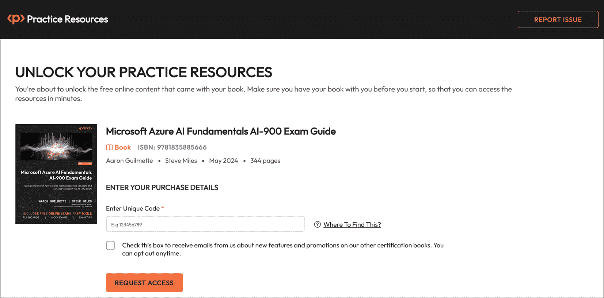
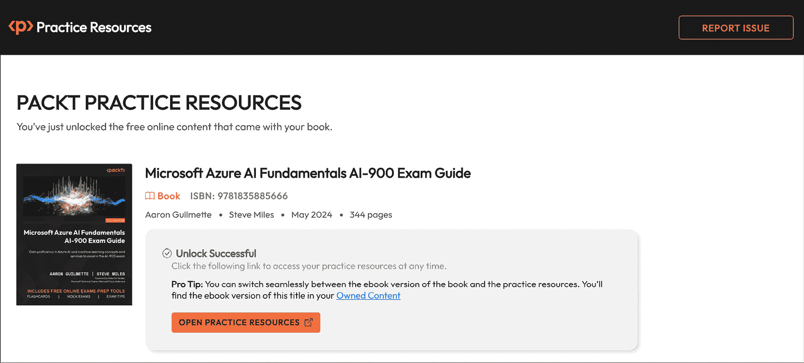
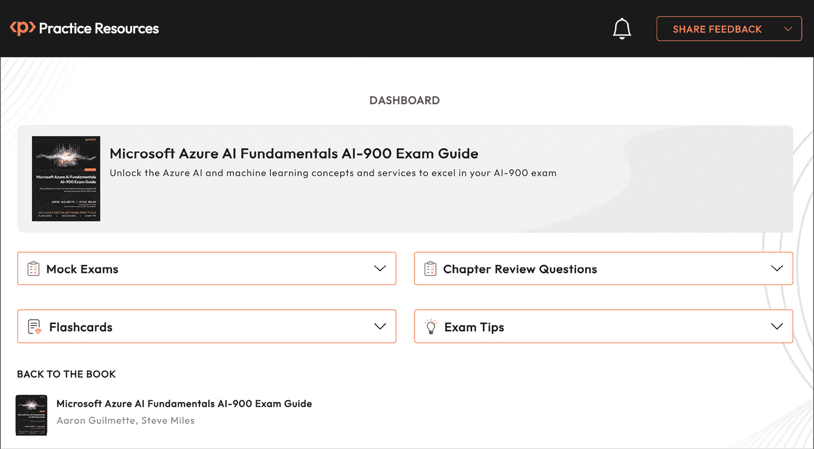
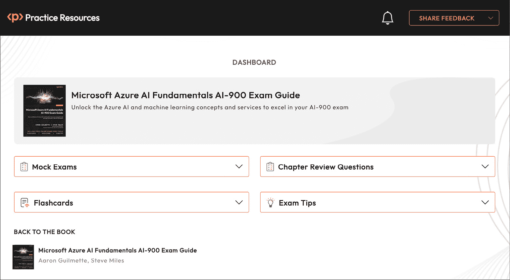
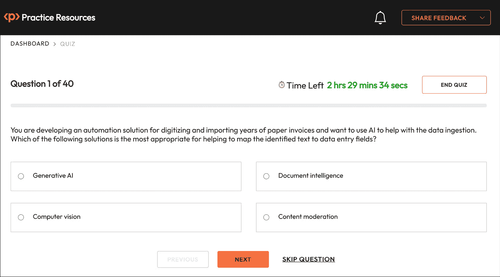
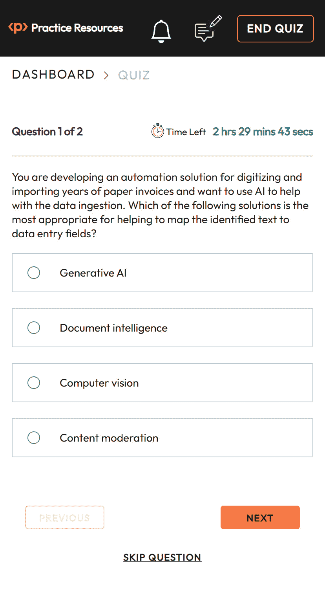
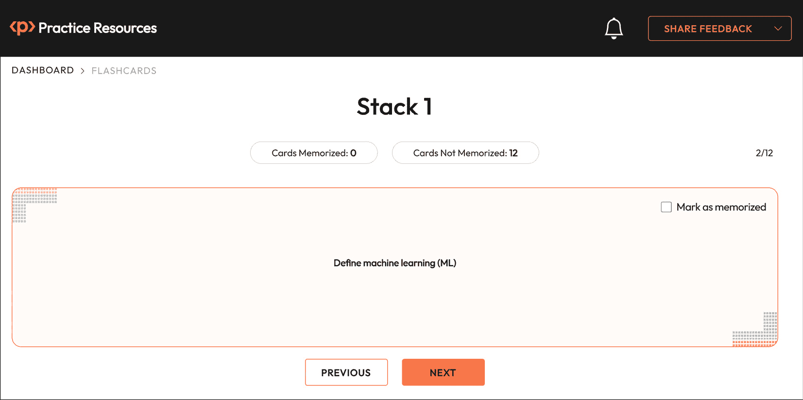
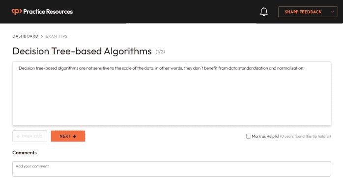
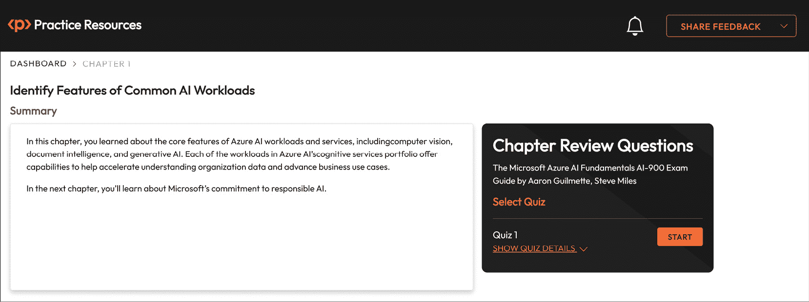
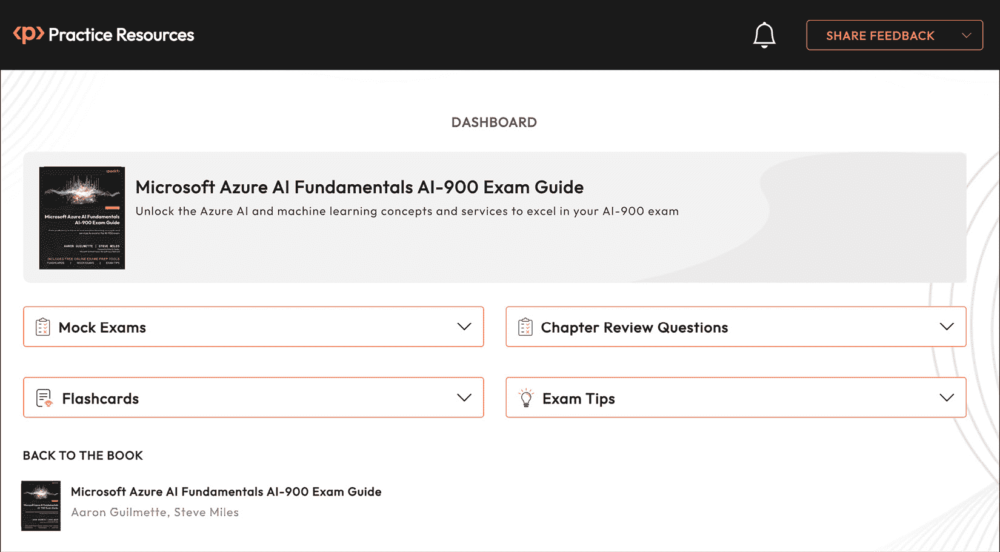

# 第十二章：访问在线实践资源

您的 *Microsoft Azure AI 基础 AI-900 考试指南* 版本附带免费在线实践资源。使用这些资源，通过在配套网站上尝试练习题来进一步提高您的考试准备。该网站用户友好，可以从手机、桌面和平板设备访问。它还包括交互式计时器，以提供类似考试体验。

# 如何访问这些资源

根据您的购买来源，您可以这样开始访问这些资源。

## 从 Packt Store（packtpub.com）购买

如果您从 Packt 商店（[packtpub.com](http://packtpub.com)）购买了电子书或印刷版，请前往 [`packt.link/AI-900_examguide`](https://packt.link/AI-900_examguide)。在那里，使用您创建或用于购买书籍的相同 Packt 账户登录。

## Packt+ 订阅

如果您是 Packt+ 订阅者，您可以前往相同的链接 ([`packt.link/AI-900_examguide`](https://packt.link/AI-900_examguide))，使用您的 Packt ID 登录，并开始使用资源。只要您的订阅有效，您就可以访问它们。如果您在访问免费资源时遇到任何问题，请联系我们 customercare@packt.com。

## 从 Amazon 和其他来源购买

如果您从上述提到的其他来源（如 *Amazon*）购买，您需要通过输入本节提供的唯一注册码来首先解锁资源。**解锁过程不到 10 分钟，可以在任何设备上完成，并且只需进行一次**。按照以下五个简单步骤完成此过程：

### 第 1 步

打开链接 [`packt.link/AI-900_examguideunlock`](https://packt.link/AI-900_examguideunlock) 或扫描以下 **二维码** (*图 12.1*):


图 12.1 – 解锁本书免费在线内容的二维码

任意一个链接都会引导到如下页面，如图 *图 12.2* 所示：


图 12.2 – 在线实践资源解锁页面

### 第 2 步

如果您已经有 Packt 账户，请选择“是，我有一个现有的 Packt 账户”。如果没有，请选择“否，我没有 Packt 账户”。

如果您没有 Packt 账户，下一页将提示您创建一个新账户。这是免费的，只需一分钟就能完成。

选择其中一个选项后，点击“继续”。

### 第 3 步

在您创建账户或登录现有账户后，您将被引导到如下页面，如图 *图 12.3* 所示。

记下您的唯一解锁码：

```py
JUM3856
```

将此代码输入或复制到标有“**输入** **唯一码**”的文本框中：



图 12.3 – 输入您的唯一注册代码以解锁资源

故障排除技巧

在创建账户后，如果您的连接断开或您意外关闭了页面，您可以重新打开*图 12.2*中显示的页面，并选择“是，我有一个现有账户”。然后，使用您在关闭页面之前创建的账户登录。您将被重定向到*图 12.3*中显示的屏幕。

### 第 4 步

注意

你可以选择接收有关功能更新和我们的其他认证书籍优惠的电子邮件。我们不会发送垃圾邮件，而且随时都可以轻松退订。

点击“请求访问”。

第 5 步

如果您输入的代码正确，您将看到一个按钮，上面写着“打开练习资源”，如*图 12.4*所示：



图 12.4 – 成功解锁后出现的页面

点击“打开练习资源”链接开始使用您的免费在线内容。您将被重定向到*图 12.5*中显示的仪表板：



图 12.5 – AI-900 练习资源仪表板页面

书签此链接

现在您已经解锁了资源，您可以通过访问[`packt.link/AI-900_eg_dashboard`](https://packt.link/AI-900_eg_dashboard)或扫描*图 12.6*中提供的以下二维码随时返回它们：


图 12.6 – 书签练习资源网站二维码

# 故障排除技巧

如果你在解锁时遇到问题，这里有三件事你可以做：

+   仔细检查您的唯一代码。我们书中的所有唯一代码都是区分大小写的，并且您的代码需要与*第 3 步*中显示的完全一致。

+   如果这还不行，请使用页面右上角的“报告问题”按钮。

+   如果你根本无法打开解锁页面，请给 customercare@packt.com 写信，并提及书籍名称。

# 练习资源 – 快速浏览

本书将为你提供通过考试所需的所有知识。虽然学习关键概念很重要，但如果你将书中所学应用到实践中并练习，你通过考试的机会会更高。这就是在线练习资源的作用所在。通过互动模拟考试、闪卡和考试技巧，你可以在路上练习书中所学的一切。以下是一个快速浏览你将获得的内容。

## 清新、简单的认证练习体验

您将获得一个清新、简单的用户界面，它适用于所有现代设备，包括您的手机和平板电脑。所有功能都适用于所有设备，只要您有一个正常工作的互联网连接。从“仪表板”(*图 12.7*)，您只需点击一下即可访问本书附带的所有练习资源。如果您想回到书中，您也可以从这里做到：



图 12.7 – 桌面设备上的仪表板界面

## 练习问题

**测验界面** (*图 12.8*) 设计用来帮助你集中注意力，不受任何杂乱信息的干扰。

你可以快速在多个问题之间导航，如果你不知道答案，可以跳过一个问题。界面还包括一个实时计时器，如果你时间用完，它会自动提交你的测验。

如果你想要直接跳转到结果页面查看所有答案，请点击 `结束测验`。



图 12.8 – 桌面设备上的练习问题界面

不论是乘坐火车上班时只带手机，还是周末下午在沙发上用平板电脑，只要设备连接到互联网，测验界面在所有设备上都能正常工作。

*图 12.9* 展示了在移动设备上界面的截图：



图 12.9 – 移动设备上的测验界面

## 闪卡

**闪卡** 设计用来帮助你记住关键概念。以下是如何充分利用它们的方法：

+   我们已经将所有闪卡组织成堆。想象这些就像你手中的实际卡片堆。

+   你从一副完整的卡片开始。

+   当你打开一张卡片时，花几分钟时间回忆答案。

+   点击卡片上的任何地方以显示答案 (*图 12.10*)。

+   多次翻动卡片，完全记住卡片内容。

+   当你觉得你已经记住了它，点击卡片右上角的 `标记为已记住` 按钮。通过点击“下一步”继续下一张卡片。

+   当你移动到卡片堆中的其他卡片时，重复这个过程。

你可能一次无法记住所有卡片。这就是为什么当你下次打开卡片堆时，你只会看到你尚未记住的卡片。

你的目标是到达一个空卡片堆，记住该堆中的每一张闪卡。



图 12.10 – 闪卡界面

## 考试技巧

**考试技巧** (见图 12.11) 设计用来帮助你准备好考试。从你准备旅程的开始到考试当天，这些技巧被组织起来，以便你可以一次性复习所有内容。如果你在准备过程中发现某个考试技巧很有用，请确保将其标记为有用，这样其他读者也可以从你的见解和经验中受益。



图 12.11 – 考试技巧界面

## 章节复习问题

你会在每一章的末尾找到**章节复习问题**的链接，就在**总结**部分之后。这些问题的设计是为了帮助你巩固本章的学习，然后再继续下一章。每一章都会有一个基准分数。目标是在选择下一章之前匹配或超过这个分数。在**章节复习问题**页面上，你会找到一个章节的摘要，以便快速参考，如图 *图 12.12* 所示：



图 12.12 – 章节复习问题页面

## 分享反馈

如果你发现平台、本书或任何练习材料有任何问题，你可以从任何页面点击“分享反馈”按钮并联系我们。如果你有任何改进建议，也可以分享。

# 返回本书

为了使在本书和练习资源之间切换变得容易，我们添加了一个链接，可以将你带回到本书（*图 12.13*）。点击它以在 Packt 的在线阅读器中打开你的书。你的阅读位置会同步，这样你就可以在你上次打开书的地方直接跳转回来。



图 12.13 – 从仪表板跳转回本书

注意

网站的一些元素可能会随着时间的推移而发生变化，因此它们可能看起来与本书截图中的表示不同。
