# *第一章*：理解端到端机器学习流程

欢迎来到《精通 Azure 机器学习》的第二版。在本章的第一章，我们希望让你了解哪些类型的问题需要使用**机器学习**（**ML**），完整的机器学习过程是如何展开的，以及在这个广阔领域导航所需的哪些知识。你可以将其视为机器学习的介绍和本书的概述，其中对于大多数主题，我们将提供对后续章节的参考，以便你能够轻松地在书中找到自己的位置。

在第一部分，我们将问自己什么是机器学习，我们应该在何时使用它，以及它从何而来。此外，我们将反思机器学习只是编程的另一种形式。

在第二部分，我们将奠定你处理数据所需的数学基础，并且我们将理解你工作的数据可能无法完全信赖。此外，我们将探讨不同类别的机器学习算法，它们的定义，以及我们如何定义训练模型的性能。

最后，在第三部分，我们将探讨机器学习项目的端到端流程。我们将了解从哪里获取数据，如何预处理数据，如何选择合适的模型，以及如何将此模型部署到生产环境中。这也会让我们接触到**机器学习操作**的话题，通常称为**MLOps**。

在本章中，我们将涵盖以下主题：

+   理解机器学习背后的理念

+   理解统计分析和机器学习建模的数学基础

+   发现端到端机器学习流程

# 理解机器学习背后的理念

术语**人工智能**（**AI**）和部分地**机器学习**（**ML**）在当今世界无处不在。然而，在**AI**这个术语下找到的很多东西往往不过是一个容器化的机器学习解决方案，而且更糟糕的是，机器学习有时被不必要地用于解决极其简单的问题。

因此，在本节的第一部分，让我们了解机器学习试图解决的问题类别，在哪些场景下使用机器学习，以及在何时不应使用它。

## 需要机器学习的问题和场景

如果你寻找机器学习的定义，你通常会找到一个这样的描述：*它是使用数据研究自我改进的机器算法的学科*。机器学习基本上被描述为我们试图进化的算法，这反过来又可以被视为一个复杂的数学函数。

今天的任何计算机过程都遵循简单的**输入-处理-输出（IPO）模型**结构。我们定义允许的输入，我们定义一个处理这些输入的过程，并通过该过程将显示的结果类型定义输出。一个简单的例子是一个文字处理应用程序，其中每个按键都会在屏幕上显示为输出字母。可能并行运行的一个完全不同的过程可能有一个基于时间的触发器，定期将文本文件存储到硬盘上。

所有这些过程或算法有一个共同点——它们都是某人使用**高级编程语言**手动编写的。当有人在文字处理应用程序中按下一个字母时，需要执行哪些操作是显而易见的。因此，我们可以轻松构建一个过程，其中我们实现哪些输入值应该创建哪些输出值。

现在，让我们看看一个更复杂的问题。想象一下，我们有一张狗的图片，并希望一个应用程序能够说：*这是一只狗*。这听起来很简单，因为我们知道输入*狗的图片*和输出值*狗*。不幸的是，我们的大脑（我们自己的机器）比我们构建的机器优越得多，尤其是在模式识别方面。对于计算机来说，一张图片只是一个由 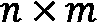 像素组成的正方形，每个像素包含由 8 位或 10 位值定义的三个颜色通道。因此，对于计算机来说，图像只是一堆由向量组成的像素，本质上是一堆数字。

我们可以手动开始编写一个算法，可能聚类像素组，寻找边缘和感兴趣点，最终，经过大量努力，我们可能成功拥有一个在图片中找到狗的算法。但那时我们得到了一张猫的图片。

到现在为止，你应该已经清楚我们可能会遇到问题。因此，让我们定义一个机器学习解决的问题，如下：

*以编程方式构建所需解决方案的期望算法要么非常耗时，要么完全不切实际，或者根本不可能。*

根据这个描述，我们可以确定使用机器学习的良好场景，无论是寻找图像和视频中的对象，还是理解声音并从音频文件中提取其意图。我们将在本章（以及本书的其余部分）中进一步了解构建机器学习解决方案涉及的内容，但简单来说，让我们承认构建机器学习模型也是一个耗时的事情。

在这种情况下，如果我们有机会避免使用机器学习，那么这应该是最重要的。这或许是一个显而易见的陈述，但正如我们（作者）可以证明的那样，对很多人来说并非如此。我们见过一些使用机器学习实现的项目，如果给定一些输入向量，输出可以通过简单的`if`语句组合来定义。在这种情况下，可以通过几百行代码获得解决方案。相反，对机器学习算法进行数月的训练和测试，耗费了大量时间和资源。

例如，一家公司可能想要预测其零售店员工犯下的欺诈（被盗资金）。你可能听说过预测欺诈是机器学习的典型场景。在这里，使用机器学习并不是必要的，因为公司已经知道影响因素（收银员开放的时间长度、退货收据上的错误代码等），因此希望在发生某些因素组合时得到警报。既然他们已经知道这些因素，他们可以直接编写代码并完成。但这个场景告诉我们关于机器学习什么？

到目前为止，我们将机器学习视为解决一个本质上难以编码的问题的解决方案。从前面提到的场景来看，你可能理解了机器学习可以解决的另一个方面或另一类问题。因此，让我们添加第二个问题描述，如下：

*构建一个所需解决方案的期望算法是不切实际的，因为影响所需输出结果的因素只有部分已知或完全未知。*

看到这个问题，你现在可能已经理解为什么机器学习如此依赖于统计学领域，因为通过应用统计学，我们可以了解数据点是如何相互影响的，因此我们可能能够解决这样的问题。同时，我们可以构建一个能够找到并预测所需结果的算法。

在之前提到的检测欺诈的场景中，仍然使用机器学习可能是谨慎的，因为它可能能够找到没有人考虑过的影响因素的组合。但如果这不是你的目标——正如在这个案例中那样——你不应该将机器学习用于那些可以轻易用代码编写的事情。

既然我们已经讨论了一些机器学习解决的问题，并查看了一些机器学习的场景，让我们来看看机器学习是如何产生的。

## 机器学习的历史

要全面理解机器学习，我们首先必须了解它的来源。因此，让我们深入了解机器学习的历史。与历史上的所有事件一样，不同的潮流同时发生，为整个画面增添了碎片。现在，我们将查看几个重要的支柱，这些支柱孕育了我们今天所知道的机器学习的理念。

### 神经科学的学习

一位名叫唐纳德·O·赫布（Donald O. Hebb）的神经心理学家于 1949 年出版了一本名为《行为组织》（The Organization of Behavior）的书。在这本书中，他描述了他关于我们大脑中的**神经元**（神经细胞）如何工作以及它们如何贡献于我们所理解的**学习**的理论。这个理论被称为**赫布学习**（Hebbian learning），并提出了以下命题：

当细胞 A 的轴突足够接近以兴奋细胞 B，并且反复或持续地参与其放电时，一个或两个细胞中会发生一些生长过程或代谢变化，使得 A 作为放电 B 的细胞之一，其效率得到提高。

这基本上描述了一个过程，其中一个细胞反复激发另一个细胞（启动细胞），甚至接收细胞可能通过一个隐藏的过程被改变。这个过程就是我们所说的学习。

为了更直观地理解这一点，让我们看一下神经元的生物结构，如下所示：

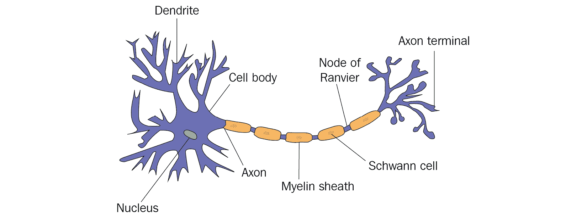

图 1.1 – 生物神经网络中的神经元

这里可视化的是什么？首先，在左边，我们看到细胞的主体及其细胞核。主体通过与其它神经元相连的树突接收输入信号。此外，还有一个从主体伸出的大轴突，它通过一系列施万细胞将主体与所谓的轴突末端连接起来，而轴突末端反过来又连接到其他神经元。

用一些创意来看这个结构，它确实类似于一个函数或算法。我们有来自外部神经元的输入信号，我们有这些信号的一些隐藏过程，我们有一个以轴突末端形式存在的输出，它将结果连接到其他神经元，从而再次连接到其他过程。

又过了十年，才有人意识到这个联系。

### 计算机科学的学习经验

在计算机科学背景下谈论机器学习的历史，如果不提及现代机器之父之一艾伦·图灵，那就很难。在 1950 年发表的一篇名为《计算机与智能》的论文中，图灵定义了一个被称为**模仿游戏**（后来称为**图灵测试**）的测试，用以评估机器是否表现出与人类无法区分的行为。这个测试有多个迭代和变体，但本质上，其想法是，在对话中，一个人在任何时候都不会感觉到他们不是在与人类交谈。

当然，这个测试是有缺陷的，因为有一些方法可以在不真正智能的情况下给出相对智能的答案。如果你想了解更多关于这个的信息，可以看看约瑟夫·魏森鲍姆建造的**ELIZA**，它通过了图灵测试。

尽管如此，这篇论文引发了关于人工智能可能是什么以及机器学习意味着什么的第一次讨论。

在这些激动人心的时代生活，亚瑟·塞缪尔，当时在**国际商业机器公司**（**IBM**）工作的研究人员，开始开发一个能够在国际象棋游戏中做出正确决策的计算机程序。在每一步中，他让程序评估一个评分函数，试图衡量每个可用步骤的获胜机会。由于当时可用的资源有限，计算所有可能的移动组合直到游戏结束是不切实际的。

这第一步导致了所谓的**最小-最大算法**及其伴随的**搜索树**的定义，这通常可以用于任何两人对抗游戏。后来，添加了**alpha-beta 剪枝**算法，以自动从那些没有比已评估的结果更好的决策中剪枝。

我们在谈论 Arthur Samuel，因为正是他提出了“机器学习”这个名称，并将其定义为如下：

研究领域赋予计算机在不被明确编程的情况下学习的能力。

结合为训练机器构建评估函数的第一个想法和 Donald O. Hebb 在神经科学领域的研究，Cornell Aeronautical Laboratory 的研究员 Frank Rosenblatt 发明了一种新的线性分类器，他称之为**感知器**。尽管他在将这个感知器构建成硬件方面的进展相对短暂，并且没有达到其潜力，但它的原始定义如今是**人工神经网络**（**ANN**）中每个神经元的基石。

因此，现在让我们更深入地了解 ANN 是如何工作的，以及我们可以从它们中推断出关于 ML 算法内部工作原理的什么。

## 通过 ANN 的例子理解 ML 的内部工作原理

我们今天所知的 ANN 由以下两个主要组件定义，其中一个我们已经了解过：

+   **神经网络**：系统的基本结构。感知器基本上是一个只有一个神经元的 NN。到目前为止，这种结构已经以多种形式出现，通常涉及数百个神经元的隐藏层，在**深度神经网络**（**DNNs**）的情况下。

+   **反向传播函数**：系统学习和进化的规则。20 世纪 70 年代的一个想法，通过 1986 年由 D. Rumelhart、Geoffrey E. Hinton 和 Ronald J. Williams 发表的名为《通过反向传播错误学习表示》的论文而受到重视。

要理解这两个组件以及它们如何协同工作，让我们更深入地了解它们。

### 神经网络

首先，让我们了解单个神经元是如何工作的，这非常接近 Rosenblatt 定义的感知器理念。以下图表显示了这种人工神经元的内部工作原理：

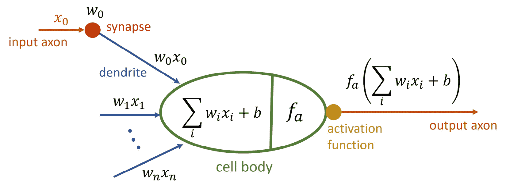

图 1.2 – ANN 中的神经元

我们可以清楚地看到它与真实神经元的相似之处。我们从称为 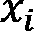 的连接神经元那里获得输入。每个输入都对应一个权重 ，然后在神经元本身中，它们都被加起来，包括一个**偏差** 。这通常被称为**净输入函数**。

作为最终操作，一个所谓的**激活函数** 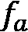 应用于这个网络输入，决定神经元的输出信号应该如何看起来。这个函数必须是连续且可微分的，并且通常应该在[0:1]或[-1:1]的范围内创建结果，以保持结果缩放。此外，这个函数可以是线性的或非线性的，尽管使用线性激活函数有其缺点，如以下所述：

+   您无法通过线性函数系统学习数据中呈现的非线性关系。

+   由只有线性激活函数的节点组成的分层网络可以被简化为只有一个线性激活函数的一层节点，从而使网络变得过时。

+   您不能使用线性激活函数进行反向传播，因为这需要计算该函数的导数，我们将在下一节讨论。

常用的激活函数包括**sigmoid**、**双曲正切**（**tanh**）、**整流线性单元**（**ReLU**）和**softmax**。牢记这一点，让我们来看看我们如何连接神经元以实现人工神经网络（ANN）。一个整个网络通常由三种类型的层定义，如下所述：

+   **输入层**：由接受网络单个输入信号的神经元组成（不是加权求和）。它们的权重可能根据应用是常数或随机化的。

+   **隐藏层**：由我们之前描述的神经元类型组成。它们由一个激活函数定义，并给输入信号的加权求和分配权重。在深度神经网络（DNNs）中，这些层通常代表特定的转换步骤。

+   **输出层**：由执行数据最终转换的神经元组成。它们可以像隐藏层中的神经元一样行为，但不必如此。

这些共同构成了典型的 ANN，如下面的图所示：

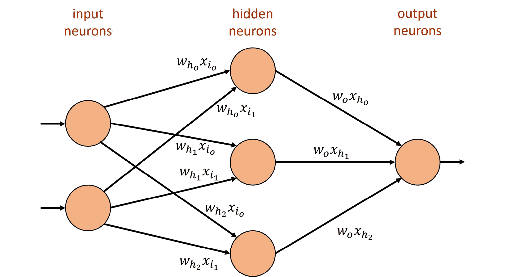

图 1.3 – 具有一个隐藏层的人工神经网络

因此，我们构建了一个通用的结构，它可以接收一些输入，通过不同层的权重和激活函数实现某种形式的数学函数，最终，希望显示正确的输出。这个过程通常被称为**前向传播**。当然，这只能显示通过网络的输入所发生的事情。以下问题仍然存在：*它最初是如何学习所需函数的？*下一节将回答这个问题。

### 反向传播函数

到现在为止，你应该已经想到一个问题：*我们如何定义正确的输出？*为了有一种方式来改变网络的行为，这主要归结为改变系统中权重的值，我们不需要一种量化系统所犯错误的方法吗？

因此，我们需要一个描述错误或损失的函数，称为 **损失函数** 或 **误差函数**。你可能甚至听说过另一个名字——**代价函数**。让我们接下来定义它们。

损失函数与代价函数

损失函数（误差函数）计算单个训练示例的误差。另一方面，代价函数平均整个训练数据集的所有损失函数结果。

这是这些术语的正确定义，但它们通常可以互换使用。只需记住，我们正在使用某种形式的度量来衡量我们犯的错误或与正确结果的距离。

在经典的反向传播和其他机器学习场景中，正确  和计算得到的  之间的 **均方误差** (**MSE**) 用于定义操作的错误或损失。显然的目标是现在最小化这个错误。因此，实际要执行的任务是在 *n*-维空间中找到这个函数的总最小值。

要做到这一点，我们使用通常被称为 **优化器** 的东西，定义如下。

优化器（目标函数）

优化器是一个实现达到最小化代价函数目标特定方式的函数。

其中一种优化器是一个称为 **梯度下降** 的迭代过程。其思想在以下屏幕截图中进行可视化：

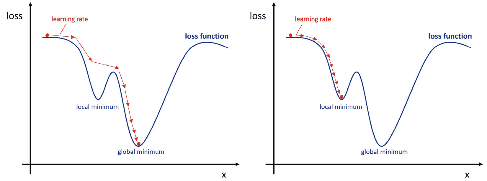

图 1.4 – 仅受一个输入影响的梯度下降损失函数（左：寻找全局最小值，右：陷入局部最小值）

在梯度下降中，我们通过采取合理足够大的步长（通常由 **学习率** 定义），试图导航 *n*-维损失函数，目标是找到全局最小值，同时避免陷入局部最小值。

记住这一点，不深入细节，让我们通过回顾反向传播算法在神经网络中执行的步骤来完成这个想法。这些步骤如下：

1.  将一对 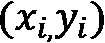 通过网络（前向传播）。

1.  计算预期  和计算得到的 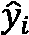 之间的损失。

1.  使用数学链式法则计算所有函数和权重在所有层中的所有导数。

1.  从网络的后面开始更新所有权重到前面，使用优化器定义的略微改变的权重。

1.  重复执行，直到达到收敛（权重不再接收任何有意义的更新）。

简而言之，这就是人工神经网络（ANN）是如何学习的。请注意，在第一步中不断改变对是至关重要的，否则，你可能会使网络过度记住你不断展示给它的这些几个对。我们将在本章后面讨论**过拟合**和**欠拟合**的现象。

作为本节的最后一步，现在让我们将到目前为止关于机器学习所学到的东西以及这对未来构建软件解决方案意味着什么结合起来。

### 机器学习和软件 2.0

到目前为止，我们所学的似乎表明机器学习是由一个具有各种旋钮和杠杆（设置和值）的基础结构定义的，这些旋钮和杠杆可以改变。在人工神经网络（ANN）的情况下，这将是网络本身的结构以及我们可以设置的一些权重、偏置和激活函数。

与这个基础结构相伴的是某种规则或函数，用于在学习过程中如何将这些旋钮和杠杆转换。在人工神经网络（ANN）的情况下，这是通过反向传播函数定义的，该函数结合了损失函数、优化器和一些数学。

2017 年，特斯拉人工智能部门的首席技术官（CTO）安德烈·卡帕西（Andrej Karpathy）提出，上述想法可能是编程的另一种方式，他称之为**软件 2.0**（[`karpathy.medium.com/software-2-0-a64152b37c35`](https://karpathy.medium.com/software-2-0-a64152b37c35)）。

到目前为止，编写软件是关于通过定义它必须遵循的特定命令，向机器精确地解释它必须做什么以及它必须产生什么结果。在这种经典的软件开发范例中，我们通过代码定义算法，让数据通过它运行，通常是用一种相对可读的语言编写的。

而不是这样做，另一个想法可能是定义一个由基础结构、进化这种结构的方式以及它必须处理的数据类型组成的程序。在这种情况下，我们得到的是对人类非常不友好的东西（例如具有权重的 ANN），但对于机器来说可能更容易理解。

因此，我们在本节的结尾留下安德烈想要传达的思想。也许机器学习只是编程机器的另一种形式。

在记住所有这些的同时，现在让我们谈谈数学。

# 理解统计分析和机器学习建模的数学基础

看看我们到目前为止学到的东西，很明显，机器学习需要充分理解数学。我们已经遇到了多个我们必须处理的数学函数。想想神经元的激活函数和训练的优化器以及损失函数。除此之外，我们还没有谈到我们新编程范式的第二个方面——数据！

为了选择正确的机器学习算法并为损失函数推导出良好的指标，我们必须分析我们所处理的数据点。此外，我们还需要将数据点与我们所工作的领域联系起来。因此，在定义数据科学家的角色时，你经常会看到这样的视觉元素：

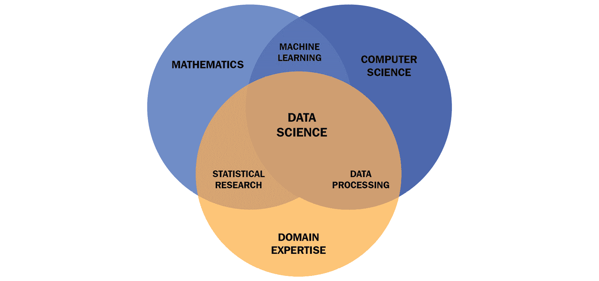

图 1.5 – 数据科学家所需条件

在本节中，我们将专注于*图 1.5*中提到的*统计研究*。我们将了解为什么我们需要统计学，以及我们可以从给定数据集中推导出哪些基本信息，学习什么是偏差以及如何避免它，从数学上对可能的机器学习算法进行分类，最后讨论我们如何选择有用的指标来定义我们训练模型的性能。

## 机器学习中的统计学案例

正如我们所看到的，我们需要统计学来清理和分析我们的给定数据。因此，让我们先问一下：*我们从“统计学”这个术语中理解了什么？*

*统计学是收集和分析大量数值数据构成的代表性样本的科学，目的是推断底层人群的统计分布。*

这样的一个典型例子就是在竞选期间或投票站关闭后不久预测选举结果。在那个时间点，我们不知道整个**人口**的精确结果，但我们可以获取一个**样本**，有时也称为**观察值**。我们通过让人们填写问卷来获取这些信息。然后，基于这个子集，我们通过应用统计方法对整个群体做出合理的预测。

我们了解到，在机器学习中，我们试图让机器找出适合我们问题的数学函数，例如这个：

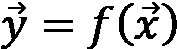

回想一下我们的人工神经网络（ANN）， 将是一个输入向量，而  将是产生的输出向量。在机器学习的术语中，它们有另一个名称，如下所示。

特征和标签

输入向量 *x* 的一个元素被称为特征；完整的输出向量被称为标签。通常，我们只处理一个**一维**标签。

现在，为了将这一点结合起来，在训练机器学习模型时，我们通常只有给定世界的样本，并且正如你在处理现实世界中的任何其他样本或子集时一样，你希望选择高度代表性的特征和底层人群的样本。

那么，这究竟意味着什么？让我们来想一个例子。想象一下，你想要训练一辆小型机器人汽车能够自动通过隧道。首先，我们需要考虑在这个场景中我们的特征和标签是什么。作为特征，我们可能需要一些能够测量汽车每个方向上与隧道边缘距离的东西，因为我们可能不希望汽车撞到隧道的侧面。假设我们在车辆的前方、侧面和后方都安装了一些红外传感器。那么，我们程序的输出可能将控制车辆的转向和速度，这些就是我们的标签。

既然如此，作为下一步，我们应该考虑车辆可能遇到的各种场景。这可能是一个简单的场景，车辆直直地停在隧道中，或者它可能是一个糟糕的场景，车辆几乎卡在角落里，从那个点开始，隧道向左或向右延伸。在所有这些情况下，我们读取红外传感器的值，然后进行更复杂的任务，即做出有根据的猜测，关于转向应该如何改变，以及电机应该如何运行。最终，我们得到一系列示例情况和相应的行动，这些将成为我们的训练数据集。然后，我们可以使用这个数据集来训练一个人工神经网络（ANN），这样小汽车就可以学会如何跟随隧道行驶。

如果你有机会，尝试进行这项训练。如果你挑选了非常好的例子，你将理解机器学习的全部力量，因为你很可能会看到一些令人兴奋的东西，我可以证实这一点。在我的设置中，尽管我们从未有过一个样本，我们会指示车辆倒车，但机器训练出的最优函数的值表明车辆学会了这样做。

在这样的例子中，我们会从头开始做所有的事情，并希望我们自己能够抽取有代表性的样本。在大多数情况下，你将遇到的，数据集已经存在，你需要弄清楚它是否具有代表性，或者我们需要引入额外的数据来实现最佳的训练结果。

因此，让我们看看一些你应该熟悉的统计特性。

## 统计学基础

现在我们明白，我们需要能够分析单个特征的统计特性，推导出它们的分布，并分析它们与数据集中其他特征和标签的关系。

让我们从单个特征的性质及其分布开始。以下所有操作都需要数值数据。这意味着如果你处理的是分类数据或类似媒体文件这样的东西，你需要将它们转换成某种数值表示形式，才能得到这样的结果。

以下截图显示了您所追求的主要统计特性、它们的重要性以及如何计算它们：

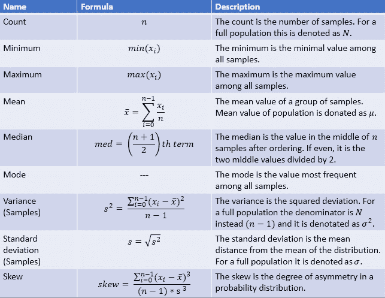

图 1.6 – 主要统计性质列表

从现在开始，我们可以合理地假设基础随机过程遵循**正态分布**。请注意，这并不一定成立，因此你应该熟悉其他分布（参见[`www.itl.nist.gov/div898/handbook/eda/section3/eda36.htm`](https://www.itl.nist.gov/div898/handbook/eda/section3/eda36.htm)）。

下面的截图展示了一个标准正态分布的直观表示：

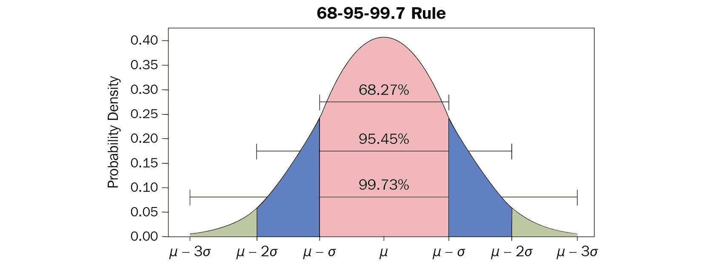

图 1.7 – 标准正态分布及其性质

现在，这种正态分布的强度在于，基于均值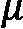和标准差，我们可以对样本落在某个范围内的概率做出假设。如图 1.7 所示，一个值距离均值的距离为 1的概率约为 **68.27**%，距离为的概率为 **95.45**%，距离为的概率为 **99.73**%。基于此，我们可以提出如下问题：

*距离平均值 5**有多大的可能性找到这样的值？*

通过这样的问题，我们可以开始评估我们数据中看到的是分布的统计异常、一个简单的错误值，还是我们的怀疑分布是不正确的。这是通过称为**假设检验**的过程来完成的，定义如下。

假设检验（定义）

这是一种测试所谓的**零假设**是否为假的方法，通常指的是当前怀疑的分布。这意味着我们遇到的罕见观察结果是纯粹的偶然。如果概率低于预定义的显著性水平（通常高于/低于 5%），则拒绝该假设，转而采用备择假设。因此，备择假设假定我们所观察到的结果是由于一个在初始分布中没有考虑到的真实效应。

我们不会深入讨论如何正确执行这项测试的细节，但我们敦促你彻底熟悉这个过程。

我们将要讨论的是在这个过程中可能犯的错误类型，如下面的截图所示：

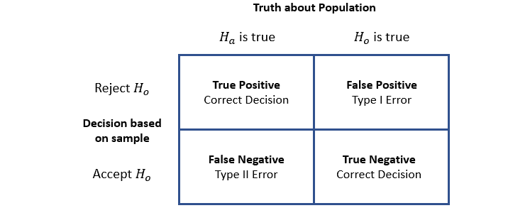

图 1.8 – 一类错误和二类错误

我们将 *图 1.8* 中所见的错误定义为如下：

+   **一类错误**：这表示我们拒绝了假设和基础分布，尽管它是正确的。这也被称为**假阳性**结果或**α 错误**。

+   **第二类错误**：这表示我们没有拒绝假设  和其背后的分布，尽管  是正确的。这种错误也被称为**假阴性**结果或**贝塔** **错误**。

你可能之前听说过**假阳性**这个术语。它通常出现在你进行医学检查时。假阳性表示你在测试中得到了阳性结果，尽管你并没有你正在测试的疾病。由于医学检查也是一个**随机过程**，就像我们世界中的几乎所有其他事物一样，这个术语在这个场景中被正确使用。

在本节的最后，当我们谈到机器学习模型训练中的错误和度量时，我们将回到这些定义。作为最后一步，让我们讨论特征之间的关系以及特征和标签之间的关系。这种关系被称为**相关性**。

有多种方法可以计算两个向量  和  之间的相关性，但它们共同的特点是，它们的结果将落在 [-1,1] 的范围内。这个操作的结果可以大致分为以下三个类别：

+   **负相关**：结果偏向于 -1。当向量  的值上升时，向量  的值下降，反之亦然。

+   **不相关**：结果偏向于 0。向量 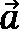 和  之间没有真正的交互作用。

+   **正相关**：结果偏向于 1。当向量  的值上升时，向量  的值也上升，反之亦然。

通过这种方式，我们可以了解数据点之间的关系，但请注意因果和相关性之间的区别，如下所述。

因果关系与相关性

即使两个向量相互关联，这并不意味着其中一个向量是另一个的原因——它仅仅意味着其中一个影响了另一个。这不是因果关系，因为我们可能看不到完整的图景和每一个影响因素。

我们迄今为止讨论的数学理论应该为你提供一个良好的基础来构建。在下一节中，我们将快速查看在采样过程中可能犯的错误类型，通常被称为数据的偏差。

## 理解偏差

在任何采样阶段和数据处理过程中，很容易引入所谓的**偏差**。通常，这会影响采样质量，因此对我们想要拟合数据的任何机器学习模型都有重大影响。

一个例子就是我们刚才讨论的*因果关系与相关性*。在没有因果关系的地方看到因果关系，可能会对你的数据处理方式产生后果。接下来展示的是影响数据的其他显著偏差：

+   **选择偏差**：这种偏差发生在样本不是真实数据分布的代表性样本时。这是在随机化没有正确进行或只选择某个特定子群体进行研究时的情况——例如，当关于城市规划的调查问卷只发放给城市一半地区的居民时。

+   **资助偏差**：这种偏差应该非常为人所知，发生在一项研究或数据项目由赞助商资助，因此结果将倾向于资助方的利益。

+   **报告偏差**：这种偏差发生在由于人们倾向于低估某些结果，导致数据集中只代表了一部分结果。这里给出了一些例子：当你报告恶劣天气事件但不报告晴天时；当你为产品写负面评论但不写正面评论时；当你只了解用你自己的语言或来自你自己的地区的结果，但不了解其他地区的结果时。

+   **观察者偏差/确认偏差**：这种偏差发生在某人倾向于支持或证实他们自己的信念和价值观的结果。通常，这会导致忽视相反的信息，不遵循已同意的指南，或使用支持现有先入为主的观点的模糊研究。这里危险的部分是，这可能是无意识的。

+   **排除偏差**：这种偏差发生在预处理过程中，你移除了你认为无关但实际并非无关的数据点。这包括移除空值、异常值或其他特殊数据点。这种移除可能会导致关于潜在现实分布的准确度下降。

+   **自动化偏差**：这种偏差发生在你更倾向于来自自动化系统的结果，而不是来自人类的信息，即使它们是正确的。

+   **过度泛化偏差**：这种偏差发生在你将数据集的一个属性投射到整个群体上。一个例子是，你会假设所有猫都有灰色毛发，因为在你的大型数据集中，这是真的。

+   **群体归因偏差**：这种偏差发生在由于该群体中少数个体的行为，而将刻板印象作为属性添加到整个群体中。

+   **幸存者偏差**：这种偏差发生在你专注于成功的例子，而完全忽略失败的情况。一个例子是，你在研究你公司的竞争时，却忽略了所有失败、合并或破产的公司。

这个列表应该能让你对在收集和处理数据时可能出现的各种问题有一个很好的理解。我们只能敦促你进一步阅读这个主题，同时遵循以下指南。

处理数据偏差的指导

当使用现有数据集时，找出它们被获取的情境，以便能够判断它们的质量。在单独或团队处理数据时，明确界定如何定义数据和如何处理特定情况，并始终反思你是否是在根据自己的先入之见做出假设。

为了巩固你对事物——大多数时候——并不像它们看起来那样的理解，看看被称为**辛普森悖论**及其相应的**加州大学伯克利分校**（**UC**）案例（[`corysimon.github.io/articles/simpsons-paradox/`](http://corysimon.github.io/articles/simpsons-paradox/)）。

现在我们已经很好地理解了在处理数据时需要注意的事项，让我们回到机器学习的基本概念。

## 机器学习算法的分类

在本章的第一节中，我们简要了解了人工神经网络（ANNs）。它们在以下方面很特别，即它们可以用于所谓的监督或无监督训练设置。为了理解这里的含义，让我们定义当前三种主要的机器学习算法类型，如下所示：

+   **监督学习**：在监督学习中，模型是用所谓的标记数据集训练的。这意味着除了知道所需算法的输入外，我们还知道所需的输出。这种学习分为两个问题组——即**分类问题**和**回归问题**。分类使用离散结果，输出是一个类别或组，而回归使用连续结果，输出将是某个特定值。分类的例子包括在货币交易中识别欺诈或对图像进行目标检测。回归的例子包括预测房价或股市或预测人口增长。重要的是要理解这种学习**需要**标签，这通常会导致标记整个数据集的繁琐任务。

+   **无监督学习**：在无监督学习中，模型是在未标记的数据上训练的。这基本上是一种自我组织的学习，用于在数据中寻找模式，被称为**聚类**。这种方法的例子包括在收件箱中过滤垃圾邮件或推荐某人可能喜欢观看或购买的电影或服装。通常，学习算法在需要直接处理数据的实时场景中使用。这种类型学习的优点是我们不需要标记数据集。

+   **强化学习**：在强化学习中，算法通过对自己所处环境的反应来学习。这种想法来源于我们作为人类在成长过程中学习的方式。我们采取了一定的行动，该行动的结果要么是好的，要么是坏的，要么介于两者之间。然后我们可能会收到某种奖励，也可能不会。另一个类似的例子是训练狗的行为方式。技术上，这是通过所谓的 *代理* 实现的，该代理由 *策略图* 引导，决定在特定状态下采取行动的概率。对于环境本身，我们定义一个所谓的 *状态值函数*，它返回特定状态的价值。这种类型学习的良好例子包括训练机器人的导航控制或游戏的 AI 对手。

以下图表概述了所讨论的机器学习类型及其在这些领域中使用的相应算法：

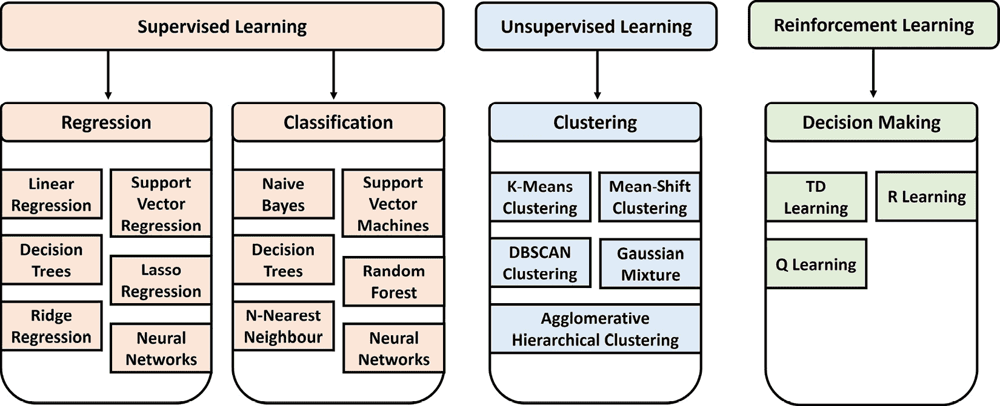

图 1.9 – 机器学习算法类型

许多显著的机器学习算法的详细概述可以在 *scikit-learn* 网页上找到 ([`scikit-learn.org/stable/`](https://scikit-learn.org/stable/))，这是主要的 Python 机器学习库之一。

现在我们已经了解了我们可以执行的训练类型，让我们简要地看看从训练运行中获得的结果类型以及如何解释它们。

## 分析模型训练中的错误和结果质量

正如我们在本章第一节的讨论中提到的，我们需要一个损失函数，我们可以通过最小化它来优化我们的训练结果。通常，这通过数学中所谓的度量来定义。在此处，我们需要区分用于定义损失函数并因此用于优化器训练模型的度量，以及可以计算出来以提供关于训练模型性能的额外提示的度量。在本节中，我们将探讨这两种类型。

正如我们在查看机器学习算法类型时看到的，我们可能处理由连续数据表示的输出（回归），或者我们可能处理由离散数据表示的输出（分类）。

在回归中，最突出的损失函数是 **均方误差 (MSE**) 和 **均方根误差 (RMSE**)。想象一下，你试图为线性回归中的一组样本确定拟合线。该线与二维空间中样本点之间的距离是你的误差。为了计算所有数据点的 RMSE，你需要取期望值  和预测值 ，并计算以下内容：

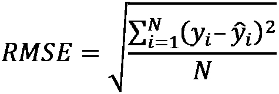

对于分类问题，这会变得稍微复杂一些。在大多数情况下，模型可以预测正确的类别或者不能，这导致结果是一个二元的结果。更进一步，我们可能有一个二元分类问题（1 或 0——是或否），或者一个多类别问题（猫、狗、马等等）。

对于分类问题，有一个突出的损失函数被称为**交叉熵损失**。为了解决二元结果的问题，这个损失函数需要一个模型输出一个介于 0 和 1 之间的概率 ![img/B17928_Formula_1.37.png]，对于给定的数据点 ![img/B17928_Formula_1.38.png] 和一个建议的预测 ![img/B17928_Formula_1.39.png]。对于二元分类模型，它的计算如下：

![img/B17928_Formula_1.40.png]

对于多类别分类，我们将这个错误对所有类别进行求和 ![img/B17928_Formula_1.41.png]，如下所示：

![img/B17928_Formula_1.42.png]

如果你想进一步了解这个话题，可以考虑其他有用的回归损失函数，例如**绝对误差**损失和**Huber 损失**函数（用于**支持向量机**，或**SVMs**），有用的二元分类损失函数，例如**hinge 损失**函数，以及有用的多类别分类损失函数，例如**Kullback-Leibler 散度**（**KL 散度**）函数。最后一个也可以在强化学习（RL）中作为一个指标来监控训练过程中的策略函数。

我们到目前为止讨论的所有内容都需要能够放入数学公式中的东西。想象一下，我们使用文本文件来构建一个用于**自然语言处理**（**NLP**）的模型。在这种情况下，我们除了像**Unicode**这样的东西之外，没有有用的数学表示形式。我们将在*第七章*，*高级特征提取与 NLP*中学习如何以有用、向量化的方式表示它。有了向量，我们可以使用不同类型的指标来计算向量之间的相似度，称为**余弦相似度**指标，我们将在*第六章*，*特征工程与标注*中讨论。

到目前为止，我们已经讨论了如何计算几种场景下的损失函数，但我们是怎样定义我们模型的整体性能的呢？

对于回归模型，我们的损失函数是在整个训练集语料库上定义的。单个观察或预测的错误将是 ![img/B17928_Formula_1.43.png]。因此，RMSE 已经是一个成本函数，可以被优化器用来提高模型性能，所以我们可以用它来判断模型性能。

对于分类模型，这会变得更有趣一些。交叉熵可以与优化器一起用来训练模型，也可以用来判断模型，但除此之外，我们还可以定义一个额外的指标来关注。

一个显而易见的方法就是所谓的模型的**准确率**，计算方法如下：

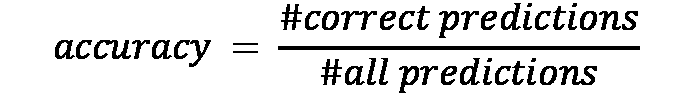

现在，这看起来是正确的。我们只是说我们模型的品质是我们猜对次数的百分比，而现实中很多人同意这个说法。记得我们定义**假阳性**和**假阴性**的时候吗？这些现在开始发挥作用了。让我们看看一个例子。

想象一个检测传染性病毒的测试。*图 1.10*显示了 100 人接受这种病毒检测的结果，包括结果的正确性：

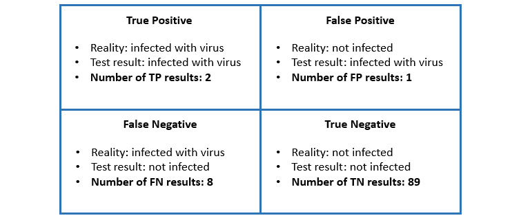

图 1.10 – 100 人组的测试结果

现在，根据这些结果，这个测试的准确率会是多少呢？让我们再次定义它，使用以下值：真正例()、假正例()、假负例()和真负例()，并计算我们示例的结果，如下所示：


这个听起来像是一个很好的测试。它在 92%的情况下给出了准确的结果，但你可能在这里看到了问题。准确率对一切同等看待。我们的测试将患有病毒的人错误地分类为无病毒的人八次，这可能会产生严重的后果。这意味着可能需要具有更多强调假阳性或假阴性结果性能指标的指标。因此，让我们定义两个额外的指标来计算。

我们首先称之为**精确度**，这是一个定义有多少个阳性识别是正确的值。公式如下所示：


在我们的例子中，当我们宣布某人感染时，只有三分之二的情况下我们是正确的。具有 1 精确度值的模型将没有假阳性结果。

我们称之为**召回率**的第二个值，这是一个定义我们正确识别多少个阳性结果的价值。公式如下所示：

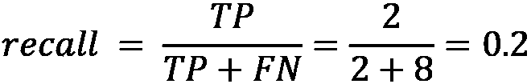

这意味着在我们的例子中，我们正确地识别了所有感染患者的 20%，这是一个不好的结果。具有 1 召回值的模型将没有假阴性结果。

为了正确评估我们的测试或分类，我们需要评估准确度、精确度和召回率。请注意，正如我们在讨论假设检验时提到的，精确度和召回率可能会相互对立。因此，你通常必须决定你更喜欢在说“*你有病毒*”时保持精确，还是更喜欢找到所有有病毒的人。你现在可能理解为什么这样的测试通常设计为以召回率为目标。

通过这一点，我们总结了提高构建机器学习模型和数据处理能力所需的数学基础部分。基于我们迄今为止所学的内容，你应该带着下一个要点继续前进。

重要提示

永远不要只使用机器学习库中的方法进行数据分析建模；要理解它们的数学原理。

在下一节中，我们将引导您了解端到端机器学习过程和本书的结构。

# 发现端到端机器学习过程

我们终于到达了本章的主题。在回顾过去并了解机器学习的目的以及它是如何根植于数学数据分析之后，现在让我们清楚地了解需要采取哪些步骤来创建高质量的机器学习模型。

以下图表展示了从数据到模型再到部署模型的（有时是递归的）步骤概述：

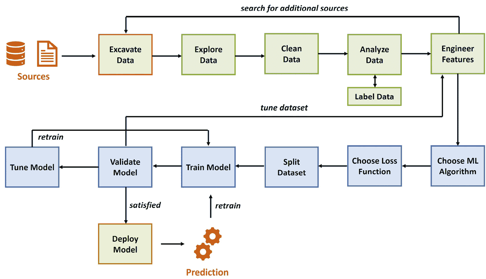

图 1.11 – 端到端机器学习过程

观察这个流程，我们可以定义以下不同的步骤：

1.  挖掘数据和来源

1.  准备和清理数据

1.  定义标签和特征工程

1.  训练模型

1.  部署模型

这些展示了运行单个机器学习项目的步骤。当你处理大量项目和数据时，采用某种形式的自动化和运营变得越来越重要，这通常被称为 MLOps。

在本节中，我们将概述这些步骤的每个部分，包括 MLOps 及其重要性，并解释我们将深入探讨相应主题的章节。在我们开始逐步了解这些步骤之前，请思考以下问题：

*你将为每个步骤分配多少百分比的时间？*

完成后，请查看以下截图，它显示了完成这些任务所需的典型时间投入：

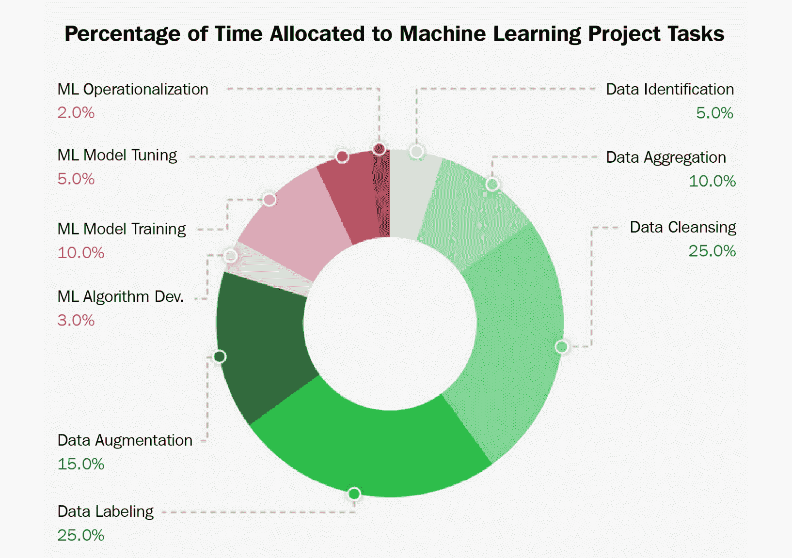

图 1.12 – 机器学习时间投入

你的猜测合理吗？你可能惊讶地发现，只有 20%的时间，你将从事与实际训练和部署机器学习模型有关的工作。因此，你应该牢记下一点。

重要提示

在机器学习项目中，你应该花大部分时间拆解你的数据集并寻找其他有用的数据来源。

如果不这样做，将对模型的质量和性能产生负面影响。现在，既然已经说了这一点，让我们一步一步地过一遍，从数据来源开始。

## 挖掘数据和来源

当你开始一个机器学习项目时，你可能已经有一个预期的结果，并且通常，你有一些形式的现有数据集，你或你的公司希望从中开始。这就是你开始熟悉给定数据的时候，通过分析了解你有什么以及缺少什么，我们将在以下步骤中回顾这一点。

在某个时候，你可能会意识到你缺少一些额外的——但至关重要的——数据点，以增加你结果的质量。这高度取决于你所缺少的是什么——是你可以或你的公司可以获得的，还是你需要从其他地方找到的。为了给你一些想法，让我们看看以下获取额外数据的方法以及你应该注意的事项：

+   **内部数据源**：如果你在公司内部或与公司合作进行此项目，首先需要考虑的是内部资源。这种选择的优点是免费，通常标准化，你应该能够找到了解这些数据及其获取方式的人。根据项目情况，这也可能是你获取所需数据的唯一途径。这种选择的缺点是可能找不到你想要的东西，数据可能记录不佳，而且由于数据中的偏差，质量可能存在问题。

+   **公开数据源**：另一个选择是使用免费可用的数据集。这些数据集的优点通常是规模巨大（**千兆字节**（**TB**）的数据），覆盖不同的时间段，并且通常结构良好且文档齐全。缺点是某些数据字段可能难以理解（且创建者不可用），由于数据中的偏差，质量也可能参差不齐，并且在使用时，通常需要你发布你的结果。此类示例包括**国家海洋和大气管理局**（**NOAA**）([`www.ncei.noaa.gov/weather-climate-links`](https://www.ncei.noaa.gov/weather-climate-links))和**欧盟**（**EU**）开放数据门户([`data.europa.eu/en`](https://data.europa.eu/en))，以及其他许多数据源。

+   **数据卖家（数据即服务，或 DaaS）**：最后一个选择是从数据卖家那里购买数据，无论是购买现有的数据集还是请求创建一个。这种选择的优点是节省时间，可以让你访问个性化的数据集，甚至可能获得预处理数据的访问权限。缺点是这很昂贵，你仍然需要完成所有其他后续步骤来使这些数据变得有用，并且可能存在有关隐私和伦理的问题。

现在我们已经对最初或额外获取数据的地方有了很好的了解，让我们看看下一步：准备和清理数据。

## 准备和清理数据

如前所述，描述性数据探索无疑是机器学习项目中最重要的步骤之一。如果你想清理数据、构建派生特征或选择机器学习算法来预测数据集中的目标变量，那么首先你需要了解你的数据。你的数据将定义许多必要的清理和预处理步骤。它将定义你可以选择哪些算法，并最终定义你的预测模型的性能。

探索应该作为一个结构化的分析过程来完成，而不是一系列实验任务。因此，我们将通过一系列数据探索任务清单，这些任务可以作为每个机器学习项目开始时的初步步骤，在开始任何数据清理、预处理、**特征工程**或模型选择之前执行。通过应用这些步骤，你将能够理解数据并获得有关所需预处理任务的知识。

此外，它还将为您提供对预测任务可能遇到的困难类型的良好估计，这对于判断所需的算法和验证策略至关重要。您还将深入了解哪些可能的特征工程方法适用于您的数据集，并更好地理解如何选择一个好的损失函数。

让我们看看所需的步骤。

### 存储和准备数据

您的数据可能以各种不同的格式存在。您可能需要处理存储在**逗号分隔值**（**CSV**）文件中的表格数据；您可能拥有以**联合图像专家组**（**JPEG**）或**可移植网络图形**（**PNG**）文件格式存储的图像，文本存储在**JavaScript 对象表示法**（**JSON**）文件中，或者音频文件以**MP3**或**M4V**格式。CSV 可以是一个好的格式，因为它可读性强，且可以高效解析。您可以使用任何文本编辑器打开和浏览它。

如果您独立工作，您可能只需将原始数据存储在系统中的一个文件夹中，但当你与云基础设施或一般的公司基础设施一起工作时，您可能需要某种形式的云存储。当然，您可以手动上传原始数据到这种存储，但通常，您处理的数据来自实时系统，需要从中提取。这意味着查看所谓的**提取-转换-加载**（**ETL**）工具可能是有价值的，这些工具可以自动化此过程并将所需的原始数据带入云存储。

在所有预处理步骤完成后，您存储中的数据将呈现某种形式的多层结构，从原始数据到清洗数据，再到标记数据，最后到处理后的数据集。

我们将在*第四章*“数据摄取与管理数据集”中更深入地探讨这个主题。现在，只需了解我们将自动化使数据可用于处理的过程。

### 清洗数据

在这一步，我们检查数据本身中的不一致性和结构错误。这一步骤通常适用于表格数据，有时也适用于文本文件，但不太适用于图像或音频文件。对于后者，我们可能能够裁剪图像并改变它们的亮度或对比度，但可能需要回到源数据以创建更好的样本。同样适用于音频文件。

对于表格数据集，我们有很多处理选项。以下是我们需要关注的事项：

+   **重复项**：由于数据复制错误或不同数据源的组合，您可能会发现重复的样本。通常，副本可以被删除。只需确保这些不是看起来相同但实际不同的样本。

+   **无关信息**：在大多数情况下，你将拥有包含许多不同特征的数据库集，其中一些对于你的项目来说可能完全不必要。你应该在开始时直接删除明显的那些；其他的一些你可以在进一步分析数据后删除。

+   (`US` 和 `United States`) 或简单的拼写错误。这些应该被标准化或清理。一个好的方法是可视化一个特征的可用值。

+   **异常值（离群值）**：这指的是非常不可能的值，你需要决定它们是错误还是实际上是真的。这通常是在分析数据后进行的，当你知道一个特征的分布时。

+   `NA` 或 `NaN`。除了删除整个样本之外，还有不同的方法可以纠正这个问题。在分析数据并可能看到更好的替换方法之前等待，也是谨慎的做法。

在这一步之后，我们可以开始进一步分析清洗后的数据集。

### 分析数据

在这一步中，我们将应用我们对统计学的理解，以获取对我们特征和标签的洞察。这包括为每个特征计算统计属性，可视化它们，找到相关特征，并测量称为**特征重要性**的东西，它计算特征对标签的影响，也称为**目标变量**。

通过这些方法，我们获得了关于特征之间以及特征与目标之间关系的想法，这可以帮助我们做出决定。在这个决策过程中，我们也开始添加一些至关重要的东西——我们的**领域知识**。如果你不知道数据代表什么，你将很难对其进行修剪，并选择训练的最佳特征和样本。

在这一步中，还有许多可以应用的技术，包括称为**降维**的东西。如果你有成千上万的特征（例如图像的数值表示），对于人类甚至对于机器学习过程来说，理解关系会变得非常复杂。在这种情况下，将这个高维样本映射到二维或三维的向量表示可能是有用的。通过这种方式，我们可以轻松地找到不同样本之间的相似性。

我们将在*第五章* *执行数据分析与可视化*中更深入地探讨清理和分析数据的话题。

完成所有这些步骤后，我们将对手头的数据有一个良好的理解，并且可能已经知道我们缺少什么。作为数据预处理中的最后一步，我们将查看创建和转换特征的过程，通常称为**特征工程**，以及当缺少标签时创建标签。

## 定义标签和工程特征

在数据预处理的第二部分，我们将讨论数据的标注以及我们可以对特征执行的操作。要执行这些步骤，我们需要通过我们之前讨论的探索步骤获得的知识。让我们首先看看标注数据。

### 标注

让我们从一件令人沮丧的事情开始：这个过程非常繁琐。标注，也称为**注释**，是机器学习项目中最不令人兴奋的部分，但也是整个过程中最重要的任务之一。目标是向机器学习算法提供高质量的训练数据。

虽然适当的标签极大地有助于提高预测性能，但标注过程也将帮助您更详细地研究数据集。让我澄清一下，标注数据需要深入洞察和理解数据集的上下文以及预测过程，您应该已经在这个阶段获得了这些。例如，如果我们旨在使用**计算机断层扫描**（**CT**）来预测乳腺癌，我们还需要了解如何在 CT 图像中检测乳腺癌以标注数据。

错误标注训练数据有几个后果，例如**标签噪声**，您希望避免它，因为它会影响机器学习管道中每个下游过程的性能。在某些情况下，您的标注方法取决于为预测问题选择的机器学习方法。一个很好的例子是目标检测和分割之间的差异，它们都需要完全不同标注的数据。

有一些技术和工具可以利用我们不仅可以使用机器学习算法来完成所需项目，还可以学习如何标注我们的数据这一事实来加速标注过程。这些模型会在您手动标注数据集时开始提出标签。

### 特征工程

简而言之，在这一步中，我们将开始转换特征或添加新特征。显然，我们并不是一时兴起地执行这些操作，而是基于我们在前一步骤中收集到的知识。例如，我们可能已经了解到完整的日期和时间过于精确，我们只需要星期几或月份。无论是什么，我们都会尝试塑造和提取我们所需要的。

通常，我们将执行以下操作之一：

+   **特征创建**：从一组给定的特征或从额外的信息源中创建新特征。

+   **特征转换**：将单个特征转换为对所使用的机器学习算法有用的和稳定的。

+   **特征提取**：从原始数据中创建派生特征。

+   **特征选择**：选择最突出和预测性强的特征。

我们将在*第六章*“特征工程和标记”中更深入地探讨标记和应用于我们的特征的各种方法。此外，我们还将详细研究一个更复杂的特征工程示例，当在自然语言处理（NLP）项目中处理文本数据时。您将在*第七章*“使用 NLP 的高级特征提取”中找到它。

我们通过重申整个预处理数据步骤的重要性以及它们对下一步的影响来结束这一步骤，下一步我们将讨论模型训练。此外，我们记得，如果我们的模型表现不佳，我们可能需要在模型训练后返回到此步骤。

## 训练模型

我们最终达到了可以应用机器学习算法的点。与数据实验和预处理一样，训练机器学习模型是一个分析性的、逐步的过程。每个步骤都涉及一个思考过程，根据实验阶段的结果评估每个算法的优缺点。正如其他任何科学过程一样，建议您首先提出一个假设，然后验证这个假设是否正确。

让我们看看定义训练机器学习模型过程的步骤，如下所示：

1.  **定义您的机器学习任务**：首先，我们需要定义我们面临的机器学习任务，这通常由您用例背后的业务决策所定义。根据标记数据的数量，您可以选择无监督学习和监督学习方法，以及许多其他子类别。

1.  **选择一个合适的模型**：为所选的机器学习任务选择一个合适的模型。这可能是一个逻辑回归、梯度提升集成树或深度神经网络（DNN），仅举几个流行的机器学习模型选择。选择主要取决于训练（或生产）基础设施（如 Python、R、Julia、C 等）以及数据的形状和类型。

1.  **选择或实现损失函数和优化器**：在数据实验阶段，您应该已经制定了一个测试模型性能的策略。因此，您应该已经选择了数据分割、损失函数和优化器。如果您还没有这样做，您应该在此点评估您想要衡量和优化的内容。

1.  **选择数据集分割**：将您的数据分割成不同的集合——即训练集、验证集和测试集——可以帮助您深入了解训练和优化过程的表现，并帮助您避免模型对训练数据的过度拟合。

1.  **使用交叉验证训练简单模型**：在做出所有前面的选择之后，你可以继续训练你的机器学习模型。理想情况下，这是在训练集和验证集上进行交叉验证，而不将训练数据泄露到验证中完成的。在训练基线模型后，是时候解释验证运行中的错误度量了。它有意义吗？它是否如预期的那样高或低？它是（希望）比随机预测更好，并且比总是预测最流行的目标更好吗？

1.  **调整模型**：最后，你可以通过调整模型的超参数、进行模型堆叠或其他高级方法来调整模型的输出，或者你可能需要回到初始数据并在重新训练模型之前对其进行处理。

这些是我们训练模型时执行的基线步骤。在下一节中，我们将更深入地探讨上述步骤，从如何选择模型开始。

### 选择模型

当涉及到为你的数据选择一个好的模型时，建议你在转向更复杂选项之前优先考虑简单的传统模型。例如，当训练数据有限时，可以采用集成模型，如**梯度提升树集成**。这些模型在广泛的输入值（有序、名义和数值）上表现良好，并且训练效率高，易于理解。

基于树的集成模型将许多弱学习器结合成一个基于决策树的单一预测器。这大大减少了单个决策树的过拟合和不稳定问题。使用默认参数进行几次迭代后，输出通常为许多不同应用提供很好的基线结果。

在*第九章*“使用 Azure 机器学习构建 ML 模型”中，我们专门用一节来介绍如何使用**LightGBM**（来自微软的一个流行的树集成库）训练梯度提升树集成分类器。

为了捕捉大量复杂训练数据的含义，我们需要大型参数模型。然而，由于梯度爆炸和消失、通过如此复杂的模型传播损失、数值不稳定性和归一化等问题，用数亿个参数训练参数模型并非易事。近年来，这类高参数模型通过许多复杂任务实现了极其好的结果——即**深度学习**（**DL**）。

深度学习（DL）基本上是一个多层人工神经网络（ANN），其中每一层都被视为模型数据处理管道中的某个步骤。

在*第十章*“在 Azure 上训练深度神经网络”和*第十二章*“Azure 上的分布式机器学习”中，我们将更深入地探讨如何在单机和分布式 GPU 集群上训练大型和复杂的深度学习模型。

最后，你可能会处理完全不同形式的数据，例如音频或文本数据。在这种情况下，有专门的方法来预处理和评分这些数据。这些领域之一是**推荐引擎**，我们将在*第十三章*中详细讨论，*在 Azure 中构建推荐引擎*。

### 选择损失函数和优化器

正如我们在上一节中讨论的，根据你想要使用的训练类型和模型，有许多指标可以选择。在查看特征和目标维度的关系以及数据的可分性之后，你应该继续评估你将使用哪个损失函数和优化器来训练你的模型。

许多机器学习从业者并没有高度重视适当错误指标的重要性，只是使用简单易行的指标，例如准确率和 RMSE。这个选择至关重要。此外，了解基线性能和模型对噪声的鲁棒性是有用的。第一种可以通过仅使用出现频率最高的目标变量作为预测来计算错误指标来实现。这将是你基线性能。第二种可以通过修改你的机器学习模型的随机种子并观察错误指标的变化来实现。这将显示你可以信任错误指标的哪个小数位。

请记住，在训练运行后，评估所选的错误指标以及任何其他您希望评估的指标是谨慎的，并尝试实验其他指标是否可能更有益。

至于优化器，它高度依赖于你选择的模型，这决定了你在这方面有哪些选项。只需记住，优化器是我们达到目标的方式，而目标由损失函数定义。

### 数据集划分

一旦你选择了机器学习模型、损失函数和优化器，你需要考虑将你的数据集划分为训练集。理想情况下，数据应该分为三个互斥的集合：训练集、验证集和测试集。我们使用多个集合来确保模型在未见过的数据上具有良好的泛化能力，并且报告的错误指标是可以信赖的。因此，你可以看到将数据划分为代表性集合是一个应该作为分析过程执行的任务。这些集合如下定义：

+   **训练数据集**：用于拟合/训练模型的子数据集。

+   **验证数据集**：用于在训练过程中提供评估以调整超参数的子数据集。算法在训练过程中看到这些数据，但从未从中学习。因此，它对模型有间接影响。

+   **测试数据集**：用于在训练后对训练好的模型进行无偏评估的子数据集。

如果训练数据泄露到验证集或测试集中，你可能会使模型过拟合，并扭曲验证和测试结果。除了欠拟合模型外，过拟合也是一个你必须处理的问题。两者如下定义：

欠拟合与过拟合

一个欠拟合的模型仅对数据进行操作。这种情况的原因通常是因为模型过于简单，无法理解特征与目标变量之间的关系，或者是因为你的初始数据缺乏有用的特征。一个过拟合的模型在训练数据集上表现完美，在任意其他数据上也表现完美。这种情况的原因是它基本上记住了训练数据，无法进行泛化。

关于这些分割的大小有不同的讨论，以及许多不同的进一步技术来为每个类别选择样本，例如分层分割（基于类别分布的采样）、时间分割和基于组的分割。我们将在*第九章*中更深入地探讨这些内容，*使用 Azure 机器学习构建机器学习模型*。

### 运行模型训练

在大多数情况下，你不会从头开始构建人工神经网络（ANN）结构和优化器。你将使用现成的机器学习库，如**scikit-learn**、**TensorFlow**或**PyTorch**。这些框架和库大多是用 Python 编写的，因此 Python 应该是你的机器学习项目的首选语言。

在编写模型训练的代码时，将所需的代码逻辑上分为两个文件是一个好主意，如下所示：

+   **脚本编写（脚本环境）**：定义机器学习训练将进行的（库、训练位置等）环境以及触发执行脚本的脚本

+   **执行脚本（执行环境）**：仅包含实际机器学习训练的脚本

通过以这种方式拆分你的代码，你可以在目标环境发生变化时避免更新实际的训练脚本。这将使代码版本控制和 MLOps 变得更加干净。

为了理解在机器学习库中我们可能会遇到哪些类型的分类方法，让我们来看看 TensorFlow 中的一个简短代码片段：

```py
model = tf.keras.models.Sequential([
  tf.keras.layers.Flatten(input_shape=(28, 28)),…])
model.compile(optimizer='adam',
              loss='sparse_categorical_crossentropy',
              metrics=['accuracy'])
model.fit(x_train, y_train, epochs=5)
model.evaluate(x_test, y_test)
```

通过查看这段代码，我们看到我们正在使用一个名为`Sequential`的模型，这是一个由一系列层定义的基本人工神经网络（ANN），这些层有一个输入和一个输出。在模型创建步骤中，我们看到定义了层，并省略了一些其他设置。此外，在`compile()`方法中，我们定义了一个优化器、一个损失函数以及一些我们感兴趣的额外指标。最后，我们看到一个名为`fit()`的方法正在训练数据集上运行，一个名为`evaluate()`的方法正在测试数据集上运行。现在，这些方法究竟做了什么？在我们深入探讨之前，让我们首先定义一些东西。

模型的超参数与参数

在模型训练过程中调整的有两种类型的设置。在人工神经网络（ANN）中，权重和偏差等设置被称为参数。它们在训练阶段被改变。其他设置——如 ANN 中的激活函数和层数、数据分割、学习率或选择的优化器——被称为超参数。这些是我们训练运行之前调整的元设置。

在这方面没有问题之后，让我们定义你将遇到的典型方法，如下所示：

+   (`Sequential`类)，在特殊函数如`compile()`中，或者它们是我们接下来讨论的训练方法的一部分。

+   `fit()`或`train()`，这是基于训练数据集、损失函数和优化器训练模型参数的主要方法。这些方法不返回任何类型的值——它们只是更新模型对象及其参数。

+   `evaluate()`、`transform()`、`score()`或`predict()`。在大多数情况下，这些函数会返回某种形式的结果，因为它们通常是在将测试数据集与训练模型进行对比时运行的。

这是你在机器学习库中遇到的一个模型的典型方法结构。现在我们已经对如何设置我们的编码环境和使用可用的机器学习库有了很好的了解，让我们看看如何在初始训练后调整模型。

### 调整模型

在我们训练了一个简单的集成模型，该模型的表现比基线模型好得多，并且根据数据准备期间估计的预期性能达到了可接受的水平之后，我们可以进行优化。这是一个我们真的想强调的点。强烈建议不要在简单的集成技术无法提供有用结果时开始模型优化和堆叠。如果这种情况发生，退一步深入数据分析和特征工程会更好。

常见的机器学习优化技术——如超参数优化、模型堆叠，甚至**自动化机器学习**（**AutoML**）——可以帮助你从模型中获得最后的 10%性能提升。

超参数优化专注于改变模型训练的初始设置以提高其最终性能。同样，模型堆叠是一种非常常见的用于通过将多种*不同*模型类型组合成一个单一堆叠模型来提高预测性能的技术。因此，每个模型的输出都输入到一个元模型中，该元模型本身通过交叉验证和超参数调整进行训练。通过将显著不同的模型组合成一个单一堆叠模型，你总是可以超越单个模型。

如果你决定使用这些优化技术中的任何一种，建议你在分布式集群上并行和完全自动化地执行它们。在看到太多机器学习从业者手动参数化、调整和堆叠模型之后，我们想提出这个重要信息：*优化机器学习模型是无聊的*。

这很少需要手动完成，因为作为端到端优化过程自动执行要快得多。你大部分的时间和精力应该投入到实验、数据准备和特征工程中——也就是说，所有这些都不能通过原始计算能力轻松自动化和优化的事情。我们将在*第十一章*“超参数调整和自动化机器学习”中更深入地探讨模型调整的主题。

这就结束了关于模型训练的所有重要主题。接下来，我们将探讨机器学习模型部署的选项。

## 模型部署

一旦训练和优化了机器学习模型，它就准备好部署了。这一步通常被称为**推理**或**评分**模型。实际上，许多数据科学团队在这里停止，并将模型作为 Docker 镜像部署到生产环境中，通常嵌入到**表示状态转移**（**REST**）**API**中，使用 Flask 或类似框架。然而，正如你可以想象的那样，这并不总是最佳解决方案，这取决于你的需求。机器学习或数据工程师的责任并不止于此。

在生产环境中对模型进行实时数据测试时，最能体现机器学习管道的部署和操作。进行测试是为了收集见解和数据，以持续改进模型。因此，随着时间的推移收集模型性能是一个保证和提升模型性能的重要步骤。

通常，我们将机器学习评分管道分为两种主要架构，如下所示：

+   **批处理评分使用管道**：这是一个离线过程，其中你将机器学习模型与一批数据评估。这种评分技术的结果通常不是时间敏感的，要评分的数据通常比模型大。

+   **基于容器化 Web 服务端点的实时评分**：这指的是一种评分单个数据输入的技术。这在流处理中非常常见，其中单个事件会实时评分。显然，这项任务对时间非常敏感，执行会一直阻塞，直到计算出的评分结果出来。

我们将在*第十四章*“模型部署、端点和操作”中更详细地讨论这两种架构。在那里，我们还将研究收集运行时间、延迟和其他操作指标以及模型性能的有效方法。

我们创建的模型文件和之前提到的选项通常由标准硬件架构定义。正如之前提到的，我们可能创建一个 Docker 镜像，将其部署到**虚拟机**（**VM**）或 Web 服务中。如果我们想将模型部署到高度专业化的硬件环境中，比如 GPU 或**现场可编程门阵列**（**FPGA**）呢？

为了进一步探讨这个问题，我们将深入探讨第十五章中提到的替代部署目标和方法的替代方案，*模型互操作性、硬件优化和集成*。在那里，我们将研究一个名为**Open Neural Network eXchange**（**ONNX**）的框架，它允许我们将我们的模型转换为标准化的模型格式，以便部署到几乎任何环境中。此外，我们还将探讨 FPGA 及其为何可能成为机器学习的良好部署目标，最后，我们将探索其他 Azure 服务，如**Azure IoT Edge**和**Power BI**，用于集成。

此步骤封装了单个机器学习模型的端到端过程。接下来，我们将简要概述如何使用 MLOps 在企业级环境中使此类机器学习项目投入运行。

## 开发和运营企业级机器学习解决方案

为了使机器学习项目投入运行，需要使用自动化管道和**开发运维**（**DevOps**）方法，如**持续集成**（**CI**）和**持续交付**/**持续部署**（**CD**）。这些通常统称为 MLOps。

当查看我们在机器学习项目中执行的步骤时，我们可以看到通常有两个主要操作发生——模型的训练和模型的部署。由于这些操作可以独立进行，因此定义两个不同的自动化管道是值得的，如下所示：

+   **训练管道**：这包括加载数据集（可能包括 ETL 管道）、转换、模型训练和注册最终模型。此管道可以由数据集的变化或已部署模型中检测到的可能数据漂移触发。

+   **部署管道**：这包括从注册表中加载模型、创建和部署 Docker 镜像、创建和部署操作脚本，以及将模型最终部署到目标位置。此管道可以由机器学习模型的新版本触发。

我们将在第八章中深入探讨使用 Azure Machine Learning 的机器学习管道，*Azure Machine Learning Pipelines*。

在拥有这些管道之后，我们还可以关注**Azure DevOps**以及其他工具。有了这些，我们可以为我们的机器学习项目构建以下部分定义的生命周期：

+   **创建或重新训练模型**：在此，我们使用训练管道创建或重新训练我们的模型，同时控制管道和代码的版本。

+   **部署模型并创建评分文件和依赖项**：在此，我们使用部署管道部署特定的模型版本，同时控制管道和代码的版本。

+   **创建审计跟踪**：通过 CI/CD 管道和版本控制，我们为所有资产创建审计跟踪，确保完整性和合规性。

+   **在生产中监控模型**：我们监控性能和可能的数据漂移，这可能会自动触发模型的重新训练。

我们将在*第十六章*“使用 MLOps 将模型投入生产”中更详细地讨论这些主题和其他内容。

这就结束了我们对端到端机器学习过程和本章的讨论。如果你之前还没有，你现在应该对机器学习以及本书剩余部分的内容有一个很好的理解。

# 摘要

在本章中，我们学习了在哪些情况下我们应该使用机器学习以及它的来源，我们了解了统计学的基本概念以及我们进行机器学习所需的数学知识，我们还发现了创建一个表现良好的机器学习模型所需的步骤。此外，我们还对将机器学习项目投入运营所需的内容有了初步的了解。这应该为我们提供一个关于机器学习是什么以及我们将在这本书中深入研究什么的基本概念。

由于本书不仅涵盖了机器学习（ML），还包括了云平台 Azure，在接下来的两章中，我们将深入探讨我们之前未曾涉及的主题——我们将讨论机器学习的工具。因此，在下一章中，我们将了解 Azure 为机器学习提供的工具和服务，而在第三章中，我们将使用最有用的工具在我们的 Azure 上进行第一次实际的机器学习实验。
