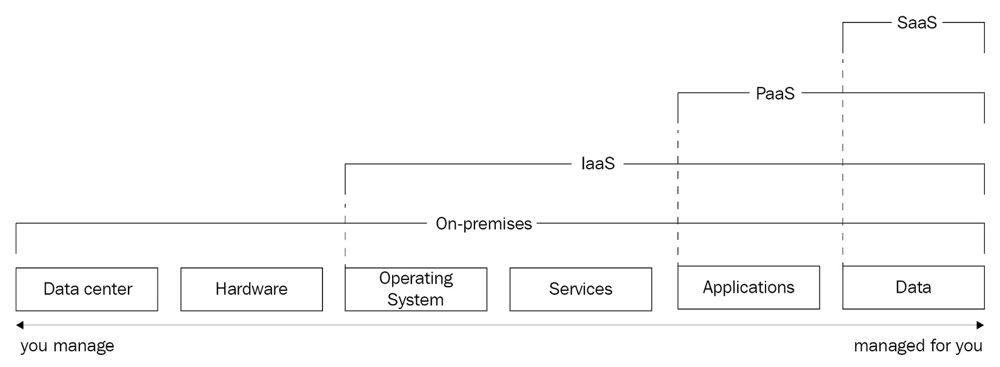
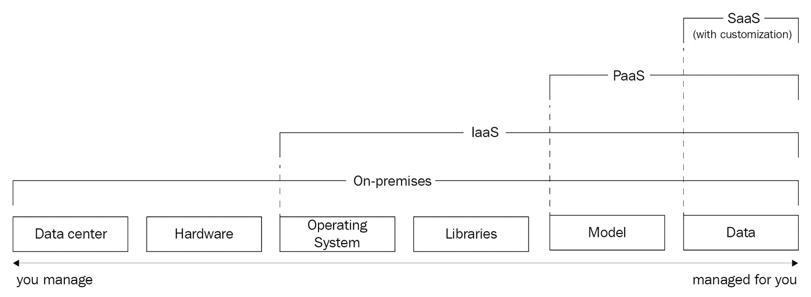
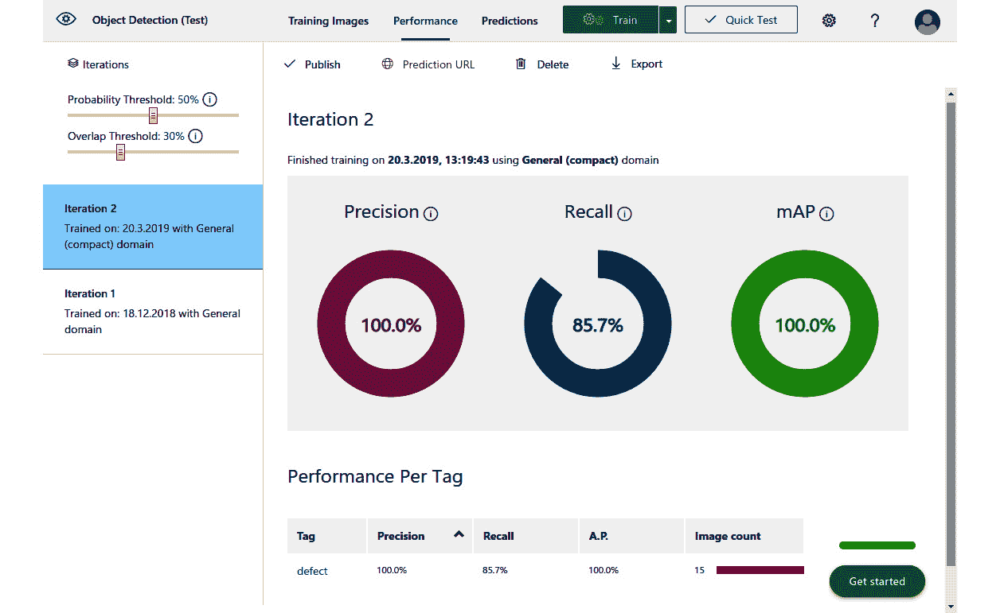
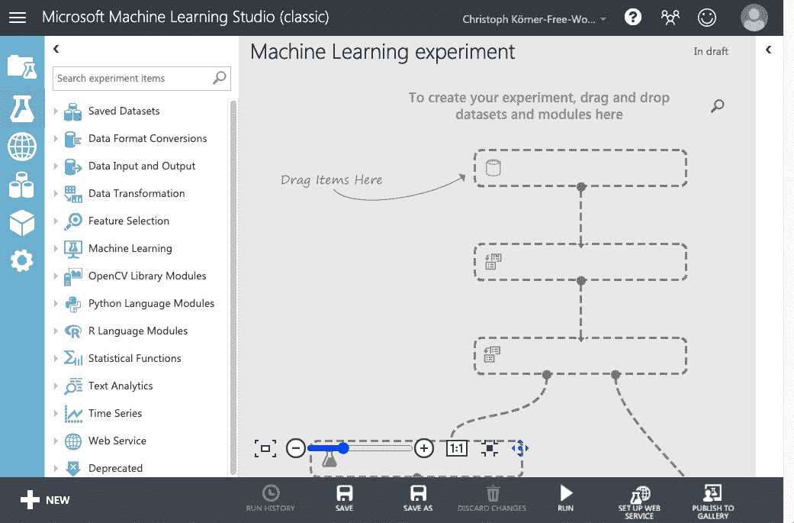
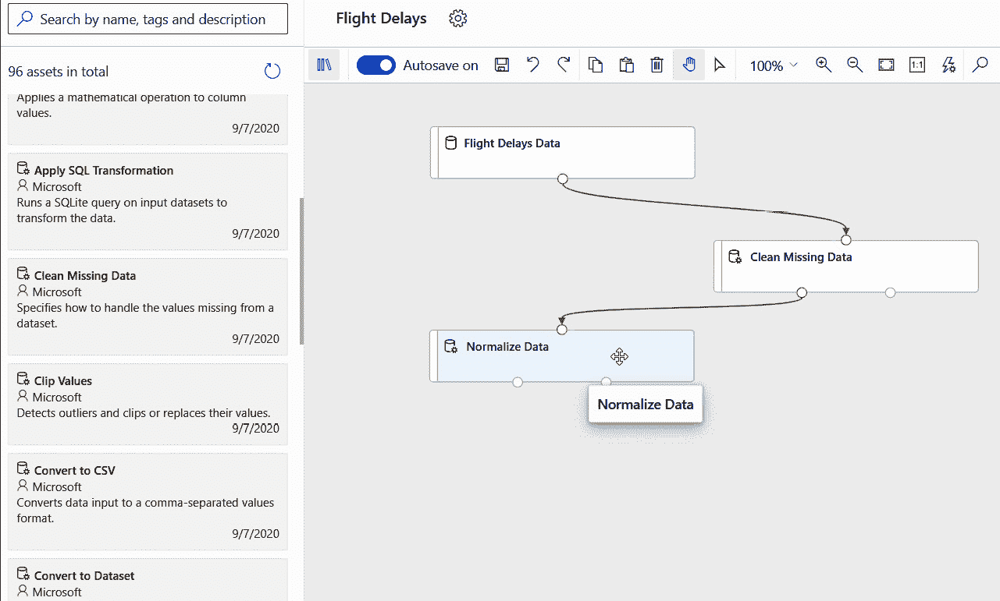
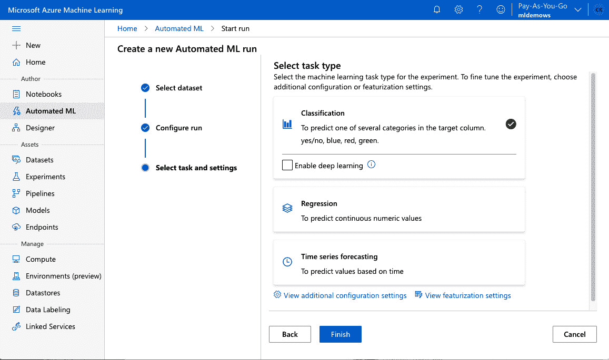
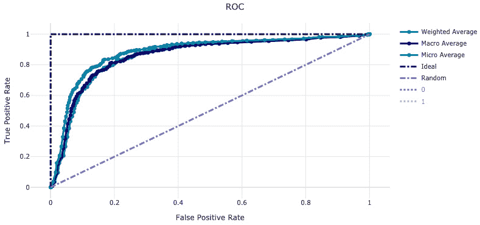
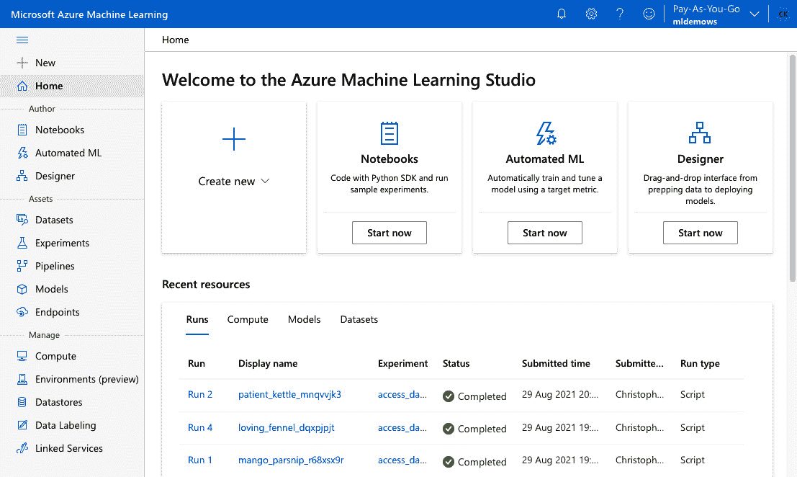
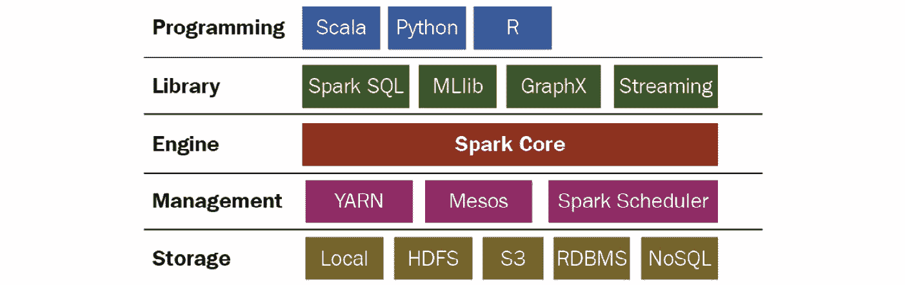

# *第二章*: 在 Azure 中选择正确的机器学习服务

在上一章中，我们学习了端到端的机器学习过程以及所有必需的步骤，从数据探索到数据预处理、训练、优化、部署和运营。了解整个过程将更好地帮助我们选择构建基于云的机器学习服务的正确服务。

在本章中，我们将帮助您了解不同的 Azure 人工智能服务，并展示如何为您的机器学习任务选择正确的服务。首先，我们将根据服务抽象和应用领域对不同的服务进行分类，然后探讨不同服务的不同权衡和益处。

在下一节中，我们将重点关注托管服务，并直接进入 Azure 认知服务，这是针对一般任务和领域的多个预训练机器学习服务。然后，我们将介绍定制认知服务，这是一种针对特定任务或领域微调认知服务的方法，并在本节结束时探讨应用人工智能服务。

在接下来的章节中，我们将讨论 Azure 中的定制机器学习服务，例如 Azure 自动机器学习、Azure 机器学习设计器和 Azure 机器学习服务——本书中将使用该服务。

在上一节中，我们将探讨定制计算服务，例如 Azure Databricks、Azure Batch 和数据科学虚拟机，用于构建定制的机器学习解决方案。

在本章结束时，您将了解如何导航 Azure 人工智能领域，并理解为什么 Azure 机器学习是构建定制机器学习解决方案的首选服务。

本章将涵盖以下主题：

+   选择 Azure 机器学习服务

+   管理机器学习服务

+   定制机器学习服务

+   定制计算服务

# 选择 Azure 机器学习服务

Azure 提供了超过 200 个服务，其中超过 30 个服务针对构建人工智能和机器学习解决方案。如此众多的服务往往使得 Azure 新手难以选择针对特定任务的正确服务。在 Azure 中开始机器学习时，为您的机器学习任务选择正确的服务是您必须做出的最重要的决定。在本节中，我们将提供关于如何在 Azure 中选择正确的机器学习和计算服务的明确指导。

选择正确的服务以及适当的抽象层可以为您节省数月甚至数年的时间来推广基于机器学习的产品或功能。它可以帮助您避免诸如通过迁移学习、重新训练、管理、重新部署机器学习模型，或监控、扩展和操作推理服务和端点等繁琐且耗时的任务。

选择错误的服务可能会导致你快速开始产生结果，但可能变得无法提高特定领域的模型性能或扩展模型以用于其他任务。因此，对不同的 Azure AI 和 ML 服务有一个基本的了解将帮助你做出正确的权衡，并为你的用例选择正确的服务。在下一节中，我们将帮助你导航众多的 Azure 服务和 Azure AI 景观，以确定适合你用例的正确 ML 服务。

## 导航 Azure AI 景观

对于许多基于云的服务，如计算、存储、数据库或分析，最重要的选择是服务级别抽象——**基础设施即服务**（**IaaS**）、**平台即服务**（**PaaS**）或**软件即服务**（**SaaS**）。*图 2.1*显示了云服务中自管理部分和管理部分之间的区别：



图 2.1 – 云服务的 IaaS 与 PaaS 与 SaaS 比较

让我们比较前图中展示的不同类型的抽象和责任。应用堆栈是从左到右构建的，从包含*硬件*（计算机、磁盘、网络卡、交换机等）的*数据中心*（建筑、冷却、电力等）开始。每台机器由一个*操作系统*（Linux 或 Windows）供电，并运行特定的*服务*（Web 服务器、数据库、缓存等）和*应用程序*（例如，WordPress），这些应用程序存储和提供你的*数据*（例如，你的自定义网站）：

+   在本地计算中，你拥有并管理一切——从建筑、冷却、电力、物理服务器、网络连接、交换机，到操作系统、服务、应用程序和数据。如果硬盘、网络接口或电源连接出现故障，你需要更换它们。

+   在*IaaS*服务中，你从你的云提供商那里消费基础设施，例如**虚拟机**（**VM**）。你选择 CPU 数量、内存、磁盘、网络接口等，所有这些都将为你管理，但你需要自己管理操作系统以及所有服务、应用程序和数据。如果有一个重要的内核安全更新，你需要安装它。IaaS 服务是所有其他服务的基本构建块。

+   *PaaS*服务让你可以纯粹关注你的应用程序。一个典型的例子是所谓的*无服务器计算*，如 Azure Functions。在这里，你可以选择你的 JVM 版本来部署基于 Java 的应用程序，但你不需要担心修补你的操作系统、你的服务运行时或底层硬件。PaaS 服务通常在所有权、定制和成本之间提供良好的权衡。大多数云服务都属于这一类别。

+   最后，*SaaS*服务是由云服务提供商设计、实施和管理的完整应用程序。您通常通过网站或 API 端点与这些服务交互，甚至不知道使用了什么操作系统或服务运行时，也不知道应用程序代码或数据模型的样子。SaaS 服务可以与我们在日常生活中使用的流行网络服务相提并论，例如 Facebook、Netflix、Spotify 或 YouTube。云服务提供商通常为特定的用例构建这些服务，例如物联网、基因组学、计算机视觉等。

总之，所有 Azure 服务都可以根据服务抽象级别在 IaaS、PaaS 和 SaaS 规模上定位。我们可以使用这个规模将所有 Azure AI 服务分为三类：

+   管理型机器学习服务（SaaS）

+   定制 ML 服务（PaaS）

+   机器学习定制计算服务（IaaS）

因此，在 Azure 中选择 ML 服务的第一步是确定适合您用例的正确服务级别抽象——通过选择正确的灵活性、所有权、技能、时间和成本之间的权衡。

然而，选择 ML 服务比仅仅区分托管和定制服务要复杂得多。特别是对于托管 ML 服务，我们还需要比较不同的应用领域和定制及专业化的水平。

Azure 提供了许多预训练的特定领域模型和服务，例如目标检测、情感分析、推荐引擎和文档解析。根据您的应用领域，您可以选择包含预训练模型的 ML 服务。例如，如果您需要一个通用的面部识别模型，您可以从 Azure 中作为托管服务来使用它。这意味着您根本不需要任何训练数据来构建这样的功能。使用预训练模型的决定对您的项目时间表有巨大影响，因为获取、清理和标记训练数据是 ML 过程中最繁琐且耗时的工作之一。

然而，许多 ML 应用是为高度专业化的领域构建的，例如医学数据分析、法医分析和法律职业。如果您正在为这样的领域构建基于 ML 的应用或功能，没有针对应用领域进行定制的预训练模型可能并不合适。在这种情况下，您可以选择提供定制功能的托管 ML 服务——一种使用训练数据来微调预训练模型以适应定制领域的方法。这个过程也被称为迁移学习，并得到一些托管 Azure 机器学习服务的支持。

一些领域或基于 ML 的应用不适合这个类别，并且不能轻易地针对不同的应用领域进行微调。例如，在别人的评分上预训练推荐引擎、将文本到语音功能转移到古典音乐的生成模型，或者用三维图像数据微调二维模型并不实用。在这些情况下，你除了使用自己的训练数据创建自己的模型外别无选择。

使用前面的例子，我们可以根据所需训练数据量和应用领域将托管和自定义 ML 服务细分为以下几组：

+   不需要训练数据

+   需要一些训练数据用于定制

+   需要训练数据

因此，选择托管或自定义 ML 服务的第二个选项取决于你的应用领域以及对训练数据和模型专业化的需求。类似于服务抽象，权衡的是灵活性（定制）、所有权、技能、时间和成本。

让我们比较这些需求，并查看*图 2.2*中专门针对基于云的 ML 服务的 IaaS、PaaS 和 SaaS 比较：



图 2.2 – IaaS 与 PaaS 与 SaaS 在 ML 服务中的比较

如前图所示，你可以根据与其他云服务类似的维度评估你 ML 服务的首选服务抽象——取决于你想要自己管理堆栈的哪一部分。该表包含了一些针对 ML 应用的特定调整，例如用*库*（ML 框架、工具和运行时）代替服务，用*模型*代替应用。ML 的 SaaS 服务可以允许定制，这意味着你可以自带数据，或者不允许定制，这意味着你根本不需要提供任何训练数据。

带着关于服务抽象（IaaS 与 PaaS 与 SaaS）以及应用领域和所需训练数据（无训练数据与通过迁移学习进行定制的训练数据）的知识，我们可以开始剖析 Azure 机器学习领域。

## 消耗托管 AI 服务

通过 API 消耗托管 AI 服务是构建基于 ML 的功能或应用最快、最简单的方式。这是因为你不需要清理训练数据或训练模型，你不需要管理用于训练或推理的计算集群，也不需要监控和扩展你的模型部署以进行批量预测。

对于 Azure 中的许多托管 AI 服务，您只需要使用您的 API 密钥和数据调用一个网络服务，API 将响应相应的预测，这通常是多个模型分数的组合。例如，Azure 认知服务 API 用于理解图像，将返回对象检测、图像标记、成人内容分类、血腥和色情分类、人脸检测、性别和年龄检测、图像描述等预测，所有这些都在单个 API 调用中完成。

如果您处理的是一个一般机器学习问题和一般领域——例如图像标记、文本提取、语音转文本和翻译——那么您很幸运，能够为您的应用程序选择这样的托管 AI 服务。对于通用图像领域（如照片）的图像分析、文本分析、文本到语音和语音到文本、语言和翻译服务是常见的机器学习问题，可以利用现成的机器学习解决方案。我们将在*Azure 认知服务*部分稍后探讨不同的 API 和服务，用于托管预训练 AI 服务。

托管 AI 服务的一个缺点是，它们都配备了预训练的黑盒模型，我们无法看到、解释、分析或优化。这使得在高度特定的领域使用这些 API 变得不可行。如果您使用 MRI 图像进行癌症检测，您会发现 Azure 的一般对象检测算法不太有用。

对于这些特定情况——具有自定义应用域的一般机器学习问题——Azure 提供了可定制的托管 AI 服务。一个这样的例子是 Azure 自定义视觉服务，它允许您微调一个预训练模型以用于常见的图像识别任务。这些服务与众不同的地方在于，您可以提供自己的训练数据来微调一个模型以用于自定义应用域，同时享受使用托管服务的优势。

另一个这样的例子是**Azure 表单识别器**，这是一个允许您从结构化文档中提取打印和手写文本的工具。它可以微调以检测您应用程序领域使用的自定义文本格式。我们将在*自定义认知服务*和*Azure 应用服务*部分稍后查看所有这些可定制的托管服务。

然而，如果您需要选择一个不支持作为服务的特定模型或算法（例如，图像分割）的灵活性，那么您别无选择，只能实现自己的模型并构建自己的 AI 解决方案。我们将在下一节更深入地探讨这个话题。

让我们以开发基于云和 ML 的功能或应用的重要建议结束本节——如果可能的话，选择具有预训练模型的托管服务，而不是构建自定义 ML 解决方案。通过 API 消耗预训练模型通常比训练、部署和运营自己的 ML 服务容易、快、成本低得多。许多实际应用可以利用通用的预训练模型或微调的定制模型，并且提供的模型、服务和领域列表不断增长。

在整本书中，我们将帮助您掌握在 Azure 中构建自定义 ML 应用的能力，涵盖所有无法使用托管 AI 服务的情况。

## 构建自定义 AI 服务

如果您无法使用托管 AI 服务，要么是因为没有适用于您的用例的模型或服务，要么是因为微调能力不足以满足您的应用领域，您别无选择，只能构建自定义 AI 解决方案。

您可以选择在 Azure 中构建自定义 AI 解决方案的 PaaS 或 IaaS 服务。这两种类型的服务都将为您提供类似的选择灵活性，例如选择您偏好的编程语言和库来实现和训练 ML 模型，选择您自己的数据源和格式作为训练数据，以及选择特定的部署策略，例如针对批量预测的优化或低延迟的设备端推理。

然而，这种灵活性是有代价的，通常比消耗预训练或定制 AI 服务高得多。更高的成本是成功构建和运营 ML 服务所需的额外任务、技能和投资的结果。与消耗 AI 服务相比，构建自定义 AI 解决方案最重要的差异如下：

+   收集、预处理和标注训练数据

+   构建用于训练和推理的基础设施和自动化

+   ML 模型的建模、训练和优化

+   在生产中运营 ML 服务

很容易看出，额外的复杂性不仅来自于训练自定义模型，还来自于端到端 ML 过程中的许多其他任务。足够的训练数据可用性、数据质量和为数据标注人员可用性是构建高性能自定义 AI 解决方案的主要障碍。因此，您需要在项目开始之前确保训练数据可用，或者可以在项目期间获取。

第二个最重要的额外成本和资源与基础设施相关。建模、训练和优化是 ML 服务生命周期中持续迭代的流程。部署后，我们通常会收集更多训练数据，记录模型指标，测量模型漂移，并反复重复整个过程。因此，即使是较小的 ML 项目，对基础设施的投资也是显著的，但对于项目的长期成功至关重要。

大型公司甚至将这些责任分割成不同的团队，以满足这两个领域不同技能集的需求——一个用于构建和维护 ML 基础设施，另一个用于 ML 建模、训练和优化。这清楚地表明，基础设施和建模对于开发成功的 ML 项目同等重要。

在灵活性和所有权方面，构建基于云的定制 AI 服务的最佳权衡是选择基于 PaaS 的 ML 平台。因此，一个优秀的定制 ML 平台会支持您进行所有这些基础设施设置和操作，简化您的建模和优化任务，提供抽象来封装重复性工作负载，并在项目生命周期中提供自动化以最小化人工努力。此外，定制 ML 服务还为您提供灵活性，选择任何 ML 框架、任何建模技术和训练算法、任何数据源和格式来构建一个完全定制的 AI 解决方案。

Azure 机器学习是构建定制 ML 解决方案和优化 ML 项目全生命周期的一种基于 PaaS 的服务的好例子。我们将在“定制 ML 服务”部分更详细地探讨 Azure 机器学习，并将其功能与其他定制 ML 服务进行比较。

在这本书中，我们将为您提供从零开始构建自己的定制 ML 服务所需的所有技能，使用 Azure 机器学习作为您首选的托管 ML 服务。

然而，值得注意的是，为了构建定制 AI 服务，您不一定需要一个平台来注册您的模型、定义您的数据集或跟踪您的训练分数。您只需选择您最喜欢的计算服务（例如，Azure Kubernetes 服务），您最喜欢的存储服务（例如，Azure Data Lake Storage），以及您最喜欢的数据库服务（例如，Azure Cosmos DB），然后构建自己的定制解决方案。实际上，您可以使用任何计算服务在 Azure 中构建基于 IaaS 的定制 ML 应用程序。

选择 IaaS 服务来构建自己的机器学习应用程序，在 ML 过程中选择任何基础设施组件时，你将拥有最大的灵活性。另一方面，这也意味着你需要手动设置、配置和集成这些服务，以及设置身份、认证和访问控制，这导致前期投资增加、基础设施开发成本上升，以及需要特定的技能集。

Azure 提供了优秀的 IaaS 计算服务来构建自定义机器学习解决方案。你可以从简单的虚拟机、预装 ML 镜像的虚拟机、批量计算服务以及可扩展的分布式计算服务中进行选择。我们将在“自定义计算服务”部分看到一些服务示例。

## 什么是 Azure 机器学习服务？

在我们开始探讨具体的托管和自定义机器学习服务之前，我们想要澄清一些关于**Azure Machine Learning**术语的混淆，这个术语不仅出现在本书的封面上，而且在 Azure 中也是一个流行的机器学习服务，是其他机器学习服务的空间，也是互联网、博客和书籍中的热门关键词。

首先，术语*Azure Machine Learning*代表一个流行的 Azure 服务([`docs.microsoft.com/en-us/azure/machine-learning/overview-what-is-azure-machine-learning`](https://docs.microsoft.com/en-us/azure/machine-learning/overview-what-is-azure-machine-learning))，它提供了构建自定义机器学习解决方案的能力。该服务包含不同的组件来管理资源（如计算集群和数据存储）和资产（如数据集、实验、模型、管道、Docker 环境以及端点），以及访问这些资源和资产，所有这些都在同一个工作空间内。

这是我们将在本书中使用的服务，用于构建训练、部署和操作自定义机器学习模型的端到端管道。你将在下一章中开始创建你的第一个 Azure 机器学习工作空间。

为了构建自定义机器学习模型，你将创建训练集群，跟踪实验，将数据注册为数据集，存储训练好的模型，管理用于训练和推理的 Docker 镜像，以及配置端点，所有这些操作都在 Azure 机器学习内完成。

在本书中，我们将主要使用 Python API([`docs.microsoft.com/en-us/python/api/overview/azure/ml/?view=azure-ml-py`](https://docs.microsoft.com/en-us/python/api/overview/azure/ml/?view=azure-ml-py))与 Azure 机器学习进行交互。然而，你也可以使用 UI 门户来访问和管理资源及资产，创建实验，提交训练作业，可视化训练结果，创建 Docker 环境，以及部署推理集群。

与 Azure 机器学习交互的 UI 称为**Azure 机器学习工作室**([`docs.microsoft.com/en-us/azure/machine-learning/overview-what-is-machine-learning-studio`](https://docs.microsoft.com/en-us/azure/machine-learning/overview-what-is-machine-learning-studio))。这个名字不要与一个较老的 Azure 服务混淆，即 Azure 机器学习工作室——一个基于 GUI 的服务，通过基于块的拖放界面创建和部署机器学习服务，现在称为**Azure 机器学习工作室（经典）**([`studio.azureml.net/`](https://studio.azureml.net/))。

Azure 机器学习服务还提供了通过机器学习工作区访问其他共享相同资源和资产的其他机器学习服务。这包括 Azure 自动化机器学习、Azure 机器学习设计器——Azure 机器学习的新基于 GUI 的体验、一个数据标注工具，以及 Azure 机器学习的集成笔记本服务器（不要与已停用的`https://notebooks.azure.com/experience`混淆），所有这些都可以在 Azure 机器学习的工作区中创建。因此，Azure 机器学习有时也被称为 Azure 机器学习服务或 Azure 机器学习工作区([`docs.microsoft.com/en-us/azure/machine-learning/concept-workspace`](https://docs.microsoft.com/en-us/azure/machine-learning/concept-workspace))。

了解这些关于 Azure 机器学习不同术语和服务的微妙差异后，你就可以准备学习更多关于 Azure 中不同托管和自定义机器学习服务的内容了。

# 托管机器学习服务

如果你正在处理文本、图像、视频、语言或文档领域的明确定义的一般用途机器学习问题，那么 Azure 很可能已经为这个问题提供了一个托管机器学习服务。

托管机器学习服务非常易于使用，快速嵌入到应用程序中，通常不需要任何运营开销。这使得它们非常适合创建不需要收集训练数据、训练模型和在生产中部署模型部署的基于 AI 的应用程序或功能。最重要的是，托管机器学习服务不需要任何机器学习专业知识来构建基于机器学习的应用程序。

一些明确定义的机器学习问题的例子包括图像分类、图像标记、目标检测、人脸检测、手写识别、语音转文本和文本转语音转换、说话人识别、翻译、拼写检查、关键词和实体提取、情感分析、成人内容过滤和文档解析。

托管机器学习服务通常与预训练模型一起使用，这些模型有时可以针对特定应用程序领域进行训练或微调。在托管机器学习服务中使用定制模型结合了托管服务的优势与自定义应用程序领域的灵活性。

在本节中，我们将探讨 Azure 认知服务、可定制的 AI 服务以及 Azure 应用 AI 服务。

## Azure 认知服务

让我们从 Azure 最受欢迎的托管 AI 能力服务——Azure 认知服务开始。**Azure 认知服务**是一组 API，包含多个预训练的 ML 模型，用于解决以下类别中定义良好的常见问题——视觉、语言、语音和决策。

Azure 认知服务模型非常易于使用，可以通过任何编程语言中的单个 REST API 调用进行集成。这使得认知服务成为向现有应用程序添加机器学习能力的流行选择。以下是一些流行的认知服务示例：

+   *视觉*：计算机视觉和面部 API

+   *语言*：文本分析和翻译服务

+   *语音*：文本分析、语音转文本、文本转语音和语音翻译

+   *决策*：异常检测和内容审核

大多数认知服务 API 的工作方式非常相似。您首先在 Azure 中部署特定的认知服务（例如，计算机视觉和文本分析）或认知服务多服务帐户。一旦服务部署完成，您可以从服务中检索 API 端点和访问密钥，并使用您的数据和 API 密钥调用认知服务 API。这就是您需要做的所有事情，以丰富现有应用程序的 AI 能力。

为了让您了解这些服务是如何使用的，我们将通过计算机视觉认知服务的示例来引导您。我们将将其功能嵌入到一个简单的 Python 应用程序中。以下代码是调用计算机视觉认知服务 API 的示例。我们将使用免费 F0 层级的`Analyze Image API`从样本图像中提取类别、标签和描述。让我们从一些设置代码开始，以便我们稍后可以使用`requests`库并从认知服务 API 获取预测：

```py
import requests
region='eastus2'
language='en'
version='v3.1'
key = '<insert access key>'
url = f"https://{region}.api.cognitive.microsoft.com" \
    + f"/vision/{version}/analyze"
```

在前面的代码片段中，我们定义了区域、语言、API 版本和认知服务 API 的访问密钥。您可以在 Azure 门户的**服务概述**或**属性**选项卡中找到这些详细信息。我们将使用这些组件来构建服务端点。接下来，让我们定义 API 调用的参数，包括指向埃菲尔铁塔图片的 URL：

```py
params = {
    'visualFeatures': 'Categories,Tags,Description',
    'language': language
}
headers = {
    'Content-Type': 'application/json',
    'Ocp-Apim-Subscription-Key': key
}
payload = {
    'url': 'https://../Eiffel_Tower.jpg'
}
```

剩下的唯一事情就是用所有参数和图片 URL 调用请求。我们得到一个包含多个模型得分的 JSON 响应：

```py
response = requests.post(url,
                         json=payload,
                         params=params,
                         headers=headers)
result = response.json()
print(result) 
```

如前述代码示例所示，使用认知服务归结为发送一个 HTTP 请求。在 Python 中，这很简单，使用`requests`库。响应体包含标准 JSON 并编码了认知服务 API 的结果。API 的 JSON 输出将具有以下结构：

```py
{ 
    "categories": [...], 
    "tags": [...], 
    "description": {...}, 
    "requestId": "...", 
    "metadata": { 
        "width": 288, 
        "height": 480, 
        "format": "Jpeg" 
    } 
} 
```

`categories`键包含对象类别及其派生分类，例如地标检测结果，包括置信度分数。在埃菲尔铁塔图像的例子中，认知服务检测到一个得分为 95%的建筑，并几乎以 100%的置信度将其识别为地标：

```py
"categories": [ 
    { 
        "name": "building_", 
        "score": 0.9453125, 
        "detail": { 
            "landmarks": [ 
                { 
                    "name": "Eiffel Tower", 
                    "confidence": 0.99992179870605469 
                } 
            ] 
       } 
    } 
] 
```

`tags`键显示了与整个图像相关的多个标签。此外，每个标签都附带一个置信度分数。正如我们在 API 的响应中可以看到的，模型对图片是在户外拍摄的非常有信心：

```py
"tags": [ 
   { 
       "name": "outdoor", 
        "confidence": 0.99838995933532715 
    }, 
    { 
       "name": "tower", 
        "confidence": 0.63238395233132431 
    }, ... 
] 
```

最后，`description`标签为你提供了更多标签和自动生成的图像标题。这很酷，不是吗？想象一下，仅通过使用 Azure 认知服务提取图像标签并对每个图像 URL 的标签进行索引，你可以多快地实现基于标签的图像搜索：

```py
"description": { 
    "tags": [ 
        "outdoor", "building", "tower", ... 
    ], 
    "captions": [ 
        { 
            "text": "a large clock tower in the background with Eiffel Tower in the background", 
            "confidence": 0.74846089195278742 
        } 
    ] 
} 
```

认知服务计算机视觉 API 的结果只是这个服务如何被使用的例子之一。我们从 API 请求了类别、标签和描述的图像特征，这些特征作为 JSON 对象的键返回。每个类别和标签预测都返回结合置信度值的前几项结果。某些类别可能会触发其他检测模型，例如人脸、手写文本识别和 OCR。

重要提示

你可以通过访问相应服务网站来探索和测试许多其他 Azure 认知服务 API。以下是一些示例：

[`azure.microsoft.com/en-us/services/cognitive-services/computer-vision/`](https://azure.microsoft.com/en-us/services/cognitive-services/computer-vision/)

[`azure.microsoft.com/en-us/services/cognitive-services/language-service/`](https://azure.microsoft.com/en-us/services/cognitive-services/language-service/)

[`azure.microsoft.com/en-us/services/cognitive-services/speech-to-text/`](https://azure.microsoft.com/en-us/services/cognitive-services/speech-to-text/)

使用前面的示例，通过`requests`调用 Azure 认知服务，你可以实现一个方法，通过将前面的代码片段包装在`analyze()`方法中并应用于数据集中的所有图像，自动为零售应用程序中的产品图像添加图像标题：

```py
for url in product_image_urls: 
    res = analyze(url, key, features=['Description']) 
    caption = res['description']['captions'][0]['text'] 
    print(caption) 
```

你可以看到，这是将可扩展的基于深度学习的图像分析服务（例如为图像创建标题）集成到自定义应用程序中的最快方式。如果你对此感兴趣，那么是时候也尝试其他认知服务 API 了。

所有 Azure 认知服务都有一个共同点——它们使用预训练的黑色盒机器学习模型来执行单个机器学习任务的预测。当我们处理人脸或照片时，这是可以的，但当处理特定应用领域，如医学图像时，可能会出现问题。在这种情况下，您会很高兴地听到，您可以通过提供定制训练数据来微调一些认知服务以适应您的定制应用领域。让我们在下一节中更详细地探讨这些可定制服务。

## 定制认知服务

认知服务的一个主要缺点是您只能使用 API 提供的功能。这意味着您不能自定义图像分类 API 中的标签或标记，或者例如使用模型来分类不同类型的材料。要这样做，您需要在认知服务 API 中自定义模型——这正是某些**定制认知服务**允许您做的。

这里是一个流行的可定制认知服务 API 列表，您可以使用自己的训练数据将其微调到特定的应用领域：

+   *愿景*：Azure Custom Vision

+   *语言*：语言理解和 QnA Maker

+   *语音*：定制语音到文本

+   *语音*：定制文本到语音

+   *语音*：说话人识别

+   *决策*：Azure Personalizer

前述的每个服务都提供了一个接口，用于使用您自己的领域特定训练数据来训练或定制内置的机器学习模型。在这本书中，我们不会详细介绍这些服务中的每一个，而是将关注这些可定制认知服务的两个示例——Azure Personalizer 和 Custom Vision。Azure Personalizer 是一个有趣的服务，它允许您通过强化学习来优化在线推荐引擎。我们将在*第十三章*“在 Azure 中构建推荐引擎”中更详细地探讨 Azure Personalizer，并将其与其他最先进的推荐系统进行比较。

在本章中，让我们以 Azure Custom Vision 服务为例，探讨 Azure 中可定制的托管 AI 服务。Azure Custom Vision 允许您使用自己的训练数据微调预训练的机器学习模型。这个过程被称为迁移学习，通常在机器学习中用于将先前学习的特征提取能力转移到新的目标或领域。

Azure Custom Vision 提供了一个用户界面来上传和分类您的图像（或标记您的对象），然后通过按按钮使用最先进的计算机视觉模型来训练模型。*图 2.3*显示了 Azure Custom Vision 服务中对象检测模型的完成训练：



图 2.3 – Azure Custom Vision 训练结果

您可以在前面的图中看到，训练过程就像点击右上角的**训练**按钮一样简单，此时已启用**快速测试**选项，或者使用高级选项自定义训练过程。您无需编写任何代码或选择要优化的错误度量标准；所有这些都将由系统为您管理。在屏幕截图中，您可以查看训练结果，其中包括在验证集上自动计算的三个指标。通过移动左上角的分类概率阈值，您甚至可以调整权重，以实现更高的精确度或更高的召回率，具体取决于您是想避免误报还是最大化真阳性。

这为您提供了预训练托管认知服务的功能，同时具有自定义应用领域的灵活性。一旦模型训练并发布，就可以像我们使用认知服务一样使用 REST API。点击`requests`库：

```py
import requests 
def score(img_url, key, project_id, iteration_name):
    endpoint = 'https://%s.api.cognitive.microsoft.com' \
      + '/customvision/v3.0/Prediction/%s' \
      + '/detect/iterations/%s/url' \ 
      % (region, project_id, iteration_name) 
    headers = {
        'Content-Type': 'application/json',
        'Prediction-Key': key
    } 
    payload = { 'url': img_url } 

    r = requests.post(url, json=payload, headers=headers) 
    return r.json() 
```

在前面的代码中，我们实现了一个与我们在认知服务中使用过的函数非常相似的功能。实际上，只有端点和`requests`参数发生了变化。我们现在可以像以前一样调用该函数：

```py
url = 'https://../Material_Experiment_1.jpg' 
key = '<insert api key>' 
project_id = '<insert project key>' 
iteration_name = 'Iteration2' 
res = score(url, key, project_id, iteration_name) 
print(res) 
```

响应也是一个 JSON 对象，现在看起来如下所示：

```py
{ 
    "Id":"7796df8e-acbc-45fc-90b4-1b0c81b73639", 
    "Project":"00ae2d88-a767-4ff6-ba5f-33cdf4817c44", 
    "Iteration":"59ec199d-f3fb-443a-b708-4bca79e1b7f7", 
    "Created":"2019-03-20T16:47:31.322Z", 
    "Predictions":[ 
        { 
             "TagId":"d9cb3fa5-1ff3-4e98-8d47-2ef42d7fb373", 
             "TagName":"defect", 
             "Probability":1.0 
        }, 
        { 
             "TagId":"9a8d63fb-b6ed-4462-bcff-77ff72084d99", 
             "TagName":"defect", 
             "Probability":0.1087869 
        } 
    ] 
} 
```

前面的响应现在包含一个`Predictions`键，其中包含来自自定义视觉的所有预测类别和置信度值。如您所见，示例看起来与认知服务示例非常相似。然而，我们需要传递参数来指定训练模型的项目和发布迭代。使用这个内置的托管 API，我们节省了大量实现和运营部署基础设施的努力。如果我们想在其他地方使用训练好的模型（例如，在 iPhone 或 Android 应用程序中，或在 Kubernetes 集群中），我们可以以许多不同的格式导出模型，例如 TensorFlow、TensorFlow.js、Core ML 和 ONNX。

自定义认知服务是高效测试或展示针对特定应用领域的机器学习模型的一个绝佳方式，尤其是在处理定义明确的机器学习问题时。您可以使用 GUI 或 API 与这些服务交互，并通过托管 API 消费模型或将它们导出到任何设备平台。另一个好处是，您不需要深厚的机器学习专业知识来应用迁移学习算法，只需简单地使用预定义的模型和错误度量标准即可。

## Azure 应用人工智能服务

在前面的章节中，我们展示了 Azure 认知服务的示例，包括完全预训练的模型和可定制的模型。在本节中，我们将扩展可定制的托管人工智能服务的列表，包括所有归入**Azure 应用人工智能服务**名称下的服务。这些应用人工智能服务——就像自定义认知服务一样——是预训练的可定制人工智能服务，它们以一个共同名称松散地分组，以构建专业服务。

这些应用人工智能服务都是由于大型企业客户对这些特定服务有强烈需求，由微软在认知服务之上开发的服务。以下服务目前是应用人工智能服务的一部分，但与认知服务不同，它们并没有很好地归类。以下是可以用来为特定应用构建自定义模型的适用人工智能服务列表：

+   *对话*：Azure 机器人服务

+   *文档*：Azure 表单识别器

+   *搜索*：Azure 认知搜索

+   *监控*：Azure 度量顾问

+   *视频*：Azure 视频分析器

+   *无障碍*：Azure 沉浸式阅读器

我们不会详细介绍这个列表中的每个服务，但如果其中一些服务让你感到好奇，我们鼓励你深入了解。你可以在 Azure 文档（[`docs.microsoft.com/en-us/azure/applied-ai-services/`](https://docs.microsoft.com/en-us/azure/applied-ai-services/)）或 Azure 应用人工智能服务产品页（[`azure.microsoft.com/en-us/product-categories/applied-ai-services`](https://azure.microsoft.com/en-us/product-categories/applied-ai-services)）中找到详细信息和示例。Azure 表单识别器和 Azure 认知搜索都使用认知服务图像 API 从文档中提取文本和手写笔记。前者帮助你从结构化文档中解析这些数据，而后者在所有提取的数据上创建搜索索引，并提供了对非结构化文档的全文搜索，包括手写文档。

如你所见，如果你有这些相同的问题，那么使用这些应用人工智能服务并将其集成到你的应用中很容易。虽然应用领域有限，但你可以在处理这些用例的任何项目中大大加速项目。

如果你需要完全自定义算法、模型和错误度量，你需要自己实现模型和机器学习管道。在接下来的章节中，我们将讨论如何在 Azure 中使用自定义机器学习服务来实现这一点。

# 自定义 ML 服务

Azure 为不同的专业领域提供了许多 PaaS 服务。平台服务建立在 IaaS 服务之上，并实现了相关领域常用的一些有用的抽象和功能。ML 就是一个这样的领域，在那里你可以找到用于构建自定义 ML 模型的各种服务。在本节中，我们将查看最受欢迎的自定义 ML PaaS 服务。

我们将首先介绍基于 GUI 的解决方案 Azure 机器学习工作室（经典）和 Azure 机器学习设计器，然后切换到基于 GUI 和 API 的 Azure 自动化机器学习。最后，我们将查看 Azure 机器学习，这是为前两种服务提供资源和资产工作空间的服务。

Azure 机器学习将帮助我们创建用于编写的笔记本实例，训练用于训练的集群，上传和注册数据集，跟踪实验和训练好的模型，以及跟踪我们的 Conda/PIP 环境和 Docker 镜像。

## Azure 机器学习工作室（经典版）

**Azure 机器学习工作室（经典版）**是 Azure 中广泛采用的一个工具，用于使用 GUI 和拖放、基于块的编程模型构建、训练、优化和部署 ML 模型。它是 Azure 中最早的托管云服务之一，通过 R 和 Python 支持提供强大的功能和大量特性、算法和扩展。该服务提供了用于聚类、回归、分类、异常检测和推荐的内置构建块，以及数据、统计和文本分析。你还可以通过使用 Python 或 R 的自定义代码块来扩展 Azure 机器学习工作室的功能。

重要提示

Azure 机器学习工作室（经典版）将于 2024 年 8 月 31 日退役，客户将不得不过渡到 Azure 机器学习。因此，我们强烈建议在 Azure 机器学习中开始任何新的项目。

*图 2.4*展示了 Azure 机器学习工作室（经典版）主要拖放 GUI 的概述：



图 2.4 – Azure 机器学习工作室（经典版）

可以从左侧的目录中选择功能块，将其拖放到右侧的画布上，并连接起来形成一个复杂的计算图。每个块都可以定义输入和输出数据，这些数据通过其他块的连接传递。

Azure 机器学习工作室（经典版）允许你从许多不同的来源导入数据，例如来自 Azure Blob 存储的 CSV 文件或直接从 SQL Server、Azure Cosmos DB 或 Apache Hive 导入。它还提供了许多内置块用于转换常见的数据格式和数据类型、归一化和清理。

Azure 机器学习工作室（经典版）之所以非常受欢迎，其中一个原因在于其部署能力。如果你已经创建了一个数据管道并训练了一个模型，你可以在机器学习工作室（经典版）中保存训练好的模型。现在，只需几点击，你就可以使用训练好的模型创建一个 Web 服务来部署评分服务。用户输入是通过用于训练数据的相同数据导入块定义的。它可以连接到将用户输入传递到管道或返回模型预测到 Web 服务的管道。再点击一下，你就可以使用 Web 服务计划将管道部署到生产环境中。

虽然 Azure Machine Learning Studio 是一个基于 GUI 的、用于构建 ML 管道和简单基于 Web 的 ML 应用的非常受欢迎的工具，但它并不是编写自定义 ML 应用的首选工具。工作区可能会很快变得复杂，这将使得跟踪数据流通过管道变得困难。另一个缺点是，对于更大的管道，块内自定义代码的组织变得困难，并且与其他 Azure 服务的集成有限。最后，经过多年的服务，Azure Machine Learning（经典版）将在 2024 年停止使用。

如果你正在寻找类似类型的基于块的编程，具有更好的代码组织和管道支持，以及更好的 Azure 集成，那么你应该考虑 Azure Machine Learning 设计师。

## Azure Machine Learning 设计师

虽然 Azure Machine Learning Studio（经典版）非常受欢迎且功能丰富，但其与其他 Azure 服务的集成一直有限。从不同的数据源中摄取和预处理数据并不容易，管理访问和共享数据集很困难，而且定制仅限于 Azure Machine Learning Studio（经典版）。然而，随着 Azure Machine Learning 的创建，微软也对旧的 Studio 进行了翻新，并在 Azure Machine Learning 内部创建了一个名为设计师的新版本。

**Azure Machine Learning 设计师** 与 Azure Machine Learning 完全集成，因此可以访问并共享工作区内的所有资源和资产。它允许基于 GUI 创建 ML 管道，同时与其他数据工程师和数据科学家在同一工作区中进行协作。他们都可以共享相同的计算资源，这些资源会根据开发者的需求自动扩展和缩减。

*图 2.5* 展示了设计师的用户界面，它与 Azure Machine Learning Studio（经典版）相同的基于块、拖放的用户界面：



图 2.5 – Azure Machine Learning 设计师用户界面

如前图所示，通过图形数据流创建 ML 过程仍然具有之前讨论过的相同缺点。然而，我们至少可以与其他工作区用户共享数据摄取、预处理、清洗和特征提取阶段，并专注于设计师中的 ML 任务。

用于创建基于块的机器学习训练管道的图形用户界面并不适合所有人。然而，如果你更喜欢基于块的拖放环境，那么 Azure 机器学习设计器就是你的正确选择。更重要的是，你所有的作品都存储在 Azure 机器学习工作区中，这意味着你可以轻松地将基于 GUI 的管道的部分扩展或迁移到基于代码的版本，反之亦然。总的来说，使用设计器在 Azure 机器学习中开始你的机器学习项目是一个不错的选择。然而，如果你想构建一个可扩展的机器学习项目，允许多个团队协作，建议使用非 GUI 服务，如我们将在整本书中使用的 Azure 机器学习工作区。

## Azure 自动化机器学习

每个用户都应有机会创建预测模型并将符合条件的数据集转换为机器学习模型。这是人工智能的民主化，任何能够使用电子表格应用程序的用户都有可能从电子表格中的数据创建机器学习模型，而无需任何机器学习专业知识。

这就是**Azure 自动化机器学习**发挥作用的地方！Azure 自动化机器学习是一个无代码工具，允许你指定数据集、目标列和机器学习任务，从电子表格中训练机器学习模型。对于只想将训练数据拟合到目标变量而无需了解特征提取、建模、训练和优化的用户来说，这是一个很好的抽象。类似于 Azure 机器学习设计器，自动化机器学习是一个可以从 Azure 机器学习工作区创建的服务，因此可以访问工作区中定义的所有资源和资产。

值得注意的是，典型的电子表格用户并不是唯一的目标群体，他们使用自动化机器学习来自动训练、优化和堆叠机器学习模型。自动化机器学习是超参数调整的自然扩展，其中模型架构和预处理本身也成为超参数。我们将在*第十一章*“超参数调整和自动化机器学习”中更详细地探讨这个应用领域及其 Python API。

*图 2.6*显示了自动化机器学习界面的最后一步，用户需要为指定数据选择要解决的机器学习任务：



图 2.6 – 自动化机器学习

如前图所示，自动化机器学习目前支持分类、回归和时间序列预测任务。结合每个任务的详细说明，这是我们可以交给 Excel 用户并帮助机器学习工程师快速构建和部署优秀基线模型的东西。

此外，自动机器学习还为您提供了访问所有训练运行、所有训练模型及其训练分数，以及有用的内置指标、可视化和洞察的机会。在 *图 2.7* 中，我们可以看到 ROC 曲线作为训练运行许多内置可视化中的一个示例：



图 2.7 – 自动机器学习结果的接收者操作特征 (ROC) 曲线

重要提示

您还可以通过 Azure 机器学习 SDK 直接从您的创作环境以编程方式访问自动机器学习。您可以在 Microsoft 文档中找到有关自动机器学习功能的更多信息：[`docs.microsoft.com/en-us/python/api/azureml-automl-core/azureml.automl.core?view=azure-ml-py`](https://docs.microsoft.com/en-us/python/api/azureml-automl-core/azureml.automl.core?view=azure-ml-py)。

自动机器学习是一项出色的服务，提供了一个真正的机器学习即服务平台，为非经验丰富的和技能高超的用户提供了合理的抽象。这项服务使每位开发者都能利用机器学习，并将为未来产品的 AI 功能提供动力。

## Azure 机器学习工作区

**Azure 机器学习** 是 Azure 的旗舰机器学习服务，用于实现和自动化构建定制机器学习应用程序的端到端机器学习过程的全部步骤。它最初是为了将所有其他机器学习服务组合在一个工作区下，并促进资源、资产和权限的共享——因此，也常被称为 Azure 机器学习工作区。

目前，Azure 机器学习提供了、组合并抽象了许多重要的机器学习基础设施服务和功能，例如跟踪实验运行和训练作业、基于 conda/pip 和 Docker 的模型注册、环境和容器注册、数据集注册、管道以及计算和存储基础设施。它还实现了一套通用的身份和权限，以方便从 Azure 工作区内部访问这些单个组件。

除了所有基础设施服务之外，它还将在单个工作区中集成 Azure 自动机器学习、Azure 机器学习设计器（新的 Azure 机器学习工作室（经典））以及一个数据标注服务。工作区中的所有服务都可以访问和共享资源。Azure 机器学习提供了许多有用的抽象和功能，以开发定制的机器学习应用程序，并在灵活性、易用性和价格之间取得了很好的平衡。因此，它也是我们在 Azure 中构建定制机器学习解决方案的首选服务，我们将在整本书中使用它。

*图 2.8* 展示了 Azure 机器学习工作室，这是 Azure 机器学习的用户界面。如前所述，这个名字不要与 Azure 机器学习工作室（经典）混淆，后者是旧的基于 GUI 和块的 ML 服务。



图 2.8 – Azure 机器学习工作室

正如前一个图所示，我们可以在 Azure 机器学习工作区中管理不同的资源和资产。所有这些资源不仅可以通过 UI 访问，还可以通过 SDK 和 Azure 机器学习 CLI 访问。在这本书中，我们将主要使用 Azure 机器学习的 Python SDK。您可以在 Microsoft 文档中找到有关 Azure 机器学习 Python SDK 的更多信息：[`docs.microsoft.com/en-us/python/api/overview/azure/ml/?view=azure-ml-py`](https://docs.microsoft.com/en-us/python/api/overview/azure/ml/?view=azure-ml-py)。

在这本书中，我们将使用三种类型的计算资源来处理 ML 流程中的不同步骤。我们可以使用几行代码和 Azure 机器学习 SDK 直接在 Azure 机器学习中创建这些资源：

+   **用于编写运行时和 Jupyter 的计算实例**：这是一个预安装和预配置了 ML 库以及针对编写和实验优化的 Azure 机器学习 SDK 的计算实例。

+   **训练期间用于 ML 执行运行时的训练集群**：这是一个自动可扩展的计算集群，预安装和预配置了 ML 库以及针对大规模训练和优化的 Azure 机器学习 SDK。

+   **评分期间用于执行运行时的推理集群**：这是一个使用 Azure Kubernetes 服务管理的托管 Kubernetes 集群。

除了计算资源，我们还将使用 Azure 机器学习创建存储资源，这些资源作为编写和应用程序代码、作业日志和输出、可视化、训练模型、数据集快照等的存储。我们可以使用 ML SDK 来管理 ML 工作区中的 Azure Blob 存储容器，并将作业的输出和资产直接写入存储。

除了管理基础设施，Azure 机器学习还能为我们做更多的事情。最重要的是，它可以跟踪我们的实验运行并收集输出文件、图表、工件、日志和自定义指标，例如训练损失。这到目前为止也是进入 Azure 机器学习平台最强大的门户。

通过简单地注释你的现有机器学习项目，你可以跟踪所有你的模型得分，流式传输你的日志输出，收集所有你的输出图像，并存储每个迭代或运行的最好模型。你所需要的只是一些简单的代码行，以防止再次丢失特定训练运行的模型，或者跟踪你的训练得分、图表和工件。所有这些都可以在不改变你的机器学习设置的情况下完成；你的实验可以在本地机器上运行，你的训练运行可以安排在 AWS 上。

除了跟踪作业工件外，你还可以使用几行代码在 Azure 机器学习中跟踪数据集版本、环境和模型。这让你能够保持工作区中变化的可预测历史记录。通过这样做，你可以创建可重复的实验，这些实验总是为训练运行读取相同的数据快照，使用相同的指定 Conda 或 PIP 环境，并在模型历史和工件存储中更新训练模型。这使你朝着**持续集成/持续部署**（**CI/CD**）方法前进。我们将在*第十六章*中更详细地讨论这种方法，*使用 MLOps 将模型投入生产*。

说到管道，Azure 机器学习让你可以将你的编写代码抽象成管道。一个管道可以并行触发或运行数据准备作业，创建并启动训练集群，在集群上执行训练脚本，或者启动和执行蓝/绿部署。你可以看到所有这些是如何引导你走向一个可重复、版本化的端到端管道，用于你的训练过程。然而，最棒的部分是，你不必全力以赴就能从 Azure 机器学习中受益。

相反，你可以逐步开始，逐渐将更多有用的功能添加到现有的训练过程中，然后将现有或新的机器学习项目逐步迁移到 Azure 机器学习工作区。你将在下一章中了解如何入门，如何与现有的机器学习项目集成，以及如何为新项目设置编写和训练环境。

Azure 机器学习是 Azure 中构建自定义机器学习应用的最好 PaaS 服务。然而，如果你更喜欢在虚拟机上动手，调试分布式作业执行，并为分布式训练作业设置 MPI，你应该仔细阅读下一节，我们将了解更多关于常用作机器学习的自定义计算服务。

# 机器学习自定义计算服务

到目前为止，我们已经查看了一些提供带或不带一定程度的定制化管理的预训练机器学习模型的服务，以及包括 Azure 机器学习在内的定制机器学习服务。由于在灵活性、功能性和舒适性之间取得了很好的平衡，Azure 机器学习成为了我们开发定制机器学习应用的首选服务。

然而，我们理解这些权衡可能并不适用于每个人，有些人可能希望仅使用 IaaS 服务来构建定制机器学习应用时拥有最高的灵活性。这些服务正是构建 Azure 中任何其他 PaaS 服务（包括 Azure 机器学习）基础的服务。因此，作为最后一步，我们将深入了解您可以使用 Azure 中的自定义计算服务来构建灵活机器学习解决方案的选项。

## Azure Databricks

**Azure Databricks** 是 Azure 上的一个托管服务，提供 Databricks 平台作为一个完全集成的解决方案。因此，Azure Databricks 在 Azure 中被称为一等公民。这意味着，与其他第三方解决方案相比，用户可以从 Azure Marketplace 部署，并且与 Azure Active Directory 完全集成，允许 Azure 管理员以与其他平台上的任何其他 Microsoft 托管服务相同的方式处理此服务。

Databricks 平台本身是一个利用 Apache Spark 的大数据分析平台。该平台的背后公司也称为 Databricks([`databricks.com/`](https://databricks.com/))，由 Spark 的原始创造者创立，旨在将这种不断变化的开源技术作为现成的产品提供给客户。

要了解如何在 Azure Databricks 中执行机器学习，我们首先将查看所有计算和处理的底层分布式计算技术——Apache Spark。

### 使用 Apache Spark 进行分布式计算

Apache Spark 是一个分布式内存分析引擎，其根源来自 Apache Hadoop 框架。其背后的主要思想是将计算图分布到集群的工作节点。将这些节点想象成不同的独立服务器，甚至可能位于不同的物理位置，它们共同完成同一项工作，或者更准确地说，完成各自的工作部分。它们反过来又由一个主节点控制和管理，该节点负责监控调度、资源可用性和数据流的连接。

*图 2.9*展示了 Apache Spark 最重要的组件。在中间，我们可以看到主计算引擎，称为 Spark Core。Spark Core 负责作业调度和监控、与底层存储系统的交互、节点上的内存管理以及整个集群的通用容错。对于调度，它要么使用自己的调度器，即**Spark 调度器**，要么可以在其他调度选项上运行，即**Apache YARN**或**Apache Mesos**。当在 Azure Databricks 中使用 Apache Spark 时，作业调度引擎是托管服务的一部分，由 Databricks 管理：



图 2.9 – Apache Spark 框架

作为存储系统，它支持众多选项，从标准的本地存储和**Hadoop 分布式文件系统**（**HDFS**）到 Azure Data Lake 和 Amazon S3 存储，甚至可以直接访问**关系型数据库管理系统**（**RDBMS**）和 NoSQL 系统的文档。

最后，为了定义和调度作业，最终用户可以利用不同的编程语言，如 Scala、Python 和 R，来定义将通过 Apache Spark 执行的计算图。除了所有可用的库和框架之外，Apache Spark 还提供了一些内置库，以方便通过 Spark SQL 进行数据访问和处理，以及通过 Spark Streaming、MLlib 和 GraphX 进行分布式计算。

### Azure Databricks 的机器学习库

要在 Spark 和随后在 Azure Databricks 上训练机器学习模型，我们需要库，这些库一方面实现了相关的机器学习算法和数值函数，另一方面理解 Spark 框架以利用分布式计算原语。

Apache Spark 自带一个名为 MLlib 的内置机器学习库。这个库旨在实现传统的机器学习算法，例如不同的聚类和嵌入技术、逻辑回归、随机森林、梯度提升以及用于推荐的**交替最小二乘法**（**ALS**）矩阵分解，同时利用 Apache Spark 的分布式计算能力。

由于支持的语言，您还可以在 Azure Databricks 上使用 Apache Spark 中的所有其他流行机器学习库，如 TensorFlow、XGBoost、scikit-learn、PyTorch、Horovod 以及许多其他知名库（见[`databricks.com/product/machine-learning-runtime`](https://databricks.com/product/machine-learning-runtime)）。

Azure Databricks 还支持 MLflow，这是一个开源框架，用于自动化端到端的机器学习过程，我们将在*第十六章*中看到其实际应用，*使用 MLOps 将模型投入生产*，以及他们自己的 AutoML 版本和笔记本服务器。

然而，大规模分布式计算引擎通常不会没有缺点，Apache Spark 和 Databricks 也是如此。虽然 Databricks 在隐藏大部分复杂性并使 Spark 易于启动和运行方面做得很好，但复杂性并未消失。没有深入了解 Spark，监控作业和利用集群资源、调试和优化作业，以及阅读和理解日志变得非常复杂。

简而言之，除了理解机器学习过程和算法之外，用户还必须了解 Spark 的内部结构和其分布式作业调度和执行模型。这为运行、调试和优化机器学习作业增加了另一层复杂性，使得整个过程变得更加困难。

此外，并非所有机器学习库和算法都易于将工作负载分配到不同的节点，这通常会导致集群资源利用率不佳。为什么要在单个工作节点上执行底层算法时，还要使用复杂的分布式计算框架并支付主要编排节点的额外费用？

当将本地 Spark 服务迁移到 Azure 或构建大数据分析、转换或推荐服务时，Azure Databricks 是一个不错的选择。然而，其复杂性和高昂的价格使其通常不是机器学习项目的最佳选择。

## Azure Batch

Azure Batch 是一个非常成熟且灵活的批处理和调度框架，用于在 Azure 中运行大规模并行工作负载。它允许您定义可以在虚拟机池上调度和执行的自定义应用程序和作业。它处理存储在 Azure 存储中的数据，并可以为您动态扩展计算资源，最多可达数万台虚拟机。**Azure Batch**是 Azure 机器学习训练集群的基础，因此如果您想构建自己的定制机器学习服务，这是一个很好的解决方案。

Azure Batch 通常用于*尴尬的并行*工作负载，即可以轻松地在多台机器上并行化，而无需任何编排的工作。这使得 Azure Batch 比提供分布式协调原语的 Azure Databricks 更不灵活，但因此对最终用户来说也更简单。典型应用包括计算 3D 渲染、视频和图像处理、计算密集型模拟或一般批处理计算，例如计算推荐结果或批评分机器学习模型。

批处理作业将在计算池或自定义虚拟机上执行，这意味着 Azure Batch 支持许多*异构*计算实例，包括高性能计算实例、内存优化和 GPU 启用虚拟机，仅举几例。它还支持使用**消息传递接口**（**MPI**）和**远程直接内存访问**（**RDMA**）的多实例工作负载。

如果你正在构建你的定制 ML 解决方案并希望避免 Azure 机器学习的舒适性和灵活性，那么 Azure 批处理是你一个很好的选择。它为你提供了所有选择自定义实例、框架、库和数据格式的灵活性。然而，Azure 机器学习在几乎每个方面都是一个更好、更简单、更集成的解决方案，特别是用于构建 ML 应用。

## 数据科学虚拟机

不需要单独的章节来解释，你可以在 Azure 中使用传统的虚拟机（VM）来在 IaaS 服务之上构建定制的基于云的机器学习（ML）服务。这将是云服务中最低级别的，在这里你可以完全控制每个网络接口、磁盘配置以及 VM 上的用户权限。你可以使用你所在区域提供的任何实例类型，以满足你的内存、计算或图形需求。

然而，如果你正在寻找一个作为你的云上 ML 工作站的 VM——例如，为了利用灵活的云计算、运行你的 ML 实验或执行按需 GPU 加速训练——使用标准 VM 之外还有更好的选择，那就是**数据科学虚拟机**（DSVM）。

DSVM 是一种预先构建和预配置的 VM，针对数据科学和 ML 应用进行了优化。它预装了许多流行的 ML 库，并支持 Windows 和 Linux。预装的库和服务包括 CUDA 和 cuDNN、NVIDIA 驱动程序和系统管理接口（`nvidia-smi`）、CRAN-R、Julia、Python、Jupyter、TensorFlow、PyTorch、Horovod、XGBoost、LightGBM、OpenCV 和 ONNX。你可以在许多不同的实例类型上启动 DSVM，包括 GPU 加速实例。

当你需要一个预装和预配置了流行 ML 工具的无忧 VM 时，DSVM 是你的首选服务。然而，值得注意的是，当你在一个 Azure 机器学习工作区工作时，你可能不需要 DSVM，因为你可以创建计算实例和训练集群来运行你的 ML 实验和训练。尽管如此，它仍然是一个出色的 ML 实验环境替代方案。

# 摘要

在本章中，你学习了如何导航 Azure AI 景观并选择适合你的应用程序和领域的正确 ML 服务。虽然 IaaS 服务为你提供了很大的灵活性，但 PaaS 服务通常提供了有用的抽象，并为你管理复杂的集成。如果它们是为你的应用程序领域设计的或可以定制，SaaS 应用是非常好的。

我们调查了 Azure 服务，用于构建每个先前类别中的 ML 应用，例如 Azure 认知服务（SaaS）、Azure 机器学习（PaaS）和 Azure 批处理（IaaS）。Azure 机器学习不仅是 Azure 中最全面和集成的 ML 服务，而且提供了灵活性、功能性和舒适性的良好平衡。因此，我们将在这本书中使用 Azure 机器学习来开发端到端的定制 ML 解决方案。

如果你真的想从头开始构建自己的机器学习基础设施，而不依赖任何托管机器学习服务，你应该考虑那些针对大型计算工作负载进行优化的自定义计算服务，例如 Azure Databricks 或 Azure Batch。如果你只需要一个用于机器学习实验的 VM，且不需要任何预构建的服务集成或模型和实验跟踪，你可以选择 DSVM。

在下一章中，我们将继续我们的旅程，通过设置 Azure 机器学习工作区来展开。为了做到这一点，我们首先将学习如何以编程方式在 Azure 中部署资源；然后我们将深入探讨机器学习工作区本身，了解我们如何使用笔记本并集成计算节点进行模型训练，最后，我们将运行我们的第一个小实验。
