# *第四章*：导入数据和管理数据集

在上一章中，我们设置了 Azure 机器学习工作区，进行了数据实验，并安排了在 Azure 机器学习中远程计算目标上运行的脚本。在本章中，我们将学习如何连接数据存储，创建、探索、访问和跟踪 Azure 机器学习中的数据。

首先，我们将通过了解**数据存储和数据集**的概念来探讨 Azure 机器学习中数据是如何管理的。我们将查看不同类型的数据存储，并学习在 Azure 中组织和管理数据以用于**机器学习（ML**）的最佳实践。

接下来，我们将创建一个**Azure Blob 存储**账户，并将其作为数据存储连接到 Azure 机器学习。我们将介绍使用流行的 CLI 工具以及**Azure Data Factory**和**Azure Synapse Spark**服务将数据导入 Azure 的最佳实践。

在下一节中，我们将学习如何从 Azure 中的数据创建数据集，访问和探索这些数据集，并将数据有效地传递到 Azure 机器学习工作区中的计算环境中。最后，我们将讨论如何通过第三方数据源访问 Azure 开放数据集，以改善模型性能。

本章将涵盖以下主题：

+   选择 Azure 机器学习的数据存储解决方案

+   创建数据存储和导入数据

+   在 Azure 机器学习中使用数据集

# 技术要求

在本章中，我们将使用以下 Python 库和版本来创建和管理数据存储和数据集：

+   `azureml-core 1.34.0`

+   `azureml-sdk 1.34.0`

与前几章类似，您可以使用本地 Python 解释器或 Azure 机器学习中的笔记本环境运行此代码。

本章中所有的代码示例都可以在本书的 GitHub 仓库中找到：[`github.com/PacktPublishing/Mastering-Azure-Machine-Learning-Second-Edition/tree/main/chapter04`](https://github.com/PacktPublishing/Mastering-Azure-Machine-Learning-Second-Edition/tree/main/chapter04)。

# 选择 Azure 机器学习的数据存储解决方案

当在本地开发机器上运行 ML 实验或训练脚本时，您通常不会考虑管理您的数据集。您可能将训练数据存储在本地硬盘、外部存储设备或文件共享中。在这种情况下，访问实验或训练数据不会成为问题，您也不必担心数据位置、访问权限、最大吞吐量、并行访问、存储和出口成本、数据版本等问题。

然而，一旦你开始在远程计算目标上训练机器学习模型，例如云中的 VM 或 Azure 机器学习内部，你必须确保所有可执行文件都能有效地访问训练数据。如果你与其他人合作，他们也需要从多个环境和多台机器并行访问数据以进行实验、标记和训练，那么这一点尤为重要。如果你部署了一个需要访问这些数据的模型——例如，查找分类结果的标签、根据用户的评分历史进行评分推荐等——那么这个环境也需要访问数据。

在本节中，我们将学习如何在 Azure 中管理不同用例的数据。我们将首先了解 Azure 机器学习提供的抽象，以方便数据访问进行机器学习实验、训练和部署。

## 在 Azure 机器学习中组织数据

在 Azure 机器学习中，数据以**数据集**的形式进行管理，数据存储以**数据存储**的形式进行管理。这种抽象隐藏了数据集和数据存储对象背后的位置、数据格式、数据传输协议和访问权限的细节，因此让 Azure 机器学习用户能够专注于探索、转换和管理数据，而无需担心底层存储系统。

**数据存储**是物理数据存储系统的抽象，用于将现有的存储系统连接到 Azure 机器学习工作区。为了通过创建数据存储将现有存储连接到工作区，你需要提供存储系统的连接和身份验证详情。一旦创建，数据存储就可以通过数据存储对象被用户访问，该对象将自动使用数据存储定义中提供的凭据。这使得向在 Azure 机器学习工作区中协作的开发人员、数据工程师和科学家提供数据存储访问变得容易。目前，以下服务可以作为数据存储连接到工作区：

+   Azure Blob 容器

+   Azure 文件共享

+   Azure Data Lake

+   Azure Data Lake Gen2

+   Azure SQL 数据库

+   Azure Database for PostgreSQL

+   Databricks 文件系统

+   Azure Database for MySQL

虽然数据存储是数据存储系统的抽象，但**数据集**是数据的通用抽象——例如，以远程服务器上的文件形式存在的数据，这些文件可以通过公共 URL 访问，或者是在数据存储中的文件和表。Azure 机器学习支持两种数据格式抽象，即**表格数据集**和**文件数据集**。前者用于定义*表格*数据——例如，来自逗号或分隔符分隔的文件、Parquet 和 JSON 文件，或来自 SQL 查询——而后者用于指定来自文件和文件夹的*任何二进制*数据，例如图像、音频和视频数据。

可以直接从公开可用的 URL 定义和使用表格数据集，这被称为 `pandas` 和 `requests`。表格数据集和文件数据集都可以在您的工作区中注册。我们将把这些数据集称为 **注册数据集**。注册数据集将在您的 Azure Machine Learning Studio 下的 **数据集** 中显示。

## 理解 Azure 机器学习的默认存储账户

在 Azure Machine Learning 中存在一个特殊的数据存储，用于在执行实验运行时内部存储所有快照、日志、图表、模型等。这被称为 **默认数据存储**，是一个 Azure Blob 存储账户，并在您设置初始工作区时自动创建。在创建工作区期间，您可以选择自己的 Blob 存储作为默认数据存储，或者在 Azure Machine Learning Studio 中连接您的存储账户并将其标记为默认。

*图 4.1* 展示了 Azure Machine Learning Studio 中的数据存储列表。默认数据存储被标记为 **默认**，并在设置 Azure Machine Learning 工作区时自动生成。要访问此视图，只需在 Azure Machine Learning Studio 左侧菜单的 **管理** 类别下点击 **数据存储**。要查看现有数据集，请在 **资产** 类别下点击 **数据集**：

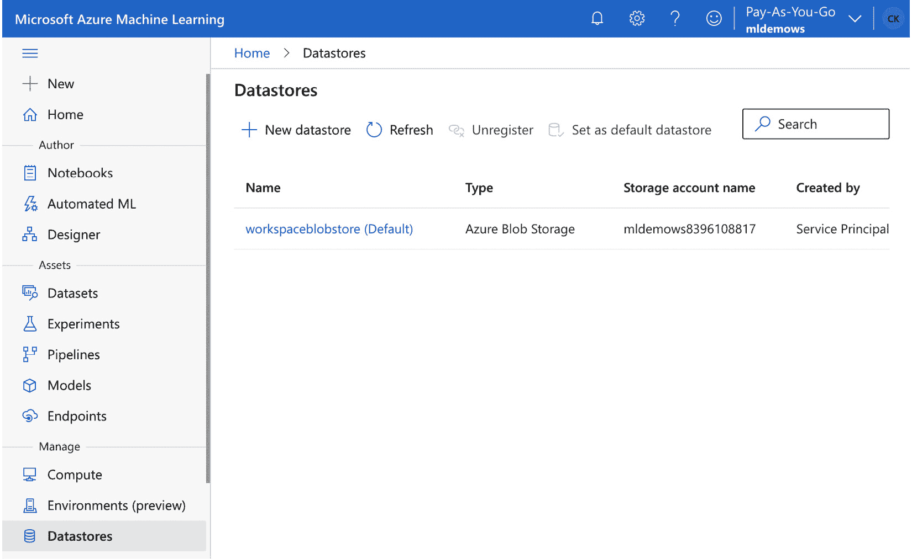

图 4.1 – Azure 机器学习中的默认数据存储

当没有定义其他数据存储时，默认数据存储由 Azure Machine Learning 内部使用来存储所有资产和工件。您可以通过创建数据存储引用，以与自定义数据存储相同的方式访问和使用默认数据存储。以下代码片段显示了如何获取默认数据存储的引用：

```py
from azureml.core import Datastore
default_datastore = Datastore.get_default(ws)
```

默认数据存储由 Azure Machine Learning 内部使用，用于在机器学习生命周期中存储所有资产和工件。使用前面的代码片段，您可以访问默认数据存储以存储自定义数据集和文件。

一旦我们访问了默认的数据存储并连接了自定义数据存储，我们就需要考虑一个策略来高效地存储不同机器学习用例的数据。让我们在下一节中解决这个问题。

## 探索在 Azure 中存储训练数据的选项

Azure 支持多种不同的数据存储解决方案和技术，以在云中存储数据——正如我们在上一节中看到的，其中许多都是 Azure Machine Learning 支持的数据存储。在本节中，我们将探讨一些这些服务和技术，以了解哪些可以用于机器学习用例。

数据库系统可以根据数据类型和访问数据的类型进行广泛分类，分为以下两类：

+   **关系数据库管理系统**（**RDBMSs**）通常用于存储使用基于 B 树的有序索引的规范化事务数据。典型的查询通过连接多个表中的多行来过滤、分组和聚合结果。Azure 支持不同的 RDBMS，例如 Azure SQL 数据库、Azure Database for PostgreSQL 和 MySQL。

+   **NoSQL**：基于键值存储的系统通常用于存储使用基于哈希或有序索引的非规范化数据。典型的查询通过基于分区键分布的集合访问单个记录。Azure 支持不同的基于 NoSQL 的服务，如 Azure Cosmos DB 和 Azure 表存储。

如您所见，根据您的用例，您可以使用这两种数据库技术来存储机器学习数据。虽然 RDBMS 是存储机器学习训练数据的优秀技术，但 NoSQL 系统非常适合存储查找数据，例如训练标签，或机器学习结果，如推荐、预测或特征向量。

除了选择数据库服务之外，机器学习的另一种流行选择是使用数据存储系统。在磁盘上，大多数数据库服务以数据页的形式持久化在 **文件** 或 **blob 存储系统** 上。由于它们的可扩展性、性能、吞吐量和成本，blob 存储系统是存储各种数据和资产以供机器学习使用的非常流行的选择。Azure 机器学习广泛使用 blob 存储系统，特别是用于存储所有操作资产和日志。

流行的 Azure Blob 存储服务包括 Azure Blob 存储和 Azure Data Lake Storage，它们通过不同的数据格式选择提供了极大的灵活性，以实现高效的数据存储和访问解决方案。虽然 Azure Blob 存储支持大多数基于 blob 的文件系统操作，但 Azure Data Lake Storage 实现了高效的目录服务，这使得它成为横向可扩展文件系统的流行通用存储解决方案。它是存储大型机器学习训练数据集的流行选择。

虽然表格数据可以在 RDBMS 系统中有效地存储，但在 blob 存储系统上存储数据时，通过选择正确的数据格式和嵌入的聚类索引也可以实现类似的功能。选择正确的数据格式将允许您的文件系统有效地存储、读取、解析和聚合信息。

常见的数据格式选择可以分为文本格式（CSV、JSON 等）以及二进制格式（图像、音频、视频等）。用于存储表格数据的二进制格式通常分为行压缩格式（Protobuf、Avro、SequenceFiles 等）或列压缩格式（Parquet、ORC 等）。另一种流行的选择是使用 Gzip、Snappy 或其他压缩算法压缩整个文件。

大多数数据存储系统都共同拥有一种结构，即分层路径或目录结构来组织数据块。对于存储机器学习训练数据的一个流行选择是实施数据分区策略。这意味着数据被组织在多个目录中，每个目录包含特定键的所有数据，也称为分区键。

云服务提供商提供各种不同的存储解决方案，可以通过选择不同的索引、分区、格式和压缩技术进一步定制。对于存储机器学习表格训练数据的一个常见选择是使用列压缩的二进制格式，如 Parquet，按摄取日期分区，存储在 Azure 数据湖存储上，以实现高效的管理操作和可扩展的访问。

# 创建数据存储和导入数据

在查看 Azure 中用于 ML 处理的数据存储选项之后，我们现在将创建一个存储账户，我们将在整个书中使用它来存储原始数据和 ML 数据集。此外，我们还将探讨如何手动将一些数据传输到我们的存储账户，以及如何通过利用 Azure 中可用的集成引擎自动执行此任务。

## 创建 Blob 存储并将其与 Azure 机器学习工作区连接

首先，让我们创建一个存储账户。任何存储账户都将附带一个文件共享、一个队列以及表格存储，以便您在其他场景中利用。除了这三个之外，根据您在创建时提供的设置，您最终可能会得到 Blob 存储或数据湖。默认情况下，将创建 Blob 存储账户。如果我们想创建数据湖账户，我们必须将`enable-hierarchical-namespace`设置设置为`True`，因为数据湖提供了一个实际的分层文件夹结构，而不是一个扁平的命名空间。

### 创建 Blob 存储

记住这一点，让我们创建一个 Blob 存储账户：

1.  导航到您选择的终端，登录 Azure，并确认您正在正确的订阅中工作，正如我们在*第三章*，“准备 Azure 机器学习工作区”中学到的。

1.  由于我们要创建一个存储账户，让我们通过运行以下命令来查看创建账户的选项和所需设置：

    ```py
    $ az storage account create -h
    ```

查看结果，您将看到一个非常长的可能参数列表，但唯一必需的是`name`和`resource-group`。尽管如此，我们仍然应该进一步查看，因为许多其他设置仍然设置为某些默认值，这些值可能不适合我们的情况。

在查看列表时，您会发现许多关于网络或安全设置的选项。大多数选项的默认设置是至少允许从任何地方访问。在这个时候，我们不太关心虚拟网络集成或处理 Azure Key Vault 中的自己的管理密钥。

除了所有这些选项之外，还有一些定义了我们设置的存储账户类型的选项，即`enable-hierarchical-namespace`、`kind`、`location`和`sku`。

我们已经讨论了第一个选项，并且默认值为`False`，因此我们可以忽略它。

查看`kind`，您会看到一个存储类型的列表。您可能会认为我们需要选择`BlobStorage`，但不幸的是，这是一个遗留设置，留在了仍在运行第一版（V1）的任何存储账户中。对于我们的场景，默认的（`StorageV2`）是最佳选项。

查看`location`，我们看到我们可以为所有部署设置一个默认位置，因此它没有被标记为必需。由于我们迄今为止还没有这样做，我们将在部署存储账户时提供它。

最后，查看`sku`，我们看到这是一个关于所使用的磁盘技术类型（`Standard`/`Premium`）的选项组合，其中`Standard`表示 HDD 存储，`Premium`表示 SSD 存储，以及一个定义数据冗余方案（LRS/ZRS/GRS/RAGRS/GZRS）的选项。如果您想了解更多关于冗余选项的信息，请点击此链接：[`docs.microsoft.com/en-us/azure/storage/common/storage-redundancy`](https://docs.microsoft.com/en-us/azure/storage/common/storage-redundancy)。由于两者都会增加成本，您可以保留默认值（`Standard_RAGRS`）或选择本地冗余（`Standard_LRS`）。

1.  让我们创建我们的存储账户。请注意，您选择的名称必须是全局唯一的，因此您不能选择在以下命令中将要读取的名称：

    ```py
    az storage account create \
         --name mldemoblob8765 \
         --resource-group mldemo \
         --location westus \
         --sku Standard_LRS \
         --kind StorageV2
    ```

该命令生成的输出将显示创建的存储账户的详细设置。

1.  作为最后一步，让我们在我们的新 Blob 存储中创建一个容器。为此，请使用适当的账户名称运行以下命令：

    ```py
    az storage container create \
        --name mlfiles \
        --account-name mldemoblob8765
    ```

结果将在最后显示`True`，但在之前会给出一些警告，类似于以下内容：

```py
There are no credentials provided in your command and environment, we will query for account key for your storage account. It is recommended to provide --connection-string, --account-key or --sas-token in your command as credentials.
```

命令成功执行，因为它通过我们的会话自动拉取了存储账户的密钥。通常，要访问存储账户，我们需要一个 AD 身份、访问整个账户的密钥（`account-key`）或共享访问密钥（`sas-token`）以访问特定子目录或容器。当从 ML 工作区连接时，我们将会回到这一点。

要检查结果，请运行以下命令：

```py
az storage container list \
    --account-name mldemoblob8765 \
    --auth-mode login
```

现在我们已经有了存储账户，让我们将其连接到我们的 Azure 机器学习工作区。

### 在 Azure 机器学习中创建数据存储

为了在处理我们的 ML 脚本时不再烦恼存储账户本身，我们现在将创建一个永久连接到存储账户中的容器，并将其定义为 Azure 机器学习工作区中的一个数据存储。

以下步骤将指导您完成此过程：

1.  首先，让我们通过运行以下命令来了解创建数据存储所需的内容：

    ```py
    az ml datastore create -h
    ```

通过查看输出，我们了解到需要资源组的名称、ML 工作区的名称和一个 YAML 文件。我们有两个这样的东西。因此，让我们了解 YAML 文件应该是什么样子。

1.  导航至[`docs.microsoft.com/en-us/azure/machine-learning/reference-yaml-datastore-blob`](https://docs.microsoft.com/en-us/azure/machine-learning/reference-yaml-datastore-blob)，在那里你可以找到我们文件的所需架构和一些示例。通过查看示例，你会发现它们主要在认证存储账户的方式上有所不同。其中最安全的是通过 SAS 令牌进行限制访问，因此我们将选择这条路径。

1.  请从 GitHub 仓库中下载*第四章*，“数据摄取和管理数据集”的`blobdatastore.yml`文件，或者创建一个具有相同名称和以下内容的文件：

    ```py
    $schema: https://azuremlschemas.azureedge.net/latest/azureBlob.schema.json
    name: mldemoblob
    type: azure_blob
    description: main ML blob storage
    account_name: mldemoblob8765
    container_name: mlfiles
    credentials:
      sas_token: <your_token>
    ```

请输入适合你情况的适当账户名称。现在唯一缺少的是 SAS 令牌，我们需要为我们的`mlfiles`容器创建它。

1.  运行以下命令为我们的容器创建一个 SAS 令牌：

    ```py
    az storage container generate-sas \
        --account-name mldemoblob8765 \
        --name mlfiles \
        --expiry 2023-01-01 \
        --permissions acdlrw
    ```

此命令生成一个 SAS 令牌，有效期为 2023 年 1 月 1 日，并具有对`mlfiles`容器的权限。选择一个足够远的未来日期，以便你可以使用这本书。在正常情况下，你会选择一个更短的过期日期，并相应地旋转此密钥。

结果应该是这种格式：

```py
xx=XXXX-XX-XX&xx=xxxx&xxx=xxx&xx=xxxxxxxxxxx&xx=XXXX-XX-XXXXX:XX:XXX&xx=XXXX-XX-XXXXX:XX:XXX&xxx=xxxxx&xxx=XXxXXXxxxxxXXXXXXXxXxxxXXXXXxxXXXXXxXXXXxXXXxXXxXX
```

将此结果（不带引号）输入 YAML 文件中的`sas_token`字段。

1.  导航到 YAML 文件所在的目录，这样我们就可以通过运行以下命令在 Azure Machine Learning 工作区中最终创建数据存储：

    ```py
    az ml datastore create \
        --workspace-name mldemows \
        --resource-group mldemo \
        --file ./blobdatastore.yml
    ```

结果应该看起来像以下这样：

```py
"account_name": "mldemoblob8765",
"container_name": "mlfiles",
"credentials": {},
"description": "main ML blob storage",
"endpoint": "core.windows.net",
"id": <yourid>,
"name": "mldemoblob",
"protocol": "https",
"resourceGroup": "mldemo",
"tags": {},
"type": "azure_blob"
```

通过这些步骤，我们已经使用 SAS 令牌注册了一个连接到我们的 blob 存储的数据存储。

重要提示

当连接到数据湖存储时，你可以遵循相同的步骤，但请注意，要访问数据湖，你需要创建一个**服务主体**。有关此内容的详细描述，请参阅此处：[`docs.microsoft.com/en-us/azure/active-directory/develop/howto-create-service-principal-portal`](https://docs.microsoft.com/en-us/azure/active-directory/develop/howto-create-service-principal-portal)。

如前所述，我们可以在 Azure 门户中的向导中创建一个 blob 存储，为该容器创建一个 SAS 令牌，并在 Azure Machine Learning Studio 的数据存储创建向导中输入它。我们使用了 Azure CLI，这样你可以熟悉这个过程，因为这在将来自动化此类步骤时是必需的，尤其是在我们谈论基础设施即代码和 DevOps 环境时。

在任何情况下，请随意导航到 Azure Machine Learning Studio 中的**数据存储**选项卡。*图 4.2*显示了我们的新创建的工作区：

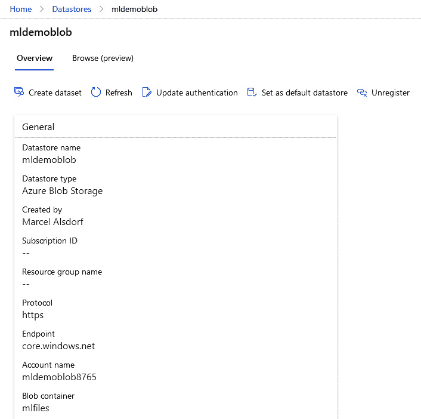

图 4.2 – 创建的数据存储

保持此标签页打开，以便我们可以在下一节中通过 `mlfiles` 容器进行验证。

## 将数据导入 Azure

我们创建了一个 Azure Blob 存储帐户，并学习了如何为常见的机器学习用例组织和格式化文件和表格数据。然而，一个常被忽视的步骤是如何将这些数据存储或 Azure 中的数据有效地导入。针对不同的数据集和用例有不同的解决方案，从临时、自动化、并行化解决方案等。在本节中，我们将探讨将数据手动或自动上传到关系数据库（SQL、MySQL 或 PostgreSQL）或 Azure 中的存储帐户的方法。最后，我们将上传一个数据集文件到之前创建的 blob 存储。

### 理解手动导入数据的相关工具

如果您处理少量数据集和文件，并且不需要从其他现有源传输数据，手动上传数据是首选选项。

以下列表显示了将数据带入您的数据存储或直接带入您的机器学习管道的可能选项：

+   **Azure 存储资源管理器**：存储资源管理器是一个交互式应用程序，允许您上传数据到并控制数据存储，例如存储帐户和管理磁盘。这是管理存储帐户最容易使用的工具，您可以在以下位置找到它：[`azure.microsoft.com/en-us/features/storage-explorer/#overview`](https://azure.microsoft.com/en-us/features/storage-explorer/#overview)。

+   **Azure CLI**：正如我们之前看到的，我们基本上可以使用 CLI 做任何事情，包括在存储帐户中创建和上传 blob。您可以在以下存储扩展中找到上传 blob 的适当命令：[`docs.microsoft.com/en-us/cli/azure/storage/blob`](https://docs.microsoft.com/en-us/cli/azure/storage/blob)。

+   **AzCopy**：这是另一个专门设计用于将 blob 或文件复制到存储帐户的命令行工具。您使用 Azure CLI 软件包还是 AzCopy 取决于个人喜好，因为这两种选项之间没有明显的性能差异。您可以在以下位置找到下载链接和描述：[`docs.microsoft.com/en-us/azure/storage/common/storage-use-azcopy-v10`](https://docs.microsoft.com/en-us/azure/storage/common/storage-use-azcopy-v10)。

+   **Azure 门户**：对于任何服务，您都会在 Azure 门户中直接找到一个用于上传或更改数据的网络界面。如果您导航到存储帐户，您可以使用内置的存储浏览器通过网络界面直接上传 blob 和文件。对于任何数据库技术也是如此。

+   **RDBMS 管理工具**：您可以使用任何典型的管理工具来配置、创建和更改关系数据库中的表和模式。对于 SQL 数据库和 Synapse，这将使用**SQL Server Management Studio** ([`docs.microsoft.com/en-us/sql/ssms/download-sql-server-management-studio-ssms?view=sql-server-ver15`](https://docs.microsoft.com/en-us/sql/ssms/download-sql-server-management-studio-ssms?view=sql-server-ver15))；对于 PostgreSQL，这将使用**pgAdmin** ([`www.pgadmin.org/`](https://www.pgadmin.org/))；对于 MySQL，这将使用**MySQL Workbench** ([`docs.microsoft.com/en-us/azure/mysql/connect-workbench`](https://docs.microsoft.com/en-us/azure/mysql/connect-workbench))。

+   **Azure Data Studio**：Data Studio 允许您连接到任何 Microsoft SQL 数据库、Synapse、Azure 中的 PostgreSQL 数据库以及 Azure 数据探索器。这是一个多平台工具，与最后一点中提到的典型管理工具非常相似，但仅在一个平台上。您可以从这里下载此工具：[`docs.microsoft.com/en-us/sql/azure-data-studio/download-azure-data-studio?view=sql-server-ver15`](https://docs.microsoft.com/en-us/sql/azure-data-studio/download-azure-data-studio?view=sql-server-ver15)。

+   **Azure Machine Learning designer（导入数据）**：如果您不想使用 Azure 机器学习数据存储，您可以使用机器学习设计器中的**导入数据**组件将数据临时添加到您的管道中。这不是最干净的操作方式，但仍然是一个选择。您可以在以下位置找到有关此方法的所有信息：[`docs.microsoft.com/en-us/azure/machine-learning/component-reference/import-data`](https://docs.microsoft.com/en-us/azure/machine-learning/component-reference/import-data)。

在我们测试这些选项之前，让我们看看在 Azure 中创建自动化数据流和转换数据的选择。

### 理解自动化数据摄取和转换的工具

对于小型测试来说，手动复制数据是完全可行的，甚至可能是我们将在本书中执行的大多数任务，但在现实世界的场景中，我们不仅需要与许多不同的源进行集成，还需要一个不涉及人员手动将数据从 A 移动到 B 的过程。

因此，我们现在将查看允许我们以自动化方式转换和移动数据的服务，并且这些服务与 Azure 机器学习中的管道和 MLOps 集成得非常好。

#### Azure Data Factory

Azure Data Factory 是 Azure 中用于移动和转换数据的企业级解决方案。它提供了连接到数百个不同源的能力，并能够创建管道以转换集成数据，同时调用 Azure 中的多个其他服务。

运行以下命令以创建数据工厂：

```py
az datafactory create \
    --location "West US 2" \
    --name "mldemoDF8765" \
    --resource-group "mldemo"
```

请注意，名称必须再次是全球唯一的。此外，在部署之前，CLI 将要求您安装`datafactory`扩展。

完成后，导航到 Azure 门户中的资源，在 **概览** 选项卡上点击 **打开 Azure 数据工厂工作室**，这将带您到您的数据工厂实例的工作台。您应该看到一个如 *图 4.3* 所示的视图：

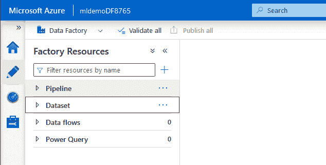

图 4.3 – 数据工厂资源视图

从此视图，您可以创建管道、数据集、数据流和 Power Query。让我们简要讨论一下它们是什么：

+   **管道**：管道是 Azure 数据工厂的主要明星。您可以通过创建复杂的管道，调用多个服务从源拉取数据，对其进行转换，并将其存储在目标中。

+   **数据集**：数据集在管道中用作源或目标。因此，在构建管道之前，您可以定义一个连接到您最终想要从中读取或写入特定数据的数据存储的连接。

+   **数据流**：数据流允许您在数据工厂内部本身进行实际的数据处理或转换，而不是调用不同的服务来完成繁重的工作。

+   **Power Query**：Power Query 允许您在数据工厂内部使用 DAX 进行数据探索，这在其他情况下通常只有使用 Power BI 或 Excel 才能实现。

如果您点击 **Pipeline** 旁边的三个点，可以创建一个新的，这将导致如 *图 4.4* 所示的以下视图：

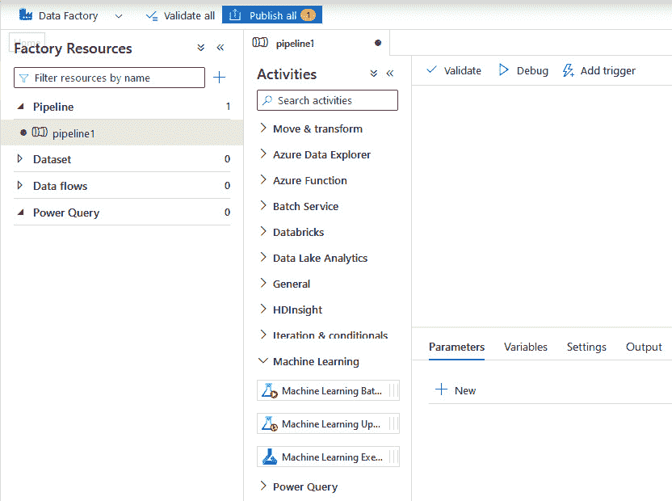

图 4.4 – 创建数据工厂管道

查看可能的活动，您会发现一种从 A 到 B 复制数据（**Copy Data**）、在 Azure Functions 中执行脚本（**Azure Function**）、在 SQL 数据库中调用存储过程（**Stored Procedure**）、在 Databricks 中执行笔记本（**Notebook**）以及执行 ML 管道（**Machine Learning Execute Pipeline**）等方法。通过这些活动和您在 **通用** 和 **迭代与条件** 中找到的控制工具，您可以构建非常复杂的数据管道来移动和转换您的数据。

如您可能已经注意到的，Azure Synapse 在活动列表中缺失。原因是 Synapse 在平台中集成了自己的数据工厂版本。因此，如果您在 Synapse 中使用 SQL 池或 Spark 池，您可以使用 Synapse 的集成工具，这将为您提供在 Synapse Spark 池中运行笔记本或在 SQL 池上调用存储过程的访问权限。

如果您正在寻找 Azure 数据工厂的深入概述，请查看 Catherine Wilhelmsen 的 *Azure 数据工厂入门指南*：[`www.cathrinewilhelmsen.net/series/beginners-guide-azure-data-factory/`](https://www.cathrinewilhelmsen.net/series/beginners-guide-azure-data-factory/)。

现在，我们需要理解的是，有两种方法可以将此数据工厂管道集成到 Azure Machine Learning 中：

+   **从存储帐户读取结果**：我们可以在数据工厂中运行转换管道，转换我们的数据，然后将结果存储在存储帐户中。然后，我们可以通过我们学习的方式访问数据，即通过一个 ML 数据存储。在这种情况下，我们在 Azure 机器学习中的任何管道都与数据工厂中的转换管道断开连接，这可能不是 MLOps 的最佳方式。

+   **从数据工厂调用 Azure 机器学习**：我们可以创建一个转换管道，并将实际的 Azure 机器学习管道作为数据工厂管道的一部分来调用。如果我们开始构建端到端的 MLOps 工作流程，这是首选方式。

关于这方面的更多信息，请阅读以下文章：[`docs.microsoft.com/en-us/azure/machine-learning/how-to-data-ingest-adf`](https://docs.microsoft.com/en-us/azure/machine-learning/how-to-data-ingest-adf)。

#### Azure Synapse Spark 池

如我们在*第二章*中讨论的，*在 Azure 中选择合适的机器学习服务*，Azure Databricks 和 Azure Synapse 提供了在 Spark 池中运行 Spark 作业的选项。Apache Spark 可以通过利用节点池的分布式特性来帮助您转换和预处理极其庞大的数据集。因此，这个工具在开始实际的机器学习过程之前，可以帮助我们分解和过滤数据集。

我们已经看到，我们可以从 Azure Data Factory 或 Azure Synapse 的集成引擎中运行笔记本，因此已经可以访问这些服务。除此之外，我们还有选项将 Synapse Spark 池作为所谓的**链接服务**添加到 Azure 机器学习工作区中（请参阅 Azure 机器学习工作室中的**链接服务**选项卡）。执行此步骤后，我们不仅可以访问 ML 计算目标，还可以通过 Azure 机器学习 SDK 将 Spark 池作为计算目标。

您可以通过 Azure 机器学习工作室或 Azure 机器学习 Python SDK 创建此链接，这两者都在以下文章中进行了描述：[`docs.microsoft.com/en-us/azure/machine-learning/how-to-link-synapse-ml-workspaces`](https://docs.microsoft.com/en-us/azure/machine-learning/how-to-link-synapse-ml-workspaces)。

通过这种直接集成，我们可以在我们的 ML 管道中通过 Spark 集群运行转换步骤，因此又得到了构建干净端到端 MLOps 工作流程的另一个好选择。

### 将数据复制到 Blob 存储

现在，我们已经对大多数移动和转换数据的选项有了很好的理解，让我们将数据集上传到我们的存储帐户。

在*第五章*中，*执行数据分析与可视化*，我们将开始分析和预处理数据。为此，让我们上传本章中将使用的数据集。

我们将使用由 Anthony Pino 创建的**墨尔本住房数据集**，您可以在以下链接找到：[`www.kaggle.com/anthonypino/melbourne-housing-market`](https://www.kaggle.com/anthonypino/melbourne-housing-market)。选择这个数据集的原因是它覆盖的领域，因为每个人都理解住房，以及数据的合理清洁度。如果你继续通过处理数据来推进你的旅程，你会发现有很多数据集，但只有少数是干净且具有教育意义的。

此外，为了使我们在下一章分析数据集时生活更加便利，我们将实际上只使用这个数据集的一个子集。

按照以下步骤操作，以便我们可以将此文件放入我们的`mldemoblob`数据存储中：

1.  从[`www.kaggle.com/dansbecker/melbourne-housing-snapshot`](https://www.kaggle.com/dansbecker/melbourne-housing-snapshot)下载`melb_data.csv`文件，并将其存储在你的设备上的一个合适的文件夹中。

1.  导航到该文件夹，并在 CLI 中运行以下命令，将存储账户名称替换为您自己的名称：

    ```py
    az storage blob upload \
        --account-name mldemoblob8765 \
        --file ./melb_data.csv \
        --container-name mlfiles \
    --name melb_data.csv 
    ```

1.  为了验证这一点，让我们看看另一种移动此文件的方法。安装 Azure 存储资源管理器，并在该应用程序中登录到您的 Azure 账户。导航到您的存储账户并打开`mlfiles`容器。它应该显示如图 4.5 所示的视图：

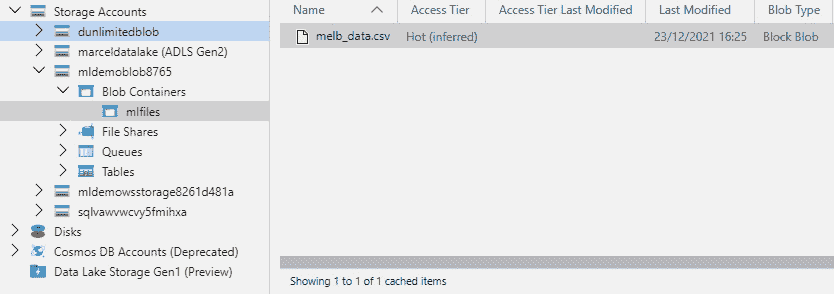

图 4.5 – Azure 存储资源管理器

如您所见，我们的文件就在它应该的位置。我们也可以直接将文件拖放到这里，自动创建一个 blob 文件。从现在开始，请随意使用您觉得更舒适的方法。

1.  为了完成这个步骤，请查看应用程序本身。例如，如果你在容器上右键点击，你可以选择一个名为**获取共享访问签名**的选项，这将打开一个向导，允许你直接在这里创建 SAS 令牌，而不是像我们通过命令行那样做。

通过之前的步骤，我们已经将原始数据集文件放入我们的存储账户中，因此也放入了我们的机器学习数据存储中。在下一节中，我们将探讨如何从这些原始文件创建 Azure 机器学习数据集，以及它们提供了哪些功能来支持我们当前的机器学习之旅。

# 在 Azure 机器学习中使用数据集

在本章的前几节中，我们讨论了如何将数据放入云端，将数据存储在数据存储中，以及如何通过**数据存储和数据集**将数据连接到 Azure 机器学习工作区。我们集中管理数据和数据访问，以便在所有计算环境中使用数据，无论是用于实验、训练还是推理。在本节中，我们将重点介绍如何在训练期间创建、探索和访问这些数据集。

一旦数据被管理为数据集，我们就可以在 Azure Machine Learning 中跟踪每个实验或训练运行所使用的数据。这将使我们能够了解特定训练运行和训练模型所使用的数据，这是创建可重复端到端机器学习工作流程的关键步骤。

将您的数据组织到数据集中还有另一个好处，那就是您可以通过**直接访问**、**下载**或**挂载**轻松地将管理数据集传递到您的实验或训练脚本中。直接访问方法适用于公开可用的数据源，**下载**方法适用于小型数据集，**挂载**方法适用于大型数据集。在 Azure Machine Learning 训练集群中，这完全透明，数据将自动提供。然而，我们可以使用相同的技巧通过访问数据集对象来访问任何其他 Python 环境中的数据。

在本节的最后部分，我们将探讨 Azure Open Datasets——一组您可以直接从 Azure Machine Learning 工作区中消费的精选 Azure Machine Learning 数据集。

### 创建新的数据集

创建新的数据集有多种方法，但大多数方法会区分表格数据和文件数据集。您需要根据您想要创建的数据集类型使用不同的构造函数：

+   `Dataset.Tabular.from_*` 用于表格数据集

+   `Dataset.File.from_*` 用于基于文件的数据集（例如，图像、音频等）

对于表格数据集，我们也会区分从原始位置通过公开 URL 访问的数据——称为**直接数据集**——或存储在默认或自定义**数据存储**中。

`Dataset`对象可以通过其对象引用在当前环境中访问或传递。然而，数据集也可以注册（并版本化），因此可以通过数据集名称（和版本）访问——这被称为**注册数据集**。

让我们看看一个简单的直接数据集示例，它被定义为表格数据集，并包含一个公开可用的 URL，该 URL 包含包含数据的分隔符文件：

```py
from azureml.core import Dataset
path = 'https://...windows.net/demo/Titanic.csv'
ds = Dataset.Tabular.from_delimited_files(path)
```

如您在代码中所见，我们可以通过传递公开可访问的分隔符文件 URL 来创建一个**直接数据集**。当内部传递此数据集时，每个消费者都会尝试从其 URL 获取数据集。

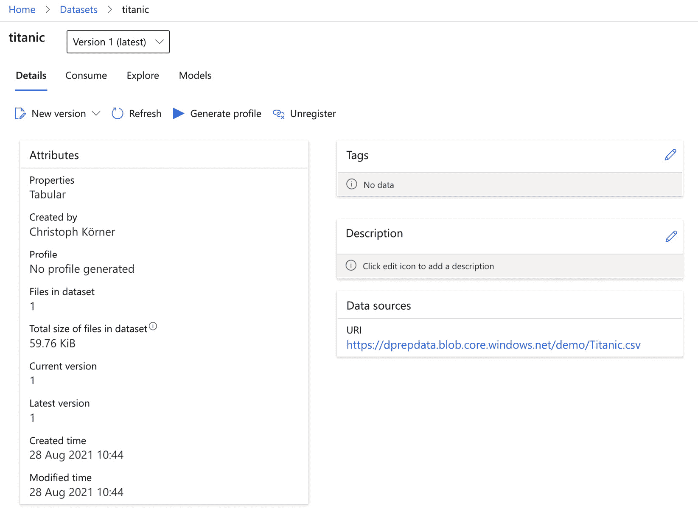

图 4.6 – 直接数据集

一旦我们有一个数据存储的引用，我们就可以访问其中的数据。在以下示例中，我们从`mldata`数据存储的目录中创建一个文件数据集：

```py
from azureml.core import Dataset, Datastore
datastore_name = "mldata"
datastore = Datastore.get(ws, datastore_name)
ds = Dataset.File.from_files((datastore, "cifar10/"))
```

如示例所示，我们可以将数据存储中的数据注册为数据集。在这个例子中，我们将文件夹中的所有文件定义为文件数据集，但我们也可以将 Blob 存储中的分隔符文件定义为表格数据集。

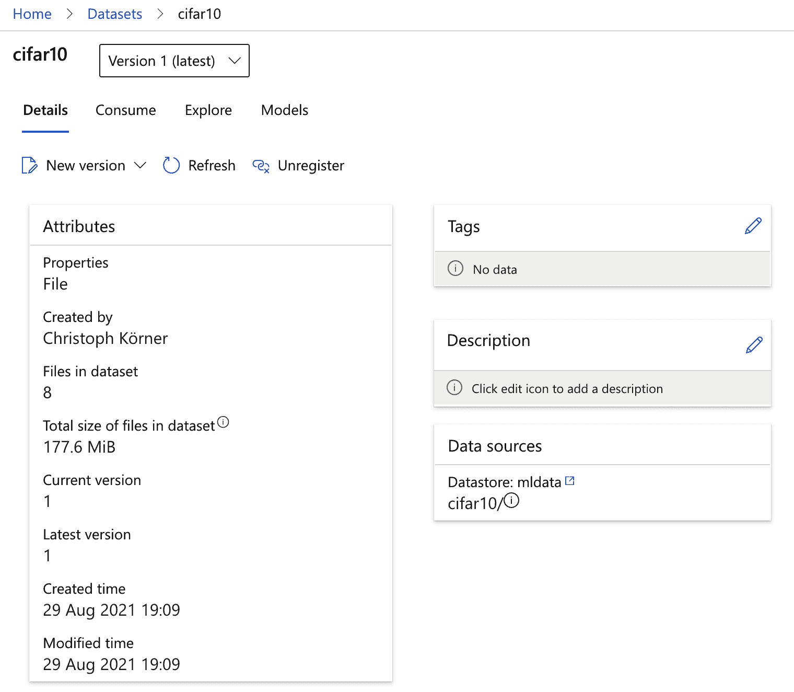

图 4.7 – 文件数据集

在下一步中，我们使用以下代码片段在工作空间中注册此数据集以创建一个 *已注册的数据集*：

```py
ds = ds.register(ws, name="titanic",
                 create_new_version=True)
```

之前的代码将直接数据集注册到你的工作空间，并返回一个已注册的数据集。已注册的数据集列在 Azure Machine Learning Studio 中，可以通过数据集名称而不是 `Dataset` Python 对象访问。

`create_new_version` 参数控制我们是否想要创建现有数据集的新版本。一旦创建了一个新的数据集版本，就可以通过数据集名称访问数据集 - 这将隐式访问最新版本 - 或者通过其名称和特定版本。数据集版本对于管理工作空间内数据集的不同迭代非常有用。

### 探索数据集中的数据

在 Azure Machine Learning 中探索已注册数据集有多种选择。对于表格数据集，最方便的方法是在 Azure Machine Learning 工作空间中以编程方式加载和分析数据集。为此，你可以简单地通过其名称和版本引用数据集，如下面的代码片段所示：

```py
from azureml.core import Dataset
ds = Dataset.get_by_name(ws, name="titanic", version=1)
```

一旦你有了数据集的引用，你可以将数据集引用转换为实际的内存中 **pandas** DataFrame 或懒加载的 **Spark** 或 **Dask** DataFrame。为此，你可以调用以下方法之一：

+   `to_pandas_dataframe()` 用于创建内存中的 pandas DataFrame

+   `to_spark_dataframe()` 用于创建一个懒加载的 Spark DataFrame

+   `to_dask_dataframe()` 用于创建懒加载的 Dask DataFrame

让我们看看三个命令的实际操作，从内存中的 pandas DataFrame 开始。以下代码片段将所有数据加载到 pandas DataFrame 中，然后返回 DataFrame 的前五行：

```py
panads_df = ds.to_pandas_dataframe()
pandas_df.head()
```

在加载 DataFrame 之后，你可以运行你喜欢的 pandas 方法来探索数据集。例如，开始时使用 `info()` 命令查看列和数据类型，以及使用 `describe()` 命令查看 DataFrame 中数值的统计信息。

懒加载数据集是仅在需要时才将部分数据加载到内存中的数据集，例如，当需要计算结果时。非懒加载数据集将所有数据加载到内存中，因此受可用内存的限制。

如果你更熟悉 PySpark，你也可以使用以下代码片段将数据集转换为 Spark DataFrame。与上一个示例相比，此代码实际上不会将所有数据加载到内存中，而只会获取执行 `show()` 命令所需的数据 - 这使其成为分析大型数据集的绝佳选择：

```py
spark_df = ds.to_spark_dataframe()
spark_df.show()
```

另一种选择是返回数据集的 Dask DataFrame。Dask 是一个支持懒加载数据集的 Python 库，具有类似 pandas 和 NumPy 的 API。因此，你可以运行以下代码以懒加载方式返回 DataFrame 的前五行：

```py
dask_df = ds.to_dask_dataframe()
dask_df.head()
```

一旦你获得了访问你喜欢的数值或统计库中数据的编程权限，你就可以根据需要对你的数据集进行切片和切块。虽然编程访问对于可重复性和定制化来说很棒，但用户通常只想了解数据是如何结构的，并查看一些示例记录。Azure Machine Learning 也提供了在 Data Studio UI 中探索数据集的可能性。

要进入此视图，请转到 **数据集**，选择一个数据集，然后点击 **探索** 选项卡。第一页显示了你的数据预览，包括前 *n* 行以及一些关于数据的基本信息——例如行数和列数。以下截图是一个示例：

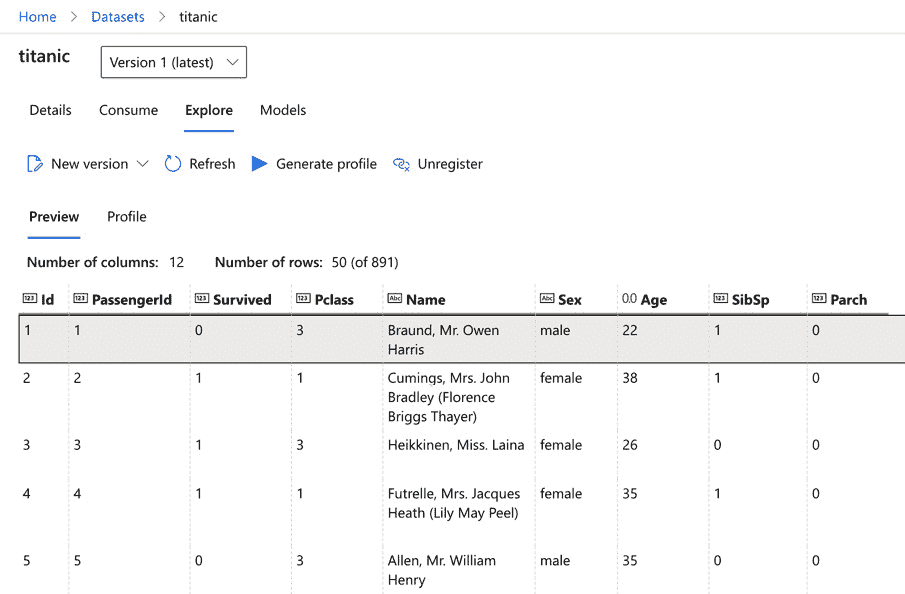

图 4.8 – 带有数据预览的数据集

如果你点击第二个选项卡，你可以生成并查看数据概要。此概要类似于在 pandas DataFrame 上调用 `describe()`——对数据集中每一列的统计分析，但支持分类数据和一些更有用的信息。如图 4.9 所示，它还显示了每个列的数据分布图：

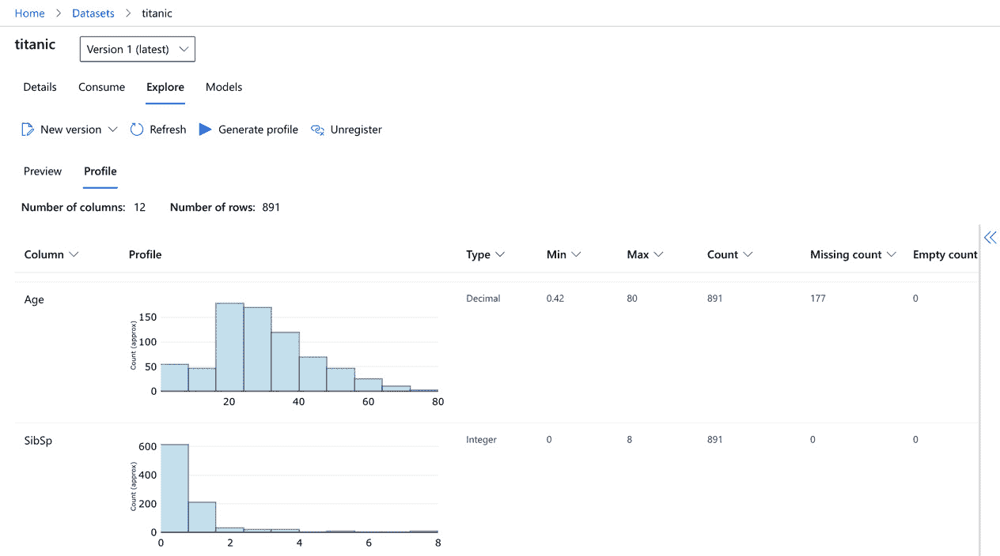

图 4.9 – 带有数据概要的数据集

如前图所示，这是数据集的一个非常有用的总结。从这个视图中获得的见解对于所有使用此数据集的人来说都很重要。

在本节中，我们看到了多种访问和分析 Azure Machine Learning 数据集中存储的数据的方法——通过 Python 和你喜欢的数值库进行编程访问，或者通过 UI。

## Azure Machine Learning 中的数据集跟踪

对最终生产模型中所有资产的端到端跟踪对于可重复性、可解释性、审计和跟踪都是必不可少的。机器学习模型是一个通过迭代和从你的训练数据中采样实验来最小化损失函数的函数。因此，训练数据本身应被视为模型的一部分，因此应通过端到端的机器学习过程进行管理、版本控制和跟踪。

我们想利用数据集来为我们的实验添加数据跟踪。了解数据跟踪能力差异的一个好方法是通过两个示例：首先，从 URL 加载 CSV 数据集，然后通过 Azure Machine Learning 中的数据集抽象从同一 URL 加载数据。然而，我们不仅想加载数据，还想将其从编写脚本传递到训练脚本作为参数。

我们将首先使用 `pandas` 直接从 URL 加载 CSV 文件，并将其作为 URL 传递给训练脚本。在下一步中，我们将通过使用直接的数据集来增强此方法，这样我们就可以方便地将数据集配置传递给训练脚本，并跟踪 Azure Machine Learning 中实验运行的数据集。

### 将外部数据作为 URL 传递

我们以从远程 URL 可用的 CSV 文件数据开始我们的示例，这是分发公共数据集的常见方式。在第一个没有 Azure Machine Learning 数据集跟踪的示例中，我们将使用 `pandas` 库来获取和解析 CSV 文件：

1.  让我们从使用 pandas 的 `read_csv()` 方法作为示例的第一个代码片段开始，通过公共 URL 从远程服务器获取数据。然而，这只是一个示例——你可以用任何其他方法从远程位置获取数据：

    ```py
    import pandas as pd
    path ='https://...windows.net/demo/Titanic.csv'
    df = pd.read_csv(path)
    print(df.head())
    ```

我们的目的是将数据从编写脚本传递到训练脚本，以便将来可以轻松跟踪和更新。为了实现这一点，我们不能直接传递 DataFrame，而必须传递 CSV 文件的 URL 并在训练脚本中使用相同的方法获取数据。让我们编写一个小型训练脚本，其唯一任务是解析命令行参数并从 URL 获取数据：

**code/access_data_from_path.py**

```py
import argparse
import pandas as pd
parser = argparse.ArgumentParser()
parser.add_argument("--input", type=str)
args = parser.parse_args()
df = pd.read_csv(args.input)
print(df.head())
```

如前述代码所示，我们通过命令行的 `--input` 参数传递数据路径，然后使用 pandas 的 `read_csv()` 从位置加载数据。

1.  接下来，我们创建一个 `ScriptRunConfig` 构造函数，将实验运行提交给 Azure Machine Learning，以执行从 *步骤 1* 开始的训练脚本。现在，我们不做任何训练，只想了解编写和执行运行时之间传递的数据：

**Access_data_from_path.ipynb**

```py
src = ScriptRunConfig(
  source_directory="code",
  script='access_data_from_path.py',
  arguments=['--input', path],
  environment=get_current_env())
```

1.  让我们执行运行配置以运行实验并跟踪 Azure Machine Learning 中的运行详情。一旦实验运行完成，我们导航到 Azure Machine Learning 并检查这次运行的详细信息。正如我们在 *图 4.10* 中可以看到的，Azure Machine Learning 将按预期跟踪 `script` 参数，但不能将参数关联到数据集：

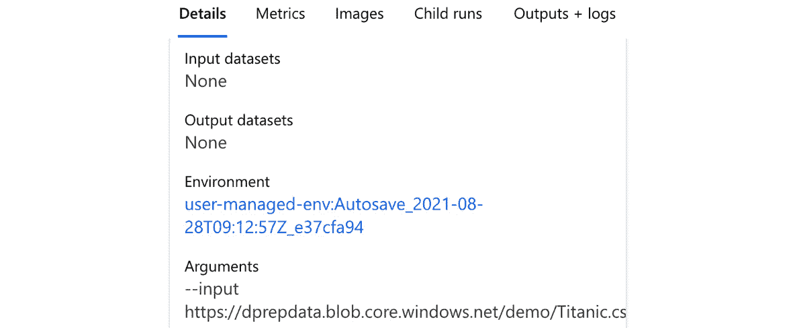

图 4.10 – 实验运行详情

让我们总结一下这种方法的缺点：

+   我们不能将 pandas DataFrame 或 DataFrame 标识符传递给训练脚本；我们必须通过 URL 将数据传递到其位置。如果文件路径发生变化，我们必须更新训练脚本的参数。

+   训练脚本不知道输入路径指的是训练脚本的输入数据，它只是训练脚本的一个字符串参数。虽然我们可以在 Azure Machine Learning 中跟踪参数，但我们不能自动跟踪数据。

### 将外部数据作为直接数据集传递

如承诺，我们现在将使用 Azure Machine Learning 中的数据集增强先前的示例。这将允许我们将数据集作为命名配置传递——抽象 URL 和数据的物理位置访问。它还自动为实验启用数据集跟踪：

1.  我们从编写脚本开始，从路径加载数据 - 只不过这次，我们使用 Azure Machine Learning 的 `TabularDataset`，通过 `from_delimited_files()` 工厂方法创建：

    ```py
    from azureml.core import Dataset
    path ='https://...windows.net/demo/Titanic.csv'
    ds = Dataset.Tabular.from_delimited_files(path)
    print(ds.to_pandas_dataframe().head())
    ```

这将在 pandas 中输出与上一个示例相同的行集 - 所以除了使用不同的方法创建 DataFrame 之外，几乎没有区别。然而，现在我们已经创建了一个 *直接数据集*，我们可以轻松地将数据集传递给训练脚本作为命名数据集配置 - 这将在底层使用数据集 ID。

1.  与 pandas 示例类似，我们编写了一个简化的训练脚本，该脚本将访问数据集并通过解析命令行参数中的输入数据集来打印前几条记录。在训练脚本中，我们可以使用 `Dataset.get_by_id()` 方法通过其 ID 从工作区获取数据集：

**code/access_data_from_dataset.py**

```py
import argparse
from azureml.core import Dataset, Run
parser = argparse.ArgumentParser()
parser.add_argument("--input", type=str)
args = parser.parse_args()
run = Run.get_context()
ws = run.experiment.workspace
ds = Dataset.get_by_id(ws, id=args.input)
print(ds.to_pandas_dataframe().head())
```

如前述代码所示，我们稍微修改了之前的代码，并添加了代码来检索当前的运行上下文、实验和工作区。这使得我们可以通过将数据集 ID 传递给 `Dataset.get_by_id()` 方法从工作区访问直接数据集。

1.  接下来，我们编写一个运行配置，将前面的代码作为实验提交给 Azure Machine Learning。首先，我们需要将数据集转换为命令行参数，并将其传递给训练脚本，以便在执行运行时自动检索。我们可以通过在数据集实例上使用 `as_named_input(name)` 方法来实现这一点，这将数据集转换为命名的 `DatasetConsumptionConfig` 参数，允许数据集传递到其他环境。

在这种情况下，数据集将以直接模式传递，并在运行时环境中作为 `name` 环境变量提供，或在命令行参数中作为数据集 ID。数据集也将作为训练脚本的输入参数在 Azure Machine Learning 中进行跟踪。

然而，如前述代码片段所示，我们在训练脚本中使用 `Dataset.get_by_id()` 方法从数据集 ID 获取数据集。我们不需要手动创建或访问数据集 ID，因为当 Azure Machine Learning 使用直接数据集调用训练脚本时，`DatasetConsumptionConfig` 参数将自动展开为数据集 ID。

**Access_data_from_dataset.ipynb**

```py
src = ScriptRunConfig(
  source_directory="code",
  script='access_data_from_dataset.py',
  arguments=['--input', ds.as_named_input('titanic')],
  environment=get_current_env())
```

如前述代码所示，数据集被转换为可以通过 `as_named_input(name)` 方法简单传递给训练脚本的配置。如果我们提交实验并检查运行日志，我们可以看到 Azure Machine Learning 将数据集 ID 传递给了训练脚本：

70_driver_log.txt

```py
...
After variable expansion, calling script [access_data_from_dataset.py] with arguments:['--input', '04f8ad60-5a51-4319-92fe-cdfa7f6c9adc']
```

该实验的运行详情如图 *图 4.11* 所示。如果您查看输入参数，您可以看到我们传递了 `DatasetConsumptionConfig` 对象给脚本，该对象随后自动转换为数据集 ID。不仅输入参数传递时没有关于底层数据位置的任何信息，输入数据集也被识别为训练数据的输入：

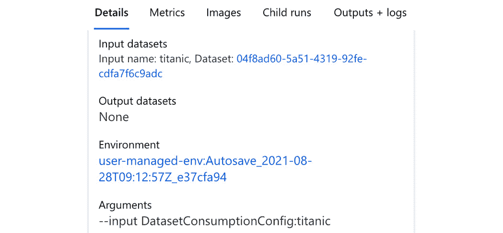

图 4.11 – 实验运行详情

通过将数据集传递给训练脚本，Azure Machine Learning 会自动跟踪实验运行中的数据集。如图 *图 4.11* 所示，数据集 ID 是追踪数据集的链接。当在 Azure Machine Learning 中点击数据集 ID 时，它将打开一个页面，显示追踪数据集的详细信息，例如描述、URL、大小和数据集类型，如图 *图 4.12* 所示。与已注册的数据集一样，您也可以探索原始数据，查看数据集列统计信息——称为概要——或查看从这些数据派生的任何已注册模型。通过点击 **注册** 操作或从代码中，可以轻松地将追踪数据集注册——从而进行版本控制和管理工作：

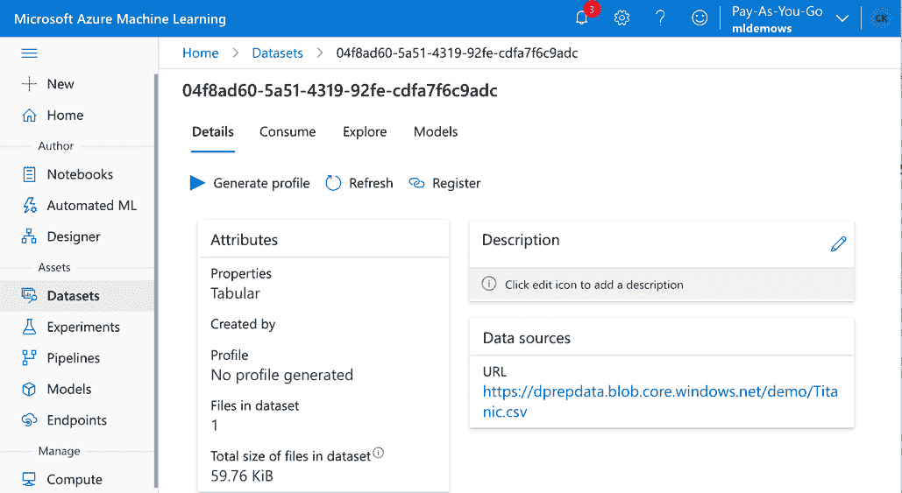

图 4.12 – Azure Machine Learning 中追踪的直接数据集

正如本节所示，将输入数据作为数据集参数传递给训练脚本有许多重要好处。这将自动跟踪您工作区中的数据集，并将数据集与实验运行连接起来。

在本节的代码片段中，我们以 *直接数据集* 的形式传递了数据，这意味着训练脚本必须再次从外部 URL 获取数据。这并不总是最优的，尤其是在处理大量数据或数据应在 Azure Machine Learning 中管理时。在下一节中，我们将探讨将数据传递给训练脚本的不同方法。

## 训练过程中的数据访问

在前一节中，我们隐式地将原始数据集的 URL 传递给训练脚本。虽然这对于小型公共数据集来说是一个实用且快速的方法，但对于私有或更大的数据集来说，通常不是首选的方法。想象一下，您的数据存储在 SQL 服务器、Blob 存储或文件共享上，并且受密码保护。想象一下，您的数据集包含许多千兆字节的文件。在本节中，我们将看到适用于这两种情况的技术。

当通过 URL 可达的外部公共数据以 *直接数据集* 的形式创建并传递时，所有其他数据集都可以通过 **下载** 或 **挂载** 的方式访问。对于大数据数据集，Azure Machine Learning 还提供了一个将数据集挂载为 **Hadoop 分布式文件系统**（**HDFS**）的选项。

在本节中，我们将看到创作脚本，这些脚本将以下载和挂载的方式传递数据集。让我们首先在创作脚本中创建对 `cifar10` 数据集的引用，该数据集我们在上一节中注册过。以下代码片段从 Azure Machine Learning 工作区通过名称检索数据集：

```py
from azureml.core import Dataset
dataset = Dataset.get_by_name(ws, "cifar10")
```

接下来，我们希望将数据集传递给训练脚本，以便我们可以从脚本中访问训练数据。使用数据集的好处不仅在于跟踪，还在于我们可以简单地选择适合每个数据集的适当数据消费配置。它还将帮助我们分离训练脚本和训练数据，使得将新数据、更新数据或增强数据传递给相同的训练脚本变得容易，而无需更新训练脚本。

不论是哪种消费方式，训练脚本都可以始终从目录路径加载数据，该路径是数据下载或挂载的位置。在底层，Azure Machine Learning 会检查 `ScriptRunConfig` 的命令行参数，检测数据集引用，将数据传递到计算环境，并用本地文件系统中数据集的路径替换参数。

Azure Machine Learning 使用参数扩展将数据集引用替换为磁盘上实际数据的路径。为了使这一点更加明显，我们将编写一个单独的训练文件，该文件将简单地列出传递给它的所有训练文件。以下代码片段实现了这个训练脚本：

code/access_dataset.py

```py
import os
import argparse
parser = argparse.ArgumentParser()
parser.add_argument("--input", type=str)
args = parser.parse_args()
print("Dataset path: {}".format(args.input))
print(os.listdir(args.input))
```

在前面的脚本中，我们定义了一个单一的 `--input` 参数，我们将使用它来传递训练数据。然后我们将输出此参数并列出目录中的所有文件。我们将使用此脚本通过不同的挂载技术传递数据，并将看到数据始终可用在文件夹中。

在拥有数据集引用和简单的训练脚本之后，我们现在可以查看不同的 `ScriptRunConfig`，使用不同的数据消费配置传递 `cifar10` 数据集。虽然代码在调用训练脚本之前由 Azure Machine Learning 下载或挂载，但我们将探索底层发生了什么——这样我们就可以将相同的技巧应用于在 Azure Machine Learning 管理的计算环境之外加载训练数据。

### 以下载方式访问数据

我们首先将查看将数据下载到训练实例的过程。为此，我们将在创作环境中创建一个 `ScriptRunConfig` 构造函数，并将数据传递给 `as_download()`。我们将安排一个代码片段，该片段将访问并输出传递给脚本的文件：

Access_dataset_as_download.ipynb

```py
from azureml.core import ScriptRunConfig
src = ScriptRunConfig(
  source_directory="code",
  script='access_dataset.py',
  arguments=['--input',
    dataset.as_named_input('cifar10').as_download()],
  environment=get_current_env())
```

Azure 会将 `input` 参数传递的数据集进行插值，并用磁盘上数据集的位置替换它。如果数据集是通过 `Dataset.as_download()` 方法传递的，数据将自动下载到训练环境中。

如果你运行此脚本配置，`access_dataset.py`脚本将输出数据集的临时位置，该数据集已自动下载到磁盘。你可以在你的创作环境中复制 Azure Machine Learning 在内部所执行的确切过程。为此，你可以简单地调用以下代码：

```py
folder = '/tmp/cifar10-data'
paths = dataset.download(folder)
```

以下载方式传递数据对于小型数据集或使用大量消费者且对数据有高吞吐量需求的情况来说很方便。然而，如果你处理的是大型数据集，你也可以将它们作为*挂载*传递。

### 以挂载方式访问数据

在本例中，我们将数据挂载到训练环境中。为此，我们将在创作环境中再次创建一个`ScriptRunConfig`构造函数，这次我们将调用`as_mount()`。我们将安排一个代码片段，该片段将访问并输出传递给脚本的文件：

Access_dataset_as_mount.ipynb

```py
from azureml.core import ScriptRunConfig
src = ScriptRunConfig(
  source_directory="code",
  script='access_dataset.py',
  arguments=['--input',
    dataset.as_named_input('cifar10').as_mount()],
  environment=get_current_env())
```

如你所见，前面的示例与之前将数据下载到磁盘的示例非常相似。事实上，我们正在重用完全相同的计划脚本`access_dataset.py`，该脚本将输出数据在磁盘上的位置。然而，在这个示例中，数据并没有下载到这个位置，而是挂载到文件路径。

Azure Machine Learning 会将通过输入参数传递的数据集与磁盘上的挂载路径进行插值。类似于上一个示例，你可以在 Azure Machine Learning 内部复制所发生的事情，并在你的创作环境中挂载数据：

```py
import os
folder = '/tmp/cifar10-data'
# Or you can also use the start and stop methods
mount_context = dataset.mount(folder)
try:
  mount_context.start() 
  print(os.listdir(folder))
finally:
  mount_context.stop()
```

如你从前面的代码片段中看到的，数据集是通过挂载上下文的`start`和`stop`方法挂载和释放的。你还可以使用 Python 的`with`语句简化代码片段，自动挂载和卸载数据，如下面的代码片段所示：

```py
with dataset.mount() as mount_context:
  print(os.listdir(mount_context.mount_point))
```

因此，根据用例的不同，我们有不同的选项将数据集引用传递给计划中的脚本。独立于数据传输，Azure Machine Learning 将在内部实现正确的方法，并插值输入参数，这样训练脚本就不需要知道数据集是如何配置的。对于执行的脚本，数据通过文件系统中的路径简单地提供。

## 使用外部数据集与公开数据集

提高任何机器学习模型预测性能的最有效方法之一是向你的训练数据中添加额外的信息。实现这一目标的一种常见方式是将外部数据集与训练数据合并。一个很好的迹象是，在你的数据集中存在流行的合并键，例如日期、位置、国家等。

当您处理包含日期的交易数据时，您可以轻松地将外部数据连接起来，为训练数据集创建额外的特征，从而提高预测性能。常见的日期衍生特征包括工作日、周末、到或自周末的时间、假日、到或自假日的时间、体育赛事、音乐会等。当处理国家信息时，您通常可以连接额外的特定国家数据，例如人口数据、经济数据、社会学数据、健康数据、劳动数据等。当处理地理位置时，您可以连接到兴趣点的距离、天气数据、交通数据等。每个额外的数据集都为您提供了额外的见解，因此可以显著提升模型性能。

开放数据集是一个提供访问精选数据集的服务，这些数据集可用于交通、健康和基因组学、劳动和经济、人口以及安全等类别和常用数据集，您可以使用这些数据集来提升模型性能。让我们看看三个例子。

重要提示

在使用特定数据集为商业服务之前，请确保您的应用程序受许可证覆盖。如有疑问，请联系微软的 aod@microsoft.com。

在第一个例子中，我们将研究*全球公共假日*的数据集。数据涵盖了 1970 年至 2099 年近 40 个国家和地区或地区的假日。这些数据来自维基百科和`holidays` Python 包。您可以将它们导入到您的环境中，并使用以下示例中的`opendatasets`库访问这些假日：

```py
from azureml.opendatasets import PublicHolidays
from dateutil import parser
end_date = parser.parse("Jan 10 2000 12:00AM")
start_date = parser.parse("Jan 10 2010 12:00AM")
ds = PublicHolidays(start_date=start_date, 
                    end_date=end_date)
df = ds.to_pandas_dataframe()
```

正如我们在代码中看到的，我们可以从`azureml-opendatasets`包中访问数据集，并将其用作 Azure Machine Learning 数据集。这意味着我们可以返回 pandas 或 Spark DataFrame 以进行进一步处理。

另一个流行的数据集是按县划分的*2000 年和 2010 年美国人口*。它按性别和种族细分，并来源于美国人口普查局：

```py
from azureml.opendatasets import UsPopulationZip
population = UsPopulationZip()
population_df = population.to_pandas_dataframe()
```

另一个公开数据集的例子是美国**劳工统计局**（**BLS**）发布的*当前就业统计*。它包含了美国工资单上工人的就业、小时数和收入估计：

```py
from azureml.opendatasets import UsLaborEHENational
ds = UsLaborEHENational()
df = ds.to_pandas_dataframe()
```

正如您在本节中看到的，Azure Open Datasets 为您提供了一个方便的选项，可以直接在您的 Azure Machine Learning 工作区中访问以 Azure Machine Learning 数据集形式提供的精选数据集。虽然可用的数据集数量仍然可控，但您可以预期可用的数据集数量会随着时间的推移而增长。

# 摘要

在本章中，我们学习了如何使用数据存储和数据集在 Azure Machine Learning 中管理数据。我们看到了如何配置负责在 Azure Machine Learning 中存储所有资产、日志、模型等默认数据存储，以及可用于不同类型数据的其他服务。

在创建 Azure Blob 存储账户并将其配置为 Azure Machine Learning 中的数据存储后，我们看到了将数据导入 Azure 的不同工具，例如 Azure Storage Explorer、Azure CLI 和 AzCopy，以及针对数据导入和转换优化的服务，如 Azure Data Factory 和 Azure Synapse Spark。

在随后的部分，我们实际操作了数据集。我们创建了文件和表格数据集，并了解了直接和注册数据集。数据集可以作为下载或挂载传递给执行脚本，这将自动跟踪 Azure Machine Learning 中的数据集。

最后，我们学习了如何通过将 Azure Open Datasets 的第三方数据集加入我们的机器学习流程中来提高预测性能。在下一章中，我们将学习如何通过执行数据分析与可视化来探索数据。
