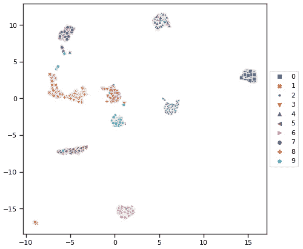

# *第五章*：执行数据分析和可视化

在上一章中，我们学习了如何将我们的数据集带到云端，在 Azure 机器学习工作区中定义数据存储以访问它们，并在 Azure 机器学习数据集注册表中注册数据集，从而为从数据预处理开始打下良好的基础。在本章中，我们将学习如何探索这些原始数据。

首先，您将了解可以帮助您探索表格和文件数据集的技术。我们还将讨论如何处理缺失值，如何交叉关联特征以了解它们之间的统计关系，以及如何将领域知识应用到这个过程中，以改善我们对上下文和数据清洗质量的了解。此外，我们将学习如何使用机器学习算法，不是为了训练，而是为了探索我们的数据集。

之后，我们将将这些方法应用于实际数据集，同时学习如何使用 pandas DataFrame 以及如何可视化数据集的特性。

最后，我们将探讨可以将高维数据映射到低维平面的方法，这将帮助我们看到数据点之间的相似性和关系。此外，这些方法还可以给我们提供清晰的线索，了解我们的数据有多干净，以及所选机器学习算法在数据集上的效果如何。

在本章中，我们将涵盖以下主题：

+   理解数据探索技术

+   在表格数据集上执行数据分析

+   理解降维技术

# 技术要求

在本章中，我们将使用以下 Python 库和版本来执行数据预处理和高维可视化：

+   `azureml-sdk 1.34.0`

+   `azureml-widgets 1.34.0`

+   `azureml-dataprep 2.20.0`

+   `pandas 1.3.2`

+   `numpy 1.19.5`

+   `scikit-learn 0.24.2`

+   `seaborn 0.11.2`

+   `plotly 5.3.1`

+   `umap_learn 0.5.1`

+   `statsmodels 0.13.0`

+   `missingno 0.5.0`

与前几章类似，您可以使用本地 Python 解释器或 Azure 机器学习中的笔记本环境执行此代码。

本章中的所有代码示例都可以在本书的 GitHub 仓库中找到：[`github.com/PacktPublishing/Mastering-Azure-Machine-Learning-Second-Edition/tree/main/chapter05`](https://github.com/PacktPublishing/Mastering-Azure-Machine-Learning-Second-Edition/tree/main/chapter05)。

# 理解数据探索技术

描述性数据探索无疑是机器学习项目中最重要的步骤之一。如果您想清理数据、构建派生特征或选择机器学习算法来预测数据集中的目标变量，那么您首先需要了解您的数据。您的数据将定义许多必要的清理和预处理步骤；它将定义您可以选择哪些算法，并最终定义您预测模型的性能。

因此，数据探索应该被视为理解数据是否足够信息以首先构建机器学习模型的重要分析步骤。通过分析步骤，我们是指探索应该作为一个结构化的分析过程来完成，而不是一系列实验任务。因此，我们将通过一系列数据探索任务清单，这些任务可以作为每个机器学习项目的初始步骤来执行——在你开始任何数据清洗、预处理、特征工程或模型选择之前。

我们可以执行的可能任务与我们正在处理的数据集类型相关。许多数据集将以表格数据的形式出现，这意味着我们为数据集的每个实例定义了连续或分类特征。这些数据集可以表示为表格，我们可以在它们上执行基本的和复杂的数学运算。我们可能遇到的另一种一般类型的数据集将以媒体文件的形式出现。这包括图像、视频、声音文件、文档以及任何其他不能放入表格结构中的数据点。

为了表示这些不同类型的数据集，Azure 机器学习提供了将我们的数据保存为以下对象之一的选项：

+   **TabularDataset:** 这个类提供了对表格数据进行基本转换的方法，并将它们转换为已知格式，例如 pandas ([`docs.microsoft.com/en-us/python/api/azureml-core/azureml.data.tabulardataset`](https://docs.microsoft.com/en-us/python/api/azureml-core/azureml.data.tabulardataset))。

+   **FileDataset:** 这个类主要提供对文件元数据的过滤方法 ([`docs.microsoft.com/en-us/python/api/azureml-core/azureml.data.filedataset`](https://docs.microsoft.com/en-us/python/api/azureml-core/azureml.data.filedataset))。

这两种类型的数据集对象都可以注册到 Azure 机器学习数据集注册表中，以便在预处理后进一步使用。

仅从那些两个类别中可用的方法来判断，很明显，我们可以在表格数据集和文件数据集之间执行的可能任务和操作有很大差异。在接下来的几节中，我们将探讨这两种类型以及我们如何准备它们以影响我们机器学习模型的结果。

## 探索和分析表格数据集

表格数据集允许我们利用数学和统计函数的全谱来分析和转换我们的数据集，但在大多数情况下，我们没有时间或资源来随机将每个数据集通过我们工具箱中所有可能的技术。

选择正确的方法不仅需要分析大量不同数据集的经验，还需要我们所在领域的专业知识。有些领域每个人都有一些一般的专长（例如，房价的影响因素），但还有很多领域需要专业知识来理解手头的数据。想象一下，你想要提高炼钢高炉的产量。在这种情况下，为了理解数据，你需要对高炉中的化学过程有深入了解，或者你需要一个**领域专家**来支持你。在探索和分析的每一步中，我们需要应用领域知识来解释我们看到的结果和关系。

除了理解领域之外，我们还需要理解数据集中的特征及其目标或标签。想象一下，有一个由某个城市房屋特征组成的数据集，但没有它们的市场价格。为了预测房价，我们需要每个房屋的价格标签或目标值。另一方面，如果我们想要预测一封电子邮件是否为垃圾邮件，而我们有一个包含大量元数据的电子邮件数据集，这可能足以通过无监督学习训练模型。

因此，为了对数据集有一个良好的理解，我们需要彻底探索其内容，尽可能多地从特征和可能的靶标中获取洞察力，以便做出明智的决策。

重要提示

请记住，不仅特征维度需要预处理和分析，目标变量也需要。

为了实现这一点，我们将首先查看数据集中每个特征和目标向量的以下方面：

+   `datetime`、`string`、`int`、`object`？我们需要进行数据类型转换吗？

+   **缺失数据**：是否存在任何缺失条目？我们如何处理它们？

+   **不一致的数据**：日期和时间是以不同的方式存储的吗？相同的类别是否以不同的方式书写？在给定上下文中，是否存在具有相同意义的不同类别？

+   **唯一值**：对于一个分类特征，存在多少唯一值？是否太多？我们应该创建它们的子集吗？

+   **统计特性**：一个特征的均值、中位数和方差是什么？是否存在任何异常值？最小值和最大值是什么？最常见的值（众数）是什么？

+   **统计分布**：值是如何分布的？是否存在数据偏斜？标准化或缩放是否有用？

+   **相关性**：不同的特征之间是如何相互关联的？是否存在包含相似信息可以被省略的特征？我的特征与目标的相关性有多大？

分析具有超过 100 个特征维度的数据集的每个维度是一项极其耗时的工作。然而，您可以通过按特征重要性排序的维度来分析，而不是随机探索特征维度，从而显著减少您处理数据的时间。像计算机科学的许多其他领域一样，在初始数据探索中使用 80/20 原则是好的，这意味着只使用 20%的特征来实现 80%的性能。这将为您提供一个良好的起点，您可以在需要时随时返回添加更多维度。

因此，了解特征对建模的重要性是明智的。我们可以通过查看特征与目标变量之间的关系来实现这一点。有许多方法可以做到这一点，以下是一些方法：

+   **回归系数**：用于回归

+   **特征重要性**：用于分类

+   **分类值的错误率较高**：用于二元分类

通过应用这些步骤，您可以了解数据，并获取有关数据、特征和目标变量的预处理任务的知识。此外，它将为您提供对预测任务中可能遇到的困难的良好估计，这对于判断所需的算法和验证策略至关重要。您还将深入了解可能应用于数据集的特征工程方法，并更好地理解如何选择一个好的误差度量。

重要提示

您可以使用数据的代表性子集，并将您的假设和见解外推到整个数据集。

一旦数据已上传到 Azure 的存储服务中，我们就可以启动笔记本环境并开始探索数据。目标是通过对数据的深入分析过程，了解数据每个维度的分布。我们将在“在表格数据集上执行数据分析”部分执行这些步骤中的一些。

但首先，我们将回顾我们讨论过的某些技术，并快速查看文件数据集。

### 处理缺失值和异常值

在新的数据集中，首先要寻找的是每个特征和目标维度的**缺失值**。这将帮助您更深入地了解数据集以及可以采取哪些措施来解决这些问题。在项目开始时删除缺失值或用零填充它们并不罕见——然而，这种方法存在风险，即最初未能正确分析缺失值，并丢失大量数据点。

重要提示

缺失值可能被伪装成有效的数值或分类值。典型的例子是最小值或最大值，-1，0，或 NaN。因此，如果你在一个整数数据列中多次发现 32,767（= 215-1）或 65,535（= 216-1）这样的值，它们可能正是伪装成最大有符号或无符号 16 位整数表示的缺失值。始终假设你的数据包含不同形状和表示的缺失值和异常值。你的任务是揭示、找到并清理它们。

关于数据或领域的任何先验知识都会在你处理数据时给你带来竞争优势。这是因为你将能够理解数据和相关领域的**缺失值**、**异常值**和**极端值**，这将帮助你更好地进行插补、清理或转换。作为下一步，你应该在你的数据中寻找这些异常值，特别是以下方面的绝对数量或百分比：

+   空值（查找`Null`，`"Null"`，`""`，`NaN`等）

+   最小值和最大值

+   最常见的值（`MODE`）

+   `0`值

+   任何唯一值

一旦你确定了这些值，你可以使用不同的预处理技术来填补缺失值和归一化或排除维度。

处理缺失值的典型选项如下：

+   **删除**：从数据集中删除整个行或列。这可能导致偏差或训练数据不足。

+   对于分类特征，查找`Missing`。

+   **列平均值**：根据与其他特征的关系，填充整个数据列或列子集的均值、中位数或众数。

+   **插值**：根据列的数据填充一个插值值。

+   **热补丁插补**：从数据列的排序记录中填充逻辑前一个值（在时间序列数据集中很有用）。

处理异常值的典型选项如下：

+   **错误观测值**：如果值是错误的，可以删除整个列，或者用列的均值替换异常值。

+   **保留原样**：如果它包含重要信息，并且模型不会因此受到扭曲。

+   **上限或下限**：将值限制在均值最大偏差内（例如，三个标准差）。

为了在选择处理缺失值和异常值的方法时获得更多上下文，统计分析列分布和相关性是有用的。我们将在以下章节中这样做。

### 计算统计属性和可视化数据分布

现在你已经知道了异常值，你可以开始探索你的数据集特征的**值分布**。这将帮助你了解在数据准备过程中应该应用哪些转换和归一化技术。在连续变量中寻找的一些常见分布统计量如下：

+   均值或中位数

+   最小值和最大值

+   方差和标准差

+   第 25、50（中位数）和第 75 百分位数

+   数据倾斜

可视化这些分布的常用技术包括使用**箱线图**、**密度图**或**直方图**。以下截图显示了针对多类识别数据集的每个目标类别的不同可视化技术。每种方法都有其优缺点——箱线图显示了所有相关指标，但阅读起来稍微有点困难，密度图显示了非常平滑的形状，但隐藏了一些异常值，而直方图则不让你容易地找到中位数和百分位数，同时给你一个数据倾斜的良好估计：


图 5.1 – 箱线图（左），密度图（中），直方图（右）

在这里，我们可以看到，对于分类数据（无论是名义的还是序数的），只有直方图工作得很好。然而，你可以查看每个类别的值数量。你可以在本书的 GitHub 仓库中的 `01_data_distribution.ipynb` 文件中找到创建这些图表的代码。

在二元分类任务中，另一种显示值分布与目标率关系的好方法是。以下图表显示了来自 *Microsoft 恶意软件检测数据集*（[`www.kaggle.com/c/microsoft-malware-prediction/data`](https://www.kaggle.com/c/microsoft-malware-prediction/data)）的 Windows Defender 的 **版本号** 与恶意软件 **检测率**（针对非触摸设备）：


图 5.2 – Windows Defender 版本号与检测率的关系

许多统计机器学习算法需要数据呈正态分布，因此需要归一化或标准化。了解数据分布有助于你决定在数据准备期间需要应用哪些转换。在实践中，数据通常需要转换、缩放或归一化。

### 寻找相关维度

数据探索中的另一个常见任务是寻找数据集中的相关性。这将帮助你排除高度相关的特征维度，从而可能影响你的机器学习模型。例如，在线性回归模型中，两个高度相关的独立变量将导致具有相反符号的大系数，最终相互抵消。通过移除一个相关维度，可以找到一个更稳定的回归模型。因此，不仅需要查看特征和目标之间的相关性，还需要查看特征之间的相关性。

`-1`（强负相关）到`1`（强正相关）。`0`表示两个变量之间没有线性关系。

以下图表显示了*加利福尼亚住房数据集*（[`www.dcc.fc.up.pt/~ltorgo/Regression/cal_housing.html`](https://www.dcc.fc.up.pt/~ltorgo/Regression/cal_housing.html)）的相关矩阵示例，该数据集仅包含连续变量。相关系数的范围从`-1`到`1`，并相应着色，其中红色表示负相关，蓝色表示正相关。最后一行显示了每个特征维度与目标变量（`MedHouseVal`）之间的线性相关性。我们可以立即看出，`Longitude`与`Latitude`之间存在相关性，`MedHouseVal`与`MedInc`之间存在相关性，以及`AveRooms`与`AveBedrms`之间存在相关性。所有这些关系都是相对不出意外的：


图 5.3 – 加利福尼亚住房数据集的相关矩阵

你可以在本书 GitHub 仓库中的`02_correlation.ipynb`文件中找到创建此相关矩阵的代码。

值得注意的是，许多相关系数只能存在于数值之间。有序变量可以通过整数编码进行编码，也可以计算出一个有意义的相关系数。对于名义数据，你需要回退到不同的方法，例如**Cramér's V**来计算相关性。值得注意的是，在计算相关系数之前，输入数据不需要进行归一化（线性缩放）。

### 测量回归中的特征和目标变量依赖性

一旦我们分析了缺失值、数据分布和相关性，我们就可以开始分析特征与目标变量之间的关系。这将为我们提供预测问题难度的良好指示，从而确定预期的基线性能，这对于优先考虑特征工程努力和选择合适的机器学习模型至关重要。测量这种依赖性的另一个巨大好处是按特征维度对目标变量的影响进行排名，你可以将其用作数据探索和预处理优先级列表。

在回归任务中，目标变量是数值或有序的。因此，我们可以计算单个特征与目标变量之间的相关系数，以计算特征与目标变量之间的线性依赖性。高相关性，即高绝对相关系数，表明存在强烈的线性关系。这为我们进一步探索提供了一个很好的起点。然而，在许多实际问题中，很少看到特征与目标变量之间存在高（线性）相关性。

您还可以使用**散点图**或**回归图**来可视化特征和目标变量之间的依赖关系。以下图表显示了来自*波士顿住房数据集*的平均每户住宅房间数（**RM**）与业主自住房屋的中位数价值（**MEDV**）之间的回归图。如果回归线在 45 度角，则表示存在完美的线性相关性：


图 5.4 – 特征与目标之间的散点图，带有回归线

确定这种依赖关系的另一种有效方法是，将线性或逻辑回归模型拟合到训练数据中。得到的模型系数应该能为你提供对关系的良好解释——系数越高，对目标变量的线性（对于线性回归）或边际（对于逻辑回归）依赖性就越大。因此，按系数排序将得到一个按重要性排序的特征列表。根据回归类型，输入数据应进行归一化或标准化。

以下截图显示了拟合的**普通最小二乘法**（**OLS**）回归模型的关联系数（第一列）：


图 5.5 – OLS 回归模型的关联系数

您可以在本书 GitHub 仓库中的`03_regression.ipynb`文件中找到创建图表和系数的代码。

虽然得到的**R 平方指标**（未显示）可能不足以作为基线模型，但系数的排序可以帮助我们优先考虑进一步的数据探索、预处理和特征工程。

### 可视化特征和标签之间的分类依赖关系

在具有多类名义目标变量的分类任务中，我们不能在不进一步预处理数据的情况下使用回归系数。另一种流行的、开箱即用的有效方法是，将简单的基于树的分类器拟合到训练数据中。根据训练数据的大小，我们可以使用决策树或基于树的集成分类器，如**随机森林**或**梯度提升树**。这样做将根据选择的分割标准对特征维度进行特征重要性排序。在以熵分割的情况下，特征将按*信息增益*排序，这将表明哪些变量携带关于目标变量最多的信息。

以下图表显示了使用来自*UCI 葡萄酒识别数据集*（[`archive.ics.uci.edu/ml/datasets/wine`](https://archive.ics.uci.edu/ml/datasets/wine)）的熵标准由基于树的集成分类器拟合的特征重要性：


图 5.6 – 基于树的集成分类器的特征重要性

这些线条代表单个树之间特征信息增益的变化。这个输出是进一步数据分析和按特征重要性顺序探索的绝佳第一步。您可以在本书 GitHub 仓库中的`04_feature_importance.ipynb`文件中找到计算特征重要性并可视化的代码。

这里是另一种发现数据集可分性的流行方法。以下截图显示了一个包含三个类别的数据集，其中一个是线性可分的，另一个不是：


图 5.7 – 线性可分数据集（左）与非线性可分数据集（右）的比较

您可以在本书 GitHub 仓库中的`05_separability.ipynb`文件中找到创建这些可分性图的代码。

通过观察三个簇以及这些簇之间的重叠，您可以发现，如果簇是分离的，那么训练好的分类模型将在这个数据集上表现非常好。另一方面，当我们知道数据不是线性可分的时候，我们知道这项任务将需要高级的特征工程和建模来产生良好的结果。

## 探索和分析文件数据集

由媒体文件组成的数据集完全是另一回事。如果我们以图像为例，我们可以将每个像素视为信息向量，并将其视为图像的一个特征。但在探索和数据处理方面我们能做什么呢？可能对单个特征来说并不多。大多数时候，我们需要关注的是大量像素或整个图像本身。从广义上讲，我们可以考虑以下方面：

+   **一致性**：数据集中的所有图像都应该具有相同的大小。如果不是，它们需要被重新缩放，这可能涉及到每个通道的像素值居中，可能还伴随着某种形式的归一化。

+   **增强**：这涉及到在不获取新数据（新图像）的情况下使数据集多样化。如果我们有一个小的数据集，这通常涉及到水平翻转、裁剪和旋转等变换。

观察这些选项，很明显我们正在尝试修复图像数据集中可能在我们最初拍摄图像时已经基本解决的问题。因此，现实情况是，当我们处理大多数类型的媒体文件时，将更高的注意力集中在为数据集采集好的训练样本上，比在预处理阶段拼命修复它们至关重要。

让我们想象一下，我们是一家制造商，想要拍摄他们生产的在传送带上通过的产品照片，以找出有缺陷的产品并丢弃它们。假设我们在全球各地都有生产基地。你将如何确保照片尽可能均匀地拍摄，同时覆盖许多不同的场景？以下是一些需要考虑的方面：

+   **相机类型**：我们可能需要全球各地都使用相同类型的相机以相同的格式拍照。

+   **环境条件**：所有地方的光照是否相似？温度和湿度是否在所有地方都相似？这可能会影响相机的电子设备。

+   **定位**：是否使用了相同的拍摄角度？我们能否从非常不同的角度拍照以增加多样性？

这些只是你在拍照时需要考虑的一些点。

现在，让我们看看文件数据的一种另一种形式——声音文件。假设我们想要构建一个语音转文本模型，将我们说的话转换成书面文本。这类模型例如在语音助手中被用来将请求映射到一系列要执行的操作。

在这个背景下，我们可以使用**傅里叶变换**等方法来分解我们的声音文件。然而，我们可能需要考虑我们想要训练的样本或训练数据，以及如何在考虑以下方面的同时提高它们的质量：

+   **录音硬件**：如果我们家里有语音助手，可能每个人都在使用同一个麦克风。但如果我们为手机构建语音助手呢？那么，我们就有了非常不同的麦克风。

+   **环境**：我们可能需要在不同环境中录制声音。当我们站在有轨电车上时，与我们在录音棚中时，声音频谱肯定不同。

+   **发音**：你大脑中的*机器学习算法*可能难以解析不同的发音——尤其是方言。一个实际的机器学习模型如何处理这个问题？

这些只是处理声音文件时需要考虑的一些点。关于发音，如果你查看**Azure 语音服务**，你很快就会意识到后台运行着两个模型——一个用于声学，一个用于语言。在构建自定义模型时查看样本的要求（[`docs.microsoft.com/en-us/azure/cognitive-services/speech-service/how-to-custom-speech-test-and-train`](https://docs.microsoft.com/en-us/azure/cognitive-services/speech-service/how-to-custom-speech-test-and-train)），因为这可以给你一个很好的想法，当你从头开始构建这样的模型时需要什么。

总结来说，对于文件数据集，我们没有太多选项来从统计上消除问题，因此我们应该专注于采集好的、干净的样本，这些样本模拟了模型在生产环境中运行时可能遇到的现实环境。

现在我们已经熟悉了探索和分析不同类型数据集的方法，让我们尝试在一个实际的表格数据集上应用这些方法。

# 在表格数据集上执行数据分析

如果您没有遵循*第四章*“数据摄取与管理数据集”中的步骤，从`melb_data.csv`下载墨尔本住房数据集的快照，在您的存储账户的`mlfiles`容器中，并将其连接到 Azure Machine Learning 工作区中的数据存储`mldemoblob`。

在接下来的章节中，我们将探索数据集，进行一些基本的统计分析，查找缺失值和异常值，找出特征之间的相关性，并在使用随机森林模型的同时，对特征的重要性进行初步测量，正如我们在本章的“可视化特征和标签依赖性以进行分类”部分所看到的。您可以选择创建一个新的 Jupyter 笔记本并跟随本书进行，或者打开 GitHub 仓库中本章的`06_ dataprep_melbhousing.ipynb`文件。

注意，我们现在要执行的步骤并不全面。如数据集网页所示，我们有 21 个特征可以工作。因此，为了彻底分析，你必须分析每一个。

本节应该能让你对可以执行的任务类型有一个很好的理解，但我们将会留下很多问题供你寻找答案。如果你需要一些灵感，可以查看 Kaggle 网站上的这个数据集。你将找到许多用户尝试分析这个数据集的笔记本。

最后，我们在此处不会完全转换实际数据，因为我们将在*第六章*“特征工程与标注”中回到这个问题，在那里我们将学习如何根据通过即将到来的过程获得的分析和知识来选择特征和创建新的特征。

## 初始探索和清洗墨尔本住房数据集

在本节中，我们将从在 Azure Machine Learning 中注册的数据存储中加载数据，并查看其内容。之后，我们将开始进行一些关于原始数据的基本清洗：

1.  通过 Python PIP 单独下载以下包或使用本书 GitHub 仓库中可找到的需求文件：`pandas`、`seaborn`、`plotly`、`scikit-learn`、`numpy`、`missingno`、`umap-learn`和`statsmodels`。

1.  创建一个新的 Jupyter 笔记本或跟随之前提到的笔记本进行。

1.  通过配置文件连接到您的 ML 工作区，正如我们之前所学的。

1.  使用以下代码将数据集拉取到您的本地计算机：

    ```py
    from azureml.core import Datastore, Dataset
    import pandas as pd
    import seaborn as sns
    import numpy as np
    import plotly.express as px
    import matplotlib.pyplot as plt
    # retrieve an existing datastore in the workspace by name
    datastore_name = 'mldemoblob'
    datastore = Datastore.get(ws, datastore_name)
    # create a TabularDataset from the file path in datastore
    datastore_path = [(datastore, 'melb_data.csv')]
    tabdf = Dataset.Tabular.from_delimited_files
           (path=datastore_path)
    ```

在这里，我们正在从您定义的 ML 数据存储`yourname`中检索数据，并将数据集加载到一个表格数据集对象中。根据您数据存储中的文件夹结构，调整第二行最后面的文件路径和名称。

1.  在表格数据集对象上可用的方法不如在 pandas DataFrame 上那么多。所以，让我们将其转换为 pandas DataFrame，并首次查看数据：

    ```py
    # increase display of all columns of rows for pandas datasets
    pd.set_option('display.max_columns', None)
    pd.set_option('display.max_rows', None)
    # create pandas dataframe
    raw_df = tabdf.to_pandas_dataframe()
    raw_df.head()
    ```

`pd.set_option()`方法让你可以访问 pandas 操作的通用设置。在这种情况下，我们希望所有列和行都在可视化中显示，而不是被截断。你可以将其设置为对你有用的任何值。

`head()`函数将让你先看看数据集的前五行。看看它们。

你将看到很多有意义的特征，比如`Suburb`、`Address`和`Bathroom`。但有些其他特征可能不太清楚，比如`Type`、`Method`或`Distance`。

通常，与任何数据集一样，对于随附的字段，都有某种形式的数据定义。查看数据集的网站以找到它们。

1.  现在我们已经查看了定义，让我们看看数据集的所谓“形状”，这将显示数据集包含多少列（特征和标签）以及多少行（样本）：

    ```py
    raw_df.shape
    ```

前面的命令显示了一个包含 13,580 个样本和 21 个特征/标签的数据集。

1.  最后，运行以下代码，以便我们可以查看每个特征的唯一值数量、缺失值数量和数据类型：

    ```py
    stats = []
    for cl in raw_df.columns:
        stats.append((cl,
                      raw_df[cl].nunique(), 
                      raw_df[cl].isnull().sum(),
                      raw_df[cl].isnull().sum() * 100 / 
                                       raw_df.shape[0],
                      raw_df[cl].value_counts(
                           normalize=True, 
                            dropna=False).values[0] * 100,
                      raw_df[cl].dtype))
    # create new dataframe from stats   
    stats_df = pd.DataFrame(stats, columns=[
                  'Feature', 
                  'Unique Values',
                  'Missing Values',
                  'Missing Values [%]', 
                  'Values in the biggest category [%]', 
                  'Datatype'])
    stats_df.sort_values('Missing Values [%]',
                         ascending=False)
    ```

运行前面的代码后，你应该会看到以下类似的内容：


图 5.8 – 墨尔本住房数据集特征概述

看这张表格，我们可以得出以下观察结果：

+   有四个特征似乎有缺失值（**BuildingArea**、**YearBuilt**、**CouncilArea**和**Car**）。

+   许多数值（如`float64`类型。这并不一定是问题，但既然每个值可能都适合`int8`、`int16`或`int32`，所以这是一种空间上的浪费。

+   有七个`object`类型的特征，它们很可能都是字符串值。我们很快会详细查看它们。

+   有一个名为**Price**的特征，这可能是监督学习（如分类）的一个很好的标签/目标。

+   有一个名为**Postcode**的特征和一个名为**Suburb**的特征。我们可能不需要两者都保留。从唯一值的数量来看，**Suburb**似乎更细粒度。

+   有一个名为**Address**的特征和一个名为**SellerG**的特征。尽管物业的卖家可能对价格有一定的影响，但我们现在可以为了简单起见先删除它们。同样，地址也是极其精确的。几乎每个样本都有一个唯一的地址。

通过查看`object`类型的七个特征，我们可以看到以下情况：

+   **类型**：这有**3**个不同的值；我们的数据定义显示**6**。我们需要检查这个差异。

+   **方法**：这有**5**个不同的值；我们的数据定义显示**11**。我们也需要检查这一点。

+   **SellerG**：这有**268**个不同的卖家名称。

+   **Address**：这有 **13378** 个不同的值，但我们有 **13580** 个样本，所以似乎有多个地址相同的地方。尽管如此，我们在这里有极端的多样性，这使得这个特征相当不重要。

+   **Regionname**：这有 **8** 个不同的值——即墨尔本的区域。

+   **Suburb**：这有 **314** 个不同的值——即墨尔本的郊区。

+   **CouncilArea**：这有 **33** 个不同的值，并且是唯一具有缺失值的类别特征。

到目前为止，我们已经找到了一些有趣的信息和一些线索，表明我们下一步需要查看的地方。现在，让我们深入到特征的内容并进行一些初步的数据集清理。

1.  让我们从删除一些不太重要的特征开始：

    ```py
    df = raw_df.drop(['Address', 'SellerG'],axis=1)
    ```

如您所见，我们保留了原始的 DataFrame，称为 `raw_df`，并创建了一个新的 DataFrame，称为 `df`。通过这样做，我们可以在任何时间添加已删除的特征。DataFrame 中的每一行都有一个索引，因此即使我们过滤掉行，我们仍然可以匹配原始值。

1.  接下来，我们将重命名一些列以增加我们对它们的理解：

    ```py
    df = df.rename(columns={'Bedroom2': 'Bedrooms', 
                            'Bathroom': 'Bathrooms',
                            'Regionname': 'Region',
                            'Car': 'Parking',
                            'Propertycount':  
                            'SuburbPropCount'})
    df.head()
    ```

1.  在这一点上，寻找重复项可能是个好主意。让我们运行以下代码片段来查找重复项：

    ```py
    s = df.duplicated(keep = False)
    s = s[s == True]
    s
    ```

将 `keep` 设置为 `False` 将显示每个具有重复项的行。在这里，我们可以看到有两行是相同的。我们可以通过以下命令查看它们：

```py
df.loc[[7769,7770]]
```

如您所见，这些表示相同的条目。所以，让我们使用以下命令删除其中一个：

```py
df.drop([7769], inplace=True)
```

由于这只是一个示例，我们可以通过其行索引来删除它。通常，这类操作会返回一个新的 DataFrame，但在许多操作中，我们可以使用一个名为 `inplace` 的属性来直接覆盖当前的 DataFrame。

1.  现在，让我们看看似乎有缺失类别的分类特征，从 `Method` 开始：

    ```py
    df['Method'].unique()
    ```

我们数据集中的类别是 `S`、`SP`、`PI`、`VB` 和 `SA`。从数据定义中的列表来看，我们可以看到数据集中只指定了房产的销售地点以及我们知道的销售价格。有人已经为我们清理了这些信息。

通过查看 `Type`，我们可以看到单卧室、开发用地和其他住宅区域也被删除了，留下了房屋、单元和联排别墅：

```py
df['Type'].unique()
```

为了使这些条目更清晰，让我们将单个字母替换为全名：

```py
df = df.replace({'Type':  
               {'h':'house','u':'unit','t':'townhouse'}})
df = df.replace({'Method': {'S':'Property Sold',
                            'SP':'Property Sold Prior',
                            'PI':'Property Passed In',
                            'VB':'Vendor Bid', 
                            'SA':'Sold After Auction'}})
df.head()
```

1.  现在，让我们专注于包含大量条目的分类特征。以下代码显示了该列中唯一值的列表：

    ```py
    df['CouncilArea'].unique()
    ```

我们将得到以下结果集：

```py
array(['Yarra', 'Moonee Valley', 'Port Phillip', 'Darebin', 'Hobsons Bay', 'Stonnington', 'Boroondara', 'Monash', 'Glen Eira', 'Whitehorse', 'Maribyrnong', 'Bayside', 'Moreland', 'Manningham', 'Banyule', 'Melbourne', 'Kingston', 'Brimbank', 'Hume', None, 'Knox', 'Maroondah', 'Casey', 'Melton', 'Greater Dandenong', 'Nillumbik', 'Whittlesea', 'Frankston', 'Macedon Ranges', 'Yarra Ranges', 'Wyndham', 'Cardinia', 'Unavailable', 'Moorabool'], dtype=object)
```

在这里，我们可以看到有一个名为 `None` 的类别，其中包含我们的缺失值，还有一个名为 `Unavailable` 的类别。否则，似乎每个其他条目都定义得很好，似乎没有具有相同意义的重复条目；它们只是由于打字错误或空格而有所不同。这类错误通常被称为 **结构错误**。

通过对 `Suburb` 特征运行相同的命令，我们得到一个更大的结果集。在这个阶段，要看到结构错误变得非常复杂，因此我们需要采取程序化的方法来检查这个类别。这里可以使用诸如模式匹配或模糊匹配之类的技术，但我们现在先不考虑这一点。您可以自由地查找有关**模糊匹配**和**Levenshtein 距离**的主题，这些可以在结果集中找到相似词组的组。

1.  最后，我们剩下最后一个问题，即关于邮编和郊区之间的关系，以及我们是否可以去掉其中一个。那么，让我们看看有多少邮编针对多个郊区：

    ```py
    postcodes_df = df.groupby(
        'Postcode', as_index=False).Suburb.nunique()
    postcodes_df.columns = ['Postcode', 
                            '#Assigned Suburbs']
    postcodes_df.loc[postcodes_df['#Assigned Suburbs'] > 1]
    ```

在这里，我们创建了一个新的 DataFrame，显示了邮编和分配的郊区数量。通过搜索那些被映射到多个郊区的邮编，我们可以找到相应的列表。让我们来计数：

```py
postcodes_df.loc[postcodes_df['#Assigned Suburbs'] > 1].count()
```

在这里，我们可以看到 198 个邮编中有 73 个指向多个郊区。尽管如此，每个郊区都有一个邮编，所以让我们保留郊区，并将邮编从 DataFrame 中删除：

```py
df = df.drop(['Postcode'],axis=1)
df.head()
```

这已经看起来相当好了。作为最后一步，我们可以将数据类型从 `float64` 改为整数类型之一（`int8`、`int16`、`int32` 或 `int64`），但我们还不足以了解数据点的分布情况，并且我们无法对有缺失值的列进行此操作。我们稍后再来处理这个问题。

到目前为止，我们已经对数据集进行了一些基本的探索和基础剪枝。现在，让我们更多地了解统计特性。

## 对数据集进行统计分析

是时候查看我们数值特征的统计特性了。为了做到这一点，运行以下代码片段：

```py
dist_df = df.describe().T.apply(lambda s: s.apply(lambda x: format(x, 'g')))
dist_df
```

在这里，`describe()` 方法将为您提供数据集数值特征的典型统计特性表。`T` 将表进行转置，而 `apply()` 和 `lambda()` 方法将帮助将数据点格式化为常规数值表示。您可以自由地移除 `apply` 方法并查看差异。

结果将显示一些信息，但我们还想添加一些额外的统计值，包括**偏度**、**众数**以及等于众数、最大值和最小值的特征中的值的数量。通过以下代码，我们可以实现这一点：

```py
from pandas.api.types import is_numeric_dtype
max_count=[]
min_count=[]
mode_count=[]
mode=[]
skew=[]
for cl in df.columns:
    if (is_numeric_dtype(df[cl])):
        max_count.append(df[cl].value_counts(
                         dropna=False).loc[df[cl].max()])
        min_count.append(df[cl].value_counts(
                         dropna=False).loc[df[cl].min()])
        mode_count.append(df[cl].value_counts(
                     dropna=False).loc[df[cl].mode()[0]])
        skew.append(df[cl].skew())
        mode.append(int(df[cl].mode()[0]))
dist_df['mode'] = mode
dist_df['skew'] = skew
dist_df['#values(min)'] = min_count
dist_df['#values(max)'] = max_count
dist_df['#values(mode)'] = mode_count
dist_df
```

在这里，我们创建了一系列列表，并将我们基础 DataFrame 中每个列的计算值追加到每个列表中。我们还为每个我们计算过的属性列表添加了一个新列到我们的分布 DataFrame，`dist_df`。为了便于您理解代码，我们在这里使用了 Python 列对象。您可以通过使用另一个 pandas DataFrame 来缩短这段代码，这留作您的练习。

运行前面的代码后，你应该看到以下类似的输出：


图 5.9 – 墨尔本住房数据集的统计特性

让我们通过查看这个表格来了解每个特征的推断：

+   **价格**: 这个值向右偏斜。在这里，我们可能会看到一些高价，这并不奇怪。最高的房价是 900 万。

+   **距离**: 这个值向右偏斜，可能是由于一个样本距离墨尔本 CBD 有 48.1 公里。有趣的是，有**6**个样本的距离为**0**。有时，0 是一个虚拟值，所以我们应该检查这些样本。根据**11**这个众数被设置了**739**次的事实，距离可能不是城市中心的精确距离，而是郊区到城市中心的平均距离。我们也应该弄清楚这一点。

+   **卧室**: 由于某些地方的卧室很多，这个值向右偏斜。奇怪的是，有**16**个样本的卧室数为**0**，需要核实。

+   **浴室**: 这与**卧室**特征的分布相似，有**34**个样本没有浴室，这又很奇怪。

+   **停车位**: 这与**卧室**特征的分布相似。有**1026**个样本没有停车位，这听起来是合理的。

+   **土地面积**: 这个值极度向右偏斜（**95.24**）。最大值是**433014**。如果我们假设这里使用的是平方米，那么大约有 43 公顷的土地。这并不是不可能的，但显然这是一个异常值，可能会扭曲我们的模型。

+   **建筑面积**: 由于最大值为**44515**平方米，这个值极度向右偏斜。这听起来相当不可能，所以我们可能想要去掉这个值。此外，还有**17**个样本的面积为**0**平方米，需要检查。

+   **建造年份**: 由于有一个建筑是在**1196**年建造的，这个值向左偏斜。我们可能想要丢弃这个值。

+   **经度/纬度**: 这些值似乎分布得相当合理，但奇怪的是，**17**和**21**的值分别相同，具体是**-37**和**144**。这让我们有了一些想法，即坐标可能没有我们想象的那么精确。

+   **郊区房产数量**: 这个值略微向右偏斜。我们必须分析这个值有多有帮助。

现在，让我们考虑我们期望的关系，并查看这些特征之间的关系：

+   **房间与浴室/卧室**: 如果你看一下这些值的分布，就会变得清楚，我们并不完全清楚**房间**的含义。**房间**的最大值是**10**，而**卧室**的最大值是**20**。查看数据定义，我们可以看到**卧室**是从多个不同来源获取的，所以我们可能在那些数据点之间有差异。

+   **建筑面积与房间/浴室/卧室**: 我们预计会有某种正相关性，但仅凭现有数据我们无法判断。

如我们所见，仅从这张表格中我们就可以获得一些非常有价值的见解，并对下一步要查看的内容有一个很好的了解。我们现在将检查**价格**和**BuildingArea**特征，但在现实中，我们可能需要遵循所有这些途径。请随意自己尝试，并查看提供的笔记本以获取更多想法。

首先，让我们看看`seaborn`或`plotly`库。了解它们是如何工作的以及它们之间的区别。为了简单起见，我们现在将使用`plotly`。使用以下代码来绘制一个箱线图，并在旁边显示数据点的分布：

```py
fig = px.box(df, x="Price",points="all")
fig.show()
```

你应该看到以下图表：


图 5.10 – 价格目标的箱线图

悬停在箱线图上，你可以看到**价格**向量的`log`值，然后再看一眼。

要做到这一点，让我们在我们的 DataFrame 中添加一个新的列，包含**价格**的`log`值，并再次运行可视化：

```py
df["Price_log"] = np.log(df['Price']) 
fig = px.box(df, x="Price_log",points="all")
fig.show()
```

这将得到以下图表：


图 5.11 – log (价格) 目标的箱线图

这样做似乎是个好主意，因为它的分布更好。请随意检查这个分布的偏斜。

现在，让我们看看**BuildingArea**特征。再次，让我们使用以下代码创建一个箱线图：

```py
fig = px.box(df, y="BuildingArea",points="all")
fig.show()
```

这将得到以下图表：


图 5.12 – BuildingArea 特征的箱线图

我们看到一个非常扭曲的箱线图。悬停在它上面，我们可以看到**上界**在**295**平方米，而**最大值**在**44515**平方米。有一个主要异常值和一些小异常值。

让我们使用以下代码查看有多少样本高于**295**：

```py
df.loc[raw_df['BuildingArea'] > 295]['BuildingArea'].count()
```

结果仍然显示有**353**个样本高于此阈值。从箱线图来看，这可能很快就会减少到 2,000 平方米。因此，让我们使用以下代码检查超过 2,000 平方米的结果集：

```py
df.loc[raw_df['BuildingArea'] > 2000]
```

这将给出以下输出：


图 5.13 – 按 BuildingArea 大小排名前四的样本

如我们所见，最大的房产距离市中心 48.1 公里，因此在这个范围内的**Landsize**和**BuildingArea**是可行的。然而，如果我们想了解墨尔本的房子价格，这可能并不那么重要。它位于北维多利亚地区，而不是大都市地区。我们可以进一步探讨这些特定房屋与正常情况外的其他特征之间的联系，但我们将就此搁置。

让我们使用以下代码从我们的数据集中删除主要异常值：

```py
df.drop([13245], inplace=True)
```

由于它只包含一个样本，我们可以通过行 ID 将其删除。

在这一点上，我们可以继续用其他特征进行此类分析，但我们将把它留给你作为一个练习，以便更深入地了解其他特征及其统计依赖性。现在，让我们继续看看之后我们会做什么。

在我们继续之前，让我们使用以下函数将我们的数据集保存到 Azure 机器学习：

```py
Dataset.Tabular.register_pandas_dataframe(
        dataframe = df, 
        target = datastore, 
        name ='Melbourne Housing Dataset', 
        description = 'Data Cleansing 1 - removed address,    
                       postcode, duplicates and outliers')
```

在这个练习中，我们将继续这样做，以便以后可以拥有不同的版本。

## 寻找和处理缺失值

我们接下来的任务是处理数据集中的缺失值。我们可以使用一个非常好的扩展`missingno`来获取一些关于缺失值的有趣可视化。

但在那之前，让我们运行以下代码，看看如果我们删除所有具有缺失值的样本会发生什么：

```py
df.dropna(how='any').shape
```

如我们所见，结果 DataFrame 将包含**6196**个样本，这将少于数据集的一半。所以，处理缺失值可能是一个好主意。

现在，运行以下代码：

```py
import missingno as msno
msno.matrix(df);
```

这将产生以下输出：


图 5.14 – DataFrame 及其缺失值的结构可视化

如我们所见，**CouncilArea**特征在 DataFrame 的后部样本中只有缺失值，**Parking**在后部样本中只有非常小的一部分缺失，而**BuildingArea**和**YearBuilt**在整个 DataFrame 中都有缺失。

正如我们已经学到的，我们可以通过为缺失的类别数据发明一个新的类别或用缺失的连续数据的**平均值**来替换它们来进行替换。

让我们从`Unavailable`开始，看看具有此类别的样本，通过选择具有该特性的任何样本：

```py
df.loc[df.CouncilArea.isin(['Unavailable'])]
```

如我们所见，只有一个条目属于这个类别。这似乎是一个有效的条目；它只是缺少议会区域的名字。所以，让我们使用以下代码用一个新的类别`Missing`替换这个条目和缺失值：

```py
df['CouncilArea'].fillna(value = "Missing", inplace = True)
df['CouncilArea'].replace(to_replace="Unavailable", value="Missing", inplace=True)
```

在特征之后检查唯一值显示，`None`或`Unavailable`类别中不再有任何值：

```py
df['CouncilArea'].unique()
```

这是替换特征的最简单方法。由于这些是墨尔本的议会区域，每所房子都应该分配到一个区域，所以更好的想法是找到另一个匹配郊区或地址到议会区域的数据库，并进行交叉引用。您可以自由搜索并执行此操作。

继续使用三个连续特征，我们可以使用以下代码将任何缺失值替换为该列的平均值，并在之后检查是否还有剩余的缺失值：

```py
BA_mean = df['BuildingArea'].mean()
df['BuildingArea'].replace(to_replace=np.nan, value=BA_mean, inplace=True)
df['BuildingArea'].isnull().sum()
```

最终命令的结果显示我们填充的平均值是**145.749**。将此代码修改为对**YearBuilt**和**Parking**执行相同的操作。然而，您可能希望对这些使用**中位数**而不是**平均值**。

目前，这解决了缺失值的问题，从统计学的角度来看，这是一种合理的方法。然而，正如我们讨论的那样，这是做这件事的最简单方法之一。更好的方法是在特征之间找到关系，并使用它们来填充缺失值。我们不仅可以使用整个数据集的平均值，还可以集中寻找与缺失值样本具有相似特征的数据子集。例如，我们可以找到一侧停车位数量与房屋内房间数量或房屋大小另一侧之间的依赖关系。然后，我们可以定义一个函数，根据这些其他特征给出 **Parking** 的值。

因此，为了更好地处理缺失值，我们需要找出关系，我们将在下一节中查看这些关系。

但在那之前，让我们再次用这个描述注册这个数据集：`数据清洗 2 - 替换缺失值`。

## 计算相关性和特征重要性

到目前为止，我们已经研究了单个特征、它们的内容以及它们的分布。现在，让我们看看它们之间的关系。

使用以下代码生成我们特征和目标之间的相关矩阵：

```py
# compute the correlation matrix
corr = df.corr()
# define and create seaborn plot
mask = np.triu(np.ones_like(corr, dtype=np.bool))
f, ax = plt.subplots(figsize=(11, 9))
cmap = sns.diverging_palette(220, 10, as_cmap=True)
sns.heatmap(corr, mask=mask, cmap=cmap, vmax=.3,
            center=0, square=True, linewidths=.5, 
            cbar_kws={"shrink": .5})
plt.show()
```

生成的矩阵将显示我们 13 个特征的相关性，但不是全部。如果你检查可见的，你会看到我们缺少所有 `object` 或 `datetime` 类型的数据。

因此，在我们分析矩阵之前，让我们通过从我们的 DataFrame 中开始挖掘剩余的 `object` 类型列来添加缺失的特征：

```py
obj_df = df.select_dtypes(include=['object']).copy()
obj_df.head()
```

在这里，我们可以看到剩余的列是 `category`，我们现在将我们的列转换为：

```py
for cl in obj_df.columns:
    obj_df[cl] = obj_df[cl].astype('category')
obj_df.dtypes
```

因此，我们创建了一个名为 `obj_df` 的 DataFrame，其中包含五个 `category` 类型的特征。现在，让我们为每个类别分配一个数值。为此，我们将使用 `cat.codes` 方法，并在我们的 DataFrame 中创建五个新列，列名扩展为 `_cat`：

```py
for cl in obj_df.columns:
     obj_df[cl+"_cat"] = obj_df[cl].cat.codes
obj_df.head()
```

完美！我们已经创建了一个包含编码类别的 DataFrame。我们将将这些新特征与我们的原始 DataFrame，`df`，合并到一个新的 DataFrame 中，称为 `cont_df`：

```py
column_replacement = {'Type':'Type_cat','Suburb':'Suburb_cat','Method':'Method_cat','CouncilArea':'CouncilArea_cat','Region':'Region_cat'}
cont_df = df.copy()
for key in column_replacement:
     cont_df[key] = obj_df[column_replacement[key]]
cont_df.dtypes
```

上述代码的输出显示了新数据集中所有列的数据类型。我们仍然可以看到 `datetime` 类型和一些应该为 `int` 类型的原始列。在再次创建相关矩阵之前，让我们纠正这个问题。

首先，让我们创建一个名为 `Date_Epoch` 的新列，该列包含一个表示自纪元（[`docs.python.org/3/library/time.html`](https://docs.python.org/3/library/time.html)）以来的秒数的整数，并删除原始的 **Date** 列：

```py
cont_df['Date_Epoch'] = cont_df['Date'].apply(lambda x: x.timestamp())
cont_df.drop(['Date'], axis=1, inplace=True)
cont_df.dtypes
```

我们还可以将 **Date** 分解为 **Month** 列和 **Year** 列，因为它们可能产生影响。请随意添加它们。

现在，让我们将所有 `float64` 列转换为整数，除了那些浮点数是正确的情况：

```py
for cl in cont_df.columns:
    if (cont_df[cl].dtype == np.float64 and cl not in    
                                   ['Lattitude', 'Longtitude', 
                                    'Price_log', 'Distance']):
       cont_df[cl] = cont_df[cl].astype('int')
cont_df.dtypes
```

上述代码显示，我们的 DataFrame 现在由最优化大小和格式的数值数据类型组成（一些特征每个值只占用 8 位内存）。

现在，是时候再次运行相关性矩阵了。使用我们之前使用的相同代码 – 只需将 `df` 替换为我们的新 `cont_df`。结果应该如下所示：


图 5.15 – 所有特征及其目标的相关矩阵

强烈的红色表示**正相关**，而强烈的蓝色表示**负相关**。基于此，我们可以得出以下结论：

+   **房间数量** 与 **价格**、**价格对数**、**距离**、**卧室数量**、**浴室数量**、**停车位** 和 **建筑面积** 强烈相关。

+   **类型** 与 **价格**、**价格对数**、**卧室数量**、**建造年份** 和 **房间数量** 强烈相关。

+   **价格** 与 **房间数量**、**类型**、**卧室数量**、**浴室数量**、**停车位** 和 **建筑面积** 强烈相关。

+   **郊区**、**方法**、**土地面积**和**郊区房产数量**似乎在当前状态下对其他特征或目标没有太大的影响。

观察这些结果，它们并不令人惊讶。**郊区**有太多的类别，无法精确地用于任何事物，**方法**也不应该有太大的影响，**土地面积**可能也不是最大的因素，而**郊区房产数量**可能也有太多的变化。可能的转换包括要么删除**郊区**和**郊区房产数量**，要么将它们映射到一个变化较少的类别。

在我们继续之前，让我们将 `cont_df` 注册为具有描述：“数据清洗 3 - 所有特征转换为数值类型”的数据集版本。

作为最后的任务，让我们使用 `06_dataprep_melbhousing.ipynb` 文件来双重检查我们到目前为止所了解的内容。在那里，你会看到我们计算了 **价格** 和 **价格对数** 目标特征的重要性。两者的结果都显示在这里：


图 5.16 – 价格（左侧）和价格对数（右侧）的特征重要性

如我们所见，房产类型明显影响其价格。这种影响可能看起来并不那么巨大，但请注意，我们正在查看对数形式的房价。

我们到目前为止所了解的内容与这些结果相符。通过观察图表之间的差异，我们可以看到，将**对数缩放**添加到我们的目标变量中，增强了最有影响力的特征。**类型**特征似乎对我们的目标有很强的影响。

让我们通过以下代码来结束这个练习，看看这种关系：

```py
fig = px.box(df, y="Price_log",x='Type', color = 'Type', 
                 category_orders={"Type": ["house",
                                  "townhouse", "unit"]})
fig.show()
```

这些结果如下：


图 5.17 – 类型与价格对数之间的相关性

这样，我们就完成了这个练习。我们能够清理我们的数据集，发现一些非常好的初步见解，并发现我们的目标变量与一个特征之间有非常强的相关性。

还有很多开放性问题，我们仍然处于完全理解这个数据集的初期。例如，除了**价格**目标之外，我们没有查看特征缩放或归一化，这是某些算法的另一个可能要求。

我们将在*第六章*，*特征工程和标记*中继续使用这个数据集。在此之前，请随意深入挖掘这个数据集的秘密，或者尝试将您新获得的知识应用于不同的数据集。

## 在 Azure 机器学习中跟踪探索中的图表

在我们的数据探索过程中，我们创建了大量的不同图表和可视化。让我们学习如何使用 Azure 机器学习跟踪它们，以便它们不仅仅存在于我们的 Jupyter 笔记本中。

在*第三章*，*准备 Azure 机器学习工作区*中，我们学习了如何使用 Azure 机器学习跟踪 ML 实验的指标和文件。您数据转换和 ML 脚本的其他重要输出包括可视化、数据分布的图表、关于模型的见解以及结果。因此，Azure 机器学习提供了一种类似的方式来跟踪图像、图表和`matplotlib`引用的指标。

让我们想象一下，我们使用以下代码创建了一个流行的*Iris 花卉数据集*（[`archive.ics.uci.edu/ml/datasets/iris`](https://archive.ics.uci.edu/ml/datasets/iris)）的`pairplot`：

```py
import seaborn as sns
sns.set(style="ticks")
df = sns.load_dataset("iris")
sns.pairplot(df, hue="species")
```

通过几行代码，我们可以跟踪所有的`matplotlib`图表并将它们附加到我们的实验运行中。为此，我们只需将`matplotlib`引用传递给`run.log_image()`方法，并给它一个合适的名称。以下代码显示了在实验中这会是什么样子：

```py
with exp.start_logging() as run:
  fig = sns.pairplot(df, hue="species")
  run.log_image("pairplot", plot=fig)
```

现在，这是最令人惊奇的部分。通过调用带有`matplotlib`引用的函数，Azure 机器学习将渲染图表，保存它，并将其附加到实验运行中。以下截图显示了 Azure 机器学习工作室，其中包含了我们刚刚创建并注册的`pairplot`图像：


图 5.18 – 在 Azure 机器学习工作室中跟踪并显示的 Pairplot

这似乎是一个微不足道的功能，但在现实世界的实验中非常有用。习惯于自动生成数据、模型和结果图表，并将它们附加到您的运行中。当您稍后回顾实验时，您将已经将所有可视化附加到您的运行、指标和配置中。

当您在训练回归模型时，考虑存储回归图；当训练分类模型时，存储混淆矩阵和 ROC 曲线。当您在训练基于树的集成和神经网络的激活时，存储特征重要性。您可以一次性实现这一点，并将大量有用的信息添加到您的数据和机器学习管道中。

重要提示

当您使用 AutoML 和 HyperDrive 优化参数、预处理、特征工程和模型选择时，您将获得大量生成的可视化，以帮助您理解数据、模型和结果。

现在我们已经知道了如何在 Azure 机器学习工作区中存储可视化，让我们学习如何创建表示高维数据的可视化。

# 理解降维技术

在前面的章节中，我们探讨了多种可视化数据的方法，但高维数据在二维中难以准确可视化。为了实现这一点，我们需要某种类型的投影或嵌入技术来将特征空间嵌入到二维中。您可以使用许多线性和非线性嵌入技术来生成数据的二维投影。以下是最常见的几种：

+   **主成分分析** (**PCA**)

+   **线性判别分析** (**LDA**)

+   **t 分布随机邻域嵌入** (**t-SNE**)

+   **均匀流形近似和投影** (**UMAP**)

下图显示了 13 维 *UCI 葡萄酒识别数据集*（[`archive.ics.uci.edu/ml/datasets/wine`](https://archive.ics.uci.edu/ml/datasets/wine)）的 **LDA** 和 **t-SNE** 嵌入。在 **LDA** 嵌入中，我们可以看到所有类别应该是线性可分的。这就是我们在开始模型选择或训练过程之前，仅用两行代码绘制嵌入所学到的东西：


图 5.19 – 监督 LDA（左）与无监督 t-SNE（右）

**LDA** 和 **t-SNE** 嵌入对于判断单个类别的可分性和因此分类任务的难度非常有帮助。在开始选择和训练特定算法之前，始终评估特定模型在您的数据上的表现总是好的。

通过可视化数据来快速获得洞察力和对数据的良好理解是一个很好的方法。这也有助于您识别数据中的聚类、不规则性和异常情况——所有这些都是在所有进一步的数据处理中都需要考虑的因素。但是，您如何可视化具有 10、100 或 1,000 个特征维度的数据集？您应该在哪里保存分析？

在本节中，我们将回答所有这些问题。首先，我们将探讨**线性**嵌入技术——**PCA**，一种**无监督**技术，以及**LDA**，一种**监督**技术。然后，我们将比较这两种技术与两种流行的**无监督非线性**嵌入技术，**t-SNE**和**UMAP**，后者是 t-SNE 的通用和更快版本。拥有这四种技术将有助于你理解数据集并创建有意义的可视化。我们将对越来越复杂的数据集运行所有这些技术，具体如下：

+   **Iris 花卉数据集**：这个数据集包含三个类别和四个特征维度。

+   **UCI 葡萄酒识别数据集**：这个数据集包含三个类别和十三个特征维度。

+   **MNIST 手写数字数据集**：这个数据集包含 10 个类别和 784 个特征维度（28 x 28 像素图像）。

为了简洁起见，本节中省略了生成嵌入的代码，但可以在本书 GitHub 仓库中的`07_dimensionality_reduction.ipynb`文件中找到。

## 使用 PCA 进行无监督降维

最流行的线性降维技术是 PCA。这是因为，由于它是一种无监督方法，它不需要任何训练标签。PCA 将数据集线性转换，使得结果投影是不相关的。这个投影的轴被称为**主成分**，并且以这种方式计算，使得每个成分都有下一个最高的方差。

主成分是数据中最高方差的方向。这意味着主成分或特征向量描述了数据集的最强方向，下一个维度显示了与前一个方向的正交差异。在 NLP 中，主成分对应于高级概念——在推荐引擎中，它们对应于用户或项目特征。

PCA 可以通过协方差矩阵或相关矩阵的特征值分解来计算，或者通过使用 SVD 在非方阵上计算。PCA 和特征值分解通常用作数据实验步骤以进行可视化，而 SVD 通常用于稀疏数据集的降维；例如，NLP 中的词袋模型。我们将在*第七章*，“使用 NLP 的高级特征提取”中看到 SVD 在实际中的应用。

嵌入技术可以通过仅保留前*x*个成分来作为一种降维形式，因为这些第一个——也是最大的——成分解释了数据集一定比例的方差。因此，我们必须移除方差较低的数据，以获得低维数据集。

在二维（或执行任何嵌入技术后）执行 PCA 后的数据可视化，就是可视化变换数据集的前两个成分——两个最大的主成分。结果数据沿着轴——主成分——缩放，并居中于零。以下图表显示了前两个数据集的 PCA 结果。如您所见，所有可视化都有最高方差投影在*x*轴上，第二高方差在*y*轴上，依此类推：


图 5.20 – 鸢尾花数据集（左侧）和 UCI 葡萄酒识别数据集（右侧）的 PCA

在这里，我们应该承认，我们能够仅用两个维度展示这三个数据集是一个很好的第一步，并且可以立即识别簇。

通过将数据投影到前两个主成分上，并在左侧查看鸢尾花数据集，我们可以看到所有簇看起来都是线性可分的（在二维空间中）。然而，当我们查看右侧的 UCI 葡萄酒识别数据集时，我们可以已经看出簇不再那么明显了。现在，13 个特征维度与前两个主成分一起投影，其中最高方差沿着*x*轴，第二高方差沿着*y*轴。在 PCA 中，簇的形状通常与*x*轴对齐，因为算法就是这样工作的。

现在，让我们对最复杂的数据集——MNIST 手写数字数据集——运行 PCA。这样做的结果可以在以下图表中看到：


图 5.21 – MNIST 手写数字数据集的 PCA 结果

当我们查看更复杂的 MNIST 手写数字数据集的嵌入时，除了可能位于顶部的**0**簇外，我们看不到很多簇。数据围绕零中心并缩放到**-30**到**30**的范围内。因此，我们已能看出 PCA 的缺点——它不考虑任何目标标签，这意味着它不针对可分类别进行优化。

在下一节中，我们将探讨一种考虑目标标签的技术。

## 使用 LDA 进行监督降维

在 LDA 中，我们线性变换输入数据——类似于 PCA——并优化变换，使得结果方向具有最高的簇间方差和最低的簇内方差。这意味着优化尝试使同一簇的样本靠近簇的平均值，同时尝试使簇的平均值尽可能远。

在 LDA 中，我们还收到一个作为结果变换的线性加权方向集。数据以 0 为中心，方向按其最高簇间方差排序。因此，从这个意义上说，LDA 类似于 PCA，因为它考虑了目标标签。LDA 和 PCA 都没有真正的调整旋钮，除了我们希望在投影中保留的组件数量，可能还有一个随机初始化种子。

下面的图表显示了我们对前两个数据集执行 LDA 的结果：


图 5.22 – 红花数据集（左）和 UCI 葡萄酒识别数据集（右）的 LDA 结果

在这里，我们可以看到数据被转换成二维，使得聚类均值在*x*轴上彼此之间距离最远。对于红花和 UCI 葡萄酒识别数据集，我们都可以看到同样的效果。在两个嵌入中，我们还可以观察到另一个有趣的事实，即数据也变得线性可分。我们几乎可以在两个可视化中画两条直线来将聚类分开。

对于这两个数据集，LDA 嵌入在数据按类别分离方面看起来相当不错。据此，我们可以有信心认为这两个数据集的线性分类器应该会取得很好的性能——例如，超过 95%的准确率。虽然这可能只是一个粗略的估计，但我们已经知道从线性分类器中可以期待什么，即使是最小化的分析和数据预处理。

不幸的是，大多数现实世界的嵌入看起来都更像下面所示图表中的那种，我们在这个最终数据集上使用了 LDA。这是因为大多数现实世界的数据集通常具有超过 10 个甚至 100 个特征维度：


图 5.23 – MNIST 手写数字数据集的 LDA 结果

在这里，我们还可以看到包含底部**0**数字的簇与左侧的四和六的两个簇之间有很好的分离。所有其他簇都重叠在一起，看起来并不线性可分。

因此，我们可以判断线性分类器不会表现良好，可能只有大约 30%的准确率——这仍然比我们随机做要好得多。然而，我们无法预测复杂非线性模型（甚至基于决策树集成分类器的非参数模型）的性能。

如我们所见，LDA 在考虑类别标签方面比 PCA 表现得更好。因此，在优化结果时考虑数据标注是值得考虑的。我们将在*第六章*，“特征工程和标注”中学习如何进行高效的标注。

LDA 是一种非常适合线性可分数据集的嵌入技术，这些数据集具有不到 100 个维度和分类目标变量。LDA 的一个扩展是**二次判别分析**（**QDA**），它使用两个变量的组合进行非线性投影。如果你处理的是连续目标变量，你可以使用一个非常类似的技术，称为**方差分析**（**ANOVA**），来建模簇之间的方差。ANOVA 变换的结果表明，数据集中的方差是否归因于不同组件方差的组合。

正如我们所见，无论是 PCA 还是 LDA 在分离高维数据，如图像数据时表现都不佳。在 Handwritten Digits 数据集中，我们处理的是来自 28 x 28 像素图像的*仅有* 784 个特征维度。想象一下，如果你的数据集由 1,024 x 1,024 像素的图像组成——你的数据集将会有超过一百万个维度。因此，我们需要一种更好的嵌入技术来处理非常高维的数据集。

## 使用 t-SNE 进行非线性降维

几年前，将高维数据集投影到二维或三维空间非常困难且繁琐。如果你想在二维图表上可视化图像数据，可以使用之前讨论过的任何技术——如果它们能计算出结果——或者尝试使用自组织映射等异国情调的嵌入。

尽管 t-SNE 在 2008 年由 Laurence van der Maaten 和 Geoffrey Hinton 发表在论文中([`lvdmaaten.github.io/publications/papers/JMLR_2008.pdf`](https://lvdmaaten.github.io/publications/papers/JMLR_2008.pdf))，但直到 2012 年才有人将其应用于主要数据集。它在 Merck Viz Kaggle 竞赛中排名第一的团队中被使用——这是一种非常不寻常的方式，首次将一个伟大的嵌入算法应用于实践。然而，自从那次竞赛结束以来，t-SNE 已经在其他 Kaggle 竞赛和大型公司中定期用于嵌入高维数据集，并取得了巨大的成功。

t-SNE 将高维特征投影到二维或三维空间，同时最小化高维和低维空间中相似点的差异。因此，彼此靠近的高维特征向量在二维嵌入中也可能彼此靠近。

下图显示了 t-SNE 应用于爱丽丝花和 UCI 葡萄酒识别数据集。正如我们所见，复杂的非线性嵌入并没有比简单的 PCA 或 LDA 技术表现得更好。然而，它的真正力量在包含高达 3000 万个特征维度的非常大型和高维数据集中得到了体现：


图 5.24 – 爱丽丝花数据集（左）和 UCI 葡萄酒识别数据集（右）的 t-SNE 结果

在下面的图中，你可以看到 t-SNE 在 MNIST 数据集上的表现：


图 5.25 – MNIST 手写数字数据集的 t-SNE 结果

如我们所见，t-SNE 在 MNIST 数据集上表现非常好，轻松地分离了 10 个手写数字的簇。这表明可能达到 99% 的准确率。

这种可视化类型的美妙之处不仅在于我们可以看到数据是可分离的，而且我们可以通过查看前面的可视化来想象当分类器在数据上训练时，混淆矩阵将是什么样子。以下是我们仅从查看嵌入中可以得出的关于数据的观察：

将此项目符号列表替换为以下列表：

+   有三个包含数字 1 样本的簇，其中一个簇离平均值更远。

+   有三个包含数字 9 样本的簇，其中在少数情况下，这些样本非常接近数字 1 和数字 7 样本的簇。

+   中间有一个包含数字 3 样本的簇，这些样本靠近数字 8 样本的簇。

+   有一个包含数字 2 样本的微小簇，这些样本靠近数字 8 样本的簇。

+   包含数字 3 和 9 样本的簇彼此非常接近，所以它们可能看起来很相似。

+   包含数字 0、4 和 6 样本的簇与其他簇的距离非常远，这表明它们相当可分离。

这些是卓越的见解，因为当你手动探索样本时，你知道应该期待什么，以及应该寻找什么。这也帮助你调整特征工程，例如，尝试区分数字 **1**、**7** 和 **9** 的图像，因为它们将在建模后期导致最多的误分类。

## 使用 UMAP 推广 t-SNE

UMAP 是一种用于通用流形学习和降维的算法。它是基于黎曼几何和代数拓扑的 t-SNE 的一般化。

通常，UMAP 以拓扑方法提供与 t-SNE 相似的结果，具有更好的特征维度的可扩展性，以及运行时的更快计算。由于它更快，在拓扑结构方面表现略好，因此它迅速获得了人气。

如果我们再次查看 Iris 花朵和 UCI 酒类识别数据集的嵌入，我们会看到与 t-SNE 相似的效果。结果展示在下面的图中：


图 5.26 – Iris 花朵数据集（左）和 UCI 酒类识别数据集（右）的 UMAP 结果

结果嵌入看起来合理，但它们并不优于 LDA 的线性可分结果。然而，我们不能仅仅通过比较结果来衡量计算性能，这正是 UMAP 的亮点所在。

当涉及到更高维度的数据，如 MNIST 手写数字数据集时，UMAP 作为二维嵌入技术在表现上非常出色。以下图表显示了 MNIST 手写数字数据集上的 UMAP 结果：



图 5.26 – MNIST 手写数字数据集的 UMAP 结果

如我们所见，UMAP 将簇减少为在嵌入中完全可分实体，簇之间的重叠最小，簇本身的距离很大。做出与之前类似的观察，例如，关于数字**1**和**9**的簇，仍然是可能的，但簇看起来要明显可分得多。

从这些数据实验和可视化技术中，我们希望你能记住以下关键点：

+   执行 PCA 以尝试分析特征向量

+   执行 LDA 或 ANOVA 以了解你数据的方差

+   如果你有复杂的高维数据，请执行 t-SNE 或 UMAP 嵌入

带着这些知识，我们可以直接进入特征工程，因为我们知道哪些数据样本容易处理，哪些样本会在生产中导致高误分类率。

# 摘要

在本章的前两部分，你学习了有哪些技术可以用来探索和统计分析原始数据集，以及如何在真实数据集上实际应用它们。

之后，你学习了可以使用哪些降维技术来可视化高维数据集。在那里，你了解了对你理解数据、其主成分、判别方向和可分性非常有用的技术。

此外，你在这章中学到的所有内容都可以在你的 Azure 机器学习工作区中的计算集群上执行，通过它可以跟踪生成的所有图表和输出。

在下一章中，利用你迄今为止所获得的所有知识，你将深入探讨特征工程这一主题，在那里你将学习如何选择和转换数据集中的特征，以便为 ML 训练做准备。此外，你将更深入地了解标记以及 Azure 机器学习如何帮助完成这项繁琐的任务。
