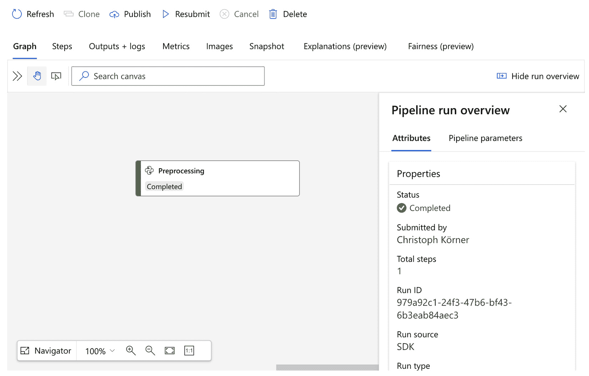
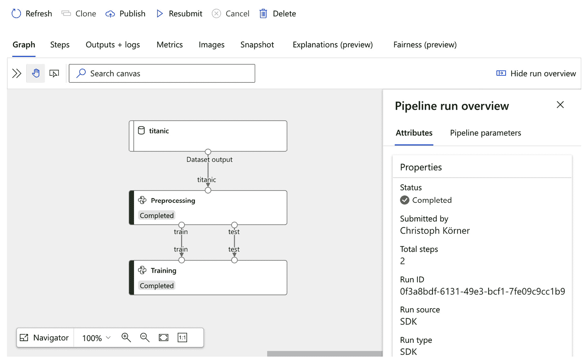
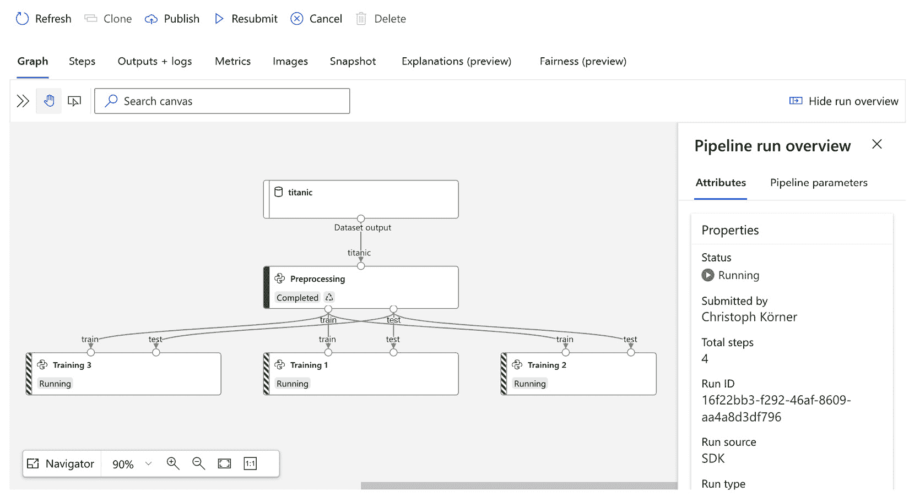
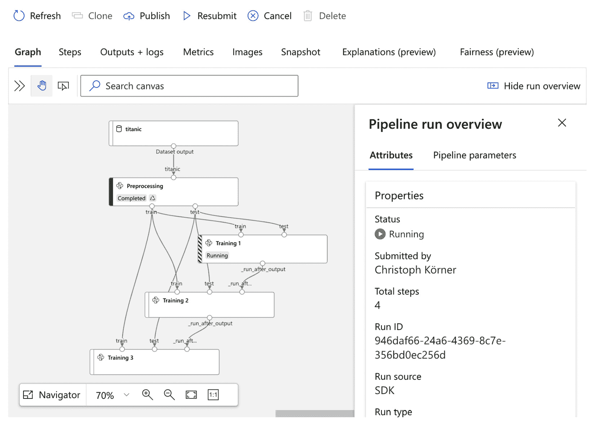
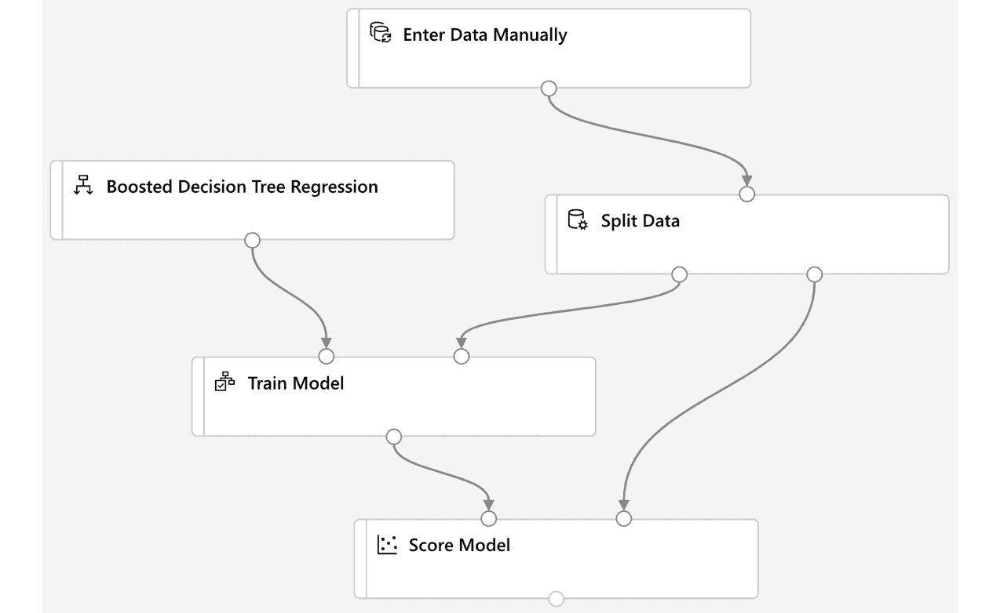
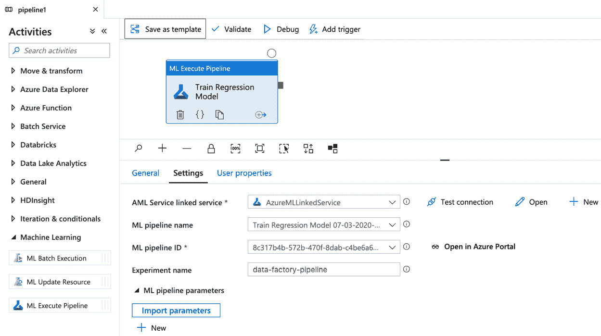

# 第八章：*第八章*：Azure 机器学习管道

在上一章中，我们学习了高级预处理技术，如类别嵌入和 NLP，从文本特征中提取语义意义。在本章中，你将学习如何使用这些预处理和转换技术来构建可重用的机器学习管道。

首先，你将了解将你的代码分解成单个步骤并将它们包装成管道的好处。不仅可以通过模块化和参数化使你的代码块可重用，而且还可以控制单个步骤的计算目标。这有助于优化你的计算，节省成本，并同时提高性能。最后，你可以通过 HTTP 端点或通过定期或反应式调度来参数化和触发你的管道。

然后，我们将分几个步骤构建一个复杂的 Azure 机器学习管道。我们将从一个简单的管道开始，添加数据输入、输出以及步骤之间的连接，并将管道作为 Web 服务部署。你还将了解基于频率和变化数据的先进调度，以及如何并行化管道步骤以处理大量数据。

在最后一部分，你将学习如何将 Azure 机器学习管道集成到其他 Azure 服务中，例如 Azure 机器学习设计器、Azure 数据工厂和 Azure DevOps。这将帮助你了解不同管道和工作流程服务之间的共性和差异，以及你如何触发机器学习管道。

在本章中，我们将涵盖以下主题：

+   在机器学习工作流程中使用管道

+   构建和发布机器学习管道

+   将管道与其他 Azure 服务集成

# 技术要求

在本章中，我们将使用以下 Python 库和版本来创建管道和管道步骤：

+   `azureml-core 1.34.0`

+   `azureml-sdk 1.34.0`

与前面的章节类似，你可以使用本地 Python 解释器或托管在 Azure 机器学习中的笔记本环境运行此代码。然而，所有脚本都需要在 Azure 中安排执行。

本章中所有的代码示例都可以在本书的 GitHub 存储库中找到：[`github.com/PacktPublishing/Mastering-Azure-Machine-Learning-Second-Edition/tree/main/chapter08`](https://github.com/PacktPublishing/Mastering-Azure-Machine-Learning-Second-Edition/tree/main/chapter08)。

# 在机器学习工作流程中使用管道

将你的工作流程分解成可重用和可配置的步骤，并将这些步骤组合成一个端到端管道，为实施端到端机器学习过程提供了许多好处。多个团队可以拥有并迭代单个步骤以改进管道，同时其他人可以轻松地将管道的每个版本集成到他们的当前设置中。

管道本身不仅将代码与执行分开，还将执行与编排分开。因此，你可以配置单个计算目标，用于优化你的执行并提供并行执行，而你无需接触 ML 代码。

我们将快速浏览 Azure 机器学习管道，并探讨为什么它们是实现 Azure 中 ML 工作流程的首选工具。在下一节“构建和发布 ML 管道”中，我们将深入探讨通过构建这样一个管道来探索其单个功能。

## 为什么构建管道？

对于一个主要进行实验、同时处理数据、基础设施和建模的单个开发者来说，管道并没有给开发者的工作流程带来很多好处。然而，一旦你在多个团队中进行企业级开发，这些团队在不同的 ML 系统部分进行迭代，那么你将极大地从将代码拆分为单个执行步骤的管道中受益。

这种模块化将为你带来极大的灵活性，多个团队能够高效协作。当你在迭代和构建管道的新版本时，团队能够集成你的模型和管道。通过使用版本化管道和管道参数，你可以控制如何调用你的数据或模型服务管道，并确保审计和可重复性。

使用工作流而不是在单个文件中运行所有内容的另一个重要好处是执行速度和成本的改进。你可以在不同的计算目标上单独运行和扩展步骤，而不是在同一个计算实例上运行单个脚本。这让你对潜在的成本节约有更大的控制，并能够更好地优化性能，你只需重试管道中失败的部分，而无需重试整个管道。

通过调度管道，你可以确保所有管道运行都无需手动干预即可执行。你只需定义触发器，例如新训练数据的存在，以执行你的管道。将代码执行与触发执行解耦为你带来了许多好处，例如轻松集成到许多其他服务中。

最后，你代码的模块化特性使得代码具有很高的可重用性。通过将脚本拆分为功能步骤，如清理、预处理、特征工程、训练和超参数调整，你可以为其他项目版本化和重用这些步骤。

因此，一旦你想从这些优势中获益，你就可以开始组织你的代码到管道中，这些管道可以部署、调度、版本化、扩展和重用。让我们看看如何在 Azure 机器学习中实现这一点。

## Azure 机器学习管道是什么？

**Azure 机器学习流水线**是 Azure 机器学习中的可执行步骤工作流程，它构成了完整的机器学习工作流程。因此，您可以将数据导入、数据转换、特征工程、模型训练、优化以及部署作为流水线步骤。

流水线是您 Azure 机器学习工作空间中的资源，您可以创建、管理、版本控制、触发和部署。它们与所有其他 Azure 机器学习工作空间资源集成，例如用于加载数据的数据集和数据存储、计算实例、模型和端点。每个流水线运行都在您的 Azure 机器学习工作空间中作为一个实验执行，并为您提供我们在上一章中介绍过的相同好处，例如在灵活的计算集群上运行时跟踪文件、日志、模型、工件和图像。

在实现灵活和可重用的机器学习工作流程时，Azure 机器学习流水线应该是您的首选。通过使用流水线，您可以模块化代码为功能块和版本，并将这些块与其他项目共享。这使得与其他团队协作进行复杂的端到端机器学习工作流程变得容易。

Azure 机器学习流水线的另一个伟大集成是与工作空间中的端点和触发器的集成。通过一行代码，您可以将流水线发布为 Web 服务或 Web 服务端点，并使用此端点从任何地方配置和触发流水线。这为将 Azure 机器学习流水线与其他许多 Azure 和第三方服务集成打开了大门。

然而，如果您需要一个更复杂的触发器，例如基于源数据变化的持续调度或响应式触发，您也可以轻松地配置这些功能。使用流水线的额外好处是，所有编排功能都与您的训练代码完全解耦。

正如您所看到的，使用 Azure 机器学习流水线为您的机器学习工作流程带来了许多好处。然而，值得注意的是，这项功能确实带来了一些额外的开销，即在每个计算步骤中包装流水线步骤，添加流水线触发器，为每个步骤配置环境和计算目标，以及将参数作为流水线选项公开。让我们从构建我们的第一个流水线开始。

# 构建和发布机器学习流水线

让我们继续使用之前章节中学到的所有知识，构建一个数据处理流水线。我们将使用 Azure 机器学习 SDK for Python 定义所有流水线步骤为 Python 代码，以便它可以轻松管理、审查和作为编写脚本存入版本控制。

我们将定义一个管道为一系列管道步骤的线性序列。每个步骤都将有一个输入和输出，分别定义为管道数据汇和源。每个步骤都将关联到一个计算目标，该目标定义了执行环境以及执行所需的计算资源。我们将设置一个执行环境，作为一个包含所有必需 Python 库的 Docker 容器，并在 Azure Machine Learning 的训练集群上运行管道步骤。

管道作为你的 Azure Machine Learning 工作空间中的一个实验运行。我们可以将管道作为创作脚本的一部分提交，将其部署为 Web 服务并通过 webhook 触发，将其作为已发布的管道进行安排，类似于 cron 作业，或者从第三方服务（如 Logic Apps）触发。

在许多情况下，运行线性顺序的管道已经足够好。然而，当数据量增加且管道步骤变得越来越慢时，我们需要找到一种方法来加速这些大型计算。加快数据转换、模型训练和评分的常见解决方案是通过并行化。因此，我们将向我们的数据转换管道添加一个并行执行步骤。

正如我们在本章的第一节中学到的，将 ML 工作流程解耦到管道中的主要原因是模块化和可重用性。通过将工作流程拆分为单个步骤，我们为常见 ML 任务的可重用计算块奠定了基础，无论是通过可视化和特征重要性进行数据分析，还是通过 NLP 和第三方数据进行特征工程，或者简单地评分常见的 ML 任务，如通过目标检测进行自动图像标记。

在 Azure Machine Learning 管道中，我们可以使用模块从管道创建可重用的计算步骤。模块是在管道步骤之上的一个管理层，它允许你轻松地对管道步骤进行版本控制、部署、加载和重用。这个概念与对 ML 项目中的源代码或数据集进行版本控制非常相似。

对于任何企业级 ML 工作流程，管道的使用是必不可少的。它不仅帮助你解耦、扩展、触发和重用单个计算步骤，而且还为你的端到端工作流程提供了可审计性和可监控性。此外，将计算块拆分为管道步骤将为你成功过渡到 MLOps——ML 项目的**持续集成和持续部署（CI/CD）**过程打下基础。

让我们开始并实现我们的第一个 Azure Machine Learning 管道。

## 创建一个简单的管道

Azure 机器学习管道是一系列可以并行或顺序执行的独立计算步骤。Azure 机器学习在管道之上提供了额外的功能，例如计算图的可视化、步骤之间的数据传输以及将管道作为端点或已发布管道发布。在本节中，我们将创建一个简单的管道步骤并执行管道以探索 Azure 机器学习管道的功能。

根据计算类型，您可以在不同的计算目标上安排作业，例如 Azure 机器学习、Azure Batch、Databricks、Azure Synapse 等，或者运行*自动机器学习*或*HyperDrive*实验。根据执行类型，您需要为每个步骤提供额外的配置。

让我们从只包含一个步骤的简单管道开始。我们将在后续章节中逐步添加更多功能和步骤。首先，我们需要定义我们的管道步骤的执行类型。虽然`PipelineStep`是管道中可以运行的任何执行的基类，但我们需要选择一个步骤实现。以下是在编写时可用的一些步骤：

+   `AutoMLStep`: 运行一个自动机器学习实验

+   `AzureBatchStep`: 在 Azure Batch 上运行一个脚本

+   `DatabricksStep`: 运行一个 Databricks 笔记本

+   `DataTransferStep`: 在 Azure 存储账户之间传输数据

+   `HyperDriveStep`: 运行一个 HyperDrive 实验

+   `ModuleStep`: 运行一个模块

+   `MpiStep`: 运行一个**消息传递接口 (MPI)**作业

+   `ParallelRunStep`: 并行运行一个脚本

+   `PythonScriptStep`: 运行一个 Python 脚本

+   `RScriptStep`: 运行一个 R 脚本

+   `SynapseSparkStep`: 在 Synapse 上运行一个 Spark 脚本

+   `CommandStep`: 运行一个脚本或命令

+   `KustoStep`: 在 Azure 数据探索器上运行一个 Kusto 查询

在我们的简单示例中，我们想在管道中运行一个单独的 Python 数据预处理脚本，因此我们将从前面列表中选择`PythonScriptStep`。我们正在构建与我们在前面的章节中看到的相同示例和代码示例。在这个第一个管道中，我们将执行一个步骤，该步骤将直接从脚本中加载数据——因此不需要将任何输入或输出传递给管道步骤。我们将在以下步骤中单独添加这些：

1.  管道步骤都附加到 Azure 机器学习工作区。因此，我们首先加载工作区配置：

    ```py
    from azureml.core import Workspace
    ws = Workspace.from_config()
    ```

1.  接下来，我们需要一个计算目标，我们可以在其上执行我们的管道步骤。让我们创建一个自动扩展的 Azure 机器学习训练集群作为计算目标，类似于我们在前面的章节中创建的：

    ```py
    # Create or get training cluster
    aml_cluster = get_aml_cluster(
      ws, cluster_name="cpu-cluster")
    aml_cluster.wait_for_completion(show_output=True)
    ```

1.  此外，我们还需要一个运行配置，它定义了我们的训练环境和 Python 库：

    ```py
    run_conf = get_run_config(['numpy', 'pandas',
      'scikit-learn', 'tensorflow'])
    ```

1.  现在，我们可以定义`PythonScriptStep`，它为目标的机器学习训练脚本提供了所有必需的配置和入口点：

    ```py
    from azureml.pipeline.steps import PythonScriptStep
    step = PythonScriptStep(name='Preprocessing',
                            script_name="preprocess.py",
                            source_directory="code",
                            runconfig=run_conf,
                            compute_target=aml_cluster)
    ```

如您在前面代码中所见，我们正在配置`script_name`和包含预处理脚本的`source_directory`参数。我们还传递了`runconfig`运行时配置和`compute_target`计算目标到`PythonScriptStep`。

1.  如果您还记得前面的章节，我们之前将`ScriptRunConfig`对象作为实验提交到 Azure 机器学习工作区。在管道的情况下，我们首先需要将管道步骤包装在`Pipeline`中，然后将管道作为实验提交。虽然一开始这似乎有些反直觉，但我们将看到我们如何参数化管道并添加更多的计算步骤。在下一个代码片段中，我们定义了管道：

    ```py
    from azureml.pipeline.core import Pipeline
    pipeline = Pipeline(ws, steps=[step])
    ```

如您所见，管道通过一系列管道步骤简单地定义，并与工作区相关联。在我们的例子中，我们只定义了一个执行步骤。让我们也检查一下，我们是否在配置管道时没有犯任何错误，通过内置的管道验证：

```py
pipeline.validate()
```

1.  一旦管道成功验证，我们就可以准备执行了。可以通过将管道作为实验提交到 Azure 机器学习工作区来执行管道：

    ```py
    from azureml.core import Experiment
    exp = Experiment(ws, "azureml-pipeline")
    run = exp.submit(pipeline)
    ```

恭喜！您刚刚运行了第一个非常简单的 Azure 机器学习管道。

重要提示

您可以在官方 Azure 存储库中找到许多使用 Azure 机器学习管道的完整和最新示例：[`github.com/Azure/MachineLearningNotebooks/blob/master/how-to-use-azureml/machine-learning-pipelines`](https://github.com/Azure/MachineLearningNotebooks/blob/master/how-to-use-azureml/machine-learning-pipelines)。

一旦提交了管道，它将在**管道**部分以及**实验**部分中显示，如图 8.1 所示。管道被视为一个实验，其中每个管道运行就像一个实验运行。管道的每个步骤，以及其日志、图表和指标，都可以作为实验的子运行来访问：



图 8.1 – Azure 机器学习中的管道运行作为实验

虽然这个简单的管道在直接将脚本作为实验提交时并没有带来很多好处，但现在我们可以向管道中添加额外的步骤并配置数据输入和输出。让我们看看吧！

## 在步骤之间连接数据输入和输出

管道步骤是计算块，而管道定义了步骤执行的顺序。为了控制数据流，我们需要为管道定义输入和输出，并为单个步骤连接数据输入和输出。计算块之间的数据流最终将定义块的执行顺序，从而将一系列步骤转换为一个有向无环执行图。这正是我们将在本节中探讨的内容。

在大多数情况下，管道需要外部输入、各个块之间的连接以及持久化输出。在 Azure Machine Learning 管道中，我们将使用以下构建块来配置此数据流：

+   预持久化管道输入：`Dataset`

+   管道步骤之间的数据：`PipelineData`

+   持续管道输出：`PipelineData.as_dataset()`

在本节中，我们将查看所有三种类型的数据输入和输出。首先，我们将查看如何将数据作为输入传递到管道中。

### 管道步骤的输入数据

让我们从向管道的第一步添加数据输入开始。为此 – 或者将任何预持久化数据传递给管道步骤 – 我们将使用**数据集**，这在*第四章*，*数据摄取和管理数据集*中我们已经看到。在 Azure Machine Learning 中，数据集是在指定路径上存储的指定编码数据的抽象引用。存储系统本身被抽象为**数据存储**对象，它是物理系统的引用，包含有关位置、协议和访问权限的信息。

如果您还记得前面的章节，我们可以通过简单地按名称引用来访问之前在 Azure Machine Learning 工作区中注册的数据集：

```py
from azureml.core.dataset import Dataset
dataset = Dataset.get_by_name(ws, 'titanic')
```

当数据最初被组织并注册为数据集时，前面的代码非常方便。作为管道开发者，我们不需要知道底层的数据格式（例如，CSV、ZIP、Parquet 和 JSON），以及数据存储在哪个 Azure Blob 存储或 Azure SQL 数据库上。管道开发者可以消费指定的数据，并专注于预处理、特征工程和模型训练。

然而，当将新数据传递到 Azure Machine Learning 管道时，我们通常没有将数据注册为数据集。在这些情况下，我们可以创建一个新的数据集引用。以下是如何从公开数据创建`Dataset`的示例：

```py
path ='https://...windows.net/demo/Titanic.csv'
dataset = Dataset.Tabular.from_delimited_files(path)
```

将文件和表格数据转换为`Dataset`有多种方式。虽然这看起来像是额外的复杂工作，而不是直接将绝对路径传递给管道，但遵循此约定将带来许多好处。最重要的是，Azure Machine Learning 工作区中的所有计算实例都将能够访问、读取和解析数据，而无需任何额外配置。此外，Azure Machine Learning 将引用和跟踪每个实验运行所使用的数据集。

一旦我们获得了`Dataset`的引用，我们就可以将数据集作为输入传递给管道步骤。当将数据集传递给计算步骤时，我们可以配置以下附加配置：

+   在脚本中对数据集引用的名称 – `as_named_input()`

+   `FileDataset`的访问类型 – `as_download()`或`as_mount()`

首先，我们将表格数据集配置为命名输入：

```py
from azureml.core.dataset import Dataset
dataset = Dataset.get_by_name(ws, 'titanic')
data_in = dataset.as_named_input('titanic')
```

接下来，我们将使用 `PythonScriptStep`，这将允许我们将参数传递给管道步骤。我们需要将数据集传递给两个参数——作为管道脚本的参数以及作为步骤的输入依赖。前者将允许我们将数据集传递给 Python 脚本，而后者将跟踪数据集作为此管道步骤的依赖项：

```py
from azureml.pipeline.steps import PythonScriptStep
step = PythonScriptStep(name='Preprocessing',
                        script_name="preprocess_input.py",
                        source_directory="code",
                        arguments=["--input", data_in],
                        inputs=[data_in],
                        runconfig=run_conf,
                        compute_target=aml_cluster)
```

如前述示例所示，我们可以将一个（或多个）数据集作为`inputs`参数传递给管道步骤，以及作为脚本的参数。为这个数据集指定一个特定的名称将帮助我们区分管道中的多个输入。我们将更新预处理脚本以从命令行参数解析数据集，如下面的代码片段所示：

preprocess_input.py

```py
import argparse
from azureml.core import Run, Dataset
run = Run.get_context()
ws = run.experiment.workspace
parser = argparse.ArgumentParser()
parser.add_argument("--input", type=str)
args = parser.parse_args()
dataset = Dataset.get_by_id(ws, id=args.input)
df = dataset.to_pandas_dataframe()
```

如前述代码所示，数据集作为数据集名称传递给 Python 脚本。我们可以使用 `Dataset` API 在运行时检索数据。

一旦我们提交管道以执行，我们可以在 Azure Machine Learning Studio 界面中看到管道的可视化，如图 8.2 所示。我们可以看到数据集作为**titanic**命名的输入传递给**预处理**步骤：


图 8.2 – 数据集作为管道步骤输入

这是一种将功能块与其输入解耦的绝佳方式。我们将在下一节，*通过模块化重用管道步骤*中看到，如何将这些可重用块转换为共享模块。

重要提示

除了将数据集作为输入参数传递给管道步骤外，我们还可以使用运行上下文对象上的以下属性从运行上下文中访问命名输入——`Run.get_context().input_datasets['titanic']`。然而，将数据集设置为输入和输出参数可以更容易地在管道和其他实验中重用管道步骤和代码片段。

接下来，让我们了解如何设置单个管道步骤之间的数据流。

### 步骤间传递数据

当我们为管道步骤定义输入时，我们通常希望配置计算输出的输出。通过传递输入和输出定义，我们将管道步骤与预定义的数据存储分离，并避免在计算步骤中移动数据。

虽然预先持久化的输入被定义为`Dataset`对象，但管道步骤之间的数据连接（输入和输出）是通过`PipelineData`对象定义的。让我们看看一个`PipelineData`对象作为某个管道步骤的输出和另一个步骤的输入的示例：

```py
from azureml.core import Datastore
from azureml.pipeline.core import PipelineData
datastore = Datastore.get(ws, datastore_name="mldata")
data_train = PipelineData('train', datastore=datastore)
data_test = PipelineData('test', datastore=datastore)
```

与前一个示例类似，我们将数据集作为参数传递，并作为`outputs`引用它们。前者将允许我们在脚本中检索数据集，而后者定义了步骤依赖项：

```py
from azureml.pipeline.steps import PythonScriptStep
step_1 = PythonScriptStep(name='Preprocessing',
                          script_name= \
                            "preprocess_output.py",
                          source_directory="code",
                          arguments=[
                              "--input", data_in,
                              "--out-train", data_train,
                              "--out-test", data_test],
                          inputs=[data_in],
                          outputs=[data_train, data_test],
                          runconfig=run_conf,
                          compute_target=aml_cluster)
```

一旦我们将预期的输出路径传递给评分文件，我们需要解析命令行参数以检索路径。评分文件看起来如下，以便读取输出路径并将 pandas DataFrame 输出到期望的位置。我们首先需要在训练脚本中解析命令行参数：

preprocess_output.py

```py
import argparse
parser = argparse.ArgumentParser()
parser.add_argument("--input", type=str)
parser.add_argument("--out-train", type=str)
parser.add_argument("--out-test", type=str)
args = parser.parse_args()
```

`PipelineData`参数在运行时被解释，并用挂载的数据集目录的本地路径替换。因此，我们可以简单地写入这个本地目录，数据将被自动注册到数据集中：

preprocess_output.py

```py
import os
out_train = args.out_train
os.makedirs(os.path.dirname(out_train), exist_ok=True)
out_test = args.out_test
os.makedirs(os.path.dirname(out_test), exist_ok=True)
df_train, df_test = preprocess(...)
df_train.to_csv(out_train)
df_test.to_csv(out_test)
```

一旦我们将数据输出到`PipelineData`数据集，我们就可以将这些数据集传递给下一个管道步骤。传递数据集的方式与我们之前看到的完全相同 – 我们将它们作为参数传递并注册为`inputs`：

```py
from azureml.pipeline.steps import PythonScriptStep
step_2 = PythonScriptStep(name='Training',
                          script_name="train.py",
                          source_directory="code",
                          arguments=[
                              "--in-train", data_train,
                              "--in-test", data_test],
                          inputs=[data_train, data_test],
                          runconfig=run_conf,
                          compute_target=aml_cluster)
```

现在，我们可以在训练脚本中加载数据。如果你还记得前一个步骤，`PipelineData`在本地执行环境中被解释为路径。因此，我们可以从命令行参数中解释的路径读取数据：

train.py

```py
import argparse
parser = argparse.ArgumentParser()
parser.add_argument("--in-train", type=str)
parser.add_argument("--in-test", type=str)
args = parser.parse_args()
...
df_train = pd.read_csv(args.in_train)
df_test = pd.read_csv(args.in_test)
```

最后，我们可以通过使用`steps`关键字传递步骤来将这两个步骤包装成一个`Pipeline`对象。这个`pipeline`对象可以被传递给 Azure Machine Learning 作为一个实验：

```py
from azureml.pipeline.core import Pipeline
pipeline = Pipeline(ws, steps=[step_1, step_2])
```

如前一个示例所示，我们可以从命令行参数中读取输出路径，并在 Python 脚本中将其用作标准文件路径。因此，我们需要确保文件路径存在，并将一些表格数据输出到该位置。接下来，我们定义第二个验证步骤的输入，该步骤读取新创建的数据：



图 8.3 – 在管道步骤间传递数据

最后，我们将探讨如何将管道步骤的输出持久化以供管道外使用。

### 持久化数据输出

在本节的最后，我们将学习如何持久化管道的输出数据。对于管道来说，一个常见的任务是构建数据转换 – 因此我们通常期望管道输出数据。

在前一节中，我们学习了如何使用`PipelineData`从管道步骤创建输出，主要是为了将这些输出连接到后续步骤的输入。我们可以使用相同的方法来定义管道的最终持久化输出。

一旦你理解了如何创建、持久化和版本化数据集，这样做就非常简单了。原因是我们可以使用`as_dataset()`方法将`PipelineData`对象转换为数据集。一旦我们有了`Dataset`对象的引用，我们就可以继续将其导出到特定的数据存储或在工作区中将其注册为数据集。

这里是一个如何将作为管道步骤输出的`PipelineData`对象转换为数据集并在 Azure Machine Learning 工作区中注册的示例：

```py
from azureml.data import OutputFileDatasetConfig
data_out = OutputFileDatasetConfig(name="predictions", 
  destination=(datastore, 'titanic/predictions')) 
```

通过调用前面的作者代码，您将能够将结果预测作为数据集访问任何与您的工作空间连接的计算实例：


图 8.4 – 作为管道步骤输出的数据集

接下来，我们将探讨触发管道执行的不同方法。

## 发布、触发和安排管道

在您创建了第一个简单的管道之后，您有多种运行管道的方式。我们已经看到的一个例子是将管道作为实验提交给 Azure Machine Learning。这将简单地从配置管道的同一作者脚本中执行管道。虽然这最初执行管道是一个好的开始，但还有其他触发、参数化和执行管道的方法。

执行管道的常见方法如下：

+   将管道发布为 Web 服务。

+   使用 webhook 触发已发布的管道。

+   安排管道定期运行。

在本节中，我们将探讨所有三种方法，以帮助您轻松触发和执行您的管道。让我们首先从将管道作为 Web 服务发布和版本化开始。

### 将管道发布为 Web 服务

将机器学习工作流程拆分成可重用管道的常见原因是你可以根据需要对其进行参数化和触发，以执行各种任务。好的例子包括常见的预处理任务、特征工程步骤和批量评分。

因此，将管道转变为可参数化的 Web 服务，我们可以从任何其他应用程序中触发它，这是一种很好的部署我们的机器学习工作流程的方式。让我们开始，并将之前构建的管道作为 Web 服务进行打包和部署。

由于我们希望我们的已发布管道可以通过 HTTP 参数进行配置，我们需要首先创建这些参数引用。让我们创建一个参数来控制训练管道的学习率：

```py
from azureml.pipeline.core.graph import PipelineParameter
lr_param = PipelineParameter(name="lr_arg",
                             default_value=0.01)
```

接下来，我们将通过将参数作为训练脚本的参数传递来将管道参数与管道步骤链接起来。我们扩展了上一节中的步骤：

```py
data = mnist_dataset.as_named_input('mnist').as_mount()
args = ["--in-train", data, "--learning-rate", lr_param]
step = PythonScriptStep(name='Training',
	script_name="train.py",
	source_directory="code",
	arguments=args,
	inputs=[data_train],
	runconfig=run_conf,
	compute_target=aml_cluster)
                     arguments=args ,
                     estimator=estimator,
                     compute_target=cpu_cluster)
```

在前面的示例中，我们将学习率作为一个参数添加到了命令行参数列表中。在训练脚本中，我们可以解析命令行参数并读取参数：

score.py

```py
parser = argparse.ArgumentParser()
parser.add_argument('--learning-rate', type=float, 
  dest='lr')
args = parser.parse_args()
# print learning rate 
print(args.lr)
```

现在，唯一剩下的步骤就是发布管道。为此，我们创建一个管道并调用`publish()`方法。我们需要为管道传递一个名称和版本，这样它现在将是一个版本化的已发布管道：

```py
pipeline = Pipeline(ws, steps=[step])
service = pipeline.publish(name="CNN_Train_Service",
                           version="1.0")
service_id = service.id
service_endpoint = service.endpoint
```

这就是您需要公开的代码，以将管道作为具有身份验证的参数化 Web 服务。如果您想将您的已发布管道从特定的端点抽象出来——例如，在迭代管道的开发过程的同时，让其他团队将 Web 服务集成到他们的应用程序中——您还可以部署管道 webhooks 作为端点。

让我们看看一个示例，其中我们使用先前创建的管道服务并通过单独的端点公开它：

```py
from azureml.pipeline.core import PipelineEndpoint
application = PipelineEndpoint.publish(ws,
  pipeline=service,
  name="CNN_Train_Endpoint")
service_id = application.id
service_endpoint = application.endpoint
```

我们已经部署并解耦了管道和管道端点。我们最终可以通过服务端点调用和触发端点。让我们在下一节中看看这个例子。

### 使用 webhook 触发已发布的管道

已发布的管道 web 服务需要认证。因此，在我们调用 web 服务之前，让我们首先检索一个 Azure Active Directory 令牌：

```py
from azureml.core.authentication import AzureCliAuthentication
cli_auth = AzureCliAuthentication()
aad_token = cli_auth.get_authentication_header()
```

使用认证令牌，我们现在可以通过调用服务端点来触发和参数化管道。让我们通过使用`requests`库来查看一个示例。我们可以通过在上一节中定义的`lr_arg`参数配置学习率，并通过发送自定义 JSON 体来设置实验名称。如果你还记得，管道仍然会在你的 Azure 机器学习工作区中以实验的形式运行：

```py
import requests
response = requests.post(service_endpoint,
  headers=aad_token,
  json={"ExperimentName": "mnist-train",
        "ParameterAssignments": {"lr_arg": 0.05}})
```

在前面的代码片段中，我们可以看到我们使用`POST`请求调用管道 webhook，并通过发送自定义 JSON 体来配置管道运行。对于认证，我们还需要通过 HTTP 头传递认证信息。

在这个例子中，我们使用 Python 脚本来触发 web 服务端点。然而，你现在可以通过 webhook 使用任何其他 Azure 服务来触发此管道，例如 Azure Logic Apps、Azure DevOps 中的 CI/CD 管道或任何其他自定义应用程序。如果你希望你的管道定期运行而不是手动触发，你可以设置管道计划。让我们在下一节中看看这个例子。

### 安排已发布的管道

在构建管道时，为工作流设置连续触发器是一个常见用例。这些触发器可以在每周或每天运行管道并重新训练模型，如果可用新数据。Azure 机器学习管道支持两种类型的调度技术——通过预定义频率的连续调度，以及通过轮询间隔的响应式调度和数据变更检测。在本节中，我们将探讨这两种方法。

在我们开始安排管道之前，我们将首先探索一种列出工作区中所有先前定义的管道的方法。为此，我们可以使用`PublishedPipeline.list()`方法，类似于我们的 Azure 机器学习工作区资源中的`list()`方法。让我们打印工作区中每个已发布管道的名称和 ID：

```py
from azureml.pipeline.core import PublishedPipeline
for pipeline in PublishedPipeline.list(ws):
  print("name: %s, id: %s" % (pipeline.name, pipeline.id))
```

要为已发布的管道设置计划，我们需要将管道 ID 作为参数传递。我们可以从前面的代码片段中检索所需的管道 ID 并将其插入到计划声明中。

首先，我们将探讨连续计划，这些计划会以预定义的频率重新触发管道，类似于 cron 作业。为了定义计划频率，我们需要创建一个`ScheduleRecurrence`对象。以下是一个创建重复计划的示例片段：

```py
from azureml.pipeline.core.schedule import \
  ScheduleRecurrence, Schedule
recurrence = ScheduleRecurrence(frequency="Minute", 
                                interval=15)
schedule = Schedule.create(ws, 
                           name="CNN_Train_Schedule", 
                           pipeline_id=pipeline_id,
                           experiment_name="mnist-train", 
                           recurrence=recurrence, 
                           pipeline_parameters={})
```

上述代码就是设置一个持续触发你的管道的重复调度的全部所需。管道将在你的 Azure Machine Learning 工作区中定义的实验中运行。使用`pipeline_parameters`参数，你可以将额外的参数传递给管道运行。

Azure Machine Learning 管道还支持另一种类型的重复调度，即轮询数据存储库中的更改。这种类型的调度被称为反应式调度，需要连接到数据存储库。它将在你的数据存储库中的数据更改时触发你的管道。以下是一个设置反应式调度的示例：

```py
from azureml.core.datastore import Datastore
# use default datastore 'ws.get_default_datastore()'
# or load a custom registered datastore
datastore = Datastore.get(workspace, 'mldemodatastore')
# 5 min polling interval
polling_interval = 5
schedule = Schedule.create(
    ws, name="CNN_Train_OnChange", 
    pipeline_id=pipeline_id,
    experiment_name="mnist-train",
    datastore=datastore,
    data_path_parameter_name="mnist"
    polling_interval=polling_interval,
    pipeline_parameters={})
```

如此例所示，我们使用数据存储库引用和分钟级的轮询间隔来设置反应式调度。因此，调度将检查每个轮询间隔，以查看是否有任何 blob 已更改，并使用这些更改来触发管道。blob 名称将通过`data_path_parameter_name`参数传递给管道。类似于之前的调度，你也可以使用`pipeline_parameters`参数将额外的参数发送到管道。

最后，让我们看看如何一旦启用就程序性地停止一个调度。为此，我们需要一个调度对象的引用。我们可以通过获取特定工作区的调度来获取这个引用，类似于 Azure Machine Learning 中的任何其他资源：

```py
for schedule in Schedule.list(ws):
  print(schedule.id)
```

我们可以使用调度对象上所有可用的属性来过滤这个列表。一旦我们找到了所需的调度，我们只需简单地禁用它：

```py
schedule.disable(wait_for_provisioning=True)
```

使用额外的`wait_for_provisioning`参数，我们确保在调度真正禁用之前阻塞代码执行。你可以使用`Schedule.enable`方法轻松重新启用调度。现在，你可以创建重复和反应式调度，持续运行你的 Azure Machine Learning 管道，并在不再需要时禁用它们。接下来，我们将看看如何并行化执行步骤。

## 并行化步骤以加快大型管道

在许多情况下，随着时间的推移，管道不可避免地会处理越来越多的数据。为了并行化管道，你可以并行或顺序运行管道步骤，或者通过使用`ParallelRunConfig`和`ParallelRunStep`来并行化单个管道步骤的计算。

在我们深入讨论单个步骤执行的并行化之前，让我们首先讨论简单管道的控制流。我们将从一个使用多个步骤构建的简单管道开始，如下面的示例所示：

```py
pipeline = Pipeline(ws, steps=[step1, step2, step3, step4])
```

当我们提交此管道时，这四个步骤将如何执行——是顺序执行、并行执行，还是甚至是无定义的顺序？为了回答这个问题，我们需要查看各个步骤的定义。如果所有步骤都是独立的，并且每个步骤的计算目标足够大，则所有步骤都会并行执行。然而，如果我们定义`PipelineData`为`step1`的输出并将其输入到其他步骤中，则这些步骤只有在`step1`完成后才会执行：



图 8.5 – 带有并行步骤的管道

管道步骤之间的数据连接隐式定义了步骤的执行顺序。如果没有步骤之间存在依赖关系，则所有步骤都会并行安排。

上述说法有一个例外，即在没有专用数据对象作为依赖项的情况下强制执行管道步骤的特定执行顺序。为了做到这一点，你可以手动定义这些依赖项，如下面的代码片段所示：

```py
step3.run_after(step2)
step4.run_after(step3)
```

上述配置将首先并行执行`step1`和`step2`，然后再安排`step3`，这要归功于你明确配置的依赖项。这在当你访问 Azure 机器学习工作区外的资源中的状态或数据时非常有用；因此，管道不能隐式创建依赖项：



图 8.6 – 带有自定义步骤顺序的管道

一旦我们解决了步骤执行顺序的问题，我们想要了解如何并行执行单个步骤，而不是多个步骤。这个用例非常适合批量评分大量数据。你不想将输入数据分割成多个步骤的输入，而是希望将数据作为单个步骤的输入。然而，为了加快评分过程，你希望对单个步骤的评分进行并行执行。

在 Azure 机器学习管道中，你可以使用`ParallelRunStep`步骤来配置单个步骤的并行执行。为了配置数据分区和计算的并行化，你需要创建一个`ParallelRunConfig`对象。并行运行步骤是一个很好的选择，适用于任何类型的并行化计算，帮助我们将输入数据分割成更小的数据分区（也称为批量或小批量）。让我们通过一个示例来了解如何为单个管道步骤设置并行执行。我们将配置批量大小作为管道参数，该参数可以在调用管道步骤时设置：

```py
from azureml.pipeline.core import PipelineParameter
from azureml.pipeline.steps import ParallelRunConfig
parallel_run_config = ParallelRunConfig(
  entry_script='score.py',
  mini_batch_size=PipelineParameter(
    name="batch_size", 
    default_value="10"),
  output_action="append_row",
  append_row_file_name="parallel_run_step.txt",
  environment=batch_env,
  compute_target=cpu_cluster,
  process_count_per_node=2,
  node_count=2)
```

上述代码片段定义了通过将输入分割成小批量来并行化计算的运行配置。我们将批量大小配置为管道参数`batch_size`。我们还通过`node_count`和`process_count_per_node`参数配置计算目标和并行性。使用这些设置，我们可以并行评分四个小批量。

`score.py` 脚本是一个部署文件，需要包含一个 `init()` 和 `run(batch)` 方法。`batch` 参数包含一个文件名列表，这些文件将从步骤配置的输入参数中提取出来。我们将在 *第十一章*，*超参数调整和自动化机器学习* 中了解更多关于此文件结构的信息。

`score.py` 脚本中的 `run` 方法应返回评分结果或将数据写入外部数据存储。根据这一点，`output_action` 参数需要设置为 `append_row`，这意味着所有值都将收集到一个结果文件中，或者设置为 `summary_only`，这意味着用户将负责存储结果。您可以使用 `append_row_file_name` 参数定义所有行都将附加到的结果文件。

如您所见，设置并行批量执行的运行配置并不简单，需要一些调整。然而，一旦设置并正确配置，它就可以用来扩展计算步骤并并行运行多个任务。因此，我们现在可以定义具有所有必需输入和输出的 `ParallelRunStep`：

```py
from azureml.pipeline.steps import ParallelRunStep
from azureml.core.dataset import Dataset
parallelrun_step = ParallelRunStep(
  name="ScoreParallel",
  parallel_run_config=parallel_run_config,
  inputs=[Dataset.get_by_name(ws, 'mnist')],
  output=PipelineData('mnist_results', 
                      datastore=datastore),
  allow_reuse=True)
```

如您所见，我们从引用数据存储中所有文件的输入数据集中读取。我们将结果写入我们自定义数据存储中的 `mnist_results` 文件夹。最后，我们可以开始运行并查看结果。为此，我们将管道作为实验运行提交到 Azure Machine Learning：

```py
from azureml.pipeline.core import Pipeline
pipeline = Pipeline(workspace=ws, steps=[parallelrun_step])
run = exp.submit(pipeline)
```

将步骤执行拆分为多个分区将有助于您加快大量数据的计算速度。一旦计算时间显著长于在计算目标上调度步骤执行的开销，这种方法就会带来回报。因此，`ParallelRunStep` 是加快您管道的好选择，只需对您的管道配置进行少量更改。接下来，我们将探讨更好的模块化和管道步骤的可重用性。

## 通过模块化重用管道步骤

通过将您的流程拆分为管道步骤，您正在为可重用的 ML 和数据处理构建块奠定基础。然而，而不是将您的管道、管道步骤和代码复制粘贴到其他项目中，您可能希望将您的功能抽象为功能性的高级模块。

让我们来看一个例子。假设您正在构建一个管道步骤，该步骤接受用户和项目评分的数据集，并为每个用户输出前五个项目的推荐。然而，当您正在微调推荐引擎时，您希望允许您的同事将此功能集成到他们的管道中。一种很好的方法是将代码的实现和使用分离，定义输入和输出数据格式，并对其进行模块化和版本控制。这正是模块在 Azure Machine Learning 管道步骤中的作用。

让我们创建一个模块，这个容器将包含对计算步骤的引用：

```py
from azureml.pipeline.core.module import Module
module = Module.create(ws,
                       name="TopItemRecommender",
                       description="Recommend top 5 items")
```

接下来，我们使用`InputPortDef`和`OutputPortDef`绑定来定义模块的输入和输出。这些是输入和输出引用，稍后需要将它们绑定到数据引用。我们使用这些绑定来抽象化所有的输入和输出：

```py
from azureml.pipeline.core.graph import \
  InputPortDef, OutputPortDef
in1 = InputPortDef(name="in1",
                   default_datastore_mode="mount", 
                   default_data_reference_name = \
                       datastore.name,
                   label="Ratings")
out1 = OutputPortDef(name="out1",
                     default_datastore_mode="mount", 
                     default_datastore_name=datastore.name,
                     label="Recommendation")
```

最后，我们可以通过发布此模块的 Python 脚本来定义模块功能：

```py
module.publish_python_script("train.py",
                             source_directory="./rec",
                             params={"numTraits": 5},
                             inputs=[in1],
                             outputs=[out1],
                             version="1",
                             is_default=True)
```

这就是您需要做的所有事情，以便其他人可以在他们的 Azure 机器学习管道中重用您的推荐块。通过使用版本控制和默认版本，您可以确保用户拉取的确切代码。正如我们所看到的，您可以为每个模块定义多个输入和输出，并为该模块定义可配置参数。除了以 Python 代码发布功能外，我们还可以发布 Azure Data Lake Analytics 或 Azure 批处理步骤。

接下来，我们将探讨如何将模块集成到 Azure 机器学习管道中，并与自定义步骤一起执行。为此，我们将首先使用以下命令加载之前创建的模块：

```py
from azureml.pipeline.core.module import Module
module = Module.get(ws, name="TopItemRecommender")
```

现在的伟大之处在于，前面的代码将在任何具有访问您的 Azure 机器学习工作区权限的 Python 解释器或执行引擎中工作。这是一个巨大的进步——无需复制代码，无需检查依赖项，也无需为您的应用程序定义任何额外的访问权限——一切都与工作区集成在一起。

首先，我们需要编写这个管道步骤的输入和输出。让我们将管道的输入直接传递到推荐模块，并将所有输出传递到管道输出：

```py
from azureml.pipeline.core import PipelineData
in1 = PipelineData("in1",
                   datastore=datastore, 
                   output_mode="mount", 
                   is_directory=False)
out1 = PipelineData("out1",
                    datastore=datastore, 
                    output_mode="mount", 
                    is_directory=False)
input_wiring = {"in1": in1}
output_wiring = {"out1": out1}
```

现在，我们使用管道参数来参数化模块。这使得我们可以在管道中配置一个参数，并将其传递到推荐模块。此外，我们还可以为在管道中使用时定义该参数的默认值：

```py
from azureml.pipeline.core import PipelineParameter
num_traits = PipelineParameter(name="numTraits",
                               default_value=5)
```

我们已经定义了此管道的输入和输出，以及管道步骤的输入参数。我们唯一缺少的是将所有这些整合起来并定义一个管道步骤。类似于前一个章节，我们可以定义一个将执行模块化推荐块的管道步骤。为此，我们不再使用`PythonScriptStep`，而是现在使用`ModuleStep`：

```py
from azureml.core import RunConfiguration
from azureml.pipeline.steps import ModuleStep
step = ModuleStep(module= module,
                  version="1",
                  runconfig=RunConfiguration(),
                  compute_target=aml_compute,
                  inputs_map=input_wiring,
                  outputs_map=output_wiring,
                  arguments=[
                    "--output_sum", first_sum,
                    "--output_product", first_prod,
                    "--num-traits", num_traits])
```

最后，我们可以通过将管道作为实验提交到我们的 Azure 机器学习工作区来执行管道。此代码与之前章节中看到的内容非常相似：

```py
from azureml.core import Experiment
from azureml.pipeline.core import Pipeline
pipeline = Pipeline(ws, steps=[step])
exp = Experiment(ws, "item-recommendation")
run = exp.submit(pipeline)
```

前一个步骤在您的 Azure 机器学习工作区中以实验的形式执行模块化管道。然而，您也可以选择之前章节中讨论的任何其他发布方法，例如作为 Web 服务发布或安排管道。

当与多个团队在同一 ML 项目上工作时，将管道步骤拆分为可重用模块非常有帮助。所有团队都可以并行工作，并且结果可以轻松地集成到单个 Azure 机器学习工作区中。让我们看看 Azure 机器学习管道如何与其他 Azure 服务集成。

# 将管道与其他 Azure 服务集成

用户仅使用单个服务来管理云中的数据流、实验、训练、部署和 CI/CD 是很少见的。其他服务提供特定的功能，使它们更适合特定任务，例如，Azure Data Factory 用于将数据加载到 Azure 中，Azure Pipelines 用于在 Azure DevOps 中运行自动化任务。

选择云提供商的最有力的论据是其个别服务的强大集成。在本节中，我们将看到 Azure 机器学习管道如何与其他 Azure 服务集成。如果我们要涵盖所有可能的集成服务，这个列表将会很长。正如我们在本章中学到的，您可以通过调用 REST 端点并使用标准 Python 代码提交管道来触发发布的管道。这意味着您可以在任何可以调用 HTTP 端点或运行 Python 代码的地方集成管道。

我们首先将探讨与 Azure 机器学习设计师的集成。设计师允许您通过拖放界面构建管道，这些管道、发布的管道和管道运行将像我们在本章中构建的任何其他管道一样显示在工作区中。因此，快速查看共同点和差异是实用的。

接下来，我们将快速查看 Azure 机器学习管道与 Azure Data Factory 的集成，这可能是最常用的集成之一。将 ML 管道与 ETL 管道一起包含，用于在 ETL 过程中对数据进行评分、丰富或增强，这是一种非常自然的本能。

最后，我们将比较 Azure 机器学习管道与 Azure DevOps 中的 Azure Pipelines 用于 CI/CD。虽然 Azure DevOps 主要用于应用程序代码和应用程序编排，但它现在正在过渡到提供完整的端到端 MLOps 工作流程。让我们从设计师开始，直接进入正题。

## 使用 Azure 机器学习设计师构建管道

**Azure 机器学习设计师**是一个图形界面，通过拖放界面创建复杂的 ML 管道。您可以选择表示为块的函数来导入数据，这些块将使用底层的存储库和数据集。

下图显示了一个简单的管道，用于训练和评分一个提升决策树回归模型。如您所见，基于块的编程风格需要较少的关于单个块的知识，并且它允许您在不编写任何代码的情况下构建复杂的管道：



图 8.7 – Azure Machine Learning 设计器管道

一些操作，例如将一个计算的结果连接到下一个计算的输入，在视觉 UI 中创建可能比使用代码更方便。通过可视化管道也更容易理解数据流。其他操作，例如创建大型数据批次的并行执行，在代码中处理和维护可能更容易一些。然而，由于我们首先使用代码的方法来保证可重复性、可测试性和版本控制，我们通常更倾向于使用代码进行编写和执行。

值得注意的是，设计器中的管道和代码中使用的管道的功能并不相同。虽然你有一系列预先配置的抽象功能块，例如之前*图 8.7*中的**Boosted Decision Tree Regression**块，但你无法在代码中访问这些功能。然而，你可以使用 scikit-learn、PyTorch、TensorFlow 等来重用现有功能或在代码中构建自己的功能。

由于设计器与工作空间的一级集成，你可以在设计器内部访问工作空间中的所有文件、模型和数据集。一个重要的启示是，在工作空间中创建的所有资源，如管道、发布的管道、实时端点、模型、数据集等，都存储在公共系统中——无论它们是在哪里创建的。

## Azure Data Factory 中的 Azure Machine Learning 管道

在移动数据、ETL 以及触发各种 Azure 服务中的计算时，你很可能会遇到**Azure Data Factory**。这是一个非常流行的服务，可以将大量数据移动到 Azure，执行处理和转换，构建工作流，并触发许多其他 Azure 或第三方服务。

Azure Machine Learning 管道与 Azure Data Factory 集成得非常好，你可以轻松配置并通过 Data Factory 触发已发布的管道的执行。为此，你需要将**ML Execute Pipeline**活动拖放到你的 Data Factory 画布中，并指定已发布管道的管道 ID。此外，你还可以指定管道参数以及管道运行的实验名称。

下图显示了如何在 Azure Data Factory 中配置**ML Execute Pipeline**步骤。它使用链接服务连接到你的 Azure Machine Learning 工作空间，这允许你从下拉框中选择所需的管道：



图 8.6 – Azure Data Factory 与 Azure Machine Learning 活动

如果你正在使用 JSON 配置计算步骤，你可以使用以下片段创建一个与 Azure Machine Learning 作为链接服务的**ML Execute Pipeline**活动。同样，你必须指定管道 ID，并可以传递实验名称以及管道参数：

```py
{
    "name": "Machine Learning Execute Pipeline",
    "type": "AzureMLExecutePipeline",
    "linkedServiceName": {
        "referenceName": "AzureMLService",
        "type": "LinkedServiceReference"
    },
    "typeProperties": {
        "mlPipelineId": "<insert pipeline id>",
        "experimentName": "data-factory-pipeline",
        "mlPipelineParameters": {
            "batch_size": "10"
        }
    }
}
```

最后，您可以通过添加触发器或输出到**ML 执行管道**活动来触发步骤。这将最终触发您已发布的 Azure Machine Learning 管道，并在工作区中开始执行。这是一个很好的补充，使得其他团队在经典的 ETL 和数据转换过程中重用您的 ML 管道变得容易。

## Azure Pipelines for CI/CD

Azure Pipelines 是 Azure DevOps 的一个功能，允许您作为一个持续集成（**CI**）和持续部署（**CD**）过程来运行、构建、测试和部署代码。因此，它们是具有许多高级功能（如审批队列和门控阶段）的灵活的代码和应用程序编排管道。

通过允许您运行多个代码块，将 Azure Machine Learning 集成到 Azure DevOps 的最佳方式是使用 Python 脚本块。如果您已经按照这本书的内容，并使用以代码优先的方法来编写您的实验和管道，那么这种集成非常简单。让我们来看一个小例子。

首先，让我们编写一个实用函数，该函数根据工作区和管道 ID 参数返回一个已发布的管道。在这个例子中，我们需要这个函数：

```py
def get_pipeline(workspace, pipeline_id):
  for pipeline in PublishedPipeline.list(workspace):
    if pipeline.id == pipeline_id:
      return pipeline
  return None
```

接下来，我们可以继续实现一个非常简单的 Python 脚本，允许我们在 Azure 中配置和触发管道运行。我们将初始化工作区，检索已发布的管道，并将管道作为实验提交到 Azure Machine Learning 工作区。这一切都是可配置的，而且只需要几行代码：

```py
ws = Workspace.get(
  name=os.environ.get("WORKSPACE_NAME"),
  subscription_id=os.environ.get("SUBSCRIPTION_ID"),
  resource_group=os.environ.get("RESOURCE_GROUP"))
pipeline = get_pipeline(args.pipeline_id)
pipeline_parameters = args.pipeline_parameters
exp = Experiment(ws, name=args.experiment_name)
run = exp.submit(pipeline,
                 pipeline_parameters=pipeline_parameters)
print("Pipeline run initiated %s" % run.id)
```

上述代码展示了我们如何将管道触发器集成到 Azure 管道中进行 CI/CD。我们可以看到，一旦工作区初始化完成，代码将遵循与从本地开发环境提交已发布的管道完全相同的模式。此外，我们还可以通过环境变量和命令行参数来配置管道运行。我们将在*第十六章*中看到这一功能的应用，*使用 MLOps 将模型投入生产*。

# 摘要

在本章中，您学习了如何使用和配置 Azure Machine Learning 管道，通过管道和管道步骤将 ML 工作流程拆分为多个步骤，用于估计量、Python 执行和并行执行。您使用 `Dataset` 和 `PipelineData` 配置了管道输入和输出，并成功控制了管道的执行流程。

作为另一个里程碑，您将管道作为 `PublishedPipeline` 部署到了 HTTP 端点。这允许您通过简单的 HTTP 调用来配置和触发管道执行。接下来，您实现了基于时间频率的自动调度，以及基于底层数据集变化的反应式调度。现在，当输入数据发生变化时，管道可以自动重新运行工作流程，无需任何手动交互。

最后，我们还模块化和版本化了管道步骤，以便在其他项目中重用。我们使用了`InputPortDef`和`OutputPortDef`来为数据源和汇点创建虚拟绑定。在最后一步，我们探讨了将管道集成到其他 Azure 服务中，例如 Azure 机器学习设计器、Azure 数据工厂和 Azure DevOps。

在下一章中，我们将探讨在 Azure 中使用基于决策树集成模型构建机器学习模型。
