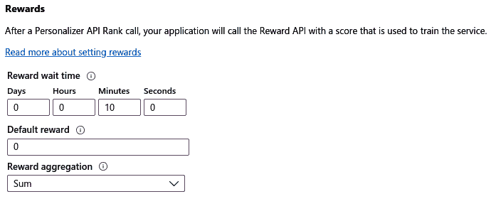

# *第十三章*：在 Azure 中构建推荐引擎

在前一章中，我们讨论了机器学习模型的分布式训练方法，并学习了如何在 Azure 中高效地训练分布式机器学习模型。在本章中，我们将深入探讨传统和现代推荐引擎，这些推荐引擎通常结合了前几章中介绍的技术和技巧。

首先，我们将快速浏览不同类型的推荐引擎，每种类型需要哪些数据，以及可以使用这些不同方法推荐什么。这将帮助您了解何时选择非个性化、基于内容或基于评分的推荐器。

之后，我们将深入探讨基于内容的推荐，即基于特征向量和相似度的项目-项目和用户-用户推荐器。您将学习如何使用余弦距离来衡量特征向量之间的相似性，以及如何通过特征工程技术避免在构建基于内容的推荐引擎时常见的陷阱。

随后，我们将讨论在收集到足够的用户-项目交互数据后可以使用的基于评分的推荐。您将了解隐式评分和显式评分之间的区别，开发自己的隐式度量函数，并思考用户评分的时效性。

在接下来的章节中，我们将结合基于内容和基于评分的推荐器，构建一个单一的混合推荐器，并了解现代推荐引擎的最新技术。您将使用 Azure 机器学习实现两个推荐器，一个使用 Python，另一个使用 Azure 机器学习设计器——Azure 机器学习的图形用户界面。

在最后一节中，我们将探讨使用强化学习作为服务的在线推荐系统——Azure Personalizer。在理解了基于内容和基于评分的方法之后，您将学习如何使用适应函数和在线学习实时改进您的推荐。

本章将涵盖以下主题：

+   推荐引擎简介

+   基于内容的推荐系统

+   协同过滤——基于评分的推荐系统

+   在混合推荐引擎中结合内容和评分

+   通过强化学习实现自动优化

# 技术要求

在本章中，我们将使用以下 Python 库和版本来创建基于内容和基于评分的推荐引擎，以及混合和在线推荐器：

+   `azureml-core 1.34.0`

+   `azureml-sdk 1.34.0`

+   `numpy 1.19.5`

+   `scipy 1.7.1`

+   `pandas 1.3.2`

+   `scikit-learn 0.24.2`

+   `lightgbm 3.2.1`

+   `pyspark 3.2.0`

+   `azure-cognitiveservices-personalizer 0.1.0`

与前几章类似，您可以使用本地 Python 解释器或 Azure 机器学习托管的工作区中的笔记本环境运行此代码。

对于 Matchbox 推荐引擎的例子，你需要在 Azure Machine Learning 工作区中使用 Azure Machine Learning designer。对于 Azure Personalizer，你需要在 Azure 门户中设置一个 Azure Personalizer 资源。

本章中所有的代码示例都可以在本书的 GitHub 仓库中找到：[`github.com/PacktPublishing/Mastering-Azure-Machine-Learning-Second-Edition/tree/main/chapter13`](https://github.com/PacktPublishing/Mastering-Azure-Machine-Learning-Second-Edition/tree/main/chapter13)。

# 推荐引擎简介

在今天的数字世界中，推荐引擎在许多行业中无处不在。许多在线业务，如流媒体、购物、新闻和社交媒体，在其核心都依赖于向用户推荐最相关的文章、新闻和项目。你有多少次点击了 YouTube 上推荐的视频，浏览了你的 Facebook 动态，在 Spotify 上听了个性化的播放列表，或者在 Amazon 上点击了推荐的商品？

如果你问自己，对于不同的服务和行业，“相关”这个术语意味着什么，你就在正确的道路上。为了向用户推荐相关内容，我们首先需要定义一个相关性指标，以及描述和比较不同项目及其相似性的方法。这两个属性是理解不同推荐引擎的关键。我们将在本章接下来的部分中了解更多关于这方面的内容。

虽然大多数人对于推荐引擎的目的都很清楚，但不同的方法通常并不明显。因此，为了更好地理解这一点，在本章中，我们将比较不同类型的推荐系统，并给出一些你可能已经在日常生活中见过的例子。也值得提到的是，许多服务实施了这些方法中的多个，以产生出色的推荐。

最简单推荐引擎和方法是*非个性化*推荐。它们通常用于显示全球兴趣（例如，Twitter 全球趋势、流行的 Netflix 节目和新闻网站首页）或没有可用用户数据的趋势。一个很好的例子是在你第一次注册并登录服务时，任何流媒体服务出现的推荐。

一旦你登录到一个网络服务并开始适度地使用它，你通常会面临*基于内容的推荐*。基于内容的推荐者会根据项目和使用者配置文件的特征寻找相似的项目或具有相似用户特征的项目。用户配置文件项目可以包含许多基于个性或社会人口统计特征的属性，包括以下内容：

+   年龄

+   性别

+   国籍

+   居住国

+   母语

想象一下在没有在 Amazon 上购买任何东西的情况下登录 Amazon。大多数推荐的商品将与你刚刚查看的商品相似，或者与你的人口统计和位置相匹配。

一旦有足够的交互数据可用，你将开始看到*基于评分的推荐*，这种方法也被称为协同过滤。在基于评分的推荐器中，用户与物品的交互被转换成显式或隐式的评分。基于这些评分，推荐是基于其他用户给出的相似推荐来进行的。在 Netflix 上评分一部电影是显式评分，而在 YouTube 上观看完整的 20 分钟纪录片是隐式评分。因此，用户将看到其他也喜欢你所评分电影的用户的电影。同样，YouTube 将展示其他用户观看过而你刚刚看过的视频。

重要提示

微软在其 GitHub 仓库[`github.com/Microsoft/Recommenders/`](https://github.com/Microsoft/Recommenders/)中提供了许多流行的推荐引擎的不同实现。这使得开始使用、选择正确的算法以及实现、训练和部署 Azure 上的推荐引擎变得容易。

下一个自然的步骤是将基于内容和基于评分的推荐器结合成一个单一的*混合推荐引擎*，它可以处理用户评分和没有评分的新用户。这种方法的好处是两个推荐系统一起优化，并创建一个综合推荐。Azure 机器学习工作室（经典）和 Azure 机器学习设计器提供了训练和部署 Matchbox 推荐器的构建块，这是一个由微软研究院构建的在线贝叶斯混合推荐引擎。

过去一年中另一个令人兴奋的新发展是基于强化学习的混合在线推荐优化。通过为用户评分提供一个适应函数，算法可以持续学习以优化此函数。在本章的最后部分，我们将探讨 Azure Personalizer，这是一个基于强化学习的推荐引擎作为服务。

让我们直接进入讨论的方法，并为 Azure 的可扩展推荐引擎开发一些示例解决方案。

# 基于内容的推荐系统

我们首先从基于内容的推荐开始，因为它们与我们在这本书中之前讨论的内容最为相似。术语*内容*指的是仅使用物品或用户的（数值）特征向量形式的内容信息。从物品（网店中的文章）或用户（网络服务中的浏览器会话）到达特征向量的方式是通过数据挖掘、数据预处理和特征工程——这些技能你在前面的章节中学过。

使用用户和物品的特征向量，我们可以将基于内容的推荐分为大致两种方法：

+   物品-物品相似度

+   用户-用户相似度

因此，推荐是基于项目之间的相似性或用户之间的相似性。这两种方法在用户和项目之间几乎没有交互数据的情况下效果很好（例如，在亚马逊上没有购买历史记录的用户，在 YouTube 上没有搜索历史记录，或者在 Netflix 上还没有观看过电影——所谓的冷启动问题）。

当你决定推出推荐或新用户开始使用你的服务时，你将始终需要处理冷启动问题。在这两种情况下，你都没有足够的用户-项目交互（所谓的评分）数据，需要仅基于内容推荐项目。

对于第一种方法，我们设计了一个系统，该系统推荐与用户当前交互的项目相似的项目。当用户查看一个项目时，推荐器返回最相似的项目。项目相似性基于项目特征向量的相似性——我们将在下一节中看到如何计算这种相似性。当没有或几乎没有用户交互数据时，可以使用这种方法。*图 13.1*展示了基于内容特征和单个用户交互推荐相似项目的这种方法：


图 13.1 – 使用基于内容的推荐查找相似产品

在 Spotify 上创建播放列表会在底部显示推荐歌曲的框，如图*图 13.2*所示。我们可以看到，推荐的歌曲是基于播放列表中的歌曲；因此，它是相似的内容：


图 13.2 – Spotify 的推荐歌曲

我们可以看到列出的歌曲与播放列表中的歌曲相似——在流派、风格、艺术家等多个方面相似。

点击亚马逊上的一个产品，页面底部会显示相关产品列表，如图*图 13.3*所示。再次强调，相似产品意味着这是基于内容的推荐：


图 13.3 – 亚马逊的推荐产品

这种推荐与你的先前购物经验无关，即使没有找到用户购买历史记录，也可以显示。

在第二种方法中，系统根据用户配置文件推荐相似用户。然后，我们可以从这些相似用户中选择最喜欢的项目，并将它们作为推荐展示。请注意，在数字系统中，用户配置文件可以通过位置（例如，通过 IP 地址）、语言、人口统计和设备指纹隐式定义。当可以从其他用户那里获得用户-项目交互数据，但不能为当前用户获得时，可以使用这种技术。*图 13.4*展示了基于内容特征推荐的相似用户的购买：


图 13.4 – 使用基于内容的推荐寻找相似用户

从用户的角度来看，通常很难区分这种推荐与非个性化推荐（例如，你所在地区的顶级产品，针对你的人口统计或你的语言——所有这些都可以从你的浏览器指纹中提取出来的属性）。

## 测量项目之间的相似度

训练基于内容的推荐引擎的关键部分是指定一个可以测量和排名两个项目之间相似度的度量标准。一个流行的选择是使用项目特征向量之间的**余弦相似度**或**余弦距离**来测量两个项目之间的相似度。**余弦相似度**是通过计算两个向量之间角度的余弦值来计算的，其中向量是数据集中的观察值。**余弦距离**是通过 1 减去余弦相似度来计算的。*图 13.5*显示了两个数值特征向量和特征向量之间的余弦距离：


图 13.5 – 余弦距离

我们可以从图中看到，如果两个向量相同，它们之间的余弦距离为 0。另一方面，当两个向量指向同一方向时，余弦相似度产生 1，当两个向量相互垂直时，余弦相似度为 0；因此，观察值之间没有相似度。

如果你不确定，你可以始终使用以下代码计算两个特征向量之间的余弦距离或相似度（确保你的 DataFrame (`df`) 没有额外的 `id` 列，并且所有列都是数值型）：

```py
from scipy import spatial
f1 = df.iloc[0, :]
f2 = df.iloc[1, :]
# compute the cosine distance between the first 2 rows
cosine_distance = spatial.distance.cosine(f1, f2)
print(cosine_distance)
# compute the cosine similarity between the first 2 rows
cosine_similarity = 1 - spatial.distance.cosine(f1, f2)
print(cosine_similarity)
```

观察前面的片段，我建议你从你的数据集中选择几行，估计它们的相似度（如果它们相同则为 1，如果它们完全不同则为 0），然后使用上述方法计算余弦相似度。如果你的猜测和计算的方法差异很大，并且你不理解原因，你最好回到数据预处理和特征工程。在下一节中，你将了解推荐系统中特征工程最常见的错误。

## 基于内容的推荐器的特征工程

训练基于内容的推荐引擎与训练经典机器学习模型非常相似。对于端到端的机器学习管道，所有步骤，如数据准备、训练、验证、优化和部署，都是相同的，并且使用与任何传统嵌入、聚类、回归或分类技术非常相似甚至相同的工具和库。

对于大多数其他机器学习算法，出色的特征工程是推荐引擎获得良好结果的关键。对于基于聚类的推荐器来说，困难在于大多数嵌入和相似度度量标准仅在数值空间中工作。虽然其他技术，如基于树的分类器，在输入数据的结构上给你更多的自由度，但许多聚类技术需要数值特征。

训练基于内容的推荐器的一个重要因素是分类特征的语义意义。因此，你很可能想使用高级自然语言处理方法将分类特征嵌入到数值空间中，以捕获这种语义意义并将其提供给推荐引擎。分类特征在推荐系统中的影响是基于相似度测量的方式。

如我们在上一节所讨论的，相似性通常被表示/测量为余弦相似度，因此计算两个特征向量之间的余弦值。因此，即使两个分类值之间只有一个不同的字符，使用独热编码，这些分类值也会产生相似度为 0 的结果——尽管它们在语义上非常相似。使用简单的标签编码，结果甚至更不明显。使用标签编码，得到的相似度现在不仅是 0，而且是一个与 0 不同的不可解释的值。

因此，我们建议对名义/文本变量进行语义嵌入，以在数值空间中捕获它们的语义意义并避免常见的陷阱，因为分类嵌入会泄露到相似度指标中。

通常，有两种可能的实现基于内容的推荐器的方法。如果你在寻找纯相似度，你可以使用任何无监督的嵌入和聚类技术来寻找相似的项目或用户。第二种可能性是将推荐器实现为回归或分类技术。这样，你可以预测所有项目的相关性的离散或连续值，只考虑项目特征或项目与用户特征的组合。在下一节中，我们将查看一个示例方法。

## 基于内容的推荐使用梯度提升树

对于我们的基于内容的模型，我们将使用*Criteo 数据集*来预测每篇文章的**点击通过率**（CTR），基于文章特征。我们将使用预测的 CTR 来推荐预测 CTR 最高的文章。正如你所看到的，将基于内容的推荐引擎表述为一个标准的分类或回归问题非常简单。

对于这个例子，我们将使用 LightGBM 中的梯度提升树回归器。预测点击通过率（CTR）的模型与本书中之前训练的任何回归模型非常相似。让我们开始吧：

1.  首先，我们定义 LightGBM 模型的参数：

    ```py
    params = {
        'task': 'train',
        'boosting_type': 'gbdt',
        'num_class': 1,
        'objective': "binary",
        'metric': "auc",
        'num_leaves': 64,
        'min_data': 20,
        'boost_from_average': True,
        'feature_fraction': 0.8,
        'learning_rate': 0.15,
    }
    ```

1.  接下来，我们将训练集和测试集定义为 LightGBM 数据集：

    ```py
    lgb_train = lgb.Dataset(x_train,
                            y_train.reshape(-1),
                            params=params)
    lgb_test = lgb.Dataset(x_test,
                           y_test.reshape(-1),
                           reference=lgb_train)
    ```

1.  使用这些信息，我们现在可以训练模型：

    ```py
    lgb_model = lgb.train(params,
                          lgb_train,
                          num_boost_round=100)
    ```

1.  最后，我们可以通过预测 CTR 并计算 ROC 曲线下的面积作为错误指标来评估模型性能：

    ```py
    y_pred = lgb_model.predict(x_test)
    auc = roc_auc_score(np.asarray(y_test.reshape(-1)), 
                        np.asarray(y_pred))
    ```

太好了！你已经学会了如何根据项目相似性创建推荐。然而，这些推荐缺乏多样性，只会推荐相似的项目。因此，当没有用户-商品交互数据可用时，它们可以发挥作用，但一旦用户开始使用你的服务，它们的性能就会很差。一个更好的推荐引擎会推荐各种不同的项目，以帮助用户探索和发现他们可能喜欢的新和无关的项目。这正是我们在下一节中将要使用协同过滤来做的。

# 协同过滤 – 一种基于评分的推荐系统

通过只推荐相似的项目或来自相似用户的商品，你的用户可能会因为缺乏多样性和变化而厌倦提供的推荐。一旦用户开始与一个服务（例如，在 YouTube 上观看视频，在 Facebook 上阅读和点赞帖子，或在 Netflix 上评分电影）互动，我们希望为他们提供出色的个性化推荐和相关的内容，以保持他们的快乐和参与度。这样做的一个好方法是提供相似内容和新内容的好混合，以供探索和发现。

协同过滤是一种流行的推荐方法，通过比较用户-商品交互，找到与其他人互动相似项目的用户，并推荐那些用户也互动过的项目。这几乎就像你构建了许多定制的刻板印象，并推荐其他由相同刻板印象消费的项目。*图 13.6* 展示了这个例子：


图 13.6 – 使用协同过滤查找相似的用户评分

当左边的人购买与右边的人相似的商品时，我们可以向左边的人推荐右边的人购买的新商品。在这种情况下，用户-商品交互是一个人购买产品。然而，在推荐系统中，我们谈论评分作为一个术语，它总结了用户和商品之间所有可能的交互。让我们看看如何构建这样的评分函数（也称为反馈函数）。

基于评分的推荐的一个很好的例子是 Spotify 中的个性化推荐播放列表，如图 *图 13.7* 所示。与之前在播放列表底部的 Spotify 推荐相比，这些推荐是基于我的互动历史和反馈进行个性化的：


图 13.7 – Spotify 的基于评分的歌曲推荐

这些播放列表包含与我听过的歌曲相似的歌曲，并且也是与我品味相似的其他人听过的歌曲。另一个巧妙的扩展是，歌曲推荐根据流派分类到这六个播放列表中。

## 评分是什么？显式反馈与隐式反馈

**反馈函数**（或评分）量化了用户与项目之间的互动。我们区分两种类型的反馈——明确评分（或不可观察的反馈）和隐式评分（或直接可观察的反馈）。**明确评分**可能是对亚马逊上的产品留下五星评价，而**隐式评分**则是购买该产品。虽然前者是用户的主观决定，但后者可以客观地观察到并评估。

最明显的评分形式是明确要求用户进行反馈——例如，对某部电影、歌曲、文章或支持文档的有用性进行评分。这是人们在首次实施推荐引擎时首先想到的方法。在明确评分的情况下，我们无法直接观察到用户的情感，但必须依赖用户使用评分来量化他们的情感，例如在从一到五的顺序尺度上对电影进行评分。

明确评分存在许多问题——尤其是在顺序尺度上（例如，从一到五的星级）——我们在构建反馈函数时应加以考虑。大多数人在对顺序尺度上的项目进行评分时都会存在偏见——例如，一些用户如果对电影不满意可能会评 3/5，如果喜欢则评 5/5，而其他用户可能会对糟糕的电影评 1/5，对好的电影评 3/5，而只有极少数情况下会评 5/5。

因此，顺序尺度要么需要在用户之间进行标准化，要么你需要使用二进制尺度（如点赞/踩不点赞）来收集二进制反馈。二进制反馈通常更容易处理，因为我们可以从反馈函数中去除用户偏见，简化误差指标，从而提供更好的推荐。如今，许多流行的流媒体服务收集二进制（点赞/踩不点赞、星标/取消星标等）反馈。

这里有一个小片段可以帮助标准化用户评分。它对每个用户评分组应用标准化：

```py
import numpy as np
def normalize_ratings(df,
                      rating_col="rating",
                      user_col="user"):    
    groups = df.groupby(user_col)[rating_col]    
    # computes group-wise mean/std    
    mean = groups.transform(np.mean)    
    std = groups.transform(np.std)    
    return (df[rating_col] - mean) / std
df["rating_normalized"] = normalize_ratings(df)
```

训练推荐系统的另一种流行方法是建立一个基于直接观察隐式用户评分的隐式反馈函数。这有一个好处，即用户反馈是无偏见的。常见的隐式评分包括用户将项目添加到购物车、用户购买项目、用户滚动到文章的末尾以及用户观看完整视频到结束。

另一个需要考虑的问题是，用户与项目互动的方式会随时间而变化。这可能是由于用户在服务上消费越来越多的项目而形成的习惯，或者是因为用户偏好的改变。向一个曾经喜欢童年视频的用户推荐视频可能对另一个成年人没有帮助。与这种用户漂移相似，项目的流行度也会随时间变化。今天向用户推荐歌曲 *Somebody That I Used to Know* 可能不会像 2011 年那样带来相同的点击率。因此，我们也必须在项目评分和反馈函数中建模时间和考虑时间漂移。

可以使用指数时间衰减在数值评分上对显式或隐式评分的时间漂移进行建模。根据业务规则，例如，我们可以使用具有二进制刻度 [1, -1] 的显式评分，并以 1 年的半衰期对这些评分进行指数衰减。因此，1 年后，评分为 1 的评分变为 0.5；2 年后，变为 0.25，依此类推。以下是一个指数衰减评分的示例：

```py
import numpy as np
def cumsum_days(s, duration='D'):    
    diff = s.diff().astype('timedelta64[%s]' % duration)
    return diff.fillna(0).cumsum().values

def decay_ratings(df,
                  decay=1,
                  rating_col="rating",
                  time_col="t"):
    weight = np.exp(-cumsum_days(df[time_col]) * decay)
    return df[rating_col] * weight
half_life_t = 1
decay = np.log(2) / half_life_t
df["rating_decayed"] = decay_ratings(df, decay=decay)
```

我们了解到，选择合适的反馈函数非常重要，并且对于设计基于评分的推荐引擎来说，与内容推荐器中的特征工程一样重要。

## 预测缺失评分以做出推荐

通过收集用户-项目评分，我们生成一个类似于 *图 13.8* 的稀疏用户-项目-评分矩阵。然而，为了做出推荐，我们首先需要填写图中显示为红色的未知评分。协同过滤是根据预测用例来填充用户-项目-评分矩阵中的空白行或列：


图 13.8 – 用户-项目-评分矩阵

为了向 Alice 推荐最佳电影，我们只需要计算评分矩阵的第一行，而为了计算终结者的最佳候选人，我们只需要计算矩阵的最后一列。重要的是要知道，我们不必每次都计算整个矩阵，这有助于显著提高推荐性能。

你可能也已经猜到，随着用户和/或项目数量的增加，这个矩阵会变得非常大。因此，我们需要一个高效的并行算法来计算空白评分，以便做出推荐。解决这个问题的最流行的方法是使用矩阵分解，因此将矩阵分解为两个低维矩阵的乘积。这两个矩阵及其维度可以解释为用户特征矩阵和项目特征矩阵；通过类比，维度指的是不同独特特征的数目——所谓的潜在表示。

一旦知道了潜在表示，我们可以通过乘以潜在特质矩阵中的正确行和列来填充缺失的评分。然后，可以通过使用计算出的最高* n* 个评分来做出推荐。但理论就到这里了——让我们看看使用`PySpark`的例子。除了方法之外，管道中的其他所有内容都与标准 ML 管道相同。

与所有之前的管道类似，我们也计算了用于验证模型性能的训练集和测试集，使用分组选择算法（例如，`LeavePGroupsOut`和`GroupShuffleSplit`），执行训练、优化超参数、验证模型测试性能，最后，将多个模型堆叠在一起。正如许多其他方法一样，大多数模型都是使用梯度下降进行训练的。我们还可以使用标准的回归损失函数，如**RMSE**，来计算我们的推荐在测试集上的拟合度。让我们深入到例子中。

## 使用 ALS 分解进行可扩展的推荐

要使用矩阵分解训练一个大型协同过滤模型，我们需要一个易于分布的算法。Spark `MLlib`包中的 ALS 算法是一个很好的选择——然而，还有许多其他用于矩阵分解的算法，例如*贝叶斯个性化排名*、FastAI 的*嵌入点偏差*或*神经协同过滤*。

重要提示

前面方法的示例应用总结可以在微软的 GitHub 仓库[`github.com/Microsoft/Recommenders`](https://github.com/Microsoft/Recommenders)中找到。

通过使用 Spark，或者更确切地说，PySpark——Spark 及其库的 Python 绑定——我们可以利用 Spark 的分布式计算框架。虽然可以在本地单节点、单核进程中运行 Spark，但它可以轻松地扩展到拥有数百甚至数千个节点的集群。因此，它是一个很好的选择，因为如果你的输入数据规模扩大并超过了单个节点的内存限制，你的代码会自动变得可扩展：

1.  让我们首先在 PySpark 中使用`MLlib`（Spark 的标准 ML 库）创建和参数化一个 ALS 估计器。我们将在`MLlib`的推荐包中找到`ALS`：

    ```py
    import pyspark
    from pyspark.ml.recommendation import ALS
    sc = pyspark.SparkContext('local[*]')
    n_iter = 10
    rank = 10
    l2_reg = 1
    als = ALS() \
        .setMaxIter(n_iter) \
        .setRank(rank) \
        .setRegParam(l2_reg)
    ```

在前面的代码中，我们初始化了`ALS`估计器，并定义了梯度下降优化的迭代次数、潜在特质矩阵的秩和 L2 正则化常数。

1.  接下来，我们使用这个估计器来拟合模型：

    ```py
    model = als.fit(train_data)
    ```

1.  这就是我们必须要做的。一旦模型成功训练，我们就可以通过在训练模型上调用`transform`方法来预测测试集的评分：

    ```py
    y_test = model.transform(test_data)
    ```

1.  为了计算推荐的性能，我们使用回归评估器和`rmse`指标作为评分函数：

    ```py
    from pyspark.ml.evaluation import RegressionEvaluator
    scoring = RegressionEvaluator(metricName="rmse",
                                  labelCol="rating",
                                  predictionCol="y")
    ```

1.  为了计算`rmse`评分，我们只需在`scoring`对象上调用`evaluate`方法：

    ```py
    rmse = scoring.evaluate(y_test)
    ```

恭喜！您已成功实现了一个基于评分的推荐引擎，该引擎通过分解用户-项目评分矩阵采用协同过滤方法。您是否意识到这种方法类似于寻找矩阵的特征向量，并且它们可以被解释为用户原型（或用户口味、特质等）？虽然这种方法非常适合创建多样化的推荐，但它需要（许多）用户-项目评分的可用性。因此，它非常适合用户交互频繁的服务，而对于完全新用户（冷启动问题）则效果不佳。

# 在混合推荐引擎中结合内容和评分

与将基于评分的推荐器视为基于内容的推荐器的继任者不同，你应该在积累了足够用户-项目交互数据以提供仅评分推荐之后，将它们视为一种不同的推荐器。在大多数实际情况下，推荐引擎将同时存在这两种方法——要么是两种不同的算法，要么是一个单一的混合模型。在本节中，我们将探讨如何训练这样的混合模型。

要使用**Matchbox 推荐器**构建最先进的推荐器，请打开 Azure 机器学习设计器，并将 Matchbox 推荐器的构建块添加到画布上，如图下所示。正如我们所看到的，推荐器现在可以接受评分和用户及项目特征作为输入，以创建混合推荐模型：


图 13.9 – Azure 机器学习设计器中的 Matchbox 推荐器

为了配置 Matchbox 推荐器，我们需要配置特质的数量，从而确定潜在空间矩阵的维度。我们将此值设置为 10。类似于基于内容的推荐器，我们不应将原始未经处理的特征向量直接输入到推荐器中，而应该预处理数据，并使用高级 NLP 技术对分类变量进行编码。

一旦您在 Azure 机器学习设计器中构建了推荐引擎，只需简单地按**运行**来训练模型。您还可以将输入和输出块拖放到画布上，以将此模型作为 Web 服务部署。

目前，Matchbox 推荐器仅通过图形界面提供。但是，您可以使用其他混合模型，如极端深度因子分解机和宽深度，从 Python 中训练混合推荐器。

混合推荐器非常强大，因为它们有助于避免冷启动问题，但一旦用户提供了项目评分，就会根据评分来细化推荐。然而，额外的评分仅用于细化预测，并且类似于所有之前的技巧，混合推荐器在部署之前必须进行训练。

在下一节中，我们将探讨一种无需用户评分即可部署，并在用户与物品互动时在线训练的推荐器——基于强化学习的推荐器。

# 通过强化学习进行自动优化

您可以通过提供在线训练技术来改进您的推荐，这些技术会在每次用户与物品互动后重新训练您的推荐系统。通过用奖励函数替换反馈函数并添加强化学习模型，我们现在可以做出推荐、做出决策，并优化选择以优化奖励函数。

这是一种训练推荐模型的新颖方法。Azure Personalizer 服务正好提供了这种功能——通过向用户提供上下文特征和奖励函数来做出和优化决策和选择。Azure Personalizer 使用上下文赌博机，这是一种围绕在给定上下文中做出或选择离散动作的强化学习方法。

重要提示

在内部，Azure Personalizer 使用微软研究机构的 Vowpal Wabbit ([`github.com/VowpalWabbit/vowpal_wabbit/wiki`](https://github.com/VowpalWabbit/vowpal_wabbit/wiki)) 学习系统，为推荐系统提供高吞吐量和低延迟的优化。

从开发者的角度来看，Azure Personalizer 非常易于使用。基本的推荐器 API 由两个主要请求组成，即排名请求和奖励请求。在排名请求期间，我们向 API 发送当前用户的用户特征，以及所有可能的物品特征，API 返回这些物品的排名和响应中的事件 ID。

使用此响应，我们可以向用户展示物品，然后用户将与这些物品互动。每当用户创建隐式反馈（例如，点击物品或滚动到物品的末尾），我们就会向服务发出第二次调用，这次是奖励 API。在这个请求中，我们只向服务发送事件 ID 和奖励（一个数值）。这将触发使用新奖励和之前提交的用户和物品特征的另一个训练迭代。因此，随着每次迭代和每次服务调用，我们优化推荐引擎的性能。

Azure Personalizer SDK 适用于多种不同的语言，主要是官方 REST API 的包装器。为了安装 Python SDK，请在您的 shell 中运行以下命令：

```py
pip install azure-cognitiveservices-personalizer
```

现在，前往 Azure 门户，从门户部署 Azure Personalizer 的一个实例，并配置**奖励**和**探索**设置，如以下段落所述。

重要提示

您可以在官方文档中找到有关 Azure Personalizer 配置的更多信息，请参阅[`docs.microsoft.com/en-us/azure/cognitive-services/personalizer/how-to-settings`](https://docs.microsoft.com/en-us/azure/cognitive-services/personalizer/how-to-settings)。

首先，您需要配置算法应该等待多长时间来收集特定事件的奖励，如图 *图 13.10* 所示。在此时间内，奖励由奖励聚合函数收集和汇总。您还可以定义模型更新频率，当需要快速变化的用户行为的推荐时，这允许您频繁地训练您的模型。将奖励时间和模型更新频率设置为相同的值是有意义的——例如，10 分钟：



图 13.10 – 奖励设置

在前面的图中，我们还可以选择在奖励等待时间内收集的同一事件的奖励聚合函数。可能的选项是**最早**和**总和**——因此，只使用奖励周期内的第一个奖励或所有奖励的总和。

**探索**设置使算法随着时间的推移探索替代模式，这在通过探索发现一系列多样化的项目时非常有帮助。这可以通过探索所使用的排名调用百分比来设置，如图 *图 13.11* 所示：


图 13.11 – 探索设置

因此，在 20%的调用中，模型不会返回最高排名的项目，而是会随机探索新的项目和它们的奖励。探索的值应该大于 0%以让强化算法尝试随时间变化的物品变体，并设置低于 100%以避免使算法完全随机。

让我们在您的应用程序中使用 Python 嵌入一个推荐引擎：

1.  让我们获取您的资源密钥，打开一个 Python 环境，并开始实现排名和奖励调用。首先，我们定义这两个调用的 API URL：

    ```py
    personalization_base_url = 
      "https://<name>.cognitiveservices.azure.com/"
    resource_key = "<your-resource-key>"
    rank_url = personalization_base_url \
        + "personalizer/v1.0/rank"
    reward_url = personalization_base_url \
        + "personalizer/v1.0/events/"
    ```

1.  接下来，我们创建一个独特的`eventid`函数和一个包含当前用户特征和所有可能操作的项目特征的对象。一旦请求构建完成，我们就可以将其发送到排名 API：

    ```py
    eventid = uuid.uuid4().hex
    data = {
        "eventid": eventid,
        "contextFeatures": user_features,
        "actions": item_features
    }
    response = requests.post(rank_url,
                             headers=headers,
                             json=data)
    ```

1.  响应包含可能的物品/操作的排名以及一个概率值，以及位于`rewardActionId`属性下的获胜项目：

    ```py
    {
      "result": {
        "ranking": [
          {
            "id": "ai-for-earth",
            "probability": 0.664000034
          }, ...
        ],
        "eventId": "482d82bc-2ff8-4721-8e92-607310a0a415",
        "rewardActionId": "ai-for-earth"
      }
    }
    ```

1.  让我们从`response`中解析`rewardActionId`——这包含获胜的项目，因此是用户的推荐操作：

    ```py
    action_id = response.json()["rewardActionId"]
    prediction = json.dumps(action_id).replace('"','')
    ```

1.  使用这个排名，我们可以根据`rewardActionId`将获胜的项目返回给用户。我们现在给用户一些时间来与项目互动。最后，我们使用这个 ID 将跟踪的隐式反馈作为奖励值返回给奖励 API：

    ```py
    reward_url = reward_url + eventid + "/reward"
    response = requests.post(reward_url,
                             headers=headers,
                             json = {"value": reward})
    ```

这就是您需要使用 Python 和 Azure Personalizer 在您的应用程序中嵌入一个完全在线的自训练推荐引擎的全部内容。就这么简单。如前所述，还有许多其他语言的 SDK 可以包装 API 调用。

重要提示

可以在[`personalizationdemo.azurewebsites.net/`](https://personalizationdemo.azurewebsites.net/)找到 Personalizer 的演示，用于测试奖励函数以及服务的请求和响应。

在 GitHub 上提供了其他语言的详细最新示例，网址为[`github.com/Azure-Samples/cognitive-services-personalizer-samples`](https://github.com/Azure-Samples/cognitive-services-personalizer-samples)。

# 摘要

在本章中，我们讨论了不同类型推荐引擎的需求，从非个性化推荐引擎到基于评分和内容的推荐引擎，以及混合模型。

我们了解到基于内容的推荐引擎使用特征向量和余弦相似度来仅基于内容计算相似的项目和用户。这使我们能够通过*k-means 聚类*或*基于树的回归*模型进行推荐。一个重要的考虑因素是分类数据的嵌入，如果可能的话，应使用语义嵌入来避免基于 one-hot 或标签编码的相似性混淆。

基于评分的推荐或协同过滤方法依赖于用户-项目交互，即所谓的评分或反馈。虽然显式反馈是通过序数或二进制尺度收集用户评分的最明显可能性，但我们需要确保这些评分得到适当的归一化。

另一种可能性是直接通过隐式评分观察反馈——例如，用户购买了一个产品，点击了一篇文章，滚动到页面底部，或者观看了一个完整的视频直到结束。然而，这些评分也会受到用户偏好随时间漂移以及项目随时间流行度的影响。为了避免这种情况，可以使用指数时间衰减来随时间降低评分。

基于评分的方法非常适合提供多样化的推荐，但需要大量的现有评分才能有良好的性能。因此，它们通常与基于内容的推荐相结合，以解决冷启动问题。因此，流行的最先进推荐模型通常在单个混合模型中结合这两种方法，其中*Matchbox 推荐器*就是一个例子。

最后，你了解了使用强化学习实时优化推荐器反馈函数的可能性。*Azure Personalizer*是一个可以用来创建混合在线推荐器的服务。

在下一章中，我们将探讨如何将我们的训练模型作为批量或实时评分系统直接从 Azure 机器学习服务部署。
